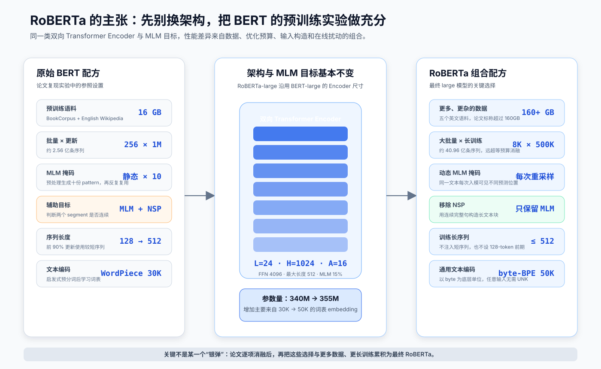
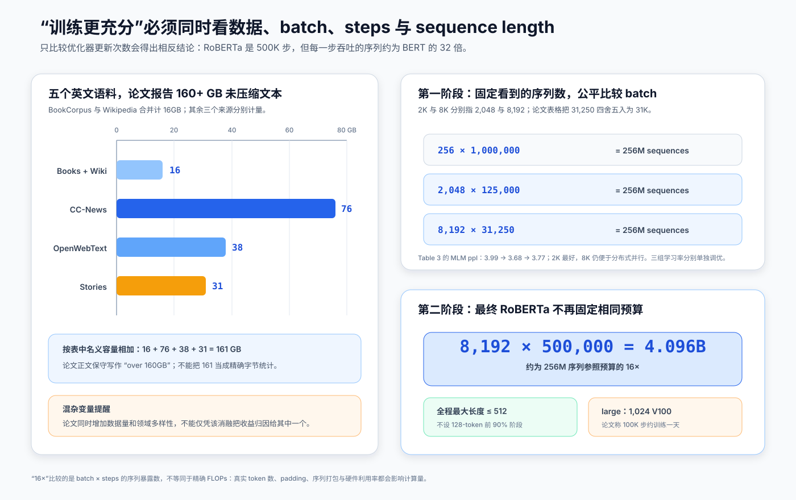
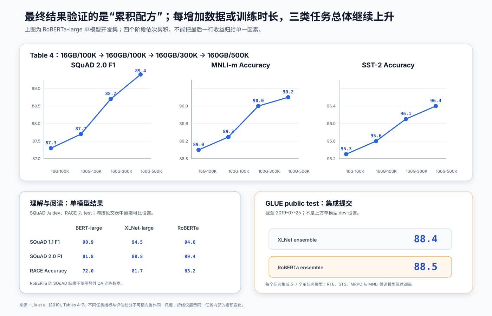

# RoBERTa 原理与实现：不换 BERT 架构，怎样靠训练配方把性能榨出来


> **论文**：RoBERTa: A Robustly Optimized BERT Pretraining Approach<br>
> **作者**：Yinhan Liu、Myle Ott、Naman Goyal、Jingfei Du、Mandar Joshi、Danqi Chen、Omer Levy、Mike Lewis、Luke Zettlemoyer、Veselin Stoyanov<br>
> **首次公开**：2019 年 7 月 26 日<br>
> **关键词**：BERT、Masked Language Model、动态掩码、Next Sentence Prediction、大批量预训练、byte-level BPE、复现实验<br>
> **原文与实现**：[arXiv 摘要](https://arxiv.org/abs/1907.11692) · [论文 PDF](https://arxiv.org/pdf/1907.11692) · [fairseq 官方 RoBERTa](https://github.com/facebookresearch/fairseq/tree/main/examples/roberta) · [模型接口源码](https://github.com/facebookresearch/fairseq/blob/main/fairseq/models/roberta/hub_interface.py)<br>
> **本文代码**：[零依赖 RoBERTa 训练机制最小实现](code/roberta_minimal.py)<br>
> **前置阅读**：[BERT 原理导读](01_BERT_2018_原理.md)

RoBERTa 最容易被误解成“BERT 换了一个更强的结构”。事实上，它最有影响力的判断恰好相反：**在比较一种新预训练方法是否更好之前，应先确认旧方法已经被充分训练。**

作者固定 BERT 的 Transformer Encoder 和 Masked Language Model（MLM）主目标，逐项检查掩码时机、输入构造、NSP、大批量、序列长度、文本编码、语料规模和训练时长。最后得到的不是一个新 Block，而是一套更强的 BERT 预训练配方：

1. 每次读取样本时动态生成 MLM 掩码；
2. 移除 Next Sentence Prediction（NSP）；
3. 用完整连续句打包最长 512-token 输入；
4. 使用更大的 batch，并为大 batch 重新调学习率；
5. 改用约 50K 的 byte-level BPE；
6. 把语料从约 16GB 扩到 160GB 以上，再训练到 500K 步。

一句话概括：

> **RoBERTa 不是“另一个 BERT 架构”，而是一次把变量拆开测量、再把有效训练选择累积起来的 BERT 复现与优化研究。**

---

## 1. 一分钟抓住 RoBERTa

### 1.1 什么基本没变

最终 RoBERTa-large 沿用 BERT-large 的主体尺寸：

| 项目 | BERT-large | RoBERTa-large | 是否改变核心主干 |
|---|---:|---:|---|
| Transformer Encoder 层数 $L$ | 24 | 24 | 否 |
| 隐藏维度 $H$ | 1,024 | 1,024 | 否 |
| Attention 头数 $A$ | 16 | 16 | 否 |
| 单头维度 | 64 | 64 | 否 |
| FFN 中间维度 | 4,096 | 4,096 | 否 |
| 最大序列长度 | 512 | 512 | 否 |
| 主要预训练目标 | MLM | MLM | 否 |
| 词表 | 30K WordPiece | 50K byte-level BPE | 是 |
| 辅助目标 | NSP | 无 NSP | 是 |
| 参数量 | 约 340M | 355M | 主要因词表变大 |

这里的“架构不变”是论文用来做科学比较的近似说法：Encoder Block、层数、宽度和 MLM 头没有换；但词表 embedding 变大、预训练输入不再依赖 NSP 段对，参数量和输入接口细节当然不是逐字节相同。

### 1.2 什么真正变了



**读图要点：**

1. 中间的双向 Transformer Encoder 沿用 BERT-large 的 `24 × 1024 × 16` 尺寸。
2. 左右的差异主要发生在模型看到什么数据、数据怎样被破坏、一次更新看多少序列，以及总共训练多久。
3. `500K < 1M` 不表示 RoBERTa 训练更少：它的 batch 约为 BERT 的 32 倍，而且不使用 BERT 前 90% 更新中的 128-token 短序列阶段。
4. 参数量从约 340M 增至 355M 主要来自更大的 byte-BPE 词表，不是 Encoder 变深或变宽。

RoBERTa 的论文价值不只是一组更高分数。它提醒研究者：

$$
\text{最终效果}
\neq
f(\text{架构或目标名称})
$$

更完整地说，应把它写成：

$$
\text{效果}
=f(\text{架构},\text{目标},\text{数据},\text{tokenizer},
\text{batch},\text{steps},\text{长度分布},\text{优化器},\text{微调协议}).
$$

如果这些变量没有控制好，“新方法优于 BERT”可能只说明 BERT 基线训练得不够充分。

---

## 2. 起点：BERT 的两个预训练目标

RoBERTa 先复现 BERT，因此要从 BERT 的训练样本说起。

### 2.1 Masked Language Model

给定 token 序列 $x=(x_1,\ldots,x_T)$，先从非特殊 token 中均匀选择约 15% 的位置集合 $M$，再构造扰动输入 $\tilde x$：

$$
\tilde x_i =
\begin{cases}
[\text{MASK}], & 80\%,\\
\text{随机词表 token}, & 10\%,\\
x_i, & 10\%,
\end{cases}
\qquad i\in M.
$$

无论选中位置走哪一条扰动分支，监督标签始终是原 token $x_i$：

$$
\mathcal L_{\text{MLM}}
=-
\frac{1}{|M|}
\sum_{i\in M}
\log p_\theta(x_i\mid \tilde x).
$$

未被选中的约 85% 位置仍作为上下文输入模型，但不计算 MLM loss。

### 2.2 Next Sentence Prediction

BERT 把两个 segment 拼接后，再训练一个二分类器判断它们是否在原文中连续：

$$
\mathcal L_{\text{BERT}}
=\mathcal L_{\text{MLM}}+\mathcal L_{\text{NSP}}.
$$

正例来自同一文档的连续片段，负例来自不同文档，二者各占 50%。设计动机是让 `[CLS]` 学会段落关系，从而帮助自然语言推断和问答。

RoBERTa 没有先假设 NSP 一定有害，而是把 **NSP 是否存在** 和 **输入是短自然句还是长文本块** 一起做对照。这一点决定了应该怎样正确阅读它的结论。

---

## 3. 动态 masking：换的是采样时机，不是 80/10/10


### 3.1 BERT 的“静态”并不是每句永远只有一个 mask

原始 BERT 在离线预处理时生成掩码并保存。为了避免同一句话永远只预测相同位置，训练数据被复制 `10` 份，每份使用不同 mask。论文按 BERT 的 `40` 个训练 epoch 换算：一个序列共有 10 种预生成 mask，因此同一种 mask 大约会见到 4 次。

所以准确对比是：

| 策略 | 什么时候采样 | 同一文本可见多少种 pattern | 训练越久时会怎样 |
|---|---|---:|---|
| BERT 静态 masking | 离线预处理 | 有限，论文复现为 10 种 | 重复使用已有 pattern |
| RoBERTa 动态 masking | 每次把样本送入模型 | 不被预处理副本数限制 | 持续得到新预测位置 |

“动态”并不表示每次把更多 token 变成 `<mask>`。两种策略都先选择约 15% 的位置，再执行 80% `<mask>`、10% 随机词、10% 保持原词。

### 3.2 代码：让同一个样本跨 epoch 获得新掩码

配套代码用 `(base_seed, sample_id, epoch)` 生成稳定随机种子，既能每轮变化，又可以复现实验：

```python
def dynamic_mask(tokens, vocabulary, *, sample_id, epoch, base_seed=1907):
    return corrupt_for_mlm(
        tokens,
        vocabulary,
        seed=stable_seed(base_seed, sample_id, epoch),
    )


for epoch in range(3):
    sample = dynamic_mask(
        tokens,
        vocabulary,
        sample_id=42,
        epoch=epoch,
    )
    print(epoch, sample.corrupted, sample.labels)
```

核心 `corrupt_for_mlm()` 做四件事：排除 `<s>`、`</s>` 等特殊 token；选择约 15% 候选位置；执行 80/10/10；只在选中位置保留训练标签。完整实现还提供了 `static_mask()`，它用 `epoch % 10` 演示有限 pattern 的循环复用。

### 3.3 动态掩码单项提升并不大

论文的 BERT-base 复现实验如下，SQuAD 报 F1，其余报 accuracy；每格为 5 个随机种子的中位数：

| masking | SQuAD 2.0 | MNLI-m | SST-2 |
|---|---:|---:|---:|
| static | 78.3 | **84.3** | 92.5 |
| dynamic | **78.7** | 84.0 | **92.9** |

动态 masking 在两项上高 `0.4`，在 MNLI-m 上反而低 `0.3`。论文自己的结论是 **comparable or slightly better**。因此不能把最终 RoBERTa 的全部收益归功于动态掩码；它更像一种与长训练自然匹配、又省去离线复制的稳健数据管线选择。

---

## 4. 去掉 NSP：真正关键的是“目标 + 输入格式”一起比较

### 4.1 四种输入构造

论文固定 BERT-base、Books + Wikipedia、`1M` 步、batch `256`，比较四种设置：

| 设置 | 输入怎样构造 | NSP | 最长输入与边界 |
|---|---|---|---|
| `SEGMENT-PAIR` | 两个 segment，每段可含多个自然句 | 有 | 合计小于 512 |
| `SENTENCE-PAIR` | 每个 segment 恰好一个自然句 | 有 | 通常很短；增大 batch 保持 token 数接近 |
| `FULL-SENTENCES` | 从一个或多个文档连续取完整句并装到 512 以内 | 无 | 可跨文档，边界加 separator |
| `DOC-SENTENCES` | 与上一项相同，但不跨文档 | 无 | 文档尾可能短，动态调 batch 保持 token 数 |

结果如下：

| 输入设置 | SQuAD 1.1 / 2.0 F1 | MNLI-m | SST-2 | RACE |
|---|---:|---:|---:|---:|
| `SEGMENT-PAIR + NSP` | 90.4 / 78.7 | 84.0 | **92.9** | 64.2 |
| `SENTENCE-PAIR + NSP` | 88.7 / 76.2 | 82.9 | 92.1 | 63.0 |
| `FULL-SENTENCES`，无 NSP | 90.4 / 79.1 | **84.7** | 92.5 | 64.8 |
| `DOC-SENTENCES`，无 NSP | **90.6 / 79.7** | **84.7** | 92.7 | **65.6** |

可以读出三层结论：

1. **短句对明显变差。** `SENTENCE-PAIR + NSP` 的问题不一定是 NSP，而很可能是输入太短，模型缺少学习长程依赖的机会。
2. **保留长文本块时，去掉 NSP 不会伤害结果。** 无 NSP 的两个设置整体匹配或超过原始 segment-pair。
3. **单文档块略好，但工程上更麻烦。** `DOC-SENTENCES` 会造成变长 batch；为便于稳定比较，最终 RoBERTa 选择了可跨文档的 `FULL-SENTENCES`。

因此“RoBERTa 证明 NSP 无用”过于绝对。更准确的表述是：

> 在论文测试的 BERT-base 配置中，只要保留足够长的连续文本输入，移除 NSP 能匹配或略微改善下游结果；原 BERT 中删除 NSP 后退化，也可能与输入构造方式混在了一起。

### 4.2 无 NSP 不等于不能处理句对

NSP 是**预训练辅助损失**，不是下游句对分类的必要接口。官方 fairseq 模型仍然能编码两个句子：

```text
单句：<s> sentence A </s>
句对：<s> sentence A </s> </s> sentence B </s>
```

分隔符给 Self-Attention 提供边界；微调时再在首 token 表示上加 NLI、相似度或分类头即可。换言之，RoBERTa 去掉的是“预训练时猜两段是否连续”，不是“句子之间不能交互”。

### 4.3 代码：完整句打包

配套代码中的 `pack_full_sentences()` 以自然句为不可切分单元，允许跨文档并插入 `</s>`：

```python
documents = [
    [["A", "short", "sentence", "."], ["Another", "one", "."]],
    [["A", "new", "document", "."]],
]

blocks = pack_full_sentences(documents, max_length=13)
# ['<s>', 'A', 'short', 'sentence', '.', 'Another', 'one', '.',
#  '</s>', 'A', 'new', 'document', '.']
```

教学实现遇到单个超长句会直接报错，以免悄悄破坏“完整句”假设；真实预训练管线需要显式定义超长句截断、文档边界、padding 和分布式分片策略。

---

## 5. 大 batch：要控制总样本量，还要重新调学习率

BERT-base 的参照训练量是：

$$
1{,}000{,}000\ \text{steps}
\times 256\ \text{sequences/step}
=256\ \text{million sequences}.
$$

若用梯度累积或更多设备保持看到的序列数近似不变，则：

$$
1{,}000{,}000\times256
=125{,}000\times2{,}048
=31{,}250\times8{,}192.
$$

论文把后两种 batch 简写为 `2K`、`8K`，把最后的更新数写成约 `31K`。



**读图要点：**

1. 右上是公平的 batch 消融：三组看到约相同数量的序列。
2. 右下才是最终 RoBERTa：`8K × 500K`，已经不再维持与 BERT 相同的数据暴露量。
3. 左侧语料的名义容量相加为 161GB，论文正文统一表述为 160GB 以上；这不是精确字节账本。
4. 数据量和数据多样性同时改变，论文明确承认二者在该实验中被混杂，不能分开归因。

### 5.1 等预算 batch 消融

| batch | steps | 调优后的 peak LR | held-out MLM ppl ↓ | MNLI-m ↑ | SST-2 ↑ |
|---:|---:|---:|---:|---:|---:|
| 256 | 1M | $1\times10^{-4}$ | 3.99 | 84.7 | 92.7 |
| 2,048 | 125K | $7\times10^{-4}$ | **3.68** | **85.2** | **92.9** |
| 8,192 | 约 31K | $1\times10^{-3}$ | 3.77 | 84.6 | 92.8 |

这里有两个常被省略的细节：

- 不是 batch 越大三项指标就严格单调越好；本表中 `2K` 优于 `8K`。
- 每个 batch 都单独调了学习率。若只放大 batch 而沿用旧学习率，比较的是“未调优的大 batch”，不是大 batch 本身。

作者最终使用 `8K`，除了总体表现仍有竞争力，还因为它更容易用数据并行扩展。没有足够多 GPU 时，也可以在本地累计多个 micro-batch 的梯度后再更新参数；但梯度累积只能模拟优化 batch，不能凭空提供大规模硬件吞吐。

### 5.2 为什么 500K 步反而是“训练更久”

按 `8K = 8,192` 计算：

$$
500{,}000\times8{,}192
=4.096\ \text{billion sequences},
$$

约为 BERT `256M` 序列参照的 `16` 倍。这个倍数只比较 `batch × steps`，不等于精确 FLOPs；BERT 前 90% 更新主要用长度 128，而 RoBERTa 使用最长 512 的完整句文本块，真实 token 计算差异更大，也会受 padding 和打包效率影响。

配套代码提供预算换算：

```python
bert = TrainingBudget(batch_size=256, steps=1_000_000)

steps_for_equal_sequences(bert, 2_048)  # 125_000
steps_for_equal_sequences(bert, 8_192)  # 31_250
```

---

## 6. 长序列训练：不能只看最大长度都是 512

BERT 和 RoBERTa 的配置都写着最大长度 `512`，但训练长度分布不同：

| 训练阶段 | BERT | RoBERTa |
|---|---|---|
| 前 90% 更新 | 主要使用长度 128 | 不设置 128-token 阶段 |
| 后 10% 更新 | 长度 512 | 继续使用最长 512 的完整句块 |
| 随机短序列 | 会注入 | 不随机注入 |
| 输入内容 | segment pair | full sentences |

Self-Attention 的主要计算随序列长度 $T$ 近似按 $O(T^2)$ 增长。把长度从 128 增至 512，会让注意力矩阵元素数放大：

$$
\left(\frac{512}{128}\right)^2=16.
$$

这解释了 BERT 为什么先用短序列节省计算，也解释了 RoBERTa 的“更充分”为什么不应只用更新步数衡量。RoBERTa 让模型在更多更新中直接面对长程依赖，代价是明显更高的训练计算。

“只训练 full-length sequences”也不应机械理解为每个样本都恰好 512 个有效 token。论文的 `FULL-SENTENCES` 定义是把完整句连续装到**至多** 512；文档、句子和批处理边界仍可能造成长度差异。

---

## 7. byte-level BPE：通用覆盖优先于轻微的单项收益

### 7.1 从 Unicode 字符退到 byte

普通子词算法先选择基础符号，再反复合并高频相邻单元。若基础符号是 Unicode 字符，一个多语言、大领域语料中的字符集合本身就可能占掉大量词表。

RoBERTa 沿用 GPT-2 的 byte-level BPE 思路：先把文本表示为 UTF-8 bytes，再通过可逆映射和 BPE 合并得到子词。256 个 byte 足以覆盖任意输入字节序列，因此：

- 输入不需要因为“新字符”落到 `<unk>`；
- 不依赖复杂的启发式预分词规则；
- 一个约 50K 的词表可以统一覆盖标点、空格变化、罕见字符和不同脚本。

需要加上两点限定：

1. “无 `<unk>`”表示**编码层可覆盖任意字节**，不表示模型理解所有语言、拼写或乱码。
2. byte-BPE 仍会把常见 byte 序列合并成子词；它不是把每段文本永远拆成单 byte。

### 7.2 为什么参数会增加

若输入 embedding 与输出词表矩阵都依赖词表大小 $V$，词表由约 30K 增至约 50K，就会增加一大块参数。论文估计 Base / Large 分别多约 15M / 20M 参数，官方 checkpoint 列出的总量为：

| 模型 | 参数量 |
|---|---:|
| `roberta.base` | 125M |
| `roberta.large` | 355M |

论文早期实验发现 byte-BPE 在个别任务上甚至略差，但作者认为通用、无未知输入的编码方案更值得采用。这再次说明 RoBERTa 的每个选择并非都因单项 benchmark 大胜；有些选择是工程一致性与覆盖范围的权衡。

### 7.3 空格是 tokenization 的一部分

GPT-2 / RoBERTa byte-BPE 会把前导空格编码进 token 形态，因此 `"world"` 与 `" world"` 可能得到不同 token id。官方接口会负责在句子内部保留正确空格。自己拼 token 时若忽略这一点，同一个单词在句首和句中就会被错误编码。

---

## 8. 数据：从 16GB 到 160GB 以上

论文使用五个英文语料来源：

| 语料 | 规模 | 内容 |
|---|---:|---|
| BookCorpus + English Wikipedia | 16GB | 原 BERT 使用的书籍与百科文本 |
| CC-News | 76GB | 2016-09 至 2019-02 抓取的 6,300 万篇英文新闻，过滤后容量 |
| OpenWebText | 38GB | 对 GPT-2 WebText 思路的开放复现，来自 Reddit 至少 3 个赞的外链内容 |
| Stories | 31GB | 从 Common Crawl 过滤出的故事风格文本 |
| 合计 | 160GB 以上 | 表中名义容量相加为 161GB |

更多数据同时带来两种可能收益：

- **更多独立 token 和事实覆盖**，降低对同一训练样本的重复记忆；
- **更丰富领域**，让新闻、网页、书籍、百科和叙事文本互补。

但论文没有只扩大容量而保持领域完全不变，因此不能从 Table 4 判断“容量”和“多样性”各自贡献多少。作者在脚注中明确把这个问题留给后续研究。

---

## 9. 最终预训练配置

### 9.1 优化器与学习率

RoBERTa 使用 Adam、线性 warmup 和线性衰减。令总步数为 $S$、warmup 步数为 $W$、峰值学习率为 $\eta_{\max}$：

$$
\eta(s)=
\begin{cases}
\eta_{\max}\dfrac{s}{W}, & 0\le s\le W,\\[6pt]
\eta_{\max}\dfrac{S-s}{S-W}, & W<s\le S.
\end{cases}
$$

论文 Appendix B 给出的配置为：

| 超参数 | RoBERTa-large | RoBERTa-base |
|---|---:|---:|
| layers / hidden / heads | 24 / 1,024 / 16 | 12 / 768 / 12 |
| FFN inner hidden | 4,096 | 3,072 |
| dropout / attention dropout | 0.1 / 0.1 | 0.1 / 0.1 |
| warmup steps | 30K | 24K |
| peak learning rate | $4\times10^{-4}$ | $6\times10^{-4}$ |
| batch size | 8K | 8K |
| weight decay | 0.01 | 0.01 |
| max steps | 500K | 500K |
| Adam $\epsilon$ | $10^{-6}$ | $10^{-6}$ |
| Adam $\beta_1,\beta_2$ | 0.9, 0.98 | 0.9, 0.98 |
| gradient clipping | 0.0 | 0.0 |

作者特别指出，大 batch 训练对 Adam 的 $\epsilon$ 很敏感，把 $\beta_2$ 设为 `0.98` 也改善了稳定性。优化器里看似不起眼的常数，同样属于必须报告和调优的实验变量。

配套代码可计算 large 模型的 schedule：

```python
for step in (0, 15_000, 30_000, 265_000, 500_000):
    lr = linear_warmup_decay_lr(
        step,
        warmup_steps=30_000,
        total_steps=500_000,
        peak_lr=4e-4,
    )
    print(step, lr)
```

输出从 `0` 线性升至 `4e-4`，再在第 `500K` 步降回 `0`。

### 9.2 硬件信息怎样解读

论文用混合精度在 DGX-1 集群上训练。RoBERTa-large 的 `16GB / 100K` 初始实验使用 `1,024` 张 V100，约一天完成。

这条信息说明大 batch 在当时依赖大规模数据并行，也暴露了论文的复现门槛。它不意味着在 8 张卡上简单运行同样壁钟时间就能得到同样结果；梯度累积可以对齐优化 batch，却无法对齐吞吐、通信、数据读取和总训练时间。

---

## 10. 累积结果：数据与训练时长都没有饱和



### 10.1 Table 4 是一张累积消融表

| RoBERTa-large 阶段 | 数据 | batch | steps | SQuAD 1.1 / 2.0 F1 | MNLI-m | SST-2 |
|---|---:|---:|---:|---:|---:|---:|
| Books + Wiki | 16GB | 8K | 100K | 93.6 / 87.3 | 89.0 | 95.3 |
| + additional data | 160GB | 8K | 100K | 94.0 / 87.7 | 89.3 | 95.6 |
| + pretrain longer | 160GB | 8K | 300K | 94.4 / 88.7 | 90.0 | 96.1 |
| + pretrain even longer | 160GB | 8K | 500K | **94.6 / 89.4** | **90.2** | **96.4** |

每一行继承上一行的选择。可以说：

- 相同步数下，16GB 扩到 160GB 后三类任务都上升；
- 固定 160GB，从 100K 训练到 300K、500K 后又继续上升；
- 最长训练没有表现出明显过拟合，作者判断继续训练可能仍有收益。

不能说：

- `89.4 - 87.3 = 2.1` 全部由更多数据带来；其中包含额外数据和更长训练；
- 最终收益全部来自动态 masking 或删除 NSP；Table 4 的第一行已经累积了前述训练配方。

### 10.2 GLUE 单模型开发集

最终 RoBERTa-large 对每个任务单独微调，报告 5 个随机种子的中位数：

| 模型 | MNLI m/mm | QNLI | QQP | RTE | SST-2 | MRPC | CoLA | STS-B |
|---|---:|---:|---:|---:|---:|---:|---:|---:|
| BERT-large | 86.6 / — | 92.3 | 91.3 | 70.4 | 93.2 | 88.0 | 60.6 | 90.0 |
| XLNet-large | 89.8 / — | 93.9 | 91.8 | 83.8 | 95.6 | 89.2 | 63.6 | 91.8 |
| RoBERTa | **90.2 / 90.2** | **94.7** | **92.2** | **86.6** | **96.4** | **90.9** | **68.0** | **92.4** |

这里是最干净的核心比较：单任务、单模型、开发集。RoBERTa 没有用新的预训练目标，却整体超过论文引用的 BERT-large 与 XLNet-large 结果。

### 10.3 GLUE 测试榜需要加上实验协议

论文截至 2019-07-25 的 GLUE public test 平均分为：

| 提交 | 平均分 |
|---|---:|
| XLNet ensemble | 88.4 |
| RoBERTa ensemble | **88.5** |

但这不是上一节的单模型设置：每个任务集成 `5–7` 个模型；RTE、STS、MRPC 从 MNLI 微调 checkpoint 继续训练；QNLI 测试提交还采用了当时榜单常见的 ranking 形式。论文诚实地报告了这些 task-specific modifications。

因此，若要研究预训练配方，应优先看单模型 dev 表；若要复现 88.5，则必须复现集成和任务专用协议，不能只加载一个 `roberta.large`。

### 10.4 SQuAD 与 RACE

| 模型 | SQuAD 1.1 EM / F1（dev） | SQuAD 2.0 EM / F1（dev） | RACE Accuracy（test） |
|---|---:|---:|---:|
| BERT-large | 84.1 / 90.9 | 79.0 / 81.8 | 72.0 |
| XLNet-large | 89.0 / 94.5 | 86.1 / 88.8 | 81.7 |
| RoBERTa | 88.9 / **94.6** | **86.5 / 89.4** | **83.2** |

RoBERTa 的 SQuAD 结果只使用给定 SQuAD 训练集，不加入额外 QA 数据。RACE 则把每个候选答案分别与问题、文章拼接，编码四条序列，再用各自首 token 表示做四选一分类；问题—答案部分超过 128 会截断，总输入最多 512。

---

## 11. 下游微调：仍然是 BERT 式“加小头、全参数更新”

RoBERTa 改的是预训练，不是把 fine-tuning 换成 frozen feature extractor。对分类任务，令最后一层首 token 表示为 $h_0$：

$$
z=W_2\,g(W_1h_0+b_1)+b_2,
\qquad
p(y\mid x)=\operatorname{softmax}(z).
$$

训练分类头时也更新 Encoder 全部参数。问答任务则从每个 token 隐藏状态预测 span 的开始、结束位置；SQuAD 2.0 另外联合训练“是否可回答”的二分类器。

Appendix C 的 large 微调配置为：

| 超参数 | RACE | SQuAD | GLUE |
|---|---:|---:|---:|
| learning rate | $1\times10^{-5}$ | $1.5\times10^{-5}$ | $\{1,2,3\}\times10^{-5}$ |
| batch size | 16 | 48 | 16 或 32 |
| weight decay | 0.1 | 0.01 | 0.1 |
| max epochs | 4 | 2 | 10 |
| warmup ratio | 0.06 | 0.06 | 0.06 |

GLUE 对每组设置运行 5 个随机种子，并用开发集指标选择配置。小数据任务对随机初始化敏感，因此只报一次最好结果会高估可复现性。

官方 fairseq 接口的句对推理示意如下：

```python
import torch

roberta = torch.hub.load("pytorch/fairseq", "roberta.large.mnli")
roberta.eval()

tokens = roberta.encode(
    "RoBERTa keeps the BERT encoder.",
    "RoBERTa changes the pretraining recipe.",
)
label_id = roberta.predict("mnli", tokens).argmax().item()
```

这段代码会下载大模型和 fairseq 依赖，不属于本文零依赖自检；它用于说明真实 checkpoint 的输入与任务头接口。

---

## 12. 运行本文最小实现

代码不训练 355M 参数模型，而是把论文最容易混淆、又可以本地验证的训练机制做成标准库实现：

- `corrupt_for_mlm()`：15% 位置与 80/10/10；
- `dynamic_mask()` / `static_mask()`：无限重采样与 10-pattern 循环；
- `pack_full_sentences()`：完整句打包和文档分隔符；
- `TrainingBudget`：batch、steps、序列数与最大 token 预算；
- `linear_warmup_decay_lr()`：线性 warmup 与衰减；
- `run_self_checks()`：标签、mask、预算和学习率端点断言。

运行：

```bash
python3 papers/to-2026/code/roberta_minimal.py
```

输出会依次展示同一样本在 3 个 epoch 的不同掩码、跨文档完整句打包、三种 batch 的等序列预算，以及 large 模型的学习率：

```text
Equal sequence budget
batch= 256 -> steps=1,000,000
batch=2,048 -> steps=  125,000
batch=8,192 -> steps=   31,250

RoBERTa-large learning-rate schedule
step=      0: lr=0.00000000
step= 30,000: lr=0.00040000
step=500,000: lr=0.00000000
```

为了让短样例必有训练标签，教学实现固定选择 `round(候选数 × 15%)` 个位置；大规模框架也可能对每个位置做 Bernoulli 采样，或设置每序列最大预测数。两者在大数据上的期望相同，但逐样本结果不会完全一致。

---

## 13. 这篇论文最重要的方法论贡献

### 13.1 强基线本身就是研究成果

RoBERTa 没有靠一个新名词掩盖实验变量，而是问：

- 同一个目标能否在更多数据和训练下继续变强？
- 删除一个目标时，是否同时意外改变了输入长度？
- 大 batch 的学习率是否经过重新调优？
- 测试榜提升来自预训练、单任务微调、多任务迁移还是 ensemble？

这套问题后来成为预训练研究的基本检查表。一个方法若只与训练不足的 BERT 比较，很难证明收益来自新架构或新目标。

### 13.2 数据管线属于模型定义

动态 masking、完整句打包、文档边界和 byte-BPE 看起来像“预处理细节”，却会直接改变模型收到的监督和上下文。现代基础模型的可复现定义不应只有层数、宽度和 loss 公式，还应包含：

$$
\text{model recipe}
=\text{network} + \text{data construction} + \text{optimizer} + \text{budget}.
$$

### 13.3 “旧目标 + 更好 recipe”可以击败“新目标 + 弱基线”

2019 年许多工作试图替换 BERT 的 MLM 或重排预测因子。RoBERTa 表明，在相同 BERT MLM 目标下，只要训练选择充分，也能达到或超过当时的强方法。这并不证明其他目标没有价值，只证明比较必须给每个目标相称的调优和预算。

---

## 14. 局限与不应过度外推的结论

### 14.1 最终配方不是完全正交的因果消融

论文对 dynamic masking、输入格式、batch 做了较清楚的控制实验，但最终 Table 4 是累积配方。尤其是：

- 数据容量与领域多样性一起增加；
- 训练步数增加也意味着数据重复方式改变；
- tokenizer 选择带来约 15M–20M 额外参数；
- 全长序列改变了真实 token 计算预算。

所以论文证明了“组合 recipe 强”，没有给每个因素分配一个可相加的精确贡献值。

### 14.2 计算门槛很高

`1,024` 张 V100、160GB 以上数据、8K batch 和 500K 步让完整复现超出多数团队能力。大算力也意味着研究者更难广泛搜索超参数，论文开头正是把这个问题列为比较预训练方法的障碍。

### 14.3 最终榜单不是纯预训练比较

GLUE 88.5 使用模型集成、从 MNLI checkpoint 迁移部分任务和 QNLI 专用 ranking。论文已披露这些细节，但二手资料若只摘一个分数，就会把预训练、微调技巧和 ensemble 混为一谈。

### 14.4 byte-BPE 的通用覆盖不等于所有语言都公平

模型只在五个英文语料上预训练。任何字节都可编码，只解决“输入能否表示”，没有解决训练语料是否覆盖某种语言、脚本、方言或领域。

### 14.5 Encoder-only 与 512 长度边界仍在

RoBERTa 仍是双向 Encoder：

- 标准 Self-Attention 对长度是 $O(T^2)$；
- 预训练最大长度仍为 512；
- MLM 适合理解与填空，不是从左到右的长文本生成目标；
- 它没有解决长文档、检索、知识更新或自回归生成问题。

### 14.6 论文是 2019 年的状态快照

GLUE、SQuAD、RACE 的榜单比较都带有当时日期和协议。今天应把这些数字当作论文历史证据，不应将“2019 年 SOTA”写成永不过期的当前排名。

---

## 15. 常见问题

### Q1：RoBERTa 就是 BERT 加更多数据吗？

不是。更多数据是最终配方之一；同时还有动态 masking、删除 NSP、full-sentences、全程长序列、更大且调过学习率的 batch、更长训练和 byte-BPE。只扩大语料不能自动复现 RoBERTa。

### Q2：去掉 NSP 后，模型还能做 NLI 或句对相似度吗？

能。用 `</s> </s>` 分隔两个句子，再微调句对分类头即可。NSP 是一个预训练损失，不是句对输入能力。

### Q3：动态 masking 是每次把 15% 全替换成 `<mask>` 吗？

不是。先选 15% 位置；其中 80% 变 `<mask>`、10% 变随机 token、10% 输入保持原样。三种情况都预测原 token。

### Q4：RoBERTa 只有 500K 步，为什么说 BERT 训练不足？

更新步数不能脱离 batch 和长度看。RoBERTa 每步约 8K 条序列，BERT 是 256；按 `batch × steps`，最终 RoBERTa 约看 40.96 亿条序列，BERT 参照约 2.56 亿条，而且 RoBERTa 不使用短序列前期。

### Q5：byte-level BPE 是否真正没有 OOV？

在“任意输入字节都能编码”的意义上是。它不保证罕见文本只需一个 token，也不保证模型理解训练中没见过的语言或概念。

### Q6：RoBERTa 能像 GPT 一样生成文章吗？

不适合作为标准自回归生成器。它的 Encoder 可以同时看左右上下文，训练目标是恢复被遮盖 token；逐 token 生成需要不同的因果注意力和训练方式。

---

## 16. 总结

RoBERTa 可以压缩成六个判断：

1. **保持 BERT Encoder 与 MLM 主目标。** 先把强基线做强，再讨论新目标是否必要。
2. **mask 在线生成。** 同一文本随训练持续提供新的预测位置，但单项收益只是相当或略好。
3. **去掉 NSP，同时保留长上下文。** 短句对变差说明输入构造与目标不能混在一起解释。
4. **大 batch 要在等预算下比较并重新调 LR。** 最终训练再主动扩大总预算。
5. **更多、更杂的数据和更久训练都继续带来收益。** 最长的 500K 实验仍未明显饱和。
6. **实验协议是结果的一部分。** 单模型 dev、测试集 task-specific 技巧和 ensemble 必须分开报告。

真正值得从 RoBERTa 带走的，不是“删除 NSP”这一条口号，而是一种更成熟的研究习惯：

> **当一个新模型看起来赢了，先把架构、数据、tokenizer、优化预算和评估协议逐项对齐；否则我们可能只是在给训练更充分的一方重新命名。**

---

## 参考资料

1. Liu et al., 2019. [RoBERTa: A Robustly Optimized BERT Pretraining Approach](https://arxiv.org/abs/1907.11692).
2. Liu et al., 2019. [RoBERTa 论文 PDF：表格、附录与训练超参数](https://arxiv.org/pdf/1907.11692).
3. Facebook AI Research. [fairseq RoBERTa 官方模型、结果与使用示例](https://github.com/facebookresearch/fairseq/tree/main/examples/roberta).
4. Facebook AI Research. [RoBERTa Hub Interface：byte-BPE、句对分隔与特征接口](https://github.com/facebookresearch/fairseq/blob/main/fairseq/models/roberta/hub_interface.py).
5. Devlin et al., 2018/2019. [BERT: Pre-training of Deep Bidirectional Transformers for Language Understanding](https://arxiv.org/abs/1810.04805).
