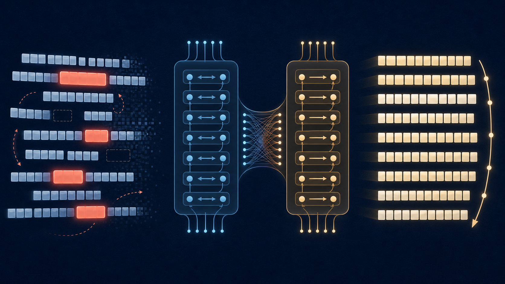
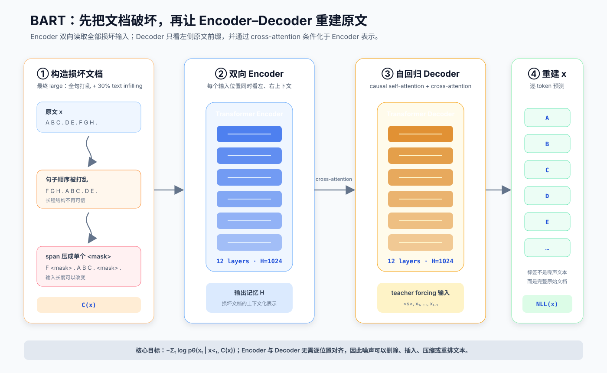
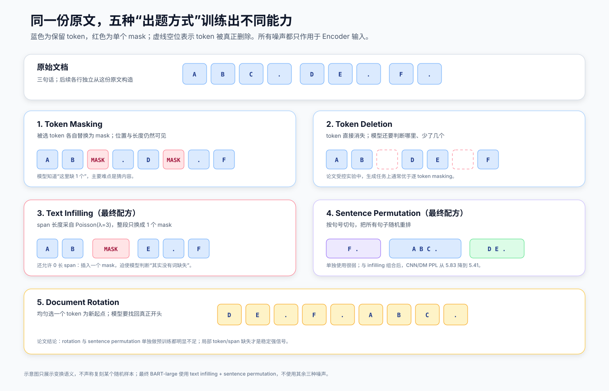
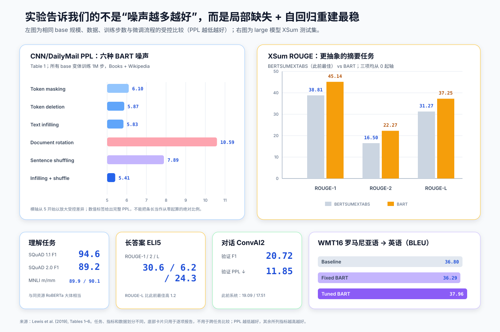
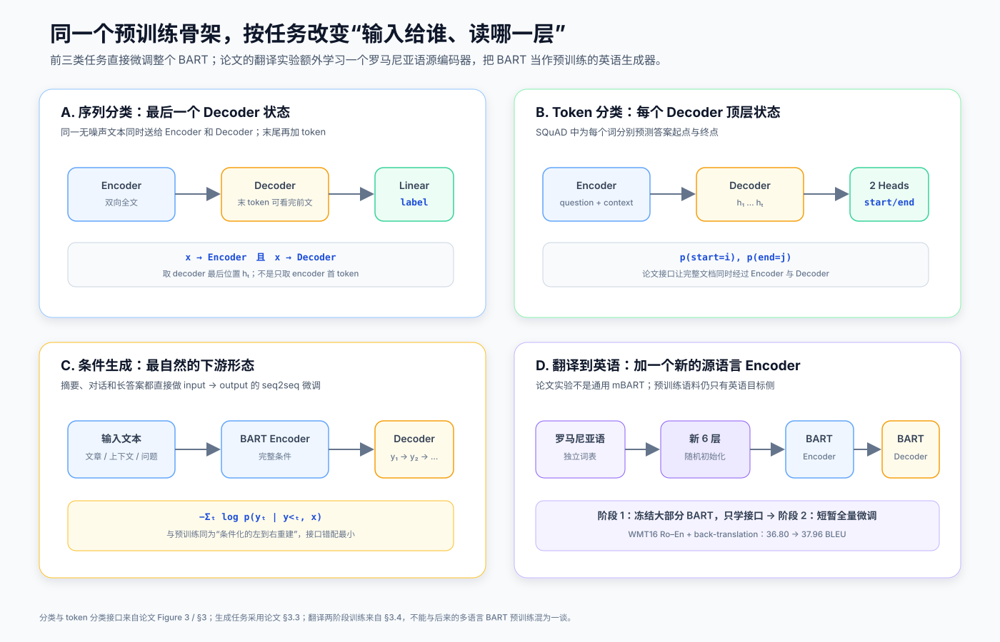

# BART 原理与实现：把文本“弄坏再修好”，怎样统一理解与生成



> **论文**：BART: Denoising Sequence-to-Sequence Pre-training for Natural Language Generation, Translation, and Comprehension<br>
> **作者**：Mike Lewis、Yinhan Liu、Naman Goyal、Marjan Ghazvininejad、Abdelrahman Mohamed、Omer Levy、Ves Stoyanov、Luke Zettlemoyer<br>
> **首次公开**：2019 年 10 月 29 日（后发表于 ACL 2020）<br>
> **关键词**：Denoising Autoencoder、Encoder–Decoder、Text Infilling、Sentence Permutation、条件生成、摘要<br>
> **原文与实现**：[arXiv 摘要](https://arxiv.org/abs/1910.13461) · [论文 PDF](https://arxiv.org/pdf/1910.13461) · [ACL Anthology](https://aclanthology.org/2020.acl-main.703/) · [fairseq 官方 BART](https://github.com/facebookresearch/fairseq/tree/main/examples/bart) · [去噪数据集源码](https://github.com/facebookresearch/fairseq/blob/main/fairseq/data/denoising_dataset.py)<br>
> **本文代码**：[零依赖 BART 去噪机制最小实现](code/bart_minimal.py)<br>
> **前置阅读**：[Transformer 原理](00_Transformer_2017_原理.md) · [BERT 原理](01_BERT_2018_原理.md) · [GPT 原理](02_GPT_2018_原理.md) · [RoBERTa 原理](33_RoBERTa_2019_原理.md)

BART 的出发点很朴素：拿到一篇完整文档 $x$，先用噪声函数 $C$ 把它破坏成 $C(x)$，再训练一个 Transformer Encoder–Decoder 复原 $x$。

真正重要的是这两个角色怎样分工：

- **Encoder 双向阅读损坏后的全文**，负责判断文档大意、缺失内容与正确结构；
- **Decoder 从左到右生成原文**，每一步既看已经生成的前缀，也通过 cross-attention 读取 Encoder；
- **预训练和生成微调使用同一种条件自回归接口**，摘要、对话、长答案不必临时给 BERT 式编码器“接一个陌生解码器”。

一句话概括：

> **BART 把 BERT 的双向理解能力和 GPT 的自回归生成能力装进标准 seq2seq Transformer，再用“任意损坏 → 完整重建”把两半一起预训练。**

它的创新不在新 Attention 公式，而在一个足够通用的预训练问题定义。这个定义允许输入、输出不等长，也允许删除 token、压缩 span、打乱句子乃至旋转整篇文档。

---

## 1. 一分钟抓住 BART

### 1.1 BERT、GPT 与 BART 到底差在哪

| 模型 | 主体结构 | 预训练时能用的上下文 | 预测方式 | 天然擅长 |
|---|---|---|---|---|
| BERT | Encoder-only | 被 mask 位置的左右文 | 多个 mask 基本独立预测 | 分类、抽取、表示学习 |
| GPT | Decoder-only | 每个位置的左侧前缀 | 从左到右自回归 | 无条件 / 前缀续写 |
| BART | Encoder–Decoder | Encoder 看损坏全文；Decoder 看左前缀与 Encoder | 条件自回归重建完整序列 | 理解 + 条件生成 |

“BART”来自 **Bidirectional and Auto-Regressive Transformers**：Bidirectional 对应 Encoder，Auto-Regressive 对应 Decoder。



**读图要点：**

1. 噪声只破坏 Encoder 输入 $C(x)$，训练标签始终是原文 $x$。
2. Decoder 的第 $t$ 步只能看原文前缀 $x_{<t}$，不能偷看 $x_t$ 及以后位置。
3. Encoder 输入与 Decoder 输出无需逐位置对齐，所以一个长 span 可以被压成一个 `<mask>`。
4. cross-attention 把“理解损坏文档”与“逐步写回原文”连接起来。

### 1.2 Base 与 Large

| 配置 | Encoder 层 | Decoder 层 | 隐藏维度 | 官方模型参数量 |
|---|---:|---:|---:|---:|
| BART-base | 6 | 6 | 768 | 约 140M |
| BART-large | 12 | 12 | 1,024 | 约 400M |

论文使用标准 Transformer seq2seq 主干，主要改动是沿用 GPT 风格的 GELU，并以 $\mathcal N(0,0.02)$ 初始化参数。每个 Decoder 层除了 causal self-attention，还有一次对 Encoder 最终隐状态的 cross-attention。

论文指出，同等尺寸下 BART 比 BERT 约多 10% 参数，主要因为 Decoder 多了 cross-attention；另一方面，BERT 在词预测前有额外 FFN，而 BART 没有。官方发布页把两档模型近似标为 140M 与 400M，因此不宜把不同实现或配置文件中的个位数参数差异当作论文结论。

---

## 2. 核心目标：条件化的完整文档重建

设原始 token 序列为：

$$
x=(x_1,x_2,\ldots,x_T),
$$

噪声函数生成损坏输入：

$$
\tilde x=C(x).
$$

Encoder 把 $\tilde x$ 映射成上下文化记忆：

$$
H=\operatorname{Encoder}_\theta(\tilde x).
$$

Decoder 以 teacher forcing 逐 token 预测原文，最小化：

$$
\mathcal L_{\text{BART}}
=-
\sum_{t=1}^{T}
\log p_\theta\left(x_t\mid x_{<t},C(x)\right).
$$

这条式子有三个不能忽略的条件：

1. $C(x)$ 是损坏文本，只送入 Encoder；
2. $x_{<t}$ 是**未损坏原文**的左侧前缀；
3. 每个原文 token 都参与 loss，不只计算被 mask 的位置。

### 2.1 Teacher forcing 里到底喂什么

假设原文是：

```text
BART reconstructs the original text .
```

某次噪声输入可能是：

```text
the original <mask> BART <mask> .
```

训练张量应对应：

| 用途 | token 序列 |
|---|---|
| Encoder input | `the original <mask> BART <mask> .` |
| Decoder input | `<s> BART reconstructs the original text` |
| Labels | `BART reconstructs the original text .` |

Decoder input 是 labels 右移一位，不是把 Encoder 的噪声输入右移。如果把噪声文本也喂给 Decoder，模型会绕过“从原文前缀生成”的训练接口，预训练目标就变了。

### 2.2 为什么可变长度噪声很重要

BERT 的 MLM 通常保持输入长度：一个 token 对应一个占位符。BART 的 Encoder 与 Decoder 本就通过 cross-attention 连接，不要求第 $i$ 个输入位置对齐第 $i$ 个输出位置，因此：

- 删除 3 个 token 后可以少 3 个输入位置；
- 长度为 5 的 span 可以只留下 1 个 `<mask>`；
- 甚至可以插入一个代表“0 个缺失 token”的 `<mask>`；
- 句子整体换序后仍能要求输出原顺序。

这让“噪声函数”不再只是遮住某几个词，而能成为对篇章结构和变长编辑的训练任务。

---

## 3. 五种噪声函数



### 3.1 Token Masking

随机选择 token 并替换为 `[MASK]`：

```text
A B C D E  →  A [MASK] C [MASK] E
```

它与 BERT 式 masking 最接近。占位符保留了缺失位置和数量，模型主要推断缺了什么。

### 3.2 Token Deletion

随机 token 直接从输入中消失：

```text
A B C D E  →  A C E
```

这比 masking 多一层不确定性：模型不知道删除发生在哪里，也不知道缺了几个 token。论文受控实验中，deletion 在生成任务上总体优于 token masking。

### 3.3 Text Infilling

Text infilling 是 BART 最有辨识度的噪声。先采样若干 span，长度服从：

$$
\ell\sim\operatorname{Poisson}(\lambda=3),
$$

再把每个完整 span 压成**一个** `[MASK]`：

```text
A B C D E F  →  A [MASK] E F
                  └ B C D
```

与“一个词换一个 mask”相比，模型不知道该 mask 应展开为 1、3 还是更多 token，因此同时学习内容与长度恢复。

Poisson 分布还可能采到 $\ell=0$。论文把它解释为插入一个 `[MASK]`，其正确恢复是“不输出任何缺失词”。这不是无意义边角：它阻止模型把每个 mask 机械地解释成“至少缺一个 token”。

它与 SpanBERT 的差别也值得记住：SpanBERT 使用截断的几何分布，并用与 span 等长的一串 mask 替换；BART 使用 Poisson(3)，整段压成一个 mask。

### 3.4 Sentence Permutation

论文按句号切分文档，再随机打乱所有句子：

```text
S1 . S2 . S3 .  →  S3 . S1 . S2 .
```

该任务要求恢复篇章顺序。但实验表明它**单独使用很弱**，更像 infilling 之上的长程结构正则，而不是可独立承担预训练的主信号。

### 3.5 Document Rotation

均匀选择一个 token 作为新起点，把原前缀接到末尾：

```text
A B C D E  →  D E A B C
```

模型需要找到真正的文档开头。这个任务的直觉有趣，但单独训练在所有受控任务上都很差，说明“识别开头”远不足以学习通用语言表示。

### 3.6 最终 BART-large 用哪两个

最终大模型没有混合全部五种噪声，而是：

1. 打乱文档中的**所有句子**；
2. 用 text infilling 遮盖 **30% token**；
3. span 长度仍采自 $\operatorname{Poisson}(3)$。

因此，“BART 使用五种噪声”是常见误读。准确说法是：论文**比较**了五类噪声，最终 large 配方只采用 text infilling + sentence permutation。

---

## 4. 为什么是双向 Encoder + 自回归 Decoder

### 4.1 Encoder 负责“读懂剩余证据”

Encoder self-attention 没有因果遮罩。对于每个损坏输入位置，它可以同时利用左、右上下文：

$$
\operatorname{Attention}(Q,K,V)
=\operatorname{softmax}\!\left(\frac{QK^\top}{\sqrt{d_k}}\right)V.
$$

这对抽取式问答、分类和判断被删 span 都重要。论文的受控实验中，只有左到右 Decoder 的语言模型在 SQuAD F1 上仅为 76.7，而带双向 Encoder 的 text-infilling BART 达到 90.8。

### 4.2 Decoder 负责“按真实生成方式写出来”

Decoder self-attention 加 causal mask $M$：

$$
M_{ij}=
\begin{cases}
0,&j\le i,\\
-\infty,&j>i.
\end{cases}
$$

$$
\operatorname{CausalAttention}(Q,K,V)
=\operatorname{softmax}\!\left(
\frac{QK^\top}{\sqrt{d_k}}+M
\right)V.
$$

因此训练时第 $t$ 个位置不能偷看未来 token。推理时模型也正是逐步生成：

$$
p(y\mid x)=\prod_{t=1}^{|y|}p(y_t\mid y_{<t},x).
$$

论文的一个重要观察是：缺少左到右自回归预训练的 Masked LM 和 Permuted LM，在生成任务上都更差。

### 4.3 Cross-attention 负责“依据输入写”

Decoder 每层还读取 Encoder 输出 $H$：

$$
\operatorname{CrossAttention}(Q_D,K_H,V_H).
$$

Decoder 的 query 来自当前生成前缀，key/value 来自整份损坏文档。它回答的问题不是“下一词通常是什么”，而是“在这份输入证据下，下一词应是什么”。

这也解释了 BART 对摘要特别自然：预训练要求根据不完整、乱序的来源恢复连贯文本；摘要微调要求根据完整来源生成更短、重写后的文本。目标不相同，但接口高度一致。

---

## 5. 受控实验：真正有效的是哪部分

论文用 base 规模（6 层 Encoder + 6 层 Decoder，隐藏维度 768）做公平对照。下表底部各 BART 变体以及中间的复现目标使用相同代码、相同 Books + Wikipedia 数据、1M 训练步与相同微调流程。

| 预训练目标 | SQuAD 1.1 F1 ↑ | MNLI Acc ↑ | ELI5 PPL ↓ | XSum PPL ↓ | ConvAI2 PPL ↓ | CNN/DM PPL ↓ |
|---|---:|---:|---:|---:|---:|---:|
| BERT Base（论文报告值） | 88.5 | 84.3 | — | — | — | — |
| Masked Language Model | 90.0 | 83.5 | 24.77 | 7.87 | 12.59 | 7.06 |
| Masked Seq2seq | 87.0 | 82.1 | 23.40 | 6.80 | 11.43 | 6.19 |
| Language Model | 76.7 | 80.1 | 21.40 | 7.00 | 11.51 | 6.56 |
| Permuted Language Model | 89.1 | 83.7 | 24.03 | 7.69 | 12.23 | 6.96 |
| Multitask Masked LM | 89.2 | 82.4 | 23.73 | 7.50 | 12.39 | 6.74 |
| BART + Token Masking | 90.4 | **84.1** | 25.05 | 7.08 | 11.73 | 6.10 |
| BART + Token Deletion | 90.4 | **84.1** | 24.61 | 6.90 | 11.46 | 5.87 |
| BART + Text Infilling | **90.8** | 84.0 | 24.26 | **6.61** | **11.05** | 5.83 |
| BART + Document Rotation | 77.2 | 75.3 | 53.69 | 17.14 | 19.87 | 10.59 |
| BART + Sentence Shuffling | 85.4 | 81.5 | 41.87 | 10.93 | 16.67 | 7.89 |
| BART + Infilling + Shuffling | **90.8** | 83.8 | **24.17** | 6.62 | 11.12 | **5.41** |

粗体只在“BART 六种噪声变体”内部标出最优值；不同论文复现目标的结构细节不完全相同，不能只凭一格就宣布某个目标普遍优越。



这组实验支持五个更细致的判断。

### 5.1 没有一个目标统治所有任务

纯 Language Model 在 ELI5 PPL 最低，却在 SQuAD 最差。ELI5 的答案受输入约束较弱，语言流畅度权重更大；SQuAD 则依赖对问题与上下文的双向精确匹配。

所以“最好的预训练目标”必须补一句：对什么下游任务、在什么数据与微调协议下？

### 5.2 局部缺失是最稳定的主信号

Document Rotation 和 Sentence Shuffling 单独使用全面落后。两者保留了几乎所有局部词汇证据，模型可能在不充分学习语义填充的情况下完成部分任务。Masking、Deletion、Infilling 都强迫模型恢复局部内容，表现稳定得多。

### 5.3 删除比显式占位更适合生成

Token Deletion 相比 Token Masking：

- SQuAD、MNLI 基本持平；
- XSum PPL：$7.08\rightarrow6.90$；
- ConvAI2 PPL：$11.73\rightarrow11.46$；
- CNN/DM PPL：$6.10\rightarrow5.87$。

生成模型需要决定输出长度。删除输入位置会把“缺几个 token”也变成问题，而固定一个 token 对一个 mask 已经泄露了长度。

### 5.4 Text infilling 是最一致的折中

Text infilling 在 SQuAD、XSum、ConvAI2 上取得 BART 变体最优或并列最优，CNN/DM 也接近最优。它兼具局部重建、变长预测与连续片段生成，因此比单 token 噪声更贴近真实文本改写。

### 5.5 Sentence shuffling 是组合增益，不是单独答案

在 Text Infilling 上再加 Sentence Shuffling：

- CNN/DM PPL 从 $5.83$ 降到 $5.41$，明显改善；
- XSum 与 ConvAI2 略退；
- SQuAD 持平，MNLI 略退。

论文仍把组合用于 large 模型，并推测大模型能更好吸收篇章排序任务。这里必须承认一个证据边界：base 消融并没有证明组合在每项任务上都最优，最终选择包含了跨任务折中和扩展到 large 的判断。

---

## 6. 微调：理解与生成怎样共用 BART



### 6.1 序列分类

论文把同一份未损坏文本同时送进 Encoder 和 Decoder，再取 **Decoder 最后一个 token 的最终隐状态**做多分类：

$$
p(y\mid x)=\operatorname{softmax}(Wh_T+b).
$$

作者在序列末尾额外加入 token，使这个 Decoder 位置能通过 causal self-attention 看完全部 Decoder 输入。它的用途类似 BERT 的 `[CLS]`，但位置在末尾而不是开头。

### 6.2 Token 分类与 SQuAD

问题和上下文经过完整 Encoder 与 Decoder。Decoder 顶层的每个 token 状态分别进入答案起点、终点分类器：

$$
p_s(i)=\operatorname{softmax}(w_s^\top h_i),\qquad
p_e(j)=\operatorname{softmax}(w_e^\top h_j).
$$

这不是 BART 最轻量的用法，却让论文能检验：加入自回归 Decoder 是否牺牲理解任务。结果显示并没有明显牺牲。

### 6.3 摘要、对话与生成式问答

这些任务直接用标准 seq2seq 接口：

- Encoder 输入新闻、对话上下文或“问题 + 支持文档”；
- Decoder 生成摘要、回复或长答案；
- 所有参数端到端微调。

论文的生成微调使用 label smoothing $\epsilon=0.1$。解码时使用 beam size 5、阻止重复 trigram，并在验证集调最小长度、最大长度与长度惩罚。

### 6.4 翻译到英语

论文不是直接把英语 BART 的 embedding 换成罗马尼亚语词表，而是在 BART 前增加一个随机初始化的 6 层源语言 Encoder；它可拥有独立词表，并把罗马尼亚语映射到 BART 能“去噪成英语”的表示空间。

训练分两步：

1. 冻结大部分 BART，只更新新源 Encoder、BART 位置 embedding，以及 BART Encoder 第一层 self-attention 的输入投影；
2. 用较少迭代联合微调全部参数。

这项实验说明仅做目标语言预训练也能帮助翻译 Decoder。但作者同时报告：没有 back-translation 数据时更容易过拟合、效果较差，不能把 37.96 BLEU 解释为“只靠英语预训练即可替代双语数据”。

---

## 7. 代码一：零依赖复现噪声与监督对齐

配套脚本不实现完整 Transformer，而是专门把最容易写错的预训练数据流做成可运行、可断言的最小版本：

```bash
python3 papers/to-2026/code/bart_minimal.py
```

它包含：

- 五种论文噪声；
- 不依赖 NumPy 的 Poisson 采样；
- text infilling 的变长 span 压缩与 0 长 span；
- 最终“句子打乱 + 30% infilling”组合；
- labels 右移得到 Decoder input；
- causal attention mask 与重建 NLL。

核心数据结构只有三条序列：

```python
@dataclass(frozen=True)
class DenoisingExample:
    original: tuple[str, ...]
    encoder_input: tuple[str, ...]  # C(x)
    decoder_input: tuple[str, ...]  # <s>, x_1, ..., x_{T-1}
    labels: tuple[str, ...]         # x_1, ..., x_T
```

最终论文配方的教学实现：

```python
def build_bart_example(sentences, *, noise_probability=0.3,
                       poisson_lambda=3.0, seed=2019):
    original = [token for sentence in sentences for token in sentence]
    shuffled = sentence_permutation(sentences, seed=seed)
    infilled = text_infilling(
        shuffled,
        probability=noise_probability,
        poisson_lambda=poisson_lambda,
        seed=seed + 1,
    )
    return DenoisingExample(
        original=tuple(original),
        encoder_input=infilled.corrupted,
        decoder_input=tuple(shift_tokens_right(original)),
        labels=tuple(original),
    )
```

脚本最后检查最关键的不变量：

```python
assert example.decoder_input[0] == "<s>"
assert example.decoder_input[1:] == example.labels[:-1]
assert example.encoder_input != example.labels
```

也就是说，Encoder 确实看到了噪声；Decoder 却始终按原文前缀做 teacher forcing。

该实现是机制教学代码，不是 fairseq 数据管线的逐行翻译。生产预训练还需处理 BPE、文档边界、特殊 token、padding、分布式随机数、packing、张量化 span 选择和确定性恢复。需要严格复现实验时，应以论文官方 [`denoising_dataset.py`](https://github.com/facebookresearch/fairseq/blob/main/fairseq/data/denoising_dataset.py) 为准。

---

## 8. 代码二：用 Transformers 做摘要推理与微调预处理

下面是应用层最小示例，需要自行安装 PyTorch 与 Transformers，并下载模型权重；它不参与本文的零依赖验证。接口细节可对照 [Transformers 官方 BART 文档](https://huggingface.co/docs/transformers/model_doc/bart)。

### 8.1 摘要推理

```python
from transformers import AutoTokenizer, BartForConditionalGeneration

model_id = "facebook/bart-large-cnn"
tokenizer = AutoTokenizer.from_pretrained(model_id)
model = BartForConditionalGeneration.from_pretrained(model_id)
model.eval()

article = """Paste a news article here. BART will encode the full input
and generate a shorter summary from left to right."""

inputs = tokenizer(
    article,
    return_tensors="pt",
    max_length=1024,
    truncation=True,
)

summary_ids = model.generate(
    **inputs,
    num_beams=5,
    max_new_tokens=128,
    min_new_tokens=24,
    length_penalty=2.0,
    no_repeat_ngram_size=3,
    early_stopping=True,
)

print(tokenizer.decode(summary_ids[0], skip_special_tokens=True))
```

`no_repeat_ngram_size=3` 与论文“避免重复 trigram”的思想一致，但长度上下限和 length penalty 必须按自己的数据集调，不能照抄 CNN/DailyMail 配方到所有生成任务。

### 8.2 微调数据预处理

```python
from transformers import DataCollatorForSeq2Seq

def preprocess(batch):
    model_inputs = tokenizer(
        batch["article"],
        max_length=1024,
        truncation=True,
    )
    targets = tokenizer(
        text_target=batch["summary"],
        max_length=128,
        truncation=True,
    )
    model_inputs["labels"] = targets["input_ids"]
    return model_inputs

data_collator = DataCollatorForSeq2Seq(
    tokenizer=tokenizer,
    model=model,
)
```

这里直接提供 `labels` 即可；`BartForConditionalGeneration` 会在内部为 teacher forcing 构造右移后的 Decoder input。手工构造时尤其要避免把第一个目标 token 重复两次，或把 padding token 也计入 loss。

若要从头复现预训练，则普通 `DataCollatorForSeq2Seq` 不够：还要在 collator 或 dataset 层先对原文做 BART 噪声，并分别保留损坏的 Encoder 输入与未损坏 labels。

---

## 9. Large 预训练配方

| 项目 | BART-large 论文设置 |
|---|---|
| Encoder / Decoder | 12 层 / 12 层 |
| 隐藏维度 | 1,024 |
| 文本编码 | 与 GPT-2 相同的 byte-pair encoding |
| Batch size | 8,000 序列 |
| 更新步数 | 500,000 |
| 语料 | 与 RoBERTa 相同的 160GB 新闻、书籍、故事与网页文本 |
| 噪声 | 30% text infilling + 打乱全部句子 |
| 最后阶段 | 最后 10% 训练步关闭 dropout |

这张表还揭示一个常被忽略的实验事实：Large 结果不是只靠“换成 span mask”得到的。模型规模、160GB 多域语料、8K 大 batch、500K 步和后期关闭 dropout 共同构成最终系统。

论文的因果证据主要分两层：

- **Table 1** 在受控 base 配置里比较目标与噪声；
- **Tables 2–6** 报告完整 large 配方的下游结果。

不能拿 Large 对旧基线的总提升，全部归因于某一个噪声函数。

---

## 10. Large 结果应该怎样读

### 10.1 理解任务：生成能力没有换来明显的分类退步

| 模型 | SQuAD 1.1 EM/F1 | SQuAD 2.0 EM/F1 | MNLI m/mm | SST-2 | QQP | QNLI | STS-B | RTE | MRPC | CoLA |
|---|---:|---:|---:|---:|---:|---:|---:|---:|---:|---:|
| RoBERTa | 88.9/94.6 | **86.5/89.4** | **90.2/90.2** | 96.4 | 92.2 | 94.7 | **92.4** | 86.6 | **90.9** | **68.0** |
| BART | 88.8/94.6 | 86.1/89.2 | 89.9/90.1 | **96.6** | **92.5** | **94.9** | 91.2 | **87.0** | 90.4 | 62.8 |

两者用可比训练资源。BART 在多数任务与 RoBERTa 接近，有赢有输；CoLA 落后 5.2，不能概括成“全面等同”。更稳妥的结论是：加入 12 层自回归 Decoder 并没有让 BART 在主流理解基准上普遍失去竞争力。

### 10.2 摘要：越抽象，BART 的优势越明显

| 模型 | CNN/DM R-1 | R-2 | R-L | XSum R-1 | R-2 | R-L |
|---|---:|---:|---:|---:|---:|---:|
| Lead-3 | 40.42 | 17.62 | 36.67 | 16.30 | 1.60 | 11.95 |
| UniLM | 43.33 | 20.21 | 40.51 | — | — | — |
| BERTSUMABS | 41.72 | 19.39 | 38.76 | 38.76 | 16.33 | 31.15 |
| BERTSUMEXTABS | 42.13 | 19.60 | 39.18 | 38.81 | 16.50 | 31.27 |
| **BART** | **44.16** | **21.28** | **40.90** | **45.14** | **22.27** | **37.25** |

CNN/DailyMail 摘要与原文高度重合，Lead-3 已很强；BART 相比此前 BERTSUMEXTABS 仍提升 $+2.03/+1.68/+1.72$。

XSum 更强调抽象改写，BART 的提升达到：

$$
\Delta R_1=45.14-38.81=6.33,
$$

$$
\Delta R_2=22.27-16.50=5.77,
$$

$$
\Delta R_L=37.25-31.27=5.98.
$$

论文摘要所说“最高约 6 ROUGE”由此而来。

### 10.3 对话、长答案与翻译

| 任务 | 对照 | BART | 应怎样解释 |
|---|---:|---:|---|
| ConvAI2 Valid F1 ↑ | 19.09 | **20.72** | 回复内容匹配提高 |
| ConvAI2 Valid PPL ↓ | 17.51 | **11.85** | 条件响应建模明显改善 |
| ELI5 ROUGE-L ↑ | 23.1 | **24.3** | 比此前最佳高 1.2；任务仍很难 |
| WMT16 Ro–En BLEU ↑ | 36.80 | **37.96** | 在 back-translation 数据上高 1.16，论文四舍五入为 1.1 |

翻译还报告了阶段 1 的 Fixed BART：36.29 BLEU，反而低于 36.80 baseline。真正的增益在第二阶段全量联合微调后才出现，因此不能只冻结 BART 就期待自动变强。

---

## 11. BART 的成功为何集中在条件生成

可以从“预训练—微调接口距离”理解。

### BERT 式 MLM

```text
输入：A [MASK] C [MASK] E
目标：独立预测 B、D
```

微调摘要时却要做：

```text
输入：长文章
目标：y1 → y2 → y3 → ...
```

预测依赖关系和输出长度都变了。

### BART

```text
预训练：损坏文档 → 自回归生成完整原文
微调：  输入文章 → 自回归生成摘要
```

两阶段都学习：

$$
\text{condition} \longrightarrow
\text{left-to-right output sequence}.
$$

差别只在“要生成的目标文本是什么”。这就是 BART 对摘要、对话和生成式问答特别合拍的原因。

但“接口一致”不保证所有生成都最优。受控实验中，ELI5 的纯 Language Model PPL 反而最好，因为答案只被问题弱约束。若输出大部分由通用语言先验决定，强制从损坏输入恢复的预训练任务未必最贴近下游。

---

## 12. 局限：流畅重建不等于事实忠实

论文专门做了定性分析。BART 的摘要语法流畅、抽象程度高，也能综合原文多处证据；但一个示例生成了“研究发表于 Science”的说法，来源文档并不支持这一事实。

这是非常早、也非常清楚的提醒：

$$
\text{高 ROUGE} \not\Rightarrow \text{逐事实可验证}.
$$

从目标函数看并不意外。交叉熵奖励训练分布下的合理下一个 token，没有单独验证每个实体、数字或出处是否由输入支持。BART 学到强语言先验后，可能用“听起来合理”的背景细节补全证据空洞。

此外还有限制：

1. **计算量大。** 12+12 层 Encoder–Decoder 比同宽 Encoder-only 模型更重，生成还必须逐 token 解码。
2. **只验证英语大规模预训练。** 论文的翻译扩展依赖新源 Encoder 与双语 / 回译数据，不等同于多语言预训练。
3. **句子切分规则简单。** 论文按句号切句，跨体裁、缩写或非英语标点下未必稳健。
4. **消融与最终模型规模不同。** 噪声比较在 base + Books/Wikipedia 上，最终结果来自 large + 160GB；缩放后的交互并未被完全拆开。
5. **生成指标不覆盖全部质量。** ROUGE、BLEU、PPL 与 F1 各自只测一部分，不能替代事实性、可控性和人工评估。
6. **翻译增益有条件。** 作者观察到没有 back-translation 时更易过拟合，方法不是零资源翻译捷径。

---

## 13. BART 与相邻方法的关系

### 13.1 BART vs BERT

两者都有双向 Encoder，但监督粒度不同：

- BERT 只在被选 mask 位置计算 MLM loss；
- BART 用 Decoder 重建完整序列，每个输出位置都有自回归 loss；
- BERT 的输入输出通常对齐，BART 允许任意变长噪声。

### 13.2 BART vs GPT

两者都有左到右 Decoder：

- GPT 的条件主要是自身左前缀；
- BART Decoder 还通过 cross-attention 读取一个双向编码的输入；
- 当噪声极端到 Encoder 完全不提供信息时，BART 目标会退化得更像普通语言模型。

### 13.3 BART vs MASS

MASS 与 BART 最接近：都使用 seq2seq 预训练和被 mask span。关键区别是：

- MASS 的 Encoder 输入保留未 mask 部分，Decoder 主要预测缺失 span；
- BART Decoder 重建完整原文；
- 论文认为 MASS 把不相交 token 集合分别给 Encoder、Decoder，对判别任务不够理想。

### 13.4 BART vs T5

两者都是通用 Encoder–Decoder，也都使用 span corruption，但标签构造不同：

- BART：每个 span 压成同一个 mask 符号，Decoder 重建**完整原文**；
- T5：不同 span 用不同 sentinel 标记，Decoder 只输出按 sentinel 串联的**缺失片段**。

因此它们“都做 span corruption”并不意味着目标等价。

### 13.5 BART vs mBART

mBART 延续“损坏文档 → 完整重建”，但把预训练扩展到多语言语料。本文论文的 Ro–En 实验仍是**英语 BART + 新罗马尼亚语 Encoder**，不要倒因为果地把后来的 mBART 设计读回 2019 BART。

---

## 14. 常见误解

### 误解 1：BART 就是 BERT 和 GPT 的权重拼接

不是。这个说法描述的是结构直觉，不是初始化方法。BART 以统一的 Encoder–Decoder 去噪目标从头联合预训练。

### 误解 2：BART 预训练只预测 mask

不是。labels 是完整原文，所有 Decoder 输出位置都计算重建 loss。

### 误解 3：BART-large 混用了论文全部五种噪声

不是。最终只用 text infilling + sentence permutation；五类噪声是比较集合。

### 误解 4：Sentence permutation 单独效果很好

恰恰相反。它单独训练明显落后；主要价值是在 infilling 上提供篇章级组合信号，且最明显的 base 增益出现在 CNN/DM。

### 误解 5：BART 的 `[MASK]` 总代表至少缺一个词

不是。Text infilling 的 Poisson 分布允许长度 0，此时 mask 是插入的，正确恢复长度可以是 0。

### 误解 6：有双向 Encoder 就能并行生成

不能。Encoder 可以并行编码，Decoder 仍是因果自回归，推理要逐 token 进行；beam search 还会进一步增加计算量。

### 误解 7：论文的 1.1 BLEU 说明只用英语单语数据即可翻译

不对。BART 预训练只使用英语，但翻译微调使用 WMT16 Ro–En 双语数据及 back-translation 增强；论文还明确说缺少回译数据时更容易过拟合。

---

## 15. 从零实现时的检查清单

1. **先保存干净原文。** 所有噪声必须从 labels 的副本构造，不能原地改坏唯一真值。
2. **句子打乱与 span infilling 都只改 Encoder input。**
3. **Decoder input 来自干净 labels 右移。** 不要右移噪声输入。
4. **Decoder self-attention 必须是 causal。** Cross-attention 则能看全部 Encoder 位置。
5. **Padding 不计入 loss。** 常见实现把 label padding 改为 `-100`。
6. **一个正长度 span 只生成一个 mask。** 不能误写成每 token 一个 mask。
7. **显式处理 0 长 span。** 若为了简化而省略，需说明与论文不完全一致。
8. **30% 指被 span 覆盖的原 token 比例。** 不是 mask token 占损坏输入的 30%。
9. **保留文档 / 句子边界。** Sentence permutation 不是任意 token shuffle。
10. **验证随机性与可复现性。** 分布式 worker、epoch 与 sample id 应进入随机种子设计。
11. **解码参数按任务调。** 摘要长度、beam、length penalty 与重复限制没有全局最优值。
12. **单独评估事实性。** 特别是摘要、长答案和数据到文本生成。

---

## 16. 总结

BART 的方法可以压缩成一条流水线：

$$
x
\xrightarrow{\text{sentence permutation + text infilling}}
C(x)
\xrightarrow{\text{bidirectional encoder}}
H
\xrightarrow{\text{autoregressive decoder}}
x.
$$

但它的影响来自这条流水线同时解决了三个问题：

1. **表示能力统一。** 双向 Encoder 处理理解，自回归 Decoder 处理生成。
2. **预训练接口统一。** 从预训练开始就学习“依据输入生成输出”。
3. **噪声空间放开。** 输入输出不必对齐，因而可以训练变长恢复和篇章重排。

受控实验还给出更克制的结论：局部 token/span 缺失是强主信号，句子打乱只能作为组合项；不同目标在不同任务上的排序会改变；规模、数据和训练配方同样影响最终结果。

如果只记住一句话：

> **BART 的关键不是“给 BERT 加个 Decoder”，而是把理解与生成共同变成一个通用问题：从任意损坏的条件中，自回归地恢复一段完整、连贯的文本。**

---

## 参考资料

1. Lewis et al., [BART: Denoising Sequence-to-Sequence Pre-training for Natural Language Generation, Translation, and Comprehension](https://arxiv.org/abs/1910.13461), 2019.
2. Lewis et al., [BART（ACL Anthology 版本）](https://aclanthology.org/2020.acl-main.703/), ACL 2020.
3. facebookresearch/fairseq, [BART 官方模型、结果与用法](https://github.com/facebookresearch/fairseq/tree/main/examples/bart).
4. facebookresearch/fairseq, [`DenoisingDataset` 官方实现](https://github.com/facebookresearch/fairseq/blob/main/fairseq/data/denoising_dataset.py).
5. Vaswani et al., [Attention Is All You Need](https://arxiv.org/abs/1706.03762), 2017.
6. Devlin et al., [BERT: Pre-training of Deep Bidirectional Transformers for Language Understanding](https://arxiv.org/abs/1810.04805), 2018.
7. Song et al., [MASS: Masked Sequence to Sequence Pre-training for Language Generation](https://arxiv.org/abs/1905.02450), 2019.
8. Raffel et al., [Exploring the Limits of Transfer Learning with a Unified Text-to-Text Transformer](https://arxiv.org/abs/1910.10683), 2019.
9. Hugging Face Transformers, [BART model documentation](https://huggingface.co/docs/transformers/model_doc/bart).
