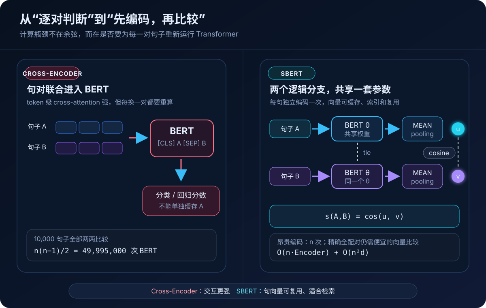
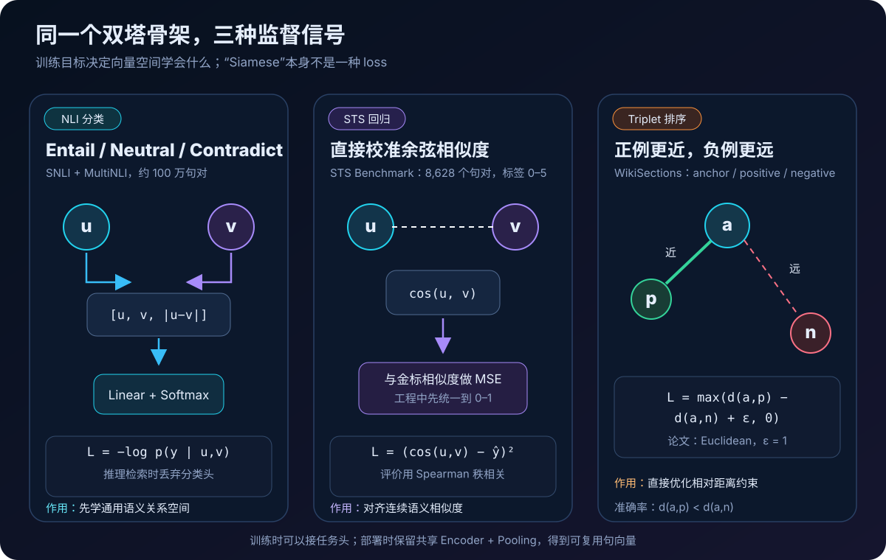
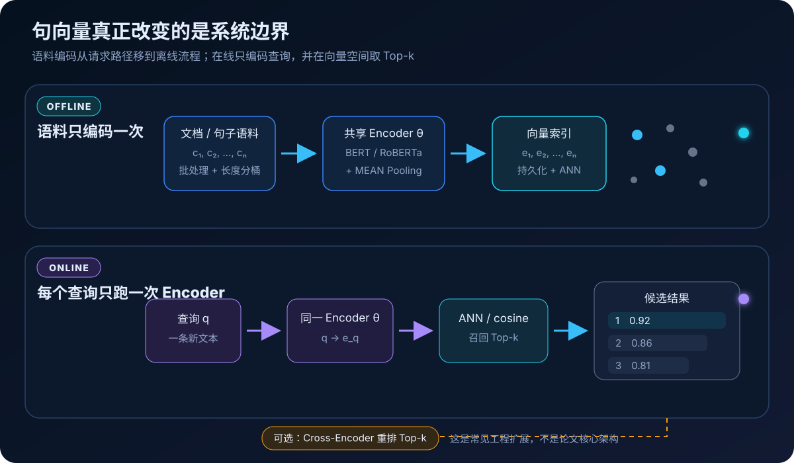
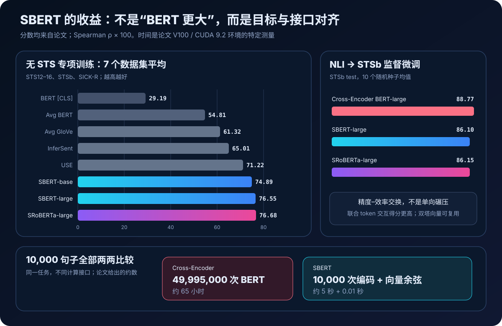

# Sentence-BERT 原理与实现：BERT 怎样从“句对裁判”变成“句向量编码器”


> **论文**：Sentence-BERT: Sentence Embeddings using Siamese BERT-Networks<br>
> **作者**：Nils Reimers、Iryna Gurevych<br>
> **首次公开**：2019 年 8 月 27 日（EMNLP-IJCNLP 2019）<br>
> **关键词**：Sentence Embedding、Siamese Network、Bi-Encoder、Pooling、Semantic Textual Similarity、Semantic Search<br>
> **原文与实现**：[arXiv 摘要](https://arxiv.org/abs/1908.10084) · [论文 PDF](https://arxiv.org/pdf/1908.10084) · [ACL Anthology](https://aclanthology.org/D19-1410/) · [Sentence Transformers 官方仓库](https://github.com/huggingface/sentence-transformers) · [官方文档](https://www.sbert.net/)<br>
> **本文代码**：[零依赖 SBERT 核心机制最小实现](code/sbert_minimal.py)<br>
> **前置阅读**：[Transformer 原理](00_Transformer_2017_原理.md) · [BERT 原理](01_BERT_2018_原理.md) · [ELMo 原理](32_ELMo_2018_原理.md) · [RoBERTa 原理](33_RoBERTa_2019_原理.md)

BERT 很会判断两个句子的关系，却不天然擅长生成能直接做余弦比较的句向量。

标准做法把两个句子拼成：

```text
[CLS] sentence A [SEP] sentence B [SEP]
```

再让 BERT 联合编码。这种 **Cross-Encoder** 可以在每层让 A、B 的 token 直接交互，做句对分类或回归很强；但 A 的表示依赖这次与它配对的 B，不能提前算好并复用。

假设有 `10,000` 个句子，要计算所有无序句对：

$$
\binom{10,000}{2}
=\frac{10,000\times 9,999}{2}
=49,995,000.
$$

论文估计，这需要约 `65` 小时的 BERT 推理。Sentence-BERT（SBERT）换了接口：每个句子独立通过**同一个** BERT，再把 token 表示池化成一个向量；此后句对只需计算余弦。论文同一示例中，`10,000` 次句子编码约 `5` 秒，全部余弦约 `0.01` 秒。

一句话概括：

> **SBERT 没有发明更强的 Transformer；它用共享权重双塔、句级池化和成对监督，把 BERT 改造成可独立编码、缓存、索引与复用的句向量模型。**

这一步把 BERT 从“每来一对都重新审题的裁判”，变成了“先给每句话办好语义身份证，再按距离查找”的编码器。

---

## 1. 一分钟抓住 Sentence-BERT



### 1.1 Cross-Encoder 与 Bi-Encoder 的分界

| 维度 | Cross-Encoder BERT | Sentence-BERT / Bi-Encoder |
|---|---|---|
| 输入 | 句子 A 与 B 拼接后联合输入 | A、B 分别输入同一个 Encoder |
| token 交互 | 从第一层起跨句交互 | 编码期间没有跨句 token 交互 |
| 输出 | 该句对的标签或分数 | 每个句子的定长向量 |
| 单句表示能否缓存 | 不能，换搭档就变 | 能，一个句子只需编码一次 |
| 大规模检索 | 必须逐候选运行模型 | 向量索引召回 Top-k |
| 典型优势 | 精排、复杂句对判断 | 召回、聚类、去重、相似度 |

“Bi-Encoder”是今天更常见的系统术语：查询和候选分别编码。论文标题使用 “Siamese BERT-Networks”，强调两条逻辑分支**共享参数**。

### 1.2 “孪生网络”不是复制两个 BERT

设句子编码器为 $f_\theta$：

$$
u=f_\theta(A),\qquad v=f_\theta(B).
$$

上下两条支路都使用同一个 $\theta$。实现中可以把同一模型对象调用两次，也可以为批量中的所有句子一次前向；不应该维护两个互不约束、各自更新的 BERT。

共享权重带来三个结果：

1. A 与 B 被映射到同一个坐标系，余弦才有一致含义；
2. 训练任一支路产生的梯度都会更新同一套参数；
3. 一个句子作为查询、候选或另一训练样本时，编码规则完全一致。

“Siamese”描述的是**参数关系**，并不等于某一种特定损失。SBERT 论文分别使用分类、回归和三元组目标。

### 1.3 复杂度到底降了什么

设：

- $n$：句子数；
- $d$：句向量维度；
- $E_{\text{pair}}$：一次联合句对 BERT 的成本；
- $E_{\text{sent}}$：一次单句 BERT 编码成本。

Cross-Encoder 全配对近似为：

$$
O\!\left(n^2E_{\text{pair}}\right).
$$

SBERT 做**精确**全配对则是：

$$
O\!\left(nE_{\text{sent}}\right)
+O\!\left(n^2d\right).
$$

所以更严谨的说法是：

- SBERT 把昂贵的 Transformer 调用从 $O(n^2)$ 降为 $O(n)$；
- 如果仍要显式算完所有向量对，便宜的相似度矩阵仍是 $O(n^2d)$；
- 在线 Top-k 检索可以再使用 ANN（Approximate Nearest Neighbor）索引，避免扫描完整语料。

论文的 `65 小时 → 约 5 秒` 是特定硬件、批处理和 `10,000` 句子基准，不是任何机器、任意长度文本上的固定 SLA。真正可迁移的结论是**贵计算与便宜计算被重新分配了**。

---

## 2. 架构：BERT 后面只加一个池化层

对 tokenized 句子 $x=(x_1,\ldots,x_T)$，BERT 产生最后一层上下文化表示：

$$
H=\operatorname{BERT}_\theta(x)
=(h_1,h_2,\ldots,h_T),\qquad h_i\in\mathbb R^d.
$$

池化函数 $P$ 把变长序列压成一个定长句向量：

$$
u=P(H,m),
$$

其中 $m_i\in\{0,1\}$ 是 attention mask，用来排除 padding。

论文比较三种池化。

### 2.1 CLS pooling

$$
u=h_{\text{[CLS]}}.
$$

它直接取首位置。优点是简单；问题是 BERT 的 `[CLS]` 主要通过 MLM / NSP 预训练与下游任务头被使用，并没有天然被训练成“用余弦就能比较”的通用句向量。

### 2.2 MEAN pooling

对所有有效 token 求逐维平均：

$$
u_j=
\frac{\sum_{i=1}^{T}m_i h_{ij}}
{\sum_{i=1}^{T}m_i}.
$$

SBERT 默认选择 MEAN。注意分母是有效 token 数，而不是 padding 后的统一长度。否则短句会被零向量稀释；如果 padding 隐状态不为零，污染更明显。

```python
def masked_mean_pool(token_embeddings, attention_mask):
    valid_count = sum(attention_mask)
    return [
        sum(row[j] * keep for row, keep in zip(token_embeddings, attention_mask))
        / valid_count
        for j in range(len(token_embeddings[0]))
    ]
```

### 2.3 MAX pooling

$$
u_j=\max_{i:m_i=1}h_{ij}.
$$

MAX 保留每个维度最强响应，也必须先把 padding 位置排除。它不是论文的最终默认项；后面的消融会看到，MAX 在 STS 回归训练中尤其不稳定。

### 2.4 池化不是“压缩后完全不丢信息”

从 $T\times d$ 个 token 状态压成 $d$ 维向量，必然形成信息瓶颈。这个瓶颈换来了可缓存性，却失去句对联合编码中的细粒度对齐，例如：

- 否定词究竟修饰哪个谓词；
- 同一实体在两句中的局部对应；
- 数字、单位与比较关系；
- 长句中少数决定含义的 token。

SBERT 的训练目标不是让池化无损，而是让有限容量优先保留对目标任务有用的句级语义。

---

## 3. 三种训练目标：同一骨架，三种几何约束



### 3.1 分类目标：用 NLI 学通用语义关系

给定两个句向量 $u,v\in\mathbb R^d$，论文构造：

$$
z=[u;v;|u-v|]\in\mathbb R^{3d},
$$

再接一个线性分类器：

$$
p(y\mid A,B)=\operatorname{softmax}(Wz+b),
\qquad W\in\mathbb R^{k\times 3d}.
$$

损失是交叉熵：

$$
\mathcal L_{\text{cls}}=-\log p(y^*\mid A,B).
$$

论文用 SNLI 和 MultiNLI 的三类标签：

- entailment：蕴含；
- neutral：中立；
- contradiction：矛盾。

为什么分类头里同时放 $u$、$v$ 和 $|u-v|$？

- $u,v$ 保留各句自身信息；
- $|u-v|$ 显式给出逐维差异，并对交换顺序保持不变；
- 分类梯度会穿过这三部分，把 Encoder 调整成更适合表示句级关系的空间。

一个关键细节：`[u;v;|u-v|]` 和 softmax 头只在 NLI 训练时使用。做语义检索时丢掉分类头，分别保留 $u$、$v$，再计算余弦。

### 3.2 回归目标：让余弦直接拟合 STS 标签

预测值就是两个向量的余弦：

$$
\hat y=\cos(u,v)
=\frac{u^\top v}{\|u\|_2\|v\|_2}.
$$

然后最小化均方误差：

$$
\mathcal L_{\text{reg}}=(\hat y-y)^2.
$$

STS Benchmark 的原始标签范围为 `0–5`。训练实现要先把目标与模型输出放在同一量纲；论文训练时将分数归一化到 `[0,1]`。不能拿余弦直接和原始 `5.0` 做 MSE。

论文评价使用 **Spearman 秩相关**而不是只看 MSE：它衡量预测排序与人工相似度排序是否一致，对非线性单调变换不敏感。

### 3.3 Triplet 目标：相对距离比绝对分数更重要

每个样本包含：

- anchor $s_a$；
- 更相似的 positive $s_p$；
- 更不相似的 negative $s_n$。

使用欧氏距离 $d$，论文定义：

$$
\mathcal L_{\text{triplet}}
=\max\left(
d(s_a,s_p)-d(s_a,s_n)+\epsilon,
0
\right),
$$

并设置 $\epsilon=1$。

只有当负例没有比正例至少远一个 margin 时才产生损失。它直接学习“谁应该排在谁前面”，不要求为每对句子给出精确相似度。

### 3.4 三种目标不是可以随意互换的装饰

| 目标 | 训练数据 | 学到的约束 | 论文用途 |
|---|---|---|---|
| 分类 | 句对 + 离散标签 | 区分蕴含 / 中立 / 矛盾 | SNLI + MultiNLI 通用预训练 |
| 回归 | 句对 + 连续分数 | 校准余弦与相似度 | STS Benchmark 微调 |
| Triplet | anchor / positive / negative | 满足相对距离 margin | WikiSections 段落关系 |

今天人们常把所有双塔训练笼统叫“对比学习”。从几何效果看有相似之处，但复述 SBERT 原论文时应保留三种目标的差别：论文 NLI 主模型用的是三分类 softmax，并非现代 in-batch negatives 的 Multiple Negatives Ranking Loss。

---

## 4. 论文训练配方

### 4.1 NLI：SBERT-NLI

论文把两个大型自然语言推断数据集合并：

| 数据集 | 规模 | 标签 |
|---|---:|---|
| SNLI | 约 `570k` 句对 | entailment / neutral / contradiction |
| MultiNLI | 约 `430k` 句对 | entailment / neutral / contradiction |

训练超参数：

- 初始化：BERT-base / BERT-large，或 RoBERTa 对应版本；
- pooling：默认 MEAN；
- epoch：`1`；
- batch size：`16`；
- optimizer：Adam；
- learning rate：`2e-5`；
- warmup：训练数据前 `10%` 线性 warmup；
- 目标：三分类 softmax。

得到的 `SBERT-NLI` 没看过 STS 训练集，却能直接迁移到多个相似度基准。这是论文最能说明“目标塑造向量空间”的实验。

### 4.2 STS Benchmark：连续相似度微调

STS Benchmark 共 `8,628` 个句对：

| split | 句对数 |
|---|---:|
| train | 5,749 |
| dev | 1,500 |
| test | 1,379 |

每对句子的人工标签从 `0`（完全不相关）到 `5`（语义等价）。论文比较：

- 只在 STSb 上训练；
- 先用 NLI 训练，再用 STSb 回归微调。

第二种通常更好，说明大规模 NLI 先提供通用句级结构，小规模 STS 再校准余弦。

### 4.3 WikiSections：Triplet 关系

论文从 Wikipedia 章节结构构造约 `1.8M` 个训练 triplets，并在来自不同文章的 `222,957` 个测试 triplets 上评价：正段落是否比负段落更接近 anchor。

这一实验不是为了证明所有语义任务都该用 triplet，而是展示同一 Siamese / Triplet BERT 骨架可以接受相对排序监督。

### 4.4 Smart batching

普通 batch 若混入长度差异很大的句子，所有样本都会 pad 到 batch 内最长序列。论文把长度接近的句子分到同一 batch：

```text
短句  ┐
短句  ├─ batch A → 少量 padding
短句  ┘

长句  ┐
长句  ├─ batch B → 少量 padding
长句  ┘
```

这不改变模型公式，却显著减少无效 attention 计算。论文测得 smart batching 让 SBERT 吞吐从：

- CPU：`44 → 83` sentences/s，约提升 `89%`；
- GPU：`1,378 → 2,042` sentences/s，约提升 `48%`。

它提醒我们：变长序列的速度不仅取决于模型参数量，也取决于 batch 怎样组织。

---

## 5. 零依赖最小实现：把机制逐个跑通

本文提供的 [sbert_minimal.py](code/sbert_minimal.py) 不下载 BERT，也不声称复现论文精度。它用纯 Python 隔离六件事：

1. CLS、masked MEAN 与 masked MAX pooling；
2. L2 归一化、余弦和欧氏距离；
3. NLI 的 `[u,v,|u-v|]`；
4. STS MSE 与 triplet margin loss；
5. 同一个玩具 Encoder 编码语料与查询；
6. 精确 Top-k 和全配对工作量。

运行：

```bash
python3 papers/to-2026/code/sbert_minimal.py
```

预期输出：

```text
Sentence-BERT minimal mechanics: self-check passed
query: A kitten naps on a carpet.
1. cosine=1.0000 | A cat rests on a mat.
2. cosine=1.0000 | A feline sleeps on a rug.
3. cosine=0.0305 | A rocket launches into space.
unordered pairs for 10,000 sentences: 49,995,000
Cross-Encoder needs one expensive pair encoding per pair; SBERT needs 10,000 expensive sentence encodings, then cheap vector comparisons.
```

其中 `ToySharedEncoder` 的词向量是手工构造的教学数据，只为让检索路径在断网环境可运行。真正值得观察的是调用关系：

```python
encoder = ToySharedEncoder()

# 离线：语料用同一个 encoder 编码并缓存
corpus_embeddings = encoder.encode_many(corpus)

# 在线：查询只编码一次
query_embedding = encoder.encode(query)

hits = semantic_search(
    query_embedding,
    corpus,
    corpus_embeddings,
    top_k=3,
)
```

### 5.1 为什么归一化后可以用点积

若：

$$
\bar u=\frac{u}{\|u\|_2},\qquad
\bar v=\frac{v}{\|v\|_2},
$$

那么：

$$
\cos(u,v)=\bar u^\top\bar v.
$$

因此大规模索引常在写入前把向量归一化，再用 inner product 搜索余弦近邻。一定要保证语料和查询采用相同归一化规则。

---

## 6. 用当前 Sentence Transformers 做语义搜索

论文作者维护的实现后来发展成 Sentence Transformers 库。当前最小推理流程如下：

```bash
pip install -U sentence-transformers
```

```python
from sentence_transformers import SentenceTransformer, util

model = SentenceTransformer("sentence-transformers/all-MiniLM-L6-v2")

corpus = [
    "一只猫趴在垫子上。",
    "火箭发射升空。",
    "小猫正在地毯上睡觉。",
    "今天股票市场上涨。",
]
query = "哪句话描述宠物在休息？"

corpus_embeddings = model.encode(
    corpus,
    normalize_embeddings=True,
    convert_to_tensor=True,
)
query_embedding = model.encode(
    [query],
    normalize_embeddings=True,
    convert_to_tensor=True,
)

hits = util.semantic_search(
    query_embedding,
    corpus_embeddings,
    top_k=2,
)[0]

for hit in hits:
    print(f"{hit['score']:.4f}\t{corpus[hit['corpus_id']]}")
```

这里用公开小模型演示 API，不代表它是中文任务的默认最佳选择。实际选型至少要核对：

- 模型是否覆盖目标语言和领域；
- 训练目标是对称相似度还是 query-document 非对称检索；
- 最大长度、向量维度、许可证与吞吐；
- 目标 benchmark 是否与真实查询分布一致。

当前官方文档还提供 `encode_query()` 与 `encode_document()`。对带查询 / 文档专用 prompt 的现代检索模型，应优先用这两个接口；对没有专用 prompt 的模型，它们与普通 `encode()` 行为等价。

### 6.1 用当前 API 复刻论文的 NLI softmax 思路

```python
from datasets import Dataset
from sentence_transformers import (
    SentenceTransformer,
    SentenceTransformerTrainer,
    SentenceTransformerTrainingArguments,
    losses,
)

model = SentenceTransformer("google-bert/bert-base-uncased")

train_dataset = Dataset.from_dict({
    "sentence1": [
        "A person rides a horse.",
        "A child is outdoors.",
        "Nobody is running.",
    ],
    "sentence2": [
        "Someone is on an animal.",
        "A child is in a kitchen.",
        "A runner crosses the road.",
    ],
    # 示例约定：0 entailment，1 neutral，2 contradiction
    "label": [0, 1, 2],
})

loss = losses.SoftmaxLoss(
    model,
    embedding_dimension=model.get_embedding_dimension(),
    num_labels=3,
)

args = SentenceTransformerTrainingArguments(
    output_dir="checkpoints/sbert-nli-demo",
    num_train_epochs=1,
    per_device_train_batch_size=16,
    learning_rate=2e-5,
    warmup_ratio=0.1,
)

trainer = SentenceTransformerTrainer(
    model=model,
    args=args,
    train_dataset=train_dataset,
    loss=loss,
)
trainer.train()
```

这段代码展示接口，不是足以训练好模型的三条样本。要复现实验需准备完整 SNLI + MultiNLI、固定 split、版本、随机种子和评价脚本。

官方损失文档明确把 `SoftmaxLoss` 标为 SBERT 论文 NLI 训练所用目标；同时也指出，现代句向量训练中 `MultipleNegativesRankingLoss` 往往更强。类似地，STS 可用 cosine MSE 复刻论文，但当前库也会推荐 CoSENT 等更强排序目标。**论文复现配方**与**今天的工程默认项**不应混为一谈。

---

## 7. 从句向量到检索系统



### 7.1 离线侧

对语料 $C=\{c_1,\ldots,c_n\}$：

$$
e_i=f_\theta(c_i).
$$

然后：

1. 批量编码并尽量按长度分桶；
2. 按需要做 L2 归一化；
3. 保存文本 ID、模型版本、向量和元数据；
4. 建立精确或近似向量索引。

语料没有变化时，不应在每次请求里重复编码。

### 7.2 在线侧

新查询 $q$ 到来时：

$$
e_q=f_\theta(q),
$$

再取：

$$
\operatorname{TopK}_{i}\;\cos(e_q,e_i).
$$

如果语料达到百万、千万级，通常使用 HNSW、IVF 等 ANN 方法。ANN 用少量召回损失换延迟与内存可控；它属于索引层，不是 SBERT 神经网络本身。

### 7.3 召回 + 重排

现代搜索 / RAG 常组合两种接口：

```text
SBERT / Bi-Encoder 召回 Top-100
              ↓
Cross-Encoder 对 100 个句对联合打分
              ↓
返回 Top-10
```

第一阶段要覆盖更多可能相关项，第二阶段恢复 token 级交互，提高排序精度。当前官方文档也把 Sentence Transformer 描述为两阶段检索的常见第一步。

要注意：Cross-Encoder 重排是 SBERT 思想自然衍生出的工程组合，不是 2019 论文中那张 Siamese / Triplet 网络图的必需组件。

### 7.4 模型升级意味着全量重建索引

向量坐标系由参数 $\theta$ 决定。若把语料向量由模型 A 编码、查询由模型 B 编码，即使维度相同，两者通常也不在同一空间。

所以模型更新需要：

- 新旧模型版本隔离；
- 用新模型重算全部语料向量；
- 重建或迁移索引；
- 做召回率、延迟和回滚验证；
- 切流后再回收旧索引。

这不是部署细枝末节，而是句向量成为系统接口后的直接代价。

---

## 8. 核心结果：向量质量与计算效率同时变化



### 8.1 不用 STS 数据训练，NLI 是否足够

论文先在 NLI 上训练句向量，再直接评价七个语义相似度数据集。下表为 Spearman $\rho\times 100$，最后一列是七项平均：

| 模型 | STS12 | STS13 | STS14 | STS15 | STS16 | STSb | SICK-R | Avg. |
|---|---:|---:|---:|---:|---:|---:|---:|---:|
| Avg. GloVe | 55.14 | 70.66 | 59.73 | 68.25 | 63.66 | 58.02 | 53.76 | 61.32 |
| Avg. BERT embeddings | 38.78 | 57.98 | 57.98 | 63.15 | 61.06 | 46.35 | 58.40 | 54.81 |
| BERT `[CLS]` | 20.16 | 30.01 | 20.09 | 36.88 | 38.08 | 16.50 | 42.63 | 29.19 |
| InferSent-GloVe | 52.86 | 66.75 | 62.15 | 72.77 | 66.87 | 68.03 | 65.65 | 65.01 |
| Universal Sentence Encoder | 64.49 | 67.80 | 64.61 | 76.83 | 73.18 | 74.92 | **76.69** | 71.22 |
| SBERT-NLI-base | 70.97 | 76.53 | 73.19 | 79.09 | 74.30 | 77.03 | 72.91 | 74.89 |
| SBERT-NLI-large | 72.27 | **78.46** | **74.90** | 80.99 | 76.25 | **79.23** | 73.75 | 76.55 |
| SRoBERTa-NLI-base | 71.54 | 72.49 | 70.80 | 78.74 | 73.69 | 77.77 | 74.46 | 74.21 |
| SRoBERTa-NLI-large | **74.53** | 77.00 | 73.18 | **81.85** | **76.82** | 79.10 | 74.29 | **76.68** |

这张表支持四个关键判断：

1. 原始 BERT token 均值只有 `54.81`，甚至低于 GloVe 均值 `61.32`；
2. 直接拿 `[CLS]` 做余弦最差，平均只有 `29.19`；
3. 同样以 BERT 为主干，经 NLI 句对目标训练后，SBERT-base 达到 `74.89`，比原始 BERT 均值高 `20.08`；
4. SRoBERTa-large 的 `76.68` 只是略高于 SBERT-large 的 `76.55`，说明换更强预训练主干不会自动替代合适的句级目标。

论文摘要中“比 InferSent 高 `11.7`、比 USE 高 `5.5`”对应最强平均值附近：

$$
76.68-65.01=11.67,
\qquad
76.68-71.22=5.46.
$$

但 SICK-R 单项上 USE 的 `76.69` 高于所有 SBERT / SRoBERTa 变体。论文认为这可能与 USE 覆盖更广训练领域有关。一个平均分胜出不代表每种语域都占优。

### 8.2 为什么原始 BERT 做余弦很差

原始 BERT 学的是 token 恢复和句间预训练目标，不是“让语义越近的整句在欧氏空间方向越接近”。因此：

- `[CLS]` 没有被直接约束成通用语义坐标；
- token 均值也没有保证各维尺度适合余弦；
- 下游 Cross-Encoder 可以借助新的分类头重新解释隐藏维度，直接余弦却没有这层适配。

这解释了一个表面矛盾：原始 BERT 向量在余弦 STS 上很差，但在 SentEval 上接一个可训练逻辑回归分类器时并不差。后者可以重加权维度；前者要求空间本身已经可比较。

论文证明的是“预训练接口与评价几何不匹配”；它没有通过该实验单独证明所有失败都来自某一个后来常讨论的现象，例如各向异性。

### 8.3 在 STSb 上监督训练：Cross-Encoder 仍更准

下表是 STSb test Spearman，`±` 为 10 个随机种子的标准差：

| 训练方式 | BERT Cross-Encoder | SBERT | SRoBERTa |
|---|---:|---:|---:|
| STSb-base | 84.30 ± 0.76 | 84.67 ± 0.19 | **84.92 ± 0.34** |
| STSb-large | **85.64 ± 0.81** | 84.45 ± 0.43 | 85.02 ± 0.76 |
| NLI → STSb-base | **88.33 ± 0.19** | 85.35 ± 0.17 | 84.79 ± 0.38 |
| NLI → STSb-large | **88.77 ± 0.46** | 86.10 ± 0.13 | 86.15 ± 0.35 |

这组数字对理解 SBERT 至关重要：

- 双塔不是在所有句对任务上都比 Cross-Encoder 准；
- NLI → STSb 的 Cross-Encoder BERT-large 为 `88.77`，高于 SBERT-large 的 `86.10`；
- Cross-Encoder 能对两句 token 做深层交互，精度优势合理；
- SBERT 用约 2–3 个点的监督 STS 差距，换来候选向量可预计算的数量级效率优势。

所以论文标题中的 “Sentence Embeddings” 才是核心成果。若业务只有一对文本、极重精度且无需复用，Cross-Encoder 可能仍是更合适的接口。

---

## 9. 另外三组实验回答了什么

### 9.1 Argument Facet Similarity：信息瓶颈何时暴露

AFS 任务比较两段论证是否表达相同论点。论文同时给出同主题 10-fold 与跨主题迁移结果，下面摘录 Spearman $\rho\times 100$：

| 模型 | 10-fold | Cross-topic |
|---|---:|---:|
| BERT-AFS-base Cross-Encoder | 74.84 | 57.23 |
| SBERT-AFS-base | 74.13 | 50.65 |
| BERT-AFS-large Cross-Encoder | **76.38** | **60.34** |
| SBERT-AFS-large | 75.93 | 53.10 |

同主题 10-fold 中，SBERT-large 的 `75.93` 与 Cross-Encoder 的 `76.38` 很接近；跨主题时却从 `60.34` 降到 `53.10`，差 `7.24`。

作者给出的解释是：AFS 需要细粒度词级对齐，而句向量形成信息瓶颈。跨主题又要求模型把这种对齐规律迁移到没见过的论题，独立编码更难保留全部必要线索。

这个实验比一句“SBERT 很快”更有价值：**Bi-Encoder 的误差不是随机噪声，而与任务是否依赖 pair-specific interaction 有结构性关系。**

### 9.2 WikiSections：Triplet 目标能否学到段落关系

论文以“正段落是否比负段落更靠近 anchor”为准确率：

| 模型 | Triplet accuracy |
|---|---:|
| Mean vectors | 0.6500 |
| Skip-thoughts-CS | 0.6200 |
| Dor et al. | 0.7400 |
| SBERT-base | 0.8042 |
| **SBERT-large** | **0.8078** |
| SRoBERTa-base | 0.7945 |
| SRoBERTa-large | 0.7973 |

SBERT-large 达到 `0.8078`。RoBERTa 变体在此并未更好，再次说明主干预训练强弱与具体度量学习目标的收益不是简单相加。

### 9.3 SentEval：余弦差不等于线性可分性差

SentEval 在冻结句向量上训练逻辑回归分类器。七个迁移任务平均准确率：

| 模型 | MR | CR | SUBJ | MPQA | SST | TREC | MRPC | Avg. |
|---|---:|---:|---:|---:|---:|---:|---:|---:|
| Avg. GloVe | 77.25 | 78.30 | 91.17 | 87.85 | 80.18 | 83.0 | 72.87 | 81.52 |
| Avg. fastText | 77.96 | 79.23 | 91.68 | 87.81 | 82.15 | 83.6 | 74.49 | 82.42 |
| Avg. BERT | 78.66 | 86.25 | 94.37 | 88.66 | 84.40 | 92.8 | 69.45 | 84.94 |
| BERT `[CLS]` | 78.68 | 84.85 | 94.21 | 88.23 | 84.13 | 91.4 | 71.13 | 84.66 |
| InferSent | 81.57 | 86.54 | 92.50 | **90.38** | 84.18 | 88.2 | 75.77 | 85.59 |
| USE | 80.09 | 85.19 | 93.98 | 86.70 | 86.38 | **93.2** | 70.14 | 85.10 |
| SBERT-base | 83.64 | 89.43 | 94.39 | 89.86 | 88.96 | 89.6 | **76.00** | 87.41 |
| SBERT-large | **84.88** | **90.07** | **94.52** | 90.33 | **90.66** | 87.4 | 75.94 | **87.69** |

SBERT-large 平均 `87.69` 最好，但并非每项都第一；TREC 上 USE 更高，MPQA 上 InferSent 略高。

论文也明确提醒：SBERT 的主要目标不是替代每个任务的 BERT 全参数微调。若有足够标注数据并只服务一个分类任务，直接 fine-tune BERT 往往更合适。冻结句向量的价值在通用复用、低成本与检索接口。

---

## 10. 消融：真正起作用的是哪一部分

### 10.1 Pooling 消融

论文在 STS dev 上比较 pooling，数字为 10 次训练的 Spearman 均值：

| Pooling | NLI 训练 | STSb 回归训练 |
|---|---:|---:|
| **MEAN** | **80.78** | **87.44** |
| MAX | 79.07 | 69.92 |
| CLS | 79.80 | 86.62 |

可以读出：

- NLI 训练时三者差距不算巨大，说明强句对监督可以部分弥补池化差别；
- STSb 回归时 MAX 从 `87.44` 掉到 `69.92`，不适合作为默认项；
- MEAN 在两种目标上都稳健，因此论文选择它作为默认池化。

不要把结果过度推广成“所有现代 embedding 模型永远 mean pooling 最好”。模型预训练方式、特殊 token 设计和数据目标改变后，最佳 pooling 也可能变。这里的结论属于论文配置。

### 10.2 分类特征消融

NLI 分类头可以选择 $u$、$v$、绝对差和逐维乘积。论文结果：

| Softmax 输入特征 | STS dev Spearman |
|---|---:|
| $(u,v)$ | 66.04 |
| $|u-v|$ | 69.78 |
| $u*v$ | 70.54 |
| $(|u-v|,u*v)$ | 78.37 |
| $(u,v,u*v)$ | 77.44 |
| **$(u,v,|u-v|)$** | **80.78** |
| $(u,v,|u-v|,u*v)$ | 80.44 |

最值得注意的不是“特征越多越好”：

- 仅拼接 $(u,v)$ 只有 `66.04`；
- 加入 $|u-v|$ 后达到最佳 `80.78`；
- 再加 $u*v$ 反而略降到 `80.44`；
- 差异特征给分类器一条直接比较两句的路径。

但部署时仍不需要保存 $|u-v|$，因为它只在训练句对和分类头存在时计算。离线索引只存单句 $u$。

---

## 11. 效率表该怎样读

论文在 Intel i7-5820K CPU 与 NVIDIA V100 GPU 上测编码吞吐：

| 模型 | CPU sentences/s | GPU sentences/s |
|---|---:|---:|
| Avg. GloVe | 6,469 | — |
| InferSent | 137 | 1,876 |
| Universal Sentence Encoder | 67 | 1,318 |
| SBERT-base | 44 | 1,378 |
| **SBERT-base + smart batching** | **83** | **2,042** |

几条容易读错的地方：

1. GloVe 均值最快，但语义相似度平均分明显低于 SBERT；
2. 不做 smart batching 时，SBERT CPU 吞吐比 InferSent 慢；
3. smart batching 后，SBERT GPU 吞吐约比 InferSent 高 `9%`，比 USE 高 `55%`；
4. 这张表测的是**句子编码吞吐**，不是包含网络、索引、序列化的端到端搜索 QPS；
5. CUDA 9.2、2019 年模型实现和 V100 的绝对数值不能直接当作今天硬件的容量规划。

论文里 Quora 的估计更能体现接口差异：新问题若逐一与超过 `40M` 个已有问题做 Cross-Encoder 比较，需要超过 `50` 小时；句向量配合优化过的索引可以把检索降到毫秒级。后一个结论依赖 ANN 系统，不是“余弦循环写成 Python 就自动毫秒级”。

---

## 12. 手算一个最小例子

设两个句子池化后：

$$
u=(1,2),\qquad v=(2,2).
$$

### 12.1 NLI 特征

$$
|u-v|=(1,0),
$$

因此：

$$
[u;v;|u-v|]=(1,2,2,2,1,0).
$$

如果维度是 $d=768$，分类头输入就是 $3d=2,304$ 维。

### 12.2 余弦相似度

$$
\cos(u,v)
=\frac{1\times2+2\times2}
{\sqrt{1^2+2^2}\sqrt{2^2+2^2}}
=\frac{6}{\sqrt5\sqrt8}
\approx0.949.
$$

### 12.3 Triplet margin

再令：

$$
a=(0,0),\quad p=(0.2,0),\quad n=(0.7,0),\quad \epsilon=1.
$$

则：

$$
\mathcal L
=\max(0.2-0.7+1,0)
=0.5.
$$

虽然负例比正例远，但只远 `0.5`，没满足 margin `1`，所以仍产生梯度。若 $n=(1.5,0)$，损失变为 $0$。

---

## 13. 什么时候用 SBERT，什么时候不用

### 13.1 适合 SBERT / Bi-Encoder

- 大规模语义搜索和 FAQ 匹配；
- RAG 第一阶段文档 / chunk 召回；
- 相似句聚类、近重复检测；
- paraphrase mining；
- 需要频繁复用同一候选库；
- 延迟或成本不允许逐候选跑 Transformer。

### 13.2 适合 Cross-Encoder

- 候选很少，或只比较固定一对文本；
- 否定、数值、条件、实体对齐决定结果；
- 精度优先，允许更高延迟；
- 作为 Bi-Encoder 召回后的重排器；
- 标签定义依赖两个文本联合推理，而非稳定的单句语义。

### 13.3 常见折中

| 阶段 | 模型 | 优化目标 |
|---|---|---|
| 召回 | Bi-Encoder / SBERT | Recall@k、延迟、索引大小 |
| 重排 | Cross-Encoder | nDCG、MRR、Top-k 精度 |
| 生成前过滤 | 规则 / 分类器 | 权限、时效、来源质量 |

不要只比较离线 STS Spearman。检索系统真正关心的往往是：相关文档是否进入 Top-k、尾延迟、索引内存、更新成本，以及重排后最终排序。

---

## 14. 常见误解与实现陷阱

### 14.1 “Siamese 是两个分别训练的 BERT”

错误。两条分支共享同一 $\theta$。若语料塔和查询塔使用不同参数，那是更一般的 two-tower 设计，不是论文 SBERT 的默认 Siamese 设置。

### 14.2 “SBERT 把所有两两比较都降成 $O(n)$”

错误。昂贵 Encoder 调用变为 $O(n)$；精确完整相似度矩阵仍是 $O(n^2d)$。Top-k ANN 才进一步避免全扫描。

### 14.3 “直接取原始 BERT `[CLS]` 就是 SBERT”

错误。架构只是一半；句对训练目标才把空间调整成适合余弦的形状。论文原始 BERT `[CLS]` 在七个 STS 数据集平均只有 `29.19`。

### 14.4 “MEAN pooling 把 padding 也平均进去没关系”

错误。必须用 attention mask：

```python
mask = attention_mask.unsqueeze(-1)
pooled = (token_embeddings * mask).sum(dim=1) / mask.sum(dim=1).clamp_min(1)
```

还要核对实现是否包含 `[CLS]`、`[SEP]`。论文概念公式说对输出 token 向量求平均，具体 tokenizer / 库的 pooling 配置应固定并记录。

### 14.5 “余弦分数 0.8 在所有模型里含义相同”

错误。分数分布随模型、训练数据、归一化和领域改变。阈值要在目标数据上校准，升级模型后重新标定。

### 14.6 “换查询模型，不用重算语料向量”

通常错误。即使维度相同，不同模型也会定义不同坐标系。除非模型明确训练为兼容空间，否则查询和语料必须由配套编码器产生。

### 14.7 “论文的 NLI SoftmaxLoss 就是今天最强 embedding loss”

错误。它是理解历史方法和复现论文的正确目标；当前 Sentence Transformers 文档已指出 Multiple Negatives Ranking Loss 等目标常有更好结果。评价现代模型时应按今天的数据和指标选 loss，但不能倒写历史。

### 14.8 “ANN 检索结果就是模型真实 Top-k”

不一定。ANN 还受索引参数、量化、搜索深度和过滤策略影响。模型 Recall 与索引 Recall 应分别测量：

```text
文本 → embedding 是否把相关项排近？   模型质量
embedding → ANN 是否找回真实近邻？    索引质量
```

把两者混在一个离线分数里，会让问题难以定位。

---

## 15. 局限与边界

### 15.1 独立编码的信息瓶颈

SBERT 在看到另一句之前就必须决定保留什么。Cross-Encoder 则能根据具体搭档动态关注 token。这是可复用性与交互能力之间的根本交换，不是把向量维度简单加大就一定能消除。

### 15.2 对称相似度不等于非对称相关性

STS 常问“A 与 B 是否语义相似”，余弦天然对称：

$$
\cos(u,v)=\cos(v,u).
$$

搜索却常问“这个文档能否回答查询”，角色并不对称。现代检索模型会使用 query / document prompt、非对称训练数据或不同路由；这些是 SBERT 范式的后续扩展，不应强行归入原论文实验。

### 15.3 长文档压成一个向量会稀释局部证据

一篇长文可能只有一个段落回答查询。把整篇文章 mean pool 成单向量，会把少量关键信号与大量无关文本混合。工程上常先切 chunk，再分别建索引；chunk 长度与重叠是新的召回超参数。

### 15.4 领域迁移不是免费的

医学、法律、代码、金融术语对“相似”的定义不同。SICK-R 与 AFS cross-topic 结果已经说明训练域和任务结构会改变表现。通用 STS 高分不能替代目标域评价。

### 15.5 单一向量分数不能表达全部不确定性

余弦近并不代表事实一致、时间有效、来源可信或权限可见。把 SBERT 用于 RAG 时，检索分数之外仍需元数据过滤、时效策略、来源验证与生成阶段的引用约束。

---

## 16. 复现与落地检查清单

### 16.1 复现论文

- [ ] 固定 BERT / RoBERTa checkpoint 与 tokenizer 版本；
- [ ] SNLI + MultiNLI 标签映射一致；
- [ ] 默认 MEAN pooling，padding 不参与；
- [ ] NLI 特征严格为 `[u,v,|u-v|]`；
- [ ] 训练 `1` epoch、batch `16`、Adam、`2e-5`、warmup `10%`；
- [ ] STSb 标签按论文统一量纲；
- [ ] Spearman 计算在正确 split 上；
- [ ] 报告多个随机种子均值与标准差；
- [ ] 区分 Cross-Encoder、SBERT 与 SRoBERTa；
- [ ] 不用今天更强的 loss 冒充原论文配方。

### 16.2 生产检索

- [ ] 查询 / 文档角色与训练目标匹配；
- [ ] 记录模型、pooling、归一化与向量维度版本；
- [ ] 语料离线批量编码，按长度分桶；
- [ ] 先测精确检索，再单独测 ANN recall；
- [ ] 用 Recall@k、MRR / nDCG 与真实业务集评价；
- [ ] 标定相似度阈值，不照搬演示值；
- [ ] 需要精度时增加 Cross-Encoder 重排；
- [ ] 模型升级时准备全量重编码与双索引切换；
- [ ] 监控领域漂移、空查询、超长文本和多语言输入；
- [ ] 将权限、时效与来源过滤放在向量相似度之外处理。

---

## 17. 历史位置：它为后来留下了什么

SBERT 之前并非没有句向量：Skip-Thought、InferSent、Universal Sentence Encoder 都已探索通用表示。SBERT 的独特位置在于，它把当时最强的深层双向 Transformer 与一个极实用的双塔接口连接起来，并清楚量化了精度与规模之间的交换。

它留下的影响主要有四层：

1. **模型层**：Encoder + Pooling 成为 Transformer 句向量的清晰基线；
2. **训练层**：成对 / 三元组监督直接塑造可比较的嵌入空间；
3. **系统层**：候选离线编码、查询在线编码、向量 Top-k 成为标准数据流；
4. **工具层**：Sentence Transformers 把训练、评价、语义搜索和重排组合沉淀成生态。

后来的密集检索、对比学习文本表示和 RAG embedding 模型在数据、loss、负例、蒸馏、长文本与多语言方面走得更远，但仍反复使用同一个核心决策：

> 是让两段文本先见面再判断，还是先各自压成可复用表示再比较？

这个决策今天仍决定搜索系统的精度上限、延迟、索引方式和更新成本。

---

## 18. 总结

Sentence-BERT 可以压缩成六句话：

1. 标准 Cross-Encoder BERT 联合编码句对，精度强但候选不可缓存；
2. SBERT 用共享权重的 Siamese / Bi-Encoder 分别编码句子，再做池化；
3. 论文用 NLI 分类、STS 余弦回归和 Triplet margin 三种目标训练向量空间；
4. MEAN pooling 是论文最稳健的默认项，`[u,v,|u-v|]` 是最佳 NLI 分类特征；
5. SBERT 把昂贵 Encoder 调用从全配对的二次规模降为每句一次，但精确全向量比较仍是二次；
6. Cross-Encoder 在监督 STS 上仍可更准，SBERT 的核心胜利是让语义表示能够缓存、索引和复用。

最值得带走的不是“以后都用余弦”，而是一条系统设计原则：

> **把与候选无关的昂贵计算提前完成，才可能让深度语义模型进入大规模检索；而提前计算所失去的交互能力，需要靠训练目标、召回—重排和真实任务评价补回来。**

---

## 参考资料

1. Nils Reimers, Iryna Gurevych. [Sentence-BERT: Sentence Embeddings using Siamese BERT-Networks](https://arxiv.org/abs/1908.10084), 2019.
2. ACL Anthology. [Sentence-BERT: Sentence Embeddings using Siamese BERT-Networks](https://aclanthology.org/D19-1410/).
3. Sentence Transformers. [Official repository](https://github.com/huggingface/sentence-transformers).
4. Sentence Transformers Documentation. [Usage](https://www.sbert.net/docs/sentence_transformer/usage/usage.html).
5. Sentence Transformers Documentation. [Training Overview](https://www.sbert.net/docs/sentence_transformer/training_overview.html).
6. Sentence Transformers Documentation. [Losses: SoftmaxLoss, TripletLoss and modern alternatives](https://www.sbert.net/docs/package_reference/sentence_transformer/losses.html).

## 读完接着看

1. [BERT 原理与实现](01_BERT_2018_原理.md)：理解 SBERT 改造的 Encoder 主干
2. [RoBERTa 原理与实现](33_RoBERTa_2019_原理.md)：理解 SRoBERTa 的预训练差异
3. [RAG 原理与实现](07_RAG_2020_原理.md)：句向量检索怎样进入生成系统
