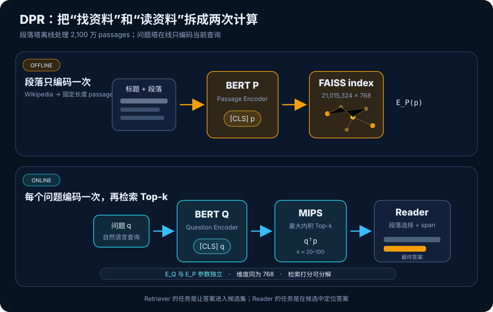
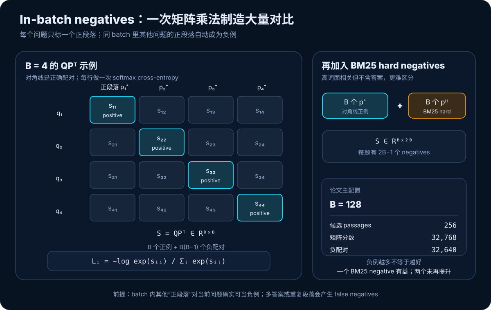
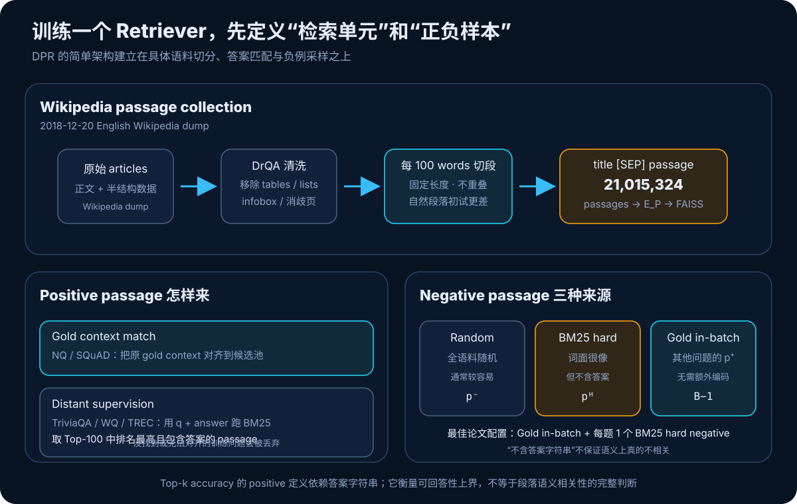
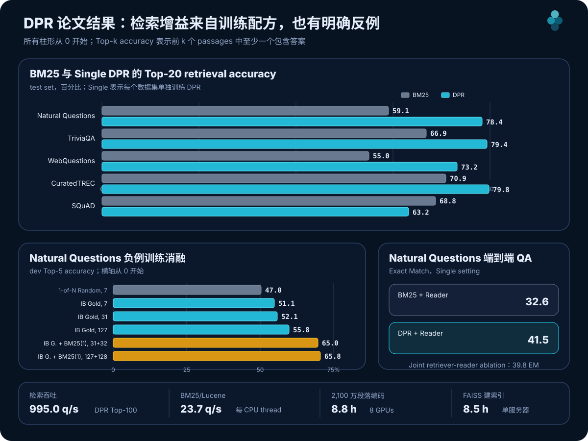

# DPR 原理与实现：怎样把 2,100 万段落压进可搜索的语义空间


> **论文**：Dense Passage Retrieval for Open-Domain Question Answering<br>
> **作者**：Vladimir Karpukhin、Barlas Oğuz、Sewon Min、Patrick Lewis、Ledell Wu、Sergey Edunov、Danqi Chen、Wen-tau Yih<br>
> **首次公开**：2020 年 4 月 10 日（EMNLP 2020）<br>
> **关键词**：Open-domain QA、Dense Retrieval、Dual Encoder、In-batch Negatives、Hard Negative、MIPS、FAISS<br>
> **原文与实现**：[arXiv 摘要](https://arxiv.org/abs/2004.04906) · [论文 PDF](https://arxiv.org/pdf/2004.04906) · [ACL Anthology](https://aclanthology.org/2020.emnlp-main.550/) · [官方 DPR 仓库（已归档）](https://github.com/facebookresearch/DPR) · [Transformers DPR 文档](https://huggingface.co/docs/transformers/model_doc/dpr)<br>
> **本文代码**：[零依赖 DPR 核心机制最小实现](code/dpr_minimal.py)<br>
> **前置阅读**：[Transformer 原理](00_Transformer_2017_原理.md) · [BERT 原理](01_BERT_2018_原理.md) · [Sentence-BERT 原理](35_Sentence_BERT_2019_原理.md)

开放域问答面对的不是一段已经给好的文章，而是整个 Wikipedia：系统必须先从数千万段落中找出少量候选，再在候选里抽取答案。

在 DPR 之前，第一步几乎默认交给 TF-IDF 或 BM25。它们用倒排索引高效匹配词面，但“问题和证据用了不同说法”时容易漏掉。例如论文给出的直觉例子：

```text
Question: Who is the bad guy in Lord of the Rings?
Passage:  Sala Baker is best known for portraying the villain Sauron ...
```

`bad guy` 与 `villain` 没有共同 token，人却知道它们相关。DPR 想证明一件当时并不显然的事：**不用复杂的额外预训练，只用已有的 question–passage 监督，简单双编码器能否让纯稠密检索稳定超过强 BM25？**

答案是肯定的。DPR 用两个独立 BERT 把问题与段落映射为 768 维向量，通过内积训练和检索；在除 SQuAD 外的四个测试集上，Single DPR 的 Top-20 retrieval accuracy 比 BM25 高约 `9–19` 个百分点，并把 Natural Questions 端到端 Exact Match 从 `32.6` 提升到 `41.5`。

一句话概括：

> **DPR 把开放域问答的检索监督写成一个简单的矩阵分类问题：让每个问题向量在大量候选段落中，把自己的正段落内积推到最高；in-batch negatives 与一个 BM25 hard negative 是配方的关键。**

它真正奠定的不是某个特殊 BERT 层，而是今天 dense retrieval / RAG 仍反复使用的数据流：**语料离线编码建索引，查询在线编码取 Top-k，下游 Reader 或生成器消费候选。**

---

## 1. 一分钟抓住 DPR



图中有三条必须分开的计算路径：

1. **离线语料路径**：Passage Encoder 把全部段落编码并写入 FAISS；
2. **在线问题路径**：Question Encoder 只编码当前问题，通过最大内积搜索取 Top-k；
3. **答案路径**：Reader 联合阅读问题和候选段落，选择段落并抽取答案 span。

### 1.1 Retriever 只负责“让答案进候选集”

设段落全集：

$$
\mathcal C=\{p_1,p_2,\ldots,p_M\},
$$

其中论文实验有：

$$
M=21,015,324.
$$

给定问题 $q$，Retriever 返回一个很小的候选集：

$$
R(q,\mathcal C)=\mathcal C_F,
\qquad |\mathcal C_F|=k\ll M,
$$

通常 $k$ 只有 `20–100`。Retriever 不直接生成最终答案；它减少 Reader 的搜索空间。

### 1.2 两个 Encoder 参数独立

DPR 定义：

$$
v_q=E_Q(q),\qquad v_p=E_P(p),
$$

其中 $E_Q$ 与 $E_P$ 都初始化为 BERT-base-uncased，但它们是**两套独立参数**。这与 Sentence-BERT 的共享权重 Siamese 网络不同。

| 维度 | Sentence-BERT | DPR |
|---|---|---|
| 主要任务 | 对称句子相似度、语义搜索 | 非对称 question → passage 检索 |
| 两塔参数 | 通常共享 | 独立训练 |
| 输出 | 默认 MEAN pooling | `[CLS]` 表示 |
| 论文相似度 | cosine | 未归一化 inner product |
| 监督 | NLI / STS / triplet | question + positive / negative passage |
| 单元 | 句子 | 问题与约 100-word passage |

“Dual Encoder”只说明两个输入可分解编码，不意味着一定共享参数。DPR 允许问题语言和证据语言采用不同映射，同时要求两边最终落到同一个 768 维内积空间。

### 1.3 相似度必须可分解

DPR 使用：

$$
s(q,p)=E_Q(q)^\top E_P(p).
$$

因为分数可由两个预先独立计算的向量得到，所有 $E_P(p)$ 都能离线缓存。若改成 Cross-Encoder：

$$
s(q,p)=g([q;p]),
$$

每个新问题都要与 2,100 万段落逐对跑 Transformer，无法实际部署。

### 1.4 DPR 用内积，不是默认余弦

余弦会除以向量范数：

$$
\cos(v_q,v_p)=
\frac{v_q^\top v_p}{\|v_q\|_2\|v_p\|_2}.
$$

DPR 最终配置不做这一步，因此向量方向和范数都能影响分数。论文消融发现：

- dot product + NLL 最好；
- 负欧氏距离接近；
- cosine 较差；
- triplet loss 没带来明显改善。

不能把现代 embedding 代码里常见的 `normalize_embeddings=True` 原样套到 DPR 复现上，否则打分函数已经改变。

---

## 2. 先定义评价：Top-k accuracy 不是 Precision@k

论文假设答案是语料中某个 passage 的连续文本 span。对第 $i$ 个问题，记人工答案字符串集合为 $A_i$，检索排序为：

$$
\pi_i=(p_{i,1},p_{i,2},\ldots).
$$

Top-k retrieval accuracy 定义为：

$$
\operatorname{Acc@k}
=\frac{1}{N}\sum_{i=1}^{N}
\mathbf 1\left[
\exists j\le k,\ \exists a\in A_i:
a\subseteq p_{i,j}
\right].
$$

它回答的是：**多少比例的问题，至少有一个包含答案字符串的 passage 进入前 k？**

它不是：

- `Precision@k`：前 k 中有多少比例相关；
- `Recall@k` 的完整 IR 定义：找回多少人工相关文档；
- `MRR`：第一个相关项排多靠前；
- 最终问答准确率：Reader 是否抽取了正确答案。

### 2.1 这个指标为什么合理

在抽取式 QA 中，如果前 k 个 passage 都没有答案，Reader 几乎不可能答对。因此 Acc@k 可以看作特定答案匹配规则下的候选可回答率，也是 Reader 的重要上界。

### 2.2 这个指标又为什么不完整

答案字符串命中可能产生两类误差：

- **伪正例**：段落碰巧出现同名实体，却没有回答问题；
- **伪负例**：段落语义正确，但用了别名、数值变体或答案规范化没覆盖的写法。

所以 Acc@k 衡量“是否含答案字符串”，不等价于完整 passage relevance。论文结论应在这一口径下理解。

最终 QA 采用 Exact Match（EM）：预测答案经过小写、标点、冠词和空格等规范化后，必须与某个人工答案完全一致。

---

## 3. 编码器到底吃什么

### 3.1 Question Encoder

问题输入形如：

```text
[CLS] question tokens [SEP]
```

取 BERT 最后一层首 token 表示：

$$
E_Q(q)=H_Q^{[\mathrm{CLS}]}\in\mathbb R^{768}.
$$

### 3.2 Passage Encoder

论文为每个 passage 加上所属 Wikipedia article title：

```text
[CLS] title [SEP] passage tokens [SEP]
```

同样取 `[CLS]`：

$$
E_P(p)=H_P^{[\mathrm{CLS}]}\in\mathbb R^{768}.
$$

标题不是展示用元数据，而是 Encoder 输入的一部分。它帮助 100-word 局部片段保留主题和实体上下文。

### 3.3 为什么不在检索时做 cross-attention

Cross-attention 可以让问题 token 与 passage token 深度对齐，通常排序更精细；但它破坏段落向量的可复用性。DPR 选择一个更窄的接口：

```text
question ── E_Q ── v_q ─┐
                         ├─ dot product
passage  ── E_P ── v_p ─┘
```

代价是 768 维向量必须预先保留所有可能对未来问题有用的信息；收益是 2,100 万 passage embeddings 可以一次建好索引。

---

## 4. In-batch negatives：DPR 最关键的训练技巧



### 4.1 单个问题的 1-of-N 损失

训练样本包含：

$$
(q_i,p_i^+,p_{i,1}^-,\ldots,p_{i,n}^-).
$$

目标是让正段落分数高于所有负段落：

$$
\mathcal L_i
=-log
\frac{
\exp s(q_i,p_i^+)
}{
\exp s(q_i,p_i^+)
+\sum_{j=1}^{n}\exp s(q_i,p_{i,j}^-)
}.
$$

这就是“在候选段落中分类出正确项”的 softmax negative log-likelihood。

### 4.2 一个 batch 复用出 $B^2$ 个分数

若一个 batch 有 $B$ 个问题和各自的正段落：

$$
Q\in\mathbb R^{B\times d},
\qquad
P\in\mathbb R^{B\times d},
$$

一次矩阵乘法得到：

$$
S=QP^\top\in\mathbb R^{B\times B}.
$$

其中：

$$
S_{ij}=E_Q(q_i)^\top E_P(p_j^+).
$$

第 $i$ 行里：

- $S_{ii}$ 是正例；
- 所有 $S_{ij},j\ne i$ 是其他问题提供的 batch 内负例。

所以只编码 $B$ 个问题和 $B$ 个段落，就得到：

$$
B\ \text{个正配对}
+B(B-1)\ \text{个负配对}.
$$

batch 越大，每个问题一次 softmax 看到的负例越多。论文主实验 batch size 为 `128`。

### 4.3 加一个 BM25 hard negative 后发生什么

论文最佳模型为每个问题再取一个 BM25 高排、但不含答案字符串的 passage $p_i^H$。把所有 hard negatives 也拼进候选矩阵：

$$
P'=[P^+;P^H]\in\mathbb R^{2B\times d},
$$

于是：

$$
S'=Q{P'}^\top\in\mathbb R^{B\times 2B}.
$$

当 $B=128$：

| 项目 | 数量 |
|---|---:|
| questions | 128 |
| candidate passages | 256 |
| scores | 32,768 |
| positive pairs | 128 |
| negative pairs | 32,640 |

hard negative 比随机段落难，因为它与问题共享许多词，却缺少正确答案。模型必须学习比词面重合更精细的区分。

### 4.4 三种负例来源

| 类型 | 构造 | 特点 |
|---|---|---|
| Random | 从全语料随机取 | 容易，常与问题毫无关系 |
| BM25 | BM25 高排但不含答案 | hard，词面接近且容易混淆 |
| Gold | 其他问题的正段落 | 可在 batch 内免费复用 |

### 4.5 False negatives 是这个技巧的隐含前提

batch 内方法默认 $p_j^+$ 对 $q_i$ 是负例，只因为 $i\ne j$。但开放域语料中可能出现：

- 两个问题共享答案和证据；
- 同一事实被多个 passage 重复描述；
- 一个 passage 同时回答多个问题；
- “不含答案字符串”的 hard negative 实际语义相关。

这些 false negatives 会把正确邻居推远。DPR 原论文的简单采样已经很强，但不能把“所有非对角项都是真负例”当成自然定律。

---

## 5. 语料与监督：简单模型背后的数据工程



### 5.1 2,100 万 passage 怎样产生

论文使用 `2018-12-20` English Wikipedia dump：

1. 用 DrQA 预处理提取文章正文；
2. 移除 tables、infoboxes、lists 与 disambiguation pages；
3. 每篇文章按 `100 words` 切成**不重叠**固定长度块；
4. 每块前加 article title 和 `[SEP]`；
5. 最终得到 `21,015,324` 个 passages。

作者初步试过自然段落，固定长度在 retrieval 和最终 QA 上更好；也没有发现重叠切分比不重叠更有利。这个结论来自论文配置，不是说今天所有 RAG 都应固定切 `100` 个词。

### 5.2 五个 QA 数据集

Table 1 同时给出原训练问题数与经过 passage 对齐 / 筛选后实际用于 DPR 的问题数：

| 数据集 | 原 Train | DPR Train | Dev | Test |
|---|---:|---:|---:|---:|
| Natural Questions | 79,168 | 58,880 | 8,757 | 3,610 |
| TriviaQA | 78,785 | 60,413 | 8,837 | 11,313 |
| WebQuestions | 3,417 | 2,474 | 361 | 2,032 |
| CuratedTREC | 1,353 | 1,125 | 133 | 694 |
| SQuAD v1.1 | 78,713 | 70,096 | 8,886 | 10,570 |

数字下降不是随机丢样本：找不到匹配 passage、Wikipedia 版本不同，或 BM25 Top-100 中没有包含答案的 passage 时，问题无法形成可靠正例，会被过滤。

### 5.3 Positive passage 的两种来源

**Gold context match**：NQ 与 SQuAD 原数据提供 supporting context。论文把它匹配到统一 Wikipedia passage pool。

**Distant supervision**：TriviaQA、WebQuestions、CuratedTREC 主要给 question–answer。论文将 question 和 answer 一起作为 BM25 查询，取 Top-100 中排名最高且包含答案的 passage 作为正例。

这意味着正例不总是人工标注的“最佳证据”。它可能只是答案字符串存在且 BM25 排得最高的段落。

### 5.4 SQuAD 为什么成为反例

SQuAD 的问题由标注者看着给定段落编写，因此问题与证据词面重合很高；数据又只来自 `500+` 篇 Wikipedia articles，训练分布很窄。这同时：

- 给 BM25 明显优势；
- 让 dense retriever 容易学习数据集偏差；
- 使它不适合混入通用 multi-dataset retriever。

论文因此在 Multi DPR 训练中排除 SQuAD。后面会看到，DPR 在 SQuAD 上确实没有超过 BM25。

---

## 6. 完整训练配方

### 6.1 Retriever

| 配置 | 论文设置 |
|---|---|
| Encoders | 两个独立 BERT-base-uncased |
| 表示 | 最后一层 `[CLS]`，$d=768$ |
| 相似度 | inner product |
| 损失 | in-batch softmax NLL |
| Batch size | 128 |
| Hard negatives | 每题 1 个 BM25 negative |
| Optimizer | Adam |
| Learning rate | $10^{-5}$ |
| Schedule | linear schedule with warm-up |
| Dropout | 0.1 |
| Epochs | 大数据集最多 40，小数据集最多 100 |
| 训练硬件 | 8 × 32GB GPUs |

论文没有给一个可移植到任意硬件的“最佳每卡 batch”。分布式训练时有效 batch 和跨设备 negatives 是否共享会直接改变候选数量，因此复现必须记录 global batch，而不只记录 per-device batch。

### 6.2 Single 与 Multi

- **Single DPR**：每个数据集单独训练 retriever；
- **Multi DPR**：合并 NQ、TriviaQA、WQ、TREC，排除 SQuAD。

Multi 的目的不是让每个大数据集都必然提升，而是给小数据集更多监督。论文中 TREC 获益最大，TriviaQA 反而略降。

### 6.3 BM25 与 Hybrid

强 BM25 基线使用 Lucene，并在 dev set 调参：

$$
b=0.4,\qquad k_1=0.9.
$$

Hybrid 分别取 BM25 与 DPR 的 Top-2000，合并候选后使用：

$$
s_{\text{hybrid}}(q,p)
=s_{\text{BM25}}(q,p)
+\lambda s_{\text{DPR}}(q,p),
\qquad \lambda=1.1.
$$

这个线性组合要求两类分数在 dev set 上校准。不能把 `1.1` 当成跨语料、跨实现的固定常数；BM25 和 dense score 的量纲会随系统变化。

---

## 7. 零依赖最小实现

本文提供的 [dpr_minimal.py](code/dpr_minimal.py) 不下载 BERT 和 Wikipedia，也不假装复现论文指标。它用纯 Python 隔离：

- question / passage 两套独立教学参数；
- dot product、cosine 与 L2；
- $QP^\top$ similarity matrix；
- in-batch softmax NLL；
- 每题一个 hard negative 的候选扩展；
- 固定长度不重叠 passage splitting；
- 精确 MIPS、答案匹配与 Top-k accuracy；
- BM25 + DPR hybrid score。

运行：

```bash
python3 papers/to-2026/code/dpr_minimal.py
```

输出：

```text
DPR minimal mechanics: self-check passed
question: Who is the bad guy in Lord of the Rings?
1. dot=11.1826 answer=true | The Lord of the Rings
2. dot=0.3286 answer=false | Association football
3. dot=0.0796 answer=false | English Channel
batch=128 + one BM25 hard negative/question: 256 candidate passages, 32,768 scores, 32,640 negative pairs
```

玩具 Encoder 用手工词表让 `bad guy` 与 `villain Sauron` 落到相近语义维度，只为在断网环境演示数据流。真正的 DPR 用 BERT `[CLS]` 学出这些映射。

核心 NLL 只有几行：

```python
scores = similarity_matrix(question_embeddings, candidates)

losses = [
    logsumexp(row) - row[positive_column]
    for row, positive_column in zip(scores, range(batch_size))
]
loss = sum(losses) / batch_size
```

注意 `positive_column=i` 的前提：batch 中第 $i$ 个问题必须与第 $i$ 个 positive passage 对齐。数据打乱若只打乱一侧，会把整批监督悄悄破坏。

---

## 8. 用当前 Transformers 运行官方 DPR checkpoint

当前 Transformers 仍提供独立的 question / context encoder。下面对一个微型候选集做精确内积检索：

```bash
pip install -U torch transformers
```

```python
import torch
from transformers import (
    DPRContextEncoder,
    DPRContextEncoderTokenizer,
    DPRQuestionEncoder,
    DPRQuestionEncoderTokenizer,
)

question_name = "facebook/dpr-question_encoder-single-nq-base"
context_name = "facebook/dpr-ctx_encoder-single-nq-base"

question_tokenizer = DPRQuestionEncoderTokenizer.from_pretrained(question_name)
question_encoder = DPRQuestionEncoder.from_pretrained(question_name).eval()
context_tokenizer = DPRContextEncoderTokenizer.from_pretrained(context_name)
context_encoder = DPRContextEncoder.from_pretrained(context_name).eval()

question = "Who is the bad guy in Lord of the Rings?"
titles = [
    "The Lord of the Rings",
    "English Channel",
    "Financial market",
]
texts = [
    "Sala Baker is best known for portraying the villain Sauron in the trilogy.",
    "The channel is a body of water connecting the North Sea to the Atlantic.",
    "Market shares rose after the quarterly report.",
]

question_inputs = question_tokenizer(
    question,
    return_tensors="pt",
    truncation=True,
)
context_inputs = context_tokenizer(
    titles,
    texts,
    return_tensors="pt",
    padding=True,
    truncation=True,
)

with torch.no_grad():
    q = question_encoder(**question_inputs).pooler_output       # [1, 768]
    p = context_encoder(**context_inputs).pooler_output         # [3, 768]

# 原论文打分：未归一化内积，不是 cosine。
scores = q @ p.T
top_scores, top_indices = scores[0].topk(k=3)

for rank, (score, index) in enumerate(
    zip(top_scores.tolist(), top_indices.tolist()),
    start=1,
):
    print(rank, round(score, 4), titles[index], texts[index])
```

`context_tokenizer(titles, texts, ...)` 把 title 和 text 当作 BERT sequence pair，形成与论文思想一致的：

```text
[CLS] title [SEP] passage [SEP]
```

这段示例只在内存里扫描三个候选。对千万级 passages，应先批量运行 Context Encoder，持久化向量，再用 FAISS 等 MIPS 索引。

### 8.1 PyTorch 中的 in-batch NLL

```python
import torch
import torch.nn.functional as F

# q: [B, 768]
# positive_p: [B, 768]，第 i 行与 q[i] 配对
# hard_p: [B, 768]，每题一个 BM25 hard negative
candidates = torch.cat([positive_p, hard_p], dim=0)  # [2B, 768]
logits = q @ candidates.T                            # [B, 2B]
labels = torch.arange(q.size(0), device=q.device)    # [0, 1, ..., B-1]
loss = F.cross_entropy(logits, labels)
```

这里没有 `detach()`：Question Encoder、positive passages 和 hard negatives 的梯度都会更新 Passage Encoder。若只把 hard-negative embeddings 当固定缓存，训练协议就变了。

### 8.2 官方仓库与当前 API 的关系

论文官方 `facebookresearch/DPR` 仓库已在 `2023-10-31` 归档为只读，并依赖较老的 Python、PyTorch 与 Transformers 版本。它仍是理解论文数据格式、配置和 checkpoint 的权威实现，但不宜直接当作新项目的长期运行时依赖。

当前 Transformers DPR 模块适合加载 question encoder、context encoder 与 reader checkpoint；若要严格复现原论文的数据过滤、跨 GPU effective batch、FAISS 参数和 Reader 训练，仍需对照论文与归档仓库，而不是只跑一段 `from_pretrained()`。

---

## 9. 主结果：DPR 在四个数据集超过 BM25，SQuAD 相反



上图把三个结论放在一起：大多数数据集上 dense retrieval 提升明显；hard negative 是最大单项训练增益之一；但 SQuAD 和离线建索引成本说明 DPR 不是无条件取代 BM25。

### 9.1 Top-20 retrieval accuracy

| Retriever | NQ | TriviaQA | WQ | TREC | SQuAD |
|---|---:|---:|---:|---:|---:|
| BM25 | 59.1 | 66.9 | 55.0 | 70.9 | **68.8** |
| Single DPR | **78.4** | 79.4 | 73.2 | 79.8 | 63.2 |
| Single BM25 + DPR | 76.6 | **79.8** | 71.0 | 85.2 | **71.5** |
| Multi DPR | **79.4** | 78.8 | **75.0** | **89.1** | 51.6 |
| Multi BM25 + DPR | 78.0 | **79.9** | 74.7 | 88.5 | 66.2 |

Single DPR 相对 BM25 的绝对变化：

| 数据集 | 变化 |
|---|---:|
| Natural Questions | +19.3 pp |
| TriviaQA | +12.5 pp |
| WebQuestions | +18.2 pp |
| CuratedTREC | +8.9 pp |
| SQuAD | **−5.6 pp** |

这就是摘要中 `9–19% absolute` 的来源。它不是所有五项都提升：SQuAD 是明确反例。

### 9.2 Top-100 retrieval accuracy

| Retriever | NQ | TriviaQA | WQ | TREC | SQuAD |
|---|---:|---:|---:|---:|---:|
| BM25 | 73.7 | 76.7 | 71.1 | 84.1 | **80.0** |
| Single DPR | **85.4** | **85.0** | **81.4** | 89.1 | 77.2 |
| Single BM25 + DPR | 83.8 | 84.5 | 80.5 | 92.7 | **81.3** |
| Multi DPR | **86.0** | **84.7** | **82.9** | 93.9 | 67.6 |
| Multi BM25 + DPR | 83.9 | 84.4 | 82.3 | **94.1** | 78.6 |

当 $k$ 从 20 增到 100，所有方法更容易“至少碰到一个含答案 passage”，差距通常缩小。实际系统不能只追求更大 $k$：Reader 成本、噪声和端到端准确率也会变化。

### 9.3 Hybrid 不总是比两者都好

BM25 + DPR 在 TriviaQA、TREC、SQuAD 的部分配置上最好，但 NQ 与 WQ 反而低于纯 DPR。原因包括：

- 两种 score 未必容易用一条全局线性权重校准；
- sparse 与 dense 的错误有互补，也可能把对方正确排序拉低；
- 合并 Top-2000 后的候选截断会影响最终集合；
- dev 上调出的 $\lambda$ 对 test 分布不是必然最优。

“Hybrid 有潜力”与“简单相加一定更强”是两句话。

### 9.4 Multi 主要帮助小数据集

TREC 的训练问题只有 `1,125` 个，Multi DPR 的 Top-20 从 Single 的 `79.8` 升到 `89.1`；TriviaQA 数据较大，Multi 反而从 `79.4` 略降到 `78.8`。多数据集训练带来监督规模，也带来任务分布冲突。

---

## 10. 负例消融：数量有用，难度更重要

Table 3 在 NQ dev 上比较不同训练方式。`#N` 是每个问题参与 softmax 的负例数，`IB` 表示 in-batch：

| Negatives | #N | IB | Top-5 | Top-20 | Top-100 |
|---|---:|:---:|---:|---:|---:|
| Random | 7 | 否 | 47.0 | 64.3 | 77.8 |
| BM25 | 7 | 否 | 50.0 | 63.3 | 74.8 |
| Gold | 7 | 否 | 42.6 | 63.1 | 78.3 |
| Gold | 7 | 是 | 51.1 | 69.1 | 80.8 |
| Gold | 31 | 是 | 52.1 | 70.8 | 82.1 |
| Gold | 127 | 是 | 55.8 | 73.0 | 83.1 |
| Gold + BM25(1) | 31 + 32 | 是 | 65.0 | 77.3 | 84.4 |
| Gold + BM25(2) | 31 + 64 | 是 | 64.5 | 76.4 | 84.0 |
| Gold + BM25(1) | 127 + 128 | 是 | **65.8** | **78.0** | **84.9** |

### 10.1 In-batch 不是只换了负例名字

同样 `7` 个 Gold negatives：

- 普通 1-of-N：Top-20 `63.1`；
- in-batch：Top-20 `69.1`。

论文解释是 in-batch 更高效地复用当前 batch，产生更多配对并改善优化。这里不能只把差异归因于“Gold 比 Random 难”，因为相同负例类别下训练结构也不同。

### 10.2 大 batch 持续改善

Gold in-batch 从 `7 → 31 → 127` negatives 时：

$$
\operatorname{Acc@5}: 51.1\to52.1\to55.8.
$$

但收益不是线性。batch 扩大还增加显存、通信和 false-negative 概率。

### 10.3 一个 hard negative 带来最大跃升

在约 batch 32 的配置下：

$$
52.1\quad\xrightarrow{+\,1\ \text{BM25 hard/query}}\quad65.0
$$

Top-5 增加 `12.9` 点。加入第二个 hard negative 后反而从 `65.0` 降到 `64.5`。可能原因包括冗余、噪声、false negatives 或负例分布过度集中；论文只报告现象，没有证明唯一机制。

### 10.4 “越难越好”也不成立

hard negative 的价值在于提供决策边界附近的训练信号。太简单没有梯度，太噪或其实相关会给错误梯度。负例挖掘需要同时管理：

- 难度；
- 多样性；
- 答案与语义去假负；
- 来源分布；
- 每题数量与 batch 复用方式。

---

## 11. 正例、相似度与跨数据集消融

### 11.1 Gold context 与 distant supervision 差距很小

NQ dev：

| Positive 来源 | Top-1 | Top-5 | Top-20 | Top-100 |
|---|---:|---:|---:|---:|
| Gold context match | 44.9 | 66.8 | 78.1 | 85.0 |
| BM25 distant supervision | 43.9 | 65.3 | 77.1 | 84.4 |

远程监督只低约 `0.6–1.5` 点，说明拥有 question–answer 而没有人工 passage 标注时，也能训练强 retriever。但这依赖 BM25 先在 Top-100 找到含答案 passage；找不到的问题被过滤，数据已带选择偏差。

### 11.2 Dot product + NLL 是简单且稳健的默认项

| Similarity | Loss | Top-1 | Top-5 | Top-20 | Top-100 |
|---|---|---:|---:|---:|---:|
| **Dot product** | **NLL** | **44.9** | **66.8** | **78.1** | **85.0** |
| Dot product | Triplet | 41.6 | 65.0 | 77.2 | 84.5 |
| Negative L2 | NLL | 43.5 | 64.7 | 76.1 | 83.1 |
| Negative L2 | Triplet | 42.2 | 66.0 | **78.1** | 84.9 |

L2 + triplet 在 Top-20 几乎追平，但没有带来一致优势。论文的经验结论不是“复杂距离永远无用”，而是：在这套 BERT 与负例训练下，简单内积已经足够强。

### 11.3 跨数据集迁移有损失，但仍超过 BM25

只在 NQ 训练，直接测试小数据集：

| Test | NQ-trained DPR Top-20 | 最佳 fine-tuned / Multi | BM25 |
|---|---:|---:|---:|
| WebQuestions | 69.9 | 75.0 | 55.0 |
| CuratedTREC | 86.3 | 89.1 | 70.9 |

跨域损失约 `3–5` 点，但仍显著超过 BM25。这说明 BERT 初始化和 QA 监督学到一定通用问答检索结构，同时也说明“一个 checkpoint 无需适配所有语料”不是论文结论。

---

## 12. 效率：在线很快，离线索引并不便宜

论文在 Intel Xeon E5-2698 v4、512GB RAM 服务器上测得：

| 系统 | 在线检索吞吐 |
|---|---:|
| DPR + FAISS in-memory HNSW，Top-100 | 995.0 questions/s |
| Lucene BM25 file index | 23.7 questions/s / CPU thread |

这个对比显示 DPR 可以低延迟，但不是严格同条件 benchmark：

- DPR 是内存 FAISS；
- BM25 是 Java Lucene file index；
- BM25 数字按单 CPU thread；
- 两者内存、线程、索引参数和召回近似程度不同。

因此不能简化成“dense 固定比 BM25 快 42 倍”。

### 12.1 离线成本

| 工作 | 论文耗时 |
|---|---:|
| 编码约 2,100 万 passages | 约 8.8 小时 / 8 GPUs |
| 单服务器建立 FAISS HNSW | 约 8.5 小时 |
| Lucene inverted index | 约 30 分钟 |

只算 float32 原始向量：

$$
21,015,324\times768\times4
\approx64.6\ \text{GB}
\approx60.1\ \text{GiB}.
$$

这还不含 passage 文本、ID、HNSW 邻接边、运行时对象与副本。论文服务器有 512GB RAM，不应把 `60 GiB` 误当成完整部署内存。

### 12.2 原论文 FAISS 参数

论文效率测试使用 CPU HNSW：

- 每个节点保存邻居数：`512`；
- construction search depth：`200`；
- query search depth：`128`。

这些参数用更高内存与建索引时间换召回和查询速度。ANN 索引不是“把向量丢进去就结束”，还需要单独测：

$$
\text{ANN Recall@k}
=\frac{|\text{ANN Top-k}\cap\text{Exact Top-k}|}{k}.
$$

模型 retrieval accuracy 与 ANN approximation error 是两个层次。

### 12.3 模型更新意味着重编码

只要 $E_P$ 参数变化，旧 passage vectors 就不再属于新空间。训练或上线新 Passage Encoder 时必须：

1. 重算全部 passage embeddings；
2. 重建索引；
3. 让 Question Encoder 与 passage index 版本配套；
4. 验证新旧索引 retrieval 与 ANN recall；
5. 双版本切流并保留回滚。

这也是端到端联合训练 dense retriever 困难的系统原因：Passage Encoder 每次更新都可能要求全量 re-index。

---

## 13. Reader：召回之后怎样抽答案

DPR 论文不只训练 Retriever，还实现一个多 passage BERT Reader。对每个候选，输入可表示为：

```text
[CLS] question [SEP] title [SEP] passage [SEP]
```

Reader 同时输出：

1. 每个 token 作为答案开始位置的分数；
2. 每个 token 作为答案结束位置的分数；
3. 每个 passage 的选择分数。

设第 $i$ 个 passage 的 token 表示矩阵为 $P_i$，则：

$$
P_{\text{start},i}(s)
=\operatorname{softmax}(P_iw_{\text{start}})_s,
$$

$$
P_{\text{end},i}(t)
=\operatorname{softmax}(P_iw_{\text{end}})_t.
$$

把所有候选的 `[CLS]` 收集为 $\hat P$，段落选择概率为：

$$
P_{\text{selected}}(i)
=\operatorname{softmax}(\hat P^\top w_{\text{selected}})_i.
$$

一个 span 的局部分数为开始、结束概率乘积；最终还要结合 passage selection。

### 13.1 Reader 训练

每题从 Retriever Top-100 中采样：

- 1 个 positive passage；
- $\tilde m-1=23$ 个 negative passages；
- 总计 $\tilde m=24$。

目标最大化正 passage 中所有正确答案 spans 的边际似然，并最大化正 passage 被选中的概率。答案可能在同一 passage 出现多次，不能只监督第一次出现。

### 13.2 Retriever 与 Reader 分开训练

论文主系统先训练 Retriever，再用其结果训练 Reader。NQ 上：

- 分阶段 DPR pipeline：`41.5 EM`；
- joint retriever-reader ablation：`39.8 EM`。

这不证明联合训练原则上更差。论文 joint 设置为保持 FAISS 可用而固定 Passage Encoder，只让 Question Encoder 接收联合梯度；它不是完全端到端同步更新并持续重建索引。

---

## 14. 端到端 QA：更好召回通常转化为更好答案

| Retriever / Training | NQ | TriviaQA | WQ | TREC | SQuAD |
|---|---:|---:|---:|---:|---:|
| Single BM25 + Reader | 32.6 | 52.4 | 29.9 | 24.9 | **38.1** |
| Single DPR + Reader | **41.5** | 56.8 | 34.6 | 25.9 | 29.8 |
| Single BM25+DPR + Reader | 39.0 | **57.0** | **35.2** | **28.0** | 36.7 |
| Multi DPR + Reader | **41.5** | 56.8 | **42.4** | 49.4 | 24.1 |
| Multi BM25+DPR + Reader | 38.8 | **57.9** | 41.1 | **50.6** | 35.8 |

在 NQ：

$$
41.5-32.6=8.9\ \text{EM points}.
$$

DPR 也高于论文引用的 ORQA `33.3` 与 REALMNews `40.4`。作者强调，无需额外 ICT 预训练或昂贵联合训练，强监督 Retriever 就能取得竞争力。

### 14.1 检索提升与 QA 提升相关，但不是固定换算

通常答案进入候选集越多，Reader 越有机会答对；但二者不是一一对应：

- passage 只包含答案字符串，不代表上下文支持正确问题；
- Top-k 更大可能加入更多干扰；
- Reader 的 span、passage selection 与训练分布也会失败；
- Hybrid 改变候选排序，Reader 对排序位置可能敏感。

论文的系统实验支持“更强 Retriever 通常改善 QA”，不是对任意 Reader、任意数据的因果常数。

### 14.2 k 不必越大越好

NQ 上论文调得最佳 $k=50$；用 $k=10$，EM 仅从 `41.5` 降到 `40.8`。更小 k 可以减少 Reader 成本，系统应在 Acc@k、EM、延迟和吞吐之间联合选点。

---

## 15. Dense 与 Sparse 的错误为什么互补

论文定性分析给出两类典型情况。

### 15.1 DPR 擅长词汇变体和语义关系

BM25 依赖选择性关键词。问题说 `body of water`，证据说 `sea` 或 `channel` 时，DPR 可以靠语义邻近找回；BM25 可能因为缺乏共同词而错过。

### 15.2 BM25 擅长罕见、精确短语

论文的反例中，`Thoros of Myr` 是决定性稀有实体短语，BM25 能利用精确词面，DPR 却没有充分保留。一个 768 维 `[CLS]` 要压缩整段，罕见字符串可能被主题语义淹没。

### 15.3 为什么 Hybrid 值得尝试

两者可看成不同证据通道：

| Sparse / BM25 | Dense / DPR |
|---|---|
| 稀有词、专名、编号、精确短语 | 同义词、释义、语义关系 |
| 可解释的词项贡献 | 可学习的任务相关空间 |
| 索引便宜、增量更新成熟 | 离线编码重、在线 MIPS 快 |
| 词汇不一致时易漏召回 | 罕见 token 和精确匹配可能丢失 |

现代系统常用分数融合、候选集合并或学习式 reranker，而不要求一种表示承担全部召回模式。

---

## 16. 常见误解与实现陷阱

### 16.1 “DPR 就是把 Sentence-BERT 用在段落上”

不准确。两者同属可分解双塔，但 DPR 问题塔与段落塔参数独立，论文用 `[CLS]`、内积和 QA positives / negatives；SBERT 主模型共享权重、默认 mean pooling，并以句子关系为监督。

### 16.2 “两个 Encoder 都从 BERT 初始化，所以训练后仍相同”

错误。初始化架构相同不等于参数绑定。Question Encoder 与 Passage Encoder 分别接收梯度并学习不同输入角色。

### 16.3 “DPR score 就是 cosine”

错误。原论文默认未归一化 inner product。归一化会去掉范数信息，并把 MIPS 改成 cosine search。

### 16.4 “Top-20 accuracy 78.4 表示前 20 有 78.4% 都相关”

错误。它表示 `78.4%` 的问题在前 20 中**至少一个** passage 含答案，不是 passage-level precision。

### 16.5 “batch size 128 就只有 127 个 negatives”

只算 positive passages 的 in-batch 部分时是 `127`。主配置还为每题加入一个 BM25 negative；这些 hard passages 也供 batch 内所有问题比较，因此每题共有 `255` 个负候选，整个矩阵有 `32,640` 个负配对。

### 16.6 “BM25 negative 不含答案，所以一定不相关”

错误。答案字符串过滤只是启发式。别名、指代、答案变体和多证据会制造 false negatives。

### 16.7 “把 Context Encoder 更新一下，不用重建索引”

错误。旧 passages 与新 questions 会处在不同坐标系。Encoder 版本、tokenizer、passage splitting、向量 dtype、归一化和索引必须共同版本化。

### 16.8 “实验的 995 q/s 就是端到端 QA QPS”

错误。它是检索 Top-100 的吞吐，不含问题网络传输、Reader 处理 100 个 passages、文本加载和结果序列化。

### 16.9 “SQuAD 上失败说明 dense retrieval 没用”

过度推论。SQuAD 问题由给定段落诱导、词面重合高且文章域很窄，BM25 适配这种数据生成过程。这个反例说明数据分布决定比较结果，而不是推翻其他四项。

---

## 17. 局限与边界

### 17.1 单向量瓶颈

每个 100-word passage 被压成一个 768 维向量。它能表达整体语义，却可能丢掉稀有实体、数字和局部 token 对齐。ColBERT 等 late-interaction 方法后来保留多个 token vectors，正是在效率与交互之间取另一个点。

### 17.2 依赖有答案的训练问题

DPR 不需要额外 ICT 预训练，但仍需要 question–positive passage 或 question–answer 数据。无监督领域、长尾语言和新知识库不一定能直接获得同等效果。

### 17.3 抽取式假设

论文答案必须作为 span 出现在 corpus。需要综合多个 passage、计算、解释或生成新表述的问题超出这个 Reader 的直接假设。

### 17.4 静态 corpus 与重索引成本

Passage Encoder 或切分策略一变，就要重算千万级向量。高更新频率语料还要处理增量索引、一致性、删除和新旧版本并存。

### 17.5 内存与 ANN 误差

原始 float32 vectors 已约 60.1 GiB，HNSW 还需要大量图结构内存。量化和近似索引能降成本，却会增加新的 recall 损失。

### 17.6 监督口径有噪声

“包含答案字符串”既用于构造正负例，也用于评价 retrieval accuracy。相同启发式贯穿训练和评测，可能偏好善于命中字符串而非真正提供证据的模型。

### 17.7 域迁移不是免费午餐

跨数据集实验不错，但仍损失 `3–5` 点。医学、法律、代码等领域的问法、文档结构和相关性定义不同，需要目标域 negatives 与评价集。

---

## 18. 从 DPR 到 RAG：历史位置要怎样表述

DPR 不是第一个 dense retrieval，也不是第一个双编码器。更早的 LSA、DSSM、实体检索、ORQA 与 REALM 已探索稠密表示；同期 ColBERT 选择 token-level late interaction。

DPR 的历史价值在于把开放域 QA 的 dense retriever 简化到一个很强、很可复现的基线：

- 普通 BERT 初始化；
- 两个独立 Encoder；
- `[CLS]` + dot product；
- in-batch negatives；
- 一个 BM25 hard negative；
- passage embeddings + FAISS。

2020 年的 RAG 直接把 DPR 风格检索器与 BART 生成器连接，DPR 也成为理解后来 RAG embedding、向量数据库和 retrieve-then-read / generate 范式的关键前置论文。

但不要倒因为果：DPR 论文核心 Reader 是抽取式 BERT，不是生成式 RAG；FAISS 是索引实现，不是语言模型；后续 embedding 模型的多语言、指令、蒸馏和超大负例训练也不属于原论文。

---

## 19. 复现与生产检查清单

### 19.1 复现论文

- [ ] 使用配套的 question / passage BERT-base-uncased，参数不共享；
- [ ] passage 输入包含 article title；
- [ ] 取 `[CLS]` 768 维表示，不私自改 mean pooling；
- [ ] 使用 inner product，不默认 L2 normalize；
- [ ] 问题与 positive passage 在 batch 行号严格对齐；
- [ ] 记录 global batch size 与跨 GPU negatives 范围；
- [ ] 每题加入一个 BM25 high-rank、no-answer negative；
- [ ] Wikipedia dump、DrQA 清洗与 100-word 非重叠切分一致；
- [ ] 按论文答案规范化计算 Acc@20 / Acc@100；
- [ ] SQuAD 不混入 Multi DPR；
- [ ] BM25 参数、Hybrid $\lambda$ 只用 dev 调整；
- [ ] 分开报告 exact search 与 HNSW search 的差别。

### 19.2 生产检索 / RAG

- [ ] 用真实业务查询与人工 relevance，不只测答案字符串；
- [ ] 同时报告 Recall@k、MRR / nDCG、端到端答案质量与延迟；
- [ ] 构造词面 hard、语义 hard、跨域 hard，并清理 false negatives；
- [ ] 评估 sparse、dense 与 hybrid 三条召回；
- [ ] 单独测模型 recall 与 ANN recall；
- [ ] 记录 model、tokenizer、chunking、dtype、score 与 index 版本；
- [ ] 模型升级准备全量重编码、双索引切换与回滚；
- [ ] 评估向量、HNSW、文本和 metadata 的完整内存；
- [ ] 对权限、时间、语言和来源质量做非向量过滤；
- [ ] 使用 reranker / Reader 验证候选，不把高内积当成事实支持。

---

## 20. 总结

DPR 可以压缩成七句话：

1. 开放域 QA 先从数千万 passages 召回少量候选，再由 Reader 抽取答案；
2. Question Encoder 与 Passage Encoder 是两套独立 BERT，输出 768 维 `[CLS]`；
3. 相似度是未归一化内积，因而 passage vectors 可离线建立 MIPS 索引；
4. $B\times B$ 分数矩阵把其他问题的正段落复用为 in-batch negatives；
5. 每题一个 BM25 hard negative 是最大训练增益之一，第二个没有继续改善；
6. DPR 在四个 QA 数据集明显超过 BM25，但 SQuAD 因词面重合与数据偏差成为反例；
7. 在线检索很快，代价是 passage 编码、内存、建索引和模型升级时的全量重算。

最值得带走的设计原则是：

> **Dense retrieval 的强弱不只由 Encoder 决定。检索单元、正例定义、负例难度、batch 复用、打分函数、ANN 索引和下游 Reader 共同决定端到端结果。**

---

## 参考资料

1. Vladimir Karpukhin et al. [Dense Passage Retrieval for Open-Domain Question Answering](https://arxiv.org/abs/2004.04906), 2020.
2. ACL Anthology. [Dense Passage Retrieval for Open-Domain Question Answering](https://aclanthology.org/2020.emnlp-main.550/), EMNLP 2020.
3. facebookresearch. [DPR official repository](https://github.com/facebookresearch/DPR)（2023 年归档，只读）.
4. Hugging Face Transformers. [DPR model documentation](https://huggingface.co/docs/transformers/model_doc/dpr).
5. Jeff Johnson, Matthijs Douze, Hervé Jégou. [Billion-scale similarity search with GPUs](https://arxiv.org/abs/1702.08734), FAISS.

## 读完接着看

1. [Sentence-BERT 原理与实现](35_Sentence_BERT_2019_原理.md)：对称句向量与共享双塔的另一条路线
2. [RAG 原理与实现](07_RAG_2020_原理.md)：怎样把 DPR 风格检索器接到生成模型
3. [BERT 原理与实现](01_BERT_2018_原理.md)：问题塔、段落塔与 Reader 的共同主干
