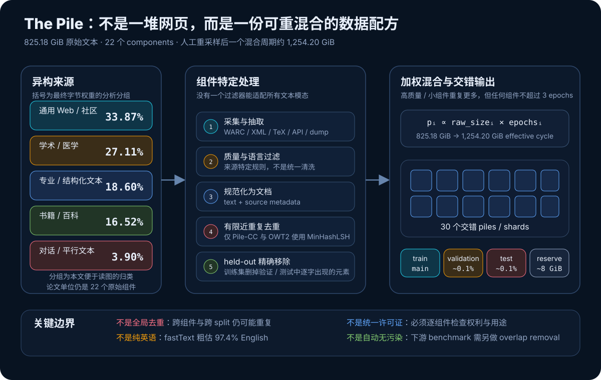
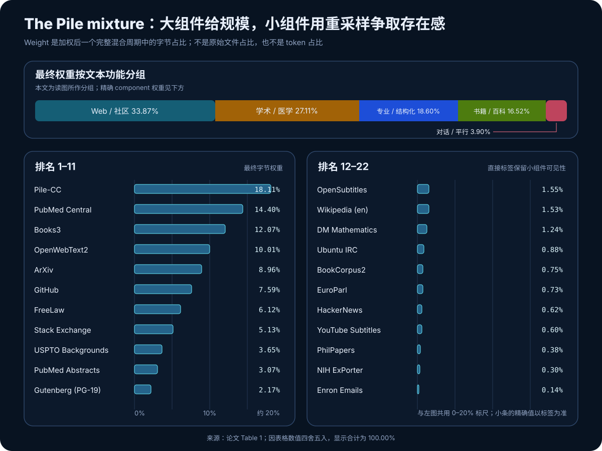
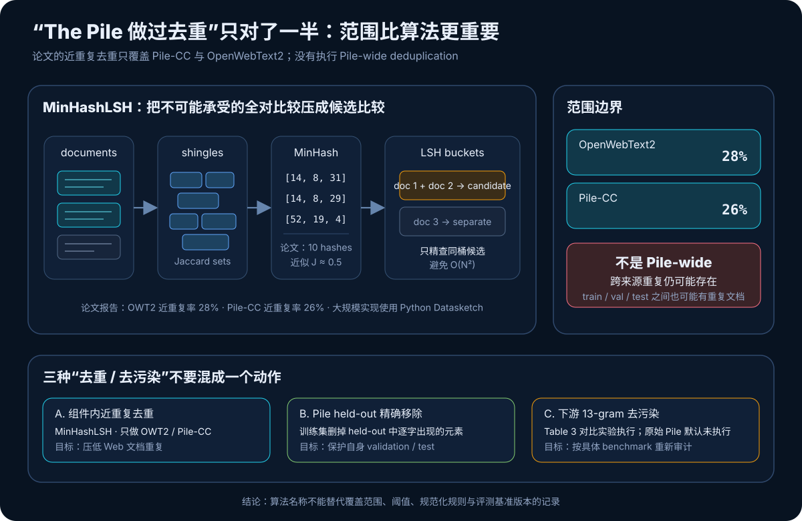
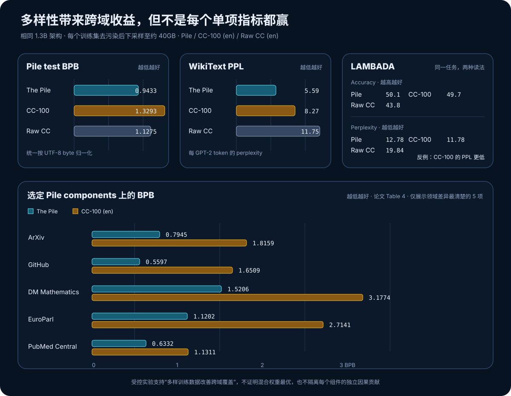

# The Pile 原理与实现：语言模型的数据配方怎样从“抓网页”变成工程系统


> **论文**：The Pile: An 800GB Dataset of Diverse Text for Language Modeling<br>
> **作者**：Leo Gao、Stella Biderman、Sid Black、Laurence Golding、Travis Hoppe、Charles Foster、Jason Phang、Horace He、Anish Thite、Noa Nabeshima、Shawn Presser、Connor Leahy<br>
> **首次公开**：2020 年 12 月 31 日；数据集于 2021 年 1 月发布<br>
> **关键词**：Pretraining Corpus、Data Mixture、Common Crawl、MinHashLSH、Deduplication、Decontamination、Bits per Byte、Data Governance<br>
> **原文与资料**：[arXiv 摘要](https://arxiv.org/abs/2101.00027) · [论文 PDF](https://arxiv.org/pdf/2101.00027) · [官方复现仓库](https://github.com/EleutherAI/the-pile) · [The Pile Datasheet](https://arxiv.org/abs/2201.07311) · [Hugging Face 数据卡](https://huggingface.co/datasets/EleutherAI/pile)<br>
> **本文代码**：[The Pile 数据混合、MinHash、去污染与 BPB 的零依赖实现](code/pile_minimal.py)<br>
> **前置阅读**：[GPT-2 原理](03_GPT2_2019_原理.md) · [Scaling Laws 原理](06_Scaling_Laws_2020_原理.md) · [RoBERTa 原理](33_RoBERTa_2019_原理.md)

The Pile 没有提出新的 Transformer Block，也没有发明新的训练损失。它解决的是一个更底层的问题：**当语言模型需要数百 GiB 文本时，训练语料能否不再只是来源不透明的一大包网页，而成为可列举、可重建、可重混合、可按领域评测的数据产品？**

论文给出的答案是一个由 `22` 个组件构成的英文语料库：原始文本总计 `825.18 GiB`，覆盖 Web、医学论文、书籍、代码、法律、专利、问答、数学、字幕、聊天和邮件等模态。作者再人为提高若干高质量或小型组件的采样频率，使一个完整加权周期的 **effective size** 达到约 `1,254.20 GiB`。

它最重要的贡献不是“800GB”这个数字，而是把数据选择写成了一组可以讨论的变量：

$$
\text{训练分布}
=f(\text{source},\text{extraction},\text{filter},\text{dedup},
\text{weight},\text{split},\text{license},\text{evaluation}).
$$

一句话概括：

> **The Pile 把预训练数据从一个不可见的模型背景，推进为需要单独设计、测量、记录和治理的系统。**

不过它也有必须正视的历史局限：没有做全语料近重复去重；默认没有针对未来下游 benchmark 去污染；许可证、版权、作者同意与潜在敏感信息不能由一个总许可证概括；英文识别和冒犯内容分析也只是粗粒度代理。

---

## 0. 先给结论

读完本文，至少应记住下面十件事：

1. 标题中的 `800GB` 是简写；论文正文的精确原始规模是 `825.18 GiB`。
2. `825.18 GiB` 不是模型一个 epoch 实际读取的总量；按 epochs 重采样后，一个完整混合周期约为 `1,254.20 GiB`。
3. The Pile 有 `22` 个组件，最终权重按**字节占比**报告，不是文档数占比，也不是 token 占比。
4. `epochs > 1` 表示重复抽样小型或高质量组件；Wikipedia 虽只有 `6.38 GiB`，但设为 `3 epochs`。
5. 不同组件使用不同抽取和过滤方法；“统一清洗所有文本”反而可能抹掉代码、公式和对话的结构。
6. 近重复去重只对 `Pile-CC` 与 `OpenWebText2` 执行，不是 Pile-wide deduplication。
7. validation 与 test 各约占 `0.1%`；训练集会删除 held-out 中逐字出现的元素，但论文仍提醒 split 之间可能存在重复文档。
8. 原始 Pile 默认没有针对所有下游评测集做污染清理；论文的受控模型实验另外执行了 `13-gram` overlap removal。
9. 跨 tokenizer 比较时，论文使用 bits per UTF-8 byte（BPB），而不是直接比较 perplexity。
10. 三个相同的 `1.3B` 模型在等量约 `40GB` 数据上对比时，Pile 模型跨域表现更好；但 CC-100 的 LAMBADA perplexity 略低，说明“更丰富”不等于每个单项指标都必胜。

---

## 1. 一分钟抓住 The Pile



The Pile 可以按四层理解。

### 1.1 来源层：刻意引入不同文本模态

如果只扩大通用 Web 抓取，模型会得到更多网页，却不一定得到更多：

- 论文中的数学与学术写作；
- GitHub 中的程序结构；
- 法律意见与专利背景；
- Stack Exchange 的问题—回答形式；
- 书籍的长距离连贯文本；
- IRC、字幕、邮件中的对话与非正式表达。

The Pile 的核心假设是：**跨域泛化不仅来自总字节数，也来自数据模态覆盖。**

### 1.2 处理层：每种来源有自己的数据工程

HTML、LaTeX、XML、源代码、字幕、聊天记录无法用同一套规则处理。例如：

- Pile-CC 从 WARC 的原始 HTML 抽取正文；
- ArXiv 把 TeX 源文件转换为 Markdown；
- PubMed Central 把 JATS XML 转为 Markdown；
- GitHub 保留适合语言建模的文本文件与仓库 metadata；
- HackerNews 保留评论树结构；
- Enron Emails 从邮件文件中提取正文。

因此，“清洗”不是一个函数，而是 `22` 条具有共同输出接口的流水线。

### 1.3 混合层：原始规模不等于训练权重

给每个组件设置一个 epoch multiplier：

$$
e_i\in\{1.0,1.5,2.0,2.5,3.0\},
$$

再把它和原始规模相乘：

$$
S_i^{\text{effective}}=S_i^{\text{raw}}e_i.
$$

最终字节权重近似为：

$$
w_i=\frac{S_i^{\text{effective}}}
{\sum_jS_j^{\text{effective}}}.
$$

这让一个小而重要的数据源能在训练流中多出现几次，而不必把所有权重交给最大的数据源。

### 1.4 治理层：公开配方不等于问题已经解决

公开来源、代码和权重只是治理的起点。使用者仍需回答：

- 组件的版权和许可证是否允许当前用途？
- 是否存在个人信息、秘密、恶意代码或不适合应用的数据？
- 去重到底覆盖哪些组件、哪些粒度？
- 当前 benchmark 是否和训练集重叠？
- 数据来源时间、地域、语言和人群代表性是什么？
- 某个组件被删除或替换后，模型能力与风险会怎样变化？

The Pile 的价值恰恰在于：这些问题第一次可以围绕一张公开配方表具体讨论。

---

## 2. 先拆开三个“大小”：800GB、825.18 GiB 与 1,254.20 GiB

### 2.1 标题的 800GB 是量级名称

论文标题写 `800GB`，正文与 Table 1 使用的是：

$$
825.18\ \text{GiB}.
$$

`GiB` 与十进制 `GB` 不相同：

$$
1\ \text{GiB}=2^{30}\ \text{bytes},
\qquad
1\ \text{GB}=10^9\ \text{bytes}.
$$

所以严格换算时：

$$
825.18\ \text{GiB}\approx885.8\ \text{GB}.
$$

阅读数据论文时应保留原单位，不要把 `GB`、`GiB`、压缩文件大小、解压文本大小和 token 数混在一起。

### 2.2 Raw Size 是每个组件去重、过滤后的物理文本量

Table 1 的 `Raw Size` 是构造 held-out split 前，各组件进入混合器的文本量。把 22 项相加约为：

$$
\sum_iS_i^{\text{raw}}=825.18\ \text{GiB}.
$$

它回答的是：“如果每个组件只保留一份，现在有多少文本？”

### 2.3 Effective Size 是重采样后的逻辑训练量

作者认为学术文本和一些小型专业数据应有更大影响，于是让它们重复 `1.5–3` 次。把每个组件乘上 epochs 后：

$$
\sum_iS_i^{\text{raw}}e_i
\approx1,254.20\ \text{GiB}.
$$

它回答的是：“按这份配方走完一个完整加权周期，模型逻辑上看到多少字节？”

这里的重复不是复制出新的知识。它改变的是抽样概率和梯度贡献：

$$
\mathbb E[\nabla\mathcal L]
=\sum_iw_i\,
\mathbb E_{x\sim\mathcal D_i}
[\nabla\ell(x)].
$$

所以数据权重本质上是优化目标的一部分，而不只是文件打包参数。

---

## 3. 22 个组件与完整权重



下面复现论文 Table 1 的核心数值。`Effective Size` 用未四舍五入的内部规模计算，因此用表内 `Raw × Epochs` 手算时可能相差 `0.01 GiB`。

| Component | Raw Size | Epochs | Effective Size | 最终 Weight |
|---|---:|---:|---:|---:|
| Pile-CC | 227.12 GiB | 1.0 | 227.12 GiB | 18.11% |
| PubMed Central | 90.27 GiB | 2.0 | 180.55 GiB | 14.40% |
| Books3 | 100.96 GiB | 1.5 | 151.44 GiB | 12.07% |
| OpenWebText2 | 62.77 GiB | 2.0 | 125.54 GiB | 10.01% |
| ArXiv | 56.21 GiB | 2.0 | 112.42 GiB | 8.96% |
| GitHub | 95.16 GiB | 1.0 | 95.16 GiB | 7.59% |
| FreeLaw | 51.15 GiB | 1.5 | 76.73 GiB | 6.12% |
| Stack Exchange | 32.20 GiB | 2.0 | 64.39 GiB | 5.13% |
| USPTO Backgrounds | 22.90 GiB | 2.0 | 45.81 GiB | 3.65% |
| PubMed Abstracts | 19.26 GiB | 2.0 | 38.53 GiB | 3.07% |
| Gutenberg (PG-19) | 10.88 GiB | 2.5 | 27.19 GiB | 2.17% |
| OpenSubtitles | 12.98 GiB | 1.5 | 19.47 GiB | 1.55% |
| Wikipedia (en) | 6.38 GiB | 3.0 | 19.13 GiB | 1.53% |
| DM Mathematics | 7.75 GiB | 2.0 | 15.49 GiB | 1.24% |
| Ubuntu IRC | 5.52 GiB | 2.0 | 11.03 GiB | 0.88% |
| BookCorpus2 | 6.30 GiB | 1.5 | 9.45 GiB | 0.75% |
| EuroParl | 4.59 GiB | 2.0 | 9.17 GiB | 0.73% |
| HackerNews | 3.90 GiB | 2.0 | 7.80 GiB | 0.62% |
| YouTube Subtitles | 3.73 GiB | 2.0 | 7.47 GiB | 0.60% |
| PhilPapers | 2.38 GiB | 2.0 | 4.76 GiB | 0.38% |
| NIH ExPorter | 1.89 GiB | 2.0 | 3.79 GiB | 0.30% |
| Enron Emails | 0.88 GiB | 2.0 | 1.76 GiB | 0.14% |
| **The Pile** | **825.18 GiB** | — | **1,254.20 GiB** | **100.00%** |

### 3.1 Web 仍然最大，但不再垄断

Pile-CC 与 OpenWebText2 合计：

$$
18.11\%+10.01\%=28.12\%.
$$

若再加 Stack Exchange 与 HackerNews，本文“通用 Web / 社区”分析分组约占 `33.87%`。这仍是最大一类，但已经远低于许多以 Common Crawl 为主体的配方。

### 3.2 专业语料获得了远高于原始大小的影响力

以 PubMed Central 为例：原始 `90.27 GiB`，设置 `2 epochs` 后 effective size 达 `180.55 GiB`，最终占 `14.40%`，成为第二大组件。

Wikipedia 更极端：原始只有 `6.38 GiB`，设置 `3 epochs` 后最终占 `1.53%`。这说明作者在做的不是被动拼接，而是主动表达：

> 同样一字节文本，不同来源对目标模型的预期价值并不相同。

### 3.3 权重是启发式，不是实验求出的全局最优解

论文明确说明，权重主要由来源质量和数据规模启发：

- 学术文本尽量提高；
- 小型组件提高到足以产生可见影响；
- 严格不超过 `3 epochs`；
- 尽量避免超过 `2 epochs`，只有少数组件例外。

论文没有做 22 维 mixture optimization，也没有给出每个权重的置信区间。因此这些数字应读作**公开、可修改的初版配方**，不是“语言模型数据比例定律”。

---

## 4. 这些组件分别补了什么能力

把 22 个名字背下来意义不大，更重要的是理解它们引入了哪些 Web 文本不稳定覆盖的结构。

### 4.1 通用 Web 与社区文本

- **Pile-CC**：从 Common Crawl WARC 抽取的英文网页，提供最大规模的开放域覆盖；
- **OpenWebText2**：用 Reddit 外链投票作质量代理，接近 WebText 风格；
- **Stack Exchange**：结构化问题、回答、评论与多领域专业讨论；
- **HackerNews**：技术、创业新闻及评论树，带有讨论与争论结构。

### 4.2 学术、医学与哲学

- **PubMed Central**：可获取的生物医学全文；
- **PubMed Abstracts**：覆盖更广、时间跨度更大的医学摘要；
- **ArXiv**：保留论文和 LaTeX 数学表达；
- **PhilPapers**：哲学论文与长篇论证；
- **NIH ExPorter**：科研资助申请摘要。

这些组件补的不是简单“事实”，还包括专业文体、论证结构、符号系统与术语分布。

### 4.3 书籍、百科与长文本

- **Books3**：现代小说和非小说书籍；
- **BookCorpus2**：扩展的 BookCorpus 风格书籍；
- **Gutenberg (PG-19)**：1919 年前出版的经典文学；
- **Wikipedia (en)**：跨领域说明性文本。

书籍平均文档远长于网页。它们既改变主题，也改变模型看到的篇章长度和叙事连续性。

### 4.4 代码、数学、法律与专利

- **GitHub**：源代码、配置和相关文本；
- **DM Mathematics**：合成数学题与符号操作；
- **FreeLaw**：美国法院意见；
- **USPTO Backgrounds**：专利背景与技术问题描述。

这些数据解释了为什么“多样性”不能只靠通用语言分类器衡量：代码和公式相对自然语言可能有很高 perplexity，却正是希望保留的模态。

### 4.5 对话、字幕、邮件和平行语料

- **OpenSubtitles**：电影与电视剧字幕；
- **YouTube Subtitles**：人工字幕和教育、流行文化内容；
- **Ubuntu IRC**：实时技术聊天；
- **Enron Emails**：邮件沟通形式；
- **EuroParl**：欧洲议会多语言平行语料。

论文总体定位为英文数据集，但没有把所有非英语内容清除。EuroParl、YouTube Subtitles 等会保留其他语言，这也是后来 `97.4% English` 而非 `100%` 的原因之一。

---

## 5. 数据处理不是“一次清洗”，而是 22 条流水线

The Pile 的统一点在输出格式，不在处理算法。一个顶层记录近似为：

```json
{
  "text": "document text ...",
  "meta": {
    "pile_set_name": "ArXiv"
  }
}
```

组件内部可以保留额外 metadata，例如 GitHub 的仓库、语言和文件名，FreeLaw 的 case ID 与 jurisdiction。全量混合时，最关键的共同字段是：

```text
text
meta.pile_set_name
```

下面看四条最能体现设计取舍的管线。

### 5.1 Pile-CC：为什么从 WARC 而不是 WET 开始

Common Crawl 同时提供：

- **WARC**：HTTP 响应和原始 HTML；
- **WET**：Common Crawl 已经抽取的纯文本。

WET 更省带宽和算力，但导航栏、页脚、模板等 intra-document boilerplate 已经混入文本，事后只做文档级过滤不容易修复。作者选择 WARC，并用 `jusText` 做正文抽取。

论文实际只处理 Common Crawl 的一个小样本：

1. 把 2013–2020 的 WARC URL 列表切成 `3,679` 个 chunks；
2. 随机处理其中 `22` 个 chunks；
3. 用 `pycld2` 判断 HTML 的主要语言，只继续处理英语页面；
4. 用 `jusText` 抽取正文；
5. 用 fastText 二元词组分类器做质量过滤；
6. 用 MinHashLSH 做近重复去重。

质量分类器以 OpenWebText2 作为正例，以 Common Crawl 文档作为待筛数据。作者采用与 GPT-3 数据过滤相似的 Pareto thresholding，设置：

$$
\alpha=3,
$$

论文 Table 6 对应的保留率约为：

$$
23.90\%.
$$

这个过滤器学到的是“像 OpenWebText2”，不是抽象且普适的“高质量”。它可能同时降低垃圾文本和分布多样性，因此不能脱离目标语料解释。

### 5.2 OpenWebText2：用链接社区作质量代理

OpenWebText2 延续 WebText 思路：用 Reddit submission 对外链的投票作为网页质量代理。

主要步骤：

1. 收集截至 2020 年 4 月的 Reddit submissions 和外链；
2. URL 去重，并合并同一 URL 的 submission metadata 与分数；
3. 删除 aggregate score 小于 `3` 的 URL；
4. 抓取页面，用 `Newspaper` 提取正文；
5. 用 MinHashLSH 做文档级去重。

论文给出两种规模：

| OWT2 版本 | 未压缩文本 | 文档数 |
|---|---:|---:|
| filtered | 65.86 GB | 17,103,059 |
| raw（只做 URL 去重） | 193.89 GB | 69,547,149 |

最终 Pile 使用的是过滤后的版本，Table 1 在 held-out 前报告 `62.77 GiB`。

### 5.3 ArXiv：保留 TeX 比只抽 PDF 文本更有价值

作者下载截至 2020 年 7 月的 arXiv TeX 源文件，用 Pandoc 转为 Markdown，转换失败的论文被丢弃，最终得到：

$$
1,264,405\ \text{papers}.
$$

保留源文件结构的意义是：数学公式、section、citation 和技术文体不会像粗糙 PDF OCR 那样完全展平。但这也让 tokenizer 的字节—token 比例显著不同于普通网页。

### 5.4 GitHub：规模大不代表已经质量最优

GitHub 管线以 stars 作为粗粒度质量信号：

- 只选择超过 `100 stars` 的 repositories；
- 仓库文件总量限制在 `1GB` 以下；
- 从收集到的 `630.64 GiB` 数据中随机采样约 `95.0 GiB`；
- 论文明确把进一步质量过滤留给未来工作。

因此不能把 The Pile 的 GitHub 组件理解成“已经完成许可证检查、秘密扫描、恶意代码检测和质量分级的代码数据”。2021 年的数据工程目标和今天生产级代码语料治理不是同一个标准。

---

## 6. 加权混合：把数据比例写进优化目标

### 6.1 为什么不能只按原始字节比例拼接

若直接按 raw size 混合，最大组件会自然支配梯度。设组件 $i$ 有 $N_i$ 个文档，作者为它设定 $e_i$ 个 epochs，论文附录描述的抽样权重近似与：

$$
N_i e_i
$$

成正比。因为文档长度不同，文档抽样权重和最终字节权重并不完全是一回事；Table 1 最终报告的是混合后字节份额。

在大量抽样下，大数定律让每个组件被遍历的次数逼近预设 epochs。

### 6.2 Fractional epoch 怎样理解

`1.5 epochs` 不要求把每篇文档精确复制 1.5 次。工程上可以：

- 完整走一遍组件；
- 再随机抽取约一半；
- 或持续按权重抽样，直到全局输出达到目标规模。

重要的是期望贡献，而不是给每份文件制造固定副本数。

### 6.3 为什么输出 30 个 piles

在有限内存下，全量随机打乱 825 GiB 文本并不现实。作者采用一种外存交错方法，把输出写成 `30` 个 piles，再执行第二阶段 shuffle。

这类设计的目标不是让文件名好看，而是避免：

- 同一来源长时间连续出现；
- 数据顺序与下载顺序强相关；
- 为全量 shuffle 把索引或文档全部放进内存。

现代训练管线仍需记录：

```text
source version
document id
component weight
sampling seed
shard id
position in shard
tokenizer version
```

否则即使“数据内容相同”，训练顺序也无法复现。

---

## 7. Train / validation / test 是怎样切的

### 7.1 validation 与 test 各占约 0.1%

论文提供 train、validation 和 test。validation 与 test 分别从各组件均匀随机抽取约：

$$
0.1\%.
$$

比例看起来很小，但数据总体巨大，所以两个 split 都超过 `1 GiB`。

附录从工程视角描述为：

- 总共先留出约 `10 GiB`；
- 其中约 `2 GiB` 用于 validation 与 test；
- 其余留作 reserve。

### 7.2 held-out 精确移除不等于近重复隔离

作者从训练集删除 held-out 中逐字出现的元素，避免完全相同文本直接泄漏。但论文也明确提醒：

> 即使做过这些处理，train / validation / test 之间仍可能存在重复文档。

原因包括：

- 跨组件收录了同一文本；
- 页面模板或转载产生近重复；
- 文本规范化、切分或 metadata 不同；
- 全语料近重复去重没有执行。

因此：

$$
\text{exact held-out removal}
\neq
\text{semantic or near-duplicate isolation}.
$$

### 7.3 按文档切分仍需防止来源实体泄漏

即使文本不完全相同，同一书籍的不同章节、同一仓库的不同 fork、同一论文的不同版本也可能跨 split。现代做法通常还需要按：

- URL canonical group；
- book / paper / repository ID；
- author 或 conversation thread；
- near-duplicate cluster；

进行 group-aware split。

---

## 8. 去重：论文做了什么，也没有做什么



### 8.1 为什么不能做所有文档两两比较

给每个文档构造 shingle 集合 $A$ 与 $B$，精确近重复相似度可写为：

$$
J(A,B)=\frac{|A\cap B|}{|A\cup B|}.
$$

若有 $N$ 个文档，两两比较需要：

$$
\frac{N(N-1)}{2}=O(N^2)
$$

次比较。论文估计，简单二次 MinHash 比较会需要数十万年，因此必须先生成候选。

### 8.2 MinHash 用短签名估计 Jaccard

对每个哈希排列 $h_k$，记录集合内最小值：

$$
m_k(A)=\min_{x\in A}h_k(x).
$$

MinHash 的关键性质是：

$$
P[m_k(A)=m_k(B)]=J(A,B).
$$

因此可以用两个签名相同位置的比例估计 Jaccard：

$$
\widehat J(A,B)
=\frac{1}{K}\sum_{k=1}^{K}
\mathbf 1[m_k(A)=m_k(B)].
$$

论文对 Pile-CC 与 OpenWebText2 使用 Python `Datasketch` 的 MinHashLSH：

- 每个 MinHash 使用 `10` 个 hash functions；
- approximate Jaccard threshold 为 `0.5`；
- OpenWebText2 得到约 `28%` duplicate rate；
- Pile-CC 得到约 `26%` duplicate rate。

### 8.3 LSH 只让相似签名进入同一候选桶

典型 LSH 会把签名拆成 $b$ 个 bands、每个 $r$ 行。相似度为 $s$ 的一对文档至少共享一个完全相同 band 的概率为：

$$
P(\text{candidate})=1-(1-s^r)^b.
$$

它把“大量明显不相似文档”挡在候选集外，再对小得多的候选对做精查。

论文没有给出足以从零还原所有 shingle、band 和文本规范化细节的完整数学配置；真正复现应以官方代码版本和依赖版本为准，而不是只记住 `J=0.5`。

### 8.4 最大限制：没有做 Pile-wide deduplication

论文附录写得非常清楚：由于内存限制，作者没有执行全 Pile 去重，只在最可能重复的两个 Web 组件内部执行。

所以以下说法是错误的：

```text
The Pile 已经全局去重，因此同一文本只会出现一次。
```

更准确的表述是：

```text
The Pile 对 Pile-CC 和 OpenWebText2 做过文档级 MinHashLSH 近重复去重；
跨组件以及其他组件内部仍可能存在重复。
```

---

## 9. 下游去污染：原始 Pile 与论文对比实验不是同一设置

### 9.1 为什么原始数据没有预删所有 benchmark

作者没有从发布的训练集里预先删除所有下游 evaluation overlap，理由是：

- 无法预见未来会出现哪些 benchmark；
- 固定一组 benchmark 很快会过时；
- 为旧 benchmark 修改通用语料，可能妨碍未来评测设计。

论文建议：模型使用者应根据自己实际报告的 benchmark，单独删除 Pile 与 evaluation data 的重叠。

### 9.2 Table 3 的模型对比另外做了 13-gram filtering

为了公平比较 Pile、CC-100 和 Raw CC，论文 Section 4 对三个训练集都使用 GPT-3 工作中的 `13-gram overlap filtering`，再下采样到约 `40GB`。

这意味着：

$$
\text{released Pile}
\neq
\text{Table 3 decontaminated 40GB Pile sample}.
$$

复现实验时若直接拿原始 Pile 训练，再与论文 Table 3 对比，就已经改变了评测协议。

### 9.3 13-gram 也不是污染检测的终点

词级连续 13-gram 可以发现长片段逐字重叠，但无法可靠发现：

- 轻微改写；
- 标点、Unicode 或格式变化；
- 翻译版本；
- 问题和答案被拆到不同位置；
- benchmark 的解释、答案 key 或 GitHub 单元测试；
- 模板相同但实体不同的合成样本。

现代数据治理通常需要精确哈希、n-gram、模糊匹配、语义检索、来源追踪和人工抽查共同工作。

---

## 10. 为什么用 BPB，而不直接比较 perplexity

### 10.1 Perplexity 依赖 tokenizer

平均 token 负对数似然为：

$$
\ell=-\frac{1}{L_T}
\sum_{t=1}^{L_T}\log p(x_t\mid x_{<t}),
$$

则 token-level perplexity 是：

$$
\operatorname{PPL}=e^\ell.
$$

问题是：两个 tokenizer 会把同一文本切成不同数量的 token。一个模型的每 token PPL 更低，可能只是 token 更长或词表不同，不代表它编码相同原始文本所需信息更少。

### 10.2 Bits per UTF-8 byte 提供共同分母

论文用：

$$
\boxed{
\operatorname{BPB}
=\frac{L_T}{L_B}\frac{\ell}{\ln2}
}
$$

其中：

- $L_T$：token 数；
- $L_B$：原文本 UTF-8 byte 数；
- $\ell$：以自然对数计算的平均 token NLL。

也可从总负对数似然理解：

$$
\operatorname{BPB}
=-\frac{1}{L_B}
\sum_{t=1}^{L_T}\log_2p(x_t\mid x_{<t}).
$$

分母变成原始字节数，就能在不同 tokenizer 间比较。

### 10.3 论文中的 GPT-2 token / byte 比例

作者在整个 Pile 上测得：

$$
\frac{L_T}{L_B}=0.29335
\quad\text{GPT-2 tokens / byte}.
$$

若平均损失恰好为 `1.0 nat/token`：

$$
\operatorname{BPB}
=0.29335\times\frac{1}{\ln2}
\approx0.4232.
$$

配套代码直接实现：

```python
def bits_per_utf8_byte(mean_nll_nats, token_count, utf8_byte_count):
    tokens_per_byte = token_count / utf8_byte_count
    return tokens_per_byte * mean_nll_nats / math.log(2.0)
```

### 10.4 BPB 也有边界

BPB 更适合跨 tokenizer，但仍受以下因素影响：

- Unicode 规范化；
- 换行、空格和控制字符是否保留；
- 文档边界如何处理；
- 首 token 是否计分；
- 超长文档怎样切成 context windows；
- 是否跨文档拼接上下文。

论文逐文档独立评测，不把所有文档直接拼接；GPT-2 使用最大 `1024` token context，GPT-3 使用 `2048`。每个目标 token 只计分一次。

所以可复现的指标记录至少应包含：

```text
tokenizer + normalization + document boundaries + context length
+ stride/scoring rule + byte encoding + aggregation method
```

---

## 11. 零依赖最小实现：混合、MinHash、去污染与 BPB

本文提供的 [pile_minimal.py](code/pile_minimal.py) 不下载 825 GiB 数据，而是把论文机制压缩成可以直接运行的 Python：

```bash
python3 papers/to-2026/code/pile_minimal.py
```

预期输出：

```text
The Pile minimal mechanics: self-check passed
raw=825.18 GiB, weighted-cycle=1254.20 GiB, components=22
top mixture components (paper weight -> records in a 10,000-record plan):
- Pile-CC            18.11% -> 1811
- PubMed Central     14.40% -> 1440
- Books3             12.07% -> 1207
- OpenWebText2       10.01% -> 1001
- ArXiv               8.96% ->  896
NLL=1.0 nat/token at 0.29335 token/byte -> BPB=0.4232
paper dedup reminder: Pile-wide=no; OWT2/Pile-CC MinHashLSH=yes
```

### 11.1 从论文表格重新推导权重

```python
from pile_minimal import mixture_table

rows = mixture_table()

for row in rows[:3]:
    print(
        row.name,
        row.raw_gib,
        row.epochs,
        row.effective_gib,
        row.derived_weight_pct,
    )
```

实现不是把论文 `Weight` 原样打印出来，而是先计算：

```python
effective_gib = raw_gib * epochs
derived_weight_pct = 100 * effective_gib / total_effective_gib
```

自检要求推导权重与论文四舍五入后的权重误差小于 `0.01` 个百分点。

### 11.2 Largest remainder 把连续权重变成整数配额

小实验不能抽数亿文档，代码用 largest remainder method 生成严格合计为目标总数的整数配额：

```python
from pile_minimal import largest_remainder_quotas

quotas = largest_remainder_quotas(10_000)
assert sum(quotas.values()) == 10_000
assert quotas["Pile-CC"] == 1811
```

它先取：

$$
q_i=\left\lfloor Nw_i\right\rfloor,
$$

再把剩余名额依次分给小数部分最大的组件。这是便于审计的小样本实现；官方流程是按组件文档数与 epochs 持续加权抽样。

### 11.3 MinHashLSH 教学实现

```python
from pile_minimal import Document, minhash_lsh_deduplicate

documents = [
    Document("research papers books source code and dialogue", "Pile-CC"),
    Document("research papers, books, source code and dialogue!", "Pile-CC"),
    Document("an unrelated legal opinion", "Pile-CC"),
]

kept, matches = minhash_lsh_deduplicate(
    documents,
    threshold=0.7,
    shingle_size=3,
    num_perm=64,
    bands=32,
)
```

示例为了让小数据稳定，使用 `64` 个 MinHash permutations，并在 LSH 候选中再计算精确 Jaccard。论文配置是 `10` 个 hash 与约 `0.5` threshold；两者不能冒充同一工程实现。

### 11.4 held-out 精确移除

```python
from pile_minimal import remove_exact_heldout

train_kept, train_removed = remove_exact_heldout(
    training_documents,
    validation_documents + test_documents,
)
```

代码先做 Unicode NFKC、case folding 和空白折叠，再计算 SHA-256。论文所说的 verbatim element removal 不等于本文这套具体规范化；这里是用于讲清“精确规则必须显式定义”的安全示例。

### 11.5 按当前 benchmark 做 13-gram 去污染

```python
from pile_minimal import remove_ngram_contamination

clean_train, contaminated = remove_ngram_contamination(
    training_documents,
    evaluation_texts,
    n=13,
)
```

工程上还要保存：

```text
benchmark name + version + split + normalization
+ n-gram unit + n + matched document IDs + removal manifest
```

否则“已去污染”无法审计，也无法解释未来 benchmark 更新后的差异。

---

## 12. 怎样安全地读取 Pile 风格数据

### 12.1 先流式读，不要解压整个文件

Pile 常见发布格式是 `.jsonl.zst`。下面是需要 `zstandard` 的流式读取示例：

```python
import io
import json

import zstandard as zstd


def iter_jsonl_zst(path):
    with open(path, "rb") as raw:
        with zstd.ZstdDecompressor().stream_reader(raw) as reader:
            with io.TextIOWrapper(reader, encoding="utf-8") as text_stream:
                for line_number, line in enumerate(text_stream, start=1):
                    try:
                        record = json.loads(line)
                    except json.JSONDecodeError as exc:
                        raise ValueError(f"bad JSON at line {line_number}") from exc

                    if not isinstance(record.get("text"), str):
                        raise TypeError(f"missing text at line {line_number}")
                    yield record
```

不要在第一次读取时就：

- 把全部文本装入 Python list；
- 丢弃 `pile_set_name`；
- 只记录总 token 数，不记组件 token 数；
- 在没有校验 checksum 时合并 shards；
- 把下载成功等同于获得当前用途的授权。

### 12.2 先对小型 held-out 数据验证接口

截至 2026 年 8 月，Hugging Face 上的 `EleutherAI/pile_val_test` 提供 validation/test 的普通数据仓库。若已安装 `datasets`，可以先流式检查 schema：

```python
from datasets import load_dataset

validation = load_dataset(
    "EleutherAI/pile_val_test",
    split="validation",
    streaming=True,
)

sample = next(iter(validation))
print(sample["meta"]["pile_set_name"])
print(len(sample["text"]))
```

原始 `EleutherAI/pile` 页面目前依赖自定义 Python loading script，Hugging Face Viewer 因任意代码执行要求而停用。这个 UI 状态不表示论文数据规格改变，也不表示页面本身保存了 825 GiB 正文。

更重要的是：**技术上能读取，不等于法律、隐私和产品政策上适合使用。** 全量下载前应先建立组件 allowlist、权利依据、风险分级和删除机制。

### 12.3 每条样本都保留 provenance

训练前可以扩展 metadata：

```json
{
  "text": "...",
  "meta": {
    "pile_set_name": "ArXiv",
    "source_version": "2020-07",
    "document_id": "...",
    "license_class": "reviewed-component-policy-v3",
    "filter_version": "arxiv-clean-v2",
    "dedup_cluster": "...",
    "shard": 7
  }
}
```

这会增加存储，但能支持：

- 删除请求；
- benchmark 污染追踪；
- 来源消融；
- 许可证范围变更；
- 某组件问题被发现后的重训评估；
- 模型输出与训练来源的后验分析。

---

## 13. The Pile 同时也是跨域语言模型 benchmark

### 13.1 为什么不能只在 WikiText 上看模型

如果模型训练数据主要是 WebText 风格，它在相似网页上的 perplexity 可能很好，却在：

- ArXiv 的数学写作；
- GitHub 的代码；
- DM Mathematics 的符号序列；
- EuroParl 的多语言议会文本；
- 医学与法律文本；

上暴露明显能力空洞。

The Pile 的 held-out sets 为 22 个领域提供统一评测入口。论文用 GPT-2 与 GPT-3 系列逐文档计算 BPB，观察未在 Pile 上微调的模型如何跨域缩放。

### 13.2 GPT-2 / GPT-3 zero-shot BPB 的代表结果

下面从论文 Table 2 选取几个组件；所有值均为 BPB，越低越好：

| Component | GPT-2 small | GPT-2 XL | GPT-3 davinci |
|---|---:|---:|---:|
| Pile-CC | 1.0878 | 0.9355 | **0.7070** |
| PubMed Central | 1.0759 | 0.9044 | **0.6544** |
| ArXiv | 1.3548 | 1.1381 | **0.7702** |
| GitHub | 1.7912 | 1.6486 | **0.5635** |
| DM Mathematics | 2.6911 | 2.4377 | **2.0228** |
| The Pile overall | 1.2253 | 1.0468 | **0.7177** |

规模更大的模型总体 BPB 更低，但各领域的绝对难度不能直接横向解释。例如 DM Mathematics 的 BPB 高，既与任务结构有关，也与 GPT-2 tokenizer 对符号序列的编码效率有关。

### 13.3 论文的 zero-shot scaling 拟合

作者把 GPT-2 / GPT-3 家族在 Pile 上的 zero-shot 表现对模型规模做拟合，报告拟合直线：

- slope：`-0.1674`；
- intercept：`2.5516`。

这里有一个重要假设：当时 OpenAI API 没有公开四个 GPT-3 endpoint 的明确尺寸，论文假设 ada、babbage、curie、davinci 分别对应 `2.7B`、`6.7B`、`13B`、`175B`。

因此这个图支持“未专门训练在 Pile 上的模型也出现平滑跨域缩放”，但不应把具体斜率当成经过公开模型尺寸完全验证的自然常数。

### 13.4 “GPT-3 在某组件 BPB 高”不等于“训练数据一定没有它”

不同数据集固有熵不同，不能拿 GitHub 与 Wikipedia 的绝对 BPB 直接判断训练重叠。论文为此构造了一个相对 proxy：比较 GPT-3 与 Pile-trained GPT-2 在某组件相对 OpenWebText2 的改变量。

这个 proxy 提示 GPT-3 在研究写作、专业领域、代码和符号操作上更可能从 Pile 风格数据受益。但作者也明确承认：它可能被 component-specific scaling effects 混淆，不是训练集成员推断器。

---

## 14. 受控训练实验：比较的是数据，不是架构

为了验证数据配方本身，论文训练三个架构相同的 decoder-only 模型：

| 项目 | 设置 |
|---|---|
| 参数量 | 约 1.3B |
| 模型架构 | 三组相同，基于 GPT-3 风格 |
| 训练数据 | The Pile / CC-100 (en) / Raw CC (en) |
| 数据量控制 | 都去污染后下采样至约 40GB |
| 评测 | Pile validation/test BPB、WikiText PPL、LAMBADA PPL/ACC |

这个设计隔离了一个关键变量：

$$
\text{architecture, size, training budget fixed}
\quad\Rightarrow\quad
\text{change corpus distribution}.
$$

论文特别提醒，这种 size control 对 CC-100 很有利：完整 CC-100 (en) 约 `300 GiB`，只有完整 Pile 的约三分之一，但对比时三者都只取约 40GB。

---

## 15. 主结果：跨域覆盖明显改善，但 LAMBADA 有反例



论文 Table 3：

| 训练数据 | 原数据规模 | Pile val BPB ↓ | Pile test BPB ↓ | WikiText PPL ↓ | LAMBADA PPL ↓ | LAMBADA ACC ↑ |
|---|---:|---:|---:|---:|---:|---:|
| **The Pile** | 825 GiB | **0.9281** | **0.9433** | **5.59** | 12.78 | **50.1** |
| CC-100 (en) | 300 GiB | 1.3143 | 1.3293 | 8.27 | **11.78** | 49.7 |
| Raw CC | 45,927 GiB（估算） | 1.1180 | 1.1275 | 11.75 | 19.84 | 43.8 |

注意：三个模型实际用于训练的数据都已下采样到约 40GB；表中的“原数据规模”只是来源语料总规模。

### 15.1 Pile held-out BPB 是最直接的跨域证据

Pile 模型在 test 上为 `0.9433 BPB`，明显低于：

- Raw CC：`1.1275`；
- CC-100：`1.3293`。

这不是意外，因为评测分布来自 Pile。但重要的是 Table 4 显示改善不是只靠 Pile-CC：学术、代码、数学、法律和对话组件都更好。

### 15.2 WikiText 也改善，说明没有明显牺牲传统 LM benchmark

WikiText PPL：

$$
5.59<8.27<11.75.
$$

这支持论文的核心判断：增加专业领域多样性没有让传统英语语言建模性能明显退化。

### 15.3 LAMBADA 必须同时看 PPL 和 accuracy

Pile 模型 accuracy 最高：

$$
50.1>49.7>43.8.
$$

但 perplexity 最低的是 CC-100：

$$
11.78<12.78<19.84.
$$

二者不矛盾：PPL 测量目标 token 概率分布整体质量，accuracy 只看 argmax 是否命中。一个模型可以整体更校准，另一个模型却多猜对少量样本。

因此正确结论不是“The Pile 所有指标都赢”，而是：

> 在等架构、等训练数据量的设置下，The Pile 显著增强跨域和 WikiText 表现，并保持 LAMBADA 竞争力；其中一个 LAMBADA 指标由 CC-100 略胜。

---

## 16. 22 个 held-out components 的完整 BPB 对比

论文 Table 4 的列是**模型训练数据**，行是 Pile test component。所有组件上都是 Pile-trained model 最低：

| Evaluation component | Pile model ↓ | CC-100 model | Raw CC model |
|---|---:|---:|---:|
| Pile-CC | **0.9989** | 1.0873 | 1.0287 |
| PubMed Central | **0.6332** | 1.1311 | 0.9120 |
| Books3 | **1.0734** | 1.2264 | 1.1366 |
| OpenWebText2 | **0.9938** | 1.2222 | 1.0732 |
| ArXiv | **0.7945** | 1.8159 | 1.2642 |
| GitHub | **0.5597** | 1.6509 | 0.9301 |
| FreeLaw | **0.6978** | 1.0221 | 0.9468 |
| Stack Exchange | **0.8152** | 1.5414 | 1.1292 |
| USPTO Backgrounds | **0.6731** | 0.8772 | 0.8455 |
| PubMed Abstracts | **0.7313** | 1.0193 | 0.9718 |
| Gutenberg (PG-19) | **1.1426** | 1.2780 | 1.2235 |
| OpenSubtitles | **1.0909** | 1.1827 | 1.2139 |
| Wikipedia (en) | **0.8961** | 1.1807 | 1.0252 |
| DM Mathematics | **1.5206** | 3.1774 | 2.6229 |
| Ubuntu IRC | **1.4085** | 2.1243 | 1.5691 |
| BookCorpus2 | **1.0613** | 1.1346 | 1.0914 |
| EuroParl | **1.1202** | 2.7141 | 1.4917 |
| HackerNews | **1.0968** | 1.4352 | 1.2305 |
| YouTube Subtitles | **1.4269** | 2.3287 | 1.5607 |
| PhilPapers | **1.1256** | 1.4269 | 1.2090 |
| NIH ExPorter | **0.7347** | 0.9713 | 0.9225 |
| Enron Emails | **0.8301** | 1.3300 | 1.0483 |

### 16.1 最大收益出现在 Web 过滤最容易误删的模态

对 CC-100 而言差距特别大的组件包括：

- GitHub：`1.6509 → 0.5597`；
- DM Mathematics：`3.1774 → 1.5206`；
- EuroParl：`2.7141 → 1.1202`；
- ArXiv：`1.8159 → 0.7945`。

论文推测，CC-100 使用以 Wikipedia 为中心的 perplexity filtering，过高或过低 perplexity 的网页都会被丢弃。这会把“太不像 Wikipedia”的代码、数学和多语言内容当作低质量，从而损失多样性。

### 16.2 这不是每个组件的独立因果消融

Pile 模型同时看到全部 22 个组件。因此：

```text
GitHub BPB 更低
```

不能严格推出：

```text
收益全部由 GitHub component 单独造成。
```

还可能存在跨域迁移、tokenizer 适应、训练顺序和混合交互。要估计单个组件贡献，需要 leave-one-component-out、mixture sweep 或 influence analysis。

---

## 17. 结构统计：多样性也改变长度、语言与 tokenization

### 17.1 文档长度是长尾分布

The Pile 大多数文档较短，但存在非常长的尾部：

- 书籍可以达到数百 KiB；
- Ubuntu IRC 以长日志作为文档；
- 论文和哲学文本显著长于网页片段；
- PubMed Abstracts、Wikipedia 与 Stack Exchange 平均文档更短。

论文 Table 1 的 mean document size 从：

- Wikipedia：约 `1.11 KiB`；
- PubMed Abstracts：约 `1.30 KiB`；
- Books3：约 `538.36 KiB`；
- Ubuntu IRC：约 `545.48 KiB`；

跨越近三个数量级。

这会影响：

- 长文本被切成多少训练样本；
- 文档边界 token 的频率；
- 某组件按文档抽样与按 token 抽样的差异；
- shuffle buffer 的有效混合程度；
- 长上下文依赖能否被保留。

### 17.2 Token / byte 揭示 tokenizer 的域偏差

论文用 GPT-2 tokenizer 统计每个组件的 $L_T/L_B$。代表值包括：

| Component | GPT-2 tokens / byte |
|---|---:|
| NIH ExPorter | 0.1987 |
| USPTO Backgrounds | 0.2116 |
| Pile-CC | 0.2291 |
| OpenWebText2 | 0.2434 |
| PubMed Central | 0.3103 |
| ArXiv | 0.3532 |
| GitHub | 0.4412 |
| YouTube Subtitles | 0.4349 |
| DM Mathematics | **0.8137** |

GPT-2 BPE 在 WebText 上训练。代码、LaTeX 和数学符号需要更多 token 才能编码相同字节数，所以 tokens/byte 更高。

这不仅是评测问题，也会改变训练权重。若 mixture 按字节设定，但训练预算按 token 计费，那么组件的实际 token 贡献近似为：

$$
T_i\approx B_i\rho_i,
\qquad
\rho_i=\frac{\text{tokens}}{\text{byte}}.
$$

DM Mathematics 的字节权重只有 `1.24%`，但在 GPT-2 tokenizer 下的 token 权重会被高 tokens/byte 放大。

### 17.3 97.4% English 只是粗估

作者用 fastText 估计 Pile 为：

$$
97.4\%\ \text{English}.
$$

论文同时提醒，语言识别对低资源语言和特殊文本并不可靠。代码、名字、公式、短句、平行语料都可能被误判。因此这个数字适合描述总体倾向，不适合：

- 证明某条样本一定是英语；
- 精确统计每种低资源语言份额；
- 作为隐含的多语言能力保证。

---

## 18. 冒犯内容、偏见、同意与版权：公开不等于无风险

### 18.1 论文选择“记录”，而不是宣称彻底清除

作者的观点是：通用语言模型的适用场景太多，什么内容应当删除取决于具体用途，因此优先详细记录潜在问题，而不是用一张词表声称已经解决。

论文分析了：

- 冒犯 / 粗俗内容 proxy；
- gender pronoun co-occurrence；
- religion co-occurrence 与 sentiment；
- race-related phrase co-occurrence；
- 数据公开性、ToS compliance 与 authorial consent。

这是比完全不披露更好的起点，但这些分析不能证明数据或模型“公平、安全”。

### 18.2 Profanity classifier 的误报说明自动过滤有多脆弱

论文只在判定为英语的句子上运行 profanity classifier，并给出一个典型误报：德语冠词 `die` 会被英语模型标成冒犯词。

这说明：

$$
\text{keyword / classifier score}
\neq
\text{contextual harm judgment}.
$$

同时，Pile 整体的粗俗词 proxy 低于 Pile-CC，也不表示：

- 没有仇恨或骚扰内容；
- 没有色情或暴力内容；
- 下游模型不会复现偏见；
- 所有领域的风险相同。

### 18.3 Co-occurrence 分析是描述性代理

论文发现一些词与男性、女性、宗教或种族短语有不对称共现。这些统计可能来自：

- 社会现实与历史文本；
- 报道语境；
- 刻板印象；
- 采样偏差；
- 词义歧义；
- 分析方法本身的二元化假设。

它们不能单独说明作者意图，也不能等价为模型行为。更不能因为平均 sentiment 接近，就断言不存在偏见。

### 18.4 PII 与敏感信息没有被系统证明不存在

配套 Datasheet 坦率指出：数据规模太大，不可能逐条验证；即使大多数组件没有明显 PII，也可能有人把个人信息写进公开文档。Datasheet 还表示不知道敏感信息覆盖到什么程度，但预期存在。

高风险组件包括但不限于：

- 公开邮件与聊天日志；
- 代码仓库中的凭据、姓名或联系方式；
- 法律和医学文本中的个人描述；
- 网页转载或数据泄漏内容。

现代管线至少还需要 secret scanning、PII detection、来源级删除、未成年人和高敏感领域策略，以及误报 / 漏报抽样审核。

### 18.5 MIT 代码 / 发布声明不能覆盖底层文本权利

官方复现仓库采用 MIT License，Datasheet 也描述 Pile 发布使用 MIT License；但同一 Datasheet 同时明确指出：部分底层文档受版权保护，Books3 几乎全部为版权作品，ArXiv、PhilPapers、GitHub、PubMed Central 等也有各自权利条件。

截至 2026 年 8 月，Hugging Face 数据卡把整个数据集标为 `license: other`，并要求按 component 检查许可证。

因此应区分：

```text
构建代码的许可证
数据集包装/清单的许可证
每个来源数据库的条款
每篇底层文档或代码文件的版权/许可证
特定国家、主体与用途下的法律依据
```

它们不是同一个东西。论文中的美国 fair-use 讨论也明确不是法律意见；实际使用应由具备管辖区知识的专业人员审查。

### 18.6 Author consent 与 ToS compliance 也不是一回事

论文把公开性、平台条款合规和作者同意分开记录，因为：

- 文本公开可见，不表示作者同意被用于模型训练；
- 符合平台 ToS，不表示每位内容作者知情同意；
- 原作者同意研究传播，不表示同意所有商业或生成用途；
- 第三方重新发布数据，不一定拥有完整授权链。

Datasheet 说明数据主体没有被统一通知，consent 程度因组件而异，也没有统一的撤回机制。今天使用 Pile 风格数据时，必须把 deletion / revocation 设计成产品能力，而不是事后补丁。

---

## 19. 常见误解与实现陷阱

### 误解 1：The Pile 就是 825 GiB Common Crawl

错误。Pile-CC 最终只占 `18.11%`，Pile-CC + OWT2 也只有 `28.12%`。论文的核心正是用专业数据降低单一 Web 分布的支配。

### 误解 2：800GB、825GiB 和 1.2TB 可以互换

错误。它们分别可能指标题量级、原始唯一文本和按 epochs 计算的 effective mixture cycle。

### 误解 3：Weight 就是抽到这个组件的文档概率

不完全正确。Table 1 报告最终**字节占比**；真实抽样按文档数和 epochs 进行，文档长度又高度不同。按 token 观察时还会受 tokenizer 影响。

### 误解 4：MinHash 阈值 0.5 表示语义相似度 0.5

错误。它针对某种 shingle 集合的近似 Jaccard，不理解同义改写和语义等价。

### 误解 5：The Pile 已全局去重

错误。论文只在 Pile-CC 和 OWT2 组件内做近重复去重。

### 误解 6：发布训练集时已经清理所有 benchmark

错误。原始 Pile 默认不按未来下游评测集去污染；Table 3 的受控实验另做 13-gram filtering。

### 误解 7：BPB 和 PPL 数值可以直接比较

错误。BPB 是 bits/byte，PPL 是 $e^{\text{nats/token}}$；方向都可能是越低越好，但尺度与分母完全不同。

### 误解 8：`97.4% English` 表示没有其他语言

错误。这是 fastText 的粗估，而且代码、短句、符号和低资源语言会影响识别。

### 误解 9：Open source dataset 表示底层文本统一开源

错误。构建代码、数据包装、数据库权利和文档版权必须分别审查。

### 误解 10：Pile 模型在 Pile test 更好，足以证明配方全局最优

错误。训练分布与测试分布一致会天然有利；WikiText/LAMBADA 提供了一些外部证据，但没有搜索所有 mixture，也没有覆盖安全、事实性、推理和实际产品任务。

---

## 20. 论文没有解决的关键问题

### 20.1 混合权重没有系统优化

没有进行：

- component leave-one-out；
- 多比例 scaling sweep；
- 按训练阶段动态重加权；
- 按 loss、梯度或 downstream utility 自适应采样；
- 质量与多样性的 Pareto frontier 分析。

因此无法知道 `2 epochs` 的 PubMed 是否比 `1.7` 或 `2.5` 更好。

### 20.2 全局重复与跨来源转载仍然存在

同一论文可能出现在 ArXiv、网页和 GitHub；同一本书可能出现在不同 book corpus；代码 fork 会跨仓库复制。重复会：

- 改变实际 mixture；
- 增强记忆与隐私风险；
- 造成 train/test leakage；
- 让常见模板过度主导梯度。

### 20.3 质量代理会把“不同”误判成“差”

以 Wikipedia 或 OWT2 为正例的 classifier 倾向保留类似文本。它可能误删：

- 罕见方言；
- 专业符号；
- 少数群体表达；
- 新体裁；
- 低资源语言；
- 形式不规范但信息独特的内容。

论文自己的 CC-100 结果正是在提醒这种风险。

### 20.4 英文为主，时间边界固定

The Pile 不是持续更新语料。配套 Datasheet 明确说没有更新原 Pile 的计划，可能的新版本会作为独立数据集发布。

这意味着它会逐渐产生：

- 知识时效问题；
- 过时 API 和代码；
- 历史网站分布偏差；
- 与今天产品语境不匹配的用语；
- 旧许可证与数据状态变化。

### 20.5 文本指标不等于下游能力和安全

BPB / perplexity 衡量预测压缩能力，不直接衡量：

- 事实正确性；
- 遵循指令；
- 推理可靠性；
- 代码可执行性；
- 医疗或法律安全；
- 偏见、毒性与隐私泄漏；
- 长上下文利用；
- 生成内容的版权相似性。

---

## 21. 历史位置：The Pile 改变了“开放模型”要公开什么

### 21.1 在它之前，训练数据往往只剩几个模糊名词

大型模型报告常把训练语料描述为 Web、books、Wikipedia 等大类，外部研究者很难知道：

- 具体版本；
- 抽取规则；
- 混合权重；
- 去重范围；
- 过滤阈值；
- 评测 split；
- 数据风险。

The Pile 公开了 22 个来源、规模、权重、处理说明和构建代码，使“复现数据配方”第一次成为开源大模型社区的现实工程目标。

### 21.2 它成为 EleutherAI 模型路线的公共数据基础

The Pile 随后被 GPT-Neo、GPT-J、GPT-NeoX、Pythia 等开放模型工作采用或进一步处理。它的影响不只在某个模型分数，而在于建立了一条可以共享的链路：

```text
public component inventory
→ reproducible construction code
→ open training corpus
→ open model checkpoints
→ componentwise evaluation
```

### 21.3 后来的开放数据工作把标准继续往前推

The Pile 证明“公开混合配方”可行，后来的数据工作进一步强调：

- 更强全局去重；
- 更完整 datasheet / data card；
- 许可证与来源 allowlist；
- 文档级 provenance；
- benchmark contamination reports；
- 数据删除与版本更新；
- 训练 token 级 mixture 统计；
- 发布 raw、processed、deduped 的可比版本。

所以今天最准确的历史评价是：

> The Pile 不是现代数据治理的终点，而是把“数据本身也应开源、可测量”推成主流课题的重要起点。

---

## 22. 如果今天复现一个 Pile 风格语料库

### 22.1 先写数据合同，再写 downloader

每个 component 至少定义：

```text
name
owner / canonical source
source snapshot date
collection method
raw license / terms / consent basis
allowed uses and exclusions
document identity
language and modality
expected size
extractor version
quality filters
PII / secret / safety policy
dedup scope
retention and deletion policy
```

### 22.2 分层保存，不让一次处理覆盖原始证据

推荐数据层：

```text
raw manifest
→ extracted documents
→ normalized documents
→ policy-filtered documents
→ exact-deduped documents
→ near-deduped clusters
→ decontaminated training view
→ tokenized immutable shards
```

每层使用 content hash 和 transformation manifest 连接。这样过滤器升级后可以重跑，不必重新抓取全部来源。

### 22.3 把 mixture 分成 byte、document 与 token 三张表

只报一个 percentage 不够。至少同时报告：

| 视角 | 回答的问题 |
|---|---|
| documents | 训练流里多少条样本来自该组件？ |
| raw bytes | 物理文本量有多少？ |
| effective bytes | 重采样后逻辑贡献多少？ |
| tokens | tokenizer 实际把它变成多少训练 token？ |
| unique tokens / unique docs | 重复采样前真正独特的数据有多少？ |

否则数学、代码和多语言数据会因 tokenization 差异被隐式重加权。

### 22.4 用四层去重，而不是一个 `dedup=true`

1. **Exact byte hash**：发现完全相同文件；
2. **Normalized exact hash**：忽略已定义的格式差异；
3. **Near-duplicate cluster**：MinHash / suffix array / n-gram similarity；
4. **Semantic duplicate audit**：处理改写、翻译和模板化内容。

每层都记录：

```text
scope + unit + normalization + threshold + survivor policy + cluster manifest
```

### 22.5 每次发布模型都重新做 benchmark 去污染

Benchmark 会更新，模型训练数据也会迭代。应让 contamination report 成为 checkpoint release 的固定附件：

- benchmark 与 split 版本；
- exact / n-gram / fuzzy / semantic match 数量；
- 被删除的训练文档比例；
- contaminated 与 clean 子集分别得分；
- 是否包含 benchmark 解答、解释、代码测试或衍生数据。

### 22.6 做 mixture ablation，而不只训练一个最终配方

至少比较：

```text
base mix
base - component
base + component weight
base with stronger dedup
base with alternative quality filter
base with license-restricted subset
```

同时观察：

- component BPB；
- 外部 benchmark；
- 记忆和隐私；
- 毒性与偏见；
- 训练稳定性；
- token 成本。

---

## 23. 复现检查清单

### 数据身份

- [ ] 22 个或自定义 components 都有 canonical source 与 snapshot date；
- [ ] 每个文档有稳定 ID、来源和处理版本；
- [ ] GB / GiB、compressed / uncompressed、bytes / tokens 分开记录；
- [ ] 权重表能从 raw size、epochs 和采样日志重新计算；
- [ ] 训练 shard checksum 与顺序 seed 可复现。

### 抽取与过滤

- [ ] HTML、PDF、XML、TeX、代码、字幕分别使用适合的 extractor；
- [ ] 质量模型的正例分布、阈值和保留率已记录；
- [ ] 不把高 tokenizer perplexity 自动等价为低质量；
- [ ] 语言识别对短文本、代码和低资源语言做过人工抽查；
- [ ] 过滤前后都保存来源级统计和样本。

### 去重与污染

- [ ] exact、normalized exact、near-duplicate 的范围分别记录；
- [ ] 跨组件与跨 split 做 cluster-level audit；
- [ ] 每个 benchmark 在模型发布时重新去污染；
- [ ] contamination manifest 可回溯到训练文档；
- [ ] duplicate survivor policy 不会系统偏向错误或低权利来源。

### 权利、隐私与安全

- [ ] 代码许可证与底层文本权利分开审查；
- [ ] 每个 component 有 allow / restrict / exclude 决策；
- [ ] PII、credentials、恶意代码和高敏感内容有专门扫描；
- [ ] 支持删除、撤回、来源封禁和重新生成 shards；
- [ ] 数据卡说明未知项，而不是用“公开数据”代替风险分析。

### 评测

- [ ] PPL 与 BPB 的分母、tokenizer 和文档边界明确；
- [ ] componentwise 指标与整体加权指标同时报告；
- [ ] 保留失败组件、反例和方差；
- [ ] 训练分布内评测与外部下游评测分开解释；
- [ ] 不用单个平均 loss 证明数据安全或 mixture 最优。

---

## 24. 总结

The Pile 可以压缩成九句话：

1. 它把 `22` 个来源不同、结构不同的文本组件组合成公开语言模型语料；
2. 原始规模是 `825.18 GiB`，而加权后的完整逻辑周期约 `1,254.20 GiB`；
3. 最终 Weight 是加权后字节占比，不能直接等价为文档或 token 概率；
4. 组件特定 extraction / filtering 比“一刀切清洗”更能保留代码、公式和对话；
5. MinHashLSH 近重复去重只覆盖 Pile-CC 与 OWT2，没有全局去重；
6. validation/test 各约 `0.1%`，但精确 held-out removal 不能消除所有近重复；
7. 下游 13-gram 去污染是模型评测者的额外责任，不是原始数据默认保证；
8. 等量数据的 1.3B 对比表明 Pile 明显改善跨域 BPB 与 WikiText，同时 CC-100 在 LAMBADA PPL 上保留一个反例；
9. 来源透明并不自动解决版权、同意、PII、偏见和删除问题，但它让这些问题终于可以被定位和重做。

最值得带走的设计原则是：

> **预训练数据不是模型训练前的一次性原料，而是一个有版本、有权重、有血缘、有评测、有删除机制的长期系统。**

---

## 参考资料

1. Leo Gao et al. [The Pile: An 800GB Dataset of Diverse Text for Language Modeling](https://arxiv.org/abs/2101.00027), 2020/2021.
2. Stella Biderman, Kieran Bicheno, Leo Gao. [Datasheet for the Pile](https://arxiv.org/abs/2201.07311), 2022.
3. EleutherAI. [The Pile replication code](https://github.com/EleutherAI/the-pile).
4. Hugging Face. [EleutherAI/pile dataset card](https://huggingface.co/datasets/EleutherAI/pile).
5. Hugging Face. [EleutherAI/pile_val_test](https://huggingface.co/datasets/EleutherAI/pile_val_test).
6. Tom B. Brown et al. [Language Models are Few-Shot Learners](https://arxiv.org/abs/2005.14165), 2020.
7. Timnit Gebru et al. [Datasheets for Datasets](https://arxiv.org/abs/1803.09010), 2018/2021.

## 读完接着看

1. [Scaling Laws 原理与代码](06_Scaling_Laws_2020_原理.md)：数据量、参数量与训练计算怎样共同限制 loss
2. [Chinchilla 原理与代码](12_Chinchilla_2022_原理.md)：为什么 compute-optimal 训练重新强调 token 预算
3. [RoBERTa 原理与实现](33_RoBERTa_2019_原理.md)：数据规模、训练时长和动态 masking 怎样改变同一架构
4. [Mamba 原理与实现](29_Mamba_2023_原理.md)：后来模型怎样把 The Pile 作为统一语言建模基准
