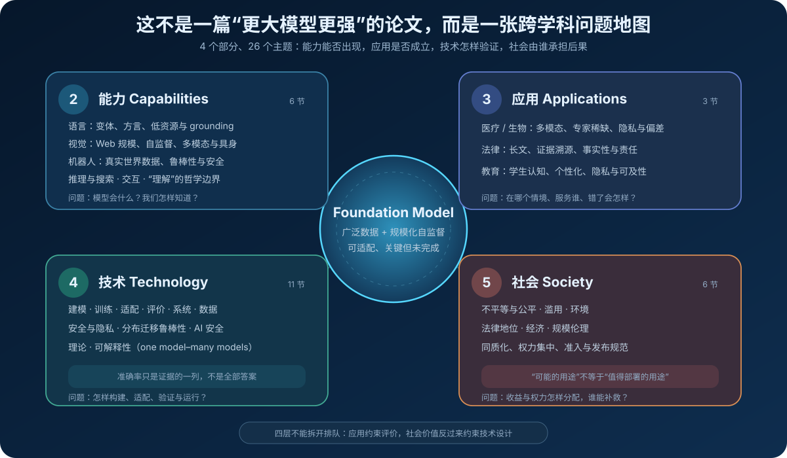
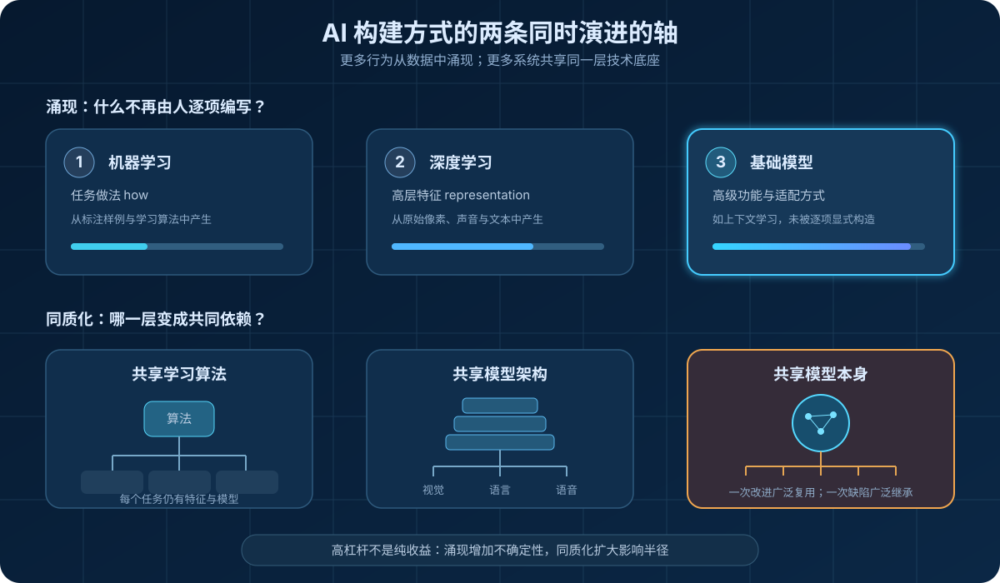
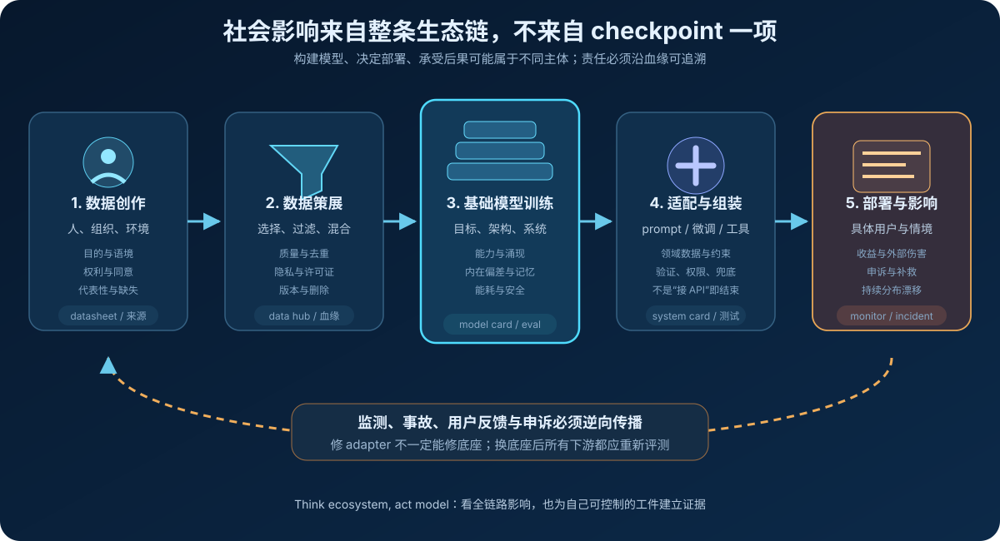
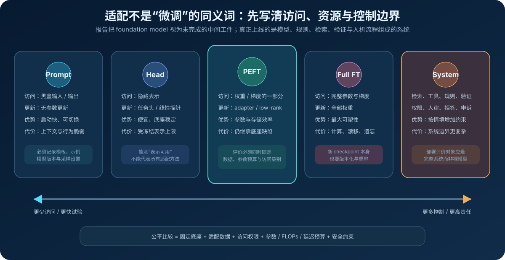
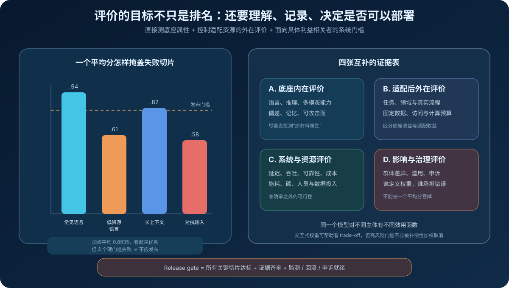
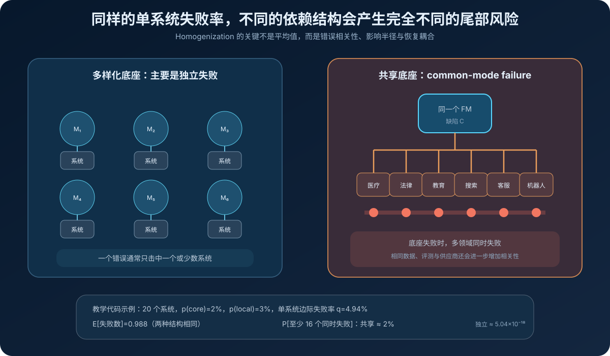

# Foundation Models Report 原理：为什么“一个模型服务万种任务”既是杠杆，也是系统性风险


> **报告**：[On the Opportunities and Risks of Foundation Models](https://arxiv.org/abs/2108.07258)<br>
> **官方页面 / 分章节导览**：[Stanford CRFM Report](https://crfm.stanford.edu/report.html)<br>
> **作者**：Rishi Bommasani、Drew A. Hudson、Ehsan Adeli、Russ Altman、Simran Arora 等，Percy Liang 牵头（Stanford CRFM）<br>
> **时间**：2021 年 8 月首次公开；官方 PDF 后续修订，本文以 214 页 CRFM 版本为准<br>
> **关键词**：Foundation Model、Emergence、Homogenization、Adaptation、Evaluation、Sociotechnical System、Common-mode Failure<br>
> **配套代码**：[foundation_models_report_demo.py](./code/foundation_models_report_demo.py)<br>
> **前置阅读**：[Transformer 原理](00_Transformer_2017_原理.md) · [BERT 原理](01_BERT_2018_原理.md) · [GPT-3 原理](05_GPT3_2020_原理.md) · [The Pile 原理](37_The_Pile_2020_原理.md)

这不是一篇提出新网络层、训练损失或榜单纪录的普通论文。它是一份由百余位跨学科研究者共同完成的 **214 页研究报告**，试图给 2021 年正在发生的范式变化命名，并把此前分散在 NLP、视觉、机器人、系统、安全、公平、法律和经济学中的问题放进同一张地图。

报告给这类模型起了一个后来影响极大的名字：**foundation model，基础模型**。

它最重要的判断可以压缩为：

$$
\underbrace{\text{broad data}+\text{self-supervision}+\text{scale}}
_{\text{训练一个可迁移的共同底座}}
\xrightarrow{\text{adaptation}}
\underbrace{\text{many downstream systems}}
_{\text{跨任务、跨领域复用}}.
$$

这种结构带来两个相互缠绕的性质：

- **emergence（涌现）**：能力并非全部由开发者逐项显式编写，而是从训练中产生，有时在规模扩大后才被观察到；
- **homogenization（同质化）**：越来越多应用不再各自训练模型，而是共享少数几个共同底座。

前者增加了能力，也增加了不确定性；后者扩大了改进的杠杆，也扩大了缺陷的影响半径。报告真正关心的不是“模型能不能生成漂亮文本”，而是：

> **当一个尚未被充分理解的模型成为医疗、法律、教育、搜索和软件系统的共同依赖时，我们怎样构建、评价、治理和追责？**

---

## 0. 先给结论

读完本文，至少应记住下面十五点：

1. **基础模型不是“大语言模型”的别名。** 它描述的是“在广泛数据上训练、可适配到广泛下游任务”的角色，模态可以是文本、图像、语音、代码、分子或机器人轨迹。
2. **基础模型不是最终产品。** 它是关键但未完成的中间工件；真正影响用户的是经过适配、规则、检索、工具、权限和交互流程组装后的系统。
3. **规模不是定义中的唯一条件。** 报告通常讨论规模化自监督，但关键是 broad data、adaptability 和共同底座地位；参数大不自动意味着基础模型。
4. **emergence 不是魔法。** 它表示功能从训练过程隐式产生，而非逐项编程；“后来才观察到”不等于证明存在严格数学相变。
5. **homogenization 是这份报告最锋利的系统洞察。** 同一底座的改进可被大量任务复用，同一缺陷也可能变成 common-mode failure。
6. **单系统平均失败率无法描述共同依赖。** 两组系统即使边际失败率相同，共享底座的一组也可能有高得多的“大面积同时失败”概率。
7. **社会影响不能只归因于 checkpoint。** 数据创作、数据策展、训练、适配和部署都会引入收益与伤害；各阶段还可能由不同组织控制。
8. **研究与部署必须分开。** 一个值得研究的模型不等于适合直接上线；部署到具体人群需要更严格的测试、分阶段发布、监测、回滚和补救。
9. **评价有三种目的：追踪进步、理解模型、形成文档。** 单一 accuracy leaderboard 无法同时完成这三件事。
10. **评价必须同时看底座与派生系统。** intrinsic evaluation 尝试测底座属性；extrinsic evaluation 测适配后的具体任务表现，并应控制适配数据、计算和访问权限。
11. **高平均分不能补偿关键切片失败。** 低资源语言、特定群体、长尾场景、对抗输入和高风险错误需要独立报告，部分指标必须是发布硬门槛。
12. **内在偏差不等于外部伤害，但二者有传播关系。** 伤害通常经由底座属性、适配保留、部署暴露、现实影响和控制措施共同形成。
13. **公平、安全、隐私、环境和法律不是模型训练后的附件。** 它们会反过来决定数据、目标、架构、访问方式、发布范围和业务流程。
14. **预训练成本能否“摊薄”取决于复用次数和系统边界。** 若每次适配与推理并不比独立方案便宜，共享底座永远不会仅凭复用变得更节能。
15. **这份报告最大的贡献是问题重构。** 它把“哪个模型分数高”改写成“哪一个共同底座、经什么适配、在何种情境、服务谁、由谁负责”。



---

## 1. 先弄清：这份报告做了什么，又没有做什么

### 1.1 它是一份议程设定报告，不是一篇单点实证论文

普通模型论文常按下面的结构展开：

```text
提出方法 → 给出训练目标 → 跑 benchmark → 做消融 → 报 SOTA
```

Foundation Models Report 的结构完全不同：

```text
定义新范式
→ 解释历史动因
→ 梳理能力与应用
→ 拆解技术开放问题
→ 分析社会后果
→ 提出跨学科研究议程
```

因此不能用“它提升了多少准确率”衡量这份报告。它没有：

- 训练一个名为 Foundation Model 的新模型；
- 给出统一架构或统一 loss；
- 声称一个总 benchmark 可以认证所有基础模型；
- 提供一套完成后即可宣称安全的治理清单；
- 证明所有大模型都会出现相同的涌现能力。

它做的是建立共同语言，让此前彼此隔离的问题能够被同时讨论。

### 1.2 为什么需要一个新名字

2021 年已有 `pretrained model`、`self-supervised model`、`language model`、`general-purpose model` 等叫法。报告认为它们各漏掉了一部分核心含义：

| 名称 | 捕捉到了什么 | 漏掉了什么 |
|---|---|---|
| Pretrained model | 先训练、后迁移 | 对研究与产业结构的共同底座作用 |
| Self-supervised model | 监督信号怎样获得 | 适配、部署和社会影响 |
| Language model | 文本概率建模 | 视觉、语音、机器人、分子等模态 |
| General-purpose model | 多用途 | 模型仍未完成、需要适配 |
| Task-agnostic model | 训练时不绑定单一任务 | 下游依赖与风险传播 |

`foundation` 这个词同时表达了两层意思：

1. 它是许多派生系统共同建造其上的基础；
2. 它自己并不是完整建筑，基础若有结构缺陷，楼越多，后果越大。

所以“基础模型”不是赞美性头衔。它刻意带着**关键、未完成、需要检验**三重含义。

### 1.3 报告的历史样本

报告在定义处列出的代表模型包括：

- `BERT`：在广泛文本上做 masked language modeling，再适配到大量 NLP 任务；
- `GPT-3`：自回归预训练，并展示 prompting / in-context learning；
- `CLIP`：在大规模图文对上学习跨模态表示，再迁移到视觉任务。

这组例子也说明，基础模型不要求：

- 必须是 decoder-only；
- 必须以对话形式使用；
- 必须生成开放文本；
- 必须有统一参数规模；
- 必须通过 API 提供。

---

## 2. 一个可操作的定义

报告的定义是：

> 在广泛数据上训练（通常使用规模化自监督），并能适配到广泛下游任务的模型。

为了避免把每个词读得过宽，可以把它拆成四个判断。

### 2.1 Broad data：训练分布不绑定一个窄任务

设预训练数据来自多个来源、领域或模态：

$$
\mathcal D_{\text{broad}}
=
\sum_{k=1}^{K}w_k\mathcal D_k,
\qquad
\sum_kw_k=1.
$$

`broad` 不等于“互联网上抓得越多越好”。它至少涉及：

- 领域是否广；
- 语言、群体和地域是否有代表性；
- 模态是否互补；
- 时间跨度是否符合用途；
- 权重怎样分配；
- 数据是否有来源、权利、隐私和质量记录。

一个规模很大的单一企业分类数据集，仍可能非常窄；一个规模较小但跨任务、跨模态、可广泛迁移的数据集，则更接近定义所强调的角色。

### 2.2 Self-supervision：从数据本身构造可扩展监督

典型目标包括：

自回归语言建模：

$$
\mathcal L_{\text{CLM}}(\theta)
=-
\sum_{t=1}^{T}\log p_\theta(x_t\mid x_{<t}).
$$

掩码建模：

$$
\mathcal L_{\text{MLM}}(\theta)
=-
\sum_{t\in M}\log p_\theta(x_t\mid x_{\setminus M}).
$$

图文对比学习可抽象为：

$$
\mathcal L_{\text{contrast}}
=-
\log
\frac{\exp(s(v_i,t_i)/\tau)}
{\sum_j\exp(s(v_i,t_j)/\tau)}.
$$

关键不是“没有任何人类影响”。数据由人创造、采集、筛选和加权，目标也由研究者设计。`self-supervised` 只表示标签主要由输入结构自动生成，而不是说训练没有价值选择。

### 2.3 Scale：让共同表示与新接口变得可用

报告把当时的规模化归因于三项共同条件：

1. GPU 等硬件的吞吐和内存进步；
2. Transformer 等能高效利用并行硬件的架构；
3. 大量未标注或弱标注数据的可获取性。

可把预训练写成：

$$
\hat\theta_{FM}
=
\arg\min_\theta
\mathbb E_{x\sim\mathcal D_{\text{broad}}}
[\mathcal L_{\text{pre}}(x;\theta)].
$$

但参数量、数据量和 FLOPs 只是输入。它们不自动保证：

- 形成某种具体能力；
- 能力在重要切片上均匀出现；
- 模型事实可靠或价值对齐；
- 下游适配样本效率一定更高；
- 社会收益大于成本。

### 2.4 Adaptability：同一底座能派生许多模型或系统

给定任务 $t$、适配数据 $\mathcal D_t$ 和适配过程 $A$：

$$
\gamma_t
=A(\hat\theta_{FM},\mathcal D_t, R_t, C_t),
$$

其中：

- $\gamma_t$：任务模型或系统配置；
- $R_t$：适配可使用的资源；
- $C_t$：领域约束、权限和安全规则。

最终部署行为不是 $f_{\hat\theta_{FM}}$ 单独决定的，而更接近：

$$
y
=S_t(x;\hat\theta_{FM},\gamma_t,
\text{retrieval},\text{tools},\text{rules},\text{human process}).
$$

这正是“基础模型是中间资产”的技术含义。

### 2.5 四个反例帮助划清边界

| 系统 | 是否自动属于基础模型 | 原因 |
|---|---:|---|
| 100B 参数、只解决一个固定仿真任务的模型 | 不一定 | 大不等于 broad / adaptable |
| 小型 BERT checkpoint，被几十个任务复用 | 可能 | 角色比绝对参数量更关键 |
| 只提供最终医疗诊断的端到端产品 | 产品本身不是 | 它可能包含基础模型，但部署系统还含其他组件 |
| 一个通用 API，底层模型与数据完全未知 | 无法仅凭营销名判断 | 需要能力、训练和适配证据 |

---

## 3. 两个关键词：Emergence 与 Homogenization



### 3.1 涌现：系统行为从哪里来

报告用一条历史线索解释“越来越多内容从训练中产生”：

```text
传统软件 / 专家系统
  人写规则：具体怎么完成任务

机器学习
  从样例中学习：任务做法 emerges

深度学习
  从原始输入中学习：高层特征 emerges

基础模型
  从广泛预训练中学习：跨任务能力与适配接口 emerges
```

GPT-3 的 in-context learning 是报告最常用的例子：模型没有为每个下游任务执行梯度更新，只看 prompt 中的任务说明和少量示例就能改变行为。

这里应避免两种极端解读：

**极端 A：一切都被训练过，所以没有涌现。**

即使训练目标是 next-token prediction，开发者仍未逐项编码翻译、问答、风格迁移或 few-shot 分类的过程。“功能如何由同一个目标产生”仍是研究问题。

**极端 B：涌现意味着能力从无到有地神秘跳变。**

报告使用的是系统层含义：功能是隐式诱导、难以预先列举。它没有证明每个观测曲线都存在不可约的相变。指标分辨率、prompt、任务难度与尺度采样都可能让连续改善看起来像突然出现。

### 3.2 同质化：共享逐步深入到模型本身

同质化同样有一条历史线索：

```text
机器学习：多个任务共享学习算法
深度学习：多个任务共享网络架构
基础模型：多个任务直接共享同一个预训练模型
```

它带来巨大的正向杠杆：

$$
\Delta V_{\text{total}}
\approx
\sum_{t=1}^{N}
\Pr(\text{improvement transfers to }t)
\cdot \Delta V_t.
$$

改进一次数据、架构、推理效率或安全机制，可能惠及大量应用。低数据领域也能利用广泛数据中学到的表示。

但缺陷传播使用同一个结构：

$$
\Delta H_{\text{total}}
\approx
\sum_{t=1}^{N}
\Pr(\text{defect survives adaptation in }t)
\cdot E_t\cdot I_t,
$$

其中 $E_t$ 是暴露规模，$I_t$ 是在任务 $t$ 中的影响强度。

### 3.3 两者结合才是核心风险

如果系统很可理解但高度共享，可以在推广前找出缺陷；如果系统难理解但各应用彼此独立，失败影响可能局部化。

基础模型的特殊张力是：

```text
涌现 → 能力与失败模式难以穷举
同质化 → 同一个未知性质被复制到许多系统
```

因此报告把“降低风险”视为核心挑战，而不是把风险章节放在性能工作完成之后。

---

## 4. 报告为什么分成四部分

报告正文不是按模型流水线简单排列，而是分为：

| 部分 | 核心问题 | 主题数量 |
|---|---|---:|
| Capabilities | 模型获得了什么能力，有什么边界 | 6 |
| Applications | 能力进入真实领域后怎样产生价值或伤害 | 3 |
| Technology | 怎样建模、训练、适配、评价、运行和理解 | 11 |
| Society | 收益、风险、权利和权力怎样分配 | 6 |

这种结构不是为了百科全书式罗列，而是表达四个依赖：

$$
\text{application viability}
\Leftarrow
\text{capabilities}+\text{technical controls},
$$

$$
\text{acceptable deployment}
\Leftarrow
\text{application context}+\text{social values}+\text{recourse}.
$$

只看技术部分，会不知道正确的目标与约束来自哪里；只看社会部分，又会不知道哪些干预必须改数据、模型、adapter 或产品流程。

---

## 5. 生态系统：模型只是链条中间的一站



### 5.1 第一阶段：Data creation

数据首先由人和社会过程产生：

- 文章、代码、图片、音乐、对话；
- 医疗记录、法律文书和课堂活动；
- 卫星、传感器与科学仪器测量；
- 人与平台互动留下的行为数据。

每份数据都有原始目的、语境、主体和权利关系。公开可访问不自动表示：

- 数据主体同意模型训练；
- 原始语境适合新的用途；
- 内容事实可靠；
- 样本能代表未出现的人群；
- 可以无限期保存和再分发。

### 5.2 第二阶段：Data curation

不存在一个无需选择的“自然互联网分布”。即使最宽松的抓取也必须决定：

- 抓哪些网站、语言和日期；
- 哪些文档解析成功；
- 怎样过滤质量、毒性、PII 和重复；
- 不同来源占多少权重；
- 哪些内容因权利或风险被删除。

所以数据策展不是中性清洗，而是模型目标函数的一部分：

$$
\mathbb E_{x\sim\sum_kw_k\mathcal D_k}
[\nabla\mathcal L(x)]
=
\sum_kw_k
\mathbb E_{x\sim\mathcal D_k}[\nabla\mathcal L(x)].
$$

### 5.3 第三阶段：Training

训练是最吸引注意力的一环，但它只把策展后的数据、目标、架构和系统实现压缩成 checkpoint。

同一个训练 loss 下降，不能回答：

- 哪些群体被较好表示；
- 模型记住了什么；
- 什么 prompt 能触发危险能力；
- 哪些任务可稳定迁移；
- 生成内容能否追溯；
- 数据权利和环境成本是否可接受。

### 5.4 第四阶段：Adaptation

研究论文里的 adaptation 可能只是一轮 fine-tuning；生产中的适配通常还包括：

```text
prompt / examples
+ domain data
+ retrieval / tools
+ output constraints
+ toxicity / policy classifier
+ access control
+ source validation
+ human review
+ fallback path
```

一个会生成不当内容的底座，在某些窄场景中可能通过严格输出空间、文档验证和人审被安全使用；反过来，一个平均表现良好的底座，也可能被危险的工具权限和错误业务流程放大。

### 5.5 第五阶段：Deployment

直接社会影响发生在部署阶段，因为此时有了：

- 具体用户；
- 具体决策；
- 真实资源分配；
- 可识别的受益者和受害者；
- 现实反馈回路。

部署不是训练完成后的自动下一步，而是独立决策。报告主张区分：

| 研究工件 | 部署系统 |
|---|---|
| 可以探索未知能力 | 必须有明确预期用途 |
| 可能包含未解决失败模式 | 必须在目标情境严格测试 |
| 论文指标为主 | 还需监测、回滚、事故与申诉机制 |
| 影响通常间接 | 直接改变人的机会与体验 |

### 5.6 反馈必须逆向传播

完整生命周期不是单向箭头：

$$
\text{deploy}
\rightarrow
\text{monitor / incident / appeal}
\rightarrow
\text{adaptation, training or data revision}.
$$

若事故来自底座的共享表示，只修一个产品规则可能治标不治本；若事故来自本地权限设计，重新预训练又是错误的干预位置。

配套代码用工件血缘回答：“底座变化后，哪些 adapter 和部署必须重测？”

```python
affected = graph.descendants("fm_checkpoint")
# ["medical_adapter", "triage_product"]
```

---

## 6. 能力篇：模型会什么，不等于系统可以做什么

报告选择五类能力，再加一节关于“理解”的哲学讨论。

### 6.1 Language：benchmark 胜利不等于掌握语言全貌

语言不是一组静态英文 benchmark。它包含：

- 语言与方言差异；
- 风格、语域和社会身份；
- 语用、共同知识与交流目的；
- 低资源语言与口语变体；
- 与视觉、行动和世界经验的 grounding。

报告特别对比人类儿童的样本效率：儿童接触的语言 token 远少于大模型，却拥有互动、视觉、身体与共同注意等丰富信号。

这给出的研究方向不是“再多抓一些英语网页”，而是：

$$
\text{language learning}
\leftarrow
\text{text}+\text{multimodal grounding}+\text{interaction}+\text{inductive bias}.
$$

### 6.2 Vision：从标注 ImageNet 转向 Web 规模自监督

视觉曾通过大型人工标注数据引领深度学习。基础模型范式进一步转向：

- 从 Web 规模原始图像或图文对学习；
- 用自监督减少固定标签空间的限制；
- 把表示迁移到分类、检测、分割等任务；
- 结合视频、语言和具身数据学习 3D、物理与常识。

机会与风险同源：广泛视觉表示能支持辅助技术，也能支持大规模监控；更强识别能力并不自带合法、正当的使用边界。

### 6.3 Robotics：物理世界让错误成本与数据问题同时变大

机器人与文本模型有三项根本差异：

1. 真实交互数据昂贵，动作还会改变环境；
2. 不同机器人身体、传感器和环境导致分布差异；
3. 错误可能造成物理伤害，不能靠重新生成一次解决。

基础模型的机会是利用人类视频、语言说明、模拟数据和跨机器人轨迹，降低新任务学习成本。

但“更多互联网视频”不自动包含：

- 精确动作与力反馈；
- 反事实失败数据；
- 机器人自身可执行的控制接口；
- 安全边界和形式保证。

### 6.4 Reasoning and search：用学习到的启发式控制组合爆炸

定理证明、程序合成、规划和化学路径搜索都有巨大组合空间。经典搜索若盲目展开：

$$
|\mathcal T|\approx b^d,

$$

其中 $b$ 是分支数，$d$ 是深度。

基础模型可以提供：

- 候选生成器；
- 状态价值或排序启发式；
- 跨任务迁移的先验；
- 自然语言、符号、图像联合接口。

它不是要取消搜索，而是学习 `proposal / heuristic`，把计算集中到更可能成功的路径：

$$
\text{neural proposal}
+\text{symbolic verifier}
+\text{search}
\rightarrow
\text{更可控的推理系统}.
$$

### 6.5 Interaction：开发者与终端用户的边界开始模糊

适配样本效率降低了 AI 原型门槛；生成与多模态能力又提高了交互上限。用户不再只点击固定按钮，还可能：

- 用自然语言定义任务；
- 给出示例即时定制；
- 反复纠正模型；
- 共同创建文本、图像、代码或计划。

这使用户反馈成为系统输入，但也制造新问题：

- 用户是否知道模型局限；
- 反馈是否会被保存并用于训练；
- 模型如何表达不确定性；
- 个性化是否造成操纵或回音室；
- 开发者与用户分别承担哪些配置责任。

### 6.6 Philosophy of understanding：不要用一句口号终止研究

报告没有断言模型已经理解，也没有断言统计学习原则上不可能理解。它区分了若干可能的理解标准，并提醒：

- 行为成功是否足够；
- 内部表示是否要与世界存在正确指称关系；
- 语言是否必须通过非语言经验 grounding；
- 能否进行可靠反事实和因果推理；
- 多模态训练会不会改变纯文本系统的哲学结论。

它的谨慎结论是：对未来多模态基础模型能否理解语言，过早给出绝对否定并不稳妥。工程上更有用的问题是把“理解”拆成可证伪能力，而不是用一个词代替评价。

---

## 7. 应用篇：为什么选择医疗、法律与教育

报告没有挑广告推荐或娱乐生成作为主案例，而选择三个社会基础领域。这三个领域共同具有：

- 专家知识昂贵；
- 数据多模态且高度敏感；
- 长尾案例重要；
- 历史不平等会进入数据；
- 错误影响重大；
- 结果需要解释、申诉与责任归属。

### 7.1 医疗与生物医学

| 机会 | 关键风险 | 必须补的系统能力 |
|---|---|---|
| 跨病历、影像、分子与文献学习 | 隐私、群体性能差异、数据历史偏差 | 数据治理、亚群评测、临床验证 |
| 少样本适配节省专家标注 | 分布随医院、设备与人群变化 | 外部验证、漂移监测 |
| 医患交互与辅助文档 | 自信但错误的信息影响决策 | 来源、校准、人类最终责任 |
| 药物与生物假设生成 | 开放生成难以验证、可能双重用途 | 实验验证、安全边界 |

基础模型的角色应更接近**增强专家工作流**，而不是把预训练相关性直接当成临床因果知识。

### 7.2 法律

法律工作需要长文档、跨来源引用、规则适用、事实区分和时效性。基础模型可能帮助：

- 检索与总结案件；
- 起草和审阅长文；
- 提高公共法律服务可及性；
- 让昂贵专家时间用于更复杂判断。

但法律语言生成的最低要求高于“读起来连贯”：

$$
\text{useful legal output}
\Rightarrow
\text{factuality}+\text{provenance}+\text{jurisdiction}
+\text{time validity}+\text{professional review}.
$$

一个虚构引用、过时条文或错误管辖区，即使文风完美也可能完全不可用。

### 7.3 教育

教育不是把标准答案更快发给学生。有效教学还要推断：

- 学生当前概念模型；
- 错误是粗心还是系统误解；
- 学习目标与适合的脚手架；
- 何时提示，何时让学生自己尝试；
- 教师、家长与学生各自需要什么反馈。

基础模型可能利用教材、公式、图示、课堂视频和对话形成多模态学生模型，并支持：

- 个性化练习；
- 形成性反馈；
- 教师备课与题目生成；
- 无障碍和多语言支持。

同时必须处理：

- 未成年人和学生数据隐私；
- 技术接入差异；
- 错误教学反馈；
- 代写与评价有效性；
- 将一种教育价值观规模化的风险。

### 7.4 三个领域给出的共同教训

```text
基础能力高
≠ 领域事实可靠
≠ 专业流程有效
≠ 风险可接受
≠ 责任已经解决
```

应用层决定哪些错误不可接受，也决定技术层应该测什么。

---

## 8. 技术篇总览：五个建模属性

报告认为下一代基础模型需要同时处理五项建模属性。

### 8.1 Expressivity

模型必须能表达现实世界的复杂结构。Transformer 的注意力提供了强序列交互能力，但表达能力还受：

- 上下文长度；
- 输入表示与 tokenizer；
- 层深、宽度与条件计算；
- 外部记忆；
- 训练目标能否激活该表达能力。

理论上的可表达不等于优化后真的学到，更不等于可可靠调用。

### 8.2 Scalability

基础模型要处理高维、大规模数据，也要适应分布式训练和低延迟推理。模型、算法、软件和硬件必须协同设计：

$$
\text{practical capability}
=f(\text{architecture},\text{objective},\text{data},\text{system}).
$$

如果系统无法训练或服务，理论能力没有产品意义；如果只通过堆计算获得能力，准入与环境成本也会改变社会结构。

### 8.3 Multimodality

现实领域本来就是多模态的：

- 医疗：病历、影像、检验、基因；
- 机器人：视觉、触觉、动作、语言；
- 教育：文本、公式、图形、语音；
- 科学：论文、表格、分子、实验信号。

多模态不仅是多种输入拼接，还包括：

- 表示怎样对齐；
- 缺失模态怎样处理；
- 模态冲突怎样仲裁；
- 是否学到共享因果结构；
- 一种模态的偏差是否传播到另一种。

### 8.4 Memory

模型参数可以存储统计知识，但存在：

- 内容难以定位和更新；
- 时效知识会过期；
- 记忆与隐私泄漏难区分；
- 参数事实没有天然来源；
- 容量与计算不断增长。

报告因此讨论更显式的存储和检索。可以把系统分成：

$$
p(y\mid x)
=
\sum_{z\in\mathcal R(x)}
p(y\mid x,z)p(z\mid x),
$$

其中外部记忆 $z$ 更容易更新、删除和引用，但检索错误、权限和索引污染又成为新风险。

### 8.5 Compositionality

理想系统应把已有概念重组到新环境，而不是只复述训练共现。组合性关系到：

- 多步推理；
- 系统化泛化；
- 新工具和新任务学习；
- 规则与神经表示结合；
- 复杂计划的可验证分解。

规模可能改善部分组合任务，但报告没有把规模当成唯一答案。

---

## 9. 训练目标：可扩展代理任务究竟在奖励什么

### 9.1 目标是能力入口，也是偏差入口

训练目标决定模型从数据中抽取哪种结构。例如：

- causal LM 天然支持 prefix conditioning 和开放生成；
- masked LM 能利用双向上下文，适合理解型表示；
- 对比目标强调跨样本判别和对齐；
- 生成目标需要建模完整输入分布，但计算更重。

不存在一个仅凭自监督形式就“价值中立”的目标。目标与数据共同决定：

$$
\text{learned behavior}
\sim
\operatorname{Opt}
(\mathcal L,\mathcal D,\text{architecture},\text{optimizer}).
$$

### 9.2 Generative vs discriminative

| 维度 | 生成式目标 | 判别 / 对比目标 |
|---|---|---|
| 监督密度 | 可预测大量输入细节 | 关注区分或对齐 |
| 开放生成 | 自然 | 通常需额外 decoder |
| 计算 | 对高维模态可能昂贵 | 可更聚焦 |
| 风险 | 学习并复现不需要的细节 | 负例、标签与采样偏差 |

这不是二选一。多目标训练可组合能力，也会引入目标权重和梯度冲突问题。

### 9.3 Input representation 也属于目标设计

文本 token、图像 patch、音频帧和动作离散化都会改变模型可见的信息。

例如 tokenizer 会影响：

- 不同语言的序列长度；
- 代码和数学符号成本；
- 拼写、押韵和字符级任务；
- 罕见名字被怎样切分；
- 同一计算预算下各语言实际获得多少 token。

因此“数据相同”并不意味着“训练信号相同”。

### 9.4 从代理目标到显式目标

报告提出一个长远方向：训练目标能否更明确地表示任务、偏好或目标，而不只预测被遮住的输入部分。

这预示了一个关键问题：

> 预训练目标让模型获得广泛能力，谁来决定这些能力在适配和部署时服务什么目标？

后训练与对齐方法会继续回答这个问题，但不能消除预训练数据、表示和能力本身的影响。

---

## 10. Adaptation：不是一种算法，而是一组资源交换



### 10.1 Fine-tuning

最经典的适配是：

$$
\hat\theta_t
=
\arg\min_\theta
\mathbb E_{(x,y)\sim\mathcal D_t}
[\mathcal L_t(f_\theta(x),y)],
\qquad \theta_0=\hat\theta_{FM}.
$$

优点是可塑性强；代价包括完整梯度访问、训练计算、存储新 checkpoint、灾难性遗忘与行为漂移。

### 10.2 Lightweight adaptation

只更新一小部分参数：

$$
\theta_t=\hat\theta_{FM}+\Delta\theta_t,
\qquad
|\Delta\theta_t|\ll|\hat\theta_{FM}|.
$$

它降低每任务存储和训练成本，但不意味着：

- 推理时不需要底座；
- 底座偏差自动消失；
- 每个 adapter 彼此隔离；
- 更新底座后 adapter 仍兼容；
- 小参数增量就容易审计。

### 10.3 Prompting / in-context adaptation

不更新权重，只改变条件：

$$
p(y\mid x)
\rightarrow
p(y\mid \operatorname{prompt}(I,E,x)).
$$

其中 $I$ 是指令，$E$ 是示例。它只需黑盒访问，部署灵活，但行为可能对：

- wording；
- 示例顺序；
- 上下文截断；
- 模型版本；
- 解码参数；
- 恶意输入注入；

高度敏感。

### 10.4 System adaptation

报告最有生产价值的提醒是：适配目标不应只限于“让模型做某任务”，还可用于：

- 加入时间更新；
- 满足隐私与删除要求；
- 约束输出空间；
- 引入来源与外部知识；
- 改善效率；
- 按领域设置拒答、人审与补救。

现代产品里，真正的适配往往是系统组合：

```text
foundation model
+ prompt policy
+ retrieval corpus
+ tools and permissions
+ validators
+ safety filters
+ human escalation
= deployed system
```

### 10.5 公平比较适配方法

若方法 A 有完整梯度、十万标注样本和大规模超参搜索，而方法 B 只有 API 与 16 个示例，只比最后 accuracy 没有科学意义。

至少应记录：

| 资源 | 例子 |
|---|---|
| 数据 | 训练样本、验证样本、用于选 prompt 的样本 |
| 访问 | logits、hidden states、梯度、完整权重 |
| 计算 | FLOPs、GPU-hours、试验次数 |
| 参数 | 可训练参数、每任务存储 |
| 系统 | 延迟、内存、外部检索与工具 |
| 人力 | 专家标注、红队、审核、提示工程 |

---

## 11. Evaluation：没有一种分数能代表基础模型



### 11.1 评价的三个目的

报告把评价目的分成：

1. **Progress**：新模型或方法是否进步；
2. **Understanding**：模型获得了什么能力、偏差和失败模式；
3. **Documentation**：向开发者、审计者、政策制定者与用户提供可用证据。

一个 aggregate score 适合快速排序，却很难同时表达：

- 为什么更好；
- 哪些场景更差；
- 代价是什么；
- 对谁更有用；
- 是否适合高风险部署。

### 11.2 Intrinsic evaluation：尽量直接测底座

内在评价尝试测与具体任务相对独立的属性，例如：

- 句法与语义能力；
- 多模态对齐；
- in-context adaptation；
- 记忆与隐私暴露；
- 刻板印象与毒性倾向；
- 说服、欺骗或生成滥用内容的能力。

优点是可以更接近底座源头，提前发现跨任务风险。困难是**效度**：一个内在 bias 指标是否真的预测某个部署伤害，必须通过下游观察验证。

### 11.3 Extrinsic evaluation：通过派生系统反推底座价值

外在评价在具体任务上适配模型，再测：

$$
M_{t,A}
=
\operatorname{Eval}
(A(\hat\theta_{FM},\mathcal D_t),\mathcal T_t).
$$

这里同时混入：

- foundation model；
- adaptation method；
- adaptation data；
- 超参数选择；
- 任务测试集。

所以高分不能自动归功于底座。比较不同基础模型时，应尽量控制 $A$、$\mathcal D_t$ 和资源预算。

### 11.4 Meta-benchmark 必要但不充分

把许多任务汇总成一个套件有明显价值：覆盖更广、便于比较、能观察迁移。

但它仍有局限：

- 任务集合不可能代表未来所有用途；
- 适配质量会混入底座评价；
- 平均值会隐藏最差切片；
- benchmark 被优化后可能失去诊断性；
- 对政策和普通用户未必可解释；
- 真实交互和生成质量难以自动量化。

### 11.5 从平均分转向切片与门槛

设切片 $g$ 的分数、权重和最低要求分别为 $s_g,w_g,m_g$：

$$
\bar s
=
\frac{\sum_gw_gs_g}{\sum_gw_g}.
$$

平均值可以很高，即使关键切片失败。配套代码的示例：

| Slice | Score | Weight | Minimum |
|---|---:|---:|---:|
| 常见语言 | 0.94 | 0.80 | 0.85 |
| 低资源语言 | 0.61 | 0.05 | 0.80 |
| 长上下文 | 0.82 | 0.10 | 0.78 |
| 对抗输入 | 0.58 | 0.05 | 0.75 |

得到：

$$
\bar s=0.8935,
\qquad
\min_gs_g=0.58.
$$

若只设 `average >= 0.85`，系统通过；若设关键切片硬门槛，系统拒绝发布。

正确逻辑是：

```python
release_allowed = all(slice.score >= slice.minimum for slice in slices)
```

### 11.6 多利益相关者没有唯一权重

模型提供方可能重视平均吞吐；应用方重视领域准确率；用户重视可解释、隐私与申诉；受影响但不直接使用系统的人可能最关心外部性。

可以定义利益相关者 $u$ 的效用：

$$
U_u(m)=\sum_jw_{u,j}s_j(m),
$$

但权重本身是价值判断。交互式权重有助于展示 trade-off，却不能让严重安全失败被更高准确率“抵消”。

---

## 12. Systems：计算系统决定什么真正可实现

### 12.1 训练不是只选一个 optimizer

大规模训练需要联合设计：

- 数据并行、张量并行、流水线并行；
- 通信与内存布局；
- 混合精度与数值稳定性；
- 数据加载和 checkpoint；
- 稀疏专家、检索与条件计算；
- 故障恢复和可复现实验记录。

系统差异会改变模型本身：数值精度、batch 规模、丢失样本、恢复策略与数据顺序都可能影响训练轨迹。

### 12.2 生产化比单次推理更复杂

部署还要处理：

- 尾延迟和吞吐；
- 动态 batching；
- 模型压缩与量化；
- 多租户隔离；
- 版本路由和灰度发布；
- 缓存与隐私；
- 工具调用副作用；
- 监控、回滚和 incident response。

共享底座允许不同应用摊薄系统投入，也让容量故障、服务中断和供应商变更影响更多下游。

### 12.3 基础模型像机器学习系统的“操作系统”

报告在安全章节使用类似操作系统的类比：如果底层提供可靠抽象，许多应用能安全复用；若底层被攻破，所有上层都受影响。

这个类比的边界也要看清：

- 操作系统 API 通常有明确语义，生成模型接口是概率性的；
- 模型内部知识边界不清；
- 相同输入也可能因版本和采样变化；
- 自然语言输入同时承担数据与控制指令，隔离更困难。

---

## 13. Data：需要 Data Hub，而不只是一份下载链接

报告认为当时基础模型训练数据普遍存在：选择原则不清、透明度不足、难以检查和更新。

### 13.1 Data Hub 应回答什么

一个面向基础模型的数据系统至少要支持：

```text
selection      选了什么，为什么
curation       做过哪些抽取、过滤、去重
documentation  来源、许可、语言、时间与限制
access         谁能看原文、统计或派生数据
inspection     怎样搜索、切片与抽样审核
quality        噪声、偏差、重复、污染和覆盖
regulation     删除、保留、审计与责任要求
```

### 13.2 数据血缘必须穿过模型与应用

理想链路是：

$$
\text{output}
\rightarrow
\text{model version}
\rightarrow
\text{adapter / prompt / retrieval}
\rightarrow
\text{training data manifests}
\rightarrow
\text{source and rights}.
$$

今天很难对每个生成 token 给出精确训练来源，但不能因此放弃：

- checkpoint 对应的数据版本；
- 组件级配比；
- 删除和重新训练记录；
- benchmark 污染报告；
- 检索结果的文档级引用；
- 事故时的影响范围定位。

### 13.3 数据规模让人工审查更重要，也更困难

全量人工检查不现实，因此需要：

- 自动检测；
- 分层抽样；
- 高风险来源专项审核；
- 失败切片和群体覆盖统计；
- 外部研究者与受影响群体参与；
- 未知项明确记录。

自动过滤器会有误报和漏报，且可能系统性删除少数语言或非标准表达。`filtered` 不是一个布尔安全属性。

---

## 14. Security、Privacy 与 Robustness

### 14.1 为什么基础模型是高价值攻击目标

攻击一次底座，收益可能跨越许多应用。风险面包括：

| 阶段 | 攻击 / 风险例子 |
|---|---|
| 数据 | 投毒、后门样本、恶意转载、供应链篡改 |
| 训练 | 代码与 checkpoint 完整性、内部威胁 |
| 模型 | 触发器、越权能力、模型窃取 |
| API | prompt injection、资源滥用、侧信道 |
| 隐私 | 训练数据记忆、membership / reconstruction |
| 适配 | 恶意 adapter、污染检索库、工具权限过宽 |

单一安全测试集很难覆盖未来所有适配，因为攻击者也会利用模型新出现的能力。

### 14.2 Generality 导致 function creep

`function creep` 指系统从原定用途逐步扩张到新的用途。基础模型天然可适配，使这种扩张成本更低：

```text
最初：文本辅助
→ 后来：自动筛选
→ 再后来：高风险决策输入
```

每一步可能单看都像小改动，但数据同意、评价和责任基础已发生变化。

### 14.3 迁移也可能帮助隐私

广泛公共数据中学到的表示，可能降低敏感领域所需的标注量。在差分隐私等机制下，较强先验有机会减少准确率损失。

但这不是免费午餐：

- 公共预训练数据本身可能含敏感信息；
- 少样本适配也可能过拟合个体；
- API 日志与 prompt 产生新隐私面；
- 外部检索和工具把数据发送到更多边界。

### 14.4 Robustness：广泛预训练改善一些迁移，不消灭分布漂移

令训练与部署分布分别为 $P$ 和 $Q$：

$$
R_Q(f)=\mathbb E_{(x,y)\sim Q}[\ell(f(x),y)].
$$

广泛预训练可能让表示覆盖更多变化，从而改善某些 $P\to Q$ 迁移；但报告明确反对把基础模型视为鲁棒性万能药。

持续难题包括：

- 时间外推；
- 新群体与新设备；
- 伪相关；
- 对抗扰动；
- 反馈回路改变输入分布；
- 多模块错误组合。

鲁棒性必须在目标部署切片、时间和交互流程中持续评测。

---

## 15. AI Safety、Theory 与 Interpretability

### 15.1 Safety：近期危害与能力增长后的大规模风险

报告同时讨论两类问题：

**已经现实存在的问题**：

- 目标规格错误；
- reward hacking；
- 分布外行为；
- 欺骗性或操纵性输出；
- 可靠性、鲁棒性和监控不足。

**能力继续增长时可能更重要的问题**：

- 长期规划；
- 欺骗与规避监督；
- 在关键基础设施中的集中依赖；
- 高影响能力被误用；
- 对齐目标与多元社会价值冲突。

报告没有给出灾难风险概率，而是主张：不应等能力完整出现后才研究预测、对齐和控制。

### 15.2 Theory：预训练—适配接口超出经典监督学习

经典监督学习常分析同一任务分布：

$$
\hat f=\arg\min_f\hat R_P(f),
\qquad
R_P(\hat f)-R_P(f^*).
$$

基础模型却有两阶段：

```text
预训练：数据分布 P_pre，代理目标 L_pre
适配：任务分布 P_t，目标 L_t，资源约束 C_t
```

理论要解释：

- 哪些预训练表示能降低下游样本复杂度；
- 数据与任务相似性怎样定义；
- 适配限制如何形成归纳偏置；
- in-context learning 在什么条件下出现；
- 多任务间正迁移和负迁移怎样预测；
- 规模规律何时外推失败。

### 15.3 One model–many models

可解释性章节提出一个非常重要的视角：

```text
one model  = 共同 foundation model
many models = 经不同适配得到的派生模型
```

核心问题是：派生模型共享多少决策机制？

若某个神经回路、表示或启发式在所有 adapter 中保留，那么解释底座有高杠杆；若适配会重组机制，仅解释底座无法解释产品。

### 15.4 三种不同的“解释”不要混淆

| 层次 | 问题 | 常见方法 |
|---|---|---|
| Characterize behavior | 在哪些输入上成功或失败 | 切片、对比测试、红队 |
| Explain behavior | 为什么给出这个输出 | attribution、example influence、反事实 |
| Mechanism | 内部怎样计算 | probing、causal intervention、回路分析 |

模型自己生成的一段理由是新的文本输出，不自动等于忠实机制解释。解释质量本身需要验证。

---

## 16. 公平：从 Intrinsic Bias 到 Extrinsic Harm

### 16.1 为什么要区分二者

**Intrinsic bias** 是底座中可能导致伤害的属性，例如：

- 某些人群表示不足；
- 刻板关联；
- 对一种语言或文化视角过度代表；
- 群体间表示质量差异。

**Extrinsic harm** 是具体部署中实际发生的伤害，例如：

- 对某群体错误率更高；
- 侮辱、骚扰或错误称谓；
- 服务资格被不公平拒绝；
- 一种观点被系统性压低；
- 自动决策加剧既有不平等。

底座偏差不是伤害的全部充分条件，但它可能跨应用传播。

### 16.2 一条简化风险路径

配套代码用教学模型表示：

$$
R
=p_{\text{intrinsic}}
\cdot r_{\text{adapt}}
\cdot p_{\text{exposure}}
\cdot i_{\text{impact}}
\cdot(1-e_{\text{control}}).
$$

它分别表示：

- 底座缺陷出现强度；
- 适配后保留程度；
- 部署中暴露概率；
- 现实影响；
- 控制措施有效性。

示例：

$$
R=0.30\times0.70\times0.40\times0.90\times(1-0.50)=0.0378.
$$

这个乘法不是完整的社会伤害模型，而是帮助定位干预：

- 数据与训练可降低 intrinsic prevalence；
- adapter 可降低 retention；
- 产品规则可降低 exposure；
- 人审和申诉可降低 impact；
- 多层控制可提高 effectiveness。

### 16.3 Source tracing 决定能否精准干预与追责

外部伤害可能来自：

```text
训练数据
+ 训练目标 / 架构
+ 压缩与服务优化
+ 适配数据与标注员
+ 产品规则
+ 用户交互
+ 现实制度
```

若无法追溯来源，就很难回答：

- 应该改哪个组件；
- 谁有能力采取行动；
- 谁应承担道德或法律责任；
- 修复是否真的到达受影响人群。

### 16.4 Intervention 与 Recourse 缺一不可

**主动干预**在伤害前降低概率：

- 改善代表性；
- 反事实数据增强；
- 分群评测；
- 约束目标；
- 按风险限制用途。

**事后补救**在伤害后恢复权利：

- 解释与通知；
- 人工复核；
- 申诉；
- 更正与赔偿；
- 反馈逆向传播到供应商。

公平不是只把一个 bias score 降低，而是让受影响的人能发现、挑战并纠正系统决定。

---

## 17. Misuse：模型按技术预期工作，也可能造成社会伤害

报告把 misuse 定义为：模型执行了其技术能力，例如生成文本或视频，但使用者以造成伤害为目标。

### 17.1 基础模型改变滥用的哪些变量

可以把攻击生产能力抽象为：

$$
\text{misuse scale}
\propto
\frac{\text{quality}\times\text{personalization}\times\text{throughput}}
{\text{cost}\times\text{expertise required}}.
$$

基础模型可能同时：

- 提高生成质量；
- 降低多语言和多风格改写成本；
- 针对不同人群个性化；
- 批量生成彼此不完全重复的内容；
- 生成文本、图像、代码等多种载体。

这会削弱依赖相同模板、重复文本和粗糙伪造的检测方法。

### 17.2 同一能力也可用于防御

模型可以辅助：

- 识别协调操纵；
- 检测语义一致但表述不同的内容；
- 帮助事实核查和溯源；
- 扩大多语言审核能力。

但“用 AI 检测 AI”会形成军备竞赛，并面临误报、规避和对检测模型本身的攻击。

### 17.3 风险管理必须看能力、访问和情境

仅按模型是否开源 / 闭源二分不够。至少要看：

- 模型具有什么能力；
- 权重、梯度、logits 或仅 API 哪一层可访问；
- 是否允许批量、自动化和工具调用；
- 是否有身份、速率、异常行为与事件响应；
- 研究者能否独立审计；
- 限制是否把权力过度集中到提供方。

---

## 18. Environment：一次训练成本是否真的能被摊薄

### 18.1 先画完整系统边界

环境成本不止最终训练 run：

$$
E_{\text{lifecycle}}
=E_{\text{experiments}}
+E_{\text{pretrain}}
+\sum_tE_{\text{adapt},t}
+E_{\text{inference}}
+E_{\text{hardware lifecycle}}.
$$

不同阶段的减排方式不同：

- 训练没有严格实时延迟，可选择更低碳电网与时间；
- 在线推理受用户位置和延迟约束，迁移更困难；
- 高利用率可摊薄硬件空闲成本；
- 模型更大不等于每请求更节能；
- 压缩本身也有搜索和训练成本。

### 18.2 摊销公式

设：

- $P$：基础模型一次性预训练成本；
- $A$：每个任务的适配成本；
- $S$：每个任务从头训练独立模型的成本；
- $n$：复用任务数。

共享底座更便宜的条件：

$$
P+nA\le nS.
$$

若 $S>A$，break-even：

$$
n^*
=
\left\lceil\frac{P}{S-A}\right\rceil.
$$

配套代码示例：

```python
adaptation_break_even(
    pretraining_cost=1000,
    adaptation_cost_per_task=5,
    scratch_cost_per_task=80,
)
```

得到：

$$
n^*=\left\lceil\frac{1000}{80-5}\right\rceil=14.
$$

第 14 个任务时：

$$
E_{FM}=1000+14\times5=1070,
\qquad
E_{scratch}=14\times80=1120.
$$

### 18.3 为什么这个数字不能直接当碳结论

必须统一：

- 单位是 kWh、kgCO2e、GPU-hours 还是货币；
- 是否包含失败实验；
- 推理请求量是否相同；
- 硬件与电网碳强度；
- 独立基线是否真的需要从头训练；
- 一个基础模型是否同时替代所有基线；
- 复用带来的新增需求。

若 $A\ge S$，仅靠复用永远无法摊平 $P$。如果基础模型让此前不存在的大规模调用成为可能，总能耗还可能因需求增长上升。

### 18.4 报告主张“测量和披露”，不是只购买抵消

关键动作包括：

- 报告训练与推理能耗；
- 记录硬件、时长和电网区域；
- 同时比较更小、更高效的基线；
- 把环境指标纳入模型选择；
- 优先减少排放，而不是把 offset 当成免罪符。

---

## 19. Legality、Economics 与 Ethics of Scale

### 19.1 法律：中间资产让责任链更难划分

报告法律章节主要以美国法为背景，聚焦：

- 训练数据的权利与隐私；
- 生成输出引发的责任；
- 模型提供方与应用部署方怎样分担责任；
- 现有保护是否覆盖自动化伤害；
- 基础模型作为中间工件如何适用既有标准。

必须注意：这是 2021 年的研究议程，不是当前法律意见。不同国家、数据类型和用途的规则会变化，真实项目应进行对应管辖区审查。

### 19.2 Economics：生产率提高不保证收益均匀分配

基础模型可能是一种 general-purpose technology：它不仅直接提高某些任务效率，还会催生大量互补创新。

但经济影响取决于技术怎样使用：

- **替代劳动**：降低某些任务的人力需求；
- **增强劳动**：让人完成以前做不到或成本过高的任务；
- **创造新任务**：产生新的审计、集成、设计和服务工作；
- **改变工作质量**：减少重复劳动，也可能加快节奏和加强监控。

所以：

$$
\Delta\text{productivity}>0
\not\Rightarrow
\Delta\text{wage for every group}>0.
$$

### 19.3 规模与所有权集中

训练前沿模型需要数据、算力、系统人才和资本。若这些资源集中在少数机构：

- 模型所有权集中；
- API 条款决定下游创新边界；
- 外部研究者难以复现和审计；
- 公共机构可能依赖私人供应商；
- 小语言、小市场与弱势群体需求被低优先级处理。

开放模型和公共研究可以提供制衡，但开放也会扩大某些能力的可访问性。报告没有给出“全部开放”或“全部封闭”的简单答案，而是要求讨论访问、审计、滥用和权力的共同权衡。

### 19.4 Ethics of scale：算法单一文化

当大量决策共享相似数据、模型和评测时，社会可能出现 algorithmic monoculture：

- 相同人群被多个机构一致误判；
- 一种主流语言与文化视角被默认化；
- 多个系统依赖相同伪相关；
- 供应商故障跨行业传播；
- 决策对象难以寻找使用不同逻辑的替代机构。

多样性不只指多训练几个随机种子，而包括：

- 数据来源与价值视角；
- 模型架构与供应商；
- 评价者和参与者；
- 业务规则与申诉渠道；
- 失败时的替代路径。

---

## 20. 定量理解 Homogenization：边际风险相同，尾部风险不同



### 20.1 一个最小概率模型

有 $N$ 个下游系统。所有系统共享一个底座失败变量：

$$
C\sim\operatorname{Bernoulli}(p_c).
$$

每个系统还有独立局部失败：

$$
L_i\sim\operatorname{Bernoulli}(p_l).
$$

系统 $i$ 失败：

$$
F_i=C\lor L_i.
$$

单系统边际失败率：

$$
q=P(F_i=1)
=p_c+(1-p_c)p_l.
$$

两个系统同时失败：

$$
P(F_i=1,F_j=1)
=p_c+(1-p_c)p_l^2.
$$

于是共享底座引入正相关。

### 20.2 与相同边际失败率的独立系统比较

取：

$$
N=20,
\quad p_c=0.02,
\quad p_l=0.03.
$$

则：

$$
q=0.02+0.98\times0.03=0.0494,
$$

$$
\mathbb E\left[\sum_iF_i\right]
=Nq=0.988.
$$

现在构造对照：20 个完全独立的系统，每个失败率同样是 $4.94\%$。两组的期望失败数相同。

但“至少 16 个系统同时失败”的概率：

共享底座：

$$
P(K\ge16)
=p_c+(1-p_c)P(\operatorname{Bin}(20,p_l)\ge16)
\approx0.02.
$$

独立对照：

$$
P(K\ge16)
=P(\operatorname{Bin}(20,q)\ge16)
\approx5.04\times10^{-18}.
$$

结论不是说共享模型一定更差，而是：

> **平均风险指标保留不变时，依赖结构仍能把风险从“零星失败”重排成“大面积同时失败”。**

### 20.3 真实系统的共同原因更多

除了同一个 checkpoint，还有：

- 同一训练数据；
- 同一 tokenizer；
- 同一云区域；
- 同一 API 提供方；
- 同一安全分类器；
- 同一 benchmark；
- 同一供应链包；
- 同一政策模板。

所以系统风险审计应建立 dependency graph，而不只盘点模型名称。

### 20.4 降低共同模式风险的手段

- 为关键路径准备不同供应商或不同模型族；
- 让验证器不与生成器共享全部数据和机制；
- 按领域独立做失败切片；
- 版本升级时按血缘重测全部下游；
- 限制底座直接拥有不可逆工具权限；
- 为高影响操作设计人审与事务回滚；
- 监控跨产品相关异常，而非各看各的平均错误率。

---

## 21. 配套代码详解

运行：

```bash
python3 papers/to-2026/code/foundation_models_report_demo.py
```

代码完全使用标准库，包含五个互相连接的教学模块。

### 21.1 Artifact 与 LineageGraph

每个工件记录：

```python
Artifact(
    name="medical_adapter",
    kind="adapted-system",
    owner="health-team",
    version="v7",
    inputs=("fm_checkpoint",),
    evidence=("domain-eval", "human-review"),
)
```

它能检查：

- 依赖是否存在；
- 血缘是否有环；
- 一个工件变更影响哪些下游；
- 每种工件缺少哪些证据。

示例会发现：

```json
{
  "fm_checkpoint": ["risk-eval"],
  "raw_web": ["pii-audit", "provenance"],
  "triage_product": ["appeal-channel"]
}
```

这比一个笼统 `approved=true` 更可行动。

### 21.2 common_mode_analysis

它实现上一节的 $C\lor L_i$ 模型，并输出：

- 单系统边际失败率；
- 期望失败系统数；
- 两系统失败相关系数；
- 共享底座的灾难阈值概率；
- 同边际风险独立系统的对照概率。

代码刻意让两种结构拥有相同 $q$，把区别定位到**相关性与尾部**。

### 21.3 RiskPath

把传播链拆为：

```text
intrinsic property
→ adaptation retention
→ deployment exposure
→ real-world impact
→ controls / recourse
```

`sensitivity()` 计算局部敏感度，帮助判断把下一单位治理资源放在何处最有效。

真实风险通常非线性、有交互和反馈；这段代码是结构化思考工具，不是安全认证公式。

### 21.4 evaluate_slices

它同时返回：

```json
{
  "weighted_average": 0.8935,
  "worst_slice_score": 0.58,
  "failed_slices": ["adversarial", "low-resource-language"],
  "release_allowed": false
}
```

这体现报告反对单一排行榜的原因：平均分用于概览，门槛用于保护不可被平均掉的要求。

### 21.5 adaptation_break_even

它计算：

$$
P+nA\le nS
$$

的最小整数 $n$。若 $A\ge S$，返回 `None`，明确表示“复用再多次也不会在该成本维度上打平”。

### 21.6 代码没有做什么

它不是：

- 真实模型训练器；
- 公平或安全评分标准；
- 碳排核算工具；
- 法律责任分配器；
- 生产级图数据库；
- 对任何模型的认证结论。

报告本身强调社会技术复杂性；用一个漂亮数字替代利益相关者、情境和证据，反而违背其主旨。

---

## 22. 这份报告真正贡献了什么

### 22.1 给范式命名

一个好术语会改变研究单位。此前人们可能分别研究：

- pretrained language model；
- transfer learning；
- large-scale self-supervision；
- multimodal model；
- model bias。

`foundation model` 把问题单位提升为：

```text
一个共同底座
+ 大量适配系统
+ 它们所在的生态与社会结构
```

### 22.2 把优势与风险放进同一个因果机制

许多讨论把收益和风险写成两张互不相关的清单。报告指出，它们往往来自同一性质：

| 性质 | 机会 | 风险 |
|---|---|---|
| Broad data | 跨领域知识迁移 | 隐私、偏差、权利不清 |
| Scale | 更强表示与新能力 | 成本、准入与不可预测性 |
| Adaptability | 少样本服务新任务 | function creep、双重用途 |
| Homogenization | 一次改进广泛复用 | 单点缺陷与算法单一文化 |
| Generativity | 开放创作与交互 | 幻觉、操纵、批量滥用 |
| Centralization | 高投入建设共享基础设施 | 权力、审计和依赖集中 |

### 22.3 把评价从排行榜扩展为证据体系

报告提前指出基础模型评价需要：

- 多任务但不止多任务平均；
- 底座内在属性与下游系统并看；
- 记录适配资源与访问权限；
- accuracy 之外的鲁棒、公平、效率和环境；
- 面向不同利益相关者的呈现；
- 人在环与探索性审计。

### 22.4 把治理位置从“上线前过滤”扩展到全生命周期

风险干预可以发生在：

```text
数据来源 → 策展 → 训练目标 → 模型访问
→ 适配 → 产品规则 → 部署范围 → 监控与补救
```

治理不再等价于给生成结果加一个敏感词分类器。

### 22.5 让跨学科合作成为技术必要条件

医疗专家决定临床有效性；法律学者分析责任与权利；教育研究者定义学习目标；经济学家研究劳动与集中；伦理与社会科学帮助识别权力和分配；系统、安全与 ML 研究者实现控制。

这不是“技术做完后请文科评审”，而是应用目标和社会约束必须进入数据、评价和系统设计。

---

## 23. 局限：不能把一份议程报告读成完整答案

### 23.1 广而不可能处处深

214 页覆盖 26 个主题，但每个主题都足以成为独立领域。报告最适合提供连接关系与开放问题，不适合替代：

- 具体安全威胁模型；
- 医疗临床试验规范；
- 某管辖区法律意见；
- 环境生命周期评估；
- 群体参与式设计；
- 大规模系统实现细节。

### 23.2 应用选择有限

医疗、法律、教育非常重要，但不能代表：

- 金融与保险；
- 公共行政；
- 新闻与信息生态；
- 军事与执法；
- 创意劳动；
- 基础科学；
- 关键基础设施。

不同领域的可接受错误和权力关系差别巨大。

### 23.3 许多问题以美国和英语语境为中心

报告关注语言多样性和全球不平等，但作者机构、法律章节和大量案例仍主要来自美国研究环境。

这会影响：

- 什么被视为核心应用；
- 法律责任框架；
- 公平分类与群体概念；
- 可用数据和算力假设；
- 学术与产业的角色判断。

全球部署需要当地语言、历史、制度与受影响群体共同定义问题。

### 23.4 “Emergence” 需要更精确的操作定义

报告用 emergence 成功捕捉了“功能非显式构造”的直觉，但没有提供一个统一统计检验来区分：

- 真正新机制；
- 连续能力跨过任务阈值；
- 指标不连续；
- prompt 或评价变化；
- 规模点采样过稀。

后续研究必须对每个能力给出可重复、尺度密集、对提示鲁棒的测量。

### 23.5 它没有给出治理的最终决策规则

报告提出文档、审计、分阶段发布、跨学科参与等方向，却没有回答所有冲突：

- 谁可以否决发布；
- 哪些风险门槛不可权衡；
- 开放审计与滥用限制如何平衡；
- 受影响但不是用户的人如何参与；
- 跨国供应链由谁执法；
- 事故赔偿怎样分担。

这不是遗漏一个公式就能补上的问题，而是需要制度设计。

### 23.6 术语本身可能扩大它描述的范式

给“基础模型”命名会帮助批判和治理，也可能带来正当化效果：模型被称为“基础”，容易让人误以为它必然、通用、稳定或不可替代。

因此每次使用这个词都应追问：

- 它究竟是哪些系统的基础；
- 谁选择了它；
- 有什么替代；
- 哪些群体没被代表；
- 怎样退出或更换。

---

## 24. 从 2021 的位置看，它预见了什么、没展开什么

### 24.1 判断非常准确的部分

报告清楚抓住了几条随后长期重要的主线：

- 模型从 NLP 扩展为跨模态共同底座；
- prompting 和轻量适配会改变应用开发门槛；
- 同一个底座支撑大量产品；
- 评价必须越过单一 accuracy；
- 数据透明、模型访问和算力集中会成为公共问题；
- 安全、隐私、公平与环境必须进入基础设施层；
- 高风险应用需要完整系统评价，而非裸模型 demo。

### 24.2 当时尚未成为中心的工程层

报告已经讨论交互、检索、推理与系统组合，但 2021 年的重心还没有完整展开后来常见的：

- 面向对话助手的大规模后训练；
- 偏好优化与自动反馈；
- 工具调用和长时间 agent loop；
- 检索、代码执行、浏览器与外部系统权限；
- 生成内容来源、真实性与水印基础设施；
- 持续在线评价和模型版本漂移。

这些发展没有推翻报告，反而进一步证明“最终行为属于完整生态系统”。

### 24.3 基础模型与 LLM 不能倒写成同义词

今天人们常从对话 LLM 反向理解这份报告，容易漏掉它对：

- 视觉；
- 机器人；
- 医学与分子；
- 多模态；
- 系统基础设施；

的广泛论述。`foundation model` 是比 `LLM` 更上位的系统角色概念。

---

## 25. 常见误解

### 误解 1：基础模型就是参数超过某个阈值的模型

错误。报告没有给出参数量门槛。规模支撑能力，但定义还需要广泛数据与广泛适配角色。

### 误解 2：基础模型就是 LLM

错误。报告从一开始就覆盖语言、视觉、机器人、多模态和生物等方向。

### 误解 3：预训练模型可以直接部署

错误。`foundation` 特别强调未完成。适配、约束、评价与部署决策是独立阶段。

### 误解 4：Emergence 证明“只要变大什么都会出现”

错误。报告说功能可能由训练隐式产生且难预期，不保证任意能力随规模出现，也不证明所有曲线存在突变。

### 误解 5：Homogenization 只表示架构都用 Transformer

不够。报告强调共享深入到**同一个模型本身**，从而形成下游共同依赖。

### 误解 6：一个底座服务更多任务，所以一定更节能

错误。只有当一次性成本能被更低的每任务适配 / 推理成本摊薄，并且系统边界一致时才成立。

### 误解 7：平均 benchmark 高就适合高风险领域

错误。必须看目标人群、失败切片、事实性、鲁棒性、资源、流程和补救。

### 误解 8：底座 bias score 低，产品就公平

错误。外部伤害还由适配、部署、制度与反馈回路决定；内在指标必须验证其下游效度。

### 误解 9：风险都可以由应用开发者修掉

错误。某些缺陷来自底座数据与表示，单个应用方没有访问权限或资源修复；责任必须沿供应链传播。

### 误解 10：风险都应归咎于模型提供方

同样过度简化。提供方对共享底座负有高责任，但应用方决定用途、权限、用户、流程和上线范围，也不能把部署责任外包。

### 误解 11：不开源就解决滥用

错误。限制权重访问可能降低部分滥用，却不消除 API 滥用、内部滥用、偏差、市场集中或外部审计不足。

### 误解 12：开源就自动民主化

错误。权重可获取不等于训练数据、算力、部署能力、治理参与和经济收益都平等。

---

## 26. 如果今天建设一个 foundation-model-based 系统

### 26.1 先写用途和不可接受后果

```text
intended users
intended decisions
out-of-scope uses
affected non-users
irreversible actions
maximum acceptable latency / cost
critical failure slices
human authority and appeal
```

没有用途边界，就无法选择评价集和控制措施。

### 26.2 建立完整工件清单

至少版本化：

- 基础模型 provider / checkpoint；
- tokenizer；
- system / developer prompt；
- few-shot examples；
- adapter / fine-tuned weights；
- 检索语料、索引与 embedding 模型；
- 工具、权限与凭据范围；
- safety classifier 与阈值；
- 评价数据和 judge；
- 回滚版本。

### 26.3 画 dependency graph

对每条高风险输出，能回答：

```text
用户输入
→ 哪个模型版本
→ 哪个 prompt / adapter
→ 检索了什么
→ 调用了什么工具
→ 哪些验证器通过
→ 谁最终批准
```

同时记录共同依赖，专门评价 common-mode failure。

### 26.4 分四层评价

1. **底座**：能力、偏差、隐私、安全、已知限制；
2. **适配**：固定资源比较、领域任务、遗忘与漂移；
3. **系统**：检索、工具、权限、延迟、成本、对抗链路；
4. **部署**：真实用户、群体切片、业务后果、监控与申诉。

### 26.5 使用发布门槛，不只看加权分

```python
release = (
    all(critical_slice_passes)
    and provenance_complete
    and rollback_tested
    and incident_owner_assigned
    and appeal_channel_ready
)
```

高风险错误不应被平均准确率补偿。

### 26.6 设计最小权限和可逆动作

- 默认只读工具；
- 高影响操作二次确认；
- 把规划与执行分离；
- 验证参数而不只验证自然语言；
- 使用事务、幂等和回滚；
- 限制批量、速率和资源；
- 把外部内容视为不可信数据，而非系统指令。

### 26.7 让反馈能回到正确责任方

事故单应包含：

```text
model + adapter + prompt + retrieval + tool versions
input / output / action trace
affected user and severity
suspected source stage
immediate mitigation
upstream notification
retest scope
recourse status
```

否则下游会反复用本地补丁掩盖共同底座缺陷。

### 26.8 保留替代与退出能力

- 定期测试备用模型；
- 避免把供应商专有接口扩散到所有业务逻辑；
- 把模型输出协议与业务规则分离；
- 保存迁移所需评价集；
- 明确数据、日志和 adapter 的可携带性；
- 模拟供应商中断或策略变化。

同质化的反面不是拒绝共享，而是对共享依赖保持可见、可替代、可恢复。

---

## 27. 复现与治理检查清单

### 定义与范围

- [ ] 说明为什么该模型在当前系统中属于 foundation model；
- [ ] 区分基础模型、adapter 和最终部署系统；
- [ ] 明确 intended / excluded use；
- [ ] 不用参数量替代能力与风险证据；
- [ ] 记录研究工件是否明确禁止直接部署。

### 数据

- [ ] 训练 / 适配 / 检索数据有版本、来源和权利说明；
- [ ] 记录组件权重、时间、语言与地域覆盖；
- [ ] 对 PII、重复、污染和高风险来源抽样；
- [ ] 支持删除、更新和影响范围定位；
- [ ] 过滤器对低资源语言和少数表达做误差审计。

### 适配

- [ ] 固定并记录 prompt、examples、sampling；
- [ ] 记录训练数据、超参选择数据与试验次数；
- [ ] 说明访问权限：API / logits / hidden / gradient / weights；
- [ ] 比较参数、计算、延迟与人力；
- [ ] 底座升级后重新做兼容与行为评测。

### 评价

- [ ] 同时做 intrinsic 与 extrinsic evaluation；
- [ ] 覆盖能力、鲁棒、公平、安全、隐私、效率与环境；
- [ ] 报平均值、最差切片、方差与失败样本；
- [ ] 高风险指标设置非补偿性硬门槛；
- [ ] 评价集、judge 与模型训练数据的污染风险已记录；
- [ ] 真实利益相关者参与定义指标与后果。

### 系统与安全

- [ ] 生成器、检索、工具、验证器和权限有完整依赖图；
- [ ] 对同模型、同数据、同云、同分类器做 common-mode 分析；
- [ ] 高影响工具使用最小权限、确认和回滚；
- [ ] 测试 prompt injection、数据投毒与供应链风险；
- [ ] 灰度发布、监控、告警和 incident runbook 已演练；
- [ ] 有可用的备用路径和退出策略。

### 公平、补救与责任

- [ ] 区分 intrinsic bias 与 extrinsic harm；
- [ ] 记录谁受影响、怎样受影响，而非只报抽象 bias；
- [ ] source tracing 能定位可干预阶段；
- [ ] 用户能获得人工复核、申诉和更正；
- [ ] 上游提供方与下游部署方责任接口明确；
- [ ] 事故反馈能传播到所有受同一底座影响的系统。

### 环境与经济

- [ ] 训练、适配、推理与失败实验使用统一边界报告；
- [ ] 与更小、更专用模型比较；
- [ ] 给出复用 break-even 假设，而非笼统宣称摊薄；
- [ ] 记录硬件、电网区域、利用率和请求规模；
- [ ] 评估供应商集中、迁移成本和劳动影响；
- [ ] 不把效率收益自动等同于总能耗下降或收益公平。

---

## 28. 总结

Foundation Models Report 可以压缩成十二句话：

1. 基础模型是在广泛数据上训练、可适配到广泛任务的共同底座；
2. 它不是大语言模型、参数量门槛或最终产品的同义词；
3. `foundation` 同时表示关键性与未完成性；
4. 涌现让更多功能由训练隐式产生，也让能力与失败更难预先穷举；
5. 同质化让一次改进广泛复用，也让一次缺陷成为共同模式风险；
6. 数据创作、策展、训练、适配与部署共同决定社会影响；
7. 能力必须放到语言、视觉、机器人、推理和交互的真实边界中评价；
8. 医疗、法律和教育说明领域成功需要事实、来源、隐私、专业流程与补救；
9. 技术研究必须同时覆盖建模、训练、适配、评价、系统、数据、安全、鲁棒、理论和解释；
10. 公平、滥用、环境、法律、经济与权力集中不是外部注脚，而是设计输入；
11. 平均 benchmark 无法表达最差切片、资源成本、相关失效与不同主体价值；
12. 负责任的基础模型工程，本质上是在管理一张长期演化的依赖图和证据图。

最值得带走的一句话是：

> **基础模型的价值来自共享，最大的风险也来自共享；真正需要优化的不是一个 checkpoint 的平均分，而是整条生态链在具体人群和情境中的可控收益。**

---

## 参考资料

1. Rishi Bommasani et al. [On the Opportunities and Risks of Foundation Models](https://arxiv.org/abs/2108.07258), 2021.
2. Stanford Center for Research on Foundation Models. [Official report page and chapter guide](https://crfm.stanford.edu/report.html).
3. Tom B. Brown et al. [Language Models are Few-Shot Learners](https://arxiv.org/abs/2005.14165), 2020.
4. Jacob Devlin et al. [BERT: Pre-training of Deep Bidirectional Transformers for Language Understanding](https://arxiv.org/abs/1810.04805), 2018.
5. Alec Radford et al. [Learning Transferable Visual Models From Natural Language Supervision](https://arxiv.org/abs/2103.00020), 2021.
6. Emily M. Bender et al. [On the Dangers of Stochastic Parrots: Can Language Models Be Too Big?](https://doi.org/10.1145/3442188.3445922), 2021.
7. Timnit Gebru et al. [Datasheets for Datasets](https://arxiv.org/abs/1803.09010), 2018/2021.
8. Margaret Mitchell et al. [Model Cards for Model Reporting](https://doi.org/10.1145/3287560.3287596), 2019.

## 读完接着看

1. [The Pile 原理与实现](37_The_Pile_2020_原理.md)：广泛训练数据怎样成为可版本化、可加权、可治理的系统
2. [GPT-3 原理与实现](05_GPT3_2020_原理.md)：报告中“规模、涌现与上下文学习”的关键技术样本
3. [FLAN 原理与实现](08_FLAN_2021_原理.md)：基础模型怎样通过指令微调适配到未见任务
4. [InstructGPT 原理与实现](10_InstructGPT_2022_原理.md)：通用预训练能力怎样经人类反馈变成助手行为
5. [Constitutional AI 原理与实现](19_Constitutional_AI_2023_原理.md)：如何把原则展开为可扩展监督
6. [RAG 原理与实现](07_RAG_2020_原理.md)：外部记忆、来源与可更新知识怎样进入生成系统
7. [Gemini 原理与实现](28_Gemini_2023_原理.md)：多模态基础模型如何把报告中的范式继续推向统一系统
