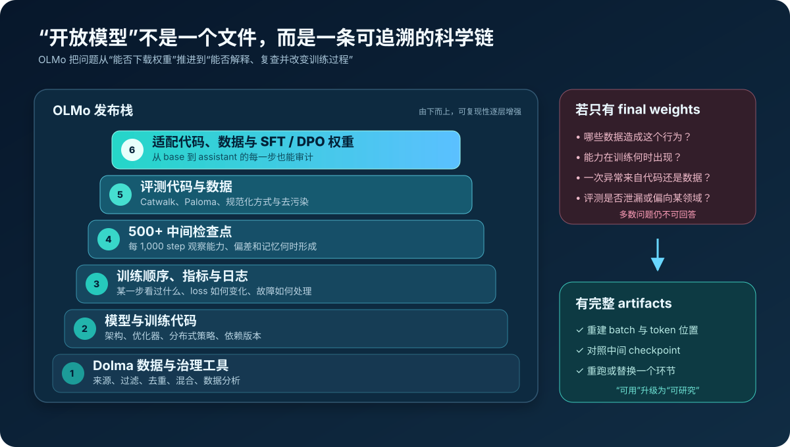
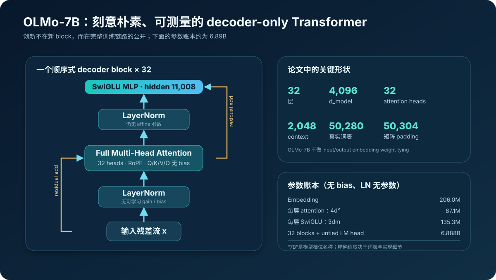
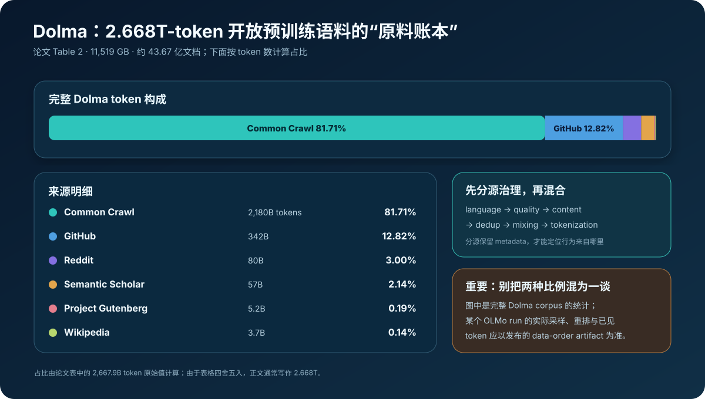
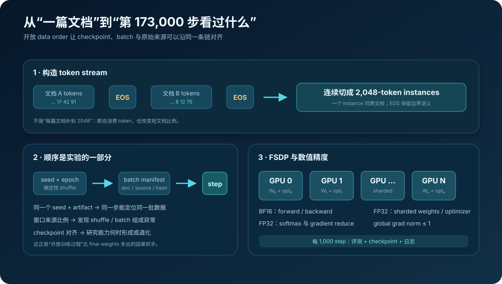
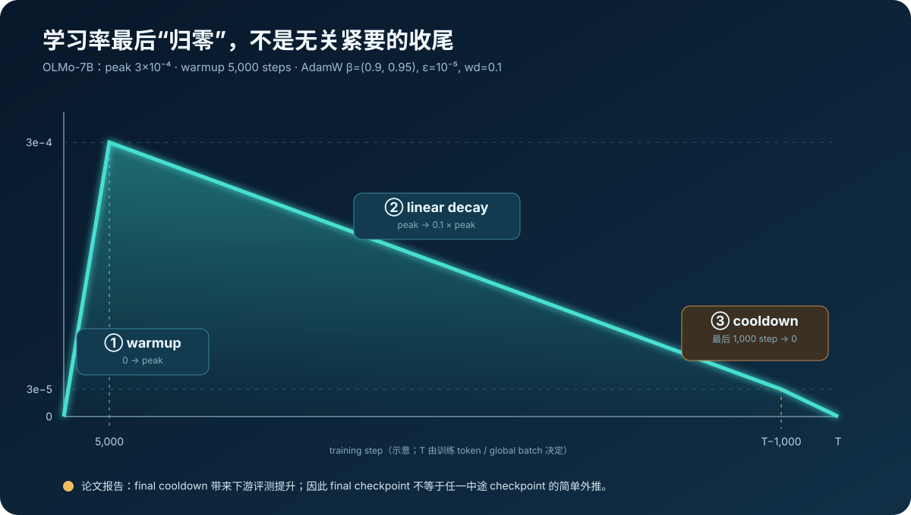
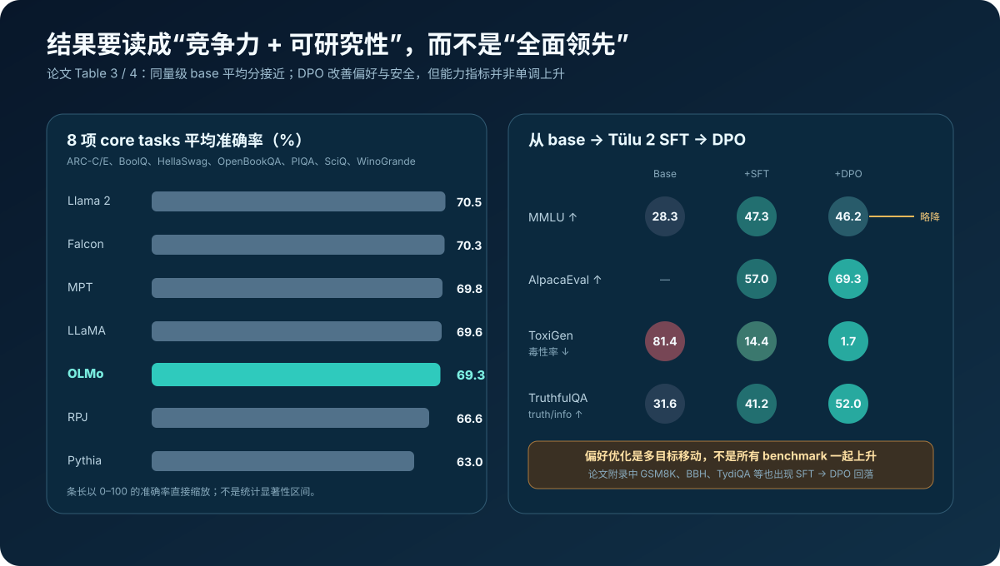

# OLMo 原理：开放权重只是起点，怎样把大模型训练变成可复查的科学实验


> **论文**：[OLMo: Accelerating the Science of Language Models](https://arxiv.org/abs/2402.00838)<br>
> **官方项目**：[AllenAI OLMo](https://allenai.org/olmo) · [GitHub](https://github.com/allenai/OLMo) · [论文时期代码 v0.1.0](https://github.com/allenai/OLMo/tree/v0.1.0)<br>
> **作者**：Dirk Groeneveld、Iz Beltagy、Pete Walsh、Akshita Bhagia、Rodney Kinney、Oyvind Tafjord 等（Allen Institute for AI）<br>
> **时间**：2024 年 2 月首次公开；本文以 arXiv v4（2024 年 6 月）为准<br>
> **关键词**：Open Language Model、Dolma、Reproducibility、Data Order、FSDP、Catwalk、Paloma、Tülu 2、DPO<br>
> **配套代码**：[olmo_minimal.py](./code/olmo_minimal.py)<br>
> **前置阅读**：[Transformer 原理](00_Transformer_2017_原理.md) · [RoPE 原理](09_RoFormer_RoPE_2021_原理.md) · [DPO 原理](23_DPO_2023_原理.md) · [The Pile 原理](37_The_Pile_2020_原理.md) · [Foundation Models Report](38_Foundation_Models_Report_2021_原理.md)

2024 年初，“开放大模型”已经很多：能下载 checkpoint，能在本地推理，有时也能微调。但如果研究者追问下面这些问题，final weights 往往一句也答不上来：

- 第 400B token 时模型已经会什么？
- 某个偏见来自哪类训练数据，何时开始放大？
- loss 的一次波动来自数据顺序、通信故障还是优化器？
- 换掉去重器、学习率或一小部分数据，结论还能成立吗？
- 两个模型的 perplexity 差异来自模型本身，还是 tokenizer 与评测污染？

OLMo 的答案不是再发一个更强但同样不透明的 checkpoint，而是公开一条尽可能完整的实验链：

$$
\boxed{
\text{Dolma data}
\rightarrow
\text{data order}
\rightarrow
\text{training code + logs}
\rightarrow
\text{intermediate checkpoints}
\rightarrow
\text{evaluation}
\rightarrow
\text{adaptation}
}
$$

论文标题里的 `Accelerating the Science` 是理解 OLMo 的钥匙。它并不主要声称发明了新的 Transformer block，也没有在所有榜单上战胜闭源模型；它试图把语言模型从“只能观察最终成品的工业黑箱”改造成“可以沿时间、数据与代码回溯的科学对象”。

---

## 0. 先给结论

读完本文，至少应记住下面二十点：

1. **OLMo 的核心贡献不是架构创新，而是开放边界创新。** 模型、数据、训练代码、中间 checkpoint、日志、评测和适配工件被放在同一条可追溯链上。
2. **open weights 不等于 open science。** 权重回答“如何运行”，完整 artifacts 才开始回答“为何形成、何时形成、怎样复查”。
3. **本文解释的是 2024 年论文中的 OLMo-1。** 今天官方项目已继续演进到 OLMo 2/3；不能把当前配置、上下文长度或成绩倒灌进首篇论文。
4. **OLMo 是普通的 decoder-only Transformer。** 7B 版本为 32 层、$d=4096$、32 个 full-attention heads、SwiGLU、RoPE、2,048 context。
5. **“普通”是实验设计的一部分。** 保守而清晰的架构减少了把开放系统工程结论与新机制收益混在一起的风险。
6. **OLMo 去掉所有 bias，并使用无可学习 affine 参数的 LayerNorm。** 这让参数账本更简洁，也减少了一些数值与实现差异。
7. **词表是 50,280，但 embedding 矩阵补到 50,304。** 24 个 padding rows 换来矩阵维度为 128 的整数倍，训练日志称吞吐约提高 11%。
8. **OLMo-7B 不共享输入 embedding 与 LM head。** 按论文形状核算约 6.888B 参数，“7B”是档位名称而非逐位精确值。
9. **Dolma 完整语料约 2.668T tokens、11.5 TB。** 其中 Common Crawl 按 Table 2 token 数约占 81.71%，另含 GitHub、Reddit、Semantic Scholar、Gutenberg 与 Wikipedia。
10. **完整 corpus 比例不等于某次训练 run 的精确已见比例。** 采样、过滤、重排和第二个 epoch 会改变实际序列，应查 data-order artifacts。
11. **数据先逐文档追加 EOS，再拼成连续流并切成 2,048-token instance。** 它不是把每篇短文档单独 padding 到 2,048。
12. **数据顺序本身是实验工件。** 相同数据集但不同 shuffle、batch composition 与硬件恢复点，可能得到不同轨迹。
13. **训练采用 FSDP/ZeRO 式分片与混合精度。** forward/backward 用 BF16，分片权重和优化器状态、softmax 与梯度 reduce 保持 FP32。
14. **OLMo-7B 使用 AdamW 和线性学习率。** 5,000 步 warmup 后衰减到峰值的 10%，最后 1,000 步再 cooldown 到零。
15. **最后 cooldown 不是形式动作。** 论文报告它明显提升下游评测，说明 checkpoint 的位置与优化器状态同样是模型定义的一部分。
16. **每 1,000 step 进行在线评测并保存中间状态。** 发布物包含 500+ 中间 checkpoints，使“能力随 token 演化”成为可研究问题。
17. **OLMo-7B 在八项 core tasks 平均 69.3。** 它接近 LLaMA、Llama 2、MPT、Falcon，但并非该表最高；“competitive”比“SOTA”准确。
18. **Paloma 用 bits per byte 跨 tokenizer 比较。** 同时做显式去污染；但低 BPB 仍会受训练分布与文档长度影响，不能当通用智能分数。
19. **SFT 与 DPO 改变的是多目标权衡。** DPO 把 AlpacaEval、ToxiGen 与 TruthfulQA 推高，却使 MMLU 等部分能力较 SFT 略降。
20. **完全开放不自动等于无风险、无版权问题或适合部署。** 英语中心、数据权利、隐私、毒性、评测覆盖和双重用途仍然存在。



---

## 1. 先划清版本：本文说的 OLMo 是哪一个

OLMo 是持续演进的项目名。官方页面今天展示的能力、上下文、数据和代码已经不再等于 2024 年这篇首发论文。本文所有结构与数值默认指：

```text
论文：arXiv:2402.00838 v4
世代：OLMo-1 / 首篇 OLMo report
主角：OLMo-7B 与 OLMo-1B
数据：论文时期的 Dolma
代码参照：官方仓库 v0.1.0 tag
```

这条边界非常重要。研究型博客常犯一种“时间穿越”错误：为了让旧论文看起来更强，把后来模型的长上下文、数据治理、指令版本或 benchmark 成绩补回旧 checkpoint。这样会破坏论文最珍贵的东西——**可复查的历史实验条件**。

因此本文会使用以下措辞：

- `OLMo-7B`：论文中的 base checkpoint；
- `OLMo-7B-SFT / DPO`：论文中的 Tülu 2 适配链；
- `当前 OLMo 项目`：只作为后续演进入口，不拿来替换论文数据；
- `官方 v0.1.0`：用于核对论文时期的实现与训练日志，不代表每个发布 run 都严格使用同一份示例配置。

---

## 2. OLMo 重新定义了什么叫“开放”

### 2.1 一张权重开放度矩阵

把一个语言模型项目拆成七类工件：

| 工件 | 只开放 API | 开放 final weights | OLMo 目标 |
|---|---:|---:|---:|
| 推理接口 | ✓ | ✓ | ✓ |
| 最终权重 | ✗ | ✓ | ✓ |
| 精确模型与训练代码 | ✗ | 有时 | ✓ |
| 完整预训练数据与治理工具 | ✗ | 通常否 | ✓ |
| data order / batch 可追踪性 | ✗ | 几乎没有 | ✓ |
| 中间 checkpoint 与训练日志 | ✗ | 少量或没有 | ✓ |
| 评测、SFT、DPO 的代码与数据 | ✗ | 不完整 | ✓ |

只拿到 final weights，可以做：

- 本地推理；
- 下游微调；
- 激活、表示和行为分析；
- 与其他 checkpoint 做横向对比。

但很难做：

- 沿训练 token 画能力成长曲线；
- 找到异常 loss 对应的具体 batch；
- 把一个记忆样本追到预训练来源；
- 只替换数据过滤器并重跑；
- 验证论文中的优化器、恢复策略或跨硬件结论。

所以可以把“开放研究价值”粗略写成：

$$
V_{\text{science}}
\not\approx
V_{\text{weights}},
$$

而更接近：

$$
V_{\text{science}}
=f(
\text{weights},
\text{data},
\text{order},
\text{code},
\text{logs},
\text{checkpoints},
\text{evaluation}
).
$$

这里不是说所有工件“有文件就够了”。它们还必须有版本、哈希、依赖、许可、相互引用和能解释差异的 metadata。否则只是把黑箱拆成七个命名模糊的小黑箱。

### 2.2 OLMo 到底发布了什么

论文的 `Artifact Released` 部分给出一份异常具体的清单：

- OLMo 预训练代码；
- OLMo-7B、7B-twin-2T 与 1B 权重；
- final checkpoint 以及 **500+ 个每 1,000 step 保存的中间 checkpoint**；
- 完整训练指标与 Weights & Biases 日志；
- Dolma 完整语料；
- 重建 data order、检查某一步看过什么的工具；
- 数据重建、策展与分析工具；
- 指令微调和 DPO 的代码、数据与权重；
- Catwalk、Paloma 等评测代码和数据。

代码与权重按 Apache 2.0 发布，是很宽松的开源许可。但要避免一个常见推论：

> **代码/权重的 Apache 2.0，不会神奇地统一消除底层网页、书籍、代码、帖子与论文各自的权利、隐私和使用条件。**

开放的价值恰恰在于让这些问题更容易被定位与讨论，而不是宣布问题不存在。

### 2.3 “twin”为什么也是科学资产

论文不只提供一个 7B 结果，还训练了对应不同架构、优化器和硬件条件的 7B 变体，并给出 1B 模型。`twin` 的意义不是营销上的“双胞胎”，而是控制变量：

```text
相同或尽量接近的数据与目标
       ↓
改变硬件 / 训练实现 / 部分配置
       ↓
比较轨迹是否仍然接近
```

最终分数相似并不证明每一步都相同；中间 checkpoints 才能观察两条训练轨迹何时分叉、何时重新接近。

---

## 3. 模型架构：没有新魔法，细节却都能影响复现

### 3.1 总体结构

OLMo 是标准因果语言模型：

$$
p_\theta(x_{1:T})
=
\prod_{t=1}^{T}p_\theta(x_t\mid x_{<t}),
$$

训练损失为：

$$
\mathcal L_{\text{CLM}}(\theta)
=-
\sum_{t=1}^{T}\log p_\theta(x_t\mid x_{<t}).
$$

主要配置如下：

| 配置 | OLMo-1B | OLMo-7B |
|---|---:|---:|
| decoder layers | 16 | 32 |
| hidden size $d$ | 2,048 | 4,096 |
| attention heads | 16 | 32 |
| context length | 2,048 | 2,048 |
| MLP hidden size | 5,504 | 11,008 |
| RoPE | ✓ | ✓ |
| weight tying | ✓ | ✗ |
| peak learning rate | $4\times10^{-4}$ | $3\times10^{-4}$ |
| 训练 token | 2T 级 | 主模型 2.46T |

> 论文 PDF 的一处提取文本会把 7B hidden size 识别成 `4086`，但架构表与官方配置均为 **4096**。



### 3.2 顺序式 block，而不是并行 residual block

每层可以近似写为：

$$
h'_\ell
=h_\ell+
\operatorname{MHA}(\operatorname{LN}(h_\ell)),
$$

$$
h_{\ell+1}
=h'_\ell+
\operatorname{SwiGLU}(\operatorname{LN}(h'_\ell)).
$$

这叫 sequential block：先完整完成 attention residual，再进入 MLP residual。它与 PaLM 一类把 attention 和 MLP 并行计算后相加的设计不同。

OLMo 没有通过架构新颖性争胜。对开放科学基线来说，这反而有优点：

- block 与大量已有实现相近，容易读和移植；
- full attention 让 KV head 结构没有额外变量；
- context 固定 2,048，训练与评测边界清晰；
- 避免把系统吞吐、数据治理和 checkpoint 分析与新机制纠缠。

代价也明显：以今天标准看，2,048 context 很短，full MHA 的 KV cache 也不如 GQA/MQA 节省。这不是论文遗漏，而是 2024 年首版 OLMo 的真实边界。

### 3.3 无 bias 与 non-parametric LayerNorm

OLMo 删除所有线性层 bias，并使用没有可学习缩放与偏移的 LayerNorm。普通 LayerNorm 是：

$$
\operatorname{LN}(x)
=
\gamma\odot
\frac{x-\mu}{\sqrt{\sigma^2+\epsilon}}
+\beta.
$$

OLMo 对应：

$$
\operatorname{LN}_{\text{OLMo}}(x)
=
\frac{x-\mu}{\sqrt{\sigma^2+\epsilon}},
\qquad
\gamma,\beta\ \text{不存在}.
$$

它省下的参数相对 7B 微不足道，但有三个工程意义：

1. 参数集合与 optimizer state 更简单；
2. 少一些跨框架默认值差异；
3. 对张量并行、checkpoint 转换和参数账本更友好。

不要把它误解为“LayerNorm 完全没有计算”，均值、方差和归一化依旧存在；消失的只是可学习 affine 参数。

### 3.4 SwiGLU 为什么出现三个矩阵

SwiGLU 可以写为：

$$
\operatorname{SwiGLU}(x)
=
W_o\bigl(\operatorname{SiLU}(W_gx)\odot W_vx\bigr).
$$

因此每层 MLP 参数量不是普通两层 MLP 的 $2dm$，而是：

$$
N_{\text{SwiGLU/layer}}=3dm.
$$

对 OLMo-7B：

$$
3\times4096\times11008
=135{,}266{,}304.
$$

有些官方配置把输入 projection 的输出宽度记成 `22016`，因为它随后被切成两个 11,008 维分支。参数账本必须理解实现语义，不能把 `22016` 再错误地乘三。

### 3.5 Full MHA、RoPE 与 2,048 上下文

每头维度为：

$$
d_h=\frac{4096}{32}=128.
$$

注意力仍是：

$$
\operatorname{Attention}(Q,K,V)
=
\operatorname{softmax}
\left(\frac{QK^\top}{\sqrt{d_h}}+M\right)V,
$$

其中 causal mask $M$ 禁止位置 $t$ 读取未来 token。RoPE 在 $Q,K$ 的二维子空间按位置旋转，使点积显式依赖相对位移：

$$
(R_mq)^\top(R_nk)
=q^\top R_{n-m}k.
$$

OLMo-7B 使用 full multi-head attention：每个 query head 都有自己的 key/value head。于是每层 attention 参数近似：

$$
N_{\text{attn/layer}}
=4d^2
=67{,}108{,}864.
$$

这里的 4 来自 $W_Q,W_K,W_V,W_O$。

### 3.6 50,280 词表为什么分配 50,304 行

OLMo 修改 GPT-NeoX-20B 的 BPE tokenizer，并加入 PII masking 相关 token。真实词表大小是 50,280，但 embedding matrix 补到：

$$
50{,}304=393\times128.
$$

多出的 24 行不是额外自然语言 token，而是让矩阵维度对硬件 kernel 更友好。官方训练日志记录，这个看似不起眼的 padding 带来约 **11% 吞吐提升**。

这是系统论文最有价值的细节之一：

> 参数量多 0.05% 左右，训练速度却能明显变化。纯架构表无法预测真实吞吐。

### 3.7 7B 参数账本

输入 embedding：

$$
N_{\text{emb}}
=50{,}304\times4{,}096
=206{,}045{,}184.
$$

32 个 decoder blocks：

$$
N_{\text{blocks}}
=32\times
(67{,}108{,}864+135{,}266{,}304)
=6{,}476{,}005{,}376.
$$

由于 7B 不做 weight tying，LM head 再有一份同形矩阵：

$$
N_{\text{head}}=206{,}045{,}184.
$$

合计：

$$
N_{\text{total}}
=6{,}888{,}095{,}744
\approx6.89\text{B}.
$$

配套代码会直接断言这个数，避免“7B”标签掩盖实现细节。

---

## 4. Dolma：开放数据不是一个下载链接

### 4.1 Table 2 的六类来源

Dolma 的完整统计如下：

| 来源 | 磁盘规模 | 文档数 | tokens | 按 token 占比 |
|---|---:|---:|---:|---:|
| Common Crawl | 9,812 GB | 3,734M | 2,180B | 81.71% |
| GitHub | 1,043 GB | 210M | 342B | 12.82% |
| Reddit | 339 GB | 377M | 80B | 3.00% |
| Semantic Scholar | 268 GB | 38.8M | 57B | 2.14% |
| Project Gutenberg | 20.4 GB | 0.056M | 5.2B | 0.19% |
| Wikipedia | 16.2 GB | 6.2M | 3.7B | 0.14% |
| **总计** | **11,519 GB** | **4,367M** | **2,667.9B** | **100%** |



三个读表陷阱：

1. 磁盘 GB 占比、文档数占比、token 占比不是同一个量；
2. 表格经过四舍五入，所以总数写作 2.668T；
3. 这是完整 Dolma 的 corpus 统计，不是任一 OLMo run 的逐步 batch 统计。

论文另一处提到 7B 预训练数据中 88.8% 来自 Common Crawl，这与上表按完整 corpus token 算出的 81.71% 并不矛盾：训练采样、再处理与“实际已见 token”定义可以不同。真正复现某个 checkpoint，应查询发布的 data order，而不是拿总表比例反推。

### 4.2 数据治理流水线

Dolma 的高层流水线是：

```text
raw sources
→ language filtering
→ quality filtering
→ content filtering
→ deduplication
→ multi-source mixing
→ tokenization
```

每一步都在定义模型将学到的世界：

- language filter 决定语言覆盖；
- quality filter 决定什么文体被当作“高质量”；
- content filter 决定哪些风险被压低，也可能误伤哪些群体；
- dedup 决定某段文字被重复强化多少次；
- mixture weights 决定 web、代码、学术和百科谁拥有更大梯度份额；
- tokenizer 决定文本被切成多少训练事件。

OLMo/Dolma 的一个重要设计是策展与发布时尽量保留来源分区，而不是过早把所有文本倒进一个失去 provenance 的大池子。这样出现行为异常时，研究者至少有可能按来源做 ablation、审计和删除。

### 4.3 开放并不会自动解决数据风险

Dolma 仍然继承大规模互联网语料的结构性问题：

- 英语占主导，低资源语言与非西方知识不足；
- 网页、论坛与代码可能包含毒性、刻板印象和私人信息；
- 自动过滤器会有 false positive 与 false negative；
- 去重不等于版权判断；
- 可公开访问不等于适合任何训练、再分发或商业用途；
- 数据是时间截面，知识可能过时。

因此 `open data` 更准确的含义是：

> 社区获得了检查、批评、改进与重建数据流程的机会，而不是数据获得了“无风险”认证。

---

## 5. 从文档到 batch：data order 为什么是第一等公民

### 5.1 EOS、拼接与定长切块

论文描述的样本构造很简单：对每篇文档追加 EOS，连续拼接，然后切成 2,048-token 训练 instance。

设文档 token 序列为 $d_i$，则全局流为：

$$
S=
d_1\Vert[\mathrm{EOS}]
\Vert d_2\Vert[\mathrm{EOS}]
\Vert\cdots.
$$

第 $j$ 个训练样本为：

$$
x_j=S[2048j:2048(j+1)].
$$

结果是：

- 一个样本可以包含多篇短文档；
- 一篇长文档可以跨多个样本；
- EOS 明确告诉模型文档边界；
- 除尾部外无需为每篇文档浪费 padding；
- provenance 必须追踪到 token range，只有 sample ID 还不够。



### 5.2 为什么“同一数据集”不等于“同一实验”

SGD 在第 $t$ 步看到 mini-batch $B_t$：

$$
\theta_{t+1}
=
\theta_t-\eta_t
\widehat{\nabla}_\theta
\mathcal L(B_t;\theta_t).
$$

交换两个 batch 的次序，一般有：

$$
U_{B_2}(U_{B_1}(\theta))
\neq
U_{B_1}(U_{B_2}(\theta)).
$$

因为神经网络优化是非凸且更新算子不交换。于是这些都可能改变轨迹：

- shuffle seed；
- 分片之间如何交错；
- global batch 怎样由 micro-batch 组成；
- 断点恢复后从哪个 sample 继续；
- 失败 batch 是否重放；
- 第二个 epoch 是否重新洗牌；
- distributed sampler 的库版本差异。

只发布“数据集名称 + random seed”还不一定够。严谨 manifest 至少需要：

```json
{
  "run": "olmo-7b-example",
  "step": 173000,
  "epoch": 0,
  "global_batch": [
    {
      "shard": "dolma-cc-00421",
      "document_id": "...",
      "token_start": 8192,
      "token_end": 10240,
      "content_hash": "sha256:..."
    }
  ]
}
```

这样研究者才可以问：“step 173,000 的梯度异常，是否由某个来源集中、超长代码文件或重复段落导致？”

### 5.3 一个真实的 shuffle 教训

官方 `TRAINLOG.md` 记录过一次很有代表性的 bug：基于 `torch.randperm` 的 batch 组成出现波浪形变化，甚至观察到某些窗口里“代码更多、loss 更低”的相关性；团队改用 NumPy 重新实现和验证 shuffle。

这个事件说明三个原则：

1. 数据顺序实现不是无关紧要的胶水代码；
2. aggregate loss 会掩盖 mixture drift；
3. 只有保留 step-level composition 和日志，问题才可能被定位。

配套代码中的 `source_share_by_window()` 就是一个缩小版审计器：它按连续窗口计算来源比例，帮助发现某类数据周期性聚集。生产实现应按 token provenance 计数，并给出目标区间与显著性判断。

---

## 6. 训练系统：跨 AMD 与 NVIDIA 的 2T-token 实验

### 6.1 两套硬件

OLMo 的大规模训练覆盖两种很不一样的集群：

| 系统 | 节点 | 每节点加速器 | 网络 | 主要用途 |
|---|---:|---|---|---|
| LUMI | 最多 256 | 4× AMD MI250X；软件视为 8 个 64GB logical GPUs | 800 Gbps | OLMo-7B 主训练之一 |
| MosaicML | 27 | 8× NVIDIA A100 40GB | 800 Gbps | twin / 对照训练 |

论文报告，到约 2T tokens 时，两套训练得到的下游表现几乎相同。这不是说 AMD 和 NVIDIA 浮点运算逐位一致，而是说在这些实现、精度和规模下，最终科学结论具有较好的跨硬件稳健性。

这个结论需要中间轨迹支撑。只比较两个 final scores，可能漏掉：

- 一条轨迹前期更快、后期追平；
- 特定任务先分叉再收敛；
- checkpoint 恰好落在不同学习率阶段；
- 评测噪声掩盖了表示差异。

### 6.2 为什么必须分片

以 6.89B 参数估算，仅参数和 AdamW 状态就需要：

$$
\begin{aligned}
\text{FP32 weights} &\approx 6.89\text{B}\times4\text{B}=27.6\text{GB},\\
\text{Adam first moment} &\approx27.6\text{GB},\\
\text{Adam second moment} &\approx27.6\text{GB}.
\end{aligned}
$$

还没算梯度、activation、通信 buffer 与临时张量，单卡 40GB 已经放不下完整状态。OLMo 采用 PyTorch FSDP，对应 ZeRO 思路：

$$
\text{model states}
=
\bigcup_{r=1}^{R}
\text{shard}_r,
$$

每个 rank 常驻一部分参数和 optimizer state，需要计算某层时再 all-gather，计算完释放或重新分片。

粗略内存从 $O(P)$ 降到 $O(P/R)$，代价是通信与 checkpoint 复杂度增加。官方训练日志恰好记录了这些现实问题：

- FSDP checkpoint 保存与恢复失败；
- 节点故障和作业重启；
- interconnect 不稳定；
- 不同硬件上的 FlashAttention / 编译支持差异；
- checkpoint 转换与 shard 完整性检查。

这部分看起来不像“模型算法”，却决定大模型是否能连续训练数月。

### 6.3 混合精度不是一个开关

OLMo 的精度策略可以整理为：

| 运算 / 状态 | 精度 |
|---|---|
| forward / backward 主计算 | BF16 |
| sharded model weights | FP32 |
| optimizer states | FP32 |
| attention softmax | FP32 |
| gradient reduce | FP32 |

BF16 的指数范围与 FP32 相同，比 FP16 更不容易 overflow；但尾数更短。因此系统把吞吐敏感的矩阵乘法放到 BF16，把累积误差或稳定性敏感部分保留 FP32。

可以把这理解为：

$$
\text{mixed precision}
=
\text{BF16 compute path}
+
\text{FP32 stability path},
$$

而不是简单的 `model.to(bfloat16)`。

### 6.4 global batch 到底多大

论文正文把 global batch 描述为约 4M tokens，并给出 2,048 个 instance × 2,048 tokens：

$$
2{,}048\times2{,}048
=4{,}194{,}304\ \text{tokens/step}.
$$

论文比较表中的某个 run 又记录 2,160 instances。两者并不适合被强行合并成“全项目唯一精确 batch”：不同运行、硬件和版本可能采用略不同的实例数。

因此本文代码的 checkpoint 账本默认使用约 4.19M token/step，只作为教学换算。若要回答“官方某个 checkpoint 精确见过多少 token”，应读取该 run 的 config 和 data-order artifact。

---

## 7. 优化器与学习率：最后 1,000 步为什么很关键

### 7.1 AdamW 配置

OLMo-7B 使用 AdamW：

$$
\begin{aligned}
m_t&=\beta_1m_{t-1}+(1-\beta_1)g_t,\\
v_t&=\beta_2v_{t-1}+(1-\beta_2)g_t^2,\\
\theta_{t+1}&=\theta_t-\eta_t
\frac{\hat m_t}{\sqrt{\hat v_t}+\epsilon}
-\eta_t\lambda\theta_t,
\end{aligned}
$$

其中：

```text
β1 = 0.9
β2 = 0.95
ε  = 1e-5
weight decay = 0.1
peak LR = 3e-4
global gradient norm clip = 1
```

梯度裁剪按全局 $L_2$ 范数：

$$
g\leftarrow
g\cdot
\min\left(1,\frac{1}{\lVert g\rVert_2}\right).
$$

论文说明 warmup 后启用全局梯度裁剪。分布式环境里“global”很重要：必须在所有 shards 的梯度范数正确聚合后裁剪，不能每张卡各剪各的。

### 7.2 三段式学习率

设峰值学习率为 $\eta_{\max}$，warmup 为 $W=5000$，总步数为 $T$，cooldown 为 $C=1000$。可用下面的分段函数近似：

$$
\eta(t)=
\begin{cases}
\eta_{\max}\frac{t}{W}, & 0\le t\le W,\\[4pt]
\eta_{\max}\left[1-0.9\frac{t-W}{T-C-W}\right],
& W<t\le T-C,\\[4pt]
0.1\eta_{\max}\left(1-\frac{t-(T-C)}{C}\right),
& T-C<t\le T.
\end{cases}
$$

也就是：

1. 0 线性升到 $3\times10^{-4}$；
2. 主训练阶段线性降到 $3\times10^{-5}$；
3. 最后 1,000 step 从 $3\times10^{-5}$ 降到 0。



论文报告，最后 cooldown-to-zero 明显改善了下游评测。这揭示一个常被忽略的事实：

> “训练了 2T tokens”没有完全定义 checkpoint；同样 token 数、不同 LR 阶段，行为可能不同。

因此比较中间 checkpoints 时要同时记录：

- tokens seen；
- optimizer step；
- current LR；
- 是否在 warmup、主衰减或 cooldown；
- optimizer moments 是否连续；
- 是否从恢复点重置过调度器。

### 7.3 论文与示例配置出现差异时听谁的

官方 v0.1.0 仓库包含多个历史和示例 YAML，其中可以看到 cosine scheduler；论文 v4 对主 OLMo-7B 明确描述为 linear decay 加最后 cooldown。

这不是应该“择一信仰”的冲突，而是 artifact 版本管理的示范题：

```text
论文主结论 → 以论文对应 run config / artifact 为准
仓库示例文件 → 只能说明某个实验或模板曾存在
当前主分支 → 只能说明项目后来如何演进
```

博客因此不会拿仓库里名字相近的 YAML 冒充论文主 run。精确复现必须从 checkpoint metadata 反向找到对应 config commit。

---

## 8. 中间 checkpoint：把“训练”从一个点变成一条曲线

### 8.1 final-only 评价丢掉了什么

若只有最后 checkpoint，研究对象是：

$$
M_T.
$$

OLMo 每 1,000 step 保存和评测后，研究对象变为：

$$
\{M_{1000},M_{2000},\ldots,M_T\}.
$$

于是可以画出任务 $k$ 的学习曲线：

$$
s_k(t)=\operatorname{Eval}_k(M_t),
$$

并研究：

- 能力首次显著高于随机线的 token 位置；
- 不同任务的学习先后；
- 数据域切换或 mixture drift 对斜率的影响；
- 训练 loss 下降但下游任务退化的区间；
- cooldown 让哪些能力上涨；
- 偏差、毒性、记忆与事实能力是否同步形成。

这里要谨慎使用“emergence”一词。离散 checkpoint 造成的采样间隔、指标阈值和小样本噪声都可能制造突然跳跃。500+ checkpoints 的价值，正是把“突然出现”拆成更细的时间分辨率。

### 8.2 每 1,000 step 约是多少 token

若以 4,194,304 token/step 粗算：

$$
1000\ \text{steps}
\approx4.19\text{B tokens}.
$$

所以每 1,000 step 一次仍不是微观连续观测。一个 checkpoint 区间内已经包含数十亿训练事件。研究某个单一文档影响时，还需要更细的数据顺序、梯度或 influence 近似。

### 8.3 checkpoint 不是只有权重

为了真正恢复训练，checkpoint 通常还要包含：

- optimizer first/second moments；
- LR scheduler step；
- RNG state；
- data loader / sampler state；
- gradient scaler（若使用）；
- distributed shard layout 与 world size metadata；
- 精确 config 和代码 commit；
- 已消费 token / instance 位置。

只保存 model state dict，只能继续“像它一样”的训练，未必能继续“同一次”训练。

---

## 9. 在线评测：同一个准确率也可能有不同算法

### 9.1 八项 core tasks

OLMo 每 1,000 step 用一组轻量任务监测：

- ARC-Challenge / ARC-Easy；
- BoolQ；
- HellaSwag；
- OpenBookQA；
- PIQA；
- SciQ；
- WinoGrande。

它们覆盖常识、科学问答、蕴含式二选一和句子续写，但不能代表：

- 长文本理解；
- 对话遵循；
- 事实时效性；
- 代码执行正确性；
- 多语言；
- 高风险部署可靠性。

core tasks 的作用是**训练仪表盘**，不是给模型开“通用智能合格证”。

### 9.2 Rank classification

对 prompt $x$ 和候选答案 $y^{(k)}$，最直接的分数是：

$$
s_{\text{sum}}(y^{(k)}|x)
=
\sum_{t=1}^{|y^{(k)}|}
\log p(y_t^{(k)}\mid x,y_{<t}^{(k)}).
$$

但 log probability 多为负数，长答案天然累加更多负项，容易偏向短选项。常见长度归一化是：

$$
s_{\text{token}}
=
\frac{1}{|y|}
\sum_t\log p(y_t\mid x,y_{<t}).
$$

另一种是 unconditional normalization：

$$
s_{\text{uncond}}(y|x)
=
\log p(y|x)-\log p(y),
$$

它试图扣除答案本身的先验偏好，更接近“prompt 给这个答案增加了多少证据”。

OLMo/Catwalk 对不同任务采用不同规范化：

| 任务 | 规范化 |
|---|---|
| ARC、OpenBookQA | unconditional |
| HellaSwag、PIQA、WinoGrande | per-token |
| BoolQ、SciQ | none |

所以“zero-shot accuracy”不是一个完全由模型决定的原子事实，它还依赖：

$$
\text{score}
=f(\text{prompt},\text{candidate format},\text{normalization},\text{tokenizer}).
$$

论文公开评测代码的意义，就在于让这个 $f$ 可见。

### 9.3 7B 结果应该怎样读

论文 Table 3 的 OLMo-7B：

| ARC-C | ARC-E | BoolQ | HellaSwag | OBQA | PIQA | SciQ | WinoGrande | 平均 |
|---:|---:|---:|---:|---:|---:|---:|---:|---:|
| 48.5 | 65.4 | 73.4 | 76.4 | 50.4 | 78.4 | 93.8 | 67.9 | **69.3** |

同表平均分：

| 模型 | 平均 |
|---|---:|
| Llama 2 | 70.5 |
| Falcon | 70.3 |
| MPT | 69.8 |
| LLaMA | 69.6 |
| **OLMo** | **69.3** |
| RPJ | 66.6 |
| Pythia | 63.0 |



准确结论是：

- OLMo 在 7B 级开放模型中有竞争力；
- 它不是该表第一；
- 0.3～1.2 分差距未附统一置信区间，不能被夸成巨大能力鸿沟；
- 模型训练 token、数据、tokenizer、prompt 和 contamination control 并不完全相同；
- OLMo 额外提供的研究 artifacts，不会体现在这个平均分里。

若只按排行榜排序，OLMo 的最大贡献反而会被评价协议漏掉。

---

## 10. Paloma：perplexity 怎样跨 tokenizer 比较

### 10.1 为什么普通 perplexity 不公平

语言模型 perplexity 为：

$$
\operatorname{PPL}
=
\exp\left(
-\frac{1}{N_{\text{tokens}}}
\sum_{i=1}^{N_{\text{tokens}}}
\log p(x_i|x_{<i})
\right).
$$

如果模型 A 把一个英文词切成 1 token，模型 B 切成 3 tokens，它们的“每 token NLL”分母不同，PPL 不能直接横比。

Paloma 使用 bits per byte：

$$
\operatorname{BPB}
=
\frac{-\sum_i\log p(x_i|x_{<i})}
{N_{\text{UTF-8 bytes}}\ln2}.
$$

分母换成原始 UTF-8 bytes，显著降低 tokenizer 粒度造成的不可比性。BPB 越低，表示每个 byte 的平均编码代价越小。

但 `tokenizer-agnostic` 不等于完全没有 tokenizer 影响：

- context 以 token 计，分词不同会改变可见字符范围；
- BOS/EOS 和文档切分会改变条件概率；
- byte fallback 与未知字符处理仍会影响输入；
- 推理实现和 sliding-window 策略会影响边界 token。

### 10.2 585 个领域与 18 个来源

Paloma 覆盖 585 个 domains、来自 18 个 sources，既看训练分布附近，也看外部分布。论文聚合报告 11 类主要来源。

OLMo 的表现有非常清晰的数据指纹：

- 在 C4 等接近 Common Crawl 的来源上强；
- 在 WikiText-103、M2D2 S2ORC / Wikipedia 等域上样本效率较弱；
- 各模型的领域曲线会反映各自预训练 mixture。

这说明 perplexity 不只是“模型架构能力”，更接近：

$$
\text{domain BPB}
=f(\text{architecture},\text{training tokens},\text{mixture overlap},\text{tokenizer}).
$$

因此看到某模型在一个来源上 BPB 更低，不应立刻推断它的“通用语言理解”更强。

### 10.3 去污染

OLMo 对 Paloma 做显式 decontamination：若预训练文档包含泄漏的 Paloma 段落，就把该预训练文档移除。

设评测段落集合为 $E$，训练文档 $d$ 的段落为 $P(d)$，则理想化规则是：

$$
d\ \text{kept}
\iff
P(d)\cap E=\varnothing.
$$

现实中还要处理：

- HTML 与 Unicode 规范化；
- 标点、空白和模板差异；
- 近重复而非精确重复；
- 短段落误匹配；
- 评测集版本更新；
- 训练数据被截断或重排。

开放数据让第三方能检查污染规则是否真的执行，而不只能相信一句“we decontaminated”。

### 10.4 低 BPB 也可能不是好消息

Paloma 包含一些边缘或毒性更高的语料域。模型在这些域上更会预测，可能只是训练数据更相似或更频繁，并不表示更安全。

还有一个统计陷阱：聚合 BPB 常按 byte 加权，长文档或大来源会支配均值。应同时报告：

- micro average：所有 bytes 一起求；
- macro average：各 domain 等权；
- domain slice；
- 文档长度分层；
- 来源内 bootstrap 区间。

---

## 11. 从 base 到 assistant：Tülu 2 SFT 与 DPO

### 11.1 两阶段适配

OLMo base 只学习 next-token prediction，并不天然是好用的聊天助手。论文用 Open Instruct/Tülu 2 做：

```text
OLMo-7B base
→ supervised fine-tuning on Tülu 2 mixture
→ DPO on modified UltraFeedback
→ OLMo-7B-SFT / OLMo-7B-DPO
```

SFT 目标仍是 teacher-forced cross entropy，但通常只对 assistant response token 计损失：

$$
\mathcal L_{\text{SFT}}
=-
\sum_{t\in\text{assistant}}
\log\pi_\theta(y_t|x,y_{<t}).
$$

论文配置：

| 配置 | SFT | DPO |
|---|---:|---:|
| learning rate | $2\times10^{-6}$ | $5\times10^{-7}$ |
| epochs | 3 | 3 |
| warmup ratio | 3% | 10% |
| context | 2,048 | 2,048 |
| weight decay | 0 | 0 |
| grad clipping | 0 | 0 |
| DPO $\beta$ | — | 0.1 |

DPO 使用 preference pair $(y_w,y_l)$：

$$
\mathcal L_{\text{DPO}}
=-
\log\sigma\left(
\beta
\left[
\log\frac{\pi_\theta(y_w|x)}{\pi_{\text{ref}}(y_w|x)}
-
\log\frac{\pi_\theta(y_l|x)}{\pi_{\text{ref}}(y_l|x)}
\right]
\right).
$$

为减少评测泄漏，团队从 DPO 数据中移除了 TruthfulQA prompts。这比只在预训练阶段去污染更完整：适配数据同样可能污染最终 benchmark。

### 11.2 结果不是“DPO 全面提升”

论文主表：

| 模型 | MMLU ↑ | AlpacaEval ↑ | ToxiGen 毒性率 ↓ | TruthfulQA ↑ |
|---|---:|---:|---:|---:|
| Base | 28.3 | — | 81.4 | 31.6 |
| + SFT | **47.3** | 57.0 | 14.4 | 41.2 |
| + SFT + DPO | 46.2 | **69.3** | **1.7** | **52.0** |

DPO 相对 SFT：

- AlpacaEval +12.3；
- ToxiGen 毒性率 -12.7；
- TruthfulQA +10.8；
- MMLU -1.1。

附录里还可看到 GSM8K、BBH、TydiQA、Codex-Eval 等部分指标回落。更准确的表述是：

$$
\text{DPO}
\Rightarrow
\text{沿偏好目标移动 Pareto 位置},
$$

而不是：

$$
\text{DPO}
\Rightarrow
\text{所有能力单调上升}.
$$

### 11.3 适配链仍有外部依赖

Tülu 2 mixture 最初面向 Llama 系列设计，部分数据来自更强模型生成或蒸馏。这带来两个限制：

1. OLMo 的 assistant 能力不全是从开放人类标注独立长出来的；
2. 某些数据的生成模型、过滤标准与许可会成为上游依赖。

这不否定 Open Instruct 的开放价值，反而说明“开放模型”要做依赖树，而不能只给最终文件贴一个许可证。

---

## 12. 碳排：70 吨是下界，不是完整生命周期

### 12.1 论文怎样测量

团队以 25 ms 频率测节点功率，按节点数和 PUE 估算能源：

$$
E_{\text{facility}}
=
E_{\text{IT}}\times\operatorname{PUE}.
$$

运营碳排为：

$$
C_{\text{tonnes}}
=
E_{\text{MWh}}
\times\operatorname{PUE}
\times I_{\text{kg/kWh}}.
$$

因为 $1\text{MWh}=1000\text{kWh}$ 且 $1000\text{kg}=1\text{tonne}$，两个 1000 正好抵消。

论文报告的两次 7B 训练估算：

| 运行 | IT 能耗 | PUE | 电网强度 | 运营碳排 |
|---|---:|---:|---:|---:|
| MI250X / LUMI | 135 MWh | 1.1 | 官方报告 0 | 0 t* |
| A100 | 104 MWh | 1.1 | 0.610 kg/kWh | 69.78 t |

星号非常重要。LUMI 使用可再生能源采购口径而报告 0；若采用论文给出的水电替代强度 0.024 kg/kWh：

$$
135\times1.1\times0.024
\approx3.56\ \text{t CO}_2\text{e}.
$$

论文用未四舍五入能耗报告 3.54 t；上式使用表中 135 MWh 的整数值，所以得到约 3.56 t。

### 12.2 为什么这是下界

这 69.78 t 不包含或不完整包含：

- 加速器、服务器与机房的 embodied carbon；
- 矿产开采、水资源和电子废弃物；
- 超参数搜索、失败作业与调试实验；
- 数据处理、下载与存储；
- 后续微调和长期推理；
- 研究人员设备与网络；
- 电网边际碳强度的时变差异。

开放测量至少让社区能用不同边界重新核算。若论文只给一个总吨数而不公开能耗、PUE 和强度，第三方无法知道差异来自模型还是会计口径。

---

## 13. 配套代码：在一台普通机器上重建“开放实验链”

本仓库提供零第三方依赖的教学实现：

- [olmo_minimal.py](./code/olmo_minimal.py)

它不下载 Dolma，不训练神经网络，也不冒充官方 reproducer。它实现六个容易在阅读论文时被忽略、但对科学复现关键的机制。

### 13.1 运行

```bash
python3 papers/to-2026/code/olmo_minimal.py
```

输出是一份 JSON 审计报告，包括：

```json
{
  "scope": "pedagogical OLMo-1 open-science pipeline",
  "dolma": {
    "table_total_tokens_billion": 2667.9
  },
  "olmo_7b_parameter_ledger": {
    "total": 6888095744
  },
  "learning_rate": {
    "start": 0.0,
    "warmup_end": 0.0003,
    "decay_end": 0.00003,
    "training_end": 0.0
  },
  "a100_operational_carbon_tonnes": 69.784
}
```

### 13.2 Dolma 统计不是硬编码百分比

代码保存论文中的原始 token 数，再计算占比：

```python
def dolma_table(sources=DOLMA_SOURCES):
    total = sum(source.tokens_billion for source in sources)
    return [
        {
            "source": source.name,
            "tokens_billion": source.tokens_billion,
            "token_share_pct": 100 * source.tokens_billion / total,
        }
        for source in sources
    ]
```

这样如果换成 Dolma 新版本或一个 run 的实际 manifest，只需替换原始量，而不必维护互相矛盾的四舍五入百分比。

### 13.3 EOS packing

核心逻辑是：

```python
for document in documents:
    values = [*document.tokens, eos_token_id]
    token_stream.extend(values)

for start in range(0, usable, block_size):
    block = token_stream[start : start + block_size]
```

教学实现同时保留 `doc_ids` 和 `sources`，所以一个跨文档 block 仍能说明自己包含哪些来源。真实系统应保存更细的 token offset。

### 13.4 可重建 shuffle 与 manifest hash

```python
digest = hashlib.sha256(
    f"olmo-demo:{seed}:{epoch}".encode()
).digest()
random.Random(int.from_bytes(digest[:8], "big")).shuffle(order)
```

相同 `seed + epoch` 得到相同次序；不同 epoch 得到新的确定性次序。随后把 batch 内容序列化并计算 SHA-256：

```python
payload = json.dumps(
    manifest, sort_keys=True
).encode()
fingerprint = hashlib.sha256(payload).hexdigest()
```

哈希不能代替内容发布，但可以回答“两个研究者拿到的是不是同一份顺序”。

### 13.5 三段式学习率

代码明确断言四个边界：

```python
assert lr(step=0) == 0
assert lr(step=5000) == 3e-4
assert lr(step=T - 1000) == 3e-5
assert lr(step=T) == 0
```

这类 boundary test 很重要。学习率 schedule 最常见的 bug 不是公式完全错，而是 off-by-one、resume 后重复 warmup、cooldown 起点不连续。

### 13.6 参数、BPB 与碳排三本账

代码分别计算：

```python
attention_per_layer = 4 * d_model * d_model
swiglu_per_layer = 3 * d_model * mlp_hidden

bpb = total_nll_nats / (utf8_bytes * math.log(2))

carbon_tonnes = energy_mwh * pue * carbon_kg_per_kwh
```

三者共同体现 OLMo 的论文气质：不要只给标签，要公开可重算的原始量和公式。

---

## 14. 训练日志教给我们的系统经验

论文之外，官方 v0.1.0 的 `TRAINLOG.md` 是少见的“大模型工程失败档案”。其中值得抽象成通用原则的有：

### 14.1 吞吐优化必须以数值与收敛为护栏

团队尝试或使用了：

- embedding 维度补到 128 的整数倍；
- PyTorch compile；
- FlashAttention；
- 激活 checkpointing；
- FSDP wrap 和通信配置；
- 针对 AMD / NVIDIA 的不同 kernel 路径。

每项优化都应同时记录：

```text
tokens / second
memory / device
loss parity over a fixed prefix
gradient norm
downstream checkpoint score
hardware / driver / commit
```

仅看到吞吐提高，不能排除数值路径改变了训练结论。

### 14.2 恢复能力是训练算法的一部分

数月作业几乎必然遇到节点故障、调度抢占、网络错误和文件系统波动。于是有效训练时间为：

$$
T_{\text{wall}}
=
T_{\text{compute}}
+T_{\text{checkpoint}}
+T_{\text{recovery}}
+T_{\text{queue}}
+T_{\text{debug}}.
$$

只报告峰值 TFLOP/s，无法解释项目为何实际需要几个月。checkpoint 的保存速度、原子性、校验与跨 world-size 恢复，都会改变总体成本和能否完成。

### 14.3 失败实验也有知识价值

论文承认训练日志并没有完整记录所有失败运行。这是 OLMo 开放边界仍可前进的地方。

理想失败日志至少包含：

- 原始假设；
- 改动的唯一变量；
- 失败判据；
- 运行到多少 token；
- 指标与堆栈；
- 是否可重现；
- 放弃原因；
- 失败产生的环境和代码版本。

如果只公开成功曲线，社区仍会重复昂贵的死路。

---

## 15. 十个常见误解

### 误解 1：OLMo 的 “O” 只表示权重可下载

不对。论文的核心正是批评只开放权重不足以研究训练过程。

### 误解 2：OLMo 提出了新的 Transformer 架构

不对。它使用成熟的 decoder-only、RoPE、SwiGLU 与 full MHA。贡献在开放系统与实验基础设施。

### 误解 3：Dolma Table 2 的 81.71% 就是每个 batch 的 Common Crawl 比例

不对。那是完整 corpus 按表中 token 数计算的比例。实际训练序列受采样、重排、过滤与 epoch 影响。

### 误解 4：文档都单独 padding 到 2,048

不对。文档追加 EOS 后连续拼接，再按 2,048 切块。

### 误解 5：同样数据、模型和 seed 就必然逐位复现

不对。kernel、GPU、collective order、依赖版本与非确定性算子都可能造成差异。更合理的目标是给出逐位、轨迹或结论三种不同复现等级。

### 误解 6：OLMo-7B 在同规模模型里排名第一

不对。论文八项平均 69.3，略低于 Llama 2、Falcon、MPT 和 LLaMA，但高于 RPJ、Pythia。

### 误解 7：BPB 完全消除了 tokenizer 影响

不对。它统一了分母，却没有统一 context 覆盖、边界符号和实现细节。

### 误解 8：DPO 让所有能力都变好

不对。偏好、安全和真实性改善的同时，MMLU 及附录中的部分能力从 SFT 水平回落。

### 误解 9：Apache 2.0 意味着训练数据也没有权利问题

不对。模型代码/权重许可与底层数据的来源权利是不同层次。

### 误解 10：开放越完整，模型就越适合直接上线

不对。透明度提高审计能力，不替代场景安全评估、访问控制、红队、监测和责任机制。

---

## 16. 局限：OLMo 自己没有解决什么

### 16.1 能力不是最前沿

论文中的 7B 模型目标是建立开放科学基线，不是超过更大闭源或后来模型。2,048 上下文、7B 容量、英语中心数据都限制了使用范围。

论文结论还提到，项目在原始发布后已把 MMLU 改进到约 52%。这个历史说明开放迭代有效，但它**不是** Table 3/4 同一个 checkpoint 的成绩，不能混报。

### 16.2 数据仍可能包含有害和敏感内容

自动 PII masking、过滤和去重无法保证：

- 不出现隐私信息；
- 不记忆长尾文本；
- 不生成毒性或歧视内容；
- 不复现受保护表达；
- 不受数据投毒影响。

公开数据使问题更可查，但也让某些敏感内容的发现与再传播风险增加，需要访问分级和负责任处理。

### 16.3 英语中心与文化覆盖不足

web scale 常把“数量最多的表达”当作默认规范。OLMo 的公平性结论不能自动外推到：

- 低资源语言；
- 方言和代码切换；
- 不同法律与文化语境；
- 非文本模态；
- 医疗、法律等专业场景。

### 16.4 评测仍很窄

八项 core tasks 主要是英文多选或 rank classification。即使加上 Paloma 和 instruction benchmarks，仍不能充分测试：

- calibration；
- 长链可靠推理；
- 工具调用和执行反馈；
- 越狱与对抗鲁棒性；
- 多轮用户伤害；
- 真实业务流程中的人机协作。

### 16.5 复现成本依旧很高

开放所有 artifact 不会把 7B 预训练变成廉价实验。论文两次 7B 训练就消耗约 239 MWh IT 能源。多数研究者仍只能：

- 复用 checkpoints；
- 在 1B 或更小代理模型做实验；
- 分析固定数据切片；
- 用中间 checkpoint 做观测研究；
- 在有限 token 上做局部干预。

所以 OLMo 提升的是**进入科学问题的方式**，没有消除算力不平等。

### 16.6 开放具有双重用途

完整数据、训练代码与权重可以帮助：

- 安全分析；
- 去偏与遗忘研究；
- 教育和本地部署；
- 低资源团队创新。

也可以帮助：

- 规避安全层；
- 批量生成滥用内容；
- 研究并利用模型弱点；
- 重新训练缺少约束的版本。

论文选择了高度开放，社区仍需讨论风险分级、发布节奏和下游责任，而不是把“open”当作免于治理的理由。

---

## 17. 怎样严谨复现一个 OLMo 结论

### 17.1 先声明复现等级

| 等级 | 目标 | 典型判据 |
|---|---|---|
| Artifact reproduction | 相同 artifact 可被读取和执行 | 哈希、格式、脚本成功 |
| Numerical reproduction | 尽量得到相同数值轨迹 | loss / grad / score 在容差内 |
| Scientific reproduction | 独立运行支持同一结论 | 排序、趋势、消融结论一致 |

跨 MI250X 与 A100 时，逐位相同通常不是合理目标；“到 2T tokens 后核心成绩接近”属于 scientific reproduction。

### 17.2 最小复现清单

**论文与版本**

- [ ] 固定 arXiv 版本，而非只写论文标题；
- [ ] 固定 Git commit / tag；
- [ ] 保存完整 config，不只列关键超参数；
- [ ] 记录容器、驱动、PyTorch、kernel 版本。

**模型**

- [ ] 32 layers、4096 hidden、32 full heads；
- [ ] SwiGLU effective hidden 11,008；
- [ ] 无 bias、LN 无 affine；
- [ ] vocab 50,280、embedding rows 50,304；
- [ ] 7B input/output embeddings 不 tying；
- [ ] RoPE、causal mask、context 2,048。

**数据**

- [ ] 固定 Dolma release 与每个 shard hash；
- [ ] 保存过滤、去重和 PII 处理配置；
- [ ] 文档 EOS 与 packing 逻辑一致；
- [ ] 保存 shuffle、epoch 与 resume state；
- [ ] 能从 step 追到 shard / document / token range；
- [ ] 对每个评测集记录去污染版本。

**训练**

- [ ] AdamW $\beta=(0.9,0.95)$、$\epsilon=10^{-5}$、wd=0.1；
- [ ] peak LR、warmup、linear decay 与 cooldown 边界一致；
- [ ] global batch 以 token 计，不只写实例数；
- [ ] BF16/FP32 路径一致；
- [ ] FSDP wrap、shard 与 checkpoint 策略一致；
- [ ] 记录节点故障、重放数据与跳过 batch。

**评测**

- [ ] 固定 prompt、candidate format 与 normalization；
- [ ] PPL 横比时用 BPB 或说明 tokenizer 差异；
- [ ] 报逐任务值，不只报平均；
- [ ] 给随机种子、样本数与不确定性；
- [ ] 区分 base、SFT 与 DPO checkpoint；
- [ ] 不把后来 OLMo 版本成绩写入首篇论文表格。

### 17.3 推荐的实验报告结构

```text
Claim
├── exact paper / artifact version
├── model shape + parameter ledger
├── data release + order manifest
├── hardware + numerical precision
├── optimizer + schedule + resume state
├── checkpoint id + tokens seen
├── evaluation implementation + contamination audit
├── result + uncertainty
└── deviations from official run
```

复现中最值得写的不是“我也跑到了 69.3”，而是：

> 哪些条件必须相同，哪些可以变化，结论对哪些差异敏感？

---

## 18. OLMo 在大模型史上的位置

可以把开放语言模型演进简化为四步：

```text
开放论文与代码
→ 开放 final weights
→ 开放数据与训练过程
→ 用开放时间序列研究学习动力学
```

OLMo 不是第一个开放模型，也不是第一个开放数据集：GPT-NeoX、Pythia、BLOOM、The Pile 等都提供了重要先例。它的独特位置在于把这些工件更系统地合在一个 7B 级、2T-token 项目里：

- 从 The Pile 继承“多来源数据本身是研究对象”的传统；
- 与 Pythia 一样强调中间 checkpoints；
- 把 Dolma、训练、Catwalk、Paloma、Open Instruct 连成一条链；
- 在 AMD 与 NVIDIA 大集群上验证可迁移的训练系统；
- 用公开 train log 展示真实的大规模工程故障。

Foundation Models Report 在 2021 年提出：基础模型研究需要跨越数据、系统、评价和社会影响。OLMo 在 2024 年给出一个很具体的工程回答：

$$
\text{研究基础模型}
\quad\Longrightarrow\quad
\text{先让基础模型的形成过程可见}.
$$

它没有解决报告中的全部治理问题，但让更多问题从“猜测闭源模型发生了什么”变成“在具体 artifacts 上提出可证伪假设”。

---

## 19. 总结

OLMo 最值得记住的，不是某一项 benchmark，也不是某一个开源许可证，而是它改变了语言模型论文的交付物定义。

传统 final-checkpoint 论文常是：

$$
(\text{method},\text{weights},\text{score}).
$$

OLMo 希望它成为：

$$
(
\text{data},
\text{order},
\text{code},
\text{system},
\text{logs},
\text{trajectory},
\text{evaluation},
\text{adaptation}
).
$$

前者告诉你模型最后到达哪里；后者开始告诉你它怎样到达、沿途发生了什么，以及换一条路是否仍能到达。

如果只记一段话，可以记住：

> **开放权重让模型可运行；开放数据、顺序、代码、日志、中间 checkpoint 和评测，才让模型可研究。OLMo 的关键贡献不是造出一块更神秘的“聪明石头”，而是把石头的原料、炉温、时间线、失败记录和检测仪器一起摆到实验台上。**

---

## 20. 参考资料

1. Dirk Groeneveld et al. [OLMo: Accelerating the Science of Language Models](https://arxiv.org/abs/2402.00838), 2024.
2. Allen Institute for AI. [OLMo official repository](https://github.com/allenai/OLMo).
3. Allen Institute for AI. [OLMo repository v0.1.0](https://github.com/allenai/OLMo/tree/v0.1.0), paper-era code snapshot.
4. Allen Institute for AI. [OLMo TRAINLOG at v0.1.0](https://github.com/allenai/OLMo/blob/v0.1.0/TRAINLOG.md)（仓库结构会随版本演进；本地核对以 tag 内容为准）。
5. Luca Soldaini et al. [Dolma: an Open Corpus of Three Trillion Tokens for Language Model Pretraining Research](https://arxiv.org/abs/2402.00159), 2024.
6. Shane Longpre et al. [The Flan Collection: Designing Data and Methods for Effective Instruction Tuning](https://arxiv.org/abs/2301.13688), 2023.
7. Nathan Lambert et al. [Tülu 2 / Open Instruct](https://arxiv.org/abs/2311.10702), 2023.
8. Rafael Rafailov et al. [Direct Preference Optimization](https://arxiv.org/abs/2305.18290), 2023.
9. Rishi Bommasani et al. [On the Opportunities and Risks of Foundation Models](https://arxiv.org/abs/2108.07258), 2021.

> 注：第 4 条的训练日志路径在仓库版本间变化；论文事实以 arXiv v4、其 artifact 清单与 v0.1.0 tag 中实际文件共同核对。当前官方页面展示的是持续演进的 OLMo 家族，不应替换首篇论文的历史配置。

---

**建议下一篇**：[DPO 原理](23_DPO_2023_原理.md)——深入理解 OLMo 指令适配最后一步的偏好优化目标；或回到 [Foundation Models Report](38_Foundation_Models_Report_2021_原理.md)，把 OLMo 放回基础模型开放、评价与治理的完整问题地图。
