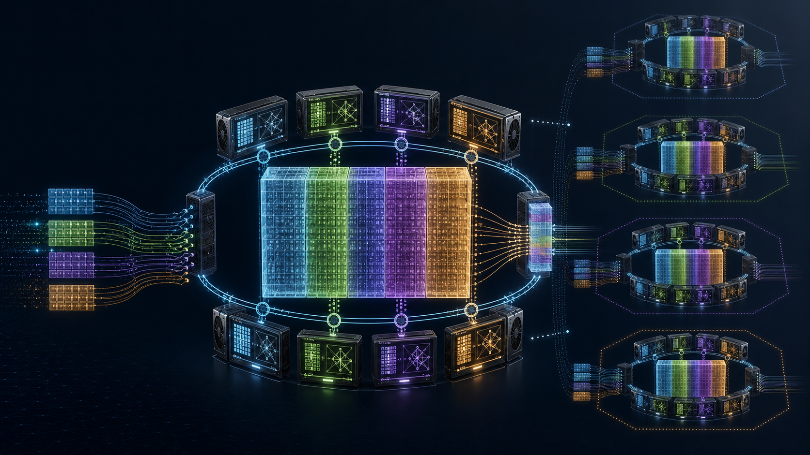
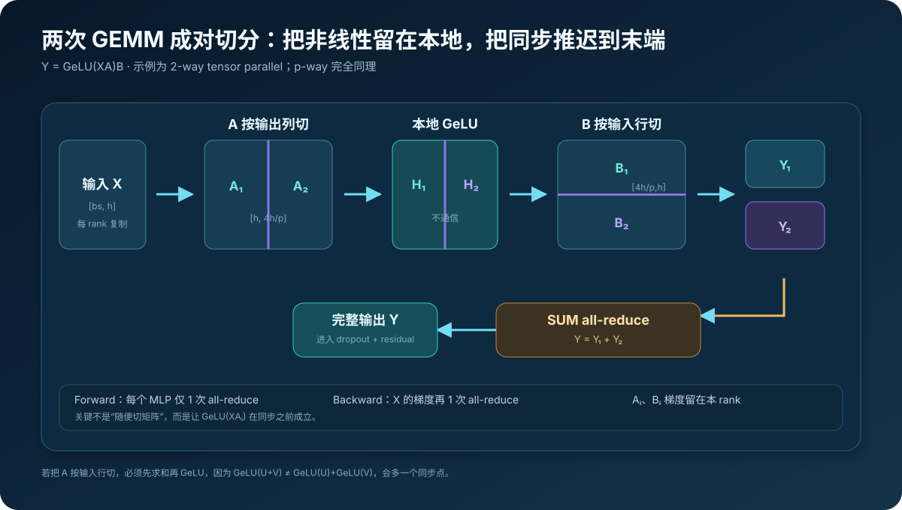
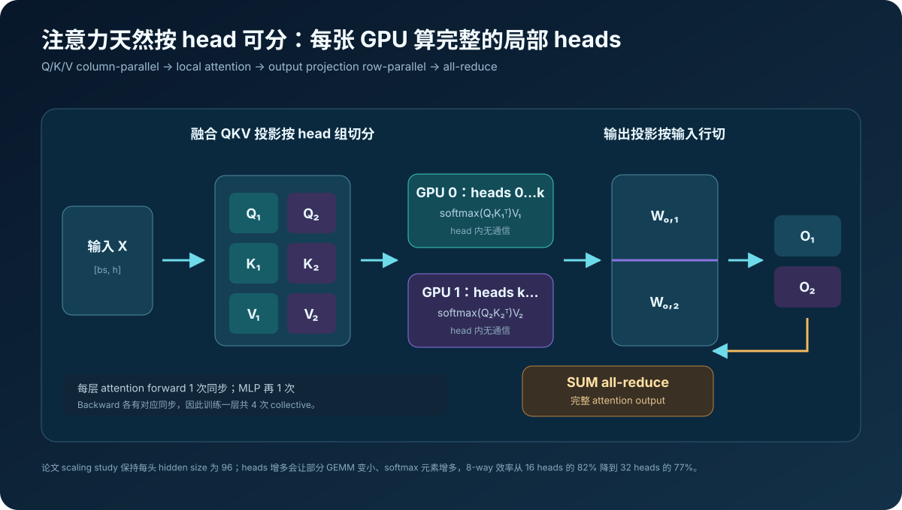
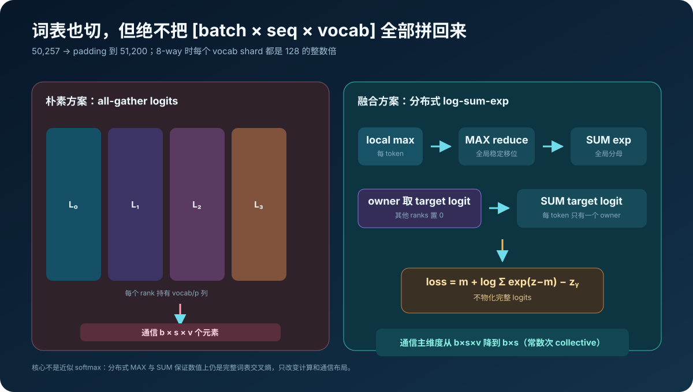
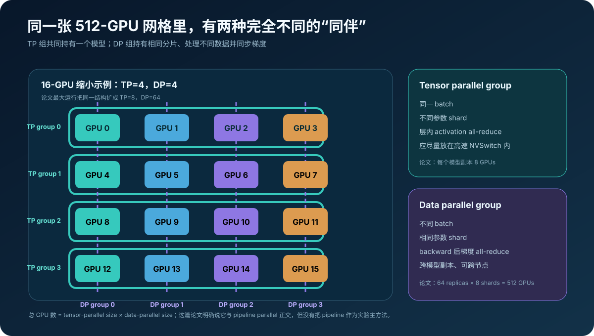
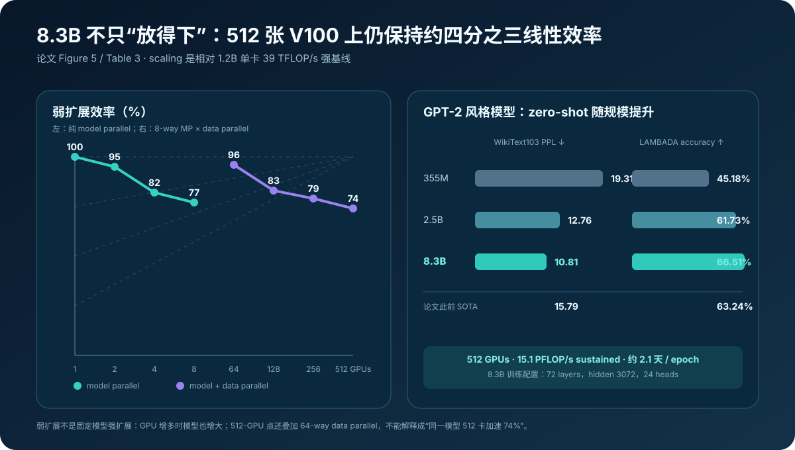
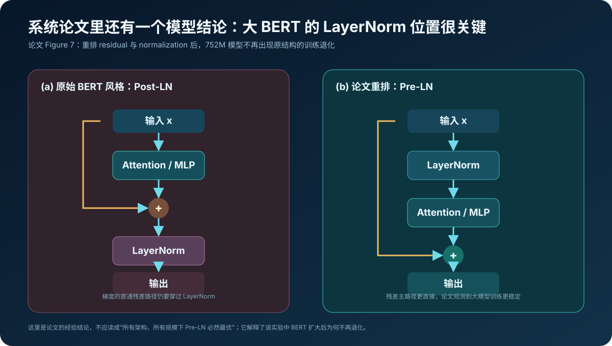

# Megatron-LM 原理：怎样把一个 Transformer 层切到多张 GPU，又不让通信吞掉收益



> **论文**：[Megatron-LM: Training Multi-Billion Parameter Language Models Using Model Parallelism](https://arxiv.org/abs/1909.08053)<br>
> **官方代码**：[NVIDIA/Megatron-LM](https://github.com/NVIDIA/Megatron-LM) · [论文修订时期历史实现](https://github.com/NVIDIA/Megatron-LM/tree/70174ae366832b2462ca1668baf63d7840c01ca1)<br>
> **作者**：Mohammad Shoeybi、Mostofa Patwary、Raul Puri、Patrick LeGresley、Jared Casper、Bryan Catanzaro（NVIDIA）<br>
> **时间**：2019 年 9 月首次公开；本文以 2020 年 3 月 arXiv v4 / ICML 2020 版本为准<br>
> **关键词**：Tensor Parallelism、Model Parallelism、Column Parallel、Row Parallel、All-Reduce、Vocabulary Parallel、Hybrid Parallelism<br>
> **配套代码**：[megatron_lm_minimal.py](./code/megatron_lm_minimal.py)<br>
> **前置阅读**：[Transformer 原理](00_Transformer_2017_原理.md) · [BERT 原理](01_BERT_2018_原理.md) · [GPT-2 原理](03_GPT2_2019_原理.md) · [FlashAttention 原理](14_FlashAttention_2022_原理.md)

2019 年，大模型训练首先撞到的不是“数据不够”，而是一个很具体的物理边界：

> **模型参数、梯度、Adam 状态和 activation 加起来，已经放不进一张 GPU。**

数据并行可以让更多 GPU 各算一部分 batch，但每张 GPU 仍必须保留完整模型：

$$
\text{data parallel memory per GPU}
\approx
\text{one complete model state}.
$$

如果完整模型本来就超出单卡显存，再增加数据并行副本没有帮助。Megatron-LM 的关键想法是：不要先把整个 Transformer 按层切成流水线，而是利用每一层内部的矩阵结构，把一次大 GEMM 切给多张 GPU：

$$
\underbrace{Y=XA}_{\text{一个大矩阵乘}}
\quad\Longrightarrow\quad
\underbrace{Y_i=XA_i}_{\text{每张 GPU 算一个输出分片}}.
$$

真正难的并不是“切矩阵”。随便切会在 GeLU、attention 或 residual 前制造大量同步。论文的工程贡献是找到一对互补切法：

```text
第一层：按输出列切（column parallel）
→ 非线性 / attention heads 在本地计算
→ 第二层：按输入行切（row parallel）
→ 末端一次 all-reduce
```

于是一个 Transformer layer 的全部主要 GEMM，可以只用：

$$
\boxed{
2\ \text{次 forward all-reduce}
+
2\ \text{次 backward all-reduce}
}
$$

完成。这个设计后来通常被称为 **tensor parallelism（张量并行，TP）**，并成为大模型“3D 并行”体系的一条基本轴。

---

## 0. 先给结论

读完本文，至少应记住下面二十点：

1. **论文说的 model parallelism，后来更准确地称为 intra-layer tensor parallelism。** 它把一个 layer 内的权重和 GEMM 分到多张 GPU，而不是把不同 layers 排成 pipeline。
2. **数据并行解决吞吐，张量并行解决单卡容量。** 数据并行每卡仍有完整模型；张量并行让每卡只保留参数 shard。
3. **MLP 第一层必须按输出维切。** 这样每张 GPU 能独立计算 $\operatorname{GeLU}(XA_i)$，非线性之前不需要同步。
4. **MLP 第二层按输入维切。** 它直接消费本地 hidden shard，局部结果最后求和得到完整输出。
5. **随便按另一方向切会多一次同步。** 因为 $\operatorname{GeLU}(U+V)\neq\operatorname{GeLU}(U)+\operatorname{GeLU}(V)$。
6. **多头注意力天然可按 head 分组。** Q/K/V projection 按输出切，每张 GPU 算完整的若干 heads，output projection 再按输入切。
7. **f 与 g 是一对共轭 autograd 通信算子。** f forward 为 identity、backward all-reduce；g forward all-reduce、backward identity。
8. **一层训练共四次主要 TP collectives。** attention forward/backward 各一次，MLP forward/backward 各一次；embedding 与 loss 还有边界通信。
9. **Megatron 选择复制便宜计算来减少通信。** LayerNorm、dropout、residual 等在 TP ranks 上重复执行，而不是再切碎并广播。
10. **词表也被切分。** 50,257 的 GPT-2 vocabulary padding 到 51,200，使 8-way 时每 rank 的 shard 对 Tensor Core 友好。
11. **不能 all-gather 完整 logits 后再算 loss。** 那会通信 $b\times s\times v$；融合词表并行交叉熵只归约每 token 的标量统计。
12. **TP 与 DP 是正交通信组。** 论文最大运行用 8-way model parallel × 64-way data parallel = 512 GPUs。
13. **随机数也必须服从并行语义。** residual dropout 在同一 TP group 要一致，模型并行区域内部 dropout 则要各 rank 不同，因此维护两类 RNG stream。
14. **论文训练到 8.3B GPT-2 风格模型与 3.9B BERT。** 主硬件是 512 张 V100 SXM3 32GB。
15. **15.1 PFLOP/s 与约 76% 线性效率有明确基线。** 基线是单张 V100 上 1.2B 模型的 39 TFLOP/s，不是硬件理论峰值。
16. **Figure 5 的 74% 与摘要的 76%不是同一个精确读数。** 前者是某 512-GPU weak-scaling 点，后者由 15.1 PFLOP/s 相对 39×512 重算约为 75.6%，还存在配置和四舍五入差异。
17. **weak scaling 不是固定模型加卡。** GPU 增多时模型也从 1.2B 扩到 8.3B；不能把 74% 解读为“同一 8.3B 模型在 512 卡上有 74% 强扩展”。
18. **论文还发现 BERT 扩大时 LayerNorm 位置很关键。** 把 normalization 移到 attention/MLP 之前，752M 级实验不再出现原结构的训练退化。
19. **2019 的结果要按历史语境读。** 8.3B 在 WikiText103 得 10.81 PPL、LAMBADA 66.51%，当时是 SOTA；它们不是今天模型能力的上限。
20. **首篇论文不包含今天 Megatron-Core 的完整功能。** pipeline、sequence、context、expert parallel 和分布式 optimizer 是后续演进，不能倒灌成 2019 贡献。



---

## 1. 先划清历史边界：Megatron-LM 不是今天的 Megatron-Core

当前官方仓库已经是持续演进的大型训练系统，支持：

- tensor parallel；
- pipeline parallel；
- data parallel；
- expert parallel；
- context parallel；
- sequence parallel；
- 分布式 optimizer、FP8/FP4 与大量融合 kernel。

但 2019/2020 这篇论文的实证主角只有：

```text
Transformer intra-layer model parallelism
+ conventional data parallelism
```

论文明确说该方法与 pipeline parallelism **orthogonal and complementary**，并把更大的 hybrid intra-layer + inter-layer 方案列为未来工作。这表示：

- 它知道 pipeline 可以组合；
- 它没有在本文中把 pipeline 做成主要实验贡献；
- “Megatron 后来支持 PP”不能改写成“首篇论文提出了 PP”。

本文用现在通行的 `tensor parallel / TP` 称呼论文的 `intra-layer model parallel`，但涉及论文原句和实验时仍保留 `model parallel / MP`。二者在本文上下文指同一核心机制。

历史代码也要固定版本。当前 `main` 的抽象、目录和 kernel 与论文年代相差巨大；本文用 2020 年 3 月附近的官方历史提交核对：

- `ColumnParallelLinear`；
- `RowParallelLinear`；
- `_CopyToModelParallelRegion`；
- `_ReduceFromModelParallelRegion`；
- `VocabParallelEmbedding`；
- `vocab_parallel_cross_entropy`。

---

## 2. 为什么数据并行救不了“单卡放不下”

### 2.1 训练显存不只是权重

设模型有 $P$ 个参数。论文使用 mixed precision 和 Adam。一个常见教学账本是：

| 状态 | 每参数近似字节数 |
|---|---:|
| FP16 model weights | 2 |
| FP16 gradients | 2 |
| FP32 master weights | 4 |
| Adam first moment | 4 |
| Adam second moment | 4 |
| **合计** | **约 16 B/parameter** |

于是 8.3B 参数的 model states 粗略为：

$$
8.3\times10^9\times16
\approx132.8\ \text{GB}
\approx123.7\ \text{GiB}.
$$

这还没算：

- activation；
- attention score；
- temporary workspace；
- NCCL buffer；
- allocator fragmentation；
- embedding / bias 等低阶项。

> 上面的 16 B 是便于理解的容量估算，不是论文报告的实测 V100 显存。

### 2.2 数据并行复制整个模型

有 $D$ 个 data-parallel workers，global batch 被拆成：

$$
B=\bigcup_{d=1}^{D}B_d.
$$

每个 worker 计算自己的梯度：

$$
g_d=\nabla_\theta\mathcal L(B_d;\theta),
$$

随后 all-reduce：

$$
g=\frac1D\sum_{d=1}^{D}g_d.
$$

问题是每个 worker 都要保存完整 $\theta$ 及其 Adam 状态：

$$
M_{\text{per GPU,DP}}\approx O(P).
$$

所以 DP 能提高 samples/s，却不能让本来放不下的模型突然放下。

### 2.3 张量并行切的是同一层

若用 $T$ 张 GPU 共同持有一个模型：

$$
\theta=igcup_{t=1}^{T}\theta_t,
$$

理想模型状态约为：

$$
M_{\text{per GPU,TP}}\approx O(P/T).
$$

8.3B、8-way TP 的上述 16 B 账本约降到 15.5 GiB/rank，为 activation 和 runtime buffer 留出空间。

但显存并不会完美缩小 8 倍，因为：

- LayerNorm 与部分 bias 被复制；
- residual activation 常在 ranks 上复制；
- dropout、mask 和临时 buffer 不一定分片；
- collective 需要通信 workspace；
- embedding 与 loss 有自己的布局。

因此张量并行不是“把总显存除以卡数”这么简单，而是一个**内存—通信—算子尺寸**共同设计问题。

---

## 3. MLP：整篇论文最核心的一对切法

Transformer MLP 写作：

$$
Y=\operatorname{GeLU}(XA)B,
$$

其中：

$$
X\in\mathbb R^{n\times h},\quad
A\in\mathbb R^{h\times4h},\quad
B\in\mathbb R^{4h\times h},
$$

$n=b\times s$ 表示 batch 与 sequence 展平后的 token 数。

### 3.1 一个看似自然、其实不好的切法

若把 $X$ 按列、$A$ 按行切：

$$
X=[X_1,X_2],
\qquad
A=
\begin{bmatrix}
A_1\\A_2
\end{bmatrix},
$$

则：

$$
XA=X_1A_1+X_2A_2.
$$

每张 GPU 只能得到一个 partial sum，必须先 all-reduce 得到完整 $XA$，才能正确计算：

$$
\operatorname{GeLU}(X_1A_1+X_2A_2).
$$

不能分别做 GeLU 再相加，因为一般有：

$$
\operatorname{GeLU}(U+V)
\neq
\operatorname{GeLU}(U)
+\operatorname{GeLU}(V).
$$

这会在两个 GEMM 中间增加同步点，破坏 kernel 连续性。

### 3.2 正确的第一刀：A 按输出列切

把：

$$
A=[A_1,A_2,\ldots,A_T].
$$

每张 GPU 直接计算：

$$
H_i=\operatorname{GeLU}(XA_i).
$$

因为 $A_i$ 对应不同输出 features，$H_i$ 本来就是完整 hidden 的一块，GeLU 是逐元素函数：

$$
[H_1,H_2,\ldots,H_T]
=
\operatorname{GeLU}(XA).
$$

这一步不需要通信。这就是 column-parallel linear。

### 3.3 配对的第二刀：B 按输入行切

将第二个权重沿同一中间维切：

$$
B=
\begin{bmatrix}
B_1\\B_2\\\vdots\\B_T
\end{bmatrix}.
$$

每个 rank 本地计算：

$$
Y_i=H_iB_i.
$$

完整结果是：

$$
Y=HB
=
\sum_{i=1}^{T}H_iB_i
=
\sum_{i=1}^{T}Y_i.
$$

所以在第二个 GEMM 后做一次 SUM all-reduce 即可。

### 3.4 为什么叫 column / row parallel 容易混乱

论文用数学形式 $Y=XA$：

- $A$ 沿第二维切，叫 column parallel；
- $B$ 沿第一维切，叫 row parallel。

PyTorch `F.linear(x, weight)` 实际计算：

$$
y=xW^\top+b.
$$

官方代码存的是数学矩阵的转置，所以源码里的 `partition_dim` 看起来可能与纸上“列/行”相反。判断时不要只看存储矩阵的视觉方向，应看：

```text
ColumnParallelLinear → 切 output features
RowParallelLinear    → 切 input features
```

### 3.5 backward 为什么也能对齐

对输出梯度 $G=\partial\mathcal L/\partial Y$，每个 rank 可本地计算：

$$
\frac{\partial\mathcal L}{\partial B_i}
=H_i^\top G,
$$

$$
\frac{\partial\mathcal L}{\partial H_i}
=GB_i^\top,
$$

$$
\frac{\partial\mathcal L}{\partial A_i}
=X^\top
\left(
\frac{\partial\mathcal L}{\partial H_i}
\odot\operatorname{GeLU}'(XA_i)
\right).
$$

各 rank 的 $A_i,B_i$ 梯度就是各自参数 shard 的完整梯度，不需在 TP group 内拼回。只有输入 $X$ 被所有分支共同使用：

$$
\frac{\partial\mathcal L}{\partial X}
=
\sum_i
\frac{\partial\mathcal L}{\partial X_i},
$$

因此 backward 在 MLP 入口再做一次 all-reduce。

配套代码不仅检查 forward，还逐项断言：

```python
assert dense_output == tensor_parallel_output
assert dense_dX == tensor_parallel_dX
assert dense_dA == concat(local_dA_shards)
assert dense_dB == concat(local_dB_shards)
```

---

## 4. f 与 g：用 autograd 把通信放在正确方向

论文把两个边界算子记为 $f$ 与 $g$。

### 4.1 f：forward copy，backward reduce

$$
f(x)=x,
$$

但它的反向定义为：

$$
\frac{\partial f}{\partial x}^{\!\top}g
=\operatorname{AllReduce}(g).
$$

伪代码：

```python
class CopyToTensorParallelRegion(autograd.Function):
    def forward(ctx, x):
        return x

    def backward(ctx, grad):
        all_reduce(grad)
        return grad
```

这正对应 column-parallel layer 的入口：forward 的 $X$ 在 ranks 上复制，无需通信；backward 要把各输出 shard 对 $X$ 的梯度求和。

### 4.2 g：forward reduce，backward identity

$$
g(y_1,\ldots,y_T)
=\sum_i y_i,
$$

forward 做 all-reduce；backward 接收的完整 $G$ 已经在各 rank 相同，直接传给本地 partial output 即可：

```python
class ReduceFromTensorParallelRegion(autograd.Function):
    def forward(ctx, partial):
        all_reduce(partial)
        return partial

    def backward(ctx, grad):
        return grad
```

### 4.3 为什么“共轭”不是装饰性术语

线性通信算子的 backward 是其转置作用。对 SUM all-reduce，在这种复制/求和布局下：

```text
copy forward  ↔ sum backward
sum forward   ↔ copy backward
```

f/g 把这条规则封装到 autograd graph，让模型代码只在并行区域边界插入少量操作，而不必手写完整分布式反向传播。

历史官方实现后来把它们命名得更直白：

- `_CopyToModelParallelRegion`；
- `_ReduceFromModelParallelRegion`；
- `_ScatterToModelParallelRegion`；
- `_GatherFromModelParallelRegion`。

---

## 5. Attention：head 是天然的并行单位

多头注意力：

$$
Q=XW_Q,\quad K=XW_K,\quad V=XW_V,
$$

$$
\operatorname{head}_j
=
\operatorname{softmax}
\left(\frac{Q_jK_j^\top}{\sqrt{d_h}}+M\right)V_j,
$$

$$
\operatorname{MHA}(X)
=
[\operatorname{head}_1;\ldots;\operatorname{head}_a]W_O.
$$

不同 heads 在 output projection 前互不依赖，因此：

1. 把融合 $W_{QKV}$ 按输出特征/heads 分给各 rank；
2. 每张 GPU 本地完成自己 heads 的 $QK^\top$、softmax 与乘 $V$；
3. 把 $W_O$ 按输入特征切分；
4. 各 rank 得到 partial output；
5. 一次 all-reduce 得完整 attention output。



### 5.1 为什么 Q/K/V 要做“对齐切分”

一个本地 attention head 必须同时拥有对应的 $Q_j,K_j,V_j$。若把融合矩阵简单切成“GPU 0 全是 Q、GPU 1 全是 K”，softmax 无法本地完成。

历史实现通过 strided partition 让每个 rank 拿到对应的一组 Q/K/V 列。现代代码封装更复杂，但不变量仍是：

$$
\text{local rank owns complete Q/K/V for its local heads}.
$$

### 5.2 head 数为什么会影响系统效率

Scaling study 中，论文固定 hidden size，改变 heads 会改变：

$$
d_h=\frac{h}{a}.
$$

8.3B、8-way MP 的附录结果：

| attention heads | hidden/head | scaling efficiency |
|---:|---:|---:|
| 16 | 192 | 82% |
| 24 | 128 | 80% |
| 32 | 96 | 77% |

heads 更多意味着：

- 某些 GEMM 更小，Tensor Core 利用率下降；
- softmax 的独立行/元素结构改变；
- kernel launch 与内存访问占比上升。

这张表不能解释为“16 heads 一定更准”。它只说明架构超参数同时也是系统超参数，速度与模型质量需要联合选择。

### 5.3 每层到底通信几次

| 子模块 | Forward | Backward |
|---|---:|---:|
| Self-attention | output projection 后 1× all-reduce | 输入梯度 1× all-reduce |
| MLP | 第二个 GEMM 后 1× all-reduce | 输入梯度 1× all-reduce |
| **合计 / layer** | **2** | **2** |

若 activation shape 是 $[b,s,h]$，一个 collective 的逻辑 payload 为：

$$
bsh\ \text{elements}.
$$

以 ring all-reduce 的理想通信模型，每 rank 的发送量近似：

$$
V_{\text{ring/rank}}
\approx
2\frac{T-1}{T}\cdot bsh\cdot q,
$$

$q$ 是每元素字节数。配套代码对 $b=8,s=1024,h=3072,T=8,q=2$ 算得约 84 MiB/collective/rank。

> 84 MiB 是教学通信模型，不是论文实测 NCCL traffic；真实值受算法、拓扑、分块、协议与 overlap 影响。

---

## 6. 为什么 LayerNorm、dropout 与 residual 宁愿复制

张量并行不是“所有张量都必须切”。论文采用一个非常实用的准则：

$$
\text{若通信代价} > \text{重复计算代价，复制计算。}
$$

于是这些运算在 TP ranks 上各自执行：

- LayerNorm 及其少量参数；
- dropout；
- residual add；
- 一些 elementwise activation；
- attention mask 等小张量逻辑。

主要大矩阵权重被分片，而 activation 在并行区域边界恢复为完整 $[b,s,h]$。这样下一层可以重复同一套 column→local→row 结构。

若执意把 LayerNorm 也切开，需要跨 rank 计算 hidden dimension 的全局均值与方差：

$$
\mu=\frac1h\sum_{j=1}^{h}x_j,
\qquad
\sigma^2=\frac1h\sum_j(x_j-\mu)^2,
$$

每层会新增 reductions。对于论文年代的规模，复制它更划算。

这个策略也解释一个容易混淆的点：TP 节省大量 parameter/optimizer memory，但 residual activation 仍可能复制；后来 sequence parallel 等技术才进一步分摊这部分内存与计算，它不属于首篇论文。

---

## 7. 词表并行：把最大的一次 all-gather 消掉

### 7.1 输入 embedding 怎样切

语言模型常共享 input embedding 与 output projection：

$$
E\in\mathbb R^{v\times h}.
$$

Megatron 沿 vocabulary dimension 切：

$$
E=
\begin{bmatrix}
E_1\\E_2\\\vdots\\E_T
\end{bmatrix}.
$$

每个 rank 只拥有一段 token IDs。对输入 token $x$：

1. 若 $x$ 属于本 rank 的 vocab range，查本地 embedding；
2. 否则输出全零；
3. 跨 ranks SUM all-reduce。

因为每个 token 恰好只有一个 owner，求和后就是正确 embedding：

$$
e(x)=\sum_{i=1}^{T}e_i(x).
$$

### 7.2 朴素 output loss 为什么昂贵

每个 rank 的 output projection 得到：

$$
Z_i\in\mathbb R^{b\times s\times(v/T)}.
$$

最直观做法是：

$$
Z=\operatorname{AllGather}(Z_1,\ldots,Z_T),
$$

再用完整 $Z$ 算 cross entropy。这会通信：

$$
bsv\ \text{elements}.
$$

当 $v\approx50{,}000$ 时，logits 往往是模型边界最大的 activation 之一。

### 7.3 分布式 log-sum-exp

单 token 的交叉熵：

$$
\ell
=-log\frac{e^{z_y}}{\sum_{j=1}^{v}e^{z_j}}
=m+\log\sum_je^{z_j-m}-z_y,
$$

其中：

$$
m=\max_jz_j.
$$

在 vocab shards 上可以精确计算：

1. 各 rank 求 local max，再 MAX all-reduce 得全局 $m$；
2. 各 rank 求本地 $\sum e^{z_j-m}$，再 SUM all-reduce；
3. 只有拥有 target $y$ 的 rank 取 $z_y$，其他 rank 置零，再 SUM all-reduce；
4. 每个 rank 用三个全局标量统计得到同一个 loss。



关键结论是：

$$
\text{communication main dimension}
:
bsv\rightarrow bs.
$$

这不是近似 softmax。MAX/SUM collectives 让结果在浮点误差范围内与完整词表 loss 相同。配套代码直接比较 dense 与 sharded loss。

### 7.4 为什么 vocabulary 从 50,257 变成 51,200

论文希望每 GPU 的 vocab shard 是 128 的整数倍。8-way MP 时，全局 vocab 要能被：

$$
128\times8=1024
$$

整除。于是：

$$
\left\lceil\frac{50{,}257}{1024}\right\rceil\times1024
=51{,}200.
$$

多出的 943 个位置是 padding，不代表多出 943 个有语义的 tokens。它们换来更规整的 GEMM shape。

---

## 8. TP × DP：一张二维通信网格

### 8.1 两类组的定义

假设 16 GPUs、TP=4、DP=4。

Tensor-parallel groups：

```text
[0, 1, 2, 3]
[4, 5, 6, 7]
[8, 9, 10, 11]
[12, 13, 14, 15]
```

每一行共同持有一个完整模型副本的四个 shards，处理同一个 microbatch，并在层内通信。

Data-parallel groups：

```text
[0, 4, 8, 12]
[1, 5, 9, 13]
[2, 6, 10, 14]
[3, 7, 11, 15]
```

每一列拥有“相同位置”的参数 shard，但处理不同数据；backward 后对该 shard 的梯度 all-reduce。



总 GPU 数：

$$
N_{\text{GPU}}=T\times D.
$$

论文最大配置：

$$
8\ \text{TP}
\times64\ \text{DP}
=512\ \text{GPUs}.
$$

### 8.2 拓扑映射为什么重要

TP 每一层都要通信 activation，collective 频率高；DP 通常在 backward 梯度 ready 时通信，频率和张量粒度不同。

论文使用 DGX-2H：

- 单服务器 16 张 V100 SXM3 32GB；
- 服务器内 NVSwitch 总体高带宽，论文记为 300 GB/s；
- 服务器间用 8 个 InfiniBand adapters，论文记为 100 GB/s；
- 最多 32 台服务器，共 512 GPUs。

因此通常把一个 8-way TP group 放在同一服务器内部，让层内高频 all-reduce 走 NVSwitch；DP groups 跨服务器同步对应 shards。

若反过来把 TP group 随机跨节点铺开，即使数学完全相同，也可能让每层 latency 暴涨。

### 8.3 随机数也是分布式状态

Transformer 有两类 dropout：

1. 模型并行区域外、residual 前的 dropout；
2. 模型并行区域内、attention 等分片张量上的 dropout。

对第一类，同一 TP group 的完整 activation 被复制，因此各 rank 必须使用**相同 mask**，否则 residual states 从此不一致。

对第二类，各 rank 拥有不同 activation shard，应该产生**不同 mask**，共同组成一次完整 dropout。

论文附录因此维护两套 RNG 语义：

```text
default RNG stream
→ TP ranks 同 seed
→ 复制区域 dropout 一致

model-parallel RNG stream
→ 每个 TP rank 独立 seed
→ 分片区域 dropout 不重复
```

如果 checkpoint/resume 没保存两套 RNG state，恢复后的 loss 轨迹就不再是同一次实验。

---

## 9. 训练配方：系统收益必须在真实收敛中成立

### 9.1 数据集

论文聚合：

- Wikipedia；
- CC-Stories；
- RealNews；
- OpenWebText；
- BooksCorpus（仅 BERT）。

关键处理：

- 移除 WikiText103 test set 中出现的 Wikipedia articles；
- 清理 CC-Stories 预处理造成的多余换行；
- 删除长度少于 128 tokens 的文档；
- 用 locality-sensitive hashing 去除 Jaccard similarity $>0.7$ 的近重复；
- 最终聚合语料约 174 GB。

GPT-2 训练排除 BooksCorpus，因为它与 LAMBADA 有重叠；BERT 则包含。

这套数据披露以今天开放科学标准仍不充分：论文没有提供像 Dolma 那样完整可重建的来源、许可、过滤版本和 data order。它足以解释实验轮廓，不足以精确重建每个训练 token。

### 9.2 共同训练设置

| 项目 | 设置 |
|---|---|
| precision | mixed FP16，dynamic loss scaling |
| initialization | $W\sim\mathcal N(0,0.02)$ |
| residual weights | 在 residual 前按 $1/\sqrt{2N}$ 缩放 |
| optimizer | Adam + weight decay 0.01 |
| gradient clipping | global norm 1.0 |
| dropout | 0.1 |
| activation memory | 每个 Transformer layer 后 checkpoint |

Residual projection 初始化缩放：

$$
W_{\text{residual}}
\leftarrow
\frac{W}{\sqrt{2N}},
$$

$N$ 是 Transformer layers 数，系数 2 来自每层 attention 和 MLP 两条 residual branches。它帮助深层网络控制累计方差。

Activation checkpointing 则用计算换显存：

$$
M_{\text{activation}}\downarrow,
\qquad
F_{\text{backward compute}}\uparrow.
$$

forward 不保存每层内部所有 activation，backward 需要时重新计算。

### 9.3 GPT-2 风格训练

```text
sequence length = 1024
global batch = 512
iterations = 300,000
peak LR = 1.5e-4
warmup = 3,000 iterations
cosine decay = remaining 297,000
minimum LR = 1e-5
```

学习率可写为：

$$
\eta(t)=
\eta_{\min}
+\frac12(\eta_{\max}-\eta_{\min})
\left[1+\cos\left(\pi\frac{t-W}{T-W}\right)\right]
$$

用于 warmup 后的 $W<t\le T$。

### 9.4 BERT 风格训练

```text
vocab = 30,522
next sentence prediction → sentence order prediction
whole-word n-gram masking
global batch = 1024
peak LR = 1e-4
warmup = 10,000 iterations
linear decay over 2,000,000 iterations
```

它不只是“把 BERT 参数变大”。目标、masking 与 LayerNorm/残差布局也被修改。因此比较时应称为 BERT-style Megatron model，而不是原封不动的 BERT-Large 放大版。

---

## 10. Scaling 结果：先区分 weak 与 strong

### 10.1 Weak scaling 的实验到底固定什么

论文 scaling study 保持每 attention head 维度为 96，并让模型与 MP size 同时增长：

| 参数 | hidden | heads | layers | MP GPUs | MP+DP GPUs |
|---:|---:|---:|---:|---:|---:|
| 1.2B | 1,536 | 16 | 40 | 1 | 64 |
| 2.5B | 1,920 | 20 | 54 | 2 | 128 |
| 4.2B | 2,304 | 24 | 64 | 4 | 256 |
| 8.3B | 3,072 | 32 | 72 | 8 | 512 |

纯 MP scaling 的 batch 固定为 8；MP+DP 的 global batch 固定 512，对应 64-way DP。

这里的“weak scaling”是让每 GPU 大致保持约 1B 参数和相近计算负担，同时扩模型和 GPU：

$$
P\uparrow\quad\text{as}\quad T\uparrow.
$$

它回答：

> 模型每扩大一倍并多给相应 GPU，效率还能保持多少？

它不回答：

> 一个固定 8.3B 模型从 1 卡加到 512 卡能快多少？

因为 8.3B 根本放不进 1 卡，且 512 点包含 DP。

### 10.2 Scaling efficiency 怎样算

单卡 baseline：

$$
F_1=39\ \text{TFLOP/s}.
$$

论文指出这约是 V100 理论峰值的 30%，但它是**完整训练应用 sustained throughput**，包含非 GEMM 操作与通信之外的真实开销，是较强基线。

理想 512-GPU 吞吐：

$$
F_{\text{ideal}}
=512\times39
=19.968\ \text{PFLOP/s}.
$$

实际：

$$
F_{512}=15.1\ \text{PFLOP/s}.
$$

所以：

$$
E
=\frac{15.1}{19.968}
\approx75.6\%.
$$

摘要写 76%。Figure 5 另给 512-GPU model+data weak-scaling point 74%。最稳妥的解释是：具体测量配置、精确未四舍五入 FLOPs 和图表读数不同；不应强行宣称所有 512-GPU run 只有一个精确效率。



### 10.3 纯 model-parallel weak scaling

Figure 5：

| MP GPUs | efficiency |
|---:|---:|
| 1 | 100% |
| 2 | 95% |
| 4 | 82% |
| 8 | 77% |

规模越大，collective、smaller GEMMs 和同步开销占比升高，但 8-way 仍维持 77%。

### 10.4 Model + data parallel weak scaling

| total GPUs | MP×DP | efficiency |
|---:|---:|---:|
| 64 | 1×64 | 96% |
| 128 | 2×64 | 83% |
| 256 | 4×64 | 79% |
| 512 | 8×64 | 74% |

相对纯 MP 又多了 DP gradient all-reduce，所以最大点略低。

### 10.5 固定模型的 strong scaling 没那么漂亮

附录把 1.2B 模型、batch=8 固定，增加 MP GPUs：

| GPUs | speedup |
|---:|---:|
| 1 | 1.00× |
| 2 | 1.64× |
| 4 | 2.34× |
| 8 | 2.98× |

8 张卡只快约 2.98 倍，而非 8 倍。原因是每 GPU GEMM 越来越小，memory bandwidth、latency 与 communication 开始主导。

这揭示 TP 的正确用途优先级：

1. 先让单卡放不下的模型能训练；
2. 再在足够大的 GEMM 上获得并行速度；
3. 不要为了“卡多”给小模型盲目提高 TP size。

---

## 11. GPT-2 风格结果：规模、吞吐与评测协议一起读

### 11.1 三个模型

用于语言模型效果实验的配置与 scaling table 不完全相同：

| 参数 | layers | hidden | heads | hidden/head | total GPUs | 每 epoch |
|---:|---:|---:|---:|---:|---:|---:|
| 355M | 24 | 1,024 | 16 | 64 | 64 | 0.86 天 |
| 2.5B | 54 | 1,920 | 20 | 96 | 128 | 2.27 天 |
| 8.3B | 72 | 3,072 | 24 | 128 | 512 | 2.10 天 |

注意：

- scaling study 的 8.3B 使用 32 heads、每头 96；
- accuracy study 的 8.3B 使用 24 heads、每头 128；
- 所以不能把某张 scaling 曲线的精确效率无条件贴到 accuracy checkpoint。

用常见 GPT 参数近似：

$$
P\approx12Lh^2+(v+s)h.
$$

代入 $L=72,h=3072,v=51200,s=1024$：

$$
P\approx8.314\text{B},
$$

与 “8.3B” 一致。$12Lh^2$ 来自每层 attention 约 $4h^2$ 与 MLP 约 $8h^2$。

### 11.2 Zero-shot 结果

| 模型 | WikiText103 PPL ↓ | LAMBADA accuracy ↑ |
|---|---:|---:|
| 355M | 19.31 | 45.18% |
| 2.5B | 12.76 | 61.73% |
| 8.3B | **10.81** | **66.51%** |
| 当时 previous SOTA | 15.79 | 63.24% |

论文还报告 8.3B validation perplexity 达 9.27；Table 3 的 10.81 是按特定协议校正后的 WikiText103 test perplexity，二者不是矛盾。

### 11.3 WikiText103 PPL 为什么需要校正

普通 perplexity：

$$
\operatorname{PPL}
=
\exp\left(
-\frac1T\sum_{t=1}^{T}
\log p(x_t|x_{<t})
\right).
$$

论文要与 word-level 先前工作比较，但 Megatron 使用 subword tokenizer。它把 NLL 的分母设为原始 WikiText token 数 $T_o$，而不是模型实际 subword 数 $T$：

$$
\operatorname{PPL}_{\text{adjusted}}
=
\exp\left(
-\frac1{T_o}\sum_{t=1}^{T}
\log p(x_t|x_{<t})
\right).
$$

论文给出：

$$
T_o=245{,}566,
\qquad
T=270{,}329.
$$

还先用可逆 detokenizer 清除预标点/空格 artifacts，并用 context 1024、overlap 32 的 sliding-window evaluation。

这说明“PPL=10.81”依赖：

- tokenizer；
- detokenization；
- normalization denominator；
- context window；
- overlap stride；
- 是否让边界 token 获得完整上下文。

不能把不同协议下的两个 PPL 直接排序。

### 11.4 LAMBADA 的 subword 判对规则

LAMBADA 要预测最后一个 word。若该 word 被切成多个 subwords，论文用 teacher forcing，要求所有 output subwords 都预测正确才算整词正确。

因此 66.51% 不是：

- 任一 subword 命中率；
- top-k accuracy；
- 生成字符串模糊匹配。

它是严格的整词 exact success。

### 11.5 污染检查仍有限

论文计算 test set 8-grams 在训练集的重合：

- WikiText103 至多 10.8%；
- LAMBADA 至多 1.4%；
- WikiText103 自身 train/test 已有 9.09% overlap。

作者据此认为没有意外包含测试文档。按今天标准，这个检查仍不能完全排除：

- 更短片段记忆；
- 近重复改写；
- 同一来源的模板泄漏；
- benchmark 被转录到其他网页；
- overlap 对结果的实际贡献。

它应被读作 2019 年的污染审计努力，而不是形式证明。

---

## 12. BERT：LayerNorm 重排让规模收益不再退化

### 12.1 原始 Post-LN 与论文 Pre-LN

原始 BERT-style block 可近似写成：

$$
h_{l+1}
=
\operatorname{LN}(h_l+F(h_l)).
$$

论文重排为：

$$
h_{l+1}
=
h_l+F(\operatorname{LN}(h_l)).
$$

即把 LayerNorm 从 residual 相加之后，移到 attention/MLP 之前。



Pre-LN 让 identity residual path 更直接：

$$
\frac{\partial h_{l+1}}{\partial h_l}
=I+\frac{\partial F(\operatorname{LN}(h_l))}{\partial h_l}.
$$

这有利于深层梯度传播，但论文给出的是经验结果，不是证明所有 Pre-LN 架构都优于 Post-LN。

### 12.2 三个 BERT 模型

| 参数 | layers | hidden | heads | total GPUs |
|---:|---:|---:|---:|---:|
| 336M | 24 | 1,024 | 16 | 128 |
| 1.3B | 24 | 2,048 | 32 | 256 |
| 3.9B | 48 | 2,560 | 40 | 512 |

每头维度均为：

$$
d_h=64.
$$

336M 与 1.3B 训练 2M iterations；3.9B 训练 1.5M，论文写作时仍在继续。3% held-out set PPL：

| 336M | 1.3B | 3.9B |
|---:|---:|---:|
| 1.58 | 1.30 | 1.16 |

随规模单调下降。

### 12.3 下游结果

论文 Table 5 中 Megatron 系列：

| 模型 | MNLI m/mm | QQP | SQuAD 1.1 F1/EM | SQuAD 2.0 F1/EM | RACE |
|---|---:|---:|---:|---:|---:|
| 336M | 89.7/90.0 | 92.3 | 94.2/88.0 | 88.1/84.8 | 83.0 |
| 1.3B | 90.9/91.0 | 92.6 | 94.9/89.1 | 90.2/87.1 | 87.3 |
| 3.9B | **91.4/91.4** | **92.7** | **95.5/90.0** | **91.2/88.5** | **89.5** |

论文摘要中的 RACE 90.9% 是 **5-way ensemble**；单个 3.9B 模型是 89.5%。此前表中 ALBERT ensemble 为 89.4%。不区分 single 与 ensemble 会夸大单模型结论。

另一个公平性问题是 trained tokens：Megatron rows 的 ratio 为 1，RoBERTa 约 2，ALBERT 约 3。模型更大不等于总训练计算更少，表中只对 token 消耗做了相对说明，未给统一 FLOP-normalized 比较。

---

## 13. 配套代码：验证数学等价，而不是模拟分布式延迟

本仓库提供：

- [megatron_lm_minimal.py](./code/megatron_lm_minimal.py)

它只依赖 Python 标准库，运行：

```bash
python3 papers/to-2026/code/megatron_lm_minimal.py
```

### 13.1 它验证什么

代码构造一个 $h=4,m=8$ 的小 MLP（为便于手算，教学 expansion ratio 取 2，而非论文模型常见的 4），分别计算：

```python
dense = gelu(X @ A) @ B

A1, A2 = split_columns(A, 2)
B1, B2 = split_rows(B, 2)
parallel = all_reduce_sum([
    gelu(X @ A1) @ B1,
    gelu(X @ A2) @ B2,
])
```

然后断言：

- forward outputs 一致；
- $dX$ 一致；
- column shards 拼回的 $dA$ 一致；
- row shards 拼回的 $dB$ 一致。

这比只演示 forward 更重要：一个“前向看起来对”的 partition，也可能在 backward 错误重复或漏掉 reduction。

### 13.2 词表并行 loss

代码实现：

```python
global_max = all_reduce_max(local_max)
global_exp_sum = all_reduce_sum(local_exp_sum)
target_logit = all_reduce_sum(local_target_or_zero)
loss = global_max + log(global_exp_sum) - target_logit
```

并与完整 logits 的 dense cross entropy 比较到 $10^{-12}$ 相对误差。

### 13.3 通信组

```python
groups = build_parallel_groups(world_size=16, tensor_parallel_size=4)
```

输出横向 TP groups 和纵向 DP groups，帮助检查最常见的 rank mapping 错误。

### 13.4 可重算的论文账本

脚本还会输出：

```json
{
  "padded_vocabulary": 51200,
  "approximate_parameters": 8314159104,
  "mixed_precision_adam_states_gib_total": 123.89,
  "mixed_precision_adam_states_gib_per_tp_rank": 15.49,
  "reported_512_gpu_efficiency_pct_recomputed": 75.62
}
```

其中参数量与显存是公式近似，效率是用论文已四舍五入的 15.1 PFLOP/s 与 39 TFLOP/s 重算；脚本明确标注它们不是新的实测结果。

### 13.5 它没有模拟什么

标准库教学代码没有：

- 启动多进程；
- 调用 NCCL；
- 模拟 ring/tree collective 的真实 latency；
- 重叠 GEMM 与通信；
- 建模 allocator 和 activation memory；
- 训练 Transformer 或复现 benchmark。

它回答“partition 数学是否等价”；真实 Megatron 回答“在具体 GPU 拓扑上是否高效”。

---

## 14. 一个简单成本模型

对每层主要计算，GPT-style Transformer 训练 FLOPs 粗略与：

$$
F_{\text{layer}}\propto bsh^2
$$

成正比；TP 后每 rank 理想计算约：

$$
F_{\text{rank}}\approx\frac{F_{\text{layer}}}{T}.
$$

每个 activation all-reduce 的 payload 与：

$$
C_{\text{collective}}\propto bsh
$$

成正比。两者比值近似：

$$
\frac{F_{\text{rank}}}{C}
\propto\frac{h}{T}.
$$

这解释了：

- hidden size 越大，GEMM 相对通信越划算；
- TP size 太大，$h/T$ 变小，通信暴露；
- 小模型强行 8-way TP 收益差；
- 大模型 weak scaling 更适合这套方法。

但这个模型忽略 attention 的 $O(bs^2h)$ 项、网络 latency、kernel efficiency 和 overlap，只用于方向判断。

### 14.1 为什么要保持 GPU compute-bound

论文多次强调把通信放在两个 GEMM 的边界，并让中间 GeLU / attention 本地执行。目标是让：

$$
T_{\text{GEMM}}
\gg
T_{\text{collective exposed}}.
$$

如果 GEMM 很小或网络很慢，则：

$$
T_{\text{step}}
\approx
T_{\text{compute}}+T_{\text{communication}},
$$

TP 只会增加复杂度。后来通信 overlap 会让一部分接近：

$$
T_{\text{step}}
\approx
\max(T_{\text{compute}},T_{\text{communication}}),
$$

但首篇论文的核心贡献是先通过切法减少同步点，而不是今天所有 overlap 技巧。

---

## 15. 十一个常见误解

### 误解 1：Megatron-LM 2019 提出了完整 3D 并行

不对。本文实证是 intra-layer MP + DP；PP 被说明为正交和未来组合方向。

### 误解 2：TP 就是每张 GPU 放若干完整 Transformer layers

不对。那是 layer-wise/pipeline parallel；TP 是同一层矩阵被多卡共同计算。

### 误解 3：任意方向切 linear 都一样

不对。非线性前后的切分必须配对，否则会增加同步或直接算错。

### 误解 4：column parallel 只看 PyTorch weight 的视觉列

不对。`F.linear` 存转置矩阵。应看输出 features 是否被分片。

### 误解 5：每层只有两次通信

只看 forward 是两次；完整训练还有对应 backward 两次，共四次主要 TP collectives。

### 误解 6：词表分片后 loss 是近似值

不对。分布式 log-sum-exp 与 dense cross entropy 数学等价。

### 误解 7：TP=8 就让所有显存严格除以 8

不对。参数和大 GEMM 权重近似分片，residual activation、LayerNorm、buffer 等仍可能复制。

### 误解 8：512-GPU 74% 表示固定 8.3B 模型加速 379×

不对。这是 weak scaling 且包含 DP；固定 1.2B 模型的 8-GPU strong speedup 只有 2.98×。

### 误解 9：论文的 90.9 RACE 是单模型

不对。单个 3.9B 是 89.5，90.9 是 5-model ensemble。

### 误解 10：今天仓库的任何 Megatron 功能都是首篇论文贡献

不对。当前仓库跨越多年演进，引用功能必须回到对应论文和 commit。

### 误解 11：数学等价就保证逐位复现

不对。all-reduce 求和顺序、FP16 rounding、loss scaling、kernel 与 RNG state 都会让浮点轨迹产生差异。

---

## 16. 局限与未回答的问题

### 16.1 TP size 被单机高速互联限制

论文主要做到 8-way MP，并尽量放在 DGX-2H 高速域内。跨节点逐层 all-reduce 的 latency 和带宽更差。作者明确指出，大于 16B 可能需要 intra-layer、inter-layer 和 inter-node 的混合方案。

### 16.2 Data parallel 仍复制 optimizer states

同一个 TP shard 在 64 个 DP replicas 上重复保存 Adam 状态。本文解决模型在单副本内怎样分片，没有消除 DP 维度的冗余。ZeRO 等后续工作正面解决这一问题。

### 16.3 activation 仍是重要瓶颈

论文用每层 activation checkpointing，但许多 residual states 在 TP ranks 上复制。长 sequence、大 batch 或更深模型会再次撞内存墙。

### 16.4 每层同步限制超大 TP

一层 4 次 collectives 意味着 72 layers 的一次 forward+backward 有大量同步边界。即便总字节可接受，collective latency 也会累积。

### 16.5 维度必须可整除且 GEMM 要足够大

hidden size、heads、4h、vocab 都要与 TP size 对齐。为了硬件效率还要满足 8/16/128 等 kernel tile 偏好。模型架构因此被系统约束。

### 16.6 数据与环境复现不足

论文公开代码，但 174GB 聚合语料并不是一个完整可重建、带版本哈希的开放 artifact；V100/Apex/PyTorch/NCCL 环境也会随时间变化。当前仓库不能直接代表论文环境。

### 16.7 评测范围窄且 SOTA 已过时

GPT 只重点看 WikiText103/LAMBADA，BERT 看少量英文理解任务；没有多语言、公平、安全、隐私、能耗或生成滥用评测。SOTA 表述只在 2019/2020 语境成立。

### 16.8 更大模型的收益与变量未完全解耦

模型大小变化时，layers、hidden、heads、GPU 数和 kernel shapes 一起变化；BERT 还改了 normalization、sentence objective 和 masking。结果支持“整个规模化配方有效”，不等于每个变量的独立因果效应都已证明。

---

## 17. 怎样复现论文核心结论

### 17.1 数学等价检查

- [ ] column-parallel 输出拼接等于 dense first linear；
- [ ] GeLU 在 local shard 上执行；
- [ ] row-parallel partial outputs 求和等于 dense second linear；
- [ ] backward $dX,dA,dB$ 都与 dense 对齐；
- [ ] attention 每 rank 拥有完整的 local Q/K/V heads；
- [ ] vocab-parallel loss 与 dense loss 对齐；
- [ ] padded vocab 不会成为可预测的真实 token。

### 17.2 通信语义检查

- [ ] TP groups 与 DP groups 没有 rank 配错；
- [ ] f forward identity / backward reduce；
- [ ] g forward reduce / backward identity；
- [ ] 每层 attention/MLP 各 1 forward + 1 backward reduce；
- [ ] DP gradient reduction 只在相同 shard 的 replicas 间发生；
- [ ] TP 高频通信优先映射到节点内高速互联；
- [ ] collective tensor shape、dtype 与 contiguous layout 一致。

### 17.3 随机性与 checkpoint

- [ ] TP 外 dropout masks 在 TP ranks 上一致；
- [ ] TP 内 dropout masks 在不同 shards 上独立；
- [ ] 保存 default 与 model-parallel RNG states；
- [ ] 保存 dynamic loss scaler；
- [ ] checkpoint 包含 TP/DP topology；
- [ ] 恢复时 optimizer shards 与 ranks 正确映射。

### 17.4 性能报告

- [ ] 明确 weak scaling 还是 strong scaling；
- [ ] 报模型、batch、sequence、TP、DP 和总 GPUs；
- [ ] sustained FLOPs 包含哪些步骤；
- [ ] 基线是单卡应用吞吐还是理论峰值；
- [ ] 分别报告 compute、collective 和 data loading 时间；
- [ ] 给出 GPU 型号、互联、NCCL 与框架版本；
- [ ] 不把不同 head 配置的效率混用。

### 17.5 结果复现

- [ ] 固定论文 v4 与历史 commit；
- [ ] 区分 GPT scaling config 和 accuracy config；
- [ ] WikiText 使用同一 detokenizer、$T_o$ 分母与 overlap=32；
- [ ] LAMBADA 多 subword 全命中才判对；
- [ ] 区分 validation PPL 9.27 与 adjusted test PPL 10.81；
- [ ] 区分 BERT single model 89.5 与 ensemble 90.9；
- [ ] 报训练 tokens、随机种子和污染审计。

---

## 18. Megatron-LM 在大模型系统史上的位置

可以把它的历史作用压缩为：

```text
单卡训练
→ data parallel：更多样本，但每卡完整模型
→ Megatron tensor parallel：同一层矩阵跨卡
→ TP × DP：既放大模型，又保持吞吐
→ 后续 TP × PP × DP 与更多并行轴
```

它最持久的设计不是某个类名，而是三个原则：

1. **切分要服从算子代数。** 在非线性之前选择能局部完成的输出分片；
2. **成对设计相邻 GEMM。** 让第一个输出 shard 直接成为第二个输入 shard；
3. **通信应被推到计算密集区域边界。** 少做同步，复制便宜操作，保持大 GEMM compute-bound。

后来无论是 Megatron-Core、DeepSpeed、各类大模型训练框架，还是现代 MoE/多维并行系统，都在重复面对同一个问题：

$$
\text{哪个维度可切？}
\quad
\text{切后谁拥有完整语义？}
\quad
\text{在哪里必须通信？}
$$

Megatron-LM 给出了 Transformer MLP、attention 和 vocabulary 上一组极其清晰的答案。

---

## 19. 总结

Megatron-LM 的核心并不是“用了 512 张 GPU”，而是把通信复杂度藏进一对正确的矩阵分解里。

MLP：

$$
\operatorname{GeLU}(XA)B
=
\sum_i\operatorname{GeLU}(XA_i)B_i.
$$

Attention：

$$
\operatorname{MHA}(X)
=
\sum_i\operatorname{LocalHeads}_i(X)W_{O,i}.
$$

Vocabulary loss：

$$
\operatorname{CE}(z,y)
=m+\log\sum_i\sum_{j\in V_i}e^{z_j-m}-z_y.
$$

三条式子共享同一思想：

> **让每张 GPU 尽可能长时间地做有完整局部语义的计算，只在数学上不可避免的求和边界同步。**

如果只记一段话，可以记住：

> **数据并行复制模型、切 batch；Megatron 张量并行复制输入、切权重。第一层按输出切，让 GeLU 或 attention heads 本地完成；第二层按输入切，末端 all-reduce。它不是把通信消灭，而是把通信压缩到少数、规则、可被高速互联承受的边界。**

---

## 20. 参考资料

1. Mohammad Shoeybi et al. [Megatron-LM: Training Multi-Billion Parameter Language Models Using Model Parallelism](https://arxiv.org/abs/1909.08053), 2019/2020.
2. NVIDIA. [Megatron-LM official repository](https://github.com/NVIDIA/Megatron-LM).
3. NVIDIA. [Paper-era Megatron-LM source snapshot](https://github.com/NVIDIA/Megatron-LM/tree/70174ae366832b2462ca1668baf63d7840c01ca1), March 2020.
4. Ashish Vaswani et al. [Attention Is All You Need](https://arxiv.org/abs/1706.03762), 2017.
5. Jacob Devlin et al. [BERT: Pre-training of Deep Bidirectional Transformers for Language Understanding](https://arxiv.org/abs/1810.04805), 2018.
6. Alec Radford et al. [Language Models are Unsupervised Multitask Learners](https://cdn.openai.com/better-language-models/language_models_are_unsupervised_multitask_learners.pdf), 2019.
7. Yanping Huang et al. [GPipe: Efficient Training of Giant Neural Networks using Pipeline Parallelism](https://arxiv.org/abs/1811.06965), 2018.
8. Noam Shazeer et al. [Mesh-TensorFlow: Deep Learning for Supercomputers](https://arxiv.org/abs/1811.02084), 2018.
9. Tianqi Chen et al. [Training Deep Nets with Sublinear Memory Cost](https://arxiv.org/abs/1604.06174), 2016.

> 本文所有论文数值以 arXiv v4 为准；当前 Megatron-LM/Megatron-Core 页面只用于说明项目后续演进，不用于改写 2019 方法边界。

---

**建议下一篇**：[ZeRO 原论文](https://arxiv.org/abs/1910.02054)——理解为什么在 TP 切开单个模型之后，还要继续消除 data-parallel replicas 之间的 optimizer、gradient 与 parameter 冗余；或阅读 [FlashAttention 原理](14_FlashAttention_2022_原理.md)，比较“跨 GPU 通信最小化”和“单 GPU HBM I/O 最小化”两种系统优化视角。
