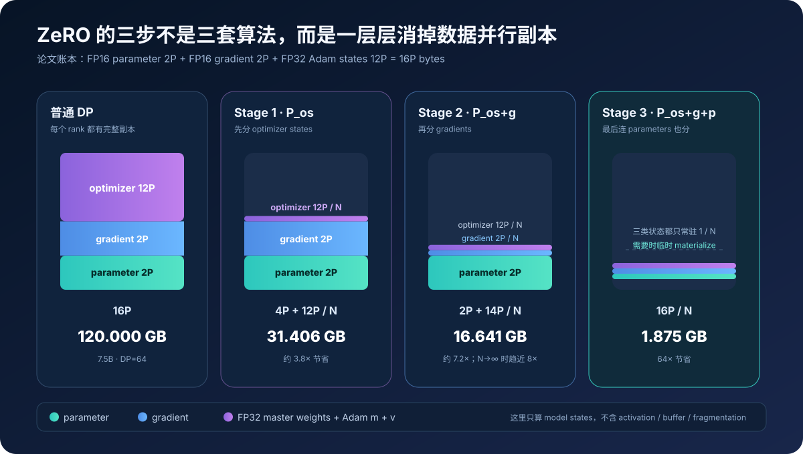
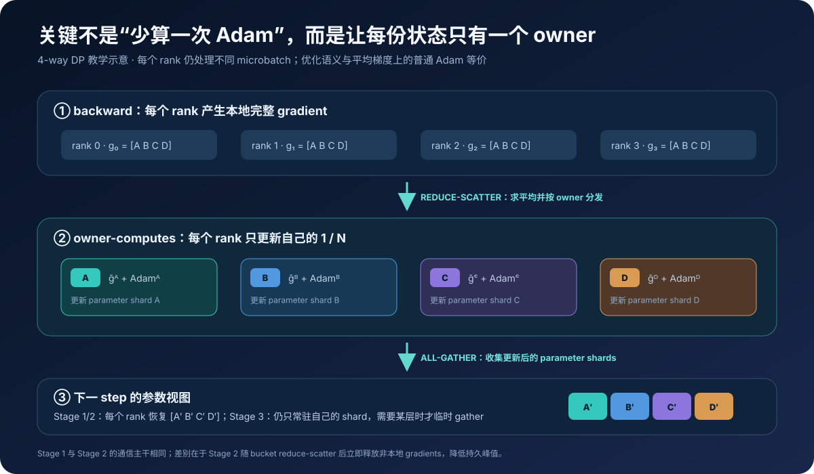
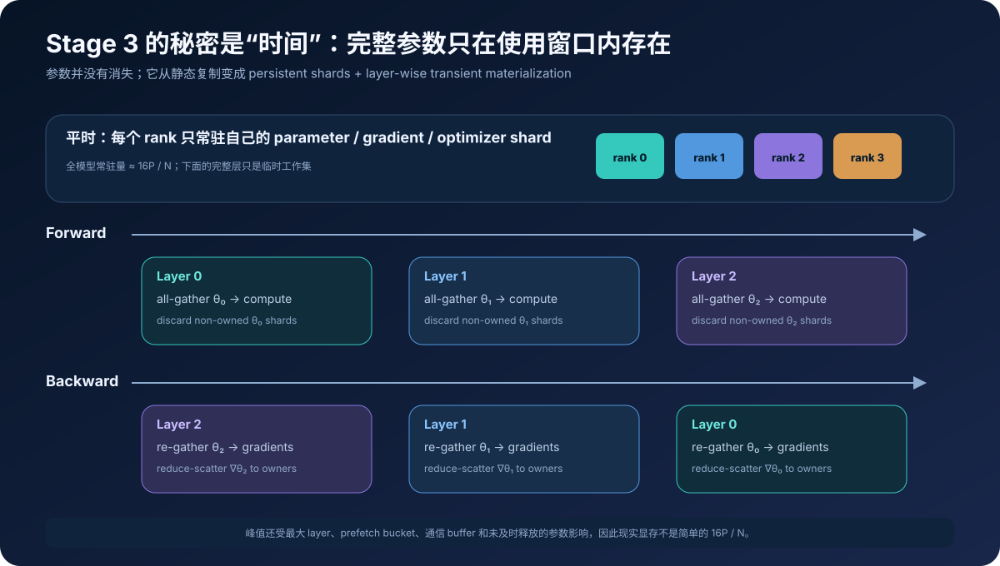
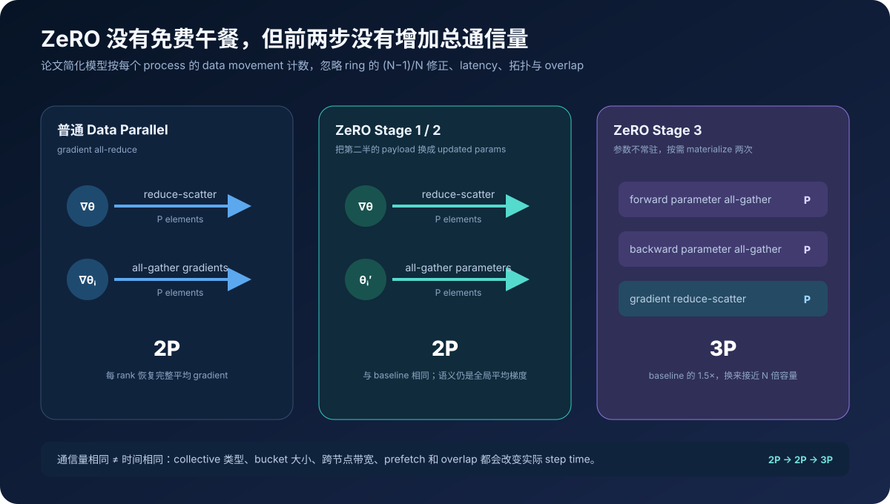
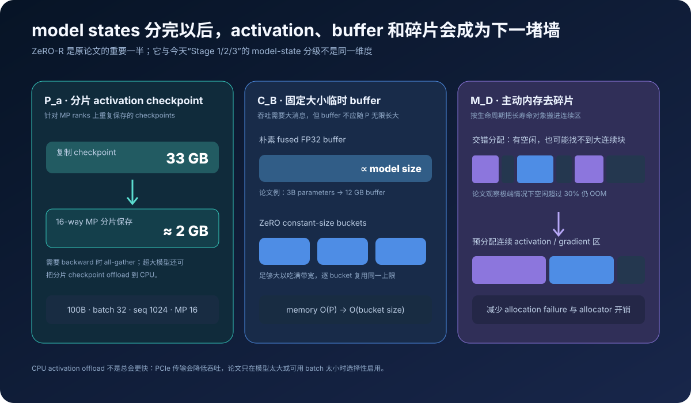
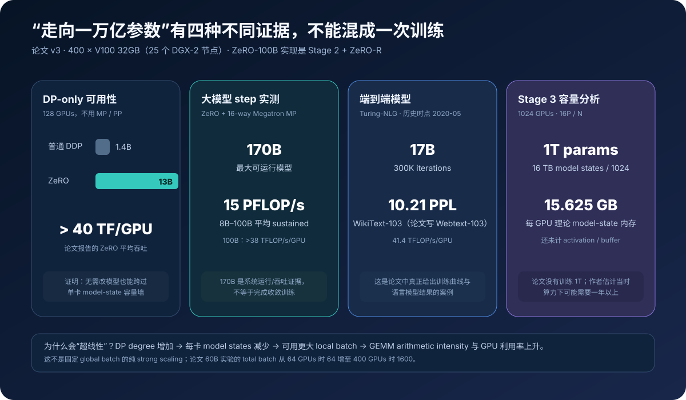

# ZeRO 原理：不复制完整模型，怎样让数据并行拥有整个集群的显存

> **论文**：[ZeRO: Memory Optimizations Toward Training Trillion Parameter Models](https://arxiv.org/abs/1910.02054) 
> **会议版本**：[SC20 / DOI: 10.1109/SC41405.2020.00024](https://doi.org/10.1109/SC41405.2020.00024) 
> **官方代码**：[DeepSpeed](https://github.com/deepspeedai/DeepSpeed) · [ZeRO 官方文档](https://deepspeed.readthedocs.io/en/stable/zero3.html) 
> **作者**：Samyam Rajbhandari、Jeff Rasley、Olatunji Ruwase、Yuxiong He（Microsoft） 
> **时间**：2019 年 10 月首次公开；本文以 2020 年 5 月 arXiv v3 / SC20 版本为准 
> **关键词**：Data Parallelism、Optimizer State Partitioning、Gradient Partitioning、Parameter Partitioning、Reduce-Scatter、All-Gather、ZeRO-R 
> **配套代码**：[zero_minimal.py](./code/zero_minimal.py) 
> **前置阅读**：[Transformer 原理](00_Transformer_2017_原理.md) · [Megatron-LM 原理](40_Megatron_LM_2019_原理.md) · [GPT-2 原理](03_GPT2_2019_原理.md)

2019 年的大模型训练有一个看似荒谬的现象：

> 一个 1.5B 参数模型的 FP16 权重只有 3 GB，却无法在 32 GB GPU 上完成训练。

原因是训练保存的远不止“正在参与矩阵乘的那份权重”。对论文采用的 mixed-precision Adam，一份常见账本是：

| 状态 | 每参数字节 |
|---|---:|
| FP16 parameters | 2 |
| FP16 gradients | 2 |
| FP32 master parameters | 4 |
| FP32 Adam first moment | 4 |
| FP32 Adam second moment | 4 |
| **model states 合计** | **16** |

于是有 \(\Psi\) 个参数时，仅 model states 就要：

$$
M_{\text{states}}=16\Psi\ \text{bytes}.
$$

普通数据并行有 \(N_d\) 张 GPU，但每张都保存这完整的 \(16\Psi\)。增加 GPU 只增加副本数，并没有增加“可用于一份模型”的有效显存。

ZeRO 的切入点不是发明更低精度的 Adam，也不是改变梯度下降，而是问：

> **如果 data-parallel ranks 每一步最终都会得到相同的平均梯度，为什么每张卡还要永久保存相同的 optimizer states、gradients 和 parameters？**

答案是把它们按所有权分片：

$$
\text{replicated model states}
\quad\longrightarrow\quad
\text{rank }i\text{ owns shard }i.
$$

需要全局语义时通信，不需要时只留本地 shard。由此，数据并行第一次不再意味着“每卡一个完整训练副本”，而能把整个 DP group 的显存汇成一个逻辑池。

---

## 0. 先给结论

读完本文，至少应记住下面二十四点：

1. **ZeRO 的 Zero 指 Zero Redundancy，不是零阶优化。** 它消除 data/model parallel 训练中的冗余状态。
2. **论文把显存分成两大类。** model states 是 parameters、gradients、optimizer states；residual states 是 activations、temporary buffers 与 fragmented/unusable memory。
3. **普通 mixed-precision Adam 的 model-state 账本是 16 bytes/parameter。** 其中 optimizer 相关 FP32 状态占 12 bytes，是最大头。
4. **Stage 1 只分 optimizer states。** 每卡模型状态从 \(16\Psi\) 降为 \(4\Psi+12\Psi/N_d\)，\(N_d\) 很大时最多约 4×。
5. **Stage 2 再分 gradients。** 每卡降为 \(2\Psi+14\Psi/N_d\)，\(N_d\) 很大时最多约 8×。
6. **Stage 3 再分 parameters。** 每卡理想模型状态为 \(16\Psi/N_d\)，随 DP degree 线性缩小。
7. **三个阶段是累积的。** Stage 2 = \(P_{os+g}\)，Stage 3 = \(P_{os+g+p}\)，不是互斥选择。
8. **optimizer step 采用 owner-computes。** rank \(i\) 只保存、更新第 \(i\) 份 FP32 master weights、Adam \(m,v\) 和对应 gradient。
9. **Stage 1/2 不增加论文简化模型下的总通信量。** gradient reduce-scatter 为 \(\Psi\)，updated parameter all-gather 为 \(\Psi\)，合计 \(2\Psi\)，等于 DP all-reduce。
10. **Stage 2 与 Stage 1 的核心差别是 gradient 生命周期。** Stage 2 在 backward 中按 bucket reduce-scatter，非 owner 梯度随即释放，不必等到整轮结束。
11. **Stage 3 靠 temporal liveness。** 某层参数只在该层 forward/backward 前临时聚合，用完就丢弃非本地 shards。
12. **Stage 3 的论文通信量是 \(3\Psi\)。** forward 参数聚合、backward 参数聚合、gradient reduce-scatter 各 \(\Psi\)，比 baseline \(2\Psi\) 高 50%。
13. **通信量相同不代表时间相同。** collective 类型、bucket、latency、拓扑、prefetch 和 overlap 都会改变实际 step time。
14. **ZeRO-R 不是 Stage 4。** 它另行处理 activation checkpoint 复制、随模型增长的临时 buffer 和内存碎片。
15. **partitioned activation checkpoint 针对 MP ranks 上的重复。** 论文 100B、batch 32、seq 1024、MP=16 的例子从约 33 GB/GPU 降到约 2 GB/GPU。
16. **CPU activation offload 是有代价的兜底。** 它能继续降显存，却受 PCIe 带宽限制，不应被理解为必然提速。
17. **ZeRO 与 Megatron 张量并行互补。** TP 切一层的计算与权重，ZeRO 在 DP 维度继续切每个 TP shard 的训练状态。
18. **论文真正实现和评测的是 Stage 2 + ZeRO-R。** 论文称它为 ZeRO-100B；parameter partitioning / Stage 3 在该版本主要是设计与容量分析。
19. **论文没有训练一个 1T 模型。** “1T on 1024 GPUs”来自 \(16\text{ TB}/1024=15.625\text{ GB/GPU}\) 的 model-state 容量分析。
20. **170B 也不是完整收敛结果。** 它是 ZeRO-100B 在 400 张 V100 上可高效运行的最大模型规模实验。
21. **论文在 8B–100B 模型上报告约 15 PFLOP/s sustained。** 100B 点超过 38 TFLOP/s/GPU，集群为 400 张 V100。
22. **“超线性扩展”来自显存释放后的 batch 变化。** GPU 增多让每卡 states 变少、local batch 变大、GEMM 更饱满；这不是固定 global batch 的纯 strong scaling。
23. **Turing-NLG 17B 是端到端训练案例。** 论文报告 300K iterations、10.21 WikiText-103 perplexity 与 41.4 TFLOP/s/GPU，均应按 2020 历史语境解读。
24. **ZeRO 最深的思想是“状态只在需要时存在于需要它的地方”。** 空间分片和时间调度共同把静态副本变成按需工作集。

---

## 1. 先划清论文边界：ZeRO 不只等于今天口中的 ZeRO-1/2/3

### 1.1 原论文有两组优化

论文把 ZeRO 分为：

~~~text
ZeRO
├── ZeRO-DP：减少 model states
│   ├── P_os      optimizer state partitioning
│   ├── P_g       gradient partitioning
│   └── P_p       parameter partitioning
└── ZeRO-R：减少 residual states
    ├── P_a       partitioned activation checkpointing
    ├── C_B       constant-size buffers
    └── M_D       memory defragmentation
~~~

今天 DeepSpeed 文档通常把前三项叫：

| 原论文记号 | 现代常用名 | 常驻分片 |
|---|---|---|
| \(P_{os}\) | ZeRO Stage 1 | optimizer states |
| \(P_{os+g}\) | ZeRO Stage 2 | optimizer states + gradients |
| \(P_{os+g+p}\) | ZeRO Stage 3 | optimizer states + gradients + parameters |

这种映射方便，但会漏掉原论文的另一半 ZeRO-R。本文在讨论 model states 时使用 Stage 1/2/3，在讨论论文原始系统时保留 \(P_{os},P_g,P_p,P_a,C_B,M_D\)。

### 1.2 论文实现并没有把三阶段都跑一遍

arXiv v3 明确说明，实验系统 **ZeRO-100B** 实现的是：

~~~text
P_os+g（Stage 2）
+ ZeRO-R
+ 必要时与 Megatron-LM model parallelism 组合
~~~

论文计划随后在 DeepSpeed 中开放 \(P_p\)。所以：

- Stage 1/2 的内存与性能有论文实现支撑；
- ZeRO-R 的 activation/buffer/defragmentation 有实验支撑；
- Stage 3 的算法与通信分析属于论文贡献；
- 但“原论文已经用 Stage 3 训练 1T”是历史倒灌。

当前 DeepSpeed 已经支持 ZeRO-3、CPU/NVMe offload、ZeRO-Infinity 等多年后功能。它们能帮助理解思想的延续，但不能被改写成 2019/2020 论文的实测范围。

### 1.3 题目中的 trillion 是容量方向，不是完成训练的规模

论文做了一个很有影响力的容量推演：

$$
1\text{T parameters}\times16\text{ bytes}
=16\text{ TB}.
$$

若 Stage 3 在 1024 个 DP ranks 上均匀分片：

$$
\frac{16\text{ TB}}{1024}
=15.625\text{ GB/GPU}.
$$

这说明 32 GB V100 在 model states 维度可以容纳，但还不等于：

- activation、temporary buffer 与通信 workspace 也已放下；
- 网络能及时搬动参数；
- 计算集群能在合理时间内完成训练；
- 数据规模和优化配方已经解决。

论文自己估计，当时 1024 张 V100 训练 1T 模型可能需要一年以上，并指出需要 exaFLOP 级系统才更现实。

---

## 2. 显存到底去了哪里

### 2.1 Model states：16 bytes/parameter 怎样来的

设参数量为 \(\Psi\)，optimizer-state multiplier 为 \(K\)。论文对 mixed-precision Adam 取：

$$
K=12,
$$

因为每参数要保存：

$$
\underbrace{4}_{\text{FP32 master parameter}}
+\underbrace{4}_{\text{Adam first moment}}
+\underbrace{4}_{\text{Adam second moment}}
=12\ \text{bytes}.
$$

再加 FP16 parameter 与 gradient：

$$
M_{\text{DP}}
=2\Psi+2\Psi+K\Psi
=(4+K)\Psi
=16\Psi.
$$

对 1.5B：

$$
1.5\times10^9\times16
=24\times10^9\text{ bytes}
=24\text{ GB}.
$$

因此“3 GB FP16 权重”只是训练账本的八分之一。再加入 activation 等残余状态，32 GB 很快耗尽。

> 论文统一使用十进制 GB。若用 GiB（\(2^{30}\) bytes），数值会不同；比较表格时不要混用。

### 2.2 Residual states：不是低阶杂项

论文把其余显存归为：

1. **activations**：forward 留给 backward 的中间结果；
2. **temporary buffers**：all-reduce、gradient norm、fused optimizer 等临时展开区；
3. **fragmented memory**：总空闲量够，但没有足够大的连续块。

对 GPT-2 风格网络，论文给出未 checkpoint 的 activation 近似：

$$
M_{\text{act}}
\propto
12\times h\times b\times s\times L,
$$

其中 \(h\) 是 hidden dimension，\(b\) 是 batch，\(s\) 是 sequence length，\(L\) 是层数。

论文例子：

- 1.5B、batch 32、sequence 1024：activations 约 60 GB；
- activation checkpointing 后约 8 GB；
- 100B 即使 checkpoint，batch 32 时仍可约 60 GB；
- 1.5B 的单个 FP32 flattened buffer 就可能要 6 GB；
- 极端情况下，allocator 因碎片在仍有 30% 空闲时 OOM。

这解释了为什么只做 \(16\Psi/N_d\) 还不够：model-state 墙拆掉后，residual-state 墙会暴露出来。

### 2.3 为什么 DP 的“冗余”可以安全消掉

普通 DP 中，第 \(r\) 个 rank 对不同 microbatch \(B_r\) 计算：

$$
g_r=\nabla_\theta\mathcal L(B_r;\theta).
$$

全局平均梯度：

$$
\bar g=\frac1{N_d}\sum_{r=1}^{N_d}g_r.
$$

所有 ranks 初始参数相同、得到相同 \(\bar g\)、执行确定性的相同 Adam 更新，因此下一步参数仍相同。

复制 optimizer states 不是优化算法要求，只是普通实现让每张卡都自行完成同一更新的结果。若把参数坐标划为：

$$
\theta=[\theta^{(0)},\theta^{(1)},\ldots,\theta^{(N_d-1)}],
$$

并规定 rank \(i\) 只更新 \(\theta^{(i)}\)，那么：

$$
\theta_{t+1}^{(i)}
=
\operatorname{Adam}
\left(
\theta_t^{(i)},
\bar g^{(i)},
m_t^{(i)},
v_t^{(i)}
\right).
$$

最后拼接：

$$
\theta_{t+1}
=
\operatorname{AllGather}
\left(
\theta_{t+1}^{(0)},\ldots,\theta_{t+1}^{(N_d-1)}
\right).
$$

结果与每个 rank 更新完整向量相同，只是重复计算和重复存储消失了。

---

## 3. Stage 1：先分最胖的 optimizer states

Stage 1 / \(P_{os}\) 把 FP32 master parameters、Adam first moment 和 second moment 切为 \(N_d\) 份：

$$
O=[O^{(0)},O^{(1)},\ldots,O^{(N_d-1)}].
$$

rank \(i\) 只保存 \(O^{(i)}\)，只负责对应 parameter shard 的 optimizer update。

### 3.1 显存公式

parameters 与 backward 期间的 gradients 仍是完整的，各占 \(2\Psi\)：

$$
M_{\text{S1}}
=
2\Psi+2\Psi+\frac{K\Psi}{N_d}
=4\Psi+\frac{12\Psi}{N_d}.
$$

当 \(N_d\to\infty\)：

$$
M_{\text{S1}}\to4\Psi,
$$

相对普通 DP 的 \(16\Psi\) 最多约 4× 节省。

### 3.2 7.5B、64-way DP 例子

$$
M_{\text{S1}}
=4\times7.5
+\frac{12\times7.5}{64}
=31.40625\text{ GB}.
$$

普通 DP 是：

$$
16\times7.5=120\text{ GB}.
$$

论文 Figure 1 报告 31.4 GB，与公式一致。

### 3.3 为什么更新后还要 all-gather parameters

每个 rank 只更新一段：

~~~text
rank 0 updates θ(0)
rank 1 updates θ(1)
...
rank N-1 updates θ(N-1)
~~~

Stage 1/2 的下一次 forward 仍按普通 DP 在每张卡执行完整模型，因此需要：

$$
\theta_{t+1}
=
\operatorname{AllGather}
\left(
\theta_{t+1}^{(0)},\ldots,\theta_{t+1}^{(N_d-1)}
\right).
$$

这一步并非额外恢复某个“主节点”的模型，而是让每个 data-parallel worker 得到相同的下一步 parameters。

---

## 4. Stage 2：gradient 也不必在每卡活到 step 结束

Stage 2 / \(P_{os+g}\) 观察到：

> rank \(i\) 只更新 parameter shard \(i\)，因此最终只需要 averaged gradient shard \(i\)。

### 4.1 Reduce-scatter 正好表达这种所有权

普通 gradient all-reduce 可分解为：

~~~text
reduce-scatter
→ 每个 rank 得到不同的 reduced gradient shard
all-gather
→ 每个 rank 恢复完整 reduced gradient
~~~

Stage 2 在第一步就停下：

$$
\left[
\bar g^{(0)},\ldots,\bar g^{(N_d-1)}
\right]
=
\operatorname{ReduceScatter}
\left(
g_0,\ldots,g_{N_d-1}
\right).
$$

rank \(i\) 用 \(\bar g^{(i)}\) 更新自己的 optimizer/parameter shard，不再 all-gather gradients。更新完改为 all-gather parameters。

### 4.2 显存公式

完整 FP16 parameters 仍占 \(2\Psi\)，gradient 与 optimizer states 各只留 \(1/N_d\)：

$$
M_{\text{S2}}
=2\Psi+\frac{2\Psi}{N_d}+\frac{12\Psi}{N_d}
=2\Psi+\frac{14\Psi}{N_d}.
$$

当 \(N_d\to\infty\)：

$$
M_{\text{S2}}\to2\Psi,
$$

相对 \(16\Psi\) 最多约 8×。

7.5B、64-way：

$$
M_{\text{S2}}
=15+\frac{105}{64}
=16.640625\text{ GB}.
$$

论文报告约 16.6 GB。

### 4.3 Stage 1 和 Stage 2 为什么通信相同，显存却不同

两者都可以走：

~~~text
gradient reduce-scatter
→ owner optimizer update
→ updated parameter all-gather
~~~

区别在 **gradient 生命周期**：

- Stage 1 在 backward 期间仍让每卡积累完整 local gradients，因而账本保留 \(2\Psi\)；
- Stage 2 按 partition/bucket 收集已产生的 gradients，reduce-scatter 后释放非 owner 部分；
- 最终持久 gradient footprint 只剩 \(2\Psi/N_d\)。

论文实现还用 bucketization 把许多小 gradients 合并，以提升 collective 带宽并与剩余 backward 计算重叠。bucket 太小会被 latency 支配，太大又抬高峰值，因而它是显存与吞吐之间的调参旋钮。

---

## 5. Stage 3：连 parameters 也只在当前层需要时聚合

Stage 2 的下限是 \(2\Psi\)，因为每张卡仍常驻完整 FP16 parameters。Stage 3 / \(P_{os+g+p}\) 继续把它们切开：

$$
\theta
=
\left[
\theta^{(0)},\ldots,\theta^{(N_d-1)}
\right].
$$

### 5.1 显存公式

三类 model states 都分片：

$$
M_{\text{S3}}
=
\frac{2\Psi}{N_d}
+\frac{2\Psi}{N_d}
+\frac{12\Psi}{N_d}
=\frac{16\Psi}{N_d}.
$$

7.5B、64-way：

$$
\frac{16\times7.5}{64}
=1.875\text{ GB/GPU}.
$$

这也是为什么 Stage 3 理论上把整个 DP group 的总显存变成可用于一份模型的聚合容量。

### 5.2 但 forward 明明需要完整权重，怎样计算

关键是参数的需要具有时间局部性。第 \(\ell\) 层只在：

- 第 \(\ell\) 层 forward；
- 第 \(\ell\) 层 backward；

被访问。于是每个 rank 可以：

~~~text
平时：只持有 θ_l 的本地 shard
到 Layer l forward 前：all-gather 完整 θ_l
计算 Layer l forward
释放非本地 θ_l shards
...
到 Layer l backward 前：再次 all-gather 完整 θ_l
计算 parameter / input gradients
reduce-scatter parameter gradients
再次释放非本地 θ_l shards
~~~

这不是一次性 all-gather 全模型。若那样做，峰值又回到 \(2\Psi\)。Stage 3 必须把 parameter materialization 与 module 执行顺序绑定。

### 5.3 为什么 forward 和 backward 都要 gather

若 forward 后为了省显存丢弃非本地参数，backward 计算：

$$
\frac{\partial\mathcal L}{\partial X}
\quad\text{和}\quad
\frac{\partial\mathcal L}{\partial\theta}
$$

时又需要该层权重，因此要重新聚合。

也可以保留参数跨过一段时间以换通信，但会增加峰值。现代实现中的 prefetch、persistence threshold、live-parameter limit，本质都在调：

$$
\text{memory saved}
\quad\leftrightarrow\quad
\text{communication exposed}.
$$

### 5.4 为什么现实峰值不是严格 \(16\Psi/N_d\)

公式只算持久 model states。真实峰值还包括：

- 当前层临时完整参数；
- 预取的下一层参数；
- 尚未释放的上一层参数；
- collective bucket 与通信 workspace；
- activation、gradient accumulation buffer；
- 特殊共享参数或跨 module 访问；
- allocator rounding 与 fragmentation。

因此 \(16\Psi/N_d\) 是容量主项，不是 <code>nvidia-smi</code> 的精确预测。

---

## 6. 为什么 sharded Adam 与普通 DP 数学等价

把完整参数向量按坐标分成 \(N_d\) 份不会改变 Adam 的逐元素更新。对第 \(j\) 个参数：

$$
m_{t,j}
=
\beta_1m_{t-1,j}
+(1-\beta_1)\bar g_{t,j},
$$

$$
v_{t,j}
=
\beta_2v_{t-1,j}
+(1-\beta_2)\bar g_{t,j}^2,
$$

$$
\theta_{t+1,j}
=
\theta_{t,j}
-\eta\frac{\hat m_{t,j}}{\sqrt{\hat v_{t,j}}+\epsilon}.
$$

第 \(j\) 个坐标的更新不需要其他坐标的 \(m,v\)。所以只要：

1. reduce-scatter 得到的 \(\bar g^{(i)}\) 与普通 all-reduce 中对应 shard 相同；
2. rank \(i\) 持有正确的 \(\theta^{(i)},m^{(i)},v^{(i)}\)；
3. 更新后 shards 按原顺序拼回；

就有：

$$
\operatorname{Concat}_i
\operatorname{Adam}
\left(
\theta^{(i)},\bar g^{(i)},m^{(i)},v^{(i)}
\right)
=
\operatorname{Adam}
\left(
\theta,\bar g,m,v
\right).
$$

### 6.1 哪些全局操作需要额外小归约

并非 optimizer 的所有逻辑都是完全逐元素。例如 global gradient norm：

$$
\lVert g\rVert_2
=
\sqrt{
\sum_i
\lVert g^{(i)}\rVert_2^2
}.
$$

每个 owner 先算本地平方和，再做一个标量 SUM all-reduce，所有 ranks 才能使用同一 clipping coefficient。

类似地：

- overflow / NaN 检测需要汇总；
- dynamic loss scale 必须保持一致；
- optimizer step counter、learning-rate schedule 必须同步；
- tied parameters 与共享权重需要一致所有权和更新规则；
- checkpoint restore 必须把 shards 放回正确 ranks。

这些小 collective 不改变 \(\Theta(\Psi)\) 主通信量，但实现错误会直接破坏训练等价性。

### 6.2 数学等价不等于逐 bit 相同

reduce-scatter 与 all-reduce 的浮点求和树可能不同：

$$
(a+b)+c\neq a+(b+c)
$$

在有限精度下会产生微小差异。再叠加：

- collective 算法与 rank 顺序；
- FP16 loss scaling；
- fused kernel；
- gradient accumulation 顺序；
- dropout/RNG state；

两条训练轨迹未必逐位一致。ZeRO 保持的是优化语义和收敛目标，不是承诺跨实现 bitwise reproducibility。

---

## 7. 通信账本：为什么 Stage 1/2 是 2Ψ，Stage 3 是 3Ψ

论文假设大消息进入 bandwidth-bound 区域，按每个 process 发送/接收的数据元素数计数，并把 ring 的有限规模系数近似掉。

### 7.1 普通 DP：all-reduce = reduce-scatter + all-gather

对 \(\Psi\) 个 gradients：

$$
V_{\text{DP}}
=
\underbrace{\Psi}_{\text{reduce-scatter}}
+\underbrace{\Psi}_{\text{all-gather gradients}}
=2\Psi.
$$

更精细的 ring 模型通常写成：

$$
V_{\text{ring/rank}}
\approx
2\frac{N_d-1}{N_d}\Psi
$$

个元素；当 \(N_d\) 较大时接近 \(2\Psi\)。

### 7.2 Stage 1/2：替换 payload，不增加总量

ZeRO 的数据流是：

$$
\underbrace{\Psi}_{\text{gradient reduce-scatter}}
+
\underbrace{\Psi}_{\text{updated parameter all-gather}}
=2\Psi.
$$

它把普通 DP all-reduce 的第二半从“收集完整平均 gradient”换成“收集完整更新后 parameter”。

这也解释一个容易误解的说法：

> ZeRO 并不是完全不通信 parameters；它让 parameters 取代原本要 all-gather 的 gradients。

### 7.3 Stage 3：为什么只多 50%

参数不再常驻，因此：

| 操作 | 论文简化通信量 |
|---|---:|
| forward layer-wise parameter all-gathers | \(\Psi\) |
| backward layer-wise parameter all-gathers | \(\Psi\) |
| gradient reduce-scatter | \(\Psi\) |
| **合计** | **\(3\Psi\)** |

相对 baseline：

$$
\frac{3\Psi}{2\Psi}=1.5.
$$

它用 50% 的额外总字节换取理想情况下 \(N_d\) 倍的 model-state 容量。

### 7.4 为什么同样 2Ψ 仍可能更快或更慢

实际时间近似：

$$
T_{\text{step}}
\approx
T_{\text{compute}}
+T_{\text{exposed communication}}
+T_{\text{memory stalls}}.
$$

而 exposed communication 受以下因素影响：

- reduce-scatter 与 all-gather 的具体实现；
- message/bucket size 是否吃满链路；
- 节点内 NVLink/NVSwitch 与节点间 InfiniBand 的映射；
- backward overlap 是否及时开始；
- optimizer step 之后 parameter all-gather 能否流水化；
- CPU optimizer/offload 是否加入 PCIe 传输；
- local batch 变大是否提高 GEMM 算术强度。

因此“通信量不增加”是重要上界，不是直接的 wall-clock 结论。

---

## 8. ZeRO-R：拆掉 model-state 墙之后的三件事

ZeRO-R 面向 residual memory。它不改变 Stage 编号，也不等价于后来的 CPU/NVMe 全状态 offload。

### 8.1 \(P_a\)：partitioned activation checkpointing

张量并行通常把大权重分片，但 residual stream 或 checkpoint activation 可能在 MP ranks 上复制。若 MP degree 为 \(N_m\)，ZeRO-R 在保存 checkpoint 时切为：

$$
A=[A^{(0)},A^{(1)},\ldots,A^{(N_m-1)}].
$$

backward 重算某层前再 all-gather：

$$
A
=
\operatorname{AllGather}
\left(
A^{(0)},\ldots,A^{(N_m-1)}
\right).
$$

所以持久 checkpoint footprint 近似：

$$
M_{\text{checkpoint,partitioned}}
\approx
\frac{M_{\text{checkpoint,replicated}}}{N_m}.
$$

论文的 100B 示例：

| 配置 | checkpoint memory / GPU |
|---|---:|
| batch 32、seq 1024、MP=16，复制 checkpoint | 约 33 GB |
| \(P_a\) 分片 | 约 2 GB |
| 再 offload 分片到 CPU | GPU 上接近 0，增加传输 |

这里的分母是 **model-parallel degree \(N_m\)**，不是 data-parallel degree \(N_d\)，因为被消除的是 MP group 内 activation checkpoint 的复制。

### 8.2 \(C_B\)：constant-size buffers

高性能库喜欢把许多小 tensors flatten 到大 buffer：

$$
\text{many small gradients}
\longrightarrow
\text{one large contiguous buffer}.
$$

大消息能获得更高带宽，但如果 buffer 覆盖全模型：

$$
M_{\text{buffer}}=O(\Psi).
$$

论文举例：3B 参数的 FP32 fused buffer 就是 12 GB。

ZeRO-R 选择一个足够大、但固定上限的 bucket，循环复用：

$$
M_{\text{buffer}}=O(B_{\text{bucket}}),
$$

从而让模型规模增长不再线性抬高临时区，同时保持大消息效率。

### 8.3 \(M_D\)：按生命周期主动去碎片

碎片来自短寿命和长寿命对象交错：

~~~text
forward:
checkpoint（长寿命） ↔ recompute temporaries（短寿命）

backward:
parameter gradients（长寿命） ↔ activation gradients（短寿命）
~~~

总空闲显存可能足够，但没有连续区域满足一次大申请。ZeRO-R 预先为 checkpoints 与 gradients 分配连续 chunk，在它们产生时搬入：

$$
\text{interleaved allocations}
\quad\longrightarrow\quad
\text{lifetime-aware contiguous regions}.
$$

它既降低 allocation failure，也减少 allocator 搜索连续块的时间。

### 8.4 Offload 何时值得

论文没有把“搬到 CPU”当作默认胜利。CPU offload 的收益条件是：

$$
\text{由额外容量带来的收益}
>
\text{GPU↔CPU data movement cost}.
$$

论文在 60B 的部分配置里观察到 CPU activation movement 会降低性能；只有模型否则无法运行，或无 offload 时 batch 太小，才可能值得启用。

后来的 ZeRO-Offload/ZeRO-Infinity 把 heterogeneous memory 做得更系统，但它们属于后续论文，不能倒灌进本文。

---

## 9. ZeRO × Megatron：一个切 DP 冗余，一个切单层计算

ZeRO 与 Megatron tensor parallelism 回答不同问题：

| 维度 | Megatron TP | ZeRO-DP |
|---|---|---|
| 谁处理同一 batch | TP group 内所有 ranks | 每个 DP replica 处理不同数据 |
| parameters | 一层内按矩阵/head 分片 | 相同 TP shard 在 DP ranks 间再分训练状态 |
| 高频通信 | 每层 activation all-reduce | step/bucket 级 gradient/parameter collective |
| 主要目标 | 单层放不下、保持大 GEMM | 消除 DP replicas 的状态冗余 |
| 最适合链路 | 节点内高速互联 | 可跨节点的数据并行网络 |

设：

- tensor/model parallel degree 为 \(N_m\)；
- data parallel degree 为 \(N_d\)；
- 总 GPU 为 \(N=N_mN_d\)。

Stage 3 与 TP 组合的理想 model-state 缩减可达：

$$
N_m\times N_d.
$$

直观地说：

1. TP 先让每个 model replica 的 rank 只持有 \(1/N_m\) 权重；
2. ZeRO 再让“同一 TP 位置”的 DP ranks 只持有 \(1/N_d\) 训练状态；
3. 每卡主项变成完整模型的 \(1/(N_mN_d)\)。

论文设想 1024 GPUs 可映射为：

~~~text
16-way model parallel within each DGX-2 node
× 64-way data parallel across nodes
= 1024 GPUs
~~~

这样把 TP 高频通信留在 NVSwitch 高速域，用 ZeRO 避免为了容量把细粒度 TP 跨到慢得多的节点间链路。

### 9.1 ZeRO 是否让 model parallelism 不再需要

不完全。

ZeRO 让“只为 model states 容量而上 MP”不再那么必要，但仍有两条约束：

- **critical batch size**：纯 DP 加卡会增大 global batch，可能损害优化效率；
- **activation/computation**：超大单层或 activation 仍可能需要 TP/PP。

因此现代大模型训练通常是多轴组合：

$$
\text{TP}\times\text{PP}\times\text{DP/ZeRO}
\times\text{其他并行维度}.
$$

ZeRO 的贡献不是消灭模型并行，而是让 DP 维度也具备内存可扩展性。

---

## 10. 从 7.5B 账本推到 1T：哪些是结论，哪些是前提

论文 Table 1 的核心数字可由三条公式重算：

$$
M_{\text{S1}}=4\Psi+\frac{12\Psi}{N_d},
$$

$$
M_{\text{S2}}=2\Psi+\frac{14\Psi}{N_d},
$$

$$
M_{\text{S3}}=\frac{16\Psi}{N_d}.
$$

### 10.1 7.5B、DP=64

| 模式 | 每 GPU model states |
|---|---:|
| 普通 DP | 120.000 GB |
| Stage 1 | 31.406 GB |
| Stage 2 | 16.641 GB |
| Stage 3 | 1.875 GB |

### 10.2 128B、DP=64

| 模式 | 每 GPU model states |
|---|---:|
| Stage 1 | 536 GB |
| Stage 2 | 284 GB |
| Stage 3 | 32 GB |

这说明论文所谓 64 GPUs 上 Stage 3 可容纳 128B，是刚好让 model states 到 32 GB；现实还没有给 activation 留空间。因此它是理论容量边界，不是推荐配置。

### 10.3 1T、DP=1024

| 模式 | 每 GPU model states |
|---|---:|
| Stage 1 | 约 4011 GB |
| Stage 2 | 约 2013 GB |
| Stage 3 | 15.625 GB |

只有 parameter 也分片后，DP degree 才真正线性扩展完整 model-state 容量。

### 10.4 “任意大模型”为什么仍是渐近说法

只要继续增加 devices，\(16\Psi/N_d\) 可以保持常数，但现实系统还有：

$$
\max_\ell |\theta_\ell|,
\quad
M_{\text{activation}},
\quad
M_{\text{communication buffer}},
\quad
T_{\text{network}},
\quad
T_{\text{compute}}.
$$

若单个 layer 的临时完整参数就放不下，仍需 TP 或更细分片；若网络无法及时供给参数，容量上可行也会慢到无意义。

---

## 11. 实验结果怎样正确阅读

### 11.1 硬件与实现

论文实验集群：

- 400 张 NVIDIA V100 32GB；
- 25 个 DGX-2 nodes；
- 800 Gbps inter-node communication bandwidth；
- PyTorch 实现；
- baseline：无 MP 时 PyTorch DDP，有 MP 时 2019 年 9 月附近 Megatron-LM；
- 模型：不同层数和 hidden size 的 GPT-2 风格 Transformer。

ZeRO-100B 的实现范围覆盖 \(P_{os+g}\) 与 ZeRO-R，但论文的 C1–C5
实验配置不是每次把所有开关同时打开。最完整的 GPU-only 配置 C4 是：

$$
P_{os+g}+C_B+M_D+P_a,
$$

C5 再把 \(P_a\) 换成带 CPU offload 的 \(P_{a+cpu}\)；较小模型会关闭不必要的
activation partition/offload，以避免只降显存却增加数据搬运。

### 11.2 模型规模与吞吐

论文报告：

- 400 GPUs 上可高效运行最高 170B 参数；
- 8B–100B 的 sustained aggregate throughput 平均约 15 PFLOP/s；
- 100B 超过 38 TFLOP/s/GPU；
- 相对需要把 Megatron MP 跨节点的 baseline，超大模型最高约 10× speedup；
- 不用 MP/PP 时，128 GPUs 可训练最高 13B，平均超过 40 TFLOP/s/GPU；
- 普通 DDP 最大约 1.4B，吞吐低于 20 TFLOP/s/GPU。

论文解释 baseline 跨节点 MP 的问题：节点内 NVSwitch 链路与节点间 InfiniBand 的带宽差距很大，逐层细粒度通信一旦跨节点，效率急剧下降。ZeRO 通过压低每个 DP replica 所需的 MP degree，把高频 TP 留在节点内。

### 11.3 为什么 10× 不是同配置 kernel speedup

Appendix 的对比配置同时改变了：

- MP degree；
- batch size；
- total batch；
- 某些模型的 attention heads；
- baseline 可运行的 GPU 数。

例如 100B：

| 系统 | GPUs | MP | per-model-replica batch | total batch |
|---|---:|---:|---:|---:|
| ZeRO | 400 | 16 | 32 | 800 |
| baseline | 384 | 128 | 2 | 6 |

因此最高 10× 表达的是 **整套内存优化解锁更合理并行布局与 batch 后的系统收益**，不是“相同 MP、相同 batch、相同网络下某个 kernel 快 10×”。

### 11.4 “超线性扩展”到底固定了什么

论文 60B scaling：

| GPUs | MP | batch / replica | total batch |
|---:|---:|---:|---:|
| 64 | 16 | 16 | 64 |
| 128 | 16 | 48 | 384 |
| 256 | 16 | 48 | 768 |
| 400 | 16 | 64 | 1600 |

GPU 数增加时，DP degree 增加，Stage 2 的 optimizer/gradient states 每卡继续下降，于是可提高 local batch。更大 GEMM 提高 arithmetic intensity 和 V100 利用率，导致：

$$
\frac{\text{throughput}(2N)}{\text{throughput}(N)}>2
$$

的观察。

但因为 total batch 从 64 变到 1600，这不是固定 global batch 的 strong scaling。论文认为当时仍低于大模型的 critical-batch 限制，但没有通过这张系统曲线独立证明所有 batch 都有相同 sample efficiency。

### 11.5 17B Turing-NLG 与 170B benchmark 要分开

端到端案例 Turing-NLG：

- 17B parameters；
- 78 layers；
- hidden size 4256；
- 28 attention heads；
- sequence length 1024；
- batch 512；
- 300K training steps；
- Megatron tensor slicing 从 16-way 降到 4-way；
- 41.4 TFLOP/s/GPU；
- WikiText-103 perplexity 10.21。

论文正文一处写成 “Webtext-103”，而微软同期模型说明明确使用 WikiText-103；本文按后者记名，并保留这项文本差异。

170B 则是最大可运行/性能分析配置，不应表述为“论文完整训练并发布了 170B 模型”。

---

## 12. 配套代码：在单进程里验证分片等价性

配套脚本 [zero_minimal.py](./code/zero_minimal.py) 不依赖 PyTorch，不启动 GPU。它把 distributed collective 当作列表操作，重点验证：

1. 四阶段 model-state 公式；
2. reduce-scatter 后每个 rank 的 gradient ownership；
3. 每个 rank 只更新本地 Adam shard；
4. all-gather 后结果与 dense Adam 完全一致；
5. Stage 3 的 layer-wise parameter 生命周期；
6. 论文 7.5B / 1T / activation checkpoint 数字。

运行：

~~~bash
python3 papers/to-2026/code/zero_minimal.py
python3 papers/to-2026/code/zero_minimal.py \
  --parameters 7500000000 \
  --dp 64
python3 papers/to-2026/code/zero_minimal.py --json
~~~

### 12.1 显存账本

核心公式在代码中直接表达为 divisor：

~~~python
parameter_divisor = dp_degree if stage >= 3 else 1
gradient_divisor = dp_degree if stage >= 2 else 1
optimizer_divisor = dp_degree if stage >= 1 else 1

parameter_bytes = 2 * parameters / parameter_divisor
gradient_bytes = 2 * parameters / gradient_divisor
optimizer_bytes = 12 * parameters / optimizer_divisor
~~~

默认输出：

~~~text
stage | params GB | grads GB | optimizer GB | total GB | save | comm
    0 |    15.000 |   15.000 |       90.000 |  120.000 |  1.0x | 2P
    1 |    15.000 |   15.000 |        1.406 |   31.406 |  3.8x | 2P
    2 |    15.000 |    0.234 |        1.406 |   16.641 |  7.2x | 2P
    3 |     0.234 |    0.234 |        1.406 |    1.875 | 64.0x | 3P
~~~

这里 Stage 1/2 的“最大 4×/8×”是 \(N_d\to\infty\) 的渐近值。DP=64 时实际分别约 3.82× 和 7.21×。

### 12.2 Sharded Adam

代码把四个 ranks 的 local gradients 平均后切开：

~~~python
def reduce_scatter_mean(local_gradients):
    averaged = average_vectors(local_gradients)
    return split_evenly(averaged, len(local_gradients))
~~~

每个 owner 独立更新：

~~~python
updated = [
    adam_update(parameter_shard, gradient_shard, m_shard, v_shard, ...)
    for parameter_shard, gradient_shard, m_shard, v_shard in zip(
        parameter_shards,
        gradient_shards,
        first_moment_shards,
        second_moment_shards,
    )
]
full_parameters = all_gather([state.parameters for state in updated])
~~~

随后断言：

~~~python
assert dense_parameters == all_gather(sharded_parameters)
assert dense_m == all_gather(sharded_m)
assert dense_v == all_gather(sharded_v)
~~~

### 12.3 它刻意没有模拟什么

脚本不是性能模拟器，没有：

- 多进程与真实 rank failure；
- NCCL ring/tree collective；
- CUDA streams 与 overlap；
- FP16 rounding 与 dynamic loss scale；
- parameter prefetch/reuse cache；
- activation 与 allocator；
- distributed checkpoint；
- shared/external parameter；
- TP/PP group 拓扑。

它回答“分片为什么算得对”，不回答“某个集群上会快多少”。

---

## 13. 现代 DeepSpeed 配置：把论文概念映射到真实接口

下面是 **当前 DeepSpeed 风格的最小示意**，不是 2020 代码快照。字段与默认值会随版本演进，真实项目应以安装版本的[官方配置文档](https://www.deepspeed.ai/docs/config-json/)为准。

### 13.1 Stage 2 示例

~~~json
{
  "train_micro_batch_size_per_gpu": 4,
  "gradient_accumulation_steps": 8,
  "optimizer": {
    "type": "AdamW",
    "params": {
      "lr": 0.0001,
      "betas": [0.9, 0.95],
      "eps": 1e-8,
      "weight_decay": 0.1
    }
  },
  "fp16": {
    "enabled": true
  },
  "zero_optimization": {
    "stage": 2,
    "reduce_scatter": true,
    "overlap_comm": true,
    "contiguous_gradients": true,
    "reduce_bucket_size": 200000000
  }
}
~~~

含义：

- <code>stage: 2</code>：分 optimizer states 与 reduced gradients；
- <code>reduce_scatter</code>：让每个 rank 只接收 owner gradient shard；
- <code>overlap_comm</code>：尝试把 gradient collective 藏在 backward 后半段；
- <code>contiguous_gradients</code>：对应论文的碎片管理思想；
- <code>reduce_bucket_size</code>：通信吞吐与峰值显存之间的权衡。

### 13.2 Stage 3 示例

~~~json
{
  "train_micro_batch_size_per_gpu": 2,
  "gradient_accumulation_steps": 16,
  "optimizer": {
    "type": "AdamW",
    "params": {
      "lr": 0.0001,
      "betas": [0.9, 0.95],
      "eps": 1e-8,
      "weight_decay": 0.1
    }
  },
  "bf16": {
    "enabled": true
  },
  "zero_optimization": {
    "stage": 3,
    "reduce_scatter": true,
    "overlap_comm": true,
    "contiguous_gradients": true,
    "reduce_bucket_size": 100000000,
    "stage3_prefetch_bucket_size": 50000000,
    "stage3_param_persistence_threshold": 100000
  }
}
~~~

三个 size 值只是可读示例，不是通用最优值：

- prefetch 大：更可能隐藏 all-gather，但峰值更高；
- persistence threshold 大：更多小参数常驻，collective 次数减少，但分片收益下降；
- reduce bucket 大：带宽更好，但 gradient 峰值与等待时间可能增加。

### 13.3 训练循环

~~~python
import deepspeed

engine, optimizer, _, scheduler = deepspeed.initialize(
    model=model,
    model_parameters=model.parameters(),
    config="ds_config.json",
)

for inputs, targets in dataloader:
    outputs = engine(inputs)
    loss = criterion(outputs, targets)
    engine.backward(loss)
    engine.step()
~~~

“模型代码几乎不改”是 ZeRO 的重要开发效率目标，但不表示分布式状态完全透明：

- 保存/加载 checkpoint 必须理解 shards；
- Stage 3 下调试单个 parameter 时它可能不是完整 tensor；
- 在 module forward 之外访问 parameter 可能需要注册 external parameter；
- tied weights、自定义 autograd、动态 module 执行顺序要验证；
- gradient accumulation、no-sync 语义随 stage/版本可能不同。

不要把教学 JSON 直接当生产配方；先锁定 DeepSpeed/PyTorch/NCCL 版本，再测显存、吞吐与收敛。

---

## 14. 十四个常见误解

### 误解 1：ZeRO 是一种新 optimizer

不对。它可以分片 Adam 等 optimizer 的状态，但不改变 Adam 的数学更新；Zero 是 Zero Redundancy。

### 误解 2：Stage 1/2/3 是三种互斥模式

不对。它们累积增加分片对象：optimizer → gradient → parameter。

### 误解 3：Stage 2 已经把 parameters 也分片

不对。Stage 2 每卡仍常驻完整 FP16 parameters，所以下限趋近 \(2\Psi\)。

### 误解 4：Stage 3 永远没有完整参数

不对。完整 layer parameters 会在 forward/backward 的使用窗口内临时 materialize，只是不再全程常驻。

### 误解 5：Stage 1 与 Stage 2 通信不同，所以后者省梯度

不准确。论文主通信量相同；Stage 2 通过 backward 中按 bucket reduce-scatter 并释放非 owner gradients 降低生命周期峰值。

### 误解 6：ZeRO-2 通信量是普通 DP 的一半

不对。它省掉 gradient all-gather，却增加 updated parameter all-gather，总量仍为 \(2\Psi\)。

### 误解 7：ZeRO-3 是零额外通信

不对。论文模型为 \(3\Psi\)，比 DP/Stage 2 的 \(2\Psi\) 高 50%。

### 误解 8：1T 结论表示论文训练了 1T 模型

不对。那是 Stage 3 的 model-state 容量推演；论文实现重点是约 100B，最大运行实验 170B。

### 误解 9：论文已实测 ZeRO-3 的 1T 扩展

不对。ZeRO-100B 实现 \(P_{os+g}\)+ZeRO-R，\(P_p\) 当时主要是设计和分析。

### 误解 10：170B 是论文发布的收敛语言模型

不对。170B 是系统容量/吞吐实验；端到端案例是 17B Turing-NLG。

### 误解 11：16P/N 就是实际 GPU 峰值

不对。它不含 layer materialization、activation、communication bucket、workspace 和 allocator 开销。

### 误解 12：ZeRO-R 就是把所有状态 offload 到 CPU

不对。原论文 ZeRO-R 还包括 activation partition、constant buffer 与 defragmentation；CPU activation offload 是选择性手段。

### 误解 13：有了 ZeRO 就不再需要 TP/PP

不对。单层计算、activation、critical batch size 与拓扑仍可能要求多维并行。

### 误解 14：超线性扩展证明加卡让同一 workload 每卡更快且收敛不变

不对。论文随 GPU 数增大了 batch；更大 local batch 提升了硬件利用率，不能当作固定 global batch 的纯强扩展证据。

---

## 15. 局限与未回答的问题

### 15.1 Stage 3 只给了完整设计，没有本文同等规模的实现证据

最激进的线性内存缩减依赖 \(P_p\)，但 ZeRO-100B 评测没有实证完整 Stage 3 的吞吐、prefetch 和复杂 module 行为。

### 15.2 模型容量与训练可行性不是一回事

放得下 1T model states 不代表 activation、数据、优化稳定性、能耗、总训练 FLOPs 和墙钟时间都可接受。

### 15.3 额外参数通信可能成为 Stage 3 瓶颈

当 layer 很小、网络慢或执行顺序动态时，参数 all-gather latency 难以隐藏。论文的 \(3\Psi\) 只描述总字节，不描述关键路径。

### 15.4 DP degree 受 global batch 与收敛约束

为获得更大 \(N_d\) 而不断加 DP workers 会扩大 batch。超过 critical batch size 后，samples-to-quality 可能恶化，不能只按吞吐扩展。

### 15.5 分片让 checkpoint 与容错更复杂

单 rank 不再拥有完整 optimizer/model state。保存、重分片恢复、改变 world size、处理 rank failure 都需要专门协议，论文没有系统展开。

### 15.6 共享参数和动态图破坏简单 layer 生命周期

tied embedding、跨层 parameter reuse、自定义 module、权重在 forward 外访问，会让“gather → compute → discard”的自动边界更难判断。

### 15.7 论文比较不是完全控制变量

ZeRO 与 Megatron baseline 的 MP degree、batch、heads、可用 GPU 数不同。结果证明系统组合的实用优势，但不能隔离每项优化的独立因果贡献。

### 15.8 内存测量依赖 allocator

论文报告 max cached memory；cached、allocated、reserved、driver-visible memory 不是同一指标。跨框架和版本直接比较会失真。

### 15.9 CPU offload 受硬件与 NUMA 影响

PCIe generation、CPU memory bandwidth、NUMA binding、pinned memory 与 overlap 决定收益。单一开关没有跨集群通用结论。

### 15.10 评测范围是系统吞吐，不是完整模型科学

论文重点不是数据质量、公平性、安全、隐私、能耗或跨语言能力。Turing-NLG 的历史 SOTA 也不能代表现代能力与评测规范。

---

## 16. 怎样复现论文核心结论

### 16.1 数学与状态所有权

- [ ] 明确参数总数 \(\Psi\)、dtype 与 optimizer-state multiplier \(K\)；
- [ ] Stage 1 只分 optimizer states；
- [ ] Stage 2 再分 reduced gradients；
- [ ] Stage 3 再分 parameters；
- [ ] 每个 parameter coordinate 有唯一 owner；
- [ ] reduce-scatter 的 shard 顺序与 parameter/optimizer shard 一致；
- [ ] all-gather 后 parameters 与 dense optimizer step 对齐；
- [ ] global norm、overflow 与 loss scale 在 ranks 间一致。

### 16.2 生命周期与峰值

- [ ] 分开报告 persistent model states 与 transient working set；
- [ ] Stage 2 gradients 在 bucket reduce 后及时释放；
- [ ] Stage 3 只 materialize 当前/预取 layers；
- [ ] 记录最大 live parameters 与最大 layer；
- [ ] activation checkpoint、recompute 与 parameter gather 没有意外重叠峰值；
- [ ] 报 allocated、reserved/cached 与 driver-visible memory；
- [ ] OOM 时检查 fragmentation，而不只看总空闲。

### 16.3 通信

- [ ] baseline gradient all-reduce 主量约 \(2\Psi\)；
- [ ] Stage 2 为 gradient reduce-scatter + parameter all-gather；
- [ ] Stage 3 forward/backward parameter gathers 分开计；
- [ ] 报 bucket size、collective 次数与总字节；
- [ ] 区分节点内和节点间链路；
- [ ] 用 profiler 报 exposed communication，而不只报理论 volume；
- [ ] 检查 overlap 是否真的发生。

### 16.4 性能报告

- [ ] 固定并披露模型 layers、hidden、heads 与 sequence length；
- [ ] 报 TP/PP/DP/ZeRO stage；
- [ ] 区分 microbatch、gradient accumulation、per-replica batch 与 global batch；
- [ ] 报 tokens/s、samples/s、TFLOP/s/GPU 与 step time；
- [ ] strong/weak scaling 不混用；
- [ ] 不把 batch 增大带来的超线性解释成固定 workload 加速；
- [ ] 给出 GPU、互联、CPU/NUMA、框架与 NCCL 版本。

### 16.5 收敛与恢复

- [ ] 与 dense/普通 DP 对齐相同数据顺序、seed 和 learning-rate schedule；
- [ ] 比较 loss 曲线而不只比较第一步；
- [ ] checkpoint 覆盖 model、optimizer、scheduler、loss scaler 与 RNG；
- [ ] 从 checkpoint 恢复后 shard ownership 正确；
- [ ] 若改变 world size，验证重新分片；
- [ ] 做一次 rank failure / incomplete checkpoint 演练；
- [ ] 记录最终 quality，而不只记录峰值吞吐。

---

## 17. ZeRO 在大模型系统史上的位置

把 Megatron-LM 与 ZeRO 连起来，2019/2020 的系统主线非常清楚：

~~~text
普通 Data Parallel
→ batch 可扩展，但每卡保存完整训练状态

Megatron Tensor Parallel
→ 单层权重/计算可跨卡，但逐层通信限制跨节点效率

ZeRO Stage 1/2
→ DP replicas 不再复制 optimizer/gradient

ZeRO Stage 3
→ parameters 也分片，按 layer 临时 materialize

ZeRO-R
→ 继续处理 activation、buffer 与 fragmentation

TP/PP × ZeRO-DP
→ 把高频细粒度通信与跨节点状态分片映射到不同拓扑层级
~~~

它后来影响了 DeepSpeed ZeRO-3、ZeRO-Offload、ZeRO-Infinity，以及各种 fully-sharded data-parallel 系统。名称和 API 会变化，三条不变量没有变：

1. **ownership**：谁永久拥有某个 state shard；
2. **liveness**：完整 state 何时真的需要存在；
3. **communication schedule**：在哪个边界用何种 collective 恢复全局语义。

这三问也适用于现代 distributed checkpoint、MoE optimizer state、低精度训练与多维并行。

---

## 18. 总结

ZeRO 的第一层贡献是一张显存账本：

$$
M_{\text{DP}}=16\Psi.
$$

然后依次消掉三类复制：

$$
M_{\text{S1}}
=4\Psi+\frac{12\Psi}{N_d},
$$

$$
M_{\text{S2}}
=2\Psi+\frac{14\Psi}{N_d},
$$

$$
M_{\text{S3}}
=\frac{16\Psi}{N_d}.
$$

第二层贡献是一张通信账本：

$$
V_{\text{DP}}
=V_{\text{S1/S2}}
=2\Psi,
\qquad
V_{\text{S3}}=3\Psi.
$$

第三层贡献则比公式更深：

> **训练状态不需要在所有设备、所有时刻都完整存在；只要在数学需要的边界恢复正确全局视图，空间分片与时间调度就能保持普通数据并行的优化语义。**

如果只记一段话，可以记住：

> **Stage 1 切 Adam，Stage 2 再切 gradient，Stage 3 再切 parameter。前两步用 reduce-scatter gradient + all-gather updated parameters 替代普通 gradient all-reduce，总通信量仍是 \(2\Psi\)；Stage 3 在每层 forward/backward 前临时 gather 参数，总量变成 \(3\Psi\)。论文实测的是 Stage 2 + ZeRO-R，不是一万亿参数 Stage 3 训练。**

---

## 19. 参考资料

1. Samyam Rajbhandari et al. [ZeRO: Memory Optimizations Toward Training Trillion Parameter Models](https://arxiv.org/abs/1910.02054), arXiv v3, 2020.
2. Samyam Rajbhandari et al. [ZeRO: Memory Optimizations Toward Training Trillion Parameter Models](https://doi.org/10.1109/SC41405.2020.00024), SC20.
3. Microsoft. [DeepSpeed official repository](https://github.com/deepspeedai/DeepSpeed).
4. DeepSpeed. [ZeRO official documentation](https://deepspeed.readthedocs.io/en/stable/zero3.html).
5. DeepSpeed. [ZeRO tutorial](https://www.deepspeed.ai/tutorials/zero/).
6. Microsoft Research. [ZeRO & DeepSpeed: system optimizations for models over 100B parameters](https://www.microsoft.com/en-us/research/blog/zero-deepspeed-new-system-optimizations-enable-training-models-with-over-100-billion-parameters/), 2020.
7. Microsoft Research. [Turing-NLG: A 17-billion-parameter language model](https://www.microsoft.com/en-us/research/blog/turing-nlg-a-17-billion-parameter-language-model-by-microsoft/), 2020.
8. Mohammad Shoeybi et al. [Megatron-LM: Training Multi-Billion Parameter Language Models Using Model Parallelism](https://arxiv.org/abs/1909.08053), 2019/2020.
9. Paulius Micikevicius et al. [Mixed Precision Training](https://arxiv.org/abs/1710.03740), 2017.
10. Tianqi Chen et al. [Training Deep Nets with Sublinear Memory Cost](https://arxiv.org/abs/1604.06174), 2016.
11. Diederik P. Kingma and Jimmy Ba. [Adam: A Method for Stochastic Optimization](https://arxiv.org/abs/1412.6980), 2014.
12. Sam McCandlish et al. [An Empirical Model of Large-Batch Training](https://arxiv.org/abs/1812.06162), 2018.
13. Samyam Rajbhandari et al. [ZeRO-Offload: Democratizing Billion-Scale Model Training](https://arxiv.org/abs/2101.06840), 2021.
14. Samyam Rajbhandari et al. [ZeRO-Infinity: Breaking the GPU Memory Wall for Extreme Scale Deep Learning](https://arxiv.org/abs/2104.07857), 2021.

> 本文论文数字以 arXiv v3 为准；当前 DeepSpeed 文档仅用于解释现代接口和后续实现，不用于改写 SC20 论文的实测边界。所有流程图为依据论文公式与数据重新绘制的教学图。

---

**建议下一篇**：回看 [Megatron-LM 原理](40_Megatron_LM_2019_原理.md)，把“同一层怎样切”与“数据并行副本怎样去重”合成二维视角；或阅读 [FlashAttention 原理](14_FlashAttention_2022_原理.md)，比较跨 GPU communication 与单 GPU HBM I/O 两类数据移动瓶颈。
