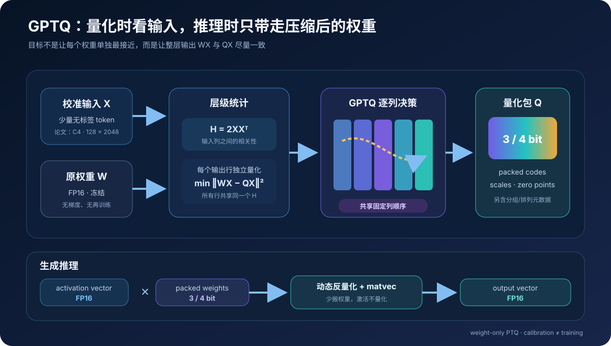
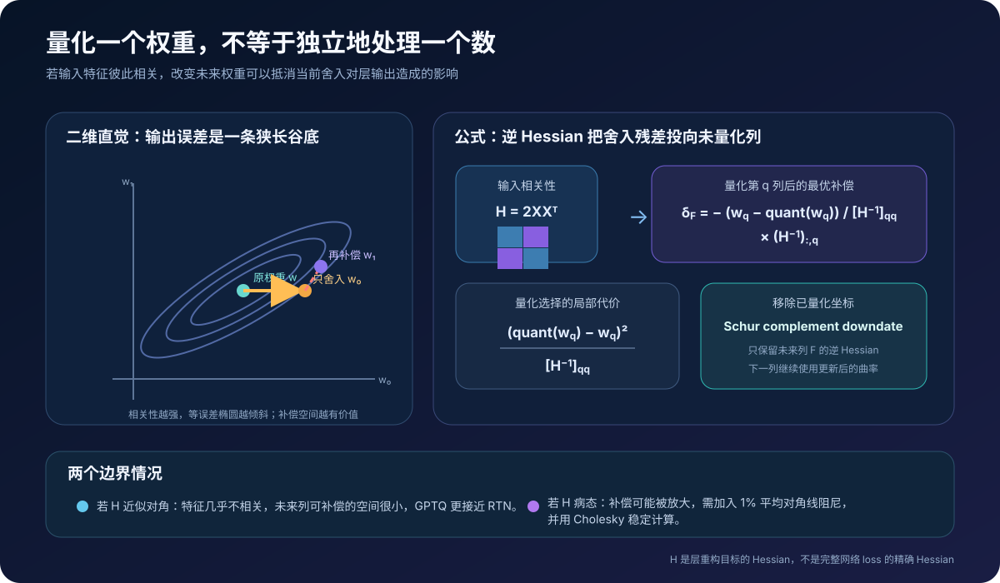
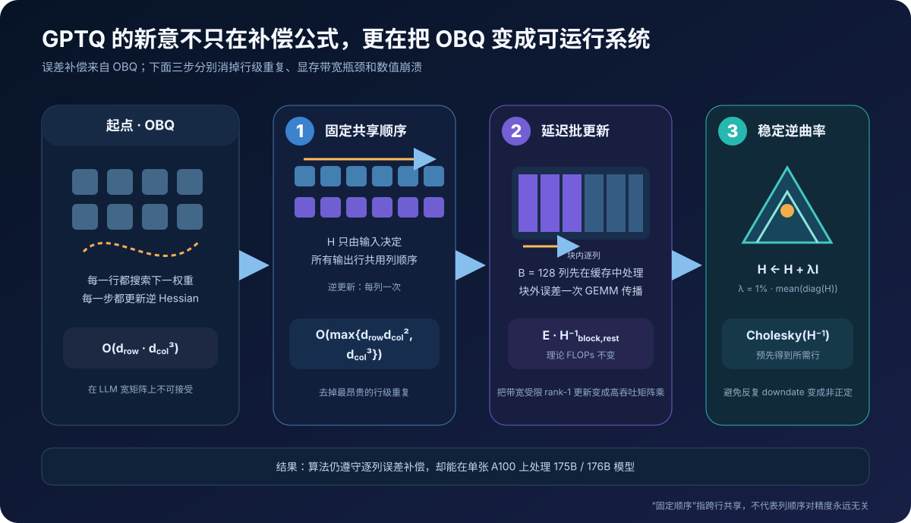
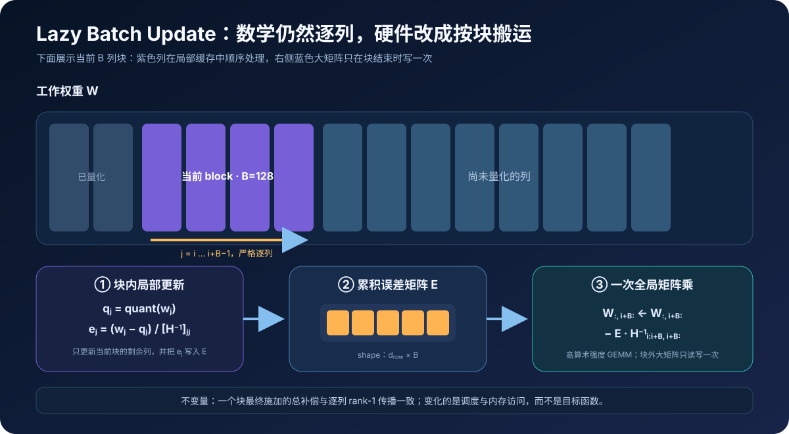
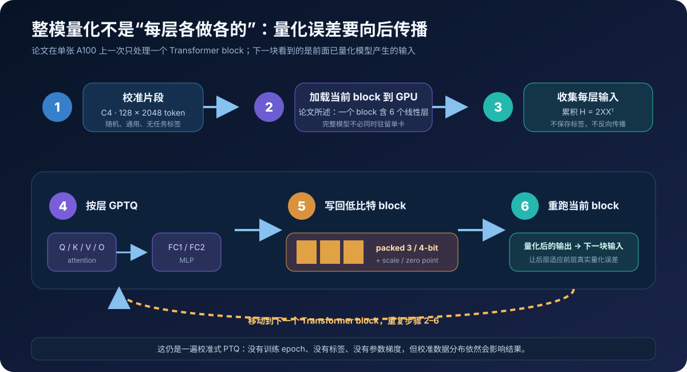
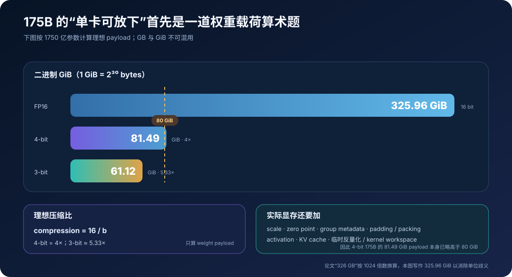
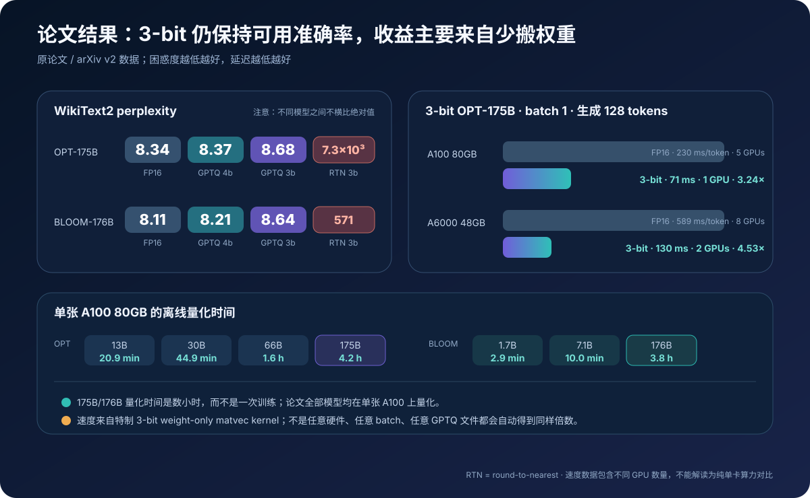

# GPTQ 原理与实现：用二阶误差补偿把 175B 模型压到 3/4 bit


> **论文**：[GPTQ: Accurate Post-Training Quantization for Generative Pre-trained Transformers](https://arxiv.org/abs/2210.17323)<br>
> **会议**：[ICLR 2023](https://openreview.net/forum?id=tcbBPnfwxS)<br>
> **官方代码**：[IST-DASLab/gptq](https://github.com/IST-DASLab/gptq)<br>
> **作者**：Elias Frantar、Saleh Ashkboos、Torsten Hoefler、Dan Alistarh<br>
> **时间**：2022 年 10 月首次公开；本文以 2023 年 3 月 arXiv v2 / ICLR 版本为准<br>
> **关键词**：Post-Training Quantization、Weight-only Quantization、Approximate Second Order、OBQ、Hessian、Error Compensation、Lazy Batch Update<br>
> **配套代码**：[gptq_minimal.py](./code/gptq_minimal.py)<br>
> **前置阅读**：[Transformer 原理](00_Transformer_2017_原理.md) · [GPT-3 原理](05_GPT3_2020_原理.md) · [FlashAttention 原理](14_FlashAttention_2022_原理.md)

2022 年，175B 参数的 FP16 模型仅权重就约占：

$$
175\times10^9\times2\ \text{bytes}
\approx 326\ \text{GiB}.
$$

这还没有算 activation、KV cache、临时工作区和框架开销。即使只做推理，一份权重也要跨多张昂贵 GPU 摆放。

最直接的压缩方法是把每个权重独立舍入到最近的 3-bit 或 4-bit 网格点，即 round-to-nearest（RTN）。但它只问：

> 量化后的单个权重离原值有多远？

模型真正关心的问题却是：

> 量化后的整层输出离原输出有多远？

GPTQ 把目标改写为：

$$
\boxed{
\widehat W
=\arg\min_{\widehat W}
\left\|WX-\widehat W X\right\|_F^2
}
$$

其中 $W$ 是原始权重，$X$ 是少量校准输入，$\widehat W$ 的每个元素必须落在低比特量化网格上。

这带来一个关键机会：如果两列输入高度相关，那么第一列权重舍入造成的输出偏差，可以通过调整尚未量化的第二列权重来抵消。GPTQ 用输入 Hessian 的逆来计算这种补偿，并通过三项系统改造把 OBQ 的昂贵逐权重算法推到 175B / 176B 模型：

1. 所有输出行共享同一个固定列顺序；
2. 以 128 列为块延迟传播误差，把大量 rank-1 更新变成矩阵乘；
3. 加阻尼并用 Cholesky 预先计算稳定的逆 Hessian 因子。

最终得到的不是“用 INT4 训练的模型”，而是一个 **校准一次、权重低比特保存、激活保持 FP16、推理时按需反量化** 的 weight-only PTQ 模型。

---

## 0. 先给结论

读完本文，至少应记住下面二十四点：

1. **GPTQ 是训练后权重量化，不是量化感知训练。** 它不需要标签、反向传播或重新训练模型。
2. **论文只量化 weights，不量化 activations。** 推理 kernel 计算的是低比特权重乘全精度向量。
3. **目标是层输出重构误差。** $\|WX-\widehat W X\|_F^2$ 比逐权重欧氏距离更接近模型实际计算。
4. **所谓“二阶信息”来自输入相关性。** 对层重构这个二次目标，列 Hessian 为 $H=2XX^T$。
5. **它不是完整网络 loss 的精确 Hessian。** “近似二阶”指用逐层局部目标近似整网影响。
6. **OBQ 给出最优单权重舍入与补偿公式。** GPTQ 主要解决 OBQ 无法扩到 LLM 的计算和数值问题。
7. **舍入一个权重后，其误差会传播到尚未量化的权重。** 传播方向由 $H^{-1}$ 对应列决定。
8. **输入特征相关性是补偿有效的根源。** 若 $H$ 近似对角，跨列补偿很弱，GPTQ 更接近 RTN。
9. **固定顺序是所有行共享一套列顺序。** 它不是“每一行仍搜索最优顺序”，也不是“顺序永远不影响精度”。
10. **共享顺序成立是因为 Hessian 只依赖输入 $X$。** 同一线性层所有输出行使用同一份 $H$。
11. **GPTQ 的理论复杂度为 $O(\max\{d_{row}d_{col}^2,d_{col}^3\})$。** OBQ 原式是 $O(d_{row}d_{col}^3)$。
12. **Lazy Batch Update 不改变数学目标。** 块内仍逐列处理，只把对块外矩阵的更新合并成 GEMM。
13. **论文 block size 取 128。** 这主要提高 GPU 内存访问和算术强度，不减少理论 FLOPs。
14. **阻尼与 Cholesky 是必要的稳定性设计。** 反复逆更新在大模型中会累积误差，甚至使矩阵失去正定性。
15. **官方实现默认阻尼是平均 Hessian 对角线的 1%。** 它不是量化 bit 数，也不是 loss 正则项。
16. **论文校准使用 128 个随机 C4 片段，每段 2048 token。** 它们通用、无标签，也不是下游任务训练集。
17. **整模处理是 block-sequential 的。** 当前 Transformer block 量化后会重跑，为下一 block 生成已含上游量化误差的输入。
18. **原实验使用逐行非对称均匀量化网格。** GPTQ 是“怎样选舍入与补偿”的算法，并不绑定唯一网格。
19. **分组越小通常越准，但 metadata 越多。** 论文还用 grouping 把 2-bit / ternary 推到可研究的准确率区间。
20. **175B 的理想 3-bit 权重载荷约 61.12 GiB。** 4-bit 是 81.49 GiB，单看 payload 已略高于 80 GiB。
21. **论文把 OPT-175B 量化到 3/4-bit 约需 4.2 小时。** BLOOM-176B 约 3.8 小时，均在单张 A100 80GB 上完成。
22. **3-bit OPT-175B 在 A100 上报告 3.24× 生成加速。** 对比是量化单卡 71 ms/token 与 FP16 五卡 230 ms/token，不能解释为纯单卡算力倍率。
23. **速度来自更少的权重内存流量。** 论文明确说没有减少理论计算量，收益依赖专用 kernel、batch 和硬件。
24. **今天工具里的“GPTQ”常包含后续技巧。** `act-order`、`true-sequential` 与 2023 年 7 月的 `static-groups` 是官方仓库后续演进，不能倒灌成 2022 核心算法。



---

## 1. 先划清边界：GPTQ 是什么，不是什么

### 1.1 它处在模型生命周期的哪个阶段

可以把常见低精度方法按“何时介入”分为三类：

| 类别 | 何时介入 | 是否更新模型 | 是否需要标签 | GPTQ 属于 |
|---|---|---:|---:|---:|
| Quantization-aware training | 训练 / 微调中模拟量化 | 是 | 常见需要 | 否 |
| Post-training calibration | 模型训练完成后收集统计 | 否 | 否 | **是** |
| Data-free rounding | 训练完成后直接舍入 | 否 | 否 | RTN 更接近此类 |

GPTQ 的“训练后”不是“完全不看数据”。它要运行少量 calibration samples，以估计线性层输入列之间的相关性；但它：

- 不计算任务 loss；
- 不创建参数梯度；
- 不跑 optimizer step；
- 不修改模型拓扑；
- 不要求下游任务标签。

所以更准确的术语是 **data-aware, label-free, one-shot PTQ**。

### 1.2 weight-only 到底意味着什么

论文中的主要推理路径是：

$$
y=\operatorname{dequant}(W_q)x,
$$

其中：

| 对象 | 典型驻留形式 | 计算时角色 |
|---|---:|---|
| 权重 codes | 2/3/4-bit packed integers | 从显存读取，动态反量化 |
| scale / zero point | FP16 或相应 metadata | 把 code 恢复为近似权重 |
| 输入 activation $x$ | FP16 | 不做 activation quantization |
| 输出 $y$ | FP16 / 累加格式 | 继续流入后续算子 |

“weight-only 3-bit”不等于整个模型每个张量都是 3-bit，更不等于 GPU 直接执行原生 3-bit tensor core GEMM。

### 1.3 名称里的 GPTQ 从哪里来

论文脚注说明，`GPTQ` 这个名字是把当时重点实验的 **OPT** 模型家族名称与 **PTQ** 缩写组合而来。今天人们常把它自然理解成 “GPT Quantization”，这在交流上不难懂，但不是原论文给出的命名来源。

### 1.4 2022 核心、camera-ready 与仓库后续更新

时间边界很重要：

| 层次 | 内容 |
|---|---|
| 2022 / arXiv 核心 | 固定共享列顺序、lazy batch update、阻尼 + Cholesky、逐层 weight-only PTQ |
| 论文 v2 / camera-ready | 更完整实验、优化后的 3-bit kernel、2-bit 与 ternary 分组结果 |
| 官方仓库后续 | `act-order`、`true-sequential`、`new-eval`，以及 2023-07 的 `static-groups` |
| 第三方生态 | 不同 checkpoint 格式、后端 kernel、模型覆盖和额外启发式 |

本文先完整解释论文算法，再单独讨论后续选项。看到一个配置名叫 GPTQ，不应自动假设它与论文的量化网格、分组语义、列顺序、文件布局和 kernel 完全相同。

---

## 2. 为什么逐权重 RTN 不够

### 2.1 线性层真正输出什么

设一层权重：

$$
W\in\mathbb R^{d_{row}\times d_{col}},
$$

收集到 $n$ 个输入向量，并按列排成：

$$
X\in\mathbb R^{d_{col}\times n}.
$$

原输出为：

$$
Y=WX.
$$

量化权重 $\widehat W$ 产生：

$$
\widehat Y=\widehat W X.
$$

于是最直接的层重构目标是：

$$
\mathcal L(\widehat W)
=\|Y-\widehat Y\|_F^2
=\|(W-\widehat W)X\|_F^2.
$$

RTN 优化的则近似是：

$$
\|W-\widehat W\|_F^2.
$$

两者只有在输入各维等尺度、彼此不相关时才会比较接近。真实 Transformer activation 并不满足这个理想条件。

### 2.2 一个最小反例

考虑两个输入特征满足：

$$
x_2\approx x_1.
$$

某个输出神经元为：

$$
y=w_1x_1+w_2x_2
\approx(w_1+w_2)x_1.
$$

假设 $w_1$ 被量化后增加 $0.1$，若同时把尚未量化的 $w_2$ 减少约 $0.1$，输出几乎不变。逐元素 RTN 不会主动做这个交换，因为它只最小化每个 $|w_i-\widehat w_i|$。

GPTQ 的核心就是系统地寻找这类补偿。

### 2.3 为什么 4-bit 看起来容易，3-bit 会突然崩

bit 数下降一位，网格点数量减半：

$$
2^4=16,
\qquad
2^3=8.
$$

网格变粗后，单次舍入误差变大；经过几十或上百层传播，局部误差还会改变后续层的输入分布。论文实验中，4-bit RTN 在大模型上有时仍可工作，但 3-bit RTN 经常出现困惑度灾难性上升。GPTQ 的补偿在这个区间才真正显出价值。

---

## 3. 量化网格：GPTQ 最终把权重存成什么

### 3.1 逐行非对称均匀量化

论文主实验对每个输出行使用独立的 asymmetric min-max grid。设一行权重范围在 $[w_{min},w_{max}]$，位宽为 $b$：

$$
q_{max}=2^b-1,
$$

$$
s=\frac{w_{max}-w_{min}}{q_{max}},
$$

$$
z=\operatorname{round}\left(-\frac{w_{min}}{s}\right).
$$

编码为：

$$
q=\operatorname{clamp}
\left(
\operatorname{round}\left(\frac{w}{s}\right)+z,
0,
q_{max}
\right),
$$

反量化为：

$$
\widehat w=s(q-z).
$$

为了让精确的 0 落入范围，官方实现会用：

$$
w_{min}\leftarrow\min(w_{min},0),
\qquad
w_{max}\leftarrow\max(w_{max},0).
$$

### 3.2 per-row、per-group、per-tensor 不要混淆

| 粒度 | 一套 scale/zero 覆盖 | 精度倾向 | metadata |
|---|---|---|---|
| per-tensor | 整张矩阵 | 最容易受离群值影响 | 最少 |
| per-row / per-channel | 一个输出行 | 更贴合各神经元范围 | 中等 |
| per-group | 每行连续 $g$ 个权重 | 通常更准 | 随 $g$ 变小而增多 |

论文先用 per-row 网格建立干净的算法比较，再展示 group size 1024、128、64、32、8 等设置。Grouping 与 GPTQ 的误差补偿是正交的：前者决定可选网格，后者决定如何在网格上逐列落点并调整其余权重。

### 3.3 checkpoint 保存的不是一张浮点矩阵

实际量化 artifact 至少包括：

~~~text
quantized layer
├── packed integer weight codes
├── scales
├── zero points
├── group boundaries / group size
├── optional column permutation
├── original shape / padding metadata
└── bias and unquantized tensors
~~~

所以“4-bit 模型大小 = 参数量 × 0.5 byte”只是主体载荷下界。分组参数、packing 对齐、未量化 embedding / normalization、文件头等都会让实际文件更大。

---

## 4. 二阶信息从哪里来：$H=2XX^T$

### 4.1 层目标可以逐输出行拆开

Frobenius 范数等于各行误差之和。令 $w$ 与 $\widehat w$ 是 $W$ 和 $\widehat W$ 的某一行：

$$
\mathcal L(\widehat W)
=\sum_{r=1}^{d_{row}}
\|(w_r-\widehat w_r)X\|_2^2.
$$

因此每个输出行可独立优化；但所有行面对的是同一个输入矩阵 $X$，所以共享同一份列 Hessian。

### 4.2 展开单行二次型

记权重变化：

$$
\delta=w-\widehat w.
$$

那么：

$$
\ell(\widehat w)
=\|\delta X\|_2^2
=\delta XX^T\delta^T.
$$

对 $\delta$ 求二阶导，得到：

$$
\boxed{H=2XX^T}.
$$

若对样本数取平均，也可以写作 $2XX^T/n$；整体常数缩放不会改变无阻尼时的补偿方向，官方实现为了批次累积使用归一化版本。

### 4.3 为什么论文称 approximate second-order

对单层重构目标，$\ell$ 本来就是二次函数，$H=2XX^T$ 不是泰勒截断近似。

“approximate”来自更高一层：真正想保护的是整网最终任务 loss，但 GPTQ 没有构造完整模型的 Hessian，而是用每层输出重构作为局部代理，并按 block 顺序传播上游量化误差。

因此要同时记住：

- 对局部层目标：二次结构是精确的；
- 对端到端模型质量：这是实用近似。

### 4.4 Hessian 每个元素在说什么

$$
H_{ij}=2\sum_{t=1}^{n}X_{i,t}X_{j,t}.
$$

- 对角线 $H_{ii}$：第 $i$ 个输入特征的能量；
- 非对角线 $H_{ij}$：第 $i,j$ 个输入特征的相关性；
- $H^{-1}$：在保持输出接近的前提下，各权重坐标可以怎样联合变化。

这解释了为什么 activation statistics 能指导 weight quantization：它不是在猜哪些权重“看起来重要”，而是在测量这些权重对应输入方向对层输出的实际几何。



---

## 5. 从 OBQ 推导单权重最优补偿

GPTQ 直接继承了 [Optimal Brain Compression / OBQ](https://arxiv.org/abs/2208.11580) 的核心更新。先只看一个输出行。

### 5.1 量化第 $q$ 个权重的约束问题

假设当前决定把：

$$
w_q\longrightarrow q_q=\operatorname{quant}(w_q).
$$

这相当于要求总更新 $\Delta$ 满足：

$$
e_q^T\Delta=q_q-w_q,
$$

其中 $e_q$ 是第 $q$ 个单位向量。希望在这个硬约束下，使二次误差最小：

$$
\min_{\Delta}\ \frac12\Delta^T H\Delta
\quad
\text{s.t.}
\quad
e_q^T\Delta=q_q-w_q.
$$

构造 Lagrangian：

$$
\mathcal J(\Delta,\mu)
=\frac12\Delta^TH\Delta
+\mu(e_q^T\Delta-q_q+w_q).
$$

一阶条件：

$$
H\Delta+\mu e_q=0,
$$

所以：

$$
\Delta=-\mu H^{-1}e_q.
$$

代回约束：

$$
-\mu[H^{-1}]_{qq}=q_q-w_q,
$$

得到：

$$
\boxed{
\Delta
=-\frac{w_q-q_q}{[H^{-1}]_{qq}}
(H^{-1})_{:,q}
}
$$

或完全等价地写作：

$$
\Delta
=\frac{q_q-w_q}{[H^{-1}]_{qq}}
(H^{-1})_{:,q}.
$$

两个版本只差残差的符号定义。官方实现先计算：

$$
e=\frac{w_q-q_q}{[H^{-1}]_{qq}},
$$

再执行：

$$
w\leftarrow w-e(H^{-1})_{q,:}.
$$

### 5.2 当前量化选择的最小代价

把最优 $\Delta$ 代回目标，损失增量与下式成正比：

$$
\boxed{
\Delta\ell_q
=\frac{(w_q-q_q)^2}{[H^{-1}]_{qq}}
}
$$

OBQ 会在所有尚未量化的权重中寻找这一代价最小者。问题在于：每个输出行可能选出不同顺序，每移除一个权重还要更新逆 Hessian。

### 5.3 移除已经量化的坐标

量化第 $q$ 个坐标后，后续只优化剩余集合 $F\setminus\{q\}$。逆 Hessian 可以用 rank-1 Schur complement downdate 更新：

$$
\boxed{
H_{-q}^{-1}
=\left(
H^{-1}
-\frac{H^{-1}_{:,q}H^{-1}_{q,:}}
{[H^{-1}]_{qq}}
\right)_{-q}
}
$$

其中下标 $-q$ 表示删掉第 $q$ 行与第 $q$ 列。

### 5.4 为什么 OBQ 到 LLM 就太慢

若权重矩阵形状为 $d_{row}\times d_{col}$：

- 每行要独立做 $d_{col}$ 次选择；
- 每次选择要扫描候选并维护逆矩阵；
- 整体复杂度达到：

$$
O(d_{row}d_{col}^3).
$$

对几千到上万维的 Transformer 线性层，再乘几十或上百层，这不是一个可接受的量化流程。GPTQ 的算法贡献从这里开始。

---

## 6. GPTQ 的三步改造



### 6.1 改造一：所有输出行共享固定列顺序

关键观察是：

$$
H=2XX^T
$$

只依赖输入，不依赖权重行。于是 GPTQ 不再为每个输出行搜索自己的下一个量化坐标，而是：

~~~text
第 0 列：同时量化所有输出行的 W[:, 0]
第 1 列：同时量化所有输出行的 W[:, 1]
第 2 列：同时量化所有输出行的 W[:, 2]
...
~~~

这样，逆 Hessian 的移除 / 因子读取每个输入列只做一次，所有 $d_{row}$ 行共享。

论文强调使用 arbitrary order 仍有很强结果。这里的“arbitrary”应理解为：不再执行 OBQ 那个昂贵的逐行贪心搜索，而采用一套固定共享顺序；不是证明任何顺序都严格等价。

复杂度因此降为：

$$
\boxed{
O\left(\max\left\{
d_{row}d_{col}^2,
d_{col}^3
\right\}\right)
}
$$

两项分别对应：

- 对所有权重行传播列误差；
- 构造 / 分解列 Hessian。

### 6.2 改造二：Lazy Batch Update

固定顺序仍有一个 GPU 问题。若每量化一列就立即更新右侧所有列：

$$
W_{:,j+1:}
\leftarrow
W_{:,j+1:}
-e_j(H^{-1})_{j,j+1:},
$$

这是一个 outer product / rank-1 update。它的算术强度低，要反复读写大块 $W$，容易受显存带宽限制。

GPTQ 以 $B=128$ 列为一个块：

1. 把当前块 $W_{:,i:i+B}$ 放在高速工作集；
2. 块内仍然逐列量化，并立即更新当前块中后面的列；
3. 保存每列缩放后的误差，组成 $E\in\mathbb R^{d_{row}\times B}$；
4. 块结束后，一次更新全部块外权重：

$$
\boxed{
W_{:,i+B:}
\leftarrow
W_{:,i+B:}
-E(H^{-1})_{i:i+B,i+B:}
}
$$

最后一步是矩阵乘，能更好利用 GPU。论文报告这带来数量级的实际加速，但没有减少理论计算量。



### 6.3 改造三：阻尼与 Cholesky

直接反复做：

$$
H_{-q}^{-1}
=H^{-1}-\frac{H^{-1}_{:,q}H^{-1}_{q,:}}{[H^{-1}]_{qq}}
$$

会积累浮点误差。论文指出，在超过几十亿参数的模型中，几乎必然有少数层因此出现数值问题，使近似逆 Hessian 变得非正定。

GPTQ 先加入阻尼：

$$
H\leftarrow H+\lambda I,
$$

其中官方实现默认：

$$
\lambda
=0.01\times\operatorname{mean}(\operatorname{diag}(H)).
$$

随后执行：

~~~text
L      = cholesky(H)
H_inv  = cholesky_inverse(L)
R      = cholesky(H_inv, upper=True)
~~~

量化循环使用上三角因子 $R$ 的行，隐式获得顺序 downdate 所需要的比例与传播方向。这样比显式维护一连串可能失稳的逆矩阵更可靠。

### 6.4 论文算法逐行翻译

设 $Q$ 是输出量化矩阵，$E$ 是当前误差块，$R$ 是 $H^{-1}$ 的上三角 Cholesky 因子。论文 Algorithm 1 可写为：

~~~text
input: W, H = 2XXᵀ + λI, block size B
R = chol(H⁻¹)ᵀ
Q = zeros_like(W)

for block_start i in range(0, d_col, B):
    E = zeros(d_row, B)

    for j in i ... min(i+B, d_col)-1:
        Q[:, j] = quant(W[:, j])
        E[:, j-i] = (W[:, j] - Q[:, j]) / R[j, j]

        # 当前块内必须立刻传播，后续列决策会看到补偿后的权重
        W[:, j:i+B] -= outer(E[:, j-i], R[j, j:i+B])

    # 块外延迟到一次 GEMM
    W[:, i+B:] -= E @ R[i:i+B, i+B:]

return Q
~~~

有三个容易读错的地方：

1. `quant(W[:, j])` 量化的是所有输出行的同一输入列；
2. 列 $j$ 在量化前可能已经被先前列补偿过，所以不是总在量化原始 $W[:,j]$；
3. 块内更新不能延迟，否则后续量化决策会基于错误的未补偿权重。

### 6.5 论文伪代码与官方源码为何看起来有点不同

公式常写完整的 $H^{-1}$ 及其 Schur downdate；官方 `gptq.py` 量化循环里的 `Hinv` 实际已被替换成 $H^{-1}$ 的上三角 Cholesky 因子。于是对角项和行更新看似少了一层矩阵维护，但数学作用一致。

阅读源码时最好把变量区分为：

| 源码阶段 | 变量 `H` 的实际含义 |
|---|---|
| 收集 calibration batch | 归一化的 $2XX^T$ 累积 |
| 加 damping 后第一次 Cholesky | 原 Hessian 的 Cholesky 因子 |
| `cholesky_inverse` 后 | $H^{-1}$ |
| `cholesky(..., upper=True)` 后 | $H^{-1}$ 的上三角 Cholesky 因子 |

一个变量名复用四种语义，是读官方短实现时最容易踩的坑。

---

## 7. 从一层扩到整个 Transformer

### 7.1 为什么不能把所有层完全独立地一次算完

第一层量化后，第二层真实接收到的是：

$$
\widehat X_2=f(\widehat W_1X_1),
$$

而不是原模型的：

$$
X_2=f(W_1X_1).
$$

若所有层都只用原 FP16 模型收集的 activation 校准，越靠后越忽略上游累积误差。

论文的做法是逐 Transformer block：

1. 把当前 block 加载到 GPU；
2. 用当前校准流收集 block 内各线性层输入；
3. 量化当前 block；
4. 用已经量化的当前 block 重跑校准样本；
5. 把输出作为下一 block 的输入。

这是一种轻量的 sequential propagation，不是 gradient-based finetuning。



### 7.2 原论文校准配方

论文主实验使用：

| 项目 | 设置 |
|---|---|
| 数据 | C4 |
| 采样 | 128 个随机片段 |
| 每段长度 | 2048 token |
| 标签 | 不需要 |
| 下游任务特化 | 无 |
| 设备 | 单张 A100 80GB |
| 处理粒度 | 一次一个 Transformer block |
| 量化层 | block 内线性层；论文描述 OPT block 有 6 个 |

“只需少量通用数据”不等于“任何随机 token 都一样”。校准集仍应覆盖模型部署时常见的 activation 范围和相关性；语言、代码、上下文长度或多模态分布严重错配，都可能让 $XX^T$ 估计偏离真实流量。

### 7.3 Hessian 为什么能在模型不整卡驻留时收集

对一层 $d_{col}$ 维输入，只需累计：

$$
H\leftarrow H+2X_{batch}X_{batch}^T.
$$

无需长期保存所有 token activation，也无需同时把完整 175B 模型放在 GPU。框架可以：

- 当前 block 在 GPU；
- 其余权重在 CPU / 分片存储；
- 校准输入按 batch 流过当前 block；
- 得到量化 block 后再移动到下一块。

这解释了“单张 A100 完成 175B 量化”与“FP16 权重约 326 GiB”并不矛盾：论文没有宣称完整 FP16 模型同时驻留 80GB 显存。

---

## 8. 零依赖最小实现：把公式真正跑一遍

配套的 [`gptq_minimal.py`](./code/gptq_minimal.py) 只依赖 Python 标准库，实现了：

- 逐行非对称均匀量化网格；
- 从相关 calibration samples 构造 $2XX^T/n+\lambda I$；
- 带 pivot 的小矩阵求逆；
- 固定共享列顺序；
- OBQ / GPTQ 精确逆 Hessian downdate；
- RTN 与 GPTQ 的层重构 MSE 对比；
- 175B 不同 bit 数的理想权重载荷。

运行：

```bash
python3 papers/to-2026/code/gptq_minimal.py
```

输出：

```text
GPTQ fixed-order teaching demo
shape                 : 5 x 8
calibration samples   : 96
weight precision      : 3-bit
RTN reconstruction MSE: 0.08526237
GPTQ reconstruction MSE: 0.07008463
relative reduction    : 17.80%

example output row 1
FP weights: [+1.648, +0.421, -0.856, +0.780, -0.661, -0.808, -1.786, +0.920]
RTN       : [+1.472, +0.491, -0.981, +0.981, -0.491, -0.981, -1.962, +0.981]
GPTQ      : [+1.472, +0.491, -0.981, +0.491, -0.491, -0.981, -1.962, +0.981]
```

这里第四个低比特值发生变化：GPTQ 没有选离当时原始权重最近的网格点，而是选了能与前面误差共同降低 $\|WX-QX\|^2$ 的点。

> 说明：上面 FP weights 行会跟随脚本中的确定性随机序列；本文展示的是当前脚本实际输出。最终判断依据是 MSE 与量化行，不是某个孤立权重的距离。

### 8.1 最核心的 15 行

把矩阵工具和检查代码去掉，教学实现的核心是：

```python
working = copy(weights)
quantized = zeros(rows, columns)
hinv = inverse(hessian_from_samples(samples, damp_percent=0.01))

for column in range(columns):
    diagonal = hinv[0][0]
    for row in range(rows):
        current = working[row][column]
        qvalue = quantizers[row].quantize(current)
        scaled_error = (current - qvalue) / diagonal

        for offset in range(len(hinv)):
            working[row][column + offset] -= scaled_error * hinv[0][offset]
        quantized[row][column] = qvalue

    hinv = remove_first_inverse(hinv)
```

其中 `remove_first_inverse` 就是 Schur complement：

```python
return [
    [hinv[i][j] - hinv[i][0] * hinv[0][j] / hinv[0][0]
     for j in range(1, len(hinv))]
    for i in range(1, len(hinv))
]
```

### 8.2 为什么教学实现不用论文的 Cholesky + block=128

教学代码只有 $5\times8$ 的矩阵，直接显式 downdate 更容易把论文公式逐项对上。生产实现必须改成：

- GPU tensor 运算；
- Cholesky 因子；
- 128 列左右的 block；
- fused quantize / pack；
- streaming layer placement；
- 对应 checkpoint 格式的推理 kernel。

所以这份代码验证 **数学语义**，不用于量化真实 LLM，也不应拿它的运行时间评价 GPTQ 性能。

### 8.3 一个有意设计的相关输入

示例让相邻特征满足近似关系：

$$
x_1\approx0.96x_0,
\quad
x_3\approx-0.90x_2,
\quad
x_5\approx0.82x_4.
$$

这使 $H$ 出现明显非对角项，量化误差有可转移方向。若把样本换成各向同性、彼此独立且数据量充足的特征，$H$ 会更接近对角阵，GPTQ 相对 RTN 的优势通常缩小。

---

## 9. 175B 的存储账本



设参数量为 $P$，位宽为 $b$，只算 packed weight payload：

$$
M_{weights}=\frac{Pb}{8}\ \text{bytes}.
$$

对 $P=175\times10^9$：

| 格式 | 十进制 GB | 二进制 GiB | 理想相对 FP16 压缩 |
|---|---:|---:|---:|
| FP16 | 350.00 | 325.96 | 1× |
| 4-bit | 87.50 | 81.49 | 4× |
| 3-bit | 65.625 | 61.12 | 5.33× |

论文写 FP16 OPT-175B 约 326 GB，实际按 1024 进位更接近 325.96 **GiB**。今天写容量时最好把 GB / GiB 标清，避免把 80GB GPU 与 80GiB payload 直接等同。

### 9.1 为什么 3-bit 能进 A100，4-bit 不一定

单看理想 payload：

$$
M_{3bit}\approx61.12\ \text{GiB}<80\ \text{GiB},
$$

但：

$$
M_{4bit}\approx81.49\ \text{GiB}>80\ \text{GiB}.
$$

再加 scale、zero point 和 runtime state，论文“175B 单 GPU 生成”对应的关键设置是 **3-bit OPT-175B on A100 80GB**，不能泛化成所有 175B 的 4-bit checkpoint 都能放进一张 80GB 卡。

论文的实际部署账本是：3-bit OPT-175B 约占 63GB，其中 embedding 与 output layer 保持 FP16；最大 2048-token 历史的全层 KV cache 再约占 9GB。两者合计仍可进入一张 80GB A100，4-bit 版本则不能完整放入。

### 9.2 grouping 的额外 bit 怎么算

若每组 $g$ 个权重额外保存：

- 一个 16-bit scale；
- 一个 $b$-bit zero point；

则每权重平均额外开销近似：

$$
b_{meta}=\frac{16+b}{g}.
$$

例如 2-bit、group size 128：

$$
b_{effective}
=2+\frac{16+2}{128}
\approx2.14\ \text{bit/weight}.
$$

加上对齐或不同 zero-point 表示后，论文将其概括为约 2.2 bit。这里的“2-bit 模型”因此不是严格每权重平均只占 2.000 bit。

---

## 10. 实验结果应该怎样读



### 10.1 实验设置

论文主要评测：

- OPT：125M 到 175B；
- BLOOM：560M 到 176B；
- 2/3/4-bit weight-only quantization；
- WikiText2、Penn Treebank、C4 perplexity；
- LAMBADA、ARC Easy/Challenge、PIQA 等 zero-shot tasks；
- RTN 作为相同量化网格下的基线。

这使比较比较干净：GPTQ 与 RTN 的主要差别不是 codebook，而是二阶误差补偿。

### 10.2 OPT 的 WikiText2 主结果

论文表 2 中几个最能说明问题的点：

| OPT | FP16 | RTN 4-bit | GPTQ 4-bit | RTN 3-bit | GPTQ 3-bit |
|---:|---:|---:|---:|---:|---:|
| 1.3B | 14.63 | 48.17 | 15.47 | 1.3×10⁴ | 20.97 |
| 6.7B | 10.86 | 12.10 | 11.39 | 5.8×10³ | 14.86 |
| 30B | 9.56 | 10.98 | 9.63 | 1.6×10³ | 10.27 |
| 66B | 9.34 | 110 | 9.55 | 6.1×10³ | 14.16 |
| 175B | 8.34 | 10.54 | 8.37 | 7.3×10³ | 8.68 |

三个观察：

1. 4-bit GPTQ 在最大模型上非常接近 FP16；
2. 3-bit RTN 大面积崩溃，GPTQ 仍保持有限退化；
3. OPT-66B 是论文中的明显 outlier，说明 GPTQ 不是“必然无损”。官方仓库后来的 `act-order` 明显改善了这个异常点，但那属于后续技巧。

### 10.3 BLOOM-176B 与完整任务结果

WikiText2 上：

| BLOOM-176B | FP16 | GPTQ 4-bit | GPTQ 3-bit | RTN 3-bit |
|---|---:|---:|---:|---:|
| perplexity | 8.11 | 8.21 | 8.64 | 571 |

论文表 5 还报告：

| 模型 / 格式 | WikiText2 | PTB | C4 | LAMBADA accuracy |
|---|---:|---:|---:|---:|
| OPT-175B FP16 | 8.34 | 12.01 | 10.13 | 75.59 |
| OPT-175B GPTQ 4b | 8.37 | 12.26 | 10.28 | 76.80 |
| OPT-175B GPTQ 3b | 8.68 | 12.68 | 10.67 | 76.19 |
| BLOOM-176B FP16 | 8.11 | 14.59 | 11.71 | 67.40 |
| BLOOM-176B GPTQ 4b | 8.21 | 14.75 | 11.81 | 67.71 |
| BLOOM-176B GPTQ 3b | 8.64 | 15.57 | 12.27 | 65.10 |

个别量化结果略优于 FP16 下游 accuracy 并不证明量化普遍提升模型；有限样本评测有波动，轻微噪声也可能正则化某些决策。应综合多任务、perplexity 和重复测量，而不是拿单个上升值讲“量化增智”。

### 10.4 Grouping 与极限量化

论文表 7 对最大模型做 2-bit GPTQ：

| 模型 | FP16 | 2-bit g128 | 2-bit g64 | 2-bit g32 | 普通 3-bit |
|---|---:|---:|---:|---:|---:|
| OPT-175B | 8.34 | 9.58 | 9.18 | 8.94 | 8.68 |
| BLOOM-176B | 8.11 | 9.55 | 9.17 | 8.83 | 8.64 |

论文还把 group size 缩到 8，使用 ternary $\{-1,0,+1\}$，在 OPT-175B 上得到 9.20 WikiText2 PPL。它展示了算法潜力，但平均 bit 数、metadata 与专用硬件实现都不同，不应把它宣传成普通 dense 2-bit checkpoint 已成熟落地。

### 10.5 离线量化需要多久

单张 A100 80GB：

| 模型 | GPTQ 时间 |
|---|---:|
| OPT-13B | 20.9 min |
| OPT-30B | 44.9 min |
| OPT-66B | 1.6 h |
| OPT-175B | 4.2 h |
| BLOOM-1.7B | 2.9 min |
| BLOOM-7.1B | 10.0 min |
| BLOOM-176B | 3.8 h |

这是一次性离线转换成本。若同一 artifact 被部署很多次，它可以摊薄；若频繁更换权重、group 配置或 calibration domain，则要重新承担。

### 10.6 生成速度为什么能加快

自回归生成在 batch size 1 时，每生成一个 token，绝大多数线性层执行 matrix-vector product。算术量相对权重读取量低，常受显存带宽限制。

GPTQ kernel 的策略是：

1. 从显存读取 packed 3-bit 权重；
2. 在寄存器 / kernel 内动态反量化；
3. 与 FP16 activation vector 相乘；
4. 不把完整反量化权重永久写回显存。

即使多做了反量化计算，少搬约 $16/3$ 倍的权重 payload 仍可能更快。

论文在生成 128 token、batch size 1 时报告：

| GPU | FP16 | GPTQ 3-bit | 加速 | GPU 数变化 |
|---|---:|---:|---:|---:|
| A100 80GB | 230 ms/token | 71 ms/token | 3.24× | 5 → 1 |
| A6000 48GB | 589 ms/token | 130 ms/token | 4.53× | 8 → 2 |

### 10.7 这些速度数字不能怎样解释

不能说：

- “INT3 算力是 FP16 的 3.24 倍”；
- “GPTQ 让 FLOPs 降了 3.24 倍”；
- “所有 A100 上任意模型都是 3.24×”；
- “量化单卡与 FP16 单卡的公平纯 kernel 对比”；
- “通信完全不存在”。

论文明确说明收益来自 reduced memory movement，而不是理论计算量减少。对比还同时改变了 GPU 数；模型、batch、上下文、kernel、packing 和硬件带宽都会改变实际结果。官方仓库也注明，原 3-bit kernel 主要为 OPT-175B 的 1×A100 / 2×A6000 优化，在其他模型或 GPU 上可能表现不佳。

---

## 11. 如何复现：先分清历史实验与现代部署

### 11.1 原作者仓库的最小实验

官方仓库以旧版 PyTorch / Transformers 环境验证，适合论文考古和算法对照，不应直接假设能无修改进入今天的生产栈。

OPT 的历史命令结构是：

```bash
# FP16 baseline
CUDA_VISIBLE_DEVICES=0 python opt.py facebook/opt-125m c4

# 相同网格的 RTN baseline
CUDA_VISIBLE_DEVICES=0 python opt.py facebook/opt-125m c4 \
  --wbits 4 --nearest

# 原始 GPTQ；可选 grouping
CUDA_VISIBLE_DEVICES=0 python opt.py facebook/opt-125m c4 \
  --wbits 4 --groupsize 1024
```

BLOOM 对应：

```bash
CUDA_VISIBLE_DEVICES=0 python bloom.py bigscience/bloom-560m c4 \
  --wbits 4
```

这些命令的价值是复现论文逻辑：同一模型、同一 calibration/evaluation 数据、同一量化网格下比较 RTN 与 GPTQ。它们不是对当前所有模型仓库、GPU 和 inference engine 的通用安装说明。

### 11.2 后续选项分别改变什么

官方仓库后来增加：

| 选项 | 含义 | 历史边界 |
|---|---|---|
| `--act-order` | 按 Hessian 对角线 / activation magnitude 降序处理列 | camera-ready 附近的后续 trick |
| `--true-sequential` | 在一个 Transformer block 内也更严格地逐层量化和传播输入 | 后续 LLaMA 集成带入 |
| `--new-eval` | 调整 C4 / PTB 预处理 | 更新评测口径 |
| `--faster-kernel` | 使用优化后的 3-bit kernel | 更新性能口径 |
| `--static-groups` | 预先固定 group grids，使 act-order 不必改变推理布局 | 2023 年 7 月更新 |

`act-order` 的直觉是优先处理 activation 能量大的列，降低重要坐标被之前补偿扰动的风险。但一旦重排列，scale group 如何定义、推理时是否保留 permutation、能否恢复连续内存布局都会变成 artifact 格式问题。`static-groups` 正是为缓解这一工程耦合而加入。

### 11.3 一个接近官方 tensor 实现的骨架

下面不是完整库代码，只展示生产实现应保留的张量结构：

```python
@torch.no_grad()
def gptq_layer(W, H, quantize, block_size=128, damp_ratio=0.01):
    W = W.float().clone()
    columns = W.shape[1]

    damp = damp_ratio * torch.diag(H).mean()
    ids = torch.arange(columns, device=W.device)
    H[ids, ids] += damp

    # Stable upper-triangular factor used by sequential updates.
    L = torch.linalg.cholesky(H)
    H_inv = torch.cholesky_inverse(L)
    R = torch.linalg.cholesky(H_inv, upper=True)

    Q = torch.zeros_like(W)
    for start in range(0, columns, block_size):
        end = min(start + block_size, columns)
        local = W[:, start:end].clone()
        errors = torch.zeros_like(local)

        for offset in range(end - start):
            column = start + offset
            value = local[:, offset]
            qvalue = quantize(value)
            scaled_error = (value - qvalue) / R[column, column]

            Q[:, column] = qvalue
            local[:, offset:] -= (
                scaled_error[:, None]
                @ R[column, column:end][None, :]
            )
            errors[:, offset] = scaled_error

        W[:, end:] -= errors @ R[start:end, end:]

    return Q
```

真实实现还要处理：

- dead columns；
- Conv1D / Linear 的转置约定；
- group grid 更新；
- column permutation 与 inverse permutation；
- layer hooks 和 Hessian 流式累积；
- packed integer storage；
- bias、embedding、lm head 和 tied weights；
- OOM-safe block placement；
- kernel 对 shape / alignment 的限制。

### 11.4 checkpoint 与 runtime 必须成对

“GPTQ 文件”不是一个自解释的数学概念。部署前至少要核对：

| 字段 | 必须一致的原因 |
|---|---|
| bit width | 决定 packing 与解码掩码 |
| signed / asymmetric | 决定 code 到实数的映射 |
| group size | 决定 scale/zero 的索引 |
| axis / layout | 决定 per-row 还是其他方向 |
| zero-point convention | 有的存整数 zero，有的存预乘后的 offset |
| permutation | act-order artifact 可能需要恢复列顺序 |
| padding / tile shape | kernel 常要求按 32、64、128 等对齐 |
| compute dtype | 反量化后的乘法 / 累加精度 |
| kernel backend | 决定是否原生支持该 packing 格式 |

格式不兼容时，最好的结果是 loader 明确报错；更危险的结果是“能加载、能出字、数值悄悄错”。

---

## 12. 超参数与工程取舍

### 12.1 bit width

| 位宽 | 理论主体压缩 | 论文观察 | 工程含义 |
|---:|---:|---|---|
| 4-bit | 4× | 大模型常接近 FP16 | 更稳妥，生态通常更丰富 |
| 3-bit | 5.33× | GPTQ 可用，RTN 常崩 | packing/kernel 更专门，精度更敏感 |
| 2-bit | 8× before metadata | 要配合小 group 才较合理 | metadata 占比高，模型/任务风险大 |
| ternary | 约 1.58 bit 码字下界，实际另算 | 论文作为极限实验 | 需要特殊表示和硬件考虑 |

位宽不是越低越好。若 3-bit kernel 反而没有 4-bit kernel 优化，3-bit 可能文件更小却吞吐更差。

### 12.2 group size

小 group 的好处：

- scale 更贴合局部权重范围；
- 离群值污染的权重更少；
- 低 bit 下准确率通常更好。

代价：

- scale / zero point 数量增加；
- checkpoint 增大；
- kernel 索引与反量化更复杂；
- 某些 tile 上内存访问不再规则。

部署选择应同时看：

$$
\text{quality},\quad
\text{artifact size},\quad
\text{peak memory},\quad
\text{prefill throughput},\quad
\text{decode latency}.
$$

### 12.3 damping ratio

阻尼太小：

- 校准样本不足时 $H$ 可能接近奇异；
- 逆曲率放大噪声；
- Cholesky 可能失败。

阻尼太大：

$$
H+\lambda I\approx\lambda I,
$$

非对角相关性被淹没，补偿更接近各向同性，丢失 GPTQ 的一部分优势。

论文 / 官方默认 1% 是经验起点，不是所有模型的数学最优值。任何调参都应在独立 validation set 上做，而不是反复看 test set。

### 12.4 block size

`block_size=128` 主要控制量化算法的硬件调度：

- 太小：块外 GEMM 变碎，内存流量高；
- 太大：局部工作集和临时误差矩阵增大；
- 数学上：只要块内顺序更新、块外补偿正确，结果应与逐列传播对齐到浮点误差范围。

不要把 quantization block size 与 group size 混为一谈：

| 名称 | 控制什么 |
|---|---|
| GPTQ block size | 算法何时批量把误差传播到远端列 |
| quantization group size | 多少权重共享一套 scale / zero point |
| calibration batch size | 一次用多少 token 更新 Hessian |
| inference kernel tile | GPU 算子怎样切分矩阵 |

它们可能都出现 `128`，但语义完全不同。

### 12.5 calibration set

一个可靠校准集应考虑：

- 语言与领域；
- prompt / response 结构；
- 上下文长度；
- 代码、数学、表格等特殊 token 分布；
- system prompt 是否固定；
- 多模态模型的输入模态组合。

不要只优化 calibration reconstruction error。至少留出独立文本检查：

1. perplexity / NLL；
2. 关键任务准确率；
3. 长文本稳定性；
4. 输出重复与退化模式；
5. 安全 / 偏见指标；
6. 真实 runtime latency 和峰值显存。

### 12.6 哪些层可以不量化

GPTQ 论文重点是 Transformer block 内大线性层。现代部署中常见策略还包括保留某些敏感或体积很小的层为较高精度，例如：

- embedding；
- final lm head；
- normalization 参数；
- bias；
- 某些 outlier-heavy projections。

是否跳过不能只凭经验列表，要结合模型 tying、artifact 格式和消融实验。一个层参数很少时，保留高精度几乎不影响总大小，却可能提升稳定性。

---

## 13. 常见误解逐条纠正

### 误解 1：GPTQ 是把 GPT 模型量化

它适用于可写成线性层重构的多种模型，不局限于 OpenAI GPT 系列。原论文主实验是 OPT 和 BLOOM；名称脚注也不是普通的“GPT + Quantization”展开。

### 误解 2：GPTQ 完全不需要数据

不需要训练标签，但需要 calibration inputs 来估计 $XX^T$。没有代表性数据，二阶统计就没有代表性。

### 误解 3：Hessian 是完整模型 loss 的 Hessian

不是。它是逐层输出重构目标相对权重行的列 Hessian $2XX^T$，再用 block-sequential 流程近似端到端影响。

### 误解 4：二阶方法一定要反向传播

这里的 Hessian 由输入外积直接得到，不需要对任务 loss 做 autograd Hessian，也不需要标签。

### 误解 5：GPTQ 只是更聪明地选择 scale

Scale/grid 可以与 RTN 相同。GPTQ 的核心差异是量化一列后，使用逆 Hessian 调整未来列。

### 误解 6：补偿后权重可以保持任意浮点值

只有尚未量化的列暂时保持浮点工作值并接受补偿；当轮到它们时，最终仍必须落在低比特网格上。

### 误解 7：Lazy Batch Update 一次独立量化 128 列

错。块内仍严格逐列，当前列误差必须影响块内后续列；仅对块外大矩阵的写回被延迟。

### 误解 8：block size 和 group size 是同一个参数

前者是误差更新调度，后者是量化网格共享粒度。值可以相同，含义完全不同。

### 误解 9：3-bit 模型就是每参数恰好 3 bit

还要保存 scale、zero point、group / permutation metadata、padding 与未量化参数。3 bit 只是 packed weight codes 的主体位宽。

### 误解 10：量化后不反量化也能与 FP16 activation 相乘

论文 kernel 在运算中动态解包和反量化。节省来自不把完整高精度权重从显存搬入，也不长期保存反量化副本。

### 误解 11：更小的 checkpoint 一定推理更快

没有匹配 kernel 时可能先完整反量化，甚至产生额外拷贝；小 batch decode 和大 batch prefill 的瓶颈也不同。

### 误解 12：论文证明 GPTQ 对所有模型几乎无损

OPT-66B 3-bit 就是明显反例；2-bit 也有可见退化。结果依赖模型、bit、group、校准和任务。

### 误解 13：175B 单卡指 FP16 原模型能进单卡

指最终 3-bit 权重与运行所需状态可在 A100 80GB 上执行生成；量化过程按 Transformer block 流式处理 FP16 权重。

### 误解 14：论文 3.25× 是同一张 GPU 上的纯算子加速

表 6 比较 GPTQ 单张 A100 与 FP16 五张 A100 的端到端每 token 延迟。它展示部署效果，但混合了压缩、kernel、GPU 数和通信条件。

### 误解 15：`act-order` 就是 2022 原始 GPTQ

它是作者仓库 camera-ready / LLaMA 集成时期加入的额外启发式。今天常与 GPTQ 一起使用，但历史上应分开描述。

---

## 14. GPTQ 与相邻方法的关系

### 14.1 与 RTN

| 维度 | RTN | GPTQ |
|---|---|---|
| 校准输入 | 可不需要 | 需要少量输入 |
| 目标 | 单个权重最近 | 层输出重构 |
| 跨权重补偿 | 无 | 有，来自 $H^{-1}$ |
| 量化成本 | 很低 | 更高，数分钟到数小时 |
| 3-bit 稳定性 | 论文中常崩 | 大模型上显著更好 |

GPTQ 可以理解为“保持相同网格，但让舍入决策知道输入几何”的 RTN 升级。

### 14.2 与 OBQ / Optimal Brain Compression

OBQ 提供最优脑外科式的单权重量化与补偿框架；GPTQ 通过共享固定顺序、batch update 和稳定因子分解把它扩到 LLM。因此：

$$
\text{GPTQ}
\approx
\text{OBQ math}
+\text{LLM-scale scheduling}
+\text{numerical stabilization}.
$$

### 14.3 与 LLM.int8()

[LLM.int8()](https://arxiv.org/abs/2208.07339) 关注 8-bit matrix multiplication 与 activation outliers，保留离群维度的高精度路径；GPTQ 原论文聚焦 2/3/4-bit weight-only 压缩，不量化 activation。两者目标位宽、kernel 和离群值处理机制不同。

### 14.4 与 SmoothQuant

[SmoothQuant](https://arxiv.org/abs/2211.10438) 面向 W8A8，把 activation 的量化难度通过等价缩放迁移到 weights；GPTQ 是 W3/W4A16 风格，用校准 Hessian 做权重误差补偿。一个核心处理 activation outlier，一个核心优化低比特 weight reconstruction。

### 14.5 与 AWQ

[AWQ](https://arxiv.org/abs/2306.00978) 也是 activation-aware weight-only PTQ，但主要依据 activation 识别少量 salient weights，并用缩放保护它们；GPTQ 则显式利用输入二阶统计，逐列传播舍入误差。二者可用相同 4-bit 名称，却不共享同一算法或 artifact 格式。

### 14.6 与 QLoRA

[QLoRA](24_QLoRA_2023_原理.md) 解决的是微调显存：

- 底座以 4-bit NF4 冻结存储；
- 计算时反量化；
- 梯度只更新 LoRA adapters。

GPTQ 原论文解决的是部署 PTQ：

- 校准后生成低比特权重；
- 不训练 adapter；
- 优化层输出重构与生成推理。

所以“GPTQ checkpoint + LoRA”属于后续组合工作流，不能把 GPTQ 本身解释成微调算法。

### 14.7 与 FlashAttention

[FlashAttention](14_FlashAttention_2022_原理.md) 减少 attention 中间张量的 HBM 读写；GPTQ 减少线性层 weight payload 的 HBM 读取。二者都体现 IO-aware 思想，但优化对象不同：

| 方法 | 主要减少的流量 | 主要阶段 |
|---|---|---|
| FlashAttention | attention score / softmax 中间量 | prefill 与 training 很关键 |
| GPTQ kernel | 线性层权重 | batch-1 decode 很关键 |

现代推理通常需要两者协同：prefill 可能更受 attention / GEMM 影响，decode 更容易被权重带宽和 KV cache 影响。

---

## 15. 论文限制与今天仍成立的风险

### 15.1 没有 activation quantization

权重从 FP16 降到 3/4-bit，并不压缩：

- residual stream；
- attention / MLP 中间 activation；
- KV cache；
- logits 和部分累加器。

长上下文、大 batch 时，KV cache 与 activation 可能成为新瓶颈，单看 weight compression 不够。

### 15.2 没有减少理论计算量

论文明确把速度归因于 memory movement。若硬件没有高效 unpack / dequant kernel，额外反量化甚至会抵消带宽收益。

### 15.3 评测主要是生成与少量标准指标

论文使用 perplexity 和若干 zero-shot task，但没有系统研究：

- hallucination；
- factuality；
- calibration；
- robustness；
- toxicity / bias；
- 多语言长尾；
- adversarial prompts；
- 长上下文能力。

论文 ethics statement 也承认，压缩对 bias 等 secondary measures 的影响需要进一步研究。

### 15.4 层重构小不保证端到端任务不变

误差会经过非线性、残差连接、归一化和深层累积。GPTQ 的 block-sequential 传播缓解了这个问题，但没有给出端到端任务损失的严格保证。

### 15.5 校准分布会过拟合

若 calibration set 过窄，$H$ 会把某些常见于部署、却未出现于校准的输入方向视为不重要。量化后 calibration reconstruction 很好，真实域仍可能掉点。

### 15.6 低 bit 放大格式和 kernel 风险

位宽越低：

- 一个 bit packing 错位影响越大；
- group scale 误配更致命；
- 某些 shape padding 比例更高；
- 模型 outlier 更难容纳；
- 后端支持更少。

因此 3-bit / 2-bit 部署的验证要求通常高于 4-bit。

### 15.7 历史 kernel 结果不能直接迁移到今天

论文的 A100 / A6000 结果绑定：

- OPT-175B；
- 3-bit packing；
- batch size 1；
- 生成 128 token；
- 当时的 CUDA kernel 与多 GPU baseline。

新的 GPU、编译器、模型 shape、attention backend 和 serving engine 都会改变瓶颈。可靠做法永远是在目标机器上测目标流量。

---

## 16. 一份可执行的量化与部署检查表

### 16.1 量化前

- [ ] 明确目标是省磁盘、降峰值显存、降 decode latency，还是提高并发。
- [ ] 保存 FP16/BF16 基线的 perplexity、任务质量、延迟和显存。
- [ ] 确认目标 runtime 支持 bit width、group size、zero point 和 checkpoint layout。
- [ ] 准备具有代表性的 calibration corpus，并与 validation/test 分离。
- [ ] 确认 tokenizer、chat template、max sequence length 与部署一致。
- [ ] 决定哪些层量化，哪些层保留高精度。
- [ ] 记录模型 revision、代码 revision 与依赖环境。

### 16.2 量化中

- [ ] 监控 Hessian 是否出现 zero / dead columns。
- [ ] 记录 damping ratio、block size、group size 与列顺序。
- [ ] 检查 Cholesky 是否成功，是否发生 NaN / Inf。
- [ ] 对每层记录 reconstruction error，而不是只看最终文件是否生成。
- [ ] 若使用 sequential propagation，确认下一 block 输入来自已量化前序 block。
- [ ] 对 tied weights 和 lm head 做显式处理。
- [ ] 保存 scale、zero point、permutation 与 packing schema。

### 16.3 量化后

- [ ] 重新加载 artifact，逐层做 shape / dtype / checksum 检查。
- [ ] 在独立 validation set 上测 perplexity / NLL。
- [ ] 跑关键下游任务、长文本和安全回归。
- [ ] 与 RTN 基线比较，确认二阶量化确实带来收益。
- [ ] 测 prefill 与 decode，分别覆盖 batch 1 和生产并发。
- [ ] 测峰值显存，而不只看 checkpoint 文件大小。
- [ ] 检查首 token latency、tokens/s、能耗和多卡通信。
- [ ] 用真实请求分布做 canary，对异常重复、乱码和退化回复报警。

### 16.4 结果记录模板

```yaml
model:
  id: <model-and-revision>
  parameter_count: <N>
quantization:
  method: gptq
  bits: 4
  group_size: 128
  symmetric: false
  damp_ratio: 0.01
  algorithm_block_size: 128
  act_order: false
  true_sequential: false
calibration:
  dataset: <name-and-revision>
  samples: 128
  sequence_length: 2048
artifact:
  packing_schema: <schema/version>
  runtime_backend: <backend/version>
evaluation:
  baseline_ppl: <value>
  quantized_ppl: <value>
  peak_memory_gib: <value>
  prefill_tokens_per_second: <value>
  decode_tokens_per_second: <value>
```

没有这些元数据，“这是一个 GPTQ 4-bit 模型”不足以复现实验或排查回归。

---

## 17. FAQ

### Q1：GPTQ 为什么能不用标签？

因为它优化的是线性层输出重构：原层 $WX$ 本身就是目标，不需要人工 label。输入 $X$ 足以构造 $2XX^T$。

### Q2：需要多少校准数据？

论文使用 128 个 2048-token C4 片段，这是重要历史基线，不是普适最优答案。模型、领域和上下文越特殊，越应做 sample count / domain 消融。

### Q3：为什么不直接最小化权重 MSE？

权重误差对输出的影响取决于输入能量与相关性。两个同样大小的权重误差，落在高能量输入列与几乎不激活的输入列上，后果完全不同。

### Q4：GPTQ 会改变原模型架构吗？

数学上仍是相同线性映射的近似；工程上通常会把 `Linear` 替换为能读取 packed weights 的量化算子，并增加 scales / zeros 等 buffers。

### Q5：量化时为什么要保留浮点 working copy？

尚未量化的列需要接收前面列的误差补偿。最终 artifact 只保存低比特结果，但离线求解过程需要更高精度临时工作值。

### Q6：Hessian 大小会不会比权重还大？

一层 $W$ 是 $d_{row}\times d_{col}$，Hessian 是 $d_{col}\times d_{col}$。对近似方阵两者同阶；对宽度很大的层，Hessian 与 Cholesky 确实是重要临时内存。论文一次处理一个 block / layer，而不是全模型同时保留所有 Hessian。

### Q7：为什么所有行共享 Hessian？

每个输出行都乘相同输入 $X$，层重构目标对任一权重行的二阶矩阵都是 $2XX^T$。差异只在各行权重值和量化 grid。

### Q8：GPTQ 一定比 RTN 好吗？

它直接优化 calibration reconstruction objective，通常在相同网格下更好；但有限精度、启发式顺序、校准偏差与端到端非线性意味着不能保证所有 held-out task 都单调提升。

### Q9：4-bit 应该选多大 group size？

没有脱离 runtime 的答案。小 group 常更准，大 group metadata 更少、kernel 更简单。应在目标后端对质量、大小、峰值显存、prefill 和 decode 一起扫参。

### Q10：可以量化 KV cache 吗？

可以由其他技术完成，但不属于 GPTQ 原论文。GPTQ 的校准和补偿针对 weights，不能直接拿同一公式宣称已解决 KV cache quantization。

### Q11：可以在量化后继续微调吗？

可以通过 adapters 或量化感知流程组合，但这超出原算法。若直接更新 packed GPTQ weights，需要重新定义训练表示、梯度与 scale 更新，不能等同于原 PTQ。

### Q12：为什么 4-bit 的理想 175B payload 还进不了 80GB？

因为 $175\text{B}\times4/8=87.5$ GB，即 81.49 GiB；80GB GPU 的标称容量不足以容纳这份主体，更不用说 metadata 和 runtime state。3-bit payload 才降到约 61.12 GiB。

### Q13：为什么 A6000 上报告的倍率反而更高？

论文解释 A6000 内存带宽更低，因此减少权重读取相对更有价值；但该表还涉及不同 GPU 数。高倍率不是“低带宽卡算得更快”，而是压缩更显著地缓解原瓶颈。

### Q14：部署时最先测什么？

先确认 artifact 能被目标 kernel 原生消费，再测独立质量回归和 batch-1 decode latency。若 runtime 先完整反量化成 FP16，checkpoint 虽小，运行显存和速度优势可能消失。

---

## 18. GPTQ 的历史位置：它改变了什么

GPTQ 之前，低比特 PTQ 常在两端摇摆：

- 简单 RTN 足够快，却在 3-bit LLM 上容易崩；
- 二阶 OBS / OBQ 更精确，却难以处理千亿参数。

GPTQ 的重要性在于把“模型结构化二阶信息”与“GPU 友好的调度”接了起来：

$$
\text{accurate rounding}
+\text{shared curvature}
+\text{blocked updates}
+\text{streaming model traversal}.
$$

它同时推动了三条后来很重要的路线：

1. **算法路线**：activation-aware、layer-wise、error-compensated weight-only PTQ；
2. **格式路线**：低比特 packed checkpoint + per-group metadata；
3. **系统路线**：把 decode 看成权重带宽问题，量化算法必须与 kernel 一起设计。

更深的一层启示是：

> 模型压缩不是把每个数单独缩小，而是在真实数据诱导的计算几何里寻找可以互相抵消的近似。

这也是 GPTQ 比“4-bit 存储技巧”更值得精读的原因。

---

## 19. 一页总结

### 19.1 问题

175B FP16 权重约 326 GiB；RTN 在 3-bit 常严重破坏模型。

### 19.2 局部目标

$$
\min_{\widehat W}\|WX-\widehat W X\|_F^2.
$$

### 19.3 二阶统计

$$
H=2XX^T.
$$

### 19.4 单列补偿

$$
\Delta
=-\frac{w_q-\operatorname{quant}(w_q)}{[H^{-1}]_{qq}}
(H^{-1})_{:,q}.
$$

### 19.5 可扩展性

~~~text
OBQ per-row greedy order
        ↓ shared fixed column order
many rank-1 global updates
        ↓ B=128 lazy batch update
unstable inverse downdates
        ↓ damping + Cholesky factor
175B / 176B one-shot PTQ on one A100
~~~

### 19.6 最终 artifact

~~~text
3/4-bit packed weight codes
+ scales / zero points / groups / optional permutation
+ FP16 activations and matching dequant-matvec kernel
~~~

### 19.7 最重要的边界

- 它是 weight-only PTQ，不是训练算法；
- 它用层重构近似整网质量，没有严格无损保证；
- 它压缩权重，不压缩 activation / KV cache；
- 它减少内存流量，不自动减少理论计算；
- checkpoint 大小、显存和速度是三件不同的事；
- 原论文 GPTQ 与后来工具的各种 GPTQ 变体要分开。

如果只留一句话：

> **GPTQ 用 calibration activation 构造输入 Hessian，把当前权重的量化误差有方向地转移给尚未量化的相关权重，再用共享顺序、分块 GEMM 和 Cholesky 把这套二阶补偿扩到千亿参数模型。**

---

## 20. 参考资料

1. Frantar, E., Ashkboos, S., Hoefler, T., & Alistarh, D. [GPTQ: Accurate Post-Training Quantization for Generative Pre-trained Transformers](https://arxiv.org/abs/2210.17323), ICLR 2023.
2. GPTQ authors. [Official GPTQ implementation](https://github.com/IST-DASLab/gptq).
3. Frantar, E., Singh, S. P., & Alistarh, D. [Optimal Brain Compression: A Framework for Accurate Post-Training Quantization and Pruning](https://arxiv.org/abs/2208.11580), NeurIPS 2022.
4. LeCun, Y., Denker, J. S., & Solla, S. A. [Optimal Brain Damage](https://proceedings.neurips.cc/paper/1989/hash/6c9882bbac1c7093bd25041881277658-Abstract.html), NeurIPS 1989.
5. Hassibi, B., Stork, D. G., & Wolff, G. J. [Optimal Brain Surgeon and General Network Pruning](https://proceedings.neurips.cc/paper/1992/hash/303ed4c69846ab36c2904d3ba8573050-Abstract.html), NeurIPS 1992.
6. Dettmers, T. et al. [LLM.int8(): 8-bit Matrix Multiplication for Transformers at Scale](https://arxiv.org/abs/2208.07339), NeurIPS 2022.
7. Xiao, G. et al. [SmoothQuant: Accurate and Efficient Post-Training Quantization for Large Language Models](https://arxiv.org/abs/2211.10438), ICML 2023.
8. Lin, J. et al. [AWQ: Activation-aware Weight Quantization for LLM Compression and Acceleration](https://arxiv.org/abs/2306.00978), MLSys 2024.
9. Dettmers, T. et al. [QLoRA: Efficient Finetuning of Quantized LLMs](https://arxiv.org/abs/2305.14314), NeurIPS 2023.
