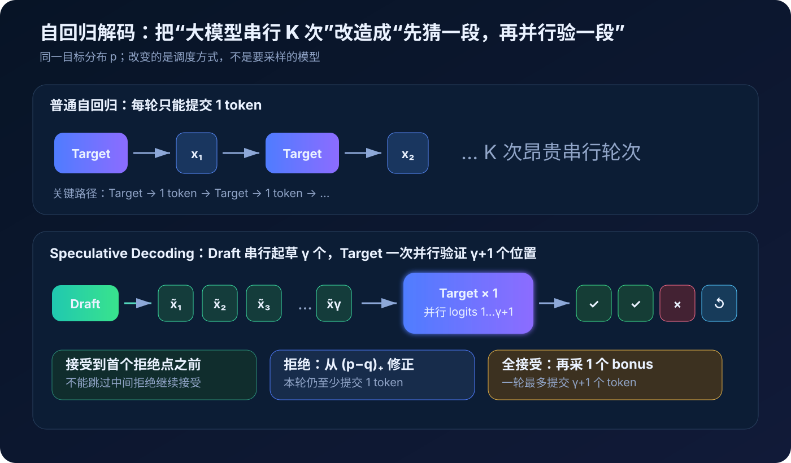
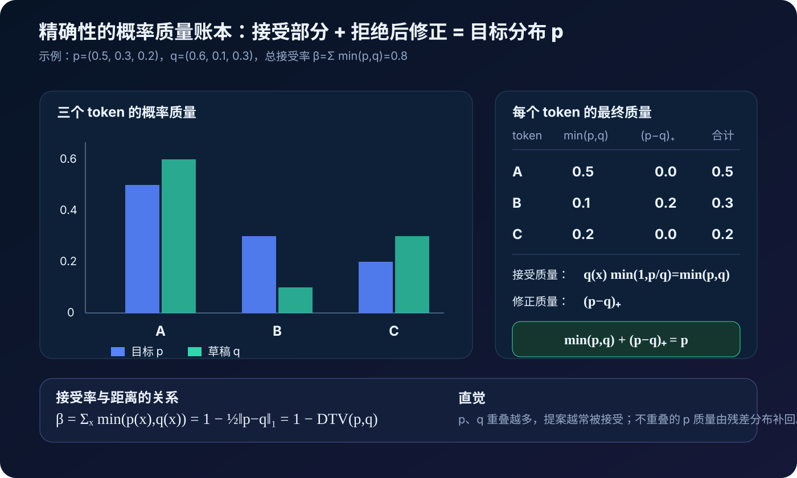
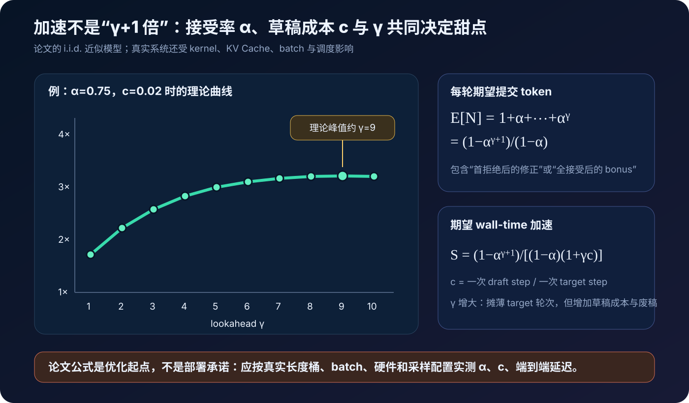
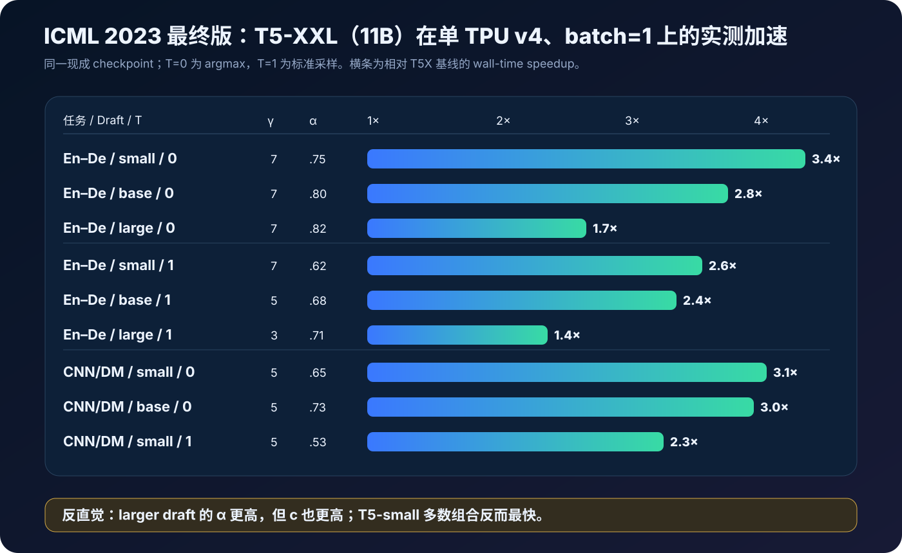
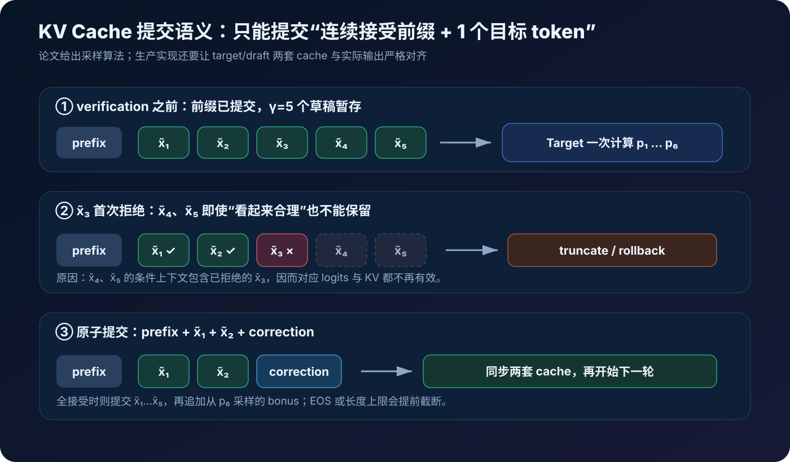
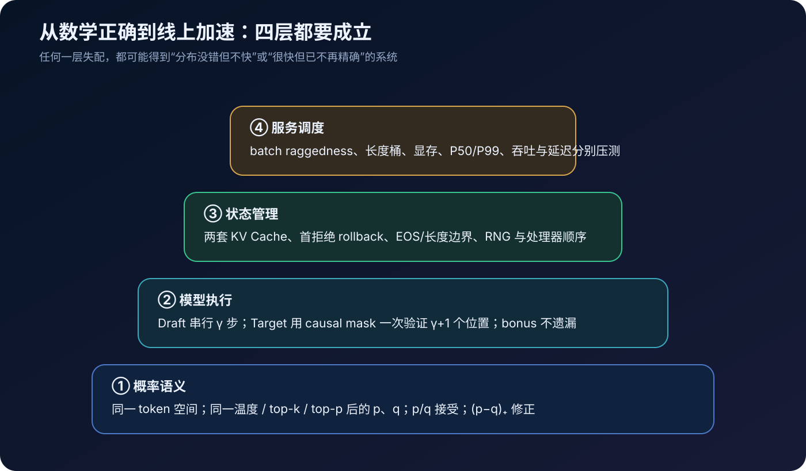

# Speculative Decoding 原理与实现：小模型起草，大模型一次验证多个 Token

> **论文**：[Fast Inference from Transformers via Speculative Decoding](https://arxiv.org/abs/2211.17192) 
> **会议**：[ICML 2023 / PMLR 202](https://proceedings.mlr.press/v202/leviathan23a.html) 
> **作者**：Yaniv Leviathan、Matan Kalman、Yossi Matias 
> **时间**：2022 年 11 月首次公开；本文以 ICML 2023 最终版为准 
> **关键词**：Speculative Decoding、Speculative Sampling、Exact Sampling、Draft Model、Target Model、Acceptance Rate、Memory Bandwidth、Autoregressive Inference 
> **配套代码**：[speculative_decoding_minimal.py](./code/speculative_decoding_minimal.py) 
> **前置阅读**：[Transformer 原理](00_Transformer_2017_原理.md) · [GPT-3 原理](05_GPT3_2020_原理.md) · [FlashAttention 原理](14_FlashAttention_2022_原理.md)

自回归语言模型有一个难以绕开的串行依赖：第 $t+1$ 个 token 的概率分布依赖已经生成的第 $t$ 个 token。

$$
x_t\sim p(x_t\mid x_{<t}).
$$

因此，要从一个大模型生成 $K$ 个 token，朴素解码至少要进行 $K$ 次依次相连的大模型前向计算：

~~~text
prefix → Target → x₁ → Target → x₂ → Target → x₃ → …
~~~

KV Cache 避免了重复计算历史 token，却没有打破这条时间依赖链。尤其在 batch 很小的 decode 阶段，每一步通常要从高带宽显存搬运近乎整份模型权重，却只做一个或少数 token 的矩阵—向量计算，硬件算力未必被充分利用。

Speculative Decoding 的洞见是：

> 既然一次大模型计算的延迟常由权重搬运而不是纯 FLOPs 主导，能否让一个便宜模型先连续猜若干 token，再让大模型在一次前向中同时检查整段猜测？

答案是可以，而且在随机采样下不需要牺牲目标分布。

算法让快速近似模型 $M_q$ 串行提出 $\gamma$ 个 token，再让目标模型 $M_p$ 用 causal mask 一次计算 $\gamma+1$ 个位置的 logits。猜对的前缀被接受；遇到第一个拒绝点时，不是简单地“让大模型重采一次”，而是从：

$$
p'(x)=\operatorname{norm}\bigl(\max(0,p(x)-q(x))\bigr)
$$

采一个修正 token。正是这一步，使最终样本仍严格服从目标模型 $p$。

论文在单张 TPU v4、batch size 1 上，用 T5-small / base / large 为 T5-XXL（11B）起草，在翻译与摘要任务上报告了约 $2\times$–$3\times$ 的常见加速，最好组合达到 $3.4\times$。模型架构和训练过程都不需要改变。

---

## 0. 先给结论

读完本文，至少应记住下面二十四点：

1. **Speculative Decoding 优化的是自回归 decode 的串行关键路径。** Prefill 不是论文的主要加速对象。
2. **它需要一个目标模型 $M_p$ 和一个更便宜的草稿模型 $M_q$。** 最终要保持的是 $M_p$ 的输出分布。
3. **Draft 串行生成 $\gamma$ 个提案。** Target 随后一次并行验证 $\gamma+1$ 个位置。
4. **并行验证不违反因果性。** 草稿 token 已经给出，causal Transformer 可以像 teacher forcing 一样同时计算各位置 logits。
5. **随机采样时不能只比较 argmax。** 原论文用 $\min(1,p(x)/q(x))$ 决定是否接受草稿 token。
6. **只接受第一个拒绝点之前的连续前缀。** 拒绝后的草稿依赖错误上下文，必须作废。
7. **拒绝后从 $\operatorname{norm}((p-q)_+)$ 采样。** 直接从 $p$ 重采会重复计算两者重叠的概率质量，从而改变分布。
8. **全接受时还有一个 bonus token。** 它来自目标模型已经算出的第 $\gamma+1$ 个分布。
9. **每轮至少提交 1 个、最多提交 $\gamma+1$ 个 token。** 因而目标模型串行轮数不会比逐 token 解码更多。
10. **“精确”指最终联合分布与 target-only 相同。** 随机采样通常不保证同一 seed 得到逐 token 完全相同的序列。
11. **条件接受率 $\beta=\sum_x\min(p(x),q(x))=1-D_{TV}(p,q)$。** 它就是两分布重叠的概率质量。
12. **平均接受率记为 $\alpha=\mathbb E[\beta]$。** 草稿质量越贴近目标，$\alpha$ 通常越高。
13. **在 i.i.d. 近似下，每轮期望提交 $1+\alpha+\cdots+\alpha^\gamma$ 个 token。** 它不是简单的 $\gamma+1$。
14. **加速还取决于草稿成本 $c$。** 理论加速为 $(1-\alpha^{\gamma+1})/[(1-\alpha)(1+\gamma c)]$。
15. **更大的草稿模型不一定更快。** 它可能提高 $\alpha$，却以更高 $c$ 抵消收益。
16. **更大的 $\gamma$ 也不一定更快。** 被拒绝后的剩余提案变成废稿，草稿串行成本还会继续增加。
17. **低延迟不等于低 FLOPs。** 方法用更多并发计算换更短的串行关键路径，算术操作数可能增加。
18. **收益依赖内存带宽与空闲算力。** 若系统本来就是 compute-bound 或满载吞吐优先，收益可能很小。
19. **论文主要实测 batch=1 latency。** 在线大 batch 的 ragged 接受长度、调度和 KV 显存会改变结论。
20. **Target 与 Draft 应共享可比较的 token 空间。** 原始算法的简单形式默认同一词表；跨 tokenizer 需要额外机制。
21. **温度、top-k、top-p 等处理必须进入 p、q 的定义。** 接受率和残差应基于处理后的实际采样分布。
22. **生产实现的难点常在 KV Cache。** 首拒绝后要回滚废稿，并让 target/draft cache 与已提交 token 同步。
23. **量化、FlashAttention 与 Speculative Decoding 是互补维度。** 前两者降低每轮成本，后者减少昂贵模型的串行轮数。
24. **原论文的核心不是“用小模型猜”。** 真正突破是给出随机场景下严格保持目标分布的 speculative sampling。

---

## 1. 论文到底解决了什么

### 1.1 训练并行，不等于生成并行

在训练或 teacher forcing 中，一条完整目标序列已经给定。Transformer 能一次计算所有位置：

$$
p(x_1\mid x_{<1}),\ p(x_2\mid x_{<2}),\ldots,p(x_T\mid x_{<T}).
$$

但自由生成时，$x_t$ 尚未确定，$x_{t+1}$ 的输入也就不存在。即使矩阵乘本身高度并行，token 之间仍然串行。

设生成一个 token 的目标模型延迟为 $T_p$，朴素生成 $K$ 个 token 的关键路径约为：

$$
T_{\text{AR}}\approx K T_p.
$$

这个模型忽略了首轮编译、采样、通信和 cache 管理，却揭示了核心约束：目标模型被调用 $K$ 个串行轮次。

### 1.2 KV Cache 已经做了什么，还缺什么

没有 KV Cache 时，每一步会重复计算全部历史 token 的 K/V。使用 cache 后，新一步只需：

- 计算新 token 的 Q/K/V 和 MLP；
- 从 cache 读取历史 K/V；
- 读取各层权重；
- 追加新 K/V。

这极大降低了重复 FLOPs，却也让 batch=1 decode 更像重复的矩阵—向量乘：权重流量大、每次复用少、算术强度低。

Speculative Decoding 并不取代 KV Cache。它在其上进一步问：

> 一次搬入目标模型权重时，能不能同时验证多个位置，让这次昂贵访问产生多个输出 token？

### 1.3 它优化 latency，未必优化 throughput

要区分三个指标：

| 指标 | 关心什么 | Speculative Decoding 的典型影响 |
|---|---|---|
| 单请求延迟 | 一个请求多久完成 | 小 batch、memory-bound 时常明显下降 |
| 吞吐 | 单位时间服务多少 token / 请求 | 取决于额外 draft/verify 计算和调度 |
| 总算术量 | 实际做了多少 FLOPs | 常增加，不保证下降 |

论文的主要实测设置是 batch size 1，结论首先应解释为 **单请求生成延迟改善**，不能直接外推为高并发服务吞吐同倍数上升。

---

## 2. 两个模型、五个符号

### 2.1 Target 与 Draft

论文记：

- $M_p$：昂贵的目标模型；
- $p(x\mid x_{<t})$：目标模型的下一 token 分布；
- $M_q$：便宜的近似 / 草稿模型；
- $q(x\mid x_{<t})$：草稿模型的下一 token 分布；
- $\gamma$：每轮预先起草的 token 数，即 lookahead length。

本文也会用：

- $\beta$：某一个上下文下的条件接受率；
- $\alpha=\mathbb E[\beta]$：跨生成位置的平均接受率；
- $c$：一次 draft step 相对一次 target step 的 wall-time 成本比；
- $\hat c$：相应的算术操作数比。

注意，$c$ 不是参数量比例。相同参数量比例在不同硬件、并行布局、kernel 与 batch 下会得到不同延迟比例。

### 2.2 p 与 q 是“真正用于采样”的分布

若原始 logits 为 $z_p,z_q$，用户设置 temperature、top-k 或 top-p，则算法中的 $p,q$ 应是处理后的分布：

$$
p=\operatorname{SampleTransform}(z_p),\qquad
q=\operatorname{SampleTransform}(z_q).
$$

例如 temperature $T>0$ 时：

$$
p_i=\frac{\exp(z_{p,i}/T)}{\sum_j\exp(z_{p,j}/T)}.
$$

若 target 按 top-p 后的 $p$ 采样，却在接受率里用未截断 logits 的 softmax，证明对应的就不是实际生成分布。

### 2.3 简单形式为何要求同一 token 空间

接受率要计算同一个 token $x$ 的 $p(x)/q(x)$，残差还要逐 token 计算 $(p(x)-q(x))_+$。因此原始算法直接要求两者的离散事件可一一对应。

最常见做法是：

- Target 与 Draft 使用同一 tokenizer / vocabulary；
- Draft 是同模型家族的更小 checkpoint；
- 所有 logits processor 的顺序和语义保持一致。

后来出现的跨 tokenizer speculative decoding 属于额外扩展，不应倒灌成原论文的默认能力。

---

## 3. 一轮 Speculative Decoding 如何运行

给定已经提交的前缀 $x_{<t}$，一轮包含四步。

### 3.1 Draft：串行提出 γ 个 token

草稿模型自回归运行：

$$
\tilde x_1\sim q_1(x)=q(x\mid x_{<t}),
$$

$$
\tilde x_2\sim q_2(x)=q(x\mid x_{<t},\tilde x_1),
$$

$$
\cdots
$$

$$
\tilde x_\gamma\sim q_\gamma(x)
=q(x\mid x_{<t},\tilde x_{1:\gamma-1}).
$$

这 $\gamma$ 步仍是串行的，但 $M_q$ 应远比 $M_p$ 便宜。

### 3.2 Verify：目标模型一次算 γ+1 个分布

把整段草稿接在 prefix 后输入目标模型：

$$
x_{<t}\oplus(\tilde x_1,\ldots,\tilde x_\gamma).
$$

一次 causal forward 得到：

$$
p_1(x),p_2(x),\ldots,p_{\gamma+1}(x).
$$

其中 $p_i$ 用于检查 $\tilde x_i$，而 $p_{\gamma+1}$ 在全部草稿接受时产生 bonus token。

这里说“一次”指一次目标模型串行轮次 / forward invocation，不是只计算一个位置。目标模型实际计算了 $\gamma+1$ 组 logits，算术量通常比普通一步更大。

### 3.3 Accept：接受连续前缀

为每个草稿位置独立采 $r_i\sim U(0,1)$。从前往后检查：

$$
r_i\le \min\left(1,\frac{p_i(\tilde x_i)}{q_i(\tilde x_i)}\right).
$$

若成立则接受 $\tilde x_i$，否则在该位置停止。假如前三个通过、第四个拒绝，那么第五个无论概率多高都不能接受，因为它是在包含错误 $\tilde x_4$ 的上下文上生成的。

### 3.4 Correct 或 Bonus：总要再提交一个目标 token

若第 $i$ 个提案首次拒绝，从：

$$
p'_i(x)
=\operatorname{norm}\left(\max(0,p_i(x)-q_i(x))\right)
$$

采 correction token，并结束本轮。

若 $\gamma$ 个提案全部接受，则从 $p_{\gamma+1}$ 采一个 bonus token。

因此一轮的输出长度为：

$$
N\in\{1,2,\ldots,\gamma+1\}.
$$

即使第一个提案立刻拒绝，也会提交一个 correction；所以 target serial rounds 不会多于朴素逐 token 解码。

---

## 4. 最关键的证明：为什么分布完全不变

多 token 正确性建立在单 token speculative sampling 上。先固定一个上下文，只考虑两个离散分布 $p(x)$ 和 $q(x)$。

### 4.1 草稿 token 被接受的概率质量

先采：

$$
\tilde x\sim q.
$$

条件接受概率为：

$$
A(\tilde x)=\min\left(1,\frac{p(\tilde x)}{q(\tilde x)}\right).
$$

因此，最终通过“草稿被接受”这条路径输出 $x$ 的概率质量是：

$$
\begin{aligned}
P(\text{accept and output }x)
&=q(x)A(x)\\
&=q(x)\min\left(1,\frac{p(x)}{q(x)}\right)\\
&=\min(p(x),q(x)).
\end{aligned}
$$

也就是说，算法先取走 $p$ 与 $q$ 的重叠部分。

### 4.2 总接受率就是分布重叠

对所有 token 求和：

$$
\beta=\sum_x\min(p(x),q(x)).
$$

又因为：

$$
\sum_x\min(p(x),q(x))
=1-\frac12\sum_x|p(x)-q(x)|,
$$

所以：

$$
\boxed{\beta=1-D_{TV}(p,q)}.
$$

论文把对应距离记为 $D_{LK}$；它在这里就是离散分布的 total variation distance。

这给出了清晰直觉：草稿模型不是必须“答案正确”，而是分布要与目标分布尽量重叠。

### 4.3 拒绝后缺少哪些概率质量

接受路径已经分配了 $\min(p(x),q(x))$。目标分布还缺：

$$
p(x)-\min(p(x),q(x))
=\max(0,p(x)-q(x)).
$$

其总质量为：

$$
\sum_x\max(0,p(x)-q(x))=1-\beta.
$$

所以拒绝发生后，应从归一化残差采样：

$$
p'(x)=\frac{\max(0,p(x)-q(x))}{1-\beta}.
$$

拒绝路径最终输出 $x$ 的无条件概率质量为：

$$
(1-\beta)p'(x)=\max(0,p(x)-q(x)).
$$

两条路径相加：

$$
\begin{aligned}
P(\text{output }x)
&=\min(p(x),q(x))+\max(0,p(x)-q(x))\\
&=p(x).
\end{aligned}
$$

于是得到：

$$
\boxed{x_{\text{speculative}}\sim p.}
$$

### 4.4 一个具体数值例子

令：

$$
p=(0.5,0.3,0.2),\qquad q=(0.6,0.1,0.3).
$$

重叠质量为：

$$
\beta=0.5+0.1+0.2=0.8.
$$

接受路径已经给出：

$$
(0.5,0.1,0.2).
$$

目标还缺：

$$
(p-q)_+=(0,0.2,0).
$$

拒绝后残差分布因此为 $(0,1,0)$。两条路径合起来重新得到 $(0.5,0.3,0.2)$。

### 4.5 为什么拒绝后不能直接从 p 重采

若拒绝时直接从 $p$ 采样，最终质量会是：

$$
\min(p,q)+(1-\beta)p.
$$

第一项已经包含 $p,q$ 的重叠部分，第二项又按整个 $p$ 分配一次，重叠部分被重复计入。除非特殊情况，结果不等于 $p$。

残差分布的作用正是只补“尚未被接受路径覆盖”的目标概率质量。

### 4.6 它不是普通 rejection sampling

经典 rejection sampling 要找全局常数：

$$
M\ge\max_x\frac{p(x)}{q(x)},
$$

并用 $p(x)/(Mq(x))$ 接受。一个极端 token 就可能迫使 $M$ 很大，压低全部 token 的接受率。

Speculative sampling 使用逐 token 的 $\min(1,p/q)$，再以残差分布补足拒绝质量。两者形式相似，但接受率与补偿机制不同。

---

## 5. 从单 token 到完整自回归联合分布

单位置证明还不够。语言模型输出的是序列联合分布：

$$
p(x_{1:T})=\prod_{t=1}^{T}p(x_t\mid x_{<t}).
$$

Speculative Decoding 每次只提交：

- 已通过各自条件分布校验的连续草稿前缀；
- 再加一个来自当前目标条件分布的 correction 或 bonus。

单 token 证明说明，在任意已提交前缀下，下一个提交 token 的条件分布都等于目标模型：

$$
P_{\text{spec}}(x_t\mid x_{<t})=p(x_t\mid x_{<t}).
$$

逐位置应用链式法则：

$$
P_{\text{spec}}(x_{1:T})
=\prod_tP_{\text{spec}}(x_t\mid x_{<t})
=\prod_tp(x_t\mid x_{<t}).
$$

所以完整序列联合分布保持不变。

### 5.1 “相同分布”不等于“同一 seed 的相同序列”

这是最常见的表述陷阱。

Speculative sampler 会额外消耗：

- draft categorical sampling 的随机数；
- 每个位置接受 / 拒绝的 uniform 随机数；
- correction sampling 的随机数。

即使 target-only 与 speculative decoder 使用相同 PRNG seed，随机数消耗顺序也不同，通常不会逐 token 相同。数学保证是：重复实验得到同一联合分布。

若温度为 0、目标解码是确定 argmax，则可以设计成逐 token 输出完全相同；若系统要求随机模式下 bitwise replay，则还需专门设计 RNG stream / coupling，并处理浮点与 kernel 非确定性。

### 5.2 $q(x)=0$ 会不会除零

被检查的 proposal 是从 $q$ 采出来的，因此对该 token 有 $q(\tilde x)>0$。实现仍应防范：

- 浮点 underflow；
- logits processor 把概率错误地清零；
- FP16 softmax 精度；
- target / draft vocabulary mask 不一致。

若 $p=q$，$\beta=1$，不会走拒绝分支，残差分布的 $0/0$ 无需实际求值。

---

## 6. 为什么目标模型能“一次验证多个位置”

### 6.1 草稿把未知未来变成了已知候选

自由生成无法并行，是因为未来 token 未知。Draft 先给出了候选：

$$
(\tilde x_1,\tilde x_2,\ldots,\tilde x_\gamma).
$$

对 Target 而言，这时就像训练中的 teacher forcing：使用 causal mask 后，第 $i$ 个验证位置只看到：

$$
x_{<t}\oplus\tilde x_{<i},
$$

恰好是检查 $\tilde x_i$ 所需的上下文。

### 6.2 一次 forward，不是一次 token 的 FLOPs

普通 decode step 的 query length 通常为 1；verification 的 query length 约为 $\gamma+1$。因此：

- 目标权重有机会一次加载后服务多个位置；
- 矩阵乘形状更大，更容易利用并行硬件；
- attention / MLP 对多个位置都要计算；
- KV Cache 读写和临时内存也会增加。

所以“目标模型调用次数减少”不等于“目标模型计算位置数减少”。Speculative Decoding 的收益建立在硬件并行与内存复用足以覆盖额外位置计算之上。

### 6.3 论文性能模型的关键理想化

理论推导近似认为：一次计算 $\gamma+1$ 个 target 位置的 wall time 与普通一次 target step 相当。这在 memory-bound、小 batch、$\gamma$ 不大时可能接近现实，却不是普遍定律。

当 $\gamma$ 很大、batch 很大或设备已 compute-bound 时，verification 延迟会明显增长，简单公式会过于乐观。

---

## 7. 期望每轮能前进多少 Token

设每个草稿 token 被接受的事件独立同分布，平均接受率为 $\alpha$。这是论文为了可分析性作的近似；真实相邻位置的难度显然相关。

### 7.1 尾和公式推导

一轮至少产生 1 个 token：

$$
P(N\ge1)=1.
$$

若第一个草稿接受，一轮至少产生 2 个：

$$
P(N\ge2)=\alpha.
$$

若前两个都接受：

$$
P(N\ge3)=\alpha^2.
$$

依此类推：

$$
P(N\ge k)=\alpha^{k-1},\qquad1\le k\le\gamma+1.
$$

用非负整数变量的尾和公式：

$$
\begin{aligned}
\mathbb E[N]
&=\sum_{k=1}^{\gamma+1}P(N\ge k)\\
&=1+\alpha+\alpha^2+\cdots+\alpha^\gamma\\
&=\frac{1-\alpha^{\gamma+1}}{1-\alpha}.
\end{aligned}
$$

当 $\alpha\to1$ 时：

$$
\mathbb E[N]\to\gamma+1.
$$

当 $\alpha=0$ 时：

$$
\mathbb E[N]=1.
$$

### 7.2 直观例子

若 $\alpha=0.75,\gamma=7$：

$$
\mathbb E[N]
=\frac{1-0.75^8}{1-0.75}
\approx3.60.
$$

虽然每轮起草 7 个 token，平均只推进约 3.6 个，而不是 8 个。原因是首次拒绝会截断后续提案。

---

## 8. 加速公式：α、c 与 γ 的三角关系

设普通一个 target step 的时间归一化为 1，一次 draft step 的相对时间为 $c$。一轮成本近似为：

$$
T_{\text{round}}=1+\gamma c.
$$

每轮期望产出 $\mathbb E[N]$ 个 token，故相对逐 token target-only 的期望加速：

$$
\boxed{
S(\gamma,\alpha,c)
=\frac{1-\alpha^{\gamma+1}}
{(1-\alpha)(1+\gamma c)}
}.
$$

### 8.1 γ=1 的简单判据

当 $\gamma=1$：

$$
S=\frac{1+\alpha}{1+c}.
$$

只要：

$$
\alpha>c,
$$

这一最小 speculative 配置就有理论收益。因此论文给出结论：若 $\alpha>c$，总能找到某个 $\gamma$ 获得加速。

### 8.2 为什么 γ 存在甜点

增大 $\gamma$ 有三股相反力量：

1. 一次 target verification 最多摊到更多 token，利好；
2. Draft 必须额外串行运行，成本按 $\gamma c$ 增长；
3. 首拒绝后的草稿成为废稿，$\alpha^\gamma$ 很快衰减。

因此正确做法是枚举小整数 $\gamma$，并在真实流量上测量，而不是固定“越大越好”。

### 8.3 更大的 Draft 为什么可能更慢

大 Draft 往往更接近 Target，使 $\alpha$ 上升；但其 $c$ 也会上升。论文实验清楚显示了这一点：T5-large 的接受率最高，却常比 T5-small 慢。

选 Draft 的优化目标不是独立困惑度，也不是参数量，而是：

$$
\max_{M_q,\gamma}
\frac{1-\alpha(M_q)^{\gamma+1}}
{(1-\alpha(M_q))(1+\gamma c(M_q))}.
$$

也就是 **让 Target 少等多少，除以 Draft 自己花多少时间**。

---

## 9. 延迟下降，为何算术量可能上升

### 9.1 用 ĉ 统计操作数

令 $\hat c$ 是一次 Draft step 与一次 Target step 的算术操作数比。论文给出的预期操作数因子为：

$$
\text{OpsFactor}
=\frac{(1-\alpha)(\gamma\hat c+\gamma+1)}
{1-\alpha^{\gamma+1}}.
$$

它可以大于 1。这并不与 wall-time 加速矛盾：

- 普通 decode FLOPs 少，但每步都搬大模型权重；
- speculative verify FLOPs 多，却能提高权重复用与设备占用；
- 最终用更多并发工作换更短串行时间。

### 9.2 论文给出的理论例子

在 $c=\hat c=0$ 的理想草稿下，论文列出：

| $\alpha$ | $\gamma$ | 操作数因子 | 理论加速 |
|---:|---:|---:|---:|
| 0.6 | 2 | 1.53× | 1.96× |
| 0.7 | 3 | 1.58× | 2.53× |
| 0.8 | 2 | 1.23× | 2.44× |
| 0.8 | 5 | 1.63× | 3.69× |
| 0.9 | 2 | 1.11× | 2.71× |
| 0.9 | 10 | 1.60× | 6.86× |

即使草稿免费，Target 仍对草稿段的多个位置做了工作，所以操作数因子不一定为 1。

### 9.3 什么时候它最合适

更可能获益：

- batch 小；
- decode 占端到端时间的大头；
- Target 很大、每步主要受权重带宽或通信限制；
- 设备还有并行计算余量；
- Draft 很便宜且 $\alpha$ 高；
- 输出较长，可以摊薄初始化与首轮开销。

更可能无收益：

- 大 batch 已把矩阵乘跑满；
- verification 让系统从 memory-bound 转为 compute-bound；
- Draft 与 Target 分布差异大；
- 请求很短，setup / cache 同步无法摊薄；
- Draft 带来额外跨设备通信；
- KV Cache 显存限制迫使 batch 缩小。

---

## 10. 零依赖代码：把正确性与性能账分开

配套文件 [speculative_decoding_minimal.py](./code/speculative_decoding_minimal.py) 只依赖 Python 标准库。它不是高性能 Transformer runtime，而是可执行规范，展示四件事：

1. 单 token 接受 / 残差修正；
2. 完整 $\gamma$-token speculative round；
3. 经验分布与 target-only 的 Monte Carlo 比较；
4. Target 串行轮数、计算位置数与 Draft 调用数分别统计。

运行：

~~~bash
python3 papers/to-2026/code/speculative_decoding_minimal.py
~~~

### 10.1 单 token 核心

~~~python
def speculative_sample_once(target, draft, rng):
    proposal = sample_categorical(draft, rng)

    accept_probability = min(
        1.0,
        target.get(proposal, 0.0) / draft[proposal],
    )
    if rng.random() < accept_probability:
        return proposal

    residual = normalize({
        token: max(0.0, target.get(token, 0.0) - draft.get(token, 0.0))
        for token in target.keys() | draft.keys()
    })
    return sample_categorical(residual, rng)
~~~

这里不能把 `residual` 换成 `target`。那会破坏上一节的概率质量账本。

### 10.2 一轮多 token 伪代码

~~~python
draft_tokens = []
q = []

for i in range(gamma):
    q_i = draft_model(prefix + draft_tokens)
    draft_tokens.append(sample(q_i))
    q.append(q_i)

# 教学代码写成列表；真实系统在一次 causal target forward 中完成。
p = [
    target_model(prefix + draft_tokens[:i])
    for i in range(gamma + 1)
]

committed = []
for i, proposal in enumerate(draft_tokens):
    if uniform() < min(1, p[i][proposal] / q[i][proposal]):
        committed.append(proposal)
    else:
        committed.append(sample(norm(max(0, p[i] - q[i]))))
        return committed

# gamma 个草稿全接受
committed.append(sample(p[gamma]))
return committed
~~~

### 10.3 为什么代码同时统计 rounds 与 positions

代码中的：

~~~python
stats.target_rounds += 1
stats.target_positions += gamma + 1
~~~

是刻意设计的。前者近似串行 latency 的关键路径，后者提醒我们验证并不是免费计算。

示例输出中，32 个新 token 可能只需 8 个 Target 串行轮次，但一共验证了 40 个 target positions，还运行了 32 次 Draft。这正是“更少轮次、更多并行工作”的含义。

### 10.4 如何验证“精确”

程序先重建解析概率质量，并断言：

~~~python
accepted_mass + correction_mass == target_mass
~~~

然后做两组 Monte Carlo：

- 10 万次单 token 采样，对比经验频率与 $p$；
- 5 万次长度为 3 的自回归序列，对比 target-only 与 speculative 的完整序列频率。

后者很重要：只比较第一 token 不能验证条件分布链是否实现正确。

不过 Monte Carlo 只能发现明显 bug，不是形式证明。生产测试还应覆盖极端 logits、所有提案接受、首个提案拒绝、EOS、长度截断和 logits processor 组合。

---

## 11. 论文实验：3.4× 是怎样得到的

### 11.1 主实验设置

论文的实际端到端实现聚焦 T5：

| 角色 | 模型 | 参数量 |
|---|---|---:|
| Target | T5-XXL | 11B |
| Draft | T5-small | 77M |
| Draft | T5-base | 250M |
| Draft | T5-large | 800M |

任务为：

- WMT English→German translation；
- CNN/DailyMail summarization。

关键设置：

- 使用现成 checkpoints，不为 speculative decoding 重训；
- 单张 TPU v4；
- batch size 1；
- 与优化后的 T5X 基线比较；
- 测试 temperature 0 的 argmax 和 temperature 1 的标准采样。

### 11.2 完整主结果

| 任务 | Draft | 温度 | $\gamma$ | $\alpha$ | 实测加速 |
|---|---|---:|---:|---:|---:|
| En–De | T5-small | 0 | 7 | 0.75 | **3.4×** |
| En–De | T5-base | 0 | 7 | 0.80 | 2.8× |
| En–De | T5-large | 0 | 7 | 0.82 | 1.7× |
| En–De | T5-small | 1 | 7 | 0.62 | **2.6×** |
| En–De | T5-base | 1 | 5 | 0.68 | 2.4× |
| En–De | T5-large | 1 | 3 | 0.71 | 1.4× |
| CNN/DM | T5-small | 0 | 5 | 0.65 | **3.1×** |
| CNN/DM | T5-base | 0 | 5 | 0.73 | 3.0× |
| CNN/DM | T5-large | 0 | 3 | 0.74 | 2.2× |
| CNN/DM | T5-small | 1 | 5 | 0.53 | **2.3×** |
| CNN/DM | T5-base | 1 | 3 | 0.55 | 2.2× |
| CNN/DM | T5-large | 1 | 3 | 0.56 | 1.7× |

### 11.3 最重要的反直觉结果

以 En–De、temperature 0 为例：

| Draft | $\alpha$ | $c$ | 实测加速 |
|---|---:|---:|---:|
| T5-small | 0.75 | 0.02 | **3.4×** |
| T5-base | 0.80 | 0.04 | 2.8× |
| T5-large | 0.82 | 0.11 | 1.7× |

T5-large 的接受率最高，但草稿成本也最高，最终最慢。这个结果比“达到 3.4×”更有工程价值：

> Draft selection 是系统协同优化问题，不能只看模型质量。

### 11.4 理论预测与实测并不完全相同

论文附录用 profiler 估计 $c$，再比较理论与实测。例如：

| 设置 | 理论 | 实测 |
|---|---:|---:|
| En–De / small / T=0 | 3.2× | 3.4× |
| En–De / base / T=0 | 3.3× | 2.8× |
| En–De / large / T=0 | 2.5× | 1.7× |
| CNN/DM / small / T=0 | 2.4× | 3.1× |
| CNN/DM / large / T=1 | 1.6× | 1.7× |

差异来自实现优化差别，以及“每个位置接受事件 i.i.d.”只是近似。公式适合选初始 $\gamma$，不能替代真实 benchmark。

### 11.5 其他模型的 α 测量

论文只为 T5 实现了完整方法，但还测量了其他模型的 $\alpha$：

| Target | Draft | T=0 $\alpha$ | T=1 $\alpha$ |
|---|---|---:|---:|
| GPT-like 97M | GPT-like 6M | 0.88 | 0.89 |
| LaMDA 137B | LaMDA 100M | 0.61 | 0.57 |
| LaMDA 137B | LaMDA 2B | 0.71 | 0.71 |
| LaMDA 137B | LaMDA 8B | 0.75 | 0.74 |

论文观察到，参数量小约两个数量级的 Draft 常能得到 $0.5$–$0.9$ 的接受率；分布越尖锐，接受率通常越高。

甚至 trivial bigram 在 En–De 上也有 $\alpha=0.20$。若视其 $c\approx0$，理论加速：

$$
\frac{1}{1-0.2}=1.25\times
$$

的上限已不可忽略。这说明 Draft 不一定非得是完整神经网络。

### 11.6 不应怎样解读实验

论文没有证明：

- 所有 LLM、GPU、batch 都能 2–3×；
- T5-small 永远是最佳参数量比例；
- 高吞吐 serving 会同比例加速；
- verification 的成本永远等于普通一个 target step；
- 参数量相差两个数量级就必然有高接受率。

正确表述是：在论文的 memory-bound、小 batch T5 设置中，现成小模型已经足以换来显著 wall-time 改善。

---

## 12. KV Cache：论文公式之外的实现主战场

### 12.1 为什么需要两套 Cache

通常需要：

- Target KV Cache：保存已提交前缀，并暂存 verification 段；
- Draft KV Cache：支持 Draft 连续生成 $\gamma$ 个提案。

两套模型层数、head 数和 hidden size 不同，cache 不能共享内容，只能共享逻辑上的 token 边界。

### 12.2 首拒绝后的 rollback

若 $\tilde x_3$ 首次拒绝：

- $\tilde x_1,\tilde x_2$ 提交；
- $\tilde x_3$ 丢弃，换成 correction；
- $\tilde x_4,\tilde x_5$ 的 token 与 KV 一并作废；
- Draft cache 需要截断并纳入 correction；
- Target cache 只保留与实际提交序列一致的部分。

错误地保留后续 KV 会让下一轮模型条件在“从未真正输出的 token”上，既破坏正确性，也会产生极难定位的偶发漂移。

### 12.3 事务式思维更安全

可以把每轮看成一笔事务：

~~~text
committed prefix
    ↓
stage draft tokens + temporary KV
    ↓
verify and find first rejection
    ↓
atomically commit accepted prefix + correction/bonus
    ↓
truncate everything after commit boundary
~~~

不要在验证完成前把草稿 token 当作正式输出流给客户端，否则拒绝时需要撤回已经发送的数据。

### 12.4 EOS 与 max_new_tokens

边界规则应明确：

- 已接受的草稿 token 若为 EOS，应立即停止，后续草稿无意义；
- correction / bonus 若为 EOS，同样停止；
- 一轮产生的 block 超过 `max_new_tokens` 时，只提交允许长度；
- cache 的最终长度必须与实际返回 token 一致；
- stop strings 若跨 token 边界匹配，还要与流式输出层协调。

---

## 13. Sampling 配置：精确性最容易被“工程小改动”破坏

### 13.1 Temperature

Target 与 Draft 可有不同原始 logits，但必须对各自 logits 应用相同定义的温度变换，然后用得到的 $p,q$ 做接受和残差。

若 temperature $T=0$ 解释为 argmax，分布退化为单点质量。此时算法会接受与 Target argmax 一致的连续草稿前缀，否则由 Target token 修正；这可实现确定性等价。

### 13.2 Top-k 与 Top-p

设处理器 $G$ 把 logits 变成规范化分布。应使用：

$$
p=G(z_p),\qquad q=G(z_q).
$$

然后：

$$
A(x)=\min(1,p(x)/q(x)),qquad
p'=\operatorname{norm}((p-q)_+).
$$

常见错误是：

- Proposal 从 top-p 后的 $q$ 采，但 ratio 使用原始 softmax；
- Target 使用 repetition penalty，Draft 没有；
- 两边 processor 顺序不同；
- residual 在截断前计算，最后又截断一次；
- 一边对 forbidden token 置零，另一边只减一个大常数。

这些都会使实际实现偏离证明。

### 13.3 Repetition penalty 与状态处理器

任何依赖历史 token 的 processor 都必须在相同的已提交 / 暂存上下文上运行。对第 $i$ 个验证位置，processor 应看到：

$$
x_{<t}\oplus\tilde x_{<i},
$$

而不是永远只看提交前缀，也不是看到整段未来草稿。

### 13.4 数值稳定

生产实现通常从 logits 出发，应注意：

- 先用稳定 log-sum-exp 归一化；
- ratio 可在 log space 比较：$\log r\le\log p-\log q$；
- residual 的微小负值 clamp 到 0；
- 用足够精度累加归一化常数；
- residual 总质量接近 0 时，只可能是数值误差或不应进入的分支；
- masking 后必须至少留一个合法 token。

---

## 14. Batched Serving：单请求加速之外的问题

### 14.1 接受长度是 ragged 的

同一个 batch 内，请求 A 可能接受 7 个，B 在第一个就拒绝，C 已遇到 EOS。固定 $\gamma$ 的矩形 tensor 最终产生不规则提交长度。

系统需要决定：

- 每轮是否等待整个 batch；
- 如何 compact 已结束请求；
- 不同接受位置如何写回 paged KV Cache；
- Draft 与 Target 的 batch 是否同步；
- 是否按预测接受率或输出阶段分桶。

### 14.2 延迟与吞吐可能方向不同

在低并发下，设备空闲，额外 verification FLOPs 可用闲置算力吸收，P50 latency 显著下降。

在高并发下，普通 continuous batching 已把 Target 变成高效 GEMM；此时 speculative work 可能：

- 抢占本可服务更多请求的算力；
- 增加两套 cache 的显存压力；
- 减小可容纳 batch；
- 增加调度碎片；
- 改善单请求 latency，却降低 tokens/s per GPU。

因此至少分别报告：

| 类别 | 建议指标 |
|---|---|
| 延迟 | TTFT、TPOT / ITL、E2E、P50/P95/P99 |
| 吞吐 | output tokens/s、requests/s、tokens/s/GPU |
| 接受 | mean acceptance、accepted tokens/round、rejection position histogram |
| 成本 | draft time、verify time、sampling time、cache time |
| 资源 | HBM、KV bytes/request、GPU utilization、通信量 |

### 14.3 Prefill 与 Decode 分开测

Speculative Decoding 主要降低 decode 阶段 target serial rounds。若请求有超长 prompt、只生成几个 token，prefill 可能主导端到端时间，即使 decode 加速 3×，E2E 改善也很小。

阿姆达尔定律给出：若 decode 只占原延迟的比例 $f$，decode 加速 $S_d$，则端到端加速：

$$
S_{E2E}=\frac{1}{(1-f)+f/S_d}.
$$

例如 $f=0.4,S_d=3$：

$$
S_{E2E}\approx1.36\times.
$$

---

## 15. 一套可落地的实现与调参流程

### 15.1 第一步：先做严格 reference implementation

先不追求速度，使用高精度概率和最直白的数据结构实现：

- Target-only sampler；
- 单 token speculative sampler；
- 多 token speculative round；
- EOS / max length；
- 所有 logits processors。

用它作为优化 kernel 的 oracle。

### 15.2 第二步：做概率正确性测试

构造小词表，可精确枚举或大量采样：

- $p=q$：应全部接受；
- $p,q$ 支撑集几乎不相交：应频繁拒绝但仍恢复 $p$；
- $p(x)>q(x)$ 与 $p(x)<q(x)$ 混合；
- 首 token 拒绝；
- 全 $\gamma$ 接受并产生 bonus；
- temperature / top-k / top-p；
- EOS 位于每个可能位置。

比较完整短序列分布，而不只比较 unigram。

### 15.3 第三步：测量 α 与 c

在代表性线上 prompt 上记录：

$$
\hat\alpha
=\frac{\text{accepted draft tokens}}
{\text{actually checked proposals}}.
$$

这里分母应是走到首拒绝前实际检查的 proposals，具体监控定义要保持一致；另可记录每轮接受长度直方图。

测 $c$ 时不要只独立 benchmark Draft：

- 包括 Draft cache 更新；
- 包括跨设备传输；
- 保持真实 batch 和序列长度；
- 区分 steady state 与首轮；
- 同时测 verification 随 $\gamma$ 的延迟，而不是硬假设为常数。

### 15.4 第四步：枚举 γ

用理论公式获得初始候选：

~~~python
best_gamma = max(
    range(1, max_gamma + 1),
    key=lambda g: (1 - alpha ** (g + 1))
                  / ((1 - alpha) * (1 + g * c)),
)
~~~

然后对相邻整数做端到端 A/B。常见候选不必很大，例如 $\{2,3,4,5,7,8\}$。

### 15.5 第五步：考虑动态 γ

固定 $\gamma$ 简单，但不同位置可预测性差异很大：

- 固定格式、常见短语、代码样板可能高接受；
- 专有名词、数字、推理分叉可能低接受；
- 高温采样往往更难预测。

动态策略可依据：

- 最近若干轮接受长度；
- Draft entropy / top-1 margin；
- Target 与 Draft 历史分歧；
- 当前负载与 batch；
- 剩余长度预算。

但动态策略只改变提案长度，不应偷偷修改严格接受规则，否则“精确采样”保证需要重新审视。

### 15.6 第六步：做端到端而非 microbenchmark 验收

最终要在真实：

- prompt 长度分布；
- 输出长度分布；
- sampling 配置；
- 并发度；
- 模型并行布局；
- 服务 SLO；

上比较 target-only。不要用单个高接受 prompt 代替线上流量。

---

## 16. 常见误解与纠正

### 误解 1：小模型 token 与大模型 argmax 一致就接受

这只描述某些 greedy 工程变体。原论文在随机采样下用 $p/q$ 概率接受，并用 $(p-q)_+$ 修正。

### 误解 2：拒绝后直接从 Target 分布采样即可

错。重叠质量已通过接受路径分配，必须只从 Target 相对 Draft 多出的正残差采样。

### 误解 3：精确意味着同 seed 输出完全一样

错。核心保证是分布相同。随机数消耗顺序、浮点和 kernel 都会影响逐 token replay。

### 误解 4：Target 一轮只算一个 token

错。一次 verification 同时算 $\gamma+1$ 个位置；减少的是串行轮数，不一定是 FLOPs。

### 误解 5：理论最大加速就是 γ+1

$\gamma+1$ 只是每轮最大提交数。平均值还要乘连续接受概率，且除以 $1+\gamma c$。

### 误解 6：γ 越大越好

错。草稿成本线性增长，首次拒绝后的提案全部浪费。

### 误解 7：Draft 越大越好

错。论文中 T5-large 接受率更高，却因成本高而比 T5-small 慢。

### 误解 8：Draft 必须重新训练

错。论文主实验使用现成 T5 checkpoints；专门蒸馏只是未来可优化方向。

### 误解 9：Draft 的困惑度越低，部署一定越快

不充分。真正目标是上下文上的接受率—成本折中，还受硬件执行影响。

### 误解 10：方法会降低输出质量

严格算法的输出分布与 Target 相同，理论上没有质量损失。若加入 lenience 或启发式接受，则另当别论。

### 误解 11：Speculative Decoding 主要加速 Prefill

错。它针对生成阶段的 token 串行依赖；prefill 仍需正常计算。

### 误解 12：用了 KV Cache 就不需要 Speculative Decoding

两者解决不同问题。KV Cache 避免重算历史，Speculative Decoding 减少昂贵 target 串行轮数。

### 误解 13：小 batch 结果可直接外推到大 batch

错。大 batch 的算力利用、ragged 接受、KV 显存和调度完全不同。

### 误解 14：Target 和 Draft 可随便用不同 tokenizer

原始逐 token $p/q$ 算法不能直接这样做，因为事件空间无法逐项对齐。

### 误解 15：量化与 Speculative Decoding 二选一

错。量化减少每轮权重流量，Speculative Decoding 减少轮数；它们可以组合，但组合后的 $c$ 和瓶颈要重测。

### 误解 16：论文所有实验都在 137B LaMDA 上实现了加速

错。论文对 LaMDA 和 GPT-like 主要报告经验 $\alpha$；完整 wall-time 实现与主加速表是 T5。

---

## 17. 与相邻技术的关系

### 17.1 与 Knowledge Distillation

蒸馏通常让小模型独立替代大模型，输出质量可能改变。Speculative Decoding 中 Draft 只负责提案，Target 仍负责分布校正。

两者可以组合：专门蒸馏一个 Draft，使其更贴近 Target，从而提高 $\alpha$，但训练成本与 $c$ 仍需权衡。

### 17.2 与 Quantization / GPTQ

GPTQ 降低权重存储与内存流量；Speculative Decoding 降低 Target 串行轮数。组合后可能：

- Target step 更快，使 Draft 相对成本 $c$ 变大；
- memory bottleneck 缓解，verification 额外 FLOPs 更显著；
- 或两者仍互补，得到更低延迟。

因此不能把各自独立加速倍数直接相乘。

### 17.3 与 FlashAttention

FlashAttention 优化 attention 的 IO 和 kernel；Speculative Decoding 改变解码调度。后者的 verification query length 大于 1，可能比普通 decode 更能利用高效 attention kernel，但最终效果取决于序列长度和 runtime。

### 17.4 与 Blockwise Parallel Decoding

论文指出，早期 Blockwise Parallel Decoding 也并行产生多 token，但主要支持 greedy decoding，需要额外训练的定制模型，且重点不是保持一般随机采样的精确分布。

Speculative Decoding 的标志性贡献是把 speculative execution 推到通用 stochastic sampling。

### 17.5 与后来的多头 / 自推测方法

后续方法可能：

- 在 Target 上增加多个预测头；
- 用 Target 的浅层为深层起草；
- 从缓存、n-gram 或检索中提案；
- 构造 token tree，一次验证多分支；
- 动态调整草稿长度。

它们共享“便宜提案 + 昂贵验证”的思想，但训练要求、额外参数、候选结构和精确性条件不同。阅读任何实现时，都应问：

1. 谁产生 proposal？
2. 一轮 proposal 是链还是树？
3. 如何验证？
4. 随机采样是否严格保持 $p$？
5. 额外 cache 与算力多少？

---

## 18. 论文附录中的两个重要边界

### 18.1 Beam Search 不是主算法的免费赠品

论文附录讨论了一种 beam search 扩展：若原 beam width 为 $w$，Draft 用 $u\ge w$ 的 beam 先走 $\gamma$ 步，Target 再并行检查候选；当 Target 的 top-$w$ 包含于 Draft 的 top-$u$ 候选时可接受。

但这会计算更多候选，分析更复杂，论文明确把深入研究留作未来工作。因此主文中的 $\alpha,c,\gamma$ 公式不能原样套到 beam search。

### 18.2 Lenience 会主动放弃精确分布

严格算法使用：

$$
\min(1,p(x)/q(x)).
$$

附录引入 lenience $l\in[0,1]$，把比较中的 $q(x)$ 乘以 $l$，可提高接受率和速度。但 $l<1$ 时输出分布不再严格等于 $p$。

论文给出一个上界：任何 token 的概率不会超过目标概率的 $1/l$ 倍；但它也指出 lenience 可能降低多样性。除该附录外，论文实验采用严格版本。

因此看到更高速度时，应先确认：

- 是否 $l=1$；
- 是否仍用精确 residual；
- 是否使用启发式阈值；
- 是否只报告任务指标近似不变，而非分布相同。

---

## 19. 局限性

### 19.1 需要额外算力余量

方法以并发和更多算术操作换 latency。若设备已满载、无空闲计算资源，可能没有收益，甚至更慢。

### 19.2 两套模型与 Cache 增加系统复杂度

Draft 权重、Draft KV Cache、临时 verification buffer 都占显存。若因此减少 batch 或触发跨设备放置，收益可能反转。

### 19.3 接受率高度依赖工作负载

语言、领域、任务、temperature、重复惩罚、输出阶段都会改变 $p,q$ 的重叠。离线平均 $\alpha$ 可能掩盖长尾拒绝。

### 19.4 理论模型有理想化

论文假设：

- 接受事件近似 i.i.d.；
- $\gamma+1$ 个 Target 位置可在近似一步时间内并行；
- 固定 $c$ 能代表运行成本。

真实系统中的 kernel shape、序列长度、cache、编译、通信和 batch 会违反这些假设。

### 19.5 不直接解决模型权重与 KV 容量

它可能减少单位输出的目标权重访问轮数，却仍需保存 Target、Draft 与两套 cache。若主要问题是模型完全放不下，应优先考虑量化、并行或 offload。

### 19.6 词表与采样栈必须可对齐

原始算法很适合同 tokenizer 的同家族模型。跨 tokenizer、复杂约束解码和状态化 grammar 需要额外证明与实现。

---

## 20. 工程验收清单

### 20.1 正确性

- [ ] Target-only 与 speculative 使用相同 sampling transform。
- [ ] Proposal 接受概率为 $\min(1,p/q)$。
- [ ] 首拒绝后从 $\operatorname{norm}((p-q)_+)$ 采 correction。
- [ ] 只提交首次拒绝前的连续草稿前缀。
- [ ] 全接受时提交 bonus token。
- [ ] EOS、max length、stop condition 覆盖所有位置。
- [ ] Target / Draft vocabulary 与特殊 token 对齐。
- [ ] 短序列联合分布通过统计或枚举校验。
- [ ] greedy 模式与 target-only 逐 token 一致。

### 20.2 Cache 与状态

- [ ] Target 与 Draft cache 的 committed length 一致。
- [ ] 拒绝后的暂存 KV 被 truncate。
- [ ] Correction 被正确同步给 Draft。
- [ ] 流式输出只发送已提交 token。
- [ ] Paged KV block 的引用计数和回收正确。
- [ ] 请求结束时临时 buffers 全部释放。

### 20.3 性能

- [ ] 在真实 prompts 上测 $\alpha$ 和接受长度直方图。
- [ ] 分开计时 Draft、Verify、Sampling、Cache commit。
- [ ] 实测 verification latency 随 $\gamma$ 的曲线。
- [ ] 枚举多个 $\gamma$，不只测一个值。
- [ ] 同时报 P50/P95/P99 latency 与 throughput。
- [ ] 分开报告 prefill、decode 和 E2E。
- [ ] 覆盖不同 batch / 并发度。
- [ ] 统计额外 HBM 与最大可服务 batch。
- [ ] 与相同质量、相同采样配置的 Target-only 比较。

### 20.4 可观测性

- [ ] 每请求 target rounds / output tokens。
- [ ] checked、accepted、discarded proposal 数。
- [ ] 首拒绝位置分布。
- [ ] Draft / Target token disagreement。
- [ ] fallback 到 target-only 的次数与原因。
- [ ] 数值异常、空 residual、cache length mismatch 告警。

---

## 21. FAQ

### Q1：Draft 很差，结果会变差吗？

严格算法不会。Draft 决定接受率和速度，不决定最终目标分布。极差 Draft 会频繁拒绝，使方法接近 target-only，再叠加额外开销。

### Q2：Draft 能比 Target 用更高温度吗？

理论上 $q$ 可以是任意 proposal 分布，只要代码准确知道该 $q$，并用目标实际分布 $p$ 做 ratio 与 residual。但任意改变常会降低重叠、影响速度；工程上最易审计的是一致的 sampling transform。

### Q3：为什么全接受后还要 bonus token？

Target verification 已经计算了草稿段之后的 $p_{\gamma+1}$。从它采样不需要额外 Target round，可把一次验证的产出从 $\gamma$ 提高到 $\gamma+1$。

### Q4：拒绝时为什么本轮仍推进一个 token？

因为 Target 已给出拒绝位置的目标分布，残差修正能立即产生正确 token。即便第一项拒绝，本轮也不会零进展。

### Q5：能否只让 Draft 贪心，而 Target 随机采样？

可以把贪心 Draft 看成退化分布 $q$，严格算法仍可定义，但其支持集只有一个 token，接受行为与残差要按这个 $q$ 正确计算。不能只做“相同就收、不同从 p 采”的随意组合。

### Q6：接受率等于两个模型 token accuracy 吗？

不等于。随机算法的条件接受率是 $\sum\min(p,q)$，考虑完整分布重叠；不是 top-1 一致率。

### Q7：为什么论文里温度 0 常有更高 α？

更尖锐的目标 / 草稿分布通常有更大重叠，且 argmax 一致时可连续接受。论文也观察到 adjusted distribution 越尖锐，$\alpha$ 越高；但 GPT-like 表中的个别结果说明这不是无条件定律。

### Q8：多 GPU Target 还能加速吗？

可以，但要实测。Target 每轮可能受 tensor / pipeline parallel 通信支配，多个验证位置可能提高每次通信的有效工作，也可能增大同步和临时内存。Draft 放在哪张设备同样重要。

### Q9：能和 continuous batching 一起用吗？

可以，但实现复杂。每个请求接受长度不同，需要 ragged commit、batch 重组和两套 cache 调度；单请求理论式不能直接预测整体吞吐。

### Q10：何时应该直接放弃 speculative decoding？

若真实负载上 $\alpha\le c$、verification 随 $\gamma$ 明显变慢、额外 cache 导致 batch 大幅下降，或输出极短，应优先优化 Target kernel、量化或 batching。

---

## 22. 历史位置：它真正改变了什么

在 Speculative Decoding 之前，“猜多个 token 再核验”的直觉已经存在，但往往局限于 greedy decoding、特定复制任务或需要定制训练。

这篇论文的决定性贡献是把问题写成一个概率质量搬运过程：

$$
\underbrace{\min(p,q)}_{\text{草稿接受}}
+
\underbrace{(p-q)_+}_{\text{拒绝修正}}
=p.
$$

有了这个恒等式：

- Proposal 模型原则上可以任意；
- 质量与速度被清晰解耦；
- 目标架构和训练不必改变；
- 推测执行从确定性启发式变成精确随机算法；
- Draft 设计、动态 lookahead、候选树和自推测成为可独立优化的系统模块。

作者团队后来的回顾把它类比为 CPU 的 branch prediction：容易预测的 token 让流水线一次前进多步，困难 token 则由权威模型纠正。这个类比很形象，但 LLM 场景多出一个关键点——分支是随机分布，不只是一条确定指令流；因此必须有 speculative sampling 的接受与残差修正。

论文发表后，独立工作也在 Chinchilla 70B 上报告约 2–2.5× 改善，进一步说明这种思想不局限于 T5。但具体倍数始终属于模型—Draft—硬件—服务栈的联合结果。

---

## 23. 一页总结

### 23.1 问题

朴素自回归生成 $K$ 个 token 需要 $K$ 次昂贵 Target 串行轮次。

### 23.2 一轮流程

~~~text
Draft 串行提出 γ 个 token
        ↓
Target 一次并行计算 γ+1 个位置
        ↓
按 min(1, p/q) 接受连续前缀
        ↓
首拒绝：采 norm((p-q)₊) correction
全接受：从 p_{γ+1} 采 bonus
~~~

### 23.3 精确性

$$
q(x)\min(1,p(x)/q(x))=\min(p(x),q(x)),
$$

$$
\min(p,q)+(p-q)_+=p.
$$

### 23.4 接受率

$$
\beta=\sum_x\min(p(x),q(x))=1-D_{TV}(p,q).
$$

### 23.5 期望产出

$$
\mathbb E[N]=1+\alpha+\cdots+\alpha^\gamma
=\frac{1-\alpha^{\gamma+1}}{1-\alpha}.
$$

### 23.6 理论加速

$$
S=\frac{1-\alpha^{\gamma+1}}
{(1-\alpha)(1+\gamma c)}.
$$

### 23.7 最重要的边界

- 精确的是目标分布，不默认保证同 seed 同序列；
- 减少的是 Target 串行轮数，不保证减少 FLOPs；
- 论文主结果是单 TPU v4、batch=1 的 T5 latency；
- Draft 越大和 $\gamma$ 越大都不必然越快；
- Sampling transform、残差与 KV rollback 是正确性的一部分；
- 上线前要分别评估 latency、throughput、显存与长尾。

如果只留一句话：

> **Speculative Decoding 让便宜模型先写一段“草稿”，让昂贵目标模型一次并行审阅；它以 $p/q$ 接受重叠概率质量，再用 $(p-q)_+$ 补回拒绝后的缺口，从而在不改变目标分布的前提下，用更多并发工作换更少的目标模型串行轮次。**

---

## 24. 参考资料

1. Leviathan, Y., Kalman, M., & Matias, Y. [Fast Inference from Transformers via Speculative Decoding](https://proceedings.mlr.press/v202/leviathan23a.html), ICML 2023.
2. Leviathan, Y., Kalman, M., & Matias, Y. [arXiv:2211.17192](https://arxiv.org/abs/2211.17192), first submitted in 2022.
3. Google Research. [Looking back at speculative decoding](https://research.google/blog/looking-back-at-speculative-decoding/), 2024.
4. Stern, M., Shazeer, N., & Uszkoreit, J. [Blockwise Parallel Decoding for Deep Autoregressive Models](https://proceedings.neurips.cc/paper/2018/hash/c4127b9194fe8562c64dc0f5bf2c93bc-Abstract.html), NeurIPS 2018.
5. Chen, C. et al. [Accelerating Large Language Model Decoding with Speculative Sampling](https://arxiv.org/abs/2302.01318), 2023.
