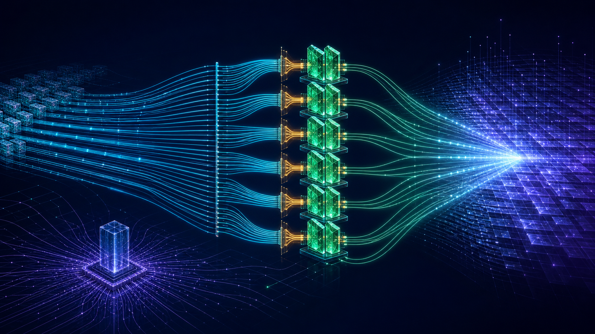
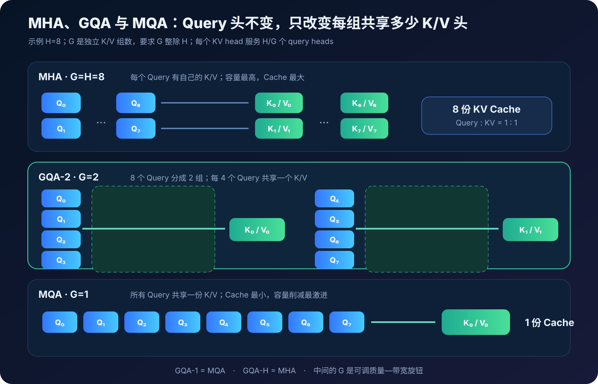
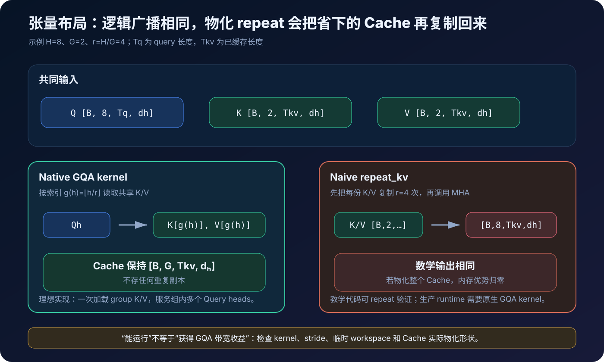
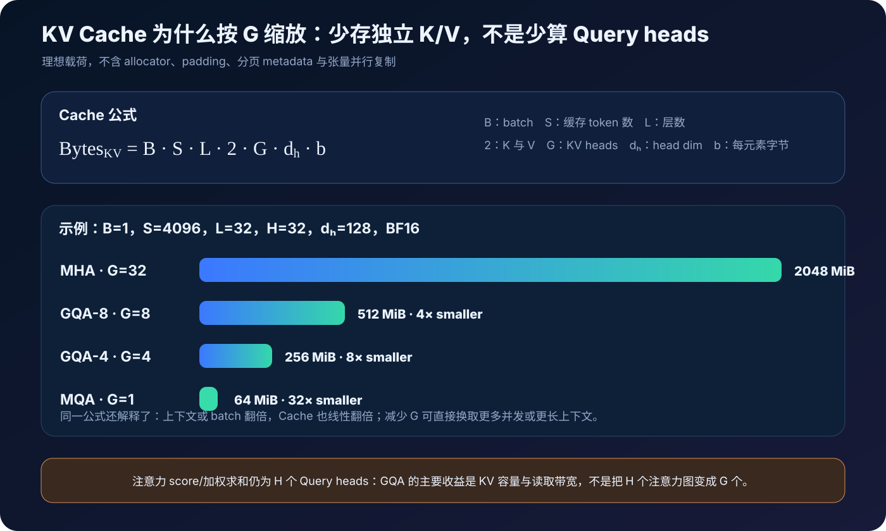
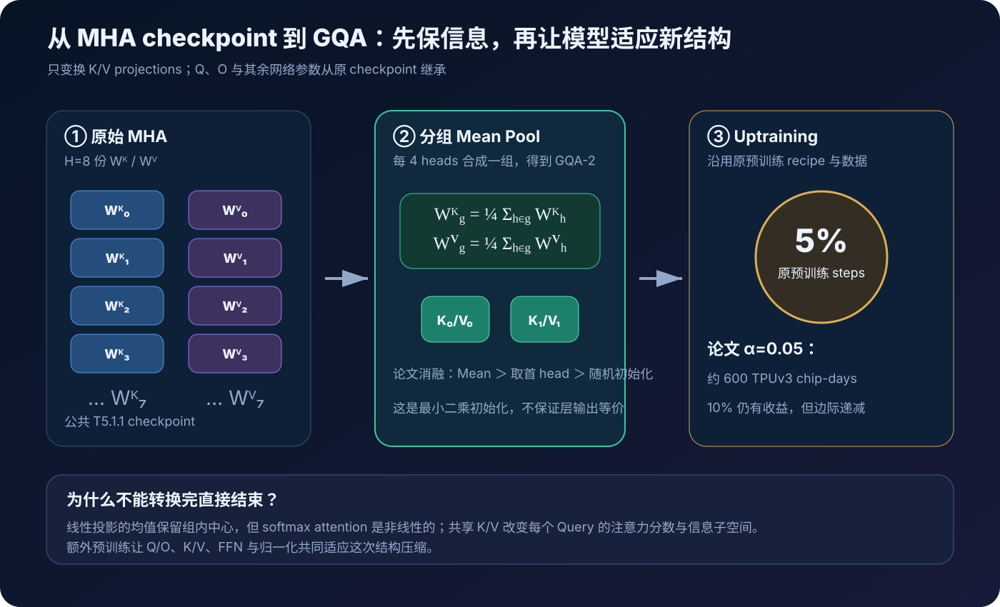
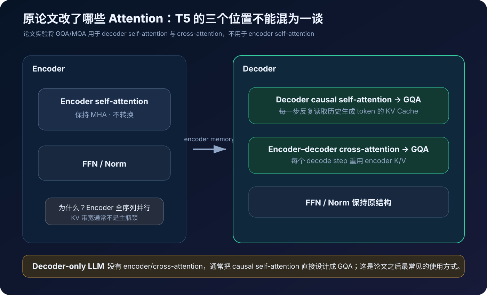
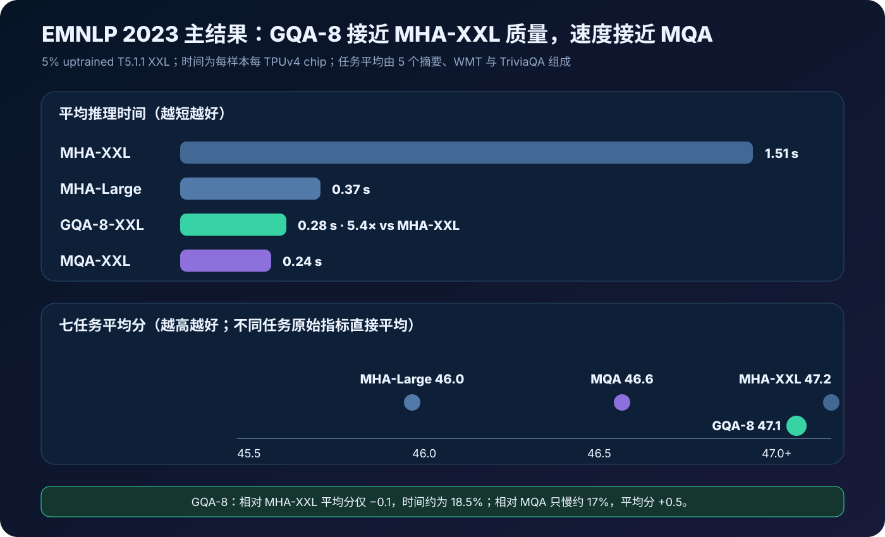
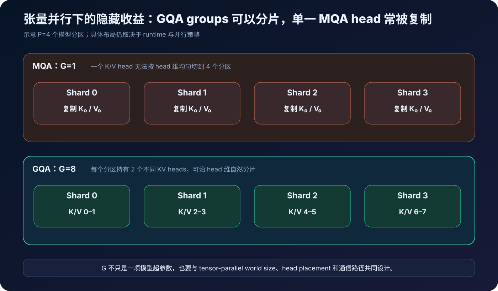

# GQA 原理与实现：在 MHA 质量与 MQA 推理速度之间分组共享 KV

> **论文**：[GQA: Training Generalized Multi-Query Transformer Models from Multi-Head Checkpoints](https://arxiv.org/abs/2305.13245) 
> **会议**：[EMNLP 2023 / ACL Anthology](https://aclanthology.org/2023.emnlp-main.298/) 
> **作者**：Joshua Ainslie、James Lee-Thorp、Michiel de Jong、Yury Zemlyanskiy、Federico Lebron、Sumit Sanghai 
> **时间**：2023 年 5 月首次公开；本文以 2023 年 12 月 EMNLP 最终版为准 
> **关键词**：Grouped-Query Attention、Multi-Query Attention、Multi-Head Attention、KV Cache、Memory Bandwidth、Uptraining、Checkpoint Conversion 
> **配套代码**：[gqa_minimal.py](./code/gqa_minimal.py) 
> **前置阅读**：[Transformer 原理](00_Transformer_2017_原理.md) · [FlashAttention 原理](14_FlashAttention_2022_原理.md) · [Speculative Decoding 原理](43_Speculative_Decoding_2022_原理.md)

标准 Multi-Head Attention（MHA）让每个 attention head 都拥有独立的 Query、Key 和 Value 投影：

$$
Q_h=XW_h^Q,\qquad K_h=XW_h^K,\qquad V_h=XW_h^V.
$$

这给模型带来丰富的表示子空间，却让自回归推理产生一份很大的 KV Cache。若有 $H$ 个 heads、每头维度 $d_h$、缓存长度 $S$，单层单请求仅 K/V 的理想载荷就是：

$$
2SHd_h\times \text{bytes-per-element}.
$$

生成下一个 token 时，模型必须反复读取历史 K/V。上下文、batch 或 beam 变大后，Cache 容量与带宽迅速成为部署约束。

2019 年的 Multi-Query Attention（MQA）采取最激进的办法：保留 $H$ 个独立 Query heads，却让它们共享唯一一组 Key/Value：

$$
K=XW^K,\qquad V=XW^V.
$$

KV Cache 因而可缩小约 $H$ 倍，但只保留一个 K/V 表示子空间可能损害质量；单个 KV head 在多设备张量并行中还经常不得不复制。

GQA 提供了中间旋钮。把 $H$ 个 Query heads 划为 $G$ 组，每组共享一份 K/V：

$$
1\le G\le H,\qquad G\mid H.
$$

于是：

$$
\boxed{\text{GQA-1}=\text{MQA},\qquad \text{GQA-H}=\text{MHA}.}
$$

实验中的 GQA-8 把 T5.1.1-XXL 的 64 个 Query heads 配成 8 个 K/V heads：Cache 相对 MHA 理想缩小 8 倍，又保留了 8 个不同的 K/V 子空间。

论文的第二个贡献同样重要：已有 MHA checkpoint 不必废弃。先把每组 $W^K,W^V$ 做 mean pooling，再沿原始预训练配方追加 5% steps，便可把现有模型 **uptrain** 成 MQA 或 GQA。

最终，5% uptrained GQA-8-XXL 在七项任务上的平均分为 47.1，几乎追平 MHA-XXL 的 47.2；平均推理时间从 1.51 秒降至 0.28 秒，接近 MQA 的 0.24 秒。

---

## 0. 先给结论

读完本文，至少应记住下面二十四点：

1. **GQA 保留多个 Query heads，只减少独立 K/V heads。** 它不是把整个 attention head 数从 $H$ 降到 $G$。
2. **GQA-G 表示 $G$ 个 K/V groups。** 每个 KV head 服务 $H/G$ 个 Query heads。
3. **GQA 是 MQA 与 MHA 的统一形式。** $G=1$ 是 MQA，$G=H$ 是 MHA。
4. **主要收益来自 KV Cache 容量和读取带宽。** Query 投影、Query heads 与相应注意力图仍然存在。
5. **理想 KV Cache 相对 MHA 缩小 $H/G$ 倍。** 该倍率不包含 padding、allocator、分页元数据和并行复制。
6. **GQA 不改变全局注意力的时间复杂度阶。** 每个 Query head 仍需与缓存 token 做点积和 Value 聚合。
7. **更少的 K/V heads 也减少 K/V 投影参数和计算。** 但 Q/O 与 FFN 不变，所以整模参数缩减通常远小于 Cache 缩减倍率。
8. **原论文的第一项贡献是 uptraining。** 它把已有 MHA checkpoint 转换后继续少量预训练，而不是要求从头训练。
9. **转换只 mean-pool K/V projection heads。** Q、O 和其余网络参数从原 checkpoint 继承。
10. **Mean pooling 是组内 Frobenius 距离的最小二乘中心。** 论文消融中它优于取第一个 head和随机初始化。
11. **Mean pooling 不保证转换前后输出相等。** Softmax attention 是非线性的，模型仍需适应共享后的 K/V。
12. **论文主设置使用 5% 原预训练 steps。** 对 T5-XXL 仍约耗费 600 TPUv3 chip-days，绝对成本并不小。
13. **从 5% 增到 10% 有边际递减。** 5% 是论文观察到的实用折中，不是普适常数。
14. **GQA-8 是实验选出的中点。** 从 MQA 增到 8 组只增加适度延迟，继续靠近 MHA 后成本上升更快。
15. **论文主实验是 T5.1.1 encoder–decoder。** 不是今天最常见的 decoder-only LLM。
16. **它只改 decoder self-attention 与 cross-attention。** Encoder self-attention 保持 MHA，因为 encoder 表示可并行计算。
17. **GQA-8-XXL 的平均分为 47.1，MHA-XXL 为 47.2。** 但这个平均数混合了 ROUGE、BLEU 和 F1，只是论文内比较指标。
18. **GQA-8-XXL 平均每样本 0.28 秒，MHA-XXL 为 1.51 秒。** 约 $5.4\times$，实验运行在 8 个 TPUv4 上并为各模型单独优化并行。
19. **MQA-XXL 更快到 0.24 秒，但平均分为 46.6。** GQA 用约 17% 的时间增量换来 0.5 分平均质量提升。
20. **论文附录报告 MQA 的训练/微调稳定性问题。** Uptrained GQA 看起来更稳定，但作者没有追究根因。
21. **张量并行是 GQA 的额外优势。** 多个 KV groups 可分到不同 shards，MQA 的单头常被每个分区复制。
22. **生产 kernel 必须原生理解 $H\ne G$。** 若先把 K/V 完整 repeat 到 $H$ heads，数学结果相同，Cache 优势可能被物化复制抵消。
23. **FlashAttention、量化、PagedAttention 与 GQA 是互补优化。** 它们分别改变 IO 调度、元素位宽、内存管理和独立 KV heads 数。
24. **GQA 的本质是结构化容量—带宽折中。** 它不是无损压缩；最终质量需要训练和任务评测确认。

---

## 1. 为什么 KV Cache 会成为瓶颈

### 1.1 自回归推理不能重算全部历史

在第 $t$ 个 decode step，当前 token 的 Query 要与所有历史 token 的 Key 做点积：

$$
a_{t,i}=\frac{q_t^\top k_i}{\sqrt{d_h}},\qquad i\le t.
$$

再用 softmax 权重聚合历史 Value：

$$
o_t=\sum_{i\le t}\operatorname{softmax}(a_t)_i v_i.
$$

如果每一步都重新计算 $k_1,\ldots,k_t$ 与 $v_1,\ldots,v_t$，大量历史投影会被重复。KV Cache 把每个 token 每层的 K/V 保存下来，新一步只追加当前 token 的 K/V。

### 1.2 Cache 避免重算，却引入容量和读取成本

对 MHA：

$$
K,V\in\mathbb R^{B\times H\times S\times d_h}.
$$

每层 Cache 元素数：

$$
N_{KV}^{MHA}=2BSHd_h.
$$

这里的 2 是 K 与 V。模型有 $L$ 层、元素宽度为 $b$ bytes 时：

$$
\boxed{
\operatorname{Bytes}_{KV}^{MHA}
=2BLSHd_hb.
}
$$

它随 batch、缓存长度、层数和 head 数线性增长。

### 1.3 Decode 与 Prefill 的硬件形态不同

Prefill 一次处理许多 prompt tokens，矩阵乘较大，容易提高算力利用率。Decode 通常一次只处理一个新 token：

- Query length 很小；
- 每层要读取权重；
- attention 还要扫描逐渐增长的 KV Cache；
- 小 batch 下算术强度低。

论文把焦点放在加载 K/V 带来的 memory-bandwidth overhead。需要注意，这不是说任何模型、任何上下文下都只受 KV 限制；权重带宽、通信、kernel launch 和采样也可能主导。

### 1.4 长上下文与高并发会放大问题

如果 Cache 已占满显存，即使单请求还能运行，服务也会失去：

- 更大的 continuous batch；
- 更多并发请求；
- 更长上下文；
- 更宽 beam；
- prefix cache 容量；
- 为临时 workspace 留出的余量。

因此 GQA 的价值不只表现为单请求 latency，还可能通过缩小每请求状态，提高可容纳 batch 与总体吞吐。

---

## 2. 从 MHA 到 MQA

### 2.1 MHA 的每头公式

令输入：

$$
X\in\mathbb R^{B\times T\times d_{model}}.
$$

第 $h$ 个 head：

$$
Q_h=XW_h^Q,\qquad
K_h=XW_h^K,\qquad
V_h=XW_h^V,
$$

其中：

$$
W_h^Q,W_h^K,W_h^V\in\mathbb R^{d_{model}\times d_h}.
$$

输出：

$$
O_h=\operatorname{softmax}\left(
\frac{Q_hK_h^\top}{\sqrt{d_h}}
\right)V_h.
$$

所有 heads 拼接后经过 $W^O$：

$$
Y=\operatorname{Concat}(O_0,\ldots,O_{H-1})W^O.
$$

MHA 的关键是：$Q_h,K_h,V_h$ 全都随 $h$ 不同。

### 2.2 MQA 保留多 Query，只共享 K/V

MQA 并不是 single-head attention。它仍有：

$$
Q_h=XW_h^Q,\qquad h=0,\ldots,H-1,
$$

但只计算：

$$
K=XW^K,\qquad V=XW^V.
$$

各 Query head 输出：

$$
O_h=\operatorname{softmax}\left(
\frac{Q_hK^\top}{\sqrt{d_h}}
\right)V.
$$

所以 Query 仍可学习不同注意力模式，但它们观察同一套 Key 坐标与 Value 内容。

### 2.3 MQA 节省什么，又牺牲什么

节省：

- KV Cache 约缩小 $H$ 倍；
- 每步读取的独立 K/V 约缩小 $H$ 倍；
- $W^K,W^V$ 参数和投影计算减少；
- 长输入 cross-attention 的 encoder K/V 更小。

代价：

- 只剩一个 K/V 表示子空间；
- 所有 Query heads 必须共享这份 memory representation；
- 模型容量下降，质量可能退化；
- 单个 KV head 不利于沿 head 维做张量并行。

GQA 正是为了在这两端之间找到中点。

---

## 3. GQA 的数学定义

### 3.1 Head 到 Group 的映射

设：

- Query heads 数为 $H$；
- KV heads / groups 数为 $G$；
- 每组 Query heads 数为：

$$
r=\frac HG.
$$

最常见的连续分组映射：

$$
g(h)=\left\lfloor\frac h r\right\rfloor,
\qquad g(h)\in\{0,\ldots,G-1\}.
$$

第 $h$ 个 Query head 使用第 $g(h)$ 个 K/V head：

$$
\boxed{
O_h=\operatorname{softmax}\left(
\frac{Q_hK_{g(h)}^\top}{\sqrt{d_h}}
\right)V_{g(h)}.
}
$$

### 3.2 三种注意力只是 G 的不同取值

| 类型 | Query heads | KV heads | 每份 KV 服务的 Query | Cache 相对 MHA |
|---|---:|---:|---:|---:|
| MHA | $H$ | $H$ | 1 | $1$ |
| GQA-G | $H$ | $G$ | $H/G$ | $G/H$ |
| MQA | $H$ | 1 | $H$ | $1/H$ |

这也是为什么很多配置文件不再用 `attention_type`，而是只存：

~~~text
num_attention_heads = H
num_key_value_heads = G
~~~

当两者相等就是 MHA；`num_key_value_heads=1` 就是 MQA。

### 3.3 G 必须整除 H 吗

论文的均匀分组要求 $G\mid H$。理论上可以让各组大小不同，但：

- kernel 与 tensor shape 更复杂；
- load balance 更困难；
- checkpoint 转换的分组定义更复杂；
- 论文没有研究非均匀分组。

因此主流实现要求：

$$
H\bmod G=0.
$$

### 3.4 GQA 不是减少注意力图

虽然只有 $G$ 份 K/V，仍有 $H$ 份 Query，因此逻辑 score shape 仍为：

$$
[B,H,T_q,T_{kv}].
$$

每个 $Q_h$ 会产生自己的 logits 与 softmax weights。组内共享的是 K/V 表示，而不是 attention weights。

因此不要写成：

$$
O_g=\operatorname{Attention}(Q_g,K_g,V_g)
$$

然后误以为每组只算一张注意力图。正确理解是同一个 $K_g,V_g$ 被组内 $r$ 个不同 $Q_h$ 分别使用。

---

## 4. 张量形状与 Kernel 实现

### 4.1 推荐的逻辑布局

常见 batch-first 布局：

$$
Q\in\mathbb R^{B\times H\times T_q\times d_h},
$$

$$
K,V\in\mathbb R^{B\times G\times T_{kv}\times d_h}.
$$

为了显式显示 group，可把 Q view 成：

$$
Q\in\mathbb R^{B\times G\times r\times T_q\times d_h}.
$$

于是可以写成：

$$
S_{b,g,r,t,s}
=\sum_dQ_{b,g,r,t,d}K_{b,g,s,d}.
$$

K 的 group 维自然广播到组内 $r$ 个 Query heads。

### 4.2 数学上可 repeat，系统上不应物化

教学代码常这样做：

~~~python
k = repeat_interleave(k, repeats=H // G, dim=head_axis)
v = repeat_interleave(v, repeats=H // G, dim=head_axis)
output = standard_mha(q, k, v)
~~~

如果 `repeat_interleave` 真正分配 $[B,H,T_{kv},d_h]$，刚省下的 Cache 又被复制回来。

更好的 kernel 直接使用 group 索引：

~~~python
q = q.view(B, G, H // G, T_q, d_h)

# K/V 没有 repeat 维：
# q: [B,G,r,Tq,d]
# k: [B,G,Tkv,d]
scores = einsum("bgrtd,bgsd->bgrts", q, k) / sqrt(d_h)
probs = softmax(scores, dim=-1)
out = einsum("bgrts,bgsv->bgrtv", probs, v)
~~~

真实 fused kernel 不一定真的构造 `scores`，但 head/group 映射必须表达相同语义。

### 4.3 Broadcast View 也要检查 Kernel 行为

有的框架通过 `expand` 创建 stride-0 view，没有立刻复制；但下游 kernel 可能：

- 不接受非连续 stride；
- 隐式调用 contiguous；
- 创建临时展开 buffer；
- 退化到慢速路径；
- 对 $H\ne G$ 不支持 fused attention。

所以“Python 层没有显式 copy”不等于端到端没有物化。应从 profiler、workspace 和实际显存验证。

### 4.4 RoPE 与位置编码

现代 decoder-only GQA 常搭配 RoPE。通常：

- RoPE 分别应用于 $H$ 个 Q heads；
- 对 $G$ 个唯一 K heads 应用一次；
- V 不做 RoPE；
- 然后按 group 共享 K/V。

论文的 T5.1.1 使用自身相对位置机制，GQA 核心并不绑定 RoPE。

---

## 5. KV Cache 到底能省多少

GQA Cache：

$$
K,V\in\mathbb R^{B\times L\times G\times S\times d_h}.
$$

理想字节数：

$$
\boxed{
\operatorname{Bytes}_{KV}^{GQA}
=2BLSGd_hb.
}
$$

相对 MHA：

$$
\frac{\operatorname{Bytes}_{KV}^{GQA}}
{\operatorname{Bytes}_{KV}^{MHA}}
=\frac GH.
$$

压缩倍率：

$$
\boxed{\operatorname{Compression}=\frac HG.}
$$

### 5.1 一个 32 头示例

假设：

- $B=1$；
- $S=4096$；
- $L=32$；
- $H=32$；
- $d_h=128$；
- BF16，每元素 2 bytes。

MHA：

$$
2\times1\times4096\times32\times32\times128\times2
=2\ \text{GiB}.
$$

GQA-8：

$$
2\times1\times4096\times32\times8\times128\times2
=512\ \text{MiB}.
$$

MQA：

$$
2\times1\times4096\times32\times1\times128\times2
=64\ \text{MiB}.
$$

### 5.2 为什么实际显存不会恰好按公式

公式只统计 payload。实际还包括：

- block / page 内部碎片；
- 对齐与 padding；
- beam 或 request 复制；
- prefix cache 引用；
- quantization scale / zero point；
- allocator metadata；
- tensor-parallel replication；
- 临时 attention workspace；
- graph capture 固定 buffer。

因此验收应读取 runtime 的实际 KV block 大小，而不是只看模型配置。

### 5.3 Cross-Attention Cache

在 encoder–decoder 中，decoder 每一步都访问 encoder 输出投影成的 K/V。若 encoder 长度为 $S_{enc}$，cross-attention K/V 也可以预计算并缓存。

论文同时把 decoder self-attention 与 cross-attention 转成 GQA，因此既减少增长中的 decoder Cache，也减少固定的 encoder memory K/V。

---

## 6. 参数量与 FLOPs：不会按 H/G 同比下降

### 6.1 Attention 投影参数

忽略 bias：

$$
|W^Q|=d_{model}Hd_h,
$$

$$
|W^K|+|W^V|=2d_{model}Gd_h,
$$

$$
|W^O|=Hd_hd_{model}.
$$

总计：

$$
\boxed{
P_{attn}=2d_{model}d_h(H+G).
}
$$

MHA 为：

$$
P_{MHA}=4d_{model}Hd_h.
$$

GQA 相对 MHA 少：

$$
\Delta P=2d_{model}d_h(H-G).
$$

但 Transformer 的 FFN 常占大量参数，所以整模不会缩小 $H/G$ 倍。

### 6.2 K/V 投影 FLOPs 下降

对每个新 token，K/V 线性投影输出宽度从 $Hd_h$ 降到 $Gd_h$，因此这部分计算与写 Cache 都按 $G/H$ 缩放。

Q 与 O 投影宽度不变。

### 6.3 Attention 核心 FLOPs 仍主要由 H 决定

每个 Query head 对 $S$ 个 Key 做点积，再聚合 Value，粗略为：

$$
\operatorname{FLOPs}_{core}\approx4BSHd_h.
$$

它依赖 $H$，而不是 $G$。共享 K/V 不会让不同 Query heads 的 logits 相同，因此不能少算这些注意力图。

### 6.4 算术强度为何可能提高

同一组 K/V 被 $r=H/G$ 个 Query heads 使用。若 kernel 能在片上或 cache hierarchy 中复用已加载的 K/V，则每个 K/V byte 对应更多计算，算术强度提高。

这正是 GQA 的系统价值：不是简单删掉所有工作，而是让昂贵的 memory state 被更多 Query computation 复用。

---

## 7. 从已有 MHA Checkpoint 转换

论文不只提出结构，还回答了现实问题：已经花巨大成本训练出的 MHA checkpoint 怎么办？

### 7.1 两阶段 Uptraining

~~~text
MHA checkpoint
    ↓ checkpoint conversion
按组 mean-pool Wᴷ/Wⱽ
    ↓
GQA/MQA initialization
    ↓ additional pre-training
沿原 recipe 与数据继续 α 比例 steps
    ↓
Uptrained GQA/MQA checkpoint
~~~

### 7.2 分组 Mean Pooling

第 $g$ 组包含 head 集合 $\mathcal H_g$，大小 $r=H/G$。论文初始化：

$$
\boxed{
\widehat W_g^K
=\frac1r\sum_{h\in\mathcal H_g}W_h^K,
\qquad
\widehat W_g^V
=\frac1r\sum_{h\in\mathcal H_g}W_h^V.
}
$$

若 $G=1$，就是把所有 MHA K/V heads 求平均，得到 MQA。

若 $G=H$，每组只有一个 head，权重完全不变。

### 7.3 为什么均值是合理初始化

希望用一个共享矩阵 $W_g$ 近似组内所有 $W_h$：

$$
\min_{W_g}\sum_{h\in\mathcal H_g}\|W_h-W_g\|_F^2.
$$

求导并令零：

$$
2\sum_h(W_g-W_h)=0,
$$

得到：

$$
W_g=\frac1r\sum_hW_h.
$$

所以 mean pooling 是参数空间平方误差的最优组中心。

### 7.4 线性投影均值也等于投影输出均值

对输入 $X$：

$$
X\widehat W_g
=X\left(\frac1r\sum_hW_h\right)
=\frac1r\sum_hXW_h.
$$

这说明 pooled K/V 是原组 K/V 表示的逐元素均值。

### 7.5 为什么它仍不是函数等价转换

Attention 包含：

$$
\operatorname{softmax}(QK^\top)V.
$$

一般有：

$$
\operatorname{softmax}\left(Q\left(\frac1r\sum_hK_h\right)^\top\right)
\left(\frac1r\sum_hV_h\right)
\ne
\frac1r\sum_h\operatorname{softmax}(QK_h^\top)V_h.
$$

更何况各 head 使用不同 $Q_h$ 和输出投影位置。Mean pooling 只是保信息较好的起点，不是无误差模型压缩。

### 7.6 PyTorch 风格转换代码

假设权重是 output-major `[H*d_h, d_model]`：

~~~python
def mean_pool_kv(weight, num_query_heads, num_kv_heads, head_dim):
    assert num_query_heads % num_kv_heads == 0
    heads_per_group = num_query_heads // num_kv_heads
    d_model = weight.shape[1]

    return (
        weight
        .view(num_kv_heads, heads_per_group, head_dim, d_model)
        .mean(dim=1)
        .reshape(num_kv_heads * head_dim, d_model)
    )

new_state["k_proj.weight"] = mean_pool_kv(old_k, H, G, d_h)
new_state["v_proj.weight"] = mean_pool_kv(old_v, H, G, d_h)
~~~

框架可能把 head 维放在另一轴，或者把 Q/K/V 融成一个大矩阵。转换前必须先核对 checkpoint layout，不能只靠 reshape 猜测。

---

## 8. Uptraining 到底做什么

### 8.1 沿原预训练配方继续训练

论文从公开 T5.1.1 checkpoint 初始化，转换 K/V 后：

- 使用原预训练 setup；
- 使用原预训练 dataset；
- 使用 Adafactor；
- 沿用 T5 超参数与学习率 schedule；
- 再训练原预训练 steps 的 $\alpha$ 比例。

主实验：

$$
\alpha=0.05.
$$

论文报告这约等于 600 TPUv3 chip-days。

### 8.2 5% 不是“微调几分钟”

“只用原训练计算的 5%”是相对量。对于 11B T5-XXL，这仍是数百 chip-days。

Uptraining 的价值是复用剩余 95% 已投入的训练，而不是把转换变成无成本后处理。

### 8.3 为什么还需要原始预训练数据

结构改变影响所有 token 的 attention。若只在狭窄下游数据上修复，可能：

- 过拟合单任务；
- 遗忘通用能力；
- 难以恢复广泛上下文模式；
- 在未见领域发生回归。

论文沿用原预训练 recipe，是为了让整个模型重新协调共享 K/V 表示。

### 8.4 能否只训练 K/V

论文描述的是 converted checkpoint 继续预训练，并未把方法定义为冻结其余参数只调 K/V。结构变化后，允许 Q、O、FFN 等共同适应通常更有表达力。

如果工程上只训练部分参数，那是新的成本—质量变体，需要独立验证。

---

## 9. 原论文到底把 GQA 用在哪里

### 9.1 Decoder Self-Attention

这是 decoder 每生成一个 token 都要读取历史生成 K/V 的位置。Cache 长度随输出增长，是最直观的 GQA 用武之地。

### 9.2 Decoder Cross-Attention

Decoder 每层还会 Query encoder memory。Encoder K/V 可预计算，却会在每个 decode step 反复读取。长输入摘要与问答中，这部分带宽很大。

论文也将其改成 MQA/GQA。

### 9.3 Encoder Self-Attention 保持 MHA

论文明确没有改 encoder self-attention，理由是 encoder 表示能对所有输入 token 并行计算，memory bandwidth 通常不是首要瓶颈。

因此不能把论文结果描述为“把 T5 所有注意力层都改成 GQA”。

### 9.4 后来的 Decoder-Only LLM

Decoder-only 模型没有 encoder 与 cross-attention，只有 causal self-attention。现代 GQA 模型通常从头训练时就令：

~~~text
num_attention_heads = H
num_key_value_heads = G
~~~

作者在 limitations 中指出，他们只实证了 encoder–decoder，并预计 decoder-only 中 GQA 相对 MQA 可能更具优势；这是预期，不是该论文已完成的实验结论。

---

## 10. 实验设置

### 10.1 模型

所有模型基于 T5.1.1，使用 JAX、Flax 与 Flaxformer：

| 模型 | Attention | 作用 |
|---|---|---|
| T5-Large | MHA | 较小 MHA 基线 |
| T5-XXL | MHA | 目标质量基线 |
| T5-XXL | MQA | 从 MHA 5% uptrained |
| T5-XXL | GQA-8 | 从 MHA 5% uptrained |

### 10.2 任务

五个摘要数据集：

- CNN/Daily Mail；
- arXiv；
- PubMed；
- MediaSum；
- Multi-News。

另有：

- WMT 2014 English→German translation；
- TriviaQA question answering。

论文没有评测 GLUE 等分类任务，因为重点是 autoregressive inference。

### 10.3 Fine-Tuning

所有任务使用：

- constant learning rate 0.001；
- batch size 128；
- dropout 0.1；
- 训练至收敛；
- 选择 dev performance 最佳 checkpoint；
- greedy decoding。

长度设置：

| 任务 | Input length | Output length |
|---|---:|---:|
| CNN/DM | 512 | 256 |
| WMT | 512 | 256 |
| 其他摘要 | 2048 | 512 |
| TriviaQA | 2048 | 32 |

### 10.4 Timing

论文使用 xprof 测量每样本每 TPUv4 chip 的时间：

- 共 8 个 TPUs；
- 使用能放下的最大 batch，每 TPU 最多 32；
- 为每个模型分别优化 parallelization。

这保证每个方案尽量发挥硬件，但也意味着时间不是单纯由 $G$ 决定；并行布局差异已经包含在结果中。

---

## 11. 主结果：GQA-8 的 Pareto 位置

完整表格：

| 模型 | 时间 / 样本（s） | 平均 | CNN R1 | arXiv R1 | PubMed R1 | MediaSum R1 | MultiNews R1 | WMT BLEU | TriviaQA F1 |
|---|---:|---:|---:|---:|---:|---:|---:|---:|---:|
| MHA-Large | 0.37 | 46.0 | 42.9 | 44.6 | 46.2 | 35.5 | 46.6 | 27.7 | 78.2 |
| MHA-XXL | 1.51 | **47.2** | **43.8** | **45.6** | 47.5 | **36.4** | 46.9 | 28.4 | **81.9** |
| MQA-XXL | **0.24** | 46.6 | 43.0 | 45.0 | 46.9 | 36.1 | 46.5 | **28.5** | 81.3 |
| GQA-8-XXL | 0.28 | **47.1** | 43.5 | 45.4 | **47.7** | 36.3 | **47.2** | 28.4 | 81.6 |

### 11.1 GQA 与 MHA-XXL

时间加速：

$$
\frac{1.51}{0.28}\approx5.39\times.
$$

平均分差：

$$
47.1-47.2=-0.1.
$$

所以“接近 MHA 质量、接近 MQA 速度”的摘要在这组实验中有清晰数字支持。

### 11.2 GQA 与 MQA

GQA 时间相对 MQA：

$$
\frac{0.28}{0.24}\approx1.17.
$$

即约慢 17%，平均分提高：

$$
47.1-46.6=0.5.
$$

这正是保留多个 K/V 子空间的回报。

### 11.3 GQA 与较小 MHA-Large

GQA-8-XXL 不仅平均分高 1.1，速度还更快：

$$
\frac{0.37}{0.28}\approx1.32\times.
$$

说明扩大模型再压缩 KV heads，可能优于直接使用较小 MHA 模型。

### 11.4 “平均分”不能跨论文泛化

这里把五个 ROUGE-1、一个 BLEU 和一个 F1 直接汇总。它适合比较同一表中的模型，却不是统一量纲的通用质量指标。

还应注意：

- 使用 greedy decoding；
- 都经过各任务 fine-tuning；
- 不是零样本通用 LLM benchmark；
- ROUGE 本身无法完整衡量摘要忠实性与可读性。

---

## 12. 三组消融实验

### 12.1 Checkpoint Conversion

论文比较：

1. **Mean**：组内 K/V heads 求均值；
2. **First**：每组保留第一个 head；
3. **Random**：重新随机初始化 K/V。

结果顺序：

$$
\text{Mean} > \text{First} > \text{Random}.
$$

这与信息保留程度一致。Mean 使用了组内所有 heads，First 丢掉大部分已有子空间，Random 则完全不保留。

### 12.2 Uptraining Proportion

论文测试 $\alpha\in[0,0.1]$：

- 转换后尚未 uptrain 时，GQA 已有相对合理表现；
- MQA 更依赖 uptraining 才变得可用；
- 两者都从 5% 获益；
- 到 10% 仍改善，但边际递减。

这也说明 GQA 比 MQA 的结构变化温和：每组只合并部分 heads，而不是一次合并全部。

### 12.3 Number of Groups

论文在 T5-XXL 上测试：

$$
G\in\{1,4,8,16,32,64\}.
$$

输入长度 2048，输出长度 512。结论：

- 从 MQA 的 1 组增加到 8 组，推理开销只适度上升；
- 越靠近 64 组 MHA，增加 group 的成本越明显；
- 作者选择 8 组作为有利中点。

不能据此得出“任何模型都应选 8”。最佳 $G$ 与：

- $H$；
- tensor-parallel world size；
- head dimension；
- 上下文与 batch；
- kernel；
- 质量敏感度；

共同相关。

---

## 13. 张量并行中的 GQA

### 13.1 MHA 很容易沿 Heads 分片

若 $H=64$、tensor parallel $P=8$，每个 shard 可拥有 8 组 Q/K/V heads。Cache 与投影自然分布。

### 13.2 MQA 的单 K/V Head 无法继续按 Head 切

MQA 只有一个 K/V head。常见实现会把这份 K/V 投影和 Cache 复制到每个模型分区，让本地 Query heads 能独立计算。

这样逻辑 Cache 虽小，物理总量却乘上复制份数；还可能增加写入和同步成本。

### 13.3 GQA 可让 G 与 P 对齐

例如 $G=8,P=8$，每个 shard 拿一个 KV head 和对应 Query group：

- 避免 MQA 单头复制；
- 保持 head-wise partition；
- 本地读取对应 K/V；
- 降低跨 shard 通信需求。

若 $G<P$，仍可能需要复制或使用更复杂的 sequence/batch sharding。若 $G$ 不能被 $P$ 整除，也会出现负载不均。

所以生产架构常同时选择：

$$
(H,G,P,d_h),
$$

而不是先固定模型 $G$，再把并行当作无关实现细节。

---

## 14. 零依赖代码详解

配套 [gqa_minimal.py](./code/gqa_minimal.py) 只依赖 Python 标准库，包含：

- scaled dot-product attention；
- Query head 到 KV group 的映射；
- native GQA；
- 教学用 `repeat_kv_heads`；
- MHA→GQA mean pooling；
- KV Cache 字节公式；
- Attention 投影参数量公式。

运行：

~~~bash
python3 papers/to-2026/code/gqa_minimal.py
~~~

### 14.1 核心 Head 映射

~~~python
def group_for_query(query_head, num_query_heads, num_kv_heads):
    assert num_query_heads % num_kv_heads == 0
    queries_per_kv = num_query_heads // num_kv_heads
    return query_head // queries_per_kv
~~~

### 14.2 Native GQA

~~~python
for query_head, query_sequence in enumerate(queries):
    kv_head = group_for_query(query_head, H, G)
    key_sequence = keys[kv_head]
    value_sequence = values[kv_head]

    for query in query_sequence:
        logits = [dot(query, key) / sqrt(d_h) for key in key_sequence]
        probabilities = softmax(logits)
        output = weighted_sum(probabilities, value_sequence)
~~~

这直接索引 group，没有先复制 K/V。

### 14.3 端点等价测试

程序断言：

~~~python
assert max_abs_diff(gqa_h, mha) == 0.0
assert max_abs_diff(gqa_1, mqa) == 0.0
~~~

这是定义等价，不是说从任意 MHA checkpoint mean-pool 到 MQA 后输出相同。

### 14.4 Native 与 Repeat 等价测试

程序用 $H=8,G=2$ 比较：

~~~text
native:   Q_h attends K_{floor(h/4)}, V_{floor(h/4)}
repeat:   [K_0,K_0,K_0,K_0,K_1,K_1,K_1,K_1]
~~~

最大输出差为 0。这验证了 head mapping；同时代码明确提醒，repeat 只适合作为 oracle，不是高性能实现。

### 14.5 Mean Pooling 测试

代码构造随机 MHA projection，比较：

- 每组 mean-pool 后再展开；
- 每组只选第一个 head 再展开。

组内平方误差满足：

$$
E_{mean}\le E_{first}.
$$

这验证的是参数空间几何，不等价于下游质量保证。

### 14.6 Cache 示例输出

~~~text
layout  H/G  KV cache   attention params
MHA       1   2048.0 MiB     67.11 M
GQA-8     4    512.0 MiB     41.94 M
GQA-4     8    256.0 MiB     37.75 M
MQA      32     64.0 MiB     34.60 M
~~~

这里的 `H/G` 列是每份 K/V 服务多少 Query heads，不是 Cache 压缩后还剩多少比例。

---

## 15. 生产实现中的关键细节

### 15.1 Checkpoint Metadata 必须一致

至少记录：

- `num_attention_heads=H`；
- `num_key_value_heads=G`；
- `head_dim=d_h`；
- Q/K/V weight layout；
- 是否 fused QKV projection；
- group 到 Query head 的顺序；
- tensor-parallel shard 规则；
- 位置编码参数。

如果 runtime 把 `G` 错当成 `H`，常见结果不是立即报错，而是 reshape 成功但 head 对应关系错误。

### 15.2 Fused QKV Projection

MHA 常把 Q/K/V 融成一个输出宽度 $3Hd_h$ 的矩阵。GQA 的宽度变为：

$$
Hd_h+2Gd_h=(H+2G)d_h.
$$

不能再假设三等分。加载 checkpoint、量化 packing 与 tensor parallel 都必须分别知道 Q、K、V 区段。

### 15.3 KV Cache Layout

常见布局包括：

~~~text
[num_blocks, block_size, G, d_h]
[num_blocks, G, block_size, d_h]
[B, G, S, d_h]
~~~

哪一种最快取决于 kernel 如何按 token、head 和向量维访问。GQA 减少 head 维，但不会自动消除 layout transpose。

### 15.4 Prefill 与 Decode 分别 Benchmark

GQA 的目标是 decode KV bandwidth。Prefill 中所有 token 并行，GQA 仍减少 K/V projection 和存储，但速度收益可能不同。

至少分别报告：

| 阶段 | 指标 |
|---|---|
| Prefill | TTFT、prompt tokens/s、峰值显存 |
| Decode | TPOT / ITL、output tokens/s、KV read bandwidth |
| Serving | requests/s、P50/P99、最大并发、Cache 命中 |

### 15.5 Beam Search

Beam 会复制或共享 prefix Cache，并在分叉后产生独立状态。理想 Cache 仍按 $G/H$ 缩小，但实际收益取决于 beam Cache 的 copy-on-write 与 reorder 实现。

### 15.6 KV Quantization

若 Cache 从 BF16 量化到 INT8，元素宽度 $b$ 从 2 降到约 1 byte，再叠加 scale metadata。

GQA 与量化的理想 payload 收益可相乘：

$$
\text{relative bytes}\approx\frac GH\times\frac{b_{quant}}{b_{base}}.
$$

但量化误差和 dequant kernel 成本要独立评估。

---

## 16. 与其他效率技术的关系

### 16.1 GQA vs FlashAttention

| 维度 | GQA | FlashAttention |
|---|---|---|
| 改变什么 | 独立 K/V heads 数 | Attention 计算和 IO 顺序 |
| 是否改变参数结构 | 是 | 否 |
| 是否需训练 | 从头设计或 uptraining | 否 |
| 主要减少 | KV Cache / K/V bandwidth | score/probability HBM IO |
| 数学 attention | 结构改变 | 对给定 Q/K/V 精确等价 |

两者可组合，前提是 fused kernel 原生支持 GQA 的不等 head 数。

### 16.2 GQA vs PagedAttention

GQA 减少每个 token 的 KV payload；PagedAttention 改善 Cache block 的分配、碎片、共享和调度。

一个解决“每页装多少字节”，另一个解决“页如何管理”。

### 16.3 GQA vs Sliding-Window Attention

GQA 将 head 维从 $H$ 压到 $G$；滑窗将缓存 token 维从全部历史 $S$ 限制到窗口 $W$。

理想 Cache：

$$
2BLGWd_hb.
$$

Mistral 7B 把 GQA 与 sliding-window attention 组合，正是同时压 head 维与长度维。

### 16.4 GQA vs Speculative Decoding

GQA 降低每个 Target decode step 的 Cache 成本；Speculative Decoding 减少昂贵 Target 的串行轮数。

组合后 Draft/Target 相对成本、verification shape 与 memory bottleneck 都会改变，不能直接把独立加速倍数相乘。

### 16.5 GQA vs MHA Head Pruning

Head pruning 会减少 Query heads，可能连注意力图和输出宽度都改变。GQA 保留 $H$ 个 Query heads，只共享 K/V。

这解释了 MQA 原论文为何发现：共享 K/V 往往优于直接把 head 数或 K/V 维度整体压小。

---

## 17. 常见误解与纠正

### 误解 1：GQA-8 就是只有 8 个 Attention Heads

错。它是 8 个 KV heads；Query heads 仍可能是 32、64 或其他 $H$。

### 误解 2：一个 Group 只产生一张 Attention Map

错。组内每个 Query head 都有独立 logits 与 softmax，只共享 K/V。

### 误解 3：KV Cache 一定缩小 G 倍

相对 MHA 的缩小倍率是 $H/G$，不是 $G$。

### 误解 4：GQA 会把整个 Attention FLOPs 降到 G/H

错。核心 score 与 Value 聚合仍对 $H$ 个 Query heads 进行；主要节省 K/V 投影、Cache 与带宽。

### 误解 5：GQA 与 MHA 数学完全等价

只有 $G=H$ 时等价。中间 $G$ 改变模型结构与可表达的 K/V 子空间。

### 误解 6：Mean Pooling 后无需训练

错。均值只是在参数空间保信息较好的初始化，attention 非线性会造成输出变化。

### 误解 7：5% Uptraining 是普通下游微调

错。论文沿原预训练 setup 和数据继续预训练，再分别做下游 fine-tuning。

### 误解 8：5% 的绝对成本很小

错。T5-XXL 的 5% 约为 600 TPUv3 chip-days。

### 误解 9：论文把 T5 Encoder 也改成 GQA

错。Encoder self-attention 保持 MHA；改的是 Decoder self- 和 cross-attention。

### 误解 10：论文已经在 Decoder-Only LLM 上证明相同结论

错。作者只在 encoder–decoder 上实证，并把 decoder-only 优势写成预期。

### 误解 11：GQA-8 是所有模型的最佳值

错。它是论文 T5-XXL / TPU 设置的有利折中。

### 误解 12：显式 Repeat K/V 不影响效率

若完整物化，就可能把 Cache 和带宽恢复到 MHA 级别。需要 native kernel 或不物化的广播。

### 误解 13：Cache Payload 缩小 8×，端到端一定加速 8×

错。权重、FFN、通信、采样、kernel 和 prefill 都没有同比例消失。

### 误解 14：MQA 总是比 GQA 更差

不成立。MQA 更小更快，某些模型和任务损失很小；选择取决于质量与系统预算。

### 误解 15：GQA 只影响显存，不影响参数

错。K/V projection matrices 也从 $H$ 份降到 $G$ 份，只是整模参数变化通常没 Cache 倍率那么大。

### 误解 16：用了 GQA 就不需要 Cache 管理

错。分页、碎片、prefix sharing、eviction 和并发调度仍然存在，只是每 token payload 更小。

---

## 18. 论文局限性

### 18.1 质量指标有限

论文自己指出 ROUGE 不能完整衡量长文本摘要。GQA 的质量—速度折中是否正确，不能只凭重叠词指标下定论。

### 18.2 没有 XXL From-Scratch 对照

由于算力有限，论文没有把 uptrained GQA-XXL 与从头训练、预算可比的 GQA-XXL 比较。

所以不能据此证明：

- Uptraining 永远优于 from-scratch；
- 5% 是理论最优；
- Mean pooling 是所有架构最佳转换方法。

### 18.3 只实证 Encoder–Decoder

今天 GQA 最广泛的场景是 decoder-only LLM，但原论文没有在该架构上做主实验。

### 18.4 硬件与并行相关

论文时延来自 TPUv4、8-chip 设置和单独优化的 parallelization。GPU、不同 batch、不同 kernel 与网络拓扑会产生不同 Pareto 曲线。

### 18.5 Appendix 中的稳定性信号

作者从头训练多个 T5-Large MQA：

- 预训练频繁 loss spikes；
- 长输入 fine-tuning 立即发散；
- Uptrained MQA 稳定些但仍方差高；
- Uptrained GQA 看起来稳定。

论文没有继续研究根因，因此不应把它扩张成“MQA 天生无法稳定训练”的普遍定律。

---

## 19. 工程落地清单

### 19.1 模型设计

- [ ] 明确 $H,G,d_h$，验证 $H\bmod G=0$。
- [ ] 用真实硬件共同选择 $G$ 与 tensor-parallel $P$。
- [ ] 明确 decoder self-/cross-/encoder self-attention 哪些采用 GQA。
- [ ] 从头训练还是 checkpoint uptraining，分别制定质量基线。
- [ ] 记录参数量变化，避免错误比较不同容量模型。

### 19.2 Checkpoint 转换

- [ ] 核对 QKV weight axis 和 fused packing 顺序。
- [ ] 按实际 Query 分组 mean-pool K/V。
- [ ] Q/O、FFN、Norm 与 embeddings 原样继承。
- [ ] 转换前后逐 tensor 校验 shape、dtype、shard metadata。
- [ ] 验证 $G=H$ 转换为 identity。
- [ ] 比较 Mean、First 与 Random 基线，确认脚本没有轴错误。

### 19.3 训练

- [ ] 用预训练 loss 监控转换瞬间的跳变。
- [ ] 记录 loss spike、梯度范数与不同 seed 方差。
- [ ] 在 0%、1%、2%、5%、10% 等预算检查边际收益。
- [ ] 对长输入任务单独稳定性测试。
- [ ] Uptraining 后重做下游质量与安全评测。

### 19.4 Runtime

- [ ] Kernel 原生支持 $H\ne G$。
- [ ] Profiler 确认没有物化 `[B,H,S,d_h]` K/V。
- [ ] Cache block 实际 head 维为 $G$。
- [ ] QKV fused projection 能处理不等分区段。
- [ ] RoPE / mask / bias 在 group mapping 后语义正确。
- [ ] Tensor parallel 不发生意外 K/V 复制。
- [ ] Beam reorder 与 prefix sharing 保持正确。

### 19.5 Benchmark

- [ ] 分开测 prefill 与 decode。
- [ ] 覆盖上下文、输出长度、batch、并发度。
- [ ] 同时报 TTFT、TPOT、吞吐、P99 和峰值显存。
- [ ] 记录理论 payload 与 runtime 实际 Cache bytes。
- [ ] 比较 MHA、多个 GQA-G 与 MQA，不只测端点。
- [ ] 使用真实任务而非只测随机 tensor microbenchmark。

---

## 20. FAQ

### Q1：GQA 中 Q 的数量为什么不一起减少

不同 Query heads 仍能从同一 K/V memory 提取不同关系。保留 Query 多样性、只压缩写入/缓存的 K/V，是 MQA/GQA 比直接降 head 数更温和的关键。

### Q2：为什么共享 K/V 能降低读取带宽

同一份 K/V 可被组内多个 Query heads 重用。Native kernel 不必为每个 Query head 从 HBM 读取一套独立 Cache。

### Q3：GQA 会不会改变 Token 之间能否相互注意

不会自动改变 attention mask 或上下文范围。它仍可做全局 causal attention；变化的是 K/V 表示共享。

### Q4：GQA-8 的 8 是每组 8 个 Query 吗

论文命名里 8 是 groups / KV heads 数。每组 Query 数是 $H/8$。T5-XXL 的 $H=64$，所以每组 8 个 Query。

### Q5：从 MHA 转 GQA 时为什么不平均 Q

目标是保留 Query heads 的多样性，只让它们共享较少 K/V。平均 Q 会变成另一种结构压缩，不是 GQA。

### Q6：能否用加权平均代替均值

可以作为后续方法，但权重如何确定、是否稳定、是否提高质量需要额外研究。原论文使用简单均值，并在其消融中表现最好。

### Q7：转换后可不可以只做下游 SFT

可以尝试，但不等于论文 recipe。若要保留通用能力，应比较直接 SFT 与通用 uptraining 后再 SFT 的回归。

### Q8：GQA 适合训练还是只适合推理

结构在训练和推理都存在。训练时可减少 K/V projection 参数与部分激活；论文关注的核心收益是增量推理 Cache 带宽。

### Q9：G 应该怎样选

先筛选能被 $H$ 和并行布局良好支持的候选，再同时测质量、Cache、decode latency 与吞吐。8 是常见值，不是公式推导出的答案。

### Q10：为什么模型越大，GQA 仍比 MQA 有系统优势

论文指出，大模型 head 数增加时，MQA 从 $H$ 份一下压到 1 份越来越激进；GQA 可保持比例式容量下降。多个 groups 还能避免单 KV head 在模型分区间复制。

---

## 21. 历史位置与后续影响

2019 年的 MQA 已说明：自回归解码慢，不只是 FLOPs 问题，还在于反复读取长 K/V memory。

GQA 把这个离散选择：

~~~text
MHA：质量较高，Cache 大
MQA：Cache 最小，容量更激进
~~~

变成连续的架构族：

$$
G\in\{1,\ldots,H\}.
$$

更实际的一步是 uptraining：它让组织不必因为新的推理结构而放弃昂贵 checkpoint。

2023 年随后公开的 Llama 2 大模型采用 8 个 KV projections 的 GQA 变体，并特别讨论其与 8-way tensor parallel 的匹配；Mistral 7B 也明确把 GQA 与 sliding-window attention 组合用于快速推理。GQA 因而很快从一篇结构论文变成现代 LLM 配置中的标准字段：

~~~text
num_attention_heads
num_key_value_heads
~~~

它留下的更一般启示是：

> 模型容量不一定要沿所有轴同步缩放。保留多个“读取视角”Q，同时压缩被重复保存和读取的“记忆表示”K/V，可以得到更好的系统 Pareto 前沿。

---

## 22. 一页总结

### 22.1 定义

$$
r=H/G,\qquad g(h)=\lfloor h/r\rfloor,
$$

$$
O_h=\operatorname{softmax}\left(
Q_hK_{g(h)}^\top/\sqrt{d_h}
\right)V_{g(h)}.
$$

### 22.2 两个端点

$$
\text{GQA-1}=\text{MQA},\qquad
\text{GQA-H}=\text{MHA}.
$$

### 22.3 Cache

$$
\operatorname{Bytes}_{KV}=2BLSGd_hb,
$$

$$
\text{compression vs MHA}=H/G.
$$

### 22.4 Checkpoint Conversion

$$
\widehat W_g^{K/V}
=\frac1{|\mathcal H_g|}
\sum_{h\in\mathcal H_g}W_h^{K/V}.
$$

然后沿原 recipe 做少量 additional pre-training。

### 22.5 论文主结果

~~~text
MHA-XXL:   47.2 average, 1.51 s/sample
MQA-XXL:   46.6 average, 0.24 s/sample
GQA-8-XXL: 47.1 average, 0.28 s/sample
~~~

### 22.6 最重要的边界

- GQA 减少 K/V heads，不减少 Query heads；
- Cache 缩小 $H/G$，核心 attention FLOPs 不同比例下降；
- Mean pooling 不是函数等价，仍需 uptraining；
- 5% 对 XXL 仍约 600 TPUv3 chip-days；
- 原论文实证的是 T5 encoder–decoder；
- 端到端收益依赖 native kernel、并行与真实负载；
- GQA-8 是经验折中，不是普适最优。

如果只留一句话：

> **GQA 保留 $H$ 个独立 Query heads，把它们分成 $G$ 组共享 K/V，使 KV Cache 与读取带宽按 $G/H$ 缩小；再通过组内 mean pooling 和少量 uptraining，把已有 MHA checkpoint 迁移到接近 MHA 质量、接近 MQA 速度的中间点。**

---

## 23. 参考资料

1. Ainslie, J. et al. [GQA: Training Generalized Multi-Query Transformer Models from Multi-Head Checkpoints](https://aclanthology.org/2023.emnlp-main.298/), EMNLP 2023.
2. Ainslie, J. et al. [arXiv:2305.13245](https://arxiv.org/abs/2305.13245), 2023.
3. Shazeer, N. [Fast Transformer Decoding: One Write-Head is All You Need](https://arxiv.org/abs/1911.02150), 2019.
4. Pope, R. et al. [Efficiently Scaling Transformer Inference](https://arxiv.org/abs/2211.05102), 2022.
5. Touvron, H. et al. [Llama 2: Open Foundation and Fine-Tuned Chat Models](https://arxiv.org/abs/2307.09288), 2023.
6. Jiang, A. Q. et al. [Mistral 7B](https://arxiv.org/abs/2310.06825), 2023.
7. Dao, T. et al. [FlashAttention: Fast and Memory-Efficient Exact Attention with IO-Awareness](https://arxiv.org/abs/2205.14135), NeurIPS 2022.
