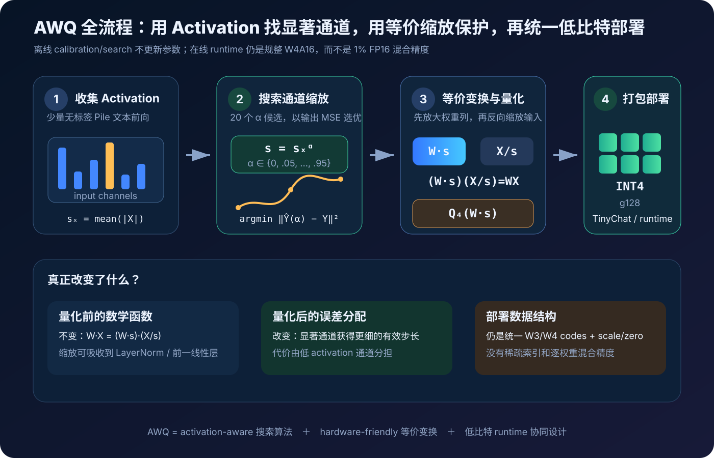
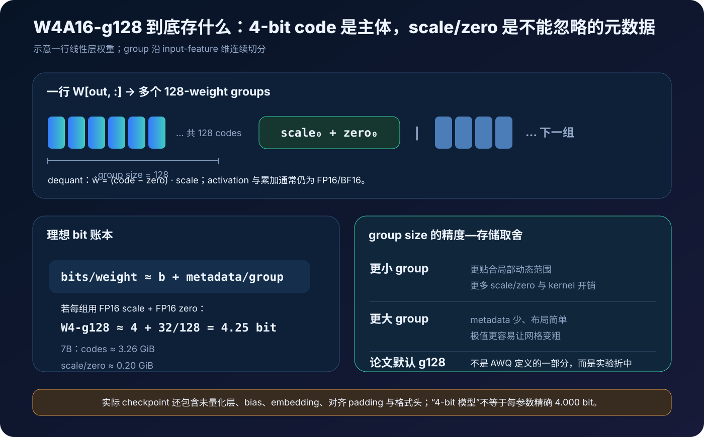
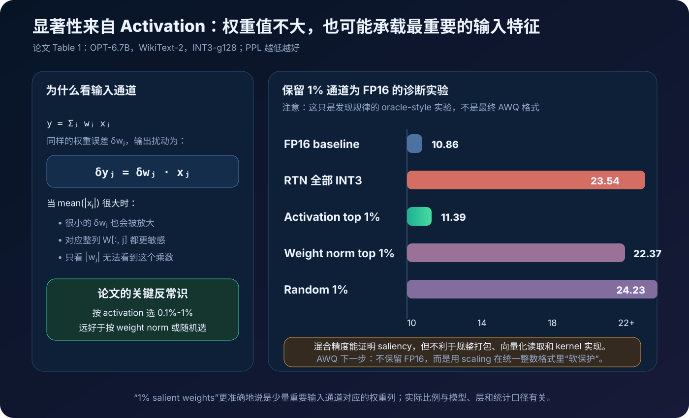
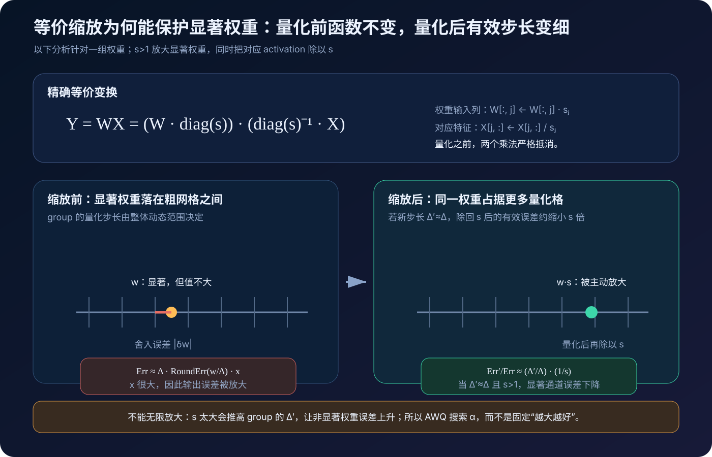
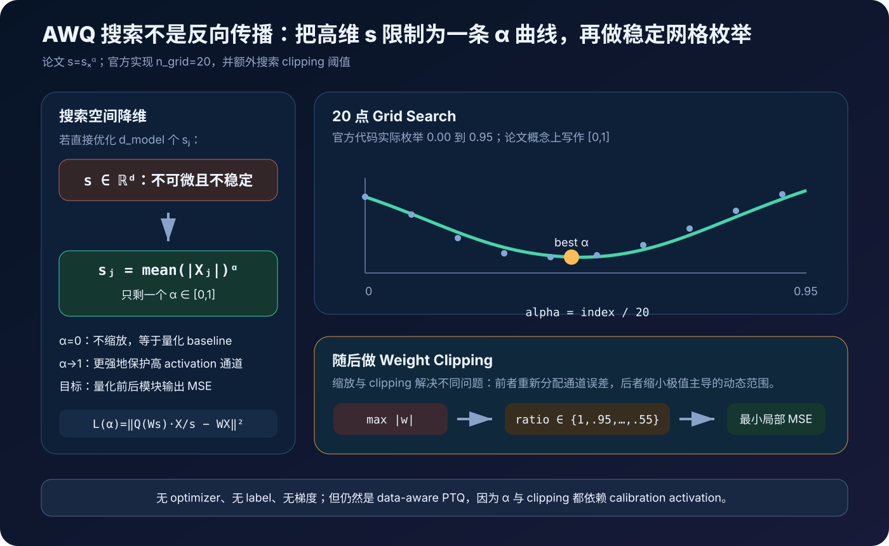
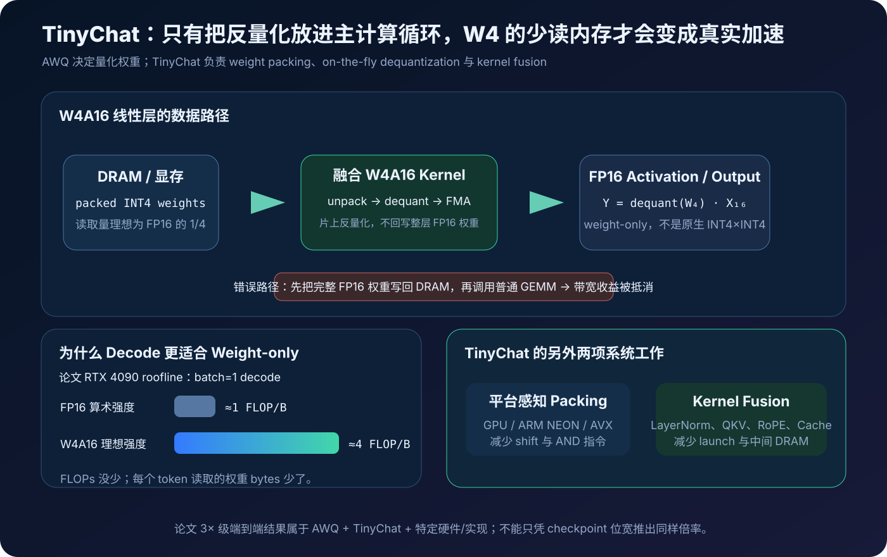
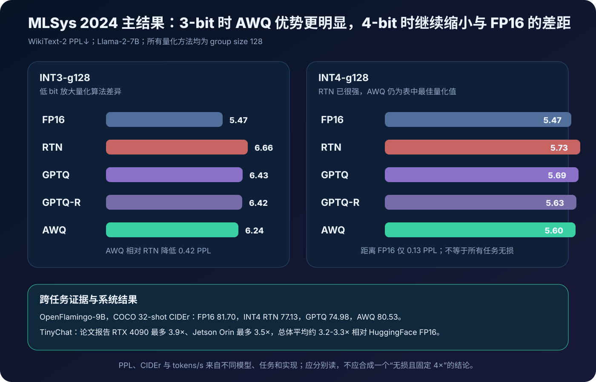
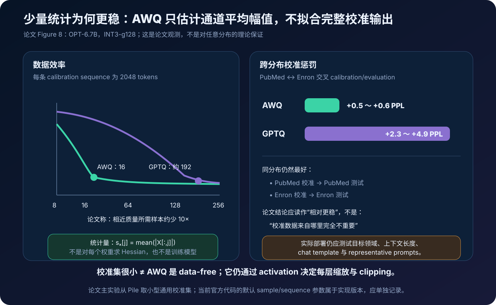

# AWQ 原理与实现：用激活感知缩放保护显著权重，把 LLM 压到 4 bit


> **论文**：[AWQ: Activation-aware Weight Quantization for LLM Compression and Acceleration](https://arxiv.org/abs/2306.00978)<br>
> **会议**：[MLSys 2024 / Proceedings of Machine Learning and Systems 6](https://proceedings.mlsys.org/paper_files/paper/2024/hash/42a452cbafa9dd64e9ba4aa95cc1ef21-Abstract-Conference.html)，Best Paper Award<br>
> **官方代码**：[mit-han-lab/llm-awq](https://github.com/mit-han-lab/llm-awq)<br>
> **作者**：Ji Lin、Jiaming Tang、Haotian Tang、Shang Yang、Wei-Ming Chen、Wei-Chen Wang、Guangxuan Xiao、Xingyu Dang、Chuang Gan、Song Han<br>
> **时间**：2023 年 6 月首次公开；本文以 2024 年 MLSys 正式版为主，后续仓库更新单独标注<br>
> **关键词**：Post-Training Quantization、Weight-only Quantization、Activation-aware Scaling、Salient Channels、Group Quantization、W4A16、TinyChat<br>
> **配套代码**：[awq_minimal.py](./code/awq_minimal.py)<br>
> **前置阅读**：[Transformer 原理](00_Transformer_2017_原理.md) · [GPTQ 原理](42_GPTQ_2022_原理.md) · [QLoRA 原理](24_QLoRA_2023_原理.md) · [GQA 原理](44_GQA_2023_原理.md)

把一个 7B 参数模型的权重从 FP16 改为 4 bit，最理想的原始载荷会从约：

$$
7\times10^9\times 2\ \text{bytes}
\approx 13.04\ \text{GiB}
$$

降为：

$$
7\times10^9\times \frac{4}{8}\ \text{bytes}
\approx 3.26\ \text{GiB}.
$$

问题在于，直接 Round-to-Nearest（RTN）并不总能保住模型质量，特别是到 3 bit 时。一些权重看起来数值不大，舍入后对权重矩阵的欧氏误差也不显眼，却可能让整层输出发生巨大变化。

AWQ 的第一个关键发现是：

> 判断某个权重输入通道是否重要，应该看它所乘的 activation，而不只是看权重本身有多大。

对线性层：

$$
y=Wx,
$$

第 $j$ 个输入通道造成的输出扰动约为：

$$
\delta y_j=\delta W_{:,j}\,x_j.
$$

同样大小的权重误差 $\delta W_{:,j}$，若 $|x_j|$ 大很多，对输出的影响也会大很多。

论文在 OPT 模型上发现，若按 activation 幅值挑出少量显著通道，只保留约 $0.1\%-1\%$ 对应权重为 FP16，3-bit 模型的困惑度会显著恢复；按 weight norm 选或随机选则几乎没有同样效果。

但真正保留不规则的 FP16 权重会产生混合精度、索引和 kernel 分支，硬件并不喜欢。AWQ 因而没有把这个诊断实验直接当成最终方案，而是设计了一个等价变换：

$$
WX
=
(W\operatorname{diag}(s))
(\operatorname{diag}(s)^{-1}X).
$$

它先放大显著输入通道对应的权重列，再反向缩小对应 activation。量化前，两者严格抵消；量化后，被放大的权重在整数网格中拥有更细的**有效分辨率**，量化误差再除回 $s$ 后便会下降。

为了避免保护显著通道时伤害其他通道，AWQ 不固定使用某个倍数，而是令：

$$
s=s_X^\alpha,
\qquad
s_X=\operatorname{mean}(|X|),
$$

在 $\alpha\in[0,1]$ 的小网格上搜索量化后输出误差最小的点，再做 clipping 搜索。整个过程不需要标签、反向传播或 optimizer step。

最终模型仍是规则的 INT3/INT4 group-wise weight-only 格式。论文还配套设计 TinyChat，通过在线反量化、平台感知 weight packing 和 kernel fusion，把理论上的权重缩小转成真实端到端加速。



---

## 0. 先给结论

读完本文，至少应记住下面二十四点：

1. **AWQ 是训练后权重量化。** 它不更新预训练模型参数，也不需要任务标签。
2. **Activation-aware 不等于量化 activation。** Activation 只在离线校准和搜索阶段提供显著性统计；论文部署主体是 W3A16 / W4A16。
3. **权重并非同等重要。** 同样的权重舍入误差，乘上不同幅值的输入特征，会产生不同的输出误差。
4. **论文用输入通道的平均绝对 activation 衡量显著性。** 官方代码对应 `mean(abs(x), token_dims)`。
5. **所谓 1% salient weights，本质上来自少量显著输入通道。** 一个输入通道对应权重矩阵的一列；选择 1% 通道便覆盖约 1% 权重。
6. **保留 1% FP16 是诊断实验，不是最终 AWQ 格式。** 它证明 activation saliency 有效，却会制造硬件不友好的混合精度。
7. **AWQ 用缩放而非高精度例外保护显著权重。** $W_{:,j}$ 乘 $s_j$，相应 $X_j$ 除 $s_j$。
8. **缩放在量化前严格等价。** $WX=(W\operatorname{diag}(s))(\operatorname{diag}(s)^{-1}X)$。
9. **收益只在非线性量化之后出现。** $Q(W\operatorname{diag}(s))$ 不再能把 $s$ 完全约掉，显著通道的误差预算因而改变。
10. **缩放并非越大越好。** 过大的 $s$ 会扩大 group 动态范围，让非显著权重的量化步长变粗。
11. **AWQ 把高维 scale 搜索压到一个 $\alpha$。** $s=s_X^\alpha$，用 $\alpha$ 平衡显著与非显著通道。
12. **论文用网格搜索，而不是梯度下降。** 官方实现以 20 个候选搜索 $\alpha$，无需 STE 或反向传播。
13. **官方代码实际枚举 $0,0.05,\ldots,0.95$。** 论文概念上写 $[0,1]$；实现的 `range(20)` 不包含 1.0。
14. **搜索目标仍是量化前后模块输出 MSE。** “不依赖 reconstruction”应理解为不做 GPTQ 式逐权重回归/补偿，不是完全不比较输出。
15. **AWQ 还包含 clipping。** 缩放负责跨通道分配误差，clipping 负责降低极值主导的 group 动态范围。
16. **论文主体使用 INT3/INT4、group size 128。** g128 是实验折中，不是 AWQ 定义本身。
17. **论文分析用简化的对称量化公式。** 官方仓库的伪量化主体使用带 zero point 的非对称 min-max group quantization。
18. **缩放通常可融合进相邻算子。** 例如 LayerNorm 参数除以 $s$，随后 Q/K/V 输入权重列同时乘 $s$。
19. **最终 checkpoint 不只含 4-bit codes。** 还要保存 scale、zero point、padding，以及可能未量化的层。
20. **4-bit 权重不自动带来 4× 端到端速度。** 必须有能直接消费 packed W4 的专用 kernel。
21. **TinyChat 把反量化融合进矩阵乘主循环。** 若先把完整 FP16 权重写回显存，再调用普通 GEMM，带宽收益会被抵消。
22. **论文优势集中在小 batch、自回归 decode。** 该阶段权重读取占主导；大 batch/prefill 的瓶颈可能不同。
23. **AWQ 与 GPTQ 可以组合。** 论文在极端 INT2 中用 AWQ + GPTQ 继续降低误差，说明二者机制并不互斥。
24. **“更少过拟合校准集”是实验结论，不是绝对保证。** 真实部署仍需用目标领域、上下文长度和任务做回归测试。

---

## 1. 先划清边界：AWQ 是什么，不是什么

### 1.1 它位于模型生命周期的哪个阶段

AWQ 在模型训练完成后执行：

```text
FP16/BF16 checkpoint
        ↓
少量无标签 calibration 文本前向
        ↓
收集逐层 activation 统计
        ↓
搜索 per-channel scale 与 clipping
        ↓
group-wise INT3/INT4 权重
        ↓
专用 W4A16 runtime
```

它不会：

- 更新语言模型 loss；
- 创建参数梯度；
- 跑 optimizer；
- 重新训练 tokenizer；
- 用下游标签监督量化；
- 把整个网络都变成整数计算。

但它也不是 data-free。若完全不运行 calibration 数据，就得不到 $s_X$，也无法搜索 $\alpha$ 和 clipping。

更准确的分类是：

> **activation-aware、label-free、training-free 的 weight-only PTQ。**

### 1.2 W4A16 的含义

W4A16 通常表示：

| 对象 | 典型精度 | 作用 |
|---|---:|---|
| Packed weight codes | INT4 | 减少驻留容量和读取带宽 |
| Weight scale / zero | FP16 或相应 metadata | 在线恢复近似权重 |
| 输入 activation | FP16/BF16 | 与反量化权重相乘 |
| 累加与输出 | FP16/BF16 或实现定义 | 继续流入后续算子 |
| KV Cache | 通常另行配置 | 不由 AWQ 自动量化 |

这里的 A16 不是说 calibration 时不观察 activation，而是说**运行时并未把 activation 主体量化成 INT4**。

### 1.3 AWQ 算法与 TinyChat 系统不要混为一谈

论文有两条相互配合的贡献：

| 层次 | 解决的问题 | 核心手段 |
|---|---|---|
| AWQ | 怎样生成更准确的低比特权重 | activation saliency、per-channel scaling、clipping |
| TinyChat | 怎样让这些权重真的跑得快 | 在线反量化、packing、kernel fusion |

如果只跑 fake quantization，可以验证困惑度，却看不到显存缩小或 tokens/s 提升。

如果只把权重打包成 4 bit，却没有兼容 kernel，框架可能：

- 启动前整层反量化；
- 每次 forward 分配临时 FP16 权重；
- 退回慢速 reference kernel；
- 因格式转换和 launch overhead 反而更慢。

因此“AWQ 模型”同时涉及算法 artifact 与 runtime contract。

### 1.4 2023 预印本、2024 会议版与后续仓库

时间边界值得单列：

| 时间 | 内容 |
|---|---|
| 2023-06 | AWQ 首次在 arXiv 公开 |
| 2023 后续 | TinyChat、更多模型与生态集成逐步加入 |
| 2024 | 正式发表于 MLSys 2024，并获 Best Paper Award |
| 后续仓库 | Llama 3、VILA/NVILA、TinyChat 2.0、更多后端与模型支持 |

本文的算法和主要实验以 MLSys 2024 正式版为准；后续模型列表只用来说明影响，不反写成 2023 年已完成的实验。

---

## 2. 先理解普通 Group-wise RTN

### 2.1 为什么不能只说“把 FP16 转成 INT4”

设一层权重：

$$
W\in\mathbb R^{d_{out}\times d_{in}}.
$$

常见 group-wise weight quantization 沿输入维把每个输出行切成连续 group：

$$
W_{i,:}
=
[g_{i,0},g_{i,1},\ldots],
$$

每个 $g_{i,k}$ 含 $G$ 个权重。论文主要设置 $G=128$。

每个 group 各自拥有量化参数，避免整行的极端值决定所有权重的网格。

### 2.2 论文分析中的简化对称量化

论文为推导缩放效果，写出简化量化器：

$$
Q(w)
=
\Delta\cdot
\operatorname{Round}\left(\frac{w}{\Delta}\right),
$$

$$
\Delta
=
\frac{\max(|\mathbf w|)}{2^{N-1}},
$$

其中 $\mathbf w$ 是一个 group，$N$ 是位宽。

这个公式强调：group 的最大绝对值决定步长 $\Delta$。

### 2.3 官方仓库中的非对称量化

当前官方 `pseudo_quantize_tensor` 使用带 zero point 的 min-max 网格。对 $b$ bit：

$$
q_{min}=0,
\qquad
q_{max}=2^b-1,
$$

$$
\Delta
=
\frac{w_{max}-w_{min}}{q_{max}},
$$

$$
z
=
\operatorname{clip}
\left(
\operatorname{round}\left(-\frac{w_{min}}{\Delta}\right),
q_{min},q_{max}
\right),
$$

$$
\widehat w
=
\left[
\operatorname{clip}
\left(
\operatorname{round}\left(\frac{w}{\Delta}\right)+z,
q_{min},q_{max}
\right)-z
\right]\Delta.
$$

这提醒我们：

> AWQ 主要定义“如何利用 activation 调整量化前的通道尺度”，并不要求所有实现只能使用论文推导里的那一个简化量化器。

### 2.4 Group size 改变了什么

| Group size | 动态范围拟合 | metadata | kernel/布局 |
|---:|---|---|---|
| 小 | 更局部，通常更准 | 更多 | 更复杂 |
| 128 | 论文主折中 | 中等 | 生态常见 |
| 整行 | 最粗 | 最少 | 最简单 |

`g128` 与 `INT4` 是两个维度：

- `INT4` 决定每个 code 的位宽；
- `g128` 决定多少权重共享一组 scale/zero。



---

## 3. 为什么 Weight Magnitude 不是足够的显著性指标

### 3.1 线性层输出误差才是目标

设原权重 $W$、量化权重 $\widehat W$、校准输入 $X$：

$$
Y=WX,
\qquad
\widehat Y=\widehat W X.
$$

输出误差为：

$$
\|Y-\widehat Y\|_F^2
=
\|(W-\widehat W)X\|_F^2.
$$

单看权重误差：

$$
\|W-\widehat W\|_F^2
$$

会忽略输入分布。

### 3.2 单通道扰动

只看输入通道 $j$：

$$
y_j=W_{:,j}x_j.
$$

量化扰动为：

$$
\delta y_j
=
(\widehat W_{:,j}-W_{:,j})x_j.
$$

其平方尺度近似与：

$$
\|\widehat W_{:,j}-W_{:,j}\|_2^2
\cdot
\mathbb E[x_j^2]
$$

成正比。

所以一个权重列本身数值不大，只要相应 $x_j$ 经常很大，仍可能极其重要。

### 3.3 AWQ 使用什么统计量

论文搜索空间使用每个输入通道的平均 activation 幅值：

$$
s_X[j]
=
\frac{1}{N}
\sum_{n=1}^{N}|X_{n,j}|.
$$

当前官方代码对应：

```python
def get_act_scale(x):
    return x.abs().view(-1, x.shape[-1]).mean(0)
```

它把 batch 和 token 维展平，只保留 input-feature 维。

### 3.4 论文的显著通道诊断实验

论文对 INT3-g128 的 OPT 模型做了一个关键实验：

1. 先正常量化所有权重；
2. 选择少量输入通道；
3. 把这些通道对应的权重列保留为 FP16；
4. 比较三种选择策略。

OPT-6.7B 的 WikiText-2 PPL：

| 方法 | PPL ↓ |
|---|---:|
| FP16 | 10.86 |
| 全部 INT3 RTN | 23.54 |
| Activation top 0.1% 保持 FP16 | 11.58 |
| Activation top 1% 保持 FP16 | **11.39** |
| Weight norm top 1% 保持 FP16 | 22.37 |
| Random 1% 保持 FP16 | 24.23 |

这个结果说明：

- 量化误差不是均匀重要；
- activation 统计能够找到高敏感列；
- 只看权重范数与随机选择几乎没有修复该模型；
- 很少的显著通道就足以解释大部分质量退化。

但它没有证明任意模型都恰好只有 1% 显著权重，也没有证明所有任务共享完全相同的显著通道。



---

## 4. 为什么不直接保留 1% FP16

### 4.1 从平均 bit 数看似乎很便宜

若 99% 权重为 4 bit、1% 为 FP16，理想平均位宽：

$$
0.99\times4+0.01\times16
=
4.12\ \text{bit}.
$$

从纯容量看，开销很小。

### 4.2 但硬件读取的是布局，不是平均数

真正执行时需要知道：

- 哪些权重是 INT4；
- 哪些权重是 FP16；
- FP16 例外放在哪里；
- 怎样把两路数据合并；
- 怎样保证访存合并；
- 怎样避免 warp/SIMD 分支；
- 怎样让矩阵乘 kernel 使用这些不规则位置。

若显著权重散布在矩阵中，就可能需要额外 bitmap、index、gather 和两套计算路径。

因此论文把“保留 1% FP16”定位为发现规律的实验，而不是最终硬件格式。

### 4.3 AWQ 的目标

AWQ 想同时满足：

1. 显著通道的量化误差更小；
2. 所有权重仍使用统一 INT3/INT4 表示；
3. 不引入稀疏索引；
4. 不在运行时逐权重判断精度；
5. 能用连续 packed layout 和专用 kernel。

解决办法就是等价通道缩放。

---

## 5. 等价缩放：量化前什么都没变

### 5.1 矩阵形式

令：

$$
s\in\mathbb R_{+}^{d_{in}},
\qquad
S=\operatorname{diag}(s).
$$

则：

$$
WX
=
(WS)(S^{-1}X).
$$

从权重视角：

$$
W'_{:,j}=W_{:,j}s_j.
$$

从 activation 视角：

$$
X'_j=\frac{X_j}{s_j}.
$$

于是：

$$
W'X'
=
\sum_j(W_{:,j}s_j)\frac{X_j}{s_j}
=
WX.
$$

只要 $s_j\ne0$，这是严格的代数恒等式。

### 5.2 量化破坏了齐次抵消

量化后计算变为：

$$
\widehat Y
=
Q(WS)S^{-1}X.
$$

一般来说：

$$
Q(WS)\ne Q(W)S.
$$

因此 $S$ 不再能完全约掉。

这恰恰是 AWQ 利用的自由度：在不改变原始浮点函数的前提下，改变量化误差如何分配给不同输入通道。

### 5.3 单权重误差比值

论文考虑一个显著权重 $w$ 与对应输入 $x$。缩放前：

$$
\operatorname{Err}(Q(w)x)
=
\Delta\cdot
\operatorname{RoundErr}\left(\frac{w}{\Delta}\right)x.
$$

缩放后：

$$
\operatorname{Err}
\left(
Q(ws)\frac{x}{s}
\right)
=
\Delta'\cdot
\operatorname{RoundErr}
\left(
\frac{ws}{\Delta'}
\right)
x\frac{1}{s}.
$$

若缩放单个显著通道没有明显改变 group 最大值，即：

$$
\Delta'\approx\Delta,
$$

那么新旧误差比例近似：

$$
\boxed{
\frac{\operatorname{Err}'}{\operatorname{Err}}
\approx
\frac{\Delta'}{\Delta}\cdot\frac{1}{s}
\approx
\frac{1}{s}.
}
$$

当 $s>1$，显著权重的有效误差下降。

### 5.4 为什么不能无限增大 s

当 $s$ 很大时，被放大的权重可能成为 group 新极值，使：

$$
\Delta'>\Delta.
$$

这会让同一 group 里的非显著权重使用更粗的网格。

论文对 OPT-6.7B 的 1% 显著通道实验：

| 固定缩放 $s$ | $\Delta'\ne\Delta$ 的 group 比例 | 平均 $(\Delta'/\Delta)(1/s)$ | PPL ↓ |
|---:|---:|---:|---:|
| 1.00 | 0% | 1.000 | 23.54 |
| 1.25 | 2.8% | 0.804 | 12.87 |
| 1.50 | 4.4% | 0.676 | 12.48 |
| 2.00 | 8.2% | 0.519 | **11.92** |
| 4.00 | 21.2% | 0.303 | 12.36 |

虽然 $s=4$ 对显著通道的局部误差比更低，整体 PPL 反而比 $s=2$ 差。这说明必须同时照顾非显著通道。



---

## 6. 从高维缩放到一维 Alpha Search

### 6.1 原始优化目标

论文希望寻找：

$$
s^*
=
\arg\min_s\mathcal L(s),
$$

其中：

$$
\mathcal L(s)
=
\left\|
Q(W\operatorname{diag}(s))
(\operatorname{diag}(s)^{-1}X)
-WX
\right\|_F^2.
$$

若直接优化每个 $s_j$：

- 变量数等于输入维度；
- 量化的 round/clip 不可微；
- 近似梯度可能不稳定；
- 搜索成本随模型维度增长。

### 6.2 Activation-aware 参数化

AWQ 把缩放限制为：

$$
\boxed{
s=s_X^\alpha,
\qquad
s_X[j]=\operatorname{mean}(|X_j|).
}
$$

于是只需搜索一个标量：

$$
\alpha^*
=
\arg\min_\alpha
\mathcal L(s_X^\alpha).
$$

$\alpha$ 的含义：

| $\alpha$ | 行为 |
|---:|---|
| 0 | $s=1$，不做 activation-aware scaling |
| 较小 | 温和保护大 activation 通道 |
| 较大 | 更激进放大显著权重列 |
| 1 | 直接按 activation 平均幅值缩放 |

### 6.3 论文与官方实现的网格差异

论文写作：

$$
\alpha\in[0,1].
$$

当前官方实现：

```python
n_grid = 20
for ratio in range(n_grid):
    ratio = ratio * 1 / n_grid
```

实际候选为：

$$
0,0.05,0.10,\ldots,0.95.
$$

这不是重大算法差异，但复现时应记录。

### 6.4 官方实现为何再做一次归一化

代码先计算：

```python
scales = x_max.pow(ratio).clamp(min=1e-4)
scales = scales / (scales.max() * scales.min()).sqrt()
```

即：

$$
\widetilde s
=
\frac{s}{\sqrt{s_{max}s_{min}}}.
$$

这是把 scale 的最大与最小值绕 1 对称化，避免整体数值漂移过大。

对理想的齐次量化与精确逆缩放，给所有 $s$ 再乘同一个正常数不会改变最终函数；工程中该归一化有助于数值范围稳定。

### 6.5 搜索目标到底是层还是算子

官方代码会根据模型结构，把共享同一输入的线性层一起缩放。例如 LLaMA attention 中：

- `q_proj`；
- `k_proj`；
- `v_proj`；

必须共享同一个输入缩放，因为它们都接在同一个 normalization 输出后。

代码先保存原模块输出 `org_out`，再对每个候选：

1. 放大相关权重输入列；
2. fake quantize；
3. 除回 scale；
4. 运行模块；
5. 计算输出均方误差；
6. 恢复原始 state dict。

因此“AWQ 不依赖 reconstruction”不应误读为“AWQ 完全不比较量化前后输出”。它没有进行 GPTQ 式逐权重二阶补偿或梯度回归，但它确实用输出重构 MSE 选择一个离散超参数。



---

## 7. Clipping：缩放之后还要处理极值

### 7.1 缩放与 clipping 解决不同问题

Activation-aware scaling 回答：

> 哪些输入通道应该获得更小的有效量化误差？

Clipping 回答：

> 一个 group 的极端权重是否值得占用整个整数动态范围？

若极少数 outlier 把 $w_{max}-w_{min}$ 拉得很大，绝大多数权重会落在稀疏网格上。

轻微裁剪 outlier 会带来 clipping bias，却可能显著降低其他权重的 rounding error。

### 7.2 官方搜索思路

当前官方实现以 group 最大绝对值为起点，枚举若干 shrink ratio：

$$
t=r\cdot\max(|w|),
$$

$$
w_c=\operatorname{clip}(w,-t,t).
$$

然后比较 group 局部输出：

$$
\left\|
Q(w_c)x-wx
\right\|_2^2.
$$

默认搜索约从 1.00 到 0.55。

### 7.3 为什么 clipping 也需要 activation

两个候选权重的数值 MSE 相同，不代表输出 MSE 相同：

$$
\|Q(w_c)-w\|_2^2
\not\equiv
\|(Q(w_c)-w)x\|_2^2.
$$

因此官方代码用缓存的输入 feature 计算局部输出误差，而不是只看权重距离。

### 7.4 一个实现细节：Q/K clipping

当前官方代码对名称包含 `q_`、`k_`、`query`、`key` 或 `Wqkv` 的层跳过 auto clipping，注释说明 QK batched matrix multiplication 使精确 clipping 更困难。

这是仓库工程策略，不是 AWQ 数学定义。其他实现可能采用不同处理，复现时不能只比较算法名称。

---

## 8. 缩放怎样融合进 Transformer

### 8.1 LayerNorm/RMSNorm 后接线性层

假设 normalization 输出：

$$
z=\operatorname{Norm}(x;\gamma,\beta),
$$

后接多个线性层：

$$
y_k=W_kz.
$$

可把 normalization 参数除以 $s$：

$$
\gamma' = \gamma/s,
\qquad
\beta' = \beta/s,
$$

再把所有后继权重输入列乘 $s$：

$$
W_k'=W_k\operatorname{diag}(s).
$$

于是无需每个 token 额外启动一个除法 kernel。

### 8.2 一个线性层接另一个线性层

若：

$$
h=W_1x+b_1,
\qquad
y=W_2h,
$$

可以把 $W_1$ 的输出行和 bias 除以 $s$：

$$
W_1'=\operatorname{diag}(s)^{-1}W_1,
\qquad
b_1'=b_1/s,
$$

把 $W_2$ 的输入列乘以 $s$：

$$
W_2'=W_2\operatorname{diag}(s).
$$

### 8.3 中间有非线性激活

若中间存在 GELU 等非齐次函数：

$$
\operatorname{GELU}(x/s)
\ne
\operatorname{GELU}(x)/s,
$$

就不能随意把缩放穿过非线性。

官方实现会针对模型结构使用 `ScaledActivation` 等包装，在正确位置显式除以 scale，再配合后继权重放大。

### 8.4 残差与多分支使融合成为结构相关问题

Transformer 不是一条纯线性链：

- Q/K/V 共享输入；
- attention 与 MLP 有残差；
- 某些模型使用 fused QKV；
- SwiGLU 有 gate/up/down 多分支；
- 不同架构的 LayerNorm 位置不同。

因此把 AWQ 扩展到新模型家族，不只是遍历所有 `Linear`：还要声明哪些前驱算子可以吸收逆缩放、哪些后继层必须共用 scale。

这也是官方仓库对不同模型维护结构分支的原因。

---

## 9. 从一层扩展到整网的量化流程

### 9.1 校准输入

论文从预训练分布 The Pile 取小型通用校准集，避免只针对某个下游任务拟合。

核心需求不是标签，而是让模型前向产生各层代表性 activation。

### 9.2 逐 Transformer block 处理

一个典型过程：

1. 捕获第一个 block 的输入；
2. 把当前 block 移到 GPU；
3. 为 block 内线性层注册 forward hook；
4. 运行校准输入并缓存各线性层输入；
5. 对结构相关的线性层组搜索 scale；
6. 应用 scale 并同步更新输入 feature；
7. 搜索并应用 clipping；
8. 保存该 block 的 AWQ 搜索结果；
9. 把 block 移回 CPU，继续下一层。

这让大模型不必一次完整驻留在单张 GPU 上进行搜索。

### 9.3 搜索结果与真实低比特权重分开

官方工作流区分：

```text
run_awq
  → 保存 scale / clip 搜索结果

load_awq + fake quant
  → 评估困惑度

load_awq + real quant
  → 打包真实 INT4 checkpoint

load_quant
  → 用专用 kernel 推理
```

Scale/clip cache 不是最终的 packed model；fake quant 权重也不会带来真实容量收益。

### 9.4 论文配置与当前默认值不要混用

论文明确的主设置包括：

- 小型 Pile 校准集；
- INT3 / INT4；
- group size 128；
- $\alpha$ 搜索网格大小 20。

当前仓库的默认 sample 数、sequence length、支持模型与 kernel 已随版本演化。实验报告应同时记录：

- 论文版本；
- 代码 commit；
- calibration 数据与 seed；
- sample/token 数；
- bits 与 group size；
- zero point、clipping；
- fake/real backend；
- runtime 与硬件。

---

## 10. 零依赖最小实现：把核心公式真正跑一遍

配套脚本：

```bash
python3 papers/to-2026/code/awq_minimal.py
```

文件：[awq_minimal.py](./code/awq_minimal.py)

它只使用 Python 标准库，实现：

- group-wise asymmetric fake quantization；
- `mean(abs(X))` activation scale；
- $s=s_X^\alpha$；
- 20 点 $\alpha$ 搜索；
- 量化前等价性检查；
- activation/weight/random 显著性对比；
- 简化的逐 group clipping 搜索；
- W4-g128 存储估算。

### 10.1 最核心的搜索逻辑

```python
for index in range(n_grid):
    alpha = index / n_grid
    scales = awq_scales(act_scales, alpha)

    scaled_weight = W * scales
    quantized_scaled = pseudo_quantize(
        scaled_weight,
        bits=bits,
        group_size=group_size,
    )

    effective_weight = quantized_scaled / scales
    error = output_mse(W, effective_weight, X)
```

这里的 `effective_weight` 只是为了在原始输入坐标中验证：

$$
Q(WS)S^{-1}X.
$$

真实部署更常把 $S^{-1}$ 融合进前一算子，而不是离线把量化结果除回去后重新存成浮点权重。

### 10.2 运行结果

脚本构造了一个 8 输入通道的玩具层，其中两个通道 activation 很大，但对应权重列并非 weight norm 最大。

输出：

```text
[1] 等价缩放在量化前不改变线性层
max |WX - (W diag(s))(diag(s)^-1 X)| = 8.882e-16

[2] activation saliency 比 weight magnitude 更贴近输出误差
RTN output MSE             = 3.194176
protect activation top [1, 4] = 0.000988
protect weight top     [0, 2] = 3.191755
protect fixed random   [0, 3] = 3.190665

[3] 搜索 alpha，不保留任何 FP 权重
best alpha = 0.75
RTN output MSE = 3.194176
AWQ output MSE = 0.015764

[4] 在最佳缩放后做简化的 clipping 搜索
AWQ + clipping output MSE = 0.011426
```

这个例子不是论文 benchmark，但逐项验证了论文因果链：

1. activation 能识别 weight norm 看不到的敏感通道；
2. 等价缩放在量化前不改变输出；
3. 量化后 scale 能重新分配误差；
4. 最优 scale 需要搜索；
5. clipping 能进一步改善局部输出误差。

### 10.3 为什么教学实现不等于官方量化器

它没有实现：

- PyTorch/CUDA 张量向量化；
- 全模型 forward hooks；
- LLaMA/OPT/Mistral 结构适配；
- FP16/BF16 数值路径；
- 真实 nibble packing；
- SIMD/CUDA weight reorder；
- TinyChat fused kernels；
- 分层 CPU/GPU offload；
- checkpoint schema。

因此它用于理解与测试公式，不能用于发布真实 AWQ 模型。

---

## 11. 存储账本：4 bit 为何不是精确 4 bit/weight

### 11.1 Codes 主体

$P$ 个参数、$b$ bit codes 的理想载荷：

$$
\operatorname{Bytes}_{codes}
=
P\frac{b}{8}.
$$

7B 的 INT4：

$$
7\times10^9\times\frac{4}{8}
\approx3.26\ \text{GiB}.
$$

### 11.2 Scale/zero metadata

若 group size 为 $G$，每组保存一个 FP16 scale 和一个 FP16 zero，共 4 bytes：

$$
\operatorname{Bytes}_{meta}
\approx
\frac{P}{G}\times4.
$$

对应平均位宽：

$$
\operatorname{bpw}
\approx
b+\frac{32}{G}.
$$

W4-g128：

$$
4+\frac{32}{128}
=
4.25\ \text{bit/weight}.
$$

7B metadata 约：

$$
\frac{7\times10^9}{128}\times4
\approx0.20\ \text{GiB}.
$$

codes 加 metadata 约 3.46 GiB。

### 11.3 实际模型还会更大

还可能包含：

- 未量化 embedding / lm_head；
- normalization 参数；
- bias；
- tokenizer 与 config；
- packing alignment；
- group padding；
- 格式头与张量索引；
- tied weights 的保存策略。

因此“7B 4-bit = 3.5GB”只能作为量级估算，不是任意文件格式的精确大小。

---

## 12. TinyChat：从更小 checkpoint 到更快生成

### 12.1 为什么 Decode 常受权重带宽限制

自回归 decode 通常一次只生成一个 token。batch 较小时，线性层更接近 matrix-vector：

- 每层都要读取大量权重；
- 每个权重只参与很少计算；
- 算术强度低；
- GPU 计算单元可能等数据。

论文对 RTX 4090 上 Llama-2-7B 做 roofline 分析：

- 峰值计算约 165 TFLOPS；
- 内存带宽约 1 TB/s；
- FP16 decode 算术强度约 1 FLOP/Byte；
- W4A16 理想上把权重流量缩到 1/4，使强度约升到 4 FLOPs/Byte。

理论 FLOPs 没有减少，变化的是每次计算前需要从 DRAM 读取多少权重字节。

### 12.2 Context/Prefill 与 Decode 不同

论文例子中，处理 200-token prompt 约 10 ms，而生成 20 tokens 约 310 ms。

这不是说 prefill 永远更快，而是说明该 batch=1、该模型与硬件下：

- prefill 使用较大的矩阵乘，更容易利用算力；
- decode 每步重复扫描权重，更受带宽限制。

当 batch、prompt 长度或并行策略改变时，瓶颈也会改变。

### 12.3 On-the-fly Dequantization

W4A16 计算需要把 4-bit code 恢复到可与 FP16 activation 相乘的数值。

坏的实现：

```text
读取 INT4
  → 反量化完整 FP16 权重
  → 写回 DRAM
  → 再读取 FP16 权重做 GEMM
```

好的实现：

```text
读取 packed INT4 tile
  → 寄存器/片上 unpack + scale
  → 立即参与 FMA
  → 不物化整层 FP16 权重
```

TinyChat 把 dequantization 融入 MM/MV 主循环。

### 12.4 平台感知 Weight Packing

4-bit 权重必须从 byte/nibble 中解包。若布局与 SIMD 宽度不匹配，每个权重都可能需要额外 shift 和 AND。

论文针对不同平台设计 reorder：

- ARM NEON 128-bit；
- x86 AVX；
- GPU CUDA/PTX。

以 ARM 为例，预先把 32 个 4-bit 权重按利于两个 8-bit 向量拆分的顺序排列，运行时可以用少量向量指令完成 unpack，而不是逐权重标量处理。

### 12.5 Kernel Fusion

TinyChat 还融合：

- LayerNorm 内部算子；
- Q/K/V 投影；
- 在线位置编码；
- KV Cache 更新；
- attention 中间步骤。

论文指出，一些 FP16 小 kernel 本身只有约 0.01 ms，与 kernel launch overhead 同量级。减少 launch 与中间 DRAM 写回会直接改善端到端速度。



---

## 13. 实验设置应该怎样读

### 13.1 量化配置

论文主要设置：

- weight-only quantization；
- INT3 与 INT4；
- group size 128；
- activation 保持 FP16；
- 小型 Pile calibration set；
- $\alpha$ grid size 20；
- 额外 weight clipping。

### 13.2 模型

会议版覆盖：

- OPT；
- LLaMA；
- Llama 2；
- Vicuna；
- OpenFlamingo；
- LLaVA；
- Mistral/Mixtral；
- CodeLlama；
- VILA 等扩展实验。

不同实验对应不同论文更新阶段与任务，不应把所有数字视为同一条严格控制变量曲线。

### 13.3 Baseline

主要算法 baseline：

- FP16；
- RTN；
- GPTQ；
- GPTQ-Reorder（GPTQ-R）；
- 1% FP16 显著通道诊断实验。

系统对比还涉及：

- HuggingFace FP16；
- 作者优化的 FP16；
- AutoGPTQ；
- llama.cpp；
- exllama。

算法精度对比与系统吞吐对比使用的实现栈不同，不能互换。

### 13.4 评价指标

包括：

- WikiText-2 perplexity；
- Vicuna GPT-4 pairwise evaluation；
- COCO Captioning CIDEr；
- 多模态 benchmark；
- MBPP pass@k；
- GSM8K accuracy；
- tokens/s。

量化论文只报告 PPL 很容易漏掉 instruction following、长文本、代码、数学和多模态退化；AWQ 的实验覆盖面是其重要贡献之一。

---

## 14. 语言模型主结果

### 14.1 Llama-2-7B

WikiText-2 PPL：

| 方法 | INT3-g128 ↓ | INT4-g128 ↓ |
|---|---:|---:|
| FP16 | 5.47 | 5.47 |
| RTN | 6.66 | 5.73 |
| GPTQ | 6.43 | 5.69 |
| GPTQ-R | 6.42 | 5.63 |
| **AWQ** | **6.24** | **5.60** |

解读：

- 3-bit 时 RTN 退化更大，算法差异明显；
- AWQ 比 GPTQ-R 再降低 0.18 PPL；
- 4-bit 时所有方法更接近，AWQ 仍是表中最佳量化结果；
- AWQ 4-bit 与 FP16 仍有 0.13 PPL 差距，不能称绝对无损。

### 14.2 Llama-2-70B

| 方法 | INT3-g128 ↓ | INT4-g128 ↓ |
|---|---:|---:|
| FP16 | 3.32 | 3.32 |
| RTN | 3.98 | 3.46 |
| GPTQ | 3.88 | 3.42 |
| GPTQ-R | 3.86 | 3.43 |
| **AWQ** | **3.74** | **3.41** |

大模型在 4-bit 下往往更耐量化，但这不是普适单调律；模型架构、训练配方、任务和量化粒度都会影响结果。

### 14.3 原始 LLaMA 家族

论文在 LLaMA 7B/13B/30B/65B 上也报告 AWQ 一致优于 RTN，并在表中整体优于 GPTQ/GPTQ-R。

例如 LLaMA-7B：

| 方法 | INT3-g128 ↓ | INT4-g128 ↓ |
|---|---:|---:|
| FP16 | 5.68 | 5.68 |
| RTN | 7.01 | 5.96 |
| GPTQ | 8.81 | 6.22 |
| GPTQ-R | 6.53 | 5.83 |
| **AWQ** | **6.35** | **5.78** |

这个例子还说明：GPTQ 的具体排序/reorder 配置会显著影响结果，不能只比较方法名。



---

## 15. 指令、代码、数学与多模态结果

### 15.1 Vicuna 指令模型

论文用 GPT-4 对 80 个问题做量化模型与 FP16 模型的成对比较，并交换回答顺序，共 160 次判断。

INT3-g128 下，AWQ 相比 RTN/GPTQ 获得更多 win、较少 loss，说明 activation-aware scale 不只改善语言模型 PPL，也能迁移到 instruction-tuned 模型。

这类评测仍有局限：

- judge model 会变化；
- prompt 与顺序影响评分；
- 80 个问题覆盖有限；
- win/tie/loss 不是确定性真值。

### 15.2 OpenFlamingo-9B

COCO Captioning 的 32-shot CIDEr：

| 方法 | CIDEr ↑ | 相对 FP16 |
|---|---:|---:|
| FP16 | 81.70 | — |
| INT4 RTN | 77.13 | -4.57 |
| INT4 GPTQ | 74.98 | -6.72 |
| **INT4 AWQ** | **80.53** | **-1.17** |

INT3 下：

| 方法 | 32-shot CIDEr ↑ |
|---|---:|
| RTN | 64.79 |
| GPTQ | 64.77 |
| **AWQ** | **74.47** |

论文只量化语言部分，因为它主导模型体积；校准只使用文本数据，却能迁移到图像条件生成。

这支持论文关于 generalization 的主张，但不表示任何文本校准都足以覆盖所有视觉分布。

### 15.3 代码与数学

INT4-g128：

- CodeLlama-7B-Instruct 在 MBPP 上，AWQ 的 pass@1 为 40.64，FP16 为 38.53；
- Llama-2-70B 在 GSM8K 上，AWQ 为 56.40，FP16 为 56.41。

量化结果偶尔高于 FP16 不应解释为 AWQ 普遍提升模型能力。评测采样、有限样本与量化噪声都可能造成小幅波动。

### 15.4 INT2：AWQ 与 GPTQ 可以组合

论文在 OPT INT2-g64 上报告：

| 模型 | GPTQ PPL ↓ | AWQ + GPTQ PPL ↓ |
|---|---:|---:|
| OPT-1.3B | 46.67 | **35.71** |
| OPT-2.7B | 28.15 | **25.70** |
| OPT-6.7B | 16.65 | **15.71** |
| OPT-13B | 16.74 | **13.25** |
| OPT-30B | 11.75 | **11.38** |

AWQ 的通道缩放先改变误差分配，GPTQ 再做二阶补偿。两者可以叠加，说明它们不是互斥的哲学阵营。

---

## 16. Calibration 数据效率与跨分布稳健性

### 16.1 为什么 AWQ 可能需要更少样本

GPTQ 要估计输入二阶相关并逐列补偿；AWQ 的核心统计只是：

$$
s_X[j]=\operatorname{mean}(|X_j|).
$$

均值幅值通常比完整相关结构更容易用少量样本稳定估计。

论文 Figure 8 在 OPT-6.7B INT3-g128 上观察到：

- AWQ 约 16 条、每条 2048 tokens 时已达到较好结果；
- GPTQ 约需 192 条达到相近区间；
- 论文概括为校准样本需求约少 10 倍。

这是特定模型/设置的经验结果，不应外推为固定倍率。

### 16.2 PubMed 与 Enron 交叉实验

论文分别用 Pile 中：

- PubMed Abstracts；
- Enron Emails；

做 calibration，并在两者上交叉评测。

当 calibration 与 evaluation 分布不一致：

- AWQ PPL 额外增加约 0.5-0.6；
- GPTQ 额外增加约 2.3-4.9。

这说明 AWQ 在该实验中对 calibration 分布更稳健。

但同分布 calibration/evaluation 仍然最好。因此正确结论是：

> AWQ 相对不容易因小型校准集而过拟合，不是校准数据可以随便选。



---

## 17. 速度结果应该怎样解释

### 17.1 论文报告的端到端加速

TinyChat 在论文中报告：

- RTX 4090：相对 HuggingFace FP16 最多约 3.9×；
- Jetson Orin：最多约 3.5×；
- 多模型桌面/移动 GPU 平均约 3.2-3.3×；
- RTX 4070 8GB 上可运行 Llama-2-13B，论文报告约 33 tokens/s；
- 64GB Jetson Orin 可部署 Llama-2-70B；
- Raspberry Pi 4B 上 7B 模型约 0.7 tokens/s。

### 17.2 这不是纯 AWQ 算法倍率

TinyChat 同时优化：

- W4A16 linear kernels；
- FP16 baseline kernels；
- attention；
- LayerNorm；
- RoPE；
- KV Cache 更新；
- kernel fusion；
- CPU graph lowering；
- weight packing。

因此“3.9×”不能解释为只把某个 checkpoint 文件改成 AWQ 就必然得到 3.9×。

### 17.3 对比基线也很重要

论文同时展示：

- HuggingFace FP16；
- 作者优化 FP16；
- AWQ W4A16。

以 Llama-2-7B 为例，作者先通过 FP16 kernel fusion 把 52 tokens/s 提到 62 tokens/s，再在更强 baseline 上通过量化 kernel 继续加速。

这能分离“通用实现优化”与“低比特权重”的贡献。

### 17.4 哪些场景未必接近 4×

- batch 很大，算力成为瓶颈；
- prefill 占主要时间；
- 权重常驻 cache；
- KV Cache 扫描主导长上下文；
- tensor parallel 通信主导；
- 反量化吞吐不足；
- 小模型被 launch/调度主导；
- runtime 不支持该 AWQ 格式；
- CPU/GPU 指令集与 packing 不匹配。

所以应分别测：

- prefill tokens/s；
- decode tokens/s；
- time-to-first-token；
- inter-token latency；
- batch/并发曲线；
- 峰值显存；
- 功耗与能效。

---

## 18. AWQ 与 GPTQ：相似处与根本差异

### 18.1 共同点

两者都是：

- post-training；
- weight-only 为主；
- 需要少量 calibration data；
- 逐层/逐 block 处理；
- 目标是低 bit 下减少输出退化；
- 最终需要专用 packed-weight kernel。

### 18.2 GPTQ 的核心

GPTQ 使用输入二阶信息：

$$
H=2XX^T,
$$

逐列量化后，通过 $H^{-1}$ 指导尚未量化权重的误差补偿。

它改变 working copy 中未来权重，以抵消已经发生的 rounding error。

### 18.3 AWQ 的核心

AWQ 不做逐列二阶补偿，而是：

1. 用 activation 平均幅值确定通道显著性；
2. 用等价缩放重新分配量化分辨率；
3. 网格搜索一个 $\alpha$；
4. 搜索 clipping。

### 18.4 对比表

| 维度 | GPTQ | AWQ |
|---|---|---|
| 核心统计 | $XX^T$ / inverse Hessian | `mean(abs(X))` |
| 权重处理 | 逐列舍入 + 误差补偿 | 通道等价缩放 + clipping |
| 搜索/求解 | Cholesky、blockwise update | 小型标量 grid search |
| calibration 依赖 | 较强 | 论文实验中更弱 |
| reorder | 某些配置需要 | 核心不依赖列重排 |
| 组合性 | 可与 AWQ 组合 | 可作为 GPTQ 前处理 |
| runtime | 取决于格式/kernel | 同样取决于格式/kernel |

“AWQ 比 GPTQ 更简单”不等于所有模型和 bit 数都必然更准；应在同一量化网格、group size、校准数据和 runtime 上比较。

---

## 19. AWQ 与相邻量化方法

### 19.1 与 RTN

RTN：

$$
\widehat W=Q(W).
$$

AWQ：

$$
\widehat Y
=
Q(WS)S^{-1}X.
$$

二者最终都可使用规则的 group-wise integer 权重，AWQ 多了离线 activation-aware scale/clip 搜索。

### 19.2 与 SmoothQuant

两者都利用等价通道缩放，但目标不同：

| 方法 | 主要问题 | 典型精度 | 缩放方向 |
|---|---|---|---|
| SmoothQuant | activation outlier 难量化 | W8A8 | 把 activation 难度迁移到 weight |
| AWQ | 低 bit weight rounding 伤害显著通道 | W3A16/W4A16 | 放大重要 weight channels，输入反缩放 |

SmoothQuant 的 scale 常同时看 activation max 与 weight scale；AWQ 使用 activation mean 的幂并搜索 $\alpha$。

### 19.3 与 LLM.int8()

LLM.int8() 主要处理 8-bit activation/weight 矩阵乘中的 outlier feature，并保留高精度路径。

AWQ 面向更低 bit 的 weight-only 部署，避免运行时逐元素混合精度例外。

### 19.4 与 QLoRA

QLoRA 的目的主要是低成本微调：

- base weights 用 NF4 存储；
- 反量化参与前向；
- LoRA 参数可训练；
- 使用 double quantization 和 paged optimizers。

AWQ 的目的主要是 PTQ 推理：

- 不训练 LoRA；
- 使用 activation-aware scale/clip；
- 强调 W4A16 kernel 与端侧加速。

二者都叫 4-bit，却不应假设 checkpoint 格式或 runtime 兼容。

### 19.5 与 GQA / KV Cache 量化

AWQ 缩小模型**权重**；GQA 缩小每 token、每层需要保存的独立 K/V heads。

二者可组合：

$$
\text{模型静态权重内存}
\downarrow
\quad+
\quad
\text{每请求 KV 状态}
\downarrow.
$$

长上下文/高并发下，权重已压缩后 KV Cache 可能成为新瓶颈；AWQ 不会自动解决它。

### 19.6 与 FlashAttention

FlashAttention 改变 attention 的 IO 调度，避免物化完整注意力矩阵；AWQ 改变线性层权重表示与读取量。

二者作用位置不同，可同时使用。

---

## 20. 官方工作流与现代部署

### 20.1 论文仓库概念流程

官方 README 的流程可概括为：

```bash
# 1. 搜索 AWQ scale / clip
python -m awq.entry \
  --model_path /PATH/TO/MODEL \
  --w_bit 4 \
  --q_group_size 128 \
  --run_awq \
  --dump_awq awq_cache/model-w4-g128.pt

# 2. fake quant 评估
python -m awq.entry \
  --model_path /PATH/TO/MODEL \
  --tasks wikitext \
  --w_bit 4 \
  --q_group_size 128 \
  --load_awq awq_cache/model-w4-g128.pt \
  --q_backend fake

# 3. 生成真实 packed weights
python -m awq.entry \
  --model_path /PATH/TO/MODEL \
  --w_bit 4 \
  --q_group_size 128 \
  --load_awq awq_cache/model-w4-g128.pt \
  --q_backend real \
  --dump_quant quant_cache/model-w4-g128-awq.pt
```

具体 CLI 会随仓库版本变化，应以锁定 commit 的 README 为准。

### 20.2 Fake Quant 与 Real Quant

| 模式 | 权重内存 | 数学结果 | 可测量真实速度 |
|---|---|---|---|
| Fake quant | 仍可能是浮点张量 | 模拟舍入/反量化 | 否 |
| Real quant | packed low-bit codes | 由专用模块解释 | 是 |

Fake quant 适合快速测 PPL，不适合证明“模型已缩小 4×”。

### 20.3 Checkpoint 与 Kernel 必须匹配

部署前需要确认：

- bit width；
- group size；
- symmetric/asymmetric；
- zero-point 编码；
- scale layout；
- nibble packing 顺序；
- weight reorder；
- tensor shape/padding；
- GEMM/GEMV kernel 版本；
- CUDA/ROCm/CPU backend。

同样标为 AWQ 的两个 checkpoint，若格式版本不同，不一定可被同一 runtime 直接加载。

### 20.4 不要把当前仓库支持倒灌成原论文

当前官方仓库已支持更多模型、VLM 和 TinyChat 2.0。使用这些能力时，报告中应写：

```text
quantization algorithm: AWQ
implementation: mit-han-lab/llm-awq @ <commit>
runtime: TinyChat / TensorRT-LLM / vLLM / ...
model: ...
format: W4A16, g128, zero-point ...
```

这样才能把 2023/2024 方法与后续工程实现区分开。

---

## 21. 常见误解逐条纠正

### 误解 1：AWQ 把 activation 量化了

错。Activation 用于离线统计显著性；论文主路径是 weight-only W3A16/W4A16。

### 误解 2：AWQ 最终保留 1% FP16 权重

错。1% FP16 是诊断实验。最终方法通过缩放保护显著通道，权重仍使用统一低比特格式。

### 误解 3：显著权重就是绝对值最大的权重

错。论文最重要的观察恰恰是 activation-based 选择远优于 weight norm。

### 误解 4：只要把显著权重乘得越大越好

错。过度放大会增大 group 步长，伤害非显著权重；论文通过 $\alpha$ 搜索找平衡。

### 误解 5：等价缩放会改变 FP16 模型输出

在精确代数与正确融合下不会：$WX=(WS)(S^{-1}X)$。差异来自量化与有限精度实现。

### 误解 6：AWQ 完全不需要数据

错。它需要 calibration activation 来计算 $s_X$、搜索 $\alpha$ 和 clipping。

### 误解 7：AWQ 完全不做 output reconstruction

表述不准确。它不进行迭代回归或 GPTQ 式逐权重补偿，但 grid search 明确以量化前后模块输出 MSE 选优。

### 误解 8：AWQ 的 alpha 是训练出来的参数

错。论文/官方实现用小型离散网格枚举，不做 gradient descent。

### 误解 9：论文一定搜索到 alpha=1

错。论文概念空间写 $[0,1]$；当前官方 20 点循环实际枚举到 0.95。

### 误解 10：AWQ 只做 scaling

不完整。论文还使用 weight clipping；官方搜索 artifact 同时保存 scale 与 clip。

### 误解 11：4-bit checkpoint 一定缩小精确 4×

错。scale/zero、未量化层、padding 与文件元数据都会增加开销。

### 误解 12：4-bit checkpoint 一定比 FP16 快 4×

错。需要原生 packed-weight kernel；端到端速度还取决于 batch、prefill/decode、通信和其他算子。

### 误解 13：W4A16 表示 GPU 原生执行 INT4×FP16 Tensor Core

不一定。论文 TinyChat 需要在主循环中在线反量化，再执行适配的计算路径。

### 误解 14：AWQ 会压缩 KV Cache

错。它主要压缩静态模型权重。KV Cache 位宽/结构是另一个配置。

### 误解 15：AWQ 与 GPTQ 只能二选一

错。论文 INT2 实验直接展示 AWQ + GPTQ 可以组合。

### 误解 16：论文证明 AWQ 对所有领域都不过拟合

错。论文用 PubMed/Enron 和多模态实验提供经验证据，不是分布无关的数学保证。

---

## 22. 局限性与今天仍成立的风险

### 22.1 局部输出 MSE 不等于端到端质量

最小化某层：

$$
\|\widehat Y-Y\|_F^2
$$

不能保证：

- 下游 accuracy 不变；
- 指令遵循不变；
- 事实性不变；
- 安全行为不变；
- 长文本稳定；
- 采样分布完全一致。

量化误差会穿过残差、normalization、softmax 和几十层网络传播。

### 22.2 Activation 统计仍会受分布影响

如果目标服务主要处理：

- 代码；
- 医疗文本；
- 多语言；
- 超长上下文；
- 图像/视频 token；
- 特殊 chat template；

通用 Pile calibration 的通道排序可能不是最合适的。

### 22.3 平均绝对值不是完整敏感度

`mean(abs(X))` 没有显式表示：

- 通道相关性；
- 下游 loss 梯度；
- token 位置差异；
- 稀有但极端事件；
- 多层联合作用。

它的优势正是简单与稳健，代价是敏感度建模较粗。

### 22.4 3-bit/2-bit 风险明显增大

bit 数下降后：

- 网格更粗；
- clipping 更敏感；
- group size 影响更大；
- metadata 占比更高；
- kernel 支持更少；
- 不同任务退化差异更大。

论文 4-bit 的强结果不能直接外推到 2-bit。

### 22.5 系统速度高度依赖实现

历史论文里的 RTX 4090/Orin 数字不能直接迁移到：

- 新 GPU；
- 新 CUDA；
- 不同 attention kernel；
- 不同 batch；
- continuous batching server；
- tensor parallel；
- 不同 prompt/output 长度。

现代系统可能同时优化 FP16/BF16 baseline，使倍率变小；也可能通过更好 kernel 让绝对性能更高。

### 22.6 权重缩小可能把瓶颈转移到别处

AWQ 成功后，新的主瓶颈可能变成：

- KV Cache 带宽；
- attention；
- 跨 GPU 通信；
- sampling；
- tokenizer；
- CPU 调度；
- 网络服务层。

系统优化需要重新 profile，不能停在权重大小。

---

## 23. 一份可执行的量化与部署检查表

### 23.1 量化前

- [ ] 固定原始 checkpoint revision 与 tokenizer。
- [ ] 记录模型架构、参数量和 tied weights。
- [ ] 选择代表性 calibration 数据。
- [ ] 记录 sample 数、token 数、sequence length 和 seed。
- [ ] 保存 FP16/BF16 baseline 的 PPL 与任务指标。
- [ ] 确定目标 runtime 支持的 AWQ 格式。

### 23.2 搜索中

- [ ] 记录 bit width 与 group size。
- [ ] 记录 symmetric/asymmetric 与 zero point。
- [ ] 记录 alpha grid。
- [ ] 记录是否 normalize scales。
- [ ] 记录是否 clipping、clipping grid。
- [ ] 检查共享输入的 Q/K/V 是否使用一致 scale。
- [ ] 保存每层 scale/clip 搜索结果。
- [ ] 用 fake quant 做快速数值评估。

### 23.3 打包时

- [ ] 检查真实 codes 位宽和范围。
- [ ] 检查 scale/zero shape。
- [ ] 检查 group padding。
- [ ] 检查 packing/reorder 与 kernel 一致。
- [ ] 对比 fake quant 与 real quant 输出。
- [ ] 测量真实 checkpoint 大小和加载峰值内存。

### 23.4 部署后

- [ ] 分开测 prefill 与 decode。
- [ ] 测 TTFT、ITL、tokens/s。
- [ ] 扫 batch、prompt length、output length。
- [ ] 记录 GPU/CPU、runtime、driver 与 kernel commit。
- [ ] 测目标任务，不只测 WikiText PPL。
- [ ] 做长上下文、结构化输出与安全回归。
- [ ] 确认没有每步物化完整 FP16 权重。
- [ ] profile 新瓶颈是否转移到 KV Cache/attention/通信。

---

## 24. FAQ

### Q1：AWQ 为什么叫 Activation-aware Weight Quantization？

因为最终量化的是 weight，但每个输入通道的重要性和缩放由 activation 统计决定。

### Q2：需要标签吗？

不需要。校准文本只用于前向产生 activation 和量化前后输出。

### Q3：需要反向传播吗？

不需要。Alpha 和 clipping 使用离散搜索。

### Q4：为什么用 mean(abs(X)) 而不是 max(abs(X))？

论文/官方实现用平均绝对幅值作为更稳定的通道显著性统计；max 更容易被单个极端 token 主导。

### Q5：为什么不是直接为每个通道独立搜索 scale？

那会形成高维不可微优化，成本和过拟合风险更高。$s_X^\alpha$ 把搜索压成一个标量。

### Q6：Scale 会增加运行时计算吗？

很多位置可融合进前一 normalization/linear 参数；具体是否零开销取决于模型结构和 runtime。

### Q7：AWQ 一定使用 asymmetric quantization 吗？

论文推导使用简化对称量化，官方实现主体使用 asymmetric zero-point group quantization。AWQ 的 activation-aware scaling 思想可与不同网格组合。

### Q8：Group size 一定是 128 吗？

不是。128 是论文主设置和常见折中；更小 group 往往更准但 metadata 与 kernel 成本更高。

### Q9：4-bit AWQ 可以继续微调吗？

AWQ 本身不是微调算法。能否继续训练取决于框架是否提供可训练路径、master weights 与梯度策略。

### Q10：AWQ 与 LoRA 可以一起用吗？

可以在系统层组合，但要明确 base-weight 量化格式、LoRA 合并时机与 runtime 支持，不能假设任意工具互通。

### Q11：为什么量化后有时指标高于 FP16？

有限评测集、采样噪声、正则化式扰动都可能造成小幅提升；不能据此声称量化创造了新能力。

### Q12：校准数据越多越好吗？

不一定。更多数据增加成本，也可能改变统计；论文显示 AWQ 很快饱和。应看目标指标，而非盲目扩大。

### Q13：AWQ 会让模型生成完全相同的 token 吗？

不会保证。量化改变 logits；即使任务指标接近，逐 token 输出也可能不同。

### Q14：为什么专用 kernel 如此重要？

模型压缩的收益来自少读权重。如果 runtime 把权重先完整反量化到 DRAM，最重要的带宽优势就丢失了。

### Q15：先选 GPTQ 还是 AWQ？

取决于模型、bit、后端与质量目标。优先比较目标 runtime 原生支持、同配置任务精度、量化成本与吞吐，而不是只看论文平均表格。

---

## 25. AWQ 的历史位置：它改变了什么

AWQ 最重要的贡献不是再提出一种“把浮点数舍入到整数”的规则，而是把三个原本分散的问题连了起来：

### 25.1 从 Weight-only 转向 Activation-aware

它明确展示：即使最终只量化权重，也不能只观察权重分布。模型运行时的输入特征决定了权重误差的真实代价。

### 25.2 从不规则保护转向等价变换

它先用 1% FP16 实验证明显著性，再拒绝这个硬件不友好的最终格式，改用可融合的通道缩放实现“软保护”。

### 25.3 从算法精度转向系统闭环

论文没有停在 fake quant PPL，而是用 TinyChat 处理：

- 4-bit packing；
- 在线反量化；
- SIMD/GPU 布局；
- kernel fusion；
- 端侧部署。

这使 AWQ 成为后来部署生态中常见的模型格式标签之一。

### 25.4 从单一语言建模走向通用模型

论文特意评估：

- instruction-tuned LMs；
- code/math；
- vision-language models；
- calibration 分布迁移。

它把“低 PPL”提升为“量化后是否保住通用能力”的问题。

---

## 26. 一页总结

### 26.1 问题

低 bit RTN 会对少量高敏感输入通道造成巨大输出误差。

### 26.2 观察

$$
\delta y_j=\delta W_{:,j}x_j.
$$

通道显著性应看 activation，而不是只看 $|W|$。

### 26.3 诊断实验

按 activation 选少量 FP16 通道能大幅修复 INT3；按 weight norm 或随机选择效果很弱。

### 26.4 等价变换

$$
WX=(WS)(S^{-1}X).
$$

量化前函数不变，量化后显著权重获得更小有效误差。

### 26.5 搜索空间

$$
s=s_X^\alpha,
\qquad
s_X=\operatorname{mean}(|X|).
$$

用 20 点 grid search 选择 $\alpha$，再做 clipping。

### 26.6 最终格式

规则的 INT3/INT4 group-wise weight codes，加 scale/zero metadata；activation 通常保持 FP16/BF16。

### 26.7 加速条件

专用 kernel 必须直接读取 packed low-bit weights，并在计算主循环中在线反量化。

### 26.8 最重要的边界

$$
\boxed{
\text{AWQ 的创新不是保留 1% FP16，}
\quad
\text{而是用 activation-aware 等价缩放，}
\quad
\text{在统一低比特格式中保护显著通道。}
}
$$

---

## 27. 参考资料

1. [AWQ: Activation-aware Weight Quantization for LLM Compression and Acceleration](https://arxiv.org/abs/2306.00978)
2. [AWQ — MLSys 2024 正式页面](https://proceedings.mlsys.org/paper_files/paper/2024/hash/42a452cbafa9dd64e9ba4aa95cc1ef21-Abstract-Conference.html)
3. [AWQ — MLSys 2024 正式论文 PDF](https://proceedings.mlsys.org/paper_files/paper/2024/file/42a452cbafa9dd64e9ba4aa95cc1ef21-Paper-Conference.pdf)
4. [mit-han-lab/llm-awq — 官方实现](https://github.com/mit-han-lab/llm-awq)
5. [GPTQ: Accurate Post-Training Quantization for Generative Pre-trained Transformers](https://arxiv.org/abs/2210.17323)
6. [SmoothQuant: Accurate and Efficient Post-Training Quantization for Large Language Models](https://arxiv.org/abs/2211.10438)
7. [LLM.int8(): 8-bit Matrix Multiplication for Transformers at Scale](https://arxiv.org/abs/2208.07339)
8. [QLoRA: Efficient Finetuning of Quantized LLMs](https://arxiv.org/abs/2305.14314)

---

**最后更新：2026 年 8 月**
