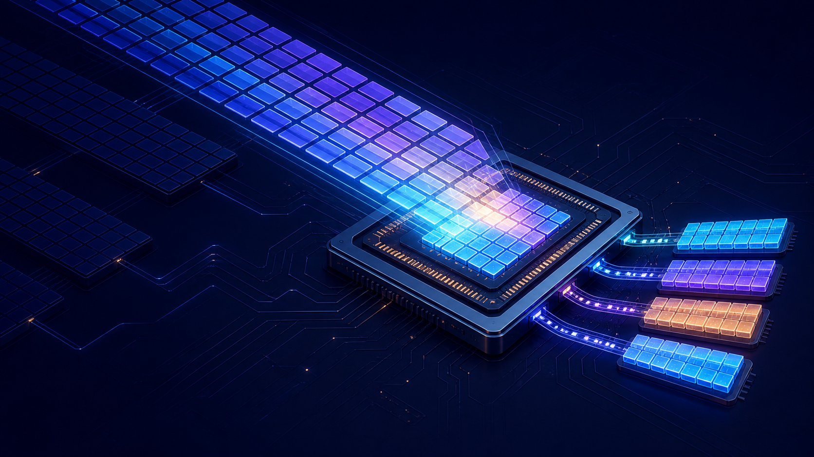
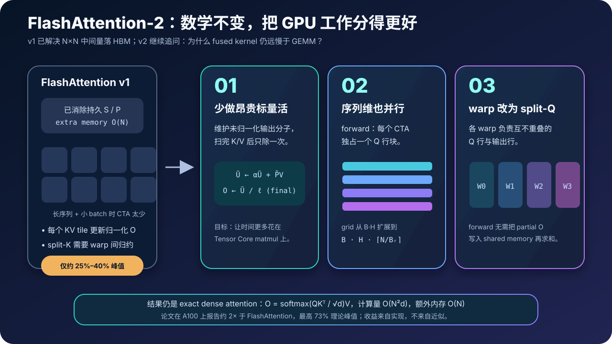
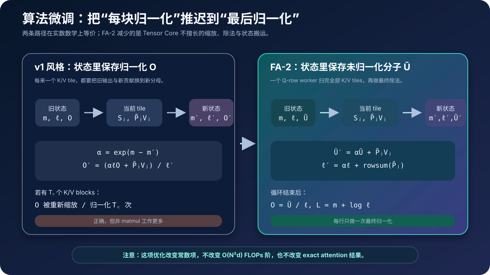
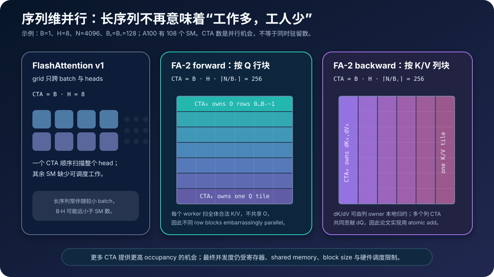
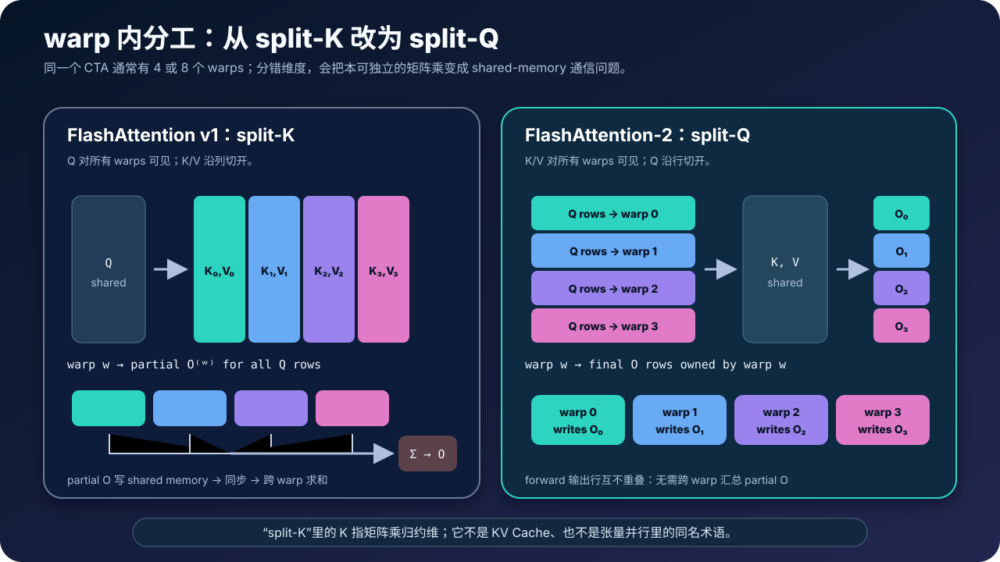
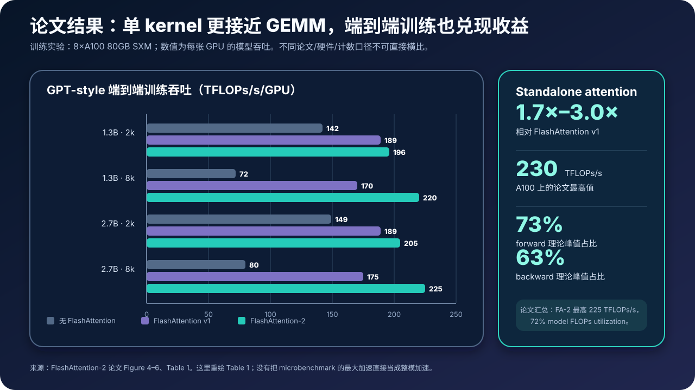

# FlashAttention-2 原理与源码：同样的精确 Attention，如何靠更好的并行与工作划分快 2 倍



> **论文**：[FlashAttention-2: Faster Attention with Better Parallelism and Work Partitioning](https://arxiv.org/abs/2307.08691)<br>
> **正式发表**：ICLR 2024；论文首版于 2023 年 7 月公开<br>
> **作者**：Tri Dao<br>
> **关键词**：Exact Attention、Online Softmax、Thread Block、Warp、Sequence Parallelism、Occupancy、Split-Q、Shared Memory、Tensor Core<br>
> **配套源码**：[flash_attention2_minimal.py](./code/flash_attention2_minimal.py)<br>
> **前置阅读**：[Transformer 原理](./00_Transformer_2017_原理.md) · [FlashAttention v1 原理](./14_FlashAttention_2022_原理.md) · [GQA 原理](./44_GQA_2023_原理.md)

FlashAttention v1 已经解决了注意力最扎眼的系统问题：不再把完整的 $N\times N$ score 与 probability 矩阵写回 HBM。它通过 tiling、online softmax、kernel fusion 与 backward recomputation，把额外内存从 $O(N^2)$ 降到 $O(N)$，同时保持：

$$
O=\operatorname{softmax}\!\left(\frac{QK^\top}{\sqrt d}\right)V
$$

完全不变。

但“比标准 attention 快”不代表“已经把 GPU 用满”。第一代 FlashAttention 在 A100 上仍只达到约 25%–40% 理论峰值，而高度优化的 GEMM 往往能到 80%–90%。瓶颈已经从“把二次中间量搬来搬去”，进一步移动到更细的层级：

- Tensor Core 很快，但 softmax、缩放、除法等非矩阵乘工作相对昂贵；
- v1 主要按 batch 和 head 启动 thread blocks，长序列、小 batch 时并行块不够；
- 一个 thread block 内部的 warps 采用 split-K，会把 partial output 写入 shared memory，再同步、归约；
- block size 太小浪费数据复用，太大又会压垮寄存器与 shared memory。

FlashAttention-2 的核心不是新的注意力公式，而是重新回答两道系统题：

1. **哪一块数据应该由哪个 thread block 长期拥有？**
2. **一个 block 内的 warps 应该沿哪一维分工，才能少通信？**

论文给出的答案可以压缩成三项改动：

1. 保存未归一化输出分子，只在 K/V 循环结束后归一化一次；
2. forward 按 Q 行块、backward 按 K/V 列块并行，让序列维也产生 thread blocks；
3. forward 从 split-K 改为 split-Q，让各 warp 直接拥有互不重叠的输出行。



论文在 A100 上报告：FA-2 相比 FlashAttention v1 的 standalone attention 快 $1.7\times$–$3.0\times$，最高达到 230 TFLOPs/s、约 73% 理论峰值；用于 GPT 风格模型训练时，最高达到每张 A100 225 TFLOPs/s。最有价值的启示不是某个固定倍率，而是：

> 当算法已经消除了主要 IO 浪费，性能提升会越来越依赖“工作由谁拥有、在哪里归约、何时同步”这些并行映射细节。

---

## 0. 先给结论

读完本文，至少应该记住下面二十六点：

1. **FlashAttention-2 与 v1 计算同一个 exact dense attention。** 它没有引入稀疏、低秩或 softmax 近似。
2. **FA-2 没有把 dense attention 的 $O(N^2d)$ 计算改成线性。** 它优化的是常数、并行度与内存通信。
3. **v1 与 v2 的额外内存渐进式都为 $O(N)$。** “线性内存”是第一代已经完成的核心贡献。
4. **FA-2 的目标是缩小 attention kernel 与 GEMM 的效率差距。** 不是再证明一次 IO awareness。
5. **A100 的 FP16/BF16 Tensor Core 峰值约为非 matmul FP32 峰值的 16 倍。** 这是论文用来解释“少量标量工作也很贵”的硬件背景。
6. **“非 matmul FLOP 贵 16 倍”是性能直觉，不是每条指令的统一定价公式。** exp、除法、归约、同步的真实成本各不相同。
7. **v1 每合并一个 K/V tile 都维护归一化输出 $O$。** 这会反复重缩放向量状态。
8. **FA-2 改为维护未归一化分子 $\widetilde O$。** 扫完全部 K/V tiles 后才做 $O=\widetilde O/\ell$。
9. **前向只需为 backward 保存 log-sum-exp。** $L=m+\log\ell$，无需同时保存 $m$ 与 $\ell$。
10. **FA-2 forward 把 Q 行块放在外循环。** 每个 thread block 独占一个 Q block，并扫描所有合法 K/V blocks。
11. **Q 行块彼此没有输出依赖。** 所以 forward 可同时沿 batch、head 和 sequence-row 三个维度并行。
12. **v1 的逻辑 worker 数主要是 $B\cdot H$。** FA-2 forward 的并行机会扩为 $B\cdot H\cdot\lceil N/B_r\rceil$。
13. **更多 CTA 不等于更多同时驻留的 CTA。** occupancy 还受寄存器、shared memory、warp 数与硬件上限约束。
14. **FA-2 backward 按 K/V 列块分配 worker。** 每个 worker 可本地归约自己的 $dK_j,dV_j$。
15. **不同 backward workers 都会贡献 $dQ$。** 论文实现使用 atomic add 合并这些贡献。
16. **原子加法会影响归约次序。** 数学结果不变，但有限精度下通常不能期待 bitwise deterministic。
17. **v1 forward 的 warp 划分是 split-K。** 各 warp 产生同一输出行的部分和，需要 shared-memory 归约。
18. **FA-2 forward 改成 split-Q。** 每个 warp 负责不同 Q 行，因此也直接负责不同输出行，不必跨 warp 求和。
19. **这里的 split-K 指 GEMM 的归约维。** 它不是 KV Cache，也不是分布式训练里所有同名 split-K 技巧的统称。
20. **backward 比 forward 的数据依赖更复杂。** 避开 split-K 后仍需要一部分 warp 同步，不能照搬“零通信”的结论。
21. **论文常用 $64$ 或 $128$ 的行列块组合。** 更大块减少 shared-memory 往返，却提高寄存器与片上内存压力。
22. **causal attention 可跳过约半数 tile。** 只有与对角线相交的 block 需要逐元素 mask，论文报告约 $1.7\times$–$1.8\times$ 于非 causal 路径的速度关系。
23. **FA-2 原生描述了 MQA/GQA 的隐式 head 映射。** K/V 不应先物化复制到 Query head 数。
24. **microbenchmark 的约 2 倍不会自动变成整模 2 倍。** attention 只是模型的一部分，端到端还包含投影、MLP、通信、优化器等。
25. **论文最快的训练点是 2.7B、8k context：225 TFLOPs/s/GPU。** 相比该表中的 v1 为 $225/175\approx1.29\times$，不是 2 倍。
26. **FA-2 最深刻的贡献是 ownership。** 让 CTA 拥有一个输出行块、让 warp 拥有一组输出行，比泛泛地说“并行化更多”更接近论文实质。

---

## 1. FlashAttention v1 已经做对了什么

### 1.1 标准 attention 为什么浪费 HBM

对单个 head：

$$
Q,K,V\in\mathbb R^{N\times d}
$$

标准 scaled dot-product attention 为：

$$
S=\tau QK^\top,\qquad
P=\operatorname{softmax}(S),\qquad
O=PV,
\qquad \tau=\frac{1}{\sqrt d}.
$$

朴素实现会在多个 kernel 之间把：

$$
S,P\in\mathbb R^{N\times N}
$$

写入并读出 HBM。长序列下，这既造成 $O(N^2)$ 中间存储，也造成巨大的显存带宽压力。

### 1.2 v1 用 tiling 与 online softmax 消掉完整 $S/P$

把 Q 切成行块 $Q_i\in\mathbb R^{B_r\times d}$，把 K/V 切成列块：

$$
K_j,V_j\in\mathbb R^{B_c\times d}.
$$

当前 score tile：

$$
S_{ij}=\tau Q_iK_j^\top\in\mathbb R^{B_r\times B_c}
$$

只在片上 SRAM/寄存器中短暂存在。online softmax 为每个 query row 保存：

- running maximum $m$；
- running exponential sum $\ell$；
- 输出状态。

因此完整 $S/P$ 从未持久化到 HBM，额外内存只随 $N$ 线性增长。

### 1.3 backward 用重算换 IO

前向保存每行归一化统计量，反向重新计算当前：

$$
S_{ij}=\tau Q_iK_j^\top,
\qquad
P_{ij}=\exp(S_{ij}-L_i).
$$

这增加矩阵乘，却省去对 $N\times N$ 概率矩阵的保存与读取。GPU 擅长重算 tile GEMM，而 HBM 往返相对昂贵，所以重算可以同时省显存并缩短时间。

### 1.4 v1 剩下的问题已经不是“大 O”

FA-2 没有推翻以上任何设计。它继承：

- exact softmax；
- tiling；
- fusion；
- online softmax；
- causal tile pruning；
- backward recomputation；
- $O(N)$ 额外内存。

它要优化的是相同渐进复杂度内的执行效率。对比可以先看这张表：

| 维度 | FlashAttention v1 | FlashAttention-2 |
|---|---|---|
| 数学函数 | exact dense attention | 同一个 exact dense attention |
| 前向计算量 | $O(N^2d)$ | $O(N^2d)$ |
| 额外内存 | $O(N)$ | $O(N)$ |
| forward 主循环 | K/V block 外层，Q block 内层 | Q block 外层，K/V block 内层 |
| 输出状态 | 每个 K/V block 后维护归一化 $O$ | 维护未归一化 $\widetilde O$，最后除一次 |
| grid 并行轴 | 主要是 batch × heads | batch × heads × sequence rows |
| forward warp 分工 | split-K，需要 partial-$O$ 归约 | split-Q，各 warp 独占输出行 |
| backward worker | 一个 head 级 worker 顺序处理 | 沿 K/V column blocks 并行 |
| A100 论文峰值利用率 | 约 25%–40% 的背景基线 | forward 最高 73%，backward 最高 63% |

---

## 2. 读懂论文必须具备的 GPU 执行模型

### 2.1 从 GPU 到线程的层级

论文使用 NVIDIA GPU 的术语：

```text
GPU
└── 多个 SM（Streaming Multiprocessor）
    └── 一个或多个驻留 thread blocks / CTA
        └── 多个 warp
            └── 32 个线程
```

常用概念如下：

| 概念 | 在本文中的含义 |
|---|---|
| SM | 执行 thread block 的流式多处理器；A100 有 108 个 |
| thread block / CTA | 由调度器整体放到某个 SM 上的一组线程 |
| warp | 32 个一起执行的线程；一个 CTA 常含 4 或 8 个 warps |
| registers | 每线程极快的私有片上状态，容量有限 |
| shared memory / SRAM | 同一 CTA 内 warps 可共享的片上存储，需要显式协调 |
| HBM | 容量大但更远的设备显存 |
| occupancy | 可用 GPU 执行资源被活跃 warps/blocks 覆盖的程度 |

### 2.2 线程块之间与 warp 之间的通信成本不同

- 同一 warp 的线程可用 shuffle 等指令快速交换数据；
- 同一 CTA 的不同 warps 通常通过 shared memory 与 barrier 协作；
- 不同 CTA 默认不能直接共享寄存器或 shared memory；
- 跨 CTA 合并结果需要 HBM、atomic、额外 kernel，或其他全局机制。

因此，一个好的工作划分必须让大部分中间状态由单个 owner 完成归约。

### 2.3 A100 上 matmul 与非 matmul 的巨大不对称

论文给出的 A100 理论峰值是：

| 工作类型 | 理论峰值 |
|---|---:|
| FP16/BF16 Tensor Core matmul | 312 TFLOPs/s |
| 非 matmul FP32 | 19.5 TFLOPs/s |

两者相差：

$$
\frac{312}{19.5}=16.
$$

这解释了为什么只看“非 matmul FLOPs 占总 FLOPs 的比例很小”会误判性能。softmax 中的 max、exp、sum、除法，以及地址计算、同步、shared-memory 访问，都可能让 Tensor Core 等数据。

需要谨慎理解这组数字：

- exp 与除法不一定按普通 FP32 FLOP 的同一方式执行；
- 实际吞吐取决于指令流水、依赖链和并行度；
- 16 倍是论文给出的数量级直觉，不是 kernel 性能计算器。

真正结论是：

> 想让 attention 超过 50% 理论峰值，必须尽量把时间预算留给矩阵乘，并减少归一化、同步与片上搬运。

### 2.4 GEMM 为什么是比较对象

FA-2 不是把 attention 变成单一 GEMM。它仍包含：

- 两次主矩阵乘：$QK^\top$ 与 $PV$；
- online max/sum；
- exponential；
- causal mask；
- 状态重缩放；
- backward 重算和多个梯度矩阵乘。

但 attention 的主要数学 FLOPs 来自矩阵乘，所以 GEMM 峰值代表一个理想上界：如果调度足够好，融合 attention 应尽可能接近矩阵乘单元的效率。

---

## 3. 第一项改动：减少非矩阵乘 FLOPs



### 3.1 先写出块级稳定 softmax 状态

假设当前已处理一部分 key blocks，保存：

$$
m\in\mathbb R^{B_r},
\qquad
\ell\in\mathbb R^{B_r}.
$$

新 score tile $S_j$ 到来后：

$$
m'=\max(m,\operatorname{rowmax}(S_j)).
$$

旧状态换到新最大值标尺的缩放因子：

$$
\alpha=\exp(m-m').
$$

当前块未归一化权重：

$$
\widetilde P_j=\exp(S_j-m').
$$

分母更新：

$$
\boxed{
\ell'=\alpha\ell+\operatorname{rowsum}(\widetilde P_j)
}
$$

这里的指数、乘法都按行广播。

### 3.2 v1：每个 block 后保存归一化输出

如果旧状态保存的是：

$$
O=\frac{U}{\ell},
$$

则旧的未归一化分子是 $\ell O$。换标尺并加入当前块：

$$
U'=\alpha\ell O+\widetilde P_jV_j.
$$

v1 再立即除以新分母：

$$
\boxed{
O'=\frac{\alpha\ell O+\widetilde P_jV_j}{\ell'}
}
$$

这在数学上完全正确，但每个 K/V block 都要对输出向量做归一化或等价重缩放。

### 3.3 FA-2：保存未归一化输出分子

FA-2 直接把状态定义为：

$$
\widetilde O=U=\sum_{k\in\text{seen}}e^{s_k-m}v_k.
$$

新块到来时只更新：

$$
\boxed{
\widetilde O'=\alpha\widetilde O+\widetilde P_jV_j
}
$$

同时更新 $m'$ 与 $\ell'$。扫描所有 K/V blocks 后，才执行：

$$
\boxed{
O=\frac{\widetilde O}{\ell}
}
$$

如果有 $T_c$ 个 K/V blocks：

- v1 风格会在每个 block merge 后维护归一化 $O$；
- FA-2 把输出归一化推迟到循环末尾，只做一次。

这不是新的 softmax 恒等式。很多教学版 FlashAttention 本来就喜欢用未归一化分子，因为更容易推导；FA-2 的贡献是把这种表示落实进高性能 kernel，并与新的 Q-row ownership 配合。

### 3.4 为什么仍然必须重缩放旧分子

“最后再除”不等于“中间什么都不缩放”。如果新 tile 抬高最大值：

$$
m'>m,
$$

旧分子仍在 $e^{s-m}$ 标尺，必须乘：

$$
\alpha=e^{m-m'}.
$$

错误写法：

```python
running_sum += exp(scores - new_max).sum()
numerator += exp(scores - new_max) @ values
```

正确写法：

```python
old_scale = exp(old_max - new_max)
running_sum = old_scale * running_sum + tile_weights.sum()
numerator = old_scale * numerator + tile_weights @ values
```

推迟的是除以 $\ell$，不是取消对最大值标尺变化的修正。

### 3.5 backward 只保存一个 $L$

v1 可以保存每行：

$$
m,\ell.
$$

FA-2 指出 backward 恢复概率只需要：

$$
\boxed{L=m+\log\ell.}
$$

因为：

$$
\begin{aligned}
P_{ij}
&=\frac{e^{S_{ij}-m_i}}{\ell_i}\\
&=e^{S_{ij}-m_i-\log\ell_i}\\
&=\boxed{e^{S_{ij}-L_i}}.
\end{aligned}
$$

于是每个 query row 只需持久保存一个 log-sum-exp 标量。

### 3.6 这项优化的边界

它改变的是：

- 每块输出归一化次数；
- 非 matmul 指令常数；
- 片上状态的读写方式。

它不改变：

$$
\text{score matmul FLOPs}=O(N^2d),
$$

也不改变：

$$
\text{attention output}=\operatorname{softmax}(\tau QK^\top)V.
$$

---

## 4. FA-2 forward：交换循环，让一个 CTA 拥有一块输出行

### 4.1 v1 的循环顺序

FlashAttention v1 的论文 Algorithm 1 把 K/V block 放在外层：

```text
for each K_j, V_j:                 # 外循环
    load K_j, V_j
    for each Q_i:                  # 内循环
        load Q_i, O_i, m_i, l_i
        compute one score tile
        update normalized O_i
        write O_i, m_i, l_i back
```

好处是当前 $K_j,V_j$ 可跨所有 Q blocks 复用。代价是：

- 每个 K/V block 都重新读取 Q 与输出状态；
- 一个 head 主要由一个 thread block 顺序处理；
- 沿 Q 行块缺少独立 CTA。

### 4.2 FA-2 把 Q block 放在外层

FA-2 的 Algorithm 1 改成：

```text
parallel for each Q_i row block:   # 每个 i 由一个 CTA 拥有
    load Q_i once
    initialize m_i, l_i, O_tilde_i on chip

    for each legal K_j, V_j:
        load K_j, V_j
        S_ij = scale * Q_i @ K_j.T
        update m_i, l_i, O_tilde_i

    O_i = O_tilde_i / l_i
    L_i = m_i + log(l_i)
    write O_i, L_i once
```

这个循环交换带来两个直接结果：

1. $Q_i,m_i,\ell_i,\widetilde O_i$ 可在整个 K/V sweep 中由同一 CTA 持有；
2. 不同 Q row blocks 输出互不重叠，可以作为独立 CTA 并行调度。

### 4.3 完整块级公式

对 row block $i$，初始化：

$$
m_i^{(0)}=-\infty,
\qquad
\ell_i^{(0)}=0,
\qquad
\widetilde O_i^{(0)}=0.
$$

第 $j$ 个 K/V block：

$$
S_i^{(j)}=\tau Q_iK_j^\top.
$$

应用 mask 后：

$$
m_i^{(j)}=max\left(
m_i^{(j-1)},
\operatorname{rowmax}(S_i^{(j)})
\right).
$$

令：

$$
\alpha_i^{(j)}=
\exp\left(m_i^{(j-1)}-m_i^{(j)}\right),
$$

$$
\widetilde P_i^{(j)}=
\exp\left(S_i^{(j)}-m_i^{(j)}\right).
$$

更新：

$$
\ell_i^{(j)}=
\alpha_i^{(j)}\ell_i^{(j-1)}+
\operatorname{rowsum}(\widetilde P_i^{(j)}),
$$

$$
\widetilde O_i^{(j)}=
\alpha_i^{(j)}\widetilde O_i^{(j-1)}+
\widetilde P_i^{(j)}V_j.
$$

最后：

$$
\boxed{
O_i=\operatorname{diag}(\ell_i^{(T_c)})^{-1}
\widetilde O_i^{(T_c)}
}
$$

$$
\boxed{
L_i=m_i^{(T_c)}+\log\ell_i^{(T_c)}
}
$$

### 4.4 为什么 row blocks 可以完全独立

注意力 softmax 的归一化发生在每个 query row 内。某个 $Q_i$ 需要扫描所有 K/V blocks，但不需要读取另一个 $Q_{i'}$ 的：

- maximum；
- denominator；
- numerator；
- output。

因此：

$$
O_i\perp O_{i'}\quad\text{在计算依赖上彼此独立。}
$$

这里不是说统计意义独立，而是说两个 CTA 无需交换中间状态。

### 4.5 循环交换不是无条件减少所有加载

v1 的 K/V-outer 顺序强调跨 Q blocks 复用 K/V；v2 的 Q-outer 顺序强调：

- Q 与输出状态在 CTA 内驻留；
- row blocks 可并行；
- 每个 CTA 会扫描 K/V。

所以它是一种数据复用与并行度的重新选择，不是“Q、K、V 每一种都少加载”。缓存层级、CTA 并发和 tile 大小会影响实际 HBM 流量。配套源码故意打印逻辑 tile loads，展示这项交换：

```text
non-causal, N=6, B_r=B_c=2
v1-style: Q tile loads=9, K/V tile loads=3
FA-2-style: Q tile loads=3, K/V tile loads=9
```

这些是教学循环中的加载事件，不是 A100 性能计数器；它们帮助理解 ownership 改变了谁被复用。

### 4.6 causal mask 如何融入 row owner

对自回归 attention，位置 $r$ 只能看到 $c\le r$：

$$
S_{rc}^{causal}=
\begin{cases}
S_{rc},&c\le r,\\
-\infty,&c>r.
\end{cases}
$$

一个 Q row block 的 CTA 扫描 K/V tiles 时：

- 完全在对角线上方：整块跳过；
- 完全在对角线下方：无需逐元素 mask；
- 与对角线相交：只对这一块应用三角 mask。

方形分块时，每个 Q row block 最多只有一个对角 tile 需要逐元素 causal mask。大 $N$ 下约一半 score tiles 可跳过。论文测得 causal 路径相对计算完整矩阵可有约 $1.7\times$–$1.8\times$ 的速度关系，而不是理想的严格 2 倍，因为剩余 kernel 开销不会减半。

### 4.7 正确性与复杂度

FA-2 forward 仍然：

$$
\boxed{O=\operatorname{softmax}(\tau QK^\top)V}
$$

并且：

| 项目 | 复杂度 |
|---|---:|
| score / value aggregation FLOPs | $O(N^2d)$ |
| 完整 score/probability 存储 | 不创建 |
| 额外持久状态 $L$ | $O(N)$ |
| 输出 | $O(Nd)$ |

FA-2 论文省略了与 v1 几乎相同的正确性证明。核心仍是 online softmax 的块合并恒等式。

---

## 5. 第二项改动：把序列维变成 grid 并行轴



### 5.1 v1 为什么会在长序列、小 batch 下低 occupancy

v1 主要为每个 batch-head pair 分配一个 thread block：

$$
\#CTA_{v1}\approx B\cdot H.
$$

A100 有 108 个 SM。若：

$$
B=1,\qquad H=8,
$$

则逻辑上只有 8 个 head workers。即使每个 worker 内部工作量因为 $N$ 很长而巨大，调度器也无法把一个顺序 worker 自动拆给 108 个 SM。

这就是：

> 工作总量很多，不等于独立工作单元很多。

### 5.2 FA-2 forward 的 CTA 数

令 Q row block 数：

$$
T_r=\left\lceil\frac{N}{B_r}\right\rceil.
$$

FA-2 forward grid 可写成：

$$
\boxed{
\#CTA_{fwd}=B\cdot H\cdot T_r
}
$$

仍用：

$$
B=1,\ H=8,\ N=4096,\ B_r=128,
$$

则：

$$
T_r=32,
\qquad
\#CTA_{fwd}=1\times8\times32=256.
$$

256 个独立 row-block tasks 足以覆盖 108 个 SM 的多个调度波次，而不再只有 8 个 head-level tasks。

### 5.3 这为什么特别适合长序列

训练常固定每步 token budget。若总 token 数近似固定：

$$
B\cdot N\approx C,
$$

则序列越长，batch 越小。v1 的 $B\cdot H$ 并行度下降；FA-2 新增的：

$$
T_r\propto N
$$

恰好补充并行任务。这也是论文 benchmark 把总 token 数固定为 16k 的原因之一。

### 5.4 occupancy 不能只数 CTA

更多 CTA 是必要的并行机会，但不是充分条件。一个 SM 能驻留多少 blocks/warps，还取决于：

- 每 CTA 的线程与 warp 数；
- 每线程寄存器数量；
- 每 CTA shared memory；
- block size；
- GPU 架构限制；
- 指令依赖与访存等待。

若一个大 block 吃掉几乎全部 shared memory，即使 grid 有几千个 CTA，一个 SM 同时也可能只能驻留一个。

因此更严谨的说法是：

> 序列维并行为调度器暴露了更多独立工作，改善 occupancy 的上限与长序列场景下的实际利用率。

而不是：

> CTA 数变多，所以所有 GPU 都会按相同比例变快。

### 5.5 不要与分布式 sequence parallel 混淆

FA-2 这里的 sequence parallelism 是：

- 单个 GPU kernel 的 grid 维度；
- 把 attention matrix 的行/列 tiles 分给不同 thread blocks。

它不是：

- Megatron-LM 的 sequence parallel；
- context parallel / ring attention；
- 把一条序列切到多张 GPU；
- pipeline parallel。

名称相似，通信边界完全不同。

---

## 6. backward：列块 owner、局部归约与原子加法

### 6.1 先回顾 attention 梯度

前向：

$$
S=\tau QK^\top,
\qquad
P=\operatorname{softmax}(S),
\qquad
O=PV.
$$

给定上游梯度 $dO$：

$$
dV=P^\top dO,
$$

$$
dP=dOV^\top.
$$

softmax 梯度逐行为：

$$
dS_{ij}=P_{ij}\left(dP_{ij}-\sum_kP_{ik}dP_{ik}\right).
$$

最后：

$$
dQ=\tau dSK,
\qquad
dK=\tau dS^\top Q.
$$

### 6.2 用 $L$ 按块重算概率

FA-2 前向保存：

$$
L_i=m_i+\log\ell_i.
$$

因此当前 tile：

$$
S_{ij}=\tau Q_iK_j^\top,
$$

$$
\boxed{
P_{ij}=\exp(S_{ij}-L_i)
}
$$

只在片上重建，用完即丢。

### 6.3 $D_i=dO_i\cdot O_i$ 消除整行概率归约

定义：

$$
D_i=\sum_jP_{ij}dP_{ij}.
$$

又因为：

$$
dP_{ij}=dO_i\cdot V_j,
$$

所以：

$$
\begin{aligned}
D_i
&=\sum_jP_{ij}(dO_i\cdot V_j)\\
&=dO_i\cdot\sum_jP_{ij}V_j\\
&=dO_i\cdot O_i.
\end{aligned}
$$

即：

$$
\boxed{
D=\operatorname{rowsum}(dO\odot O)
}
$$

这样每个 tile 都能独立构造：

$$
dS_{ij}=P_{ij}\odot(dP_{ij}-D_i).
$$

### 6.4 一个 column worker 的工作

FA-2 backward 为每个 K/V column block $j$ 分配一个 thread block。它：

1. 加载 $K_j,V_j$；
2. 在片上把 $dK_j,dV_j$ 初始化为零；
3. 扫描所有 Q row blocks $i$；
4. 重算 $S_{ij},P_{ij}$；
5. 累加本地 $dK_j,dV_j$；
6. 为全局 $dQ_i$ 贡献一部分梯度。

块级公式为：

$$
dV_j\mathrel{+}=P_{ij}^\top dO_i,
$$

$$
dP_{ij}=dO_iV_j^\top,
$$

$$
dS_{ij}=P_{ij}\odot(dP_{ij}-D_i),
$$

$$
dK_j\mathrel{+}=\tau dS_{ij}^\top Q_i,
$$

$$
dQ_i\mathrel{+}=\tau dS_{ij}K_j.
$$

### 6.5 为什么 forward 按行、backward 按列

forward 的最终输出 $O_i$ 按 query rows 自然分块：一个 row owner 能独立完成整个 softmax 与 value aggregation。

backward 中：

- 固定列块 $j$，$dK_j,dV_j$ 可在扫描所有 rows 时由一个 owner 完整归约；
- $dQ_i$ 会收到来自所有列块 $j$ 的贡献。

所以论文选择 column owner：

$$
\boxed{
\#CTA_{bwd}=B\cdot H\cdot
\left\lceil\frac{N}{B_c}\right\rceil
}
$$

并用 atomic add 合并不同 column workers 对 $dQ$ 的贡献。

### 6.6 atomic add 的代价与必要性

原子加法解决的是跨 CTA ownership 冲突：多个列块都要更新同一 $dQ_i$。

它带来：

- 写冲突与原子操作成本；
- 非固定的浮点加法顺序；
- 潜在非确定性；
- 对 shape 与调度策略敏感的性能。

但它换来了更多 column-block 并行度。在长序列、小 batch 下，这种交换通常值得。

论文并没有声称 backward 完全无同步；相反，backward 是实现更复杂的一半。

---

## 7. 第三项改动：warp 从 split-K 改为 split-Q



### 7.1 “一个 CTA 已经有多个 warps”还不够

即使 grid 层面给了足够多 thread blocks，一个 CTA 内通常还有 4 或 8 个 warps。必须继续决定：

- 每个 warp 读哪部分 Q/K/V；
- 每个 warp 计算哪部分 score；
- 每个 warp 最终拥有哪部分 O；
- partial results 在哪里归约。

### 7.2 v1 的 split-K

把当前 tile 写成：

$$
Q\in\mathbb R^{B_r\times d},
\qquad
K,V\in\mathbb R^{B_c\times d}.
$$

v1 让 Q 对多个 warps 可见，把 K/V 的列工作分给 warps。每个 warp 得到部分 score 和部分输出贡献：

$$
O^{(w)}=P^{(w)}V^{(w)}.
$$

最终输出需要：

$$
O=\sum_wO^{(w)}.
$$

于是各 warp 必须：

1. 把 partial $O^{(w)}$ 写到 shared memory；
2. barrier 同步；
3. 读取其他 warp 的 partial results；
4. 完成归约。

这就是论文所说的 split-K：矩阵乘的归约维被多个 warps 分担。

### 7.3 FA-2 的 split-Q

FA-2 反过来：让 K/V 对所有 warps 可见，把 Q 的行切给不同 warps。

若：

$$
Q=
\begin{bmatrix}
Q^{(0)}\\Q^{(1)}\\Q^{(2)}\\Q^{(3)}
\end{bmatrix},
$$

则 warp $w$ 计算：

$$
S^{(w)}=Q^{(w)}K^\top,
$$

$$
O^{(w)}=\operatorname{softmax}(S^{(w)})V.
$$

这些 $O^{(w)}$ 对应不同输出行：

$$
O=
\begin{bmatrix}
O^{(0)}\\O^{(1)}\\O^{(2)}\\O^{(3)}
\end{bmatrix}.
$$

不是求和关系，而是拼接关系。因此 forward 不需要把 partial $O$ 写到 shared memory 再跨 warp 归约。

### 7.4 为什么这叫更好的 ownership

split-Q 让每个 warp 从输入到输出拥有一组完整的 rows：

```text
warp w:
Q rows w
  → score rows w
  → online-softmax states w
  → output rows w
```

状态沿同一 owner 流动，减少：

- shared-memory stores；
- shared-memory loads；
- barrier；
- 跨 warp reduction。

这比一句“减少通信”更具体：它消除了 forward partial output 的跨 warp 汇总。

### 7.5 backward 不能完全复制 forward 的无通信结构

backward 同时处理：

$$
Q,K,V,O,dO,dQ,dK,dV.
$$

不同梯度的自然 ownership 不同：

- $dQ$ 按 query rows；
- $dK,dV$ 按 key/value rows；
- 中间 $dS,dP$ 同时跨两维。

FA-2 backward 同样避免 v1 的 split-K 方案，从而减少 shared-memory 读写，但仍需一部分同步。论文明确没有声称 backward 的 warp 通信归零。

---

## 8. Block size：数据复用、寄存器与 occupancy 的三角权衡

### 8.1 论文搜索的典型块大小

论文通常从下面的组合中选择：

$$
B_r,B_c\in\{64,128\}.
$$

即候选 score tile 约为：

$$
64\times64,
\quad64\times128,
\quad128\times64,
\quad128\times128.
$$

具体选择依赖：

- head dimension $d$；
- dtype；
- GPU shared-memory 容量；
- 寄存器压力；
- forward/backward；
- causal 与否。

### 8.2 大 block 的收益

更大 tile 往往意味着：

- 每次加载 Q/K/V 后做更多矩阵乘；
- 更高数据复用；
- 更少 tile-loop bookkeeping；
- 更少 shared-memory round trips；
- Tensor Core 的矩阵形状更饱满。

### 8.3 大 block 的代价

但 tile 越大，需要同时保留的状态越多：

- score fragments；
- softmax max/sum；
- output accumulator；
- Q/K/V fragments；
- backward 的多组梯度 fragments。

结果可能是：

1. 寄存器使用过多，降低每 SM 可驻留 warp 数；
2. register spilling，把“片上状态”溢到更慢的 local memory；
3. shared memory 超过硬件上限，kernel 无法启动；
4. 每 CTA 资源太重，occupancy 下降。

### 8.4 为什么没有统一最优 tile

tile 是硬件与 shape 的函数：

$$
(B_r,B_c)^*=f(
\text{GPU},d,\text{dtype},\text{causal},\text{direction}
).
$$

论文当时只有约四种主要组合，所以按 head dimension 手工调优；作者也指出自动调优是自然的未来方向。

不要把 $128\times128$ 当成永恒答案。换到另一代 GPU、另一种 dtype 或更大 head dimension，最优点会变化。

---

## 9. MQA / GQA：不物化复制 K/V heads

### 9.1 头数关系

Multi-Head Attention（MHA）通常有：

$$
H_q=H_{kv}.
$$

Multi-Query Attention（MQA）有：

$$
H_{kv}=1<H_q.
$$

Grouped-Query Attention（GQA）有：

$$
1<H_{kv}<H_q,
\qquad
H_q\bmod H_{kv}=0.
$$

每个 KV head 服务：

$$
g=\frac{H_q}{H_{kv}}
$$

个 Query heads。

### 9.2 只映射索引，不复制 tensor

Query head $h_q$ 对应：

$$
h_{kv}=\left\lfloor\frac{h_q}{g}\right\rfloor.
$$

高效 kernel 应直接根据索引读取对应 K/V head，而不是先执行：

```python
k_repeated = repeat_interleave(k, repeats=g, dim=head_axis)
v_repeated = repeat_interleave(v, repeats=g, dim=head_axis)
```

后者虽然数学等价，却可能物化额外数据，抵消 GQA 的内存与带宽优势。

### 9.3 backward 为什么需要跨 Query heads 求和

多个 Query heads 共享同一 K/V head，所以：

$$
dK_{h_{kv}}=
\sum_{h_q\mapsto h_{kv}}dK^{(h_q)},
$$

$$
dV_{h_{kv}}=
\sum_{h_q\mapsto h_{kv}}dV^{(h_q)}.
$$

FA-2 论文把 MQA/GQA 支持纳入其 head indexing 与 backward reduction 设计。它与序列 tile 并行是两个正交维度：一个决定 head 映射，一个决定 attention matrix 的 row/column ownership。

---

## 10. Exact 到底意味着什么

### 10.1 实数数学等价

FA-2 计算：

$$
\boxed{
\operatorname{FA2}(Q,K,V)
=
\operatorname{softmax}(\tau QK^\top)V
}
$$

它没有：

- 跳过 dense causal 区域内的合法连接；
- 用核近似替换 softmax；
- 对 score 做低秩分解；
- 改变 attention receptive field。

### 10.2 exact 不等于 bitwise identical

FA-2 相比标准 attention 和 v1 改变了：

- tile 顺序；
- 加法归约树；
- 最大值与分母合并顺序；
- forward warp ownership；
- backward atomic-add 顺序。

浮点加法不满足结合律：

$$
(a+b)+c\ne a+(b+c)
$$

在有限精度下通常成立。因此“exact”应理解为相同的实数数学函数，结果在合理数值误差范围内一致，而不是逐 bit 一致。

### 10.3 为什么 online softmax 数值稳定

每个 tile 都减去新的 running maximum：

$$
S_{ij}-m_i\le0.
$$

指数输入不为大正数，避免常见 overflow；最大值变化时旧状态乘：

$$
e^{m_{old}-m_{new}}\le1.
$$

这也是为什么不能为了少一次乘法而跳过 rescale。

---

## 11. 配套源码：把算法表示与调度表示分开验证

仓库提供一份只依赖 Python 标准库的教学实现：

- [完整源码：flash_attention2_minimal.py](./code/flash_attention2_minimal.py)

它不是 CUDA/Triton kernel，也不会比框架 attention 快。它要验证四件事：

1. v1 风格的“每块维护归一化 $O$”与朴素 attention 一致；
2. FA-2 风格的“维护未归一化分子、最后除一次”也一致；
3. causal tile skipping 不改变合法位置结果；
4. forward row-grid 与 backward column-grid 如何增加 logical workers。

### 11.1 朴素 attention 是 correctness oracle

```python
for i in range(n):
    stop = i + 1 if causal else n
    scores = [scale * dot(q[i], k[j]) for j in range(stop)]
    row_max = max(scores)
    weights = [exp(score - row_max) for score in scores]
    denominator = sum(weights)

    for j, weight in enumerate(weights):
        probability = weight / denominator
        output[i] += probability * v[j]
```

它显式看见整行分数，适合做小矩阵正确性基线，不适合高性能计算。

### 11.2 v1 风格：K/V outer，每块更新归一化输出

核心代码对应：

```python
for key_start in range(0, n, block_k):
    for query_start in range(0, n, block_q):
        scores = q_tile @ k_tile.T
        new_max = max(old_max, tile_max)
        old_scale = exp(old_max - new_max)
        weights = exp(scores - new_max)
        new_sum = old_scale * old_sum + sum(weights)

        old_coefficient = old_scale * old_sum / new_sum
        tile_coefficient = 1.0 / new_sum
        output = (
            old_coefficient * output
            + tile_coefficient * (weights @ v_tile)
        )
```

注意旧 $O$ 已经归一化，所以先用：

$$
\alpha\ell O
$$

恢复并换标尺，再除以 $\ell'$。

### 11.3 FA-2 风格：Q outer，最后归一化

```python
for query_start in range(0, n, block_q):
    running_max = -inf
    running_sum = 0
    numerator = 0

    for key_start in range(0, n, block_k):
        scores = q_tile @ k_tile.T
        new_max = max(running_max, tile_max)
        old_scale = exp(running_max - new_max)
        weights = exp(scores - new_max)

        running_sum = old_scale * running_sum + sum(weights)
        numerator = old_scale * numerator + weights @ v_tile
        running_max = new_max

    output = numerator / running_sum
    logsumexp = running_max + log(running_sum)
```

这段代码同时表达两个 ownership：

- 函数层面，一个 Q row tile 持有自己的 online-softmax 状态；
- GPU 映射层面，这个 row tile 可以交给一个 CTA。

### 11.4 逻辑 worker grid

源码把 forward grid 显式写成：

```python
Worker(batch=b, head=h, tile=q_tile, axis="Q rows")
```

总数：

```python
batch * heads * ceil(sequence / block_q)
```

backward grid 为：

```python
Worker(batch=b, head=h, tile=kv_tile, axis="K/V columns")
```

总数：

```python
batch * heads * ceil(sequence / block_k)
```

这只是调度结构模型，没有模拟 SM residency、寄存器分配或原子冲突。

### 11.5 运行方法与结果

```bash
python3 papers/to-2026/code/flash_attention2_minimal.py
```

仓库当前运行输出：

```text
non-causal: max error v1=1.110e-16, v2=8.327e-17
  row normalizations: v1-style=18, FA-2-style=6
  logical tile loads: v1 Q=9, KV=3; v2 Q=3, KV=9
causal: max error v1=1.110e-16, v2=1.110e-16
  row normalizations: v1-style=12, FA-2-style=6
  logical tile loads: v1 Q=6, KV=3; v2 Q=3, KV=6
v1-style logical workers: 8
FA-2 forward logical workers: 256
FA-2 backward logical workers: 256
```

可以读出：

- 两种 tiled 算法都与 dense oracle 一致到双精度舍入量级；
- 非 causal 下，v1 风格每行每个 K/V block 归一化，$6\times3=18$ 次；
- FA-2 风格无论 causal 与否，每行最终只归一化一次，共 6 次；
- 循环交换让 Q loads 从 9 降为 3，同时让逻辑 K/V loads 从 3 增为 9；
- 长序列例子中，sequence tiles 把 grid 从 8 个 head workers 扩到 256 个 workers。

### 11.6 这份源码刻意没有模拟什么

它没有：

- Tensor Core MMA 指令；
- warp shuffle；
- shared-memory bank conflict；
- register allocation / spilling；
- asynchronous copy；
- CUDA barrier；
- atomic add；
- dropout PRNG 重放；
- mixed-precision accumulator；
- autotuning。

因此它只能验证数学与 ownership，不能验证性能。真正的 FA-2 加速必须来自融合 CUDA/ROCm/Triton kernel。

---

## 12. 从教学代码到生产接口

### 12.1 官方 CUDA 接口的基本形状

截至 2026 年 8 月，官方仓库的常用接口仍包括：

```python
from flash_attn import flash_attn_func

out = flash_attn_func(
    q,
    k,
    v,
    dropout_p=0.0,
    softmax_scale=None,
    causal=True,
)
```

张量布局为：

```text
q: [batch, seqlen_q, nheads_q, headdim]
k: [batch, seqlen_k, nheads_k, headdim]
v: [batch, seqlen_k, nheads_k, headdim]
out: [batch, seqlen_q, nheads_q, headdim]
```

默认：

$$
\text{softmax\_scale}=1/\sqrt{d}.
$$

推理时应把：

```python
dropout_p = 0.0
```

显式设为零。

### 12.2 QKV packed 接口为什么可能更快

若 Q/K/V 已堆叠为：

```text
[batch, seqlen, 3, nheads, headdim]
```

官方还提供：

```python
from flash_attn import flash_attn_qkvpacked_func

out = flash_attn_qkvpacked_func(
    qkv,
    dropout_p=0.0,
    softmax_scale=None,
    causal=True,
)
```

官方说明 packed 路径在 backward 可避免显式拼接 Q/K/V gradients。这里省下的是接口布局与梯度整理，不是改变 attention 数学。

### 12.3 MQA/GQA 的输入方式

`flash_attn_func` 允许：

$$
H_q>H_{kv},
\qquad
H_q\bmod H_{kv}=0.
$$

直接传较少 head 的 K/V：

```text
q: [B, N_q, H_q, d]
k: [B, N_k, H_kv, d]
v: [B, N_k, H_kv, d]
```

不要为了适配 MHA 形状而先物化 repeat K/V。

### 12.4 论文能力与当前仓库能力要分开

论文 benchmark 主要是：

- A100 80GB SXM4；
- FP16/BF16 语境；
- head dimension 64 或 128；
- causal / non-causal；
- sequence length 512–16k。

当前官方实现已经演化到更广硬件、更多 head dimensions 与更多功能。它们是后续工程发展，不应倒推成 2023 论文每项实验都覆盖过。

例如当前 CUDA README 说明支持 Ampere、Ada、Hopper，head dimension 到 256；这是当前软件状态，不是论文 Table/Figure 的实验范围。

### 12.5 不等长 Q/K 的 causal 对齐要检查版本语义

当：

$$
N_q\ne N_k
$$

时，causal mask 如何对齐并非只看一个三角矩阵就够。官方仓库从 v2.1 起把 mask 对齐到 attention matrix 的右下角，以适配带 KV Cache 的解码语义。

所以生产代码必须确认：

- 所用版本的 mask 对齐定义；
- query 位置如何映射到 cache 位置；
- 全 mask 行输出如何处理；
- local window 与 causal 是否同时启用。

这属于 API 语义，不是 FA-2 论文核心算法，却是常见正确性坑。

---

## 13. 论文 benchmark 是怎样算的

### 13.1 Standalone attention 设置

论文在 A100 80GB SXM4 上测试：

- sequence length：512、1k、2k、4k、8k、16k；
- 总 token 数固定为 16k；
- hidden dimension 固定 2048；
- head dimension 为 64 或 128；
- 对应 head 数为 32 或 16；
- 分 causal 与 non-causal；
- 比较 PyTorch 标准实现、FlashAttention v1、xFormers、FlashAttention Triton 与 FA-2。

固定 token 数意味着：

$$
B=\frac{16384}{N}.
$$

当 $N$ 从 512 增到 16k，batch 从 32 降到 1。这个设置正好压力测试 v1 的 $B\cdot H$ 并行度问题。

### 13.2 forward FLOPs 口径

论文用：

$$
\boxed{
F_{fwd}=4N^2dH
}
$$

原因是两个矩阵乘：

- $QK^\top$：约 $2N^2dH$；
- $PV$：约 $2N^2dH$。

causal 时只计算约半个 attention matrix，所以 standalone benchmark 把这个数除以 2。

### 13.3 backward FLOPs 口径

论文把 backward FLOPs 估为 forward 的 2.5 倍：

$$
\boxed{
F_{bwd}=2.5F_{fwd}
}
$$

直觉是：

- forward 有 2 个主 matmuls；
- backward 因重算共有约 5 个 matmuls。

所以 forward + backward 约为：

$$
3.5F_{fwd}.
$$

这是论文的报告口径，不代表所有框架对 FLOPs 都使用同一公式。

### 13.4 End-to-end 模型 FLOPs 口径

论文沿用 Megatron-LM 风格公式：

$$
\boxed{
F_{model}
=6NP+12L d_{model}N^2
}
$$

其中：

- $P$ 是参数量；
- $L$ 是层数；
- $d_{model}$ 是隐藏维度；
- $N$ 是序列长度。

第一项近似权重与输入乘法，第二项近似 attention。

论文特别说明：虽然训练使用 causal mask，第二项并没有除以 2，因为作者希望与既有文献口径保持一致。这意味着其 “72% model FLOPs utilization” 依赖这套计数约定，不能无条件与采用有效 causal FLOPs 的数字横比。

### 13.5 TFLOPs/s 不是延迟本身

$$
\text{TFLOPs/s}
=
\frac{\text{按约定计算的 FLOPs}}{\text{wall-clock seconds}\times10^{12}}.
$$

它同时受：

- FLOPs 公式；
- 是否把 causal 跳过计入分子；
- 是否把重算计入；
- batch/sequence shape；
- forward 还是 forward+backward；
- warmup 与测量方式；
- GPU 功耗与频率；
- 软件版本。

影响。比较 benchmark 前必须先统一口径。

---

## 14. 实验结果：哪里接近 2 倍，哪里只有 1.04 倍



### 14.1 Standalone attention

论文汇总结果：

| 比较对象 | FA-2 加速范围 |
|---|---:|
| FlashAttention v1 | $1.7\times$–$3.0\times$ |
| FlashAttention Triton | $1.3\times$–$2.5\times$ |
| 标准 PyTorch attention | $3\times$–$10\times$ |

A100 上：

- standalone 最高约 230 TFLOPs/s；
- forward 最高约 73% 理论峰值；
- backward 最高约 63% 理论峰值。

这里的范围跨越多个 sequence length、head dimension 与 causal 设置。不能把最大 $3\times$ 当成任意 shape 的固定承诺。

### 14.2 端到端训练表

论文在 8 张 A100 80GB SXM 上训练 GPT 风格模型：

| 模型 | 无 FlashAttention | FlashAttention v1 | FlashAttention-2 |
|---|---:|---:|---:|
| GPT3-1.3B，2k context | 142 | 189 | 196 |
| GPT3-1.3B，8k context | 72 | 170 | 220 |
| GPT3-2.7B，2k context | 149 | 189 | 205 |
| GPT3-2.7B，8k context | 80 | 175 | 225 |

单位均为 TFLOPs/s/GPU。

相对 v1 的实际表内倍率：

| 模型 | FA-2 / v1 |
|---|---:|
| 1.3B，2k | $196/189\approx1.04\times$ |
| 1.3B，8k | $220/170\approx1.29\times$ |
| 2.7B，2k | $205/189\approx1.08\times$ |
| 2.7B，8k | $225/175\approx1.29\times$ |

这张表非常重要：standalone kernel 的“约 2 倍”，落到整模后是约 $1.04\times$–$1.29\times$。这不是结果失败，而是 Amdahl 定律的正常表现。

### 14.3 为什么 8k 的端到端收益更大

模型中许多线性层的 token 计算近似随 $N$ 增长，而 dense attention 随 $N^2$ 增长。序列越长：

- attention 占总 step 时间的比例通常越高；
- batch 越小，v1 的 grid 并行度越差；
- FA-2 的 row/column tile parallelism 越有价值。

因此 8k context 的 v1 → v2 提升约 29%，显著高于 2k 的 4%–8%。

### 14.4 Amdahl 定律解释 micro 与 end-to-end 的差距

若 attention 原本占总时间比例为 $f$，attention kernel 加速 $s$ 倍，则整模理论加速：

$$
\boxed{
S_{total}=\frac{1}{(1-f)+f/s}
}
$$

即使：

$$
s=2,
$$

当 $f=0.3$：

$$
S_{total}=\frac{1}{0.7+0.15}\approx1.18.
$$

只有 attention 占比很高时，kernel 加速才会更充分地传到整模。

### 14.5 论文文字与 Table 1 的一个口径细节

论文正文概括“相对无 FlashAttention 最高 $2.8\times$”。Table 1 中：

$$
225/80=2.8125,
$$

与之吻合；但另一行：

$$
220/72\approx3.06.
$$

按表面数值反而更高。阅读实验时应保留这个差异，不要为了配合摘要而改写表格。可能的解释包括摘要选取特定模型点或数字取整口径，但论文没有进一步说明。

### 14.6 H100 结果应该怎样理解

论文还把同一实现直接跑在 H100 上，没有专门使用：

- TMA；
- 第四代 Tensor Core 新特性；
- FP8 优化。

仍达到最高约 335 TFLOPs/s。作者把针对 H100 新硬件特性的专门优化留作后续工作。

这组结果说明代码可以从更强硬件获益，但不能据此说 2023 FA-2 已经把 H100 用到最佳。后来的 FlashAttention-3 正是继续回答这个问题。

---

## 15. 为什么三项小改动能叠成大收益

### 15.1 算法层：缩短非 matmul 依赖链

保存未归一化 $\widetilde O$：

- 少做每 tile 输出除法/缩放；
- 减少非 Tensor Core 工作；
- 让主循环更接近两个 matmul 加必要 softmax 状态。

### 15.2 grid 层：创造足够多的独立 CTA

sequence-row/column parallelism：

- 在长序列、小 batch 下补足任务数量；
- 让更多 SM 有工作；
- 避免一个 head 成为巨大的顺序任务。

### 15.3 CTA 层：减少 warp 间 shared-memory 归约

split-Q：

- output rows 有唯一 warp owner；
- partial $O$ 不需要跨 warp 求和；
- 少一次 shared-memory round trip 与 barrier 链。

### 15.4 调优层：选合适 tile 保持片上驻留

block size tuning：

- 太小，Tensor Core 与数据复用不足；
- 太大，寄存器溢出或 occupancy 下降；
- 最优点让 mainloop 吃满矩阵乘，同时不把片上资源撑爆。

这四层彼此配合：

```text
online-softmax state
        ↓
Q-row CTA ownership
        ↓
split-Q warp ownership
        ↓
block-size resource fit
        ↓
更高 Tensor Core 利用率
```

单独复制某一个公式，通常无法复现完整加速。

---

## 16. 论文没有解决什么

### 16.1 没有消除二次计算

即使额外内存为 $O(N)$：

$$
\text{FLOPs}=O(N^2d).
$$

当 $N$ 再翻倍，dense attention 合法区域的乘加仍约增长四倍。FA-2 让二次计算更快，不让它消失。

### 16.2 没有保证所有 shape 都快 2 倍

收益会被以下因素改变：

- 序列太短，parallelism 本来就足；
- batch/head 很大，v1 已能填满 SM；
- head dimension 与 tile 不匹配；
- layout 转换占主导；
- causal / local mask 改变有效 tile 数；
- GPU 架构不是 A100；
- kernel launch 与编译选择；
- dropout / deterministic backward；
- MQA/GQA head 比例；
- decode 时 $N_q$ 很小。

### 16.3 没有把 prefill 结论直接等同于 decode

训练与 prefill 通常有较长 Query 序列，Q-row parallelism 很自然。

自回归 decode 常见：

$$
N_q=1,\qquad N_k\gg1.
$$

此时几乎没有 Q rows 可拆，瓶颈更多是 KV Cache 读取。官方后续 v2.2 针对小 Query 长度采用拆分 KV 加载并额外合并结果的推理路径。这是后续工程扩展，不是论文 forward row-parallel 主图能单独解决的场景。

### 16.4 没有证明所有 GPU 上相同最优

论文的主要结论来自 A100；H100 只是复用实现的补充实验。AMD、消费卡、移动 GPU、不同 shared-memory 容量与 Tensor Core 代际，都可能需要重新选择 tile 与实现策略。

### 16.5 没有让“理论峰值占比”成为绝对质量指标

更高 TFLOPs/s 可能来自：

- 更少 wall time；
- 不同 FLOPs 计数；
- 更多重算被算入分子；
- 更适合硬件的 shape。

最终仍应同时看：

- latency；
- tokens/s；
- peak memory；
- 数值误差；
- 端到端 step time；
- 真实请求分布。

---

## 17. 与相邻技术的关系

| 技术 | 主要改变什么 | 与 FA-2 的关系 |
|---|---|---|
| FlashAttention v1 | 让完整 $S/P$ 不落 HBM | FA-2 的算法与 IO 基础 |
| FlashAttention-2 | CTA/warp ownership、非 matmul 常数 | 本文主题 |
| FlashAttention-3 | 面向 Hopper 的异步与低精度硬件特性 | 沿硬件协同设计继续演进 |
| GQA/MQA | 独立 K/V heads 数 | 可与 FA-2 原生组合 |
| PagedAttention | KV Cache 的分配与分页管理 | 主要服务 decode 内存管理，问题层次不同 |
| Sliding-window / sparse attention | 跳过一部分 query-key 连接 | 改变有效计算图，可把 FA 内核作为 tile primitive |
| Tensor parallel | 把模型张量分到多设备 | 位于跨设备层，可与单卡 FA-2 叠加 |
| Context parallel / Ring Attention | 把长序列分到多设备 | 以 FA-2 作为设备内局部 attention 原语 |
| Quantization | 减少权重/激活/KV 位宽 | 与 attention 调度通常正交，但需要专用 kernel |

### 17.1 FA-1 → FA-2：从 IO 算法到并行映射

第一代最重要的问题是：

> 怎样不保存 $N\times N$ 中间量？

第二代最重要的问题是：

> 已经分块后，哪个 CTA/warp 应该拥有哪块状态？

二者不是替代关系，而是递进关系。

### 17.2 FA-2 → FA-3：硬件代际继续改变最优算法

FA-2 论文对 H100 的新特性只提出未来方向。FlashAttention-3 随后继续利用 Hopper 的异步能力、TMA、warp specialization 与 FP8 等机制。

这条演进线说明：

> “attention 的数学公式没变”不意味着最佳 kernel 会跨 GPU 世代保持不变。

### 17.3 GQA 与 FA-2 优化不同瓶颈

GQA 减少：

$$
H_{kv}
$$

从而缩小 KV Cache 与其读取带宽。

FA-2 优化：

- attention tile 的数据流；
- CTA/warp 调度；
- shared-memory 通信。

生产模型常同时使用二者：GQA 减少要处理的独立 KV，FA-2 让剩余 attention 更高效。

---

## 18. 工程落地与 benchmark 清单

### 18.1 先确认比较的是同一函数

所有候选必须具有相同：

- Q/K/V shape；
- dtype；
- softmax scale；
- causal/local mask；
- attention bias；
- dropout；
- MHA/MQA/GQA head 映射；
- forward-only 或 forward+backward；
- deterministic 要求。

否则“更快”可能来自数学功能变少。

### 18.2 把 layout 转换计入端到端

若模型内部布局是：

```text
[B, H, N, d]
```

而 kernel 需要：

```text
[B, N, H, d]
```

一个 `transpose` view 本身可能不复制，但后续 `contiguous()` 会真实搬运。benchmark 只量 kernel、生产却每层额外重排，会高估收益。

### 18.3 GPU 计时必须同步

CUDA kernel launch 是异步的。错误写法：

```python
start = time.perf_counter()
out = attention(q, k, v)
elapsed = time.perf_counter() - start
```

至少需要：

```python
torch.cuda.synchronize()
start = time.perf_counter()
out = attention(q, k, v)
torch.cuda.synchronize()
elapsed = time.perf_counter() - start
```

更好的做法是 CUDA Events 或成熟 benchmark 工具，并包含：

- warmup；
- 多次重复；
- 分位数；
- 固定频率/功耗条件；
- 显存峰值；
- 数值校验。

### 18.4 检查是否发生 fallback

高层 API 可能根据：

- GPU；
- dtype；
- head dimension；
- mask；
- dropout；
- tensor stride；
- requires-grad；

自动选择不同 backend。若某个 shape 不受支持，可能回退到另一个 attention 实现而不符合你的预期。

### 18.5 不要只测一个 shape

至少覆盖：

- $N\in\{512,2k,8k,16k\}$；
- 多个 batch；
- $d\in\{64,128,256\}$（若实现支持）；
- causal / non-causal；
- MHA / GQA；
- training / prefill / decode；
- 实际 padding 或 varlen 分布。

FA-2 的 sequence parallelism 特别依赖 $B,H,N,B_r$ 的组合，只测一个点无法代表工作负载。

### 18.6 正确性验证至少包含输出和梯度

训练路径应检查：

$$
O,dQ,dK,dV.
$$

用更高精度或框架 reference 做 oracle，报告：

- maximum absolute error；
- maximum relative error；
- 与 reference 自身低精度误差的对比；
- causal 边界与 varlen 特例。

不要用逐 bit equality 作为 mixed-precision fused kernel 的唯一门槛。

---

## 19. 常见误解与错误实现

### 误解 1：FA-2 把内存从二次降到线性

这是 v1 已经完成的结果。FA-2 保持线性额外内存并提高执行效率。

### 误解 2：FA-2 使用近似 softmax

错误。online softmax 是稳定 softmax 的分块重排，最终结果是同一个 dense softmax。

### 误解 3：保存未归一化分子后，不再需要 running max

错误。没有 running max 会导致指数溢出；最大值变化时旧分子和旧分母都必须重缩放。

### 误解 4：循环从 K/V outer 换成 Q outer，所以 IO 一定全面减少

错误。Q/state residency 改善，但 K/V 会被不同 Q-row CTAs 扫描。真实收益来自数据复用、cache、并行度和状态驻留的整体权衡。

### 误解 5：sequence parallelism 就是跨 GPU 切序列

错误。论文这里首先指单 GPU kernel grid 沿序列 tile 并行。

### 误解 6：split-Q 会让 K/V 在每个 warp 物化复制

错误。“对所有 warps 可见”描述访问与 work partition，不等于在 HBM 中复制完整 K/V tensor。

### 误解 7：forward 不需要 warp 通信，所以整个 kernel 零同步

错误。论文具体说的是不再为 partial output 做 split-K shared-memory 归约。softmax 归约、数据加载和 backward 仍有协作与同步。

### 误解 8：更多 CTA 总会更快

错误。任务太碎会增加开销；资源太重会限制驻留；原子冲突也可能吞掉并行收益。

### 误解 9：论文报告 230 TFLOPs/s，所以整模就是 230

错误。230 是 standalone attention 的最高点；整模最高报告为 225 TFLOPs/s/GPU，且使用另一套模型 FLOPs 口径。

### 误解 10：FA-2 对 decode 一定最优

错误。单 token decode 没有足够 Q rows，通常需要针对 KV Cache 带宽与 split-KV 的专门路径。

### 误解 11：exact 就应该 `torch.equal`

错误。tile/warp/atomic 改变浮点归约次序，应使用合理 tolerance 与误差基线。

### 误解 12：head dimension 越大，固定用最大 tile 越好

错误。更大 $d$ 已增加寄存器与 shared-memory 压力，可能反而需要缩小 $B_r/B_c$。

---

## 20. 面试与自测题

### Q1：一句话解释 FlashAttention-2

在 FlashAttention v1 的 exact、IO-aware tiling 基础上，通过延迟输出归一化、沿序列 tile 增加 thread-block 并行、把 warp 分工从 split-K 改为 split-Q，减少非 matmul 工作与 shared-memory 通信，提高 GPU 利用率。

### Q2：FA-2 与 v1 的数学输出有区别吗？

没有。二者都计算：

$$
\operatorname{softmax}(QK^\top/\sqrt d)V.
$$

有限精度舍入顺序可不同。

### Q3：为什么未归一化 $\widetilde O$ 能减少工作？

每次合并 tile 只更新：

$$
\widetilde O'=\alpha\widetilde O+\widetilde PV,
$$

不再每块除以新 $\ell'$；扫完所有 K/V blocks 后只做一次 $O=\widetilde O/\ell$。

### Q4：为什么 forward 可以按 Q row blocks 并行？

每个 query row 的 softmax 最大值、分母和输出只依赖该行与全部 K/V，不依赖其他 query rows，因此不同 row blocks 可以由不同 CTAs 独立完成。

### Q5：为什么 backward 按 K/V columns 分配 worker？

固定 column block 可独立累加完整 $dK_j,dV_j$；只有 $dQ$ 跨 column workers 共享，需要 atomic add 合并。

### Q6：split-K 为什么慢？

各 warp 产生同一输出的部分和，必须写 shared memory、同步并归约。split-Q 让每个 warp 直接拥有不同输出行，消除 forward partial-$O$ 的跨 warp 汇总。

### Q7：更多 sequence CTAs 怎样改善长序列场景？

长序列常使 batch 变小，v1 的 $B\cdot H$ tasks 不够覆盖 SM；FA-2 扩为：

$$
B\cdot H\cdot\lceil N/B_r\rceil,
$$

暴露更多独立调度工作。

### Q8：为什么不能说 occupancy 等于 CTA 数除以 SM 数？

因为每 CTA 的寄存器、shared memory、warp 数会限制驻留，同一时刻能运行多少 blocks 由资源约束共同决定。

### Q9：为什么 standalone 2 倍只带来整模约 1.3 倍？

attention 只是总时间的一部分。依据 Amdahl 定律，未被优化的投影、MLP、通信等会限制总加速。

### Q10：FA-2 解决长上下文了吗？

它显著改善显存与常数效率，但 dense FLOPs 仍为 $O(N^2d)$，所以没有从算法复杂度上解决任意长上下文。

### Q11：$L=m+\log\ell$ 有什么用？

backward 可直接恢复：

$$
P_{ij}=e^{S_{ij}-L_i},
$$

无需同时保存每行 $m$ 和 $\ell$。

### Q12：FA-2 与 GQA 是否冲突？

不冲突。GQA 改变 Query/KV head 数量与映射；FA-2 改变 tile 数据流和 GPU 工作划分，可组合使用。

---

## 21. 读论文时最值得看的位置

建议按下面顺序阅读原文：

1. **Abstract / Introduction**：先记住三项优化与 25%–40% → 50%–73% 的问题设定；
2. **Section 2.1**：理解 SM、thread block、warp、HBM 与 SRAM；
3. **Section 2.3**：复习 v1 online softmax，不熟时先读本仓库 v1 详解；
4. **Section 3.1.1 / Algorithm 1**：逐行跟踪 $m,\ell,\widetilde O,L$；
5. **Section 3.1.2 / Algorithm 2**：对照 $D,P,dP,dS$ 与梯度更新；
6. **Figure 2**：看 forward row owner 与 backward column owner；
7. **Figure 3**：看 split-K 与 split-Q 的 output ownership；
8. **Section 3.3**：重点读 block size 与 register spilling；
9. **Figure 4–6**：区分 forward、backward、combined 与 causal 设置；
10. **Table 1**：最后用 Amdahl 定律解释 microbenchmark 到端到端的折损。

一个有效的精读练习是给论文 Algorithm 1 每一行标注：

- 数据当前在 HBM、shared memory 还是 registers；
- 哪个 CTA 拥有；
- 哪个 warp 写最终结果；
- 是否跨 CTA/warp 通信；
- 是 matmul 还是 non-matmul 工作。

做完这张标注，论文的标题就真正读懂了。

---

## 22. 一页纸总结

### 22.1 问题

FlashAttention v1 已消除完整 $N\times N$ 中间量，但仍有：

$$
\text{低 grid parallelism}
+\text{重复非 matmul 缩放}
+\text{warp 间 partial-output 通信}.
$$

### 22.2 算法改动

每个 Q row block 维护：

$$
m,\ell,\widetilde O.
$$

新 K/V tile：

$$
m'=\max(m,\operatorname{rowmax}(S)),
$$

$$
\alpha=e^{m-m'},
\qquad
\widetilde P=e^{S-m'},
$$

$$
\ell'=\alpha\ell+\operatorname{rowsum}(\widetilde P),
$$

$$
\widetilde O'=\alpha\widetilde O+\widetilde PV.
$$

最后：

$$
O=\widetilde O/\ell,
\qquad
L=m+\log\ell.
$$

### 22.3 grid 改动

forward：

$$
\boxed{
\text{one CTA} \leftrightarrow \text{one Q row block}
}
$$

$$
\#CTA=B\cdot H\cdot\lceil N/B_r\rceil.
$$

backward：

$$
\boxed{
\text{one CTA} \leftrightarrow \text{one K/V column block}
}
$$

$$
\#CTA=B\cdot H\cdot\lceil N/B_c\rceil.
$$

$dK/dV$ 本地归约，$dQ$ 跨 column workers 用 atomic add 合并。

### 22.4 warp 改动

v1：

$$
O=\sum_wO^{(w)}
\quad\Rightarrow\quad
\text{shared-memory reduction}.
$$

FA-2：

$$
O=\operatorname{Concat}_wO^{(w)}
\quad\Rightarrow\quad
\text{each warp owns output rows}.
$$

### 22.5 不变项

$$
\text{数学结果：exact dense attention}
$$

$$
\text{FLOPs：}O(N^2d)
$$

$$
\text{额外内存：}O(N)
$$

### 22.6 结果

- standalone：相对 v1 为 $1.7\times$–$3.0\times$；
- A100 standalone 最高 230 TFLOPs/s；
- forward 最高 73%、backward 最高 63% 理论峰值；
- GPT-style 训练最高 225 TFLOPs/s/GPU；
- 端到端 v1 → v2 在 Table 1 中为约 $1.04\times$–$1.29\times$。

一句话收尾：

> FlashAttention v1 证明“不要把注意力矩阵写回 HBM”；FlashAttention-2 进一步证明“不要让多个工人争同一份输出，也不要让少数工人包办整条长序列”。

---

## 23. 参考资料与延伸阅读

### 一手资料

1. [FlashAttention-2 论文（arXiv）](https://arxiv.org/abs/2307.08691)
2. [FlashAttention-2 论文 PDF](https://tridao.me/publications/flash2/flash2.pdf)
3. [Dao-AILab/flash-attention 官方实现](https://github.com/Dao-AILab/flash-attention)
4. [OpenAI Triton fused attention tutorial](https://triton-lang.org/main/getting-started/tutorials/06-fused-attention.html)
5. [FlashAttention v1 论文](https://arxiv.org/abs/2205.14135)
6. [GQA 论文](https://arxiv.org/abs/2305.13245)

### 本仓库中的前后阅读

- 前置：[FlashAttention v1 原理与源码](./14_FlashAttention_2022_原理.md)
- 前置：[Transformer 原理](./00_Transformer_2017_原理.md)
- 互补：[GQA 原理与实现](./44_GQA_2023_原理.md)
- 系统基础：[Megatron-LM 原理](./40_Megatron_LM_2019_原理.md)
- 推理优化：[Speculative Decoding 原理](./43_Speculative_Decoding_2022_原理.md)

---

**最后更新：2026 年 8 月**
