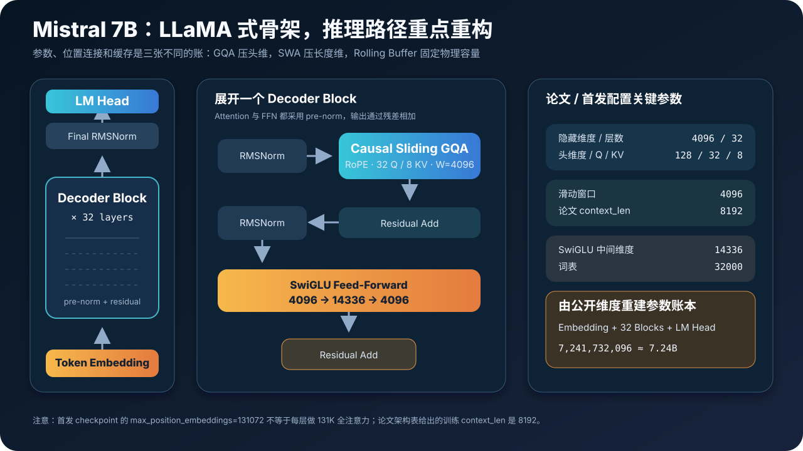
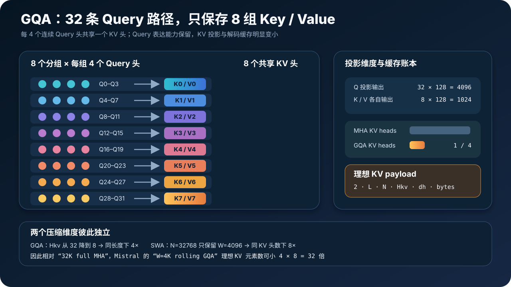
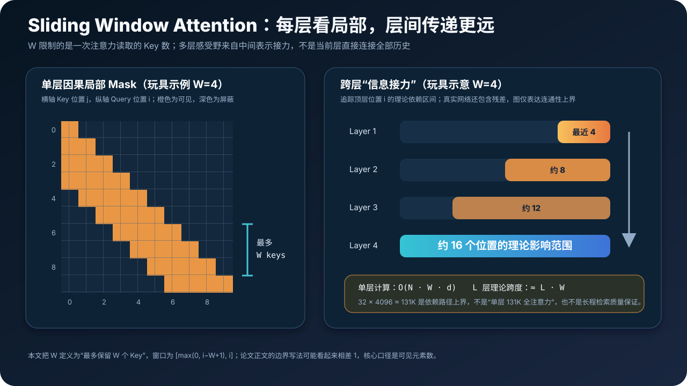
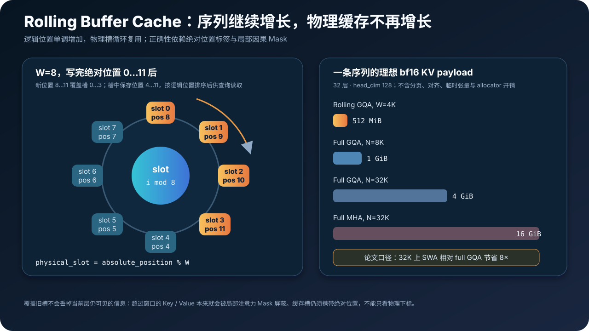
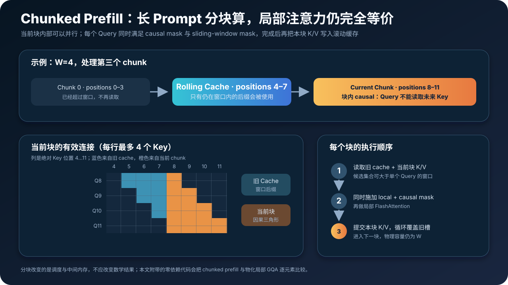
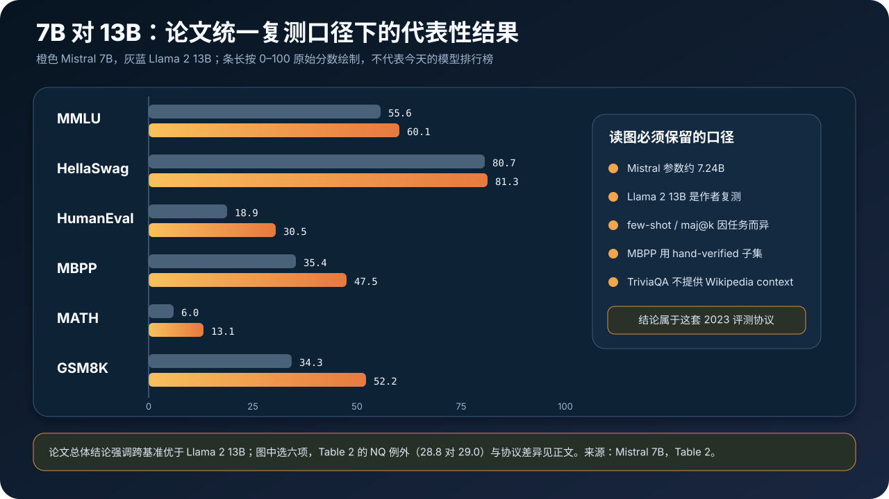

# Mistral 7B 原理与实现：GQA、滑动窗口与滚动 KV Cache 如何重写 7B 推理账本


> **论文**：Mistral 7B<br>
> **作者**：Albert Q. Jiang 等 18 位作者（Mistral AI）<br>
> **时间**：模型于 2023 年 9 月发布；论文于 2023 年 10 月提交 arXiv<br>
> **关键词**：Grouped-Query Attention、Sliding Window Attention、Rolling Buffer Cache、Chunked Prefill、RoPE、SwiGLU<br>
> **原文**：[arXiv](https://arxiv.org/abs/2310.06825) · [PDF](https://arxiv.org/pdf/2310.06825) · [官方发布页](https://mistral.ai/news/announcing-mistral-7b/)<br>
> **首发配置**：[Mistral-7B-v0.1 config.json](https://huggingface.co/mistralai/Mistral-7B-v0.1/blob/29b1844d9adc92c92bbc4e2e6ee33f29a0b3c6a7/config.json) · [原始源码仓库](https://github.com/mistralai/mistral-src)<br>
> **本文代码**：[零依赖 Mistral 7B 最小实现](./code/mistral7b_minimal.py)

> 本文严格讨论 **Mistral 7B v0.1 论文与首发 checkpoint**。后来的 v0.2、v0.3、Mixtral、Ministral 以及各类社区量化版可能拥有不同上下文、词表、RoPE 或注意力配置，不能把这些特征倒推回 2023 年论文。

Mistral 7B 的价值，不只在于“一个 7B 模型赢了部分 13B 模型”。它更重要的贡献是把三张工程账分开优化：

- 32 个 Query 头保留注意力表达能力，只有 8 个 Key/Value 头进入缓存；
- 每层只读取最近 4096 个位置，把注意力从 $O(N^2)$ 改成 $O(NW)$；
- KV Cache 用固定大小的循环缓冲区，序列继续增长也不再线性扩容；
- 长 prompt 再按窗口分块 prefill，避免一次物化全部历史中间状态。

这些设计分别作用于**头维、序列维、物理存储和调度方式**。把它们混成一句“滑窗更快”，会错过这篇论文最值得学习的系统思维。

---

## 0. 一分钟抓住 Mistral 7B



先记住 16 个结论：

1. **Mistral 7B 是 32 层 decoder-only Transformer。** 隐藏维度 4096、头维度 128、SwiGLU 中间维度 14336。
2. **“7B”是产品级简称。** 由首发公开尺寸重建，未绑权重的 checkpoint 约有 **7,241,732,096 个参数，即 7.24B**；官方发布页也使用 7.3B 口径。
3. **它不是一套全新 Transformer 骨架。** RMSNorm、RoPE、SwiGLU 和 pre-norm residual 都延续了 LLaMA 一类成熟设计。
4. **Attention 的两个关键变化是 GQA 与 SWA。** 前者减少 KV 头，后者减少每个 Query 可见的 token 数。
5. **32 个 Query 头只对应 8 个 KV 头。** 每 4 个 Query 头共享一组 K/V，理想 KV Cache 相对同宽度 MHA 缩小 4 倍。
6. **每层只做局部因果注意力。** 窗口 $W=4096$，单层不会直接连接全部长历史。
7. **滑窗把注意力连接数从 $O(N^2)$ 限制为 $O(NW)$。** 当 $N\gg W$ 时才体现明显的渐近收益。
8. **多层会扩大理论感受野。** 局部表示逐层传递，32 层的连通路径可覆盖约 $32\times4096\approx131K$ 的跨度。
9. **131K 是依赖路径上界，不是单层全注意力长度。** 它也不自动等于训练上下文或可靠的 131K 检索能力。
10. **论文架构表给出的 `context_len` 是 8192。** 首发 config 中的 `max_position_embeddings=131072` 不能替换这一事实。
11. **Rolling Buffer 用 `position % W` 复用槽位。** 超出窗口的 K/V 本来就不可见，所以可安全覆盖，但必须保留绝对位置标签。
12. **论文报告 32K 序列上缓存缩小 8 倍。** 这是固定 4K 窗口相对 full GQA 的长度维收益；不是 GQA 本身的收益。
13. **GQA 4× 与 32K 上 SWA 8× 可以相乘。** 相对 32K full MHA，理想 KV 元素数可小 32 倍；这是本文的组合推导，不是论文的单项 headline。
14. **论文报告在 $N=16K,W=4K$ 时，定制 FlashAttention/xFormers 路径约快 2 倍。** 这是特定实现、硬件和形状下的结果，不是所有端到端请求都固定 2×。
15. **基准结论属于论文自己的统一复测协议。** 论文概述称其在所有基准上超过 Llama 2 13B；逐项 Table 2 中 NQ 实为 28.8 对 29.0，因此更严谨的表述是总体及绝大多数逐项更强，而且 few-shot、数据子集和上下文设置必须一起读。
16. **论文没有公开完整训练配方。** 数据构成、token 数、训练 FLOPs、优化器超参数等不足以完整复现预训练；开放权重不等于开放训练科学。

一句话概括：

> Mistral 7B 没有靠单一“神奇模块”取胜，而是把能力密度、局部注意力和有界缓存做成一套协同设计，让较小模型同时获得更强基准表现与更低推理开销。

---

## 1. 论文真正解决的，是三维约束而不是单一榜单

大语言模型常被压成一条轴：参数越多，能力越强。但真实部署至少有三条轴：

$$
\boxed{
\text{能力质量}
\quad\times\quad
\text{训练成本}
\quad\times\quad
\text{推理成本}
}
$$

参数量主要描述权重容量，却没有直接回答：

- 每生成一个 token 要读取多少权重；
- Attention 要计算多少 token 对；
- 一条长序列要占多少 KV Cache；
- batch 增大后显存还能容纳多少并发请求；
- prompt 很长时 prefill 峰值中间内存是多少。

Mistral 7B 的论文把模型质量与推理工程放在同一叙事里。作者不仅报告基准，还专门解释了：

1. GQA 如何减少 KV 头；
2. SWA 如何改变 token 连接；
3. Rolling Buffer 如何固定缓存；
4. Pre-fill / Chunking 如何处理已知长 prompt；
5. 定制 FlashAttention/xFormers 如何把稀疏连接变成真实速度。

这也是它与“只发布一个强 checkpoint”的区别：论文试图说明**为什么这个模型更适合实际推理**。

---

## 2. 完整架构：哪些是继承，哪些是 Mistral 的重点

论文 Table 1 给出的核心尺寸如下：

| 字段 | 数值 | 含义 |
|---|---:|---|
| `dim` | 4096 | 残差流隐藏维度 |
| `n_layers` | 32 | Decoder Block 数量 |
| `head_dim` | 128 | 每个注意力头维度 |
| `hidden_dim` | 14336 | SwiGLU 中间维度 |
| `n_heads` | 32 | Query 头数量 |
| `n_kv_heads` | 8 | Key / Value 头数量 |
| `window_size` | 4096 | 滑动窗口大小 |
| `context_len` | 8192 | 论文架构表中的训练上下文 |
| `vocab_size` | 32000 | 词表大小 |

公开首发配置还包含：

```json
{
  "hidden_size": 4096,
  "intermediate_size": 14336,
  "num_hidden_layers": 32,
  "num_attention_heads": 32,
  "num_key_value_heads": 8,
  "sliding_window": 4096,
  "max_position_embeddings": 131072,
  "rms_norm_eps": 1e-5,
  "rope_theta": 10000.0,
  "tie_word_embeddings": false,
  "vocab_size": 32000
}
```

### 2.1 一个 Decoder Block

对第 $\ell$ 层输入 $x_\ell$，高层结构可写为：

$$
h_\ell
=x_\ell+operatorname{SWGQA}
\left(\operatorname{RMSNorm}(x_\ell)\right),
$$

$$
x_{\ell+1}
=h_\ell+operatorname{SwiGLU}
\left(\operatorname{RMSNorm}(h_\ell)\right).
$$

其中 `SWGQA` 表示：

- 因果 self-attention；
- RoPE 旋转位置编码；
- 32 个 Query 头、8 个 KV 头；
- 每层只读取局部窗口。

### 2.2 与 LLaMA 相比，真正值得单独研究的部分

| 组件 | Mistral 7B | 主要作用 |
|---|---|---|
| RMSNorm | 延续 LLaMA 式 pre-norm | 稳定深层训练，省去均值中心化 |
| RoPE | `rope_theta=10000` | 把相对位置信息注入 Q/K |
| SwiGLU | `4096 → 14336 → 4096` | 提升 FFN 表达能力 |
| GQA | `32 Q / 8 KV` | 减少 KV 投影与缓存 |
| SWA | `W=4096` | 限制每层 token 连接数 |
| Rolling Buffer | 固定 $W$ 个位置 | 让解码缓存不随总历史继续增长 |
| Chunked Prefill | 按窗口分块 | 控制长 prompt 的峰值内存 |

所以，Mistral 的创新重点不是重写全部 Block，而是让成熟骨架具备更好的**注意力工作量与缓存边界**。

---

## 3. 为什么叫 7B：把参数账本算到个位

公开配置没有绑输入 Embedding 与输出 LM Head，因此二者各有：

$$
P_{\text{embed}}
=Vd
=32000\times4096
=131{,}072{,}000.
$$

### 3.1 每层 GQA 参数

Query 和输出投影仍为 $d\times d$：

$$
P_Q=P_O=4096\times4096=16{,}777{,}216.
$$

8 个 KV 头的总维度是：

$$
d_{kv}=8\times128=1024.
$$

所以 Key 与 Value 投影各自只有：

$$
P_K=P_V=4096\times1024=4{,}194{,}304.
$$

单层 Attention 合计：

$$
P_{\text{attn/layer}}
=P_Q+P_K+P_V+P_O
=41{,}943{,}040.
$$

### 3.2 每层 SwiGLU 参数

SwiGLU 有 gate、up、down 三个矩阵：

$$
P_{\text{ffn/layer}}
=3dd_{ff}
=3\times4096\times14336
=176{,}160{,}768.
$$

两个 RMSNorm 权重向量再加 $2d=8192$。

### 3.3 总账

| 模块 | 参数量 |
|---|---:|
| Token Embedding | 131,072,000 |
| 32 层 Attention | 1,342,177,280 |
| 32 层 SwiGLU | 5,637,144,576 |
| 32 层内 RMSNorm | 262,144 |
| Final RMSNorm | 4,096 |
| 未绑定 LM Head | 131,072,000 |
| **总计** | **7,241,732,096** |

这解释了三个口径：

- 论文与产品名使用 **7B**；
- 官方发布页称 **7.3B**；
- 按公开结构精确重建约 **7.24B**。

三者没有矛盾，只是舍入精度不同。

本文代码直接重算并断言这一结果：

```python
ledger = parameter_ledger(Mistral7BConfig())
assert ledger["total"] == 7_241_732_096
```

---

## 4. GQA：压的是 KV 头，不是 Query 头



### 4.1 从 MHA 到 MQA，再到 GQA

标准 Multi-Head Attention（MHA）让每个 Query 头拥有自己的 K/V：

$$
H_Q=H_K=H_V=32.
$$

Multi-Query Attention（MQA）走到另一个极端：

$$
H_Q=32,qquad H_K=H_V=1.
$$

Grouped-Query Attention（GQA）位于二者之间。Mistral 取：

$$
H_Q=32,qquad H_{KV}=8,qquad
g=\frac{H_Q}{H_{KV}}=4.
$$

第 $h$ 个 Query 头映射到：

$$
\operatorname{kv\_head}(h)
=\left\lfloor\frac{h}{4}\right\rfloor.
$$

因此：

```text
Q0  Q1  Q2  Q3   → K0 / V0
Q4  Q5  Q6  Q7   → K1 / V1
...
Q28 Q29 Q30 Q31  → K7 / V7
```

### 4.2 数学表达

对 Query 头 $h$：

$$
Q_h=XW_h^Q,
$$

$$
K_{r(h)}=XW_{r(h)}^K,qquad
V_{r(h)}=XW_{r(h)}^V,
$$

$$
O_h
=\operatorname{softmax}
\left(
\frac{Q_hK_{r(h)}^\top}{\sqrt{d_h}}+M
\right)V_{r(h)},
$$

其中 $r(h)=\lfloor h/4\rfloor$。

共享发生在 K/V，不发生在 Query：32 个 Query 投影仍可学习不同的检索方向，只有被读取的内容表示被四个 Query 头共用。

### 4.3 为什么这会直接减少解码成本

自回归解码时，新 token 的每个 Query 都要读取历史 K/V。理想缓存元素数为：

$$
E_{KV}
=2\cdot L\cdot N\cdot H_{KV}\cdot d_h.
$$

固定层数、长度和头维度，Mistral GQA 相对 32 头 MHA 的比率为：

$$
\frac{E_{\text{GQA}}}{E_{\text{MHA}}}
=\frac{8}{32}
=\frac14.
$$

这不只是“显存少一点”。解码 Attention 往往受 KV 读取带宽约束，少读 4 倍 KV 元素，也给吞吐留下更大空间。

### 4.4 GQA 不等于把 32 个头复制成 8 个头

常见错误实现是先显式执行：

```python
k = repeat_interleave(k, repeats=4, dim=head_axis)
v = repeat_interleave(v, repeats=4, dim=head_axis)
```

数学上可以等价，物理上却可能重新制造 32 头中间张量。高效 kernel 应让多个 Q 头直接索引同一 K/V 头，而不是先把数据复制四份。

本文参考代码的映射保持为一个整数索引：

```python
def query_to_kv_head(query_head, *, n_query_heads, n_kv_heads):
    group_size = n_query_heads // n_kv_heads
    return query_head // group_size
```

---

## 5. Sliding Window Attention：把全历史连接改成移动带状连接



### 5.1 全因果注意力

长度为 $N$ 的标准因果 Attention 中，第 $i$ 个 Query 可见：

$$
\mathcal K_i^{\text{full}}
=\{0,1,\ldots,i\}.
$$

总连接数是：

$$
\sum_{i=0}^{N-1}(i+1)
=\frac{N(N+1)}2
=O(N^2).
$$

### 5.2 局部因果注意力

本文把 $W$ 明确定义为“一个 Query 最多保留的 Key 数”。于是：

$$
\mathcal K_i^{\text{SWA}}
=\{j\mid \max(0,i-W+1)\le j\le i\}.
$$

Mask 为：

$$
M_{ij}=
\begin{cases}
0,&\max(0,i-W+1)\le j\le i,\\
-\infty,&\text{otherwise}.
\end{cases}
$$

当 $i\ge W-1$ 时，每行只有 $W$ 个有效位置，总连接数约为：

$$
O(NW).
$$

Mistral 使用：

$$
W=4096.
$$

### 5.3 一个容易踩的 off-by-one

论文正文用“位置 $i$ 可关注 $[i-W,i]$”来描述窗口，这个闭区间按字面数是 $W+1$ 个位置；不同 kernel 对“窗口大小”也可能用“左侧 token 数”或“总 Key 数”定义。

工程实现必须先确定口径：

- 若 $W$ 表示**总可见 Key 数**：左边界是 $i-W+1$；
- 若 $W$ 表示**向左回看距离**：闭区间可写成 $[i-W,i]$。

本文代码和缓存账本统一使用第一种口径。关键不是争论符号，而是确保 Mask、缓存容量和测试 oracle 使用同一个定义。

### 5.4 复杂度为什么不是自动等于速度

把连接数从 $N^2$ 降到 $NW$ 只是算法上界。实际速度还取决于：

- kernel 是否真正跳过被 Mask 的块；
- 窗口能否与 tile 尺寸良好对齐；
- GQA 是否避免显式复制 K/V；
- 序列、batch、头维度是否足以占满 GPU；
- 端到端请求是否还受 FFN、采样、调度或网络限制。

如果只是先算完整 $QK^\top$，再把窗口外元素设为 $-\infty$，计算量仍是 $O(N^2)$，只是在结果上模拟了局部注意力。

---

## 6. 每层只看 4K，为什么理论上能影响更远历史

这是论文最容易被一句话过度营销的部分。

设第 $\ell$ 层位置 $i$ 的表示是 $h_i^{(\ell)}$。单层只直接读取：

$$
h_i^{(\ell)}
\leftarrow
h_j^{(\ell-1)},qquad
j\in[i-W+1,i].
$$

但 $h_j^{(\ell-1)}$ 本身已经聚合了更早位置。递归展开，理论依赖集合满足：

$$
\mathcal R_i^{(\ell)}
=\bigcup_{j=i-W+1}^{i}\mathcal R_j^{(\ell-1)}.
$$

忽略边界和 off-by-one，感受野跨度近似：

$$
R_\ell\approx \ell W.
$$

代入 Mistral 的 32 层和 4096 窗口：

$$
32\times4096=131072.
$$

### 6.1 正确解释：存在一条局部传播路径

距离当前 token 很远的信息，可以先被较早位置压入中间表示，再被后续局部层逐步传递过来。

### 6.2 错误解释一：每层都直接做 131K Attention

不对。每层仍只读取局部窗口，单层没有当前 Query 到全部 131K Key 的直接边。

### 6.3 错误解释二：模型可靠记住 131K 中任意细节

也不对。理论连通性不等于信息保真：

- 远程信息要跨越多次非线性变换；
- 中间表示容量有限；
- 残差与局部注意力可能更偏好邻近信息；
- 训练数据是否包含足够长依赖仍然关键；
- needle retrieval、长文推理和困惑度是不同指标。

因此 `32 × 4096 ≈ 131K` 只能证明**图上有路径**，不能单独证明**任务上会用好这条路径**。

---

## 7. `context_len=8192` 与 `max_position_embeddings=131072` 为什么不冲突

这两个数字来自不同层次：

| 数字 | 来源 | 更准确的含义 |
|---:|---|---|
| 8192 | 论文 Table 1 的 `context_len` | 论文披露的训练上下文长度 |
| 4096 | 论文与配置的 `window_size` | 单层局部注意力窗口 |
| 131072 | 首发 checkpoint 的 `max_position_embeddings` | 配置中的位置上限 / RoPE 索引容量 |
| 约 131K | $32\times4096$ 推导 | 32 层局部连接的理论传播跨度 |

首发配置把 `max_position_embeddings` 设成 131072，恰好与理论传播跨度同量级。但不能反向推导：

```text
max_position_embeddings = 131072
       ⇏ 训练时每个样本都是 131072 tokens
       ⇏ 每层直接读取 131072 个 K/V
       ⇏ 131072 上的任务质量已经被论文完整验证
```

在 RoPE 模型里，这个字段通常参与位置索引和框架检查；实际可用上下文还受到训练分布、缓存实现、mask、数值外推和服务端限制共同约束。

---

## 8. Rolling Buffer Cache：逻辑时间增长，物理槽位循环



### 8.1 为什么 full KV Cache 会线性增长

普通自回归解码会保存所有历史层的 K/V：

$$
\text{KV bytes}
=2\cdot L\cdot N\cdot H_{KV}\cdot d_h\cdot b,
$$

其中：

- 第一个 2 表示 K 与 V；
- $L$ 是层数；
- $N$ 是缓存 token 数；
- $H_{KV}$ 是 KV 头数；
- $d_h$ 是头维度；
- $b$ 是每元素字节数。

如果 Attention 已经规定窗口外 Key 永远不可见，那么继续保留它们没有数学价值。

### 8.2 物理槽位映射

Rolling Buffer 只分配 $W$ 个位置槽。绝对位置 $i$ 写入：

$$
s(i)=i\bmod W.
$$

当 $i\ge W$，它覆盖位置 $i-W$ 的槽：

$$
s(i)=s(i-W).
$$

这正好安全，因为对 Query $i$ 而言，位置 $i-W$ 已经离开“最多 $W$ 个 Key”的有效集合。

### 8.3 为什么不能只保存槽号

窗口绕回后，物理顺序和逻辑顺序不同。以 $W=4$、写完位置 0 到 6 为例：

```text
physical slot:  0  1  2  3
absolute pos:   4  5  6  3
logical order: [3, 4, 5, 6]
```

所以每个槽至少需要能够恢复：

- 它当前对应哪个绝对位置；
- 该位置对当前 Query 是否仍在窗口内；
- RoPE 已按哪个位置旋转；
- 因果顺序如何排列。

只按物理下标 0、1、2、3 读取，会在 wrap-around 后把时间顺序弄错。

### 8.4 最小实现

```python
class RollingKVCache:
    def __init__(self, window):
        self.window = window
        self.slots = [None] * window

    def append(self, position, key, value):
        self.slots[position % self.window] = (position, key, value)

    def visible(self, query_position):
        left = max(0, query_position - self.window + 1)
        entries = [
            item for item in self.slots
            if item is not None and left <= item[0] <= query_position
        ]
        return sorted(entries, key=lambda item: item[0])
```

真实 kernel 不一定真的持有 Python 式 `position` 对象；它可以用批次元数据、页表、环形偏移和 mask 恢复逻辑位置。但不变量相同。

---

## 9. KV Cache 算账：512 MiB、1 GiB、4 GiB 与 16 GiB

取 bf16，即 $b=2$ 字节。

### 9.1 Mistral 的 4K Rolling GQA

$$
\begin{aligned}
\text{bytes}
&=2\times32\times4096\times8\times128\times2\\
&=536{,}870{,}912\ \text{bytes}\\
&=512\ \text{MiB}.
\end{aligned}
$$

这是一条序列、所有 32 层的理想 K/V 数据载荷。

### 9.2 8K full GQA

长度翻倍：

$$
2\times32\times8192\times8\times128\times2
=1\ \text{GiB}.
$$

因此官方发布页说 8192 长度时 Rolling Buffer 可把缓存减半。

### 9.3 32K full GQA

$$
2\times32\times32768\times8\times128\times2
=4\ \text{GiB}.
$$

相对固定 4K Rolling GQA：

$$
\frac{32K}{4K}=8.
$$

这就是论文报告的 32K 上 **8× cache reduction**。

### 9.4 32K full MHA

若不用 GQA，而是保存 32 个 KV 头：

$$
2\times32\times32768\times32\times128\times2
=16\ \text{GiB}.
$$

相对 Mistral 的 4K Rolling GQA：

$$
\frac{16\ \text{GiB}}{512\ \text{MiB}}=32.
$$

这个 32× 可以分解为：

$$
\underbrace{4\times}_{\text{GQA: 32 KV heads → 8}}
\quad\times\quad
\underbrace{8\times}_{\text{SWA: 32K tokens → 4K}}
=32\times.
$$

### 9.5 这些数字不等于进程显存

上述只计算理想 K/V payload，不包含：

- 权重和量化元数据；
- 激活与临时 workspace；
- CUDA allocator 对齐和碎片；
- batch / beam / speculative 分支；
- 分页表、块元数据；
- logits、采样器和运行时缓存。

所以它适合比较设计比例，不应当直接当作“部署总显存”。

---

## 10. Prefill 与 Chunking：已知 Prompt 不必逐 token 解码



### 10.1 Decode 与 Prefill 是不同阶段

自回归生成有两个典型阶段：

| 阶段 | 输入是否已知 | 主要形态 |
|---|---|---|
| Prefill | 整个 prompt 已知 | 多个 Query 可并行，写入初始 KV Cache |
| Decode | 每次只新来一个 token | 单 Query 读取历史 K/V，带宽敏感 |

若 prompt 很长，逐 token prefill 会浪费并行性；一次处理完整 prompt 又可能制造很大中间张量。

### 10.2 按窗口大小切块

论文建议把长 prompt 分成 chunk，并可选 $W$ 作为 chunk size：

```text
Chunk 0: positions 0 ... W-1
Chunk 1: positions W ... 2W-1
Chunk 2: positions 2W ... 3W-1
...
```

处理当前 chunk 时，候选 Key 来自：

1. 上一个阶段留下的 Rolling Cache；
2. 当前 chunk 自身的 K/V。

但每个 Query $i$ 最终仍只保留：

$$
\max(0,i-W+1)\le j\le i.
$$

也就是同时应用：

- **causal mask**：$j\le i$，不能看当前块未来位置；
- **window mask**：$j\ge i-W+1$，不能看过旧历史。

### 10.3 为什么候选集合可大于最终窗口

当前块开始位置附近的 Query 需要较多旧 cache；当前块末尾 Query 则主要读取当前块。以 $W=4$、当前块 8–11 为例：

```text
Q8  → K5, K6, K7, K8
Q9  → K6, K7, K8, K9
Q10 → K7, K8, K9, K10
Q11 → K8, K9, K10, K11
```

旧 cache 中的 `K4` 对 `Q8` 已超窗，当前块中的 `K9..K11` 对 `Q8` 属于未来。二者都必须被 Mask。

### 10.4 分块应只改变调度，不改变结果

如果 mask 与位置都正确，那么：

$$
\operatorname{ChunkedPrefill}(Q,K,V)
=\operatorname{MaterializedLocalAttention}(Q,K,V).
$$

本文代码会逐元素验证这条等价性，而不只比较张量形状。

---

## 11. SWA 与 FlashAttention：稀疏连接必须变成真正少算

Sliding Window 是连接模式，FlashAttention 是 IO-aware kernel 组织；它们不是同一个概念。

### 11.1 仅有 Mask 不足以获得复杂度收益

下面的写法在数学上得到局部结果，但通常仍会物化 $N\times N$ 分数：

```python
scores = q @ k.transpose(-1, -2)   # 已经做了 full N²
scores.masked_fill_(outside_window, float("-inf"))
probs = scores.softmax(dim=-1)
output = probs @ v
```

它没有利用带状结构跳过窗口外 tile。

### 11.2 正确方向：只调度与窗口相交的 tile

局部 FlashAttention 会让 Query tile 只扫描相邻 K/V tile，同时在 tile 边界处理：

- 因果三角形；
- 左窗口边界；
- 序列起点；
- padding 与不同长度样本；
- GQA 的多 Q 头共享 K/V。

这样既不物化完整分数矩阵，也不计算绝大多数被 Mask 的块。

### 11.3 论文的 2× 应怎样读

论文报告：对长度 $N=16K$、窗口 $W=4K$，在修改后的 FlashAttention 与 xFormers 实现中，SWA 相对 vanilla attention 约快 2 倍。

这个数字同时依赖：

- $N/W=4$ 的稀疏比例；
- 当时的 kernel 版本；
- GPU 与数据类型；
- tile 边界与 occupancy；
- 基线选择。

它不能推出：

```text
任意 prompt 都快 2×
任意服务吞吐都高 2×
端到端延迟必定减半
```

短序列上 $N\le W$ 时，SWA 甚至与 full causal attention 拥有相同连接；这时主要收益来自 GQA 和 kernel 本身，而不是长度稀疏。

---

## 12. RoPE、RMSNorm 与 SwiGLU：Mistral 没有重造这些轮子

### 12.1 RMSNorm

对向量 $x\in\mathbb R^d$：

$$
\operatorname{RMSNorm}(x)
=g\odot
\frac{x}{\sqrt{\frac1d\sum_{j=1}^{d}x_j^2+\epsilon}},
$$

首发配置使用：

$$
\epsilon=10^{-5}.
$$

与 LayerNorm 相比，它不减均值，只有一个逐通道缩放参数 $g$。

### 12.2 RoPE

RoPE 对 Q/K 的二维通道对施加随位置变化的旋转，使内积自然携带相对位置信息：

$$
q_i'=R(i)q_i,qquad k_j'=R(j)k_j,
$$

$$
(q_i')^\top k_j'
=q_i^\top R(j-i)k_j.
$$

首发配置 `rope_theta=10000`。Rolling Buffer 覆盖的是 K/V 的物理槽，不应把绝对位置也重置为槽号，否则旋转相位会错误。

### 12.3 SwiGLU

$$
\operatorname{SwiGLU}(x)
=W_2\left(
\operatorname{SiLU}(W_1x)\odot W_3x
\right).
$$

Mistral 的中间维度 14336，比简单的 $4d=16384$ 略小，但因为 SwiGLU 有三个矩阵，FFN 仍占总参数的绝大部分。

这些组件的价值在于提供一个已经被验证的训练骨架，让论文可以把注意力与缓存作为主要变量。

---

## 13. 零依赖代码：同时验证 GQA、SWA、Rolling Cache 与 Chunking

本文附带的 [mistral7b_minimal.py](./code/mistral7b_minimal.py) 只使用 Python 标准库。它不是性能实现，目标是把四个不变量变成可执行测试。

运行：

```bash
python3 papers/to-2026/code/mistral7b_minimal.py
```

预期输出：

```text
Mistral 7B architecture ledger
  query heads / KV heads: 32 / 8
  query heads per KV head: 4
  parameters from public dimensions: 7,241,732,096 (~7.24B)

Ideal bf16 KV payload for one sequence
  rolling GQA, W=4096: 512 MiB
  full GQA, N=8192:     1024 MiB
  full GQA, N=32768:    4096 MiB
  full MHA, N=32768:    16384 MiB
  SWA factor at 32K:    8x
  GQA+SWA vs full MHA:  32x

Correctness checks
  materialized local GQA == rolling decode: yes
  materialized local GQA == chunked prefill: yes
  slots after positions 0..6 with W=4: [4, 5, 6, 3]
  visible absolute positions for query 6: [3, 4, 5, 6]
```

### 13.1 物化局部参考实现

参考实现显式构造当前 Query 的合法位置：

```python
for position, query_heads in enumerate(q):
    start = max(0, position - window + 1)
    positions = list(range(start, position + 1))

    for query_head, query in enumerate(query_heads):
        kv_head = query_to_kv_head(
            query_head,
            n_query_heads=n_query_heads,
            n_kv_heads=n_kv_heads,
        )
        scores = [
            scale * dot(query, k[index][kv_head])
            for index in positions
        ]
```

它慢，但非常适合当 correctness oracle。

### 13.2 Rolling Decode

逐 token 解码先写入当前 K/V，再读取按绝对位置排序的有效槽：

```python
for position in range(len(q)):
    cache.append(position, k[position], v[position])
    entries = cache.visible(position)
    output.append(attend(q[position], entries))
```

### 13.3 Chunked Prefill

分块版本先把旧 cache 与当前块组成候选集合，对块内每个 Query 独立应用窗口和因果边界，整个块算完后再提交本块 K/V：

```python
for chunk_start in range(0, len(q), chunk_size):
    current = make_entries(chunk_start, chunk_end)
    candidates = old_cache + current

    for position in range(chunk_start, chunk_end):
        left = max(0, position - window + 1)
        visible = [
            item for item in candidates
            if left <= item.position <= position
        ]
        output.append(attend(q[position], visible))

    commit_to_rolling_cache(current)
```

### 13.4 测试不是“形状能跑通”

脚本使用固定随机种子构造 8 Query 头 / 2 KV 头的 4:1 玩具 GQA，然后断言：

```python
reference = materialized_local_gqa(q, k, v, window=4)
decoded = rolling_decode(q, k, v, window=4)
prefilled = chunked_prefill(q, k, v, window=4, chunk_size=4)

assert_close(reference, decoded)
assert_close(reference, prefilled)
```

生产实现需要 CUDA/Triton、向量化、块级 mask、变长 batch 和反向传播；但这些优化不能破坏这里验证的数学不变量。

---

## 14. 基座模型实验：7B 为什么能与 13B 比



论文按不同能力类别组织评测：

| 类别 | 任务 | 设置 |
|---|---|---|
| Commonsense | HellaSwag、WinoGrande、PIQA、SIQA、OpenbookQA、ARC-E/C、CommonsenseQA | 0-shot |
| World knowledge | NaturalQuestions、TriviaQA | 5-shot |
| Reading comprehension | BoolQ、QuAC | 0-shot |
| Math | GSM8K、MATH | 8-shot maj@8 / 4-shot maj@4 |
| Code | HumanEval、MBPP | 0-shot / 3-shot |
| Aggregate | MMLU、BBH、AGI Eval | 5-shot / 3-shot / 3–5-shot |

论文 Table 2 的逐项结果如下：

| 模型 | MMLU | HellaSwag | WinoGrande | PIQA | ARC-E | ARC-C | NQ | TriviaQA | HumanEval | MBPP | MATH | GSM8K |
|---|---:|---:|---:|---:|---:|---:|---:|---:|---:|---:|---:|---:|
| Llama 2 7B | 44.4 | 77.1 | 69.5 | 77.9 | 68.7 | 43.2 | 24.7 | 63.8 | 11.6 | 26.1 | 3.9 | 16.0 |
| Llama 2 13B | 55.6 | 80.7 | 72.9 | 80.8 | 75.2 | 48.8 | **29.0** | 69.6 | 18.9 | 35.4 | 6.0 | 34.3 |
| CodeLlama 7B | 36.9 | 62.9 | 62.3 | 72.8 | 59.4 | 34.5 | 11.0 | 34.9 | 31.1 | 52.5 | 5.2 | 20.8 |
| **Mistral 7B** | **60.1** | **81.3** | **75.3** | **83.0** | **80.0** | **55.5** | 28.8 | **69.9** | 30.5 | 47.5 | **13.1** | **52.2** |

从表中可以读出：

- Mistral 7B 在列出的所有任务上都高于 Llama 2 13B；
- NQ 上略低于 Llama 2 13B 的 29.0，但仍高于 Llama 2 7B；这里“所有测试基准超过 13B”的论文概述与单列 NQ 的 28.8/29.0 存在细微张力，更稳妥的说法是**总体及绝大多数逐项更强**；
- HumanEval 30.5 接近 CodeLlama 7B 的 31.1；
- MBPP、MATH、GSM8K 上相对 Llama 2 13B 的提升很明显；
- 世界知识类的模型尺寸优势比推理、理解和 STEM 更弱。

### 14.1 为什么不要把表格当作永久排行榜

论文明确说明了一些协议差异：

- MBPP 使用 hand-verified 子集；
- TriviaQA 不给 Wikipedia context；
- 数学任务使用 majority voting；
- shot 数因任务不同；
- AGI Eval 只统计英文选择题。

基准分数只能与完整协议一起搬运。后来框架、prompt 模板、tokenizer、去污染和采样设置变化后，数字未必能直接横比。

### 14.2 架构贡献与训练贡献不能从终点表格拆开

Mistral 的强结果可能共同来自：

- 数据质量与混合比例；
- 训练 token 数与课程；
- 优化器和学习率调度；
- tokenizer 与去重；
- GQA/SWA 架构；
- 工程稳定性。

由于论文没有完整公开训练配方，不能只凭结果断言“提升全部由滑窗造成”。GQA 与 SWA 的系统收益可以从结构直接分析；质量收益的归因需要消融实验，而论文并未给出足够完整的架构消融。

---

## 15. “等效 Llama 2 尺寸”图应该怎样读

论文把 Mistral 分类别的性能，与不同尺寸 Llama 2 拟合后估计“等效模型尺寸”：

- Reasoning、Comprehension、STEM 等类别中，Mistral 7B 大致相当于超过 3 倍参数的 Llama 2；
- Knowledge 类别只约 1.9 倍。

这不是说 Mistral 物理上拥有 21B 参数，也不是通用 scaling law。它是：

1. 在选定任务类别上取得一个分数；
2. 用 Llama 2 不同参数规模的曲线做插值；
3. 找到达到相近分数所对应的 Llama 2 参数量。

作者把知识类差距较小归因于有限参数容量：世界知识记忆更依赖模型存储容量，而推理和理解更容易从更高训练效率与数据质量中获益。

这个解释合理，但仍应视为论文的经验分析，不是严格因果证明。

---

## 16. Mistral 7B Instruct：基座、指令微调与安全是三件事

论文还提供 `Mistral 7B – Instruct` 作为初步指令微调模型。

### 16.1 训练披露

作者称它只使用公开可获得的 Hugging Face 数据集，没有专有数据或训练 tricks。论文没有把它描述为一个经过复杂 RLHF 管线的完整聊天产品。

### 16.2 自动评测

论文 Table 3 的 Chatbot Arena ELO / MT-Bench 结果：

| 模型 | Chatbot Arena ELO | MT-Bench |
|---|---:|---:|
| WizardLM 13B | 1047 | 7.20 |
| **Mistral 7B Instruct** | **1031** | **6.84 ± 0.07** |
| Llama 2 13B Chat | 1012 | 6.65 |
| Vicuna 13B | 1041 | 6.57 |
| Llama 2 7B Chat | 985 | 6.27 |
| Vicuna 7B | 997 | 6.17 |
| Alpaca 13B | 914 | 4.53 |

论文还报告截至 2023 年 10 月 6 日的盲测中，Mistral 7B Instruct 相对 Llama 2 13B Chat 获得 5020 对 4143 的偏好票。

### 16.3 它不是基座模型的同义词

| 名称 | 目标 |
|---|---|
| Mistral 7B v0.1 | next-token 预训练基座，适合继续微调 |
| Mistral 7B Instruct v0.1 | 在公开指令数据上继续训练，改善对话遵循 |

比较 benchmark、部署 chat template 或讨论安全时，必须说明是哪一个 checkpoint。

---

## 17. Guardrails 实验：系统提示有效，但不是安全证明

官方发布页明确提醒：首发 Instruct 模型没有内置 moderation 机制。论文则用两个小实验讨论可添加的防护方式。

### 17.1 系统提示拒答

作者构造一个推荐的安全 system prompt，并在 175 个不安全请求上评估。论文报告该提示在这组请求上实现 100% 拒答。

MT-Bench 变化为：

| 设置 | MT-Bench |
|---|---:|
| 无 guardrail prompt | 6.84 ± 0.07 |
| Llama 2 system prompt | 6.38 ± 0.07 |
| Mistral 推荐 prompt | 6.58 ± 0.05 |

这说明更严格提示会付出一定 helpfulness 分数，但专门设计的提示比直接复制其他模型提示损失更小。

### 17.2 自我反思式 moderation

作者让模型判断自己的回答是否安全，在一个人工整理、类别平衡的数据集上报告：

$$
\text{precision}=99.4\%,\qquad
\text{recall}=95.6\%.
$$

### 17.3 为什么不能扩大解释

这些结果不证明模型在开放世界中“100% 安全”：

- 175 个 prompt 很小；
- 攻击者可改写、编码、分步诱导或做多轮越狱；
- 平衡数据集上的 precision / recall 不等于真实流量基率；
- 同一个生成模型同时当回答者和裁判，会有相关误差；
- system prompt 可被后续上下文冲突影响。

正确结论是：**系统提示和自检是可用的防线组件，不是完整安全边界。** 生产环境仍需要输入/输出分类器、策略引擎、速率限制、审计、红队和场景化拒答。

---

## 18. 论文没有告诉我们的内容，同样重要

Mistral 7B 以 Apache 2.0 开放权重和代码，降低了使用门槛。但论文没有完整公开：

- 预训练数据集清单与精确混合权重；
- 训练 token 总数；
- 去重、过滤和污染检查全流程；
- 优化器、学习率、warmup、batch schedule；
- 训练硬件、总 GPU 时与能耗；
- 中间 checkpoint 与完整日志；
- GQA/SWA 对质量的独立消融；
- 长上下文能力随距离变化的系统评测。

因此需要区分：

| 开放层级 | Mistral 7B v0.1 |
|---|---|
| 论文可读 | 是 |
| 权重可下载 | 是 |
| Apache 2.0 可商用 | 是 |
| 推理源码公开 | 是 |
| 完整训练数据公开 | 否 |
| 完整训练配方与日志公开 | 否 |
| 可从头严格复现 | 证据不足 |

这不削弱模型的工程贡献，但会限制对“为什么质量更高”的科学归因。

---

## 19. 常见误解与纠正

### 误解 1：“Mistral 7B 就是 7,000,000,000 参数”

公开尺寸重建约 7.24B；7B 是舍入后的模型名。

### 误解 2：“GQA 把 32 个注意力头降成 8 个”

Query 头仍是 32；只有 K/V 头是 8。

### 误解 3：“四个 Query 头共享同一个输出”

它们共享 K/V，但各自 Q 不同，softmax 权重和输出仍可不同。

### 误解 4：“SWA 先算完整 Attention，再做 Mask”

那只能得到局部数学结果，无法获得 $O(NW)$ 的真实计算收益。

### 误解 5：“窗口 4096，所以模型永远看不到 4096 之前的信息”

单层没有直接边，但多层中间表示可逐层传播更远信息。

### 误解 6：“32 层 × 4096 = 131K，所以它是 131K 全注意力模型”

这是理论传播跨度，不是单层连接数、训练长度或可靠检索保证。

### 误解 7：“`max_position_embeddings=131072` 证明训练长度是 131K”

论文 Table 1 的 `context_len` 是 8192。配置上限与训练序列分布不是同一个字段。

### 误解 8：“Rolling Cache 会让模型忘记本来可见的 token”

正确实现只覆盖已经离开窗口的 K/V，不影响局部注意力的数学结果。

### 误解 9：“缓存只需要 `i % W`，不用绝对位置”

环绕后物理顺序不等于时间顺序；Mask 与 RoPE 都需要正确逻辑位置。

### 误解 10：“论文的 8× 是 GQA 带来的”

32K 上 8× 来自 $N/W=32768/4096$；GQA 相对 32 头 MHA 另有 4×。

### 误解 11：“组合 32× 就等于服务吞吐 32×”

32× 是理想 KV 元素数比例。端到端吞吐还受权重读取、FFN、kernel、batch 和调度限制。

### 误解 12：“7B 超过 13B 证明参数规模不重要”

它只证明架构、数据和训练质量能提高参数效率；知识类等任务仍显示容量约束。

### 误解 13：“Mistral 7B 与 Mixtral 8x7B 的 Attention 相同”

不应混淆。Mixtral v0.1 论文使用 32K fully dense attention，公开配置 `sliding_window=null`；其稀疏性发生在 MoE FFN。

### 误解 14：“Instruct 版天然有完整安全防护”

官方首发说明明确说没有内置 moderation。论文 guardrail 只是小规模实验。

---

## 20. 生产实现清单：从数学正确到系统正确

### 20.1 Attention kernel

- 是否真正跳过窗口外 tile；
- 是否原生支持 `num_q_heads != num_kv_heads`；
- 是否避免显式 `repeat_kv`；
- 左边界与 causal diagonal 是否一致；
- 短序列、最后不完整 tile 是否正确；
- fp16/bf16 的 online softmax 是否数值稳定。

### 20.2 KV Cache

- 槽位是否携带或可恢复绝对位置；
- wrap-around 后逻辑排序是否正确；
- 变长 batch 是否各自维护游标；
- beam fork、prefix sharing、speculative rollback 如何处理；
- padding token 是否误占窗口；
- RoPE 是写 cache 前还是读 cache 时应用，约定是否一致。

### 20.3 Prefill

- chunk 内是否同时应用 causal 与 local mask；
- chunk size 不等于 $W$ 时是否仍正确；
- 旧 cache 与当前 chunk 拼接后是否误读未来；
- chunk 边界输出是否与非分块 oracle 一致；
- 长 prompt 的峰值 workspace 是否真正受控。

### 20.4 验证

至少准备这些小规模测试：

1. $N<W$：应与 full causal GQA 一致；
2. $N=W$：验证窗口边界；
3. $N=W+1$：第一次覆盖旧槽；
4. $N>2W$：至少发生两次 wrap-around；
5. chunk size 为 1、$W/2$、$W$、$W+1$；
6. 与高精度物化参考逐元素比较；
7. 不同 batch 长度与 padding；
8. 相同 logits 下比较 greedy token 序列。

只看“能生成文本”远远不够：位置错一格、窗口多一个 token，短 demo 仍可能看似正常。

---

## 21. Mistral 7B 与相关论文的坐标

| 工作 | 主要优化维度 | 与 Mistral 7B 的关系 |
|---|---|---|
| [LLaMA](./15_LLaMA_2023_原理.md) | 高效开放基座骨架 | RMSNorm、RoPE、SwiGLU 等设计背景 |
| [GQA](./44_GQA_2023_原理.md) | KV 头维度 | Mistral 用 32 Q / 8 KV 的原生 GQA |
| [FlashAttention](./14_FlashAttention_2022_原理.md) | Attention IO | 为不物化分数矩阵提供 kernel 基础 |
| [FlashAttention-2](./46_FlashAttention2_2023_原理.md) | GPU 并行与工作划分 | 进一步提升现代 attention kernel 利用率 |
| [RoPE](./09_RoFormer_RoPE_2021_原理.md) | 位置编码 | Rolling Cache 必须保留正确绝对位置语义 |
| [Mixtral](./27_Mixtral_2024_原理.md) | 稀疏 FFN 参数激活 | 继承 Mistral 系列骨架，但 v0.1 为 dense 32K attention |
| [vLLM / PagedAttention](https://arxiv.org/abs/2309.06180) | KV 内存管理与服务 | 分页解决碎片/共享；Rolling Buffer 解决局部窗口容量 |

### 21.1 Rolling Buffer 与 PagedAttention 不是替代关系

两者解决不同问题：

- Rolling Buffer：数学上窗口外 K/V 不再需要，容量可固定；
- PagedAttention：仍需保存的 K/V 如何非连续分配、共享和减少碎片。

一个服务系统可以同时使用局部窗口语义与分页物理存储。

### 21.2 SWA 与 FlashAttention 不是替代关系

- SWA 决定**哪些 token 对存在**；
- FlashAttention 决定**存在的 token 对怎样少做 HBM 往返**。

局部 FlashAttention 是二者组合，而不是二选一。

---

## 22. 面试 / 精读自测

### Q1：Mistral 7B 的 32/8 分别是什么？

32 个 Query 头、8 个 Key/Value 头；每 4 个 Query 头共享一组 K/V。

### Q2：GQA 为什么对 decode 特别重要？

每个新 Query 都要读取历史 K/V。KV 头减少会直接降低缓存容量和内存带宽，而 decode 常受带宽限制。

### Q3：SWA 的复杂度是什么？

窗口 $W$ 固定时，连接数从 full causal 的 $O(N^2)$ 降为 $O(NW)$。

### Q4：为什么多层 SWA 能传播超过窗口的信息？

当前层读取的局部隐藏状态已经在前一层汇总更早局部信息，递归后理论感受野约随层数线性增长。

### Q5：Rolling Buffer 为什么数学上精确？

它只覆盖已经离开局部窗口、后续 Query 永远不会再读取的 K/V；有效集合不变。

### Q6：为什么还要保存绝对位置？

物理槽循环后顺序不代表时间；causal/window mask 与 RoPE 都依赖逻辑位置。

### Q7：论文 32K 上 8× 缓存缩减从哪里来？

固定 4K 窗口相对保存 32K 全历史：$32768/4096=8$。

### Q8：为什么组合可以得到 32×？

再乘上 32 KV 头到 8 KV 头的 GQA 因子 4；这是理想元素数相对 full MHA 的比较。

### Q9：`max_position_embeddings=131072` 是否等于训练上下文？

不等于。论文架构表的 `context_len` 是 8192；配置位置上限、理论传播跨度与训练长度是不同口径。

### Q10：Chunked Prefill 的结果为何应与非分块一致？

分块只改变候选 K/V 的调度；只要每个 Query 最终应用相同 causal + local mask，Softmax 输入集合相同。

### Q11：2× 加速为什么不能直接外推？

它来自 16K/4K、特定 kernel 与硬件的实验；端到端服务还有 FFN、权重读取、调度和采样成本。

### Q12：Mistral 7B 的质量提升能否全部归因于 GQA/SWA？

不能。论文缺少完整训练披露和充分消融，终点分数同时包含数据、训练与架构贡献。

---

## 23. 一张表总结四个工程机制

| 机制 | 压缩对象 | 数学变化 | Mistral 配置 | 主要收益 | 主要风险 |
|---|---|---|---:|---|---|
| GQA | KV 头维 | 4 个 Q 共享一组 K/V | 32 Q / 8 KV | KV 参数与缓存约 4× 更小 | 误做显式复制会丢掉收益 |
| SWA | token 连接 | 每行最多 $W$ 个 Key | $W=4096$ | $O(N^2)→O(NW)$ | 局部连接不等于可靠长程记忆 |
| Rolling Buffer | 物理 KV 容量 | `slot=i mod W` | 4096 slots | cache 不再随总历史增长 | wrap-around 位置与 mask 易错 |
| Chunked Prefill | prompt 调度 | 旧 cache + 当前块局部因果 | 常取 chunk=$W$ | 控制峰值内存，保留并行 | chunk 边界容易误读未来/过旧 token |

四者的组合逻辑是：

```text
32 Query heads
      │ GQA：只生成 / 保存 8 组 K/V
      ▼
local attention
      │ SWA：每个 Query 只连接最近 4096 个位置
      ▼
KV storage
      │ Rolling Buffer：物理槽固定为 4096
      ▼
long prompt
      │ Chunking：按块 prefill，逐块复用缓存
      ▼
bounded-memory inference
```

---

## 24. 读完论文后最值得带走的三层结论

### 模型层

较小模型可以通过更好的数据、训练与结构设计获得很高的参数效率。7B/13B 不是能力的唯一解释变量。

### 算法层

GQA 与 SWA 分别减少 KV 头和 token 连接，作用维度正交。多层局部注意力拥有更远理论传播路径，但不等价于 full attention。

### 系统层

只有把局部连接落实为局部 kernel、把窗口外状态落实为循环覆盖、把长 prompt 落实为分块调度，渐近优势才会变成真实显存与吞吐收益。

最终，Mistral 7B 最有启发性的不是某个 benchmark 数字，而是这个设计原则：

> 先明确模型在数学上不再需要什么，再让 kernel、缓存和调度真的停止为它付费。

---

## 25. 参考资料

1. Jiang, A. Q. et al. [Mistral 7B](https://arxiv.org/abs/2310.06825), 2023.
2. Mistral AI. [Announcing Mistral 7B](https://mistral.ai/news/announcing-mistral-7b/), 2023.
3. Mistral AI. [Mistral-7B-v0.1 pinned `config.json`](https://huggingface.co/mistralai/Mistral-7B-v0.1/blob/29b1844d9adc92c92bbc4e2e6ee33f29a0b3c6a7/config.json).
4. Mistral AI. [mistral-src](https://github.com/mistralai/mistral-src), original reference implementation.
5. Ainslie, J. et al. [GQA: Training Generalized Multi-Query Transformer Models from Multi-Head Checkpoints](https://arxiv.org/abs/2305.13245), 2023.
6. Dao, T. et al. [FlashAttention: Fast and Memory-Efficient Exact Attention with IO-Awareness](https://arxiv.org/abs/2205.14135), 2022.
7. Dao, T. [FlashAttention-2: Faster Attention with Better Parallelism and Work Partitioning](https://arxiv.org/abs/2307.08691), 2023.
8. Su, J. et al. [RoFormer: Enhanced Transformer with Rotary Position Embedding](https://arxiv.org/abs/2104.09864), 2021.
9. Kwon, W. et al. [Efficient Memory Management for Large Language Model Serving with PagedAttention](https://arxiv.org/abs/2309.06180), 2023.
