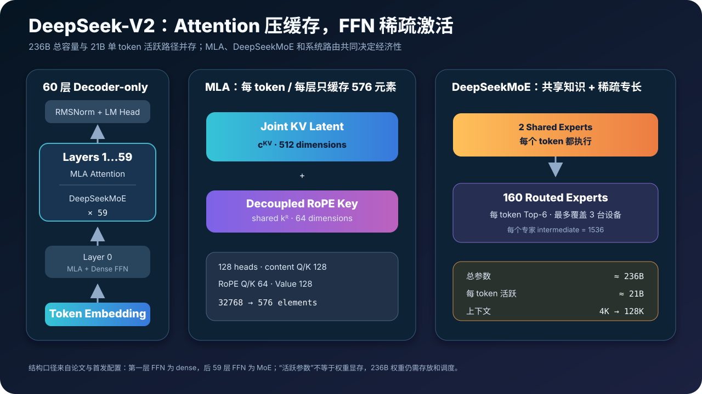
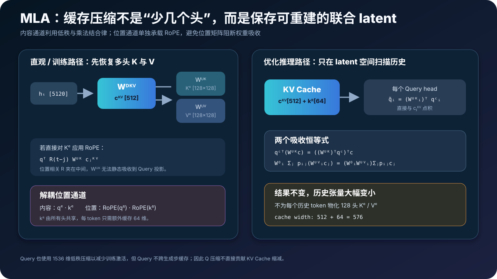
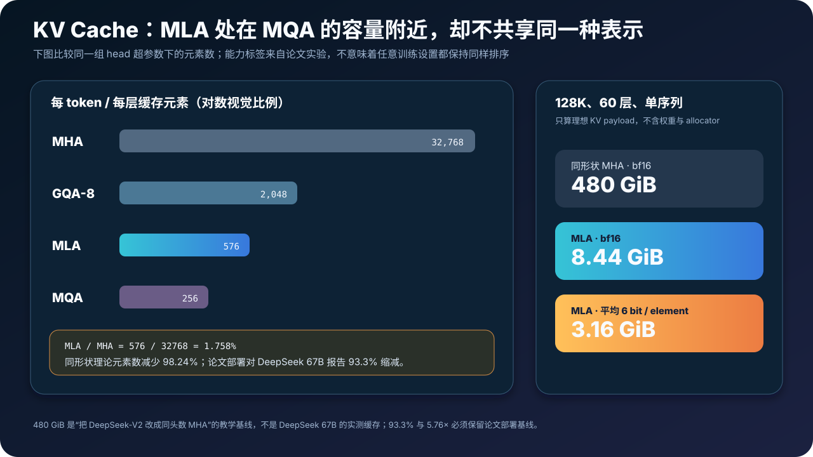
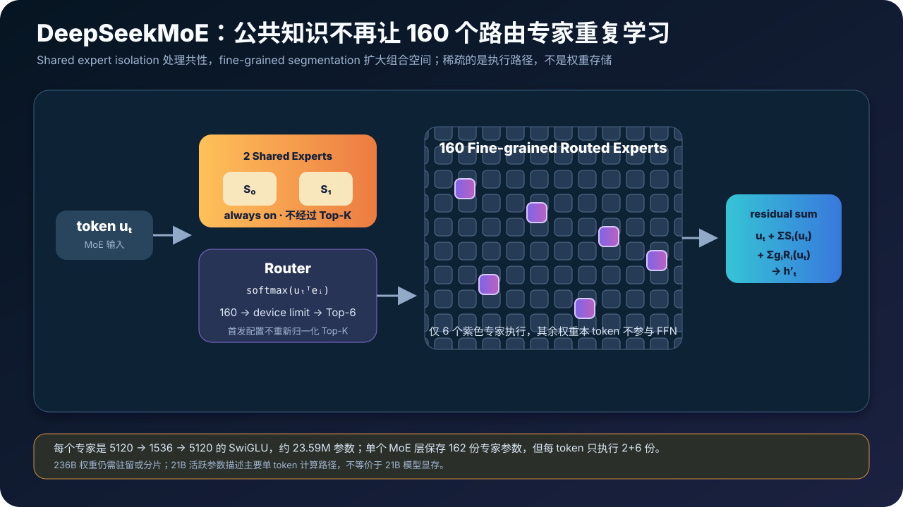
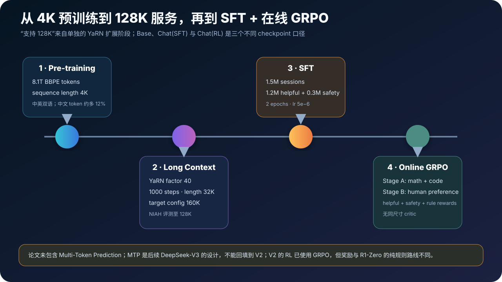
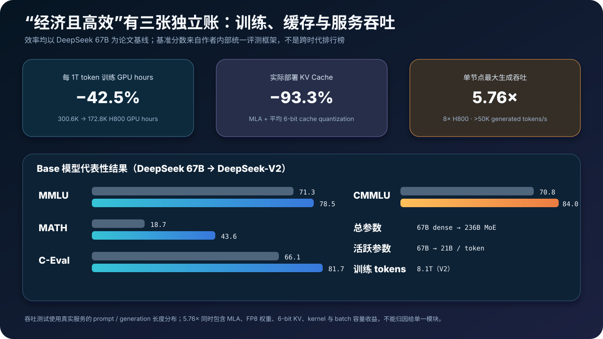

# DeepSeek-V2 原理与实现：MLA 如何压缩 KV Cache，DeepSeekMoE 如何用 21B 激活 236B


> **论文**：DeepSeek-V2: A Strong, Economical, and Efficient Mixture-of-Experts Language Model<br>
> **作者**：DeepSeek-AI<br>
> **时间**：2024 年 5 月发布；本文依据 arXiv v5 技术报告<br>
> **关键词**：Multi-head Latent Attention、DeepSeekMoE、KV Cache、Device-Limited Routing、YaRN、GRPO<br>
> **原文**：[arXiv](https://arxiv.org/abs/2405.04434) · [HTML](https://arxiv.org/html/2405.04434) · [PDF](https://arxiv.org/pdf/2405.04434)<br>
> **官方资源**：[GitHub](https://github.com/deepseek-ai/DeepSeek-V2) · [模型配置](https://huggingface.co/deepseek-ai/DeepSeek-V2/blob/main/config.json) · [模型主页](https://huggingface.co/deepseek-ai/DeepSeek-V2)<br>
> **本文代码**：[零依赖 MLA + DeepSeekMoE 最小实现](./code/deepseek_v2_minimal.py)

> 本文严格讨论 **DeepSeek-V2 Base / Chat (SFT) / Chat (RL)** 与论文附录中的 V2-Lite。后来的 DeepSeek-V2.5、DeepSeek-V3 与 DeepSeek-R1 是不同训练与架构阶段；特别是 **Multi-Token Prediction 属于 V3，不是 V2 论文组件**。

DeepSeek-V2 的题目里有三个形容词：Strong、Economical、Efficient。它们分别对应三张不同的账：

- **Strong**：236B 总参数提供大模型容量，双语、代码和数学基准达到 2024 年开放模型前列；
- **Economical**：每个 token 只激活约 21B 参数，MoE 避免执行全部 236B；
- **Efficient**：MLA 把每层每 token 的缓存从完整多头 K/V 压到 512 维联合 latent 加 64 维位置 key。

论文报告，相比上一代 DeepSeek 67B：训练成本降低 42.5%、实际部署 KV Cache 减少 93.3%、单节点最大生成吞吐提高到 5.76 倍。

但这三个数字不能互相替换：训练成本主要受稀疏 FFN 和分布式系统影响；缓存主要由 MLA 和量化决定；服务吞吐则还叠加 FP8、kernel、batch 容量与真实请求长度分布。

下面把这三张账逐一展开。

---

## 0. 一分钟抓住 DeepSeek-V2



先记住 22 个结论：

1. **DeepSeek-V2 是 60 层 decoder-only Transformer。** 隐藏维度 5120，词表 102400。
2. **它保存约 236B 总参数，每 token 激活约 21B。** 由公开配置重建约为 235.74B / 21.38B，官方数字是舍入口径。
3. **第一层 FFN 是 dense。** 后面 59 层全部换成 DeepSeekMoE。
4. **每个 MoE 层有 2 个共享专家与 160 个路由专家。** 每个 token 始终运行共享专家，再选 6 个路由专家。
5. **“21B 激活”不等于只需存 21B 权重。** 236B 权重仍要驻留、量化或跨设备分片。
6. **MLA 不只是 GQA 的另一种分组数。** 它把所有头的内容 K/V 联合压进一个低秩 latent，再在推理时吸收上投影。
7. **每层每 token 只缓存 576 个元素。** 即 $c_t^{KV}\in\mathbb R^{512}$ 与共享 RoPE key $k_t^R\in\mathbb R^{64}$。
8. **同形状 128 头 MHA 要缓存 32768 个元素。** MLA 理论元素数只有它的 1.758%，即减少 98.24%。
9. **论文 headline 的 93.3% 不是上述同形状理论比率。** 它是相对实际部署 DeepSeek 67B、叠加平均 6-bit KV 量化后的系统口径。
10. **Query 也做 1536 维低秩压缩。** 它主要减少训练激活；Query 不跨生成步缓存，所以不直接减少 KV Cache。
11. **RoPE 必须与内容压缩解耦。** 若把位置旋转夹在 K 上投影之后，位置相关矩阵会阻止静态权重吸收。
12. **内容 K 的上投影可吸收到 Query 侧，V 的上投影可吸收到输出侧。** 这是 MLA 快速解码的代数基础。
13. **DeepSeekMoE 的两点是细粒度专家与共享专家隔离。** 前者增加组合空间，后者承载共性知识、减少路由专家冗余。
14. **细粒度专家也增加通信风险。** V2 先选最多 3 台候选设备，再在这些设备内做 Top-6。
15. **负载平衡分为专家、设备和通信三级。** 三种辅助损失解决的对象不同。
16. **训练还使用 device-level token dropping。** 超容量时丢最低 affinity token，但约 10% 序列保证不丢；评测时完全不丢。
17. **预训练是 8.1T token、初始最大长度 4K。** 128K 不是从头覆盖全部 8.1T token 的训练长度。
18. **128K 来自 YaRN 扩展。** 模型额外以 32K 序列训练 1000 步，并在 NIAH 上测试到 128K。
19. **Base、Chat (SFT)、Chat (RL) 要分开。** SFT 使用 1.5M 会话，RL 使用两阶段在线 GRPO。
20. **V2 已经使用 GRPO，但不是 R1-Zero 的纯 RL 配方。** V2 先有大规模 SFT，RL 还使用多个 reward model。
21. **论文报告 5.76× 最大生成吞吐。** 它来自 8×H800、真实服务长度分布、FP8、6-bit KV、MLA 和系统优化的组合。
22. **V2 没有 Multi-Token Prediction。** 把 MTP 写进 V2 是把 V3 的设计倒灌到前代。

一句话概括：

> DeepSeek-V2 用 MLA 把“历史状态存多少”从头数中解耦，用 DeepSeekMoE 把“模型容量多大”从单 token 计算中解耦，再用路由与分布式系统把两个理论优势变成真实吞吐。

---

## 1. 先分清 V2 家族与后来模型

| 名称 | 总参数 / 活跃参数 | 上下文 | 论文中的角色 |
|---|---:|---:|---|
| DeepSeek-V2 Base | 236B / 21B | 128K | 8.1T token 预训练基座 |
| DeepSeek-V2 Chat (SFT) | 236B / 21B | 128K | 1.5M 会话监督微调 |
| DeepSeek-V2 Chat (RL) | 236B / 21B | 128K | 两阶段在线 GRPO 对齐 |
| DeepSeek-V2-Lite | 15.7B / 2.4B | 32K | 便于研究 MLA 与 DeepSeekMoE 的小模型 |
| DeepSeek-V2.5 | 后续合并 / 升级版本 | 不属于本文 | 不能反推论文原始结果 |
| DeepSeek-V3 | 671B / 37B | 后续工作 | 加入 MTP、无辅助损失负载平衡等新设计 |
| DeepSeek-R1 | 基于 V3-Base 后训练 | 后续工作 | 推理 RL、冷启动、蒸馏 |

### 1.1 V2 的创新发生在哪两处

Transformer Block 仍由 Attention 与 FFN 两个子层构成。V2 同时替换二者：

```text
hidden states
  │
  ├─ RMSNorm → MLA → residual add
  │
  └─ RMSNorm → DeepSeekMoE → residual add
```

- MLA 解决 Attention 的 KV Cache 瓶颈；
- DeepSeekMoE 解决 FFN 参数容量与计算量绑定的问题。

### 1.2 V2 为什么是 V3 / R1 的直接前置

V3 和 R1 继续使用 MLA 与 DeepSeekMoE 这一主干，但在训练目标、路由均衡、精度和后训练上进一步修改。理解 V2，才能分清后续贡献哪些是继承、哪些是新增。

---

## 2. 完整架构与首发配置

论文和公开配置给出的主要参数如下：

| 参数 | DeepSeek-V2 | 含义 |
|---|---:|---|
| `hidden_size` | 5120 | 残差流维度 |
| `num_hidden_layers` | 60 | Transformer 层数 |
| `num_attention_heads` | 128 | MLA Query 头数 |
| `qk_nope_head_dim` | 128 | 不承载 RoPE 的内容 Q/K 维度 |
| `qk_rope_head_dim` | 64 | 承载 RoPE 的 Q/K 维度 |
| `v_head_dim` | 128 | 每头 Value 维度 |
| `q_lora_rank` | 1536 | Query 低秩 latent 维度 |
| `kv_lora_rank` | 512 | 联合 KV latent 维度 |
| `intermediate_size` | 12288 | 第一层 dense SwiGLU 维度 |
| `moe_intermediate_size` | 1536 | 每个细粒度专家中间维度 |
| `n_shared_experts` | 2 | 每层共享专家数 |
| `n_routed_experts` | 160 | 每层路由专家总数 |
| `num_experts_per_tok` | 6 | 每 token 激活路由专家数 |
| `first_k_dense_replace` | 1 | 第一层保留 dense FFN |
| `vocab_size` | 102400 | 公开 checkpoint 词表 |
| `original_max_position_embeddings` | 4096 | YaRN 扩展前窗口 |
| `max_position_embeddings` | 163840 | 配置目标上限；论文评测到 128K |

公开配置的关键片段：

```json
{
  "hidden_size": 5120,
  "num_hidden_layers": 60,
  "num_attention_heads": 128,
  "q_lora_rank": 1536,
  "kv_lora_rank": 512,
  "qk_nope_head_dim": 128,
  "qk_rope_head_dim": 64,
  "v_head_dim": 128,
  "n_shared_experts": 2,
  "n_routed_experts": 160,
  "num_experts_per_tok": 6,
  "topk_group": 3,
  "first_k_dense_replace": 1,
  "rope_scaling": {
    "type": "yarn",
    "factor": 40,
    "original_max_position_embeddings": 4096
  }
}
```

### 2.1 论文与配置的细小口径差异

论文说 tokenizer 词表规模为 100K，checkpoint 配置写 `102400`；前者是产品级舍入，后者是张量的实际维度。

论文说参数以标准差 0.006 随机初始化，而发布 config 的 `initializer_range=0.02` 只是加载类元数据，不能据此改写已经完成的预训练配方。

---

## 3. 参数账本：236B 保存在哪里，21B 又算在哪里

### 3.1 一个细粒度 SwiGLU 专家

每个专家使用：

$$
\operatorname{FFN}(x)
=W_2\left(\operatorname{SiLU}(W_1x)\odot W_3x\right).
$$

隐藏维度 5120、中间维度 1536，因此一个专家参数量是：

$$
P_{\text{expert}}
=3\times5120\times1536
=23{,}592{,}960.
$$

### 3.2 一个 MoE 层的总专家容量

每层有 160 路由专家与 2 共享专家：

$$
P_{\text{experts/layer}}
=(160+2)\times23{,}592{,}960
=3{,}822{,}059{,}520.
$$

Router 还需要：

$$
P_{\text{router/layer}}
=5120\times160
=819{,}200.
$$

所以一个 MoE 层约 3.823B 参数，59 层合计约 225.55B。

### 3.3 一个 token 激活多少专家参数

每个 token 执行 2 个共享专家与 6 个路由专家：

$$
P_{\text{expert,active/layer}}
=(2+6)\times23{,}592{,}960
=188{,}743{,}680.
$$

注意 Router 要对 160 个专家都产生 affinity，因此 Router 参数与打分计算不是稀疏的；Top-6 只决定哪些大 FFN 被执行。

### 3.4 MLA 参数

按公开张量维度，一层 MLA 包括：

- Query down projection：$5120\times1536$；
- Query up projection：$1536\times128\times(128+64)$；
- KV down + RoPE key：$5120\times(512+64)$；
- KV up projection：$512\times128\times(128+128)$；
- Output projection：$(128\times128)\times5120$；
- 两个 latent RMSNorm。

合计：

$$
P_{\text{MLA/layer}}=149{,}227{,}520.
$$

60 层约 8.95B。

### 3.5 总账

| 模块 | 由公开配置重建的参数量 |
|---|---:|
| Token Embedding | 524,288,000 |
| 未绑定 LM Head | 524,288,000 |
| 60 层 MLA | 8,953,651,200 |
| 第一层 Dense FFN | 188,743,680 |
| 后 59 层 DeepSeekMoE（含 Router） | 225,549,844,480 |
| Block / Final Norm | 619,520 |
| **总计** | **235,741,434,880 ≈ 236B** |

在本文明确包含 Embedding、LM Head、全部 Router 与 2+6 个活跃专家的口径下：

$$
P_{\text{active/token}}
=21{,}375{,}800{,}320
\approx21.38B.
$$

官方的 21B 是舍入数字。不同论文对 Embedding、LM Head、Router 是否计入 active parameters 可能略有不同，比较时必须先统一口径。

---

## 4. MLA 的出发点：MHA 的 Cache 与头数一起膨胀

标准 MHA 对 token $t$ 投影：

$$
q_t=W^Qh_t,\qquad
k_t=W^Kh_t,\qquad
v_t=W^Vh_t.
$$

切成 $n_h$ 个头后：

$$
o_{t,i}
=\sum_{j\le t}
\operatorname{softmax}_j
\left(
\frac{q_{t,i}^{\top}k_{j,i}}{\sqrt{d_h}}
\right)v_{j,i}.
$$

生成时，每层每个历史 token 都要保存所有头的 K 与 V：

$$
E_{\text{MHA/token/layer}}
=2n_hd_h.
$$

代入 128 头和 128 维：

$$
2\times128\times128=32768\ \text{elements}.
$$

### 4.1 为什么不直接用 MQA / GQA

MQA 让所有 Query 头共享一个 K/V 头；GQA 让一组 Query 共享 K/V。缓存会明显变小，但论文附录的 7B 控制实验显示：

| 方法 | BBH | MMLU | C-Eval | CMMLU |
|---|---:|---:|---:|---:|
| MQA | 33.2 | 37.9 | 30.0 | 34.6 |
| GQA（8 groups） | 35.6 | 41.2 | 37.7 | 38.4 |
| MHA | **37.0** | **45.2** | **42.9** | **43.5** |

三个约 7B 模型都训练 1.33T token，并通过调整层数对齐参数。这个实验是 MLA 的动机：

> 能否保留多头内容表达，而不是直接让很多 Query 头共享同一份低维 K/V？

MLA 的回答是：不共享最终内容 K/V，而是共享一个**可经不同头矩阵解码的 latent**。

---

## 5. Low-Rank KV Joint Compression：K 和 V 共用一份信息瓶颈



### 5.1 联合压缩

对隐藏状态 $h_t\in\mathbb R^d$：

$$
\boxed{
c_t^{KV}=W^{DKV}h_t,
\qquad c_t^{KV}\in\mathbb R^{d_c}
}
$$

DeepSeek-V2 取：

$$
d=5120,qquad d_c=512.
$$

各头的内容 K/V 再从同一 latent 恢复：

$$
k_t^C=W^{UK}c_t^{KV},
$$

$$
v_t^C=W^{UV}c_t^{KV}.
$$

“Joint” 的含义是 K 和 V 不是各存一个 512 维 latent，而是共享同一个 $c_t^{KV}$。

### 5.2 为什么不同头仍可拥有不同 K/V

$W^{UK}$ 与 $W^{UV}$ 的输出宽度仍覆盖 128 个头。把矩阵按头分块：

$$
k_{t,i}^C=W_i^{UK}c_t^{KV},qquad
v_{t,i}^C=W_i^{UV}c_t^{KV}.
$$

所有头读取同一个 latent，但每个头使用不同解码矩阵。这和 GQA 的“若干 Q 头直接共享同一个最终 K/V 头”不同。

### 5.3 低秩是有损瓶颈，为什么还能更强

512 维 latent 远小于显式的 $128\times128$ 内容宽度，因此表示必然受约束。但能力不只由单个张量宽度决定：

- 每头仍有独立上投影；
- K/V 联合瓶颈可能形成更有效的共享表征；
- 参数节省可重新分配给网络其他部分；
- 端到端训练会适应这一结构；
- MoE 与更多训练数据也共同影响最终模型。

论文附录的大模型消融中，MLA 在四个困难基准上均高于同规模 MHA，同时 KV Cache 只有 MHA 的约 4%。这支持 MLA，而不是证明“任何低秩压缩都必然提升质量”。

---

## 6. Query 为什么也压缩，但不计入 Cache 收益

Query 路径是：

$$
c_t^Q=W^{DQ}h_t,
\qquad c_t^Q\in\mathbb R^{d_c'},
$$

$$
q_t^C=W^{UQ}c_t^Q,
$$

其中：

$$
d_c'=1536.
$$

训练时，需要保存中间激活用于反向传播，Query 低秩瓶颈可以减少相关激活与投影成本。

但生成到 token $t$ 时，$q_t$ 用完即可丢弃；下一步只需要新的 Query。历史 Query 不进入 KV Cache。因此：

```text
KV compression → 直接降低跨时间保存的状态
Q compression  → 主要降低当前步投影 / 训练激活
```

把两者都叫“LoRA”也容易误解。配置字段沿用 `q_lora_rank` / `kv_lora_rank`，这里描述的是模型内部低秩因子化，不是用 LoRA adapter 微调冻结权重。

---

## 7. 投影吸收：为什么不必为所有历史 token 恢复 K/V

如果每次解码都先从 $c_j^{KV}$ 恢复全部历史 $k_j^C,v_j^C$，缓存虽小，重建计算会很大。MLA 利用矩阵乘结合律改写。

### 7.1 K 上投影吸收到 Query 侧

第 $i$ 个头的内容分数：

$$
(q_{t,i}^{C})^Tk_{j,i}^{C}
=(q_{t,i}^{C})^T W_i^{UK}c_j^{KV}.
$$

改写为：

$$
(q_{t,i}^{C})^T W_i^{UK}c_j^{KV}
=\left((W_i^{UK})^Tq_{t,i}^{C}\right)^Tc_j^{KV}.
$$

定义 latent-space Query：

$$
\widetilde q_{t,i}=(W_i^{UK})^Tq_{t,i}^{C},
$$

就可以直接与缓存的 $c_j^{KV}$ 点积，无需恢复 $k_{j,i}^C$。

### 7.2 V 上投影吸收到 Output 侧

把输出矩阵按头切成 $W_i^O$：

$$
W_i^O\sum_jp_{ij}v_{j,i}^C
=W_i^O\sum_jp_{ij}W_i^{UV}c_j^{KV}.
$$

因为 $W_i^{UV}$ 对位置 $j$ 不变：

$$
=\left(W_i^OW_i^{UV}\right)
\sum_jp_{ij}c_j^{KV}.
$$

可以先按注意力权重对 latent 加权，再通过吸收后的输出矩阵投影，不必为每个历史 token 物化 V。

### 7.3 这不是近似等价

低秩结构本身是模型选择；给定已经训练好的这些矩阵后，“显式恢复”和“吸收投影”只是结合律重排，在实数运算中精确相等。

有限精度、kernel 累加顺序和量化可能带来微小数值差异，但不改变模型定义。

---

## 8. Decoupled RoPE：为什么位置通道必须单独走

### 8.1 直接给内容 K 做 RoPE 会破坏吸收

若分数写成：

$$
q_t^TR(t-j)W^{UK}c_j^{KV},
$$

$R(t-j)$ 随 Query 与历史位置变化，夹在 Query 与 $W^{UK}$ 之间。一般有：

$$
RW\ne WR.
$$

因此不能预先把 $W^{UK}$ 静态吸收到 Query 投影。若强行保持这种结构，就需要为历史 token 重算位置相关 K，抵消缓存压缩收益。

### 8.2 内容通道与位置通道拼接

MLA 额外生成每头位置 Query：

$$
[q_{t,1}^{R};\ldots;q_{t,n_h}^{R}]
=\operatorname{RoPE}(W^{QR}c_t^Q),
$$

以及所有头共享的位置 Key：

$$
\boxed{
k_t^R=\operatorname{RoPE}(W^{KR}h_t)
},qquad k_t^R\in\mathbb R^{64}.
$$

最终：

$$
q_{t,i}=[q_{t,i}^{C};q_{t,i}^{R}],
$$

$$
k_{t,i}=[k_{t,i}^{C};k_t^{R}].
$$

注意 $k_t^R$ 被所有头共享，不是 128 份。因此只额外缓存 64 个元素。

### 8.3 完整注意力

$$
o_{t,i}
=\sum_{j\le t}
\operatorname{softmax}_j
\left(
\frac{
(q_{t,i}^{C})^Tk_{j,i}^{C}
+(q_{t,i}^{R})^Tk_j^{R}
}{\sqrt{128+64}}
\right)v_{j,i}^{C}.
$$

内容通道可以做投影吸收；位置通道保持显式而且很窄。这就是“decoupled”的系统意义。

---

## 9. KV Cache 账本：576 到底有多小



论文 Table 1 的每 token 每层元素数：

| Attention | 缓存元素 |
|---|---:|
| MHA | $2n_hd_h$ |
| GQA | $2n_gd_h$ |
| MQA | $2d_h$ |
| MLA | $d_c+d_h^R$ |

代入 DeepSeek-V2 尺寸：

| Attention | 元素数 |
|---|---:|
| MHA（128 heads） | 32768 |
| GQA（8 groups） | 2048 |
| MLA | 576 |
| MQA | 256 |

MLA 等效于：

$$
2n_gd_h=576
\Rightarrow n_g=2.25.
$$

所以论文说它的缓存相当于只有 2.25 groups 的 GQA，但消融能力超过 MHA。

### 9.1 128K、60 层、bf16 理想载荷

同形状 MHA：

$$
131072\times60\times32768\times2\ \text{bytes}
=480\ \text{GiB}.
$$

MLA：

$$
131072\times60\times576\times2\ \text{bytes}
=8.4375\ \text{GiB}.
$$

若平均每元素 6 bit：

$$
8.4375\times\frac6{16}
\approx3.164\ \text{GiB}.
$$

这些数字是单序列、只含理想缓存 payload，不包含权重、激活、对齐、分页、量化 scale 与 allocator。

### 9.2 为什么不能拿 98.24% 替换论文 93.3%

98.24% 的基线是“相同 128 头、128 维、60 层 MHA”；论文 93.3% 的基线是“实际部署 DeepSeek 67B”，并叠加自身模型形状与 KV 量化。

二者都可以正确，但回答的是不同问题：

```text
98.24% → MLA 相对同形状 MHA 的结构元素比
93.3%  → V2 服务相对上一代 67B 服务的部署结果
```

---

## 10. DeepSeekMoE：细粒度专家为什么不是“160 个完整模型”



对 MoE 输入 $u_t$，输出为：

$$
h_t'
=u_t
+\sum_{i=1}^{N_s}\operatorname{FFN}_i^{(s)}(u_t)
+\sum_{i=1}^{N_r}g_{i,t}\operatorname{FFN}_i^{(r)}(u_t).
$$

其中：

$$
N_s=2,qquad N_r=160,qquad K_r=6.
$$

Router affinity：

$$
s_{i,t}
=\operatorname{softmax}_i(u_t^Te_i).
$$

只对 Top-6 路由专家保留 gate：

$$
g_{i,t}=
\begin{cases}
s_{i,t},&i\in\operatorname{TopK}(s_t,6),\\
0,&\text{otherwise}.
\end{cases}
$$

首发 config 还包含 `norm_topk_prob=false` 与 `routed_scaling_factor=16.0`。这意味着实际发布实现不会把被选 Top-K 概率重新归一到和为 1，而会用额外缩放校准 routed 分支；论文主公式展示的是核心门控关系。

### 10.1 Fine-grained Expert Segmentation

传统 MoE 可能有较少但很宽的专家。若保持总专家参数与单 token 活跃参数不变，可以把每个宽专家切成多个更窄专家，再激活更多小专家。

组合数从：

$$
\binom{N}{K}
$$

变成更大候选集合上的组合，Router 有更细的知识拼装粒度。

但“组合数更大”只是潜力：专家是否真正专业化，仍受数据、Router、负载损失与训练稳定性影响。

### 10.2 Shared Expert Isolation

如果所有 token 的共同知识都让路由专家各自学习一份，会产生冗余。共享专家始终执行，专门承载通用能力；路由专家则可以把容量用于差异化知识。

正确理解不是“共享专家只学语法，路由专家只学数学”。论文没有给专家人工标签。它只通过结构激励角色分工。

### 10.3 残差为何写在 MoE 公式里

论文公式把 $u_t$ 直接加进 $h_t'$。不同代码库可能把 residual add 放在 Block 外层，数学上只要不重复加即可。读实现时应追踪数据流，而不是只比函数名。

---

## 11. Device-Limited Routing：专家稀疏不等于通信稀疏


160 个路由专家均匀分布到 8 台设备：

$$
D=8,qquad 20\ \text{experts/device}.
$$

如果朴素 Top-6 恰好落在 6 台不同设备，单个 token 会产生大量 All-to-All 通信。V2 设：

$$
M=3.
$$

路由分两步：

1. 找到拥有最高 expert affinity 的最多 3 台设备；
2. 只在这些设备的候选专家中选最终 Top-6。

```python
device_scores = [max(scores[experts_on_device]) for device in devices]
selected_devices = topk(device_scores, M=3)
candidates = experts_on(selected_devices)
selected_experts = topk(scores[candidates], K=6)
```

论文报告当 $M\ge3$ 时，设备受限路由的效果与无约束 Top-K 大致一致。

### 11.1 它限制的是通信覆盖，不是消息字节恒定值

最多 3 台目标设备给每 token 的跨设备扇出设置了上界。但总通信仍取决于：

- token 起始设备；
- batch 中各 token 的目标分布；
- hidden state 宽度与精度；
- All-to-All 实现；
- 是否与共享专家计算重叠；
- 最忙接收设备的负载。

因此还需要三种负载损失。

---

## 12. 三级负载均衡：三个 Loss 各自管什么

### 12.1 Expert-Level Balance

定义专家实际被选择的归一化频率：

$$
f_i
=\frac{N_r}{K_rT}
\sum_{t=1}^{T}\mathbb 1[t\text{ selects }i],
$$

平均 affinity：

$$
P_i=\frac1T\sum_{t=1}^{T}s_{i,t}.
$$

损失：

$$
\mathcal L_{\mathrm{ExpBal}}
=\alpha_1\sum_{i=1}^{N_r}f_iP_i,
\qquad \alpha_1=0.003.
$$

目标是防止 routing collapse：少数专家拿走大部分 token，其余专家得不到训练。

### 12.2 Device-Level Balance

对设备 $d$ 的专家集合 $\mathcal E_d$：

$$
f_d'=\frac1{|\mathcal E_d|}\sum_{j\in\mathcal E_d}f_j,
$$

$$
P_d'=\sum_{j\in\mathcal E_d}P_j,
$$

$$
\mathcal L_{\mathrm{DevBal}}
=\alpha_2\sum_{d=1}^{D}f_d'P_d',
\qquad \alpha_2=0.05.
$$

专家个体看似均衡，也可能因部署组合导致设备总负载不均，所以要单独约束设备。

### 12.3 Communication Balance

一台设备收到多少 token 直接影响通信尾部：

$$
f_d''
=\frac{D}{MT}
\sum_{t=1}^{T}
\mathbb 1[t\text{ sent to device }d],
$$

$$
P_d''=\sum_{j\in\mathcal E_d}P_j,
$$

$$
\mathcal L_{\mathrm{CommBal}}
=\alpha_3\sum_{d=1}^{D}f_d''P_d'',
\qquad \alpha_3=0.02.
$$

设备计算均衡与收包均衡相关但不完全相同：一个 token 可能在本地执行，也可能跨设备发送。

### 12.4 为什么辅助损失不能硬保证

它们只改变 Router 的优化偏好。具体 batch 仍可能偏斜，尤其是领域相似 token 集中出现时。于是论文再加入 token dropping。

---

## 13. Token Dropping：容量因子 1.0 下的最后保险

训练时，每台设备先得到平均计算预算，相当于 capacity factor 1.0。若收到的 token 超预算：

1. 按 affinity 从低到高排序；
2. 丢弃最低 affinity 的 routed assignment；
3. 直到回到设备预算。

论文还保证约 10% 训练序列的 token 永不丢弃，使模型始终看到一部分无 dropping 的完整路径。

### 13.1 丢 token 不等于丢掉整个残差流

通常丢的是超容量专家分支 assignment，不是把 token 从序列中删除。token 的 residual、Attention、共享专家和未丢分支仍可继续传播。

### 13.2 训练与评测口径

论文明确：

- 训练使用 token dropping 加速；
- 评测不丢任何 token；
- 推理可以按效率需求决定是否使用。

因此 benchmark 质量不能被解释成“允许 1.0 capacity 丢 token 时的质量”。

---

## 14. 预训练：8.1T token 与完整优化器配方



### 14.1 数据

论文使用 Byte-level BPE tokenizer，约 100K 词表；tokenized corpus 为 8.1T token。作者称：

- 扩大互联网数据；
- 改进清洗，恢复曾被误删的有价值数据；
- 加入更多中文数据；
- 中文 token 数约比英文多 12%；
- 加强质量过滤；
- 过滤争议性、区域文化偏置内容。

最后一点有明显价值判断。论文附录也承认，数据去偏可能让模型在与特定区域价值观相关的测试集上下降。不能把“去偏”理解为完全中立的机械过程。

### 14.2 优化器

| 设置 | 数值 |
|---|---:|
| Optimizer | AdamW |
| $\beta_1,\beta_2$ | 0.9, 0.95 |
| Weight decay | 0.1 |
| Max learning rate | $2.4\times10^{-4}$ |
| Warmup | 2000 steps |
| LR decay | 60% 与 90% token 处各乘 0.316 |
| Gradient clipping | 1.0 |
| Batch size | 2304 → 9216 sequences |
| Batch ramp | 前 225B token |
| Pretraining max length | 4K |
| Training tokens | 8.1T |

### 14.3 分布式训练

论文使用 H800 集群：

- 16-way zero-bubble pipeline parallelism；
- 8-way expert parallelism；
- ZeRO-1 data parallelism；
- 不需要 tensor parallelism；
- 共享专家计算与 expert All-to-All 重叠；
- 通信、Router、跨专家 fused linear 使用定制 CUDA kernel；
- MLA 基于改进版 FlashAttention-2 优化。

不使用 Tensor Parallelism 不是说 TP 无用，而是这组活跃参数、Pipeline/EP 划分与重计算策略让它不再必要，从而省掉一类通信。

---

## 15. 4K 如何扩展到 128K：YaRN 不是配置字段魔法

初始 8.1T token 预训练最大长度是 4K。之后单独进行长上下文扩展：

| YaRN 设置 | 数值 |
|---|---:|
| scale $s$ | 40 |
| $\alpha$ | 1 |
| $\beta$ | 32 |
| target max context | 160K |
| 继续训练 steps | 1000 |
| 继续训练 sequence length | 32K |
| batch size | 576 sequences |
| 论文主张有效范围 | 128K |

YaRN 只施加到解耦共享 key $k_t^R$，因为它负责携带 RoPE 位置信息。内容 latent $c_t^{KV}$ 不直接旋转。

论文还修改 attention entropy 的长度缩放：

$$
\sqrt t=0.0707\ln s+1.
$$

### 15.1 32K 继续训练为什么能测试到 128K

YaRN 通过频率插值 / 外推改变位置编码行为，再用 32K 训练校准。论文用 Needle In A Haystack 在最长 128K 上得到良好结果。

但 NIAH 主要测试定位并复述埋藏信息，不覆盖：

- 多跳跨段推理；
- 128K 全局一致性；
- 长文事实冲突消解；
- 位置偏差；
- 长输出质量；
- 并发服务的真实延迟。

所以“支持 128K”应理解为模型、位置编码和服务接口允许，并有 NIAH 证据；不是所有长上下文任务都已被充分证明。

---

## 16. 训练与推理效率：三个 headline 怎样正确归因



### 16.1 训练成本降低 42.5%

论文在 H800 集群上报告每训练 1T token：

| 模型 | GPU hours / 1T tokens |
|---|---:|
| DeepSeek 67B Dense | 300.6K |
| DeepSeek-V2 | 172.8K |

$$
1-\frac{172.8}{300.6}
\approx42.5\%.
$$

主要因素包括较少活跃参数、无 TP、通信/计算重叠和定制 kernel。MoE 自身会增加 All-to-All；若系统实现不佳，稀疏 FLOPs 不会自动变成同比例训练节省。

### 16.2 KV Cache 降低 93.3%

部署时作者：

- 将权重转为 FP8；
- 将 KV Cache 量化到平均 6 bit / element；
- 使用 MLA latent cache。

因此 93.3% 是结构压缩与量化共同参与的部署结果，不应全部归功于低秩维度。

### 16.3 最大生成吞吐 5.76×

测试条件：

- 单节点 8×H800；
- 使用实际 DeepSeek 67B 服务的 prompt / generation 长度分布；
- DeepSeek-V2 最大生成吞吐超过 50K token/s；
- prompt 输入吞吐超过 100K token/s。

吞吐收益链条是：

```text
更小 KV / request
    → 同节点容纳更大 batch
    → decode GEMM 和专家批量更饱满
    → 最大 generation throughput 上升
```

它不是单请求延迟必然缩短 5.76 倍，也不是任意硬件、batch 与序列分布都能复现。

---

## 17. Base 模型结果：21B 活跃参数不等于 21B 能力上限

论文用内部统一框架复测模型。代表性结果：

| Benchmark | DeepSeek 67B | Qwen1.5 72B | Mixtral 8x22B | Llama 3 70B | DeepSeek-V2 |
|---|---:|---:|---:|---:|---:|
| MMLU | 71.3 | 77.2 | 77.6 | **78.9** | 78.5 |
| BBH | 68.7 | 59.9 | **78.9** | **81.0** | 78.9 |
| HumanEval | 45.1 | 43.9 | **53.1** | 48.2 | 48.8 |
| MBPP | 57.4 | 53.6 | 64.2 | **68.6** | 66.6 |
| GSM8K | 63.4 | 77.9 | 80.3 | **83.0** | 79.2 |
| MATH | 18.7 | 41.4 | 42.5 | 42.2 | **43.6** |
| C-Eval | 66.1 | **83.7** | 59.6 | 67.5 | 81.7 |
| CMMLU | 70.8 | **84.3** | 60.0 | 69.3 | 84.0 |
| CMRC | 73.4 | 66.6 | 73.1 | 73.3 | **77.5** |
| CCPM | 88.5 | 88.1 | 61.0 | 68.1 | **93.1** |

可见更准确的结论是：

- V2 几乎全面超过 DeepSeek 67B；
- 英文基础能力接近 Mixtral 8x22B / Llama 3 70B，但并非每项最强；
- 数学与代码很有竞争力；
- 中文任务显著强于英文为主的 Mixtral / Llama 3；
- Qwen1.5 72B 在 C-Eval、CMMLU 多学科选择题上略高。

### 17.1 为什么活跃参数可以小于 dense 对手

一个 token 只执行 21B 路径，但每个 token 可以根据内容访问不同的 21B 子网络。跨数据分布，模型使用的总知识容量仍来自 236B 参数。

所以不能把 MoE 说成“等价于一个固定 21B dense 模型”，也不能把 236B 总参数直接当作每 token FLOPs。

### 17.2 评测协议边界

- 全部模型由作者内部框架复测；
- perplexity 型与 generation 型任务使用不同格式；
- 不同 tokenizer 的语言模型比较使用 BPB；
- shots 因任务而异；
- 论文称预训练阶段没有混入 SFT 数据。

这些是 2024 年论文证据，不是今天的永久排行榜。

---

## 18. MLA 消融：缓存小与能力强是否真的同时成立

论文附录做了两组重要控制实验。

### 18.1 MHA / GQA / MQA

前文 7B dense 实验显示 MHA 在四个困难任务上明显领先 GQA 与 MQA，说明“直接共享最终 K/V”存在质量代价。

### 18.2 MLA / MHA

| 规模 | Attention | 总参数 | 活跃参数 | KV / token | BBH | MMLU | C-Eval | CMMLU |
|---|---|---:|---:|---:|---:|---:|---:|---:|
| Small MoE | MHA | 15.8B | 2.5B | 110.6K | 37.9 | 48.7 | **51.6** | 52.3 |
| Small MoE | MLA | 15.7B | 2.4B | 15.6K | **39.0** | **50.0** | 50.9 | **53.4** |
| Large MoE | MHA | 250.8B | 25.0B | 860.2K | 46.6 | 57.5 | 57.9 | 60.7 |
| Large MoE | MLA | 247.4B | 21.5B | 34.6K | **50.7** | **59.0** | **59.2** | **62.5** |

大模型 MLA 缓存约为 MHA 的：

$$
\frac{34.6}{860.2}\approx4.0\%.
$$

同时四项都更高。小模型则 3/4 更高，C-Eval 略低。这是比只看最终 236B checkpoint 更有力的架构证据。

仍需保留限制：训练预算、超参数和随机波动可能影响结果，四个 benchmark 也不能覆盖全部能力。

---

## 19. DeepSeek-V2-Lite：理解架构的更小实验载体

V2-Lite 参数：

| 参数 | V2-Lite |
|---|---:|
| 层数 | 27 |
| 隐藏维度 | 2048 |
| Attention heads | 16 |
| 内容 head dim | 128 |
| KV latent | 512 |
| Query compression | 无 |
| RoPE head dim | 64 |
| Shared experts | 2 |
| Routed experts | 64 |
| Top-K routed | 6 |
| Expert intermediate | 1408 |
| 总参数 / 活跃 | 15.7B / 2.4B |
| 预训练 tokens | 5.7T |
| 扩展上下文 | 32K |

Lite 不压缩 Query，说明 Query 低秩不是 MLA 缓存定义不可缺少的部分；真正必须缓存的仍是 KV latent 与 RoPE key。

它更小，但 15.7B 权重仍不是普通消费级设备上“随手运行”的小模型。Lite 的主要价值是降低 MLA / DeepSeekMoE 研究门槛。

---

## 20. SFT 与 GRPO：V2 已经出现 R1 的部分前置思想

### 20.1 SFT

论文收集 1.5M 会话：

$$
1.2M\ \text{helpfulness}
+0.3M\ \text{safety}.
$$

训练 2 epochs，学习率 $5\times10^{-6}$。

作者讨论“小于 10K SFT 样本是否足够”，报告在其设置中少于 10K 会让 IFEval 明显下降。正确结论不是“所有模型必须 1.5M”，而是特定技能覆盖与开放写作质量不能只看极小样本口号。

### 20.2 GRPO

V2 为降低 RL 成本，使用不训练同尺寸 critic 的 Group Relative Policy Optimization。对同一道问题采样 $G$ 个输出，以组内 reward 标准化：

$$
A_i
=\frac{r_i-\operatorname{mean}(r_1,\ldots,r_G)}
{\operatorname{std}(r_1,\ldots,r_G)}.
$$

再使用 PPO 式裁剪比率与对参考策略的 KL 约束更新。

### 20.3 两阶段 RL

第一阶段做 reasoning alignment：

$$
r_i=RM_{\text{reasoning}}(o_i),
$$

主要针对数学与代码。

第二阶段做人类偏好对齐：

$$
r_i
=c_1RM_{\text{helpful}}(o_i)
+c_2RM_{\text{safety}}(o_i)
+c_3RM_{\text{rule}}(o_i).
$$

代码偏好可利用编译器反馈，数学偏好可利用 ground truth；Reward Model 从 Chat (SFT) 初始化，以 point-wise 或 pair-wise loss 训练。

### 20.4 与 DeepSeek-R1 的区别

| DeepSeek-V2 Chat RL | R1-Zero / R1 |
|---|---|
| 先有 1.5M SFT | R1-Zero 无冷启动 SFT；R1 有专门冷启动 |
| 通用聊天对齐 | 重点探索长链推理 |
| reasoning RM + 多 reward | R1-Zero 强调规则可验证奖励 |
| 已采用 GRPO | 后续把 GRPO 推到更大 reasoning 规模 |

因此 GRPO 不是 R1 才首次出现；R1 的贡献在于训练路线、奖励与推理行为，而不是单独发明 V2 已使用的优化器。

---

## 21. Chat 结果与 Alignment Tax

开放式英文对话：

| 模型 | MT-Bench | AlpacaEval 2.0 LC win rate |
|---|---:|---:|
| Mixtral 8x22B Instruct | 8.66 | 30.9 |
| Qwen1.5 72B Chat | 8.61 | 36.6 |
| Llama 3 70B Instruct | 8.95 | 34.4 |
| DeepSeek-V2 Chat (SFT) | 8.62 | 30.0 |
| **DeepSeek-V2 Chat (RL)** | **8.97** | **38.9** |

AlignBench 总分：

$$
\text{Chat(SFT)}=7.74,qquad
\text{Chat(RL)}=7.91.
$$

论文也明确观察到 Alignment Tax：RL 提升开放问答偏好，却可能降低 BBH、MMLU、AGIEval 等标准基准。

例如：

| Benchmark | Chat SFT | Chat RL |
|---|---:|---:|
| HumanEval | 76.8 | **81.1** |
| LiveCodeBench | 28.7 | **32.5** |
| MMLU | **78.4** | 77.8 |
| BBH | **81.3** | 79.7 |
| AGIEval | **63.2** | 61.4 |

“RL 后更强”必须说明强在哪种指标上。偏好模型、开放式裁判和标准化 benchmark 不是同一目标函数。

作者还报告在线 RL 优于离线 RL，但没有给出足够完整的受控对比，因此这应视为其经验观察，不是跨场景定律。

---

## 22. 零依赖代码：验证 MLA 等价性与设备受限路由

本文附带 [deepseek_v2_minimal.py](./code/deepseek_v2_minimal.py)，只使用 Python 标准库。

运行：

```bash
python3 papers/to-2026/code/deepseek_v2_minimal.py
```

预期输出：

```text
DeepSeek-V2 architecture ledger
  total parameters from public dimensions: 235,741,434,880 (~236B)
  active parameters under this counting convention: 21,375,800,320 (~21B)
  MoE layers: 59; per layer: 2 shared + Top-6 of 160 routed

KV elements per token per layer
  MHA: 32,768
  GQA: 2,048
  MQA: 256
  MLA: 576
  MLA / same-shape MHA: 1.758%
  reduction: 98.242%

Ideal one-sequence cache across 60 layers at 128K
  same-shape MHA bf16: 480.00 GiB
  MLA bf16:            8.44 GiB
  MLA at 6 bits/elem:  3.16 GiB

Correctness checks
  reconstructed K/V MLA == absorbed latent MLA: yes
  maximum numerical difference: 5.551e-17
  toy routed devices: [3, 0]
  toy Top-3 experts: [17, 0, 3]
  both shared experts also executed: yes
```

### 22.1 显式恢复路径

```python
kv_latent = W_DKV @ hidden
k_nope = W_UK[head] @ kv_latent
value = W_UV[head] @ kv_latent

score = q_nope @ k_nope + q_rope @ cached_rope_key
```

### 22.2 吸收路径

```python
latent_query = W_UK[head].T @ q_nope
score = latent_query @ cached_kv_latent + q_rope @ cached_rope_key

latent_value = sum(prob[j] * cached_kv_latent[j] for j in history)
output += (W_O_head @ W_UV_head) @ latent_value
```

脚本使用固定随机矩阵，逐元素比较两条路径。最大误差来自浮点累加顺序。

### 22.3 设备受限路由

```python
device_scores = [max(probabilities[experts_on_device]) for device in devices]
selected_devices = topk(device_scores, max_devices)
candidates = experts_on(selected_devices)
selected_experts = topk(probabilities[candidates], top_k)
```

测试断言最终专家全部位于已选设备内，同时两个 shared expert 始终执行。

### 22.4 为什么代码不是生产实现

它没有：

- CUDA / Triton fused kernel；
- FlashAttention-2 tile；
- bf16 / FP8 / 6-bit packing；
- expert dispatch / combine；
- All-to-All；
- token capacity buffer；
- 反向传播；
- YaRN 完整频率缩放。

参考代码证明代数与数据流，性能结论仍必须在真实 kernel 上测量。

---

## 23. 常见误解与纠正

### 误解 1：“DeepSeek-V2 是一个 21B 模型”

它保存 236B，总参数容量必须驻留；21B 是每 token 活跃路径。

### 误解 2：“236B 表示每个 token 都执行 236B”

MoE 只执行 2 个共享 + 6 个路由专家；其余路由专家该 token 不运行。

### 误解 3：“MLA 就是 2.25 组 GQA”

2.25 只是缓存元素数等效。MLA 的每头 K/V 由共享 latent 经不同上投影生成，不等于直接共享最终 K/V。

### 误解 4：“MLA 只缓存 512 维”

还需缓存 64 维共享 RoPE key，总计 576。

### 误解 5：“Query rank 1536 也要进 KV Cache”

Query 当前步用完即可丢弃；历史 cache 只有 $c^{KV}$ 与 $k^R$。

### 误解 6：“低秩压缩后每步仍要恢复全部 K/V”

推理用结合律吸收 $W^{UK}$ 和 $W^{UV}$，直接扫描 latent。

### 误解 7：“RoPE 随便放在压缩前后都一样”

位置旋转与投影矩阵不交换；错误放置会阻止吸收或改变模型。

### 误解 8：“MLA 比 MQA 缓存还小”

在论文同维度公式下，MQA 256、MLA 576。MLA 目标是以接近 MQA 的缓存保留更强能力，不是绝对最小。

### 误解 9：“93.3% 就是 576/32768 的结果”

后者对应 98.24% 结构缩减；93.3% 是相对上一代实际部署的综合口径。

### 误解 10：“2 个共享专家包含在 Top-6 里”

不包含。每 token 执行 2 shared + 6 routed，共 8 个细粒度专家 FFN。

### 误解 11：“160 个专家分布在 8 卡，所以每 token 都访问 8 卡”

Device-limited routing 限制到最多 3 台候选设备。

### 误解 12：“辅助 Loss 保证绝对均衡”

它们只是软约束；训练仍需要 token dropping 与容量监控。

### 误解 13：“训练丢 token，所以评测也丢”

论文明确评测不丢任何 token。

### 误解 14：“8.1T token 都用 128K 长度训练”

主预训练最大长度 4K；之后才以 32K 做 1000 步 YaRN 扩展。

### 误解 15：“NIAH 通过就证明 128K 长推理完全解决”

NIAH 是重要但狭窄的检索测试，不覆盖全部长文理解。

### 误解 16：“5.76× 是 MLA kernel 单独带来的”

它还包含 FP8、6-bit KV、更大 batch、定制 kernel 与实际服务长度分布。

### 误解 17：“V2 发明了 R1 的纯规则 GRPO 路线”

V2 已使用 GRPO，但先做 1.5M SFT，并使用 reasoning/helpful/safety reward models。

### 误解 18：“V2 使用 Multi-Token Prediction”

没有。MTP 是 DeepSeek-V3 的新增训练目标。

### 误解 19：“代码和模型都是 MIT”

官方仓库代码使用 MIT；Base/Chat 权重受单独 Model License 约束，官方说明支持商用。两种许可证不能混为一个。

---

## 24. 论文边界：开放权重不等于问题已经解决

论文作者在限制部分明确承认：

- 模型仍会产生幻觉，不能保证事实正确；
- 参数知识不能自动追踪实时信息，时效性问题仍需要检索或更新机制；
- 训练重点是中文与英文，其他语言没有得到同等覆盖和验证；
- V2 是纯文本模型，没有覆盖图像、音频等多模态输入。

从外部复现角度还要再加四条边界：

1. 8.1T 预训练语料没有逐项公开，外部无法完整审计数据混合、污染和去重；
2. 仓库提供模型定义与推理示例，但不等于完整训练代码、调度器和所有定制 kernel 均已开放；
3. 42.5%、93.3% 与 5.76× 来自作者 H800 集群和内部服务栈，换硬件、请求分布或并行方案都需重测；
4. 128K 的核心论文证据是 NIAH，不能替代长文推理、事实一致性与真实并发服务评测。

因此，DeepSeek-V2 是一篇架构与系统证据很强的论文，但不是“任何环境都能得到相同比率”的可移植性能承诺。

---

## 25. 生产实现检查清单

### 25.1 MLA

- Cache 是否只保存 `kv_latent` 与 decoupled `rope_key`；
- content score 是否使用吸收后的 latent Query；
- Value 是否先在 latent 上加权再投影；
- RoPE 是否只作用于 decoupled 位置通道；
- scale 是否使用 $\sqrt{d_h+d_h^R}$；
- 变长 batch、padding 与位置编号是否正确；
- 量化 scale 是否按预期进入 cache bytes。

### 25.2 MoE

- shared experts 是否每 token 始终执行；
- Top-6 是否只针对 routed experts；
- 首发 checkpoint 是否需要 Top-K renormalization；
- routed scaling factor 是否应用一次且仅一次；
- dispatch / combine 是否恢复原 token 顺序；
- 专家容量溢出时丢的是 assignment 还是整个 token；
- 推理是否关闭训练用 dropping。

### 25.3 Device Routing

- 160 专家是否与 8-way EP 映射一致；
- 设备评分聚合规则是否匹配 checkpoint 实现；
- 是否先 Top-M device，再 Top-K expert；
- 最终专家是否全部位于候选设备；
- send/receive token 是否分别统计；
- All-to-All 是否与 shared expert compute 重叠。

### 25.4 验证

至少准备：

1. 显式恢复 K/V 与 absorbed MLA 的 fp64 oracle；
2. RoPE 位置 0、边界与长位置测试；
3. 量化前后 logits / token 序列比较；
4. Router Top-K 稳定 tie-break；
5. 单设备、3 设备上限与跨节点路径；
6. 极端偏斜 batch 的负载与 dropping；
7. shared expert 始终非空；
8. full checkpoint 参数量与 active 参数账本；
9. prefill / decode 分阶段吞吐；
10. 不同长度分布下的 P50/P99，而不只最大 token/s。

---

## 26. 与相关论文的坐标

| 工作 | 主要机制 | 与 DeepSeek-V2 的关系 |
|---|---|---|
| [GQA](./44_GQA_2023_原理.md) | 分组共享 K/V | 同样降低 Cache，但共享最终 K/V；MLA 共享 latent |
| [Mistral 7B](./48_Mistral_7B_2023_原理.md) | GQA + SWA + Rolling Cache | 压头维与长度维；V2 压缩每 token 表示宽度 |
| [Mixtral](./27_Mixtral_2024_原理.md) | 8 experts、Top-2 | 较粗粒度、无独立 shared experts；V2 为 160 Top-6 + 2 shared |
| [Switch Transformer](./16_Switch_Transformer_2021_原理.md) | Top-1 MoE | 稀疏专家与负载均衡的重要前置 |
| [FlashAttention-2](./46_FlashAttention2_2023_原理.md) | Attention kernel 并行 | V2 MLA kernel 基于改进版 FA2 |
| [ZeRO](./41_ZeRO_2019_原理.md) | 分片训练状态 | V2 训练使用 ZeRO-1 DP |
| [DeepSeek-R1](./30_DeepSeek_R1_2025_原理.md) | 推理 RL / GRPO | GRPO 在 V2 已使用；R1 扩展训练路线与推理行为 |
| [PagedAttention](https://arxiv.org/abs/2309.06180) | 分页 KV 管理 | MLA 减少每 token bytes，分页解决分配与碎片；两者可组合 |

### 26.1 MLA 与量化 / 分页是正交的

- MLA：减少缓存元素数量；
- KV quantization：减少每元素 bits；
- PagedAttention：改进这些元素的物理分配。

这也是部署结果往往远强于单一算法比率的原因。

### 26.2 DeepSeekMoE 与 Expert Parallelism 是正交的

- DeepSeekMoE 定义 token 选哪些专家；
- Expert Parallelism 定义专家权重放在哪些设备；
- Device-limited routing 把两者连接起来。

---

## 27. 面试 / 精读自测

### Q1：DeepSeek-V2 的总参数与活跃参数是多少？

官方约 236B 总参数、21B 每 token 活跃；公开尺寸重建约 235.74B / 21.38B。

### Q2：一层 MLA 每 token 缓存什么？

$c_t^{KV}$ 512 维，加共享 RoPE key $k_t^R$ 64 维，共 576 元素。

### Q3：为什么不是缓存恢复后的 K/V？

K 上投影可吸收到 Query 侧，V 上投影可吸收到 Output 侧，Attention 可以直接在 latent 上完成。

### Q4：Query 低秩压缩的作用？

主要减少训练激活 / 当前步投影，不直接减少跨 token KV Cache。

### Q5：为什么 RoPE 解耦？

位置相关旋转矩阵会阻断静态上投影吸收；单独的 64 维位置通道既保留 RoPE，又保持内容 latent 可吸收。

### Q6：MLA 与 GQA 的核心差别？

GQA 让多个 Query 头共享最终 K/V；MLA 共享低维 latent，各头通过不同矩阵解释它。

### Q7：一个 token 执行几个专家？

2 个共享专家始终执行，再执行 160 个路由专家中的 Top-6，共 8 个专家 FFN。

### Q8：Device-Limited Routing 怎么做？

先选专家 affinity 最高的最多 3 台设备，再只在这些设备的专家中选 Top-6。

### Q9：为什么有三种平衡损失？

专家训练均衡、设备计算均衡、设备收包通信均衡不是同一指标。

### Q10：Token dropping 在评测时开启吗？

不开。论文只在训练中用于加速，评测不丢 token。

### Q11：128K 是怎样训练出来的？

8.1T 主预训练为 4K；之后对位置通道用 YaRN，以 32K 序列继续训练 1000 步，并测试 NIAH 至 128K。

### Q12：93.3% 与 98.24% 为什么不同？

前者是 V2 相对 DeepSeek 67B 的部署综合结果；后者是 MLA 相对同形状 MHA 的理论元素数。

### Q13：5.76× 能否理解为单请求快 5.76×？

不能。它是最大 generation throughput，依赖更大 batch、FP8、6-bit KV、kernel 和请求分布。

### Q14：V2 的 GRPO 与 R1-Zero 是否相同？

不相同。V2 先有大规模 SFT，并用 reasoning 与多偏好 reward model；R1-Zero 研究无冷启动 SFT 的可验证 RL。

### Q15：V2 有没有 MTP？

没有。MTP 首先是 DeepSeek-V3 论文主架构的一部分。

---

## 28. 一张表总结 V2 的四层解耦

| 层次 | 被解耦的两件事 | V2 机制 | 收益 | 代价 / 风险 |
|---|---|---|---|---|
| Attention | 多头能力 vs 历史缓存宽度 | MLA joint latent | 576 元素 / token / layer | 低秩瓶颈与专用 kernel |
| Position | 内容投影吸收 vs RoPE | Decoupled RoPE | 保持吸收同时支持位置 | 额外 64 维 cache |
| FFN | 总参数容量 vs 单 token FLOPs | 2 shared + Top-6/160 | 236B 容量、21B 活跃 | Router、负载与权重显存 |
| System | 专家组合 vs 跨设备通信 | Top-3 devices + balance | All-to-All 有界 | 可能限制最优专家、需 dropping |

这四层共同形成 DeepSeek-V2 的核心思想：

```text
大容量并不要求每 token 全算
多头表达并不要求历史 K/V 全存
细粒度路由并不要求跨所有设备通信
长上下文配置并不等于全程长序列预训练
```

---

## 29. 最终总结

DeepSeek-V2 对后来开源大模型影响最大的，不是单个 benchmark，而是两种可复用的系统化解耦：

1. **MLA**：用联合低秩 latent 表示历史内容，解耦 RoPE，并吸收上下投影，把 Cache 从完整 K/V 张量变成 576 维状态；
2. **DeepSeekMoE**：用共享专家承载公共知识，用 160 个细粒度路由专家提供容量，但每 token 只运行其中 6 个。

论文再用设备受限路由、三级均衡、token dropping、8-way EP、zero-bubble PP、ZeRO-1、FlashAttention-2、FP8 与 6-bit KV，把结构优势落实到 H800 集群。

最值得带走的设计原则是：

> 不要只问“这个模型有多少参数、多少头、多少上下文”，而要分别问：每个 token 执行哪些权重、历史状态实际保存什么、这些状态如何跨设备移动，以及 headline 的基线究竟是谁。

---

## 30. 参考资料

1. DeepSeek-AI. [DeepSeek-V2: A Strong, Economical, and Efficient Mixture-of-Experts Language Model](https://arxiv.org/abs/2405.04434), 2024.
2. DeepSeek-AI. [DeepSeek-V2 Official Repository](https://github.com/deepseek-ai/DeepSeek-V2).
3. DeepSeek-AI. [DeepSeek-V2 `config.json`](https://huggingface.co/deepseek-ai/DeepSeek-V2/blob/main/config.json).
4. Dai, D. et al. [DeepSeekMoE: Towards Ultimate Expert Specialization in Mixture-of-Experts Language Models](https://arxiv.org/abs/2401.06066), 2024.
5. Ainslie, J. et al. [GQA: Training Generalized Multi-Query Transformer Models from Multi-Head Checkpoints](https://arxiv.org/abs/2305.13245), 2023.
6. Shazeer, N. [Fast Transformer Decoding: One Write-Head is All You Need](https://arxiv.org/abs/1911.02150), 2019.
7. Peng, B. et al. [YaRN: Efficient Context Window Extension of Large Language Models](https://arxiv.org/abs/2309.00071), 2023.
8. Dao, T. [FlashAttention-2: Faster Attention with Better Parallelism and Work Partitioning](https://arxiv.org/abs/2307.08691), 2023.
9. Shao, Z. et al. [DeepSeekMath: Pushing the Limits of Mathematical Reasoning in Open Language Models](https://arxiv.org/abs/2402.03300), 2024.
10. Kwon, W. et al. [Efficient Memory Management for Large Language Model Serving with PagedAttention](https://arxiv.org/abs/2309.06180), 2023.
11. DeepSeek-AI. [DeepSeek-V3 Technical Report](https://arxiv.org/abs/2412.19437), 2024.
12. DeepSeek-AI. [DeepSeek-R1: Incentivizing Reasoning Capability in LLMs via Reinforcement Learning](https://arxiv.org/abs/2501.12948), 2025.
