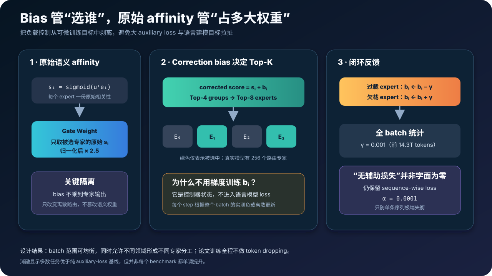
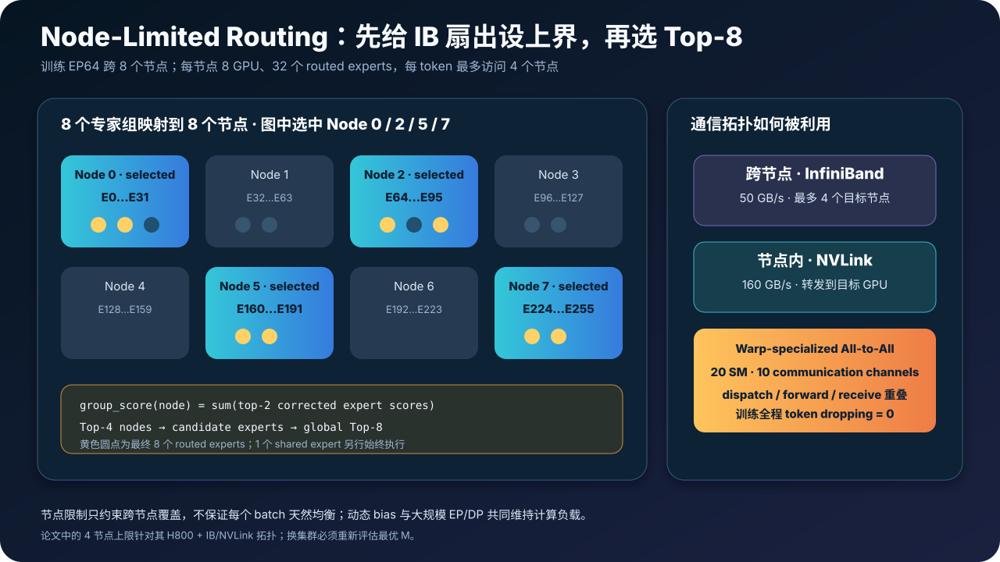
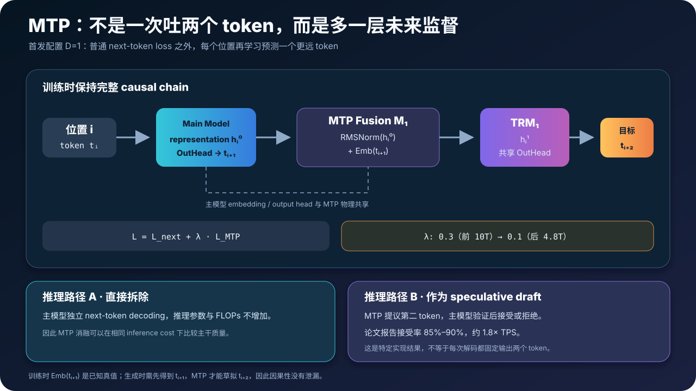
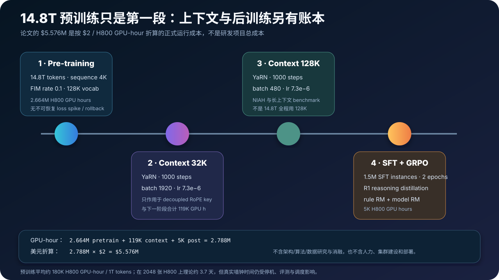
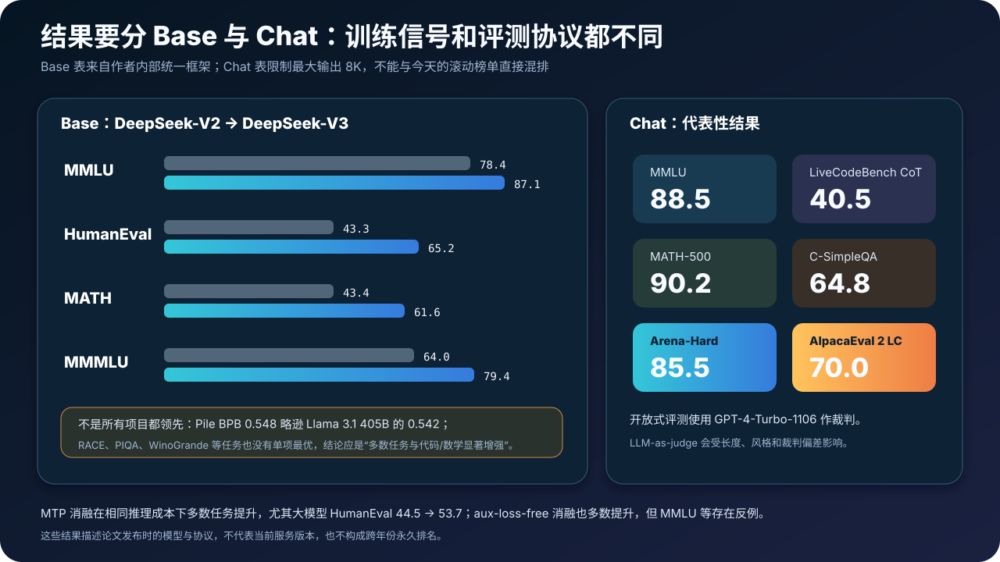

# DeepSeek-V3 原理与实现：671B 如何只激活 37B，FP8、无辅助损失路由与 MTP 如何协同


> **论文**：DeepSeek-V3 Technical Report  
> **作者**：DeepSeek-AI  
> **时间**：2024 年 12 月发布；本文依据 2025 年 2 月 18 日更新的 arXiv v2  
> **关键词**：Multi-head Latent Attention、DeepSeekMoE、Auxiliary-Loss-Free Load Balancing、Node-Limited Routing、Multi-Token Prediction、FP8、DualPipe  
> **原文**：[arXiv](https://arxiv.org/abs/2412.19437) · [HTML](https://arxiv.org/html/2412.19437) · [PDF](https://arxiv.org/pdf/2412.19437)  
> **官方资源**：[GitHub](https://github.com/deepseek-ai/DeepSeek-V3) · [公开配置](https://huggingface.co/deepseek-ai/DeepSeek-V3/blob/main/config.json) · [671B 推理配置](https://github.com/deepseek-ai/DeepSeek-V3/blob/main/inference/configs/config_671B.json) · [参考推理实现](https://github.com/deepseek-ai/DeepSeek-V3/blob/main/inference/model.py)  
> **本文代码**：[参数账本 + 动态 bias 路由 + FP8 分块量化 + MTP 对齐](./code/deepseek_v3_minimal.py)

> **版本边界**：DeepSeek-V3 是 2024 年 12 月发布的模型与技术报告。本文采用的 arXiv v2 后训练章节已经写入从内部 DeepSeek-R1 蒸馏推理数据的细节；这不等于 DeepSeek-V3 就是 DeepSeek-R1，也不能把后来 V3-0324、R1 或当前在线服务的表现倒灌进首发模型。

DeepSeek-V3 的难点不在某一个新算子，而在四本账同时成立：

- **容量账**：主模型约 671B 参数，却让一个 token 只走约 37B；
- **路由账**：不再让大权重 auxiliary loss 与语言建模目标互相拉扯，又不能让专家失衡；
- **精度账**：大部分 Linear 的主计算改用 FP8，关键路径、累加和优化器状态仍保留更高精度；
- **系统账**：在 2048 张 H800 上，让跨节点 All-to-All 尽量藏进前反向计算，而不是只得到“理论 FLOPs 很低”的 MoE。

论文报告，模型在 14.8T token 上完成预训练，正式训练运行共消耗 2.788M H800 GPU hours；按论文假设的每 GPU hour 2 美元折算为 5.576M 美元。这个数字很亮眼，但它只覆盖论文列出的正式训练运行，不包含前期架构、算法、数据研究与消融，也不是人员、机房和部署的完整项目成本。

下面从模型结构、训练算法、数值格式和集群调度四层拆开，再把它们重新拼回一条完整链路。

---

## 0. 一分钟抓住 DeepSeek-V3


先记住 30 个结论：

1. **DeepSeek-V3 是 61 层 decoder-only Transformer。** 隐藏维度 7168，公开配置词表张量为 129280。
2. **主模型约有 671B 总参数，每 token 激活约 37B。** “37B”是执行路径，不是 checkpoint 大小。
3. **前 3 层 FFN 是 dense。** 后面 58 层使用 DeepSeekMoE。
4. **每个 MoE 层有 1 个共享专家和 256 个路由专家。** 每个 token 始终执行共享专家，再选 8 个路由专家。
5. **一个路由专家仍是完整 SwiGLU。** 中间维度 2048，单专家约 44.04M 参数。
6. **MLA 与 DeepSeekMoE 主干继承自 V2。** V3 的 headline 新增项不是重新发明这两个模块。
7. **MLA 每层每 token 的核心缓存宽度仍是 576。** 即 512 维联合 KV latent 加 64 维解耦 RoPE key。
8. **Query latent 为 1536 维。** 它主要减少训练激活，而不是跨步 KV Cache。
9. **V3 路由先用 sigmoid 得到语义 affinity。** 不是 V2 的 softmax 路由。
10. **动态 correction bias 只决定“选谁”。** 真正乘到专家输出上的 gate weight 仍来自原始 affinity。
11. **bias 不通过语言建模 loss 学习。** 每个训练 step 按整 batch 的实际负载做加减反馈。
12. **过载专家 bias 减小，欠载专家 bias 增大。** 前 14.3T token 的更新速度 $\gamma=0.001$，最后 500B 设为 0。
13. **“Auxiliary-Loss-Free”不是所有均衡项都为零。** 仍有权重 $10^{-4}$ 的 sequence-wise loss 防止单条序列极端失衡。
14. **训练与推理都不做 token dropping。** 这是 V3 相比 V2 路由系统的重要改变。
15. **Node-Limited Routing 先选最多 4 个节点，再选全局 Top-8 专家。** 它约束的是网络目的地，不保证天然负载均匀。
16. **训练时 64-way expert parallel 跨 8 个节点。** 每节点 8 张 GPU、32 个路由专家。
17. **训练没有使用 tensor parallel。** 但部署的 Attention 会用 TP/SP；不要混淆训练与服务拓扑。
18. **MTP 的深度 $D=1$。** 主模型预测 $t_{i+1}$，附加模块再学习 $t_{i+2}$。
19. **MTP 不是自回归一步强制吐出两个 token。** 普通推理可直接拆掉，或把它当 speculative draft head。
20. **论文特定 speculative 实现报告第二 token 接受率 85%～90%、吞吐约 1.8 倍。** 这不是对所有硬件与请求的保证。
21. **大部分 Linear 的 Fprop、Dgrad、Wgrad 使用 E4M3 FP8。** Embedding、LM Head、Attention、MoE Gate、Norm 等仍保留高精度。
22. **Activation 按 $1\times128$ tile 缩放，Weight 按 $128\times128$ block 缩放。** scale 在线按当前数据计算。
23. **每 128 个 K 方向元素把 Tensor Core 部分和提升到 CUDA Core FP32 寄存器。** 这是控制低精度累加误差的关键。
24. **FP8 GEMM 的理论吞吐约为 BF16 的 2 倍，不等于训练端到端 2 倍。** 通信、非 GEMM 算子和内存仍在账上。
25. **DualPipe 把 backward 拆成 input-gradient 与 weight-gradient。** 再从 pipeline 两端送入微批，制造可与通信重叠的空档。
26. **训练配置是 16-way PP、64-way EP、ZeRO-1 DP。** All-to-All 通信被 dispatch/forward/receive warp specialization 进一步隐藏。
27. **预训练主阶段长度 4K。** 32K 与 128K 是之后各 1000 step 的上下文扩展阶段。
28. **14.8T 数据更强调数学、代码与多语言，并以 0.1 比例使用 FIM。** 128K 不是 14.8T token 从头训练的长度。
29. **V3-Base 与 V3-Chat 必须分开评测。** Chat 的 SFT/RL 与 R1 蒸馏信号不能用来解释 Base 预训练表。
30. **论文的核心贡献是协同设计。** 单独复制 sigmoid、FP8 或流水线名字，都不会自动复现 671B 训练效率。

一句话概括：

> DeepSeek-V3 在 V2 的“MLA 压状态、MoE 扩容量”基础上，把均衡从梯度目标移到闭环控制，把额外未来 token 变成训练监督，再用细粒度 FP8、节点受限路由和 DualPipe 把算法优势落到 H800 集群。

---

## 1. 先分清：哪些继承 V2，哪些才是 V3 新增

| 维度 | DeepSeek-V2 | DeepSeek-V3 | V3 改变的核心 |
|---|---:|---:|---|
| 总参数 / 激活参数 | 236B / 21B | 671B / 37B | 容量扩大，单 token 计算增长较慢 |
| 训练 token | 8.1T | 14.8T | 数据规模与配方升级 |
| 层数 / hidden | 60 / 5120 | 61 / 7168 | 主干扩大 |
| MLA KV latent / RoPE key | 512 / 64 | 512 / 64 | 基本继承 |
| Dense 层数 | 1 | 3 | 扩大底层 dense stem |
| 共享 / 路由专家 | 2 / 160 | 1 / 256 | 专家更细、更大总容量 |
| 每 token 路由专家 | 6 | 8 | 活跃路径扩大 |
| 路由 affinity | softmax | sigmoid | 不再要求所有专家先竞争同一概率质量 |
| 选中后 gate | 不重归一 | 归一后乘 2.5 | 保持输出尺度 |
| 路由均衡 | 多个 auxiliary losses | 动态 correction bias + 极小序列 loss | 降低语言目标干扰 |
| 通信约束 | 最多 3 个设备 | 最多 4 个节点 | 从设备级提升到节点拓扑级 |
| Token dropping | 训练时存在 | 训练、推理都没有 | 不再牺牲 token |
| MTP | 无 | $D=1$ | 多一个未来 token 的监督 |
| 原生训练精度 | BF16 主训练 | 混合 FP8 | 降低主 GEMM 成本 |
| 流水线 | 常规系统优化 | DualPipe | 计算与通信深度重叠 |

因此，V3 的阅读顺序应该是：

```text
V2 主干：MLA + DeepSeekMoE
         │
         ├─ 路由：sigmoid + correction bias + node limit
         ├─ 目标：next token + sequential MTP
         ├─ 数值：fine-grained FP8 + FP32 accumulation
         └─ 系统：DualPipe + warp-specialized All-to-All
```

如果还不熟悉 MLA 的权重吸收推导，可先看 [DeepSeek-V2 详解](./49_DeepSeek_V2_2024_原理.md)。本文仍给出足够的自包含解释，但重点放在 V3 的增量贡献。

---

## 2. 完整架构与公开配置

官方 671B 推理配置的关键尺寸如下：

| 参数 | 数值 | 含义 |
|---|---:|---|
| `dim` / hidden size | 7168 | 残差流宽度 |
| `n_layers` | 61 | Transformer 层数 |
| `n_heads` | 128 | MLA Query 头数 |
| `q_lora_rank` | 1536 | Query latent 维度 |
| `kv_lora_rank` | 512 | 联合 KV latent 维度 |
| `qk_nope_head_dim` | 128 | 内容 Q/K 每头维度 |
| `qk_rope_head_dim` | 64 | RoPE Q/K 每头维度 |
| `v_head_dim` | 128 | Value 每头维度 |
| `inter_dim` | 18432 | 前 3 层 dense SwiGLU 维度 |
| `moe_inter_dim` | 2048 | 单个细粒度专家中间维度 |
| `n_dense_layers` | 3 | Dense FFN 层数 |
| `n_shared_experts` | 1 | 每个 MoE 层共享专家数 |
| `n_routed_experts` | 256 | 每个 MoE 层路由专家数 |
| `n_activated_experts` | 8 | 每 token 选中路由专家数 |
| `n_expert_groups` | 8 | 路由专家组 / 训练节点数 |
| `n_limited_groups` | 4 | 每 token 最多候选专家组 |
| `route_scale` | 2.5 | 选中 affinity 归一后的尺度 |
| `score_func` | sigmoid | 路由 affinity 函数 |
| `vocab_size` | 129280 | 发布张量实际词表维度 |

等价的精简配置：

```python
cfg = dict(
    vocab_size=129_280,
    dim=7_168,
    n_layers=61,
    n_heads=128,
    q_lora_rank=1_536,
    kv_lora_rank=512,
    qk_nope_head_dim=128,
    qk_rope_head_dim=64,
    v_head_dim=128,
    inter_dim=18_432,
    moe_inter_dim=2_048,
    n_dense_layers=3,
    n_shared_experts=1,
    n_routed_experts=256,
    n_activated_experts=8,
    n_expert_groups=8,
    n_limited_groups=4,
    route_scale=2.5,
)
```

论文正文常把词表写成扩展到 128K，这是舍入描述；参数账本必须使用配置中的 129280，否则 Embedding 与 LM Head 会少算。

---

## 3. 参数账本：671B 保存在哪里，37B 又执行在哪里

“大总容量、小激活路径”是 MoE 最容易被口号化的地方。下面把账精确算到参数。

### 3.1 一个路由专家

SwiGLU 专家为：

$$
\operatorname{FFN}(x)
=W_2\left(\operatorname{SiLU}(W_1x)\odot W_3x\right).
$$

隐藏维度 7168，中间维度 2048：

$$
P_{\text{expert}}
=3\times7168\times2048
=44{,}040{,}192.
$$

### 3.2 一个 MoE 层的总专家参数

每层存 256 路由专家和 1 共享专家：

$$
P_{\text{experts/layer}}
=(256+1)\times44{,}040{,}192
=11{,}318{,}329{,}344.
$$

但一个 token 只执行 8 路由专家和 1 共享专家：

$$
P_{\text{active experts/layer}}
=(8+1)\times44{,}040{,}192
=396{,}361{,}728.
$$

只看专家矩阵，单 token 使用约 $9/257=3.50\%$ 的专家容量。

### 3.3 MLA 每层参数

MLA 的主要投影可按公开实现拆成：

$$
\begin{aligned}
P_{\text{MLA}}={}&
d r_q+r_q H(d_c+d_R)
\\&+d(r_{KV}+d_R)+r_{KV}H(d_c+d_v)
\\&+Hd_vd+r_q+r_{KV},
\end{aligned}
$$

其中：

$$
d=7168,\quad H=128,\quad r_q=1536,\quad r_{KV}=512,
$$

$$
d_c=128,\quad d_R=64,\quad d_v=128.
$$

代入得到：

$$
P_{\text{MLA/layer}}=187{,}107{,}328.
$$

### 3.4 Dense stem 与 Embedding

前 3 层 dense SwiGLU：

$$
P_{\text{dense FFN/layer}}
=3\times7168\times18432
=396{,}361{,}728.
$$

3 层合计 $1{,}189{,}085{,}184$。

Embedding 与未绑定的 LM Head 各为：

$$
129280\times7168=926{,}679{,}040.
$$

### 3.5 汇总

| 项目 | 总参数账 | 每 token 激活账 |
|---|---:|---:|
| Embedding + LM Head | 1,853,358,080 | 1,853,358,080 |
| 61 层 MLA | 11,413,547,008 | 全部激活 |
| 3 层 dense FFN | 1,189,085,184 | 全部激活 |
| 58 层 MoE 专家 | 656,463,101,952 | 每层仅共享 1 + 路由 8 |
| 58 层 router / bias | 106,445,312 | 路由都需打分 |
| RMSNorm | 881,664 | 全部激活 |
| **官方配置重建合计** | **671,026,419,200** | **37,552,297,472** |

最终重建值分别约为 **671.026B** 和 **37.552B**，与论文的 671B / 37B headline 一致。

> 这个主模型账本不含训练时可拆卸的 MTP 模块。普通推理可以移除它，因此论文 headline 与官方 671B 推理配置应按主模型口径理解。

### 3.6 37B 不代表部署只存 37B

假设权重全用 BF16，仅 671B 权重理论上就约：

$$
671\times10^9\times2\ \text{bytes}\approx1.34\ \text{TB}.
$$

MoE 降的是每 token 计算，不会自动消灭未激活专家的存储、加载、分片与通信成本。量化能减少字节，但不是把总权重变成 37B。

---

## 4. MLA：V3 仍靠 576 维状态压住 KV Cache

MLA 的核心目标是把多头 K/V 的历史状态联合压缩。

### 4.1 联合 KV latent

对位置 $t$ 的隐藏状态 $h_t$：

$$
c_t^{KV}=W^{DKV}h_t,\qquad c_t^{KV}\in\mathbb R^{512}.
$$

再由它恢复各头内容 K 与 V：

$$
k_{t,i}^{C}=W_i^{UK}c_t^{KV},\qquad
v_{t,i}^{C}=W_i^{UV}c_t^{KV}.
$$

RoPE key 走独立分支：

$$
k_t^R=\operatorname{RoPE}(W^{KR}h_t),\qquad k_t^R\in\mathbb R^{64}.
$$

所以每层每 token 的核心缓存宽度为：

$$
512+64=576.
$$

### 4.2 为什么 RoPE 必须解耦

若位置旋转直接夹在内容 K 的上投影后，位置相关矩阵会阻止把 $W^{UK}$ 静态吸收到 Query 投影中。MLA 将内容 K 与 RoPE K 分开后：

- 内容 K 上投影可吸收到 Query 侧；
- V 上投影可吸收到输出投影侧；
- 解码时不必为所有历史 token 显式恢复完整多头 K/V。

### 4.3 Query 也低秩，但作用不同

$$
c_t^Q=W^{DQ}h_t,\qquad c_t^Q\in\mathbb R^{1536}.
$$

Query 不跨生成步缓存，因此这条压缩主要减少训练激活与投影开销；KV latent 才直接决定历史缓存。

V3 没有在 MLA 的核心维度上激进扩张：模型容量大幅增加时，KV latent 仍保持 512。这是 128K 上下文和大批服务仍有可能落地的重要前提。

---

## 5. DeepSeekMoE：容量与计算继续解耦

一个 V3 MoE 层的输出可写为：

$$
h'_t=h_t+operatorname{Shared}(h_t)
+\sum_{i\in\mathcal T_t}g_{i,t}\operatorname{Expert}_i(h_t),
$$

其中 $|\mathcal T_t|=8$。

### 5.1 共享专家做什么

共享专家永远执行，负责更普遍的知识与变换；路由专家可更放心地按领域、模式或局部结构分工。相比把所有专家都放在竞争池里，这种隔离减少多个路由专家重复学习共性能力的压力。

### 5.2 细粒度专家为什么有用

总参数预算固定时，把一个大专家切成更多小专家会增加可组合路径：

$$
\binom{256}{8}
$$

远大于少数大专家的组合数。代价也很直接：

- 路由打分更多；
- token dispatch 更碎；
- 跨 GPU All-to-All 更难；
- 负载稍微偏斜就会形成尾部延迟。

V3 的 auxiliary-loss-free routing、node limit 与通信内核，就是为这些副作用服务的，不是互相独立的装饰。

---

## 6. 路由第一步：用 sigmoid 计算 affinity

对 token 表示 $u_t$ 与第 $i$ 个路由专家中心 $e_i$：

$$
s_{i,t}=\sigma(u_t^Te_i).
$$

Sigmoid 与 softmax 的差别不是只换了函数名：

- softmax 让所有专家共享总和为 1 的概率质量；
- sigmoid 为每个 expert-token 对独立给出 affinity；
- 最终只对选中的专家权重做归一。

V3 的选中后 gate 为：

$$
g_{i,t}=
\frac{s_{i,t}}{\sum_{j\in\mathcal T_t}s_{j,t}}\times2.5,
\qquad i\in\mathcal T_t.
$$

因此选中 gate 的和为 2.5，而不是 1。`route_scale=2.5` 是模型校准的一部分，不能在复现时随手删掉。

---

## 7. Auxiliary-Loss-Free：把“选谁”和“占多大权重”分离



V2 用专家级、设备级、通信级辅助损失把路由往均衡方向拉。问题是：辅助损失权重大，语言建模目标会被干扰；权重小，均衡又不够。

V3 改为一个控制回路。

### 7.1 Correction bias 只参与 Top-K

为每个专家维护 bias $b_i$，选择时使用：

$$
\tilde s_{i,t}=s_{i,t}+b_i.
$$

Top-K 的集合由 $\tilde s$ 决定：

$$
\mathcal T_t=\operatorname{TopK}(\{\tilde s_{i,t}\}).
$$

但选中后的 gate weight 仍使用原始 $s$，不是 $\tilde s$：

$$
g_{i,t}\propto s_{i,t},\qquad i\in\mathcal T_t.
$$

这条隔离至关重要：

```text
corrected score s + b  → 决定离散路由
original affinity s    → 决定专家输出权重
```

Bias 像交通信号，只改变车辆走哪条路，不给专家的语义输出偷偷加权。

### 7.2 Bias 如何更新

每个训练 step 统计整 batch 的专家负载。设目标负载附近为平衡点：

$$
b_i\leftarrow
\begin{cases}
b_i-\gamma,&\text{expert }i\text{ 过载},\\
b_i+\gamma,&\text{expert }i\text{ 欠载}.
\end{cases}
$$

论文设置：

- 前 14.3T token：$\gamma=0.001$；
- 最后 500B token：$\gamma=0$，冻结路由校正。

$b_i$ 不经反向传播，也不需要语言模型 loss 为它提供梯度。它依据实际交通量直接反馈。

### 7.3 为什么 batch-wise 均衡允许专家分工

单条数学序列完全可能偏爱少数数学专家，代码序列也会偏爱代码专家。如果强迫每条序列内部均匀分配，恰恰会破坏专业化。

V3 主要在 batch 范围闭环均衡：

- 单条序列可以偏；
- 不同领域可以形成不同专家分工；
- 聚合到 batch 后，集群负载仍趋于均匀。

这不是“取消均衡”，而是把均衡统计尺度从样本内提升到系统实际运行尺度。

---

## 8. 为什么“无辅助损失”不是字面上的零

论文仍保留一个极小的 sequence-wise balance loss，系数：

$$
\alpha=0.0001.
$$

对长度为 $T$ 的单条序列，论文定义：

$$
L_{\mathrm{Bal}}=\alpha\sum_{i=1}^{N_r}f_iP_i,
$$

$$
f_i=\frac{N_r}{K_rT}\sum_{t=1}^{T}
\mathbf 1\!\left(i\in\operatorname{TopK}(s_{\cdot,t})\right),
$$

$$
P_i=\frac1T\sum_{t=1}^{T}
\frac{s_{i,t}}{\sum_{j=1}^{N_r}s_{j,t}}.
$$

$f_i$ 表示这条序列实际把多少 token 分给专家 $i$，$P_i$ 表示归一化 affinity 的平均质量。二者相关越强，说明路由越集中，惩罚越大。

它只用于防止一条序列内部出现极端失衡。更准确的表述是：

> V3 取消了作为主要全局均衡手段的大权重 auxiliary loss，用不可微的动态 bias 接管 batch 级均衡；同时保留极小的序列级保护项。

这也解释了论文的命名与实现看似矛盾的地方。它强调的是主要均衡机制不再依赖辅助训练目标，不是源码里永远找不到任何 balance term。

### 8.1 消融并非每个任务都单调提升

论文在小模型与 228.7B 级模型上比较传统 auxiliary loss 和新方法。新路由在 Pile BPB、BBH、HumanEval、GSM8K、MATH 等多数指标改善，但例如大模型 MMLU 从 68.3 降到 67.2，小模型 MBPP 也略降。

因此应得出的结论是“总体有效且减少训练目标干扰”，不是“在所有 benchmark 上严格占优”。

---

## 9. Node-Limited Routing：先约束网络目的地，再选 Top-8



训练采用 64-way Expert Parallel，分布在 8 个节点；每节点 8 张 H800，合计放置 32 个路由专家。节点内使用高带宽 NVLink/NVSwitch，跨节点走 InfiniBand。

如果每个 token 的 8 个专家散在 8 个节点，跨节点 All-to-All 会吞掉 MoE 节省的计算。V3 先选专家组。

### 9.1 组分数

256 个路由专家分为 $M=8$ 组。每组分数取该组最高的 $K/M=8/4=2$ 个 corrected score 之和：

$$
S_m=\sum_{i\in\operatorname{Top2}(G_m)}\tilde s_{i,t}.
$$

先选分数最高的 4 组，再从这些组的候选专家中选全局 Top-8：

$$
\mathcal G_t=\operatorname{Top4}(\{S_m\}),
$$

$$
\mathcal T_t=operatorname{Top8}
\left(\bigcup_{m\in\mathcal G_t}G_m\right).
$$

于是一个 token 最多访问 4 个远端节点。

### 9.2 Node limit 不负责均衡

它只给通信扇出设置上界：

- 动态 correction bias 负责长期负载；
- node-limited selection 负责网络目的地数；
- expert parallel 负责参数放置；
- warp-specialized All-to-All 负责通信执行。

少任何一层，另外三层都不能独立保证系统高效。

### 9.3 为什么 V3 能不丢 token

V2 训练会在设备容量超限时丢低 affinity token。V3 通过更稳定的 batch 级反馈和系统容量规划做到训练、推理均不 token dropping。

这既避免训练信号消失，也减少训练与推理路由行为不一致。代价是系统必须真正能承接峰值负载，不能靠丢 token 掩盖尾部拥塞。

---

## 10. 最小路由实现

下面的代码体现三个关键隔离：

1. sigmoid 产生原始 affinity；
2. affinity 加 bias 只用于选组和选专家；
3. 输出 gate 使用原始 affinity 归一并乘 2.5。

```python
def route(logits, correction_bias, *, groups=8, keep_groups=4, topk=8):
    affinity = [sigmoid(x) for x in logits]
    corrected = [s + b for s, b in zip(affinity, correction_bias)]

    experts_per_group = len(logits) // groups
    group_scores = []
    for group in range(groups):
        begin = group * experts_per_group
        ids = range(begin, begin + experts_per_group)
        # V3 correction-bias path: group score = top-2 corrected scores.
        group_scores.append(sum(sorted((corrected[i] for i in ids), reverse=True)[:2]))

    selected_groups = top_indices(group_scores, keep_groups)
    candidates = [
        i
        for group in selected_groups
        for i in range(group * experts_per_group, (group + 1) * experts_per_group)
    ]
    selected = sorted(candidates, key=lambda i: corrected[i], reverse=True)[:topk]

    denom = sum(affinity[i] for i in selected)
    gates = {i: 2.5 * affinity[i] / denom for i in selected}
    return selected, gates
```

生产实现还必须处理分布式计数、容量、稳定排序、padding/alignment、反向 dispatch 与 kernel 融合；这段代码只用于验证算法语义。

---

## 11. MTP：多一层未来监督，而不是一步吐两个 token



普通 next-token prediction 在位置 $i$ 用 $t_{\le i}$ 预测 $t_{i+1}$。V3 额外放置顺序串联的 Multi-Token Prediction 模块。首发配置 $D=1$，即再预测一个更远 token。

### 11.1 输入融合

第 $k$ 个 MTP 模块把上一级表示与未来一个已知 token 的 embedding 融合：

$$
h_i'^{,k}=M_k
\left[
\operatorname{RMSNorm}(h_i^{k-1});
\operatorname{RMSNorm}(\operatorname{Emb}(t_{i+k}))
\right].
$$

其中 $[a;b]$ 表示拼接，$M_k$ 把拼接结果投影回模型 hidden size。再经过一个 Transformer block：

$$
h_i^k=\operatorname{TRM}_k(h_i'^{,k}).
$$

它预测：

$$
P_{i+k+1}^{k}=\operatorname{OutHead}(h_i^k).
$$

当 $D=1$ 时：

```text
主模型：位置 i → 预测 t(i+1)
MTP₁ ：位置 i + 已知 t(i+1) → 预测 t(i+2)
```

训练时 $t_{i+1}$ 是 teacher-forcing 的真值，不存在因果泄漏：MTP 只预测它之后的 $t_{i+2}$。

### 11.2 损失

每个深度都计算交叉熵：

$$
L_{\text{MTP}}^k
=-\frac1T\sum_i\log P_{i+k+1}^{k}[t_{i+k+1}].
$$

总损失：

$$
L=L_{\text{next}}+
\lambda\frac1D\sum_{k=1}^{D}L_{\text{MTP}}^k.
$$

论文调度为：

- 前 10T token：$\lambda=0.3$；
- 后 4.8T token：$\lambda=0.1$。

### 11.3 为什么 MTP 可能改善主模型

即使推理时拆掉 MTP，训练表示也被要求支持更远未来：

- 当前 hidden state 不能只记一个局部 next-token shortcut；
- 对代码、数学等多步结构，需要更强的前瞻信息；
- 多个目标给共享主干提供更密集的监督。

消融中，小模型 HumanEval 从 20.7 提升到 26.8、GSM8K 从 25.4 到 31.4；228.7B 级模型 HumanEval 从 44.5 到 53.7。也有反例，例如大模型 MMLU 从 67.5 略降到 66.6。

### 11.4 两条推理路径

**路径 A：拆掉 MTP。**

主模型照常 next-token decoding，参数量与 FLOPs 不增加。此时 MTP 只是一种训练期正则 / 辅助监督。

**路径 B：用作 speculative draft。**

MTP 先提出更远 token，主模型验证后接受或拒绝。论文报告特定实现中第二 token 接受率为 85%～90%，生成吞吐约 1.8 倍。

它仍不是“每步必然生成两个 token”：接受率、验证批次、采样策略、kernel 与请求长度都会改变收益。

---

## 12. FP8 训练：不是“整个模型全八位”


论文将大多数 Linear 的三个主矩阵乘放到 E4M3 FP8：

- Fprop：前向；
- Dgrad：输入梯度；
- Wgrad：权重梯度。

但关键路径仍使用 BF16 或 FP32。

### 12.1 高精度保留区

论文明确保留高精度的部分包括：

- Token Embedding 与输出 LM Head；
- Attention 的敏感计算；
- MoE Gate；
- RMSNorm 等归一化；
- FP32 master weights；
- FP32 gradient accumulator。

AdamW 的一、二阶矩使用 BF16。于是更准确的结构是：

```text
FP8：大部分 Linear GEMM 与部分存储/通信
BF16：敏感输出、部分状态和 combine
FP32：主权重、梯度累计和周期性高精度部分和
```

“使用 FP8 训练”描述的是主计算路径，不是每个张量从头到尾都只有 8 bit。

---

## 13. 细粒度缩放：让局部 outlier 不污染整张矩阵

FP8 的动态范围有限。若整个张量只用一个 scale，一个局部极大值会迫使其他数值挤在很少的可表示区间。

V3 的粒度：

- Activation：每个 token 的每 128 个 channel 一个 scale，即 $1\times128$ tile；
- Weight：每 128 个输入维度 × 128 个输出维度一个 scale，即 $128\times128$ block。

对一组实数 $x$，简化量化可写为：

$$
s=\frac{\max|x|}{q_{\max}},\qquad
q=Q_{\text{E4M3}}(x/s),\qquad
\hat x=sq.
$$

细粒度 tile 相当于为不同局部区域选择不同 $s$。局部 outlier 只影响自己的 tile，不会压扁全局小值。

### 13.1 在线缩放，不是 delayed scaling

Scale 根据当前 tile 的 `max(abs(x))` 在线计算，而不是沿用历史统计的 delayed scaling。优点是响应当前分布，代价是必须把 reduction、scale 与 GEMM 紧密融合，否则 scale 开销会吃掉低精度收益。

### 13.2 为什么统一使用 E4M3

常见配方会为梯度使用范围更大的 E5M2。V3 借助更细粒度缩放，让 activation、weight 和 gradient 都可使用精度更高的 E4M3，从而减少尾数损失。

---

## 14. 高精度累加：每 128 个 K 元素“抬一次头”

H800 Tensor Core 的 FP8 GEMM 并不意味着无限精度累加。论文指出其累加精度约保留 14 bit；当 K 维很长，误差会持续积累。

V3 每完成 $N_C=128$ 个 K 方向元素，也就是 4 组 WGMMA 后：

1. 从 Tensor Core accumulator 取出部分和；
2. 提升到 CUDA Core 的 FP32 寄存器；
3. 清空低精度累加器并继续；
4. 最后在 FP32 汇总。

概念上：

$$
C=\sum_{j=1}^{K/128}
\operatorname{FP32}\left(
\operatorname{TC}_{\text{FP8}}(A_jB_j)
\right).
$$

论文给出 K=4096 的测试：若不做这一步，最大相对误差可接近 2%。所以 FP8 的关键不是“把 dtype 改成 float8”，而是缩放粒度、累加策略和硬件 tile 共同设计。

---

## 15. 低精度还用于存储与通信

V3 不只让 GEMM 输入使用 FP8，还在合适位置压缩 activation cache 和 MoE dispatch：

- 多数 Linear 输入 activation 以 FP8 缓存，反向时减少显存；
- 特别敏感的 Attention 输入使用定制 E5M6 表示；
- SwiGLU 输入可通过重算减少保存；
- MoE dispatch 使用 FP8；
- MoE combine 保持 BF16。

Dispatch 是把 token 发到专家，Combine 是把多个专家结果加回 token。前者更像带宽传输，后者涉及求和，对误差更敏感，因此二者不使用同一精度。

论文约 1T token 的控制实验中，FP8 相对 BF16 的 loss 相对误差持续低于 0.25%。这证明该训练过程可控，但不是对所有模型、硬件、任务的统一误差上界。

---

## 16. DualPipe：把反向拆开，制造通信重叠窗口


大规模 MoE 的专家计算与 All-to-All 通信时间接近 1:1。若流水线把它们串行排布，稀疏计算省下的时间会被网络补回来。

DualPipe 做两件事：

1. 从 pipeline 两端同时注入微批；
2. 将 backward 拆成 input-gradient 与 weight-gradient 两段。

拆开后，调度器能把通信塞进另一方向的计算空档。

### 16.1 训练并行配置

论文配置为：

| 维度 | 数值 |
|---|---:|
| Pipeline Parallel | 16-way |
| Expert Parallel | 64-way，跨 8 节点 |
| Data Parallel | ZeRO-1 |
| Tensor Parallel | 不使用 |

不使用训练 TP，避免在主干每层增加细粒度跨卡通信；超大专家参数则通过 EP 分散。

### 16.2 Bubble 公式

若 $F$、$B$、$W$ 分别表示 forward、完整 backward 与 weight-gradient 时间，论文给出概念对比：

$$
\text{1F1B bubble}=(PP-1)(F+B),
$$

$$
\text{ZB1P bubble}=(PP-1)(F+B-2W),
$$

$$
\text{DualPipe bubble}
=\left(\frac{PP}{2}-1\right)(F\&B+B-3W).
$$

这里 $F\&B$ 表示被调度到一起的 forward 与 backward-for-input 组合阶段。公式服务于论文的流水线时间模型，不能脱离微批数、stage 平衡与实现细节当作任意集群的实测速率。

### 16.3 内存代价

DualPipe 需要两份模型参数，activation 峰值约为 $PP+1$ 个微批；1F1B 只需一份参数、activation 约 $PP$。

为什么还能承受？因为 64-way EP 已把每个 rank 的专家权重显著分散。这里是典型的“用 EP 释放的局部权重空间，换 pipeline bubble 与通信重叠”。

---

## 17. Warp-Specialized All-to-All

论文在每张 H800 上划出 20 个 SM 专做通信，并将 10 个通信 channel 分配给不同阶段：

```text
dispatch → 把 token 发到目标专家
forward  → 专家计算
receive  → 把结果收回并 combine
```

通过 warp specialization，网络读写、NVLink 转发与 GEMM 尽量并行。

训练拓扑给出的带宽量级是：

- 节点内 NVLink：约 160 GB/s；
- 跨节点 InfiniBand：约 50 GB/s。

这些数字属于论文的 H800 + IB/NVLink 拓扑。换成不同 GPU、PCIe、RoCE 或不同节点规模时，Top-4 节点上限、专家分组和通信 channel 都需要重新测量，不能机械照抄。

---

## 18. 其余显存与稳定性工程

V3 还组合了多项没有进入标题、但决定训练能否落地的技巧：

### 18.1 选择性重计算

反向时重算 RMSNorm 与 MLA up-projection，而不是保存所有中间 activation。它以额外计算换显存，让更大的 batch 或序列成为可能。

### 18.2 CPU 异步维护 EMA

指数移动平均参数在 CPU 异步更新，避免长期占用宝贵 GPU 显存和主计算路径。

### 18.3 MTP 的物理共享

MTP 与主模型共享 Embedding 和 LM Head；在 pipeline stage 上精心放置，避免复制巨大的词表矩阵。

### 18.4 稳定训练

论文报告整个训练过程没有不可恢复的 loss spike，也不需要 rollback。这是正式训练运行的观察，不等于 FP8/MoE 在任意实现里天然稳定；初始化、scale、累加和网络拥塞处理仍不可少。

---

## 19. 部署并不是把训练拓扑原样复制

训练用 16 PP / 64 EP / no TP，服务则拆分 prefill 与 decode，并采用不同并行策略。

### 19.1 Prefill

论文的 prefill 最小部署单元为 4 节点、32 GPU：

- Attention：TP4 + SP，并做 8-way DP；
- MoE：EP32；
- 每 GPU 放 8 个原始专家和 1 个冗余专家；
- 额外复制 32 个高负载专家，并约每 10 分钟调整一次。

Prefill 计算密集，冗余专家用于消除热点和尾部。

### 19.2 Decode

Decode 的最小部署单元更大：40 节点、320 GPU。

- Attention：TP4 + SP，80-way DP；
- MoE：EP320；
- 共享专家也按 routed expert 处理；
- 部分 GPU 放置冗余 / 共享专家；
- 使用 direct P2P、IBGDA 等减少通信软件开销。

这正是论文自己承认的限制：推荐部署单元很大，会给资源较少的团队带来负担。671B/37B 的计算效率，不等于单机友好。

---

## 20. 数据：14.8T 不只是“更多 token”

论文没有公开完整语料清单，但说明了相对 V2 的变化：

- 提高数学与代码数据占比；
- 扩大英语、中文之外的多语言覆盖；
- 改进去重与数据处理流程；
- 采用 document packing，并且预训练时不加入 cross-sample attention mask；
- 以 0.1 比例使用 Fill-in-the-Middle。

这里不要与后训练混淆：预训练 packed 文档之间没有 cross-sample mask；SFT 虽然也把多个样本打包进一个序列，却会用 sample mask 让样本彼此不可见。

### 20.1 FIM 的 PSM 格式

FIM 随机把文档切成 prefix、middle、suffix，再排成：

```text
<|fim_begin|> prefix <|fim_hole|> suffix <|fim_end|> middle <|eos_token|>
```

模型要补回 middle。这对代码补全尤其重要，因为真实 IDE 场景常同时知道光标前后文。

### 20.2 Tokenizer

V3 使用 Byte-level BPE，在 100K 基础上扩展到论文所称约 128K。公开张量维度是 129280。

论文还提到：

- 合并部分标点与换行组合 token，提高压缩率；
- 对某些 token 随机拆分，缓解边界组合带来的偏差。

词表更大能缩短某些文本序列，但会增加 Embedding 与 LM Head 参数；本模型两者合计已超过 1.85B 参数。

---

## 21. 预训练配方

### 21.1 优化器

使用 AdamW：

$$
\beta_1=0.9,\qquad \beta_2=0.95,\qquad
\text{weight decay}=0.1,
$$

梯度裁剪阈值为 1.0。

### 21.2 学习率

最大学习率 $2.2\times10^{-4}$：

1. 前 2000 step 线性 warmup 到峰值；
2. 保持到 10T token；
3. 接下来 4.3T token 余弦下降到 $2.2\times10^{-5}$；
4. 最后 500B：前 333B 保持 $2.2\times10^{-5}$，最后 167B 降到 $7.3\times10^{-6}$。

### 21.3 Batch size

Batch 从 3072 个序列逐步增加到 15360，在前 469B token 完成增大，之后保持。

### 21.4 两条额外调度

不要漏掉模型算法自己的时间表：

| 阶段 | correction bias $\gamma$ | MTP $\lambda$ |
|---|---:|---:|
| 前 10T | 0.001 | 0.3 |
| 10T～14.3T | 0.001 | 0.1 |
| 最后 500B | 0 | 0.1 |

最后阶段冻结 bias，避免收尾时路由持续漂移；MTP 仍作为较弱监督存在。

---

## 22. 4K 到 128K：上下文扩展是独立阶段



主预训练最大序列长度为 4K。之后使用 YaRN 分两段扩展：

| 阶段 | 目标长度 | Step | Batch | 学习率 |
|---|---:|---:|---:|---:|
| Context phase 1 | 32K | 1000 | 1920 | $7.3\times10^{-6}$ |
| Context phase 2 | 128K | 1000 | 480 | $7.3\times10^{-6}$ |

YaRN 设置包括 scale $s=40$、$\alpha=1$、$\beta=32$，并修改 attention scale：

$$
\sqrt{t}=0.1\ln s+1.
$$

位置扩展只作用于 MLA 的 decoupled RoPE key 分支，而不是内容 latent。

论文用 Needle-In-A-Haystack 与长上下文 benchmark 验证到 128K。但 NIAH 能找到针，只证明特定检索能力，不能代表复杂长文推理、跨段一致性和事实忠实度全部解决。

---

## 23. 成本账：USD 5.576M 到底包含什么

论文列出的 GPU hours：

| 阶段 | H800 GPU hours | 按 USD 2 / GPU hour |
|---|---:|---:|
| 14.8T 预训练 | 2,664,000 | USD 5.328M |
| 上下文扩展 | 119,000 | USD 0.238M |
| 后训练 | 5,000 | USD 0.010M |
| **合计** | **2,788,000** | **USD 5.576M** |

平均每 1T token：

$$
\frac{2.664\text{M}}{14.8}
=180\text{K H800 GPU hours/T token}.
$$

在 2048 张 H800 满载的理想换算下，每 1T token 约 3.7 天；2.788M GPU hours 相当于约 56.7 天连续满载。真实墙钟还受维护、评测、网络与资源调度影响。

### 23.1 不包含什么

论文明确说成本不包括先前研究与消融，例如：

- 架构路线探索；
- 算法与 FP8 方案试验；
- 数据清洗、混合和配方研究。

它也不是完整财务报表：人工、机房、网络、存储、失败实验、推理服务等都不在这张 headline 账里。正确说法是“正式训练运行的论文口径估算”，不是“从零做出 DeepSeek-V3 只花 557.6 万美元”。

---

## 24. Base 结果：先看预训练能力，不混入 Chat



论文在内部统一评测框架下报告 Base：

| Benchmark | DeepSeek-V2 | Qwen2.5 72B | Llama 3.1 405B | DeepSeek-V3 |
|---|---:|---:|---:|---:|
| MMLU | 78.4 | 85.0 | 84.4 | **87.1** |
| MMLU-Pro | 51.4 | 58.3 | 52.8 | **64.4** |
| BBH | 78.8 | 79.8 | 82.9 | **87.5** |
| HumanEval | 43.3 | 53.0 | 54.9 | **65.2** |
| MBPP | 65.0 | 72.6 | 68.4 | **75.4** |
| LiveCodeBench Base | 11.6 | 12.9 | 15.5 | **19.4** |
| GSM8K | 81.6 | 88.3 | 83.5 | **89.3** |
| MATH | 43.4 | 54.4 | 49.0 | **61.6** |
| C-Eval | 81.4 | 89.2 | 72.5 | **90.1** |
| CMMLU | 84.0 | **89.5** | 73.7 | 88.8 |
| MMMLU non-English | 64.0 | 74.8 | 73.8 | **79.4** |

不能只摘胜项。语言建模 Pile BPB 中，V3 为 0.548，略逊于 Llama 3.1 405B 的 0.542；CMMLU 也不是表中最高。

表格来自各作者模型与论文评测协议，prompt、采样、上下文和 contamination 处理都可能不同，不应把小数点差异直接解释为普适能力排序。

---

## 25. 三组关键消融

### 25.1 Auxiliary-loss-free routing

在 228.7B 总参数 / 20.9B 激活、578B token 的消融模型上：

| 指标 | Auxiliary loss | 新路由 |
|---|---:|---:|
| Pile BPB ↓ | 0.656 | **0.652** |
| BBH | 66.7 | **67.9** |
| MMLU | **68.3** | 67.2 |
| HumanEval | 40.2 | **46.3** |
| MBPP | 59.2 | **61.2** |
| GSM8K | 70.7 | **74.5** |
| MATH | 37.2 | **39.6** |

结果支持总体收益，也保留 MMLU 反例。

### 25.2 MTP

同规模 228.7B / 20.9B、540B token 消融：

| 指标 | Baseline | + MTP |
|---|---:|---:|
| BBH | 70.0 | **70.7** |
| MMLU | **67.5** | 66.6 |
| DROP | 68.5 | **70.6** |
| HumanEval | 44.5 | **53.7** |
| GSM8K | 72.3 | **74.0** |
| MATH | 38.6 | **39.8** |

MTP 对代码最突出，但不是所有知识 benchmark 都提升。

### 25.3 FP8

论文用约 1T token 的控制训练比较 BF16 与 FP8，观察到相对 loss 差异始终低于 0.25%。它验证“这套细粒度 scale + 累加方案”没有显著破坏训练，不证明任意框架里把 matmul 换成 FP8 都等价。

---

## 26. 后训练：SFT、R1 蒸馏与 RL

这一节最容易发生版本混淆。arXiv v2 明确写到：后训练用内部 DeepSeek-R1 生成推理数据；DeepSeek-V3 仍是通用 Chat 模型，DeepSeek-R1 则是后续专门推理模型。

### 26.1 SFT 数据

约 1.5M 条样本：

- 推理数据来自内部 DeepSeek-R1；
- 非推理数据主要来自 DeepSeek-V2.5；
- 数据经过人工验证与筛选。

SFT 训练 2 个 epoch，学习率从 $5\times10^{-6}$ 余弦下降到 $1\times10^{-6}$。样本可 packing，但使用 attention mask 防止不同样本互相看见。

### 26.2 为什么不直接照抄 R1 输出

报告指出 R1 生成数据可能出现：

- 过度思考；
- 格式杂乱；
- 回答过长。

因此数据管线需要筛选、改写和人工验证，而不是把 reasoning model 的长 CoT 当作天然真值。

### 26.3 蒸馏信号的控制实验

在 DeepSeek-V2.5 上加入 R1 推理数据后：

| 指标 | 原始 | + R1 数据 |
|---|---:|---:|
| LiveCodeBench CoT | 31.1，平均长度 718 | **37.4**，平均长度 783 |
| MATH-500 | 74.6，平均长度 769 | **83.2**，平均长度 1510 |

能力提升与输出变长同时发生；评估时应把正确率、token 成本和延迟一起看。

---

## 27. Reward Model 与 GRPO

V3 沿用并扩展了 V2 的 Group Relative Policy Optimization。对同一 prompt 采样一组输出 $\{o_i\}_{i=1}^G$，将组内 reward 标准化：

$$
\hat A_i=
\frac{r_i-\operatorname{mean}(r_1,\ldots,r_G)}
{\operatorname{std}(r_1,\ldots,r_G)}.
$$

策略目标使用 clipped ratio，并加 KL 约束：

$$
\mathcal J_{\text{GRPO}}
=\mathbb E\left[
\min\left(
\rho_i\hat A_i,
\operatorname{clip}(\rho_i,1-\epsilon,1+\epsilon)\hat A_i
\right)
-\beta D_{KL}(\pi_\theta\|\pi_{ref})
\right].
$$

Reward 来源包括：

- 数学、代码等可验证任务的 rule-based reward；
- 通用偏好的 model-based reward；
- 带 CoT 的 preference 数据，缓解只优化最终答案导致的 reward hacking；
- 多样化 prompt 覆盖。

报告还使用 self-rewarding：由 V3 多数投票和原则约束生成偏好信号。模型当裁判仍可能有长度、风格、自我偏好等偏差，不能把 LLM judge 分数等同于人类真实偏好。

---

## 28. Chat 结果如何读

论文 v2 报告的代表值：

| 类别 | Benchmark | DeepSeek-V3 Chat |
|---|---|---:|
| 知识 | MMLU | 88.5 |
| 高难知识 | MMLU-Pro | 75.9 |
| 科学问答 | GPQA Diamond | 59.1 |
| 事实问答 | SimpleQA | 24.9 |
| 阅读 | DROP | 91.6 |
| 长上下文 | LongBench v2 | 48.7 |
| 代码 | HumanEval-Mul | 82.6 |
| 代码 | LiveCodeBench CoT | 40.5 |
| 软件工程 | SWE Verified | 42.0 |
| 数学 | AIME 2024 | 39.2 |
| 数学 | MATH-500 | 90.2 |
| 中文事实 | C-SimpleQA | 64.8 |
| LLM judge | Arena-Hard | 85.5 |
| LLM judge | AlpacaEval 2.0 LC | 70.0 |

开放式评测使用 GPT-4-Turbo-1106 作裁判。模型 judge 会受长度、格式、语气和位置偏差影响；论文中的 Chat 最大输出也受发布协议约束。它们适合比较报告当时的配置，不是对今天滚动服务、模型新版本或不同 sampling 的永久排名。

---

## 29. 可运行代码：同时验证四本账

[本文代码](./code/deepseek_v3_minimal.py) 只依赖 Python 标准库，覆盖：

1. 由公开配置重建 671.026B / 37.552B；
2. 模拟 sigmoid + correction bias + Top-4 groups + Top-8 experts；
3. 对比 tensor-wise 与 tile-wise E4M3 toy quantization；
4. 验证 $D=1$ MTP 的 target 错位关系。

运行：

```bash
python3 papers/to-2026/code/deepseek_v3_minimal.py
```

输出：

```text
DeepSeek-V3 architecture ledger
  total parameters:  671,026,419,200 (~671B)
  active per token:  37,552,297,472 (~37B)
  MoE layout:       58 layers, 1 shared + Top-8 of 256 routed
  MLA cache width:   512 + 64 = 576 elements/token/layer

Official-run training cost ledger
  pretrain / context / post: 2,664,000 / 119,000 / 5,000 H800 GPU hours
  total:                    2,788,000
  paper's $2/hour estimate: $5.576M

Auxiliary-loss-free routing
  fixed-bias load CV:       2.323
  feedback-bias load CV:    0.725
  selected groups:          [2, 5, 6, 3]
  selected experts:         [187, 205, 88, 73, 98, 106, 210, 75]
  sum of original-s gates:  2.500
  token assignments dropped: 0

Fine-grained E4M3 quantization toy
  tensor-wise MSE:          1.393e-08
  tile-wise MSE:            1.716e-09
  paper granularity:        activations 1x128, weights 128x128

One-depth MTP alignment
  ordinary targets:         [5, 1, 4, 3, 0]
  additional targets:       [1, 4, 3, 0]
  L_main + 0.3 L_MTP:       0.136969
  MTP module at inference:  discard or reuse as a draft head
```

### 29.1 动态 bias 反馈

最小更新器：

```python
def update_correction_bias(bias, load, gamma=0.001):
    target = sum(load) / len(load)
    updated = []
    for b_i, load_i in zip(bias, load):
        if load_i > target:
            updated.append(b_i - gamma)
        elif load_i < target:
            updated.append(b_i + gamma)
        else:
            updated.append(b_i)
    return updated
```

真实实现会考虑并列、跨 rank all-reduce、目标负载计算和更新频率；toy simulation 用负载变异系数展示闭环趋势，不声称复现论文训练曲线。

### 29.2 MTP target 对齐

若 token 为：

```text
[t0, t1, t2, t3, t4, t5]
```

则：

```text
主目标：输入位置 0..4 → [t1, t2, t3, t4, t5]
MTP₁： 输入位置 0..3 → [t2, t3, t4, t5]
```

最常见 bug 是把 MTP 标签只右移一位，结果训练成另一份 next-token head。

---

## 30. 从零复现时，代码还缺什么

本文 toy code 有意不伪装成训练框架。完整复现至少还需要：

- MLA 的 fused prefill / decode kernel 与权重吸收；
- Expert Parallel 的 token packing、All-to-All 和反向 combine；
- correction bias 的全局负载统计；
- FP8 E4M3 真实硬件算子、scale storage 与 FP32 accumulation；
- DualPipe 调度器、微批划分与 stage 平衡；
- checkpoint sharding、optimizer state、容错与恢复；
- 数据去重、混合、FIM、tokenizer 与 contamination 审计；
- SFT/RL 数据、reward model 与在线 rollout 基础设施。

官方仓库提供配置、权重说明与简洁参考推理实现，适合核对张量语义；它不是论文中 2048-H800 完整训练栈的开源复刻。

---

## 31. 15 个常见误读

### 误读 1：DeepSeek-V3 是 37B 模型

不是。它存约 671B 主模型参数，每 token 激活约 37B。

### 误读 2：MoE 因此只需要 37B 权重显存

不是。未激活专家仍需存储、量化或跨设备分片。

### 误读 3：USD 5.576M 是完整研发总成本

不是。它是论文列出的正式训练 GPU hours 按 USD 2/h 折算，不含前期研究和消融，也不是全部财务成本。

### 误读 4：Auxiliary-loss-free 等于没有任何 balance loss

不是。主要 batch 均衡不依赖辅助梯度，但仍有 $\alpha=10^{-4}$ 的 sequence-wise 保护项。

### 误读 5：Correction bias 直接乘到专家输出

不是。它只改变 Top-K 选择；专家输出权重用原始 sigmoid affinity。

### 误读 6：Node-limited routing 自动保证负载均匀

不是。它限制网络目的地，动态 bias 才负责长期负载反馈。

### 误读 7：MoE 训练仍会在拥塞时丢 token

V3 论文明确训练与推理都不 token dropping。

### 误读 8：MTP 让每个解码 step 必然吐两个 token

不是。它首先是训练监督；speculative 模式仍需主模型验证。

### 误读 9：保留 MTP 才能获得论文主模型能力

不是。MTP 可在普通推理拆除，主模型已经接受过额外监督。

### 误读 10：FP8 表示每个参数、激活和状态都是 8 bit

不是。V3 是 FP8/BF16/FP32 混合系统，敏感算子和主状态保留高精度。

### 误读 11：FP8 理论 2× 就等于端到端训练 2×

不是。非 GEMM、通信、scale、重算和流水线 bubble 仍决定实际吞吐。

### 误读 12：14.8T token 都用 128K 序列训练

不是。主预训练长度 4K，32K/128K 是之后各 1000 step 的扩展。

### 误读 13：训练不用 TP，所以部署也不用 TP

不是。论文的 prefill/decode Attention 明确采用 TP4 + SP。

### 误读 14：DeepSeek-V3 就是 DeepSeek-R1

不是。R1 是后续推理模型；arXiv v2 只是披露 V3 后训练使用内部 R1 的推理数据。

### 误读 15：公开权重与参考 inference code 等于完整可复现

不是。集群训练栈、完整数据与所有研究实验并未完整公开。

---

## 32. 局限与未解决问题

### 32.1 推荐部署单元巨大

论文给出的 prefill 最小单元是 32 GPU，decode 是 320 GPU。对小团队而言，即使模型许可证允许，低延迟原生部署仍很困难。

### 32.2 稀疏激活没有消除网络问题

V3 用大量系统设计隐藏通信，但硬件拓扑变化会让经验参数失效。MoE 的理论 FLOPs 与真实 tokens/s 之间仍隔着网络、尾延迟和热点专家。

### 32.3 数据透明度有限

论文描述了数据方向与处理方法，但没有像完全开放训练项目那样发布可审计的完整数据清单、混合权重和数据快照。

### 32.4 成本可比性有限

不同机构的 GPU 采购、利用率、电力、网络、研发探索和失败实验口径不同。USD 5.576M 适合核对这次正式训练运行，不宜直接做公司间完整成本排名。

### 32.5 Benchmark 仍受协议影响

Base/Chat、CoT/non-CoT、采样、最大输出长度、LLM judge 与数据污染都能改变分数。论文结果是特定时间点的受控证据，不是永久排行榜。

### 32.6 MTP 的推理收益依赖接受率

1.8× 是论文系统的结果。若任务分布难、采样温度高、draft 错误相关或验证 kernel 不佳，收益会下降。

### 32.7 FP8 强硬件相关

$1\times128$、$128\times128$、4 个 WGMMA 后提升等选择紧贴 H800。换硬件需重新设计 tile、scale 与 accumulation，不能把配方当作抽象数学常数。

---

## 33. 工程落地检查表

若要实现或审查一个“V3-style”系统，可逐项核对：

### 架构

- [ ] 主模型总参数与每 token 激活参数分开统计；
- [ ] 前 3 层 dense、后 58 层 MoE；
- [ ] 1 shared + Top-8 / 256 routed；
- [ ] MLA cache 是 512 latent + 64 RoPE key；
- [ ] 训练 MTP 参数没有误计入普通推理主模型。

### 路由

- [ ] affinity 用 sigmoid；
- [ ] correction bias 只用于 selection；
- [ ] gate 用原始 affinity 归一后乘 2.5；
- [ ] 先 Top-4 groups，再全局 Top-8；
- [ ] batch 负载跨 EP rank 正确聚合；
- [ ] 不靠 token dropping 掩盖拥塞。

### 数值

- [ ] Activation $1\times128$、Weight $128\times128$ 局部 scale；
- [ ] scale 为在线当前 tile 统计；
- [ ] 敏感算子保留 BF16/FP32；
- [ ] 长 K 维有周期性 FP32 accumulation；
- [ ] dispatch 与 combine 精度分开设计；
- [ ] 用 BF16 对照跑长程 loss，而不是只做单层误差测试。

### 分布式

- [ ] 依据实际拓扑重测节点分组；
- [ ] 统计跨节点 bytes、SM 占用与尾延迟；
- [ ] DualPipe stage 计算量平衡；
- [ ] 通信与计算时间线确实重叠；
- [ ] 失败恢复不依赖无法重现的动态路由状态。

### 评测

- [ ] Base 与 Chat 分开；
- [ ] CoT 与非 CoT 分开；
- [ ] 报告最大输出、采样与 judge；
- [ ] 正确率同时报告 token 数、延迟与硬件；
- [ ] 长上下文不只测 NIAH。

---

## 34. 与前后论文的关系

### 前置阅读

1. [Transformer](./00_Transformer_2017_原理.md)：decoder block 与 attention 基础。
2. [Switch Transformer](./16_Switch_Transformer_2021_原理.md)：稀疏 MoE、路由与负载均衡。
3. [RoFormer / RoPE](./09_RoFormer_RoPE_2021_原理.md)：解耦 RoPE 分支的前提。
4. [Megatron-LM](./40_Megatron_LM_2019_原理.md)：张量并行与训练并行基础。
5. [ZeRO](./41_ZeRO_2019_原理.md)：数据并行状态分片。
6. [DeepSeek-V2](./49_DeepSeek_V2_2024_原理.md)：MLA、DeepSeekMoE、device-limited routing 与 GRPO 的直接前代。

### 读完接着看

1. [DeepSeek-R1](./30_DeepSeek_R1_2025_原理.md)：从 V3-Base 走向推理 RL、冷启动与蒸馏。
2. Speculative Decoding：理解 MTP draft 如何被主模型验证。
3. FP8 / Transformer Engine：理解浮点格式、scale 与 kernel 的硬件约束。
4. MoE serving：理解冗余专家、prefill/decode 分离与在线热点迁移。

### V3 的历史位置

```text
Switch Transformer：稀疏 MoE 可规模化
        ↓
DeepSeek-V2：MLA + 细粒度 DeepSeekMoE
        ↓
DeepSeek-V3：动态 bias 路由 + MTP + FP8 + DualPipe
        ↓
DeepSeek-R1：基于 V3-Base 的推理强化学习
```

V3 的意义不是把模型简单做成 671B，而是证明高容量稀疏模型可以同时在算法、数值和集群三层做细粒度协同优化。

---

## 35. 自测题

### Q1：为什么 correction bias 不应乘到专家输出上？

因为它是负载控制信号，不是语义 affinity。让它只影响选择，可均衡交通而不直接污染模型对专家价值的估计。

### Q2：为什么仍保留 sequence-wise loss？

Batch 级反馈允许领域专业化，但可能让单条序列极端集中；极小序列 loss 是保护栏，不是主要均衡引擎。

### Q3：Node-limited routing 与 Expert Parallel 是同一件事吗？

不是。EP 决定专家如何放到设备，node limit 决定一个 token 允许访问多少专家组 / 节点。

### Q4：MTP 的 $D=1$ 是总共预测一个还是两个未来 token？

普通 head 预测下一个 token，额外 MTP 模块再预测第二个未来 token，所以额外深度为 1。

### Q5：为什么普通推理拆掉 MTP 仍可能受益？

主干在训练时已接受更远未来监督，表示质量的改变保留下来；额外模块本身不必留在推理图中。

### Q6：FP8 为什么还要 FP32 master weights？

优化器的小更新可能低于 FP8 分辨率。高精度 master weights 保存累计更新，FP8 副本服务主 GEMM。

### Q7：细粒度 scale 的代价是什么？

需要更多 scale 元数据和 max-reduction，并要求 kernel 融合；否则量化管理开销会抵消 GEMM 收益。

### Q8：为什么不能把 USD 5.576M 与另一模型的“总研发成本”直接比较？

统计边界不同。这里不含前期研究、消融和多项基础设施成本。

---

## 36. 最后的系统视角

DeepSeek-V3 可以压缩成一条因果链：

```text
671B 总容量
  ↓  DeepSeekMoE：每 token 只跑 1 shared + 8 routed
37B 激活路径
  ↓  correction bias：长期均衡且少干扰 LM 目标
稳定专家负载
  ↓  node-limited routing：最多 4 个跨节点目的地
有上界的 All-to-All
  ↓  FP8 dispatch/GEMM + 高精度累加
更低计算、显存与带宽
  ↓  DualPipe + warp specialization
把剩余通信藏进计算
  ↓  MTP 额外未来监督 / speculative draft
同一主干兼顾质量与可选生成加速
```

其中任何一箭都不是免费的：MoE 增加总权重与网络复杂度，bias 需要全局闭环，FP8 需要硬件级数值控制，DualPipe 增加参数副本，MTP 的 speculative 收益依赖接受率。

论文真正值得学习的不是一个“便宜 671B”的孤立数字，而是一种设计方法：**不要把架构、训练目标、数值格式和网络拓扑分开优化；先列清每一层的成本账，再让一个模块的代价成为另一个模块可利用的资源。**

---

## 参考资料

1. DeepSeek-AI. [DeepSeek-V3 Technical Report](https://arxiv.org/abs/2412.19437), arXiv:2412.19437.
2. DeepSeek-AI. [DeepSeek-V3 official repository](https://github.com/deepseek-ai/DeepSeek-V3).
3. DeepSeek-AI. [Official 671B inference configuration](https://github.com/deepseek-ai/DeepSeek-V3/blob/main/inference/configs/config_671B.json).
4. DeepSeek-AI. [Official reference inference implementation](https://github.com/deepseek-ai/DeepSeek-V3/blob/main/inference/model.py).
5. DeepSeek-AI. [DeepSeek-V2: A Strong, Economical, and Efficient Mixture-of-Experts Language Model](https://arxiv.org/abs/2405.04434).
6. Kwon et al. [Efficient Memory Management for Large Language Model Serving with PagedAttention](https://arxiv.org/abs/2309.06180).
7. Leviathan et al. [Fast Inference from Transformers via Speculative Decoding](https://arxiv.org/abs/2211.17192).
