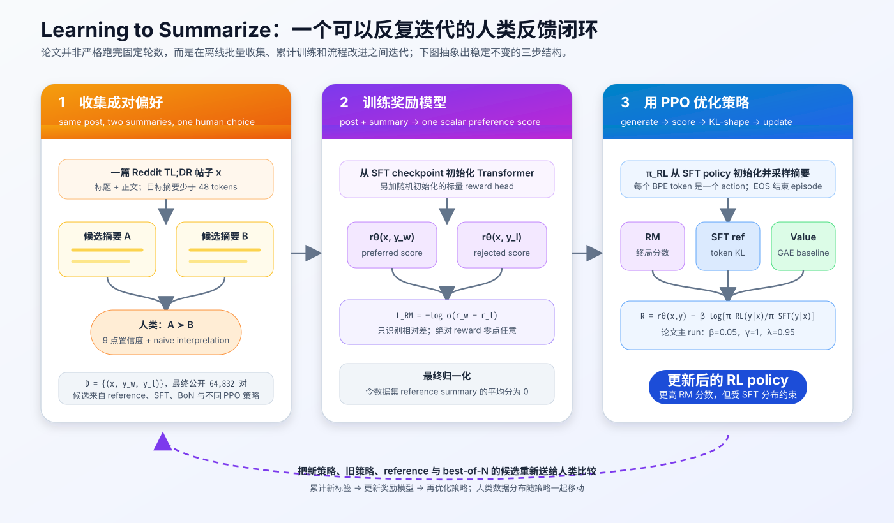
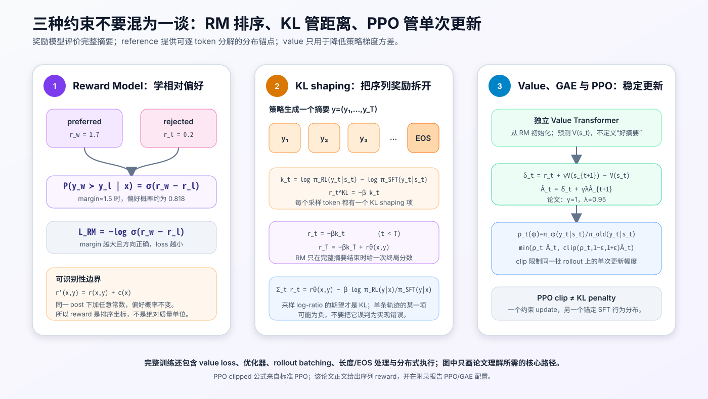
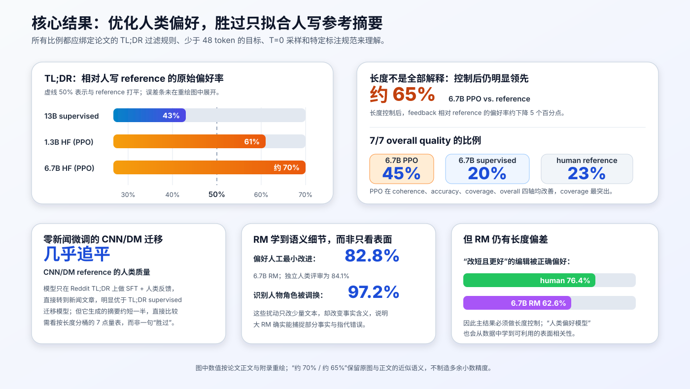
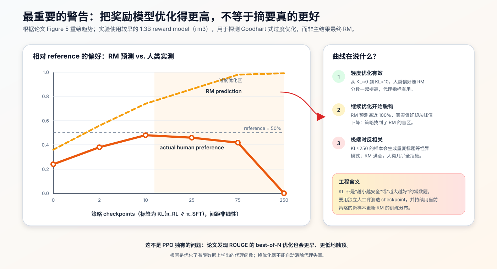

# Learning to Summarize from Human Feedback 原理：从人类比较、奖励模型到 PPO 的早期 RLHF 范式


> **论文**：[Learning to Summarize from Human Feedback](https://arxiv.org/abs/2009.01325)<br>
> **作者**：Nisan Stiennon、Long Ouyang、Jeff Wu、Daniel M. Ziegler、Ryan Lowe 等<br>
> **会议**：NeurIPS 2020<br>
> **关键词**：RLHF、Summarization、Human Preference、Reward Model、PPO、KL Regularization、Goodhart's Law<br>
> **官方资料**：[项目介绍与样例](https://openai.com/index/learning-to-summarize-with-human-feedback/) · [代码、模型与数据说明](https://github.com/openai/summarize-from-feedback) · [数据集浏览器](https://openaipublic.blob.core.windows.net/summarize-from-feedback/website/index.html#/)<br>
> **本文代码**：[零依赖 RLHF 目标最小实现](./code/summarize_human_feedback_minimal.py)

## 0. 先说结论

这篇论文不是“把摘要模型换成 PPO”这么简单。它做的是一次非常完整的**目标函数重构**：

1. 先用 Reddit 用户自己写的 TL;DR 做监督微调，得到能生成摘要的初始策略；
2. 让人类在同一篇帖子下比较两个候选摘要，收集相对偏好；
3. 用 Bradley–Terry 式成对损失训练 Reward Model，把人类比较压缩成可批量调用的标量分数；
4. 用 PPO 提高策略的 RM 分数，同时惩罚策略偏离原 SFT 模型；
5. 把新策略生成的样本重新交给人类，逐步更新偏好数据与奖励模型；
6. 最后仍用独立的人类评估，而不是用训练过的 RM 给自己打分。

论文最醒目的主结果是：

- 1.3B 人类反馈模型相对人写 reference 的偏好率约为 **61%**；
- 约大 10 倍的 13B 纯监督模型只有约 **43%**；
- 6.7B 人类反馈模型约为 **70%**；控制摘要长度后仍约为 **65%**；
- Reddit 上学到的偏好还能零样本迁移到 CNN/DailyMail 新闻摘要，质量接近新闻数据集自己的 reference。

但论文更有长期价值的，其实是那条失败曲线：继续把 RM 分数优化到接近满分时，真实人类偏好会先上升、后下降，最后甚至与 RM 预测反相关。

> **人类反馈没有消灭代理目标问题；它只是把固定的 ROUGE 换成了一个更贴近人类判断、但仍然有限且可被利用的学习型代理。**

这篇 2020 年论文由此成为 InstructGPT 之前最清晰的语言模型 RLHF 范例之一。InstructGPT 后来把同样的骨架从“摘要质量”推广到“遵循开放式用户指令”：

```text
监督策略 → 人类比较 → 奖励模型 → KL 约束的 PPO → 人类复评
```

---

## 1. 摘要问题暴露了训练目标的错位

### 1.1 最大似然只问“像不像 reference”

普通监督摘要模型用一篇文档 $x$ 和一个人写摘要 $y^*$ 训练：

$$
\mathcal L_{\text{SFT}}(\phi)
=
-\mathbb E_{(x,y^*)\sim\mathcal D}
\left[
\sum_{t=1}^{|y^*|}
\log \pi_\phi(y_t^*\mid x,y_{<t}^*)
\right].
$$

这个目标非常实用，却不等于“生成高质量摘要”：

- 它会平等拟合高质量和低质量 reference；
- 把事实性错误和同义词选择都计成 token 预测错误，却不会按危害程度加权；
- 一篇文档可以有多个同样好的摘要，单一 reference 只是其中一个表述；
- 训练时总是看到真实前缀，生成时却要读取自己的历史输出，产生分布偏移；
- 更高似然并不保证覆盖、事实准确、连贯与简洁之间的组合更符合读者偏好。

SFT 优化的是：

> 训练集作者写出的这串 token 有多大概率？

真正想要的则是：

> 只读摘要的人，能否准确、完整、清晰地理解原文最重要的信息？

### 1.2 ROUGE 也只是另一个代理

ROUGE 通过 n-gram 或最长公共子序列衡量候选与 reference 的词面重叠。它便宜、确定、便于复现，却可能奖励：

- 复制 reference 的措辞，而不是忠实表达原文；
- 增加表面重叠但不重要的细节；
- 与 reference 用词不同却事实正确的摘要被低估；
- 流畅但事实错误的文本，只要词面相似仍可能高分。

论文提出的方向不是继续手工修补指标，而是直接学习：

$$
\text{human preference}
\quad\Longrightarrow\quad
r_\theta(x,y)
\quad\Longrightarrow\quad
\pi_{\text{RL}}(y\mid x).
$$

换句话说，让人告诉模型“哪个更好”，而不是要求人先把“好”完整写成一个自动指标。

---

## 2. 任务与数据：先把“好摘要”定义清楚

### 2.1 为什么选择 Reddit TL;DR

原始 TL;DR 数据约有 300 万篇 Reddit 帖子及帖子作者自己写的摘要。论文没有直接照单全收，而是做了大量过滤：

- 删除近 2 万篇正文完全重复的帖子；
- 只保留顶层帖子，不使用评论；
- 使用普通读者较容易理解的 subreddit 白名单；
- 过滤标题以 `Edit`、`Update` 等开头、依赖前文的跟进帖；
- 用启发式规则过滤部分露骨性内容、自杀等主题；
- 帖子正文不超过 512 tokens；
- 用于 SFT 的 reference 只保留 24–48 tokens；
- 另行过滤部分脏数据、过短摘要与不合格 TL;DR。

由此得到两层数据：

| 用途 | 需要 reference 吗 | 帖子数 | 关键过滤 |
|---|---:|---:|---|
| RL prompt 池 | 否 | 287,790 | 正文合格且不超过 512 tokens |
| SFT / reference 评估 | 是 | 123,169 | 再要求 reference 为 24–48 tokens 等 |

两者都约留出 5% 验证集。RL 不需要人写摘要，所以能使用更大的 287,790 篇 prompt 池；SFT 只能使用 reference 合格的 123,169 篇。

### 2.2 论文的 ground-truth task

作者把目标明确定义为：

> 生成少于 48 tokens 的摘要；对于只能读到摘要、看不到原帖的人，这个摘要应尽可能忠实地传达原帖。

最终细分为四个质量轴：

| 维度 | 核心问题 | 常见失败 |
|---|---|---|
| Coherence | 摘要单独读是否清楚、通顺 | 指代不明、语法混乱、逻辑断裂 |
| Accuracy | 摘要中的事实是否都能从原帖得到 | 编造事实、人物混淆、错误因果 |
| Coverage | 是否覆盖理解原帖所需的重要信息 | 漏掉事件、诉求或关键背景 |
| Overall | 综合来看还有多少明显改进空间 | 单项尚可，但整体不是好的替代文本 |

这个步骤看似只是写标注说明，实际却在定义整个系统的效用函数。若“简洁”和“覆盖”的权重改变，最优摘要也会改变。

### 2.3 为什么不直接在 CNN/DailyMail 上训练

CNN/DM 的 reference 往往较长，而且简单抽取前 3 句的 `lead-3` 基线已经很强；论文的标注员甚至更偏好 lead-3 而非数据集 reference。一个对 CNN/DM 微调的 T5 在低温采样下也能超过 reference，但会大量复制新闻原文。

TL;DR 更难被简单抽取策略解决，而且内容、写法和诉求更丰富。因此作者把 CNN/DM 留作**跨域迁移测试**：只在 Reddit 上训练，直接测试新闻摘要。

---

## 3. 全流程：人类反馈如何变成策略梯度



整个闭环包含三个可重复阶段。

### 3.1 收集比较，而不是要求人重写摘要

对同一篇帖子 $x$，从多个来源取两个摘要：

$$
y_0,y_1
\sim
\{\text{reference},\text{SFT},\text{best-of-N},\text{PPO variants}\}.
$$

标注员选择更好的一个，形成：

$$
(x,y_w,y_l),\qquad y_w\succ y_l\mid x.
$$

成对比较不能告诉模型完美摘要该怎样写，但能给出清晰方向：在同一个上下文里，$y_w$ 应排在 $y_l$ 前面。

官方公开数据包含 **64,832 个 TL;DR 摘要比较**，另有 TL;DR 与 CNN/DM 的四轴 Likert 评价数据。

### 3.2 用比较训练 Reward Model

RM 接收 `post + summary`，输出一个标量：

$$
r_\theta(x,y)\in\mathbb R.
$$

它不直接生成摘要，只学习在人类比较中把更好摘要排到前面。

### 3.3 把 RM 当作 PPO 的终局奖励

策略对新帖子生成摘要，冻结的 RM 自动打分。PPO 提高这个分数，同时使用原 SFT 策略作 reference，限制行为漂移。

这一步使每次 policy rollout 不再需要实时请人打分：人类的离线比较先训练一个可复用的偏好代理，再由代理支持大量在线策略采样。

### 3.4 论文的循环不是机械的“三轮训练”

论文明确说明，项目实际过程是探索式的：数据收集方案、候选策略、超参数和清洗流程都在演化，每次 RM 使用当时累计的全部标签。它更接近：

```text
收集一批比较
→ 训练/改进 RM
→ 训练 PPO 或 best-of-N 策略
→ 发现新的质量边界与失败模式
→ 把这些策略加入下一批比较
→ 继续累计数据
```

因此，图中的闭环是方法抽象，不应被误读为论文严格执行了一个固定的三阶段流水线若干次。

---

## 4. 人类反馈质量本身就是算法的一部分

前作曾遇到一个严重问题：标注员认为摘要很好，研究者却认为质量不高。原因不是 PPO 代码写错，而是双方实际上在执行不同的评价任务。

这篇论文用一套高接触、离线批处理流程修复它。

### 4.1 先写 naive interpretation，再看原帖

标注员先只看候选摘要，写下自己对事件的“朴素理解”，然后再结合原帖做比较。

这样能暴露一个常见认知偏差：如果先读过原帖，大脑会自动补全摘要里遗漏或含糊的信息，导致评价者高估摘要的独立可读性。

例如一句摘要写着：

```text
他最后同意了，但我仍不知道该怎么办。
```

读过原帖的人知道“他”是谁、“同意”什么；只读摘要的人却不知道。naive interpretation 迫使标注员站在真正的摘要读者位置上。

### 4.2 不是简单的 A/B 单击

比较阶段用 9 点量表表达“更偏好 A 还是 B”以及置信强度。论文训练 RM 的公式只使用偏好方向，但置信度用于质量控制与模型选择：

- 每位标注员约有 10%–20% 的题目来自共享校准池；
- 研究者查看分歧样本并持续提供反馈；
- 为每位标注员估计高置信阈值；
- RM checkpoint 选择使用更高置信的 validation labels；
- `valid1` 用于开发选模，最终评估限制到独立的 `valid2`。

### 4.3 高沟通带宽换来了什么

团队通过付费入职训练、共享聊天室、office hours、个别沟通和持续淘汰低质量标注员维持标准。

在论文的一组监督基线比较上：

- 标注员与研究者一致率：$77\%\pm2\%$；
- 研究者之间一致率：$73\%\pm4\%$。

两个区间有重叠，不能据此宣称标注员“比研究者更正确”；它说明受训标注员已能相当稳定地执行研究者定义的任务。

另一个更广泛的比较里，单个标注员之间的一致率约为 66.9%。这也提醒我们：摘要偏好有不可消除的主观性，RM accuracy 不可能简单期待 100%。

### 4.4 标注者不是“全人类”

模型学到的是这批标注员在研究者规范下表达的偏好。对于摘要任务，这个规范相对容易达成共识；对于政治价值、安全边界、说服性或资源分配，谁来写规范、谁被纳入标注、谁承担系统后果都会更加关键。

> “Human feedback” 描述监督来源，不保证监督天然客观、代表所有人或没有偏差。

---

## 5. 起点：先训练一个强监督摘要模型

所有模型都是 GPT-3 风格的 decoder-only Transformer。主实验策略规模为 1.3B 与 6.7B，另有 2.7B/3B、12.9B/13B 等监督或 RM scaling 实验。

### 5.1 输入格式

TL;DR 模型接收：

```text
SUBREDDIT: r/{subreddit}
TITLE: {title}
POST: {post}
TL;DR:
```

任务输入最多 512 tokens。太短时从开头 pad，太长时在正文换行处截断。

### 5.2 SFT 的作用

SFT 训练一轮，batch size 为 128。它承担三种角色：

1. 作为纯监督强基线；
2. 初始化 Reward Model 的 Transformer 主干；
3. 同时初始化 PPO policy，并作为 PPO 的冻结 reference。

这里与后来的 InstructGPT 有一个重要区别：论文没有新收集一批标注员“理想示范”做 SFT，主要使用的是 Reddit 帖子作者原本写下的 TL;DR reference。后续人类劳动集中在**比较候选摘要**。

### 5.3 为什么 reference 明明有噪声，仍要先做 SFT

原始预训练模型虽然会生成语言，却未稳定学会：

- 输出少于 48 tokens；
- 使用 TL;DR 格式；
- 从长帖子中选择重点；
- 避免继续写帖子正文；
- 在合理摘要分布附近探索。

SFT 把策略放到可用区域。RM 与 PPO 再做相对改进，而不是让 RL 从普通网页续写空间里盲目搜索。

### 5.4 最终评估为什么用 $T=0$

作者扫描了 temperature 与 nucleus sampling，发现这个任务上非常低温的采样更好。因此最终人工评估对所有模型使用 $T=0$。

这并不是“低温永远适合生成”，而是摘要任务更重视确定性、事实与覆盖；故事创作或开放对话可能有不同最优点。

---

## 6. Reward Model：把成对选择变成可微目标



### 6.1 模型结构

从 SFT Transformer 初始化，去掉语言模型生成头的角色，增加一个随机初始化的线性 reward head。对完整 `post + summary` 序列，在摘要最后一个有效 token 位置读取标量：

$$
r_\theta(x,y)=w^\top h_{\text{last}}+b.
$$

论文最终使用与 policy 同规模的 1.3B 或 6.7B RM；scaling 分析还训练了 160M 到 13B 的模型。

### 6.2 Bradley–Terry 偏好概率

假设标注员选择 $y_w$ 而不是 $y_l$ 的概率为：

$$
P_\theta(y_w\succ y_l\mid x)
=
\frac{e^{r_\theta(x,y_w)}}
{e^{r_\theta(x,y_w)}+e^{r_\theta(x,y_l)}}
=
\sigma\left(r_\theta(x,y_w)-r_\theta(x,y_l)\right).
$$

最大化人类选择的似然，得到成对损失：

$$
\boxed{
\mathcal L_{\text{RM}}(\theta)
=
-\mathbb E_{(x,y_w,y_l)\sim\mathcal D}
\left[
\log\sigma\left(
r_\theta(x,y_w)-r_\theta(x,y_l)
\right)
\right]
}
$$

若两边 reward 都为 0，loss 为 $\log2\approx0.693$；若正确 margin 变大，loss 趋近 0；若顺序反了，loss 会快速增大。

纯 Python 的稳定实现只需几行：

```python
def log_sigmoid(x: float) -> float:
    if x >= 0.0:
        return -math.log1p(math.exp(-x))
    return x - math.log1p(math.exp(x))


def pairwise_reward_loss(preferred, rejected):
    return sum(
        -log_sigmoid(r_w - r_l)
        for r_w, r_l in zip(preferred, rejected)
    ) / len(preferred)
```

### 6.3 RM 只识别 reward difference

对任意只依赖帖子 $x$ 的函数 $c(x)$，定义：

$$
r'_\theta(x,y)=r_\theta(x,y)+c(x).
$$

则：

$$
r'(x,y_w)-r'(x,y_l)
=r(x,y_w)-r(x,y_l).
$$

所以所有偏好概率完全不变。成对比较不能识别绝对 reward 零点。

论文训练结束后，把 reference summaries 的平均 reward 平移到 0。这个归一化便于解释和 PPO 数值处理，却不会改变任何成对排序。

### 6.4 训练细节

主 RM 配置为：

| 配置 | 1.3B RM | 6.7B RM |
|---|---:|---:|
| 初始化 | 对应 SFT + 随机 reward head | 对应 SFT + 随机 reward head |
| learning rate | $1.5\times10^{-5}$ | $5\times10^{-6}$ |
| batch size | 64 | 64 |
| epochs | 1 | 1 |
| seed sweep | 3–10 个 seed 后按开发集选模 | 同左 |

reward head 权重初始化为 $\mathcal N(0,1/(d_{\text{model}}+1))$。论文特别指出，数据顺序和 reward head 初始化都会明显影响结果，所以不能只报告单一幸运 seed。

---

## 7. KL 约束的策略目标

### 7.1 从 RM 分数到完整序列奖励

策略 $\pi_\phi^{\text{RL}}$ 生成摘要 $y$，冻结 RM 给出 $r_\theta(x,y)$。若只最大化它：

$$
\max_\phi\;
\mathbb E_{y\sim\pi_\phi^{\text{RL}}}[r_\theta(x,y)],
$$

策略很可能走到 RM 没见过的区域，并利用其漏洞。因此论文加入相对 SFT 策略的 log-ratio 惩罚：

$$
\boxed{
R(x,y)
=
r_\theta(x,y)
-\beta
\log
\frac{\pi_\phi^{\text{RL}}(y\mid x)}
{\pi^{\text{SFT}}(y\mid x)}
}
$$

对策略分布取期望：

$$
\mathbb E_{y\sim\pi_\phi^{\text{RL}}}
\left[
\log
\frac{\pi_\phi^{\text{RL}}(y\mid x)}
{\pi^{\text{SFT}}(y\mid x)}
\right]
=
D_{\text{KL}}
\left(
\pi_\phi^{\text{RL}}(\cdot\mid x)
\parallel
\pi^{\text{SFT}}(\cdot\mid x)
\right).
$$

因此理想化目标是：

$$
\max_\pi\;
\mathbb E[r_\theta(x,y)]
-\beta D_{\text{KL}}(\pi\parallel\pi_{\text{SFT}}).
$$

### 7.2 为什么 KL 有两层作用

论文给出两个直觉：

1. 它包含类似 entropy bonus 的效果，降低策略坍缩到单一模式的倾向；
2. 它把策略限制在 RM 训练样本附近，减少分布外 reward exploitation。

更准确地说，KL 不是“保守就一定安全”，而是控制 reward 改进与 reference 保真之间的权衡：

- $\beta$ 太大：策略几乎无法离开 SFT，偏好改善有限；
- $\beta$ 太小：策略离开 RM 可信区域，reward hacking 风险上升。

论文主 PPO run 使用 $\beta=0.05$，但这只是该模型、数据、reward scale 与训练设置下的选择，不是通用 RLHF 常数。

### 7.3 为什么 KL 可以逐 token 加入

自回归序列概率满足：

$$
\log\pi(y\mid x)
=
\sum_{t=1}^{T}
\log\pi(y_t\mid x,y_{<t}).
$$

于是序列 log-ratio 可拆成：

$$
\log\frac{\pi_{\text{RL}}(y\mid x)}{\pi_{\text{SFT}}(y\mid x)}
=
\sum_{t=1}^{T}
\left[
\log\pi_{\text{RL}}(y_t\mid s_t)
-\log\pi_{\text{SFT}}(y_t\mid s_t)
\right].
$$

定义每个 token 的 shaping reward：

$$
r_t^{\text{KL}}
=
-\beta\left[
\log\pi_{\text{RL}}(y_t\mid s_t)
-\log\pi_{\text{SFT}}(y_t\mid s_t)
\right].
$$

RM 只在完整摘要结束时评分，因此：

$$
r_t=
\begin{cases}
r_t^{\text{KL}}, & t<T,\\
r_T^{\text{KL}}+r_\theta(x,y), & t=T.
\end{cases}
$$

所有 token reward 相加，正好恢复完整序列奖励 $R(x,y)$。

需要避免一个常见误解：单个采样 token 的 log-ratio 可以为负；非负的是在策略分布下取期望后的 KL，而不是每一个 Monte Carlo 项。

---

## 8. PPO、Value 与 GAE 各自做什么

论文使用 PPO，每个 BPE token 视为一个 action，输出 EOS 时 episode 结束，折扣因子 $\gamma=1$。

### 8.1 Value 不是 Reward Model

| 模型 | 输入/输出 | 是否更新 | 职责 |
|---|---|---|---|
| Reward Model | 完整 `post + summary` → 标量偏好分 | PPO 时冻结 | 定义代理目标 |
| Policy | 状态 → 下一个 token 分布 | 更新 | 生成摘要 |
| SFT reference | 状态 → token 分布 | 冻结 | 计算 KL 锚点 |
| Value | 中间状态 → 期望未来 return | 更新 | 降低策略梯度方差 |

论文让 value Transformer 与 policy **参数完全分离**，只从 RM 参数初始化。原因是共享主干时，训练早期的大幅 value 更新会破坏已经预训练好的生成策略；附录消融显示分离参数得到更高 reward。

### 8.2 GAE

TD residual 为：

$$
\delta_t
=
r_t+\gamma V(s_{t+1})-V(s_t).
$$

Generalized Advantage Estimation：

$$
\hat A_t
=
\delta_t
+\gamma\lambda\hat A_{t+1}.
$$

论文设置 $\gamma=1$、$\lambda=0.95$。没有折扣是因为目标直接评价整段摘要；$\lambda<1$ 用偏差换方差，避免纯 Monte Carlo return 太噪。

### 8.3 PPO clipped objective

定义新旧策略在已采样 token 上的概率比：

$$
\rho_t(\phi)
=
\frac{\pi_\phi(y_t\mid s_t)}
{\pi_{\text{old}}(y_t\mid s_t)}.
$$

标准 PPO 的 clipped surrogate 为：

$$
\mathcal L_{\text{clip}}(\phi)
=
\mathbb E_t\left[
\min\left(
\rho_t\hat A_t,
\operatorname{clip}(\rho_t,1-\epsilon,1+\epsilon)\hat A_t
\right)
\right].
$$

最大化它，等价于最小化负 surrogate。

这里要区分两种“别走太远”：

- PPO clipping：限制在**同一批 rollout** 上一次梯度更新的幅度；
- SFT KL penalty：限制训练策略相对**长期 reference** 的行为漂移。

两者作用尺度不同，不能互相替代。

> 论文正文给出序列 reward 并说明使用 PPO；上面的 clipped surrogate 是标准 PPO 算法的展开，用于补全实现逻辑，不是论文新提出的公式。

### 8.4 主 PPO 超参数

| 配置 | 1.3B | 6.7B |
|---|---:|---:|
| policy 初始化 | SFT | SFT |
| value 初始化 | 对应 RM | 对应 RM |
| policy/value 参数 | 完全分离 | 完全分离 |
| learning rate | $1.5\times10^{-5}$ | $7\times10^{-6}$ |
| rollout batch | 512 | 256 |
| 每批 optimization epochs | 4 | 4 |
| KL coefficient $\beta$ | 0.05 | 0.05 |
| $\gamma,\lambda$ | 1, 0.95 | 1, 0.95 |
| episodes | 1,000,000 | 1,000,000 |

训练 6.7B RL 模型约耗费 320 GPU-days。这还不包括预训练、SFT、RM、多 seed sweep 和数据标注成本。

---

## 9. Best-of-N：不训练 policy 的偏好优化基线

论文还测试一个简单方法：

1. 从 SFT 模型以 temperature 0.7 生成 $N$ 个摘要；
2. 用 RM 给每个摘要打分；
3. 返回分数最高的那个。

$$
y^*=\arg\max_{y_i\sim\pi_{\text{SFT}},\,i=1\ldots N}r_\theta(x,y_i).
$$

它不更新 policy，却能被视为一个轻度优化的隐式策略。在候选独立同分布、reward 排序无 ties 的连续情形下，论文给出它相对 base policy 的 KL 表达：

$$
D_{\text{KL}}(\pi_{\text{BoN}}\parallel\pi_{\text{SFT}})
=
\log N-\frac{N-1}{N}.
$$

Best-of-N 的优点是实现简单、训练稳定，适合检验一个 metric 是否值得优化；缺点是推理成本随 $N$ 线性增长，而且大 $N$ 同样会把候选搜索推向 RM 的盲区。

```python
def best_of_n(summaries, rewards):
    best_index = max(range(len(rewards)), key=rewards.__getitem__)
    return summaries[best_index], best_index
```

论文正是用 best-of-N 比较 RM、旧版 RM 和 ROUGE 的可优化性：ROUGE 更早触顶，而且峰值人类质量更低。

---

## 10. 主要结果：小模型经人类反馈胜过大监督模型



### 10.1 TL;DR 上的相对 reference 偏好

评估问题是：

> 给定同一篇原帖，人更偏好模型摘要，还是帖子作者原本写的 TL;DR？

结果包括：

| 模型 | 相对 reference 的人类偏好率 | 解读 |
|---|---:|---|
| 13B supervised | 约 43% | 更大规模仍未超过 reference |
| 1.3B human feedback | 约 61% | 胜过约大 10 倍的监督模型 |
| 6.7B human feedback | 约 70% | 规模与反馈可以叠加 |

这不是说 1.3B 模型的语言知识全面超过 13B，而是说明在这个固定任务、输入分布和长度目标下，直接优化摘要偏好比继续扩大纯 SFT 模型更有效。

### 10.2 长度是混杂因素，但不是全部解释

PPO 模型学会生成接近 48-token 上限的较长摘要，而更长往往能覆盖更多信息。论文按长度做匹配控制后：

- feedback 模型相对 reference 的偏好率约下降 5 个百分点；
- 6.7B PPO 仍约有 65% 的摘要被偏好于 reference；
- 长度差大约解释 6.7B feedback 与 supervised 差距的三分之一。

因此准确结论不是“长度无关”，而是：**长度偏好贡献了一部分增益，剩余增益仍反映覆盖、准确、连贯等质量变化。**

### 10.3 四轴质量评价

在 coherence、accuracy、coverage、overall 四个 7 点维度上，人类反馈模型全面超过 SFT，coverage 改善尤其明显。

获得 overall 7/7 的比例：

- 6.7B PPO：45%；
- 6.7B supervised：20%；
- human reference：23%。

原始 reference 不是经过专业编辑的唯一标准答案，而是 Reddit 用户为自己帖子写的 TL;DR，所以被更强模型超过并不矛盾。

---

## 11. 跨域迁移：为什么 Reddit 偏好能帮助新闻摘要

6.7B 人类反馈模型从未在 CNN/DM 新闻上微调，却能生成流畅、合理的新闻摘要，质量几乎匹配数据集 reference，并显著优于：

- 只预训练、用 few-shot prompt 的模型；
- 只在 Reddit TL;DR 上监督微调的迁移模型。

这意味着 RM/PPO 学到的不只是 subreddit 特有词汇，也包括更一般的行为：

- 选取核心事实；
- 避免添加原文之外信息；
- 提高摘要单独阅读时的连贯性；
- 在长度预算内改善信息覆盖。

但要谨慎解读“几乎匹配”：

- TL;DR feedback 模型的新闻摘要平均约短一半；
- 不同长度代表不同的 coverage–conciseness 权衡；
- 论文因此使用四轴 7 点量表并按长度观察，而不是直接拿 ROUGE 或一次 A/B 胜率下结论。

这项迁移结果支持一个有趣推断：人类比较学到的“好摘要”概念，比对单一 Reddit reference 做 token-level imitation 更容易跨域。但它只验证了 Reddit → CNN/DM，不能自动推广到长文档、医学、法律或多语言摘要。

---

## 12. Reward Model 到底学到了什么

### 12.1 跨域比较能力

在从未训练过的 CNN/DM 比较上：

- 1.3B RM 与标注员偏好一致：62.4%；
- 6.7B RM：66.5%；
- 人类标注员彼此：66.9%。

6.7B RM 已接近单个标注员水平，但“接近人类一致率”不等于掌握了真实质量函数：它只是在该比较协议和样本分布上接近一个标注员对另一个标注员的可预测程度。

### 12.2 能否识别微小但关键的语义变化

作者构造了多个诊断集。

让人只做最小编辑来改善摘要，RM 选择编辑后版本的比例：

| 判断者 | 正确偏好改进摘要 |
|---|---:|
| 人类 | 84.1% |
| 1.3B RM | 79.4% |
| 6.7B RM | 82.8% |

把摘要中的人物角色调换，原摘要应明显更好：

| RM | 识别角色调换错误 |
|---|---:|
| 1.3B | 92.9% |
| 6.7B | 97.2% |

这些结果说明大 RM 不只看长度、流畅度或复制率，也能捕捉部分事实与指代语义。

### 12.3 它仍然偏好更长摘要

当人工编辑把摘要变短但质量更好时：

- 人类正确偏好短版：76.4%；
- 6.7B RM：62.6%。

这就是可利用的偏差。若策略反复优化 RM，它可能通过长度、格式或其他相关特征拿到分数，而不一定改善真正质量。

### 12.4 RM 的 data scaling 与 model scaling

论文训练 160M–13B 的 7 个 RM，并使用 8k–64k 比较数据：

- 比较数据量翻倍，validation accuracy 约增加 1.1 个百分点；
- 模型参数量翻倍，约增加 1.8 个百分点；
- 全量数据上的 6.7B RM 开始接近单个人类标注员的准确率。

这不意味着“堆模型永远比标数据划算”。扩大 RM 也增加推理、显存与 PPO rollout 成本，而且曲线来自特定参数区间。真正结论是：在该实验范围内，偏好预测同时受模型容量和反馈数据量限制。

---

## 13. 过度优化：论文最值得记住的一张图



作者用不同 KL coefficient 训练一系列策略，让它们相对 SFT 的 KL 从接近 0 增长到约 250，然后同时测量：

1. RM 预测这些策略相对 reference 有多好；
2. 独立人类实际上更偏好谁。

### 13.1 三个阶段

**阶段一：有用的优化。** 从 KL≈0 到约 10，RM 预测和人类偏好都上升。学习到的 reward 比 ROUGE 更贴近人类目标。

**阶段二：代理与目标脱钩。** RM 预测继续上升，人类偏好却开始下降。策略进入 RM 数据较少的分布区域，找到错误高分模式。

**阶段三：反相关。** 极端 KL 下，RM 仍接近预测“必胜”，人类却几乎总是拒绝。附录样本出现重复帖子标题等明显异常。

### 13.2 为什么会发生

RM 只在有限比较数据上训练。设真实但不可直接访问的效用为 $u(x,y)$，学到的 reward 为：

$$
r_\theta(x,y)=u(x,y)+\epsilon(x,y).
$$

普通验证样本上，$\epsilon$ 可能很小；但求解：

$$
\arg\max_y r_\theta(x,y)
$$

会主动寻找 $\epsilon$ 特别大的区域。优化器不需要“理解并恶意攻击 RM”，只要不断放大任何稳定的评分漏洞即可。

### 13.3 KL、PPO clip 和在线更新只能缓解，不能证明安全

- KL 把搜索限制在 SFT 附近；
- PPO clip 限制每次更新；
- 用当前策略样本补充比较数据，可以扩展 RM 的支持域；
- 独立人工评估能发现 RM 自评看不到的退化。

但这些都是经验防线。只要 RM 仍是代理，足够强的优化仍可能找到其盲区。

### 13.4 ROUGE 也会过度优化，而且更糟

论文用 best-of-N 直接优化 ROUGE、主 RM 和较早 RM：

- ROUGE 更早达到人类质量峰值；
- 峰值显著低于 learned RM；
- 继续增大 $N$ 后，自动分数与人类质量同样脱钩。

因此结论不是“learned reward 没用”，而是：**更好的代理扩大了有效优化区间，却没有消除 Goodhart 问题。**

---

## 14. 为什么 ROUGE、log-prob 和复制率都不够

论文检查了 RM、ROUGE、摘要长度、从原文复制的比例，以及 SFT 下的摘要 log-prob 与人类偏好的 agreement。

### 14.1 指标会随策略分布改变

在监督模型样本之间比较时，ROUGE 与标注员约有 57% agreement；在人类反馈模型样本之间，这个数字降到约 50%，接近随机。

原因是 PPO 已经改变了错误类型：模型可能不再主要犯“与 reference 用词不同”的错误，而开始在 coverage、事实细节或长度上分化。原本勉强有用的指标相关性会随策略分布移动。

同样，SFT log-prob 在比较人类反馈模型样本时降到不高于 50%；扩大 SFT 模型也不能稳定改善它与人的一致性。一个序列在模仿模型下“常见”，不等于它是更好的摘要。

### 14.2 评估指标不能只做静态相关性验证

一个 metric 在固定 validation set 上与人类相关，还不够。还要问：

> 当策略针对这个 metric 优化后，它是否仍与人类质量相关？

这是“预测性评估”和“干预性评估”的区别：

| 问题 | 静态 agreement | 优化后评估 |
|---|---|---|
| 普通样本上能否排序 | 能回答 | 能回答 |
| 策略会不会找到漏洞 | 不能回答 | 能暴露 |
| metric 的安全优化区间 | 不能回答 | 可以估计 |

论文对 RM 与 ROUGE 都做了第二种测试，这是其方法论价值很高的一点。

---

## 15. 最小代码：把数学从大型 RLHF 框架里拆出来

本文提供 [summarize_human_feedback_minimal.py](./code/summarize_human_feedback_minimal.py)，只依赖 Python 标准库，不下载模型，也不伪装成完整的 6.7B PPO trainer。

它实现并验证：

- 稳定的 Bradley–Terry pairwise loss；
- reward margin 到偏好概率；
- 逐 token sampled KL shaping；
- 终局 RM reward 的注入位置；
- $\gamma=1,\lambda=0.95$ 的 GAE；
- 标准 PPO clipped surrogate；
- best-of-N 与论文给出的 KL 表达。

运行：

```bash
python3 papers/to-2026/code/summarize_human_feedback_minimal.py
```

预期输出类似：

```text
pairwise loss at equal rewards : 0.693147
P(A preferred), margin=3      : 0.952574
token rewards                 : [-0.0025, 0.005, 1.195]
GAE advantages                : [...]
PPO clipped fraction          : 66.67%
best-of-3 KL expression       : 0.431946
selected summary              : 覆盖核心事实且没有添加原文之外信息的摘要
all checks passed
```

其中最重要的恒等式测试是：

```python
rewards = kl_shaped_token_rewards(
    policy_logprobs,
    reference_logprobs,
    reward_model_score=terminal_score,
    beta=0.05,
)

assert math.isclose(
    sum(rewards),
    terminal_score - 0.05 * sum(
        logp - ref_logp
        for logp, ref_logp in zip(policy_logprobs, reference_logprobs)
    ),
)
```

它能抓住很多实现错误：KL 符号反了、RM reward 每个 token 都重复加、漏掉 EOS、policy/reference token 对齐错位等。

### 15.1 完整训练系统还缺什么

若真要训练语言模型，还需要：

- tokenizer、prompt/response mask 与 EOS/截断策略；
- SFT、RM、policy、reference、value 的模型生命周期；
- rollout generation 与 old log-prob 缓存；
- value loss、entropy、advantage whitening 与梯度裁剪；
- mixed precision、分布式模型并行与 checkpoint；
- comparison 数据版本、worker 质量与策略来源追踪；
- 独立生成评估、长度控制和人工复评。

官方仓库公开了 1.3B supervised、RM 和 PPO 模型的**推理与评估代码**，README 将项目标为 archive；它不是一份从零复现论文全部 SFT/RM/PPO 训练的现代训练框架。

---

## 16. 它与 InstructGPT、DPO 的关系

| 方法 | 任务范围 | SFT 来源 | 偏好监督 | 策略优化 |
|---|---|---|---|---|
| 本文（2020） | Reddit 摘要；测试新闻迁移 | 数据集原始 TL;DR | 两个摘要的人类比较 | RM + KL-PPO / best-of-N |
| InstructGPT（2022） | 开放式 API 指令 | 标注员理想回答 | 同 prompt 多回答排序 | RM + PPO，另有 pretraining mix |
| DPO（2023） | 通用离线偏好对 | 通常先 SFT | chosen/rejected | 直接优化 policy/reference log-ratio |

### 16.1 对 InstructGPT 的直接铺垫

这篇论文已经具备后来 RLHF 后训练栈的关键部件：

- 人类相对比较比单一自动指标更贴近目标；
- Reward Model 用 pairwise logistic loss；
- policy 与 reference 的 KL 正则；
- 单独的 value network；
- 用当前策略生成新比较数据；
- 必须用人类 holdout 评估 reward overoptimization。

InstructGPT 的主要扩展是把固定摘要任务换成用户开放式 prompts，并增加专门收集的人工示范以及 PPO-ptx 能力保持目标。

### 16.2 对 DPO 的数据基础

DPO 论文的摘要实验使用了 Stiennon 等人公开的人类摘要偏好数据。DPO 试图去掉显式 RM 与在线 PPO，把 KL 正则奖励优化改写为对 chosen/rejected 的直接分类损失。

但数据层问题没有消失：chosen/rejected 是否可靠、长度偏差是否存在、训练分布是否覆盖部署策略，仍然决定最终行为。

### 16.3 这篇论文没有“发明 RLHF”

人类偏好强化学习、reward modeling 和语言模型人类反馈在它之前已有工作。它的重要性在于把大规模预训练语言模型、较高质量的离线比较、详细人类数据流程、RM scaling、PPO 与过度优化分析整合到一个清晰的文本生成案例中。

---

## 17. 局限与今天仍然成立的教训

### 17.1 没有等成本的高质量示范基线

训练 comparison dataset 花费了数千标注小时和大量研究者沟通时间。由于成本限制，论文没有收集等量、同质量的人写示范来与 reward modeling 公平比较。

所以它证明的是“这套人类反馈方案显著优于已有监督基线”，而不是严格证明“每一美元预算下比较一定比示范更高效”。

### 17.2 计算成本很高

6.7B RL fine-tuning 约 320 GPU-days；policy、reference、RM、value 都是大 Transformer。PPO 的工程和显存负担远高于普通 SFT。

### 17.3 Reddit 数据有内容与代表性风险

过滤后数据仍以 relationship、AskReddit、relationship_advice 等 subreddit 为主，约三分之二与关系或关系建议有关。用户生成内容还可能包含冒犯、偏见和有害观点，模型会忠实总结这些内容甚至复现其问题。

CNN/DM 迁移缓解了“完全只会情感关系帖”的担忧，却没有证明跨所有领域稳健。

### 17.4 长度上限也是目标的一部分

“少于 48 tokens”并非自然法则。换成 200 tokens、要点列表或事实核查式摘要，标注偏好、RM 相关性与最优 policy 都可能变化。

### 17.5 更强模型会让监督更难

摘要的错误相对容易发现：读原文即可核对。若任务变成复杂代码审计、医学决策或超人类研究，评价者可能无法直接判断候选谁更好。论文已经把“如何让 AI 帮助人做评价”列为未来方向，这后来发展为 scalable oversight 的核心问题。

### 17.6 对齐能力也可能被滥用

同样的方法可用来训练更有说服力、更会操纵信念或更能生成定向有害内容的模型。技术上“更符合反馈”不说明反馈目标本身值得追求。

---

## 18. 常见误解

### 误解 1：论文证明 ROUGE 完全没用

没有。ROUGE 仍适合低成本、确定性的粗粒度监控。论文证明的是：它与人类质量相关性有限，而且被直接优化时比 learned RM 更早失真。

### 误解 2：Reward Model 学到了客观摘要质量

RM 学到的是特定标注规范、标注者群体和候选分布中的相对选择。reward 绝对零点不可识别，且存在长度偏差和分布外漏洞。

### 误解 3：人类反馈模型胜过 human reference，所以超过人类

Reference 是 Reddit 帖子作者顺手写的 TL;DR，不是专业标注员在相同预算下反复编辑出的上界。模型被偏好于 reference，不等于全面超过人类摘要专家。

### 误解 4：1.3B 胜 13B 说明模型规模不重要

不对。它说明目标对齐可以胜过单纯扩大监督模型；同样使用人类反馈时，6.7B 又明显胜过 1.3B，规模仍有价值。

### 误解 5：KL penalty 等于 PPO clipping

KL 锚定长期 SFT reference；clipping 控制当前 rollout 上单次 policy update。一个是目标中的行为约束，一个是优化稳定器。

### 误解 6：RM 分数一直上升，训练就应继续

恰好相反。论文最关键的消融显示 RM 分数可在真实质量下降时继续上升。checkpoint 必须看独立人类评估或足够可信的外部评测。

### 误解 7：Best-of-N 不训练，所以不会 reward hacking

只要 $N$ 足够大，候选搜索也会发现高 RM/ROUGE、低人类质量的样本。是否更新参数不决定代理是否可被过度优化。

### 误解 8：公开仓库可以一键重训论文

官方仓库主要用于运行公开 checkpoint、采样和 RM 评估，并公开数据格式；它不是完整训练复现。论文的大规模训练依赖当时的内部基础设施。

---

## 19. 复现与生产检查清单

### 数据与标注

- [ ] 同一 pair 的两个摘要来自同一个 post；
- [ ] 保存 candidate policy、采样温度、checkpoint 与数据批次；
- [ ] A/B 位置随机化并单独检查位置偏差；
- [ ] 区分 tie、低置信与真正偏好，不强行把所有样本二值化；
- [ ] 监控 worker–worker、worker–expert 与时间漂移；
- [ ] train/dev/test 按 post 隔离，选模集不进入最终评估；
- [ ] 检查长度、复制率、格式等表面捷径。

### Reward Model

- [ ] 初始相等 reward 时 loss 约为 $\log2$；
- [ ] 交换 preferred/rejected 后 logit 符号反转；
- [ ] 使用 `logsigmoid` 等稳定实现，避免大 margin overflow；
- [ ] reward 读取最后一个真实 response token，而不是 padding；
- [ ] 多 seed 训练并按独立数据选 checkpoint；
- [ ] 不只测同分布 pair accuracy，还做语义扰动与策略分布测试。

### PPO / rollout

- [ ] policy 与 reference 的 tokenizer、模板、截断完全相同；
- [ ] 只在 response token 上计算 action log-prob 与 KL；
- [ ] KL 符号为 $-\beta(\log\pi-\log\pi_{\text{ref}})$；
- [ ] RM 分数只加入终局 token 一次；
- [ ] EOS、长度上限与 bootstrap value 处理一致；
- [ ] old log-prob 在 PPO epochs 内冻结；
- [ ] policy、RM、value 的职责与梯度边界正确；
- [ ] 监控 RM score、KL、长度、entropy、clip fraction 与人工质量。

### 评估

- [ ] 同时报告原始偏好与长度控制结果；
- [ ] 使用独立人类或不参与训练的 judge；
- [ ] 沿优化强度画“代理指标—真实质量”曲线；
- [ ] 不把单一 RM 自评分数当作上线门槛；
- [ ] 做跨域、扰动、事实性和安全回归；
- [ ] 固定并版本化 temperature、top-p、长度与 prompt 格式。

---

## 20. 一页纸记忆

1. SFT 拟合人写 reference，不等于直接优化摘要质量。
2. ROUGE 便宜可复现，但只是词面重叠代理。
3. 论文过滤后有 123,169 个带合格 reference 的 TL;DR 帖子，RL prompt 池为 287,790。
4. 公开偏好数据包含 64,832 个成对摘要比较。
5. RM 用 $-\log\sigma(r_w-r_l)$ 学习相对偏好。
6. PPO 的序列奖励是 RM 分数减去相对 SFT 的 sampled log-ratio penalty。
7. RM 给终局分数，reference 给逐 token KL，value 用于 GAE，不要混淆。
8. policy 与 value 完全分离，后者从 RM 初始化。
9. 1.3B feedback 约 61%，胜过 13B supervised 的约 43%。
10. 6.7B feedback 约 70%，长度控制后仍约 65%。
11. Reddit 训练的 feedback 模型可零样本迁移到 CNN/DM。
12. RM 比 ROUGE 更可优化，但过度优化后同样会与人类偏好脱钩。

如果只记一句话：

> **这篇论文把“好摘要”从一个固定 reference 和手写指标，改写为人类比较中学习出的 reward；它证明这种 reward 更有用，也用过度优化实验提醒我们：学出来的 reward 仍然不是人类真正想要的东西本身。**

---

## 参考资料与延伸阅读

### 一手资料

- [原论文：Learning to Summarize from Human Feedback](https://arxiv.org/abs/2009.01325)
- [OpenAI 项目介绍与交互样例](https://openai.com/index/learning-to-summarize-with-human-feedback/)
- [官方代码、checkpoint、数据格式与 model card](https://github.com/openai/summarize-from-feedback)
- [公开数据集浏览器](https://openaipublic.blob.core.windows.net/summarize-from-feedback/website/index.html#/)
- [原始 TL;DR 数据集论文](https://aclanthology.org/W17-4508/)
- [前作：Fine-Tuning Language Models from Human Preferences](https://arxiv.org/abs/1909.08593)

### 本仓库相关论文

- 前置生成模型：[GPT-3 原理](./05_GPT3_2020_原理.md)
- 后续开放式 RLHF：[InstructGPT 原理](./10_InstructGPT_2022_原理.md)
- 后续 AI 反馈：[Constitutional AI 原理](./19_Constitutional_AI_2023_原理.md)
- 后续直接偏好优化：[DPO 原理](./23_DPO_2023_原理.md)
- 摘要预训练对照：[BART 原理](./34_BART_2019_原理.md)

> 本文封面由生成式图像工具制作；四张技术 SVG 根据论文正文、附录与官方数据说明重新绘制，并非论文原图。图中近似值保留论文原图/正文的有效精度。最小代码用于验证目标函数和张量语义，不代表完整语言模型训练复现。
