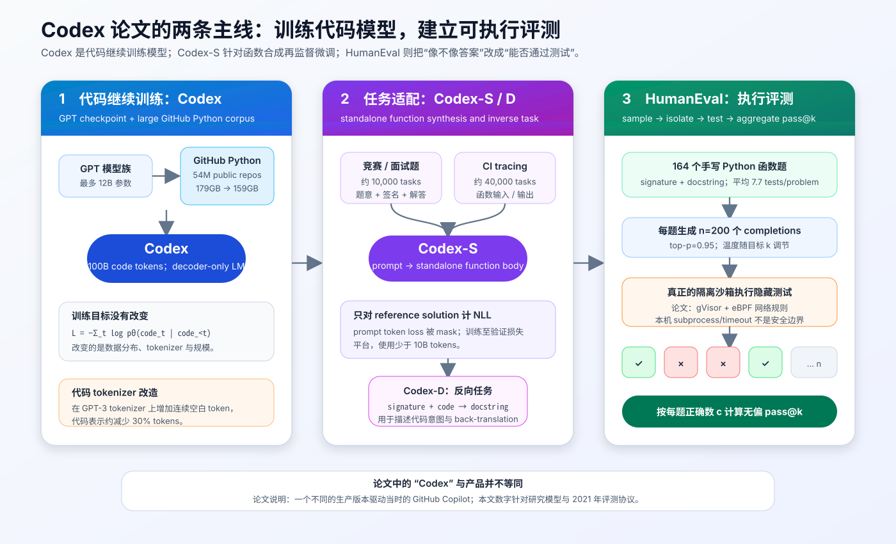
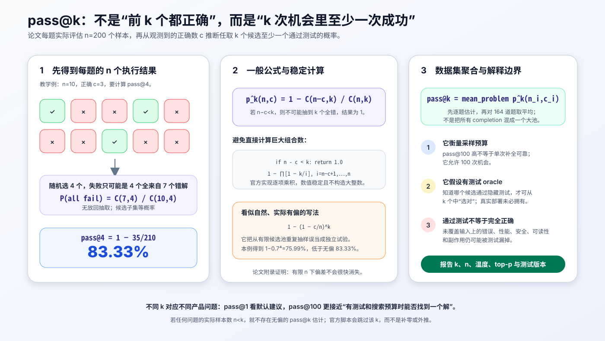
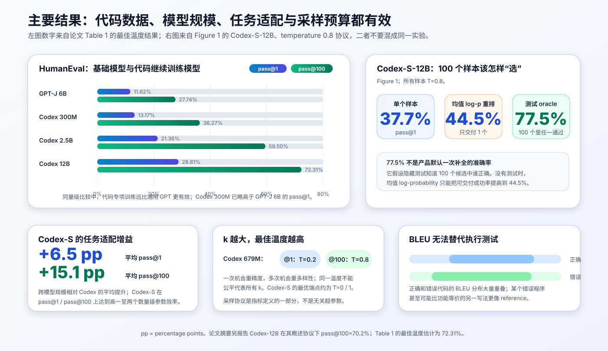
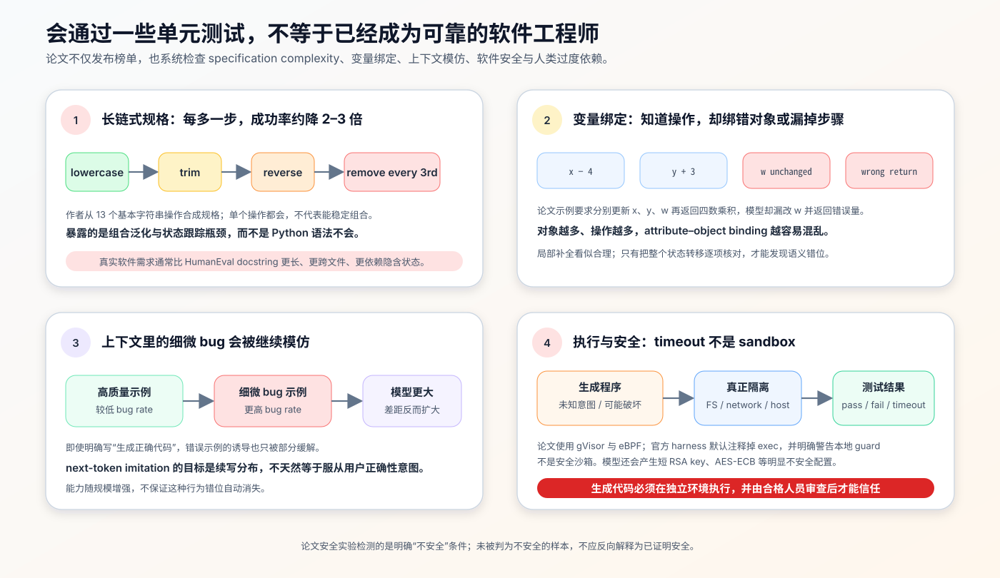

# Codex / HumanEval 原理：代码大模型、执行式评测与 pass@k 如何改变程序生成


> **论文**：[Evaluating Large Language Models Trained on Code](https://arxiv.org/abs/2107.03374)<br>
> **作者**：Mark Chen、Jerry Tworek、Heewoo Jun、Qiming Yuan 等<br>
> **发表时间**：2021 年 7 月<br>
> **关键词**：Codex、HumanEval、Code Generation、Functional Correctness、pass@k、Program Synthesis、Execution Sandbox<br>
> **官方资料**：[HumanEval 数据与评测代码](https://github.com/openai/human-eval) · [论文 PDF](https://arxiv.org/pdf/2107.03374)<br>
> **本文代码**：[零依赖 pass@k 与候选重排最小实现](./code/humaneval_pass_at_k_minimal.py)

## 0. 先说结论

这篇论文做了两件后来影响极大的事：

1. **训练 Codex**：从 GPT 模型初始化，在大规模公开 GitHub Python 代码上继续训练，让通用语言模型获得非平凡的函数合成能力；
2. **发布 HumanEval**：不再用 BLEU 或字符串匹配判断代码“像不像 reference”，而是把模型生成的函数放进隔离环境运行单元测试，用 functional correctness 和 pass@k 评价。

论文的核心结果包括：

- GPT-3 风格的 12B 通用模型在 HumanEval 上接近 0%；
- Codex-12B 的 pass@1 为 **28.81%**，Table 1 的 pass@100 为 **72.31%**；
- 只有 300M 参数的 Codex 已达到 13.17% pass@1，略高于 GPT-J-6B 的 11.62%；
- 进一步用独立函数任务微调的 Codex-S-12B，在 Figure 1 协议下单样本解决 **37.7%**；
- 给每题生成 100 个候选，再由隐藏测试 oracle 选择，可解决 **77.5%**；
- 没有隐藏测试时，用 mean token log-probability 从 100 个候选中重排，只能解决 **44.5%**。

这些数字共同说明：

> **模型能力、任务适配、采样预算和验证器是四个不同杠杆。pass@100 很高，不代表一次默认补全可靠；能采样到正确代码，也不等于知道该交付哪一段代码。**

论文同样认真展示了失败边界：

- 链式规格每增加一个操作，成功率约下降 2–3 倍；
- 模型会把操作绑定到错误变量；
- 上下文里有细微 bug 时，Codex 更容易继续写出 bug；
- 规模扩大不自动消除这种错位，某些实验中的差距反而扩大；
- 生成程序可能破坏主机、联网外传数据或给出不安全配置，必须放进真正的安全沙箱执行。

这篇论文的历史意义不只是推出一个代码模型。它把代码生成研究的重点从：

```text
输出与标准答案有多像？
```

推向：

```text
输出在实际执行中是否满足规格？
```

这条“生成多个候选 → 用可执行反馈验证 → 按计算预算报告 pass@k”的路线，后来成为代码模型、数学推理、verifier 和 test-time compute 研究的重要共同语言。

---

## 1. 先澄清：论文里的 Codex 是什么

### 1.1 它不是一种全新的网络结构

Codex 仍是 decoder-only、next-token prediction 的 GPT 模型。自回归分解没有改变：

$$
p_\theta(x_1,\ldots,x_T)
=
\prod_{t=1}^{T}
p_\theta(x_t\mid x_{<t}).
$$

训练损失仍是：

$$
\mathcal L_{\text{LM}}(\theta)
=
-\mathbb E_{x\sim\mathcal D_{\text{code}}}
\left[
\sum_{t=1}^{T}
\log p_\theta(x_t\mid x_{<t})
\right].
$$

真正改变的是：

- 数据从通用网页文本转向大规模 Python 代码；
- tokenizer 增加连续空白符号，更有效地表示缩进；
- 模型规模扩到 12B；
- 评测从文本重叠改为执行测试；
- 后续 Codex-S 再用与目标格式匹配的独立函数任务微调。

### 1.2 Codex、Codex-S、Codex-D 不要混淆

| 名称 | 输入 → 输出 | 训练来源 | 主要用途 |
|---|---|---|---|
| Codex | 代码/注释前缀 → 后续代码 | 大规模过滤 GitHub Python | 通用代码续写与函数合成 |
| Codex-S | signature + docstring → function body | 正确实现的独立函数任务 | 提高 HumanEval 类任务能力 |
| Codex-D | signature + function body → docstring | 把 Codex-S 训练对反向排列 | 描述代码意图、back-translation reranking |

Codex-S 的 `S` 是 supervised fine-tuning；它不是安全模型，也不是后来的 SFT 聊天助手含义。

### 1.3 论文研究模型不等于产品版本

论文明确写道：一个**不同的生产版本**驱动当时的 GitHub Copilot。论文中的 Codex checkpoints、HumanEval 数字和危险分析主要针对研究模型，不能直接当作某个产品版本的 model card。

同样，`Codex` 这个名称后来可能出现在不同产品与模型语境中。本文只讨论 2021 年这篇论文定义的模型族。

---

## 2. 全景：训练代码模型，也训练我们如何评价代码模型



整篇论文可以拆成两条相互依赖的主线。

### 2.1 模型主线

```text
GPT checkpoint
  → 在 159GB Python 代码上继续训练
  → Codex
  → 在独立函数任务上继续监督微调
  → Codex-S
```

另有反向任务：

```text
signature + solution → docstring
  → Codex-D
```

### 2.2 评测主线

```text
HumanEval prompt
  → 每题生成 n 个候选
  → 在安全沙箱中逐个运行隐藏测试
  → 得到每题 c 个通过、n-c 个失败
  → 用无偏估计计算 pass@k
```

两条线缺一不可：没有代码专项训练，通用 GPT 在 HumanEval 上几乎不会做；没有执行评测，BLEU 又无法可靠区分“写法不同但正确”和“长得很像但逻辑错误”。

---

## 3. Codex 的训练数据与训练配方

### 3.1 数据从哪里来

训练数据在 2020 年 5 月从 GitHub 的 5400 万个公开软件仓库收集：

- 只保留小于 1MB 的 Python 文件；
- 去重后原始体积为 179GB；
- 过滤疑似自动生成文件；
- 过滤平均行长大于 100 的文件；
- 过滤最大行长大于 1000 的文件；
- 过滤字母数字字符占比过低的文件；
- 最终得到 159GB。

这是“代码模型靠代码数据获得能力”的直接证据，但也带来三个边界：

1. **质量不一**：公开仓库包含好代码、坏代码、测试、配置、数据文件与过时写法；
2. **许可与来源复杂**：公开可访问不等于所有下游使用问题自动解决；论文中的法律讨论是 2021 年观点，不是当前法律结论；
3. **安全不可信**：公开源码可能包含恶意程序、密钥、漏洞和数据投毒模式。

### 3.2 为什么从 GPT 初始化

作者比较了从头训练和从 GPT checkpoint 继续训练。令人意外的是，在最终效果上没有观察到明显改善，可能因为代码数据本身已足够大；但 GPT 初始化收敛更快，所以后续实验都采用它。

这说明“语言预训练一定显著提高最终代码能力”不是论文结论。更准确的说法是：

> GPT 初始化节省优化时间；在这批 159GB Python 数据和训练预算下，最终性能主要由代码训练本身塑造。

### 3.3 tokenizer 为什么需要懂缩进

直接用 GPT-3 文本 tokenizer 表示代码时，大量 token 会浪费在连续空格上。Python 又把缩进作为语法的一部分。

论文在原 tokenizer 上增加不同长度的 whitespace tokens，使代码平均约少用 30% tokens 表示：

```text
普通文本 tokenizer:
"        return x" → 多个空格 token + return + x

代码 tokenizer:
"        " → 一个 8-space token
```

它不会让模型自动理解作用域，却能：

- 在固定 context window 中容纳更多代码；
- 减少序列长度与训练计算；
- 更稳定地学习常见缩进模式。

### 3.4 训练设置

Codex 模型规模覆盖：

```text
12M, 25M, 42M, 85M, 300M, 679M, 2.5B, 12B
```

主要配方：

| 项目 | 设置 |
|---|---|
| 训练 tokens | 100B |
| optimizer | Adam |
| $\beta_1,\beta_2$ | 0.9, 0.95 |
| $\epsilon$ | $10^{-8}$ |
| weight decay | 0.1 |
| warmup | 175 steps linear warmup |
| learning-rate schedule | cosine decay |

代码验证集 cross-entropy 随非 embedding 参数量 $N$ 呈平滑幂律：

$$
L_{\text{test}}(N)
\propto
\left(\frac{N}{5.92\times10^7}\right)^{-0.13}.
$$

但更低 token loss 不直接等于功能正确。论文因此进一步测量 pass@1 与 pass@100 随模型规模的变化。

---

## 4. HumanEval：164 道手写函数合成题

### 4.1 为什么必须手写

Codex 看过 GitHub 的很大一部分公开 Python 代码。若直接拿 Codeforces、面试网站或常见教程题测试，很可能在训练仓库中已有原题或解答。

HumanEval 因此包含 **164 个原创手写问题**，考查：

- 自然语言规格理解；
- 简单数学；
- 字符串、列表与字典处理；
- 条件与循环；
- 基础算法推理。

论文强调，这些题没有从现成来源程序化复制，但这并不构成“绝对新颖”的形式证明。

### 4.2 一个问题包含什么

官方 JSONL 每行包含：

```json
{
  "task_id": "HumanEval/…",
  "prompt": "函数签名 + docstring + doctest 示例",
  "entry_point": "目标函数名",
  "canonical_solution": "参考函数体",
  "test": "隐藏的 check(candidate) 断言"
}
```

模型只看到 `prompt`，生成的是函数体 completion。评测器在隔离环境中拼接：

```python
check_program = (
    problem["prompt"]
    + completion
    + problem["test"]
    + f"check({problem['entry_point']})"
)
```

然后运行所有断言。

### 4.3 平均 7.7 个测试意味着什么

每题平均 7.7 个 tests。通过全部测试是一个强于 BLEU 的可执行信号，却不是数学证明：

- 测试没覆盖的输入仍可能失败；
- 时间和空间复杂度可能不合格；
- 代码可能修改全局状态或文件；
- 安全、可读性、维护性与依赖风险不一定被测；
- 不充分规格可能让另一份同样合理的实现被误判。

所以 HumanEval 的“correct”更准确地说是：

> 在该版本隐藏测试覆盖下表现为功能正确。

### 4.4 今天使用 HumanEval 的额外污染风险

在 2021 年创建时，手写题是为了减少与训练数据重叠。数据公开后，它自身又可能进入后续模型的预训练、微调、合成数据或评测调参流程。

因此，今天看到一个新模型的 HumanEval 高分时，还应追问：

- 训练截止时间是否晚于数据公开；
- 是否做 prompt、canonical solution 和测试的近重复审计；
- 是否在该 benchmark 上反复选 checkpoint 或调 prompt；
- 是否同时报告更新、更私有或动态生成的执行评测。

这不是说所有新结果都有污染，而是公开静态 benchmark 的可解释性会随时间下降。

---

## 5. 为什么 BLEU 不适合判断代码是否正确

### 5.1 同一个函数有大量等价写法

下面两段程序功能相同，词面却不完全一样：

```python
def is_even(x):
    return x % 2 == 0
```

```python
def is_even(number):
    return not number & 1
```

反过来，只改一个运算符就可能让词面几乎相同、语义却错误：

```python
def is_even(x):
    return x % 2 != 0  # 一个 token 改变，功能完全相反
```

字符串匹配会把“风格差异”当大问题，把“关键逻辑差一位”当小问题。

### 5.2 论文的实证检查

作者把 Codex-12B 在 HumanEval 上生成的候选按单元测试分为正确与错误，再比较它们相对 reference 的 BLEU 分布。两类分布大量重叠：

- 某些正确程序因写法不同而 BLEU 低；
- 某些错误程序因抄到了大部分结构而 BLEU 高；
- 提高 BLEU 不可靠地意味着提高 functional correctness。

这并不意味着代码文本指标毫无用途。它们仍可测风格、翻译相似性或表面回归，但不应替代执行测试成为功能正确性的主指标。

---

## 6. pass@k：给模型 k 次机会，至少一次成功的概率



### 6.1 概念定义

对一道题独立生成 $k$ 个候选；若至少一个候选通过全部 tests，就认为该题在 pass@k 下被解决。

若单次生成真正成功概率为 $p$，理想化的总体指标为：

$$
\operatorname{pass@}k
=
1-(1-p)^k.
$$

但 $p$ 未知。论文每题实际生成 $n=200$ 个候选，其中 $c$ 个通过，然后估计任取 $k$ 个候选至少包含一个正确答案的概率。

### 6.2 无偏组合估计

从 $n$ 个已评估候选中无放回均匀抽 $k$ 个。总子集数是：

$$
\binom nk.
$$

若 $n-c\ge k$，选出的 $k$ 个全部错误的子集数是：

$$
\binom{n-c}{k}.
$$

所以该题估计量为：

$$
\boxed{
\widehat{\operatorname{pass@}k}(n,c)
=
1-
\frac{\binom{n-c}{k}}
{\binom nk}
}
$$

若 $n-c<k$，错误候选不足 $k$ 个，无论怎样抽都至少包含一个正确候选，所以估计为 1。

整个 HumanEval 分数是逐题估计后的宏平均：

$$
\operatorname{pass@}k
=
\frac1M
\sum_{i=1}^{M}
\widehat{\operatorname{pass@}k}(n_i,c_i),
\qquad M=164.
$$

不要把所有题的 completion 混成一个总正确率：容易题生成 200 个正确答案，也不能抵消另一道题完全不会做。

### 6.3 为什么它无偏

设单次真实成功概率为 $p$，观测正确数：

$$
c\sim\operatorname{Binomial}(n,p).
$$

组合估计量的期望满足：

$$
\mathbb E_c
\left[
1-
\frac{\binom{n-c}{k}}
{\binom nk}
\right]
=
1-(1-p)^k.
$$

“无偏”是指重复整个 $n$ 次采样实验时，估计量平均等于目标；它不保证一次观测就精确。例如 $c=0$ 时估计为 0，但真实 $p$ 仍可能很小而非严格为 0。

### 6.4 为什么不能直接用 $1-(1-c/n)^k$

把经验 pass@1：

$$
\hat p=\frac cn
$$

代回：

$$
1-(1-\hat p)^k
$$

看起来很自然，却在有限 $n$ 下有偏。论文附录指出，这相当于从同一个有限池有放回抽取，并错误地把相关事件当成独立；即使 $n>5k$，偏差也可能仍明显。

例如 $n=10,c=1,k=5$：

$$
1-\frac{\binom95}{\binom{10}5}=0.5,
$$

而 plug-in 估计为：

$$
1-(1-0.1)^5\approx0.4095.
$$

### 6.5 数值稳定实现

直接计算大组合数不方便。官方实现等价地逐项相乘：

```python
def estimate_pass_at_k(n: int, c: int, k: int) -> float:
    if n - c < k:
        return 1.0

    all_failed = 1.0
    for denominator in range(n - c + 1, n + 1):
        all_failed *= 1.0 - k / denominator
    return 1.0 - all_failed
```

它等价于：

$$
1-\prod_{i=n-c+1}^{n}\left(1-\frac{k}{i}\right).
$$

若任何题实际样本数 $n<k$，就不存在该设置下的无偏估计。官方脚本会跳过该 $k$，而不是外推或补零。

---

## 7. pass@1、pass@100 与产品体验不是同一个问题

### 7.1 pass@1：默认一次建议有多可靠

它最接近 autocomplete 或助手直接返回一个结果的场景。一次错误就失败，不允许靠大量尝试补救。

### 7.2 pass@100：模型分布里是否“藏着”正确答案

它允许 100 次采样，并假设有 oracle 知道哪个候选能通过隐藏测试。它测量的是：

- 模型是否给正确程序分配了非零概率；
- 采样多样性能否覆盖正确区域；
- 给定较大 inference compute 时的潜在上限。

它不回答：

- 用户怎样从 100 段代码里找到正确的一段；
- 100 倍生成成本是否值得；
- 隐藏测试是否在真实场景可用；
- 通过 benchmark tests 的程序是否能上线。

### 7.3 这预示了 test-time compute

当 pass@1 为 $p$ 时，多次独立采样理论上会把“至少一次成功”提高到 $1-(1-p)^k$。这条规律说明，模型权重之外还存在一个推理时预算维度：

```text
更多样本
  + 更好的测试 / verifier
  + 更好的搜索与筛选
  → 更高任务成功率
```

但前提是多样性真实存在，而且 verifier 足以识别正确解。否则只是生成更多相似错误。

---

## 8. 执行生成代码：评测正确性之前先保护系统

HumanEval 的最大优势——实际执行代码——也是最大安全风险。

### 8.1 为什么普通 subprocess 不够

模型生成代码可能：

- 删除、覆盖或读取文件；
- 启动子进程或 fork bomb；
- 无限循环、耗尽内存；
- 访问凭据、环境变量和本地服务；
- 发起网络请求并外传数据；
- 利用容器或解释器漏洞逃逸。

`timeout=3` 只能限制一部分挂起；`multiprocessing` 只隔离进程地址空间；禁用若干 Python 函数只能拦截已知调用路径。它们都不是 robust security boundary。

### 8.2 论文怎样做

论文使用：

- **gVisor container runtime**：用用户态内核模拟系统资源，在容器与宿主之间增加安全边界；
- **eBPF firewall rules**：阻断非实验控制所需的入站与出站网络连接；
- 受控 Kubernetes / cloud 环境；
- 单元测试超时与资源管理。

官方 HumanEval 仓库也醒目警告：不要在缺乏强安全沙箱时执行不受信任的模型代码。代码里的 `reliability_guard()` 明确声明自己**不是 security sandbox**。

### 8.3 最低限度的隔离原则

生产或研究评测至少应考虑：

- 每个 candidate 使用短生命周期的独立容器或 microVM；
- 默认断网，仅白名单实验控制通道；
- 只读基础文件系统，独立临时目录；
- 不挂载源码、SSH、云凭据或用户目录；
- CPU、内存、进程数、文件大小与 wall-clock 限额；
- 非特权用户、最小 capabilities、seccomp / syscall policy；
- 执行节点与训练、开发和内部网络隔离；
- 完成后销毁环境，不复用污染状态。

本文配套代码**刻意不执行任何生成程序**，只接收已经由安全执行层产生的 `passed: bool`。

---

## 9. 生成协议：停止序列、top-p 与温度

### 9.1 prompt 长什么样

HumanEval prompt 由 header、函数签名和 docstring 构成。模型从缩进后的函数体开始续写。

因为自回归模型可能继续生成下一个函数、class 或顶层脚本，论文遇到以下序列时停止：

```text
\nclass
\ndef
\n#
\nif
\nprint
```

这些是论文特定的启发式 stopping rules，不是 Python 语法意义上的完整函数边界。现代评测仍需处理：

- Markdown code fence；
- 额外解释文字；
- import 和 helper function；
- 截断在未闭合结构中；
- 多文件输出。

### 9.2 top-p 固定，temperature 随 k 调整

论文所有 sampling evaluation 使用：

$$
\text{top-p}=0.95.
$$

对 679M Codex：

- pass@1 最佳温度约 $T^*=0.2$；
- pass@100 最佳温度约 $T^*=0.8$。

对 Codex-S，论文报告的端点约为：

- pass@1：$T^*=0$；
- pass@100：$T^*=1$。

### 9.3 为什么 k 越大温度越高

低温把概率集中到模型最相信的少数写法：

- 单次样本通常更稳；
- 但 100 次可能反复生成同类错误。

高温牺牲单样本平均质量，换取候选集合覆盖：

- pass@1 可能下降；
- pass@100 可能因多样性上升而提高。

所以模型 A 在 $T=0.2$ 的 pass@1 与模型 B 在 $T=0.8$ 的 pass@100，回答的是不同预算问题。发布榜单时必须同时报告 $k,n,T,$ top-p、stop rules 和生成长度。

---

## 10. 主结果：代码数据与规模怎样改变能力



### 10.1 Table 1 的 HumanEval 结果

| 模型 | 参数量 | pass@1 | pass@10 | pass@100 |
|---|---:|---:|---:|---:|
| GPT-Neo | 125M | 0.75% | 1.88% | 2.97% |
| GPT-Neo | 1.3B | 4.79% | 7.47% | 16.30% |
| GPT-Neo | 2.7B | 6.41% | 11.27% | 21.37% |
| GPT-J | 6B | 11.62% | 15.74% | 27.74% |
| Codex | 85M | 8.22% | 12.81% | 22.40% |
| Codex | 300M | 13.17% | 20.37% | 36.27% |
| Codex | 679M | 16.22% | 25.70% | 40.95% |
| Codex | 2.5B | 21.36% | 35.42% | 59.50% |
| Codex | 12B | 28.81% | 46.81% | 72.31% |

GPT-J / GPT-Neo 的结果在论文测试的多个温度中取最佳；Codex 的 pass@1 与 pass@100 使用各自更合适的温度。数字因此代表经过协议选择的模型能力，不是一个固定 deployment setting。

### 10.2 数据专门化带来的参数效率

两个对比很醒目：

- GPT-Neo-2.7B 约相当于 Codex-85M，参数多约 30 倍；
- GPT-J-6B 约相当于 Codex-300M，参数多约 20 倍。

这说明，在固定任务上，扩大通用模型与改变训练分布不是等价路径。代码数据能让小得多的模型把容量用于语法、库模式、函数结构和程序语义。

### 10.3 规模仍然有效

同样经过代码训练时，从 85M 到 12B，pass@1 与 pass@100 都平滑增长。数据专门化没有让 scaling 失效，而是把整条能力曲线抬高。

正确解读是：

$$
\text{code capability}
=
f(\text{pretraining},\text{code data},\text{model scale},\text{task tuning},\text{sampling},\text{verification}).
$$

不能把结果归功于单一变量。

### 10.4 为什么摘要的 70.2% 与 Table 1 的 72.31% 不同

论文摘要写 Codex-12B 用 100 samples 解决 70.2%；Table 1 在其温度选择与无偏估计协议下报告 72.31%。这类差异通常来自具体采样批次、温度/聚合协议或论文不同展示口径。

写博客或复现实验时应保留出处：

- “论文摘要主张”：70.2%；
- “Table 1 最佳温度表格”：72.31%；
- “Figure 1 Codex-S oracle”：77.5%。

不要从三个实验上下文中挑一个最大数字，统一写成“Codex pass@100”。

---

## 11. 100 个候选里有正确答案，怎样找到它

### 11.1 oracle selection

HumanEval 隐藏 tests 可以执行全部 100 个候选，然后选择任一通过者。Codex-S-12B 因此达到 77.5%。

这是理论和研究上很有价值的“可达能力”，但真实 autocomplete 场景通常没有完整 tests。

### 11.2 随机选一个

若从 100 个候选随机挑一个，成功率仍只是该温度下的 pass@1。多生成但不筛选，不会自动改善用户拿到的结果。

### 11.3 sum log-probability 为什么有长度偏差

候选 $y=(y_1,\ldots,y_T)$ 的总 log-probability：

$$
\log p(y\mid x)
=
\sum_{t=1}^{T}\log p(y_t\mid x,y_{<t}).
$$

每项通常为负，序列越长，总和越负。直接比较总和会系统性偏爱短 completion，论文发现它甚至可能略差于随机选择。

### 11.4 mean token log-probability

长度归一化：

$$
s_{\text{mean}}(y)
=
\frac1T
\sum_{t=1}^{T}
\log p(y_t\mid x,y_{<t}).
$$

用它对 Codex-S-12B 的 100 个候选排序，选择最高者，可在 Figure 1 中解决 44.5% 的 HumanEval 问题，高于随机选择，但远低于 unit-test oracle 的 77.5%。

这揭示了一个独立研究问题：

> 生成器已经会写出正确答案时，怎样训练 verifier 或 ranker 把它找出来？

后来代码执行器、测试生成器、reward model、process verifier 和搜索算法都在解决这个“selection gap”。

---

## 12. Codex-S：为什么还要做一次监督微调

### 12.1 Codex 的代码分布与 HumanEval 不一致

GitHub Python 不全是“docstring 后接一个独立函数体”，还包括：

- class 实现；
- 配置文件；
- 脚本与 notebook；
- 测试、数据常量和生成文件；
- 多文件项目与框架胶水。

HumanEval 却要求一个高度规整的映射：

$$
\text{signature + docstring}
\longrightarrow
\text{standalone correct function body}.
$$

Codex-S 用更匹配的训练数据缩小这种 distribution mismatch。

### 12.2 竞赛与面试题数据

作者从编程竞赛和面试准备网站整理约 10,000 道题：

- problem statement 变成 docstring；
- 配上 function signature；
- 收集正确 solution；
- 从题目示例或提交错误解构造额外 tests。

这类题规格较清楚、测试覆盖较好，也包含算法和数据结构能力。

### 12.3 CI tracing 数据

作者还在使用 Travis / tox 的开源项目与 PyPI 源码上运行 CI，通过 `sys.setprofile` 跟踪测试过程中调用的函数，记录可序列化输入与输出，再自动构造成函数任务。

这种数据更接近真实软件中的小型 building blocks，而不是竞赛谜题。最终约收集 40,000 个任务。

### 12.4 model-in-the-loop 过滤

自动构造的任务可能：

- docstring 不充分；
- reference 依赖未恢复状态；
- 输入输出不可序列化；
- 有随机性或顺序依赖；
- tests 本身错误。

作者让 Codex-12B 为每题生成 100 个解。若没有任何候选通过，就把题目视为可能过难或含糊并过滤；还重复验证以删除 stateful / nondeterministic 问题。

这提高了训练数据质量，却引入选择偏差：保留下来的任务被一个已有 Codex 模型判断为至少可解，更容易靠近模型当前能力分布。它不一定代表真实软件任务的无偏样本。

### 12.5 训练与结果

Codex-S：

- 从 Codex 初始化；
- 只对 reference solution tokens 计算 NLL；
- prompt tokens 的 loss 被 mask；
- learning rate 是 Codex fine-tuning 的 1/10；
- 训练到 validation loss 平台，少于 10B tokens。

跨模型规模平均相对 Codex：

- pass@1 增加 6.5 个百分点；
- pass@100 增加 15.1 个百分点；
- 参数效率提高约一至两个数量级。

这再次说明，目标格式匹配和高质量任务数据可以与基础规模叠加。

---

## 13. APPS：从函数补全走向完整程序

APPS 与 HumanEval 的分布明显不同：

- 题目通常要求读取 stdin、输出 stdout；
- 包含 introductory、interview、competition 三档；
- 测试程序效率与超时；
- 题面附带输入输出示例。

Codex 没有专门在 APPS 上微调。论文把一个 I/O 示例追加进 docstring 作 1-shot 格式提示，并用 $T=0.6$ 生成。

原始 pass@1：

| APPS 难度 | 1-shot Codex-12B raw pass@1 |
|---|---:|
| Introductory | 4.14% |
| Interview | 0.14% |
| Competition | 0.02% |

增加到 raw pass@1000：

| APPS 难度 | raw pass@1000 |
|---|---:|
| Introductory | 25.02% |
| Interview | 3.70% |
| Competition | 3.23% |

若先用题面公开的 3 个 tests 过滤，再评估第一个通过者，得到：

| APPS 难度 | 3-test filtered pass@1 |
|---|---:|
| Introductory | 22.78% |
| Interview | 2.64% |
| Competition | 3.04% |

筛选显著提高了 introductory 的结果；但 competition 仍只有 3.04%。这里的“filtered pass@1”不是重新训练后的单次生成率，而是先采样、再用公开测试选择候选后的系统指标。

这个实验说明：

- 大采样预算能发现更多正确解；
- 公开 tests 可作为弱 verifier；
- HumanEval 上的强结果不会无损迁移到完整程序、复杂 I/O 与效率约束；
- 某些逻辑正确程序仍因 3 秒超时失败。

---

## 14. Codex-D：让代码反过来生成规格

### 14.1 为什么需要 docstring model

代码生成模型能从 docstring 写实现，但标准代码分布里 docstring 通常在函数体之前，直接 prompt 它“看代码再写 docstring”并不自然。

作者把训练顺序反转：

```text
function signature
+ reference solution
→ docstring
```

得到 Codex-D。

它可能用于：

- 为代码补文档；
- 解释生成代码声称要做什么；
- 计算 back-translation 分数；
- 帮助人工审查意图与实现是否一致。

### 14.2 为什么不能自动执行评测

代码可用 tests 判断功能；自然语言 docstring 没有同样直接的 oracle。作者人工检查 Codex-D-12B 在 164 道题上每题 10 个样本，共 1640 个，只有“唯一且准确描述代码体”才算正确。

在 $T=0.8$ 的配对比较中：

| 模型/方向 | pass@1 | pass@10 |
|---|---:|---:|
| Codex-S-12B：docstring → code | 32.2% | 59.5% |
| Codex-D-12B：code → docstring | 20.3% | 46.5% |

这个表使用与 Figure 1 不同的匹配评测设置；不要拿 32.2% 覆盖前文 Codex-S headline 37.7%。

### 14.3 back-translation 没有胜过 mean log-probability

可以用 Codex-D 计算：

$$
P(\text{ground-truth docstring}\mid\text{generated code}),
$$

直觉是：如果代码能高概率“翻译回”原始规格，它可能更符合任务。

实验中 back-translation 优于随机，但低于 mean log-probability，而且随着候选数增加很快过拟合。这表明“能解释回原题”仍是代理，不等于代码真的通过 tests。

---

## 15. 能力限制：局部补全离系统级软件工程还很远



### 15.1 长链式指令呈指数退化

作者用 13 个基本字符串操作合成任务，例如：

```text
转小写 → 删除每三个字符 → 反转 → 去掉空格 → …
```

每个 building block 单独都很简单，但随着链条增加，每增加一个组件，Codex-12B pass rate 约下降 2–3 倍。

这不是单纯 context 太长：测试刻意控制基本操作与格式。它暴露了多步状态跟踪和组合泛化问题。

### 15.2 operation–variable binding

给定多个变量和多个更新，模型可能：

- 对正确变量做错操作；
- 漏掉一个变量；
- 计算了中间量却返回另一个量；
- 在多个相似名称间混淆。

代码表面语法完全合法，只有逐项执行规格或设计针对性 tests 才能发现。

### 15.3 未定义符号与作用域错误

论文的定性评估还发现 Codex 会：

- 推荐语法错误或不存在的代码；
- 调用未定义 function、variable、attribute；
- 引用代码库作用域之外的实体；
- 对更长、更抽象和系统级规格理解变差。

HumanEval 主要是单函数、短上下文、少依赖任务，不能覆盖跨文件重构、数据库迁移、并发、部署和长期维护。

### 15.4 样本效率远低于人

Codex 训练看过数亿行代码，仍不如完成一门入门计算机课程的优秀学生稳定。论文自己把这视为明显限制：模型从海量统计模式中获取能力，而不是以人类般的数据效率掌握程序抽象。

---

## 16. 对齐实验：为什么模型越强不一定越听“正确性”目标

### 16.1 next-token objective 对齐到的是上下文分布

若 prompt 前面都是高质量正确代码，Codex 倾向继续高质量模式；若前面有 off-by-one、单字符错误等细微 bug，它也更倾向延续错误模式。

作者加入“请写正确代码”的明确指令后，bug rate 有所下降，却没有消失。

### 16.2 能力不足与意图错位的区别

论文用一个操作性定义区分：

- **能力不足**：模型不会写正确程序；
- **行为错位**：模型在高质量上下文中表现出会写，但在知道用户要正确代码时，仍因错误上下文更频繁地产生 bug。

作者观察到这种质量差距随模型规模扩大，说明简单 scaling 不保证消除 next-token imitation 与用户意图之间的错位。

不必把“模型故意写 bug”作人格化解释。更机械的理解是：模型优化的是条件分布拟合，错误示例本身就是强条件信号；“用户想要正确”没有直接进入训练目标。

### 16.3 论文提出的改进方向

- 更仔细过滤 buggy / insecure training code；
- 给代码打质量标签并条件生成；
- 用高质量、无 bug 的任务继续微调；
- 用形式化分析或质量 metric 筛选训练集；
- 收集人类对正确性和帮助性的反馈做 RLHF；
- 借助静态分析、测试生成和自动 verifier 辅助人工判断。

这些方向后来分别发展为代码 instruction tuning、execution feedback、RLHF、self-debugging、test generation 与 verifier-guided search。

---

## 17. 安全与社会影响：代码错误会直接作用于环境

### 17.1 过度依赖

生成代码经常“看起来很对”：命名自然、结构熟悉、注释合理。新手可能因此降低审查强度，形成 automation bias。

风险取决于上下文：一个练习题错了只是学习成本；身份验证、财务、医疗、基础设施或密码学代码出错，后果完全不同。

### 17.2 不安全代码

论文用约 3 万个密码学相关样本检查明显错误配置，包括：

- RSA key 短于 2048 bits；
- AES 使用 ECB mode。

Codex 在显著比例样本中生成这些配置。更重要的解释边界是：

> 被实验判为“明显不安全”一定有问题；没有触发这两条规则的样本，并不因此被证明安全。

安全标准会变化，漏洞也远多于两类配置。

### 17.3 攻击与供应链

论文讨论了：

- 恶意软件与 phishing 辅助；
- 非确定性生成对 polymorphic malware 的潜在帮助；
- typosquatted / compromised package 建议；
- 公共训练数据投毒；
- 源代码中的敏感信息被模型预测。

当时论文评估认为研究模型没有实质性降低恶意软件开发门槛，但明确警告能力增长会改变判断。这是 2021 年的模型能力结论，不应外推成对未来系统的永久保证。

### 17.4 偏见、包生态与劳动

代码模型不只生成算法，也生成变量名、注释、分类结构和 package imports。训练分布中的社会偏见、热门包集中度和过时生态选择都会影响输出。

它可能：

- 提高开发者生产率与新代码库上手速度；
- 降低非程序员构建软件的门槛；
- 把写代码的时间转移到 specification、review 和 QA；
- 让少数包得到更多曝光，强化生态集中；
- 改变初级开发工作与技能结构。

论文没有证明它必然增加或减少就业，只列出可能机制与研究需求。

### 17.5 记忆与法律结论要保守

论文报告的一项初步研究中，与训练数据完全相同的生成低于 0.1%，且多为反复出现的常见表达或语言惯例。

这个数字不能证明：

- 模型从不复现较长片段；
- 所有 prompt 和采样设置都同样安全；
- 训练数据使用或生成代码的法律状态已解决；
- 后续更大模型具有相同记忆行为。

它只是论文当时特定实验的观测。

---

## 18. 最小代码：安全地验证 pass@k，而不执行生成程序

本文提供 [humaneval_pass_at_k_minimal.py](./code/humaneval_pass_at_k_minimal.py)。它只依赖 Python 标准库，并且刻意不提供 `exec(model_completion)`。

实现内容：

- 无偏 $1-\binom{n-c}{k}/\binom nk$；
- 用小样本穷举所有子集，验证组合公式；
- 数据集逐题宏平均；
- 对比有偏 plug-in 估计；
- sum 与 mean token log-probability 重排差异；
- 参数边界检查。

运行：

```bash
python3 papers/to-2026/code/humaneval_pass_at_k_minimal.py
```

预期输出：

```text
pass@100 with n=200, c=1     : 0.500000
unbiased pass@5, n=10, c=1  : 0.500000
naive plug-in estimate       : 0.409510
toy dataset pass@1           : 0.466667
toy dataset pass@2           : 0.566667
sum-logprob selection        : short
mean-logprob selection       : long
all checks passed; no generated code was executed
```

### 18.1 为什么代码只接受布尔结果

安全架构应该把执行层和指标层分开：

```text
不可信 completion
  → 独立安全执行基础设施
  → {task_id, completion_id, passed, result}
  → 纯指标程序
  → pass@k
```

指标程序只读结构化结果，即使有 bug，也不应拥有执行 candidate 的能力。

### 18.2 mean log-probability 示例

```python
@dataclass(frozen=True)
class RankedCandidate:
    name: str
    token_logprobs: tuple[float, ...]

    @property
    def mean_logprob(self):
        return sum(self.token_logprobs) / len(self.token_logprobs)
```

若短候选有 2 个 token、每个 log-prob 为 -0.2，总分 -0.4；长候选有 10 个 token、每个 -0.1，总分 -1.0：

- sum 会选择短候选；
- mean 会选择每 token 更可信的长候选。

长度归一化只消除一阶长度偏差，不保证 mean log-probability 与功能正确性完全一致。

---

## 19. HumanEval 评测复现清单

### 数据与 prompt

- [ ] 固定 HumanEval 数据版本和哈希；
- [ ] 只把 `prompt` 提供给模型，不泄露 `canonical_solution` 或 `test`；
- [ ] 记录 chat template、system prompt、few-shot 示例与代码 fence；
- [ ] 检查训练数据、合成数据和检索库中的 benchmark 泄漏；
- [ ] 不在 test set 上反复选择 prompt 或 checkpoint 后仍称为纯 holdout。

### 生成

- [ ] 每题样本数 $n\ge\max(k)$；
- [ ] 报告 temperature、top-p、max tokens 和 stop sequences；
- [ ] 每题使用相同的 $n$，或在估计时保留各自 $n_i$；
- [ ] completion 与 prompt 拼接时缩进正确；
- [ ] 不把解释文字、第二个函数或 Markdown fence 误算进函数体；
- [ ] 固定随机种子策略，但不要把单一 seed 当总体性能。

### 安全执行

- [ ] 不在开发机、宿主 Python 或含凭据的 CI runner 直接 `exec`；
- [ ] 使用独立容器/microVM、默认断网与只读文件系统；
- [ ] 设置 CPU、内存、进程、文件和 wall-time 限额；
- [ ] 不挂载仓库写权限、Docker socket、SSH agent 或云 metadata；
- [ ] 每个样本后销毁环境；
- [ ] 区分 assertion failure、exception、timeout、OOM 与 sandbox violation。

### 指标

- [ ] 使用无偏组合估计，不用 $1-(1-c/n)^k$；
- [ ] 先逐题估计，再宏平均；
- [ ] 若任何 $n_i<k$，不报告该 pass@k；
- [ ] 同时报告 pass@1 与更大 k，避免只展示搜索上限；
- [ ] 报告置信区间或多采样批次稳定性；
- [ ] 不把 pass@100 描述成“一次生成准确率”。

### 结果边界

- [ ] 额外测隐藏测试覆盖、效率、内存和副作用；
- [ ] 运行安全静态分析与 dependency audit；
- [ ] 测长上下文、跨文件、真实仓库与交互式修复；
- [ ] 对照公开 tests 过滤、mean log-prob、verifier 与 oracle；
- [ ] 保存失败样本，分析错误类型，而不只看一个总分。

---

## 20. 常见误解

### 误解 1：HumanEval 72% 代表 Codex 一次写对 72%

不对。Table 1 的 72.31% 是 pass@100：每题 100 次机会、隐藏测试 oracle 选中任一成功者。pass@1 是 28.81%。

### 误解 2：通过单元测试就证明程序正确

测试只覆盖有限输入和属性。通过代表没有触发当前 tests，不代表不存在边界错误、安全漏洞、性能问题或副作用。

### 误解 3：pass@k 就是 $1-(1-\text{pass@1})^k$

这个总体关系在独立同分布假设下成立，但有限样本不能把经验 $c/n$ 直接代入而仍保持无偏。论文使用组合估计。

### 误解 4：同一个温度可以公平报告所有 k

低温适合 pass@1，高温多样性适合较大 k。论文专门为不同 k 搜索温度。

### 误解 5：Codex-S 是更大的模型

不是。它从相同规模 Codex 初始化，用更匹配的函数任务继续训练；增益主要来自任务分布适配。

### 误解 6：BLEU 高说明代码更接近正确答案

BLEU 测词面重叠。功能等价程序可低 BLEU，逻辑只错一个 token 的程序可高 BLEU。

### 误解 7：官方 harness 有 timeout，所以可以在本机安全运行

不可以。timeout、进程隔离和禁用部分函数都不是完整 sandbox。官方 README 和源码都明确警告这一点。

### 误解 8：模型越大，bug 模仿自然会消失

论文的细微 bug 上下文实验观察到质量差距随规模扩大。能力增强与意图对齐是不同问题。

### 误解 9：论文里的 Codex 数字就是 GitHub Copilot 产品数字

论文明确区分研究模型与一个不同的生产版本。产品还包含界面、过滤、上下文构造、服务更新和其他策略。

### 误解 10：HumanEval 是手写的，所以后续模型不存在污染

手写减少了它与 2020 年 GitHub 训练数据的直接重叠风险；2021 年公开后，后续训练数据完全可能包含题目、答案或衍生讨论。

---

## 21. 一页纸记忆

1. Codex 不是新架构，而是 GPT 在大规模代码分布上的继续训练。
2. 数据来自 5400 万公开仓库，179GB 去重 Python 经质量过滤后为 159GB。
3. 训练最多 12B 参数、100B code tokens。
4. whitespace tokenizer 使代码表示约少 30% tokens。
5. HumanEval 有 164 道手写函数题，平均 7.7 个 tests。
6. 功能正确性用执行测试判断，比 BLEU 更符合代码语义。
7. 每题生成 $n=200$，观测 $c$ 个正确，再估计 pass@k。
8. 无偏公式是 $1-\binom{n-c}{k}/\binom nk$。
9. 不能直接使用 $1-(1-c/n)^k$ 的有限样本 plug-in。
10. Codex-12B Table 1：pass@1 28.81%，pass@100 72.31%。
11. Codex-S-12B Figure 1：单样本 37.7%，100-sample oracle 77.5%。
12. 没 tests 时 mean log-prob 重排只有 44.5%，selection gap 很大。
13. 小 k 偏好低温，大 k 偏好高温多样性。
14. Codex-S 用约 10k 竞赛题和约 40k CI tracing 任务做分布适配。
15. 长链规格、变量绑定、细微 bug 上下文和安全配置仍是明显弱点。
16. 任何生成代码都必须在真正隔离沙箱中执行。

如果只记一句话：

> **Codex 证明大模型可以从海量代码中学会非平凡程序合成；HumanEval 则提醒我们，代码能力必须用执行和测试来衡量，并把“模型能否采样到正确解”与“系统能否安全地找到、验证并交付正确解”分开。**

---

## 参考资料与延伸阅读

### 一手资料

- [Codex / HumanEval 原论文](https://arxiv.org/abs/2107.03374)
- [ICML 2021 论文页面](https://proceedings.mlr.press/v139/chen21j.html)
- [OpenAI HumanEval 官方仓库](https://github.com/openai/human-eval)
- [HumanEval pass@k 官方实现](https://github.com/openai/human-eval/blob/master/human_eval/evaluation.py)
- [HumanEval 执行安全警告与 reliability guard](https://github.com/openai/human-eval/blob/master/human_eval/execution.py)
- [代码对齐实验数据](https://github.com/openai/code-align-evals-data)
- [APPS：Measuring Coding Challenge Competence With APPS](https://arxiv.org/abs/2105.09938)

### 本仓库相关论文

- 模型基础：[GPT-3 原理](./05_GPT3_2020_原理.md)
- 执行与采样思想的后续：[Let's Verify Step by Step 原理](./25_Lets_Verify_Step_by_Step_2023_原理.md)
- 多样采样对照：[Self-Consistency 原理](./18_Self_Consistency_2022_原理.md)
- 推理时验证对照：[DeepSeek-R1 原理](./30_DeepSeek_R1_2025_原理.md)

> 本文封面由生成式图像工具制作；四张技术 SVG 根据论文正文、附录和官方 HumanEval 实现重新绘制，并非论文原图。最小代码只计算已完成安全执行后的 pass/fail 指标，不执行任何模型生成程序。
