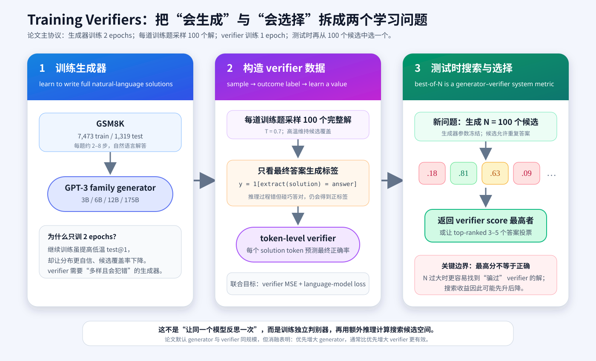
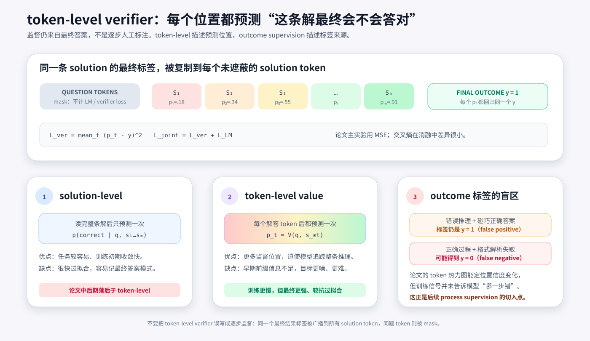
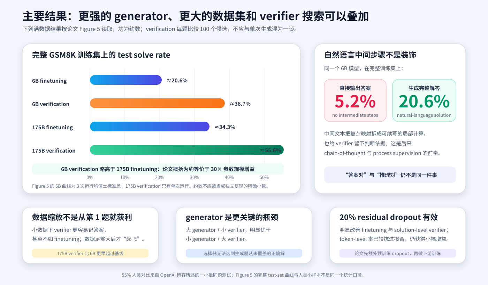
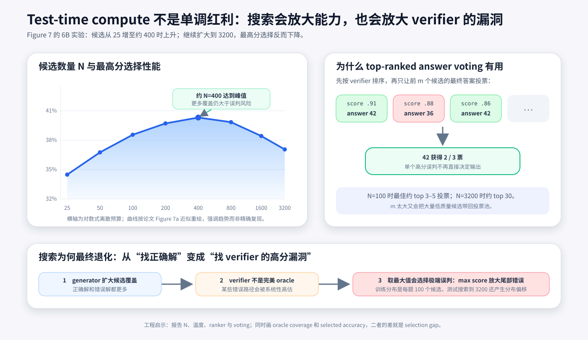

# Training Verifiers 原理：让模型先生成许多解，再学习选出正确推理


> **论文**：[Training Verifiers to Solve Math Word Problems](https://arxiv.org/abs/2110.14168)<br>
> **作者**：Karl Cobbe、Vineet Kosaraju、Mohammad Bavarian、Mark Chen 等<br>
> **发表时间**：2021 年 10 月<br>
> **关键词**：GSM8K、Verifier、Best-of-N、Outcome Supervision、Token-level Value、Test-time Compute、Math Word Problems<br>
> **官方资料**：[OpenAI 发布页](https://openai.com/index/solving-math-word-problems/) · [GSM8K 数据与示例代码](https://github.com/openai/grade-school-math) · [论文 PDF](https://arxiv.org/pdf/2110.14168)<br>
> **本文代码**：[GSM8K 标签、verifier loss、候选选择与安全计算器最小实现](./code/training_verifiers_minimal.py)

## 0. 先说结论

这篇论文同时留下了两项影响深远的成果：

1. **GSM8K**：一个由人工编写、包含自然语言解答的 8.5K 小学数学应用题数据集；
2. **Training Verifiers**：把“生成一个正确解”拆成“生成许多候选”和“判断哪个候选更可信”两个学习问题。

核心流程非常直接：

```text
问题
  → generator 高温采样 100 个完整自然语言解
  → verifier 分别预测每个解最终正确的概率
  → 返回 verifier score 最高的候选
```

但论文的价值远不止“多采样几次”：

- 6B verifier 系统略微超过单次生成的 175B finetuned 模型，论文把它概括为约等价于 **30× 模型规模增益**；
- 175B generator + verifier 在完整数据曲线上达到约 **55%–56%**；
- 直接让 6B 模型只输出最终答案，准确率只有 **5.2%**；生成完整自然语言步骤时达到 **20.6%**；
- token-level verifier 虽然训练更难，却比只在末尾打一次分的 solution-level verifier 更抗过拟合；
- 把语言模型目标与 verifier 目标联合训练，比只做二分类/回归更好；
- 测试候选从 25 增至约 400 时性能提升，但继续增至 3200 反而下降；
- 原因是 verifier 不是完美 oracle：搜索足够广时，会找到“错误但恰好骗得高分”的候选。

因此，这篇论文真正建立的是一个三段式能力观：

$$
\text{系统成功率}
=
f(
\underbrace{\text{generator coverage}}_{\text{能否采到正确解}},
\underbrace{\text{verifier quality}}_{\text{能否认出正确解}},
\underbrace{\text{search budget}}_{\text{愿意尝试多少次}}
).
$$

最值得记住的一句话是：

> **生成更多候选只有在 verifier 足够可靠时才有价值；一个会犯错的 verifier 配上无限搜索，最终可能优化出最会骗 verifier 的错误答案。**

---

## 1. 论文到底解决什么问题

### 1.1 小学数学为什么会难倒大语言模型

GSM8K 的数学概念并不高级，大部分题只需要：

- 加、减、乘、除；
- 单位换算；
- 比例与简单代数；
- 2–8 步连续推理；
- 少量常识，例如一周有 7 天。

难点在于“一步错，后面全错”。自回归模型按 token 生成：

$$
p_\theta(s\mid q)
=
\prod_{t=1}^{T}
p_\theta(s_t\mid q,s_{<t}),
$$

其中 $q$ 是问题，$s$ 是完整解答。

如果第 3 步把“每周”误写成“每天”，后续 token 会把这个错误当作既定上下文继续推演。普通 next-token prediction 没有天然的回滚机制。

### 1.2 单纯扩大生成模型成本极高

论文用 GPT-3 家族的 3B、6B、12B 与 175B 模型微调。模型越大，GSM8K 确实越好，但曲线仍很慢。

作者根据当时的 log-linear 趋势做了一个非常粗糙的外推：

- 用完整 GSM8K 训练集，仅靠扩大模型，达到 80% 可能需要约 $10^{16}$ 参数；
- 固定 175B 模型，仅靠扩大同分布训练数据，可能还需要至少两个数量级的数据。

这不是 scaling law 的严格预测，而是用来说明：

> 如果继续把所有计算都花在“更大的单次生成器”上，可能不是最有效的路线。

### 1.3 生成和验证的难度可能不同

写出一个完整正确的多步解答，需要从巨大空间中构造路径；判断给定路径是否合理，至少在很多任务上可能更容易。

于是作者把系统拆成：

$$
q
\xrightarrow{\text{generator}}
\{s^{(1)},\ldots,s^{(N)}\}
\xrightarrow{\text{verifier}}
\hat s.
$$

generator 负责扩大覆盖，verifier 负责压缩选择。

这里的“verification”不是形式化证明，也不是符号求解器。它只是一个从数据中训练出的模型：

$$
V_\phi(q,s)
\approx
P(\text{final answer is correct}\mid q,s).
$$

它会犯错，而且错误会被搜索放大。

---

## 2. 全景：论文的训练与测试管线



论文默认流程可分为五步：

### 第一步：训练 generator

从 GPT-3 checkpoint 初始化，在 GSM8K 的问题与自然语言解答上微调 **2 epochs**。

### 第二步：为训练题大量采样

对每个训练问题，用 generator 在 $T=0.7$ 下采样 **100 个 completion**。

精确数据集大小为 7,473 道训练题，因此最多形成约：

$$
7473\times100
=
747{,}300
$$

条模型生成的候选解。

### 第三步：自动生成标签

从候选最后的 `#### answer` 提取数值，与标准答案比较：

$$
y(q,s)
=
\mathbb 1
\left[
\operatorname{extract}(s)
=
a^\star
\right].
$$

只要最终数值相同，标签就是 1；否则为 0。

### 第四步：训练 verifier

从 generator 初始化另一个模型，训练 **1 epoch**：

- 对每个 solution token 预测最终结果标签；
- 同时继续做 language modeling；
- question tokens 被 mask，不贡献损失。

### 第五步：测试时 best-of-100

对新题再生成 100 个候选：

$$
s^{(1)},\ldots,s^{(100)}
\sim p_\theta(s\mid q),
$$

计算：

$$
\hat j
=
\arg\max_{j\in\{1,\ldots,100\}}
V_\phi(q,s^{(j)}),
$$

返回 $s^{(\hat j)}$ 的最终答案。

这是一种 **generator–verifier system**。它的准确率不能只归功于 generator 或 verifier。

---

## 3. GSM8K：为什么它成了数学推理的经典基准

### 3.1 数据规模：论文圆整值与仓库精确值

论文通常写：

```text
8.5K total
7.5K train
1K test
```

官方 JSONL 的精确行数是：

| split | 精确数量 |
|---|---:|
| train | 7,473 |
| test | 1,319 |
| total | 8,792 |

这不是矛盾，只是论文正文使用了圆整描述。

### 3.2 每道题长什么样

下面是一个自造的同格式例子：

```json
{
  "question": "商店上午卖出 48 支笔，下午卖出上午的一半。一天共卖出多少支？",
  "answer": "下午卖出 48/2 = <<48/2=24>>24 支。\n"
            "全天卖出 48+24 = <<48+24=72>>72 支。\n"
            "#### 72"
}
```

三个格式元素很重要：

1. **自然语言推理**：不是只有方程或答案；
2. **计算器标注**：`<<expression=result>>`；
3. **最终答案标记**：最后一行 `#### number`。

### 3.3 数据集的四个设计原则

#### 高质量

题目由人工编写，而不是从网页批量抓取。收集后由不同标注者重新求解；不一致的题目会被修复或删除。

第二轮抽查仍发现约 **1.7%** 的题目会让标注者产生答案分歧。论文因此估计破坏性错误或歧义低于约 2%，同时承认细微问题可能更多。

#### 高多样性

作者要求写题者不要重复情境或模板，并计算题目两两相似度来反馈模板化问题。

这让测试集不只是“换数字套公式”，而是更认真地考察语言理解和组合泛化。

#### 中等难度

每题通常需要 2–8 步，不要求高等数学。任务对当时模型足够难，又不至于让所有方法都接近 0。

#### 自然语言解答

写题者被要求尽量解释步骤，但可以保留各自语言风格。

这为研究提供了：

- 可解释的模型轨迹；
- 比最终答案更丰富的监督；
- 供 verifier 阅读的中间证据；
- 后来 chain-of-thought 研究的重要标准数据格式。

### 3.4 题目并非完全不借助模型

数据收集最初通过 Upwork 获得约 1,000 道题，随后由 Surge AI 扩展。

作者还用 few-shot prompted 175B GPT-3 自动生成 seed questions，供人工写题者：

- 直接采用；
- 修改；
- 仅作为灵感；
- 或完全自行创作。

最终题目和解答仍由人工完成与复核，但这段来源值得保留：GSM8K 不是“完全没有模型参与的数据生产”。

### 3.5 今天使用 GSM8K 的污染问题

GSM8K 在 2021 年公开后，题目、答案和大量讲解已进入互联网、模型训练语料和评测脚本。

今天报告 GSM8K 时应额外说明：

- 训练截止日期；
- 是否去除 GSM8K 与衍生答案；
- 是否用训练集或测试集调 prompt；
- 是否在多个 benchmark 上联合报告；
- 是否增加动态、私有或重新表述的数学题。

论文中的 55% 是 2021 年方法结果，不应与多年后可能看过公开题库的模型直接横比而不讨论污染。

---

## 4. Generator：为什么完整推理比直接报答案强

### 4.1 微调目标

baseline generator 使用标准语言模型交叉熵：

$$
\mathcal L_{\text{gen}}(\theta)
=
-
\sum_{t=1}^{T}
\log p_\theta(s_t\mid q,s_{<t}).
$$

论文默认微调实验训练 20 epochs；用于生成 verifier 训练样本的 generator 只训练 2 epochs。

这两个数字不能混淆：

| 场景 | epochs | 用途 |
|---|---:|---|
| finetuning baseline | 20 | 比较单次低温生成能力 |
| verifier-data generator | 2 | 保留高温多样性，生成训练候选 |
| verifier | 1 | 学习给候选打分 |

### 4.2 直接答案为什么从 20.6% 掉到 5.2%

论文比较 6B 模型：

- 生成完整自然语言解答：20.6%；
- 不写中间步骤，直接输出答案：5.2%。

中间步骤可能通过三种机制帮助：

1. **分解计算**：把一次困难映射拆成多个局部续写；
2. **外部工作记忆**：中间量写进上下文，后续可以读取；
3. **验证证据**：verifier 不只看到最终数字，还能检查论证轨迹。

这项实验发生在“Chain-of-Thought Prompting”一词流行之前，但已经清晰展示：

> 对多步推理，生成过程本身可以是计算的一部分。

### 4.3 test@1 与 test@100 的分叉

论文用 `test@N` 表示：

> 每题生成 $N$ 个样本，只要至少一个最终答案正确，就算该题被覆盖。

它与 HumanEval 的无偏 `pass@k` 估计不是同一个计算口径：本论文的 `test@100` 直接检查实际生成的 100 个候选是否至少有一个答对；HumanEval 则先生成更大的有限样本池，再用组合公式估计任取 $k$ 个候选至少一次成功的概率。二者表达相近的“覆盖”直觉，但复现时不能交换公式或名称。

generator 继续训练时：

- 低温 $T=0$ 的 test@1 继续上升；
- 高温 $T=0.7$ 的 test@100 很早达到峰值，然后明显下降。

原因是反复看同一小数据后，模型变得：

- 更尖锐；
- 更过度自信；
- 更倾向重复相似路径；
- 更少覆盖长尾正确解。

所以“最适合单次回答的 checkpoint”不一定是“最适合搜索的 generator”。

### 4.4 覆盖率是 verifier 的硬上限

设某题生成的候选集为 $\mathcal S_N$，其中正确候选集合为 $\mathcal C$。

oracle coverage 是：

$$
\mathbb 1[\mathcal S_N\cap\mathcal C\ne\varnothing].
$$

若 generator 没采到任何正确解，无论 verifier 多大都不可能选对：

$$
\operatorname{selected@}N
\le
\operatorname{oracle\ coverage@}N.
$$

这解释了论文的模型规模消融：

> 大 generator + 小 verifier，明显优于小 generator + 大 verifier。

选择器只能重排已有候选，不能凭空创造缺失的正确路径。

---

## 5. Calculator：模型负责决定算什么，工具负责把数算对

### 5.1 计算标注

GSM8K 解答包含：

```text
48/2 = <<48/2=24>>24
```

训练时这些内容只是普通 token。模型学习何时写出：

```text
<<48/2=
```

测试时，一旦检测到格式完整的表达式前缀，计算器会接管等号后的结果，再把控制权交回 generator。

### 5.2 为什么需要计算器

大型模型仍会出现：

- 多位数算术错误；
- 小数和分数换算错误；
- 前面公式正确、结果抄错；
- 较长计算中的进位错误。

计算器把任务分成：

$$
\text{language model}
\to
\text{选择表达式}
\qquad
\text{calculator}
\to
\text{执行表达式}.
$$

这不是把推理全部外包给工具。模型仍要理解题意、决定运算和组织步骤。

### 5.3 论文实现的历史边界

附录中的计算器示例先用字符白名单限制表达式，再调用 Python `eval`，并设置超时。

论文也明确记录：

- 产生论文结果的旧版计算器有小 bug；
- 多数实验受影响不到 1 个百分点；
- 修复后，完整数据上的 verification 约提升 1 个百分点。

现代实现不应直接复制 `eval`。本文代码使用 Python AST 白名单，只接受：

```text
数字、括号、+、-、*、/
```

并拒绝函数调用、属性访问、导入、幂运算和超长表达式。

它仍只是算术解析器，不是不可信程序的通用安全沙箱。

---

## 6. Verifier 的监督标签：便宜，但有结构性噪声

### 6.1 最终答案 exact match

官方实现使用正则从第一个 `####` 后提取数字：

```python
ANS_RE = re.compile(r"#### (\-?[0-9\.\,]+)")
```

去掉逗号后，用字符串与标准答案比较。

这种标注方式具有巨大工程优势：

- 不需要人工逐条审查 70 多万候选；
- generator 自己制造正负样本；
- 训练数据可随 generator 与题目数扩展；
- verifier 学到的是模型真实会犯的错误。

### 6.2 Outcome supervision 的定义

今天通常把这种标签称为 **outcome supervision**：

$$
y=
\begin{cases}
1,&\text{最终答案匹配};\\
0,&\text{否则}.
\end{cases}
$$

它不标记哪一步开始出错。

### 6.3 错过程碰巧答对

考虑：

```text
正确步骤：100 - (8 + 16 + 64) = 12

错误步骤：只减去 64，得到 36；
后面又误减 24，最终碰巧得到 12。
#### 12
```

标签仍是 1。

论文自己指出，某些候选会通过错误推理到达正确答案，形成 false positive label。

### 6.4 正确过程也可能被格式误伤

如果模型输出：

```text
最终一共七十二支。
```

但没有 `#### 72`，官方解析器会判为 invalid。

所以自动标签同时测量：

$$
\text{数学正确}
\land
\text{遵循输出格式}.
$$

这对可复现评测很有用，却不等于完整的数学正确性判定。

---

## 7. Token-level verifier：名字最容易造成误解的部分



### 7.1 Solution-level verifier

最直接的做法是读完整个解答，只在末尾输出一个分数：

$$
\hat y
=
V_\phi(q,s_{1:T}).
$$

损失可写为：

$$
\mathcal L_{\text{solution}}
=
\left(
V_\phi(q,s)-y
\right)^2.
$$

这种任务较容易，初期训练快；但论文发现它很快过拟合。

### 7.2 Token-level verifier

论文默认在每个 solution token 后预测一次：

$$
v_t
=
V_\phi(q,s_{\le t}),
\qquad t=1,\ldots,T.
$$

每个位置使用同一个最终标签：

$$
\mathcal L_{\text{token}}
=
\frac1T
\sum_{t=1}^{T}
(v_t-y)^2.
$$

如果最终答案正确，所有 $t$ 的 target 都是 1；若最终答案错误，所有 target 都是 0。

### 7.3 它不是 process supervision

token-level 描述的是：

> 在每个 token 位置都产生 value prediction。

outcome supervision 描述的是：

> 所有预测的监督都来自最终答案。

因此下列说法是错的：

```text
论文逐步标注了每个推理步骤的正确性。
```

正确表述是：

```text
论文把同一个最终结果标签广播到每个 solution token。
```

真正的 process supervision 会给不同步骤不同标签，例如明确指出第 3 步错了。那是后来 [Let's Verify Step by Step](./25_Lets_Verify_Step_by_Step_2023_原理.md) 重点研究的问题。

### 7.4 为什么更噪的 token-level 反而更好

在解答开头：

$$
P(y=1\mid q,s_{\le t})
$$

本来就不容易判断，因为关键错误可能尚未发生。

所以 token-level 目标：

- 初期更难；
- 学习更慢；
- 每个位置的信息量不同；
- 同一最终标签对早期前缀很噪。

但它提供了大量辅助预测位置，迫使模型追踪整段推理，而不是只记：

- 最后一个数字；
- 答案分布；
- 某些结尾模板；
- 训练问题与答案的浅层关联。

论文观察到：

- solution-level 很快达到峰值后过拟合；
- token-level 后期仍在改善；
- 最终 token-level 更强。

### 7.5 token 热力图能解释什么

对每个 $v_t$ 上色后，可以观察 verifier：

- 随正确步骤积累而变得更有信心；
- 在明显算错后迅速降分；
- 被歧义短语误导；
- 对正确答案但错误解释产生低分；
- 对变量绑定错误产生高分。

它是一种诊断工具，但颜色变化不是错误位置的真实标签，也不是数学证明。

---

## 8. Verifier 的模型结构与联合目标

### 8.1 它仍是语言模型

论文的 verifier 不是单独设计的树搜索器。它从 generator 初始化，保留 language-modeling 能力，再增加一个标量预测通道。

附录描述的实现很特别：

- 在最终 unembedding logits 中保留一个特殊 token；
- 对该 token 的 logit 使用一个 bias 与一个 gain；
- 这个标量成为 verifier prediction；
- 其他 token logits 继续承担语言模型目标。

概念上可简化为：

$$
h_t
\xrightarrow{\text{LM head}}
p(s_{t+1}),
\qquad
h_t
\xrightarrow{\text{value head}}
v_t.
$$

### 8.2 从 generator 初始化更好

作者比较：

1. 从原始 pretrained LM 初始化 verifier；
2. 从已经在 GSM8K 上训练 2 epochs 的 generator 初始化。

后者略好。

解释是：verifier 要评价的正是该 generator 的输出分布。先理解 generator 学到的语言与错误模式，有助于判断这些候选。

### 8.3 联合目标

论文使用：

$$
\mathcal L_{\text{joint}}
=
\mathcal L_{\text{verifier}}
+
\mathcal L_{\text{LM}}.
$$

两个损失不加额外权重。

question tokens 被 mask，只在 solution tokens 上训练：

$$
\mathcal L_{\text{LM}}
=
-
\sum_{t\in\text{solution}}
\log p_\phi(s_t\mid q,s_{<t}).
$$

### 8.4 数据怎样混合

每道原训练题产生 100 个 verifier examples。联合训练时，作者使用等量：

- 原始 language data；
- verifier-generated data。

为了做到等量，原始语言数据等效上采样约 100 倍。

论文消融显示：

> token-level verification + LM joint objective，严格优于只训练 verification objective。

语言建模辅助任务像一种结构化正则化：先持续理解“怎样写数学解”，再判断“这条解是否可信”。

### 8.5 为什么用 MSE

主实验 verifier loss 是均方误差：

$$
\mathcal L_{\text{ver}}
=
\frac1T\sum_t(v_t-y)^2.
$$

附录说明，把 MSE 换成交叉熵没有显著差异。

因此不应把论文贡献归因于某种特殊分类损失；关键是：

- 大量 on-policy-ish 模型候选；
- 自动 outcome labels；
- token-level value prediction；
- 联合 LM 目标；
- 测试时搜索与重排。

---

## 9. 主结果：verification 为什么相当于约 30× 模型增益



### 9.1 Figure 5 的满数据结果

论文没有给出独立精确结果表，下面数值按 Figure 5 曲线读取，因此用约数：

| generator / 方法 | 完整训练集 test solve rate |
|---|---:|
| 6B finetuning，单次低温生成 | ≈20.6% |
| 6B generator + 6B verifier，100 候选 | ≈38%–39% |
| 175B finetuning，单次低温生成 | ≈34%–35% |
| 175B generator + 175B verifier，100 候选 | ≈55%–56% |

核心对比：

$$
\text{6B verification}
>
\text{175B finetuning}.
$$

因为 $175/6\approx29.2$，论文称这大约相当于 **30× 模型规模提升**。

它不是说：

```text
6B verifier 的参数效率永远等于 175B generator。
```

更准确的含义是：

> 在 GSM8K、完整训练集、每题 100 个候选和论文协议下，把计算投入生成后验证，得到的系统增益接近把单次生成模型从 6B 扩到 175B。

### 9.2 计算成本并没有消失

verification 需要：

- 生成 100 个完整解；
- verifier 为 100 个解打分；
- 保存、解析、排序候选。

所以 30× 参数增益不是 30× 成本节省。

它表达的是另一种计算分配：

$$
\text{更大的单次训练模型}
\quad\leftrightarrow\quad
\text{较小模型 + 更多测试时计算}.
$$

要做工程比较，还必须报告：

- 训练 FLOPs；
- 每题生成 tokens；
- verifier tokens；
- 延迟；
- 并行度；
- 实际吞吐和成本。

### 9.3 为什么 verification 在小数据下反而差

Figure 5 显示，训练题较少时，verification 低于 finetuning。

论文解释：

- 最终答案标签很容易被记忆；
- verifier 会先学会训练题答案模式；
- 还没学会可泛化的正确推理特征就已过拟合。

随着题目数增加：

- 错误类型更多；
- 同一答案对应更多语言路径；
- 靠记忆答案越来越困难；
- verifier 才开始学习可迁移的判断信号。

175B verifier 比 6B verifier 使用更少数据就越过 finetuning baseline，论文把这种现象称作更早“take off”。

### 9.4 官方博客的儿童对比要谨慎

OpenAI 发布页写道：

- 一小批 9–12 岁学生在抽取题目上得分 60%；
- 系统在相同题目上得分 55%；
- 因而约达到儿童解题数的 90%。

这不是：

- 完整 1,319 题上的大规模人类基线；
- 所有小学年龄段的代表性统计；
- 模型达到普遍儿童数学理解的证明。

博客中的 55% 人类对比口径与 Figure 5 完整测试集曲线也不应强行混成同一个精确数字。

---

## 10. 三个关键消融：token、辅助目标与模型大小

### 10.1 Token-level vs solution-level

结论：

- solution-level 早期更快；
- 很快过拟合并退化；
- token-level 初期慢，最终更强；
- token-level 仍在 1 epoch 末端继续改善。

这说明额外预测位置可充当辅助任务。

### 10.2 Joint objective vs verification-only

结论：

$$
\text{token-level + LM joint}
>
\text{token-level verification-only}.
$$

分类器如果忘记语言结构，只剩浅层答案模式，泛化会更差。

### 10.3 Generator size vs verifier size

作者组合：

- 6B generator + 6B verifier；
- 6B generator + 175B verifier；
- 175B generator + 6B verifier；
- 175B generator + 175B verifier。

结果显示，增大 generator 的影响更大。

这可以拆成两个上限：

$$
\text{system accuracy}
=
\text{coverage}
\times
\text{conditional selection quality}.
$$

更严格地写：

$$
P(\text{selected correct})
=
P(\text{correct exists})
\cdot
P(\text{select correct}\mid\text{correct exists}).
$$

大 generator 主要提高第一项；大 verifier 主要提高第二项。

当第一项很低时，第二项再高也无济于事。

---

## 11. Test-time compute：为什么搜索不是越多越好



### 11.1 从 25 到 400：覆盖收益占主导

6B 实验中，候选数增加：

```text
25 → 50 → 100 → 200 → 400
```

verifier-selected accuracy 持续上升。

更多候选让正确解进入候选池的概率增加。

### 11.2 从 400 到 3200：极值误判占主导

继续扩大：

```text
400 → 800 → 1600 → 3200
```

性能下降。

设错误候选的 verifier score 分布为 $F_0$，正确候选为 $F_1$。

即使平均而言正确候选得分更高，只要错误分布存在高分尾部，$N$ 增大时：

$$
\max_{j:\,y_j=0}V_\phi(q,s^{(j)})
$$

也会越来越大。

最终最极端的错误候选可能压过正确候选。

### 11.3 这是 Goodhart 效应的一个小型版本

verifier score 是正确性的代理指标。

普通测试时，它和正确性相关；但一旦搜索专门最大化它：

$$
\hat s
=
\arg\max_s V_\phi(q,s),
$$

搜索会寻找 verifier 的盲点。

论文称这些候选为可能“adversarial solutions that fool the verifier”。它们不一定由攻击者恶意构造，而是大规模采样自然发现的高分误判。

### 11.4 训练–测试搜索预算也发生分布偏移

verifier 训练数据每题来自 100 个候选。

测试若搜索 3200 个：

- 会探索训练数据罕见的解答类型；
- 极端分数出现概率增大；
- verifier calibration 不再可靠；
- 最大值选择放大尾部误差。

这也是为什么不能把小预算 ranker 无限制外推到大预算。

---

## 12. Top-ranked answer voting：为什么不只信第一名

### 12.1 算法

先按 verifier score 排序：

$$
s^{(1)},s^{(2)},\ldots
\quad
\text{where }
V(s^{(1)})\ge V(s^{(2)})\ge\cdots.
$$

取前 $m$ 个，提取最终答案并多数投票：

$$
\hat a
=
\operatorname{mode}
\left(
a(s^{(1)}),\ldots,a(s^{(m)})
\right).
$$

### 12.2 它缓解单个高分误判

例如：

| rank | verifier score | answer |
|---:|---:|---:|
| 1 | 0.91 | 42 |
| 2 | 0.88 | 36 |
| 3 | 0.86 | 42 |

top-1 选择 42；top-3 投票也是 42。

若第一名恰好是错误的 36，但第 2、3 名都是 42，投票可以纠正最高分误判。

### 12.3 $m$ 不能太大

排名越靠后，候选平均质量越差。让所有候选投票会重新引入大量噪声。

论文经验值：

- 总候选 $N=100$：最佳约 top 3–5 投票；
- 总候选 $N=3200$：最佳约 top 30 投票。

$N$ 越大，可用的高质量头部也越宽；但 $m$ 仍远小于 $N$。

### 12.4 它与 Self-Consistency 的关系

后来的 Self-Consistency 直接从多条推理路径对最终答案投票。

本论文的变体是：

```text
先用 learned verifier 排序
  → 再让高分子集投票
```

两者都利用“多个推理路径可汇聚到同一答案”，区别在于是否先用学习型 ranker 过滤。

---

## 13. Dropout：一个看似普通但很关键的结果

### 13.1 为什么 GPT-3 checkpoint 不能直接打开 dropout

GPT-3 预训练时没有使用 dropout。

如果下游微调突然加入 20% dropout，会产生训练分布变化。论文因此先进行一段带 dropout 的额外预训练，再做 GSM8K 微调。

### 13.2 Residual dropout

作者在每层 residual path 使用：

$$
p_{\text{drop}}=0.2.
$$

结果：

- finetuning 明显提高；
- solution-level verifier 明显提高，过拟合缓解；
- 加 dropout 的 solution-level 可接近 token-level；
- token-level 本来更抗过拟合，仍有小幅提升。

### 13.3 Token-level dropout 需要更大 batch

Figure 8c 的 token-level dropout 实验把 token batch size 增大 4 倍，以缓解更困难目标与 dropout 噪声。

这提醒我们：

> 正则化方法的结果不能脱离配套 batch、预训练适配和训练预算来复现。

---

## 14. 超参数与复现口径

论文附录的默认设置：

| 项目 | 设置 |
|---|---|
| model family | GPT-3 |
| main sizes | 6B、175B |
| batch size | $3.2\times10^4$ tokens |
| max sample length | 400 tokens |
| tokenizer | reversible 50,000 |
| optimizer | Adam |
| $\beta_1,\beta_2$ | 0.9, 0.95 |
| schedule | linear decay to 0 |
| baseline sampling | $T=0$ |
| verifier sampling | $T=0.7$ |
| generator epochs | 2 |
| verifier epochs | 1 |
| verifier loss | MSE |
| train candidates/problem | 100 |
| test candidates/problem | 100 |

baseline finetuning 的 base learning rate 随模型规模变化，再乘 0.1：

| 模型 | base $\alpha$ |
|---|---:|
| 3B | $1.6\times10^{-5}$ |
| 6B | $1.2\times10^{-5}$ |
| 12B | $1.0\times10^{-5}$ |
| 175B | $6.0\times10^{-6}$ |

verification learning rate 为 $1.0\times10^{-5}$。

附录还指出：

- verifier temperature 换成 1.0 差异不大；
- MSE 换成交叉熵差异不大；
- Figure 8c 使用 4× token batch 和 300 train/test candidates；
- Figure 7a 的 verifier 仍用 100 candidates/problem 训练，只在测试扩大搜索。

---

## 15. 最小代码：标签、loss、best-of-N、投票与安全计算器

本文提供 [training_verifiers_minimal.py](./code/training_verifiers_minimal.py)。

它不尝试复刻 175B 训练，而是实现最关键、可本地审计的机制：

- GSM8K `####` 最终答案解析；
- outcome label；
- solution-level / token-level MSE；
- verifier + LM 联合目标；
- best-of-N 选择；
- top-ranked answer voting；
- oracle coverage；
- 搜索过大时高分 false positive 反超；
- 不使用 `eval` 的 AST 算术计算器。

运行：

```bash
python3 papers/to-2026/code/training_verifiers_minimal.py
```

预期输出：

```text
token-level verifier MSE     : 0.346667
oracle candidate coverage    : 100.0%
best-of-N solve rate         : 50.0%
top-3 answer-vote solve rate : 100.0%
selected answers by N=1..4   : ('42', '42', '42', '999')
safe calculator 48 + 48 / 2  : 72.0
all checks passed; no model training or arbitrary code execution occurred
```

### 15.1 Token-level target

```python
def token_level_targets(outcome: int, num_solution_tokens: int):
    return (outcome,) * num_solution_tokens
```

这段代码最直接地揭示：

> 每个 token 都有预测，但没有每步独立标签。

### 15.2 Best-of-N

```python
def select_best(candidates):
    return max(candidates, key=lambda item: item.verifier_score)
```

若第 4 个候选是错误答案，却得到更高 verifier score：

```text
N=1  → 42
N=2  → 42
N=3  → 42
N=4  → 999
```

这使 Figure 7 的非单调性变得具体。

### 15.3 Top-ranked voting

```python
ranked = sorted(candidates, key=score, reverse=True)
answers = [extract(item) for item in ranked[:m]]
return majority_vote(answers)
```

它不是对所有样本投票，而是先用 verifier 定义高质量子集。

### 15.4 安全计算器

配套代码用 `ast.parse(expression, mode="eval")` 解析语法树，只递归执行白名单节点。

例如：

```text
48 + 48 / 2          → 接受
__import__("os")     → 拒绝
2 ** 100000000       → 拒绝
object.attribute     → 拒绝
```

即便如此，生产环境仍应设置长度、数值范围、CPU 与异常边界。

---

## 16. 官方仓库能复现什么，不能复现什么

官方 `openai/grade-school-math` 仓库提供：

- train/test JSONL；
- Socratic 变体；
- 最终答案提取；
- 计算器采样示例；
- 一个 GPT-2 规模的训练/采样演示；
- 部分 6B/175B 模型输出样本。

README 明确说明：

> 仓库中的 GPT-2 示例管线仅用于演示，不是论文实验使用的训练管线。

仓库没有提供：

- 论文的 GPT-3 checkpoints；
- 175B generator/verifier 权重；
- 完整 verifier 训练代码；
- 论文级算力配置；
- Figure 5 的端到端复现实验。

因此可以准确地说“GSM8K 数据和基础格式已公开”，不能说“论文全部实验完全开源可复现”。

---

## 17. 与 RLHF、奖励模型和过程监督的关系

### 17.1 Verifier 很像 reward model

二者都学习：

$$
r_\phi(x,y)\in\mathbb R.
$$

区别在监督来源：

| 方法 | 标签来源 |
|---|---|
| 本论文 verifier | 最终答案自动 exact match |
| RLHF reward model | 人类偏好比较 |
| process reward model | 每一步正确性标注 |

### 17.2 论文没有用 RL 优化 generator

本论文做的是：

```text
generator 固定
  → sample
  → verifier rerank
```

不是：

```text
用 verifier reward 反向通过 RL 更新 generator
```

因此更接近 rejection sampling / best-of-N，而不是 PPO。

### 17.3 为什么不立即做 RL

一个不完美 verifier 已经会在 $N$ 很大时被候选欺骗。

若直接用它做强优化目标，generator 可能更主动地寻找高分漏洞：

$$
\max_\theta
\mathbb E_{s\sim p_\theta}
[V_\phi(q,s)].
$$

这会把 Figure 7 的“偶然找到高分误判”升级成 reward hacking。

论文虽然没有展开 RL 实验，却已经展示了代理目标被优化后的核心风险。

### 17.4 从 outcome 到 process

本论文的 false positive 标签问题推动了后续问题：

> 如果最终答案对，但中间推理错，能不能逐步监督 verifier？

2023 年的 Let's Verify Step by Step 把焦点转向 process supervision。阅读顺序可以是：

```text
Training Verifiers
  → Chain-of-Thought
  → Self-Consistency
  → Let's Verify Step by Step
  → verifier-guided reasoning / test-time compute
```

---

## 18. 论文的局限与今天仍然重要的警告

### 18.1 Verifier 不验证数学真理

它预测的是训练分布下的正确概率，不是：

- 定理证明；
- 符号等价检查；
- 单元测试执行；
- SAT/SMT 求解；
- 形式化 proof checking。

“verifier”这个词容易让人产生过强安全感。

### 18.2 Outcome label 无法定位错误

最终答案错，只知道某处有错；最终答案对，也不保证过程对。

这限制了：

- 错误归因；
- 局部修复；
- 高质量反馈；
- 对思维链可信度的判断。

### 18.3 搜索会制造分布偏移

训练看 100 samples/problem，测试搜索 3200，会进入新的极值区域。

部署时若把候选数从实验的 100 改成 10,000，必须重新评测 verifier，而不能假设收益继续增长。

### 18.4 投票依赖答案可聚合

GSM8K 最终答案是短数字，很容易 exact match 和计票。

开放式写作、代码架构、医疗建议等任务：

- 正确答案可能不唯一；
- 语义等价难聚类；
- 多数答案可能共享同一系统性错误；
- 不能直接复制数字投票。

### 18.5 Calculator 改变了测量对象

带计算器的系统评测的是：

$$
\text{LM interpretation}
+
\text{tool invocation}
+
\text{arithmetic execution}.
$$

它不是纯参数记忆下的心算能力。

这并非缺点，但报告结果时必须说明工具协议。

### 18.6 400-token 长度限制

论文 max sample length 为 400 tokens。截断、长解释和格式错误都可能影响结果。

现代模型使用更长 reasoning trace 时，不能直接复用同一成本和长度口径。

### 18.7 数据质量不是 100%

人工复核后仍有 1.7% 的答案分歧估计。少量歧义题会同时污染：

- generator target；
- 自动 outcome labels；
- verifier 训练；
- 最终 test accuracy。

### 18.8 人类对比样本很小

“系统 55%、儿童 60%”是官方博客描述的小样本同题比较，不足以证明一般人类水平。

---

## 19. 如何正确评估一个现代 generator–verifier 系统

### 19.1 同时报告三条曲线

#### Generator 单次准确率

$$
\operatorname{pass@1}.
$$

回答一次默认生成有多好。

#### Oracle coverage

$$
\operatorname{coverage@}N
=
P(\exists j\le N:y_j=1).
$$

回答候选池里是否存在正确解。

#### Selected accuracy

$$
\operatorname{selected@}N
=
P(y_{\arg\max_j V_j}=1).
$$

回答 verifier 最终是否选对。

差值：

$$
\operatorname{coverage@}N
-
\operatorname{selected@}N
$$

就是 selection gap 的直观度量。

### 19.2 报告预算

- candidates/problem；
- sampling temperature；
- top-p；
- 每候选最大 tokens；
- verifier 模型大小；
- 是否使用 calculator；
- top-1 还是 top-$m$ vote；
- 总生成与打分 FLOPs；
- 串行延迟和可并行延迟。

### 19.3 报告标签质量

- 最终答案 parser；
- 数值归一化规则；
- invalid completion 比例；
- 正确答案但错误过程的抽检率；
- 多答案或歧义题处理；
- 人工审查样本。

### 19.4 做 search stress test

不要只测一个 $N$。

至少绘制：

```text
N = 1, 4, 16, 64, 256, 1024, ...
```

观察：

- coverage 是否继续升；
- selected accuracy 在哪里峰值；
- verifier calibration 是否漂移；
- false positive 的类型怎样变化。

### 19.5 保留失败样本

将错误拆成：

- generator 无正确候选；
- verifier false negative；
- verifier false positive；
- 最终答案 parser 错误；
- calculator 错误；
- 投票聚类错误；
- benchmark 自身歧义。

只有这样才知道该扩大 generator、改 verifier、改标签还是改评测。

---

## 20. 复现实验清单

### 数据

- [ ] 固定 GSM8K commit 或文件哈希；
- [ ] 明确使用 7,473 / 1,319 精确 split；
- [ ] 不把 test answers 用于 prompt、checkpoint 或 verifier 选择；
- [ ] 检查公开数据污染；
- [ ] 保留 `####` 和计算标注的规范化规则；
- [ ] 报告 invalid-answer rate。

### Generator

- [ ] 区分 20-epoch baseline 与 2-epoch verifier generator；
- [ ] 报告 $T=0$ 的单次 baseline；
- [ ] 报告 $T=0.7$ 的高温覆盖；
- [ ] 记录 max length 400 或新的长度；
- [ ] 测量重复候选率和答案多样性；
- [ ] 保存每题全部候选，不只保存最终选择。

### 自动标签

- [ ] 只从训练问题生成 verifier data；
- [ ] 正负样本都来自当前 generator 分布；
- [ ] 检查“错误过程碰巧答对”；
- [ ] 检查数字格式、逗号、小数与负数；
- [ ] 不把 exact match 宣称为完整推理验证。

### Verifier

- [ ] 说明 solution-level 或 token-level；
- [ ] 若 token-level，说明每个位置是否共享 outcome label；
- [ ] mask question tokens；
- [ ] 报告 MSE / CE；
- [ ] 报告是否联合 LM objective；
- [ ] 说明从 pretrained LM 还是 generator 初始化；
- [ ] 对比不同 generator/verifier 尺寸。

### Test-time search

- [ ] 报告候选数 $N$；
- [ ] 同时画 oracle coverage 与 selected accuracy；
- [ ] 测试 $N$ 增大后的非单调性；
- [ ] 比较 top-1、top-$m$ vote 与全体 majority vote；
- [ ] 检查高分错误是否来自变量绑定、算术或答案模式；
- [ ] 不把 best-of-100 写成单次生成准确率。

### Calculator 与安全

- [ ] 不直接对模型文本使用 Python `eval`；
- [ ] 使用 AST / parser 白名单；
- [ ] 限制表达式长度和数值范围；
- [ ] 记录 calculator trigger / failure rate；
- [ ] 把 tool-assisted 与 tool-free 结果分开；
- [ ] 对工具错误和 parser 错误单独计数。

---

## 21. 常见误解

### 误解 1：Verifier 会证明解答正确

不会。它是学习型概率打分器，不是形式化证明器。

### 误解 2：55% 是 GPT-3 单次生成准确率

不是。论文最强结果使用 175B generator、每题 100 个候选和 175B verifier 选择。

### 误解 3：6B 模型真的在所有意义上胜过 175B

不对。6B verification 系统在该协议下略胜 175B 单次 finetuning；它消耗大量测试时采样与打分计算。

### 误解 4：Token-level verifier 有逐步正确性标签

没有。每个 solution token 都回归同一个最终 outcome label。

### 误解 5：最终答案对，推理一定对

不对。错误抵消、猜测和错误变量绑定都可能碰巧得到正确数值。

### 误解 6：候选越多，准确率一定越高

不对。Figure 7 在约 400 个候选后下降，因为极端高分误判开始主导。

### 误解 7：Verifier 越大总比 generator 越大有效

论文消融得到相反结论：优先增大 generator 更有效，因为候选覆盖是硬上限。

### 误解 8：直接输出答案更简洁，所以更准确

论文 6B 实验中从完整解答的 20.6% 掉到直接答案的 5.2%。

### 误解 9：官方 GitHub 能完整复现论文 175B 结果

不能。仓库公开数据、格式和 GPT-2 示例；README 明确说演示管线未用于论文实验。

### 误解 10：加 calculator 后测的仍是纯语言模型心算

不是。它测量模型决定运算与外部工具执行的组合系统。

### 误解 11：论文使用 process supervision

不是。论文是 outcome supervision；逐步过程监督是后续工作的重要发展。

### 误解 12：30× 参数增益等于 30× 成本降低

不等于。best-of-100 有显著生成和 verifier 计算成本。

---

## 22. 一页纸记忆

1. GSM8K 精确包含 7,473 train 与 1,319 test，共 8,792 题。
2. 每题通常需要 2–8 步小学数学推理。
3. 数据由人工编写与复核，但写题时使用过 175B GPT-3 seed questions。
4. 解答以自然语言书写，计算用 `<<expr=result>>`，最终答案用 `####`。
5. 生成完整推理的 6B 模型为 20.6%，直接输出答案只有 5.2%。
6. verifier generator 只训练 2 epochs，以保留候选多样性。
7. 每道训练题采样 100 个候选，按最终答案 exact match 自动标注。
8. verifier 从 generator 初始化，训练 1 epoch。
9. token-level verifier 在每个 solution token 后预测最终正确率。
10. 每个 token 使用同一个 outcome label，不是 process supervision。
11. 主实验用 MSE，并与 LM objective 无权重相加。
12. question tokens 被 mask，只在 solution tokens 上训练。
13. 测试时每题生成 100 个解，返回 verifier score 最高者。
14. 6B verification 略胜 175B finetuning，约等价于 30× 参数规模增益。
15. 175B verification 在完整数据曲线上约 55%–56%。
16. 大 generator + 小 verifier 优于小 generator + 大 verifier。
17. 小数据时 verifier 会先记答案，可能不如 finetuning。
18. token-level 比 solution-level 更抗过拟合。
19. LM auxiliary objective 能提高 verifier。
20. 20% residual dropout 对 finetuning 和 verifier 都有帮助。
21. 候选数量约到 400 时达到峰值，增至 3200 反而下降。
22. top-ranked 3–5 answer voting 可缓解单个高分误判。
23. verifier 是代理指标，最大化它会暴露 Goodhart / reward hacking 风险。
24. 正确评测必须同时报告单次准确率、oracle coverage 与 selected accuracy。

如果只记一句话：

> **Training Verifiers 把推理能力从“模型一次能否写对”扩展为“生成器能否覆盖正确路径、验证器能否识别它、测试时预算是否恰到好处”；它也提前展示了今天 test-time compute 的核心红利与核心风险。**

---

## 参考资料与延伸阅读

### 一手资料

- [Training Verifiers to Solve Math Word Problems 原论文](https://arxiv.org/abs/2110.14168)
- [论文 PDF](https://arxiv.org/pdf/2110.14168)
- [OpenAI：Solving Math Word Problems](https://openai.com/index/solving-math-word-problems/)
- [OpenAI Grade School Math / GSM8K 官方仓库](https://github.com/openai/grade-school-math)
- [GSM8K 最终答案解析](https://github.com/openai/grade-school-math/blob/master/grade_school_math/dataset.py)
- [GSM8K calculator sampling 示例](https://github.com/openai/grade-school-math/blob/master/grade_school_math/calculator.py)

### 本仓库相关论文

- 生成与采样评测前身：[Codex / HumanEval 原理](./52_Codex_HumanEval_2021_原理.md)
- 自然语言推理：[Chain-of-Thought 原理](./11_Chain_of_Thought_2022_原理.md)
- 多路径答案投票：[Self-Consistency 原理](./18_Self_Consistency_2022_原理.md)
- 从 outcome 到 process：[Let's Verify Step by Step 原理](./25_Lets_Verify_Step_by_Step_2023_原理.md)
- 搜索式推理：[Tree of Thoughts 原理](./26_Tree_of_Thoughts_2023_原理.md)
- 强化学习与 verifier-guided reasoning：[DeepSeek-R1 原理](./30_DeepSeek_R1_2025_原理.md)

> 本文封面由生成式图像工具制作；四张技术 SVG 根据论文正文、附录和官方 GSM8K 仓库重新绘制，并非论文原图。配套代码只演示标签、损失、选择、投票与白名单算术，不包含论文未公开的 GPT-3 权重或 175B 训练流程。
