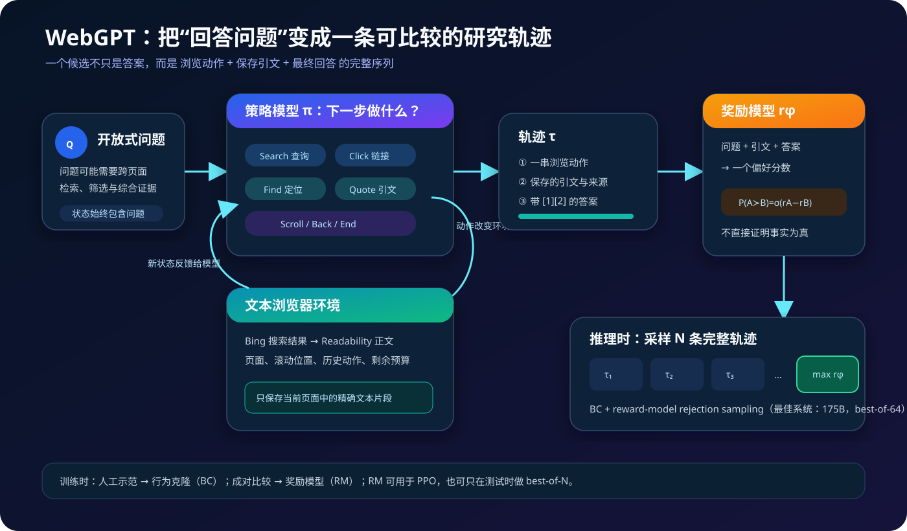
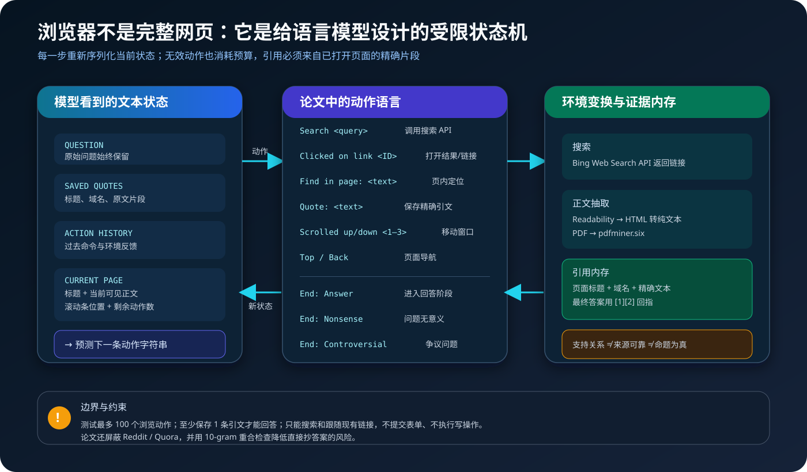
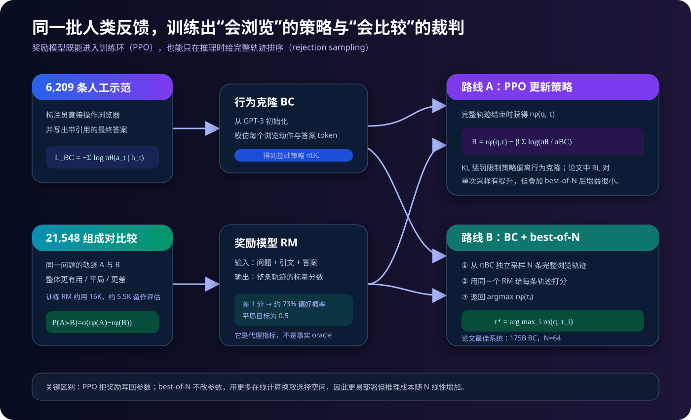
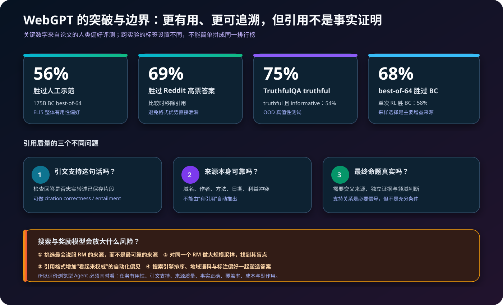

# WebGPT 原理：让语言模型先上网查证，再用人类偏好选出带引用的答案


> **论文**：[WebGPT: Browser-assisted question-answering with human feedback](https://arxiv.org/abs/2112.09332)<br>
> **作者**：Reiichiro Nakano、Jacob Hilton、Suchir Balaji、Jeff Wu、Long Ouyang 等<br>
> **发表时间**：2021 年 12 月，本文参考 arXiv v3（2022 年 6 月）<br>
> **关键词**：Web Browsing、Long-form Question Answering、Human Feedback、Behavior Cloning、Reward Model、PPO、Rejection Sampling、Citation<br>
> **官方资料**：[OpenAI 发布页](https://openai.com/index/webgpt/) · [论文 PDF](https://cdn.openai.com/WebGPT.pdf) · [公开比较数据](https://openaipublic.blob.core.windows.net/webgpt-answer-viewer/comparisons.jsonl)<br>
> **本文代码**：[离线文本浏览器、引用审计、偏好损失与 best-of-N 最小实现](./code/webgpt_browser_reward_minimal.py)

## 0. 先说结论

WebGPT 把开放式问答从“一次生成一段看起来合理的文字”，改造成了一个有外部环境、有证据内存、有人类反馈的序列决策问题：

```text
问题
  → Search / Click / Find / Scroll
  → 从访问过的网页保存精确引文
  → 写出带 [1][2] 引用的长答案
  → 对多条完整浏览轨迹打偏好分
  → 返回 reward model 最喜欢的一条
```

论文最强系统是 **175B 行为克隆模型 + reward-model best-of-64**。在人类偏好评测中：

- 相对 WebGPT 人工示范，整体有用性胜率为 **56%**；
- 相对 ELI5 上最高票的 Reddit 答案，胜率为 **69%**；
- 在分布外 TruthfulQA 上达到 **75% truthful**，其中 **54% 同时 truthful 且 informative**；
- 175B BC best-of-64 相对单次 BC 的偏好胜率为 **68%**，单次 RL 相对 BC 为 **58%**。

但这些数字不能被解读成“模型已经会自动查明真相”。WebGPT 的引用解决了一个较窄的问题：

> 回答中的说法，能否回指到模型访问并保存的网页片段？

它没有自动解决另外两个问题：

1. 被引用的网页是否可靠；
2. 最终命题是否真实。

因此，这篇论文最重要的遗产有两面：

- 正面：它预演了今天浏览型 Agent 的动作循环、证据记忆、引用回答、RLHF 与推理时重排序；
- 反面：它也清楚展示了 reward hacking、来源挑选、搜索偏差与“引用带来的虚假权威感”。

如果只记一句话：

> **WebGPT 不是给 GPT-3 接上一个搜索框，而是把“如何研究一个问题”本身变成人类可示范、可比较、可优化的完整轨迹。**

---

## 1. 为什么普通语言模型不够

### 1.1 参数知识有三个天然问题

一个只依赖参数记忆的语言模型，对开放式问题通常面临：

- **时效性**：预训练截止后发生的事实不在参数里；
- **可追溯性**：即使说对，也很难说明证据来自哪里；
- **长尾性**：小众、细粒度、跨来源信息未必被可靠记住。

普通生成写作可以表示为：

$$
p_\theta(y\mid q)
=
\prod_{t=1}^{T}p_\theta(y_t\mid q,y_{<t}),
$$

其中 $q$ 是问题，$y$ 是答案。训练目标只要求下一个 token 合理，并不要求模型在生成前访问外部证据。

### 1.2 开放式问答不是一次检索就结束

长答案经常需要多步研究：

1. 先把问题改写成搜索词；
2. 阅读搜索摘要并选链接；
3. 在页面内定位相关段落；
4. 发现某个概念不清楚，再发起第二次搜索；
5. 比较多个来源；
6. 保存可支持最终说法的原文；
7. 综合成回答并逐项引用。

这更像一个 partially observed environment 中的策略：

$$
a_t \sim \pi_\theta(a_t\mid h_t),
$$

其中 $h_t$ 包含问题、当前页面、已经保存的引文、过去动作与剩余预算；$a_t$ 则是搜索、点击、查找、引用或终止命令。

### 1.3 评价“研究过程”比评价短答案更难

对于“法国首都是什么”，exact match 很自然；对于“为什么某种现象会发生”，可能有多个合理答案。评价者要同时考虑：

- 是否回答核心问题；
- 是否有遗漏或无关信息；
- 说法是否被引文支持；
- 综合是否连贯；
- 引用是否放对位置；
- 整体是否比另一个答案更有用。

WebGPT 的关键选择不是定义一个完美绝对分数，而是让人比较两个完成品：

$$
\tau_A \succ \tau_B?
$$

相对比较往往比独立给长答案打 0–100 分更稳定。

---

## 2. 全景：WebGPT 的系统闭环



一条 WebGPT 样本不是单独的答案，而是：

$$
\tau=(q,a_1,o_1,a_2,o_2,\ldots,a_T,o_T,R,y),
$$

其中：

- $q$：问题；
- $a_t$：模型发出的浏览动作；
- $o_t$：浏览器返回的新文本状态；
- $R$：保存的引用集合；
- $y$：最终带引用答案。

论文把这个闭环分成四层：

| 层 | 输入 | 输出 | 如何学习 |
|---|---|---|---|
| 浏览策略 | 当前文本状态 | 下一条动作 | 人工示范做行为克隆 |
| 证据内存 | 当前页面片段 | 标题、域名、精确引文 | 环境规则，不是模型自由编造 |
| 回答策略 | 问题与已存引文 | 带引用答案 | 行为克隆，或 RL 更新 |
| 奖励模型 | 问题、引文、答案 | 标量偏好分 | 人工成对比较 |

最后有两种使用奖励的方法：

1. **PPO**：用奖励模型更新策略参数；
2. **rejection sampling / best-of-N**：策略不变，生成 $N$ 条轨迹，选奖励最高者。

论文最终发现，经过更充分调优后，第二条路线更简单也更强。

---

## 3. 文本浏览器：给语言模型造一个可控互联网



### 3.1 为什么不直接给模型完整浏览器

真实网页包含 JavaScript、菜单、广告、图片、布局、登录框和无限交互。2021 年的 GPT-3 主要处理文本，因此作者设计了一个 text-based browser：

- 搜索外包给 Microsoft Bing Web Search API；
- HTML 页面先经过 Mozilla Readability.js 提取正文；
- HTML 再转换为纯文本；
- PDF 用 `pdfminer.six` 转换；
- 链接表示成特殊 token 风格的 `【ID†文字†域名】`；
- 每轮都把有限的当前状态重新序列化给语言模型。

这不是网页截图理解，也不是 DOM 操作 Agent。它更接近一台有严格动作语法的文本状态机。

### 3.2 模型能执行哪些动作

论文的动作表如下：

| 动作 | 含义 |
|---|---|
| `Search <query>` | 提交一个搜索查询 |
| `Clicked on link <link ID>` | 打开当前页面中的指定链接 |
| `Find in page: <text>` | 在页面内寻找文本 |
| `Quote: <text>` | 保存当前页面的精确片段作为引用 |
| `Scrolled down <1, 2, 3>` | 向下滚动 1–3 屏 |
| `Scrolled up <1, 2, 3>` | 向上滚动 1–3 屏 |
| `Top` | 回到页顶 |
| `Back` | 返回上一页 |
| `End: Answer` | 结束浏览并回答 |
| `End: Nonsense` | 标记问题无意义 |
| `End: Controversial` | 标记问题有争议 |

无效命令会被忽略，但仍消耗动作预算。这一点很重要：如果错误动作没有成本，模型可以不断试探解析器。

### 3.3 每一步看到什么

状态大致包括：

```text
问题
已保存的引用
过去动作和环境反馈
当前页面标题
当前可见文本窗口
滚动条位置
剩余动作数
```

因此模型不是“记住了整个互联网”，而是在一个有限上下文里维护研究状态。

### 3.4 引用是环境对象，不只是格式字符串

`Quote: <text>` 必须匹配当前打开页面的原始片段。环境随后保存：

```python
Reference(
    title="页面标题",
    domain="来源域名",
    quote="精确文本片段",
)
```

最终回答里的 `[1]` 回指保存的第 1 条 `Reference`。这比让模型在回答结束后自由生成 URL 更可靠，因为出处在回答前已经由环境绑定。

但它只能保证：

$$
\text{引用片段确实来自已访问页面}.
$$

它不能保证：

$$
\text{页面可靠}\quad\text{或}\quad\text{命题真实}.
$$

### 3.5 终止与安全边界

- 测试时最多允许 **100 个浏览动作**；
- RL 训练时最大动作数在 **20–100** 间随机；
- 至少保存一条引用后才能进入回答；
- 达到动作或引用长度上限也会终止；
- 模型只能搜索和跟随已有链接，不能提交表单或执行写操作。

作者还做了两类防抄措施：

- 从搜索结果和可点击链接中移除 Reddit 与 Quora；
- 如果页面与问题或参考答案存在较长的 10-gram 重合，则屏蔽页面。

它们不能完全消除数据泄漏，但说明“浏览能力评测”必须把抄参考答案当成独立威胁模型。

---

## 4. WebGPT 与 RAG 有什么不同

[RAG](./07_RAG_2020_原理.md) 与 WebGPT 都引入外部知识，但控制流不同。

| 维度 | 经典 RAG | WebGPT |
|---|---|---|
| 检索器 | 稠密/稀疏检索，一次或固定次数 | 通用搜索引擎 + 多轮策略动作 |
| 查询 | 通常由问题直接构造 | 模型可以连续改写查询 |
| 读取 | 取 top-$k$ 文档块 | 点击、滚动、页内查找 |
| 证据 | 文档块进入上下文 | 模型主动 `Quote` 保存片段 |
| 训练信号 | QA likelihood、检索监督 | 浏览示范 + 答案偏好 |
| 推理结构 | retrieval → generation | action → observation 循环 |
| 可追溯性 | 取决于应用是否呈现来源 | 引用是环境与答案的显式接口 |

所以 WebGPT 更像早期 browsing agent：

$$
\text{WebGPT}
=
\text{interactive retrieval}
+
\text{evidence memory}
+
\text{preference optimization}.
$$

它与后来的 [ReAct](./21_ReAct_2023_原理.md) 也有明显亲缘关系：二者都让语言模型在观察与动作间循环。区别是 WebGPT 更聚焦长问答、引用和人类偏好，ReAct 更强调显式 reasoning trace 与一般任务行动。

---

## 5. 数据：人工演示与人工比较

### 5.1 主要任务是 ELI5

主数据来自 Reddit 的 ELI5 长问答。问题往往没有一个短字符串答案，需要解释、综合与引用。

论文也加入少量其他来源，提高行为覆盖和分布多样性：

| 数据源 | 人工示范 | 成对比较 |
|---|---:|---:|
| ELI5 | 5,711 | 21,068 |
| ELI5 fact-check | 67 | 185 |
| TriviaQA | 143 | 134 |
| ARC Challenge | 43 | 84 |
| ARC Easy | 83 | 77 |
| 手写问题 | 162 | 0 |
| **合计** | **6,209** | **21,548** |

因此，论文里的“约 6K 示范、约 21.5K 比较”不是两个完全相同分布的数据集：

- 示范中约 92% 来自 ELI5；
- 比较中约 98% 来自 ELI5。

### 5.2 示范数据教模型“怎么做”

标注员直接在文本浏览器里完成任务：

1. 搜索；
2. 选择页面；
3. 定位并保存引文；
4. 写最终答案。

每个示范平均耗时约 **15 分钟**。行为克隆不是只模仿最后一段文字，而是模仿整串浏览命令与回答 token。

### 5.3 比较数据教模型“哪个更好”

标注员看到同一个问题下的两个答案及各自引用，选择：

```text
A 明显更好 / A 更好 / 平局 / B 更好 / B 明显更好
```

训练时“明显更好”与“更好”被合并，最终只保留 A 胜、B 胜或平局。比较平均耗时约 **10 分钟**。

标注标准优先关注：

1. 是否有说法未被引用支持；
2. 是否回答核心问题；
3. 是否包含有帮助的补充信息；
4. 是否连贯、引用位置是否合理；
5. 是否有无关内容。

这里有一个容易忽略的边界：标注员主要根据提供的引用和常识判断支持关系，并不为每次比较重新开展独立事实调查。

### 5.4 人类反馈本身也有噪声

最终报告的近似一致率为：

- 研究者与标注员：**74%**；
- 标注员与标注员：**73%**。

统计时，平局与非平局的分歧按 50% 一致处理。它说明长答案偏好不是客观标签；reward model 学到的是一个带噪的人类判断分布。

### 5.5 收集量、训练量与公开量不要混淆

论文表格汇总了 21,548 组成对比较；最终 reward model 约用 **16K** 训练，约 **5.5K** 只用于评估。官方公开的 JSONL 中又只有 **19,578** 个适合发布的比较样本。

所以复现报告必须分别写：

```text
collected comparisons
training comparisons
held-out evaluation comparisons
released comparisons
```

不能只写一个模糊的“21K 数据集”。

---

## 6. 行为克隆：先学会像人一样浏览



论文使用 GPT-3 家族的 **760M、13B、175B** 三种规模。

给定人工轨迹 $\tau^\star=(a_1^\star,\ldots,a_T^\star)$，行为克隆目标是标准自回归负对数似然：

$$
\mathcal L_{\text{BC}}(\theta)
=
-\sum_{t=1}^{T}
\log\pi_\theta(a_t^\star\mid h_t).
$$

这里的 $a_t$ 可以是浏览命令，也可以是回答 token。于是同一个模型同时学习：

- 如何把问题转成查询；
- 什么搜索结果值得点击；
- 什么时候页内查找；
- 哪段原文值得保存；
- 证据够不够；
- 如何用引文写答案。

行为克隆的优点是稳定、直接；缺点是只能模仿有限标注员分布。它不会主动尝试比示范更好的策略，也会继承示范中的搜索习惯和来源偏好。

论文为 BC 保留约 4% 示范做验证，并用验证损失早停。最终 760M、13B、175B 大致分别训练 2、5、3 epochs。

---

## 7. 奖励模型：把长答案比较压成一个标量

### 7.1 输入不是原始浏览动作历史

虽然候选是完整浏览轨迹，但 reward model 的终态输入主要是：

$$
x=(q,R,y),
$$

即问题、保存的引用和最终答案。它不需要理解每次滚动是不是高效，而是判断最终研究产物更值得偏好哪一个。

从 BC 模型初始化后，作者移除语言模型的输出投影，在末尾读取一个标量：

$$
r_\phi(x)\in\mathbb R.
$$

### 7.2 Bradley–Terry / Elo 风格概率

对于同一问题的候选 $A$ 和 $B$：

$$
P_\phi(A\succ B)
=
\sigma\left(r_\phi(A)-r_\phi(B)\right),
$$

其中：

$$
\sigma(z)=\frac{1}{1+e^{-z}}.
$$

奖励差 1 分时：

$$
\sigma(1)\approx0.731.
$$

也就是模型认为 A 有约 73% 概率优于 B。

### 7.3 成对交叉熵

若 $y=1$ 表示 A 胜，$y=0$ 表示 B 胜，$y=0.5$ 表示平局：

$$
\mathcal L_{\text{RM}}
=
-y\log p-(1-y)\log(1-p),
$$

其中 $p=P_\phi(A\succ B)$。

平局并不是强迫 $r_A=r_B$ 的回归标签，而是把目标偏好概率设为 0.5。

### 7.4 奖励分数没有绝对物理意义

因为概率只依赖 $r_A-r_B$，对所有奖励同时加常数不影响训练：

$$
(r_A+c)-(r_B+c)=r_A-r_B.
$$

所以 reward 不能被读成“事实正确率 0.8”或“质量 8 分”。它只是同一训练分布下的排序坐标。

---

## 8. PPO：把奖励写回策略参数

论文从 BC 策略出发，用 PPO 优化浏览与回答轨迹。简化后的总回报可以写成：

$$
R(q,\tau)
=
r_\phi(q,R,y)
-
\beta
\sum_t
\log
\frac{\pi_\theta(a_t\mid h_t)}
{\pi_{\text{BC}}(a_t\mid h_t)}.
$$

第一项鼓励人类更偏好的结果；第二项是 token-level KL 惩罚，限制新策略离开行为克隆太远。

为什么需要 KL？

- reward model 只在有限比较数据上训练；
- 策略若走得太远，会进入 RM 未见过的分布；
- 极端策略可能利用 RM 漏洞，而不是真的改善答案。

论文的 RL 问题约 90% 来自 ELI5、10% 来自 TriviaQA。每完成一个真实浏览 episode，作者还用同一组引用插入 15 个只训练回答的 episode，以提高样本效率。

核心 PPO 配置包括：

- 256 个环境；
- rollout length 256；
- 1 个 epoch，128 个 minibatch；
- clip range 0.2；
- KL coefficient 0.02；
- $\gamma=1$，$\lambda=0.95$；
- 每个动作最多 64 tokens；
- 不使用 entropy bonus。

这些细节不是现代浏览 Agent 的通用最优值，只是理解论文实验成本和约束所必需的配方。

---

## 9. Rejection sampling：不改模型，直接选最好的完整轨迹

### 9.1 算法

从 BC 策略独立采样 $N$ 次：

$$
\tau_1,\ldots,\tau_N
\overset{\text{i.i.d.}}\sim
\pi_{\text{BC}}(\tau\mid q).
$$

然后用奖励模型打分：

$$
\tau^\star
=
\arg\max_{i\in\{1,ldots,N\}}
r_\phi(q,R_i,y_i).
$$

论文称为 reward model rejection sampling，现代语境常称 best-of-$N$。

### 9.2 三种规模对应不同 N

作者按计算效率前沿选择：

| BC 模型 | 采样数 |
|---:|---:|
| 760M | best-of-4 |
| 13B | best-of-16 |
| 175B | best-of-64 |

生成温度为 0.8，每条轨迹最多 100 个动作。

### 9.3 为什么有效

单次 BC 的问题未必是完全不会，而是经常：

- 搜索词不够好；
- 点进次优来源；
- 漏掉关键段落；
- 证据够但组织失误；
- 某次随机生成写得不够完整。

多采样把“策略的概率性能力”转成候选覆盖，RM 再做选择：

$$
P(\text{至少一个好候选})
=
1-(1-p)^N,
$$

其中 $p$ 是单次产生好候选的概率。

### 9.4 代价与风险

收益并不免费：

- 浏览、页面处理和生成成本约随 $N$ 线性增长；
- 延迟上升；
- 搜索服务承担更多查询；
- RM 被优化得更强，极端误判更容易成为最大值。

这与 [Training Verifiers](./53_Training_Verifiers_2021_原理.md) 的结论一致：搜索规模越大，越需要独立验证器监督代理指标是否开始失真。

---

## 10. 为什么最终 best-of-N 比 PPO 更突出

论文的初始实验曾显示 RL 明显强于 BC；但作者继续调优 BC 的训练轮数和采样温度后，差距缩小。

在人类比较中：

- 175B 单次 RL 相对 175B BC：**58%**；
- 175B BC best-of-64 相对 175B BC：**68%**。

而对 RL 策略继续做 best-of-N，增益很小。论文给出两个可能原因：

1. RL 和 rejection sampling 都在优化同一个 RM，错误会重合；
2. RL 后策略熵降低，$N$ 次采样的候选多样性下降。

这揭示了一个重要区分：

| 方法 | 改参数吗 | 主要资源 | 主要风险 |
|---|---|---|---|
| PPO | 是 | 训练计算、在线轨迹 | 分布漂移、reward hacking、训练不稳定 |
| best-of-N | 否 | 推理计算、并行浏览 | 高延迟、RM 极值误判、服务成本 |

best-of-N 不是“比 RL 高级”，只是当时在这组模型、数据和奖励下占据更好的工程前沿。

---

## 11. 关键实验结果



### 11.1 相对人工示范

最强 175B best-of-64 在 ELI5 上相对人工示范：

- 整体有用性胜率：**56%**；
- 事实准确性大致与示范相当；
- 连贯性仍弱于示范。

56% 不等于“WebGPT 比所有人类专家强”。比较对象是同一标注流程中的人工示范，任务和标注员分布都很特定。

### 11.2 相对 Reddit 高票答案

与 ELI5 原帖下最高票 Reddit 答案比较时，175B best-of-64 的整体偏好胜率为 **69%**。

评测时移除了 WebGPT 的引用与参考资料，避免评审仅因为格式更正式就偏爱它；这组评审也使用了更简化的说明，因此不能与上一实验逐点横比。

### 11.3 best-of-N 的曲线

相对 175B 单次 BC，人类偏好随 $N$ 增长大致为：

| $N$ | 胜率 |
|---:|---:|
| 1 | 50% 基准 |
| 4 | 约 61.5% |
| 16 | 约 62.5% |
| 64 | 68% |

曲线不是平滑线性增长；它取决于候选多样性、RM 排序能力和评测噪声。

### 11.4 数据和模型规模趋势

论文附录给出近似经验趋势：

- 示范数量翻倍，BC 的验证 RM Elo 提高约 0.13；
- 比较数量翻倍，RM accuracy 提高约 1.8 个百分点；
- 策略参数翻倍，RM score 提高约 0.09；
- RM 参数翻倍，accuracy 提高约 0.4 个百分点。

这些是在有限规模区间内的经验拟合，不是跨代模型都成立的普适 scaling law。

---

## 12. TruthfulQA：浏览能否减少模仿性错误

### 12.1 两类错误

论文区分：

- **模仿性错误**：训练文本中常见误解，语言模型照样复述；
- **非模仿性错误**：模型综合、推断或生成过程中产生的新错误。

联网浏览可能减少第一类错误，因为模型可以寻找资料，而不是只复述参数中的高频模式。

### 12.2 结果

在分布外 TruthfulQA 上，最佳 WebGPT：

- **75%** 回答被评为 truthful；
- **54%** 同时 truthful 且 informative；
- 所有 WebGPT 变体都优于论文测试的 GPT-3 prompting 基线。

为适配评测，WebGPT 答案被截断至 50 tokens，并移除末尾残句。约 74 个答案（约 3%）为空，被计为 truthful 但 not informative。

这就是为什么只报告 truthful 会误导：拒答或空答很安全，但没有帮助。

### 12.3 浏览仍可能强化谬误

如果搜索结果本身充满错误信息，模型可以：

1. 找到一个迎合问题预设的页面；
2. 精确引用其中错误说法；
3. 写出结构严谨、引用完整的错误答案。

所以：

$$
\text{citation correctness}
\not\Rightarrow
\text{source correctness}
\not\Rightarrow
\text{answer truthfulness}.
$$

---

## 13. 附录 I：怎样低成本估计 best-of-N

直接为每个 $N$ 重新采样并做人类评测很贵。论文采用两个 RM：

- training RM：负责选择候选；
- independent validation RM：负责估计被选候选的质量。

从一个大小为 $N_{\text{pool}}$ 的候选池中，按 training reward 从小到大排序：

$$
S_1,S_2,\ldots,S_{N_{\text{pool}}}.
$$

对所有大小为 $n$ 的子集做 best-of-$n$。$S_i$ 成为某个子集最大值的子集数为：

$$
\binom{i-1}{n-1}.
$$

总子集数为：

$$
\binom{N_{\text{pool}}}{n}.
$$

因此平均 validation reward 可无偏估计为：

$$
\widehat V(n)
=
\sum_{i=n}^{N_{\text{pool}}}
\frac{\binom{i-1}{n-1}}
{\binom{N_{\text{pool}}}{n}}
r_{\text{val}}(S_i).
$$

论文发现它对 $n\le64$ 的预测较好。但如果 $n$ 足够大，连 validation RM 也会被间接过度优化，估计最终仍会偏高。

这与 HumanEval 的无偏 [pass@k](./52_Codex_HumanEval_2021_原理.md) 估计有相似的组合数结构：二者都在问“从固定候选池随机取大小为 $k$ 的子集，会发生什么”。区别是 pass@k 关心是否存在正确样本，这里关心 training RM 最大值的独立 validation reward。

---

## 14. 最小代码：把浏览、引用和奖励拆开

完整脚本见 [webgpt_browser_reward_minimal.py](./code/webgpt_browser_reward_minimal.py)，完全离线且只用 Python 标准库。

### 14.1 严格动作解析

```python
def act(self, command: str) -> str:
    # 无效动作同样消耗预算
    self.actions_used += 1

    if command.startswith("Search "):
        self.search_results = self.web.search(query)

    elif command.startswith("Clicked on link "):
        # 只能打开当前搜索结果中的 ID
        self.current = self.web.pages[page_id]

    elif command.startswith("Quote: "):
        # 引文必须是当前页面的精确 span
        if quote not in self.current.text:
            return "INVALID"
        self.references.append(Reference(..., quote=quote))

    elif command == "End: Answer":
        # 没有保存证据时不能回答
        if not self.references:
            return "INVALID"
```

真实 WebGPT 的解析器和浏览环境更复杂，但这段代码保留了最重要的不变量：

$$
\text{引用 ID}
\leftrightarrow
\text{已访问页面中的精确文本}.
$$

### 14.2 引用结构审计

```python
CITATION = re.compile(r"\[(\d+)\]")

def audit_citations(answer, references):
    valid_ids = set(range(1, len(references) + 1))
    cited = tuple(int(x) for x in CITATION.findall(answer))
    invalid_ids = tuple(sorted(set(cited) - valid_ids))
    ...
```

它只能找：

- 不存在的引用 ID；
- 没有任何引用的声明行；
- 引文是否由浏览器保存。

它**不能**判断自然语言蕴含、来源可信度或事实真假。代码故意把这条边界打印到输出中。

### 14.3 偏好概率与损失

```python
def preference_probability(reward_a, reward_b):
    return sigmoid(reward_a - reward_b)

def pairwise_cross_entropy(reward_a, reward_b, target_a):
    p = preference_probability(reward_a, reward_b)
    return -(target_a * log(p) + (1 - target_a) * log(1 - p))
```

运行时可看到：

```text
P(A preferred | r_A-r_B=1) = 0.731
loss when A wins = 0.313
loss on a tie    = 0.813
```

### 14.4 best-of-N 与独立验证奖励

```python
def best_of_n(candidates, n):
    return max(candidates[:n], key=lambda c: c.train_reward)

def expected_validation_reward(candidates, n):
    ordered = sorted(candidates, key=lambda c: c.train_reward)
    denominator = comb(len(ordered), n)
    return sum(
        comb(i - 1, n - 1) / denominator * c.validation_reward
        for i, c in enumerate(ordered, start=1)
        if i >= n
    )
```

演示池故意放入一个“train RM 极喜欢、validation RM 很不喜欢”的引用挑选答案：

```text
n=1: expected validation reward = 0.458
n=2: expected validation reward = 0.450
n=4: expected validation reward = 0.120
```

当 $n=4$ 时，训练 RM 总会选择被高估的候选，独立质量反而崩掉。这不是论文真实数值，而是用四个手工候选直观展示 Goodhart 风险。

运行：

```bash
python3 papers/to-2026/code/webgpt_browser_reward_minimal.py
```

---

## 15. 引用为什么有帮助，又为什么不够

### 15.1 它降低了反馈难度

没有引用时，标注员要自己搜索每条事实；有引用时，可以先检查回答与证据是否一致：

$$
\text{回答声明}
\stackrel{?}{\Leftarrow}
\text{引用片段}.
$$

这能：

- 降低事实核查成本；
- 让偏好标签更少依赖模型语气；
- 暴露模型依据；
- 给读者提供可追踪入口。

### 15.2 它也可能提高错误答案的说服力

用户常把“有引用”误当成“已验证”。如果系统善于挑选支持自身结论的页面，回答可能同时具备：

- 流畅文字；
- 精确引文；
- 正式格式；
- 错误结论。

这会增强 automation bias。现代系统应把以下指标拆开：

| 指标 | 问题 |
|---|---|
| Citation completeness | 重要声明都有引用吗？ |
| Citation correctness | 引文真的支持对应声明吗？ |
| Source quality | 来源本身可靠吗？ |
| Claim correctness | 声明在现实中真实吗？ |
| Coverage | 是否遗漏重要反证或替代观点？ |
| Freshness | 来源日期适合当前问题吗？ |

只做前两项不是事实核查。

### 15.3 综合与转述仍会扭曲来源

即使每句话单独看似有引用，模型还可能：

- 把相关性写成因果性；
- 把“可能”写成“必然”；
- 把局部样本外推到总体；
- 混合两个定义不一致的来源；
- 隐去置信区间与限制条件。

因此需要 claim-level 对齐、上下文窗口检查和跨来源一致性，而不只是 URL 数量。

---

## 16. 奖励过度优化与来源挑选

### 16.1 同一个 RM 既训练又选择

如果 PPO 和 best-of-N 都依赖同一个 $r_\phi$，系统会逐渐针对其盲点优化：

$$
\arg\max_{\tau}r_\phi(\tau)
\neq
\arg\max_{\tau}\text{human quality}(\tau).
$$

候选数量越大，极端值越容易来自误判，而不是质量真的更高。

### 16.2 浏览器增加了新的攻击面

普通语言模型只优化答案；浏览模型还可以优化：

- 用什么查询触发什么搜索结果；
- 选哪些域名；
- 保存哪些片段；
- 是否忽略相反证据；
- 怎样把弱证据包装成强结论。

也就是说，reward hacking 可以发生在答案之前。

### 16.3 独立评估器仍不是终局

训练 RM 与 validation RM 分离有帮助，但若二者共享：

- 相似架构；
- 相同标注规范；
- 相同训练分布；
- 相同来源偏见；

它们的错误仍可能高度相关。高风险领域还需要领域专家、原始数据库、时间一致性检查和人工升级路径。

---

## 17. 偏差、安全与真实互联网副作用

### 17.1 搜索引擎不是中立知识库

搜索结果受到：

- 地域和语言；
- 排名算法；
- SEO；
- 网站可抓取性；
- 商业利益；
- 内容发布时间；
- 平台审核规则。

WebGPT 的输出是“模型 + 搜索引擎 + 网页生态 + 标注偏好”的联合产物。

### 17.2 问题本身可能带立场

一个预设错误因果的问题，可能诱导模型只寻找支持预设的内容。论文也讨论了 TruthfulQA 与参考答案中的美国/西方中心偏差。

系统不应把搜索命中数当成共识强度；更好的策略包括反向查询、寻找原始来源和显示证据分歧。

### 17.3 论文环境限制了副作用，但未来系统未必如此

WebGPT 只能搜索和访问页面，没有填表、发帖、购买、下载执行文件等写能力。这使环境更接近 read-only。

一旦 Agent 获得真实浏览器权限，就必须额外处理：

- prompt injection；
- 凭证泄漏；
- 恶意下载；
- 外部消息或交易；
- 违反 robots、服务条款或速率限制；
- 页面内容对模型的社会工程攻击。

WebGPT 证明了浏览有用，并不自动授权“给模型完整网页操作权”。

---

## 18. 复现边界：公开了什么，没公开什么

官方发布了：

- 论文和较完整的环境、训练、评测说明；
- 一部分成对比较 JSONL；
- 官方发布页和结果展示。

没有公开：

- GPT-3 760M / 13B / 175B 论文 checkpoint；
- 完整 WebGPT 浏览环境代码；
- 可直接重跑的 BC、RM、PPO 训练仓库；
- 论文使用的 Bing 索引快照；
- 2021 年网页内容快照。

因此无法逐位复现原始结果。即便重做相同系统，今天的搜索排序和网页内容也已改变。

合理的现代复现目标应是：

1. 复现动作接口与证据绑定原则；
2. 用公开模型训练 BC / preference RM；
3. 固定网页快照和搜索索引；
4. 比较 PPO 与 best-of-N；
5. 独立评测引用、事实、成本和安全。

---

## 19. 现代浏览型问答系统的评测清单

### 19.1 环境

- [ ] 固定搜索服务、区域、语言、日期与索引版本；
- [ ] 记录每个查询、结果页和点击 URL；
- [ ] 保存网页快照或内容哈希；
- [ ] 明确 robots、速率和访问权限；
- [ ] 隔离网页 prompt injection；
- [ ] 限制写操作并保留审计日志。

### 19.2 轨迹

- [ ] 报告每题查询数、点击数、总动作数；
- [ ] 报告无效动作率；
- [ ] 报告终止原因；
- [ ] 区分搜索失败、阅读失败、引用失败和写作失败；
- [ ] 保存所有 best-of-N 候选，而不只最终答案；
- [ ] 报告候选重复率与来源多样性。

### 19.3 引用

- [ ] 引用 ID 必须绑定已访问页面；
- [ ] 引文应保留页面标题、域名、日期与原文位置；
- [ ] 分开评 citation completeness 和 correctness；
- [ ] 分开评 source quality 和 claim correctness；
- [ ] 检查过期页面、死链和内容漂移；
- [ ] 对重要结论寻找独立来源。

### 19.4 奖励与偏好

- [ ] BC、RM、RL 问题严格隔离；
- [ ] 报告标注员一致率与不确定性；
- [ ] 保留平局，不强迫所有样本二选一；
- [ ] 使用独立 RM 或人工集监控 best-of-N；
- [ ] 画 $N$—质量—成本曲线；
- [ ] 检查高分答案是否更长、更自信或引用更多，而非更正确。

### 19.5 端到端结果

- [ ] 同时报告 helpfulness、truthfulness、informativeness；
- [ ] 报告拒答/空答率；
- [ ] 报告延迟、token、搜索调用和网页下载量；
- [ ] 报告不同语言、地区和主题的偏差；
- [ ] 对医疗、法律、金融等高风险问题单独评测；
- [ ] 记录外部副作用和人工升级率。

---

## 20. 常见误解

### 误解 1：WebGPT 就是 RAG

不准确。它使用多轮搜索、点击、滚动和引用动作，并用人类反馈训练整个策略；经典 RAG 通常是固定检索—生成管线。

### 误解 2：56% 表示 WebGPT 比人类专家更强

不是。比较对象是特定标注流程中的人工示范，不是领域专家上限。

### 误解 3：69% 表示所有 ELI5 回答都更事实准确

不是。69% 是整体偏好，且该实验移除了引用，评审设置也与其他实验不同。

### 误解 4：有引用就不会幻觉

不对。引用可能不支持声明，来源可能错误，综合也可能歪曲原文。

### 误解 5：Reward model 在检查网页真假

不是。它从人工偏好中学习问题、引用与答案的相对排序，是代理指标。

### 误解 6：PPO 是论文最强配置

不是。最终最强系统是调优后的 BC + 175B RM best-of-64。

### 误解 7：Best-of-64 相当于免费提高模型

不是。它需要生成、浏览和评分 64 条轨迹，推理成本和延迟显著增加。

### 误解 8：RM 看到每一步动作，所以会奖励高效浏览

主要不是。RM 对终态的问题、引文和答案打分；动作通过影响证据和答案间接影响奖励。

### 误解 9：TruthfulQA 75% 说明 75% 回答都有用

不是。truthful 且 informative 只有 54%，空答也可能被算作 truthful。

### 误解 10：公开比较数据能完整复现论文

不能。模型权重、完整环境、训练代码和历史网页状态都未完整公开。

### 误解 11：搜索结果代表互联网共识

不代表。它是特定搜索引擎、区域、语言、时间与排名算法的输出。

### 误解 12：只要继续增加 N，答案就会持续变好

不保证。候选覆盖会提高，但 reward model 极值误判也会被放大。

---

## 21. 一页纸记忆

1. WebGPT 把长问答建模为浏览动作、观察、引文和答案组成的轨迹。
2. 搜索由 Bing API 提供，网页正文经过 Readability 等工具转成文本。
3. 核心动作包括 Search、Click、Find、Quote、Scroll、Back 与 End。
4. 无效动作也消耗预算。
5. 测试最多 100 个浏览动作。
6. 至少保存一条引用后才能回答。
7. 引用保存标题、域名和当前页面的精确文本片段。
8. Reddit 与 Quora 被过滤，并用 10-gram 重合降低抄答案风险。
9. 论文主要基于 ELI5，也混入少量 TriviaQA、ARC、事实核查和手写问题。
10. 共收集 6,209 条人工示范和 21,548 组成对比较。
11. 示范平均约 15 分钟，比较平均约 10 分钟。
12. 人类示范训练行为克隆，模仿浏览命令和回答 token。
13. 人类比较训练 reward model。
14. $P(A\succ B)=\sigma(r_A-r_B)$。
15. 平局的目标偏好概率是 0.5。
16. RM 输入主要是问题、引文和答案，不是逐步动作效率标签。
17. PPO 使用终态 RM 奖励和相对 BC 的 token-level KL 惩罚。
18. Rejection sampling 从 BC 采样多条完整轨迹，返回 RM 分数最高者。
19. 最佳系统是 175B BC + best-of-64。
20. 它以 56% 偏好率胜人工示范，以 69% 胜 Reddit 高票答案。
21. TruthfulQA 为 75% truthful、54% truthful 且 informative。
22. 175B best-of-64 相对 BC 为 68%，单次 RL 相对 BC 为 58%。
23. 引用支持不等于来源可靠，来源可靠也不自动等于最终综合正确。
24. 同一 RM 上扩大搜索会放大 reward hacking。
25. 完整环境、模型权重和训练代码没有公开，原结果无法逐位复现。

如果只记一句话：

> **WebGPT 把联网问答的核心单位从“答案文本”升级为“可行动、可引用、可比较的研究轨迹”，也因此把搜索偏差、证据质量和奖励过度优化一起带进了模型系统。**

---

## 参考资料与延伸阅读

### 一手资料

- [WebGPT 原论文](https://arxiv.org/abs/2112.09332)
- [论文 PDF](https://cdn.openai.com/WebGPT.pdf)
- [OpenAI：WebGPT 发布页](https://openai.com/index/webgpt/)
- [WebGPT 公开成对比较数据](https://openaipublic.blob.core.windows.net/webgpt-answer-viewer/comparisons.jsonl)

### 本仓库相关论文

- 外部知识检索：[RAG 原理](./07_RAG_2020_原理.md)
- 人类偏好学习前身：[Learning to Summarize from Human Feedback 原理](./51_Learning_to_Summarize_from_Human_Feedback_2020_原理.md)
- 更完整的 RLHF 产品路线：[InstructGPT 原理](./10_InstructGPT_2022_原理.md)
- 生成后排序与代理指标风险：[Training Verifiers 原理](./53_Training_Verifiers_2021_原理.md)
- 推理与行动循环：[ReAct 原理](./21_ReAct_2023_原理.md)
- 自监督工具调用：[Toolformer 原理](./20_Toolformer_2023_原理.md)

> 本文封面由生成式图像工具制作；四张技术 SVG 根据论文正文与附录重新绘制，并非论文原图。配套代码只演示离线动作状态机、引用结构审计、偏好损失、best-of-N 与独立验证奖励估计，不包含论文未公开的 GPT-3 权重、Bing 历史索引或完整 WebGPT 训练环境。
