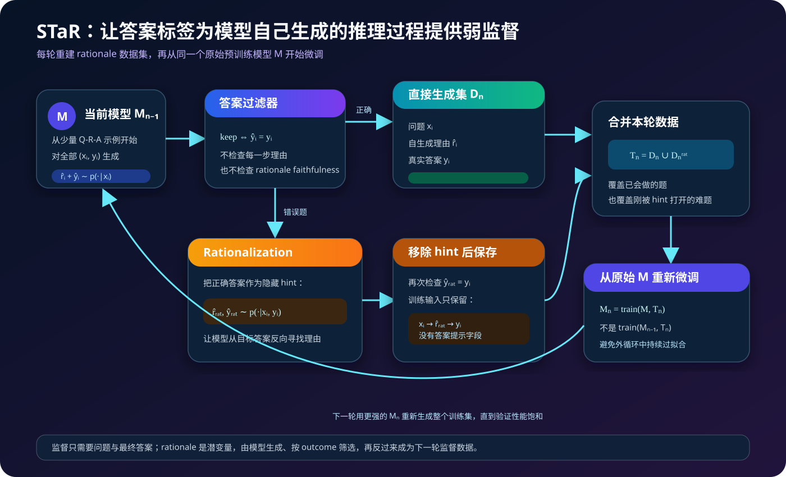
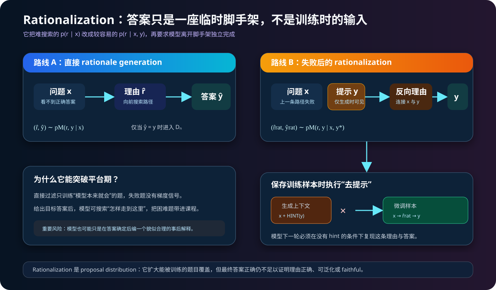
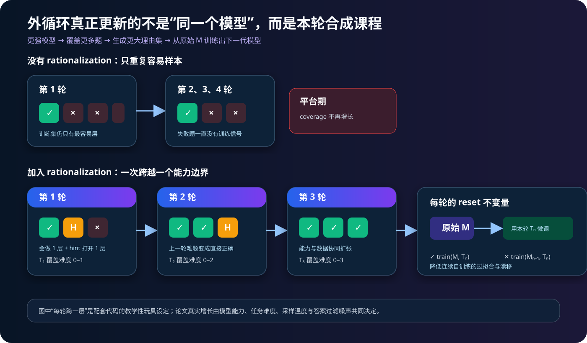
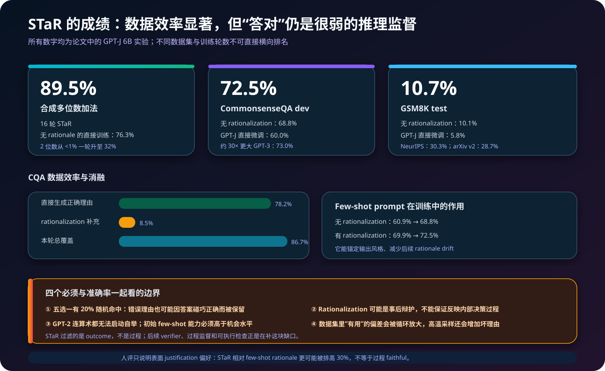

# STaR 原理：让模型用自己的正确推理，反复教会下一代自己


> **论文**：[STaR: Self-Taught Reasoner — Bootstrapping Reasoning With Reasoning](https://arxiv.org/abs/2203.14465)<br>
> **作者**：Eric Zelikman、Yuhuai Wu、Jesse Mu、Noah D. Goodman<br>
> **发表时间**：2022 年 3 月，NeurIPS 2022<br>
> **关键词**：Self-Training、Rationale、Chain-of-Thought、Bootstrapping、Rationalization、Outcome Filtering、Latent Variable、Expert Iteration<br>
> **一手资料**：[NeurIPS 终稿](https://proceedings.neurips.cc/paper_files/paper/2022/file/639a9a172c044fbb64175b5fad42e9a5-Paper-Conference.pdf) · [Google Research 条目](https://research.google/pubs/star-self-taught-reasoner-bootstrapping-reasoning-with-reasoning/) · [作者官方代码](https://github.com/ezelikman/STaR)<br>
> **本文代码**：[STaR 外循环、答案过滤、rationalization 与重置训练最小实现](./code/star_bootstrap_minimal.py)

## 0. 先说结论

STaR 解决的是一个看似矛盾的问题：

> 想让模型学会写推理过程，需要大量“问题—推理—答案”数据；但人工写推理很贵，而当前模型其实已经零散地会做其中一部分题。

它的解法是把模型已有的少量推理能力变成数据生产能力：

```text
少量带 rationale 的 few-shot 示例
  → 模型为整个训练集生成 rationale + answer
  → 只保留最终答案正确的生成
  → 对答错的问题，告诉模型正确答案，让它反向构造 rationale
  → 移除答案提示，把这些 rationale 当成模型独立推出来的训练样本
  → 从原始预训练模型重新微调
  → 用更强的新模型再生成下一轮数据
```

在 GPT-J 6B 上，论文得到：

- 合成多位数加法：16 轮后 **89.5%**，无 rationale 的直接训练为 76.3%；
- CommonsenseQA dev：**72.5%**，接近约 30 倍更大的 GPT-3 直接微调结果 73.0%；
- GSM8K test：**10.7%**，GPT-J 直接答案微调只有 5.8%；
- CQA 上，STaR 最终只靠 10 个左右的初始解释示例，把可用于训练的自生成理由覆盖扩展到训练集的 86.7%。

但 STaR 的监督非常弱：它只检查最终答案，不检查推理过程。

$$
\hat y=y
\centernot\implies
\hat r\text{ 正确、可泛化或忠实}.
$$

五选一问题随机猜中就有 20% 概率；模型也可能先猜答案，再编一段听起来合理的解释。因此，这篇论文同时奠定了两条后续路线：

1. **自生成推理数据**：模型生产轨迹，再用可验证结果筛选；
2. **过程验证**：只看最终结果不够，需要 verifier、过程监督或执行检查。

如果只记一句话：

> **STaR 把“模型偶尔能推对”转化为“模型能生产自己的推理教材”，而 rationalization 则用正确答案作为临时脚手架，把原本学不到的失败题带进教材。**

---

## 1. 论文到底解决什么问题

### 1.1 Chain-of-Thought 有效果，但数据从哪里来

推理模型通常生成：

$$
x\rightarrow r\rightarrow y,
$$

其中 $x$ 是问题，$r$ 是 rationale 或 scratchpad，$y$ 是答案。

2022 年前后已有两种主要路线：

1. 人工或模板构造大量 rationale，再微调模型；
2. 在 prompt 中放少量人工 rationale，只做 few-shot Chain-of-Thought。

第一种昂贵且难扩展到新领域；第二种无需训练，但通常弱于使用完整训练集做微调。

STaR 想利用一种中间状态：

- 有一个带最终答案的大训练集 $D=\{(x_i,y_i)\}$；
- 只有很小的 rationale seed set $P=\{(x_j^p,r_j^p,y_j^p)\}$；
- 预训练模型已经能偶尔生成正确的 rationale；
- 最终答案可以低成本自动检查。

这正是弱监督最擅长的场景：标签只验证结果，模型自己补齐潜在过程。

### 1.2 为什么不是直接微调答案

答案直接微调优化：

$$
\mathcal L_{\text{direct}}
=
-\sum_i\log p_\theta(y_i\mid x_i).
$$

STaR 微调的则是完整的理由与答案：

$$
\mathcal L_{\text{STaR}}
=
-\sum_i\log p_\theta(\hat r_i,y_i\mid x_i).
$$

中间 token 可以：

- 分解计算；
- 保存中间变量；
- 把世界知识和选项联系起来；
- 延长模型完成任务所能使用的串行计算；
- 给相似问题提供可迁移的结构。

但前提是 $\hat r_i$ 真的包含有用结构，而不是答案标签的文字包装。

---

## 2. STaR 与 CoT、伪标签和 RL 的区别

| 方法 | 训练集提供什么 | 模型生成什么 | 过滤/奖励 | 是否更新参数 |
|---|---|---|---|---|
| Few-shot CoT | 少量问题、理由、答案 | 新题理由与答案 | 无 | 否 |
| 答案直接微调 | 大量问题与答案 | 答案 | ground truth token | 是 |
| 普通 pseudo-labeling | 未标注输入 | 伪标签 | 置信度等 | 是 |
| STaR | 大量问题与真实答案，少量理由 | 自生成理由与答案 | 最终答案 exact match | 是，反复重训 |
| Policy gradient | 环境与奖励 | 动作轨迹 | 标量 reward | 是，梯度估计 |

STaR 不是简单伪标签：$y_i$ 不是模型猜的伪标签，而是数据集已有的真实答案；模型补的是未观测的 rationale $r_i$。

它也不是工程实现上的 RL：论文实际使用普通生成、过滤和监督微调。但作者证明它可以视为一种近似 policy-gradient 更新，后文会推导。

---

## 3. 完整算法总览



记原始预训练模型为 $M$，第 $n$ 轮用于生成的模型为 $M_{n-1}$。

每个 outer loop 包含：

1. 用 $M_{n-1}$ 对所有训练题生成 rationale 和答案；
2. 直接保留答案正确的生成；
3. 对直接生成答错的题做 rationalization；
4. rationalization 仍答对才保留；
5. 合并两类样本；
6. **从原始 $M$ 开始**，用本轮数据训练出 $M_n$；
7. 重复，直到验证集性能饱和。

直接生成集：

$$
D_n
=
\left\{
(x_i,\hat r_i,y_i)
\mid
\hat y_i=y_i
\right\}.
$$

Rationalization 集：

$$
D_n^{\text{rat}}
=
\left\{
(x_i,\hat r_i^{\text{rat}},y_i)
\mid
\hat y_i\ne y_i,
\hat y_i^{\text{rat}}=y_i
\right\}.
$$

训练更新：

$$
M_n
=
\operatorname{train}
\left(
M,
D_n\cup D_n^{\text{rat}}
\right).
$$

注意不是：

$$
M_n
=
\operatorname{train}
\left(
M_{n-1},
D_n\cup D_n^{\text{rat}}
\right).
$$

论文每轮重新从原始 checkpoint 微调，以减少连续自训练带来的过拟合。

---

## 4. 第一阶段：Rationale generation bootstrapping

### 4.1 从很小的 prompt set 启动

给每道训练题拼接少量示范：

```text
Q: 示例问题 1
A: 示例理由 1。因此答案是 ...

Q: 示例问题 2
A: 示例理由 2。因此答案是 ...

Q: 当前训练问题
A:
```

模型生成：

$$
(\hat r_i,\hat y_i)
\sim p_{M_{n-1}}(r,y\mid x_i,P).
$$

论文实现接近 greedy decoding；官方代码把采样温度设为 0.01，并配合 top-$p=0.9$，本质上是近确定性生成。

### 4.2 只按最终答案过滤

```python
if normalize(predicted_answer) == normalize(gold_answer):
    keep(question, generated_rationale, gold_answer)
```

这种 outcome filtering 的优势是便宜：

- 算术可以字符串/数值比较；
- GSM8K 可提取 `#### answer`；
- CommonsenseQA 可检查选项字母。

它不需要人工阅读每条 rationale，也不需要预先训练 verifier。

### 4.3 为什么自举可能有效

假设初始模型在一部分题上已经能生成有效理由。过滤后，微调会提高这些理由模式的概率：

$$
p_{M_n}(r,y\mid x)
>
p_{M_{n-1}}(r,y\mid x)
$$

对结构相似但更难的题，下一轮可能第一次答对，于是新模式再进入训练集。

这形成正反馈：

$$
\text{更好模型}
\rightarrow
\text{更多正确自生成理由}
\rightarrow
\text{更好的微调数据}
\rightarrow
\text{更好模型}.
$$

---

## 5. 为什么没有 rationalization 会平台

直接过滤存在 selection bias：模型只在自己已经会做的样本上得到训练。

设：

$$
S_n
=
\{i:\hat y_i=y_i\}
$$

为第 $n$ 轮答对集合。若某个难题始终不在 $S_n$，它就永远不会进入训练数据；模型没有任何梯度知道“这道题应该如何推”。

因此简单循环常会变成：

```text
会做的题 → 继续训练会做的题
不会的题 → 丢弃 → 下一轮仍不会
```

这不是训练步数不足，而是失败样本的监督缺失。

---

## 6. Rationalization：给失败题一座临时脚手架



### 6.1 从 $p(r\mid x)$ 改到 $p(r\mid x,y)$

直接理由生成搜索：

$$
\hat r\sim p_M(r\mid x).
$$

对于失败题，STaR 把正确答案放进 prompt：

$$
\hat r^{\text{rat}}
\sim
p_M(r\mid x,y^\star).
$$

知道目标后，模型可以反问：

- 哪条常识能把问题连接到这个选项？
- 哪组算式能得到这个数？
- 哪些中间步骤与答案一致？

这像从终点反向找路，搜索空间通常更容易。

### 6.2 Hint 只能用于生成

假设生成时 prompt 是：

```text
Q: Where do you put grapes before checking out?
Choices: ... grocery cart (CORRECT) ...
A:
```

模型生成理由后，保存的训练样本必须变成：

```text
Q: Where do you put grapes before checking out?
A: Grocery items are held in a grocery cart before checkout.
Therefore the answer is grocery cart.
```

如果训练时保留 `(CORRECT)`，模型只会学会复制答案提示，不能独立推理。

### 6.3 它是 proposal distribution

论文把 rationalization 理解为 off-policy proposal：

- 目标分布仍是无提示的 $p(r,y\mid x)$；
- 但困难 rationale 从更容易采样的 $p(r,y\mid x,y^\star)$ 获取；
- 去掉 hint 后，把生成样本作为无提示监督。

这类似 importance sampling 的直觉，但论文没有做显式 importance weight 修正，因此是有偏近似。

### 6.4 为什么也危险

知道答案再写理由，可能得到真正的反向推导，也可能得到 post-hoc rationalization：

```text
先确定答案 → 再挑选能支持它的说法 → 写成连贯解释
```

所以 rationalization 同时是：

- 突破自训练平台的关键；
- 事后辩护、确认偏误和 rationale 不忠实的主要风险源。

---

## 7. 数据与能力怎样逐轮演化



STaR 每轮重建当前训练集，而不是简单把所有历史文本永久堆在一起：

```text
第 n 轮模型 Mₙ₋₁
  → 对全部 D 重新生成
  → 构造本轮 Tₙ
  → 从原始 M 训练 Mₙ
```

更强的模型会把上一轮靠 rationalization 才生成的题，变成这一轮可直接生成的题；空出来的 rationalization 能力再覆盖更难样本。

配套图和代码用“一轮跨一层难度”的玩具设定展示这一过程。真实论文没有离散难度层，增长是否发生取决于：

- 初始模型 few-shot 能力；
- 数据集答案的可验证性；
- 生成温度；
- prompt 是否稳定；
- 任务随机猜中率；
- 错误理由被过滤器误收的比例。

---

## 8. 潜变量与近似 policy gradient 解释

### 8.1 把 rationale 看成潜变量

最终答案概率可以写成：

$$
p_M(y\mid x)
=
\sum_r
p_M(r\mid x)
p_M(y\mid x,r).
$$

训练数据只给 $x,y$，$r$ 没有观测。STaR 用模型生成的 $\hat r$ 近似这个潜变量。

### 8.2 期望奖励目标

定义答案正确的二元奖励：

$$
R(\hat y,y)
=
\mathbb 1[\hat y=y].
$$

全数据集期望奖励：

$$
J(M;X,Y)
=
\sum_i
\mathbb E_{\hat r_i,\hat y_i\sim p_M(\cdot\mid x_i)}
\left[
\mathbb 1[\hat y_i=y_i]
\right].
$$

使用 log-derivative trick：

$$
\nabla J
=
\sum_i
\mathbb E
\left[
\mathbb 1[\hat y_i=y_i]
\nabla\log p_M(\hat r_i,\hat y_i\mid x_i)
\right].
$$

只有答案正确的轨迹产生梯度，这正对应 STaR 的过滤。

### 8.3 STaR 做了哪些近似

论文指出两点：

1. 用 greedy/低温生成，而不是无偏地从完整策略采样，降低方差但带来探索偏差；
2. 对同一批成功轨迹做多步监督更新，类似某些 policy-gradient 方法的样本复用。

因此，STaR 可以被看成 outcome-reward policy optimization 的简单实现，但它没有 PPO ratio、value model 或显式 advantage。

---

## 9. 为什么每轮从原始模型重训

论文明确使用：

$$
M_n=\operatorname{train}(M,T_n),
$$

而不是连续：

$$
M_n=\operatorname{train}(M_{n-1},T_n).
$$

原因是连续自训练会叠加：

- 早期坏 rationale 的偏差；
- 格式漂移；
- 对已解决简单题的过拟合；
- 模型分布越来越远离预训练 checkpoint；
- 很难判断改进来自新数据还是累计训练步数。

从原始模型重训，相当于把上一代模型当“数据生成器”，而不是把它的所有参数变化无条件继承给下一代。

代价是每轮训练成本更高，也会丢失那些没有被本轮生成数据重新表达的能力。

---

## 10. 实验设置

### 10.1 基础模型

论文使用公开的 GPT-J 6B，因为：

- 权重和微调代码可获得；
- 模型已有非平凡 few-shot rationale 能力；
- 规模仍允许在单个 TPU v3 节点上实验。

关键训练配置：

- Adam；
- 学习率搜索 $10^{-7}$ 到 $10^{-4}$，最终使用 $10^{-6}$；
- 100 步 warmup，此后常数学习率；
- 通常 batch size 为 8 条序列；
- 序列长度 1024，并进行 packing；
- 不使用 weight decay；
- 默认首轮约 40 个微调 step，后续每轮增加约 20%。

官方代码基于 `mesh-transformer-jax`，主要面向 TPU v3-8，并依赖非常旧的 JAX 版本。算法简单不等于原实验栈容易在今天直接运行。

### 10.2 三类任务

| 任务 | 训练规模 | 主要能力 | 答案检查 |
|---|---:|---|---|
| 合成加法 | 50K 问题池，每轮抽 10K | 符号计算、进位 | 精确数字 |
| CommonsenseQA | 9,741 train / 1,221 dev | 常识、多选推理 | 选项字母 |
| GSM8K | 7,473 train / 1,319 test | 自然语言数学、多步计算 | 最终数值 |

合成加法为 1–5 位数分别准备 10 个随机 rationale few-shot 示例；CQA 使用 10 个修改后的 CoT 示例作为全部初始解释。

---

## 11. 合成加法：最清楚的 curriculum 现象

### 11.1 Scratchpad 结构

模型不是直接输出 `624 + 259 = 883`，而是从个位向高位生成带 carry 的 scratchpad：

```text
4 + 9 -> 3, carry 1
2 + 5 + 1 -> 8, carry 0
6 + 2 -> 8
answer: 883
```

中间状态使同一加法算法可以迁移到更多位数。

### 11.2 结果

- Few-shot 时，2 位数加法低于 1%，更多位数接近 0；
- 加入 rationalization 后，只经过一轮，2 位数加法升到 **32%**；
- 16 轮后，1–5 位总体准确率达到 **89.5%**；
- 使用 10K 样本、训练 5,000 步但不生成 rationale 的 baseline 为 **76.3%**。

没有 rationalization 时，能力呈台阶式推进：通常先学好 $n-1$ 位，才开始改善 $n$ 位。加入 rationalization 后，可以同时从多个位数的正确答案反向生成 scratchpad，进步更快。

### 11.3 分布外位数

作者在第 20 轮前后把更长位数加入训练，同时保持每轮样本总数固定。模型对训练未见的 9、10 位加法也能解决一部分，说明学到的不完全是答案记忆。

但新位数加入后训练变得不稳定，论文没有确定原因。

---

## 12. CommonsenseQA：最亮眼，也最容易误筛



### 12.1 主要结果

| 方法 | CQA dev accuracy | 使用训练题比例 |
|---|---:|---:|
| Few-shot Direct GPT-J | 20.9% | 约 0 |
| Few-shot CoT GPT-J | 36.6% | 约 0 |
| Few-shot CoT LaMDA 137B | 55.6% | 约 0 |
| GPT-J Direct Finetuned | 60.0% | 100% |
| STaR，无 rationalization | 68.8% | 69.7% |
| **STaR，有 rationalization** | **72.5%** | **86.7%** |
| GPT-3 Direct Finetuned | 73.0% | 100% |

最终 86.7% 的训练覆盖由：

- 78.2% 直接 rationale generation；
- 8.5% rationalization；

组成。

论文所谓“接近 30× 更大模型”，是 6B GPT-J STaR 的 72.5% 与约 175B GPT-3 直接微调的 73.0% 相比。它不是说训练/推理 FLOPs 降低了 30 倍，也不是跨任务全面等价。

### 12.2 高随机命中率为什么危险

CQA 是五选一：

$$
P(\text{随机答对})=20\%.
$$

简单语义相似度启发式甚至能达到约 30%。这意味着：

```text
错误/无关 rationale + 碰巧答对选项
```

会被 STaR 无条件收入训练集。

### 12.3 Prompt 也在充当风格锚点

训练或采样中保留 few-shot prompt 的消融结果：

- 无 rationalization：60.9% → 68.8%；
- 有 rationalization：69.9% → 72.5%。

它不仅提供任务示例，也抑制后续 rationale 越来越偏离初始格式的 drift。

---

## 13. GSM8K：提高近一倍，但绝对值仍低

| 方法 | GSM8K test accuracy | 使用训练题比例 |
|---|---:|---:|
| Few-shot Direct GPT-J | 3.0% | 约 0 |
| Few-shot CoT GPT-J | 3.1% | 约 0 |
| GPT-J Direct Finetuned | 5.8% | 100% |
| STaR，无 rationalization | 10.1% | 25.0% |
| **STaR，有 rationalization** | **10.7%** | 见版本说明 |

这里 rationalization 只从 10.1% 提高到 10.7%，明显弱于 CQA。

版本差异需要单独说明：

- arXiv v2 Table 2：训练题覆盖 **28.7%**，其中 rationalization 为 0.5%；
- NeurIPS 终稿 Table 2：训练题覆盖 **30.3%**，其中 rationalization 为 1.2%。

准确率在两版中都为 10.7%。本文不把这两个覆盖率混成一个数。

训练过程很长：无 rationalization 运行 36 轮，再加入 rationalization 运行 12 轮；在第 30 轮后把训练步数封顶在 7,912，避免继续指数增长。

模型生成的计算步骤数与人工解答在约 53%–57% 样本上一致。不同的时候，模型通常更短：有时是漏步，有时确实找到了更简洁的解法。

---

## 14. 人类评价与 failure cases

### 14.1 人评测的是 justification 偏好

作者选取 few-shot CoT 和 STaR 都答对的 50 道题，并加入人工 rationale；20 名 Prolific 参与者各看随机 10 题，排序哪段解释更能支持答案。

- STaR rationale 相对 few-shot rationale **更可能被排高 30%**，$p=.039$；
- STaR rationale 相对 crowdsourced human rationale **更可能被偏好 74%**，$p<.001$。

这两个百分数不是简单胜率。论文也明确说，结果不代表达到人类推理水平，而更多说明高质量众包解释很难获取。

### 14.2 常见失败类型

论文观察到：

- 只说与题目相关的话，却没有论证答案；
- 把“问题暗示答案”当成理由；
- 用特定个体的虚构经历替代一般常识；
- 结论正确但中间逻辑有 fallacy；
- 表面连贯，实质是循环论证。

例如：

```text
“城堡让国王安全，因为国王在城堡里感到安全。”
```

语句流畅，却没有提供可泛化的因果依据。

---

## 15. 为什么“提高温度，多采几次”不是等价替代

一个直观替代是：对失败题不提供答案，而是提高温度、多采样，直到碰到正确答案。

论文发现温度 0.5 或 0.7 反而更差，原因包括：

- 更容易出现坏理由但答案碰巧正确；
- 算术 scratchpad 会逐渐变得无意义；
- 用错误过程微调会损害泛化；
- 生成 10 条序列约慢 10 倍。

Rationalization 的优势是直接改变搜索条件：

$$
p(r\mid x)
\rightarrow
p(r\mid x,y^\star),
$$

而不是盲目扩大原分布的采样预算。

这不意味着现代 best-of-$N$ 无用；如果配有过程 verifier、执行器或 majority vote，多样采样可以更可靠。论文自己的无答案 majority-vote 消融仍显著弱于使用真实答案。

---

## 16. 最小代码：把 STaR 的不变量变成断言

完整脚本见 [star_bootstrap_minimal.py](./code/star_bootstrap_minimal.py)。它只使用 Python 标准库，不下载模型。

### 16.1 直接生成与答案过滤

```python
for problem in problems:
    generation = model.generate(problem)
    if answer_matches(generation.answer, problem.answer):
        kept.append(to_training_example(problem, generation))
    else:
        failed.append(problem)
```

这对应：

$$
D_n=\{(x_i,\hat r_i,y_i):\hat y_i=y_i\}.
$$

### 16.2 只对失败题 rationalize

```python
for problem in failed:
    generation = model.generate(
        problem,
        answer_hint=problem.answer,
    )
    if answer_matches(generation.answer, problem.answer):
        example = to_training_example(problem, generation)
        assert "HINT:" not in example.serialized()
        kept.append(example)
```

`answer_hint` 属于 generation context，但 `TrainingExample` 没有 hint 字段。

### 16.3 每轮从同一个 base model 训练

```python
for iteration in range(outer_loops):
    data = collect_iteration(model, problems, ...)

    # 关键：传 base_model，不传上一轮 model
    model = finetune_fresh_from_base(base_model, data)
```

### 16.4 运行结果

```text
== STaR without rationalization: plateau ==
iter | forward | rationalized | dataset | mastered
   1 |       1 |            0 |       1 |        0
   2 |       1 |            0 |       1 |        0
   3 |       1 |            0 |       1 |        0

== STaR with rationalization ==
   1 |       1 |            1 |       2 |        1
   2 |       2 |            1 |       3 |        2
   3 |       3 |            1 |       4 |        3
   4 |       4 |            1 |       5 |        4
```

这只是教学模型，不是准确率实验。它把“失败题无梯度”和“hint 打开下一层课程”做成确定性状态演化。

### 16.5 最终答案过滤的盲点

脚本还构造一条幸运猜测：

```python
lucky_guess = Generation(
    rationale="The answer is correct because the answer must be correct.",
    answer=problem.answer,
)

assert answer_matches(lucky_guess.answer, problem.answer)
```

运行输出：

```text
answer filter accepts lucky guess: True
rationale contains the worked reasoning: False
```

这正是 outcome supervision 的核心缺口。

运行：

```bash
python3 papers/to-2026/code/star_bootstrap_minimal.py
```

---

## 17. Correctness、usefulness 与 faithfulness 是三件事

### 17.1 Answer correctness

$$
\hat y=y.
$$

这是 STaR 真正检查的唯一条件。

### 17.2 Rationale correctness / usefulness

理由中的每一步是否成立，能否帮助得到答案，是否能迁移到相似题。

STaR 假设“导致正确答案的理由平均更好”，但不逐步验证。

### 17.3 Rationale faithfulness

文字理由是否真实反映模型内部导致预测的计算过程。

即使理由逻辑正确，也可能不 faithful：模型可能先在隐藏表示中选中答案，再生成一个独立的合理解释。

因此：

$$
\text{correct answer}
\not\Rightarrow
\text{correct rationale}
\not\Rightarrow
\text{faithful rationale}.
$$

STaR 提升答案准确率，不能被自动解读成模型解释性提升。

---

## 18. 启动门槛、随机命中与偏差放大

### 18.1 自举必须有非零种子能力

如果初始模型完全不会生成正确 rationale：

$$
D_1=\varnothing,
$$

就没有数据可训练。论文发现 GPT-2 即使在算术任务上也无法从 few-shot reasoning 启动 STaR。

这意味着 Self-Taught 不等于 from scratch：它依赖预训练模型已有的推理先验。

### 18.2 机会水平越高，过滤器越脏

二分类任务随机命中 50%，五选一为 20%，精确大整数答案则接近 0%。

因此同一个答案过滤器在不同任务上的 precision 完全不同：

$$
P(\text{理由好}\mid\hat y=y)
$$

会随答案空间大小和捷径强度变化。

### 18.3 数据集偏差会被作为“有效策略”扩增

STaR 的目标是放大能在 benchmark 上答对的理由。若性别、地域或标注伪相关能帮助选中答案，它们也会被保留、微调、再生成。

Rationalization 甚至可能把模型自然不会选择的偏置答案，从参数中“拉出”一套理由。

所以自训练循环需要独立的偏差和安全评估，而不是只看准确率单调上升。

---

## 19. 与 Training Verifiers、过程监督和现代 RLVR 的关系

STaR 与 [Training Verifiers](./53_Training_Verifiers_2021_原理.md) 共享一个基本结构：

```text
生成多步轨迹 → 用可验证结果判断 → 利用成功轨迹
```

但利用方式不同：

| 方法 | 训练生成器吗 | 监督粒度 | 测试时多采样 |
|---|---|---|---|
| Training Verifiers | generator 先微调，重点训练 verifier | 最终答案 outcome | 是，best-of-100 |
| STaR | 用成功 rationale 反复重训 generator | 最终答案 outcome | 主方法近 greedy |
| Process supervision | 训练过程 verifier / PRM | 中间步骤 | 可选 |
| RLVR | 用可验证 reward 做 RL | 通常终态，也可加过程奖励 | 可选 |

STaR 已经包含现代 reasoning self-training 的四个原子：

1. rollout；
2. executable/verifiable reward；
3. rejection filtering；
4. successful trajectory imitation。

后续方法主要在补：

- 多样采样与搜索；
- 过程奖励；
- 更强 verifier；
- 课程难度分配；
- 在线 RL 而非离线 SFT；
- 防止错误轨迹和 reward hacking。

---

## 20. 复现边界与官方代码

作者[官方仓库](https://github.com/ezelikman/STaR)公开了：

- `iteration_train.py` 外循环；
- arithmetic、CommonsenseQA、GSM8K 数据与 prompt；
- 生成、TFRecord 构造、训练和评测脚本；
- 基于 `mesh-transformer-jax` 的 GPT-J 训练代码。

仓库与算法一一对应：

```text
device_inference.py
  → create_finetune_tfrecords.py
  → device_train.py --tune-model-path=<original base>
  → device_inference.py
```

但复现仍有现实障碍：

- 代码面向 GCP TPU VM 与 TPU v3-8；
- v1 GPT-J 路径要求 JAX 0.2.12 / jaxlib 0.1.68；
- 默认配置含原作者的云存储 bucket 占位；
- 网页 README 大部分继承自底层 GPT-J 工程；
- 无一键现代 GPU / Transformers 版本；
- 外循环成本包含多轮全训练集生成和重新微调。

因此配套代码选择验证算法不变量，而不是伪装成能在 CPU 上复现 6B 结果。

---

## 21. 现代实现时应该怎样升级

### 21.1 使用多个 rollout，但要验证过程

对每题采样 $K$ 条理由可以提高覆盖，但不要只按答案过滤。可加入：

- 算式执行器；
- 单元测试；
- theorem prover；
- 过程 reward model；
- 跨样本一致性；
- 独立 critique model。

### 21.2 区分数据选择与模型更新

记录每条轨迹的：

```text
problem_id
model_checkpoint
prompt_version
sampling_seed / temperature
generated_rationale
generated_answer
answer_reward
process_checks
source = forward | rationalized
```

这样才能定位性能变化来自更好生成、更宽覆盖还是更宽松过滤。

### 21.3 保留失败轨迹做诊断

STaR 训练时丢弃失败轨迹，但评估系统应保留并分类：

- 理由对、计算错；
- 理由错、答案碰巧对；
- hint 无法连接到问题；
- parser 错；
- 数据答案有误；
- 多解题被 exact match 误杀。

### 21.4 监控每轮分布漂移

除了准确率，还要画：

- forward coverage；
- rationalization coverage；
- rationale 长度和格式；
- 重复率；
- 过程验证通过率；
- 按难度分桶的新增成功样本；
- 从原始模型重训与连续训练的差异。

---

## 22. 复现实验清单

### 数据

- [ ] 问题、最终答案与 rationale seed 分开存储；
- [ ] train/dev/test 严格隔离；
- [ ] 明确答案规范化和 parser；
- [ ] 报告随机命中率；
- [ ] 检查多解、歧义与错误标签；
- [ ] 固定 prompt 版本。

### 生成

- [ ] 记录 checkpoint、温度、top-$p$、seed 和最大长度；
- [ ] 区分 forward generation 与 rationalization；
- [ ] rationalization 只处理直接失败题；
- [ ] 保存提示前后的序列，验证 hint 确实被去除；
- [ ] 报告 invalid / unparsable rate；
- [ ] 不把多样采样结果混写成 greedy 结果。

### 过滤

- [ ] 单独报告 answer-match precision；
- [ ] 对随机正确的任务估计污染率；
- [ ] 加入计算、代码或逻辑过程检查；
- [ ] 抽样人工审计正确答案下的错误理由；
- [ ] 不把 outcome correctness 称为 rationale correctness；
- [ ] 保留被拒轨迹用于 error analysis。

### 外循环训练

- [ ] 明确每轮从原始模型还是上一轮继续；
- [ ] 明确训练数据是重建、累积还是混合；
- [ ] 报告每轮训练样本数和来源比例；
- [ ] 控制累计训练 token，避免不公平比较；
- [ ] 监控 prompt/style drift；
- [ ] 用独立 dev set 选择停止轮次。

### 结果与安全

- [ ] 与 few-shot CoT、direct SFT、普通 self-training 比较；
- [ ] 同时报绝对准确率与训练数据覆盖；
- [ ] 报告按难度的增量；
- [ ] 检查 rationale correctness 与 faithfulness；
- [ ] 检查数据集偏差是否被循环放大；
- [ ] 报告多轮生成和重训的总计算成本。

---

## 23. 常见误解

### 误解 1：STaR 不需要任何 rationale 数据

不是。它从一个很小的带 rationale prompt set 启动，然后扩展到大数据集。

### 误解 2：模型自己发明训练答案

不是。训练集已有真实最终答案；模型生成的是未标注的 rationale。

### 误解 3：答对说明推理也对

不对。STaR 最大的局限就是 outcome filter 会保留幸运猜测和错误理由。

### 误解 4：Rationalization 的答案提示会保留到训练输入

不会。提示只在生成理由时可见，保存微调样本时移除。

### 误解 5：每轮在上一轮模型上继续微调

论文主算法不是。每轮用当前模型生成数据，再从同一个原始预训练模型重新训练。

### 误解 6：STaR 是 PPO

不是。实现是生成、过滤和 SFT；只是可以近似解释为 outcome-reward policy gradient。

### 误解 7：72.5% 说明 6B 全面等价 175B

不是。它只是在 CQA dev 的特定协议下接近 GPT-3 direct finetuning。

### 误解 8：Rationalization 在所有任务上都显著有效

不是。CQA 从 68.8% 到 72.5%，GSM8K 只从 10.1% 到 10.7%。

### 误解 9：提高温度多采样一定更好

论文中温度 0.5/0.7 带来更多答案正确但理由错误的样本，表现更差。

### 误解 10：STaR 能从完全不会推理的小模型启动

不能保证。论文中的 GPT-2 连算术自举也没有成功。

### 误解 11：人评结果证明 rationale faithful

没有。人评只比较哪段文字更能支持答案，不能观察模型内部决策过程。

### 误解 12：GSM8K 训练覆盖只有一个官方数字

不是。arXiv v2 为 28.7%，NeurIPS 终稿为 30.3%；准确率都为 10.7%。

---

## 24. 一页纸记忆

1. STaR 的输入是大量问题—答案对，以及很小的 rationale prompt set。
2. 基础模型是 GPT-J 6B。
3. 每轮先生成 rationale 和答案。
4. 只保留最终答案正确的生成。
5. 答案正确不保证 rationale 正确。
6. 直接过滤会只训练模型本来就会的题，最终平台。
7. Rationalization 给失败题附上正确答案 hint。
8. 它把 $p(r\mid x)$ 改成更容易搜索的 $p(r\mid x,y)$。
9. 保存训练样本时必须移除 hint。
10. Rationalization 样本仍需检查最终答案。
11. 每轮数据为直接正确集与 rationalization 集的并集。
12. 每个 outer loop 都从原始预训练模型重新微调。
13. STaR 实现是过滤式 SFT，不是 PPO。
14. 它可近似解释为只有正确轨迹产生梯度的 policy gradient。
15. 合成加法 16 轮达到 89.5%，直接训练为 76.3%。
16. Rationalization 让 2 位加法一轮从低于 1% 升到 32%。
17. CQA 从 GPT-J direct SFT 的 60.0% 提升到 72.5%。
18. CQA 无 rationalization 为 68.8%。
19. 72.5% 接近约 30× 更大 GPT-3 的 73.0%。
20. GSM8K 从 direct SFT 5.8% 提升到 10.7%。
21. GSM8K rationalization 的额外增益只有 0.6 个百分点。
22. CQA 五选一的 20% 随机命中会污染 rationale 数据。
23. 高温采样在论文中增加坏理由并损害泛化。
24. 初始模型必须已有高于机会水平的推理能力。
25. Rationalization 可能生成事后辩护，不保证 faithfulness。

如果只记一句话：

> **STaR 用真实答案筛选模型自生成的潜在推理，再让正确答案为失败题搭一座会被拆掉的脚手架；它开创了自生成推理数据，也暴露了仅靠结果监督无法保证过程可信的问题。**

---

## 参考资料与延伸阅读

### 一手资料

- [STaR arXiv v2](https://arxiv.org/abs/2203.14465)
- [STaR NeurIPS 2022 终稿](https://proceedings.neurips.cc/paper_files/paper/2022/file/639a9a172c044fbb64175b5fad42e9a5-Paper-Conference.pdf)
- [Google Research 论文条目](https://research.google/pubs/star-self-taught-reasoner-bootstrapping-reasoning-with-reasoning/)
- [作者官方 STaR 代码仓库](https://github.com/ezelikman/STaR)

### 本仓库相关论文

- Few-shot rationale 起点：[Chain-of-Thought 原理](./11_Chain_of_Thought_2022_原理.md)
- 生成后投票：[Self-Consistency 原理](./18_Self_Consistency_2022_原理.md)
- Outcome verifier：[Training Verifiers 原理](./53_Training_Verifiers_2021_原理.md)
- 从 outcome 到 process：[Let's Verify Step by Step 原理](./25_Lets_Verify_Step_by_Step_2023_原理.md)
- 搜索式多路径推理：[Tree of Thoughts 原理](./26_Tree_of_Thoughts_2023_原理.md)
- RL 与自生成推理数据：[DeepSeek-R1 原理](./30_DeepSeek_R1_2025_原理.md)

> 本文封面由生成式图像工具制作；四张技术 SVG 根据论文正文、附录和官方代码重新绘制，并非论文原图。配套代码用确定性玩具模型演示 STaR 的数据流和失败模式，不包含 GPT-J 权重，也不声称复现论文准确率。
