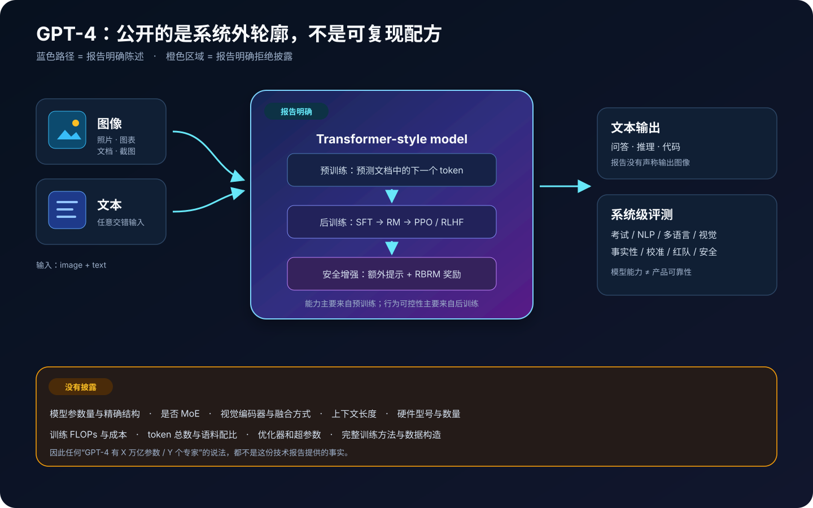
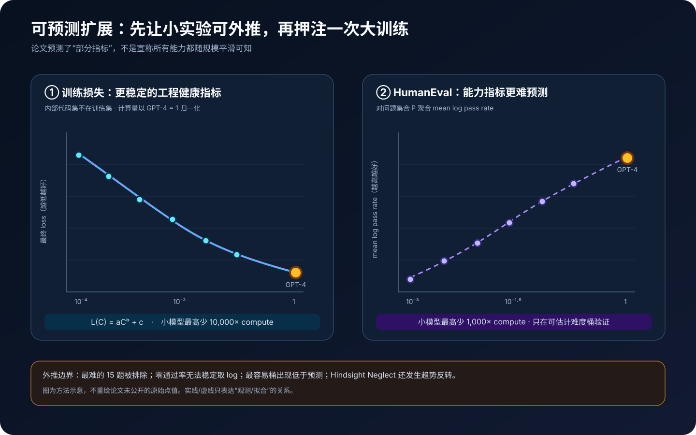
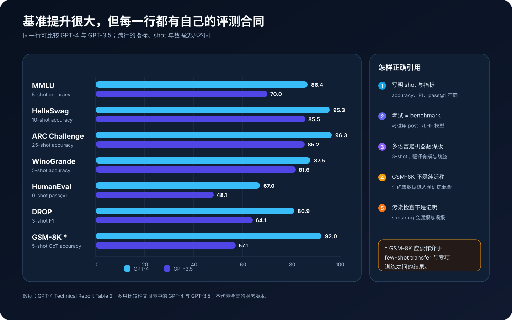
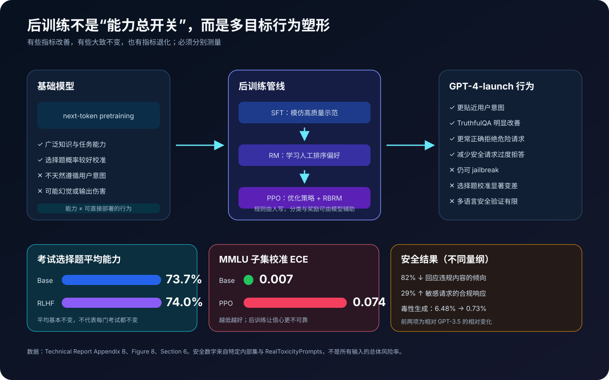

# GPT-4 技术报告详解：多模态、可预测扩展，以及一份“没有公开架构”的论文该怎样读


> **论文**：*GPT-4 Technical Report*<br>
> **作者**：OpenAI<br>
> **首次公开**：2023 年 3 月<br>
> **本文依据**：[arXiv 页面](https://arxiv.org/abs/2303.08774) · [2023 年 v4 PDF](https://arxiv.org/pdf/2303.08774v4) · [OpenAI GPT-4 发布页](https://openai.com/index/gpt-4-research/)<br>
> **关键词**：Multimodal Transformer、Next-token Prediction、Predictable Scaling、RLHF、RBRM、Calibration、Red Teaming<br>
> **配套代码**：[gpt4_scaling_eval_minimal.py](code/gpt4_scaling_eval_minimal.py)<br>
> **前置阅读**：[Transformer](00_Transformer_2017_原理.md) · [GPT-3](05_GPT3_2020_原理.md) · [Scaling Laws](06_Scaling_Laws_2020_原理.md) · [InstructGPT](10_InstructGPT_2022_原理.md) · [Codex / HumanEval](52_Codex_HumanEval_2021_原理.md)

> [!IMPORTANT]
> 本文讲的是 **2023 年 GPT-4 Technical Report**，不是后来的 GPT-4 Turbo、GPT-4V 产品更新，更不是 GPT-4o。报告明确没有公开模型大小、精确架构、硬件、训练计算量、数据集构造和完整训练方法。文中的 Transformer、RLHF 与多模态接口公式，凡超出报告原文之处都会标成**教学抽象**，不能用来反推 GPT-4 私有实现。

这份报告最不寻常的地方，是标题里的 `Technical` 很容易让人期待一份“搭积木说明书”，正文却主动划出了一条极窄的披露边界。它告诉我们 GPT-4 是什么类型的系统、在什么评测上表现怎样、怎样用小实验预测部分大模型指标、上线前做了哪些安全工作；但它没有告诉我们怎样重新造出 GPT-4。

因此，正确的阅读问题不是：

> GPT-4 究竟有多少层、多少参数、多少个专家？

而是：

> 当核心模型仍是黑箱时，这份报告提供了哪些可验证证据？这些证据能支持多强的结论？

---

## 0. 先说结论

读完本文，至少应记住下面十二点：

1. **GPT-4 是大规模多模态模型**：可以接受任意交错的图像与文本输入，生成文本输出。报告没有声称 GPT-4 可以直接生成图像。
2. **公开的架构信息只有“Transformer-style”这一层**。参数量、层数、隐藏维度、注意力变体、是否 MoE、视觉编码器与融合方式都没有披露。
3. **基础训练目标仍是预测文档中的下一个 token**。能力提升主要来自预训练；RLHF 更主要地改变指令遵循、事实性与安全边界。
4. **“可预测扩展”是报告最有方法论价值的技术贡献**。OpenAI 用小模型拟合带不可约项的幂律，准确预测了最终内部代码集 loss。
5. **损失可预测不等于所有能力可预测**。HumanEval 预测只在能稳定估计通过率的题目子集和难度桶上验证，最难 15 题被排除，最容易桶还出现低于预测。
6. **“律师考试前 10%”有严格语境**：模拟 Uniform Bar Exam，得分 `298/400`，使用特定 prompt、采样、评分和污染检查；它不是律师执业能力认证。
7. **基准分数必须带协议引用**：MMLU `86.4%` 是 5-shot，HumanEval `67.0%` 是 0-shot pass@1，GSM-8K `92.0%` 是 5-shot CoT，不能只横向看三个数字。
8. **GSM-8K 不是纯 few-shot 迁移证据**。它的训练集数据被混进预训练语料，报告自己建议把结果理解为介于 few-shot transfer 与专项训练之间。
9. **多语言 MMLU 是机器翻译后的 3-shot 评测**。它证明能力能跨语言迁移，但不等于原生、文化等价的 26 语种综合测试。
10. **后训练不是所有指标一起变好**。考试选择题平均分从 base 的 `73.7%` 到 RLHF 的 `74.0%`，几乎不变；但 MMLU 子集的 ECE 从 `0.007` 恶化到 `0.074`，说明校准显著受损。
11. **安全不是一次 RLHF 就结束**。报告组合了数据过滤、SFT、RM、PPO、规则奖励模型、50 多位领域专家红队、内容分类器、监控与使用政策。
12. **GPT-4 仍会幻觉、推理失误、接受错误前提和生成有漏洞的代码**。更高平均能力会提高可用性，也可能因为输出更有说服力而放大过度信任。

整篇报告可以概括为一条主线：

$$
\underbrace{\text{可扩展基础设施}+\text{小规模实验}}
_{\text{预测部分训练结果}}
\longrightarrow
\underbrace{\text{多模态基础模型}}
_{\text{能力主要来自预训练}}
\longrightarrow
\underbrace{\text{RLHF}+\text{安全管线}}
_{\text{塑造可部署行为}}
\longrightarrow
\underbrace{\text{能力、风险与系统评测}}
_{\text{仍不能保证可靠}}.
$$

---

## 1. 这份报告究竟公开了什么



报告第 2 节几乎是阅读全文最重要的一节。它明确说，出于竞争环境与大规模模型安全影响的考虑，不进一步披露以下内容：

| 维度 | 报告是否公开 | 能否据此复现 |
|---|---|---|
| 模型类型 | Transformer-style，多模态 | 只能确定家族，不能确定具体网络 |
| 训练目标 | 预测文档中的下一个 token | 能复现一般自回归目标 |
| 输入 / 输出 | 图像与文本输入，文本输出 | 能复现接口抽象 |
| 数据来源 | 公开数据 + 第三方授权数据 | 不能复现语料组成 |
| 后训练 | RLHF；系统卡补充 SFT、RM、PPO、RBRM | 能理解流程，不能复现配方 |
| 参数量 / 层数 / 宽度 | **未公开** | 不能 |
| 是否 MoE / 专家数 | **未公开** | 不能 |
| 视觉编码器 / 融合器 | **未公开** | 不能 |
| 上下文长度 | 技术报告正文**未公开** | 不能从本文确定 |
| 硬件 / 芯片数量 | **未公开** | 不能 |
| 训练 FLOPs / 成本 | **未公开** | 不能 |
| token 总数 / 数据配比 | **未公开** | 不能 |
| 优化器 / 学习率 / batch | **未公开** | 不能 |

这张表能纠正两个常见方向错误。

第一，不能用网上流传的参数量或 MoE 猜测填补报告空白。即使某个猜测来自逆向成本估算，也必须写成外部估计，不能写成“论文架构”。

第二，“未公开”不等于“没有技术内容”。报告把可预测训练、评测协议、污染检查、后训练影响、校准和安全管线暴露到足以讨论方法论的程度，只是它不是一份模型复现论文。

### 1.1 技术报告、模型 checkpoint 与产品不是一回事

至少要分清四个对象：

```text
GPT-4 基础模型
    ↓ RLHF 与安全后训练
论文评测所用的若干 GPT-4 快照
    ↓ API / ChatGPT 系统规则、分类器、监控、工具与界面
2023 年发布产品
    ↓ 后续迭代
GPT-4 Turbo / 更新快照 / 其他后继模型
```

论文附录甚至说明，不同考试部分使用了不同时间的快照：多数 GPT-4 选择题使用 2023 年 3 月 1 日快照，自由回答使用 2 月 23 日的非最终快照，USABO 使用更早的 2022 年 12 月 16 日快照。

所以“论文中的 GPT-4 得分”不是一个会永久绑定到所有后续 API 模型的常数。

### 1.2 100 页不等于 100 页模型方法

当前 arXiv PDF 共 100 页，但主体技术报告只到第 14 页，之后包括作者贡献、参考文献、考试方法附录、多模态示例，以及一份很长的 GPT-4 System Card。

它的重心更接近：

```text
能力证据 + 扩展方法 + 评测审计 + 风险与部署准备
```

而不是：

```text
网络结构 + 训练超参数 + 完整消融 + 开源实现
```

这也解释了为什么阅读时必须把“模型科学”和“系统治理”同时放进视野。

---

## 2. 已知的模型核心：自回归 Transformer

### 2.1 下一 token 预测没有消失

设一份文档被 token 化为：

$$
x=(x_1,x_2,\ldots,x_T).
$$

自回归模型把联合概率分解为：

$$
p_\theta(x)
=
\prod_{t=1}^{T}p_\theta(x_t\mid x_{<t}).
$$

对应的负对数似然为：

$$
\mathcal L_{\text{NLL}}(\theta)
=
-\sum_{t=1}^{T}
\log p_\theta(x_t\mid x_{<t}).
$$

这和 GPT-3 的基本目标没有本质差异。GPT-4 的跃迁不是来自报告中某个新公开 loss，而是更大规模、更强训练系统、多模态输入、数据与后训练共同作用的结果；其中大量具体配方没有公开。

### 2.2 “预测 token”为什么可以做考试、代码和视觉问答

预训练目标看似只要求续写，但不同任务都可以条件化成序列生成：

```text
考试：题目 + 选项 + 少量示例 → 答案字母 / 解释
代码：函数签名 + docstring       → 函数体
视觉：图片 + 问题               → 文本答案
对话：历史消息 + 用户请求        → 助手回复
```

统一写成：

$$
p_\theta(y\mid z)
=
\prod_{t=1}^{|y|}
p_\theta(y_t\mid z,y_{<t}),
$$

其中 $z$ 是题目、示例、系统指令以及图像表示构成的上下文。

但这只解释**输出接口为什么可以统一**，并不能证明图像怎样编码，也不能确定图像 token 与文本 token 在第几层融合。

### 2.3 报告为什么只说 Transformer-style

我们可以安全地说：

- 模型沿用自回归 Transformer 家族；
- 基础模型通过 next-token prediction 训练；
- 输入可以包含图像和文本；
- 输出为文本。

我们不能从报告安全推出：

- 每层都是标准 dense decoder block；
- 使用某一种已知位置编码；
- 使用 MHA、MQA 或 GQA 中的哪一种；
- 使用独立视觉 encoder、cross-attention、projector 或统一 token 化；
- 是 dense 模型还是 MoE；
- 训练上下文和服务上下文相同。

严谨的技术博客应该宁可保留这个空白，也不要画出一张“看起来像源码”的虚构架构图。

---

## 3. 多模态 GPT-4：交错输入，文本输出

### 3.1 任意交错比“上传一张图”更一般

报告的精确定义是：输入可以由任意交错的图像与文本组成。概念上，一次 prompt 可以是：

$$
Z=
\left[
Z_1^{\text{text}},
Z_2^{\text{image}},
Z_3^{\text{text}},
Z_4^{\text{image}},
Z_5^{\text{text}}
\right].
$$

这允许用户先给说明，再给图，再针对局部细节追问，还可以加入第二张图做比较。

报告展示的视觉任务覆盖：

- 带文字和照片的文档；
- 图表与示意图；
- 屏幕截图；
- 多面板图片；
- 需要把视觉证据转成文本解释的问题。

### 3.2 一个只表达接口的教学抽象

下面的伪代码只描述报告公开的输入输出关系：

```python
def gpt4_like_interface(interleaved_prompt):
    sequence = []
    for segment in interleaved_prompt:
        if segment.kind == "text":
            sequence.extend(text_representation(segment.value))
        elif segment.kind == "image":
            sequence.extend(unknown_private_vision_path(segment.value))

    hidden = unknown_transformer_style_model(sequence)
    return autoregressive_text_decode(hidden)
```

`unknown_private_vision_path` 这个名字是故意的：常见多模态模型会使用视觉编码器、投影器、resampler 或 cross-attention，但 GPT-4 报告没有说明是哪一种。

### 3.3 视觉评测公开得并不完整

技术报告正文主要给定性示例，并把一组初步、范围较窄的学术视觉 benchmark 指向发布博客。它没有提供：

- 视觉训练数据规模与配比；
- 输入分辨率与切块方法；
- 图像 token 数量；
- OCR 模块或文档解析器细节；
- 图像增强与视觉后训练配方；
- 足以复现的完整视觉评测设置。

因此，最准确的历史结论是：**GPT-4 把通用语言模型接口扩展到了图像—文本交错条件上，并展示了广泛视觉理解能力；报告没有公开实现路线。**

### 3.4 有图像输入不等于每道题都靠视觉提升

考试表同时给了 `GPT-4` 与 `GPT-4 (no vision)`。有些考试完全相同，有些略有变化，个别项目 no-vision 反而更高。这很正常：

- 很多题目本来就没有图片；
- 自由回答题中的图片被人工客观转写，所以两种条件共用结果；
- 有限样本、采样和快照差异会产生波动；
- 多模态能力不是一个对所有任务恒定增加的标量。

不能把“支持视觉”简化成“所有 benchmark 自动加分”。

---

## 4. 可预测扩展：这份报告最值得复用的方法



### 4.1 为什么大训练前必须学会预测

对普通实验，可以训练失败后改超参数重跑。对前沿模型，一次训练运行可能昂贵到无法做大量同规模试错。

于是问题变成：

> 能否先在多个较小规模上验证数据、优化器、基础设施和缩放规律，再在大训练刚开始时预测最终结果？

这不是单纯画一条漂亮 scaling curve。若小规模和大规模的数值行为不一致，可能意味着：

- 分布式训练出现硬件或通信错误；
- 数值精度在规模扩大后失稳；
- 数据或 batch 规则没有等比例延续；
- 某些优化只在小模型有效；
- loss 实现或记录管线有 bug。

因此，可预测性既是研究目标，也是大规模训练的工程验收信号。

### 4.2 带不可约项的损失幂律

论文拟合：

$$
L(C)=aC^b+c,
$$

其中：

- $C$ 是训练计算量；图中归一化为 GPT-4 的计算量等于 1；
- $a$ 控制可缩减损失的尺度；
- $b<0$ 时，计算量越大，可缩减项越小；
- $c$ 是不可约损失或渐近下界。

为什么要有 $c$？若只拟合 $aC^b$，就隐含了无限计算能让损失趋近 0。真实数据包含固有不确定性、tokenization 限制和分布熵，loss 更可能逼近非零下界。

把 $c$ 固定后可取对数：

$$
\log(L-c)=\log a+b\log C.
$$

这变成 log-log 空间中的线性关系。实际拟合还需要估计 $c$、误差与模型选择；配套代码用网格搜索 $c$，只是为了零依赖地演示原理。

### 4.3 论文究竟预测了什么

OpenAI 在一个**不属于训练集的内部代码数据集**上测最终 loss。这样做有三个好处：

1. 数据量大，估计噪声比离散 benchmark 准确率低；
2. 与训练集分离，避免把记忆误当成泛化；
3. loss 是连续指标，比“某题过 / 不过”更容易建立缩放曲线。

他们使用同样方法训练、计算量最高比 GPT-4 少 `10,000×` 的小模型拟合曲线，在 GPT-4 训练开始不久、不使用大训练中途结果的前提下，准确预测最终 loss。

这个结论很强，但范围也很清楚：

> 在同一训练方法族与这个内部代码 loss 上，小规模到 GPT-4 规模的外推高度准确。

它不等于：

> 只看 loss 就能预测 GPT-4 的每一种真实世界能力和风险。

### 4.4 HumanEval：从连续 loss 走向离散能力

HumanEval 的单题 pass rate 记为：

$$
r_p(C)=P(\text{一次采样通过题目 }p\mid C).
$$

论文观察到，对适合分析的题目子集 $P$，可以近似写成：

$$
-\mathbb E_{p\sim P}
\left[\log r_p(C)\right]
=
\alpha^* C^{-k},
$$

其中 $\alpha^*,k>0$。等价地：

$$
\exp\left(
\mathbb E_{p\sim P}[\log r_p(C)]
\right)
=
\exp(-\alpha^*C^{-k}).
$$

左边是各题 pass rate 的**几何平均**。为什么不直接算术平均？取 log 会强烈惩罚非常低的通过率，让“多数简单题很好、少数题完全不会”不容易被平均数遮住。

例如三题通过率为 `0.8, 0.5, 0.2`：

$$
\text{算术平均}=0.5,
$$

$$
\text{几何平均}
=(0.8\times0.5\times0.2)^{1/3}
\approx0.431.
$$

几何平均更能暴露短板，但它也制造了一个统计问题：$\log 0$ 不存在。

### 4.5 为什么零通过率不能拿 epsilon 糊过去

如果小模型采样 $N$ 次一题都没过，只能知道真实通过率可能很低，不能知道是 $10^{-3}$、$10^{-6}$ 还是更低。强行把 0 替换成一个任意 `epsilon`，拟合结果会被这个人为常数决定。

论文因此限制到这样的问题与模型：在很大的采样预算下，每个模型对每道入选题都至少成功一次。

具体做法是：

- 排除最难的 15 道 HumanEval 题；
- 按小模型表现把其他题分成 6 个难度桶；
- 在训练完成前注册 GPT-4 的预测；
- 图中展示第三容易桶，共 23 题；
- 其他五个桶大体也预测准确，但最容易桶中 GPT-4 低于预测。

所以标题式说法“用 1/1000 计算量预测 GPT-4 HumanEval”少了关键限定。完整说法应是：

> 用最高少 `1,000×` 计算量的模型，在可稳定估计的 HumanEval 子集和难度桶上，准确外推 GPT-4 的平均对数通过率；这不覆盖最难题，也并非每个桶完美。

### 4.6 能力曲线甚至会反转

报告还展示了 Hindsight Neglect。较小模型上，能力曾随规模增加而下降，GPT-4 却逆转了趋势。

这提醒我们：

- loss 往往平滑，不代表所有任务指标平滑；
- 平均能力规律不保证单题单调；
- “inverse scaling” 在更大规模可能继续恶化，也可能 U 型反转；
- 若安全能力只在训练后才测，就来不及为部署准备。

可预测扩展的终点不应该只是一条 loss 曲线，而应是**训练前注册多种能力和风险预测，并在目标模型完成后公开误差**。

---

## 5. 预训练与后训练分别做什么

### 5.1 预训练负责能力底座

报告称，GPT-4 使用公开可得数据（例如互联网数据）和从第三方授权的数据，做 next-token 预训练。

这里必须停在事实边界：报告没有给出来源清单、token 数、语言比例、代码比例、图文配比、去重方法、质量分类器和版权处理细节。

从目标层面，基础模型优化的是：

$$
\theta_{\text{base}}
=
\arg\min_\theta
\mathbb E_{x\sim\mathcal D_{\text{pre}}}
\left[
-\sum_t\log p_\theta(x_t\mid x_{<t})
\right].
$$

它让模型获得语言、知识、代码和推理模式，但不会自动让模型知道：

- 应当像助手一样直接回答；
- 何时澄清、拒绝或表达不确定；
- 哪种风格更符合用户意图；
- 哪些危险请求不能提供操作细节。

### 5.2 SFT：先模仿“理想回复”

系统卡补充了后训练流程。人工训练者提供示范 $(x,y^*)$，用监督微调让模型模仿：

$$
\mathcal L_{\text{SFT}}
=
-\sum_t
\log \pi_\theta(y_t^*\mid x,y_{<t}^*).
$$

SFT 把一个会续写多种文风的基础模型，推向更像有用助手的行为分布。

### 5.3 奖励模型：学习人工排序

标注者对同一 prompt 的多个回答排序。一个常见的 Bradley–Terry 教学抽象是：

$$
P(y_w\succ y_l\mid x)
=
\sigma\left(
r_\phi(x,y_w)-r_\phi(x,y_l)
\right),
$$

$$
\mathcal L_{\text{RM}}
=
-\log P(y_w\succ y_l\mid x).
$$

这能让奖励模型近似“平均标注者偏好”。但它不是客观真理函数：标注指南、样本分布、文化背景和遗漏边界都会进入奖励。

### 5.4 PPO：让策略提高奖励

系统卡明确写到使用 PPO。概念上可以理解为：

$$
\max_\theta
\mathbb E_{y\sim\pi_\theta(\cdot\mid x)}
\left[
r_\phi(x,y)
-\beta D_{\mathrm{KL}}
\left(
\pi_\theta\|\pi_{\text{ref}}
\right)
\right].
$$

KL 项限制策略远离参考模型，以降低 reward hacking 和语言退化。GPT-4 报告没有公开 $\beta$、PPO 超参数或训练规模，上式是 RLHF 常见心智模型，不是复现配方。

### 5.5 能力主要来自预训练，行为主要来自后训练

附录 B 在考试的选择题部分比较基础模型与 post-RLHF 模型：

| 模型 | 跨考试选择题平均分 |
|---|---:|
| GPT-4 base | 73.7% |
| GPT-4 post-RLHF | 74.0% |

平均只差 0.3 个百分点。不同考试有升有降，例如 LSAT 上升，SAT Math、AP Microeconomics 等下降，所以不能解释为“RLHF 让每个知识领域都不变”。

更稳妥的结论是：

- 大部分考试解题能力已经存在于基础模型；
- RLHF 没有显著改变这些选择题的平均能力；
- 自由回答无法完全公平比较，因为基础模型不擅长直接服从答题指令；
- 后训练显著影响可用性、事实性、拒答与风格。

---

## 6. RBRM：让规则进入奖励，而不只写进标注手册

### 6.1 普通奖励模型为什么不够

如果人工偏好指南没有覆盖边界情况，RM 可能学出两种相反问题：

- 对危险请求仍然给出帮助；
- 对无害但敏感的话题过度拒答。

例如“如何制造危险物”与“如何在小说里描写警方处理危险物”可能共享大量词汇，却需要不同响应。

### 6.2 规则奖励模型的输入

Rule-Based Reward Model 并不是一个手写 `if keyword then refuse` 系统。系统卡描述的 RBRM 是一组 zero-shot GPT-4 分类器，接收：

1. 原 prompt（可选）；
2. 策略模型的输出；
3. 人写的多项选择式 rubric。

rubric 可以要求分类：

```text
A. 理想风格的拒绝
B. 冗长、闪烁其词或错误理由的拒绝
C. 含违规内容
D. 安全且没有拒绝
```

在危险 prompt 上奖励 A，在已知安全 prompt 上奖励 D。概念上总奖励可写成：

$$
r_{\text{total}}
=
r_{\text{preference}}
+\lambda r_{\text{RBRM}}.
$$

真实系统使用多套 rubric、冲突数据重写与权重优化；报告没有公开完整权重和训练集。

### 6.3 模型辅助安全的优点与循环风险

优点是可扩展：

- 人把规范写成自然语言；
- 模型批量分类回复；
- 分类结果给 PPO 额外奖励；
- 模型还能生成边界 prompt，补充安全与可回答样本。

风险也很直接：

- 分类模型本身会误判；
- rubric 不完整时，错误会被规模化；
- 同一家族模型可能共享盲点；
- 优化可见分类器，不等于消除真实危害；
- jailbreak 仍能绕过学到的边界。

因此 RBRM 是降低人工标注瓶颈的一层工具，不是安全证明。

---

## 7. 论文中的能力结果怎样读



### 7.1 专业与学术考试

论文模拟了律师、研究生入学、大学先修、化学、生物、葡萄酒理论、编程竞赛等考试。部分代表结果如下：

| 考试 | GPT-4 | GPT-3.5 | 正确解读 |
|---|---:|---:|---|
| Uniform Bar Exam | 298/400，约 90th percentile | 213/400，约 10th | 特定模拟与评分协议 |
| LSAT | 163，约 88th | 149，约 40th | 不是法学院实际录取结论 |
| GRE Verbal | 169/170，约 99th | 154/170，约 63rd | 强语言考试表现 |
| GRE Writing | 4/6，约 54th | 4/6，约 54th | 并非所有维度显著提升 |
| AP Calculus BC | 4，约 43rd–59th | 1，约 0th–7th | percentile 是区间估计 |
| AP English Language | 2，约 14th–44th | 2，约 14th–44th | 明显不是全面顶尖 |
| Codeforces rating | 392，低于 5th percentile | 260，低于 5th | 竞赛编程仍很弱 |
| Leetcode hard | 3/45 | 0/45 | 强于 3.5，但远未解决 |

“在多数考试上达到 human-level performance”描述的是分数位置，不等于：

- 能承担该职业的长期责任；
- 能处理开放环境中的事实更新；
- 能识别自己不知道什么；
- 能在真实工作流中稳定、合规地完成任务；
- 具备人类考生的学习过程与社会经验。

### 7.2 考试 prompt 不是简单问一句

选择题使用带金标准解释和答案的 few-shot prompt。模型先以温度 `0.3` 采样解释，再提取答案字母；部分运行再用温度 `0` 从已经生成的解释中采样字母。

自由回答使用简单 instruction prompt，以温度 `0.6` 采样一次。正式作文由 1–2 位有相关评分经验的第三方承包者评分，其他自由回答按官方 rubric 的技术内容评分。

这说明分数至少依赖：

$$
\text{score}
=f(
\text{model snapshot},
\text{prompt},
\text{shots},
\text{temperature},
\text{vision handling},
\text{grader},
\text{scoring map}
).
$$

离开这份“评测合同”，单独引用 percentile 会夸大结论的普适性。

### 7.3 传统 NLP 与代码 benchmark

论文 Table 2 的主要结果为：

| Benchmark | GPT-4 | GPT-3.5 | GPT-4 协议 |
|---|---:|---:|---|
| MMLU | 86.4% | 70.0% | 5-shot accuracy |
| HellaSwag | 95.3% | 85.5% | 10-shot accuracy |
| ARC Challenge | 96.3% | 85.2% | 25-shot accuracy |
| WinoGrande | 87.5% | 81.6% | 5-shot accuracy |
| HumanEval | 67.0% | 48.1% | 0-shot pass@1 |
| DROP | 80.9 | 64.1 | 3-shot F1 |
| GSM-8K | 92.0%* | 57.1% | 5-shot CoT accuracy |

GPT-4 在当时超过了表中所有外部 few-shot LM，并超过多数带 benchmark 专项训练的 SOTA；DROP 的专项系统仍然更高。

但表里的每一行都不完全同质：

- accuracy、F1 与 pass@1 不是一种指标；
- shots 从 0 到 25 不等；
- GSM-8K 使用 chain-of-thought；
- 不同外部 SOTA 有不同专项训练与数据；
- 这些是 2023 年模型与评测状态，不是永久排行榜。

### 7.4 GSM-8K 星号为什么不能删

为了改善数学推理，GPT-4 预训练混合里加入了 MATH 与 GSM-8K 的训练集数据。虽然占总训练预算的比例很小，并且污染检查没有发现 GSM-8K 测试集进入训练集，但训练分布已经被专项数据改变。

论文自己的建议是把 `92.0%` 理解为：

$$
\text{true few-shot transfer}
\quad\longleftrightarrow\quad
\text{benchmark-specific training}
$$

之间的结果。

因此，引用时至少写成“GPT-4 在含 GSM-8K/MATH 训练集混入的预训练和 5-shot CoT 下，GSM-8K 为 92.0%”。

---

## 8. 多语言 MMLU：能力迁移证据，不是完整多语言认证

### 8.1 评测怎样构造

研究者用 Azure Translate 翻译 MMLU 的问题和答案，没有让 GPT-4 自己翻译，以避免模型特别适应自己的译文。

协议与英文主表也不同：

- 使用 3-shot，而不是 5-shot；
- instruction、问题和答案被翻译；
- `Answer:` 与 `A-D` 选项标记保留英文；
- 选择 A-D 中下一个 token 概率最高者；
- 某些语言 token 化更长，这是减少 shots 的原因。

### 8.2 结果为什么重要

GPT-4 英文 3-shot MMLU 为 `85.5%`。意大利语和南非荷兰语为 `84.1%`，西班牙语 `84.0%`，中文普通话 `80.1%`，斯瓦希里语 `78.5%`，威尔士语 `77.5%`。

报告称，26 种语言中有 24 种超过当时已有模型的英文表现。这是很强的跨语言迁移证据：模型不只在英语表面模式上工作。

### 8.3 仍然不能外推什么

机器翻译评测存在双向影响：

- 翻译丢失专业细节，会让分数降低；
- 保留英语专名或答案标记，可能让分数提高；
- 同一道英语题的文化背景未必适合所有语言社群；
- 选择题不能覆盖生成、对话、方言、文化语用和安全；
- 预训练与后训练以英语为主，系统卡承认多语言安全缓解没有被充分验证。

所以它应被称为“翻译版 MMLU 上的多语言能力”，不能简写成“支持 26 种语言且安全等价”。

---

## 9. 用户偏好：70.2% 到底测了什么

报告从 ChatGPT 与 API 提交中选取 `5,214` 个 prompt，对 GPT-4 与 GPT-3.5 各采样一个回答，交给不知道模型身份的标注者，以随机顺序比较“哪个回答更像用户想要的”。

GPT-4 回答在 `70.2%` 的 prompt 上被偏好。

这个结果支持：GPT-4-launch 的综合指令遵循和回答质量显著强于当时 GPT-3.5。

但它不是“总体准确率 70.2%”，因为：

- 比较的是相对偏好，不是逐条事实正确；
- 每个模型只采样一个回答；
- 过滤了违规、敏感、个人信息、过短和过于常见的 prompt；
- 真实流量分布属于特定时间、特定产品；
- 长度、语气与格式都可能影响偏好。

相对偏好可以测可用性，却不能替代事实性、风险和任务成功率。

---

## 10. 评测污染：报告做了检查，也坦白了检查的局限

### 10.1 专业考试的 substring 方法

对每个评测样本，论文：

1. 去掉空格与符号，只保留字母和数字；
2. 随机抽取 3 个长度为 50 字符的子串；
3. 若任一子串出现在处理后的训练样本中，标记为污染；
4. 删除污染题，重新计算 uncontaminated score。

形式化地，令规范化函数为：

$$
g(s)=\text{只保留 }s\text{ 中的字母和数字并规范大小写}.
$$

从 $g(x)$ 采样探针集合 $Q(x)$，则：

$$
\operatorname{contam}(x)
=
\mathbf 1\left[
\exists q\in Q(x),d\in\mathcal D_{\text{train}}:
q\subset g(d)
\right].
$$

### 10.2 为什么它既会漏报，也会误报

假阴性来源：

- 训练文本是改写、OCR 变体或不同排版；
- 恰好没有抽到重合片段；
- 题干相同但表达略有修改；
- 只检查预训练，没有显式检查 RLHF 数据。

假阳性来源：

- 50 字符可能是常见固定模板；
- 检查主要使用问题 / 上下文，忽略答案；
- 一些题还忽略选择项，导致信息不足；
- 规范化删除符号后，不同字符串可能变得更相似。

报告发现总体污染对分数影响很小，但这应读成“按该检测器重算后差异小”，不是“数学证明完全没有污染”。

### 10.3 BIG-bench 被排除是一个好例子

检查发现部分 BIG-bench 意外混入训练集，因此论文没有报告它的结果。

这比在脚注里淡化污染更负责任，也说明 benchmark 数据治理必须在训练前完成：一旦测试集进入训练集，训练结束后很难彻底恢复可信的独立评测。

### 10.4 今天复现更难

GPT-4 报告和各种 benchmark 已在互联网上传播多年。对后续模型，测试题可能通过论文、代码、博客、题解和模型生成数据反复进入语料。

因此现代评测还需要：

- 时间切分的私有保留集；
- 动态生成但可审计的任务；
- 语义近重复检测，而不只 substring；
- 训练数据 provenance；
- benchmark canary；
- 真实部署中的任务成功率与回归集。

---

## 11. 后训练的收益与代价必须分开测



### 11.1 事实性改善不等于消灭幻觉

在九类内部对抗事实性评测上，GPT-4 比最新 GPT-3.5 高 `19` 个百分点。TruthfulQA 中，GPT-4 base 相对 GPT-3.5 base 只略有提升，而 RLHF 版本提升明显。

这说明后训练确实能改变“面对容易诱导错误的提问时选择什么回答”。它不证明模型内部事实表已完全修正，也不保证开放世界引用可靠。

论文仍明确列出：

- 生成看似合理但错误的事实；
- 犯与整体能力不相称的简单推理错误；
- 轻信用户提供的明显错误前提；
- 在代码中引入安全漏洞；
- 不主动复核自己高风险的答案；
- 不从对话经验中持续学习。

### 11.2 校准：更会回答，却更不会表达“自己有多可能正确”

对多项选择题，模型给答案的概率可以当作 confidence。若所有置信度约 `0.8` 的题中恰有约 80% 正确，就称较好校准。

Expected Calibration Error 定义为：

$$
\operatorname{ECE}
=
\sum_{m=1}^{M}
\frac{|B_m|}{n}
\left|
\operatorname{acc}(B_m)
-\operatorname{conf}(B_m)
\right|.
$$

论文在 MMLU 子集上报告：

| 模型阶段 | ECE，越低越好 |
|---|---:|
| Pre-trained GPT-4 | 0.007 |
| Post-trained / PPO GPT-4 | 0.074 |

基础模型几乎贴合理想校准线，后训练后 ECE 增大约十倍。

原因可能包括：偏好优化奖励确定、自信、直接的回复，却没有同步奖励概率与真实正确率匹配。报告展示的是现象，并没有给出完整因果消融，所以这里应当写成可能机制，而不是已证明原因。

### 11.3 高风险系统不能只用自然语言“我不确定”

如果 post-training 破坏 token 概率校准，仅要求模型生成“我有 90% 信心”未必可靠。更稳健的工程做法包括：

- 在保留集上重新校准分类概率；
- 用独立 verifier 或检索证据检查答案；
- 监测不同任务与人群切片的 calibration drift；
- 高风险结论必须人工复核；
- 设计 abstention 阈值，并单独测 coverage–risk 曲线。

能力、事实性、偏好胜率、拒答正确率和校准是不同坐标，不能压成一个“模型更好了”的总分。

---

## 12. 系统卡：安全为何必须从模型扩展到部署系统

### 12.1 GPT-4-early 与 GPT-4-launch

系统卡主要比较两个经过指令微调的版本：

- `GPT-4-early`：安全缓解较少，用来暴露潜在风险；
- `GPT-4-launch`：加入更多 helpfulness / harmlessness 微调与系统缓解。

它没有把 base model 当作主要红队对象，因为基础模型对领域专家来说很难稳定操控，不利于表面化感兴趣的行为。

GPT-4 在 2022 年 8 月完成训练，此后约半年用于评测、红队和迭代缓解。这提醒我们：**训练完成不是系统准备完成。**

### 12.2 风险面不只有“有害内容”

系统卡评估的类别包括：

- 幻觉；
- 有害内容；
- 表征、资源分配与服务质量伤害；
- 虚假信息与影响行动；
- 常规与非常规武器扩散；
- 隐私；
- 网络安全；
- 潜在危险涌现行为；
- 与其他系统交互；
- 经济影响；
- 技术发展加速；
- 过度依赖。

这些类别并不互斥。例如更有说服力的幻觉同时涉及错误信息与过度依赖；某些语言的低服务质量也可能变成资源分配伤害。

### 12.3 50 多位专家红队的价值与偏差

OpenAI 邀请 50 多位专家，覆盖网络安全、生物风险、国际安全、长期对齐、法律、教育、医疗、经济、公平与信任安全等领域。

领域专家能发现普通 benchmark 看不到的问题，但系统卡也承认参与者偏向：

- 高教育和行业经验背景；
- 英语国家，尤其美国、加拿大和英国；
- 学界与 AI 公司当前最关注的风险框架。

因此红队结果是高价值的定向发现机制，不是对全球文化和所有风险的穷尽抽样。

### 12.4 模型级缓解的数字

相对 GPT-3.5，报告称 GPT-4：

- 回应违规内容请求的倾向降低 `82%`；
- 对医疗建议、自伤等敏感请求按政策响应的频率提高 `29%`；
- 在 RealToxicityPrompts 上，毒性生成从 GPT-3.5 的 `6.48%` 降到 `0.73%`。

这些数字很亮眼，但量纲不同：前两项是特定内部挑战集上的相对变化，第三项是一个公开数据集上的生成率。它们不能相加，也不能解释成“GPT-4 有 82% 安全”。

### 12.5 为什么仍需系统级安全

报告明确承认 jailbreak 仍然存在。只要模型可以被诱导绕过拒答，就必须再叠加：

```text
模型数据过滤
    ↓
SFT / RM / PPO / RBRM
    ↓
产品内容分类器与访问控制
    ↓
使用政策、日志和滥用监控
    ↓
人工复核、处置和快速迭代
```

模型级安全减少下游负担，但不会消除上下文依赖。例如同一句威胁在儿童聊天产品里是严重问题，在虚构作品分析里可能是允许内容。

真正部署的对象是：

$$
\text{System}
=
\text{Model}
+\text{Prompting}
+\text{Tools}
+\text{Policies}
+\text{Classifiers}
+\text{Monitoring}
+\text{Human process}.
$$

因此安全声明也必须绑定到整个系统版本，而不能只写 checkpoint 名字。

---

## 13. 配套代码：复现公开方法，不伪造私有模型

完整代码见 [gpt4_scaling_eval_minimal.py](code/gpt4_scaling_eval_minimal.py)，只使用 Python 标准库。

运行：

```bash
python3 papers/to-2026/code/gpt4_scaling_eval_minimal.py
```

它会输出：

```text
synthetic scaling fit:
  L(C) = 1.6673 * C^-0.0962 + 0.8556
  target prediction at C=1: 2.5230
  held-out relative error:  0.12%
capability aggregation:
  arithmetic mean pass rate: 0.500
  geometric mean pass rate:  0.431
toy calibration check:
  ECE before confidence shift: 0.100
  ECE after confidence shift:  0.218
  contamination audit: overlap and clean cases detected
all checks passed
```

> [!NOTE]
> scaling 数据是脚本合成的，作用是验证拟合算法。论文没有公开足以还原 GPT-4 曲线的全部数值点，所以代码绝不把合成点标成 GPT-4 实测。

### 13.1 零依赖拟合带 floor 的幂律

```python
fit = fit_power_law_with_floor(
    computes=[1e-4, 3e-4, 1e-3, 3e-3, 1e-2, 3e-2, 1e-1],
    losses=synthetic_observations,
)
predicted_target = fit.predict(1.0)
```

算法对 $c$ 做网格搜索。每个候选 $c$ 下，将：

$$
\log(L-c)=\log a+b\log C
$$

交给普通线性回归，再选择 log-space 残差最小的参数。

真正研究不能只看拟合误差，还应：

- 训练前注册目标点预测；
- 留出部分小规模运行检验外推；
- 报告置信区间；
- 检查残差是否随规模系统漂移；
- 避免在看到目标结果后调整函数族。

### 13.2 mean log pass rate

```python
rates = [0.80, 0.50, 0.20]
score = mean_log_pass_rate(rates)
interpretable = geometric_mean_pass_rate(rates)
```

代码为防止崩溃提供 `epsilon`，但 docstring 明确说明：这不能替代论文的可估计性筛选。若大量题目零成功，更正确的做法是提高采样预算、换统计模型或报告上界，而不是偷偷夹断为任意常数。

### 13.3 ECE

```python
ece = expected_calibration_error(
    confidences=[0.2, 0.4, 0.7, 0.9],
    correct=[False, True, True, True],
    bins=4,
)
```

ECE 对 bin 数与分箱策略敏感，所以复现实验必须记录：

- confidence 从哪里取；
- 是答案 token 概率还是序列概率；
- 分箱数量与边界；
- 样本过滤；
- 是否对后训练模型重新温度校准。

### 13.4 污染检查

```python
has_overlap = sampled_substring_overlap(
    evaluation_example=question,
    training_documents=corpus,
    substring_length=50,
    samples=3,
    seed=0,
)
```

代码忠实表达附录 C 的核心逻辑，同时保留 `seed`，使随机探针可复查。它不是通用去污染器：生产流程还应加入精确哈希、n-gram、模糊匹配与语义近重复检测。

---

## 14. 这份报告最值得迁移到自己项目的工程方法

### 14.1 在大运行前注册预测

不要等训练完成后回头挑一条最贴合的 scaling curve。应在目标训练前冻结：

```text
数据版本
训练方法族
计算量定义
拟合函数
入选的小模型运行
目标指标
外推点与误差容忍区间
```

这样可预测性才是可证伪的工程能力，而不是事后叙事。

### 14.2 把 loss、能力和风险分开预测

至少分三层：

| 层 | 典型指标 | 特点 |
|---|---|---|
| 优化层 | train / validation loss | 连续、低噪声、较好外推 |
| 能力层 | pass@1、accuracy、F1 | 离散、任务依赖、可能突变 |
| 风险层 | 越权成功率、欺骗、危险建议 | 长尾、对抗、强上下文依赖 |

loss 正常只能证明优化管线大体正常，不能替代能力与风险评测。

### 14.3 每个分数附带评测合同

建议为每次结果存一个 manifest：

```yaml
model_snapshot: 2023-03-01-like-example
dataset_version: heldout-v3
prompt_hash: sha256:...
shots: 5
temperature: 0.3
samples_per_item: 1
metric: accuracy
grader: exact_match
vision_handling: embedded
contamination_check: substring-3x50-v1
```

没有 manifest 的分数很难区分模型变化、prompt 变化与评测 bug。

### 14.4 同时测正确拒答与过度拒答

安全模型需要四格混淆矩阵：

| 请求 | 模型回答 | 结果 |
|---|---|---|
| 危险 | 拒绝 | 真阳性 |
| 危险 | 提供操作帮助 | 假阴性 |
| 安全 | 正常回答 | 真阴性 |
| 安全 | 拒绝 | 假阳性 / overrefusal |

只降低违规回答率，可能通过“什么都拒绝”作弊。RBRM 同时奖励危险请求拒绝与安全请求不拒绝，正是在处理这个张力。

### 14.5 后训练后重新测校准

不能假设 base model 的 confidence 属性会被 SFT / PPO 保留。每次改变：

- 偏好数据；
- reward model；
- KL 系数；
- 安全奖励；
- system prompt；
- 解码温度；

都应重新测校准、选择性回答和高风险切片。

### 14.6 用模型做评估器时保留独立审计

GPT-4 作为 RBRM 或事实分类器能显著扩展评测吞吐，但至少要保留：

- 人工标注 gold set；
- 不同模型家族的交叉评审；
- judge 与 policy 的版本隔离；
- 对 prompt injection 的防护；
- 随机抽样人工复核；
- judge disagreement 率。

“模型能批量评分”与“评分可靠”是两个问题。

---

## 15. 常见误解

### 误解 1：论文公开了 GPT-4 的参数量

**纠正**：没有。报告明确不披露 model size。任何具体参数量都是外部猜测。

### 误解 2：GPT-4 是 MoE

**纠正**：报告没有说明是否 MoE，也没有专家数、路由或活跃参数信息。

### 误解 3：GPT-4V 是另一个在这篇论文里完整定义的模型

**纠正**：论文把视觉能力作为 GPT-4 的多模态输入能力讨论；后来的产品命名与快照不能倒灌为本文架构定义。

### 误解 4：可预测 loss 证明所有能力都会平滑增长

**纠正**：HumanEval 需要筛选可估计子集，最容易桶有偏差；Hindsight Neglect 还发生趋势反转。

### 误解 5：用 1/1000 算力训练一个模型就能得到 GPT-4 能力

**纠正**：小模型用于拟合曲线，不是以 1/1000 成本得到同等能力。预测目标模型不等于替代目标模型。

### 误解 6：律师考试前 10% 等于可以当律师

**纠正**：这是模拟考试中的分数 percentile。真实执业还涉及事实调查、长期一致性、责任、伦理、沟通与持续更新。

### 误解 7：MMLU 86.4% 是 zero-shot

**纠正**：是 5-shot。多语言 MMLU 则是 3-shot，不能混用。

### 误解 8：GSM-8K 92% 是完全未见任务的迁移

**纠正**：GSM-8K 与 MATH 的训练集数据被混入预训练，报告明确要求谨慎解释。

### 误解 9：污染检查证明训练集里完全没有测试题

**纠正**：3×50 字符 substring 规则会漏报和误报，且没有显式检查 RLHF 数据。

### 误解 10：RLHF 让 GPT-4 在考试上大幅变强

**纠正**：选择题平均分 `73.7% → 74.0%`，基本不变。RLHF 的主要价值是行为塑形。

### 误解 11：后训练以后每个可靠性指标都提高

**纠正**：事实性和安全行为改善，但 MMLU 子集 ECE 从 `0.007` 恶化到 `0.074`。

### 误解 12：拒答率越高越安全

**纠正**：过度拒答会伤害无害请求。应同时测违规帮助和无害 overrefusal。

### 误解 13：毒性生成 0.73% 代表总体有害率

**纠正**：它是 RealToxicityPrompts 特定设置的指标，不覆盖网络安全、隐私、错误医疗建议等风险。

### 误解 14：模型级缓解足够，不需要产品监控

**纠正**：报告明确承认 jailbreak，要求配合分类器、政策、访问控制、监控与快速处置。

### 误解 15：2023 论文分数就是今天 GPT-4 API 的分数

**纠正**：论文使用多个日期的内部快照；滚动服务版本、system prompt 和产品管线都会变化。

---

## 16. 复现边界清单

### 可以复现或近似复现

- 自回归 next-token loss；
- 带不可约项的幂律拟合方法；
- mean log pass rate / 几何平均；
- ECE 计算；
- 附录式 substring 污染检测；
- few-shot、CoT 与考试 prompt 的一般结构；
- RLHF / RBRM 的概念流程；
- 使用公开 benchmark 构建类似评测 harness。

### 不能从报告复现

- GPT-4 模型结构与参数量；
- 视觉编码和融合实现；
- 训练数据集与混合比例；
- 训练计算量与硬件；
- 优化器、学习率、batch 与并行策略；
- 完整 SFT、RM、PPO、RBRM 数据和权重；
- 内部代码 loss 数据集；
- 内部事实性与安全挑战集；
- 2023 内部 checkpoint；
- 论文全部精确服务环境。

### 可以复核但不能独立重现

- 表中公开 benchmark 的数字与脚注；
- 考试来源、评分协议和 percentile 映射；
- 公开图表中的缩放趋势；
- 系统卡披露的红队流程和缓解结果。

“不能复现”不是读者技术不足，而是材料没有给出。把边界写清，本身就是对技术报告最重要的复现结论。

---

## 17. 一页纸记忆

```text
GPT-4 Technical Report (2023)
│
├─ 模型外轮廓
│  ├─ Transformer-style
│  ├─ next-token pretraining
│  ├─ image + text → text
│  └─ 公开数据 + 授权数据
│
├─ 没有公开
│  ├─ 参数量 / 层数 / 是否 MoE
│  ├─ 视觉实现 / 上下文长度
│  ├─ token 数 / 数据配比
│  └─ 硬件 / FLOPs / 完整训练配方
│
├─ 可预测扩展
│  ├─ L(C) = aC^b + c
│  ├─ loss：最高少 10,000× compute 的小模型
│  ├─ HumanEval：最高少 1,000× compute 的小模型
│  └─ 只预测部分、可稳定估计的能力
│
├─ 能力证据
│  ├─ UBE 298/400，约 90th percentile
│  ├─ MMLU 86.4%，5-shot
│  ├─ HumanEval 67.0%，0-shot pass@1
│  ├─ GSM-8K 92.0%，5-shot CoT，有训练集混入
│  └─ 交错视觉输入、多语言翻译版 MMLU
│
├─ 后训练
│  ├─ SFT → RM → PPO / RLHF
│  ├─ RBRM 把人写 rubric 变成额外奖励
│  ├─ 考试选择题平均 73.7% → 74.0%
│  └─ 校准 ECE 0.007 → 0.074
│
└─ 安全与局限
   ├─ 50+ 领域专家红队
   ├─ 模型缓解 + 分类器 + 监控 + 政策
   ├─ 幻觉、偏差、代码漏洞、过度依赖仍存在
   └─ jailbreak 说明“更安全”不等于“安全证明”
```

---

## 18. 总结

GPT-4 技术报告的历史意义，不只在于它展示了一个比 GPT-3.5 强得多、还能读图的模型。

它同时留下了三种互相拉扯的遗产。

第一是**能力规模化**：同一个自回归基础模型在专业考试、代码、多语言和视觉任务上表现出前所未有的广度。

第二是**训练可预测性**：在无法同规模反复试错的条件下，用小模型、低噪声指标和预注册外推提高一次大训练成功的把握，并尝试把预测从 loss 扩展到能力。

第三是**透明度张力**：报告给出大量结果、风险与部署流程，却保留了几乎全部核心模型和训练配方。它可以支持能力与治理讨论，不能支持架构复现。

所以读懂 GPT-4 Technical Report 的标志，不是背出“前 10%”或“86.4%”，而是能够为每个数字补上完整句子：

> 哪个模型快照，在什么输入与 prompt 下，用多少 shot 和采样预算，在什么数据边界、污染检查、评分器与系统缓解之下，得到了这个结果；它又不能证明什么。

这套阅读方式，远比猜一个从未公开的参数量更有价值。

---

## 参考资料与延伸阅读

### 一手资料

1. OpenAI. [*GPT-4 Technical Report*](https://arxiv.org/abs/2303.08774), 2023.
2. OpenAI. [GPT-4 Technical Report，2023 年 v4 PDF](https://arxiv.org/pdf/2303.08774v4).
3. OpenAI. [GPT-4 发布页](https://openai.com/index/gpt-4-research/), 2023.
4. OpenAI. [GPT-4 System Card](https://cdn.openai.com/papers/gpt-4-system-card.pdf), 2023.
5. OpenAI. [OpenAI Evals](https://github.com/openai/evals).

### 本仓库相关论文

- [GPT-3：规模与上下文学习](05_GPT3_2020_原理.md)
- [Scaling Laws：损失、模型、数据与计算](06_Scaling_Laws_2020_原理.md)
- [InstructGPT：SFT、奖励模型与 PPO](10_InstructGPT_2022_原理.md)
- [Chain-of-Thought：推理提示](11_Chain_of_Thought_2022_原理.md)
- [Codex / HumanEval：pass@k 与执行评测](52_Codex_HumanEval_2021_原理.md)
- [Gemini 1.0：另一份多模态技术报告怎样披露](28_Gemini_2023_原理.md)

> **版本说明**：论文 2023 年首次发布并多次修订；本文以 2023 年最后一次修订 `v4` 的报告口径为主，并用当前 arXiv 版本核对章节与数字。引用具体结果时，应同时注明论文版本、模型快照与评测协议。
