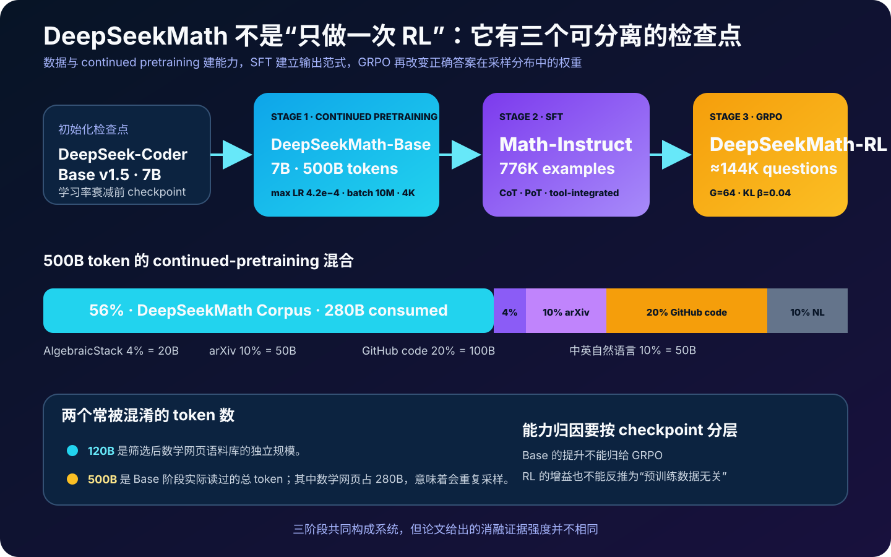
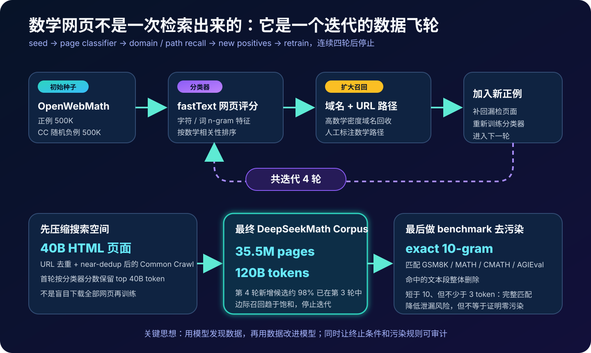
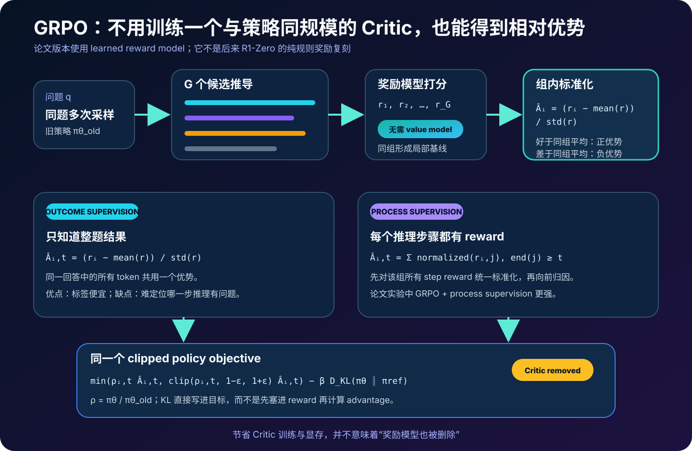
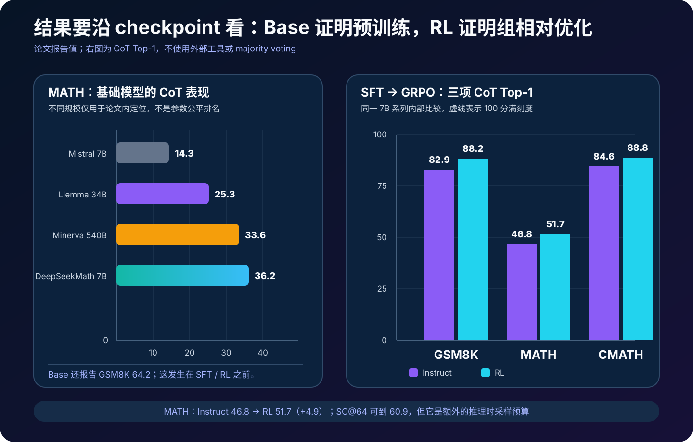

# DeepSeekMath 详解：从 120B 数学网页、代码底座到 GRPO 的原始论文


> **论文**：*DeepSeekMath: Pushing the Limits of Mathematical Reasoning in Open Language Models*<br>
> **作者**：DeepSeek-AI<br>
> **首次公开**：2024 年 2 月<br>
> **本文依据**：[arXiv v3（2024-04-27）](https://arxiv.org/abs/2402.03300) · [论文 PDF](https://arxiv.org/pdf/2402.03300) · [官方代码与模型说明](https://github.com/deepseek-ai/DeepSeek-Math)<br>
> **关键词**：Math Pretraining、Data Mining、Continued Pretraining、CoT、PoT、Tool-integrated Reasoning、GRPO、Process Reward Model<br>
> **配套代码**：[deepseekmath_grpo_minimal.py](code/deepseekmath_grpo_minimal.py)<br>
> **前置阅读**：[The Pile](37_The_Pile_2020_原理.md) · [Codex / HumanEval](52_Codex_HumanEval_2021_原理.md) · [Training Verifiers](53_Training_Verifiers_2021_原理.md) · [Chain-of-Thought](11_Chain_of_Thought_2022_原理.md) · [Let's Verify Step by Step](25_Lets_Verify_Step_by_Step_2023_原理.md)<br>
> **后续阅读**：[DeepSeek-V2](49_DeepSeek_V2_2024_原理.md) · [DeepSeek-V3](50_DeepSeek_V3_2024_原理.md) · [DeepSeek-R1](30_DeepSeek_R1_2025_原理.md)

> [!IMPORTANT]
> DeepSeekMath 是 **7B 数学模型系列**，不是 DeepSeek-R1 的别名。它从代码模型继续预训练，先得到 `Base`，再用 776K 样本得到 `Instruct`，最后从约 144K 个数学问题出发，用**学习式奖励模型**和 GRPO 得到 `RL`。后来的 R1-Zero 把 GRPO 与规则奖励、大规模推理探索结合起来，但不能把 R1 的训练配方倒灌回这篇 2024 年论文。

这篇论文常被一句话概括为“首次提出 GRPO”。这句话没有错，却会遮住论文另外两条同样重要的线索：

1. 怎样从 Common Crawl 中迭代挖出高质量数学网页；
2. 为什么从代码模型继续训练，能同时帮助自然语言数学和工具辅助推理。

如果只读强化学习公式，会错过一个更完整的研究命题：

> 一个开放 7B 模型的数学能力，究竟来自数据、底座、监督样本、奖励模型，还是推理时多采样？

DeepSeekMath 没有用一项消融把所有因果关系彻底分开，但它至少把整条链路展示了出来：

$$
\text{数学网页发现}
\rightarrow
\text{数学 + 代码 + 通用语料继续预训练}
\rightarrow
\text{CoT / PoT / 工具式 SFT}
\rightarrow
\text{GRPO}
\rightarrow
\text{Top-1 与多采样评测}.
$$

---

## 0. 先说结论

读完本文，至少应记住下面十五点：

1. **DeepSeekMath 是一个 7B 系列，不是单个 checkpoint**：`Base`、`Instruct`、`RL` 对应不同训练阶段，不能把所有结果笼统归给 GRPO。
2. **底座来自 DeepSeek-Coder-Base-v1.5 7B**，而且取的是学习率衰减前的 checkpoint；代码能力被当作数学推理的有利初始化。
3. **DeepSeekMath Corpus 的独立规模是 35.5M 网页、120B token**。它通过 fastText 页面分类、域名与 URL 路径回收，连续迭代四轮得到。
4. **120B 不是 Base 阶段总训练 token**。continued pretraining 共消费 500B token，其中 56% 来自该数学网页语料，即约 280B；这意味着语料会被重复采样。
5. **Base 阶段不是只喂数学网页**：还混入 AlgebraicStack、arXiv、GitHub 代码和中英自然语言，目的是兼顾数学、工具与通用能力。
6. **数据质量不能只看 token 数**。论文用同一 1.3B 模型、同一 150B token 预算比较不同数学语料，DeepSeekMath Corpus 在所测数学基准上整体更强。
7. **代码初始化的收益依任务而异**：代码预训练后再学数学，对无工具数学通常更好；代码与数学混训则更能保住代码能力，也更有利于工具辅助数学。
8. **“arXiv 没用”是过度概括**。控制实验只表明单独采用论文构造的 arXiv 数学语料没有显著改善所测 benchmark；最终 500B 混合仍有 10% arXiv。
9. **SFT 共 776K 中英文样本**，覆盖自然语言 CoT、Program-of-Thought 与 tool-integrated reasoning，而不是只教一种“逐步思考”格式。
10. **GRPO 的核心是同题组内基线**：对一个问题采样 $G$ 个回答，用组内 reward 均值和标准差产生相对优势，从而删除 PPO 中单独训练的 critic/value model。
11. **删除 Critic 不等于删除 Reward Model**。DeepSeekMath-RL 使用学习式奖励模型；这和 R1-Zero 的规则可验证奖励不同。
12. **论文同时讨论 outcome 与 process supervision**：前者把整题 reward 赋给所有 token；后者按后续步骤 reward 向 token 归因，实验中过程监督版本更强。
13. **GRPO 不只奖励正确样本，也压低相对较差样本**。这解释了它为什么在论文实验中优于只对正确样本做正向更新的 online RFT。
14. **RL 更明显地提高 Maj@K，而不是 Pass@K**。论文据此判断，RL 主要让已有正确解更常被采到，还没有显著扩展模型能找到答案的支持集。
15. **MATH 51.7 是 RL 模型 CoT Top-1**，不依赖外部工具和 majority voting；`SC@64 = 60.9` 是另一个花费额外推理预算的结果，不能并写成同一协议。

整篇论文最值得复用的不是某个分数，而是三个工程闭环：

```text
数据闭环：种子 → 分类器 → 域名/路径回收 → 新正例 → 重训
训练闭环：Base → SFT → group rollout → reward → policy update
评测闭环：checkpoint × prompt × tool × sampling budget × metric
```

---

## 1. 先分清三个模型、四类数据和三种推理格式



### 1.1 三个 checkpoint

| 模型 | 起点 | 新增训练 | 主要回答的问题 |
|---|---|---|---|
| DeepSeekMath-Base 7B | DeepSeek-Coder-Base-v1.5 7B | 500B token continued pretraining | 数据与代码底座能否建立数学能力 |
| DeepSeekMath-Instruct 7B | Base | 776K SFT 样本 | 能否按 CoT / PoT / 工具格式解题 |
| DeepSeekMath-RL 7B | Instruct | GRPO，约 144K 问题 | 相对奖励能否进一步提高正确率 |

所以看到一项结果时，第一问应该是：**它来自哪个 checkpoint？**

- `MATH 36.2` 属于 Base，发生在 SFT 和 GRPO 之前；
- `MATH 46.8` 属于 Instruct 的 CoT Top-1；
- `MATH 51.7` 属于 RL 的 CoT Top-1；
- `MATH 60.9` 是 RL 模型做 64 路 self-consistency 后的结果。

如果把 `36.2 → 51.7` 整段都称为“GRPO 增益”，就把数据预训练、SFT 与 RL 三个变量压成了一个变量。

### 1.2 四类训练材料

论文中的“数学数据”至少有四种，不应混称一个数据集：

| 数据 | 用于什么阶段 | 规模 / 配比 | 性质 |
|---|---|---:|---|
| DeepSeekMath Corpus | Base 继续预训练 | 120B 独立 token；训练混合占 56% | 从网页挖掘的中英数学相关文本 |
| AlgebraicStack | Base 继续预训练 | 4% | 代数与代码式数据 |
| arXiv / GitHub / 通用 CC | Base 继续预训练 | 10% / 20% / 10% | 学术、代码与自然语言能力保留 |
| Math SFT / RL questions | Instruct 与 RL | 776K / 约 144K | 题目、推导、程序或 reward 训练材料 |

### 1.3 CoT、PoT 和 tool-integrated reasoning

三种格式解决的计算分工不同：

```text
CoT:     题目 → 自然语言 / 数学符号推导 → 最终答案
PoT:     题目 → 生成 Python 程序 → 执行器 → 最终答案
Tool:    题目 → 推理与代码交错 → 执行结果反馈 → 继续推理
```

CoT 把计算留在模型的 token 生成中；PoT 把精确运算交给解释器；tool-integrated reasoning 允许两者来回协作。论文分别报告无工具和工具辅助结果，因此“哪个模型数学更强”必须先限定是否允许执行 Python。

---

## 2. 数据工程：怎样从 Common Crawl 找出 120B 数学 token



Common Crawl 不是一个已经贴好“数学”标签的教科书仓库。网页里可能同时有公式、导航、广告、评论、代码和重复模板。DeepSeekMath 的做法不是写一条关键词规则，而是建立一个迭代发现流程。

### 2.1 第零步：先把网页空间压下来

作者先按 URL 去重，并做 near-dedup，把 Common Crawl 缩减为大约 `40B HTML pages`。这里的 `40B` 是**页面数量**，不是最终数学 token 数。

这一层先解决两个成本问题：

- 同一网页跨 crawl 重复出现，会浪费分类和训练预算；
- 镜像站、模板页和轻微改写会让“不同样本数”虚高。

但 near-dedup 的阈值、HTML 清洗细节和完整实现没有公开，因此 `40B pages` 不是外部读者能够逐条复现的固定集合。

### 2.2 用 OpenWebMath 做初始种子

第一轮分类器训练集由两部分构成：

$$
\mathcal D_0
=
\underbrace{500K\ \text{OpenWebMath pages}}_{y=1}
\cup
\underbrace{500K\ \text{random CC pages}}_{y=0}.
$$

分类器使用 fastText。论文公开的超参数包括：

```text
embedding dimension = 256
learning rate        = 0.1
max word n-gram      = 3
minimum occurrences  = 3
epochs               = 3
```

选择 fastText 的逻辑很务实：它不是最强语义模型，却足够便宜，可以给超大规模网页打分。数学网页里的 LaTeX 片段、符号、专有词、题目模板和代码痕迹，也很适合被 n-gram 特征捕捉。

### 2.3 为什么第一轮保留 top 40B token

分类器给网页分数后，作者比较了 top `40B / 80B / 120B / 160B token` 等候选规模，再用下游模型实验选择第一轮的 top 40B token。

这揭示了一个重要的数据规律：

> 分类器阈值不是越宽松越好；召回更多网页的同时，也可能稀释数学密度。

因此，数据规模 $N$ 不是唯一变量，更贴近训练收益的抽象是：

$$
\text{utility}
\approx
f(\text{quality},\text{coverage},\text{diversity},\text{duplication},\text{model},\text{budget}).
$$

### 2.4 域名与 URL 路径把漏掉的数据捞回来

纯页面分类器有一个典型盲点：同一数学网站的某些页面公式稀少，但它们属于高价值系列；另一些大网站只有一个子目录与数学有关，整域抓取又会带来大量噪声。

论文于是加入两层结构先验：

1. 按 base URL 聚合页面；如果一个域名被选中的页面占比超过 10%，把它当作数学相关域名；
2. 人工检查 URL pattern，把明显的数学子路径标出。

从这些域名和路径中找出“分类器没选中”的网页，把它们作为新正例加入种子，再训练下一轮分类器：

$$
\mathcal D_{k+1}^{+}
=
\mathcal D_k^{+}
\cup
\operatorname{RecallByDomainAndPath}(C_k).
$$

这其实是一个轻量 active-data-discovery loop：模型提供候选，人利用网站结构做高杠杆校正，校正结果再反哺模型。

### 2.5 为什么四轮后停止

最终流程运行四轮，得到：

$$
35.5\text{M pages},\qquad 120\text{B tokens}.
$$

到第四轮时，新识别候选中接近 `98%` 已经在第三轮集合里，边际召回趋于饱和。因此停止不是“恰好想迭代四次”，而是有一个重合率信号。

不过它只是**对这套发现机制的饱和**，不能证明互联网上所有数学网页都已经找到。分类器、种子语言分布和域名标注共同决定可见边界。

### 2.6 精确 n-gram 去污染

作者针对 GSM8K、MATH、CMATH 和 AGIEval 做 benchmark decontamination：

- 如果训练文本段与 benchmark 任一子串有精确 10-gram 重合，删除整个文本段；
- benchmark 文本若少于 10 token、但不少于 3 token，则匹配其完整 token 序列。

设 benchmark 指纹集合为：

$$
F_B=\bigcup_{b\in B}\operatorname{NGram}_{10}(b),
$$

一段训练文本 $s$ 的保留条件是：

$$
\operatorname{NGram}_{10}(s)\cap F_B=\varnothing.
$$

配套脚本给出了零依赖教学实现：

```python
from deepseekmath_grpo_minimal import decontaminate_segments

clean = decontaminate_segments(
    segments=web_segments,
    benchmark_texts=gsm8k_and_math_questions,
    n=10,
)
```

这项规则能抓住原文复制，却抓不住所有污染：

- 改写、翻译、变量替换可能绕过精确匹配；
- 只删除 benchmark 题面，不代表相近解法或答案没有出现；
- tokenizer 与文本规范化不同，会改变 n-gram；
- downstream SFT 数据仍要独立审计。

所以更准确的表述是“执行了已公开的精确字符串去污染”，而不是“证明评测完全无泄漏”。

---

## 3. 怎样证明语料更好：固定小模型与训练预算

仅展示 120B token 不能证明数据质量。论文用 DeepSeek-LLM 1.3B 作为探针：每种候选数学语料都训练 150B token，其余设置尽量相同，再比较下游数学任务。

关键训练配置包括：

| 项目 | 设置 |
|---|---:|
| 模型规模 | 1.3B |
| 每组训练预算 | 150B token |
| context length | 4K |
| global batch | 4M token |
| optimizer | AdamW，$\beta_1=0.9,\beta_2=0.95$，weight decay 0.1 |
| max learning rate | $5.3\times 10^{-4}$ |
| warmup | 2,000 steps |

论文 Table 1 的部分结果如下：

| 150B token 训练语料 | 语料独立规模 | GSM8K | MATH | CMATH | MMLU-STEM |
|---|---:|---:|---:|---:|---:|
| 无数学继续训练 | — | 2.9 | 3.0 | 12.3 | 19.5 |
| MathPile | 8.9B | 2.7 | 3.3 | 1.2 | 15.7 |
| OpenWebMath | 13.6B | 11.5 | 8.9 | 16.8 | 29.6 |
| Proof-Pile-2 | 51.9B | 14.3 | 11.2 | 19.9 | 29.2 |
| **DeepSeekMath Corpus** | **120.2B** | **23.8** | **13.6** | **41.5** | **33.1** |

> [!NOTE]
> 表中“语料独立规模”和“训练预算”不是同一列。较小语料为了完成 150B token 训练会被重复采样，所以这里检验的是在固定 token 消费下的数据效用，不是一次 epoch 的公平竞赛。

DeepSeekMath Corpus 在论文选择的八项数学评测上整体占优，说明迭代网页筛选确实得到较高的 benchmark utility。但还不能推出：

- 它对所有数学领域都最好；
- 它比其他语料更少污染；
- 120B 的每个 token 都有同样价值；
- 1.3B 上的排序会无条件外推到任意规模。

尤其是后文提到的几何与定理证明短板，说明 benchmark 平均分不能覆盖“数学”这个大集合。

---

## 4. Base：500B token 到底怎样组成

DeepSeekMath-Base 从 DeepSeek-Coder-Base-v1.5 7B 学习率衰减前的 checkpoint 开始，再训练 500B token。混合如下：

| 来源 | 比例 | 约消费 token | 作用 |
|---|---:|---:|---|
| DeepSeekMath Corpus | 56% | 280B | 网页数学知识与题目分布 |
| AlgebraicStack | 4% | 20B | 代数 / 符号与代码式数据 |
| arXiv | 10% | 50B | 学术与形式化表达 |
| GitHub code | 20% | 100B | 保持代码与程序推理能力 |
| 中英自然语言 CC | 10% | 50B | 保持通用语言能力 |

训练使用 4K context、约 10M token batch、最大峰值学习率 $4.2\times10^{-4}$，其他优化器设置大体沿用前面的 1.3B 实验。

### 4.1 120B corpus 为什么能消费 280B token

因为训练混合允许重复采样。粗略计算：

$$
\frac{280\text{B consumed math-web tokens}}
{120\text{B unique corpus tokens}}
\approx 2.33.
$$

这不表示每个 token 严格出现 2.33 次。真实 sampler 可能按文档、源或长度加权；它只说明总体消费量超过独立语料规模。

数据论文中至少要分清四个量：

```text
unique corpus size   独立语料规模
mixture proportion   采样配比
consumed tokens      训练实际读过的 token
effective epochs     consumed / unique 的粗略重复程度
```

### 4.2 Base 的结果

在无工具 CoT 评测中，论文报告：

| 基础模型 | 参数量 | GSM8K | MATH |
|---|---:|---:|---:|
| Mistral | 7B | 40.3 | 14.3 |
| Llemma | 34B | 54.0 | 25.3 |
| Minerva | 540B | 58.8 | 33.6 |
| **DeepSeekMath-Base** | **7B** | **64.2** | **36.2** |

这组结果很有冲击力：7B Base 在这两个协议下超过论文列出的更大专用模型。但严谨解读需要加三层限定：

1. 参数量不同，数据、token、prompt 和训练时代也不同；
2. benchmark 不是完整数学能力；
3. 这是论文内结果，不等价于后来统一评测框架的复测。

### 4.3 工具并不总是自动加分

DeepSeekMath-Base 的论文结果里：

- GSM8K：CoT 64.2，Python 工具 66.9；
- MATH：CoT 36.2，Python 工具 31.4。

工具在 GSM8K 小幅帮助，却在 MATH 上更低。原因可能包括程序生成错误、解析失败、某些证明题不适合数值执行，以及 tool prompt 本身的分布差异。

因此：

$$
\text{tool access}\neq\text{guaranteed accuracy gain}.
$$

工具只是扩大动作空间；模型还要学会何时调用、如何写对代码、怎样读取结果并回到推导。

---

## 5. 为什么从代码模型开始

论文用 1.3B 模型比较了多种预训练顺序。最关键的五组是：

```text
general 400B → math 150B
code    400B → math 150B
math    150B only
code + math mixed
no additional training
```

部分结果如下：

| 路线 | GSM8K CoT | MATH CoT | GSM8K + Python | MATH + Python |
|---|---:|---:|---:|---:|
| general → math | 19.1 | 14.4 | 14.3 | 6.7 |
| **code → math** | **21.9** | **15.3** | 17.4 | 9.4 |
| math only | 20.5 | 13.1 | 11.4 | 6.5 |
| code + math mixed | 17.6 | 12.1 | **19.7** | **13.5** |

它支持一个有条件的结论：

- 若关注无工具自然语言数学，先学代码、再学数学在这组实验中最好；
- 若关注 Python 工具数学，代码与数学混训更好。

为什么代码可能帮数学？可以提出三个机制假设：

1. 代码具有显式控制流和变量绑定，强化分步计算；
2. 代码数据提供大量可执行的数值、算法和符号变换；
3. 代码模型更容易学会把问题翻译为程序并利用解释器。

但论文结果是**经验相关证据**，没有直接测量内部表征，因此不能把这些机制写成已经证明的因果事实。

### 5.1 两阶段训练会遗忘代码

代码预训练模型在 HumanEval / MBPP 上约为 `25.0 / 40.0`；继续做 150B 数学训练后降到 `12.2 / 17.0`。相反，代码与数学混训能达到 `29.3 / 39.4`。

这说明 continued pretraining 的目标不是只决定“学了什么”，还决定“忘了什么”：

$$
\Delta\text{math}>0
\quad\not\Rightarrow\quad
\Delta\text{general/code}\ge 0.
$$

最终 7B Base 仍保留 20% GitHub code 和 10% 通用自然语言，正是在能力提升与遗忘之间做折中。

### 5.2 7B Base 的通用与代码表现

论文 Table 4 报告：

| 模型 | MMLU | BBH | HumanEval | MBPP |
|---|---:|---:|---:|---:|
| DeepSeek-Coder Base v1.5（衰减前） | 42.9 | 42.9 | 40.2 | 52.6 |
| DeepSeek-Coder Base v1.5（最终） | 49.1 | 55.2 | 43.2 | 60.4 |
| DeepSeekMath-Base | 54.9 | 59.5 | 40.9 | 52.6 |

DeepSeekMath-Base 相比初始化 checkpoint 提高了 MMLU / BBH，并大体保住 HumanEval，但没有追上最终 Coder checkpoint 的代码分数。这正是“选择学习率衰减前 checkpoint”带来的比较语境：两个最终模型沿不同训练分支发展。

---

## 6. arXiv 消融为什么容易被误读

论文尝试用规则从 MathPile 和 RedPajama 的 arXiv 文本中构造数学语料。在 1.3B 与 7B 的控制实验中，这类 arXiv-only 数学继续训练没有在所选 benchmark 上带来明显收益，部分结果甚至下降。

不能据此写成“学术论文对数学模型无用”，原因有四个：

1. benchmark 多为中小学、竞赛题和标准答案任务，与研究论文体裁有分布距离；
2. arXiv 文本的公式解析、LaTeX 顺序与 PDF 清洗质量会影响可学性；
3. 实验没有穷举 arXiv 与网页题目、代码或教材的所有混合比例；
4. 最终 DeepSeekMath-Base 的 500B 混合里仍然放了 10% arXiv。

所以实验支持的是：

> 在论文测试的构造方式、规模与 benchmark 上，单独加入这类 arXiv 数学语料没有显示出预期增益。

它不支持“论文知识没有价值”这样的跨任务外推。

---

## 7. SFT：776K 样本不只教 CoT

DeepSeekMath-Instruct 使用 776K 条中英文样本。主要形态包括：

- 自然语言 Chain-of-Thought；
- Program-of-Thought；
- tool-integrated reasoning；
- 英文 GSM8K / MATH 工具式样本；
- MathInstruct 的一个子集；
- Lila-OOD 训练数据；
- 覆盖 76 个子主题的中文 K-12 数学数据。

训练时随机拼接样本到 4K context，训练 500 steps，batch size 256，使用恒定学习率 $5\times10^{-5}$。

### 7.1 SFT 的目标

给定问题 $q$ 与示范回答 $o=(o_1,\ldots,o_T)$，标准 teacher-forcing loss 是：

$$
\mathcal L_{\text{SFT}}
=-
\sum_{t=1}^{T}
\log \pi_\theta(o_t\mid q,o_{<t}).
$$

SFT 直接告诉模型“应该模仿哪条轨迹”，优点是训练稳定；但一个数学问题可能有很多正确路径，人工或合成示范只覆盖其中少数。

GRPO 接下来解决的是另一个问题：

> 不指定唯一目标轨迹，只让当前策略自己采样，再根据相对 reward 调整概率。

### 7.2 论文官方 CoT 输出约定

官方模型说明给出的英文 CoT prompt 要求逐步推理，并把最终答案写在 `\boxed{}` 中。可抽象为：

```text
{question}
Please reason step by step, and put your final answer within \boxed{}.
```

这个 prompt 不是无关的装饰。解析器要从 `\boxed{}` 抽取答案，prompt 变化会影响格式服从、长度和最终分数。因此复现实验不能只记录模型名，还应记录完整 prompt 与答案规范化器。

---

## 8. 从 PPO 到 GRPO：为什么 Critic 可以被删掉

PPO 式 RLHF 通常训练三个关键网络：

```text
policy / actor     生成回答
reward model       给完整回答或步骤打分
value model        估计状态价值，构造低方差 advantage
```

常见 advantage 用 GAE 构造。若价值模型 $V_\psi(s_t)$ 预测不准，policy update 会受影响；如果 value model 与 policy 同规模，训练与显存成本也很高。

GRPO 的变化是：对同一道题生成一组候选，让组内 reward 统计量充当局部 baseline：

$$
q\sim P(Q),\qquad
\{o_1,\ldots,o_G\}
\sim\pi_{\theta_{\text{old}}}(\cdot\mid q).
$$

奖励模型给出：

$$
r_i=R_\phi(q,o_i).
$$

然后不再估计 $V(s_t)$，而是直接比较同题候选。这降低了训练一个 critic 的成本，但仍保留 reward model $R_\phi$。

---

## 9. GRPO 的完整目标



### 9.1 组相对优势

若只有整条回答的 outcome reward，先在同题的 $G$ 个候选中标准化：

$$
\hat A_i
=
\frac{r_i-\operatorname{mean}(r_1,\ldots,r_G)}
{\operatorname{std}(r_1,\ldots,r_G)}.
$$

直觉上：

- $\hat A_i>0$：这条回答比同题平均更好，应提高概率；
- $\hat A_i<0$：比平均更差，应降低概率；
- 所有 reward 相同时，组内没有排序信号，工程实现应跳过或安全置零。

这里比较的是“同一问题的候选”，不是把一道容易题的 1 分和一道极难题的 0 分直接放进全局 baseline。组内标准化会自适应题目难度，但也引入两个条件：

1. $G$ 太小时，均值和方差估计更噪；
2. 如果一组样本全对或全错，outcome reward 可能零方差。

### 9.2 Clipped surrogate

对回答 $o_i$ 的第 $t$ 个 token，重要性采样比率为：

$$
\rho_{i,t}(\theta)
=
\frac{
\pi_\theta(o_{i,t}\mid q,o_{i,<t})
}{
\pi_{\theta_{\mathrm{old}}}(o_{i,t}\mid q,o_{i,<t})
}.
$$

GRPO 延续 PPO 的 clipped surrogate：

$$
\min\left(
\rho_{i,t}\hat A_{i,t},
\operatorname{clip}(\rho_{i,t},1-\epsilon,1+\epsilon)\hat A_{i,t}
\right).
$$

clip 的目的不是保证训练永不发散，而是限制一次更新通过概率比率造成的过大变化。

### 9.3 KL 直接写进目标

论文的总体目标可以写成：

$$
\begin{aligned}
J_{\mathrm{GRPO}}(\theta)
=\mathbb E\Bigg[
\frac{1}{G}\sum_{i=1}^{G}
\frac{1}{|o_i|}\sum_{t=1}^{|o_i|}
\Big(
&\min(\rho_{i,t}\hat A_{i,t},
\operatorname{clip}(\rho_{i,t},1-\epsilon,1+\epsilon)\hat A_{i,t})\\
&-\beta D_{\mathrm{KL}}(\pi_\theta\|\pi_{\mathrm{ref}})
\Big)
\Bigg].
\end{aligned}
$$

与一些 PPO 实现先把 KL 惩罚塞进 reward 不同，DeepSeekMath 把 KL 项直接加在 loss / objective 中，从而不让 KL 奖惩参与组内 advantage 的构造。

论文采用的单样本正值 KL 估计为：

$$
D_{\mathrm{KL}}
=
\frac{\pi_{\mathrm{ref}}}{\pi_\theta}
-\log\frac{\pi_{\mathrm{ref}}}{\pi_\theta}
-1.
$$

令 $x=\pi_{\mathrm{ref}}/\pi_\theta>0$，因为 $x-\log x-1\ge 0$ 且在 $x=1$ 取 0，这个估计具有直观的非负性。

### 9.4 Outcome supervision

结果监督只给整条回答一个 reward。标准化后，同一回答的每个 token 都使用相同 advantage：

$$
\hat A_{i,t}
=
\frac{r_i-\operatorname{mean}(r)}
{\operatorname{std}(r)}.
$$

它便宜、简单，却有粗粒度 credit assignment：一条 400 token 的推导中，前 350 token 全对、最后算错，所有 token 都拿到同一个负优势。

### 9.5 Process supervision

过程监督为回答中的推理步骤提供 reward。设第 $j$ 步 reward 为 $r_{i,j}$，结束 token 位置为 $e_{i,j}$。论文先把同组所有步骤 reward 组成集合 $R$，做标准化，然后令 token $t$ 的优势为其后续步骤 reward 之和：

$$
\hat A_{i,t}
=
\sum_{j:e_{i,j}\ge t}
\frac{r_{i,j}-\operatorname{mean}(R)}
{\operatorname{std}(R)}.
$$

“后续步骤之和”让较早 token 对之后多个步骤负责，形成类似 return-to-go 的归因。论文的比较中，`GRPO + Process Supervision` 优于只有 outcome supervision 的版本。

但 PRM 不是免费真相源：

- 步骤边界怎样切分会改变标签；
- 一个中间步骤局部正确，不代表它对最终解有贡献；
- PRM 本身会有误判与分布外泛化问题；
- 细粒度 reward 更容易引入局部 reward hacking。

### 9.6 代码里的最小目标

配套脚本把每个 token 的旧、新、参考策略 log-prob 显式存起来：

```python
from deepseekmath_grpo_minimal import (
    TokenPolicyTrace,
    grpo_objective,
    outcome_advantages,
)

rewards = [0.2, 0.9, 0.4, 0.9]
lengths = [3, 3, 3, 3]
advantages = outcome_advantages(rewards, lengths)

traces = [
    TokenPolicyTrace(
        old_logps=(-1.0, -1.2, -0.8),
        new_logps=(-0.9, -1.1, -0.9),
        ref_logps=(-1.1, -1.3, -0.9),
    )
    for _ in rewards
]

objective = grpo_objective(traces, advantages, beta=0.04)
loss = -objective
```

它故意不导入 PyTorch，目的是让下面这些量能独立检查：

- reward 组内均值是否为 0；
- 零方差组是否安全；
- token 维度是否对齐；
- KL 在新策略等于参考策略时是否为 0；
- outcome 与 process advantage 是否真的不同。

这段程序不能替代真实训练：它没有模型、自动微分、生成引擎、padding mask、分布式 rollout、奖励模型推理和旧策略同步。

---

## 10. DeepSeekMath-RL 的实际训练设置

RL 从 DeepSeekMath-Instruct 7B 开始，而不是从 Base 直接做“纯 RL”。论文公开的主要配置是：

| 项目 | 设置 |
|---|---:|
| RL 问题 | 约 144K 个 CoT 问题 |
| 来源 | SFT 中 GSM8K / MATH 相关子集 |
| group size | 每题 64 个输出 |
| 最大生成长度 | 1,024 token |
| policy batch | 1,024 |
| policy learning rate | $1\times10^{-6}$ |
| reward model learning rate | $2\times10^{-5}$ |
| KL coefficient $\beta$ | 0.04 |
| policy update | 一轮探索后单次更新 |

### 10.1 为什么 OOD 提升更有信息量

RL 问题主要来自 GSM8K 与 MATH 子集，没有把所有评测训练集都塞入 RL。论文报告模型在中文 CMATH 等 out-of-distribution 任务上也提升：

$$
\text{CMATH CoT}: 84.6\rightarrow 88.8.
$$

这比只报告训练分布内提升更能说明策略变化有一定泛化。但 OOD 仍是相对于 RL 问题集合而言，不等于训练全链路从未见过相似中文数学材料；Base 和 SFT 都包含中文数据。

### 10.2 迭代式 GRPO

论文还描述了 policy 与 reward model 迭代更新：

```text
当前 policy 采样新回答
    ↓
构造新的 reward-model 训练数据
    ↓ 混入 10% 历史 replay data
继续训练 reward model
    ↓
把 reference policy 更新为当前 policy
    ↓
继续 GRPO
```

历史回放用于减轻 reward model 遗忘；更新 reference policy 则让 KL 约束围绕新的局部策略中心继续优化。

论文实验显示迭代 RL 继续带来提升，第一轮最明显。但外部复现仍缺少完整 RM 数据生成、标注器、过滤和训练代码，不能仅凭表中超参数复刻 checkpoint。

### 10.3 与 DeepSeek-R1 的关键区别

| 维度 | DeepSeekMath-RL（2024） | R1-Zero（2025） |
|---|---|---|
| 起点 | 数学 Instruct 模型 | DeepSeek-V3-Base |
| 冷启动 SFT | **有** | **无** |
| 主要 reward | 学习式 reward model，讨论 outcome / process | 数学 / 代码规则正确性 + 格式 |
| 研究目标 | 改进 7B 数学模型，研究 GRPO | 检验无 reasoning SFT 的纯 RL 能否激发推理 |
| backbone | 7B dense 系列 | 671B 总参数 MoE 底座 |

二者共享 GRPO 家族，却不是同一训练配方。尤其要记住：

> DeepSeekMath 删除的是 PPO 的 value model / critic，不是 reward model；R1-Zero 才把大量数学奖励改成可验证规则。

---

## 11. 论文为什么把 SFT、RFT、DPO、PPO、GRPO 放到同一张图里

DeepSeekMath 提出一个统一视角：不同后训练方法都在给已采样 token 一个**梯度系数**，差别主要来自三件事：

1. 数据来自离线集合还是当前策略在线采样；
2. reward 来自示范、规则、偏好对或奖励模型；
3. 如何把序列 reward 变成 token-level gradient coefficient。

可以做如下概念对照：

| 方法 | 数据 | 反馈 | 对样本的主要更新方向 |
|---|---|---|---|
| SFT | 离线人工 / 合成示范 | 目标 token | 所有示范 token 正向模仿 |
| RFT | 离线采样 + 正确性过滤 | 0/1 结果 | 正确样本模仿，错误样本丢弃 |
| Online RFT | 当前策略在线采样 | 0/1 结果 | 当前正确样本正向更新 |
| DPO | 离线偏好对 | chosen / rejected | 拉开成对回答相对概率 |
| PPO | 在线 rollout | RM + value / GAE | 按 critic advantage 正负更新 |
| GRPO | 同题在线 group | RM + 组内统计 | 好于组平均上调，差于组平均下调 |

### 11.1 为什么 online RFT 优于静态 RFT

静态 RFT 的样本由旧模型预先生成。随着 policy 变化，这批数据越来越 off-policy；online RFT 每轮从当前模型重新采样，更贴近它正在犯的错误和刚刚学会的解法。

### 11.2 为什么 GRPO 又优于 online RFT

最简单的 online RFT 只保留正确回答，等价于：

$$
c_i=\mathbb 1[r_i=1].
$$

它对错误回答通常不给负向信号，对所有正确回答也近似等权。GRPO 则使用：

$$
c_i\propto\frac{r_i-\bar r}{s_r},
$$

因此会同时：

- 提高相对更好回答的概率；
- 降低相对较差回答的概率；
- 按同题难度自适应尺度。

论文实验里 `GRPO > Online RFT > RFT` 支持这一解释，但它是在特定 reward、模型和数据上的经验排序，不是所有任务上的定理。

---

## 12. 结果：Base、Instruct、RL 分别贡献了什么



### 12.1 CoT Top-1

| 模型 | GSM8K | MATH | MGSM-zh | CMATH |
|---|---:|---:|---:|---:|
| DeepSeekMath-Instruct 7B | 82.9 | 46.8 | 73.2 | 84.6 |
| **DeepSeekMath-RL 7B** | **88.2** | **51.7** | **79.6** | **88.8** |
| 绝对增益 | +5.3 | +4.9 | +6.4 | +4.2 |

这组数是论文最干净的 RL 内部对照：相同模型家族、从 Instruct 到 RL，四个任务都提升。

### 12.2 工具辅助 Top-1

| 模型 | GSM8K + Tool | MATH + Tool | MGSM-zh + Tool | CMATH + Tool |
|---|---:|---:|---:|---:|
| DeepSeekMath-Instruct 7B | 83.7 | 57.4 | 72.0 | 84.3 |
| **DeepSeekMath-RL 7B** | **86.7** | **58.8** | **78.4** | **87.6** |

工具路线也提升，但增益并不均匀。比如 MATH 只提高 1.4，而 CoT 提高 4.9。可能原因包括 RL 问题和输出形态偏 CoT、tool execution error 形成上限，以及奖励模型对工具轨迹的覆盖差异。

### 12.3 51.7、58.8 与 60.9 各自是什么

| 数字 | 协议 | 是否工具 | 是否多采样投票 |
|---:|---|---:|---:|
| MATH 51.7 | RL CoT Top-1 | 否 | 否 |
| MATH 58.8 | RL tool-integrated Top-1 | 是 | 否 |
| MATH 60.9 | RL CoT self-consistency@64 | 否 | 是，64 路 |

三个值都合法，但回答不同问题：

- `51.7` 衡量单次自然语言推导；
- `58.8` 允许把部分计算交给 Python；
- `60.9` 用 64 次采样和多数投票换取更高正确率。

论文摘要强调 `MATH 51.7` 时，明确限定不依赖外部工具和 voting。博客或榜单如果只挑 `60.9`，却省略 64 路采样，就隐藏了推理成本。

### 12.4 一个完整的评测记录应该长什么样

建议把一条分数写成六元组：

$$
(\text{checkpoint},\text{prompt},\text{tool},\text{temperature},K,\text{metric}).
$$

例如：

```text
DeepSeekMath-RL-7B
+ official CoT boxed-answer prompt
+ no Python
+ one sampled/decoded answer
+ exact normalized answer match
= MATH Top-1 51.7
```

缺掉任何一项，都可能让读者误以为不同数字可以直接横比。

---

## 13. Maj@K 提升、Pass@K 不升，意味着什么

论文在 GSM8K 和 MATH 上以 temperature 0.7 多次采样，观察到 RL 明显改善 `Maj@K`，却没有改善 `Pass@K`。

### 13.1 两个指标回答不同问题

给定 $K$ 个回答：

$$
\operatorname{Pass@K}
=\mathbb 1[\text{至少一个回答正确}],
$$

$$
\operatorname{Maj@K}
=\mathbb 1[\text{多数投票答案正确}].
$$

如果模型偶尔能找到正确解，但大部分概率质量仍落在错误答案上：

```text
采样答案：7, 8, 8, 9, 8, 7, 6, 8
Pass@8 = 1        # 正确答案 7 出现过
Maj@8  = 0        # 但错误答案 8 占多数
```

RL 后可能变成：

```text
采样答案：7, 7, 8, 7, 7, 9, 7, 8
Pass@8 = 1        # 没变化
Maj@8  = 1        # 正确解变成高概率模式
```

### 13.2 论文的解释

作者据此判断，当前 RL 主要在做：

$$
\text{amplify correct solutions already in Top-K},
$$

而不是：

$$
\text{discover entirely new correct solution support}.
$$

换成概率语言：RL 把已有正确轨迹从尾部搬向众数附近，但没有显著增加“至少出现一次正确轨迹”的概率。

这是一个很重要的负面结果。它提醒我们：平均 Top-1 或 majority-vote 提升，不自动等于搜索边界扩大。

### 13.3 为什么可能出现这种现象

论文指出的限制包括：

- RL 问题主要来自已有 SFT 分布；
- 初始探索采用较朴素的 nucleus sampling；
- reward model 更擅长给已知风格的解排序，而不是奖励真正新颖的策略；
- group sampling 仍受当前 policy 支持集约束。

因此，更强 reasoning RL 不只需要更好的 optimizer，还需要：

```text
更广的问题分布
+ 更有探索性的采样
+ 对不确定性的 reward 建模
+ 能泛化到新推理过程的 verifier / PRM
```

---

## 14. 能力边界与论文没有解决的问题

### 14.1 几何与定理证明仍是短板

论文的 dry run 发现模型在三角形、椭圆等几何问题上明显薄弱，也承认与闭源强模型相比，几何和定理证明仍有差距。

这很可能反映数据筛选偏置：网页分类器容易发现题库、解析页、代数计算和代码内容，却未必同样覆盖依赖图形、长证明与形式化结构的材料。

所以“网页数学 token 多”不等于数学领域均衡。更可靠的数据卡应该额外报告：

- 代数、数论、组合、几何、分析、概率的比例；
- 题目、解答、教材、论坛、论文、代码的体裁分布；
- 中英文与其他语言分布；
- 包含图像但文本抽取丢失的页面比例。

### 14.2 Few-shot 能力仍弱

论文观察到 GPT-4 会从 few-shot 示例中明显获益，而 DeepSeekMath 的 zero-shot 与 few-shot 差距较小。这说明专项数学准确率高，不等于同样强的 in-context learning。

专项模型可能已经很熟悉某类题，却没有充分学会从 prompt 中快速归纳一个新任务格式。

### 14.3 Reward model 会错

过程奖励尤其依赖标注质量。论文引用对 PRM800K 的检查，指出其中约 20% 标签可能有问题。无论这个比例怎样随清洗定义变化，核心风险都成立：

$$
\max_\theta R_\phi(q,o)
\neq
\max_\theta \text{true mathematical correctness}(q,o)
$$

当 policy 变强并离开 reward model 的训练分布，误判可能被优化器主动放大。这就是 iterative RL 必须重训 RM、保留历史 replay、监控 reward hacking 的原因。

### 14.4 公开程度不足以完整复现

论文与官方仓库公开了模型、核心公式、许多超参数和评测说明，但仍缺少：

- 35.5M 网页的完整 URL / 版本化清单；
- HTML 清洗、去重和 fastText 全流水线代码；
- 776K SFT 数据全集及其许可链；
- reward model 训练集、标注协议与 checkpoint；
- 分布式 GRPO 训练实现；
- 训练硬件、总 FLOPs、墙钟时间与能耗；
- 全部 benchmark prompt、解析器和失败样本。

因此它比许多闭源技术报告透明，但仍属于“可理解、部分可验证，不可端到端复刻”。

### 14.5 训练数据治理问题

网页数学语料还涉及超出 benchmark contamination 的治理问题：

- 版权与网站条款；
- 个人信息和论坛内容；
- 语言、地区与教育体系偏差；
- 错误解答、答案站模板和低质量机器生成内容；
- 网站被高频重复采样造成的来源权重失衡。

论文主要讨论能力与去污染，没有提供今天数据治理所需的完整 provenance 与许可审计。

---

## 15. 配套代码：能复现什么，不能复现什么

运行：

```bash
python3 papers/to-2026/code/deepseekmath_grpo_minimal.py
```

预期输出包含：

```text
decontamination: 3 -> 2 segments
group rewards:     [0.2, 0.9, 0.4, 0.9]
outcome advantage: [-1.2978, 0.9733, -0.6489, 0.9733]
...
```

脚本覆盖：

1. 连续 n-gram benchmark 去污染；
2. group reward 标准化与零方差保护；
3. outcome supervision 的 token advantage；
4. process supervision 的后续步骤 reward 累积；
5. PPO 式 clipped ratio；
6. $x-\log x-1$ KL 估计；
7. Maj@K 与 Pass@K 的概念区别。

它刻意不覆盖：

- fastText 网页分类和 Common Crawl 抓取；
- 7B 模型 continued pretraining；
- learned reward model 的训练与校准；
- GPU rollout 与反向传播；
- 数学等价答案解析；
- 安全的 Python 执行沙箱。

### 15.1 一个真实实现还需要的 mask

batch 中回答长度不同，真实目标要避免 padding token 进入平均：

$$
J=
\frac{1}{G}\sum_i
\frac{
\sum_t m_{i,t}\,j_{i,t}
}{
\sum_t m_{i,t}
},
$$

其中 $m_{i,t}\in\{0,1\}$。同时通常只优化 completion，不把 prompt token 计入 policy gradient。

### 15.2 组采样的系统成本

GRPO 省掉 critic，不代表 RL 便宜。每个问题采样 64 个最长 1,024-token 的回答，理论上单题最多产生：

$$
64\times 1024=65{,}536\ \text{completion tokens}.
$$

训练瓶颈会从“多一个 value model”部分转移到：

- rollout 吞吐；
- KV cache 与采样显存；
- reward model 批推理；
- policy / old policy / reference policy 的 log-prob 计算；
- 在线数据管线与去重。

所以 GRPO 的工程价值是减少一个大模型角色，并简化 advantage；它没有消除在线 RL 的生成成本。

---

## 16. 如果要复现实验，应该怎样分层

### 16.1 最低成本：复现数学与评测合同

先不训练大模型，只验证：

- group normalization；
- clipped objective 和 KL 符号；
- outcome / process token advantage；
- boxed-answer 解析；
- exact match、Maj@K、Pass@K；
- 零方差、长度 mask 和空回答边界。

配套脚本覆盖其中前半部分。

### 16.2 中等成本：小模型 GRPO

选择一个小型开放模型和可自动判分的数据集：

```text
SFT checkpoint
→ 每题采样 G=4/8 个回答
→ 确定性数学 verifier 或小 RM
→ GRPO update
→ 记录 Top-1 / Maj@K / Pass@K / KL / entropy
```

至少做这些消融：

| 变量 | 建议取值 |
|---|---|
| group size | 4 / 8 / 16 |
| KL beta | 0 / 小 / 中 |
| reward | outcome rule / learned RM / process RM |
| data | in-domain / held-out topic / held-out language |
| metric | Top-1 + Maj@K + Pass@K，不只报一个 |

### 16.3 高成本：数据管线复现

若研究重点是数学语料，应把“更大的模型”放到后面，先版本化：

```text
seed URLs
classifier train split
CC snapshot IDs
HTML extraction version
exact / near-dup signatures
domain/path decisions
benchmark fingerprints
source-level token weights
```

然后用同一小模型和同一 token 预算比较不同语料。否则模型、token 数、清洗器与数据一起变化，无法判断提升来自哪里。

### 16.4 结果报告模板

建议最少报告：

```yaml
checkpoint: ...
paper_version: arXiv v3, 2024-04-27
prompt_template: ...
answer_parser: ...
tool_access: false
temperature: ...
samples_per_problem: 1
aggregation: top1
benchmark_version: ...
decontamination_rule: exact-10-gram
score: ...
```

这个模板看似啰嗦，却能阻止 `51.7`、`58.8` 和 `60.9` 被误放在同一列里。

---

## 17. 对今天数学 / 推理模型工程的启示

### 17.1 数据发现本身可以是迭代学习任务

固定关键词表很难覆盖数学网页的长尾。更可扩展的模式是：

$$
\text{weak seed}
\rightarrow
\text{cheap classifier}
\rightarrow
\text{structured human correction}
\rightarrow
\text{better seed}.
$$

域名和 URL path 是低成本的结构元数据，能放大一次人工判断的覆盖面。这一模式也适用于法律、医学、金融和代码文档等垂域语料。

### 17.2 专项 continued pretraining 要同时管理遗忘

代码 → 数学的两阶段训练能提高无工具数学，却明显伤害代码；混训更能保留工具能力。工程决策不应该只问“专项数据占多少”，还要问：

- 哪些能力必须保留；
- 是否需要通用 replay；
- 采用顺序训练还是混合训练；
- 每类数据的评测 guardrail 是什么。

### 17.3 RL optimizer、reward 和探索缺一不可

Maj@K / Pass@K 的分离表明，仅改 optimizer 可能只是重新分配已有轨迹的概率。若目标是发现全新解法，还要扩大题目与策略的探索支持集。

可以把 reasoning RL 的能力粗略分解成：

$$
\text{RL gain}
\approx
\text{exploration coverage}
\times
\text{reward fidelity}
\times
\text{optimizer efficiency}.
$$

任一项接近零，另外两项再强也难以得到真正的新能力。

### 17.4 省掉 Critic 是架构简化，不是监督消失

GRPO 仍然需要问题分布、采样策略、reward、参考策略和 KL 约束。把“没有 value model”传播成“完全无监督”会遮蔽人类设计的目标边界。

### 17.5 工具使用必须单独训练、单独评测

Base 模型在 MATH 上使用 Python 反而低于 CoT，说明“接上解释器”不等于拥有可靠工具能力。工具路线至少要测：

- 调用率与该调用是否必要；
- 程序编译 / 执行成功率；
- 执行结果读取正确率；
- 沙箱超时和错误恢复；
- 最终答案正确率与额外延迟。

---

## 18. 常见误读

### 误读 1：DeepSeekMath 就是 GRPO 论文

**不完整。** GRPO 是关键贡献，但论文一半以上的证据来自数学网页挖掘、预训练混合、代码初始化和 SFT。

### 误读 2：120B token 就是模型总训练量

**错误。** 120B 是数学网页语料库独立规模；Base 阶段总消费 500B token，其中 280B 来自该语料。

### 误读 3：GRPO 不需要奖励模型

**错误。** 它不需要单独的 critic/value model。DeepSeekMath-RL 明确使用 learned reward model。

### 误读 4：DeepSeekMath 证明了纯 RL 可以从 Base 长出推理

**错误。** RL 从已经做过 776K SFT 的 Instruct 模型开始。这个问题是后来 R1-Zero 更直接研究的。

### 误读 5：代码数据天然让所有数学任务更强

**过度概括。** 顺序训练对无工具数学更好，混训对工具数学更好；两阶段数学训练还会严重遗忘代码。

### 误读 6：论文证明 arXiv 数据没有价值

**错误。** 论文只给出特定 arXiv 构造在特定 benchmark 上的消融；最终 Base 混合仍含 10% arXiv。

### 误读 7：MATH 60.9 是单次无工具正确率

**错误。** 无工具 CoT Top-1 是 51.7；60.9 来自 64 路 self-consistency。

### 误读 8：RL 提升说明模型会解更多从未会过的题

**证据不足。** 论文观察到 Maj@K 提升而 Pass@K 不升，更像把已有正确轨迹的概率推高。

### 误读 9：精确 10-gram 去污染证明零泄漏

**错误。** 它抓原文重合，不足以覆盖改写、翻译、变量替换和语义等价内容。

### 误读 10：7B 超过 540B 说明规模不重要

**错误。** 这说明专项数据和训练配方可以在特定协议上弥补规模差距，不代表所有任务、数据和推理预算下规模都不重要。

---

## 19. 一页纸总结

```text
目标
  建立一个强开放 7B 数学模型，并研究数据、代码训练与 RL。

数据
  OpenWebMath seed + random CC negatives
  → fastText page classifier
  → domain / URL-path recall
  → 4 iterations
  → 35.5M pages / 120B tokens
  → exact 10-gram benchmark decontamination

Base
  DeepSeek-Coder-Base-v1.5 7B（LR decay 前）
  + 500B continued-pretraining tokens
  = 56% math web + 4% AlgebraicStack + 10% arXiv
    + 20% GitHub code + 10% Chinese/English natural language

SFT
  776K Chinese/English examples
  CoT + PoT + tool-integrated reasoning

GRPO
  one question → G=64 answers → learned reward model
  → group normalization → clipped policy update + direct KL
  → no separate critic, but reward model remains

结果
  Base:     GSM8K 64.2 / MATH 36.2
  Instruct: GSM8K 82.9 / MATH 46.8 / CMATH 84.6
  RL:       GSM8K 88.2 / MATH 51.7 / CMATH 88.8
  SC@64:    MATH 60.9（额外推理时采样预算）

最重要的负面结论
  RL 提高 Maj@K，却没有提高 Pass@K：
  更像重排已有解法概率，而不是显著拓展可探索解空间。
```

---

## 20. 总结

DeepSeekMath 的意义不只是“R1 之前的那篇 GRPO 论文”。它把数学语言模型拆成了三个可以分别讨论的对象：

1. **数据系统**：从种子和廉价分类器出发，利用域名结构不断回收漏检网页，并用固定小模型验证数据效用；
2. **能力底座**：从代码模型继续训练，在数学、工具、代码遗忘和通用能力之间设计 500B token 混合；
3. **策略优化**：用同题 group reward 替代 learned value baseline，以较低模型角色成本做在线 RL。

它最值得今天继续追问的，也正是论文自己暴露出来的边界：

- 怎样让数据覆盖几何、长证明与更多语言，而不只是 benchmark 高频体裁？
- 怎样训练在新推理风格上仍可信的过程奖励模型？
- 怎样让 RL 不只提高 majority probability，也真正提高 Pass@K、发现新的正确轨迹？
- 怎样在公开强模型的同时，公开足够的数据 provenance、评测解析器和训练流水线？

如果把整篇论文压缩成一句话：

> DeepSeekMath 先用迭代数据工程把数学知识装进 7B 代码模型，再用多格式 SFT 建立解题接口，最后用组内相对 reward 把已有正确轨迹推向更高概率；它证明了这条路线有效，也诚实地显示了探索边界尚未被打开。

---

## 参考资料

1. DeepSeek-AI, [*DeepSeekMath: Pushing the Limits of Mathematical Reasoning in Open Language Models*](https://arxiv.org/abs/2402.03300), 2024.
2. DeepSeek-AI, [DeepSeek-Math 官方 GitHub 仓库](https://github.com/deepseek-ai/DeepSeek-Math).
3. Shao et al., [*DeepSeekMath* PDF v3](https://arxiv.org/pdf/2402.03300), 2024-04-27.
4. Lightman et al., [*Let's Verify Step by Step*](https://arxiv.org/abs/2305.20050), 2023.
5. Cobbe et al., [*Training Verifiers to Solve Math Word Problems*](https://arxiv.org/abs/2110.14168), 2021.
