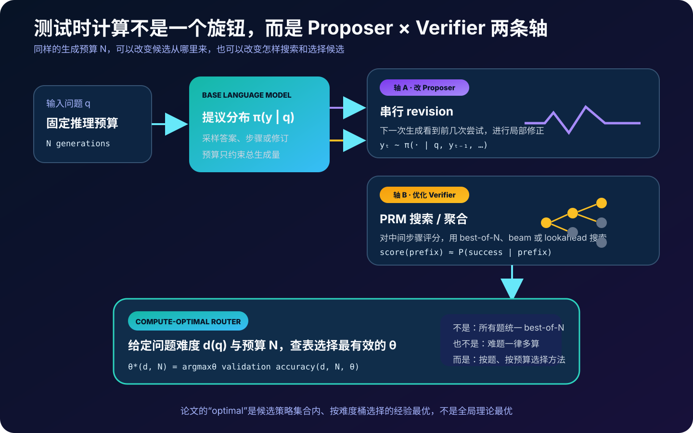
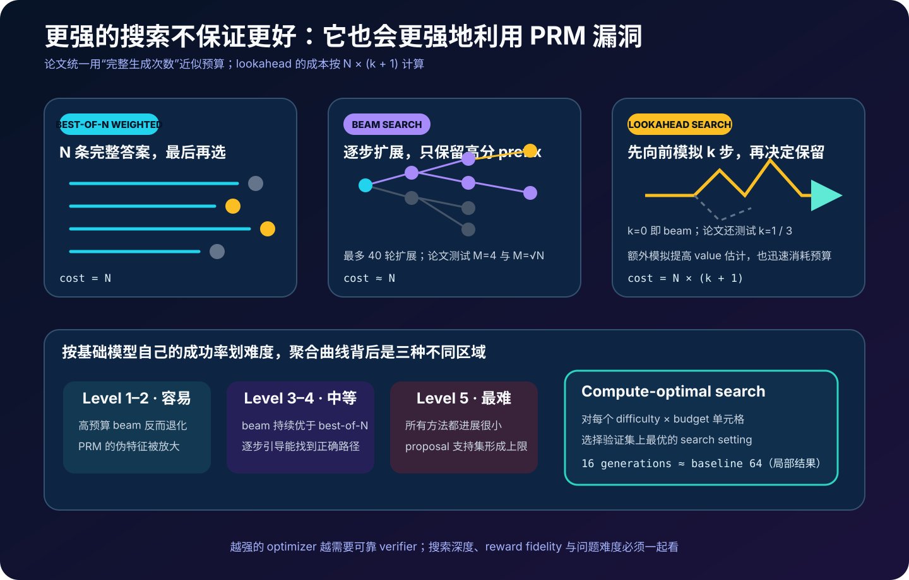
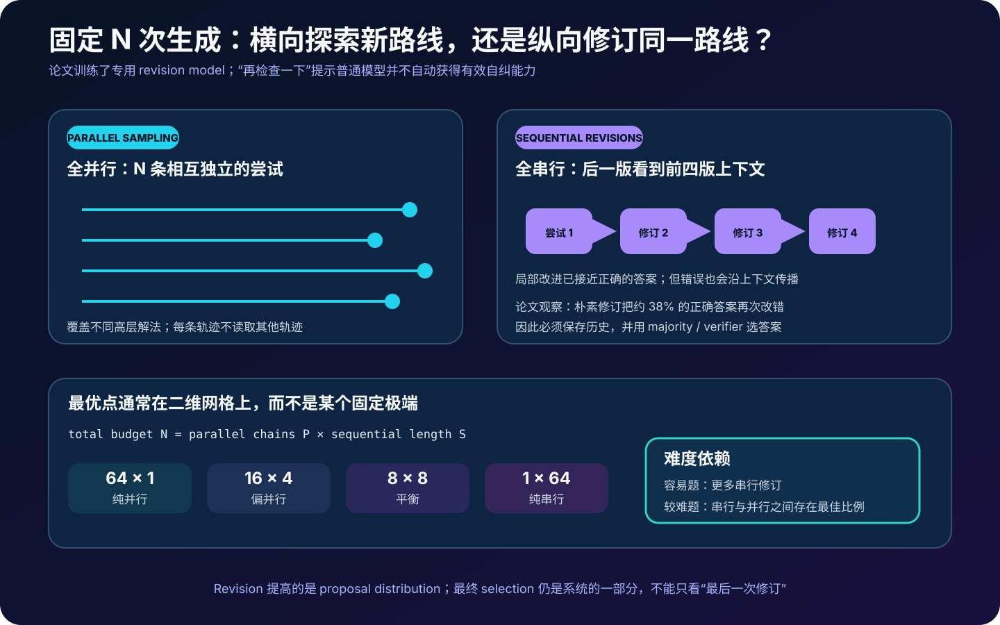
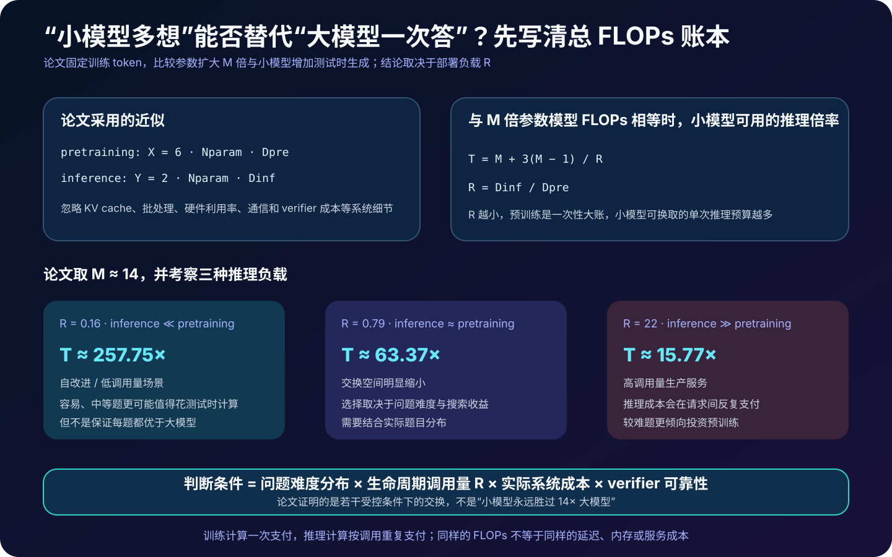

# 测试时计算扩展详解：固定推理预算下，怎样按问题难度选择搜索与修订


> **论文**：*Scaling LLM Test-Time Compute Optimally can be More Effective than Scaling Model Parameters*<br>
> **作者**：Charlie Snell、Jaehoon Lee、Kelvin Xu、Aviral Kumar<br>
> **首次公开**：2024 年 8 月 6 日<br>
> **本文依据**：[arXiv v1](https://arxiv.org/abs/2408.03314) · [论文 HTML](https://arxiv.org/html/2408.03314v1) · [论文 PDF](https://arxiv.org/pdf/2408.03314) · [ICLR 2025 Oral 页面](https://openreview.net/forum?id=4FWAwZtd2n)<br>
> **关键词**：Test-Time Compute、Inference Scaling、Compute-Optimal Routing、Best-of-N、Process Reward Model、Beam Search、Revision Model<br>
> **配套代码**：[test_time_compute_optimal_minimal.py](code/test_time_compute_optimal_minimal.py)<br>
> **前置阅读**：[Scaling Laws](06_Scaling_Laws_2020_原理.md) · [Self-Consistency](18_Self_Consistency_2022_原理.md) · [Training Verifiers](53_Training_Verifiers_2021_原理.md) · [Let's Verify Step by Step](25_Lets_Verify_Step_by_Step_2023_原理.md) · [Tree of Thoughts](26_Tree_of_Thoughts_2023_原理.md) · [DeepSeekMath](57_DeepSeekMath_2024_原理.md)

> [!IMPORTANT]
> 本文解读的是 **2024 年 arXiv v1**，不是对后来所有 reasoning model 的统一解释。论文实验集中在 MATH 的 500 题测试集、未公开参数规模的 PaLM 2 系列、专门微调的 PRM 与 revision model。作者没有公开模型 checkpoint、完整生成数据或官方训练代码；因此本文代码复现的是预算与路由数学，不是 PaLM 2 实验分数。

“让模型多想一会儿”听起来像一个单旋钮：把输出长度、采样次数或搜索深度调大，准确率就应该上升。

这篇论文最重要的结论恰好相反：

> 测试时计算是否有效，首先取决于你把计算花在哪里；而同一种花法，对不同难度的问题可能有相反效果。

模型可以把额外计算用于：

- 并行采样更多完整解答；
- 用 verifier 从候选中选答案；
- 用过程奖励模型指导 beam / lookahead search；
- 串行修订已有答案；
- 在多个 revision chain 之间分配计算。

如果预算为 $N$ 次生成，真正的问题不是“要不要用 $N$”，而是：

$$
\text{在问题 }q\text{ 上，}
\quad
\theta^*(q,N)=?
$$

其中 $\theta$ 可以是搜索方法、beam width、lookahead 深度、并行轨迹数或串行修订长度。

---

## 0. 先说结论

读完本文，至少应记住下面十五点：

1. **测试时计算不是简单增加输出 token**。本文研究两条轴：修改 proposer 的分布，以及用 verifier 搜索、选择模型已经生成的候选。
2. **Best-of-N 只是基线，不是唯一策略**。同样 $N$ 次生成可以排成独立并行样本、beam expansion、lookahead，或多条串行 revision chain。
3. **论文的“compute-optimal”是条件式经验最优**：在候选策略集合内，根据问题难度和预算，在验证数据上选择准确率最高的设置；它不是解析求出的全局最优算法。
4. **问题难度是相对基础模型定义的**。作者用每题 2,048 次采样估计 pass@1，再按五分位分成 Level 1–5，而不是直接采用 MATH 自带难度标签。
5. **部署时不知道标准答案**。论文还用 2,048 个候选的平均 PRM 分数构造 predicted difficulty；这避免依赖 ground truth，却仍然非常昂贵。
6. **难度估计成本没有计入主结果**。所以论文的 2–4× 效率提升不等于生产系统端到端一定节省 2–4×。
7. **PRM 标签来自 Monte Carlo rollout**。对每个推理步骤继续采样，成功比例作为 $[0,1]$ soft value，再用二元交叉熵训练。
8. **论文的 PRM 最佳整题聚合是 last-step，不是 min 或 product**。作者认为这与 soft MC return 标签形态有关，不能外推为所有 PRM 的通用规则。
9. **Best-of-N weighted 会对相同最终答案累加 verifier 分数**。它选择的是总证据最大的答案簇，不一定是单条 verifier 分数最高的轨迹。
10. **Beam search 在低预算和中等难度题上更有效**，但在简单题上随着预算增加反而退化，表现出对 PRM 伪特征的过度优化。
11. **Lookahead 更贵却总体更差**。更精细的搜索会更强地 exploitation 一个有误差的 verifier，出现重复低信息步骤或只有一两步的异常短解。
12. **有效 revision 需要专门微调**。作者从每题 64 个并行样本离线拼出“若干错误答案 → 正确答案”的轨迹，而不是只给普通模型一句“请反思”。
13. **修订可能破坏正确答案**。朴素连续修订中，约 38% 的正确答案会被下一轮改错，因此系统必须保留历史并用多数投票或 verifier 选择。
14. **容易题偏向串行修订，较难题需要串并行平衡；最难题几乎没有明显收益**。这否定了“越难就一律多给推理 token”的简单路由。
15. **“小模型超过 14× 大模型”是 FLOPs 匹配下的条件结论**。它取决于问题难度和生命周期推理/预训练 token 比 $R$；高调用量或超出小模型能力边界时，扩大预训练通常更合算。

全文可以压缩成一个路由问题：

```text
问题 q + 固定预算 N
        ↓
估计基础模型视角下的难度 d(q)
        ↓
选择 θ*(d, N)
        ├─ parallel best-of-N
        ├─ PRM beam / lookahead search
        ├─ sequential revisions
        └─ parallel × sequential 混合
        ↓
聚合候选并输出最终答案
```

---

## 1. 什么算“测试时计算”

### 1.1 它不等于一个更长的单次回答

今天常把 test-time compute 与“reasoning tokens”连在一起，但这篇论文的实验对象更广。额外计算可以来自：

| 机制 | 额外计算花在哪里 | 是否改变模型参数 |
|---|---|---:|
| Best-of-N | 生成 $N$ 条独立完整回答 | 否 |
| Majority voting | 生成多条回答并聚合最终答案 | 否 |
| PRM beam search | 按步骤展开并剪枝 | 否 |
| Lookahead search | 对当前步骤继续模拟 $k$ 步 | 否 |
| Sequential revision | 把历史答案放回上下文，再生成修订版 | 否 |
| Revision model finetuning | 训练模型学会利用错误上下文 | **是，测试前改变参数** |

最后一行很重要：论文分析的 revision 在推理阶段不更新权重，但它依赖一个事先做过专项微调的 revision model。同样，PRM 也需要预先训练。

因此更准确的系统边界是：

```text
离线阶段：训练 proposer / PRM / ORM
在线阶段：固定这些权重，按 prompt 动态花费生成与验证计算
```

### 1.2 论文怎样计预算

为了比较方法，作者主要把一次完整 base-LM answer 视为一个 `generation`：

- Best-of-N 的预算是 $N$；
- beam search 的预算近似为 beam 数 $N$；
- lookahead 每次多模拟 $k$ 步，预算近似为 $N(k+1)$；
- revision 的预算按生成了多少版答案计算。

这是一种分析用 proxy，不是精确服务成本。它没有统一计入：

- 不同回答的实际 token 长度；
- prefix reuse 与 KV cache；
- PRM / ORM 前向计算；
- beam 调度和 batch 利用率；
- 难度估计的 2,048 次采样；
- 首 token 延迟和串行依赖。

所以“同样 64 generations”不一定有同样的 FLOPs、延迟或美元成本。

### 1.3 训练时、测试时与生命周期计算

至少要分清：

$$
C_{\text{lifecycle}}
=
C_{\text{pretrain}}
+C_{\text{post-train}}
+\sum_{q\in\text{all requests}}C_{\text{test}}(q).
$$

预训练通常一次支付，测试时计算随调用重复支付。一个低调用量自改进流水线和一个每天数十亿请求的服务，即便单题准确率曲线相同，compute-optimal 决策也会不同。

---

## 2. 统一框架：Proposer 与 Verifier



论文把各种方法统一成两个可以独立调节的组件。

### 2.1 Proposer：候选从哪个分布产生

基础语言模型给出：

$$
\pi_0(y\mid q).
$$

并行 Best-of-N 只是从同一个分布重复采样：

$$
y_1,\ldots,y_N\overset{i.i.d.}{\sim}\pi_0(\cdot\mid q).
$$

串行 revision 则把之前的回答放进上下文，使下一次采样来自变化后的条件分布：

$$
y_t\sim
\pi_{\text{rev}}
(\cdot\mid q,y_{t-1},y_{t-2},\ldots).
$$

它不只是“多采一次”，而是在测试时用额外 context token 改变 proposal distribution。

### 2.2 Verifier：怎样从候选中得到目标分布

Verifier 给候选或中间步骤打分：

$$
V_\phi(q,y_{\le t})\in[0,1].
$$

使用方式可以很浅：生成完所有答案后再选择；也可以很深：每一步都用 PRM 评分并剪枝，主动改变后续会展开哪些 prefix。

论文用 MCMC 作类比：一个易采样的 proposal 配合一个 score function，可以近似更复杂的目标分布。但这只是统一视角，不表示他们实际运行了标准 MCMC 算法。

### 2.3 两条轴为何互补

可以把两条轴理解为：

```text
Proposer 负责“想出什么”
Verifier 负责“相信什么、继续展开什么”
```

弱 proposer 可能从未采到正确高层思路，verifier 再准也选不到；弱 verifier 会把更多搜索算力导向伪高分轨迹。近似地：

$$
\text{test-time gain}
\lesssim
\text{proposal coverage}
\times
\text{verifier fidelity}
\times
\text{allocation efficiency}.
$$

这不是论文的定理，而是理解三个瓶颈的工程抽象。

---

## 3. “Compute-Optimal”究竟优化什么

### 3.1 原始定义

令：

- $q$：当前问题；
- $N$：测试时计算预算；
- $\theta$：策略超参数，如搜索算法、beam width、lookahead 或串并行比例；
- $\operatorname{Target}(\theta,N,q)$：使用这组设置后诱导出的答案分布；
- $y^*(q)$：正确答案。

论文定义：

$$
\theta^*_{q,y^*(q)}(N)
=
\operatorname*{argmax}_{\theta}
\mathbb E_{y\sim\operatorname{Target}(\theta,N,q)}
\left[\mathbb 1(y=y^*(q))\right].
$$

理想情况下，要为每道题直接选出正确率最高的设置。但部署时不知道 $y^*$，也没有足够数据为每道新题估计整条曲线。

### 3.2 论文的近似：难度是充分统计量

作者把逐题策略简化为：

$$
\theta^*(q,N)
\approx
\theta^*(d(q),N),
$$

其中 $d(q)\in\{1,2,3,4,5\}$ 是基础模型视角下的难度桶。

然后在验证数据上，对每个 `difficulty × budget` 单元格选择准确率最高的策略：

$$
\hat\theta(d,N)
=
\operatorname*{argmax}_{\theta\in\Theta}
\widehat{\operatorname{Acc}}_{\text{validation}}(d,N,\theta).
$$

这正是配套代码实现的核心：

```python
policy = fit_compute_optimal_policy(validation_records)
strategy = policy.choose(difficulty=3, budget=64)
```

### 3.3 为什么它不是理论全局最优

论文的“optimal”受四层限制：

1. 只在预先 sweep 的策略集合 $\Theta$ 中选择；
2. 只把问题压缩成 5 个难度桶；
3. 用有限测试题和两折估计准确率；
4. 预算使用 generation proxy，而非完整硬件成本。

因此严谨说法是：

> 难度条件化、预算条件化的 empirical best routing policy。

而不是“证明了测试时计算的全局最优扩展律”。

---

## 4. 难度：不是题库标签，而是模型成功概率

### 4.1 Oracle difficulty

论文先为每道题从基础模型采样 2,048 次，用标准答案判分，得到：

$$
\hat p_{\text{oracle}}(q)
=
\frac{1}{2048}
\sum_{i=1}^{2048}
\mathbb 1[y_i=y^*(q)].
$$

再按 $\hat p$ 从高到低做五分位分桶：

```text
Level 1：基础模型最容易答对
Level 2：较容易
Level 3：中等
Level 4：较困难
Level 5：基础模型最难答对
```

这个定义是 model-specific 的。同一道题对 PaLM 2-S* 可能是 Level 4，对更强模型可能只是 Level 2。

作者发现这种难度比 MATH 数据集人工标注的 level 更能预测测试时策略效果。原因很直观：路由需要知道的是“当前 proposer 离正确解多远”，而不是人类教育体系里的抽象难度。

### 4.2 Predicted difficulty

真实部署没有标准答案。作者改用 PRM 对同样 2,048 个样本的最终分数取平均：

$$
\hat p_{\text{pred}}(q)
=
\frac{1}{2048}
\sum_{i=1}^{2048}V_\phi(q,y_i),
$$

再用相同五分位程序分桶。

实验中 predicted bins 与 oracle bins 的趋势相近，说明 verifier score 可以作为难度代理。但必须保留两个限制：

- 2,048 次生成本身可能比真正解题预算还贵；
- verifier 若在某类题上系统性过度自信，难度估计和后续路由会同时偏移。

论文明确承认主分析没有把这部分成本计入，建议未来直接训练低成本 difficulty predictor。

### 4.3 两折交叉验证防止策略选择泄漏

如果在同一批题上比较所有策略，再把每个桶的最高分当最终分数，会产生 selection bias。论文在每个难度桶中使用 two-fold cross validation：

```text
fold A 选每个桶的最佳策略 → fold B 报分
fold B 选每个桶的最佳策略 → fold A 报分
最后平均
```

配套代码中的 `two_fold_policy_accuracy` 复现了这个数据流。它仍然是教学实现，没有复刻论文的 PaLM 生成结果。

---

## 5. 实验合同：论文真正测了什么

| 维度 | 论文设置 |
|---|---|
| 任务 | MATH 高中竞赛数学 |
| 数据划分 | PRM800K 路线使用的约 12K train / 500 test |
| proposer | PaLM 2-S*（Codey）base model |
| 较大模型比较 | 约 14× 参数的预训练模型，greedy pass@1 |
| base prompt | 从 PRM800K phase-1 随机选正确解组成 4-shot prompt |
| 答案格式 | 换行分隔的 step-by-step solution |
| 最终判分 | PRM800K 发布的 grading function |
| 搜索预算上限 | 最高 256 generations |
| 难度 | 基础模型每题 2,048 样本的成功率 / PRM 均分五分位 |

这个合同决定了论文结论的外推边界。

### 5.1 为什么选择 MATH

作者认为测试时计算最可能帮助“知识基本具备，但需要复杂推导”的任务。MATH 具有：

- 可自动检查的最终答案；
- 多步骤推理；
- 从易到难的题目分布；
- 可训练步骤 verifier 的解题格式。

但它不代表所有语言任务。开放式写作、事实问答、Agent 工具调用和长程规划缺少唯一标准答案，也可能有完全不同的 scaling behavior。

### 5.2 为什么不能直接复现

PaLM 2-S*、较大对照模型、训练数据生成系统与 checkpoint 都没有公开。论文也没有披露足够的信息来还原：

- 参数量与精确架构；
- 每个生成的温度和所有解码参数；
- 完整 revision / verifier 训练样本；
- 实际 token 数、硬件吞吐与总成本；
- Figure 中每个点的原始预测文件。

因此本文可以复现公式、路由和 toy search，却不能宣称复现“4×”曲线。

---

## 6. PRM：把每个步骤变成一个 reward-to-go 估计

### 6.1 为什么 PRM800K 不能直接拿来用

作者尝试过 PRM800K 的人工步骤标签，但在 PaLM 2 输出上很容易被 Best-of-N 利用。论文推测原因是：PRM800K 的样本主要由 GPT-4 生成，而测试 proposal 来自 PaLM 2，存在 distribution shift。

这给出一个非常现实的警告：

$$
V_\phi\text{ 在训练分布上准确}
\quad\not\Rightarrow\quad
V_\phi\text{ 在新 proposer 上可安全优化}.
$$

### 6.2 Monte Carlo soft labels

作者没有重新收集人类逐步标签，而是从每个中间步骤继续 rollout。若一个 prefix 的 16 次后续采样中有 $m$ 次答对，soft target 是：

$$
z_t=\frac{m}{16}.
$$

这更像当前 base policy 下的 reward-to-go：

$$
V^\pi(q,y_{\le t})
\approx
\Pr_{y_{>t}\sim\pi}
[\text{final answer correct}\mid q,y_{\le t}].
$$

PRM 用二元交叉熵拟合：

$$
\mathcal L_{\text{PRM}}
=-
\left[
z_t\log \hat z_t
+(1-z_t)\log(1-\hat z_t)
\right].
$$

主要训练设置：

| 项目 | 设置 |
|---|---:|
| 每题初始解答 | 16 |
| 每个步骤 MC rollout | 16 |
| optimizer | AdamW |
| learning rate | $3\times10^{-5}$ |
| batch size | 128 |
| dropout | 0.05 |
| Adam betas | $(0.9,0.95)$ |
| validation | PRM800K train questions 随机留出 10% |

无法解析最终答案的样本会被过滤；每个换行被当作一个 step。这种步骤切分简单、可扩展，却会把排版选择当作语义边界。

### 6.3 Soft value 不是“这一步数学上正确”的概率

一个局部错误的 prefix 仍可能被后续模型纠正，因此 MC 成功率不一定为 0；一个局部正确但难以继续的步骤，也可能因为 base policy 续写失败而得低分。

所以 PRM 实际学习的是：

> 从这个文本 prefix 出发，当前模型以后能否走到正确答案。

而不是一个与 policy 无关的形式数学真值判定器。

---

## 7. 从步骤分数到最终答案：论文用了两个聚合层

### 7.1 Step-wise aggregation

一条回答有步骤分数：

$$
s_1,s_2,\ldots,s_T.
$$

常见整题聚合包括：

$$
S_{\min}=\min_t s_t,
\qquad
S_{\prod}=\prod_t s_t,
\qquad
S_{\text{last}}=s_T.
$$

这篇论文中 `last` 最好，而 Let's Verify Step by Step 等工作曾发现 `min` 更好。作者的解释是：他们的 PRM 学的是 soft MC return，最后一步已经包含“从整个 prefix 到成功”的 value；重复相乘可能错误地惩罚长解答。

> [!NOTE]
> “last 最好”是这套 PRM 标签和模型上的消融结论，不应写成 PRM 的固定最佳实践。

### 7.2 Inter-answer aggregation：Best-of-N weighted

标准 Best-of-N 直接选 verifier 分数最高的单条轨迹：

$$
\hat y_{\text{standard}}
=
\operatorname*{argmax}_{y_i}V_\phi(q,y_i).
$$

论文使用 weighted 版本。先按最终答案 $a$ 分组，再累加同组轨迹分数：

$$
W(a)
=
\sum_{i:\operatorname{answer}(y_i)=a}
V_\phi(q,y_i),
$$

$$
\hat a=\operatorname*{argmax}_a W(a).
$$

例如：

```text
答案 12：一条轨迹，score = 0.91
答案 13：两条轨迹，score = 0.63 + 0.62 = 1.25
```

标准 Best-of-N 选择 `12`，weighted 选择 `13`。配套代码中的 `weighted_best_of_n` 正是这个例子。

它把 verifier 置信和 answer self-consistency 结合起来，但也可能偏爱大量相似、相关性很强的重复样本；分数求和不是独立证据的严格贝叶斯组合。

---

## 8. 三类 PRM 搜索：同一预算，不同计算图



论文比较的搜索方法可以写成三种不同的计算图。

### 8.1 Best-of-N weighted：先生成，再统一选择

最简单的流程是：

```python
def best_of_n_weighted(question, n, proposer, prm):
    candidates = [proposer.solve(question) for _ in range(n)]
    scored = [
        (candidate, prm.score_last_step(question, candidate))
        for candidate in candidates
    ]
    return group_by_final_answer_and_sum(scored)
```

它的优势不是搜索精细，而是：

- 所有样本可以完全并行；
- 不会因为早期 verifier 误判而剪掉整条潜在正确路线；
- 聚合时能利用最终答案的一致性；
- 在预算较大时仍保持稳健。

缺点也很明确：模型在一条轨迹中走错以后，没有机会用其他计算修正这个 prefix；大量样本还可能重复探索相同思路。

### 8.2 Beam search：在步骤级别分配预算

论文的 beam search 使用两个量：

- $N$：每轮总共采样的 prefix 数，也被当作 generation budget；
- $M$：每个保留 prefix 的扩展数。

每轮大致执行：

```python
beams = sample_first_steps(question, count=N)

for _ in range(40):                 # 最多 40 轮
    beams = top_k_by_prm(beams, k=N // M)
    expanded = []
    for prefix in beams:
        expanded += sample_next_step(prefix, count=M)
    beams = expanded                 # 下一轮仍约 N 个 prefix

return weighted_select(completed(beams))
```

论文测试了：

- $M=\sqrt N$；
- 固定 $M=4$；
- 最多 40 个扩展轮次。

这里的 `top_k` 只是一种便于理解的写法。真实流程还要处理已经结束的轨迹、无法解析的答案、不同长度的 prefix 和最终聚合。

Beam search 的诱惑在于：如果 PRM 能在早期区分有希望和无希望的步骤，系统就不必把完整生成预算浪费在明显错误的路线。

但它也会引入一个不可逆决定：

$$
\text{早期 prefix 被剪掉}
\quad\Longrightarrow\quad
\text{它的全部后继永远不会出现}.
$$

因此 verifier 的排序误差会沿搜索树被放大。

### 8.3 Lookahead：用未来 rollout 给当前节点估值

普通 beam 在当前 prefix 处直接调用 PRM。Lookahead 则先用温度 0 确定性续写 $k$ 个步骤，再对模拟末端评分：

$$
\tilde V_k(y_{\le t})
=
V_\phi\left(
q,
y_{\le t},
\operatorname{rollout}_{T=0}^{k}(y_{\le t})
\right).
$$

$k=0$ 就退化成普通 beam。论文测试了 $k=1$ 和 $k=3$ 的若干组合。

如果维持 $N$ 个 beam，生成成本近似为：

$$
C_{\text{lookahead}}=N(k+1).
$$

例如 16 个 beam、向前看 3 步，预算是：

```python
>>> lookahead_generation_cost(beams=16, lookahead_steps=3)
64
```

它不是完整 MCTS：没有显式的访问计数、UCB exploration term 或 value backup。更准确地说，它是“带确定性有限步模拟的 beam scoring”。

---

## 9. 搜索实验告诉我们的，不只是“beam 更好”

### 9.1 总体曲线：低预算 beam 占优，高预算优势消失

在较小 generation budget 下，beam search 通常优于 Best-of-N weighted。随着预算增大：

- beam 的边际收益快速下降；
- 一些 beam 设置最后低于 Best-of-N；
- lookahead 在匹配 generation budget 后总体最差。

这并不说明 lookahead 在算法上必然差，而是说明：

> 更积极地优化一个有偏差的 PRM，可能比对一个较弱 PRM 做保守使用更危险。

Best-of-N 只在最后使用 verifier；beam 每一步都让 verifier 决定搜索分布；lookahead 又在每个决定处花更多计算估值。后两者对 reward fidelity 的要求逐级升高。

### 9.2 分难度以后，三种区域才显现

论文最有价值的图不是总体平均线，而是按基础模型 pass@1 分桶后的曲线。

| 难度 | 论文观察 | 可能的瓶颈 |
|---|---|---|
| Level 1–2 | 高预算 beam 反而退化 | 题本来已会，搜索开始放大 PRM 伪特征 |
| Level 3–4 | beam 较稳定地优于 Best-of-N | proposal 能覆盖正确路线，步骤评分能节省无效展开 |
| Level 5 | 各种方法几乎没有实质进展 | 正确思路很少进入 proposal support |

这给“难题应该给更多计算”加了一个关键条件：

$$
\text{额外计算有用}
\quad\text{需要}\quad
\begin{cases}
\text{proposer 偶尔能产生可救的路线},\\
\text{verifier 能可靠地区分它们}.
\end{cases}
$$

如果模型根本不知道关键定理，继续在错误前提上搜索并不会自动创造知识。

### 9.3 Reward overoptimization 的两种可见症状

作者检查被搜索选中的高分答案，观察到典型失败：

1. **重复低信息的最后步骤**：答案不断重述结论，却得到更高 PRM 分；
2. **异常短解**：只有一两步的回答被强搜索偏爱，缺少必要论证。

这和强化学习中的 Goodhart 效应相同：一旦 score 成为强优化目标，它就不再只是被动测量值。

可以用分布写得更清楚。PRM 在分布 $p_{\text{train}}(y)$ 上训练，而强搜索诱导：

$$
p_{\text{search}}(y)
\propto
p_{\text{proposal}}(y)\exp(\beta V_\phi(y)).
$$

当 $\beta$、beam width 或搜索轮数增大，$p_{\text{search}}$ 会越来越集中到 verifier 高分区域；这一区域恰好可能远离训练数据。

### 9.4 Compute-optimal search 的 4× 到底是什么

作者为每个 `difficulty × budget` 单元格，从 beam、lookahead、Best-of-N 等设置中选择验证集最优项。用 oracle difficulty 路由时：

> 约 16 generations 的 compute-optimal search，可以接近 64 generations 的 Best-of-N weighted。

因此称为“up to 4× more compute-efficient”。这里有四个限定词：

- `up to`：取曲线中最有利的局部比较，不是所有预算都 4×；
- `search`：只在论文候选搜索设置中路由；
- `oracle difficulty`：最佳结果依赖每题 2,048 次带标准答案采样；
- `generations`：不是端到端 FLOPs、延迟或费用。

换成 predicted difficulty 后仍有收益，但预算变大时优势明显缩小。

---

## 10. Revision：让额外计算改变 proposal，而不只改变选择



搜索方法默认基础模型已经能产生有价值的候选。第二条路线则直接训练模型，让它看到旧答案后生成更好的新答案。

### 10.1 为什么一句“请反思”不够

作者首先尝试普通的 self-correction prompting，但没有得到可靠提升。原因不难理解：预训练模型的条件分布未必包含以下行为：

```text
识别前一版中最关键的错误
→ 保留正确部分
→ 重建后续推导
→ 输出格式仍可判分
```

如果只是把旧回答拼回 prompt，模型可能复述错误、做无关润色，或把正确答案改坏。因此论文训练了专用 revision model。

### 10.2 离线构造“错 → 对”修订轨迹

训练数据不是让模型在线不断试错，而是从并行样本中后处理得到：

1. 每道训练题以高温采样 64 个回答；
2. 用标准答案把它们分成 correct / incorrect；
3. 目标始终是一条正确回答；
4. 上下文放入 0–4 条错误回答，数量均匀采样；
5. 与正确答案字符编辑距离最近的错误回答放在最后；
6. 其余错误回答随机排序。

训练样本类似：

```text
[question]
[incorrect attempt 1]
[incorrect attempt 2]
[incorrect attempt closest to target]
                 ↓ supervised target
[correct solution]
```

把最近的错误回答放最后，相当于给模型一个更局部的修订起点。但要注意，它用到了目标正确解的 edit distance，是离线数据构造技巧，不是在线推理能力。

主要训练超参数为：

| 项目 | 设置 |
|---|---:|
| 每题预采样回答 | 64 |
| 上下文错误回答数 | 0–4，均匀采样 |
| optimizer | AdamW |
| learning rate | $10^{-5}$ |
| batch size | 128 |
| dropout | 0 |
| Adam betas | $(0.9,0.95)$ |

作者最终选择了略晚于 validation loss 开始过拟合的 checkpoint，因为他们认为 validation 的 off-policy 构造会使它与真实多轮 revision 不完全一致。

### 10.3 训练只见过 4 个旧答案，推理却可继续更久

训练 context 最多含 4 个旧回答。测试时如果 revision chain 更长，模型只保留最近 4 版：

$$
y_t
\sim
\pi_{\text{rev}}
\left(
\cdot\mid q,
y_{\max(1,t-4)},\ldots,y_{t-1}
\right).
$$

作者观察到 pass@1 在超过 4 轮后仍可继续上升。这说明模型学到了一定的局部修订算子，而不是只记住固定轮数模板。

但“每一步平均更好”不等于“永远取最后一步最好”。论文还观察到：下一次朴素修订会把约 38% 的正确回答改成错误回答。

### 10.4 Revision 改变了 verifier 的输入分布

为 base model 输出训练的 PRM，在 revision outputs 上效果不好。因为条件分布已经变成：

$$
p_{\text{rev}}(y_t\mid q,y_{<t})
\ne
p_{\text{base}}(y\mid q).
$$

作者因此另训一个 ORM，让它在包含历史 revision 的上下文中给完整答案评分。这里再次出现论文的主线：

> proposer 一变，verifier 也必须重新校准；“一个 reward model 到处用”并不安全。

---

## 11. 固定 revision 预算应怎样拆成串行与并行

设总生成预算为 $N$，把它拆成：

$$
N=P\times S,
$$

其中：

- $P$：并行 revision chains 数；
- $S$：每条 chain 的串行长度。

当 $N=64$ 时，几种极端和中间点是：

```python
>>> sequential_parallel_layout(64, 1)
(64, 1)   # 64 条独立回答
>>> sequential_parallel_layout(64, 4)
(16, 4)   # 16 条链，每条 4 版
>>> sequential_parallel_layout(64, 8)
(8, 8)
>>> sequential_parallel_layout(64, 64)
(1, 64)   # 一条长 revision chain
```

### 11.1 为什么容易题更偏串行

容易题的第一次回答已经常常接近正确解。再采几十条独立回答会重复成功模式，而 revision 可以针对局部失误逐步修复。所以论文观察到容易题倾向更长的 sequential allocation。

较难题则需要保持高层探索多样性：如果把所有预算压在一条错误初始路线，后续 revision 可能一直围绕错误假设打转。最优设置往往是若干并行链加若干串行步。

### 11.2 选择器必须看到历史，而不是盲取最后一版

论文比较两类聚合：

- **扁平 majority**：把所有 chain、所有时间步的最终答案放在一起投票；
- **verifier hierarchical selection**：先在每条 chain 内选，再跨 chain 选。

为什么 verifier 用层级聚合，而 majority 不用？一条 chain 内的修订高度相关，先选一条代表再跨链比较较合理；但小样本下的层级 majority 很不稳定，因此多数投票直接扁平化。

配套代码给出了教学版：

```python
chain_winners = [weighted_best_of_n(chain) for chain in chains]
final = weighted_best_of_n(chain_winners)
```

这不是论文训练 ORM 的完整实现，但把两级选择的数据结构表达出来了。

### 11.3 Revision 路线的 4×

按问题难度与总预算选择最佳 $P\times S$ 后，论文报告：

> 64 generations 的 compute-optimal revision 配置，可超过 256 generations 的 Best-of-N baseline。

这也是“up to 4×”的另一个来源。它依赖专门微调的 revision model、revision-distribution ORM、MATH 任务和论文的 generation proxy。

### 11.4 额外训练不一定继续变好

作者尝试用 ReST$^{\text{EM}}$ 进一步优化 revision model，结果修订反而伤害性能。他们推测模型学到了离线数据中的伪相关，而不是更可靠的自纠策略。

这是论文中很容易被摘要遗漏的负结果：

$$
\text{更多能力微调}
\not\Rightarrow
\text{更好的在线修订动力学}.
$$

单步 validation accuracy 也未必能预测多轮 rollout 是否稳定。

---

## 12. 两类 test-time scaling 的本质差别

把前面的实验放在一起，可以得到一个清楚的二维设计空间：

| 维度 | 代表方法 | 改变什么 | 主要风险 |
|---|---|---|---|
| Verifier-side scaling | Best-of-N、beam、lookahead | 候选的选择与展开顺序 | reward hacking、错误剪枝 |
| Proposer-side scaling | revision chains | 下一次答案的条件分布 | 错误传播、改坏正确答案 |
| 混合 | 多 revision chains + ORM | 多样性、局部改进和选择 | 成本核算与分布校准更复杂 |

论文没有把 PRM tree search 与 revision model 完整组合起来。这是一个自然但未验证的方向：先用多个 revision chain 改善 proposer，再用针对该分布训练的步骤 verifier 搜索。它也可能把两边的 distribution shift 与过度优化风险叠加。

### 12.1 一个生产路由器需要哪些输入

论文只用难度和 budget，真实系统通常至少需要：

$$
\theta^*
=f(
d(q),
N,
\text{latency SLO},
\text{batch state},
\text{verifier uncertainty},
\text{answer diversity},
\text{request value}
).
$$

一个保守的在线流程可以是：

```text
1. 用低成本 predictor 估难度和不确定性
2. 先生成少量并行候选
3. 若答案高度一致且 verifier 校准良好，提前停止
4. 若候选分歧但存在高质量 prefix，转 beam / revision
5. 若 verifier 与 majority 冲突，降级到保守聚合
6. 达到 token、延迟或费用上限时停止
```

这段是基于论文结果的工程推论，不是论文已经实现的 adaptive early-exit algorithm。

---

## 13. 小模型多想，何时能匹配 14× 参数的大模型



论文最后把测试时 scaling 与参数 scaling 放进同一个 FLOPs 账本。

### 13.1 预训练与推理 FLOPs 近似

设小模型参数量为 $N_{\text{param}}$，预训练 token 为 $D_{\text{pre}}$，生命周期推理 token 为 $D_{\text{inf}}$。论文使用常见近似：

$$
X=C_{\text{pre}}
=6N_{\text{param}}D_{\text{pre}},
$$

$$
Y=C_{\text{inf}}
=2N_{\text{param}}D_{\text{inf}}.
$$

如果模型参数放大 $M$ 倍，并固定训练 token 数，那么大模型总计算近似为：

$$
C_{\text{large}}=M(X+Y).
$$

小模型保持预训练不变，把推理计算放大 $T$ 倍：

$$
C_{\text{small}}=X+TY.
$$

令二者相等：

$$
X+TY=M(X+Y).
$$

整理得到：

$$
T
=M+(M-1)\frac{X}{Y}
=M+3(M-1)\frac{D_{\text{pre}}}{D_{\text{inf}}}.
$$

定义生命周期 token 比：

$$
R=\frac{D_{\text{inf}}}{D_{\text{pre}}},
$$

则：

$$
\boxed{T=M+\frac{3(M-1)}{R}}.
$$

### 13.2 代入论文的 $M\approx14$

| $R=D_{\text{inf}}/D_{\text{pre}}$ | 小模型等 FLOPs 推理倍率 $T$ | 直觉场景 |
|---:|---:|---|
| 0.16 | 257.75× | 推理量远小于一次预训练 |
| 0.79 | 63.37× | 推理量与预训练同量级 |
| 22 | 15.77× | 高调用量生产服务 |

配套代码直接计算：

```python
for ratio in (0.16, 0.79, 22.0):
    print(matched_small_model_inference_multiplier(14.0, ratio))
```

### 13.3 这不是参数与推理 token 的固定汇率

论文把 MATH 题按难度比较小模型 compute-optimal 曲线与大模型 greedy pass@1，结论呈现清楚的条件性：

- 容易和中等题、$R$ 较小时，小模型可以把省下的一次性训练 FLOPs 换成大量测试时尝试，并更有效；
- 较难题或 $R$ 很大时，推理成本在海量请求中重复支付，大模型更有吸引力；
- 最难题上，小模型的 proposal support 可能构成能力边界，再多搜索也难以替代更强预训练。

还要注意，论文固定了 training tokens 并只扩大参数量，这不是 Chinchilla 式同时优化参数与数据的完整 compute-optimal pretraining 比较。

FLOPs 相等也不代表服务等价。一个 14× 模型的单次 greedy generation 与一个小模型的 64 条串行/并行轨迹，可能有完全不同的：

- wall-clock latency；
- 显存与 KV cache；
- batch efficiency；
- 调度复杂度；
- verifier 成本；
- 尾延迟与可靠性。

---

## 14. 它与 Self-Consistency、Tree of Thoughts、DeepSeekMath 有何区别

| 工作 | 主要变化发生在哪里 | 测试时机制 | 本文最相关的差别 |
|---|---|---|---|
| Self-Consistency | 解码与聚合 | 多条 CoT 后多数投票 | 不按难度选择搜索/串行比例 |
| Tree of Thoughts | 显式 thought search | 展开、评价、回溯 | 更偏任务算法；本论文系统测量难度和预算曲线 |
| Let's Verify Step by Step | verifier supervision | PRM 选择 | 本论文用 MC soft return，并研究强搜索对 PRM 的利用 |
| DeepSeekMath | 模型权重 | SFT + GRPO | 强化数学 policy；本论文主要在固定权重后在线分配生成 |
| 本论文 | 在线 proposal + verification | beam、lookahead、revision、难度路由 | 核心是 `difficulty × budget → strategy` |

### 14.1 它不是后来长思维链模型的完整解释

2024 年末以后，很多 reasoning model 会在一次自回归轨迹内部生成更长的隐式检查、回溯和修订。这篇论文没有分析那类通过大规模 RL 学出的长 CoT policy，也没有证明：

- 输出越长就遵循同一条 scaling curve；
- 每个“思考 token”相当于一次本文定义的 generation；
- 2024 年 PaLM 2 + 外部 PRM 的最优路由可直接迁移到新模型；
- 现代模型的内部 verifier 与论文外部 PRM 有相同误差。

它提供的是一个仍然有用的实验方法：把预算、问题难度、proposal 变化和 verifier 可靠性拆开测量。

---

## 15. 配套代码：复现路由数学，而非伪造论文曲线

文件：[test_time_compute_optimal_minimal.py](code/test_time_compute_optimal_minimal.py)

运行：

```bash
python3 papers/to-2026/code/test_time_compute_optimal_minimal.py
```

输出：

```text
weighted winner: 13 (single-best score is 12)
difficulty bins: {'q0': 1, 'q1': 1, 'q2': 2, 'q3': 3, 'q4': 4, 'q5': 5}
toy compute-optimal routing at budget=64:
  difficulty 1: revision
  difficulty 2: revision
  difficulty 3: beam
  difficulty 4: beam
  difficulty 5: parallel
two-fold toy accuracy: 0.615
parallel × sequential layouts for N=64:
  (64, 1)
  (16, 4)
  (8, 8)
  (1, 64)
14x model FLOPs-matched small-model inference multipliers:
  R= 0.16:  257.75x
  R= 0.79:   63.37x
  R= 22.0:   15.77x
```

### 15.1 代码覆盖了哪些论文结构

| 函数 | 对应概念 |
|---|---|
| `monte_carlo_step_value` | 16 次 rollout 成功比例形成 PRM soft label |
| `binary_cross_entropy` | soft-label PRM 训练损失 |
| `weighted_best_of_n` | 同一最终答案的 verifier 分数累加 |
| `difficulty_quintiles` | 按 pass@1 / PRM 均分做五分位难度桶 |
| `fit_compute_optimal_policy` | 每个难度与预算格选择经验最优策略 |
| `two_fold_policy_accuracy` | 一折选策略、另一折报分 |
| `sequential_parallel_layout` | $N=P\times S$ 的 revision 预算分解 |
| `lookahead_generation_cost` | $N(k+1)$ 的 lookahead proxy |
| `matched_small_model_inference_multiplier` | 预训练/推理 FLOPs 交换公式 |

### 15.2 为什么示例没有实现“假 PRM 搜索器”

没有真实 proposer checkpoint、step tokenizer、PRM/ORM checkpoint 与生成结果时，写一个随机树搜索再画准确率曲线会制造不可验证的数字。示例因此只实现论文中可以独立验证的预算、分桶、聚合和路由逻辑。

如果要做近似复现，需要额外接入：

```text
开放数学模型
  + MATH / PRM800K 数据处理
  + base-output Monte Carlo PRM
  + revision-output ORM
  + token-level generation accounting
  + 每题完整候选与 verifier score 日志
```

---

## 16. 一个可信复现实验应该怎样分层

### Tier A：逻辑复现

目标是验证本文代码覆盖的内容：

- difficulty quintiles 是否方向正确；
- weighted aggregation 是否按答案簇求和；
- cross-validation 是否没有 train/test 选择泄漏；
- 预算分解和 FLOPs 公式是否正确。

这一层 CPU 即可完成。

### Tier B：开放模型趋势复现

选择一个开放数学模型和一个同分布 verifier，至少保存：

```text
question_id
difficulty_estimate
strategy / hyperparameters
all generated tokens
parsed final answer
per-step verifier scores
generation token count
verifier FLOPs / latency
correctness
```

重点不是恰好复现论文分数，而是检查三个趋势是否仍存在：

1. 中等难度是否最受益；
2. 强搜索是否出现 verifier overoptimization；
3. 最优串并行比例是否随模型难度变化。

### Tier C：端到端系统复现

用实际硬件成本替代 `generation count`：

$$
C(q)=
\alpha T_{\text{decode}}
+\beta T_{\text{verify}}
+\gamma L_{\text{wall}}
+\delta M_{\text{peak}}
+\eta C_{\text{difficulty}}.
$$

系数由业务约束决定。低延迟聊天与离线证明搜索不会有同一个 compute-optimal policy。

---

## 17. 局限性与论文没有回答的问题

### 17.1 单任务、专有模型

主实验只有 MATH 500 道测试题，模型是未公开参数规模的 PaLM 2 系列。小难度桶里的样本数有限，策略 sweep 又很多，曲线不确定性应比单个均值更受重视。

### 17.2 难度预测成本被排除

用 2,048 个样本估计一道题的难度，可能已经超过最终 search budget 8–128 倍。把它排除后，“compute-efficient”只描述主推理阶段。

### 17.3 generation 不是统一成本单位

Beam 的 step expansion、完整 Best-of-N、确定性 lookahead 和长 revision answer 的 token 长度不同。PRM/ORM 还会增加额外前向计算。论文 proxy 适合做受控对比，不足以直接做部署采购。

### 17.4 Verifier 与 proposer 共同漂移

论文已经展示两次 shift：GPT-4 数据训练的 PRM 到 PaLM 2，以及 base outputs PRM 到 revision outputs。任何更换模型版本、prompt、采样温度或搜索算法，都可能改变 score calibration。

### 17.5 没有联合搜索与修订

PRM-guided tree search 和 revision model 分别研究，没有测量两者组合是互补还是放大 reward hacking。

### 17.6 最难问题仍缺少进展

这篇论文没有证明 inference scaling 能无限推高能力。Level 5 近乎平坦恰恰表明：测试时优化只能重排、筛选或局部改变当前模型能够触及的轨迹。

### 17.7 参数 scaling 对照不是完整最优训练

论文用约 14× 参数、固定训练 token 的大模型对照，没有同时搜索数据量、参数量和后训练预算。因此它回答的是一个受控 FLOPs 问题，不是所有模型规模选择的最终经济学答案。

---

## 18. 常见误读

### 误读 1：给每题 4× 推理预算，就能等价于 14× 参数

不是。4× 来自局部 Best-of-N 基线等准确率比较；14× 比较又依赖生命周期 $R$ 和难度，两者不是同一个倍率。

### 误读 2：题越难，应该生成越多

不完整。最难桶几乎不受益；中等难度才往往是 test-time compute 的甜点区。

### 误读 3：Beam 一定比独立采样高效

不成立。低预算和 Level 3–4 上 beam 有优势，简单题高预算时却会退化。

### 误读 4：PRM 逐步监督，所以应该取最差步骤

不成立。论文这套 MC-return PRM 的 `last` 聚合最好。聚合方式取决于标签语义。

### 误读 5：Revision model 学会了判断自己的答案对错

不准确。它学的是在特定离线“错误上下文 → 正确目标”数据上生成新版本，而且仍会把约 38% 的正确答案改坏。

### 误读 6：Predicted difficulty 已经解决了部署路由

没有。它仍需每题 2,048 次生成，并依赖 PRM calibration。论文只证明这种 proxy 能保留部分趋势。

### 误读 7：论文给出了 test-time compute scaling law

严格说，它给出的是若干模型、任务与策略下的 empirical scaling curves 和 compute-optimal envelope，而不是形如幂律、跨规模稳定的解析 law。

---

## 19. 一页纸总结

```text
目标
  固定测试时预算 N，不再对所有问题使用同一种解码策略

难度
  oracle:    2048 个 base samples 的 pass@1 → 五分位
  predicted: 2048 个 samples 的 PRM 均分  → 五分位
  注意：估计成本未计入主结果

Verifier 路线
  PRM label = 每个 prefix 的 16 次 MC rollout 成功率
  whole-answer score = last step
  inter-answer = 按相同 final answer 累加分数
  low budget: beam 常胜
  high budget: reward overoptimization，Best-of-N 更稳

Proposer 路线
  每题高温采样 64 个答案
  构造 0–4 个错误答案 → 正确答案的 revision 数据
  固定 N = parallel chains P × sequential length S
  容易题偏串行；较难题需混合；最难题几乎不动

Compute-optimal
  每个 difficulty × budget 格，在验证折选择经验最佳策略
  search:   16 generations ≈ Best-of-N 64（局部、oracle 最佳）
  revision: 64 generations > Best-of-N 256（局部）

参数交换
  X = 6 Nparam Dpre
  Y = 2 Nparam Dinf
  T = M + 3(M-1)/R,  R = Dinf/Dpre
  是否该“小模型多想”取决于难度、调用量、系统成本和 verifier
```

---

## 20. 结语

这篇论文真正改变的不是“推理时多算几次”这个事实，而是问题的问法。

过去的默认问题是：

> 测试时计算增加，平均准确率会不会提高？

论文把它改成：

> 对这个模型、这道题、这个预算和这个 verifier，哪一种计算图能带来最大的正确率增量？

答案不是单调的：

- 已经会做的题，强搜索可能把正确解优化坏；
- 有一定能力但推导困难的题，步骤搜索和修订最有价值；
- 完全超出 proposer 能力边界的题，堆计算很难补上预训练缺口；
- verifier 越不可靠，越强的 search optimizer 越危险；
- 推理调用越多，一次性扩大模型的经济性越高。

所以 compute-optimal test-time scaling 的核心并不是“多想”，而是：

$$
\boxed{
\text{估计当前能力边界}
+\text{选择合适的推理结构}
+\text{对 verifier 保持校准}
+\text{把全部在线成本记进账本}
}
$$

这也是它在 reasoning model 时代仍然值得读的原因：测试时计算是一种需要路由、测量和约束的系统资源，而不是一个永远向右旋转就会变好的魔法旋钮。

---

## 参考资料

1. Snell, C., Lee, J., Xu, K., & Kumar, A. (2024). [*Scaling LLM Test-Time Compute Optimally can be More Effective than Scaling Model Parameters*](https://arxiv.org/abs/2408.03314). arXiv:2408.03314.
2. Snell et al. [论文 HTML（arXiv v1）](https://arxiv.org/html/2408.03314v1) 与 [PDF](https://arxiv.org/pdf/2408.03314).
3. ICLR 2025. [OpenReview：Scaling LLM Test-Time Compute Optimally can be More Effective than Scaling Model Parameters](https://openreview.net/forum?id=4FWAwZtd2n).
4. Cobbe, K. et al. (2021). [*Training Verifiers to Solve Math Word Problems*](https://arxiv.org/abs/2110.14168).
5. Wang, X. et al. (2022). [*Self-Consistency Improves Chain of Thought Reasoning in Language Models*](https://arxiv.org/abs/2203.11171).
6. Lightman, H. et al. (2023). [*Let's Verify Step by Step*](https://arxiv.org/abs/2305.20050).
7. Yao, S. et al. (2023). [*Tree of Thoughts: Deliberate Problem Solving with Large Language Models*](https://arxiv.org/abs/2305.10601).

> 本文所有流程图均为依据论文重绘的解释性示意，不是论文原图；代码是零依赖教学实现，不是作者官方仓库。
