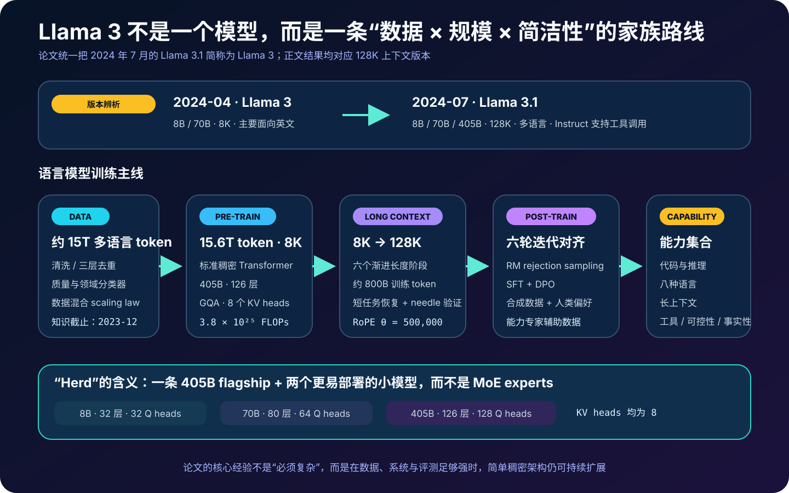
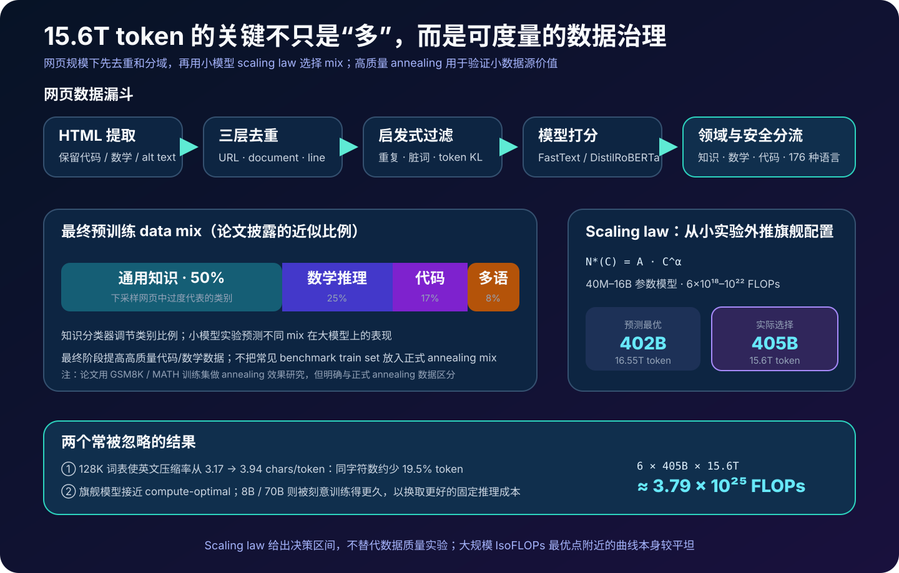
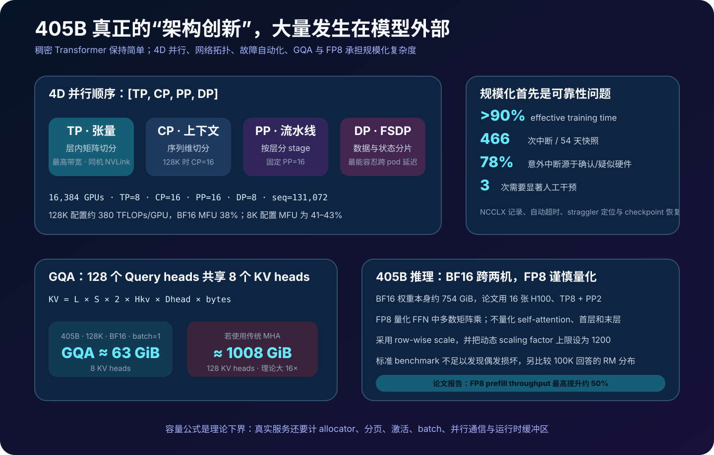
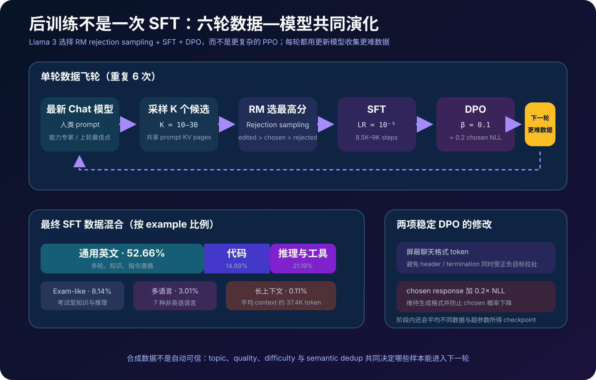
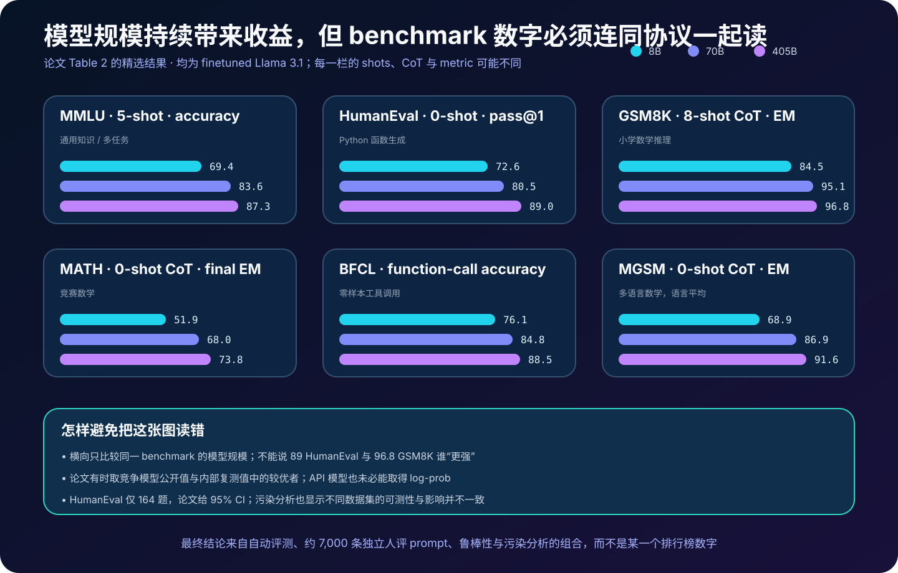
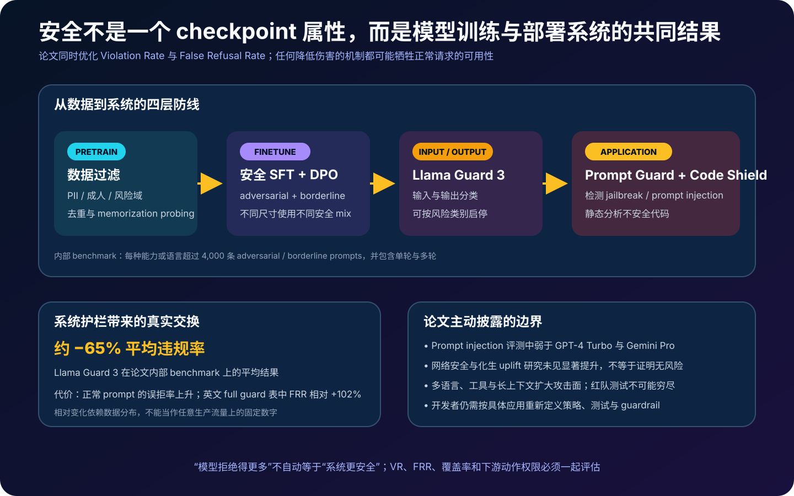

# Llama 3 详解：15.6T Token、405B 稠密模型与六轮后训练怎样组成一个 Herd


> **论文**：*The Llama 3 Herd of Models*  
> **作者**：The Llama 3 Herd of Models Authors（Meta）  
> **首次公开**：2024 年 7 月 23 日；arXiv 首次提交于 2024 年 7 月 31 日  
> **本文依据**：[arXiv v3](https://arxiv.org/abs/2407.21783) · [论文 HTML](https://arxiv.org/html/2407.21783) · [论文 PDF](https://arxiv.org/pdf/2407.21783) · [Meta 研究页](https://ai.meta.com/research/publications/the-llama-3-herd-of-models/) · [官方模型卡](https://github.com/meta-llama/llama-models/blob/main/models/llama3_1/MODEL_CARD.md)  
> **关键词**：Dense Transformer、Data Curation、Scaling Law、GQA、Long Context、Rejection Sampling、DPO、Tool Use、Safety  
> **配套代码**：[llama3_systems_minimal.py](code/llama3_systems_minimal.py)  
> **前置阅读**：[Transformer](00_Transformer_2017_原理.md) · [Scaling Laws](06_Scaling_Laws_2020_原理.md) · [Chinchilla](12_Chinchilla_2022_原理.md) · [LLaMA](15_LLaMA_2023_原理.md) · [DPO](23_DPO_2023_原理.md) · [GQA](44_GQA_2023_原理.md) · [OLMo](39_OLMo_2024_原理.md)

> [!IMPORTANT]
> 论文为了叙述简洁，把 2024 年 7 月发布的 **Llama 3.1 8B / 70B / 405B** 统一简称为 “Llama 3”。它们具有 128K 上下文和多语言能力，不应与 2024 年 4 月首发、主要面向英语且上下文为 8K 的 Llama 3 8B / 70B 混为一谈。本文随论文使用 “Llama 3”，涉及发布边界时写明 “Llama 3.1”。

> [!NOTE]
> 配套代码是零依赖教学实现：它验证架构算术、GQA KV Cache、RoPE、跨文档注意力掩码、rejection sampling 和带 NLL 正则的 DPO。它不是 Meta 官方训练代码，不加载权重，也不能复现论文 benchmark。

如果只把这篇论文理解成“Meta 训练了一个 405B 模型”，会错过它真正有价值的部分。

论文标题用的是 **Herd（模型群）**。它试图说明：前沿语言模型不是某个孤立 checkpoint，而是一整套互相耦合的选择——数据怎样筛、规模怎样定、万卡训练怎样不断、后训练数据怎样自举、128K 上下文怎样补上、工具与安全怎样接入，以及大模型怎样反过来给小模型生产训练信号。

Llama 3 最值得读的，不是一个新奇网络模块，而是一个判断：

> 在足够高质量的数据、足够可靠的基础设施和足够细致的后训练配方下，结构朴素的稠密 Transformer 仍能扩展到前沿能力。

这也是论文最容易被低估之处。它没有用 MoE，没有用复杂的强化学习算法，没有声称解决安全，更没有把所有模态统一端到端训练。作者主动选择较简单、较稳定、较容易预测的组件，把复杂度放进了数据和系统。

---

## 0. 先说结论

读完本文，至少应记住下面十八点：

1. **405B 是稠密 Transformer，不是 MoE**。每个 token 都经过全部模型参数；论文把能力提升主要归因于数据、规模和训练配方。
2. **旗舰模型用了 15.6T 训练 token，约为 Llama 2 最大模型的 8.7 倍**；论文将总训练计算量估为 $3.8\times10^{25}$ FLOPs，约为上一代最大模型的 50 倍。
3. **405B 接近给定预算下的 compute-optimal，8B / 70B 则有意过度训练**。小模型服务成本更低，预训练成本可以被大量推理请求摊薄。
4. **数据不是“抓完就训”**。流水线包含 HTML 提取、PII/成人与不安全域过滤、URL/文档/行级去重、质量分类、领域分类、语言识别和最终混合。
5. **最终预训练混合约为 50% 通用知识、25% 数学与推理、17% 代码、8% 多语言**。这是分类后的训练配方，不等于互联网本身的自然比例。
6. **词表从 32K 扩至 128K**。同一英文字符数下，论文报告压缩率由 3.17 增至 3.94 字符/token；本文推得 token 数约少 19.5%。
7. **三个尺寸都使用 8 个 KV heads 的 GQA**。对 405B、128K、BF16、batch 1，理论 KV Cache 约 63 GiB；若改成 128-head MHA，则约 1008 GiB，相差 16 倍。
8. **packing 时使用 document mask**，后一个文档不能注意前一个文档。没有它，长序列吞吐优化会悄悄引入训练分布污染。
9. **长上下文不是从第一个 token 就训练**。模型先完成主体预训练，再把上下文从 8K 分六阶段扩到 128K，共使用约 800B token。
10. **论文里有两个容易混淆的“退火”实验**：候选数据源评估用 40B token；最终模型最后阶段则用约 40M token 高质量数据把学习率线性降至零。
11. **405B 训练最多使用 16,384 张 H100**，结合 Tensor、Context、Pipeline、Data 四种并行；长上下文配置的模型 FLOPs 利用率约 38%。
12. **系统可靠性本身是一项研究结果**。一次 54 天快照中记录 466 次作业中断；绝大多数意外中断与硬件有关，但最终只有 3 次需要显著人工介入。
13. **后训练共迭代六轮**，主干是 reward model、rejection sampling、SFT 和 DPO，而不是 PPO。典型 prompt 会生成 10–30 个候选再由 RM 选优。
14. **DPO 做了两项重要改造**：不优化控制格式的特殊 token；在偏好损失之外给 chosen response 加 $0.2$ 倍 NLL 正则，避免偏好优化牺牲语言建模质量。
15. **合成数据不是“让 405B 自己无限写题”**。代码能力中，执行器、解析器、编译器和单元测试提供外部正确性信号；论文发现只用 405B 自生成数据可能无益甚至退化。
16. **128K 能力靠精确配比维持**。长上下文合成样本只占 SFT 的约 0.1%；直接追加普通短上下文 SFT 会让长上下文能力回退。
17. **安全是分层缓解，不是保证**。论文同时训练安全拒答，评估 violation / false refusal，并提供 Llama Guard 3、Prompt Guard、Code Shield；防护降低违规也可能提高误拒率。
18. **视觉、视频、语音章节展示的是组合式研究实验**。语言模型被冻结，再接编码器和适配器；这些实验不等于公开发布了对应的多模态 Llama 3.1 权重。

全篇可以压缩成一条链：

```text
网页与代码语料
   ↓ 解析 / 过滤 / 去重 / 分类 / 配比
15.6T token
   ↓ 规模预测 + 405B 稠密预训练 + 万卡容错
8B / 70B / 405B base models
   ↓ 6 rounds: RM → RS → SFT → DPO
指令、代码、数学、多语言、长上下文、工具能力
   ↓ 系统提示 + 输入/输出分类器 + 代码扫描
可部署但仍有边界的 model herd
```

---

## 1. 先把版本、开放方式与发布边界说清楚

### 1.1 “Llama 3”在论文里指什么

版本名是理解结果表的第一道门槛：

| 时间 | 名称 | 尺寸 | 上下文 | 论文中的位置 |
|---|---|---:|---:|---|
| 2024-04 | Llama 3 | 8B、70B | 8K | 早期公开版本，不是本文所有主结果的精确对象 |
| 2024-07 | Llama 3.1 | 8B、70B、405B | 128K | 本文主角；论文简称 Llama 3 |
| 论文研究实验 | 视觉 / 视频 / 语音适配 | 以冻结 LM 为核心 | 任务相关 | 展示方法与结果，不代表同批公开权重 |

因此看到“Llama 3 405B”时，通常应读作“Llama 3.1 405B”。看到 128K、多语言和 tool use 结果时，也不能套到 4 月版 8K checkpoint 上。

### 1.2 开放权重不等于 OSI 意义的开源软件

模型卡提供权重、推理接口、可接受使用政策和 **Llama 3.1 Community License**。这极大推动了部署、微调和研究，但许可证带有使用条款，因此更准确的表述是：

- **开放权重 / 公开发布模型**；
- 不是“训练全过程可复现”：完整 15.6T 数据集、全部过滤器、标注数据、基础设施实现并未一并发布；
- 也不宜不加限定地称为 OSI 定义的开源软件。

这种精确用词不是吹毛求疵。它决定研究者到底能验证模型权重、训练配方，还是数据来源与完整实验链。

### 1.3 “Herd”不是营销修辞

同一家族中的模型承担不同角色：

- 405B 接近训练预算下的前沿上限，也可作为合成数据和评审模型；
- 70B 在能力与服务成本之间折中；
- 8B 面向资源受限部署；
- Base checkpoint 保留续写接口；
- Instruct checkpoint 才是对话、工具和安全后训练的主要载体；
- 外围 guard models 负责输入输出分类，不能与生成模型本体混为一谈。



---

## 2. 数据：15.6T Token 不是数量故事，而是治理故事

### 2.1 数据截止时间与风险过滤

论文语料知识截止到 2023 年末。预处理先排除已知包含大量个人身份信息、不安全内容或成人内容的域，再处理剩余网页。

需要避免两种极端解读：

- 做过过滤，不代表训练集没有隐私、偏见或有害内容；
- 数据不完全公开，也不代表论文什么都没有披露。论文给出了相当具体的过滤层次、分类器和混合比例，但第三方无法逐条审计输入文档。

### 2.2 HTML 提取：格式本身也会改变模型

团队构建自定义 HTML parser，目标是保留：

- 正文层级；
- 数学公式；
- 代码；
- 图片的 alt text。

同时去掉导航、样板和低信息标记。一个反直觉发现是：在他们的对照实验里，保留 Markdown 标记反而伤害了质量，因此最终将其移除。

这说明“网页清洗”不是单纯抽文本。保留什么结构、删除什么符号，会改变 token 分布，也会改变模型学到的写作习惯。

### 2.3 三层去重解决三类重复

论文不是只做一次 hash：

1. **URL 级去重**：同一 URL 的多个版本保留最新版本；
2. **文档级去重**：用 MinHash 找全局近重复文档；
3. **行级去重**：在每个 3000 万文档窗口内，删除出现超过 6 次的重复行。

行级去重尤其适合清除页眉、页脚、版权声明和模板广告。仅做文档去重会漏掉这些跨站点重复片段。

### 2.4 规则过滤与学习式质量分类器

规则层考察：

- 重复 n-gram 比例；
- “脏词”或异常符号；
- 文档 token 分布与参考分布的 KL divergence；
- 文本长度、格式等启发式信号。

学习式层则把较强模型的判断蒸馏到便宜分类器：

- FastText 和 DistilRoBERTa 质量分类器；
- 由 Llama 2 辅助标注的高质量 / 低质量样本；
- 面向代码、数学等领域的 DistilRoBERTa 分类器。

强模型标注、轻模型扫全库，是数据工程里常见的成本分解：

$$
\text{昂贵但稀疏的 teacher labels}
\rightarrow
\text{便宜而密集的 student scores}.
$$

### 2.5 多语言并不是最后翻译一遍

数据流水线覆盖 176 种语言的识别，并针对语言分别去重、过滤。最终发布模型重点支持英语、德语、法语、意大利语、葡萄牙语、印地语、西班牙语和泰语。

这里要区分：

- 数据管线能够识别的语言集合；
- 后训练重点覆盖的语言集合；
- 模型在任意语言上“可能有能力”的集合。

三者不是同一个承诺。

### 2.6 最终混合是一个优化变量

论文给出的最终预训练数据混合为：

| 数据类别 | 比例 |
|---|---:|
| 通用知识 | 50% |
| 数学与推理 | 25% |
| 代码 | 17% |
| 多语言 | 8% |



比例不是一次性猜出来的。团队用小规模预训练、下游 benchmark 和 **annealing experiment** 比较候选数据源：先训练到约 50% 进度，再用 40B token 把学习率降到零，其中候选数据占 30%、默认混合占 70%，观察加入该来源后是否改善目标能力。

> [!CAUTION]
> 论文额外报告：把 GSM8K / MATH 训练集加入某个 8B 数据实验，可分别提高约 24.0 / 6.4 个百分点，而在 405B 上收益可以忽略。正式的退火混合排除了常见 benchmark 训练集；不要把这个消融实验误写成最终模型“用测试题训练”。

这个结果还揭示了规模与数据的交互：小模型可能非常依赖任务形态高度匹配的数据，大模型则能从更广泛语料中学出可迁移能力。

---

## 3. 架构：为什么选择“简单的稠密 Transformer”

### 3.1 三个尺寸的公开配置

| 配置 | 8B | 70B | 405B |
|---|---:|---:|---:|
| Transformer 层数 | 32 | 80 | 126 |
| 模型维度 | 4,096 | 8,192 | 16,384 |
| FFN 维度 | 14,336 | 28,672 | 53,248 |
| Query heads | 32 | 64 | 128 |
| KV heads | 8 | 8 | 8 |
| Head dimension | 128 | 128 | 128 |
| 峰值学习率 | $3\times10^{-4}$ | $1.5\times10^{-4}$ | $8\times10^{-5}$ |
| 词表 | 128K | 128K | 128K |

共同组件包括 decoder-only Transformer、SwiGLU、RoPE 和 GQA。论文没有引入稀疏路由；405B 的每次前向都使用全部层和全部稠密 FFN。

为什么不选 MoE？作者的核心权衡是：在如此大的训练规模上，稳定性、可预测性和系统成熟度比理论 FLOPs 优势更重要。这不证明稠密网络永远优于 MoE，只说明 Llama 3 项目选择了更低的架构风险。

### 3.2 128K 词表：先减少序列，再谈算力

tokenizer 由约 10 万个 `tiktoken` token 加约 2.8 万个非英语 token 构成。论文报告英文压缩率：

$$
r_{\text{old}}=3.17\ \text{chars/token},\qquad
r_{\text{new}}=3.94\ \text{chars/token}.
$$

对同一字符数 $H$：

$$
\frac{T_{\text{new}}}{T_{\text{old}}}
=\frac{H/3.94}{H/3.17}
=\frac{3.17}{3.94}\approx0.805.
$$

因此本文推导：token 数约减少 19.5%。若只看稠密 attention matrix 的 pair 数，则理论降幅为：

$$
1-0.805^2\approx35.3\%.
$$

这不是端到端吞吐提升——embedding、MLP、通信和 padding 不按 $T^2$ 同比例缩放——但它解释了 tokenizer 为什么也是系统设计。

### 3.3 GQA：128 个 Q heads 只配 8 个 KV heads

在 GQA 中，多个 query head 共享一组 K/V：

$$
g(h_q)=\left\lfloor
\frac{h_q}{H_Q/H_{KV}}
\right\rfloor.
$$

405B 有 $H_Q=128$、$H_{KV}=8$，所以每 16 个 query heads 共享一个 KV head。

单个 batch item、某一数据类型下的 KV cache 理论容量为：

$$
M_{KV}
=L\times T\times2\times H_{KV}\times d_h\times b,
$$

其中 $L$ 是层数、$T$ 是上下文长度、2 表示 K 与 V、$d_h$ 是 head dimension、$b$ 是每元素字节数。

代入 405B 的 $L=126,T=131072,H_{KV}=8,d_h=128,b=2$：

$$
M_{KV}^{\text{GQA}}=63\ \text{GiB}.
$$

若使用 128-head MHA，则为 1008 GiB。注意这只是 cache 本体，不含权重、激活、allocator 碎片和运行时缓冲区。

### 3.4 RoPE 与 document mask

模型把 RoPE 基频设为 $\theta=500,000$。对二维分量 $(x_{2i},x_{2i+1})$，位置 $p$ 对应旋转：

$$
\begin{bmatrix}x'_{2i}\\x'_{2i+1}\end{bmatrix}
=
\begin{bmatrix}
\cos\omega_i p&-\sin\omega_i p\\
\sin\omega_i p&\cos\omega_i p
\end{bmatrix}
\begin{bmatrix}x_{2i}\\x_{2i+1}\end{bmatrix},
\qquad
\omega_i=\theta^{-2i/d_h}.
$$

当多个文档 pack 到同一序列，注意力掩码还要满足：

$$
M_{ij}=
\mathbb 1[j\le i]\cdot
\mathbb 1[\operatorname{doc}(i)=\operatorname{doc}(j)].
$$

普通 causal mask 只有第一项；Llama 3 再加入第二项，阻止不同文档串线。对文档编号 `[0,0,0,1,1]`：

```text
● · · · ·
● ● · · ·
● ● ● · ·
· · · ● ·
· · · ● ●
```

这项看似不起眼，却让高效 packing 与正确训练语义可以同时成立。

---

## 4. 扩展律：先用小实验预测 405B

### 4.1 IsoFLOPs 曲线怎样给出最佳尺寸

团队训练 40M 到 16B 参数的模型，覆盖 $6\times10^{18}$ 到 $10^{22}$ FLOPs。对每个固定计算预算 $C$，改变模型参数 $N$ 和 token 数 $D$，寻找验证损失最低点，再拟合：

$$
N^*(C)=A C^\alpha.
$$

论文拟合得到 $\alpha\approx0.53$、$A\approx0.29$（应按论文拟合单位解释，不能把裸常数直接套进任意单位）。外推到计划的 $3.8\times10^{25}$ FLOPs，得到：

$$
N^*\approx402\text{B},\qquad D^*\approx16.55\text{T}.
$$

最终选择 405B 参数与 15.6T token，落在预测附近。用稠密 Transformer 常见近似复算：

$$
C\approx6ND
=6\times405\times10^9\times15.6\times10^{12}
=3.7908\times10^{25}\ \text{FLOPs}.
$$

这不是从参数表“神奇推出”全部真实成本，而是一个非常有用的数量级校验。

### 4.2 为什么 8B / 70B 不照 compute-optimal 训练

Compute-optimal 通常回答：固定一次训练预算，怎样组合 $N$ 和 $D$ 使训练损失最低。但产品还要支付所有请求的推理成本：

$$
C_{\text{life}}
=C_{\text{train}}(N,D)
+Q\cdot C_{\text{infer}}(N,T),
$$

其中 $Q$ 是生命周期请求量。

当 $Q$ 很大，选择更小的 $N$、投入更多训练 token，可能有更低总成本。因此：

- 405B 服务昂贵，项目让它接近训练 compute-optimal；
- 8B / 70B 则明显训练更久，以换取固定模型尺寸下更强能力。

这延续了 Chinchilla/LLaMA 路线，但目标函数从“一次训练最优”变成“模型生命周期更实用”。

### 4.3 从训练损失预测下游准确率

团队还构造两段映射：

```text
training FLOPs → normalized negative log-likelihood → benchmark accuracy
```

第一段由扩展实验拟合，第二段用 sigmoid 把任务 NLL 映射到准确率，并利用 scaling models 与 Llama 2 结果校准。ARC 等任务在跨越约四个数量级计算量后仍有可用预测，尽管最终成绩并非逐点完美命中。

它的意义不是“benchmark 已被公式解决”，而是前沿训练前可以建立风险仪表盘：如果能力曲线明显偏离预测，团队能更早检查数据、优化器或系统故障。

---

## 5. 预训练配方：主体训练、长上下文与最终退火

### 5.1 405B 的优化器与 batch schedule

旗舰模型使用 AdamW，峰值学习率 $8\times10^{-5}$：

- 前 8,000 steps 线性 warmup；
- 再用 cosine schedule，在约 120 万步内降到 $8\times10^{-7}$；
- 初始序列长度 4,096、batch 为 400 万 token；
- 训练 252M token 后，切到 8,192 长度、800 万 token batch；
- 训练 2.87T token 后，增到 1,600 万 token batch。

batch 增大并不改变模型目标，但能提高稳定阶段的硬件效率。团队还在训练途中增加非英语、数学、较新数据，降低一部分低质量数据权重——最终数据 mix 不是开跑后永不改变的静态配方。

### 5.2 长上下文是后置课程学习

主体预训练后，团队用约 800B token 把上下文从 8K 扩到 128K，分六个阶段逐步增加长度。每次晋级要同时满足：

1. 短上下文 benchmark 恢复；
2. 当前长度的 needle-in-a-haystack 达到近乎完美。

这种门控比“一次把 position length 改成 128K”稳健，因为长序列会同时改变优化难度、位置分布、并行通信和 batch 组成。

### 5.3 最终 40M token 退火与 checkpoint averaging

最终阶段使用高质量混合、128K 上下文，把学习率线性降到零，并对多个 checkpoint 做平均。论文正文给出的最终退火量约为 **40M token**。

请与数据源评估的 **40B-token annealing experiment** 区分：

| 环节 | 规模 | 目的 |
|---|---:|---|
| 候选数据源退火实验 | 40B token | 低成本比较数据来源是否提高能力 |
| 最终模型退火 | 约 40M token | 高质量收尾、学习率归零、得到最终 checkpoint |

两者相差三个数量级，角色也完全不同。

---

## 6. 万卡训练系统：四维并行与“不断训”的工程



### 6.1 为什么需要四个并行维度

405B 的 BF16 权重本身约为：

$$
405\times10^9\times2\ \text{bytes}
\approx754.4\ \text{GiB}.
$$

训练还要保存梯度、优化器状态、激活和通信 buffer，所以单一并行方式不够。Llama 3 组合：

- **TP（Tensor Parallel）**：切层内矩阵；通信最频繁，优先放在高速域；
- **CP（Context Parallel）**：切序列，128K 训练的关键；
- **PP（Pipeline Parallel）**：把不同层分给不同 stage；
- **DP / FSDP**：复制计算、分片参数与状态，扩展总吞吐。

维度排列遵循通信需求：越高带宽、越低延迟的并行，越靠近物理网络的快速层级。

### 6.2 论文披露的代表性配置

| GPU 数 | TP | CP | PP | DP | 序列 | tokens/batch | 每 GPU TFLOPs | MFU |
|---:|---:|---:|---:|---:|---:|---:|---:|---:|
| 8,192 | 8 | 1 | 16 | 64 | 8,192 | 16M | 430 | 43% |
| 16,384 | 8 | 1 | 16 | 128 | 8,192 | 16M | — | 41% |
| 16,384 | 8 | 16 | 16 | 8 | 131,072 | 16M | — | 38% |

MFU 是模型 FLOPs 与硬件理论峰值之比，不等于 GPU 所有单元利用率，也不等于端到端作业时间的 38%。长上下文配置下降，反映了 CP 通信、调度和序列计算的额外代价。

### 6.3 Context Parallel 的关键是让通信可承受

CP 将序列切成对称 chunk，各 rank 交换 K/V 以完成全局注意力。GQA 只有 8 个 KV heads，因此要通信的 K/V 远小于 128-head MHA，这使长上下文并行的开销相对可控。

论文还披露了：

- 梯度 accumulation 与 reduce-scatter 使用 FP32，提高稳定性；
- 自定义 pipeline 调度可调 microbatch group、平衡层数、交错执行并异步 P2P；
- pipeline bubble 近似为 $(P-1)/(V\cdot M)$，其中 $P$ 为 stage 数、$V$ 为交错虚拟 stage、$M$ 为 microbatch 数；
- 优化 NCCL/NCCLX 集合通信；
- 训练数据存储约 240 PB，可持续读取约 2 TB/s、峰值约 7 TB/s。

### 6.4 可靠性比峰值 FLOPs 更决定总工期

训练最多使用 16K 张 80GB H100，集群采用 400 Gbps RoCE。论文报告有效训练时间超过 90%。在一个 54 天快照中：

- 共 466 次中断；
- 47 次计划内，419 次意外；
- 意外中断中约 78% 已确认或疑似硬件问题；
- GPU 问题约占全部意外中断的 58.7%；
- 只有 3 次需要显著人工介入。

自动诊断、替换故障节点、checkpoint 与恢复流程，才让“16K GPU”从峰值新闻变成实际训练吞吐。团队甚至观察到环境温度导致 1%–2% 的昼夜吞吐变化；几十兆瓦级作业会把机房物理条件直接写进 loss curve 的墙钟时间。

---

## 7. 后训练总览：六轮数据飞轮，而不是一次 RLHF



每一轮大致遵循：

```text
当前最强 checkpoint
  ├─ 对每个 prompt 采样 K≈10–30 个回答
  ├─ reward model 排序，保留高质量候选
  ├─ 人类偏好与专项合成数据清洗
  ├─ SFT
  └─ DPO
        ↓
下一轮更强 checkpoint，再生产更好的数据
```

这种迭代解决一个根本问题：固定在早期模型上生成的数据，会限制后期模型。当前最佳模型产生新候选，数据难度与质量才能跟着模型能力一起上升。

### 7.1 Reward model 怎样训练

RM 从预训练 checkpoint 初始化，输入同一 prompt 的多条回答，学习偏好顺序。论文的标注优先级包括：

```text
edited > chosen > rejected
```

与 Llama 2 相比，Llama 3 去掉额外 margin term，并把同一 prompt 的多条回答随机排列后拼进一行，提升训练效率。

偏好数据中约：

| 类型 | 比例 |
|---|---:|
| 通用对话 | 81.99% |
| 代码 | 6.93% |
| 多语言 | 5.19% |
| 推理与工具 | 5.89% |

RM 可利用跨轮次数据；DPO 更偏向使用最近模型产生的 on-policy 数据。标注中的 “significantly better / better” 会保留，而 “slightly / marginally better” 的噪声更大，通常不用于同样强的训练信号。

### 7.2 Rejection sampling：大规模 best-of-K

对 prompt $x$ 采样候选：

$$
y_1,\ldots,y_K\sim\pi(\cdot\mid x),
\qquad
y^*=\arg\max_{y_i}r_\phi(x,y_i).
$$

典型 $K$ 为 10–30。系统实现共享 prompt 的 KV pages、用 PagedAttention 管理候选，并限制每批最大输出容量，论文称吞吐提高超过 2 倍。

这不是“RM 保证选中真答案”。RM 学的是人类偏好 proxy；代码与数学还需要执行或验证信号降低 reward hacking。

### 7.3 SFT：只对回答 token 计算损失

对话 prompt 不作为训练目标，损失只落在 assistant response：

$$
\mathcal L_{\text{SFT}}
=-\sum_{t\in\text{assistant tokens}}
\log\pi_\theta(y_t\mid x,y_{<t}).
$$

最大模型的 SFT 学习率约 $10^{-5}$，训练约 8.5K–9K steps。SFT 数据大致由通用、代码、多语言、考试、推理/工具和极少量长上下文样本组成。

### 7.4 为什么用 DPO，而不是 PPO

论文选择 DPO，原因是计算更简单，并在其内部比较中表现更好，尤其是 IFEval。基本目标为：

$$
\mathcal L_{\text{DPO}}
=-\log\sigma\left(
\beta\left[
\log\frac{\pi_\theta(y^+\mid x)}{\pi_{\text{ref}}(y^+\mid x)}
-
\log\frac{\pi_\theta(y^-\mid x)}{\pi_{\text{ref}}(y^-\mid x)}
\right]
\right).
$$

Llama 3 使用约 $10^{-5}$ 学习率、$\beta=0.1$，并改成：

$$
\mathcal L
=\mathcal L_{\text{DPO}}
+0.2\,\mathcal L_{\text{NLL}}(y^+).
$$

还有一个很实用的细节：header / termination 等特殊格式 token 被 mask，不让 DPO 通过偏好对比把聊天协议本身扭坏。

### 7.5 Model averaging 不是装饰

RM、SFT、DPO 阶段都采用 checkpoint/model averaging。对处于不同局部位置的权重取平均，常能降低单点 checkpoint 波动。论文没有把它包装成新算法，但在超大规模流水线里，这类低风险稳定器往往比复杂技巧更重要。

---

## 8. 后训练数据：合成只是开始，筛选才决定上限

### 8.1 SFT 混合长什么样

论文披露的 SFT 数据分布约为：

| 类别 | 比例 |
|---|---:|
| 通用 | 52.66% |
| 代码 | 14.89% |
| 多语言 | 3.01% |
| 考试类 | 8.14% |
| 推理与工具 | 21.19% |
| 长上下文 | 0.11% |

比例总和受四舍五入影响。长上下文样本平均 context 约 37,395 token，虽然数量极少，单样本 token 成本并不小。

### 8.2 清洗目标不只是“答案正确”

团队清除或降低：

- 过量 emoji、感叹号；
- 不必要的道歉和自我指涉；
- 格式异常、风格机械的合成回答；
- 低难度、低信息量或与现有样本近重复的回答。

然后组合多个评分器：主题分类器、RM 质量、Llama 质量判断、Instag/Llama 难度估计。质量判断在高分区分歧较大，所以团队采用较宽松的组合逻辑，避免一个分类器的假阴性丢掉好样本。

语义去重不是全局盲删：先用 RoBERTa embedding 聚类，再在近重复簇中优先保留 `质量 × 难度` 更高的样本。目标不是让语料“每句都唯一”，而是降低重复梯度，把训练预算留给更难、更好的监督。

### 8.3 这是一个受控的数据飞轮

可以把六轮后训练抽象为：

$$
\mathcal D_{t+1}
=\operatorname{Filter}
\left(
\operatorname{Annotate}
\left[
\operatorname{Sample}(\pi_t,\mathcal P_t)
\right]
\right),
$$

$$
\pi_{t+1}
=\operatorname{DPO}
\left(
\operatorname{SFT}(\pi_t,\mathcal D_{t+1})
\right).
$$

但它不是完全自动自举：prompt 来源、人类偏好、执行反馈、领域分类和安全政策持续注入外部约束。若去掉这些锚点，数据飞轮很容易变成模型放大自身错误的回音室。

---

## 9. 专项能力是怎样做出来的

### 9.1 代码：执行反馈比自我模仿更重要

代码方向先建立一个 code expert：从预训练 checkpoint 继续训练约 1T token，其中代码占 85% 以上，再做 16K long-context finetuning 和对齐。最终主模型并不是简单替换成专家，而是把专家产生的数据和经验回流到统一模型。

论文报告超过 270 万条代码相关合成样本，关键来源包括：

1. **执行反馈对话**：生成代码，交给 parser、linter、编译器、单元测试或 Python 执行器；
2. **错误修复**：约 20% 的初始错误样本在反馈后能自我修正；
3. **代码翻译**：源语言程序转换到目标语言，用编译和测试验证语义；
4. **backtranslation**：先从代码生成问题，再训练问题到代码，规模约 120 万条。

最值得记住的负结果是：只让 405B 自己生成代码监督，未必提高能力，甚至会退化。有效飞轮需要：

$$
\text{generation diversity}
+\text{external execution}
+\text{quality filtering}.
$$

### 9.2 数学与推理：从答案过滤到步骤搜索

数学 prompt 来自预训练数据和人工技能 taxonomy。模型生成 chain-of-thought 后，流水线使用：

- 最终答案匹配；
- 自验证；
- outcome / step reward model；
- 对困难问题采用 MCTS 寻找可验证轨迹；
- 文本推理与 Python 执行互相补充；
- 执行错误回传后再修正。

它与单纯蒸馏 CoT 的差别在于：中间思路必须经过答案、步骤或程序执行信号筛选。模型仍可能学到 verifier 的偏差，所以论文没有把“被筛中”写成数学证明。

### 9.3 多语言：专家分支和有限重点语言

多语言 expert 用约 90% 多语言数据继续预训练。SFT 多语言数据构成为：

| 来源 | 比例 |
|---|---:|
| 人工标注 | 2.4% |
| NLP 任务 | 44.2% |
| Rejection sampling | 18.8% |
| 翻译后的推理数据 | 34.6% |

团队一般避免把英语答案大规模直译成目标语言，以减少 translationese 和文化偏差；定量推理是例外，因为数学结构更容易跨语言验证。

模型卡重点声明支持八种语言。不要把预训练 language ID 的 176 类误写成“官方支持 176 种语言”。

### 9.4 长上下文：0.1% 样本解决遗忘

长上下文监督包括：

- 合成长文 QA；
- 分层摘要；
- 代码仓库依赖追踪与缺失文件恢复；
- 16K / 32K / 64K / 128K 分桶。

一个关键消融是：长上下文 SFT 后继续普通短 SFT，会让长上下文能力回退；把约 0.1% 长样本持续混进 SFT，短任务与长任务更能兼得。DPO 步数较少，只用短数据时回退没那么明显，但前提是 SFT 已经把能力稳住。

这说明上下文长度不是配置文件里的一个整数，而是训练分布中的持续约束。

### 9.5 Tool use：函数格式、调用时机与多步规划

内置工具实验重点包括 Brave Search、Python 和 Wolfram Alpha。通用函数调用覆盖：

- Python object/function 表达；
- JSON schema；
- 单函数、嵌套、并行调用；
- 多轮调用；
- 根据问题决定“不调用”。

数据先以合成方式启动，再由人类做 message-level preference 标注。工具方向的 rejection sampling 没有带来稳定收益，因此没有机械套用所有通用后训练步骤。

这也是工程上的重要提醒：统一后训练框架不等于所有能力都该使用同一种数据生成算法。

### 9.6 事实性与“知道自己不知道”

后训练很难凭空加入稳定新事实，更现实的目标是让模型校准已有知识。团队从预训练文本片段生成问题，对同一问题多次采样，再判断回答的正确性和信息量：

- 一贯正确：训练直接回答；
- 一贯提供信息但回答错误：构造合适的拒答；
- 不稳定：谨慎加入监督。

这是一种行为校准，不代表模型内部存在完美可查询的知识数据库，也不保证拒答就是不知道。

---

## 10. 结果：强在哪，以及表格没有告诉你什么



### 10.1 论文表 2 的代表性结果

下面摘录 v3 中 **finetuned / instruct** 模型的部分结果。不同任务的 shots、prompt、评分器不同，只适合纵向看家族规模效应，不应把数值直接混成一个平均分。

| Benchmark | 8B | 70B | 405B | 主要测量 |
|---|---:|---:|---:|---|
| MMLU, 5-shot | 69.4 | 83.6 | 87.3 | 广泛知识 |
| MMLU, 0-shot CoT | 73.0 | 86.0 | 88.6 | 知识 + 推理提示 |
| MMLU-Pro | 48.3 | 66.4 | 73.3 | 更难的知识选择题 |
| IFEval | 80.4 | 87.5 | 88.6 | 可验证指令遵循 |
| HumanEval | 72.6 | 80.5 | 89.0 | Python 函数生成 |
| MBPP EvalPlus | 72.8 | 86.0 | 88.6 | 代码执行测试 |
| GSM8K | 84.5 | 95.1 | 96.8 | 小学数学推理 |
| MATH | 51.9 | 68.0 | 73.8 | 竞赛数学 |
| ARC-Challenge | 83.4 | 94.8 | 96.9 | 科学选择题 |
| GPQA | 32.8 | 46.7 | 51.1 | 高难科学问答 |
| BFCL | 76.1 | 84.8 | 88.5 | 函数调用 |
| Nexus | 38.5 | 56.7 | 58.7 | 工具调用 |
| MGSM | 68.9 | 86.9 | 91.6 | 多语言数学 |

长上下文代表结果：

| Benchmark | 8B | 70B | 405B |
|---|---:|---:|---:|
| ZeroSCROLLS QuALITY | 81.0 | 90.5 | 95.2 |
| InfiniteBench En.MC | 65.1 | 78.2 | 83.4 |
| Multi-needle retrieval | 98.8 | 97.5 | 98.1 |

Multi-needle 接近满分，不代表 128K 中任意推理都接近满分。检索“针”与跨文档综合、隐含因果、代码仓库理解是不同难度。

### 10.2 与闭源模型比较要先看协议

论文称 405B Instruct 在许多任务上可与 GPT-4、GPT-4o、Claude 3.5 Sonnet 等前沿模型竞争。但比较表有几个限定：

- 有些竞争模型取公开报告的最佳值，有些由团队重跑；
- prompt、shots、采样、工具能力和发布日期不同；
- HumanEval 只有 164 题，百分数差异的置信区间很宽；
- 部分模型可原生处理论文评测之外的模态，能力边界并不相同。

对于二项准确率 $\hat p$、样本量 $n$，一个粗略标准误差为：

$$
\operatorname{SE}(\hat p)
\approx\sqrt{\frac{\hat p(1-\hat p)}{n}}.
$$

在小 benchmark 上，1–2 个百分点很可能只是少数题的差异。榜单顺序不能替代逐题和置信区间分析。

### 10.3 约 7,000 prompts 的人类偏好评测

团队使用近 7,000 条 prompt，覆盖英语通用、推理、代码、印地语、西班牙语、葡萄牙语和多轮场景；难度分布约为 10% easy、30% medium、60% hard，并与模型开发团队隔离。

标注者使用七级成对偏好。结果大意是：405B 与 GPT-4-0125 整体相近，与 GPT-4o / Claude 3.5 Sonnet 互有胜负；Claude 在推理和代码上更强，GPT-4 在部分多语言场景更强。

但人类偏好还会受语气、结构、长度和拒答风格影响。它测的是“人更喜欢哪条输出”，不是纯粹事实正确率。

### 10.4 污染分析为什么不能给出清白证明

论文用 8-gram overlap 检测 benchmark 与预训练语料重叠，并估计去掉重叠样本后的分数变化。HellaSwag、PIQA 的估计影响较高；HumanEval、MBPP、MMLU/MMLU-Pro 因自然或模板重叠太多，难以可靠估计；MATH 约 1% 样本被标记，但估计没有明显得分收益。

正确结论是：

- 团队做了污染审计，并诚实报告方法失效的任务；
- n-gram 检测会漏掉改写、翻译和语义等价；
- “未检测到显著影响”不等于“证明完全无污染”。

---

## 11. 安全：能力、安全训练与部署防线分层处理



### 11.1 两个指标要同时看

论文内部评测每个能力 / 语言包含 4,000 多条 adversarial 或 borderline prompts，核心指标是：

$$
\operatorname{VR}
=\frac{\#\text{unsafe responses}}{\#\text{unsafe or adversarial prompts}},
$$

$$
\operatorname{FRR}
=\frac{\#\text{unnecessary refusals}}{\#\text{benign or borderline prompts}}.
$$

只压低 violation rate 很容易得到“什么都拒绝”的模型，所以 false refusal 必须同时报告。

### 11.2 模型内安全后训练

安全数据覆盖明确危险、边界场景、对抗改写和不同语气。流程也使用 SFT + DPO，但不同尺寸模型所需安全数据比例不同：小模型更容易忘记或泛化不足，需要更高比例的安全监督。

团队还做“rainbow teaming”：跨风险领域、攻击策略、语言和表达方式组合生成对抗 prompt。它能扩大覆盖，但仍受生成 taxonomy 和攻击者模型能力限制。

### 11.3 三个外围组件做什么

| 组件 | 作用 | 不能保证什么 |
|---|---|---|
| Llama Guard 3 | 对输入 / 输出做风险分类 | 无法识别所有新型攻击；会误拒 |
| Prompt Guard | 86M mDeBERTa，检测 jailbreak / prompt injection | 不能替代应用权限隔离 |
| Code Shield | 静态分析 7 种语言的生成代码 | 不能证明程序语义安全 |

内部实验中，完整 Llama Guard 3 系统使平均违规下降约 65%，但某些设置的误拒显著上升；论文英文完整 guard 的相对 FRR 增幅达到 102%。这就是 guardrail 的真实样子：它移动风险曲线，不会免费消灭风险。

### 11.4 论文也披露了不利结果

- prompt injection benchmark 上，Llama 3 比 GPT-4 Turbo / Gemini Pro 更易受攻击，但好于 Mixtral；
- cyber 与 CBRN 专家研究没有发现显著能力 uplift，但这不等于未来、所有用户或所有任务都不存在风险；
- 训练数据记忆使用 50-gram / 1000-gram exact match 衡量，405B 平均约 1.13% / 3.91%，但精确匹配既可能漏掉近似记忆，也可能把常见片段算入。

安全评测的正确用途是发现边界、选择缓解和持续监控，而不是签发“安全证书”。

---

## 12. 推理部署：为什么 405B 需要 16 张 H100，以及 FP8 做了什么

### 12.1 BF16 权重先决定部署下限

405B 的 BF16 权重约 754.4 GiB，8 张 80GB H100 的名义总显存只有 640 GB，尚未计 KV Cache 和 runtime。因此论文的 BF16 服务配置使用 16 张 GPU、跨两个节点：

- 节点内 TP=8，利用高带宽互联；
- 节点间 PP=2，避免把高频 tensor collective 放上较慢网络。

增加 microbatch 能提高吞吐，但会增加排队与生成延迟。最佳配置取决于吞吐、TTFT、TPOT、上下文长度和并发，而不是一个固定“tokens/s”数字。

### 12.2 FP8 不是把所有张量一键转成 8 bit

H100 支持原生 FP8。Llama 3 主要量化 FFN 权重与激活，约覆盖一半计算；self-attention、首尾层等敏感部分保留更高精度。

量化还采用：

- 动态 scale；
- 最大 scale cap 约 1200；
- row-wise quantization；
- 用大规模回答的 RM score 分布检查偶发质量损坏。

最后一点很关键：标准 benchmark 平均分可能漏掉低概率、灾难性的数值异常。团队在约 10 万回答上比较质量分布，而不是只跑几个选择题。论文报告 FP8 prefill 吞吐最高可提高约 50%，但收益取决于 batch、序列与硬件。

### 12.3 GQA 同时服务训练与推理

GQA 不只减少 KV Cache 容量，也减少：

- decode 阶段从 HBM 读取的 K/V 带宽；
- Context Parallel 交换的 K/V 数据；
- 长上下文服务可容纳的并发压力。

这解释了为什么同一个架构选择同时出现在模型质量、万卡训练和在线推理三章。

---

## 13. 多模态章节：冻结 LM 的组合式路线

### 13.1 研究假设

论文探索视觉、视频和语音，但不是从头训练统一多模态模型。基本策略是：

```text
冻结已经训练好的 405B language model
             ↑ cross-attention / adapter
训练专门的 vision 或 speech encoder
```

这样做有两个工程好处：

- 不让多模态训练破坏已经昂贵获得的文本能力；
- 每个模态能用最合适的数据、编码器和节奏独立扩展。

代价是跨模态能力依赖 adapter 容量和对齐数据，未必拥有原生统一 token 空间的全部协同。

### 13.2 视觉 / 视频实验

视觉编码器从约 630M ViT 扩展，在增加层后到约 850M，并与一个约 2.5B 的 image-text encoder 共同预训练。adapter 每隔 4 个语言模型层插入 cross-attention；对 405B 系统，adapter 参数规模可达约 100B。

adapter 训练使用约 6B image-text 对，再以约 500M 高质量样本退火。视频被表示为帧序列，复用视觉编码与语言模型接口。

### 13.3 语音实验

语音路线使用约 1B encoder 和约 100M adapter，在约 1500 万小时未标注音频上训练，论文实验覆盖 34 种语言。语言模型同样冻结。

> [!WARNING]
> 这些数字描述论文研究系统。公开的 Llama 3.1 8B / 70B / 405B 是文本模型；不能因为论文有多模态章节，就声称相应视觉/视频/语音 checkpoint 已随文本权重一起发布。

---

## 14. 配套代码：把几个关键设计变成可运行算术

运行：

```bash
python3 papers/to-2026/code/llama3_systems_minimal.py
```

预期输出：

```text
Llama 3 405B disclosed-configuration arithmetic:
  dense training FLOPs ≈ 3.7908e+25
  BF16 weights only   ≈ 754.4 GiB
  128K GQA KV cache   ≈ 63.0 GiB / batch item
  128K MHA KV cache   ≈ 1008.0 GiB / batch item
  GQA cache reduction = 16x
Tokenizer compression (same English character count):
  tokens reduced      ≈ 19.5%
  dense attention pairs reduced ≈ 35.3%
Document-aware causal mask for ids (0, 0, 0, 1, 1)
● · · · ·
● ● · · ·
● ● ● · ·
· · · ● ·
· · · ● ●
Rejection-sampling winner: candidate-b
Toy regularized DPO loss: 0.8085
Long-context quota in 1M SFT examples: 1000
```

### 14.1 架构配置和 KV Cache

```python
LLAMA3_SPECS = {
    "8B": ModelSpec(name="8B", parameters=8_000_000_000, layers=32,
                     model_dim=4096, ffn_dim=14336, query_heads=32, kv_heads=8),
    "70B": ModelSpec(name="70B", parameters=70_000_000_000, layers=80,
                      model_dim=8192, ffn_dim=28672, query_heads=64, kv_heads=8),
    "405B": ModelSpec(name="405B", parameters=405_000_000_000, layers=126,
                       model_dim=16384, ffn_dim=53248, query_heads=128, kv_heads=8),
}

def kv_cache_bytes(spec, context_length, bytes_per_element=2):
    return (
        spec.layers * context_length * 2
        * spec.kv_heads * spec.head_dim * bytes_per_element
    )
```

实际文件的构造参数使用命名字段，并带输入检查；这里为突出公式略去辅助字段。

### 14.2 跨文档 causal mask

```python
def document_causal_mask(document_ids):
    return tuple(
        tuple(
            key <= query
            and document_ids[key] == document_ids[query]
            for key in range(len(document_ids))
        )
        for query in range(len(document_ids))
    )
```

这是可以独立单元测试的语义：对角线必须为真、未来 token 必须屏蔽、不同文档必须屏蔽。

### 14.3 带 chosen NLL 正则的 DPO

```python
preference_logit = beta * (
    (chosen_policy - chosen_reference)
    - (rejected_policy - rejected_reference)
)
dpo = softplus(-preference_logit)
nll = -chosen_policy / chosen_token_count
loss = dpo + 0.2 * nll
```

完整实现还先按 mask 去掉 header / termination token 的 log-prob。它只演示论文目标，不包含分布式反向传播、reference model cache 或数据 loader。

---

## 15. 哪些结果能复现，哪些只能验证一致性

### 15.1 三个复现层次

| 层次 | 本文能做什么 | 不能声称什么 |
|---|---|---|
| 公式一致性 | 复算 $6ND$、权重容量、KV Cache、tokenizer 理论降幅 | 复现真实训练成本与吞吐 |
| 机制单测 | 验证 GQA 映射、RoPE 范数、document mask、RS、DPO 目标 | 复现模型能力 |
| checkpoint 评测 | 使用官方权重按固定 prompt / harness 重跑公开 benchmark | 复现未公开数据与完整训练链 |

### 15.2 为什么完整复现不现实

缺少的关键材料包括：

- 15.6T 训练语料的文档清单与授权元数据；
- 全部质量 / 安全分类器权重和阈值；
- 六轮人类偏好及专项合成数据；
- 16K H100 级计算与内部训练系统；
- 许多内部安全集、人类评测集与部署监控。

所以严谨的复现说法应是“验证论文披露配置的一致性”或“重评公开 checkpoint”，不是“从零复现 Llama 3”。

---

## 16. 这篇论文的局限与披露边界

### 16.1 数据透明度仍然有限

论文给出过滤逻辑与类别比例，却没有公开完整训练集。外部研究者难以：

- 精确复核版权与许可；
- 对特定个人数据提出文档级审计；
- 完整验证污染；
- 重做数据消融。

相较只披露模型卡已经更丰富，但与 OLMo 式开放科学仍有距离。

### 16.2 规模对比不等于因果分解

8B、70B、405B 同时改变参数量、训练动态、后训练数据生成角色和可能的专项处理。表格显示规模相关性，不能把每个分差都归因于参数量。

### 16.3 benchmark 和人类偏好都有测量误差

- benchmark 可能污染、饱和或模板化；
- LLM judge 有偏差；
- 人类偏好受答案长度和风格影响；
- 内部安全集不可被第三方完全审计；
- 不同竞争模型取值协议不统一。

论文披露了许多限定，但传播时很容易只剩“击败 GPT-4”的一句话。

### 16.4 训练环境成本需要两种口径

官方模型卡报告全家族训练约 3930 万 H100 GPU-hours，其中 405B 约 3084 万；location-based 排放约 11,390 tCO2e，同时称使用可再生能源抵消后 market-based 排放为零。

两种口径回答不同问题：前者描述电网所在地的实际排放强度估算，后者描述能源采购 / 抵消核算。只写“零排放”会掩盖巨大的电力与基础设施足迹。

### 16.5 许可证与能力边界属于技术选择的一部分

发布权重扩大了研究与部署可及性，但自定义许可证、可接受使用政策和未公开训练数据共同决定可再分发、可审计、可商业使用的真实边界。工程团队不能只读 benchmark，不读 license 和 model card。

---

## 17. 放回技术史：Llama 3 到底改变了什么

### 17.1 相对 LLaMA / Llama 2

| 维度 | 早期 LLaMA 路线 | Llama 3 的推进 |
|---|---|---|
| 规模 | 最高 65B/70B 量级 | 405B 稠密旗舰 |
| 数据 | 约 1T–2T token 量级 | 15.6T token 与更细数据治理 |
| tokenizer | 32K SentencePiece | 128K，更高英文和多语言压缩率 |
| attention | MHA / GQA 逐步引入 | 全尺寸 8 KV-head GQA |
| 上下文 | 2K–4K/后续扩展 | 主发布 128K |
| 对齐 | SFT + RM + PPO | 六轮 RS + SFT + DPO |
| 系统 | 千卡级公开讨论 | 16K H100、4D 并行、故障统计 |

最重要的变化是：开放权重模型第一次以非常完整的技术报告，展示 405B 稠密模型从数据到部署的系统工程。

### 17.2 相对 GPT-4 Technical Report

GPT-4 报告强调可预测扩展、能力与安全，但对架构、参数量、数据和训练算力高度保密。Llama 3 披露了：

- 具体参数与层配置；
- token 数、FLOPs、数据混合；
- 并行布局、MFU、中断统计；
- 后训练配比与大量负结果。

Llama 3 仍未完全开放数据和训练代码，但它显著提高了前沿模型系统论文的可讨论性。

### 17.3 相对 DeepSeek-V2 / V3

Llama 3 把复杂度投入数据与稠密训练稳定性；DeepSeek 路线更多投入 MoE、MLA、负载均衡、FP8 与低成本系统协同。

两条路线给出不同答案：

```text
Llama 3:   用简单稠密骨架，把数据、规模、后训练和容错做到极致
DeepSeek:  用更激进架构与数值系统，提高单位训练/推理计算效率
```

它们不是简单的“谁更先进”。研究者应比较能力、总训练成本、服务成本、可扩展风险和开放材料，而不只是参数标签。

---

## 18. 常见误读

### 误读 1：405B 是 405B 总参数、只激活一小部分

不是。它是稠密模型，每个 token 经过全部稠密层；不要套用 MoE 的 active parameters 解释。

### 误读 2：15.6T token 就是 15.6T 个独立事实

不是。token 包含重复表达、代码符号、格式和多语言片段；数量不能替代质量、去重和混合。

### 误读 3：Scaling law 精确决定了 405B

不是。它给出风险较低的预测区间；高计算区曲线变平，数据质量、硬件布局和服务目标仍参与决策。

### 误读 4：128K RoPE 参数一改就有长上下文能力

不是。Llama 3 用约 800B token、六阶段课程、长上下文 SFT 与持续配比训练能力。

### 误读 5：DPO 证明 PPO 已经过时

不是。论文只证明在这套模型、数据和评测下，DPO 更便宜且效果更好，尤其 IFEval；不能外推到所有 RLHF。

### 误读 6：合成数据越多越好

不是。论文明确发现单纯 405B 自生成代码数据可能退化；执行、奖励模型、人工偏好、难度和去重才使合成数据有用。

### 误读 7：Llama Guard 让应用安全了

不是。Guard 降低平均违规，但会误拒，也会漏过分布外攻击；权限、沙箱、日志、速率限制与人工响应仍在应用层。

### 误读 8：论文发布了多模态 Llama 3.1 405B

不是。论文展示冻结文本 LM 的视觉/视频/语音实验，公开主模型仍是文本模型。

### 误读 9：开放权重等于完整开源、完全可复现

不是。权重可获得非常重要，但自定义许可证、未公开数据和内部系统使完整复现仍不可能。

### 误读 10：benchmark 更高就说明所有真实任务更强

不是。协议、污染、置信区间、工具接入、延迟、成本、安全和领域分布共同决定生产效果。

---

## 19. 一页复习卡

| 问题 | 答案 |
|---|---|
| 核心模型 | 8B / 70B / 405B 稠密 decoder-only Transformer |
| 旗舰训练量 | 15.6T token，约 $3.8\times10^{25}$ FLOPs |
| 最终数据混合 | 50% 通用、25% 数学推理、17% 代码、8% 多语言 |
| 词表与位置 | 128K vocabulary，RoPE base 500,000 |
| Attention | 全尺寸 GQA，8 个 KV heads |
| 上下文 | 主体训练后分六阶段 8K → 128K，约 800B token |
| 最大训练规模 | 16,384 张 H100，TP + CP + PP + DP/FSDP |
| 后训练 | 6 rounds，RM + rejection sampling + SFT + DPO |
| DPO 特点 | mask 格式 token，chosen NLL 系数 0.2 |
| 代码数据 | 270 万+ 合成样本，强调执行与修错 |
| 长上下文 SFT | 约 0.1%，平均 context 约 37K |
| 发布边界 | Llama 3.1 文本权重；多模态为论文实验 |
| 开放边界 | 开放权重 + 自定义 Community License，非完整训练复现 |
| 主要局限 | 数据不可完整审计、评测污染/偏差、安全与 Guard 均不完美 |

---

## 20. 总结：真正扩展的是整条生产函数

Llama 3 的贡献可以写成一个比 $C\approx6ND$ 更完整的函数：

$$
\text{Capability}
=f(
\text{data quality},
\text{model scale},
\text{systems reliability},
\text{post-training feedback},
\text{inference stack},
\text{safety constraints}
).
$$

405B 与 15.6T token 当然重要，但论文最强的证据是这些变量怎样咬合：更好的数据让稠密架构继续扩展；GQA 同时缓解长上下文训练和部署；可靠集群把理论 FLOPs 变成有效训练时间；大模型生成数据，执行器和人类反馈阻止飞轮自我污染；Guard 降低风险，却以误拒为代价。

因此，“The Llama 3 Herd of Models”最值得带走的不是一个 checkpoint，而是一套前沿模型工程观：

> 当架构创新不再是唯一主角，数据治理、预测性、容错、反馈质量和发布边界会共同决定模型的真实能力。

---

## 参考资料

1. The Llama 3 Herd of Models Authors. [*The Llama 3 Herd of Models*](https://arxiv.org/abs/2407.21783), 2024.
2. Meta AI. [The Llama 3 Herd of Models — Research Publication](https://ai.meta.com/research/publications/the-llama-3-herd-of-models/).
3. Meta Llama. [Llama 3.1 Model Card](https://github.com/meta-llama/llama-models/blob/main/models/llama3_1/MODEL_CARD.md).
4. Touvron et al. [*LLaMA: Open and Efficient Foundation Language Models*](https://arxiv.org/abs/2302.13971), 2023.
5. Touvron et al. [*Llama 2: Open Foundation and Fine-Tuned Chat Models*](https://arxiv.org/abs/2307.09288), 2023.
6. Hoffmann et al. [*Training Compute-Optimal Large Language Models*](https://arxiv.org/abs/2203.15556), 2022.
7. Ainslie et al. [*GQA: Training Generalized Multi-Query Transformer Models from Multi-Head Checkpoints*](https://arxiv.org/abs/2305.13245), 2023.
8. Rafailov et al. [*Direct Preference Optimization: Your Language Model is Secretly a Reward Model*](https://arxiv.org/abs/2305.18290), 2023.
