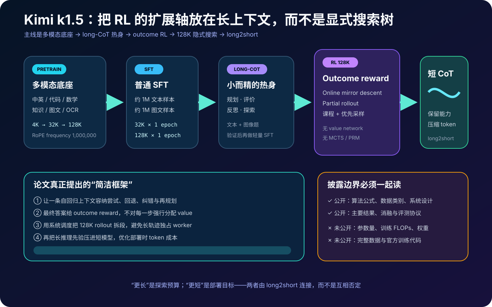
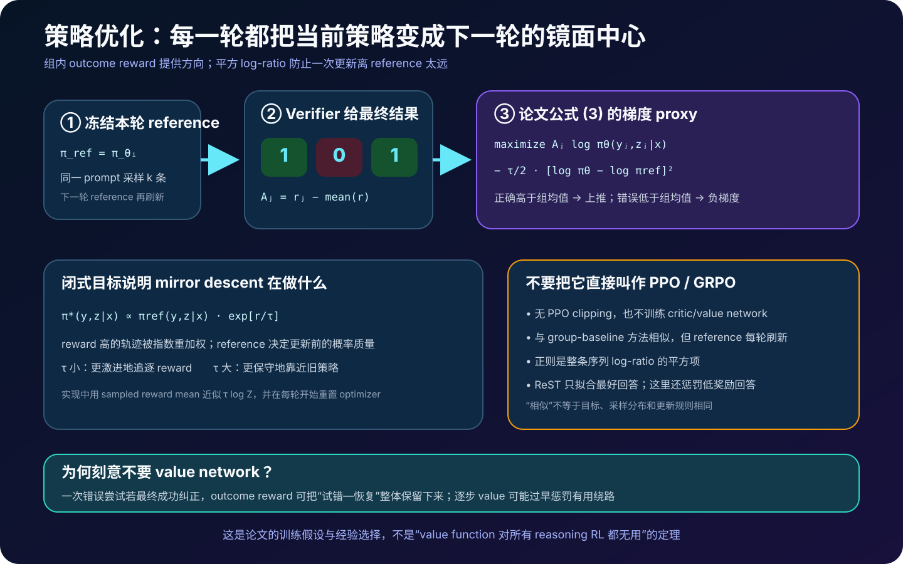
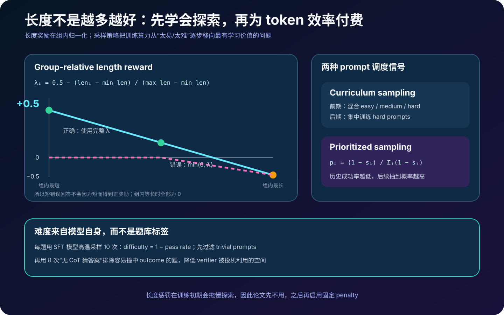
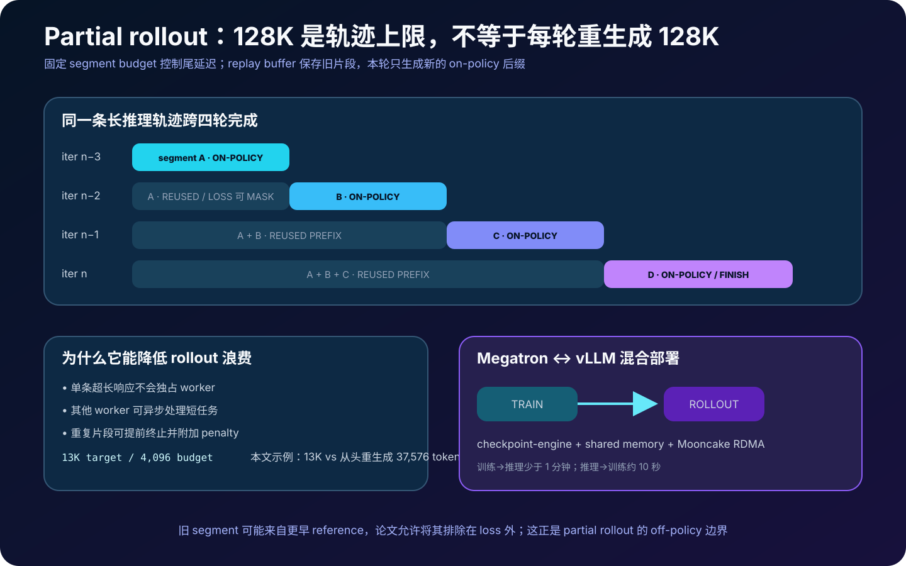
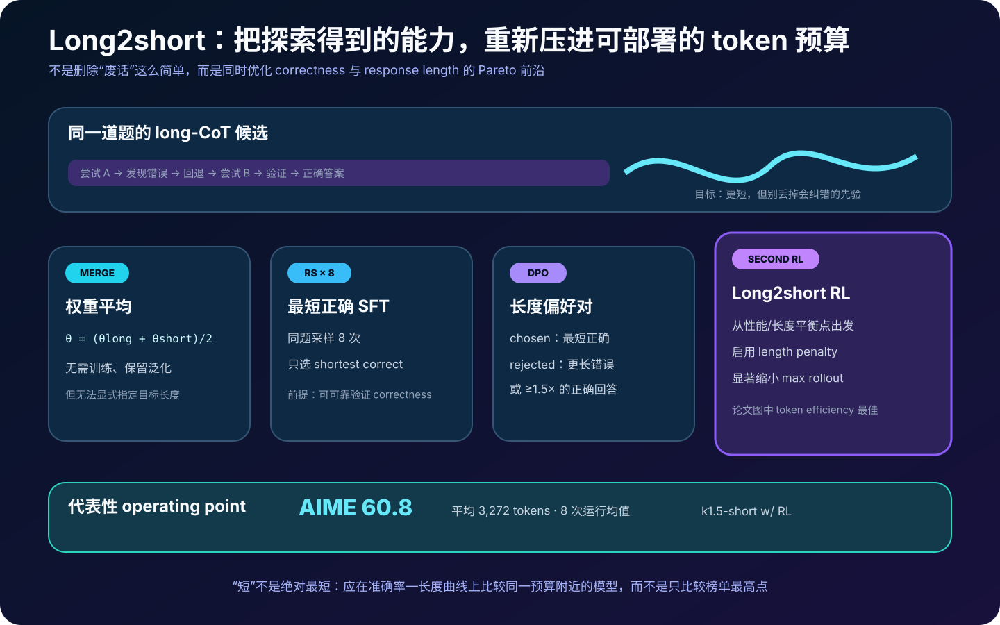
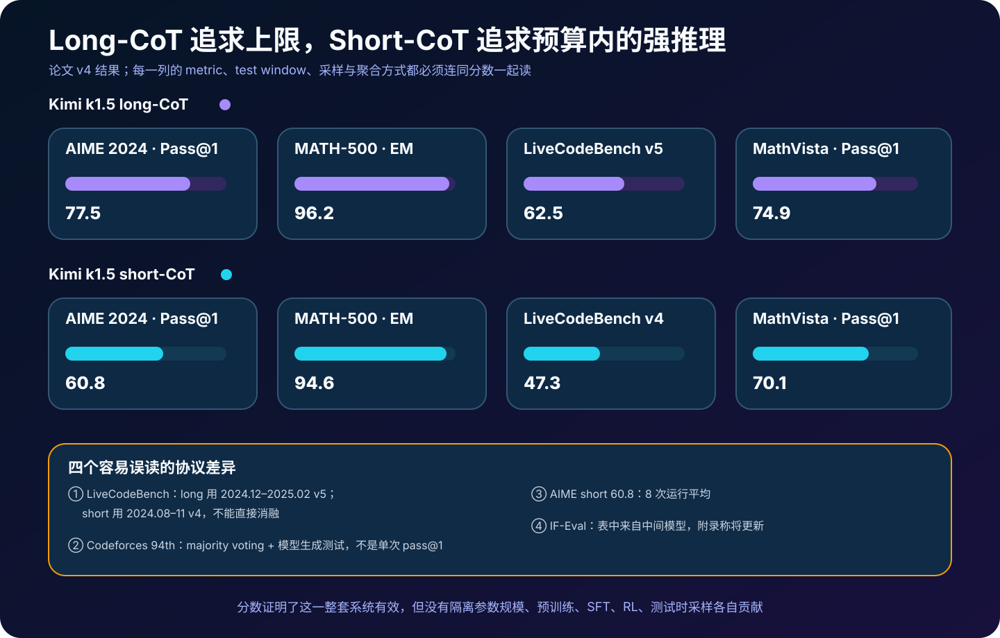

# Kimi k1.5 详解：怎样把 128K 长上下文、结果奖励与 Long2short 变成 RL 扩展轴


> **论文**：*Kimi k1.5: Scaling Reinforcement Learning with LLMs*  
> **作者**：Kimi Team  
> **首次公开**：2025 年 1 月 22 日  
> **本文依据**：[arXiv v4](https://arxiv.org/abs/2501.12599) · [论文 HTML](https://arxiv.org/html/2501.12599) · [论文 PDF](https://arxiv.org/pdf/2501.12599) · [官方仓库](https://github.com/MoonshotAI/Kimi-k1.5)  
> **关键词**：Reasoning RL、Long-CoT、Online Policy Mirror Descent、Outcome Reward、Partial Rollout、Length Penalty、Long2short、多模态推理  
> **配套代码**：[kimi_k1_5_rl_minimal.py](code/kimi_k1_5_rl_minimal.py)  
> **前置阅读**：[InstructGPT](10_InstructGPT_2022_原理.md) · [Chain-of-Thought](11_Chain_of_Thought_2022_原理.md) · [Training Verifiers](53_Training_Verifiers_2021_原理.md) · [DPO](23_DPO_2023_原理.md) · [DeepSeekMath / GRPO](57_DeepSeekMath_2024_原理.md) · [测试时计算扩展](58_Scaling_Test_Time_Compute_2024_原理.md)

> [!IMPORTANT]
> Kimi k1.5 是**未开放权重的专有模型**。论文和官方仓库没有披露参数量、完整训练 FLOPs、checkpoint、RL prompt 集或官方训练代码；官方仓库主要包含报告与图片。本文代码只验证公开公式和调度语义，不能复现模型或论文分数。

> [!NOTE]
> 本文使用 2025 年 6 月 3 日的 arXiv v4。它比首发版增加了较完整的预训练附录。文中的 “128K RL” 指最大上下文 / rollout 能力；借助 partial rollout，较早的轨迹片段会从 replay buffer 复用，并不表示每次迭代都重新 on-policy 生成 128K token。

Kimi k1.5 把 reasoning model 的训练问题问得非常直接：

> 如果模型可以把更多 token 用于尝试、检查、回退和改写，能否像扩大参数或数据那样，持续扩大强化学习的计算规模？

论文给出的答案不是构造一棵显式搜索树，也不是再训练一个逐步打分的过程奖励模型，而是让一条足够长的自回归上下文本身承载搜索历史：

```text
提出解法 → 发现矛盾 → 回退 → 换路径 → 验证 → 得到最终答案
```

只要最终答案可以可靠验证，整条轨迹就能得到 outcome reward。训练再通过 online policy mirror descent、难度课程、长度奖励和分段 rollout，把“生成得很长”变成“用长上下文学会有效探索”。

但长推理不适合所有线上请求。于是论文又把问题反过来：能不能把 long-CoT 学到的思考先验压缩到 short-CoT？这就是 long2short。

---

## 0. 先说结论

读完本文，至少应记住下面十八点：

1. **论文的扩展轴是 RL context length，不是新模型参数量**。参数规模没有公开，不能把结果归因于某个猜测的模型尺寸。
2. **最终 long-CoT RL 支持 128K 上下文**。中型模型消融显示训练中回答长度和正确率共同上升，困难 benchmark 的长度增幅更明显。
3. **长上下文被视作“隐式搜索空间”**。规划、反思、纠错和回退都展平在一条 token 序列中，而不是运行 MCTS。
4. **训练只依赖最终结果奖励**。可验证题用规则、代码测试或答案判断；自由形式数学答案由 reward model 判断。
5. **论文明确不使用 value network、MCTS 和 process reward model**。这是一项设计选择，不是证明这些组件普遍无用。
6. **RL prompt 必须同时满足覆盖广、难度平衡、可准确验证**。多选、判断、证明题等容易出现“猜对答案却推理错误”的题型会被排除。
7. **难度相对当前模型定义**。SFT 模型对每题高温采样 10 次，以 $1-\text{pass rate}$ 作为难度代理。
8. **还要主动过滤 reward hacking**。模型若在不做 CoT 的 8 次猜测内命中答案，这道题会被视为太容易投机而删除。
9. **策略优化是 online policy mirror descent 变体**。每轮把当前策略冻结为 reference，组内 reward mean 作 baseline，并用 squared log-ratio 限制偏移。
10. **它与 GRPO 有相似的组内基线，但不是同一个算法**。这里的采样分布、每轮 reference 更新、平方正则和优化器重置都应单独保留。
11. **负梯度很重要**。ReST 只拟合采样到的最好回答；消融显示显式压低错误轨迹能以更少样本学出 long-CoT。
12. **长度奖励不会奖励错误短答**。正确回答按组内相对长度得到 $[-0.5,0.5]$ 信号；错误回答最多得 0，只有足够长时才受罚。
13. **长度 penalty 不能一开始就拉满**。早期会妨碍探索，因此先做无长度惩罚的策略优化，再启用固定 penalty。
14. **Partial rollout 是 128K RL 的系统关键**。长回答按固定 token budget 跨迭代生成，旧片段缓存复用，本轮只生成新后缀；某些旧段可从 loss 排除，重复段可提前停止。
15. **训练与推理共享 GPU**。Megatron 和 vLLM 通过 checkpoint-engine、共享内存与 Mooncake RDMA 切换，训练到推理少于 1 分钟，反向约 10 秒。
16. **Long2short 不是一种方法，而是四条路线**：权重平均、最短正确 rejection sampling、长度偏好 DPO、缩短 rollout 上限的第二阶段 RL。
17. **短 CoT 的代表点是 AIME 60.8、平均 3,272 token**；该数是 8 次运行平均。MATH-500 可达 94.6，LiveCodeBench 为 47.3。
18. **结果很强，但复现和因果归因有限**。不同模型规模、预训练、SFT、RL、测试时采样没有完全隔离；部分 benchmark 还使用不同时间窗口或多数投票。



---

## 1. 为什么“让模型想更久”会成为训练扩展轴

### 1.1 预训练扩展与 RL 扩展的差别

预训练依赖静态数据：

$$
\max_\theta
\mathbb E_{x\sim\mathcal D_{\text{pretrain}}}
\sum_t\log\pi_\theta(x_t\mid x_{<t}).
$$

当高质量人类数据接近饱和，继续扩展需要更多过滤、合成或新模态。Reasoning RL 则让模型针对问题主动采样新轨迹：

$$
(z,y)\sim\pi_\theta(\cdot\mid x),
\qquad
r(x,y,y^*)\in\{0,1\}.
$$

只要 verifier 能判断答案，模型就能通过探索生成新的训练经验。这里“数据扩展”不是凭空创造新知识，而是对已有问题发现新的解题轨迹。

### 1.2 为什么上下文长度近似搜索预算

显式规划算法保存搜索树：节点是 partial solution，critic 给节点打分，再选择下一分支。Kimi k1.5 的观点是：thought 和 feedback 都能表示成 token，就可以把树的历史展平成上下文：

$$
\mathcal A(z_t\mid z_1,z_2,\ldots,z_{t-1}).
$$

上下文越长，可容纳的尝试、验证和回退步骤越多。因此：

$$
\text{context budget}
\approx
\text{implicit search-step budget}.
$$

这只是算法类比，不代表 Transformer 内部真的构造了可访问的树，也不保证新增 token 都是有效搜索。

### 1.3 它不是简单的 test-time prompt 技巧

普通 “think step by step” 只在推理时改变提示。Kimi k1.5 的完整链条是：

```text
长上下文多模态预训练
  → 普通 SFT
  → 少量高质量 long-CoT SFT 热身
  → 128K outcome-RL
  → 测试时继续使用长 CoT
  → long2short 压缩到较短推理
```

所以能力来自训练分布和策略更新，不应只归因于输出 token 变多。

---

## 2. 底座：论文 v4 披露了什么，仍隐藏了什么

### 2.1 没有公开参数配置

论文只说 Kimi k-series 使用带多模态能力的 Transformer decoder 变体，没有给出：

- 参数量、层数、hidden dimension；
- attention / MoE 的完整结构；
- 总预训练 token、总 RL rollout token；
- GPU 数、训练时长、总 FLOPs；
- checkpoint 或推理权重。

因此“k1.5 是某个规模 / 某种 MoE”的网络传言不能写成论文事实。

### 2.2 五类语言数据与五类多模态数据

语言语料覆盖：

| 类别 | 主要处理 |
|---|---|
| 英文 / 中文 | 规则、FastText、embedding 近重复、LLM 质量评分 |
| 代码 | 清洗并平衡 32 种主要语言，降低 JSON/YAML 等标记语言比例 |
| 数学与推理 | 数学专用 OCR；FastText 粗筛 + 微调 LM 精筛 |
| 知识 | 教材、习题、论文等；OCR 质量、教育价值、文档类型标注 |

论文把英文与中文列作一个数据处理小节，但把总语言域概括为 English、Chinese、Code、Mathematics & Reasoning、Knowledge 五类。

多模态语料分为：

- caption；
- image-text interleaving；
- OCR；
- knowledge；
- general QA。

数据包含文本、图片和视频，重点评测则是文本与图像推理。论文特别限制合成 caption 比例，担心只由模型生成的描述缺少真实世界知识并放大幻觉。

### 2.3 三阶段预训练

1. **Vision-language pretraining**：先只训语言；再单独训练视觉塔；随后解冻语言层，逐渐把视觉文本比例提高到 30%。
2. **Cooldown**：使用更高质量的语言 / 图文数据，并为数学、知识和代码加入经 rejection sampling 验证的合成 QA。
3. **Long-context activation**：最大长度从 4,096 增到 32,768，再到 131,072；RoPE frequency 设为 1,000,000。

长上下文阶段的数据约为 40% full-attention、60% partial-attention。这里是**预训练数据 / attention 处理**，不要与 RL 系统的 **partial rollout** 混为一谈；报告没有充分展开 partial-attention 的具体实现。

### 2.4 Vanilla SFT 的规模

论文称普通 SFT 约有：

- 100 万文本样本；
- 100 万图文样本。

文本中显式列出 50 万通用 QA、20 万代码、20 万数学与科学、5 千创意写作、2 万长上下文任务。它们合计约 92.5 万，说明“约 100 万”是概数，或仍有未单列类别。

训练先以 32K 序列跑 1 epoch，学习率从 $2\times10^{-5}$ 降至 $2\times10^{-6}$；再 re-warmup 到 $10^{-5}$，以 128K 跑 1 epoch并降至 $10^{-6}$。多个样本会 pack 进同一训练序列。

---

## 3. RL prompt：可验证性比题目数量更重要

### 3.1 三个筛选条件

每道 RL 题应满足：

1. **Diverse Coverage**：STEM、代码、一般推理、文本和图文；
2. **Balanced Difficulty**：easy / moderate / hard 都有；
3. **Accurate Evaluability**：verifier 能可靠判断，而非靠答案外观或随机猜测。

如果 verifier 不可靠，RL 不是学推理，而是学怎样骗评分器。

### 3.2 用模型自己的成功率估难度

对 prompt $x_i$，SFT 模型高温采样十次：

$$
\hat s_i
=\frac1{10}\sum_{j=1}^{10}
\mathbb 1[y_{ij}\text{ correct}],
\qquad
d_i=1-\hat s_i.
$$

同一道题对弱模型可能是 hard，对强模型可能已是 easy。相对难度让课程能随 policy 变化，而不是永远依赖人类年级标签。

### 3.3 为什么排除多选、判断和证明题

多选 / 判断的答案空间很小，错误推理也可能撞中正确选项；证明题又很难仅靠最终字符串判断推理有效。论文直接排除这些容易产生 verifier false positive 的题型。

一般问答还做一次“无思维链攻击”：不给 CoT，让模型连续猜答案；若前 $N=8$ 次内命中，就视作容易 hack：

$$
\exists j\le8: \hat y_j=y^*
\quad\Longrightarrow\quad
x\text{ 被移除}.
$$

它不能消灭所有 reward hacking，但能降低“枚举短答案”的廉价策略。

---

## 4. Long-CoT SFT：只负责点火，不负责全部推理能力

在 RL 之前，团队通过 prompt engineering 和近似 rejection sampling 的流程，构建一个“小而高质量”的 long-CoT warmup 集，覆盖文本与图像输入。

目标不是灌输海量标准解，而是让模型先见过四类行为：

| 行为 | 在轨迹中的作用 |
|---|---|
| Planning | 执行前拆解步骤 |
| Evaluation | 检查中间结论 |
| Reflection | 重新审视错误假设 |
| Exploration | 尝试替代解法 |

做轻量 SFT 后，policy 才有较高概率采到可供 RL 放大的长轨迹。论文没有披露 warmup 集的样本数，也没有证明这些文字标签是唯一必要形式。

这与“纯 RL 从 base model 涌现推理”的叙事不同：Kimi k1.5 明确有 vanilla SFT 和 long-CoT SFT 初始化。

---

## 5. Outcome RL：把整条试错轨迹看成一个动作

给问题 $x$、CoT $z$、最终回答 $y$ 和参考答案 $y^*$，论文优化：

$$
\max_\theta
\mathbb E_{(x,y^*)\sim\mathcal D,\,(z,y)\sim\pi_\theta}
\left[r(x,y,y^*)\right].
$$

可验证任务直接给二元结果：

- 代码是否通过测试；
- 数学答案是否与 ground truth 等价；
- 图文问题答案是否正确。

如果轨迹先犯错、后来成功纠正，最终仍可得到正奖励。这允许模型保留：

```text
错误尝试 → 识别错误 → 回退 → 正确修复
```

论文据此质疑逐步 value credit assignment：若中间错误分支被立即判低价值，模型可能学不到“从错误恢复”。但这是一个经验假设。更好的 process signal 也可能区分无效绕路与有价值探索。

---

## 6. Online Policy Mirror Descent：公式究竟在做什么



### 6.1 每轮求一个相对熵正则问题

第 $i$ 轮把当前策略 $\pi_{\theta_i}$ 冻结为 reference，求：

$$
\max_\theta
\mathbb E_x\left[
\mathbb E_{(y,z)\sim\pi_\theta}[r]
-\tau\operatorname{KL}
(\pi_\theta(\cdot\mid x)\|\pi_{\theta_i}(\cdot\mid x))
\right].
$$

离散轨迹上的闭式最优分布是：

$$
\pi^*(y,z\mid x)
=\frac{
\pi_{\theta_i}(y,z\mid x)
\exp(r/\tau)
}{Z(x)}.
$$

直觉是：从旧策略已有概率质量出发，对高奖励轨迹指数重加权，而不是一次跳到只输出获胜样本。

### 6.2 从闭式解得到可训练 surrogate

取对数：

$$
r-\tau\log Z
=\tau\log
\frac{\pi^*(y,z\mid x)}{\pi_{\theta_i}(y,z\mid x)}.
$$

论文用 reference policy 对同一 prompt 采样 $k$ 条回答，并以组内 reward mean：

$$
\bar r=\frac1k\sum_{j=1}^k r_j
$$

近似 $\tau\log Z$。最终梯度可读作：

$$
\frac1k\sum_{j=1}^k\left[
\nabla_\theta\log\pi_\theta(y_j,z_j\mid x)(r_j-\bar r)
-\frac\tau2\nabla_\theta
\left(
\log\frac{\pi_\theta(y_j,z_j\mid x)}
{\pi_{\theta_i}(y_j,z_j\mid x)}
\right)^2
\right].
$$

第一项做 group-centered policy gradient；第二项惩罚整条轨迹 log-prob 相对 reference 变化过大。

### 6.3 为什么不是 PPO，也不能直接叫 GRPO

| 方法 | 关键稳定机制 | 这里是否相同 |
|---|---|---|
| PPO | probability ratio clipping，常配 value model | 否；无 clip、无 value network |
| GRPO | 同题 group reward baseline，通常有 ratio / KL 形式 | 有相似组均值，但完整目标不同 |
| DPO | chosen / rejected 对与固定 reference 的分类式目标 | 主 RL 不是偏好 pair |
| ReST | 采样后只拟合最好轨迹 | 否；k1.5 同时给低奖励轨迹负梯度 |

每轮更新后 $\theta_{i+1}$ 成为下一轮 reference，并重置 optimizer，因为 reference 改变后优化问题也变了。

### 6.4 为什么负梯度值得单独强调

若同题奖励为 `[1,0,0,1]`，则优势为 `[+0.5,-0.5,-0.5,+0.5]`。错误回答不只是“没被模仿”，还会被主动降概率。

论文用 ReST 做消融，观察到带负梯度的方法样本效率更高。它支持“错误样本也是 RL 信号”，但没有给出适用于所有任务的理论优势。

---

## 7. 长度奖励：正确之后，才比较谁更短



对同一问题的 $k$ 个回答，定义：

$$
\lambda_i
=0.5-
\frac{\operatorname{len}(i)-\operatorname{min\_len}}
{\operatorname{max\_len}-\operatorname{min\_len}}.
$$

当组内长度不同：

$$
r_{\text{len},i}
=
\begin{cases}
\lambda_i,&r_i=1,\\
\min(0,\lambda_i),&r_i=0.
\end{cases}
$$

当全部等长，长度奖励为 0。

这个分段函数有三个性质：

1. 最短正确回答得到 $+0.5$，最长正确回答得到 $-0.5$；
2. 错误短回答最多得到 0，不能靠一句随机猜测骗取正奖励；
3. 错误且冗长的回答得到负奖励。

总 reward 是原始 correctness reward 加上带权长度项。论文没有公开最终权重，因此配套代码把它作为参数，而不是编造超参数。

### 7.1 为什么先不惩罚长度

初期模型还不会稳定解题，太早压长度会让它失去探索空间。论文实际采用两阶段 schedule：

```text
early RL：无 length penalty，先提高成功率和探索能力
later RL：固定 length penalty，控制 overthinking
```

正文说“逐渐 warm up”，但具体实现描述是先关闭、之后启用常量，并没有披露连续线性 ramp。

---

## 8. 采样课程：把 rollout 花在学得动的题上

### 8.1 Curriculum sampling

初始 policy 在极难题上几乎采不到正确回答，整组 reward 都是 0 时，组内优势也接近 0。于是训练先用混合难度 warmup，再集中 hard questions。

论文消融中的 curriculum 在约第 24 次迭代切换到 hard-only，明显好于始终均匀混合。这个迭代点属于该实验，不应外推成通用超参数。

### 8.2 Prioritized sampling

对每道题记录历史成功率 $s_i$，按：

$$
p_i
=\frac{1-s_i}{\sum_j(1-s_j)}
$$

采样。模型越不擅长，越容易再次抽到。

工程上若所有 $s_i=1$，分母为零；配套代码退化为均匀采样。这是必要兜底，不是论文提出的新公式。

### 8.3 两种方法不是矛盾的

- Curriculum 用训练阶段和预先 / 动态难度控制大范围分布；
- Prioritized 用逐题历史成功率追踪当前弱点。

前者回答“现在该进入多难的课程”，后者回答“这个难度段里该多练哪道题”。

---

## 9. Verifier：数学、代码与视觉怎样得到 reward

### 9.1 数学 reward model

数学答案存在等价表达，例如：

$$
a^2-4=(a+2)(a-2).
$$

只做字符串比较会错判。团队训练两类 RM，各约 80 万标注：

| RM | 输出 | 人工 spot-check 准确率 |
|---|---|---:|
| Classic RM | value head 标量 | 约 84.4 |
| Chain-of-Thought RM | 先推理，再输出 JSON correctness | 约 98.5 |

RL 使用 CoT RM。Spot-check 不是完整独立 benchmark，98.5 不能理解为所有数学奖励都只有 1.5% 噪声。

### 9.2 代码测试自动生成

许多网络竞赛题没有测试。论文用 CYaRon 和 base k1.5 生成 50 个 test cases，再从 ground-truth submissions 中抽 10 份交叉验证：

- 某个 test case 至少有 7/10 submissions 输出一致，才有效；
- 整道题至少有 9/10 submissions 通过选中测试，才进入 RL 集。

在 1,000 道样本题中：614 道不需要 special judge，463 个生成器产出至少 40 个有效测试，最终 323 道进入训练。

这比让模型自评代码更可靠，但共识也可能共同继承错误；sandbox 的隔离和资源限制同样属于 reward 正确性。

### 9.3 Vision RL 数据

视觉 RL 数据分三类：

1. 真实世界科学图、定位、图表分析；
2. 程序生成的空间、几何和物体交互题；
3. 把文本、代码和结构化数据渲染成图片的 text-rendered data。

第三类让模型在“原生文本”和“文本截图”之间保持一致性，但也可能过度依赖 OCR。多模态联合 RL 是 k1.5 与许多同期纯文本 reasoning model 的重要差异。

---

## 10. Partial rollout：怎样让超长轨迹不拖垮每轮 RL



### 10.1 长尾问题

同步 RL 的一轮通常是：

```text
rollout → reward → train → 更新权重 → 下一轮 rollout
```

如果一批中多数回答 2K token，少数回答 80K token，短任务完成后 worker 会等待最长任务。极端 long-CoT 直接决定整轮墙钟时间。

### 10.2 把一条轨迹跨迭代切段

设每轮单轨迹生成预算为 $B$，目标轨迹长 $T>B$。第 1 轮只生成：

$$
z_{1:B}.
$$

保存到 replay buffer。下一轮复用旧前缀，只继续：

$$
z_{B+1:2B}\sim
\pi_{\theta_{i+1}}
(\cdot\mid x,z_{1:B}).
$$

直到完成。旧 segment 可以排除在本轮 loss 外，只让当前新片段产生 on-policy 梯度。

这带来一个需要诚实说明的分布边界：完整轨迹可能由不同迭代的 policy 分段生成，并非严格来自某一个冻结 policy。论文的 mirror-descent/off-policy 视角与 loss mask 使这种复用可操作，但不能把整条拼接轨迹都称为“当前轮 on-policy sample”。

### 10.3 一个 13K token 的教学算例

若 $T=13,000,B=4,096$，partial rollout 只生成每个 token 一次：

$$
C_{\text{partial}}=13,000.
$$

若每轮必须从头重生成到当前边界，则生成量为：

$$
C_{\text{naive}}
=4,096+8,192+12,288+13,000
=37,576.
$$

教学示例节省 24,576 个重复前缀 token。真实系统的成本还包括 prefill、KV cache、不同 policy 权重、batching 和中断恢复；这个数字只是解释复用上限。

### 10.4 重复检测

长 CoT 容易陷入句子或模式循环。系统检测重复序列后可以：

- 提前终止；
- 给重复附加 penalty；
- 释放 worker 处理其他任务。

它改善计算效率，也可能误杀有意复用的数学结构，因此检测阈值是未披露的实现细节。

---

## 11. RL 基础设施：训练和 rollout 为何要共享 GPU

### 11.1 同步主循环

中央 master 协调：

- rollout workers；
- reward model / code execution；
- replay buffer；
- trainer workers；
- evaluation。

论文称整体为 iterative synchronous RL，但 rollout workers 内部可异步处理长短任务。两个“同步 / 异步”描述的是不同层级，并不矛盾。

### 11.2 Megatron 与 vLLM 的角色

| 阶段 | 系统 | 作用 |
|---|---|---|
| Training | Megatron | 分布式反向传播、更新 policy |
| Rollout | vLLM | 高吞吐生成长轨迹 |
| Weight handoff | checkpoint-engine + Mooncake | 格式转换、分片注册、RDMA 传输 |

Kubernetes sidecar 让两个容器共享同一 pod 的 GPU：训练完成后 Megatron offload，vLLM 加载新权重；rollout 完成后 vLLM 退出释放 CUDA graph、NCCL buffer 等资源，Megatron 再 onload。

论文报告：

- training → inference 切换少于 1 分钟；
- inference → training 约 10 秒；
- Megatron checkpoint 会在共享内存转成 Hugging Face 格式；
- 处理 PP / EP 分片后保留 TP，vLLM 再做 tensor-parallel 转换。

这说明 reasoning RL 的瓶颈不只是 optimizer。权重在训练布局与服务布局之间高频移动，系统切换时间会直接吃掉每轮收益。

### 11.3 代码 sandbox

执行环境支持 MultiPL-E、DMOJ Judge Server、Lean、Jupyter 等镜像，部署在 Kubernetes。优化包括 `crun`、复用 cgroup、tmpfs overlay。

论文的 16 核机器实验：

| 启动方式 | 单容器启动时间 | 最大 containers/s |
|---|---:|---:|
| Docker | 0.12 s | 27 |
| 优化 Sandbox | 0.04 s | 120 |

这是特定环境的 microbenchmark，不代表所有集群都有 4.4 倍端到端 RL 加速。

---

## 12. Long2short：四种把长推理压短的方法



Long-CoT 提高上限，却带来：

- 推理 token 成本；
- 更高用户等待时间；
- 过度思考；
- 简单题上不必要的冗长。

Long2short 的目标不是最小化长度本身，而是：

$$
\max_\theta\quad
\operatorname{Accuracy}(\theta)
\quad\text{s.t.}\quad
\mathbb E[\operatorname{tokens}]\le B.
$$

论文没有直接用这个约束式训练，但它准确表达了 token efficiency 目标。

### 12.1 Model merging

把长模型和短模型权重简单平均：

$$
\theta_{\text{merge}}
=\frac12
(\theta_{\text{long}}+\theta_{\text{short}}).
$$

优点是无需额外训练，可能兼顾能力与通用性；缺点是参数空间平均不保证函数空间平滑，也不能精确指定输出预算。

### 12.2 Shortest rejection sampling

同一题采样 $n=8$ 次，过滤正确性后选最短：

$$
y^+
=\arg\min_{y_i:r_i=1}
\operatorname{len}(y_i).
$$

再用这些最短正确答案做 SFT。它把 long model 当作数据生成器，简单但受 pass@8 coverage 限制：若 8 条都错，这道题无法产生正样本。

### 12.3 Length-aware DPO

chosen 是最短正确回答；rejected 包括：

- 更长的错误回答；
- 长度至少为 chosen 1.5 倍的正确回答。

第二类很关键：DPO 不只学正确 / 错误，还显式偏好“同样正确但更短”。这也有风险——长答案可能包含更可审计的证明步骤，压缩后未必更可靠。

### 12.4 Long2short RL

先从标准 long-CoT RL 轨迹中挑一个准确率 / 长度平衡较好的 checkpoint，再开启第二阶段：

1. 使用前文长度 penalty；
2. 显著缩小 maximum rollout length；
3. 对超过目标长度的回答施加更强预算压力。

论文图 7 中，这条路线的 token efficiency 最好。代表 operating point：

$$
\text{AIME 2024 Pass@1}=60.8,
\qquad
\text{mean tokens}=3,272.
$$

分数是 8 次运行平均，而不是单个 deterministic pass。

---

## 13. 实验结果：强分数必须和协议绑定



### 13.1 Long-CoT 结果

| Benchmark | Kimi k1.5 long-CoT | 论文对比中的 o1 | 指标 |
|---|---:|---:|---|
| MATH-500 | 96.2 | 94.8 | EM |
| AIME 2024 | 77.5 | 74.4 | Pass@1 |
| Codeforces | 94 | 94 | Percentile |
| LiveCodeBench v5 | 62.5 | 67.2 | Pass@1 |
| MathVista-Test | 74.9 | 71.0 | Pass@1 |
| MMMU-Val | 70.0 | 77.3 | Pass@1 |
| MathVision-Full | 38.6 | 未报告 | Pass@1 |

“matching o1”是跨多个 benchmark 的概括，不是每项都相同：k1.5 在 MATH/AIME/MathVista 更高，在 LiveCodeBench/MMMU 更低。

### 13.2 Short-CoT 结果

| Benchmark | Kimi k1.5 short-CoT | GPT-4o-0513 | Claude 3.5 Sonnet-1022 | DeepSeek-V3 |
|---|---:|---:|---:|---:|
| MMLU | 87.4 | 87.2 | 88.3 | 88.5 |
| IF-Eval Prompt Strict | 87.2 | 84.3 | 86.5 | 86.1 |
| MATH-500 | 94.6 | 74.6 | 78.3 | 90.2 |
| AIME 2024 | 60.8 | 9.3 | 16.0 | 39.2 |
| HumanEval-Mul | 81.5 | 80.5 | 81.7 | 82.6 |
| LiveCodeBench v4 | 47.3 | 33.4 | 36.3 | 40.5 |
| MathVista-Test | 70.1 | 63.8 | 65.3 | 未列 |

“最高提高 550%”来自小基线上的相对百分比，容易制造夸张观感。例如从 9.3 到 60.8：

$$
\frac{60.8-9.3}{9.3}\approx554\%.
$$

绝对提升是 51.5 个百分点。两种表述都可算对，但决策时应优先看绝对差、题数和方差。

### 13.3 四个协议陷阱

1. **LiveCodeBench 窗口不同**：short 用 2024.08–11 v4，long 用 2024.12–2025.02 v5，不能直接用 47.3 → 62.5 估算 long-CoT 增益。
2. **Codeforces 不是单次 pass@1**：使用生成代码的 majority voting，并用模型生成测试辅助选择；94 是 percentile。
3. **AIME 只有 30 题**：离散题数小，多次采样和运行平均会显著影响百分比。
4. **IF-Eval 来自中间模型**：v4 附录明确说版本切换导致表中值来自 intermediate model，计划更新。

### 13.4 结果没有做完整因果分解

Long-CoT 与 short-CoT 同时受到：

- 未披露参数规模；
- 多模态预训练；
- vanilla / long-CoT SFT；
- RL 数据与 verifier；
- rollout 长度；
- majority voting 或测试时选择。

因此表格证明“整个 k1.5 系统有效”，不能精确说 77.5 中多少来自 mirror descent、多少来自 128K、多少来自底座。

---

## 14. 消融：论文真正支持哪些机制判断

### 14.1 长度与性能相关，但不等于因果单调

中型模型训练曲线显示：迭代推进时平均 / 高分位回答长度和正确率一起增加；多个数学 benchmark 的 checkpoint 也显示长度与准确率正相关。

但相关性可能同时来自 policy 变强、课程变化和训练迭代。论文最可靠的说法是：

> 在这套训练中，允许更长 CoT 与困难推理性能持续改善共同出现，128K 最终 run 仍观察到收益。

不能外推为“任意模型重复输出更多 token 都会更准”。

### 14.2 小模型能用更多 token 追上，但效率不同

同数据上比较两个尺寸：大模型初始更强；小模型通过更长 RL-CoT 可接近大模型。但是大模型通常 token efficiency 更好、扩展长上下文后的上限更高。

部署决策应比较生命周期成本：

$$
C_{\text{request}}
\approx
C_{\text{prefill}}(N,T_{\text{in}})
+C_{\text{decode}}(N,T_{\text{CoT}}).
$$

小模型多解码几千 token 和大模型短答谁更便宜，取决于参数、硬件、并发、KV cache 和延迟目标，论文没有给统一答案。

### 14.3 Negative gradients 优于只模仿成功样本

与 ReST 对比表明，显式降低错误回答概率获得更好的 sample complexity。这里的因果更直接：训练数据相同方向下，优化规则是否包含负梯度是主要变量。

### 14.4 Curriculum 优于均匀混合

warmup 后转 hard-only 的曲线高于始终 easy/hard 均匀采样。它支持“难度调度重要”，但不能证明 hard-only 永远最优：随着模型继续变强，原来的 hard prompts 也会变 easy，需要动态刷新。

---

## 15. 配套代码：从公式到可运行调度

运行：

```bash
python3 papers/to-2026/code/kimi_k1_5_rl_minimal.py
```

预期输出：

```text
Kimi k1.5 disclosed-mechanism arithmetic:
  prompt difficulty from 10 samples = 80.0%
  prioritized probabilities          = (0.062, 0.375, 0.562)
  group-relative length rewards      = (0.5, 0.0, 0.0, -0.5)
  mirror-descent proxy loss          = -0.3563
  partial rollout rounds             = 4
  generated tokens: partial / naive  = 13000 / 37576
  avoided repeated-prefix tokens     = 24576
  shortest correct response          = short-correct (3200 tokens)
  length-DPO rejected responses      = ('long-correct', 'long-wrong')
```

proxy loss 可以为负，因为代码返回的是公式 (3) 对应目标的负均值，不是交叉熵概率；重要的是梯度方向和相对比较。

### 15.1 长度奖励

```python
def length_rewards(correctness, lengths):
    lo, hi = min(lengths), max(lengths)
    if lo == hi:
        return tuple(0.0 for _ in lengths)

    rewards = []
    for correct, length in zip(correctness, lengths):
        relative = 0.5 - (length - lo) / (hi - lo)
        rewards.append(relative if correct else min(0.0, relative))
    return tuple(rewards)
```

错误短答的 `relative` 虽然为正，却会被 `min(0, relative)` 截成 0。

### 15.2 Mirror-descent proxy

```python
advantage = reward - mean_reward
log_ratio = current_logprob - reference_logprob
objective = (
    advantage * current_logprob
    - 0.5 * tau * log_ratio**2
)
loss = -mean(objective)
```

这里的 log-prob 是整条 `(CoT, answer)` 的序列 log-prob。真实实现还要处理 token mask、变长 batch、reference 更新、分布式训练和数值稳定。

### 15.3 Partial rollout

```python
new_end = min(target_tokens, generated_tokens + segment_budget)

segments = [
    RolloutSegment(0, generated_tokens, on_policy=False),
    RolloutSegment(generated_tokens, new_end, on_policy=True),
]
```

完整代码会在首段省略空前缀，在完成状态只返回复用段，并断言每轮新生成量不超过 budget。

### 15.4 Long2short DPO pair

```python
chosen = shortest_correct_response(responses)
rejected = [
    response for response in responses
    if response.tokens > chosen.tokens
    and (
        not response.correct
        or response.tokens >= 1.5 * chosen.tokens
    )
]
```

代码还实现了难度估计、$1-s_i$ 优先采样、权重平均，以及代码测试的 7/10 与 9/10 门槛。

---

## 16. 哪些可以复现，哪些不能

### 16.1 本文可以独立验证

- 难度与 prioritized probability 的算术；
- 组内长度奖励的边界值；
- mirror-descent 闭式 reweight 与 proxy gradient；
- partial rollout 的 token 复用；
- shortest correct 和 length-DPO pair；
- 测试用例共识门槛。

### 16.2 公开报告不足以复现

- Kimi k1.5 模型架构和参数量；
- 预训练 checkpoint 与 vision tower；
- long-CoT warmup 数据；
- RL prompt、奖励模型和 verifier；
- 训练 / rollout 集群规模与超参数；
- benchmark 的完整生成、选择和 judge pipeline。

官方 GitHub 仓库不是训练代码仓库。它提供报告 PDF、README 和宣传 / 结果图片；不能据此声称“k1.5 已开源”。

---

## 17. 局限、风险与论文没有回答的问题

### 17.1 披露不足影响因果判断

参数、数据规模、算力、主要超参数不公开，使外部研究者无法区分：

$$
\text{better base model}
\quad\text{vs}\quad
\text{better RL algorithm}
\quad\text{vs}\quad
\text{more rollout compute}.
$$

报告的工程经验仍有价值，但可复现性弱于公开权重、数据和代码的研究。

### 17.2 Outcome reward 会隐藏过程错误

最终答案正确不代表推理可靠。模型可能：

- 巧合命中；
- 在中间制造错误事实又相互抵消；
- 学会 verifier 的盲区；
- 生成冗长但看似自省的模板。

过滤易猜题、CoT RM 和执行测试能缓解，却不等于解决 reward hacking。

### 17.3 长 CoT 不等于可忠实解释

生成的 reasoning text 是 policy 的可见输出，不保证忠实暴露内部计算。把它称为 planning / reflection 是行为描述，不是机制可解释性证明。

### 17.4 多模态 RL 也可能放大 OCR shortcut

Text-rendered data 有助于截图、图表和代码图片，但模型可能只读文字而不理解视觉关系。MathVista、MMMU、MathVision 的差异正说明“视觉识别”和“视觉推理”不能由单一分数代表。

### 17.5 安全不是本文的核心评测轴

论文重点是能力、训练系统与 token efficiency，没有像 GPT-4/Llama 3 报告那样系统披露越狱、误拒、网络安全、生物风险、偏见或隐私评测。强 reasoning 与代码执行能力会扩大应用面，也要求沙箱、权限隔离和输出审查；不能从能力 benchmark 推断安全性。

### 17.6 长度优化可能牺牲可审计性

最短正确回答适合成本目标，却可能省略证明、假设或异常处理。生产系统的目标通常是：

$$
\text{正确性}
+\text{足够证据}
+\text{低延迟},
$$

而不是长度最小化。

---

## 18. 与相邻路线的关系

### 18.1 与 OpenAI o1

k1.5 报告把 o1 作为主要能力参照，并公开提出一种不用 MCTS/value/PRM 的 long-CoT RL 路线。由于 o1 的训练细节未公开，二者只能比较输出和 benchmark，不能证明内部方法相同或不同到什么程度。

### 18.2 与 DeepSeekMath / GRPO

共同点：

- 同题采多回答；
- 用组内相对 reward 降方差；
- 不需要单独 critic；
- 强调可验证数学 / 代码奖励。

差异：

- GRPO 通常从 PPO ratio/clipping 形式出发；
- k1.5 从 KL-regularized mirror descent 推出闭式 target；
- k1.5 使用 squared sequence log-ratio regularizer；
- 每轮更新 reference 并重置 optimizer；
- partial rollout 与 128K 多模态 context 是系统主角。

### 18.3 与 Scaling LLM Test-Time Compute Optimally

测试时计算论文研究给定 proposer/verifier 后，怎样按题目难度分配并行搜索与串行修订；k1.5 则把长推理行为写回 policy 参数。

```text
Test-Time Compute：在线选择怎么多算
Kimi k1.5：离线 RL 学会怎样利用长计算轨迹
Long2short：再把已学能力压回较小在线预算
```

两者可以组合：难题调用 long policy，简单题走 short policy，但这不是 k1.5 论文已经验证的路由系统。

### 18.4 与显式搜索 / PRM

显式搜索能并行扩展分支、用 verifier 剪枝；长 CoT 是单条自回归序列，部署简单，却可能把大量 token 浪费在低价值分支。

论文证明“不用复杂组件也能很强”，没有证明显式搜索在同等总 FLOPs、同等 verifier 和同等延迟下更差。

---

## 19. 常见误读

### 误读 1：128K 就是每个回答都输出 128K token

不是。它是最大上下文能力；实际长度分布不同，partial rollout 还会跨迭代复用前缀。

### 误读 2：更长的 CoT 必然更正确

不是。训练曲线显示相关性和持续收益，但冗长、循环、错误累积都存在，因此才需要 length penalty 和 repeat detection。

### 误读 3：k1.5 用了 MCTS 搜索

不是。论文恰恰强调不依赖 MCTS、value function 和 process RM；搜索行为被压进一条自回归上下文。

### 误读 4：Online mirror descent 就是 GRPO

不是。组内均值 baseline 相似，但推导、reference、正则与更新周期不同。

### 误读 5：没有 value model，就没有 reward model

不是。policy 训练不使用 critic/value network，但数学自由答案仍使用 CoT reward model 判断最终 correctness。

### 误读 6：错误样本被丢弃

不是。低于组均值的错误回答产生负梯度；这正是与 ReST 消融的关键差异。

### 误读 7：长度奖励会鼓励一句话乱猜

不会直接鼓励。错误短答的正长度项被截为 0；不过若 verifier 本身会被猜中，仍可能 reward hack，所以 prompt 还要预过滤。

### 误读 8：Long2short 是把 reasoning 文本做摘要

不是。它通过权重平均、SFT、DPO 或第二阶段 RL 改变 policy，而不是推理后再压缩输出字符串。

### 误读 9：AIME 60.8 是单次固定运行

不是。论文说明这是 8 次运行平均，且 AIME 2024 只有 30 题。

### 误读 10：官方 GitHub 代表模型和代码开源

不是。仓库只有报告与图片，没有 k1.5 checkpoint 或官方训练实现；v4 也明确说当时不开放专有模型。

---

## 20. 一页复习卡

| 问题 | 答案 |
|---|---|
| 模型 | 未公开参数量的专有多模态 Transformer decoder 变体 |
| 训练主线 | Pretrain → Vanilla SFT → Long-CoT SFT → RL → Long2short |
| RL 上下文 | 最终扩展到 128K / 131,072 tokens |
| 核心奖励 | 可验证的 final outcome reward |
| 策略优化 | Online policy mirror descent 变体 |
| 组内 baseline | 同题 $k$ 个回答的 mean reward |
| 稳定项 | $\frac\tau2(\log\pi-\log\pi_{ref})^2$ |
| 不使用 | MCTS、policy value network、process reward model |
| 长度奖励 | 正确按相对长度；错误取 $\min(0,\lambda)$ |
| prompt 难度 | SFT 模型高温采样 10 次的失败率 |
| 采样策略 | Curriculum + $p_i\propto1-s_i$ prioritized sampling |
| 系统关键 | Partial rollout、replay buffer、Megatron/vLLM 混合部署 |
| Long2short | Merge、Shortest RS、DPO、第二阶段 RL |
| 代表 long 成绩 | AIME 77.5、MATH-500 96.2、MathVista 74.9 |
| 代表 short 成绩 | AIME 60.8 / 3272 tokens、MATH-500 94.6 |
| 公开边界 | 报告公开；权重、完整数据、参数配置、训练代码未公开 |

---

## 21. 总结：先让模型拥有探索空间，再教它尊重预算

Kimi k1.5 的训练哲学可以写成两阶段目标：

$$
\underbrace{\max\ \Pr(\text{solve})}_{\text{long-CoT exploration}}
\quad\Longrightarrow\quad
\underbrace{
\max\ \Pr(\text{solve})
\ \text{s.t. tokens}\le B
}_{\text{long2short deployment}}.
$$

第一阶段不急着让模型简短，而是给 128K 上下文、可验证 reward 和负梯度，让 policy 学会尝试、识错和恢复；partial rollout 使这种长轨迹在系统上可训练。第二阶段再用长度奖励、最短正确样本、偏好优化或更短 rollout，把探索先验转化成 token efficiency。

论文最重要的贡献因此不是某个单独 loss，而是把四个层次连起来：

```text
可验证 prompt
  × 稳定策略优化
  × 长上下文 rollout 系统
  × 长到短能力压缩
```

它也留下明确边界：模型与训练材料未开放；结果缺少完整因果分解；outcome reward 不能证明推理过程忠实；长文本与高分的相关性不是普遍定律。

真正值得带走的判断是：

> Reasoning RL 的规模不只由参数和题目数决定，还由模型能探索多长、系统能否经济地生成这些轨迹，以及最后能否把探索能力压回可部署预算共同决定。

---

## 参考资料

1. Kimi Team. [*Kimi k1.5: Scaling Reinforcement Learning with LLMs*](https://arxiv.org/abs/2501.12599), 2025.
2. Moonshot AI. [Kimi-k1.5 Official Report Repository](https://github.com/MoonshotAI/Kimi-k1.5).
3. Ouyang et al. [*Training Language Models to Follow Instructions with Human Feedback*](https://arxiv.org/abs/2203.02155), 2022.
4. Shao et al. [*DeepSeekMath: Pushing the Limits of Mathematical Reasoning in Open Language Models*](https://arxiv.org/abs/2402.03300), 2024.
5. Snell et al. [*Scaling LLM Test-Time Compute Optimally can be More Effective than Scaling Model Parameters*](https://arxiv.org/abs/2408.03314), 2024.
6. Rafailov et al. [*Direct Preference Optimization: Your Language Model is Secretly a Reward Model*](https://arxiv.org/abs/2305.18290), 2023.
7. Gulcehre et al. [*Reinforced Self-Training (ReST) for Language Modeling*](https://arxiv.org/abs/2308.08998), 2023.
8. Kwon et al. [*Efficient Memory Management for Large Language Model Serving with PagedAttention*](https://arxiv.org/abs/2309.06180), 2023.
