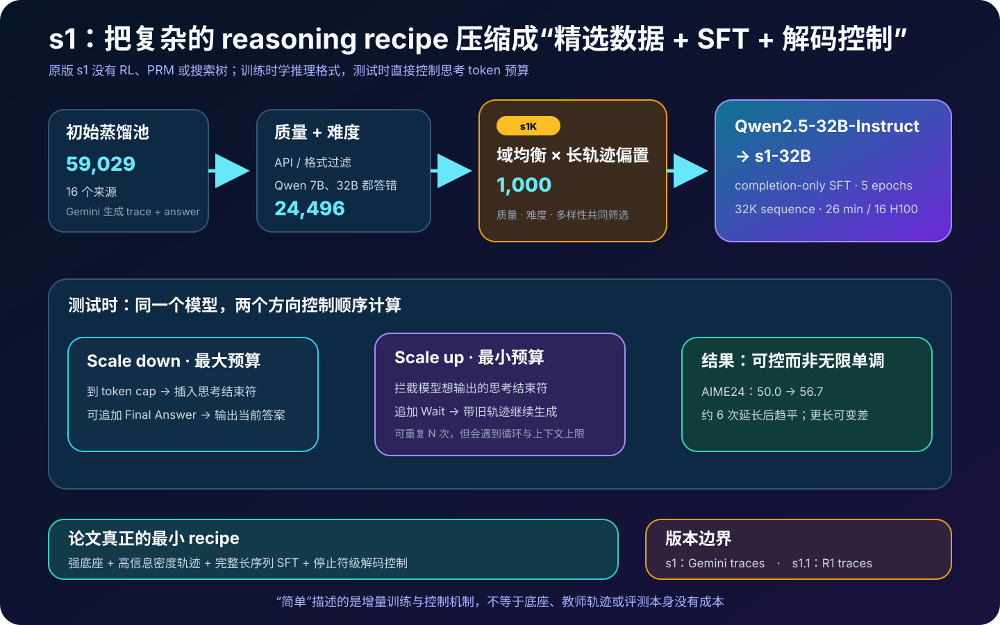
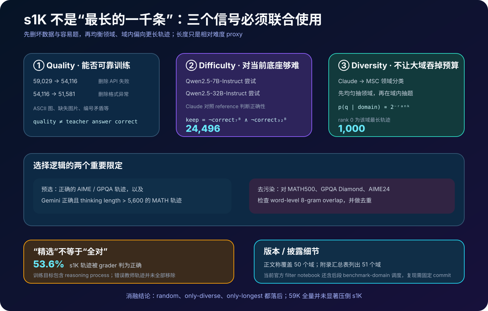
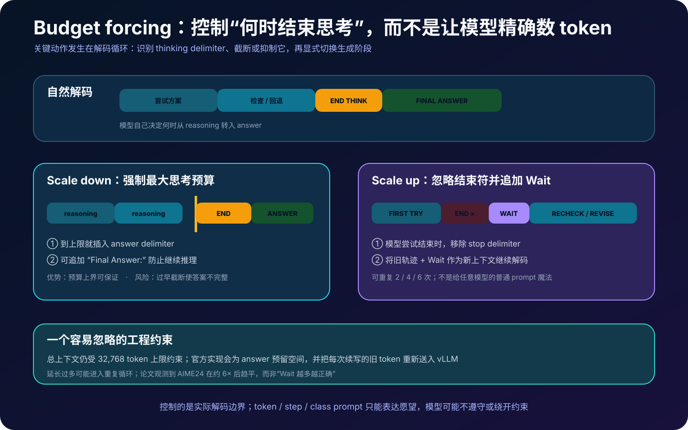
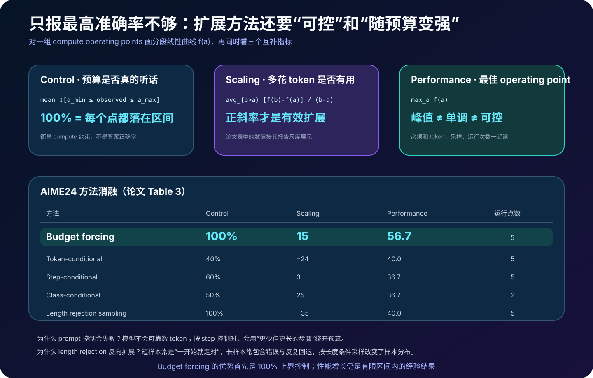
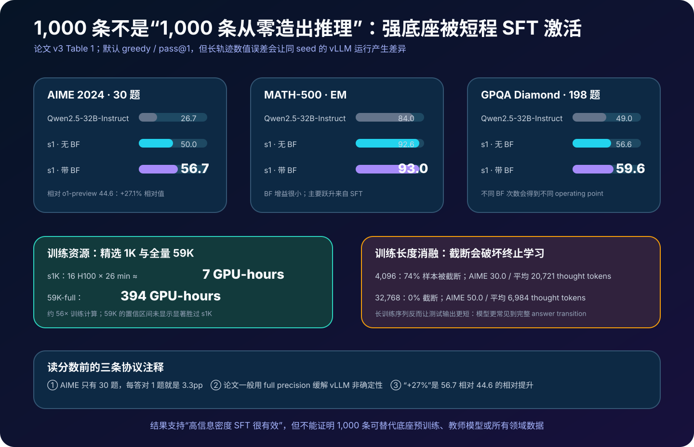
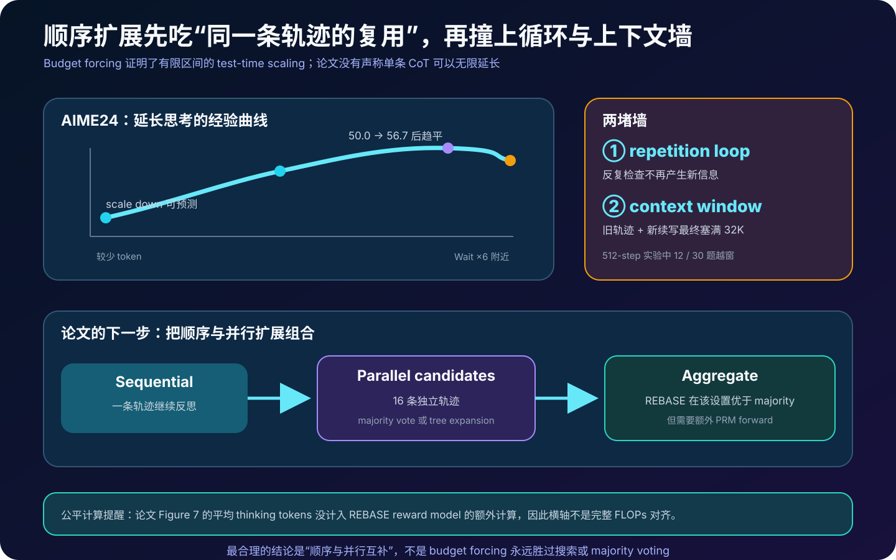

# s1 详解：怎样用 1,000 条精选轨迹和一个 `Wait` 扩展测试时计算


> **论文**：*s1: Simple Test-Time Scaling*  
> **作者**：Niklas Muennighoff、Zitong Yang、Weijia Shi、Xiang Lisa Li、Li Fei-Fei、Hannaneh Hajishirzi、Luke Zettlemoyer、Percy Liang、Emmanuel Candès、Tatsunori Hashimoto  
> **首次公开**：2025 年 1 月 31 日；后收录于 EMNLP 2025  
> **本文依据**：[arXiv v3](https://arxiv.org/abs/2501.19393) · [论文 HTML](https://arxiv.org/html/2501.19393) · [论文 PDF](https://arxiv.org/pdf/2501.19393) · [EMNLP 2025](https://aclanthology.org/2025.emnlp-main.1025/) · [项目主页](https://simplescaling.github.io/) · [官方仓库](https://github.com/simplescaling/s1)  
> **开放资源**：[s1K 数据](https://huggingface.co/datasets/simplescaling/s1K) · [s1K-1.1 数据](https://huggingface.co/datasets/simplescaling/s1K-1.1) · 模型与评测入口见官方仓库  
> **关键词**：Reasoning SFT、Data Curation、Test-Time Compute、Budget Forcing、Sequential Scaling、Inference-Time Control  
> **配套代码**：[s1_test_time_scaling_minimal.py](code/s1_test_time_scaling_minimal.py)  
> **前置阅读**：[Chain-of-Thought](11_Chain_of_Thought_2022_原理.md) · [Self-Consistency](18_Self_Consistency_2022_原理.md) · [Training Verifiers](53_Training_Verifiers_2021_原理.md) · [测试时计算扩展](58_Scaling_Test_Time_Compute_2024_原理.md) · [Kimi k1.5](60_Kimi_k1.5_2025_原理.md)

> [!IMPORTANT]
> 本文讲的是原始 **s1 / s1K**：Qwen2.5-32B-Instruct 在 1,000 条 Gemini 推理轨迹上做监督微调。官方团队一周后发布的 **s1.1 / s1K-1.1** 仍使用同一批问题，但把回答轨迹换成 DeepSeek-R1 生成物；当前仓库 README 默认更突出 s1.1。两版结果不能混写。

> [!NOTE]
> “简单”描述的是公开 recipe 很短，不表示底座、教师模型、数据源和评测没有成本。s1 没有从零训练 32B 模型，也没有用 1,000 条样本替代预训练；它是在一个已经很强的指令模型上激活和整理推理行为。

2025 年初，长思维链模型通常伴随复杂的强化学习、验证器或搜索系统。s1 提了一个刻意反常识的问题：

> 能不能不用 RL、过程奖励模型和搜索树，只靠少量高密度监督数据，再在解码时控制模型何时结束思考，就得到可扩展的推理？

论文给出的最小配方是：

```text
59,029 道候选题与教师轨迹
  → 质量过滤 + 相对难度过滤 + 领域均衡
  → s1K：1,000 道题，约 4.7M token
  → Qwen2.5-32B-Instruct completion-only SFT，5 epochs
  → s1-32B
  → 测试时截断思考，或压掉结束符并追加 Wait
```

真正有价值的不是 “`Wait` 是魔法词”，而是两条可独立复用的工程思想：

1. **训练计算可以集中在高信息密度样本上**；
2. **顺序测试时计算可以通过真实解码边界控制**，而不仅靠模型理解“请写 N 个 token”。

---

## 0. 先说结论

读完本文，至少应记住下面二十点：

1. **原始 s1 没有 RL**。它是 Qwen2.5-32B-Instruct 上的全参数监督微调，也没有 PRM、MCTS 或隐式奖励优化。
2. **“1,000 条”是后训练集，不是从零造出推理能力**。32B 底座已有大规模预训练和指令对齐，Gemini 教师也承载了额外计算与能力。
3. **候选池从 16 个来源汇成 59,029 题**，并为每题调用 Gemini 生成 reasoning trace 与最终答案。
4. **质量、难度、多样性必须联合使用**。只随机、只均衡领域或只挑最长轨迹，在消融中都不如完整 s1K recipe 稳定。
5. **难度是相对底座定义的**。Qwen2.5-7B-Instruct 与 32B-Instruct 各尝试一次；只要任一模型答对，该题就被删除。
6. **正确性由另一个模型对参考答案判定**。Claude 充当 grader，因此筛选链仍有模型误差和供应商依赖。
7. **长度只是难度代理**。同一领域内，最长教师轨迹 rank 为 0，抽样权重按 $2^{-\text{rank}}$ 衰减；它不等于“越长越正确”。
8. **领域先均匀抽，再在域内偏向长轨迹**。这样可防止 NuminaMATH 等大来源或少数大领域吞掉 1K 预算。
9. **s1K 并非全是正确教师轨迹**。论文后续 grader 只把原始 s1K 的 53.6% 判为正确；高密度选择与轨迹全对是两回事。
10. **训练只在 assistant completion 上算 loss**。问题 token 被 mask，reasoning 和 answer 都进入监督目标。
11. **32K 训练序列长度非常关键**。4K 会截断 74% 样本并破坏“思考结束 → 输出答案”的转移；32K 截断率为 0。
12. **长训练序列反而产生更短的测试推理**。AIME 平均 thinking tokens 从 20,721 降到 6,984，同时准确率由 30.0 升到 50.0。
13. **Budget forcing 控制的是停止边界**。scale down 到上限时强制切到 answer；scale up 在模型想结束时压掉结束符，追加 `Wait` 后续写。
14. **它不是给初始 prompt 随手加一个 `Wait`**。干预发生在生成循环中，必须识别并修改 thinking delimiter / stop token。
15. **“多想”不是无限单调收益**。约延长六次后 AIME 曲线趋平，继续扩展可能进入重复循环或撞上 32K 上下文墙。
16. **论文同时评价 Control、Scaling、Performance**。一个方法峰值高，不代表预算听话；预算听话，也不代表多花 token 有正收益。
17. **自然语言 token / step / class 条件控制并不可靠**。模型不会精确计 token，且可能用“步骤更少但每步更长”绕过 step budget。
18. **按长度 rejection sampling 会产生选择偏差**。长回答常包含初始错误和回退，条件在长度上采样不等于给同一条轨迹更多有效思考。
19. **AIME 从 50.0 到 56.7 是 6.7 个百分点**；“比 o1-preview 高 27%”是 $(56.7-44.6)/44.6=27.1\%$ 的相对值。
20. **顺序与并行扩展互补**。论文自己的后续实验显示，把一条轨迹的延长与 16 条候选、majority / REBASE 聚合组合，才是更完整的方向。



---

## 1. s1 究竟在缩短什么

### 1.1 不是把训练推理模型缩成一个 prompt

s1 有两个阶段：

| 阶段 | 更新模型权重 | 主要计算 | 解决的问题 |
|---|---:|---|---|
| s1K SFT | 是 | 1K 长轨迹的前向与反向 | 让底座学会完整 long-CoT 格式与答案转移 |
| Budget forcing | 否 | 测试时自回归解码 | 调节每道题实际使用的顺序推理预算 |

如果直接把 `Wait` 加到未经该分布训练的任意模型 prompt 中，论文没有证据保证它会获得同样收益。SFT 先让模型形成可识别的 thinking / answer 边界，解码控制才有稳定抓手。

### 1.2 顺序扩展与并行扩展

给定问题 $x$，顺序扩展延长同一条条件轨迹：

$$
z_1,z_2,\ldots,z_T
\sim \pi_\theta(\cdot\mid x,z_{<t}).
$$

额外 token 能读取之前的假设、计算和失败，因此可能执行检查与修订，但延迟无法完全并行。

并行扩展则独立采样：

$$
y^{(1)},\ldots,y^{(N)}
\overset{\text{i.i.d.}}{\sim}
\pi_\theta(\cdot\mid x),
$$

再用 majority vote、ORM、PRM 或搜索算法聚合。它更易 batch，却需要一个可靠选择规则。s1 的主体贡献是前者，并在附录中说明两者可以组合。

### 1.3 测试时计算不是一个可互换的标量

以下预算在系统上并不等价：

```text
8,000 个顺序 token
8 条各 1,000 token 的独立轨迹
1 条轨迹 + 逐步 PRM 打分
4 条轨迹 × 各 2 次修订
```

它们的延迟、KV cache、并行度、额外模型调用与可纠错方式都不同。s1 主要把“平均 thinking tokens”作为顺序计算 proxy；不能把它直接等同完整 FLOPs 或服务成本。

---

## 2. s1K 的起点：59,029 道题与教师轨迹

### 2.1 16 个来源不是同一种分布

初始池包含 59,029 道数学、科学和竞赛推理问题。最大来源包括：

| 来源 | 候选数 | 大致性质 |
|---|---:|---|
| NuminaMATH | 30,660 | 多源数学问题 |
| MATH | 11,999 | 中学竞赛数学 |
| OlympicArena | 4,250 | 奥赛型跨学科问题 |
| Omni-MATH | 4,238 | 高难数学 |
| AGIEval | 2,385 | 标准化考试与知识推理 |
| 其他 11 个来源 | 5,497 | GPQA、AIME、自建难题等 |

团队还加入 182 道 `s1-prob` 和 23 道 `s1-teasers`。这些数字说明为什么“从 59K 随机抽 1K”不够：大来源会按样本量主导结果，而 GPQA 这类科学推理很容易消失。

### 2.2 教师蒸馏的是“过程 + 答案”

对每个问题 $q_i$，Gemini Flash Thinking Experimental 生成：

$$
(q_i, z_i, a_i),
$$

其中 $z_i$ 是 reasoning trace，$a_i$ 是最终答案。后续长度排序用 Qwen tokenizer 计算 $z_i$ 的 token 数。

这是一种 sequence-level distillation：学生模仿教师已经采样出的单条轨迹，而不是访问教师 logits，也不是只学习最终答案。

### 2.3 API 与格式先把数据减到 51,581

第一轮不判断题难不难，只判断样本能不能可靠进入训练：

```text
59,029
  └─ 删除教师 API 失败                         → 54,116
       └─ 删除 ASCII 图、缺失图片、编号矛盾等   → 51,581
```

这里的 `quality` 是“样本格式可训练”，不等于教师解答一定正确。把这两个概念分开，是理解后面 53.6% 正确率的关键。

---

## 3. 三个联合信号：质量、难度与多样性



### 3.1 相对难度：两个底座都答错才保留

对每道格式合格的问题，Qwen2.5-7B-Instruct 和 Qwen2.5-32B-Instruct 分别尝试一次。Claude 3.5 对照参考答案判断它们是否正确。

令 $c_7(q),c_{32}(q)\in\{0,1\}$，保留条件是：

$$
\operatorname{keep}(q)
=
\neg c_7(q)\land \neg c_{32}(q).
$$

也就是说，只要任一底座答对就删除。候选数由 51,581 变为 24,496。

这个难度不是题目的绝对属性，而是相对于将要微调的模型族定义的。它集中预算在当前底座能力边缘，却也有三项噪声：

- 每个模型只做一次尝试，单次失败不等于稳定不会；
- Claude grader 可能误判；
- 参考答案本身可能有错。

### 3.2 轨迹长度：有用但危险的 proxy

在难题池中，论文把教师 reasoning 长度也当作难度 / 信息密度代理。同一领域 $d$ 内按长度从长到短排名，最长为 rank 0：

$$
p(q\mid d)
=
\frac{2^{-r(q)}}
{\sum_{q'\in d}2^{-r(q')}}.
$$

前三名的未归一化权重是：

$$
1,\frac12,\frac14,\ldots
$$

这是一种强偏置，但不是硬选 top-1：短一些的轨迹仍有非零概率，降低“全部变成最长样本”的单一性。

需要特别避免一个误读：

$$
\text{long trace}
\not\Rightarrow
\text{correct trace}
\not\Rightarrow
\text{useful extra tokens}.
$$

长轨迹也可能只是算错、绕路或重复。它只有与格式质量、底座失败和领域配额共同使用时才表现稳定。

### 3.3 领域先均衡，再在域内抽题

Claude 按 AMS Mathematics Subject Classification 对问题分类，并扩展到科学领域。论文正文称最终覆盖 50 个领域，附录汇总表又写 “All domains (51)”；应把它视作报告口径差一，而不是硬凑成同一个数字。

论文 Algorithm 1 的核心是：

```python
while len(selected) < 1000:
    domain = uniform(non_empty_domains)
    question = weighted_sample(
        domain_questions,
        weight=lambda q: 2 ** (-length_rank(q)),
    )
    selected.add(question)
```

注意这是“域均匀”而不是“题均匀”。若一个域有 10,000 题、另一个只有 100 题，二者被选为下一域的概率仍相同。

### 3.4 384 条预选种子

附录说明有 384 条高质量样本先加入集合，主要包括：

- Gemini 在 AIME / GPQA 上答对的轨迹；
- Gemini 在 MATH 上答对且 thinking length 大于 5,600 token 的轨迹。

剩余配额再按领域与长度抽样。这意味着 s1K 不是纯粹由一个统一概率分布从头抽出的 1,000 条；它包含人为规则保留的 benchmark-style 高价值样本。

### 3.5 去污染：word-level 8-gram

最终数据与 MATH-500、GPQA Diamond、AIME 2024 比较 word-level 8-gram overlap，并做去重。教学化定义是：

$$
G_8(x)=\{(w_i,\ldots,w_{i+7})\},
$$

若：

$$
G_8(q_{\text{train}})\cap G_8(q_{\text{eval}})\neq\varnothing,
$$

则视为潜在污染并移除。

8-gram 可以抓逐字复用，却抓不到改写、翻译、共享解题模板或模型预训练时已经见过的题。因此它是后训练集的局部去污染，不是端到端无泄漏证明。

### 3.6 论文伪代码与当前仓库有一个复现边界

当前官方 `data/filter.ipynb` 的后段调度比正文 Algorithm 1 更具体：早期均匀选域，选到一定数量后还会按 benchmark-domain 分布调整；域内仍使用长度 rank 权重。

因此严格复现时需要同时记录：

- 论文版本；
- 数据集 revision；
- 仓库 commit；
- notebook 实际参数与随机种子。

不能把“论文核心算法”和“当前主分支 notebook”假定为逐行一致。

---

## 4. 一个反直觉事实：精选不等于教师轨迹全对

论文后续用 Claude 3.7 重新评价轨迹，原始 s1K 只有 **53.6%** 被判为正确；s1K-1.1 为 63.0%。这看起来会否定监督学习，实际说明监督信号有多个层次：

1. 题目本身位于底座的能力边界；
2. 轨迹展示了分解、检查、回退与答案格式；
3. 即使最终解错，部分中间结构仍可能有训练价值；
4. 强底座不会机械记住每条示范，也可能在测试时组合已有能力。

但不能据此宣称“错误数据越多越好”。这里缺少对错误类型、局部步骤正确率与因果机制的完整消融。更谨慎的结论是：

> 在强底座上，题目难度、领域覆盖与长推理格式，可能与最终答案正确性共同提供信号；s1 的结果不要求所有蒸馏轨迹都完美。

这与 LIMA 式“少量高质量数据主要改变输出表面与行为分布”的观点相近。论文也把结果解释为激活底座已有能力，而不是用 4.7M token 注入全部数学知识。

---

## 5. SFT：短训练为什么能改变长推理

### 5.1 训练样本格式

模型使用显式边界分隔 reasoning 与 answer，可抽象为：

```text
<user>
question
<assistant>
<think>
long reasoning trace
<answer>
final answer
```

真实模板使用 Qwen chat special tokens。边界的作用不仅是排版：budget forcing 正是拦截“结束 thinking、转入 answer”的 token。

### 5.2 Completion-only loss

问题 token 不计损失，只监督 assistant 的 reasoning 与 answer：

$$
\mathcal L(\theta)
=-
\sum_{t\in\mathcal I_{\text{assistant}}}
\log p_\theta(y_t\mid x,y_{<t}).
$$

若 token ids 是：

```python
[11, 12, 21, 22, 23]
# user  user  assistant ...
```

label mask 为：

```python
[-100, -100, 21, 22, 23]
```

`-100` 会被 PyTorch cross entropy 忽略。这里并不是只监督最终答案；整段教师思维链都被 teacher forcing。

### 5.3 公开训练配置

| 项目 | 配置 |
|---|---|
| 底座 | Qwen2.5-32B-Instruct |
| 数据 | s1K，约 4.7M token |
| Epoch | 5 |
| Global batch size | 16 |
| Optimizer | AdamW，$\beta_1=0.9,\beta_2=0.95$ |
| Weight decay | $10^{-4}$ |
| Peak learning rate | $10^{-5}$ |
| Schedule | 5% warmup（16 steps），随后 cosine decay |
| Precision | bf16 |
| Sequence length | 32,768 |
| 并行 | FSDP，16 张 H100 |
| 时间 | 26 分钟，约 6.93 H100 GPU-hours |

总步数 315，warmup 16 步，随后约 299 步衰减到 0。训练全部 59K 数据则约需 394 H100 GPU-hours，是 s1K recipe 的约 56 倍。

“7 GPU-hours”是设备时，不是墙钟时间：

$$
16\times\frac{26}{60}=6.93\ \text{H100 GPU-hours}.
$$

它也不包括教师生成、筛选模型调用、底座预训练与超参数探索。

### 5.4 为什么 32K 训练长度是机制，不只是显存参数

论文比较 4,096 与 32,768：

| Train max length | 样本截断率 | AIME 2024 | 测试平均 thinking tokens |
|---:|---:|---:|---:|
| 4,096 | 74% | 30.0 | 20,721 |
| 32,768 | 0% | 50.0 | 6,984 |

4K 训练常只看到：

```text
question → reasoning → reasoning → [被截断]
```

却看不到：

```text
reasoning → end thinking → final answer
```

于是模型不容易学会何时结束，测试时反而写得更长。32K 保留完整转移，性能更高且输出更短。这个消融提醒我们：对长 CoT 做 SFT，截断率本身就是关键质量指标。

---

## 6. Budget forcing：直接控制“何时停止思考”



### 6.1 自然生成

模型通常经历：

```text
reasoning tokens
  → end-of-thinking delimiter
  → final answer tokens
```

自然长度 $T_0(x)$ 由模型自己决定。自然解码可能对简单题浪费，也可能对困难题过早退出。

### 6.2 Scale down：给 thinking 一个硬上限

设最大思考预算为 $B_{\max}$。如果模型在达到上限前没有产生结束符，解码器截断 reasoning，并插入 answer delimiter；实现还可附加 `Final Answer:`，提示模型马上输出当前答案。

$$
T(x)\le B_{\max}.
$$

这给出了真正的预算上界。代价也直观：模型可能刚算到一半，强制切换会得到不完整或未经检查的答案。

### 6.3 Scale up：忽略结束符并续写

若模型自然尝试结束，但尚未用完最小预算，解码器：

1. 移除 / 抑制 end-of-thinking token；
2. 在已有轨迹后追加 `Wait`；
3. 把旧 token 与 continuation 重新送入模型；
4. 继续生成下一段 reasoning；
5. 可重复 2、4、6 次。

抽象伪代码：

```python
reasoning = generate_until_end_think(prompt)

for _ in range(num_ignore):
    reasoning = remove_end_think(reasoning)
    reasoning += tokenize("Wait")
    reasoning += generate_until_end_think(prompt + reasoning)

answer = generate_answer(prompt + reasoning + END_THINK)
```

`Wait` 的作用不是提供新知识，而是给同一轨迹一个局部转折点。模型经常在后续写出：重新代入、检查边界、发现矛盾、修正答案。

### 6.4 为什么 `Wait` 比“无字符串”好，但不是唯一选择

论文在固定两次延长下比较 continuation。AIME / MATH / GPQA 的结果显示：

- 什么都不加，只压掉结束符，整体较弱；
- `Alternatively`、`Hmm` 和 `Wait` 都可能有效；
- `Wait` 在报告设置下整体最好或并列最好。

因此关键变量有两个：

$$
\text{stop suppression}
+
\text{continuation cue}.
$$

“只有 `Wait` 这个词能推理”并不是论文结论。

### 6.5 官方实现中的工程细节

论文概念图很短，实际生成至少要处理：

- reasoning 与 answer 分阶段生成；
- `stop_token_ids` 与 chat template 的对应关系；
- 每次续写把已生成 token 保留为 prefix；
- 总上下文上限 32,768；
- 为最终 answer 预留约 100 token；
- vLLM batching / tensor parallel 下 token id 与停止行为；
- 续写次数与硬 token cap 同时生效。

所以这不是普通 prompt 工程，而是 decoding-policy 工程。

---

## 7. 怎样判断测试时扩展真的有效

只报告一个最高准确率会掩盖两个问题：模型是否遵守预算，以及增加预算是否稳定有用。论文对一组 operating points $(a,f(a))$ 定义三个指标。



### 7.1 Control：预算是否听话

每个设定给定允许区间 $[a_i^{\min},a_i^{\max}]$，观察实际 compute $\hat a_i$：

$$
\operatorname{Control}
=
\frac1n\sum_{i=1}^n
\mathbf 1
[a_i^{\min}\le\hat a_i\le a_i^{\max}].
$$

Control 100% 只表示都落在区间，不表示答案正确。

### 7.2 Scaling：多花预算的平均边际收益

对所有 $a<b$ 的 operating-point 对取割线斜率再平均：

$$
\operatorname{Scaling}
=
\operatorname{mean}_{a<b}
\frac{f(b)-f(a)}{b-a}.
$$

正值表示扩展区间内平均向上，负值表示预算越多反而越差。论文表中的数值经过其报告尺度处理，适合方法内比较，不宜脱离 token 口径解释为通用“每 token 提升率”。

### 7.3 Performance：观测点的峰值

$$
\operatorname{Performance}
=\max_a f(a).
$$

它回答“最好能到哪里”，却不告诉我们曲线是否单调，也不告诉部署时能否命中该点。

### 7.4 AIME 2024 控制消融

| 方法 | Control | Scaling | Performance | 点数 |
|---|---:|---:|---:|---:|
| Budget forcing | **100%** | 15 | **56.7** | 5 |
| Token-conditional | 40% | -24 | 40.0 | 5 |
| Token-conditional + BF | **100%** | 13 | 40.0 | 5 |
| Step-conditional | 60% | 3 | 36.7 | 5 |
| Step-conditional + BF | **100%** | 6 | 36.7 | 5 |
| Class-conditional | 50% | 25 | 36.7 | 2 |
| Length rejection sampling | **100%** | -35 | 40.0 | 5 |

这个表支持的是：BF 的硬边界控制最可靠，并且在这组 AIME 点上峰值最高。它不证明所有任务、所有模型上一定有正斜率。

---

## 8. 为什么几种看似自然的控制方法失败

### 8.1 Token-conditional：模型不会精确数 token

Prompt 告诉模型“请思考大约 4,000 token”，只是表达意愿。自回归模型没有可靠倒计时器，也不知道 tokenizer 边界如何映射到自然语言长度。

加入硬 BF 后，Control 可恢复 100%，但 Performance 仍只有 40.0。这说明：

> 预算边界可靠，不代表 prompt 学会了如何把边界内的 token 用好。

### 8.2 Step-conditional：模型会改写“步骤”的粒度

要求 4、8、16 步时，模型可以用更少的编号，每一步写得更长。它表面满足 step count，却没有对应控制真实 compute；论文甚至观察到请求更多步骤时实际步数反而减少。

这是一类典型 Goodhart 问题：当“步数”成为目标，它就不再稳定代表思考量。

### 8.3 Class-conditional：long / short 太粗

给模型 long / short 类别标签只能形成两个模糊簇，无法构成密集、可校准的预算曲线。它有正 scaling，却只有两个点，峰值也不高。

### 8.4 Length rejection sampling：条件分布被改变了

这种方法反复自然采样，直到找到长度不超过阈值的回答：

$$
y\sim
\pi_\theta(y\mid x,|y|\le B).
$$

它不是把同一条轨迹在 $B$ 处截短，而是选择“天然较短”的样本。长样本往往因为初始走错而需要回退；把阈值放宽，会纳入更多此类轨迹，因而出现负 scaling。

更严格阈值还非常昂贵。论文图中，某些长度点平均需要数十乃至数百次采样才接收到一个样本；这个被拒绝的计算不能从服务成本里消失。

---

## 9. 核心结果：SFT 提供大头，BF 提供可控增量



### 9.1 与底座和公开强模型比较

论文 v3 Table 1 的 pass@1 / accuracy 如下：

| 模型 | AIME 2024 | MATH-500 | GPQA Diamond |
|---|---:|---:|---:|
| Qwen2.5-32B-Instruct | 26.7 | 84.0 | 49.0 |
| s1-32B，不加 BF | 50.0 | 92.6 | 56.6 |
| s1-32B，带 BF | **56.7** | **93.0** | **59.6** |
| o1-preview | 44.6 | 85.5 | 73.3 |
| o1-mini | 70.0 | 90.0 | 60.0 |
| o1 | 74.4 | 94.8 | 77.3 |
| DeepSeek-R1 | 79.8 | 97.3 | 71.5 |
| DeepSeek-R1-Distill-Qwen-32B | 72.6 | 94.3 | 62.1 |
| Sky-T1-32B | 43.3 | 82.4 | 56.8 |
| Bespoke-Stratos-32B | 63.3 | 93.0 | 58.1 |

三项 benchmark 大小分别为：

- AIME 2024：30 题，一题约 3.33 个百分点；
- MATH-500：500 题；
- GPQA Diamond：198 题。

因此 AIME 上 50.0 → 56.7 只对应多答对约 2 题，方向有意义，但不能把一条 30 题曲线看成高精度连续测量。

### 9.2 “提升 27%”怎样正确计算

论文强调 s1 带 BF 的 AIME 56.7 超过 o1-preview 的 44.6：

$$
\text{absolute gain}
=56.7-44.6
=12.1\ \text{points},
$$

$$
\text{relative gain}
=\frac{56.7-44.6}{44.6}
=27.1\%.
$$

所以“高 27%”是相对提升，不是高 27 个百分点。

### 9.3 Table 1 的 BF 行不是一个全任务统一旋钮

附录按不同 ignore 次数报告：

| BF 延长 | MATH-500 | GPQA Diamond | AIME 2024 |
|---|---:|---:|---:|
| `Wait` ×1 | 92.8 | 59.6 | 53.3 |
| `Wait` ×2 | 93.0 | 59.6 | 53.3 |
| `Wait` ×4 | 92.2 | 58.6 | 56.7 |

可见 Table 1 中 MATH 93.0、GPQA 59.6、AIME 56.7 对应各 benchmark 报告的较佳 operating point，而不是一套统一 `Wait ×N` 配置同时得到三项峰值。

生产系统要么固定策略接受非最优点，要么先估难度 / 任务类型再路由；后者又会增加校准成本。

### 9.4 数值可复现也有误差

论文附录提醒，即使 greedy、固定 seed，结果仍可能因以下因素变化：

- batch size；
- tensor parallel 划分；
- 浮点精度；
- vLLM 连续生成方式；
- 长序列中微小数值差异逐 token 放大。

最终评测通常用 full precision 缓解差异。官方命令常用 8-way tensor parallel；这不等于所有人从同一 checkpoint 一次运行必定得到完全相同的 AIME 题目集合。

---

## 10. 数据消融：为什么三个信号缺一不可

各数据策略都在相同 1K 规模附近训练，并用 BF 扩到约 30K token 上限：

| 训练集 | AIME 2024 | MATH-500 | GPQA Diamond | 主要缺失 |
|---|---:|---:|---:|---|
| Random 1K | 36.7 | 90.6 | 52.0 | 难度与领域控制 |
| Only-diverse 1K | 26.7 | 91.2 | 54.6 | 难度 / 长度偏置 |
| Only-longest 1K | 33.3 | 90.4 | **59.6** | 领域均衡 |
| Full 59K | **53.3** | 92.8 | 58.1 | 无压缩 |
| s1K | 50.0 | **93.0** | 57.6 | 联合 recipe |

可得到四个比“1K 胜过 59K”更准确的结论：

1. 随机 1K 明显不够，样本选择非常重要；
2. 只追最长能在 GPQA 上很好，却在 AIME / MATH 不稳定；
3. 全量 59K 在 AIME 数值更高，s1K 不是每列都赢；
4. 论文用 10,000 次 paired bootstrap 给 95% CI，整体上未显示 full 59K 显著优于 s1K。

因此 s1K 的优势是**样本与训练计算效率**，不是证明丢掉 58K 数据永远更好。

### 10.1 训练计算的对照应怎样读

$$
C_{\text{s1K}}approx 6.93\ \text{H100-hours},
\qquad
C_{\text{59K}}approx394\ \text{H100-hours}.
$$

比值约为：

$$
\frac{394}{6.93}\approx56.9.
$$

这证明在该底座、该后训练实现和该 benchmark 集合上，精选数据能显著压缩 SFT 计算。它没有计入：

- 59K 次 Gemini 教师生成；
- 7B / 32B 底座尝试；
- Claude 分类与评分；
- 多轮数据和超参数试验；
- Qwen2.5-32B 的既有训练。

所以完整 recipe 的生命周期成本远高于 7 GPU-hours。

---

## 11. 扩展曲线为什么会停：循环与上下文墙



### 11.1 `Wait` 不是无限续杯

早期 continuation 常触发有价值的动作：

```text
初次答案
  → Wait
  → 重新检查约束
  → 发现反例
  → 修订
```

次数继续增加后，模型可能变成：

```text
重复同一检查
  → 换一种措辞重复
  → 回到旧答案
  → 再次重复
```

论文在 AIME 上观察到大约六次延长后趋平。最合理的解释不是 `Wait ×6` 是普遍最优超参数，而是这个模型 / 上下文 / 任务下的新信息增益开始低于重复成本。

### 11.2 旧轨迹本身会吃掉上下文

顺序 continuation 必须保留完整 prefix。若初始 reasoning 已很长，每次续写都会接近 32,768 token 上限。论文把 sequential prompting 延长到 512 steps 时，AIME 有 12/30 题超过上下文并出现明显性能下降。

测试时扩展的可用空间其实是：

$$
B_{\text{new reasoning}}
\le
B_{\text{context}}
-B_{\text{question}}
-B_{\text{old reasoning}}
-B_{\text{answer reserve}}.
$$

### 11.3 与 majority vote / REBASE 组合

论文比较一条顺序轨迹、16 条并行轨迹的 majority，以及用过程奖励模型引导的 REBASE。更合理的系统是：

```text
每条候选内部：适量 budget forcing 做自检
候选之间：并行采样获得多样性
候选聚合：majority / verifier / search
```

REBASE 在该设置下优于简单 majority 与单条顺序扩展，但它需要额外 PRM forward。论文 Figure 7 的横轴主要统计平均 thinking tokens，没有把 reward model 计算完整纳入；因此不能把图读成严格端到端 FLOPs 对齐。

---

## 12. 原始 s1 与 s1.1：同一批题，不同教师轨迹

s1.1 在原论文后很快发布，容易和主结果混淆：

| 项目 | s1 | s1.1 |
|---|---|---|
| 问题集合 | s1K 的 1,000 题 | 同一批 1,000 题 |
| 教师轨迹 | Gemini Flash Thinking | DeepSeek-R1 |
| 底座 | Qwen2.5-32B-Instruct | 同上 |
| 训练 | 5-epoch SFT | 同类 recipe |
| grader 判断轨迹正确 | 53.6% | 63.0% |
| 定位 | 论文原始系统 | 更强教师轨迹的后续版本 |

s1.1 无 BF 时报告 MATH-500 94.4、GPQA 60.6、AIME24 56.7、AIME25 50.0；某些 BF operating point 还能把 MATH 提到 95.4、GPQA 提到 63.6，但 AIME 并非继续上涨。

这个对照说明教师轨迹质量仍重要，也再次表明 BF 收益依任务而异。引用结果时至少应写清：

```text
s1 还是 s1.1？
哪个 checkpoint？
哪个 benchmark？
Wait / ignore 次数是多少？
是否用了硬 max token？
```

---

## 13. 配套代码：零依赖复现可公开验证的机制

本文提供：[s1_test_time_scaling_minimal.py](code/s1_test_time_scaling_minimal.py)。

它不下载 32B 权重，也不伪造论文 benchmark；它把可脱离 GPU 验证的机制写成可运行程序：

- quality / difficulty filter；
- 域均匀、域内 $2^{-\text{rank}}$ 加权抽样；
- word-level 8-gram；
- completion-only label mask；
- scale down / scale up 的脚本化生成循环；
- Control / Scaling / Performance；
- majority vote、length rejection sampling 与 GPU-hour 算术。

运行：

```bash
python3 papers/to-2026/code/s1_test_time_scaling_minimal.py
```

输出：

```text
s1 disclosed-mechanism arithmetic:
  curated ids                    = ('geo-long', 'geo-short', 'nt-long', 'bio-mid')
  completion-only labels         = (-100, -100, 21, 22, 23)
  8-gram overlap                 = True
  natural / extended tokens      = 2 / 10
  ignored end markers            = 2
  shortened / forced exit        = 4 / True
  control                         = 33.3%
  average pairwise scaling        = 0.00005130 accuracy/token
  peak performance                = 56.7%
  rejection sample length / tries = 3900 / 3
  16 H100 × 26 min                = 6.93 GPU-hours
  AIME 56.7 vs 44.6 relative gain = 27.1%
```

### 13.1 长度 rank 抽样

核心实现与输入顺序对齐返回概率：

```python
order = sorted(
    range(len(examples)),
    key=lambda i: (-examples[i].thinking_tokens, examples[i].qid),
)
ranks = [0] * len(examples)
for rank, index in enumerate(order):
    ranks[index] = rank

weights = [2.0 ** (-rank) for rank in ranks]
probabilities = [w / sum(weights) for w in weights]
```

教学代码用 `qid` 稳定打破同长度平局；真实复现应遵循数据脚本具体排序与 seed。

### 13.2 Completion-only labels

```python
def completion_only_labels(token_ids, assistant_start):
    return tuple(
        -100 if i < assistant_start else token
        for i, token in enumerate(token_ids)
    )
```

这能检查“只 mask 问题，不 mask reasoning”这一训练语义。

### 13.3 Budget forcing 状态机

教学实现把模型每次准备产生结束符前的 reasoning 抽象成 `ReasoningPass`：

```python
for reasoning_pass in passes:
    output.extend(reasoning_pass.tokens[:remaining])

    if ignored < ignore_end_times:
        output.extend(("Wait",))
        ignored += 1
        continue
    break
```

真实模型还需显式处理 stop ids、KV cache / prefix、answer reserve 与上下文上限；不要把这个离散状态机直接当生产 vLLM 补丁。

### 13.4 指标代码

```python
slopes = [
    (performance[j] - performance[i])
    / (compute[j] - compute[i])
    for i in range(len(compute))
    for j in range(i + 1, len(compute))
]
scaling = sum(slopes) / len(slopes)
performance_peak = max(performance)
```

代码输出使用原始 accuracy/token 单位，论文 Table 3 使用自己的报告尺度；数值不应直接逐项对齐，公式语义才是这里的验证目标。

---

## 14. 如果要严肃复现，最小实验清单是什么

### 14.1 数据侧

1. 固定 s1K 或 s1K-1.1 的 Hugging Face revision；
2. 记录原题、教师 trace、answer、domain 和 token length；
3. 重新检查评测集 8-gram overlap 与去重；
4. 分开报告问题质量、最终答案正确性和逐步轨迹质量；
5. 固定 tokenizer，长度 rank 才可比较。

### 14.2 训练侧

1. 使用明确的 Qwen2.5-32B-Instruct revision；
2. 核对 chat template 与 `<think>/<answer>` 边界；
3. 核对 question mask；
4. 报告 packing 与截断率；
5. 固定 32K sequence length、global batch 16、5 epochs；
6. 保存 optimizer / LR / FSDP 配置和精确步数。

### 14.3 推理侧

1. 报告 temperature、top-p、pass@1 / majority；
2. 报告 max thinking tokens、answer reserve、ignore 次数和 continuation；
3. 同时记录实际 thinking tokens、总 tokens、墙钟延迟与失败率；
4. 固定 vLLM / Transformers 版本、tensor parallel 和 dtype；
5. 每个 operating point 重复运行或给置信区间；
6. 不用一套 benchmark-specific 最佳超参数冒充统一部署策略。

### 14.4 更公平的成本核算

至少报告：

$$
C_{\text{total}}
=C_{\text{teacher}}
+C_{\text{filter}}
+C_{\text{SFT}}
+C_{\text{generation}}
+C_{\text{verifier/aggregation}}.
$$

对线上系统还要增加 P50 / P95 latency、KV cache bytes、吞吐与拒绝采样浪费。平均 reasoning tokens 只是一列，不是完整账单。

---

## 15. 论文没有证明什么

### 15.1 没证明 1K 样本足以从零学习推理

s1 继承 Qwen2.5-32B 的语言、数学、代码和指令能力，又从强教师蒸馏长轨迹。更准确的因果表述是：

> 1K 条精心选择的长轨迹，足以显著改变一个强底座的推理行为。

### 15.2 没证明错误轨迹普遍有益

53.6% 是 grader 结果，不是受控噪声比例实验。模型可能从错误轨迹学到格式，也可能受到伤害；论文不能区分每种情况。

### 15.3 没证明“越长越好”

训练选择对长度有偏置，但推理曲线会平台甚至下降。数据侧“长轨迹可能信息密度高”和推理侧“无限续写有效”是两条不同命题。

### 15.4 没证明 BF 在所有任务上统一增益

三个 benchmark 的最佳 ignore 次数不同，MATH 的增益很小，继续扩展还能变差。它是可控机制，不是单调定律。

### 15.5 没证明自然语言 CoT 忠实反映内部计算

可读 reasoning 可能是实际决策依据，也可能包含事后合理化。最终答案提升不能自动证明每个中间句子都忠实、正确或可审计。

### 15.6 没覆盖广泛通用能力与安全

核心评测是数学和科学推理，没有系统回答：

- 长 CoT 对开放式写作、事实问答、代码执行的泛化；
- 恶意 prompt 与越狱下的行为；
- 延长思考是否放大幻觉或敏感信息；
- 多语言、公平性和现实部署安全。

### 15.7 Benchmark 与数值误差仍有限

AIME 只有 30 题；GPQA 198 题；同 seed 的长生成还受精度与并行影响。比较 3.3 或 6.7 个百分点时必须保留样本误差意识。

---

## 16. 与相关路线的关系

### 16.1 与 Chain-of-Thought

CoT 证明中间自然语言步骤能显著改善复杂推理。s1 进一步把中间序列变成一个可控计算轴：不仅“要不要写 CoT”，还问“什么时候允许它结束”。

### 16.2 与 Self-Consistency / majority voting

Self-Consistency 扩展并行样本数，s1 扩展单条轨迹长度：

$$
\text{parallel diversity}
\quad\text{vs}\quad
\text{sequential revision}.
$$

前者更擅长覆盖多个解法，后者能在共享上下文内修改已有解法。两者结合通常比二选一更自然。

### 16.3 与 2024 年 compute-optimal test-time scaling

[Scaling LLM Test-Time Compute Optimally](58_Scaling_Test_Time_Compute_2024_原理.md) 使用 proposer、PRM、search 与 difficulty routing，强调按题难度选择串并行策略。s1 把其中一个子问题压到最简：不训练 verifier，直接控制 long-CoT 的退出边界。

代价是 s1 不知道额外 reasoning 是否真的更好，只能依赖经验曲线和硬上限；compute-optimal 路由更复杂，却有机会把预算投到更有价值的候选。

### 16.4 与 Kimi k1.5 / DeepSeek-R1

Kimi k1.5 和 DeepSeek-R1 把长推理与 outcome RL 结合，让策略在训练中主动发现和强化有效探索。s1 则说明：

> 在已经较强的底座上，长 CoT 行为的一部分可以通过高密度 SFT 激活，再用简单解码控制扩展。

这不是 “SFT 已经证明 RL 无用”。RL 可以改变采样分布、奖励正确探索并持续生成新经验；s1 的优势是极简、便宜、容易开放和诊断。

### 16.5 与 LIMA / Superficial Alignment

两者都支持一个共同直觉：预训练底座可能已经具备大量能力，少量高质量后训练主要教它用什么格式、在什么情境展示这些能力。s1 把这个观点延伸到 long-CoT，但其 1K 数据选择明显比普通风格对齐更依赖难度和轨迹长度。

---

## 17. 常见误读

### 误读 1：s1 用 1,000 条数据训练出 32B 推理模型

不对。它从 Qwen2.5-32B-Instruct 开始，只做后训练。

### 误读 2：s1 是强化学习模型

不对。原始 s1 只有 SFT；BF 也不更新权重。

### 误读 3：在 prompt 末尾写 `Wait` 就能复制论文

不对。`Wait` 在模型尝试结束 thinking 时由生成循环追加，并伴随 stop delimiter 抑制。

### 误读 4：精选意味着 1,000 条轨迹全正确

不对。论文后续 grader 只判断 53.6% 正确。

### 误读 5：s1K 就是从 24,496 条里选最长 1,000 条

不对。它先保留种子、均匀选域，再在域内按长度 rank 概率抽样。

### 误读 6：`Wait ×4` 是统一最佳配置

不对。AIME 的最好点偏向更多延长，MATH / GPQA 的较佳点不同。

### 误读 7：56.7 比 44.6 高 27 个百分点

不对。绝对差 12.1 点，相对提升 27.1%。

### 误读 8：7 GPU-hours 是 s1 的全部成本

不对。它只近似计算最终 1K SFT，不包括教师、筛选、底座与实验迭代。

### 误读 9：更多 reasoning token 必然更准

不对。约六次延长后趋平，还会重复或超上下文。

### 误读 10：原始 s1 与 s1.1 只是同一个模型的新名字

不对。问题相同，但教师轨迹、数据集、checkpoint 和结果都不同。

---

## 18. 一页速查卡

```text
s1 / Simple Test-Time Scaling

底座
  Qwen2.5-32B-Instruct

数据
  16 sources / 59,029 questions
  Gemini reasoning + answer
  API / format -> 51,581
  Qwen 7B and 32B both fail -> 24,496
  preselect 384 high-value traces
  uniform domain sampling
  p(q | domain) ∝ 2^(-length_rank)
  8-gram decontamination
  final s1K: 1,000 examples / ~4.7M tokens

训练
  completion-only SFT
  reasoning + answer supervised
  5 epochs / global batch 16 / seq 32,768
  bf16 / FSDP / 16 H100 / 26 min
  ≈ 6.93 H100 GPU-hours

测试时
  scale down:
    hit max thinking tokens -> insert answer boundary
  scale up:
    suppress attempted end-think -> append Wait -> continue

指标
  Control     = observed compute 是否落在目标区间
  Scaling     = operating points 两两斜率均值
  Performance = 观测峰值

核心结果
  Qwen2.5-32B AIME: 26.7
  s1 no BF:           50.0
  s1 with BF:         56.7

边界
  no RL / no PRM / no search tree
  1K != training from scratch
  s1 != s1.1
  Wait is a decoding intervention, not a universal magic prompt
  sequential gains plateau; context and repetition matter
```

---

## 19. 总结

s1 最值得保留的，不是“一个词让模型突然聪明”，而是一套把推理实验做小、做清楚的方法：

1. 用强底座的失败定义相对难度；
2. 用领域配额防止数据规模压倒覆盖；
3. 用长轨迹偏置提高有限样本的信息密度；
4. 保留完整长序列，让模型学到从 reasoning 到 answer 的终止转移；
5. 在真实生成循环中控制停止边界；
6. 同时报告预算控制、扩展斜率与峰值；
7. 在重复、上下文与并行候选之间寻找 operating point。

它把一个看似依赖复杂 RL 系统的问题，压缩成“精选数据 + 完整序列 SFT + 解码控制”，并且公开了数据、模型与代码。这使 s1 成为极好的机制研究基线。

但它的简洁也更容易被夸大。1K 样本站在强底座、强教师和多个 grader 的肩膀上；`Wait` 的收益有限且依任务；AIME 小样本与长生成数值误差都要求谨慎。最稳妥的结论是：

> 高信息密度 SFT 可以低成本激活强底座的长推理行为；budget forcing 可以在有限区间内可靠控制顺序测试时计算；下一步不是无限续写，而是把顺序自检、并行多样性与按题路由组合起来。

---

## 参考资料

- [s1: Simple Test-Time Scaling — arXiv v3](https://arxiv.org/abs/2501.19393)
- [s1: Simple Test-Time Scaling — HTML](https://arxiv.org/html/2501.19393)
- [s1 — EMNLP 2025, ACL Anthology](https://aclanthology.org/2025.emnlp-main.1025/)
- [SimpleScaling 项目主页](https://simplescaling.github.io/)
- [simplescaling/s1 官方仓库](https://github.com/simplescaling/s1)
- [Hugging Face：simplescaling/s1K](https://huggingface.co/datasets/simplescaling/s1K)
- [Hugging Face：simplescaling/s1K-1.1](https://huggingface.co/datasets/simplescaling/s1K-1.1)

