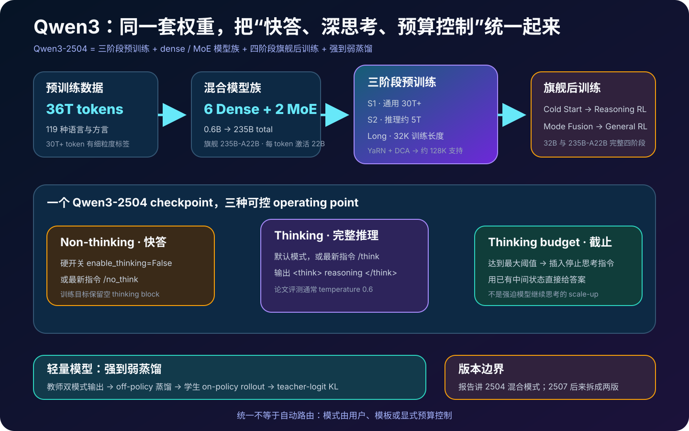
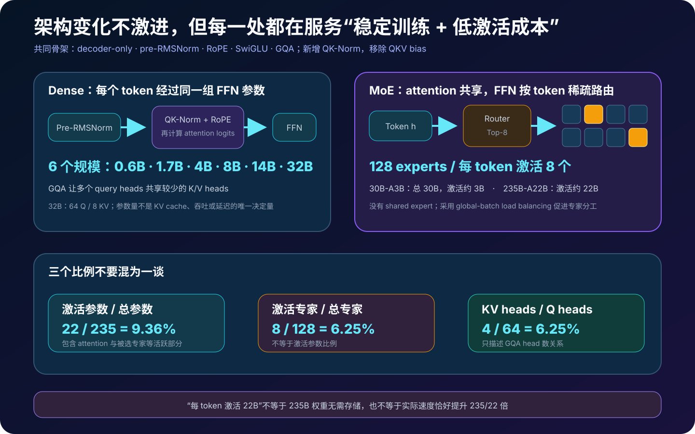
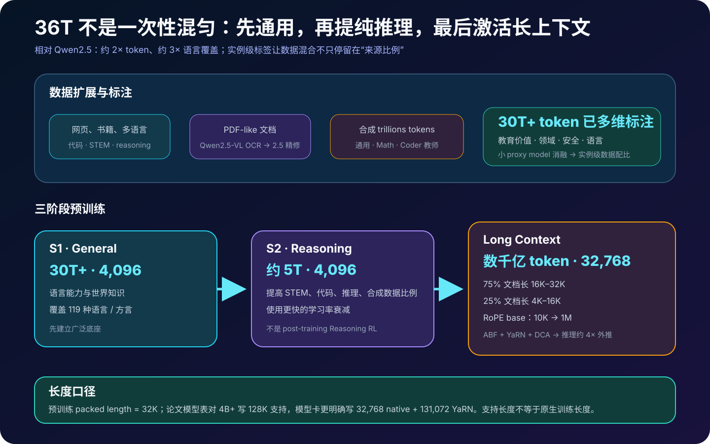
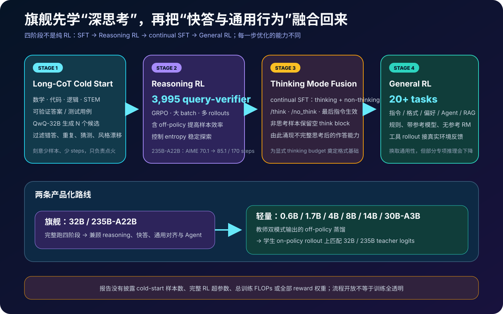
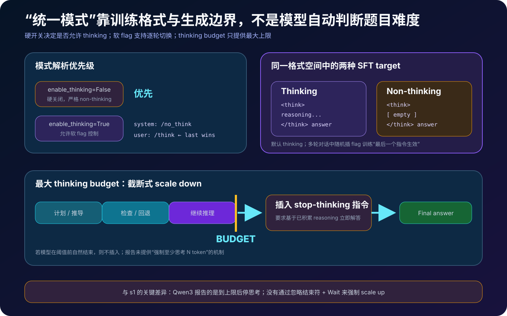
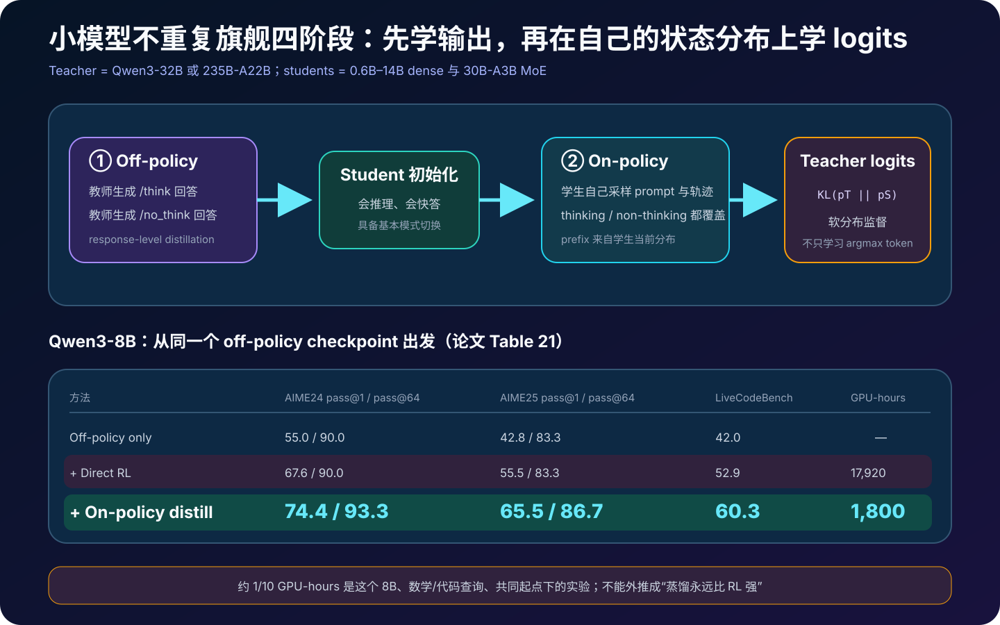
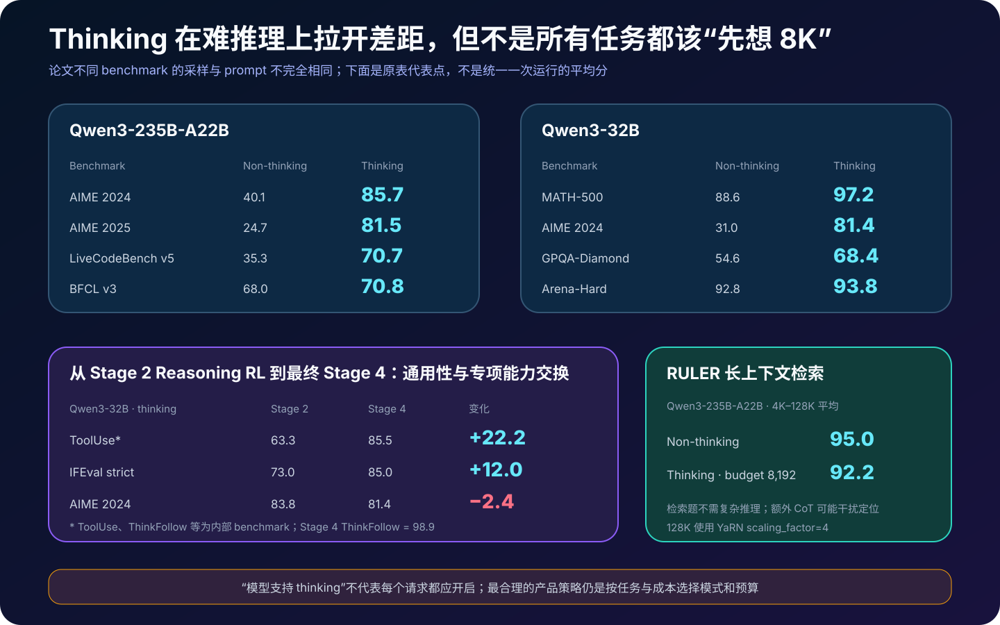

# Qwen3 详解：怎样把 Thinking、快答、MoE 与强到弱蒸馏统一进一个模型族


> **论文**：*Qwen3 Technical Report*  
> **作者**：Qwen Team  
> **模型首次发布**：2025 年 4 月 29 日；**报告首次公开**：2025 年 5 月 14 日  
> **本文依据**：[arXiv v1](https://arxiv.org/abs/2505.09388) · [论文 HTML](https://arxiv.org/html/2505.09388) · [论文 PDF](https://arxiv.org/pdf/2505.09388) · [官方发布博客](https://qwenlm.github.io/blog/qwen3/) · [官方仓库](https://github.com/QwenLM/Qwen3)  
> **开放资源**：[Qwen3-235B-A22B 原始模型卡](https://huggingface.co/Qwen/Qwen3-235B-A22B) · [Qwen3 GitHub](https://github.com/QwenLM/Qwen3) · 权重与代码采用 Apache 2.0 许可  
> **关键词**：Hybrid Thinking、Thinking Budget、Mixture-of-Experts、GRPO、Strong-to-Weak Distillation、Long Context、Multilingual LLM  
> **配套代码**：[qwen3_hybrid_reasoning_minimal.py](code/qwen3_hybrid_reasoning_minimal.py)  
> **前置阅读**：[RoPE](09_RoFormer_RoPE_2021_原理.md) · [Switch Transformer](16_Switch_Transformer_2021_原理.md) · [GQA](44_GQA_2023_原理.md) · [DeepSeekMath / GRPO](57_DeepSeekMath_2024_原理.md) · [测试时计算扩展](58_Scaling_Test_Time_Compute_2024_原理.md) · [Kimi k1.5](60_Kimi_k1.5_2025_原理.md) · [s1](61_s1_2025_原理.md)

> [!IMPORTANT]
> 本文严格讨论报告所对应的 **Qwen3-2504**：2025 年 4 月发布、同一 checkpoint 同时支持 thinking 与 non-thinking 的原始模型族。官方仓库后来加入的 **Qwen3-2507** 把 Instruct 与 Thinking 拆成独立版本，并更新了上下文与推理能力；那是后续迭代，不能拿它的 256K / 1M 能力、模型卡或默认示例反向解释这份技术报告。

> [!NOTE]
> Qwen3 是“开放权重”模型族，但报告没有开放 36T token 训练集、精确数据混合、全套训练代码、训练 FLOPs、硬件拓扑、完整 RL 超参数与奖励实现。能下载权重和推理代码，不等于可以逐步骤复现训练。

Qwen3 最醒目的产品特性是：**一个模型、两种回答节奏**。

- 简单问答可关闭思考，直接输出；
- 数学、代码或复杂推理可进入长思考；
- 服务端还可设置 thinking token 的最大预算，在截止点要求模型根据已有中间状态立即作答。

但如果只把它理解成“在 chat template 里多了 `/think`”，就会漏掉整份报告真正的系统设计。Qwen3 同时做了四件事：

```text
36T token、119 种语言 / 方言的三阶段预训练
  → 6 个 Dense + 2 个 MoE 的完整尺寸谱
  → 旗舰模型四阶段后训练，先强化深推理，再融合快答与通用行为
  → 小模型通过 off-policy 输出蒸馏 + on-policy logit 蒸馏继承双模式
```

这篇博客不逐段翻译论文，而是回答六个更难的问题：

1. “统一 thinking / non-thinking”究竟统一在哪里？
2. `235B-A22B` 的 22B、128 个专家与 8 个激活专家是什么关系？
3. 36T token 如何分三阶段，128K 又是不是原生训练长度？
4. 四阶段后训练为什么既提升 Agent，又会牺牲一点数学和代码？
5. thinking budget 是怎样的截止机制，为什么它不等于 s1 的强制延长？
6. 小模型为何没有照抄旗舰四阶段，而用蒸馏节省近 90% 的一次实验计算？

---

## 0. 先说结论

读完本文，至少应记住下面二十四点：

1. **报告发布八个 Qwen3-2504 模型**：0.6B、1.7B、4B、8B、14B、32B 六个 Dense，以及 30B-A3B、235B-A22B 两个 MoE。
2. **统一不等于自动路由**。模型不会先判断题目难度再自行决定是否思考；模式由 chat template 的硬开关、用户 `/think` / `/no_think` 指令或服务端预算控制。
3. **原始 2504 的同一 checkpoint 支持两种模式**。这与后续 2507 把 Instruct 与 Thinking 拆成两个 checkpoint 不同。
4. **Non-thinking 不是另一套参数**。后训练把非思考目标也写成 `<think></think>{answer}`，让两种行为共享同一个格式空间。
5. **Thinking 默认开启**。软指令中多轮对话以最后出现的 `/think` 或 `/no_think` 为准；硬开关 `enable_thinking=False` 则直接禁用 thinking。
6. **Thinking budget 是最大上限，不是保证消费量**。模型若提前自然结束，不会被强迫写满；撞到上限才插入 stop-thinking 指令转入答案。
7. **它只实现论文意义上的 scale down**。与 s1 不同，Qwen3 报告没有压掉结束符并追加 `Wait` 来强制至少多思考 N 个 token。
8. **预算控制利用了 Stage 3 的涌现能力**。论文称“从不完整 reasoning 直接作答”并未专门训练，而是在模式融合后出现。
9. **Dense 与 MoE 共享 decoder-only、pre-RMSNorm、RoPE、SwiGLU、GQA 骨架**；相对 Qwen2，Qwen3 移除 QKV bias，并加入 QK-Norm 稳定训练。
10. **`235B-A22B` 是总参数约 235B、每 token 激活约 22B**，激活占比约 $22/235=9.36\%$；它不是“模型只需保存 22B 权重”。
11. **两个 MoE 都有 128 个专家、每 token 选 8 个**，专家命中率是 $8/128=6.25\%$；这个比例不能与激活参数占比画等号。
12. **Qwen3 MoE 没有 shared expert**。论文采用细粒度专家切分与 global-batch load balancing loss，避免路由长期挤向少数专家。
13. **36T token 约为 Qwen2.5 的两倍**，覆盖 119 种语言 / 方言；但“覆盖 119 种”不等于每种语言质量均匀，也不等于评测了 119 种。
14. **数据扩展不仅靠抓网页**。Qwen2.5-VL 对 PDF-like 文档做 OCR，Qwen2.5 清洗文本，Qwen2.5、Math、Coder 还合成了数万亿 token 的教材、问答、指令与代码数据。
15. **30T+ token 做了多维实例级标注**。团队用小型 proxy model 消融数据混合，而不只在“某来源占百分之几”的域级比例上调参。
16. **预训练有三个阶段**：General 超过 30T、Reasoning 约 5T、Long Context 数千亿 token；前两段长度 4,096，最后一段 packed length 32,768。
17. **论文表中的 128K 不等于原生用 128K 训练**。原始模型卡更明确地写成 32,768 native，借助 YaRN 扩到 131,072；论文还配合 DCA 做约四倍外推。
18. **旗舰 32B 与 235B-A22B 完成四阶段后训练**：Long-CoT Cold Start、Reasoning RL、Thinking Mode Fusion、General RL。
19. **Reasoning RL 的核心训练集只有 3,995 个 query-verifier 对**，但每题配大 batch、多 rollouts、GRPO 和 off-policy 数据；论文没有披露完整 batch、rollout 数与奖励公式。
20. **一次连续 RL run 中，235B-A22B 的 AIME 2024 从 70.1 提到 85.1**，只用了 170 steps，过程中没有人工重调超参；这不是“3,995 道题从头教会数学”。
21. **Stage 4 明确做能力交换**。Qwen3-32B 的 ToolUse 从 Stage 2 的 63.3 升到 85.5，AIME 2024 则从 83.8 降到 81.4；更通用不等于每个专项指标都单调上升。
22. **小模型不重复旗舰四阶段**。先学教师在两种模式下的完整输出，再让学生 on-policy 采样，并用 32B / 235B 教师 logits 做 KL 对齐。
23. **8B 的特定数学 / 代码实验中，on-policy 蒸馏用 1,800 GPU-hours，直接 RL 用 17,920 GPU-hours**，计算减少约 90%，且前者 pass@1 更好；这不能外推成“蒸馏永远胜过 RL”。
24. **Thinking 不是所有任务都该开**。旗舰 RULER 长上下文检索平均分 non-thinking 为 95.0、thinking 为 92.2；额外 CoT 有时会干扰定位，而非贡献推理。



---

## 1. Qwen3 究竟统一了什么

### 1.1 统一的是参数、格式和行为，不是一个隐藏难度分类器

令同一个模型参数为 $\theta$，输入为对话 $x$，模式控制量为 $m$：

$$
p_\theta(y\mid x,m),
\qquad
m\in\{\text{thinking},\text{non-thinking}\}.
$$

两种模式共享 $\theta$，差别来自模板、最近的软指令以及生成边界。报告没有训练或披露一个：

$$
g(x)\to \{\text{easy},\text{hard}\}
$$

再由 $g$ 自动选择模式的 router。

更准确的产品图是：

```text
用户 / 应用
  ├─ enable_thinking=False ───────────→ 强制 non-thinking
  └─ enable_thinking=True
       ├─ 没有软 flag ────────────────→ 默认 thinking
       ├─ 最后一个 flag 为 /no_think ─→ non-thinking
       └─ 最后一个 flag 为 /think ────→ thinking
```

因此“一个模型会自动按题目难度思考”是错误说法。应用层当然可以另写一个难度路由器，但那是 **Qwen3 之外的系统**。

### 1.2 为什么非思考目标仍保留空标签

Stage 3 的监督目标可写为：

$$
y_{\text{think}}
=
\langle\text{think}\rangle z
\langle/\text{think}\rangle a,
$$

$$
y_{\text{direct}}
=
\langle\text{think}\rangle
\langle/\text{think}\rangle a,
$$

其中 $z$ 是长 reasoning，$a$ 是最终回答。

空 thinking block 有三个工程价值：

1. parser 不必为两种模式维护完全不同的输出语法；
2. 模型在同一分隔符之后都要学习“现在开始写用户可见答案”；
3. thinking budget 截断时，可以显式补齐关闭标签，再沿统一答案分布继续解码。

### 1.3 三个 operating point

Qwen3-2504 实际提供的不是两个而是三个常用工作点：

| 工作点 | 控制方式 | token 行为 | 适合场景 |
|---|---|---|---|
| 快答 | `enable_thinking=False` 或 `/no_think` | 不生成可见长推理 | 闲聊、翻译、格式化、低延迟调用 |
| 完整思考 | 默认或 `/think` | 自然生成到 `</think>` | 难数学、代码、逻辑、复杂 STEM |
| 有上限思考 | thinking + max budget | 自然结束或到阈值被截停 | SLA、成本上限、批量服务 |

第三种不是第三套权重，而是同一 thinking 分布上的解码干预。

---

## 2. 八个模型：Dense 与 MoE 共用一条骨架



### 2.1 模型族总表

论文 Table 1 给出的原始模型族如下：

| 模型 | 类型 | Layers | Q / KV heads | 专家总数 / 激活数 | Embedding tied | 论文表中长度 |
|---|---|---:|---:|---:|---:|---:|
| Qwen3-0.6B | Dense | 28 | 16 / 8 | — | 是 | 32K |
| Qwen3-1.7B | Dense | 28 | 16 / 8 | — | 是 | 32K |
| Qwen3-4B | Dense | 36 | 32 / 8 | — | 是 | 128K |
| Qwen3-8B | Dense | 36 | 32 / 8 | — | 否 | 128K |
| Qwen3-14B | Dense | 40 | 40 / 8 | — | 否 | 128K |
| Qwen3-32B | Dense | 64 | 64 / 8 | — | 否 | 128K |
| Qwen3-30B-A3B | MoE | 48 | 32 / 4 | 128 / 8 | 否 | 128K |
| Qwen3-235B-A22B | MoE | 94 | 64 / 4 | 128 / 8 | 否 | 128K |

这里保留“论文表中长度”的措辞，是因为它与原始模型卡的 **32,768 native + 131,072 YaRN** 口径需要结合解释，不能简写成“所有 4B+ 都原生 128K 训练”。第 4 节会专门拆开。

### 2.2 共同 Transformer 配方

所有模型采用 decoder-only Transformer：

```text
token embedding
  → [pre-RMSNorm → grouped-query self-attention → residual
     pre-RMSNorm → SwiGLU FFN / routed expert FFN → residual] × L
  → LM head
```

与 Qwen2 相比，报告明确指出两个小但重要的改动：

- 移除 attention 中 Q、K、V 的 bias；
- 对 Query 与 Key 加 QK-Norm，提升大规模训练稳定性。

模型族共用 byte-level BPE tokenizer，词表大小为 **151,669**。大词表有利于多语言、代码与常见片段压缩，但词表规模本身不保证低资源语言分词效率一致，仍应逐语言测量 token / 字符比例。

用简化符号表示：

$$
\widehat q=\operatorname{RMSNorm}(q),
\qquad
\widehat k=\operatorname{RMSNorm}(k),
$$

$$
\operatorname{Attn}(Q,K,V)
=
\operatorname{softmax}
\left(
\frac{\operatorname{RoPE}(\widehat Q)
\operatorname{RoPE}(\widehat K)^\top}{\sqrt{d_h}}
\right)V.
$$

QK-Norm 限制 query / key 范数漂移，避免 attention logits 仅因为范数越来越大而变尖。它改善稳定性，不代表消除了所有训练不稳定来源。

### 2.3 GQA 减少的是 KV heads，不是模型参数本身

以 235B-A22B 为例：

$$
H_Q=64,
\qquad H_{KV}=4,
\qquad \frac{H_{KV}}{H_Q}=6.25\%.
$$

多个 query heads 共享一组 K/V heads，因此 KV cache 近似从 MHA 的：

$$
M_{\text{KV,MHA}}
\propto 2BLH_Qd_h
$$

变为：

$$
M_{\text{KV,GQA}}
\propto 2BLH_{KV}d_h.
$$

这主要降低长序列解码的 KV cache 与带宽压力。它不表示整个模型的 FLOPs、权重显存或延迟都按 $4/64$ 缩小。

### 2.4 MoE：每个 token 只经过 8 个专家

MoE 层先由 router 为 token 隐状态 $h_t$ 计算分数：

$$
s_{t,e}=w_e^\top h_t,
\qquad
\mathcal K_t=\operatorname{TopK}(s_t,k=8).
$$

只执行被选专家：

$$
\operatorname{MoE}(h_t)
=
\sum_{e\in\mathcal K_t}
\widetilde p_{t,e}E_e(h_t),
\qquad
\widetilde p_{t,e}
=
\frac{e^{s_{t,e}}}
{\sum_{j\in\mathcal K_t}e^{s_{t,j}}}.
$$

Qwen3 延续细粒度 expert segmentation：把一个大 FFN 切成更多小专家，再为每个 token 组合其中一小部分。两个 MoE 均为：

$$
N_{\text{expert}}=128,
\qquad k=8.
$$

与 DeepSeek-V2 / V3 的配方不同，Qwen3 报告特别说明 **没有 shared expert**；所有 routed experts 都参与竞争。为防止少数专家过载，训练使用 global-batch load balancing loss，使负载统计覆盖更大的全局 batch。

### 2.5 三个“6%～10%”比例不能混用

旗舰 MoE 有三组看起来接近的数：

$$
\frac{22}{235}=9.36\%
\quad\text{激活参数 / 总参数},
$$

$$
\frac{8}{128}=6.25\%
\quad\text{激活专家 / 总专家},
$$

$$
\frac{4}{64}=6.25\%
\quad\text{KV heads / Q heads}.
$$

它们分别描述模型计算、专家路由和 attention head 共享，分母完全不同。特别是：

> 每 token 激活 22B，不等于只加载 22B 权重，也不等于推理必然比 235B Dense 快 $235/22$ 倍。

实际速度还受专家并行通信、all-to-all、router、attention、batch、量化、显存带宽、KV cache 和部署拓扑影响。

---

## 3. 36T token：数据规模、质量与合成共同扩展

### 3.1 从 Qwen2.5 到 Qwen3

报告给出两个宏观变化：

| 数据维度 | Qwen2.5 | Qwen3 |
|---|---:|---:|
| 预训练 token | 约 18T | 约 36T |
| 语言 / 方言 | 29 | 119 |

但“规模翻倍”不是直接把相同网页抓两遍。数据管线扩展了：

- 网页、书籍、代码、STEM、推理与多语言文本；
- PDF-like 文档中的视觉文本；
- 教材式、问答式、指令式与代码式合成数据；
- 教育价值、领域、安全、语言等多维实例标签。

### 3.2 用视觉模型把 PDF-like 文档转成训练文本

很多高价值数学、科学和专业资料以 PDF、扫描页或复杂排版存在，普通 HTML parser 会丢公式、表格与阅读顺序。Qwen3 管线使用：

```text
PDF-like document
  → Qwen2.5-VL 做 OCR / 结构读取
  → Qwen2.5 文本模型清洗和精炼
  → 进入质量标注与混合管线
```

报告称这一来源增加了 **trillions of tokens**。这是一种有成本的数据扩展：视觉模型推理本身要消耗算力，也会引入 OCR 与结构恢复错误。

### 3.3 教师模型合成数万亿 token

Qwen2.5、Qwen2.5-Math 与 Qwen2.5-Coder 生成：

- 教科书式知识说明；
- 问答与指令跟随样本；
- 数学、代码与推理数据；
- 适配低资源语言的数据。

所以 Qwen3 的预训练并不是“纯自然语料训练、后训练才接触合成 reasoning”。教师模型的归纳偏好已经通过数万亿 token 进入预训练分布。

### 3.4 实例级混合比来源级混合更细

团队为 30T+ token 做多维标注，并用小型 proxy model 进行消融。设样本 $x_i$ 的标签向量为：

$$
z_i=(\text{quality},\text{domain},\text{language},
\text{reasoning},\text{safety},\ldots),
$$

训练混合不再只是：

$$
p(\text{web})=a,
\quad p(\text{code})=b,
\quad p(\text{book})=c,
$$

而是可以在同一来源内部提高高教育价值、特定推理类型或欠覆盖语言的概率：

$$
p(x_i)
\propto
\exp\bigl(\lambda^\top z_i\bigr).
$$

上式是帮助理解的抽象，不是论文披露的真实采样公式；论文没有公开标签器、权重 $\lambda$ 或最终混合表。



---

## 4. 三阶段预训练：先打底，再提纯，再拉长

### 4.1 Stage 1：General，超过 30T token

第一阶段序列长度 4,096，目标是建立语言能力与世界知识底座：

$$
\mathcal L_{\text{LM}}
=
-\sum_t \log p_\theta(x_t\mid x_{<t}).
$$

它覆盖最广的 119 种语言 / 方言，也是总 token 的主体。

### 4.2 Stage 2：Reasoning，约 5T token

第二阶段仍使用 4,096 长度，但提高 STEM、代码、推理和高质量合成数据比例，并使用更快的学习率衰减。

这里非常容易与后训练混淆：

```text
Pretraining Stage 2 “Reasoning”
  = 约 5T token 的继续 next-token prediction

Post-training Stage 2 “Reasoning RL”
  = 3,995 个 query-verifier 对上的 GRPO
```

它也与论文 s1 / s1K 没有关系；“S1 / S2”只是这份报告内部的预训练阶段命名。

### 4.3 Stage 3：Long Context，数千亿 token

最后阶段把 packed sequence length 提到 32,768：

| 文档长度 | 比例 |
|---|---:|
| 16K～32K | 75% |
| 4K～16K | 25% |

同时把 RoPE base frequency 从 10K 提到 1M，并使用 ABF。推理时再结合 YaRN 与 DCA 做约四倍长度外推。

### 4.4 128K 的正确读法

论文 Table 1 对 4B 以上模型写“128K”，官方原始 235B-A22B 模型卡则更明确：

```text
native context length: 32,768
with YaRN:             131,072
```

因此最好拆成三层：

1. **训练 packed length**：最后预训练阶段为 32,768；
2. **原生模型上下文**：原始模型卡写 32,768；
3. **外推支持**：YaRN scaling factor 4，约到 131,072，论文另配 DCA。

支持 128K 不等于每条预训练样本都长 128K，也不代表 128K 位置的质量与短上下文完全相同。

### 4.5 Scaling law 帮助选训练超参，但细节未披露

团队称为每个尺寸用 scaling law 预测最优学习率和 batch size。可以抽象为先在小规模试验中拟合：

$$
\mathcal L(N,D,\eta,B)
\approx
\mathcal L_\infty
+aN^{-\alpha}
+bD^{-\beta}
+g(\eta,B),
$$

再为目标参数规模 $N$ 与数据规模 $D$ 选择 $\eta,B$。但论文没有给拟合曲线、系数、试验点或最终优化器表，因此不能复刻 Qwen3 的 scaling-law recipe。

---

## 5. 为什么旗舰后训练要分四阶段



Qwen3 没有把所有能力塞进一次 SFT 或一次 RL。旗舰 Qwen3-32B 与 Qwen3-235B-A22B 依次经历：

```text
Stage 1  Long-CoT Cold Start
         先学稳定、可验证的长推理格式
              ↓
Stage 2  Reasoning RL
         用 verifier 奖励把专项推理推到高点
              ↓
Stage 3  Thinking Mode Fusion
         continual SFT，把快答、通用行为与显式模式开关融合回来
              ↓
Stage 4  General RL
         在 20+ 类任务上优化指令、偏好、Agent 与 RAG
```

顺序非常重要。若一开始就混入大量通用短答和偏好任务，稀有的 long-CoT 行为可能难以形成；若停在 Reasoning RL，模型又会过于专科，格式、工具、角色扮演与开放式回答不够稳。

---

## 6. Stage 1：Long-CoT Cold Start 只负责“点火”

### 6.1 数据必须可验证

冷启动聚焦：

- 数学；
- 代码；
- 逻辑推理；
- 一般 STEM。

每个问题应有可检查参考答案或代码测试。Qwen2.5-72B 先过滤：

- 不可验证的 query；
- 包含多个相互独立子问题的 query；
- 开放式文本生成；
- 不用 CoT 就能答对的简单题。

然后做领域标注与平衡，并保留验证集监控泛化。

### 6.2 教师候选不是照单全收

QwQ-32B 为每题采样 $N$ 个候选轨迹。若它持续失败，再由人工判断题目或答案是否有问题。筛选会删除：

- 最终答案错误；
- 重复循环；
- 猜测式作答；
- thinking 与 summary 不一致；
- 不恰当的语言 / 风格切换；
- 疑似与验证题过近的样本。

最终只取“精心挑选的小子集”，刻意减少样本数和训练 steps。目标不是在 SFT 中榨出峰值，而是让模型进入可被 RL 扩展的 reasoning 区域。

论文没有给出冷启动样本总数、token 数和确切训练步数。任何具体数字都不应凭空补上。

### 6.3 为什么先 SFT 再 RL

可验证奖励通常只看最终结果：

$$
r(x,y)=\mathbf 1[\operatorname{verify}(y)=\text{true}].
$$

若初始模型几乎从不生成可解析答案，绝大多数 rollout 奖励都为 0，组内优势也接近 0。冷启动先提高：

$$
P_{\pi_{\text{init}}}
(\text{产生可验证且格式合法的长推理})，
$$

RL 才有正样本可放大。

---

## 7. Stage 2：3,995 对 query-verifier 上的 Reasoning RL

### 7.1 训练集小，但每题计算不小

论文披露恰好 **3,995 个 query-verifier pairs**。选择标准是：

1. 不与 cold-start 数据重合；
2. 对当前模型可学习；
3. 有挑战性；
4. 覆盖广泛 reasoning domain。

每个 query 不只生成一个答案，而是配大 batch 与 many rollouts。训练计算更接近：

$$
C_{\text{RL}}
\propto
\sum_{x\in\mathcal D}
N_{\text{rollout}}(x)
\cdot T(x)
\cdot C_{\text{model}},
$$

而不是简单的“3,995 条 × 一次前反向”。

### 7.2 GRPO 的组内相对优势

对同一个 query $x$ 采样 $G$ 个回答 $y_1,\ldots,y_G$，得到奖励 $r_i$。简化的组内标准化优势：

$$
\widehat A_i
=
\frac{r_i-\overline r}
{\operatorname{std}(r)+\epsilon},
\qquad
\overline r=\frac1G\sum_{j=1}^G r_j.
$$

再用 clipped importance ratio 更新策略：

$$
\rho_{i,t}(\theta)
=
\frac{\pi_\theta(y_{i,t}\mid x,y_{i,<t})}
{\pi_{\text{old}}(y_{i,t}\mid x,y_{i,<t})},
$$

$$
\mathcal L_{\text{GRPO}}
=
-\mathbb E
\left[
\min\left(
\rho_{i,t}\widehat A_i,
\operatorname{clip}(\rho_{i,t},1-\epsilon,1+\epsilon)
\widehat A_i
\right)
\right].
$$

这是 GRPO 的教学性简化式；报告没有公开 Qwen3 的完整 loss、KL 系数、clip 范围、reward 权重或 rollout 数。

### 7.3 为什么加入 off-policy 数据

只用最新策略 rollout 是 on-policy，但生成成本高、难题正例稀少。Qwen3 报告称 off-policy 数据能提升 sample efficiency，相当于复用不完全来自当前策略的高价值轨迹。

代价是分布偏移：若行为策略 $\mu$ 与当前策略 $\pi_\theta$ 相差太大，importance ratio 方差会增大，甚至使更新不稳定。因此 off-policy 不是“旧答案越多越好”。

### 7.4 熵不是越低越好

团队强调在 RL 中控制 entropy，使其稳定或逐步增长。策略熵：

$$
\mathcal H(\pi_\theta)
=
-\mathbb E_{s}
\sum_a\pi_\theta(a\mid s)
\log\pi_\theta(a\mid s).
$$

若熵迅速坍缩，模型可能只重复少数高奖模板，探索新解法的概率下降。Reasoning RL 要同时做到：

- 提高正确轨迹概率；
- 不把整个分布压成单一措辞或单一思路；
- 维持足够多样性供后续训练继续探索。

### 7.5 170 steps 的可见增长

报告展示 Qwen3-235B-A22B 在同一次 RL run 中：

$$
\text{AIME 2024}: 70.1\to 85.1,
\qquad 170\text{ RL steps}.
$$

全程没有人工干预超参数。这个结果说明：强预训练 + 精选 cold start 后，少量高质量 verifier queries 能提供密集策略改进。

它不说明：

- 170 次普通梯度更新就能从任意底座造出 reasoning model；
- 只需 3,995 道题而不需要 36T token 预训练；
- verifier、rollout 和 235B 模型的计算可以忽略。

---

## 8. Stage 3：Thinking Mode Fusion

### 8.1 为什么专项 RL 后还要 continual SFT

Reasoning RL 把模型推向“花很多 token 解可验证难题”。但产品模型还要：

- 直接回答简单事实；
- 写作、翻译、角色扮演；
- 遵循格式和长度；
- 在低资源语言工作；
- 允许用户显式切换模式。

Stage 3 在 Stage 2 checkpoint 上做 continual SFT，混合两类数据：

| 数据 | 来源 / 内容 | 目标行为 |
|---|---|---|
| Thinking | Stage 2 模型在 Stage 1 queries 上 rejection sampling | 保留高质量长推理 |
| Non-thinking | 代码、数学、指令、多语言、写作、QA、角色扮演 | 恢复快速、通用、自然响应 |

团队还为 non-thinking 数据生成 checklist，强化指令完整性，并增加低资源语言翻译。

### 8.2 模式 flag 的优先级

软控制只在 thinking 模板被允许时有效：

```text
enable_thinking=False
  → 硬关闭，严格 non-thinking

enable_thinking=True
  → 默认 thinking
  → system / user 可插 /think 或 /no_think
  → 多轮历史中最后出现的 flag 生效
```

论文还保留一部分 **没有 flag 的 thinking 样本**，使默认行为仍是 thinking，而不是强依赖每次显式写 `/think`。

### 8.3 “最后 flag 生效”是对话状态，不是关键词投票

若消息序列为：

```text
system: /no_think
user:   先简短回答……
user:   现在请 /think 后再验证
```

解析应取最后出现的 `/think`，不是数哪个 flag 更多。最小代码里把它写成确定性状态机，而不是让模型猜。

---

## 9. Thinking budget：达到最大阈值后“就现有思路作答”



### 9.1 报告中的真实机制

设模型生成 thinking tokens：

$$
z=(z_1,z_2,\ldots,z_T).
$$

若自然生成 `</think>`，正常进入 answer。若先达到预算 $B$，服务端停止当前 thinking，并插入一条“用户时间有限，请基于已有思考立即作答”的英文指令，再关闭 thinking block。配套代码的 `STOP_THINKING_INSTRUCTION` 保留了论文给出的精确字符串；流程等价于：

```text
[stop-thinking instruction: answer from the accumulated reasoning]
</think>

```

然后继续让同一模型生成最终答案。形式化为：

$$
\widetilde z=
\begin{cases}
z_{1:T}, & T\le B\text{ 且自然结束},\\
z_{1:B}\oplus s_{\text{stop}}, & T>B,
\end{cases}
$$

$$
a\sim p_\theta(\cdot\mid x,\widetilde z).
$$

重点是 **保留已有 reasoning prefix**，不是丢掉中间状态重新快答。

### 9.2 预算是 cap，不是精确长度合同

实际 thinking token 数：

$$
T_{\text{used}}=\min(T_{\text{natural}},B).
$$

因此设置 $B=8{,}192$ 不表示每题都消费 8,192 个 thinking tokens。简单题可能在 800 token 自然结束；只有自然轨迹更长时才截断。

这也解释了为什么产品成本估算不能只写：

$$
\text{requests}\times B.
$$

更合理的是观察预算下真实长度分布与截断率：

$$
\mathbb E[T_{\text{used}}],
\qquad
P(T_{\text{natural}}>B).
$$

### 9.3 与 s1 budget forcing 的关键差异

| 方法 | Scale down | Scale up | 核心干预 |
|---|---:|---:|---|
| Qwen3 报告 | 是 | 否 | 达到最大阈值，插入 stop-thinking 指令并作答 |
| s1 | 是 | 是 | 截断；或压掉结束符、追加 `Wait` 强迫继续思考 |

s1 的 scale up 近似：

$$
\text{model wants stop}
\to \text{suppress stop}
\to \text{append Wait}
\to \text{continue}.
$$

Qwen3 没有披露这一机制。因此不能说“把 budget 调到 32K 就会强制模型认真想满 32K”。

### 9.4 “不完整思考也能回答”从哪里来

Stage 3 同时训练：

- 完整 thinking 后回答；
- 空 thinking 直接回答。

论文观察到模型因此能在中间 reasoning prefix 后接受“现在直接给答案”的指令。作者称这是涌现能力，并未专门构造“随机截断 reasoning → 强制作答”数据训练。

这个表述要保守：报告展示可用性与预算曲线，但没有系统消融证明涌现只来自哪一种样本。

---

## 10. Stage 4：General RL 用专项峰值交换通用性

### 10.1 20+ 类任务不只有聊天偏好

General RL 覆盖：

- 指令内容、格式、长度与结构化输出；
- thinking / non-thinking 模式和 token 格式；
- 人类偏好；
- Agent；
- 专项 RAG。

Agent 任务会让 rollout 进入真实环境，执行工具并读取多轮反馈，而不是只在离线字符串上判断最终答案。

### 10.2 三类奖励

报告把奖励分成三种：

1. **规则奖励**：格式、长度、可执行结果等可确定检查；
2. **带参考答案的模型评分**：由 Qwen2.5-72B 对照 reference 打分；
3. **无参考答案奖励模型**：在偏好数据上训练 RM，评价开放式输出。

可抽象成：

$$
r(x,y)
=
\lambda_{\text{rule}}r_{\text{rule}}
+\lambda_{\text{ref}}r_{\text{judge-ref}}
+\lambda_{\text{pref}}r_{\text{RM}},
$$

但报告没有公开所有任务的 $\lambda$、judge prompt 和 reward hacking 防护，因此上式仍只是结构示意。

### 10.3 通用性提升伴随专项回落

Qwen3-32B thinking 的 Table 22 很诚实：

| 指标 | Stage 2 Reasoning RL | Stage 3 Fusion | Stage 4 General RL | Stage 2 → 4 |
|---|---:|---:|---:|---:|
| LiveBench | 68.6 | 70.9 | 74.9 | +6.3 |
| Arena-Hard | 86.8 | 89.4 | 93.8 | +7.0 |
| CounterFact* | 50.4 | 61.3 | 68.1 | +17.7 |
| IFEval strict | 73.0 | 78.4 | 85.0 | +12.0 |
| ToolUse* | 63.3 | 70.4 | 85.5 | +22.2 |
| AIME 2024 | 83.8 | 81.9 | 81.4 | -2.4 |
| LiveCodeBench | 68.4 | 67.2 | 65.7 | -2.7 |
| MMLU | 91.4 | 91.0 | 90.9 | -0.5 |
| GPQA | 68.8 | 69.0 | 68.4 | -0.4 |

`CounterFact`、`ToolUse`、`ThinkFollow` 等带星指标为团队内部 benchmark，外部无法完全复现。Stage 4 的 ThinkFollow 达到 98.9，说明显式模式遵循确实被强化。

论文没有把专项回落隐藏掉：最后 checkpoint 的目标函数是“多用途助手”，不是单一 AIME 或 LCB 最大化器。

---

## 11. 强到弱蒸馏：小模型不用重走旗舰四阶段



### 11.1 哪些模型走蒸馏路线

完整四阶段用于：

- Qwen3-32B；
- Qwen3-235B-A22B。

轻量学生是：

- Dense：0.6B、1.7B、4B、8B、14B；
- MoE：30B-A3B。

教师为 Qwen3-32B 或 Qwen3-235B-A22B。

### 11.2 第一步：off-policy response distillation

教师对同一类 prompt 生成两种输出：

$$
y_T^{\text{think}}
\sim p_T(\cdot\mid x,/\text{think}),
$$

$$
y_T^{\text{direct}}
\sim p_T(\cdot\mid x,/\text{no\_think}).
$$

学生以这些固定教师输出做 sequence-level SFT：

$$
\mathcal L_{\text{off}}
=
-\mathbb E_{(x,y_T)}
\sum_t\log p_S(y_{T,t}\mid x,y_{T,<t}).
$$

“Off-policy”表示 prefix 来自教师轨迹，而不是当前学生自己会生成的状态分布。

### 11.3 第二步：on-policy rollout 上对齐 teacher logits

学生先自己采样：

$$
y_S\sim p_S(\cdot\mid x,m),
$$

再在学生实际访问的 prefix $(x,y_{S,<t})$ 上，让教师与学生给出下一 token 分布，并最小化 KL：

$$
\mathcal L_{\text{on}}
=
\mathbb E_{y_S\sim p_S}
\sum_t
D_{\mathrm{KL}}
\left(
p_T(\cdot\mid x,y_{S,<t})
\parallel
p_S(\cdot\mid x,y_{S,<t})
\right).
$$

论文只说用 KL 对齐 logits，并未进一步披露温度、方向、top-k 截断等完整实现；上式采用常见 teacher-to-student 教学写法。

On-policy 的价值是修复 exposure bias：学生学的是“自己走到这个状态后，教师下一步会怎么分配概率”，而不只是在完美教师 prefix 上模仿 argmax token。

### 11.4 为什么 soft logits 比单个 token 更丰富

教师输出 token `42` 只告诉学生最终采样结果；教师分布可能还包含：

```text
P("42") = 0.62
P("\boxed{42}") = 0.19
P("Therefore") = 0.07
其他         = 0.12
```

soft target 同时传递备选表达与不确定性，梯度比 one-hot target 更平滑。

### 11.5 8B 实验：近 1/10 GPU-hours

Table 21 从同一个 off-policy checkpoint 出发，只聚焦数学 / 代码：

| 方法 | AIME24 pass@1 / pass@64 | AIME25 pass@1 / pass@64 | MATH | LCB | MMLU | GPQA | GPU-hours |
|---|---:|---:|---:|---:|---:|---:|---:|
| Off-policy only | 55.0 / 90.0 | 42.8 / 83.3 | 92.4 | 42.0 | 86.4 | 55.6 | — |
| + Direct RL | 67.6 / 90.0 | 55.5 / 83.3 | 94.8 | 52.9 | 86.9 | 61.3 | 17,920 |
| + On-policy distill | **74.4 / 93.3** | **65.5 / 86.7** | **97.0** | **60.3** | **88.3** | **63.3** | **1,800** |

计算比：

$$
\frac{17{,}920}{1{,}800}=9.96,
$$

$$
1-\frac{1{,}800}{17{,}920}=89.96\%.
$$

这项实验支持一个具体结论：**有强教师、相同初始化、数学 / 代码任务条件下，on-policy distillation 比该 direct RL 配方更省并更强**。

它不支持无条件结论“蒸馏总比 RL 好”，因为：

- 教师本身已经承担昂贵四阶段训练；
- 对比仅是一种 8B 设置；
- 任务集中在数学 / 代码；
- GPU-hour 没包含教师最初训练成本。

---

## 12. 先读评测协议，再读排行榜

### 12.1 Thinking 与 non-thinking 用不同采样参数

报告评测协议：

| 模式 | Temperature | top-p | top-k | 最大输出 |
|---|---:|---:|---:|---:|
| Thinking | 0.6 | 0.95 | 20 | 通常 32,768 |
| Non-thinking | 0.7 | 0.8 | 20 | 通常 32,768 |

AIME 最大输出为 38,912。原始模型卡还明确建议 thinking 不要贪心解码，因为可能出现重复与性能下降。

所以两种模式的分数差，不是只改变“有无隐藏 reasoning”，还同时改变 sampling distribution。

### 12.2 AIME 不是所有表都用同一种统计量

旗舰综合评测中的 AIME：每道题采样 64 次，再报告平均 accuracy。可理解为：

$$
\operatorname{acc}_{64}
=
\frac{1}{|\mathcal Q|}
\sum_{q\in\mathcal Q}
\frac1{64}
\sum_{j=1}^{64}
\mathbf 1[y_{q,j}\text{ correct}].
$$

它不是“64 次只要一次答对”的 pass@64。

而蒸馏 Table 21 括号里的确是 pass@64。标准无偏 pass@k 估计为：

$$
\widehat{\operatorname{pass@}k}
=
1-\frac{\binom{n-c}{k}}{\binom nk},
$$

其中 $n$ 是样本数，$c$ 是正确样本数。两张表绝不能直接拿同名数字横比。

### 12.3 其他 benchmark 也有独立协议

- GPQA：采样 10 次取平均；
- Codeforces：最多 8 次独立尝试；
- BFCL：部分基线取 function-calling 与 prompt 两种格式中的较高值；Qwen 使用 FC，multi-turn 用 64K YaRN；
- LiveCodeBench：thinking prompt 去掉了“只返回程序”的限制，模式差异不只来自 token 数；
- RULER：YaRN scaling factor 4，thinking budget 为 8,192。

商业模型还可能使用不同产品版本、不可见 system prompt 与推理策略。排行榜适合看能力边界，不是严格 compute-matched 科学对照。

---

## 13. 结果：Thinking 拉开难推理，但不是处处获胜



### 13.1 Base 模型的预训练收益

Qwen3-235B-A22B Base 与 DeepSeek-V3 Base 对比时，论文称在 15 项中赢 14 项；两者约为：

```text
Qwen3-235B-A22B: 235B total / 22B activated
DeepSeek-V3 Base: 671B total / 37B activated
```

选取论文表中几项：

| Base 模型 | MMLU | MMLU-Pro | SuperGPQA | MATH | EvalPlus | MMMLU |
|---|---:|---:|---:|---:|---:|---:|
| Qwen3-235B-A22B | 87.81 | 68.18 | 44.06 | 71.84 | 77.60 | 86.70 |

Qwen3-32B Base 相对 Qwen2.5-32B：

| 指标 | Qwen2.5-32B | Qwen3-32B |
|---|---:|---:|
| MMLU-Pro | 55.10 | 65.54 |
| SuperGPQA | 33.55 | 39.78 |
| MATH | 57.70 | 61.62 |
| EvalPlus | 66.25 | 72.05 |

论文还称 Qwen3-32B 在 15 项中有 10 项超过 Qwen2.5-72B。这同时混合了更多数据、数据质量、训练阶段、QK-Norm 与超参选择，报告没有大规模受控消融把增益归因到单一因素。

### 13.2 旗舰两种模式

| Qwen3-235B-A22B | Non-thinking | Thinking | 差值 |
|---|---:|---:|---:|
| AIME 2024 | 40.1 | 85.7 | +45.6 |
| AIME 2025 | 24.7 | 81.5 | +56.8 |
| LiveCodeBench v5 | 35.3 | 70.7 | +35.4 |
| BFCL v3 | 68.0 | 70.8 | +2.8 |
| GPQA-Diamond | 62.9 | 71.1 | +8.2 |
| Arena-Hard | 96.1 | 95.6 | -0.5 |

难数学与代码显著受益，工具调用提升较小，Arena-Hard 甚至 non-thinking 略高。合理解释是：写作 / 偏好评测不一定奖励展示长推理，额外 reasoning 还可能让答案更啰嗦或偏离风格。

### 13.3 Qwen3-32B 的双模式差距

| 指标 | Non-thinking | Thinking |
|---|---:|---:|
| MATH-500 | 88.6 | 97.2 |
| AIME 2024 | 31.0 | 81.4 |
| AIME 2025 | 20.2 | 72.9 |
| GPQA-Diamond | 54.6 | 68.4 |
| LiveCodeBench | 31.3 | 65.7 |
| BFCL | 63.0 | 70.3 |
| Arena-Hard | 92.8 | 93.8 |

双模式共享参数并不意味着两种模式等强；Stage 2 reasoning 能力主要在 thinking path 中兑现。

### 13.4 Thinking budget 的曲线只证明到 32K

论文 Figure 2 在数学、代码、STEM 等四组 benchmark 上，显示预算从小到大时整体平滑上升，最大测试到 32K。正确结论是：

$$
B\uparrow
\quad\Rightarrow\quad
\text{这些评测上的平均表现总体提高，至少到 }32\text{K}.
$$

不应升级成：

$$
B\to\infty
\Rightarrow
\text{性能无限单调上升}.
$$

作者只推测更长预算可能继续改善，并把它留作未来工作。论文没有给延迟、能耗、FLOPs 或单位成本收益曲线，也没有公布图中所有精确坐标；本文不从图片像素虚构数据点。

---

## 14. 长上下文：检索任务里多想反而会掉分

### 14.1 RULER 结果

RULER 覆盖 4K 到 128K。旗舰平均：

| 模型 / 模式 | RULER 4K～128K 平均 | 128K |
|---|---:|---:|
| 235B-A22B non-thinking | 95.0 | 90.6 |
| 235B-A22B thinking，budget 8192 | 92.2 | 86.0 |

Qwen3-32B 也呈现相同趋势：non-thinking 93.7，thinking 91.0。

作者认为 retrieval-oriented 任务不需要复杂推理，额外 CoT 可能干扰定位。可以把错误风险分解成：

$$
P(\text{error})
=
P(\text{retrieval miss})
+P(\text{reasoning drift}\mid\text{retrieved})
+P(\text{answer error}\mid\text{state}),
$$

thinking 可能降低第三项，却提高第二项。任务只要求复制远处 key 时，最优策略往往是直接检索和输出。

### 14.2 产品路由应按任务与成本，而非“thinking 越多越高级”

一个务实策略：

```text
抽取 / 翻译 / 检索 / 简单格式转换 → non-thinking
数学 / 代码 / 多约束规划 / 复杂诊断   → thinking
高难但有严格 SLA                     → thinking + max budget
```

这个路由是产品策略，不是报告中的模型自动路由器。应以自己流量的质量、P95 延迟和 token 成本做 A/B 测试。

---

## 15. 多语言：119 种训练覆盖，不是 119 个等质量承诺

后训练多语言评测包含：

| Benchmark | 语言数 / 覆盖 |
|---|---:|
| Multi-IF | 8 |
| INCLUDE | 44 |
| MMMLU | 14 |
| MT-AIME | 55 |
| PolyMath | 18 |
| MLogiQA | 10 |

旗舰 thinking 的 MT-AIME 为 80.8。论文附录还给出 12 种语言的细表，并在 Belebele 上把 80 种优化语言与 42 种未优化语言分开。

因此应区分：

$$
\text{training coverage}
\ne
\text{post-training coverage}
\ne
\text{evaluation coverage}
\ne
\text{uniform quality guarantee}.
$$

低资源语言尤其需要单独测试：tokenizer 分词长度、知识覆盖、指令遵循和语言混杂都会影响真实成本与质量。

---

## 16. 最小代码：把披露机制变成可执行对象

配套脚本是零第三方依赖的教学实现：

```bash
python3 papers/to-2026/code/qwen3_hybrid_reasoning_minimal.py
```

它不训练真实 Qwen3，但复现报告里可公开核对的计算与控制语义：

- 八个模型的层数、GQA heads 与专家配置；
- 总参数 / 激活参数、专家激活与 KV/Q head 三个比例；
- RMS/QK-Norm attention logit；
- top-k expert routing 与负载 CV 诊断；
- 硬开关和“最后 soft flag 生效”的模式状态机；
- thinking / non-thinking 的统一 SFT target；
- 达到最大 budget 后插入 stop-thinking 指令；
- GRPO-style 组内优势；
- teacher-student KL；
- 标准 pass@k 与论文表格差值。

### 16.1 模式解析

核心逻辑等价于：

```python
def resolve_mode(messages, *, enable_thinking=True):
    if not enable_thinking:
        return "non-thinking"

    mode = "thinking"  # 原始 Qwen3-2504 默认值
    for message in messages:
        for token in scan_in_order(message.content, "/think", "/no_think"):
            mode = "thinking" if token == "/think" else "non-thinking"
    return mode
```

顺序扫描很重要；分别做两个 `if token in text` 会丢失同一消息内先后关系。

### 16.2 预算截止

教学代码把已生成 thinking tokens 和最大预算分开：

```python
def cap_thinking(tokens, budget):
    if len(tokens) <= budget:
        return tokens, False
    retained = tokens[:budget]
    return retained + [STOP_THINKING_INSTRUCTION], True
```

真实 tokenizer 里，边界必须按 token id 计数，不能拿 Python 字符数替代；还要正确处理 `</think>`、EOS、流式输出和缓存回滚。

### 16.3 MoE 负载诊断

若 batch 中专家命中次数为 $c_e$，平均为 $\overline c$，代码输出变异系数：

$$
\operatorname{CV}
=
\frac{
\sqrt{\frac1E\sum_e(c_e-\overline c)^2}
}{\overline c}.
$$

CV 越大表示路由越不均衡，但真实 global-batch balancing loss 还涉及 router probability、跨设备统计与训练目标，教学实现不冒充官方 kernel。

### 16.4 示例输出

```text
Qwen3 disclosed-mechanism arithmetic:
  released Qwen3-2504 models       = 8
  235B-A22B active parameter ratio = 9.36%
  30B-A3B active parameter ratio   = 10.0%
  active experts per token         = 8/128 (6.25%)
  flagship KV/Q head ratio         = 4/64 (6.25%)
  latest soft mode                 = thinking
  hard enable_thinking=False       = non-thinking
  retained thinking / forced stop  = 4 / True
  RL / on-policy distill GPU-hours = 9.96x
  Stage 2 -> 4 AIME / ToolUse      = -2.4 / +22.2 points
  RULER non-think - think average  = +2.8 points
```

---

## 17. 原始 Qwen3-2504 推理示例

下面按原始模型卡接口展示双模式。依赖版本和模板行为会演进，部署时应固定模型 revision 与 `transformers` 版本，不要直接照抄当前仓库面向 2507 的默认命令。

```python
from transformers import AutoModelForCausalLM, AutoTokenizer

model_name = "Qwen/Qwen3-8B"  # 原始 2504 hybrid checkpoint
tokenizer = AutoTokenizer.from_pretrained(model_name)
model = AutoModelForCausalLM.from_pretrained(
    model_name,
    torch_dtype="auto",
    device_map="auto",
)

messages = [
    {"role": "user", "content": "证明根号 2 是无理数。"},
]

text = tokenizer.apply_chat_template(
    messages,
    tokenize=False,
    add_generation_prompt=True,
    enable_thinking=True,   # False 为硬关闭
)

inputs = tokenizer([text], return_tensors="pt").to(model.device)
output_ids = model.generate(
    **inputs,
    max_new_tokens=32768,
    do_sample=True,
    temperature=0.6,
    top_p=0.95,
    top_k=20,
)

new_ids = output_ids[0, inputs.input_ids.shape[1]:]
print(tokenizer.decode(new_ids, skip_special_tokens=False))
```

Non-thinking 推荐参数不同：

```python
text = tokenizer.apply_chat_template(
    messages,
    tokenize=False,
    add_generation_prompt=True,
    enable_thinking=False,
)

# 原始模型卡建议：temperature=0.7, top_p=0.8, top_k=20
```

### 17.1 不要把 `max_new_tokens` 当作 thinking budget

`max_new_tokens` 限制的是整个 completion：

$$
T_{\text{completion}}
=
T_{\text{thinking}}
+T_{\text{answer}}
+T_{\text{format}}.
$$

论文 thinking budget 只控制前一段，并在截止后还必须为最终答案留出 token。若简单把 `max_new_tokens=B`，模型可能在 reasoning 中被硬截断，根本没有答案空间。

真实服务需要：

```text
生成 thinking
  → 检测 </think> 或 thinking_count == B
  → 若撞预算，追加 stop-thinking 指令与关闭标签
  → 继续生成 answer，使用独立 answer budget
```

### 17.2 多轮 soft flag 的边界

只有 `enable_thinking=True` 时，消息中的 `/think` 与 `/no_think` 才作为软开关参与解析。应用不应假设硬关闭后再写 `/think` 能重新开启；硬开关的语义优先。

---

## 18. 怎样复现实验而不“复现错对象”

### 18.1 先固定版本身份

最低限度记录：

```yaml
paper: arXiv:2505.09388v1
release_family: Qwen3-2504
model_id: Qwen/Qwen3-8B
model_revision: <commit hash>
transformers_version: <exact version>
chat_template_hash: <sha256>
mode: thinking | non-thinking
```

如果模型 ID、revision 或模板指向 2507，就已经不是报告实验。

### 18.2 固定模式和采样

同时记录：

- `enable_thinking`；
- 每轮 `/think` / `/no_think`；
- temperature、top-p、top-k；
- thinking budget 与 answer budget；
- stop instruction 的精确 token 化；
- 随机种子与每题采样数。

### 18.3 指标必须保留统计语义

不要只写“AIME=85.7”。至少写：

```text
metric: per-sample mean accuracy
samples_per_question: 64
aggregation: average over samples and questions
max_output_tokens: 38,912
```

若是 pass@64，则同时报告 $n,c,k$ 与 estimator。把 mean accuracy、majority@64、best-of-64、pass@64 写成同一个“64 次结果”，会得到完全不同结论。

### 18.4 长上下文要固定 RoPE 外推配置

记录：

- YaRN `factor`；
- `original_max_position_embeddings`；
- 是否静态启用 YaRN；
- DCA / serving engine 配置；
- prompt 的真实 token 长度；
- 128K 下显存、prefill 时间与准确率。

官方模型卡提醒静态 YaRN 可能影响短文本表现，因此不能拿“总是开 factor=4”的短任务结果与论文默认短上下文直接比较。

---

## 19. 报告没有回答什么

### 19.1 训练透明度缺口

报告未披露：

- 36T token 的可下载数据集；
- 来源白名单 / 黑名单、去重阈值与最终 mixture；
- 30T+ 实例标签器和 proxy-model 消融表；
- 优化器、全程学习率、batch、训练 steps；
- 训练 GPU / 芯片、并行拓扑、吞吐、总 FLOPs 与能耗；
- cold-start 样本数和完整数据；
- Reasoning RL 的完整奖励、rollouts、batch 与 KL / clip 超参；
- General RL 的任务权重、judge prompts 与 RM；
- 全套训练代码和中间 checkpoints。

因此 Qwen3 的开放层次应表述为：**模型权重与推理生态开放，训练过程部分披露，但不是 OLMo 式完整开放科学包**。

### 19.2 安全报告不足

General RL 提到 safety-related 数据与标注，但技术报告没有独立安全章节，也没有系统发布：

- harmfulness / refusal benchmark；
- red-team 方法与结果；
- 越狱、化生风险或网络安全分级；
- 多语言安全一致性；
- 长思考是否放大危险规划能力。

这不等于模型“不安全”，而是仅凭该报告无法做完整风险审计。

### 19.3 架构与数据增益没有解耦

Qwen3 相对 Qwen2.5 同时改变：

```text
18T → 36T
29 → 119 languages
数据清洗 / OCR / 合成 / 标注
三阶段 mixture
QK-Norm 与 QKV bias
scaling-law 超参选择
后训练 recipe
```

缺乏大型受控消融时，不能把所有提升归功于 QK-Norm、MoE 或更多 token 中的任何一个。

### 19.4 总参数、激活参数与真实服务成本仍有距离

论文常用 active parameters 比较 MoE 计算，但生产还需要报告：

$$
\text{TTFT},\quad
\text{tokens/s},\quad
\text{P95 latency},\quad
\text{weight memory},\quad
\text{KV memory},\quad
\text{all-to-all traffic}.
$$

`A22B` 是有用的模型规模描述，不是完整 TCO 指标。

---

## 20. 与相关工作的关系

### 20.1 与 DeepSeek-R1 / DeepSeekMath

共同点：

- 可验证 reasoning 任务；
- GRPO-style 策略优化；
- 长 CoT；
- 用强模型带小模型。

Qwen3 的突出差异是：在同一 2504 checkpoint 中显式融合 thinking / non-thinking，并把最大 thinking budget 做成产品控制面。

### 20.2 与 Kimi k1.5

Kimi k1.5 强调 128K Long-CoT RL、多模态 reasoning、partial rollout 和 long2short。Qwen3 报告更强调：

- 全尺寸 Dense / MoE 开放权重模型族；
- 同一 checkpoint 双模式；
- 旗舰到小模型的 on-policy logit distillation；
- 119 种语言 / 方言预训练。

两者都说明长推理训练不能只看峰值正确率，还要解决训练稳定性、输出长度与部署成本。

### 20.3 与 s1

s1 的核心是 1K 精选轨迹 SFT + 解码时 budget forcing；Qwen3 的能力底座来自 36T 预训练、四阶段旗舰后训练和蒸馏。

二者最关键差异：

```text
s1:    可以 suppress stop + Wait，显式 scale up
Qwen3: 到 max budget 后 stop thinking，主要 scale down
```

### 20.4 与测试时计算最优扩展

Snell 等人的工作研究按题目难度在并行采样、PRM 搜索、修订与基模型规模之间分配测试时计算。Qwen3 报告只提供一个顺序 thinking budget 控制面，没有自动难度估计与全局 compute-optimal policy。

组合方向是：

$$
\text{task router}
\to
(\text{mode},B,N,\text{selection rule}),
$$

其中 $B$ 是顺序预算，$N$ 是并行样本数。这个外部系统可以用 Qwen3 作生成器，但不是论文已经解决的部分。

---

## 21. 常见误读

### 误读 1：Qwen3 会自动识别难题再开启 thinking

**不对。** 原始模式由用户、模板或硬开关控制；报告没有自动难度 router。

### 误读 2：235B-A22B 推理时只需装载 22B 参数

**不对。** 每 token 只激活约 22B，但不同 token 可能命中不同专家；完整专家权重仍要存储并分布到设备。

### 误读 3：8/128 专家，所以激活参数就是 6.25%

**不对。** Attention、embedding、router 等非专家部分也会激活，所以旗舰是约 $22/235=9.36\%$。

### 误读 4：论文用 128K 序列完成预训练

**不对。** 最后一阶段 packed length 为 32,768；128K 是借助 YaRN / DCA 的支持口径。

### 误读 5：thinking budget 设 8K，模型一定想满 8K

**不对。** 它是最大上限，模型可提前自然结束。

### 误读 6：Qwen3 的预算与 s1 的 `Wait` 相同

**不对。** Qwen3 到上限停止；s1 还能阻止模型结束并追加 `Wait` 强制延长。

### 误读 7：Thinking 在所有任务都更好

**不对。** RULER 检索、Arena-Hard 等已有反例；应按任务和成本选模式。

### 误读 8：3,995 条 RL 数据独立造出了能力

**不对。** 它建立在 36T 预训练、精选 cold start、强模型 rollouts 和 verifier 上。

### 误读 9：蒸馏以十分之一成本普遍超过 RL

**不对。** 这是 8B、同一起点、数学 / 代码任务的一次受限对照，也没有计入教师训练成本。

### 误读 10：开放权重等于完整可复现

**不对。** 核心数据、完整训练代码、算力和 RL recipe 都未开放。

### 误读 11：Qwen3-2507 的能力都属于技术报告

**不对。** 2507 是后续独立 Thinking / Instruct 迭代；本文结果只属于 2504 报告对象。

### 误读 12：Qwen3 是原生多模态模型

**不对。** 这份报告描述文本语言模型。数据管线使用 Qwen2.5-VL 做 OCR，不会把最终 Qwen3-2504 变成图像输入模型；后来的 Qwen3-VL / Omni 是另一条产品线。

---

## 22. 一张速查卡

```text
论文对象
  Qwen3-2504 hybrid checkpoint，不是后续 2507 split variants

模型族
  Dense: 0.6B / 1.7B / 4B / 8B / 14B / 32B
  MoE:   30B-A3B / 235B-A22B

架构
  decoder-only + pre-RMSNorm + RoPE + SwiGLU + GQA
  QK-Norm；移除 QKV bias
  MoE: 128 experts，top-8，无 shared expert

预训练
  36T tokens，119 languages / dialects
  General 30T+ @ 4K
  Reasoning ~5T @ 4K
  Long hundreds of billions @ 32K
  native 32,768；YaRN / DCA 外推约 128K

旗舰后训练
  Long-CoT Cold Start
  → 3,995 query-verifier Reasoning RL
  → Thinking Mode Fusion
  → 20+ task General RL

模式
  hard enable_thinking=False 优先
  enable_thinking=True 时默认 think，最后 /think 或 /no_think 生效
  non-thinking target 仍保留空 <think></think>

预算
  max thinking cap；撞阈值后插 stop-thinking 指令
  不是精确 token 合同；不含 s1 式 Wait 强制 scale up

小模型
  off-policy response distill
  → student on-policy rollout
  → teacher-logit KL

关键边界
  active params ≠ stored weights ≠ latency
  thinking ≠ always better
  119-language training ≠ uniform 119-language quality
  open weights ≠ fully reproducible training
```

---

## 23. 总结

Qwen3 的价值不只是一张更高的 benchmark 表，而是把训练与服务的多个矛盾放进同一个可部署模型族：

1. **能力与成本**：thinking 提升难推理，non-thinking 保留低延迟；
2. **模型容量与激活成本**：MoE 保存大容量，每 token 只路由少量专家；
3. **专项推理与通用助手**：先用 cold start + reasoning RL 冲高，再通过融合与 General RL 找回广泛行为；
4. **旗舰能力与小模型经济性**：学生先模仿完整输出，再在自己的状态分布上学习教师 logits；
5. **长思考与 SLA**：服务端能在最大预算处停止，并利用已有 reasoning 直接作答。

最值得带走的不是“开启 thinking 就更聪明”，而是一个更严格的系统观点：

$$
\text{最终效用}
=
f(
\text{task},
\text{mode},
\text{budget},
\text{sampling},
\text{model size},
\text{latency},
\text{verifier}
).
$$

Qwen3 为其中的 mode、budget 和 size 提供了统一接口，但最优选择仍要由任务级评测与服务约束决定。把控制边界讲准确，比把所有请求都推向最长思考更重要。

---

## 参考资料

1. Qwen Team. [Qwen3 Technical Report](https://arxiv.org/abs/2505.09388), 2025.
2. Qwen Team. [Qwen3 官方发布博客](https://qwenlm.github.io/blog/qwen3/), 2025-04-29.
3. QwenLM. [Qwen3 官方仓库](https://github.com/QwenLM/Qwen3).
4. Qwen. [Qwen3-235B-A22B 原始模型卡](https://huggingface.co/Qwen/Qwen3-235B-A22B).
5. DeepSeek-AI. [DeepSeekMath: Pushing the Limits of Mathematical Reasoning in Open Language Models](https://arxiv.org/abs/2402.03300), 2024.
6. DeepSeek-AI. [DeepSeek-R1: Incentivizing Reasoning Capability in LLMs via Reinforcement Learning](https://arxiv.org/abs/2501.12948), 2025.
7. Snell et al. [Scaling LLM Test-Time Compute Optimally can be More Effective than Scaling Model Parameters](https://arxiv.org/abs/2408.03314), 2024.
8. Muennighoff et al. [s1: Simple Test-Time Scaling](https://arxiv.org/abs/2501.19393), 2025.
