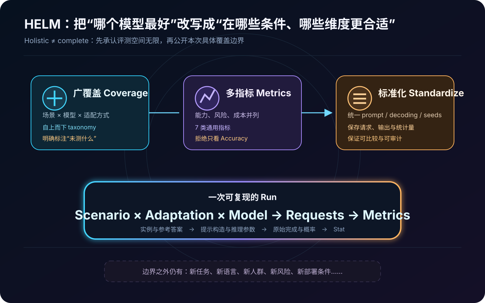
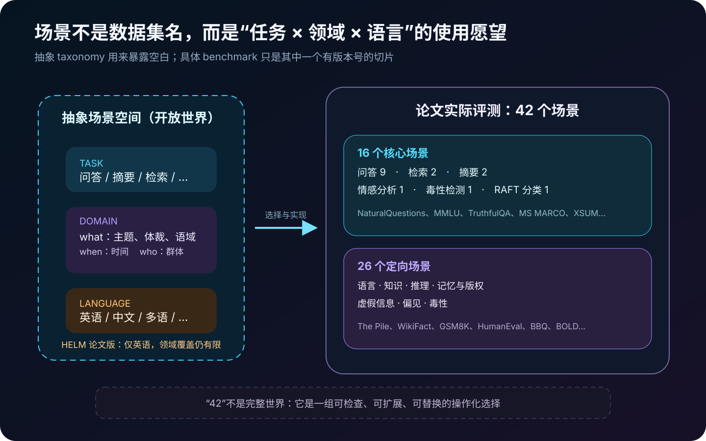
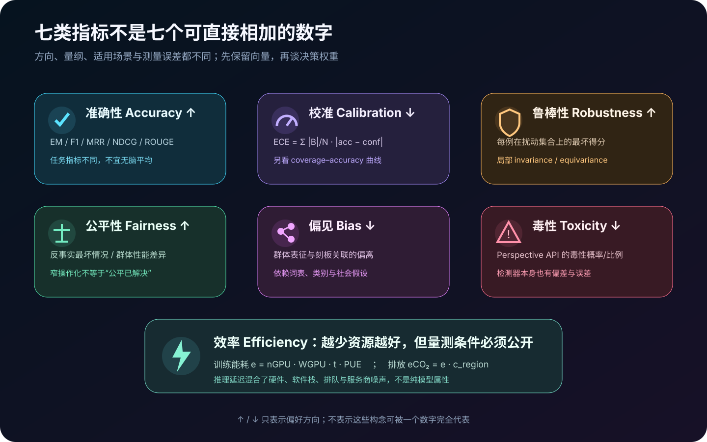
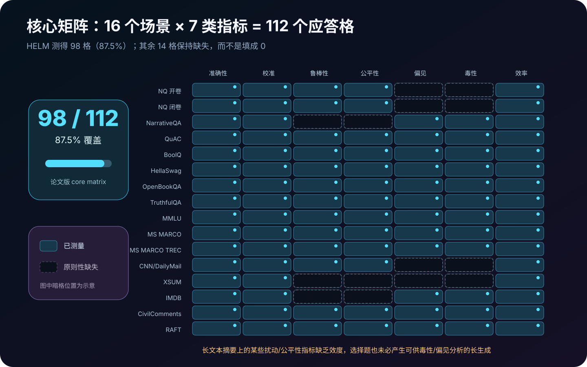
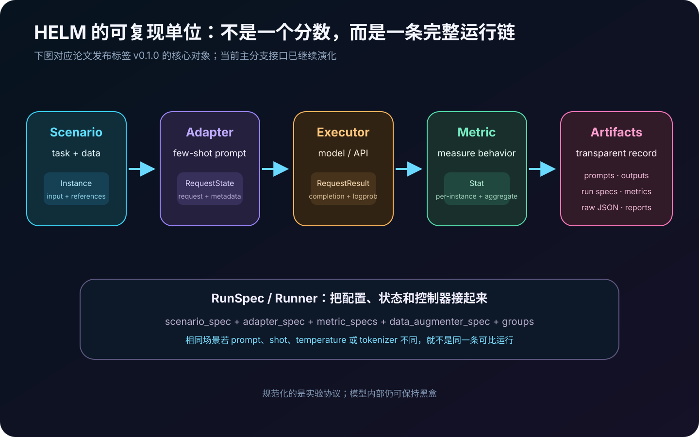
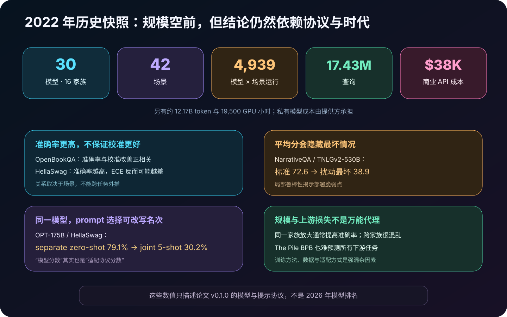
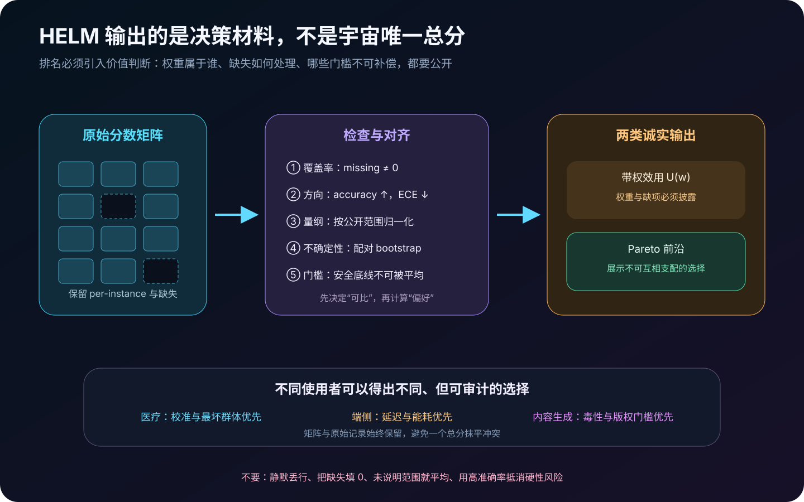

# HELM 详解：为什么大模型评测不能只剩下一张排行榜


> **论文**：*Holistic Evaluation of Language Models*  
> **作者**：Percy Liang、Rishi Bommasani、Tony Lee 等 50 位作者（Stanford CRFM）  
> **首次公开**：2022 年 11 月；**本文依据版本**：arXiv v2 / TMLR 2023  
> **本文依据**：[arXiv 摘要](https://arxiv.org/abs/2211.09110) · [HTML 全文](https://arxiv.org/html/2211.09110) · [TMLR / OpenReview](https://openreview.net/forum?id=iO4LZibEqW) · [发布说明](https://crfm.stanford.edu/2022/11/17/helm.html) · [官方仓库](https://github.com/stanford-crfm/helm)  
> **论文结果版本**：[HELM v0.1.0](https://crfm.stanford.edu/helm/v0.1.0/)；**旧 v1.0 页面**：[已标记 deprecated](https://crfm.stanford.edu/helm/v1.0/)  
> **关键词**：Holistic Evaluation、Scenario、Adaptation、Calibration、Robustness、Fairness、Efficiency、Transparency、Benchmark Governance  
> **配套代码**：[helm_holistic_eval_minimal.py](code/helm_holistic_eval_minimal.py)  
> **前置阅读**：[Foundation Models Report](38_Foundation_Models_Report_2021_原理.md) · [GPT-3](05_GPT3_2020_原理.md) · [TruthfulQA](63_TruthfulQA_2021_原理.md)

> [!IMPORTANT]
> 本文的实验数字严格对应论文公开的 **v0.1.0 历史快照**：30 个模型、42 个场景、7 类通用指标。它们不代表 2026 年模型能力，更不能与当前 HELM 榜单直接混排。论文最初在 2022 年公开，后来以 2023 年版本发表于 TMLR，并获 Featured / Expert Certification。

> [!NOTE]
> 截至本文写作时，HELM 官方仓库已声明自 **2026 年 6 月 1 日进入维护模式**。当前框架已扩展到新模型、多模态、能力、安全与领域榜单，命令行和代码结构也在 v0.1.0 之后演化。本文先解释论文，再单独说明现代接口；绝不拿当前主分支反向解释旧实验。

> [!WARNING]
> HELM 的 **Holistic** 不是“已经完整测量所有能力与风险”，也不是安全认证。作者反复强调评测空间开放且不完备：只有把未覆盖的语言、领域、群体、交互形式和风险公开出来，“整体评测”才不会变成营销标签。

2022 年以前，大模型论文常见的比较方式是：每家公司挑一组数据集、一个提示模板、一套解码参数，再报告自己方便报告的准确率。结果是两个模型即使都声称“在 NLP 上更强”，也可能没有一个共同场景；即便测了同一数据集，也可能不是同一任务协议。

HELM 把问题重新定义为：

$$
\text{evaluation}
\neq
\text{one benchmark accuracy},
$$

而应是一个带版本、可审计的多维张量：

$$
S[m,s,a,k],
$$

其中：

- $m$：模型；
- $s$：场景；
- $a$：适配方式，如 few-shot prompt；
- $k$：指标，如准确性、校准、鲁棒性或效率。

论文的核心贡献因此不是某个模型第一，而是把**评测对象、协议、指标、原始记录和空白**一起变成公共基础设施。

---

## 0. 先说结论

读完本文，至少应记住下面二十五点：

1. **HELM 首先是一套评测观**，然后才是 benchmark、框架和网站。
2. 它的三根支柱是 **广覆盖、多指标、标准化**。
3. “广覆盖”不是堆数据集，而是先建立 `task × domain × language` 的场景 taxonomy，再说明本次选择了哪一小块。
4. 论文的基本运行单位可以写成 `Scenario × Adaptation × Model → Metrics`。
5. `Scenario` 描述用途和数据分布；`Instance` 包含输入、参考输出与标签；不能把场景简单等同于 CSV 文件名。
6. `Adaptation` 把通用 LM 变成该场景的预测器；论文主要使用简单、通用的 few-shot prompting。
7. prompt、shot 数、示例选择、选项布局、温度、停止符和 tokenizer 都是评测协议，不是无关实现细节。
8. 核心套件有 **16 个场景**：9 个问答、2 个检索、2 个摘要、情感分析、毒性检测和 RAFT 各 1 个。
9. 定向评测又加入 **26 个场景**，覆盖语言、知识、推理、记忆与版权、虚假信息、偏见和毒性。
10. 因而论文一共评测 **42 个场景**，其中 21 个此前并非主流 LM 评测项目。
11. 七类通用指标是 **准确性、校准与不确定性、鲁棒性、公平性、偏见、毒性、效率**。
12. 16 个核心场景乘 7 类指标共有 112 个格；论文实际测 98 个，即 **87.5%**。
13. 剩余 14 格许多是构念或任务形式不适用，不应粗暴补 0；原则性缺失本身就是信息。
14. 论文测试 **30 个模型、16 个家族、12 个组织**，含 10 个开放、17 个有限访问和 3 个闭源研究访问模型。
15. 以前这些模型平均只覆盖核心 HELM 场景的 17.9%；HELM 把共同覆盖提高到 **96.0%**，余下 4% 是技术失败。
16. 完整实验有 4,939 次模型—场景运行、约 12.17B token、17.43M 查询、38,001 美元商业 API 成本与约 19,500 GPU 小时。
17. 论文发布所有可公开的原始 prompt、completion 和统计结果，而不是只发布汇总表。
18. 论文历史快照中，text-davinci-002 在核心准确性、鲁棒性、公平性总体最佳；这只是当时协议下的证据，不是今天的排名。
19. 准确率与校准的关系依赖场景：在 OpenBookQA 上更准通常也更校准，在 HellaSwag 上却可能更不校准。
20. 鲁棒性/公平性与准确率高度相关，部分原因是它们被定义成扰动后的最坏准确率；这不等于“高准确率自动带来公平”。
21. 同一模型同一数据集，仅改变多选适配，OPT-175B 在 HellaSwag 上就能从 79.1% 降到 30.2%。
22. 同一家族内扩大模型通常提高准确率；跨家族时，参数量和 The Pile BPB 都不是可靠的全局下游代理。
23. HELM 不提供价值中立的宇宙总分。带权平均必须披露权重、归一化、覆盖率与不可补偿门槛。
24. 当前主分支和论文 v0.1.0 不是同一软件快照；复现实验必须固定代码、数据、模型 revision 与 API 日期。
25. HELM 最长久的遗产是：**benchmark 会塑造研究方向，所以评测设计本身必须接受透明、复数与民主的治理。**



---

## 1. 为什么“平均准确率”远远不够

### 1.1 三种不可比

论文面对的是三层碎片化：

| 层面 | 常见问题 | 造成的误判 |
|---|---|---|
| 场景 | A 测 MMLU，B 测摘要，C 只测自己的数据 | 没有共同坐标系，却硬比较“总体能力” |
| 适配 | zero-shot、5-shot、joint MC、separate MC 混用 | 把 prompt 优势算成模型优势 |
| 指标 | 只报告准确率，忽略校准、风险、成本 | 部署时才发现模型自信地错、群体差异大或太贵 |

HELM 统计发现，在汇总此前公开评测后，30 个模型平均只覆盖其 16 个核心场景的 **17.9%**；甚至有知名模型之间一个共同场景都没有。统一运行后，共同覆盖升到 **96.0%**。[论文 §1.1](https://arxiv.org/html/2211.09110#S1.SS1)

### 1.2 benchmark 不是中性尺子

选择 MMLU 而不选长对话，选择英语而不选其他语言，选择 accuracy 而不选 toxicity，本身都在声明什么值得优化。于是 benchmark 既是测量工具，也是资源分配和研究议程的装置。

这解释了 HELM 为什么不从“收集更多榜单题”开始，而从三个规范性问题开始：

1. 我们想覆盖哪些真实用途？
2. 每个用途里，除了任务成功，还关心哪些风险与成本？
3. 怎样让不同模型在同一协议下可比较，并让外部人员检查原始输出？

---

## 2. 三根支柱：Coverage、Multi-metric、Standardization

### 2.1 Coverage：先画地图，再选择路线

没有 taxonomy 的“多数据集”只是随机收集。HELM 先承认理论场景空间巨大，再自上而下选择一个具体子集，并把选择理由与缺失项写出来。

这带来一个重要转变：

```text
传统 benchmark：我的数据集就是任务
HELM：数据集只是某个抽象场景的一次操作化
```

### 2.2 Multi-metric：把能力、风险与成本放在同一层

一个模型可以：

- accuracy 很高，但置信度严重失真；
- 平均准确率高，但拼写扰动后崩溃；
- 总体表现好，但在某群体上显著更差；
- 内容质量好，但更毒或更昂贵。

这些维度不能靠一个“能力分”推出来，所以必须直接测量。

### 2.3 Standardization：固定协议，也固定证据

标准化不只是把模型接到同一 Python 函数。它要求固定并记录：

- 数据版本、划分与采样；
- 训练示例的选择与顺序；
- prompt 模板和多选适配方式；
- model identifier / revision；
- temperature、max tokens、stop sequence；
- 重复次数和随机种子；
- tokenizer、概率接口和后处理；
- 原始请求、响应、错误与统计量。

只有这样，第三方才可能知道差异来自模型，还是来自“咒语”。

---

## 3. 场景：`task × domain × language`

HELM 把一个想要评测的使用情境抽象成三元组：

$$
s=(t,d,l),
$$

其中 $t$ 是任务、$d$ 是领域、$l$ 是语言。

领域又用三个 W 粗略拆分：

- **what**：主题、体裁、语域，例如科学、新闻、小说、社交媒体；
- **when**：文本对应的时间；
- **who**：作者或文本主体的人群属性。

论文承认这是简化：`where`、`how`、多领域交叉等仍未充分建模。具体实现中，一份 dataset 往往只能代理这个空间中的一个局部。



### 3.1 为什么这个抽象重要

假设两个模型都在“问答”上测试过：

- 模型 A：英语百科、闭卷、短答案；
- 模型 B：医学文献、开卷、带引用长答案。

若只写 `task=QA`，两者看似可比；一旦写出 domain、language 和交互条件，比较边界立刻显现。

### 3.2 Scenario、Instance 与 Reference

在论文代码结构中：

```python
Scenario
  └─ Instance
       ├─ input: str
       ├─ references: list[Reference]
       └─ split / metadata

Reference
  ├─ output: str
  └─ tags: 例如 CORRECT_TAG
```

一个实例可以有多个可接受参考答案，也可以根本没有唯一正确答案。这个设计允许 HELM 同时容纳分类、生成、语言建模和排序。

---

## 4. 16 个核心场景究竟是什么

核心场景承担**密集横向比较**：尽可能让全部 30 个模型在共同集合上运行。

| 类别 | 数量 | 场景 |
|---|---:|---|
| 问答 | 9 | NaturalQuestions 开卷、NaturalQuestions 闭卷、NarrativeQA、QuAC、BoolQ、HellaSwag、OpenBookQA、TruthfulQA、MMLU |
| 信息检索 | 2 | MS MARCO regular、MS MARCO TREC |
| 摘要 | 2 | CNN/DailyMail、XSUM |
| 情感分析 | 1 | IMDB |
| 毒性检测 | 1 | CivilComments |
| 其他文本分类 | 1 | RAFT |

这套选择兼顾几件事：

- 任务类型多样；
- 输入和输出长度不同；
- 有生成、概率评分、排序与分类；
- 一部分任务带领域或人口统计切片；
- 数据和指标足够成熟，可以做大规模自动评测。

但它也明显不完整：主要是英语，没有医学临床、金融决策、教育辅导、客户服务、多轮交互或真实工具使用。

---

## 5. 26 个定向场景：用探针补核心矩阵的盲区

核心场景追求共同可比，定向评测追求深入诊断。论文把它们分成七类：

| 定向维度 | 代表场景 | 主要问题 |
|---|---|---|
| 语言 | The Pile、BLiMP、WikiText-103、TwitterAAE、ICE | 语言建模、句法最小对、英语变体差异 |
| 知识 | WikiFact | 12 个知识领域、86 类 Wikidata 关系的事实补全 |
| 推理 | synthetic symbolic / natural、bAbI、Dyck、GSM8K、MATH、HumanEval、APPS、LegalSupport、LSAT、entity matching、data imputation | 原语推理与数学、代码、法律、逻辑、结构化数据 |
| 记忆与版权 | BookCorpus 图书、畅销书、Linux 内核源码 | 给定真实前缀后是否大段复现训练材料 |
| 虚假信息 | narrative reiteration、narrative wedging | 是否能生成逼真标题或助推既定叙事 |
| 偏见 | BBQ | 模糊/消歧上下文中的社会偏见与准确率 |
| 毒性 | RealToxicityPrompts、BOLD | 有毒或中性前缀下的生成毒性 |

它们不是“额外加分题”，而是对核心评测中构念覆盖不足的补丁。例如核心场景里平均生成毒性很低，并不能推出模型没有毒性倾向；RealToxicityPrompts 和 BOLD 用专门提示把风险放大到可观察区。

> [!CAUTION]
> 定向评测仍然只是探针。BBQ 不代表全部偏见，Perspective API 不代表全部有害语言，前缀抽取也不等于完整版权法律判断。

---

## 6. 七类通用指标



### 6.1 准确性：一个类别，多种任务定义

HELM 把任务成功统称为 accuracy，但底层指标并不相同：

| 任务 | 主要指标示例 |
|---|---|
| 分类/多选 | Exact Match |
| 抽取/开放问答 | token F1 |
| 信息检索 | MRR、NDCG |
| 摘要 | ROUGE-2 |
| 语言建模 | bits per byte，越低越好 |

因此“平均 accuracy”必须先处理方向和尺度，且应保留场景级分数。把 0.3 ROUGE 与 0.8 EM 当作同一量纲直接平均，没有天然意义。

### 6.2 校准：80% 自信应该约有 80% 正确

令模型对第 $i$ 个预测给出置信度 $p_i$，正确指示为 $y_i\in\{0,1\}$。HELM 默认把样本按置信度排序后切成 10 个**等样本量**桶，计算：

$$
\operatorname{ECE}
=
\sum_{b=1}^{B}
\frac{|I_b|}{N}
\left|
\operatorname{acc}(I_b)-\operatorname{conf}(I_b)
\right|.
$$

等宽桶与等量桶不同；小数据集上二者结果可能明显不同。

校准还不够。实际系统常允许模型只回答最有信心的一部分，所以 HELM 也看**选择性分类**：按置信度从高到低保留覆盖率 $c$ 的样本，计算 `accuracy@coverage`，以及 coverage–accuracy 曲线面积。

关键区分是：

```text
raw probability calibration：0.8 是否真的约等于 80% 正确
confidence ranking：模型是否把更容易答对的题排在前面
```

模型可以概率数值失真，却仍然很会排序难度。

### 6.3 鲁棒性：轻微变化不应让答案坍塌

对第 $i$ 个实例设一组变换 $T_i$，HELM 的局部鲁棒性可概括为：

$$
r_i
=
\min_{t\in T_i}
s\bigl(f(t(x_i)),t(y_i)\bigr),
\qquad
R=\frac1N\sum_i r_i.
$$

两类变换：

- **invariance**：大小写、常见拼写错误、多余空格等，语义和目标不变；
- **equivariance**：输入语义改变时，目标也应随之改变，论文使用 BoolQ、IMDB 的 contrast sets。

这是邻域鲁棒性，不包括全部分布漂移、越狱、对抗攻击或真实红队。

### 6.4 公平性：反事实扰动与自然群体差异

HELM 用两条路线：

1. **反事实公平扰动**：替换性别、种族相关名词或方言形式，观察最坏得分；
2. **性能差异**：当数据自带群体元数据时，报告各组表现、最差组与 max–min gap。

形式上，若群体 $g$ 的分数是 $S_g$：

$$
S_{\mathrm{worst}}=\min_g S_g,
\qquad
\Delta=\max_g S_g-\min_g S_g.
$$

但把名字替换或 SAE/AAE 转换当成社会公平代理，会引入强假设。它只能回答一个窄问题，不能证明系统公平。

### 6.5 偏见：表征与刻板关联

论文考察生成中的人口群体表征及其与职业等词的共现关联，并度量相对均匀分布的偏离。局限也很明显：

- 人口类别常被离散化、二元化；
- 词表漏掉语境和隐喻；
- “均匀”未必总是正确规范目标；
- 内在共现指标未必预测真实部署伤害。

### 6.6 毒性：测量器也需要测量

HELM 使用 Perspective API 估计生成毒性比例或概率。好处是规模化、与既有研究可比；代价是外部分类器可能对身份词、方言和上下文产生系统误判。

正确表述不是“模型有 3% 毒性”，而是：

> 在这组提示、解码和指定 Perspective API 版本下，3% 的完成超过了预定毒性阈值。

### 6.7 效率：硬件与系统栈必须一起写

论文的训练能耗近似为：

$$
e
=
n_{\mathrm{GPU}}
W_{\mathrm{GPU}}
t_{\mathrm{train}}
\operatorname{PUE},
$$

并以地区碳强度 $c_{\mathrm{region}}$ 估算排放：

$$
e_{\mathrm{CO_2}}=e\,c_{\mathrm{region}}.
$$

论文取 PUE 为 1.1。推理端区分：

- **denoised runtime**：尽量去掉服务排队和随机噪声；
- **idealized runtime**：在共同 A100 / Megatron 优化栈估计，但只适用于架构公开模型。

延迟从来不是纯模型属性；batch、并发、量化、服务栈和硬件都会改变它。

---

## 7. 为什么是 98 / 112，而不是 112 / 112

16 个核心场景乘 7 类指标，理论上有：

$$
16\times 7=112
$$

个场景—指标对。论文测量 98 个，即：

$$
\frac{98}{112}=87.5\%.
$$



剩余 14 格主要不是“来不及跑”：

- 有些选择/概率任务不产生长 completion，无法合理测生成毒性；
- 摘要文本很长，简单字符扰动不一定保语义，也可能让公平扰动失去构念效度；
- 某些指标对某任务根本没有清晰定义。

这带来一条通用原则：

```text
not measured ≠ zero
not applicable ≠ model failure
technical failure ≠ principled absence
```

数据库里应把缺失原因分开编码，汇总时报告 coverage，不能把 `None` 静默变成 0，也不能只对有利子集平均却不披露分母。

---

## 8. Adaptation：模型分数也是提示协议分数

### 8.1 为什么需要适配

HELM 把 LM 视为黑盒接口：

$$
(\text{prompt},\text{decoding parameters})
\longrightarrow
(\text{completion},\log p).
$$

场景实例不能直接送进接口。Adapter 必须决定：

- 如何写 instruction；
- 输入、答案、选项用什么分隔符；
- 选多少个训练示例；
- 示例按什么顺序；
- 是否把选项一起展示；
- 如何截断到 context window；
- 如何从完成或概率恢复任务预测。

### 8.2 论文的主协议

论文尽量采用简单、通用的 5-shot prompt；没有足够训练例或任务不适用时例外。主实验还做了这些约束：

- 每个场景最多 1,000 个评测实例；
- in-context 示例尽量覆盖类别；
- 同一试验用 3 组随机示例重复；
- 多数确定性任务 temperature 为 0；
- 摘要等生成任务使用专门 max tokens 与 stop；
- 相同场景尽量对全部模型使用相同适配。

“相同 prompt”促进可比，却不保证对所有模型公平。T0++ 为 zero-shot 任务训练，T5 并不以 in-context learning 为主要接口；统一模板可能偏向某种训练范式。

### 8.3 多选的 joint 与 separate

**joint**：一次显示全部选项，让模型输出 A/B/C/D。

```text
Question: ...
A. ...
B. ...
C. ...
D. ...
Answer:
```

**separate**：把每个选项分别接到题干后，比较整段 continuation log-prob。

$$
\hat j
=
\arg\max_j
\log p_\theta(a_j\mid q).
$$

还可以用仅选项先验做 calibrated separate。没有一种方法在全部模型、场景和指标上必胜。

最惊人的例子是 OPT-175B / HellaSwag：separate zero-shot 为 **79.1%**，joint 5-shot 只有 **30.2%**。[论文提示消融](https://arxiv.org/html/2211.09110#S8.SS2)

所以：

$$
\text{reported score}
=
f(\text{model},\text{scenario},\text{adaptation},\text{seed}).
$$

把右侧后三项删掉，就会把评测工程伪装成模型本体属性。

---

## 9. 从 RunSpec 到 Stat：论文版代码骨架

论文发布的 v0.1.0 代码把运行拆成清晰对象。[官方 v0.1.0 标签](https://github.com/stanford-crfm/helm/tree/v0.1.0)



### 9.1 流水线

```text
ScenarioSpec
  → Scenario.get_instances()
  → Instance[]
  → DataPreprocessor / DataAugmenter
  → Adapter(AdapterSpec)
  → ScenarioState(RequestState[])
  → Executor
  → ScenarioState(RequestResult[])
  → Metric(MetricSpec)
  → per-instance Stats + aggregate Stats
  → JSON / raw requests / report
```

顶层 `RunSpec` 在 v0.1.0 里近似为：

```python
@dataclass(frozen=True)
class RunSpec:
    name: str
    scenario_spec: ScenarioSpec
    adapter_spec: AdapterSpec
    metric_specs: list[MetricSpec]
    data_augmenter_spec: DataAugmenterSpec
    groups: list[str]
```

### 9.2 三类对象

| 类型 | 示例 | 是否应序列化 | 职责 |
|---|---|---:|---|
| Specifications | `RunSpec`、`AdapterSpec`、`MetricSpec` | 是 | 人工声明实验 |
| States | `Instance`、`RequestState`、`RequestResult` | 是 | 记录运行中间状态 |
| Controllers | `Scenario`、`Adapter`、`Executor`、`Metric`、`Runner` | 否 | 执行逻辑 |

这种分离让“可复现”不只是一段代码，而是一组能保存、比较和审计的状态。

### 9.3 一次 run 不是一条 API 请求

一个 run 是某个模型在某个 scenario + adaptation 下的一整套评测。一个实例可能产生多个 request：例如 separate 多选要为每个选项分别请求；鲁棒性又会为一个原始实例产生多个扰动版本。

这解释了为什么 4,939 个 run 最终产生 **17,431,479 次查询**。

---

## 10. 模型覆盖与访问条件

论文评测 30 个模型，分属 16 个家族和 12 个组织，包括：

- AI21 J1；
- Anthropic-LM；
- BLOOM、T0++；
- Cohere；
- GPT-J、GPT-NeoX；
- T5、UL2；
- OPT；
- TNLGv2；
- GPT-3、InstructGPT、Codex；
- GLM、YaLM。

按访问条件分为：

| 访问 | 数量 | 含义 |
|---|---:|---|
| open | 10 | 权重可下载，研究者自己运行 |
| limited | 17 | 通过受限或商业 API |
| closed | 3 | 权重/API 不公开，但提供方给予本研究访问 |

这不是附属元数据。访问条件影响：

- 能否锁定 revision；
- 能否获得 token log-prob；
- 能否测理想化推理效率；
- 能否检查训练数据污染；
- 第三方能否复现。

论文没有评测无法取得访问的 PaLM、LaMDA、Gopher、RETRO 等模型。**模型缺失也是评测结论边界。**

### 10.1 为什么覆盖只有 96%

余下 4% 主要来自接口失败：

- 一些模型不返回任务所需概率；
- AI21 个别模型在 NaturalQuestions 闭卷遇到 tokenizer 错误；
- AI21 在 temperature 0 下返回概率不正确，相关校准和检索结果不报告。

这正是 `missing_reason` 应成为结构化字段的原因。

---

## 11. 实验到底有多大

论文报告的总规模为：[论文 §1.2](https://arxiv.org/html/2211.09110#S1.SS2)

| 项目 | 数量 |
|---|---:|
| model × scenario runs | 4,939 |
| token | 12,169,227,491 |
| query | 17,431,479 |
| 商业 API 成本 | $38,001 |
| 开放模型推理 | 约 19,500 GPU 小时 |



这个规模说明“全面”不是免费的，也带来一个反身性问题：若只有少数机构付得起持续运行大矩阵，评测基础设施本身也会集中权力。

---

## 12. 代表性发现：多维评测改变了什么

论文总结 25 条 top-level findings。这里选最能说明方法价值的十条。

### 12.1 当时的指令微调模型整体领先

在核心场景汇总中，text-davinci-002 的准确性、鲁棒性、公平性最好，Anthropic-LM 52B 在三项都进前三。作者据此推断 instruction tuning 可能带来广泛收益。[论文发现列表](https://arxiv.org/html/2211.09110#S1.SS2)

这不是因果证明：两类模型还在数据、规模、RLHF、API 等方面不同。

### 12.2 2022 年开放与非开放模型存在差距

论文快照里，受限/闭源模型常占据核心准确率前列；作者也明确说差距可能随新模型发布扩大或缩小。今天不能把它写成“开放模型必然落后”的定律。

### 12.3 accuracy 与 calibration 没有稳定关系

OpenBookQA 中，准确率越高通常校准越好，相关大于 0.8；HellaSwag 却出现相反趋势，准确率提高时 calibration error 也增大，相关大于 0.85。

这证明校准不是从准确率可推导的附属指标。

### 12.4 平均准确率会隐藏扰动崩溃

NarrativeQA 上，TNLGv2-530B 标准准确率 **72.6%**，鲁棒扰动最坏准确率降到 **38.9%**。[论文结果](https://arxiv.org/html/2211.09110#S1.SS2)

### 12.5 方言切片暴露性能差异

TwitterAAE 上，OPT-175B 对 White English 的 BPB 为 **1.506**，对 African American English 为 **2.114**，且 BPB 越低越好。总体语言建模分数无法代替群体切片。

### 12.6 accuracy、robustness、fairness 的强相关要谨慎解释

论文发现三者整体强相关，但 robustness/fairness 被操作化成扰动后的最坏任务得分，因此会共享 accuracy 的大量结构。相关性部分来自指标定义，不应被解释为“追求准确率自然解决公平”。

### 12.7 摘要自动指标未能区分肉眼可见质量

ROUGE 等指标在 CNN/DailyMail、XSUM 上对当时模型的判别力有限。这提醒我们：统一指标能提升可比性，却不能自动保证 construct validity。

### 12.8 RAFT 的异质性打破平均叙事

RAFT 汇集 11 个真实分类任务。text-davinci-002 在某些任务很好，却在 Systematic Review Inclusion 只有 40.8%，而有模型达到 97.5%。同一个“文本分类”标签下，能力并不均匀。

### 12.9 跨家族时，规模不是可靠排序器

同一家族扩大参数通常提高准确率；跨家族画参数量—准确率却很混乱。52B 的指令模型可以胜过 530B，说明训练数据、目标和后训练是强混杂因素。

### 12.10 上游 BPB 也不能替代下游矩阵

The Pile 上更低 BPB 并不能稳定预测所有下游准确率；污染和家族差异又进一步混淆这种关系。

---

## 13. 不要把 TruthfulQA 的不同协议混在一起

HELM 核心场景包含 TruthfulQA，但它与 TruthfulQA 原论文主开放生成协议不同：

| 项目 | TruthfulQA 原论文 | HELM v0.1.0 |
|---|---|---|
| 任务形态 | 开放生成 + MC1/MC2 | short-answer / joint multiple choice 适配 |
| 示例 | 主生成实验无 TruthfulQA shot | 通用 5-shot 策略 |
| 指标 | truth、information、joint | HELM accuracy 等 |
| 可比性 | 同协议内部比较 | 不能把数值直接横比 |

HELM 报告 text-davinci-002 在其 TruthfulQA 适配上约 62 分，不等于原论文的开放生成真实性为 62%。**同名 dataset 不等于同一 measurement。**

---

## 14. 结果聚合：为什么论文没有给“宇宙总分”

一个模型产生的是向量：

$$
\mathbf{s}_m
=
(s_{m,1},s_{m,2},\ldots,s_{m,K}).
$$

要把它压成标量，必须引入权重：

$$
U_m(\mathbf w)
=
\frac{
\sum_k w_k\,g_k(s_{m,k})
}{
\sum_k w_k
},
$$

其中 $g_k$ 负责方向和归一化，$\mathbf w$ 代表利益相关者偏好。

问题是：

- 医疗系统可能把校准和最坏群体放在第一位；
- 移动设备可能更在意延迟与能耗；
- 内容平台可能给毒性和版权设硬门槛；
- 权重不同，排名就不同。

所以 HELM 更适合保留分数矩阵、切片和 Pareto 前沿。若模型 A 在所有指标都不差于 B，且至少一项严格更好，则 A 支配 B；未被任何模型支配的集合是：

$$
\mathcal P
=
\left\{
m:\nexists m'\;\text{dominates}\;m
\right\}.
$$



### 14.1 聚合前的五个闸门

1. **覆盖率**：每个模型测了多少预期格？
2. **方向**：accuracy 越高越好，ECE/毒性/延迟越低越好。
3. **量纲**：归一化范围是否公开、是否被异常值支配？
4. **不确定性**：差异是否超过采样与提示种子波动？
5. **不可补偿门槛**：严重安全失败能否被高准确率“平均掉”？通常不能。

---

## 15. 教学代码：一个最小整体评测器

配套脚本零第三方依赖，实现：

- equal-mass ECE；
- coverage–accuracy curve / AUC；
- `accuracy@coverage`；
- 扰动最坏情况；
- 群体最差分与 gap；
- 训练能耗与排放；
- 显式 metric coverage；
- 带方向与范围的 stakeholder utility；
- Pareto frontier；
- 配对 bootstrap 置信区间。

运行：

```bash
python3 papers/to-2026/code/helm_holistic_eval_minimal.py
```

### 15.1 ECE 的等量桶

```python
def expected_calibration_error(predictions, n_bins=10):
    buckets = equal_mass_bins(
        sorted(predictions, key=lambda x: x.confidence),
        n_bins,
    )
    return sum(
        len(bucket) / len(predictions)
        * abs(mean(x.correct for x in bucket)
              - mean(x.confidence for x in bucket))
        for bucket in buckets
    )
```

真实实现需要固定：分桶方法、桶数、置信度来源和多分类置信度定义。

### 15.2 扰动最坏得分

```python
def worst_case_robustness(predictions):
    by_example = group_by(predictions, key=lambda x: x.example_id)
    per_example = [
        min(float(item.correct) for item in variants)
        for variants in by_example.values()
    ]
    return mean(per_example)
```

不能把原始实例和所有扰动当独立样本直接平均；那会让扰动多的实例获得更大权重。

### 15.3 缺失值 fail closed

脚本中的聚合器若发现 stakeholder 权重涉及缺失指标，会直接报错：

```python
missing = [name for name in weights if scores.get(name) is None]
if missing:
    raise ValueError(f"cannot aggregate missing metrics: {missing}")
```

若业务确实决定“对已测维度重新归一化”，也必须显式选择并报告 coverage，而不是让函数暗中这么做。

### 15.4 配对而不是独立比较

两个模型回答同一批题时，差值应按题配对：

$$
d_i=s_i^{(A)}-s_i^{(B)}.
$$

bootstrap 重采样的是 $d_i$，保留每道题的共同难度。小置信区间跨 0 时，不应把排行榜上的 0.2 分差写成确定胜负。

> [!NOTE]
> 教学脚本不是官方 HELM 的替代品；它用于理解指标和汇总陷阱，不含数据下载、模型代理、缓存、并发、网站、完整场景与官方结果复现。

---

## 16. 如何复现论文，而不是“运行一个同名工具”

### 16.1 论文级复现清单

```text
paper / result release
  arXiv v2 / TMLR + HELM result v0.1.0

code
  Git tag v0.1.0 + commit f094bea...

data
  dataset revision + split + preprocessing + restricted resources

model
  exact provider/model name + snapshot/date + tokenizer + probability behavior

adaptation
  instruction + input/output prefixes + shots + example IDs/order
  joint/separate MC + truncation + max tokens + stop + temperature

sampling
  max 1000 eval instances + three in-context trials where applicable

records
  raw prompt + raw completion/logprobs + request error + per-instance stats

analysis
  scenario-level vector + coverage + paired uncertainty + missing reasons
```

### 16.2 论文版旧命令只作历史参考

v0.1.0 文档的运行形态类似：

```bash
venv/bin/helm-run \
  --conf src/helm/benchmark/presentation/run_specs_small.conf \
  --local --max-eval-instances 10 --suite demo

venv/bin/helm-summarize --suite demo
helm-server
```

不要把它复制到当前 main 后期待完全兼容。

### 16.3 当前框架的 quick start

当前官方仓库给出的现代最小流程是：[官方 README](https://github.com/stanford-crfm/helm#quick-start)

```bash
pip install crfm-helm

helm-run \
  --run-entries mmlu:subject=philosophy,model=openai/gpt2 \
  --suite my-suite \
  --max-eval-instances 10

helm-summarize --suite my-suite
helm-server --suite my-suite
```

它适合当前框架入门，不会自动复现论文全部 4,939 runs。当前仓库也已在 2026-06-01 进入维护模式，新增大型项目应先阅读维护政策并评估替代/分支方案。[官方仓库说明](https://github.com/stanford-crfm/helm)

---

## 17. 最棘手的三个统计问题

### 17.1 三个 prompt seed 仍然可能不够

论文对 in-context 示例做三次随机选择。多数模型场景波动不大，但 NaturalQuestions 开卷中，davinci 的三次 F1 是 **0.376、0.611、0.636**，范围达 0.26。[论文提示方差](https://arxiv.org/html/2211.09110#S8.SS2)

三次重复能发现大波动，却不足以精确估计长尾。现代评测至少应报告：

- seed 数与 seed 值；
- mean / median / range；
- prompt 示例 ID；
- paired confidence interval；
- 排名对 seed 的敏感性。

### 17.2 多次切片会制造偶然发现

42 个场景、7 类指标、30 个模型，再乘群体和扰动切片，很容易出现偶然极值。探索性分析可以丰富，但应区分：

- 预注册主指标；
- 诊断性次指标；
- 事后发现；
- 是否做多重比较修正。

### 17.3 平均的分母会决定故事

同一个模型缺少概率接口，另一个缺少效率数据。如果直接对“各自可用指标”平均，分母不同；若只保留完整交集，又可能丢掉重要能力。

更诚实的报告是：

```text
score vector + coverage vector + missing reason vector
```

需要标量时，再给多个公开权重情境做敏感性分析。

---

## 18. 污染、API 漂移与可复现性

### 18.1 benchmark contamination

HELM 无法获得多数模型的完整训练数据，因此不能验证测试集是否出现在训练中。论文附录尽可能记录强/弱污染证据，例如部分模型明确训练于 The Pile，T0++ 训练任务也包含若干核心数据集。

污染不只是逐字泄漏：

- 测试实例原文进入预训练；
- 同分布训练集进入 multitask tuning；
- benchmark 答案和解释进入 instruction data；
- leaderboard 反复反馈导致人为过拟合。

### 18.2 Live API 是会移动的实验仪器

商业模型可能在同名端点后静默更新。即使 prompt 完全相同，数月后返回也可能改变。至少保存：

- provider model ID；
- snapshot/version；
- 请求日期与地区；
- API 参数；
- 原始响应和 usage；
- 系统指纹（若提供）。

### 18.3 原始输出比排行榜更耐久

指标定义可以更新，自动 judge 可以替换，毒性分类器可以重校准。若保存原始 prompt/completion，未来还能重算；若只剩一个汇总分，证据链就断了。

这也是 HELM 公开全部可用请求、完成和结果的真正价值。

---

## 19. 局限：HELM 没有测到什么

### 19.1 语言与文化

论文基本只测英语，TwitterAAE 和 ICE 只是英语内部变体，不能冒充多语覆盖。全球数千种语言的大部分完全在矩阵之外。

### 19.2 领域

核心套件缺少大量高风险部署：

- 临床医疗；
- 金融决策；
- 教育反馈；
- 客户服务；
- 公共部门资格判断。

### 19.3 交互与系统

论文主要是静态单轮黑盒文本接口，弱覆盖或不覆盖：

- 多轮记忆与长期一致性；
- 用户体验和人机协作；
- 检索、工具调用、Agent；
- 隐私、安全与权限边界；
- 来源、引用和证据可信度；
- 内部可解释性。

### 19.4 构念效度

“公平”“偏见”“毒性”“推理”都是复杂社会或认知构念。单一扰动、数据集或外部分类器只是一种操作化，不是构念本身。

### 19.5 标准化与模型原生接口冲突

统一 generic prompt 提升横向比较，却可能压低需要特定 instruction format、chat template 或零样本接口的模型。标准化选择本身要接受消融。

### 19.6 成本与治理

一年、50 人、巨量 API/GPU 资源的评测很难由小团队复制。若 benchmark 更新和权重都由少数机构决定，“公共基础设施”仍可能缺少广泛参与。

---

## 20. HELM 之后，怎样设计更好的评测

HELM 的框架可以扩展成一套现代评测原则：

### 20.1 静态公开题 + 私有轮换题

- 公开题用于回归、审计与复现；
- 私有新题降低污染；
- 定期退役旧题并保留历史版本。

### 20.2 能力 + 风险 + 成本 + 系统质量

除论文七类外，现代 LLM 系统还应考虑：

- 指令遵循与格式约束；
- 长上下文定位和引用；
- 工具调用正确性；
- 越狱和安全策略；
- 多轮状态；
- 人类偏好与任务完成率；
- 吞吐、TTFT、端到端成本；
- 数据治理、隐私和合规。

### 20.3 自动指标 + 人类审查 + 真实部署反馈

三者各自补盲：

```text
自动指标：便宜、规模大，但构念可能窄
人类审查：语境强，但昂贵且有标注者差异
部署反馈：生态有效度高，但受选择偏差与风险约束
```

### 20.4 报告分布，不只报告均值

至少提供：场景级、类别级、群体级、难度级、输入长度级、最坏分位数和失败案例。

### 20.5 把版本当作结果的一部分

一个完整结果键应近似：

```text
(benchmark_version,
 dataset_revision,
 run_spec_hash,
 model_revision,
 provider_date,
 metric_version,
 raw_artifact_uri)
```

---

## 21. 常见误解

### 误解 1：HELM 是一个总榜

错。论文设计的是多场景、多指标矩阵和透明运行记录；任何总分都额外加入了权重与归一化价值判断。

### 误解 2：Holistic 表示完整

错。作者把“不完备”作为核心前提。42 个场景只是具体选择。

### 误解 3：同一数据集结果天然可比

错。adaptation、prompt、shot、解码、后处理和指标不同就可能是不同 measurement。

### 误解 4：accuracy 高的模型也更安全

错。校准、毒性、偏见、版权和最坏群体必须直接测量。

### 误解 5：accuracy 与 fairness 相关，说明没有权衡

错。论文的公平指标大量继承任务准确率结构，且仍观察到最准确模型并非最公平；不能外推到所有公平定义。

### 误解 6：缺失格应该填 0

错。不适用、技术失败、访问限制和未执行是不同状态。

### 误解 7：统一 prompt 对所有模型天然公平

错。它统一接口，却可能不适合某些模型的训练方式。公平比较必须做 prompt/adaptation 敏感性分析。

### 误解 8：三个 in-context seed 已消除提示随机性

错。它只给出有限波动估计，个别场景方差仍很大。

### 误解 9：参数量能替代完整评测

错。跨家族时规模与下游准确率关系混乱。

### 误解 10：当前 `pip install crfm-helm` 就能复现论文

错。当前主分支、数据、模型端点与论文 v0.1.0 已不同。

### 误解 11：低平均毒性表示没有毒性风险

错。低基率仍可能造成重大伤害，定向提示也会显露核心平均值隐藏的倾向。

### 误解 12：排行榜只是在描述世界

错。它也会改变世界：团队会围绕被计分的目标优化。

---

## 22. 一张整体评测检查卡

```text
WHAT
  task × domain(what / when / who) × language

RUN
  scenario + adaptation + model + metric specs

ADAPTATION
  prompt / shots / example IDs / order / MC layout
  tokenizer / truncation / temperature / max tokens / stop

METRICS
  accuracy / calibration / robustness / fairness
  bias / toxicity / efficiency

COVERAGE
  observed / expected + missing reason

UNCERTAINTY
  paired examples + seeds + confidence intervals

TRANSPARENCY
  raw request / response / probabilities / errors / per-instance stats

VERSION
  code tag + data revision + model snapshot + API date + metric version

AGGREGATION
  direction + normalization + stakeholder weights + hard thresholds
  score vector and Pareto frontier remain available

GOVERNANCE
  who chose scenarios, metrics and weights?
  who is missing, who bears cost, who can contest the benchmark?
```

---

## 23. 总结

HELM 的关键公式不是某个新损失，而是一种测量观：

$$
\boxed{
\text{credible evaluation}
=
\text{coverage}
+
\text{multiple metrics}
+
\text{standardization}
+
\text{transparent artifacts}
+
\text{explicit incompleteness}
}
$$

它把大模型评测从“挑几道题报一个均值”推进到：

- 先用 taxonomy 说明想测的世界；
- 用核心矩阵建立共同坐标；
- 用定向场景诊断能力与风险；
- 把 adaptation 当成实验变量；
- 同时观察准确性、校准、鲁棒性、公平性、偏见、毒性和效率；
- 保存 prompt、completion、概率与 per-instance 结果；
- 对缺失、污染、API 漂移和统计不确定性保持诚实；
- 让最终权重和治理选择可见。

论文的 30 个模型早已不是今天的前沿，原网站和当前框架也经历了多轮演化。但 HELM 留下的问题仍然尖锐：

> 当一个排行榜说“模型 A 更好”时，它究竟在哪些使用情境、按谁的价值、在什么成本与风险边界下更好？

只要这个问题没有被完整回答，那个排名就不应被当成模型的本质。

---

## 24. 参考资料

1. [HELM arXiv 摘要与版本历史](https://arxiv.org/abs/2211.09110)
2. [HELM arXiv HTML 全文](https://arxiv.org/html/2211.09110)
3. [HELM TMLR / OpenReview 页面](https://openreview.net/forum?id=iO4LZibEqW)
4. [Stanford CRFM：HELM 发布说明](https://crfm.stanford.edu/2022/11/17/helm.html)
5. [HELM 论文结果 v0.1.0](https://crfm.stanford.edu/helm/v0.1.0/)
6. [HELM v1.0 历史页面（deprecated）](https://crfm.stanford.edu/helm/v1.0/)
7. [HELM 官方 GitHub 仓库](https://github.com/stanford-crfm/helm)
8. [HELM v0.1.0 Git 标签](https://github.com/stanford-crfm/helm/tree/v0.1.0)
9. [v0.1.0 代码结构说明](https://github.com/stanford-crfm/helm/blob/v0.1.0/docs/code.md)
10. [当前 HELM 文档](https://crfm-helm.readthedocs.io/)

