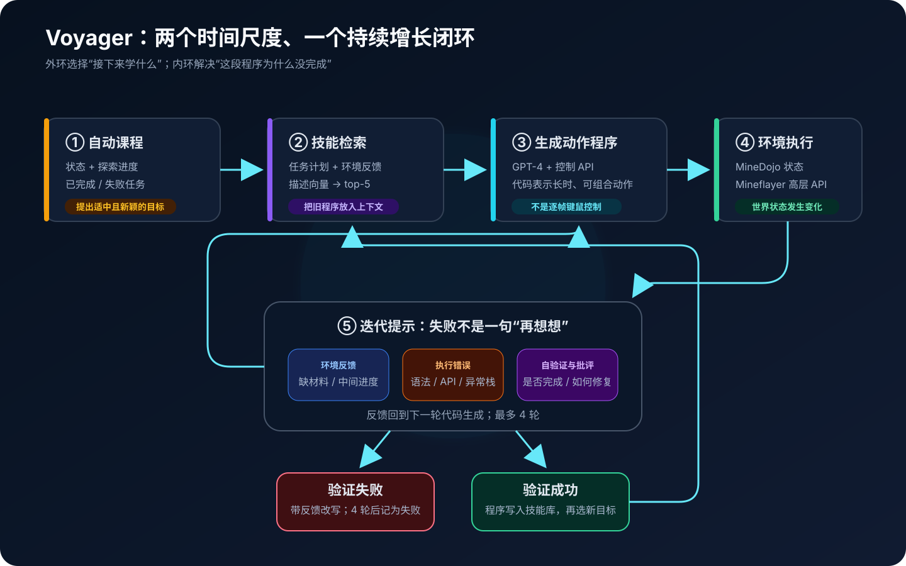
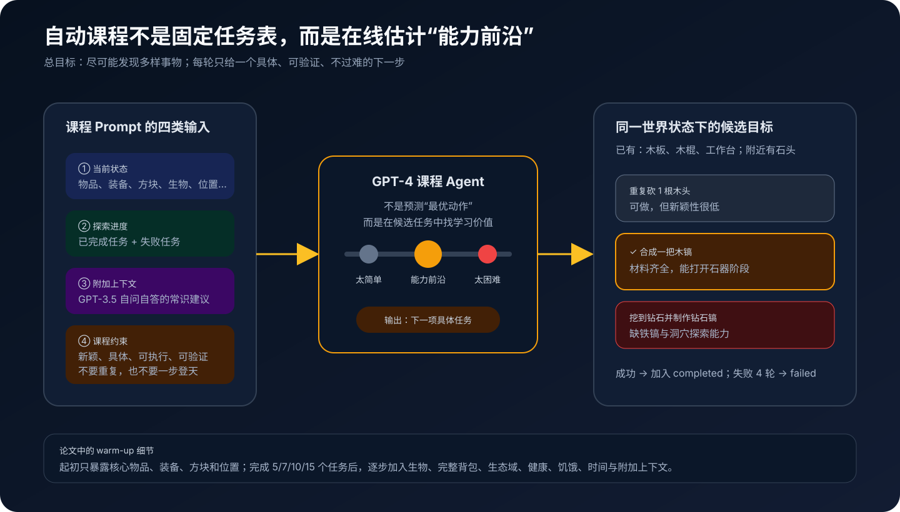
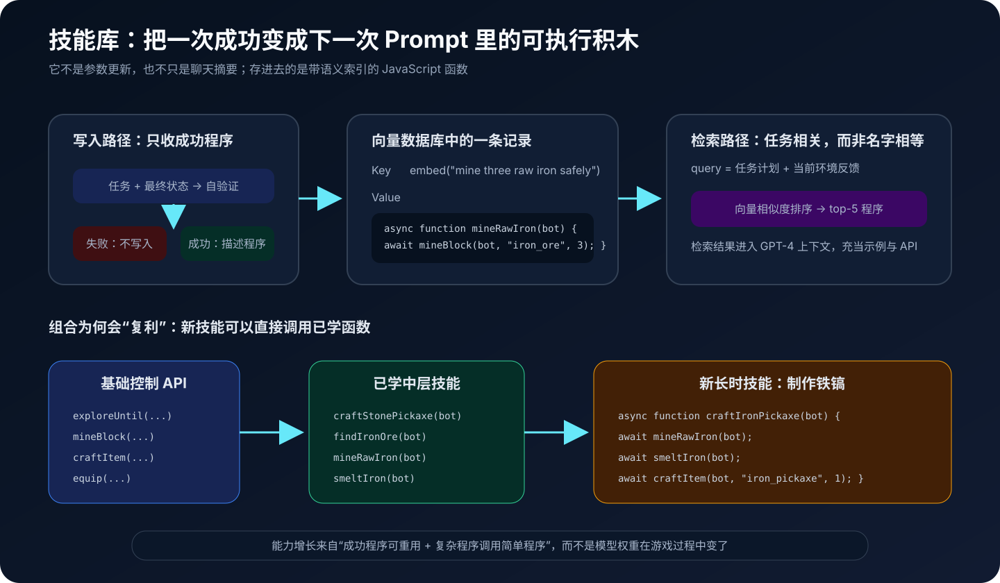
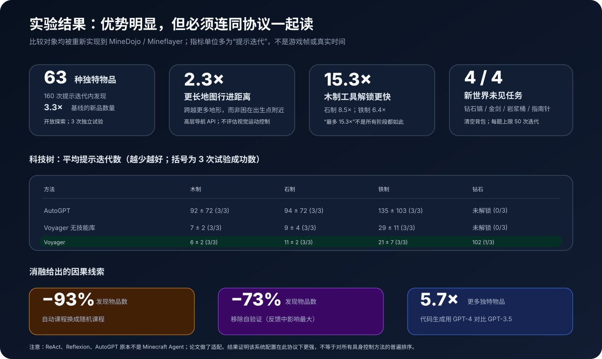

# Voyager 原理与实现：自动课程、技能库与代码反馈如何组成开放世界终身 Agent


> **论文**：[Voyager: An Open-Ended Embodied Agent with Large Language Models](https://arxiv.org/abs/2305.16291)<br>
> **作者**：Guanzhi Wang、Yuqi Xie、Yunfan Jiang、Ajay Mandlekar、Chaowei Xiao、Yuke Zhu、Linxi “Jim” Fan、Anima Anandkumar<br>
> **时间**：2023 年 5 月首发，2023 年 10 月更新至 arXiv v2<br>
> **关键词**：Embodied Agent、Open-Ended Learning、Automatic Curriculum、Skill Library、Code as Action、Iterative Prompting、Self-Verification、Minecraft<br>
> **配套代码**：[voyager_minimal.py](./code/voyager_minimal.py)（零依赖、可直接运行的教学实现，不是论文官方代码）<br>
> **原文与代码**：[arXiv HTML](https://arxiv.org/html/2305.16291) · [PDF](https://arxiv.org/pdf/2305.16291) · [项目主页](https://voyager.minedojo.org/) · [官方 GitHub](https://github.com/MineDojo/Voyager) · [MineDojo](https://minedojo.org/) · [Mineflayer](https://github.com/PrismarineJS/mineflayer)

## 0. 先说结论

Voyager 研究的不是“让 GPT-4 在 Minecraft 里完成一项指定任务”，而是一个更开放的问题：

> 当环境没有固定终点、没有人工任务表，也没有训练奖励时，Agent 能否自己决定接下来学什么，在行动失败后修正程序，把成功经验保存为可复用技能，并长期向更难的能力边界推进？

论文给出的系统由三个核心模块组成：

1. **Automatic Curriculum**：根据当前世界状态、背包、装备、已完成和失败的任务，持续提出“略高于当前能力、又有探索价值”的下一目标；
2. **Skill Library**：把已经验证成功的 JavaScript 行为程序存入向量数据库，按描述向量检索 top-5 相关技能；
3. **Iterative Prompting**：生成代码后真的执行，用环境反馈、解释器错误和自验证批评修补代码，最多尝试 4 轮；
4. **Code as Action**：让 LLM 输出可持续数秒到数分钟的程序，而不是逐帧输出前进、转头、点击；
5. **Black-box LLM**：游戏过程中不更新 GPT-4 权重，能力增长发生在上下文、外部状态和不断扩张的代码技能库里。



完整闭环可以写成：

```text
当前状态 + 探索历史
        ↓
自动课程提出一个新任务
        ↓
用任务计划与环境状态检索 top-5 技能
        ↓
GPT-4 生成 / 修改 Mineflayer JavaScript
        ↓
在 Minecraft 中执行
        ↓
环境反馈 + 执行错误 + GPT-4 自验证
        ├─ 失败：把反馈放回 Prompt，最多修 4 轮
        └─ 成功：程序写入技能库，再提下一任务
```

论文在开放探索实验中报告：

- 160 次提示迭代内发现 **63 种独特物品**，是比较方法的 **3.3 倍**；
- 地图行进距离达到基线的 **2.3 倍**；
- 木、石、铁工具阶段分别快 **15.3×、8.5×、6.4×**；
- Voyager 是受测方法中唯一解锁钻石工具阶段的方法，但只在 3 次试验中成功 1 次；
- 把已学技能库带到一个新世界、清空背包后，Voyager 能在 50 次提示迭代上限内完成钻石镐、金剑、岩浆桶和指南针四种未见任务，均为 3/3 成功。

但这些数字必须同时带上四个边界：

- Voyager 读取的是结构化游戏状态，并调用高层 Mineflayer API，不是从像素学视觉感知与键鼠控制；
- ReAct、Reflexion、AutoGPT 原本不是 Minecraft 方法，作者为了同一环境重新适配了它们；
- 论文说的“lifelong learning”是 **in-context lifelong learning**，不是持续训练神经网络参数；
- “open-ended”指没有预设任务序列、可以持续生成新目标，不等于已经证明能无限学习或适用于所有开放世界。

一句话记忆：

> Voyager 把 LLM Agent 从“收到任务后现想现做”改造成了“自己选课程、写程序、在环境里调试、把通过验收的程序沉淀为技能”的持续学习系统。

---

## 1. 论文究竟要解决什么

### 1.1 固定任务 Agent 与开放世界 Agent 的差别

经典具身任务通常提前给出目标：

```text
找到钻石。
制作一把木镐。
移动到坐标 (x, y, z)。
```

此时算法只需要回答：怎样完成这个目标？

Minecraft 的自然游玩却没有唯一目标。Agent 出生时可能处在森林、沙漠或雪地，附近资源不同，白天与夜晚风险不同，已经掌握的工具也不同。真正的开放世界问题至少包含两层决策：

$$
\underbrace{\text{What to learn next?}}_{\text{课程 / 探索}}
\qquad + \qquad
\underbrace{\text{How to accomplish it?}}_{\text{程序 / 控制}}.
$$

只解决第二层，会出现一个根本缺口：没有人告诉 Agent “下一题”是什么。

### 1.2 为什么直接给一句“尽可能探索”不够

给 LLM 一个抽象目标：

```text
Explore the world and get as many items as possible.
```

它可能生成宏大的计划，但不知道当前能力边界：

- 还没木镐就去挖钻石；
- 反复收集已经拥有的木头；
- 身处沙漠却规划砍橡木；
- 任务失败后直接宣称完成；
- 每次都从零重新发明相同的合成流程。

开放目标需要被动态压缩成一个个可执行、可验证、难度适中的局部目标：

$$
g_t = C(s_t, H_t, \mathcal{L}_t),
$$

其中：

- $s_t$：当前世界与 Agent 状态；
- $H_t$：已完成和失败任务历史；
- $\mathcal{L}_t$：当前技能库；
- $C$：自动课程；
- $g_t$：下一项具体任务。

### 1.3 一次性生成代码也不够

LLM 可能知道“制作木镐需要木板和木棍”，但把知识变成可运行程序还会遇到：

- API 名写错；
- 物品名或方块名不存在；
- 资源数量不够；
- 寻路失败；
- 工作台没有放置；
- 程序无异常退出，但目标实际上没完成。

所以 `program exited normally` 不能等价为 `task succeeded`：

$$
\text{no exception}
\not\Rightarrow
\text{goal achieved}.
$$

Voyager 的关键设计是把“执行”和“验收”分开：程序先改变世界，Critic 再根据最终状态判断目标是否达成。

### 1.4 每次都从零生成会让能力停滞

若 Agent 第 100 次制作工具仍需重新推理“怎样砍木头、合木板、做木棍、摆工作台”，上下文和调用成本会不断重复，长程任务也难以组合。

Voyager 把成功程序当成可调用函数：

```javascript
async function craftIronPickaxe(bot) {
  await mineRawIron(bot);
  await smeltIron(bot);
  await craftItem(bot, "iron_pickaxe", 1);
}
```

`mineRawIron` 和 `smeltIron` 可能又调用更基础的 `exploreUntil`、`mineBlock`、`placeItem`。能力增长因此不只来自“模型这次想得更好”，还来自软件工程式的抽象与复用。

---

## 2. 先看清 Voyager 实际控制的是什么

### 2.1 环境层：MineDojo + Minecraft

论文在 MineDojo 基础上搭建模拟环境。Minecraft 提供了适合长期探索的几个性质：

- 程序生成的大地图；
- 资源分布与生态域变化；
- 木 → 石 → 铁 → 钻石的依赖型科技树；
- 合成、开采、战斗、农业、建造等异质行为；
- 没有唯一结局，天然适合开放目标。

### 2.2 控制层：Mineflayer 高层 JavaScript API

Voyager 不直接输出：

```text
按 W 0.8 秒 → 鼠标向左 12° → 点击 3 帧
```

而是调用更高层控制能力：

```javascript
await exploreUntil(bot, direction, maxTime, condition);
await mineBlock(bot, "iron_ore", 3);
await craftItem(bot, "iron_pickaxe", 1);
await placeItem(bot, "furnace", position);
```

这些 API 内部已经封装了寻路、装备、挖掘、放置、合成等控制细节。

因此论文贡献主要位于：

```text
语言目标
  ↓
任务课程
  ↓
程序合成与调试
  ↓
高层控制 API
```

而不是：

```text
摄像头像素 → 3D 感知 → 低层运动策略
```

作者也明确说明，没有与像素输入、低层控制的 Minecraft 方法做直接排名，因为两者接口不同，不是同一场公平比较。

### 2.3 感知层：结构化文本状态

课程与代码 Agent 可以看到的状态包括：

- 背包物品与占用槽；
- 当前装备；
- 附近方块与实体；
- 生态域；
- 游戏时间；
- 健康与饥饿；
- 位置；
- 已知箱子；
- 最近观察到的其他方块；
- 已完成和失败任务。

这是一种“语言化状态接口”。它显著降低感知难度，也解释了为什么 Voyager 很擅长物品与科技树任务，却需要人类视觉反馈才能修正复杂建筑的空间细节。

---

## 3. 用一个形式化循环理解全系统

设：

- $s_t$：当前结构化环境状态；
- $D_t$、$F_t$：已完成与失败任务集合；
- $\mathcal{L}_t = \{(e_i, p_i, d_i)\}$：技能库，其中 $e_i$ 是描述向量、$p_i$ 是程序、$d_i$ 是描述；
- $g_t$：自动课程提出的任务；
- $K_t$：检索出的相关技能；
- $p_t^{(j)}$：第 $j$ 轮候选程序；
- $f_t^{(j)}$：环境反馈；
- $\epsilon_t^{(j)}$：执行错误；
- $c_t^{(j)}$：Critic 的批评。

课程先选任务：

$$
g_t = C(s_t, D_t, F_t, \text{context}_t).
$$

技能检索：

$$
q_t = \operatorname{Embed}(g_t, f_t),
$$

$$
K_t = \operatorname{TopK}_{i \in \mathcal{L}_t}
\operatorname{sim}(q_t, e_i), \qquad K=5.
$$

动作 Agent 在第 $j$ 轮生成代码：

$$
p_t^{(j)} = A\left(
g_t, s_t, K_t,
p_t^{(j-1)}, f_t^{(j-1)},
\epsilon_t^{(j-1)}, c_t^{(j-1)}
\right).
$$

执行环境：

$$
(s_{t,j+1}, f_t^{(j)}, \epsilon_t^{(j)})
= E(s_{t,j}, p_t^{(j)}).
$$

Critic 验收：

$$
(v_t^{(j)}, c_t^{(j)}) = V(g_t, s_{t,j+1}),
\qquad v_t^{(j)} \in \{0,1\}.
$$

若 $v_t^{(j)}=1$：

$$
\mathcal{L}_{t+1}
=
\mathcal{L}_t \cup
\left\{
(\operatorname{Embed}(d(p_t^{(j)})), p_t^{(j)}, d(p_t^{(j)}))
\right\},
$$

并把 $g_t$ 加入 $D_t$。若连续 4 轮都失败，则加入 $F_t$，课程换一个目标。

这套公式揭示一个很重要的事实：Voyager 的状态不只在游戏世界里，还分布在任务历史、代码库和提示上下文中。

---

## 4. Automatic Curriculum：下一题由谁出



### 4.1 总目标是多样性，不是单个终局

课程 Prompt 给出的顶层意图可以概括为：尽可能发现并完成多样的事物，成为更好的 Minecraft 玩家。

这与“击败末影龙”不同。若只有固定终局，Agent 可以围绕唯一依赖图优化；多样性目标则鼓励它开拓：

- 新物品；
- 新工具层级；
- 新生态域；
- 新生物；
- 新合成与加工流程；
- 新建造或交互能力。

论文把它理解为一种 **in-context novelty search**：不是通过进化或奖励函数显式计算行为新颖度，而是让 GPT-4 根据历史与状态提出新目标。

### 4.2 课程 Prompt 的四类信息

#### 指令与约束

课程不仅被要求“多样”，还被约束：

- 任务必须具体；
- 任务应该能从当前状态出发完成；
- 不要因为目标过难而要求尚未具备的资源与技能；
- 不要重复已完成任务；
- 一次只给一个立即目标；
- 目标应该便于从最终状态验证。

最后一点很容易忽略。若课程生成“欣赏一次壮丽日落”，Critic 很难从背包或位置可靠判断；“采集 3 个沙块”则有明确验收条件。

#### 当前状态

课程根据现实情况自适应。例如：

```text
森林 + 附近橡木 + 空背包
→ 采集若干木头

沙漠 + 有木制工具 + 附近仙人掌
→ 采集沙子或仙人掌

有石镐 + 附近铁矿 + 已会熔炼
→ 获取生铁或制作铁工具
```

#### 已完成与失败任务

两类历史共同定义能力前沿：

- `completed` 告诉课程什么不必重复、什么可作为前置技能；
- `failed` 告诉课程哪些目标当前可能太难，避免立即死磕。

失败任务没有永久删除。状态或技能增长后，课程可以稍后再次提出它。

#### GPT-3.5 生成的附加知识

论文还让 GPT-3.5 根据当前状态与探索进度“自问自答”，补充一般 Minecraft 知识。这里不用 GPT-4，是作者当时为降低成本所做的分工。

### 4.3 Warm-up：不要第一步就把全部状态塞进去

附录给出一个渐进暴露日程：

| 信息 | 完成多少任务后加入 Prompt |
|---|---:|
| 核心背包、装备、附近方块、位置 | 0 |
| 附近实体 | 5 |
| 完整背包 | 7 |
| 最近见过的其他方块、生态域 | 10 |
| 健康、饥饿、时间、附加上下文 | 15 |

核心背包只保留原木、木板、木棍、工作台、熔炉、泥土、煤、镐、剑、斧等关键项。

它的作用不是训练难度课程，而是 **信息课程**：早期 Prompt 简单，优先建立基础技能；探索增多后再让课程考虑更丰富状态。

### 4.4 为什么不是手写科技树

手工课程当然可以写：

```text
木头 → 木板 → 工作台 → 木镐 → 圆石 → 石镐 → 铁矿 …
```

但它有三处不足：

1. 依赖 Minecraft 专家逐条设计；
2. 不适应出生点、生态域和实时资源；
3. 很难覆盖农业、战斗、探索、建造等多条旁支。

论文消融显示，自动课程优于人工课程；若换成随机课程，发现物品数下降 **93%**。这说明任务顺序本身就是开放探索的关键算法部件。

### 4.5 自动课程仍不是完美教师

它会：

- 提出不存在的物品；
- 误判前置条件；
- 被不完整状态误导；
- 提出虽可描述但难验证的目标；
- 在局部资源不足时给出不可达任务。

Voyager 没有要求课程一次正确，而是用 `failed tasks` 和四轮上限把错误课程限制在有限成本内。

---

## 5. 为什么选择 Code as Action

### 5.1 程序天然表示时间扩展动作

低层动作序列可能包含数百或数千步：

$$
a_1, a_2, \ldots, a_H.
$$

代码把它压缩成一个有结构的策略：

$$
p = \texttt{mineBlock(bot, "iron\_ore", 3)}.
$$

程序内部可以：

- 循环直到收集够数量；
- 判断材料是否充足；
- 调用寻路；
- 捕获异常；
- 调用旧技能；
- 根据环境条件分支。

LLM 每轮不必决定下一帧，而是在较高抽象层描述一个 temporally extended action。

### 5.2 程序可解释、可调试、可组合

自然语言计划：

```text
找一个洞穴，找到铁矿，把它挖下来。
```

缺少明确接口与错误位置。程序则能给出：

```text
ReferenceError at line 12
Unknown item: acacia_axe
Cannot craft iron_chestplate: missing 7 iron_ingot
```

执行错误可以直接回到 Prompt，让模型做类似程序调试的修改。

### 5.3 代码也是一种强归纳偏置

选择 JavaScript 函数等于预先规定：

- 行为应该模块化；
- 重复动作应该循环；
- 旧能力应该通过函数调用复用；
- 错误应该暴露为异常或反馈；
- 成功行为可以持久化为库。

这比让 LLM 自由输出任意动作文本更容易形成稳定积累。

### 5.4 代价：隐藏了感知与运动难题

高层 API 将很多难点移到控制器：

- 导航；
- 目标识别；
- 交互距离；
- 装备切换；
- 动作时序。

因此，更准确的贡献表述是：

> Voyager 展示了 LLM 如何在有高层代码控制接口的开放环境中进行课程生成、程序改进和技能积累。

而不是：

> GPT-4 已经从原始视觉端到端学会玩 Minecraft。

---

## 6. Skill Library：把经验保存成软件，而不是一句反思



### 6.1 一条技能由什么组成

概念上，一条技能记录是：

```python
Skill(
    description="mine three raw iron safely",
    embedding=[...],
    program="async function mineRawIron(bot) {...}",
)
```

论文使用 GPT-3.5 为成功程序生成描述，再用当时的 `text-embedding-ada-002` 得到向量。向量是 key，JavaScript 程序是 value。

### 6.2 为什么索引描述，而不是函数名

函数名可能是：

```text
getIronV2
mineRawIronSafely
collectOre
```

新任务却可能表述为：

```text
Obtain enough iron to craft a bucket.
```

字面名字不等，但语义相关。对自然语言描述做向量检索，比精确匹配函数名更适合 LLM 生成的开放任务。

### 6.3 查询上下文不只有任务文本

面对新任务，系统先用 GPT-3.5 生成一般解决建议，再结合环境反馈构造检索查询，取 top-5 相关技能。

可抽象为：

$$
q = \operatorname{Embed}
\left(
\text{task plan} \oplus \text{environment feedback}
\right).
$$

环境反馈很重要。同一个“获取食物”任务，在水边与牧场附近需要不同技能。

### 6.4 检索出的技能如何使用

top-5 程序被放进代码生成 Prompt，起三种作用：

1. **示例**：展示正确的 Mineflayer 用法；
2. **工具**：新程序可以直接调用旧函数；
3. **约束**：减少模型重新发明相同逻辑和幻觉 API 的机会。

### 6.5 为什么必须“验证成功后再写入”

若程序只运行了一半便被加入库，错误会产生复利：

```text
坏的基础技能
  ↓ 被检索
坏的组合技能
  ↓ 再被检索
更长、更难定位的失败链
```

Voyager 把自验证当作技能库写入门：

$$
\text{commit}(p)
\iff
V(g, s') = \text{success}.
$$

这与软件工程中的“测试通过才合并”非常相似。

### 6.6 组合产生能力复利

假设已有：

```javascript
findIronOre(bot)
mineRawIron(bot)
craftFurnace(bot)
smeltIron(bot)
```

新技能不必重新展开所有寻路、采集和放置细节，只需组合：

```javascript
async function prepareIronIngots(bot) {
  await findIronOre(bot);
  await mineRawIron(bot);
  await craftFurnace(bot);
  await smeltIron(bot);
}
```

如果平均每个新技能能可靠复用若干旧技能，能力深度就可能随库增长而增加，而不是每个任务都停留在相同复杂度。

### 6.7 “缓解灾难性遗忘”该怎样理解

论文说技能库 alleviates catastrophic forgetting，指成功代码被外部持久化，后续不会因为 Prompt 改变就完全消失。

它不是说：

- GPT-4 参数经过连续训练而不遗忘；
- 所有旧技能永远可执行；
- 依赖版本、环境和前置状态变化后仍保证兼容。

更准确地说，Voyager 用外部程序记忆绕过了一部分参数式持续学习的遗忘问题。

---

## 7. Iterative Prompting：让失败变成可操作证据

### 7.1 第一类反馈：环境反馈

程序可以通过 `bot.chat()` 报告中间进度和条件检查。例如：

```text
Cannot craft iron chestplate: missing 7 iron ingots.
Need 2 more planks before crafting sticks.
No water block found within search range.
```

这种反馈回答的是：

> 程序能运行，但世界为什么没有达到目标？

它比一句“失败了”信息密度高得多。

### 7.2 第二类反馈：执行错误

解释器错误回答的是：

> 程序本身哪里非法？

论文给出的典型例子是模型尝试制作不存在的 `acacia_axe`，错误信息促使下一轮改成 Minecraft 中真实存在的 `wooden_axe`。

执行错误还包括：

- JavaScript 语法错误；
- 未定义变量；
- 错误 API 参数；
- `null` 对象访问；
- 超时或寻路异常。

### 7.3 第三类反馈：自验证

很多失败没有异常：

```javascript
async function getWood(bot) {
  await mineBlock(bot, "oak_log", 1);
}
```

若任务是“采 3 根木头”，这段程序正常结束，却只完成三分之一。

论文不为每个动态任务手写 checker，而是实例化另一个 GPT-4 Critic，输入：

- 任务；
- 任务背景；
- 执行后的背包、装备、位置、附近方块、健康、饥饿等状态。

Critic 输出结构化结果：

```json
{
  "reasoning": "最终背包只有 1 根原木，目标要求 3 根。",
  "success": false,
  "critique": "继续采集至少 2 根原木。"
}
```

失败时，`critique` 进入下一轮代码生成 Prompt。

### 7.4 三类反馈解决不同问题

| 反馈 | 主要证据 | 典型问题 |
|---|---|---|
| 环境反馈 | 世界中的中间状态与缺失条件 | 材料不够、目标没找到、动作只完成一部分 |
| 执行错误 | 解释器 / API 异常 | 语法错、物品名错、调用方式错 |
| 自验证 | 任务与最终状态是否匹配 | 无异常但没完成、完成方式产生不同掉落物 |

只保留其中一种都不够。

### 7.5 最多四轮是一种成本控制

论文算法对每个任务最多生成 4 轮代码：

```python
for _ in range(4):
    skills = retrieve(task, feedback)
    code = generate(task, old_code, feedback, errors, critique, skills)
    state, feedback, errors = environment.step(code)
    success, critique = critic(task, state)
    if success:
        add_skill(code)
        break
```

达到上限仍失败，任务进入失败列表，课程继续探索别的方向。

这体现一种实用的 Agent 设计原则：

> 反思循环必须有停止条件。无限“再试一次”不是终身学习，而是成本失控。

### 7.6 自验证为什么效果最大

消融中，去掉自验证使发现物品数下降 **73%**，是三种反馈里影响最大的。

原因并不神秘：没有验收门，Agent 无法可靠决定：

- 当前任务是否应继续；
- 当前程序是否值得存为技能；
- 课程是否应该前进；
- 失败是“代码错”还是“只是还差一点”。

Verifier 实际上连接了执行内环、技能库写入和课程外环，是系统的状态转换闸门。

---

## 8. 一条具体轨迹：从空手到铁矿

假设出生在森林，附近有橡木、石头和铁矿。

### 第一步：课程提出采木头

```text
Task: collect 3 oak logs
```

首轮程序只采到 1 根。无执行异常，但 Critic 判断失败：

```text
Environment: oak_log = 1
Critique: 还差 2 根
```

第二轮按剩余量继续采，成功后把 `collectLogs` 加入技能库。

### 第二步：课程沿科技树推进

```text
craft planks
craft a crafting table
craft sticks
craft a wooden pickaxe
```

每项成功代码都成为下一项的上下文积木。

### 第三步：木镐打开石器阶段

```text
mine cobblestone
craft a stone pickaxe
```

课程不是显式执行一张硬编码 DAG，但 GPT-4 的 Minecraft 知识和当前状态让它能沿合理前置关系推进。

### 第四步：错误反馈修正铁矿程序

模型可能混淆：

```text
方块：iron_ore
掉落物：raw_iron
```

若程序把 `raw_iron` 当作待寻找方块，执行器会报错。下一轮根据错误，改为寻找/开采 `iron_ore`，再由背包里的 `raw_iron` 验收成功。

### 第五步：成功轨迹变成迁移资产

在新世界清空背包后，只要重新获得石镐，`mine raw iron` 任务就能检索并调用旧技能，而不必从头生成整段逻辑。

这条链说明三个模块不是并列功能，而是相互供给：

$$
\text{课程产生任务}
\to
\text{迭代提示产出可靠程序}
\to
\text{技能库扩大能力边界}
\to
\text{课程提出更难任务}.
$$

---

## 9. 实验设置：数字之前先看协议

### 9.1 模型与温度

论文使用当时的：

- `gpt-4-0314`：课程、代码生成、自验证等关键推理；
- `gpt-3.5-turbo-0301`：一般 NLP 辅助任务，如生成技能描述与附加建议；
- `text-embedding-ada-002`：技能描述向量。

除自动课程外温度均设为 0；课程温度为 0.1，用于增加目标多样性。

这些是 2023 年实验快照，不应直接当作今天复现时必须使用的最佳模型组合。

### 9.2 比较方法

#### ReAct

交替生成推理与动作，并得到环境状态与环境反馈。论文适配版从头生成一次代码，再做三轮修订。

#### Reflexion

在 ReAct 基础上加入反思。论文适配版还提供执行错误与 Voyager 的自验证模块，以避免明显不公平。

#### AutoGPT

先把“尽可能探索”分解为多个子目标，再以 ReAct 式循环执行。若连续三个子目标没有获得新物品，则重新规划。

论文比较中的 AutoGPT 没有：

- 自动课程；
- 自验证；
- 持续增长的技能库。

### 9.3 基线都收到同一个开放目标

基线任务统一为：

```text
explore the world and get as many items as possible
```

这恰好测试“抽象开放目标能否被系统持续具体化”。ReAct 与 Reflexion 在已有明确任务上可能很强，但它们本身不负责生成长期课程。

### 9.4 实验环境有连续探索辅助

附录说明：

- Bot 死亡后会在附近地面复活；
- 背包被保留，避免长期探索被一次死亡清零；
- 程序执行后回收工作台与熔炉；
- 控制原语包含较多条件检查、`try-catch` 和 `bot.chat()` 反馈。

这些设计让实验聚焦课程、技能和程序改进，而不是硬核生存惩罚。

---

## 10. 主结果到底说明了什么



### 10.1 开放探索：63 种物品

在 160 次提示迭代内，Voyager 平均持续发现新物品，最终达到 63 种，是基线的 3.3 倍。

重要的不只是终点更高，还有曲线没有很早平台化。论文把这一点归因于：

- 课程持续把目标放在能力边缘；
- 旧程序让复杂目标不必从零开始；
- 失败反馈避免一错到底。

### 10.2 科技树：速度与成功率要一起看

论文按“达到该工具等级需要多少次提示迭代”统计：

| 方法 | 木制工具 | 石制工具 | 铁制工具 | 钻石工具 |
|---|---:|---:|---:|---:|
| ReAct | N/A（0/3） | N/A（0/3） | N/A（0/3） | N/A（0/3） |
| Reflexion | N/A（0/3） | N/A（0/3） | N/A（0/3） | N/A（0/3） |
| AutoGPT | $92\pm72$（3/3） | $94\pm72$（3/3） | $135\pm103$（3/3） | N/A（0/3） |
| Voyager 无技能库 | $7\pm2$（3/3） | $9\pm4$（3/3） | $29\pm11$（3/3） | N/A（0/3） |
| Voyager | $6\pm2$（3/3） | $11\pm2$（3/3） | $21\pm7$（3/3） | 102（1/3） |

几个容易误读的点：

1. “最多 15.3×”来自木制阶段 $92/6\approx15.3$，不是所有阶段统一加速；
2. 无技能库版本在石制阶段的均值 9 反而小于完整版本 11，说明小样本单点会有波动；
3. 技能库的价值更明显地出现在后期持续探索、铁器、钻石和迁移，不是每个早期节点都严格更快；
4. 钻石工具只有 1/3 成功，说明 Voyager 并未稳定通关整个科技树。

### 10.3 地图覆盖：2.3× 更远

Voyager 行进距离为基线的 2.3 倍，并跨越更多地形。课程能根据新生态域提出相应目标，因此“移动”不是无目的随机游走，而是探索新资源的一部分。

仍要记住：导航使用高层 API，这个数字不是视觉导航或运动控制的直接成绩。

### 10.4 新世界零样本任务

作者清空背包、创建新世界，再测试四项未见任务，每题上限 50 次提示迭代：

| 方法 | 钻石镐 | 金剑 | 岩浆桶 | 指南针 |
|---|---:|---:|---:|---:|
| ReAct | 0/3 | 0/3 | 0/3 | 0/3 |
| Reflexion | 0/3 | 0/3 | 0/3 | 0/3 |
| AutoGPT | 0/3 | 0/3 | 0/3 | 0/3 |
| AutoGPT + Voyager 技能库 | 1/3，39 | 1/3，30 | 0/3 | 2/3，30 |
| Voyager 无技能库 | 2/3，36 | 3/3，$30\pm9$ | 3/3，$27\pm9$ | 3/3，$26\pm3$ |
| Voyager | 3/3，$19\pm3$ | 3/3，$18\pm7$ | 3/3，$21\pm5$ | 3/3，$18\pm2$ |

这组结果最直接地支持技能库的迁移价值：程序库不仅帮助 Voyager，也能作为插件增强 AutoGPT，只是 AutoGPT 缺少完整闭环后仍不稳定。

### 10.5 “零样本”是什么意思

这里的零样本是：

- 这些具体任务没有出现在开放探索训练目标中；
- 不对 LLM 做额外梯度训练；
- 使用此前自主积累的技能库；
- 仍允许 GPT-4 分解任务、检索技能和多轮执行。

它不是“一次模型调用、不看旧技能、不试错”。

---

## 11. 消融实验：哪一块真正重要

论文消融六项设计：

1. 自动课程；
2. 技能库；
3. 环境反馈；
4. 执行错误；
5. 自验证；
6. 代码生成使用 GPT-4。

### 11.1 随机课程：−93% 物品

随机任务常常顺序错误：前置能力没学，后续目标无法完成。说明开放世界的“题目分布”不是外生给定的，如何采样目标本身决定学习效率。

### 11.2 无技能库：后期平台化

无技能库版本早期仍可推进，因为 GPT-4 知道基础 Minecraft 常识；到任务变长后，每次从头合成程序的负担增大，发现曲线更早停滞。

这也解释了为何技能库不是“让木镐从 7 步变 6 步”那么简单，它主要改变长期复杂度增长。

### 11.3 无自验证：−73% 物品

自验证是反馈类型中最关键的一项。没有它，系统会把“无异常”误当“已完成”，污染课程状态和技能库。

### 11.4 GPT-4 对 GPT-3.5：5.7× 物品

把代码生成从 GPT-4 换成 GPT-3.5 后，完整系统发现物品数显著下降；GPT-4 获得 5.7 倍独特物品。

这说明架构不能完全弥补底座模型的程序合成能力。工具、记忆和验证会放大强模型，但不是把任意模型自动变成可靠 Agent。

### 11.5 消融能说明什么，不能说明什么

它支持：

- 每个模块对这一 Minecraft 协议有增量价值；
- 课程与自验证是最强的两个闸门；
- 技能库的价值随任务复杂度和迁移需求增加。

它不充分支持：

- 模块在所有游戏、机器人或软件 Agent 中都有相同比例收益；
- GPT-4 永远是最佳成本选择；
- LLM Critic 比规则验证器在所有任务上更可靠。

---

## 12. 人类多模态反馈实验说明了什么

论文写作时可用 GPT-4 API 只有文本输入，Voyager 没有视觉感知。对于地狱门、房屋等复杂 3D 建筑，结构化状态不足以判断整体几何。

作者演示了两种人类介入方式：

### 人类作为 Critic

人类观察画面并指出：

```text
门框右侧高度不够。
屋顶在西南角缺了一块。
```

反馈进入下一轮代码修改，弥补文本状态看不到的空间错误。

### 人类作为 Curriculum

人类把复杂建筑拆为：

```text
先搭底座 → 建两侧立柱 → 补顶梁 → 检查内部空间 → 点火
```

这相当于人工替代自动课程的任务分解。

这个实验不是“Voyager 已具备多模态能力”，而是在说明三模块接口可以接受更强的感知或人类反馈。

---

## 13. 教学实现：300 多行复现核心闭环

配套代码：[voyager_minimal.py](./code/voyager_minimal.py)

它不连接 Minecraft，也不调用任何在线模型，而是用一个确定性的方块世界模拟：

- 自动课程沿木器 → 石器 → 铁矿选择能力前沿；
- 技能库用词袋 Jaccard 近似向量检索；
- Action Agent 用规则近似 GPT-4 代码生成；
- Executor 真正检查配方、工具与资源；
- Critic 根据最终背包验收；
- 只有成功程序才写入技能库；
- 新世界保留技能库，验证检索迁移。

### 13.1 为什么不用 `eval` 模拟官方代码执行

真实 Voyager 生成 JavaScript。教学代码改成白名单 IR：

```python
@dataclass(frozen=True)
class Action:
    kind: str   # gather / craft / mine
    item: str
    count: int
```

执行器只接受已注册动作：

```python
if action.kind == "gather":
    ...
elif action.kind == "craft":
    ...
elif action.kind == "mine":
    ...
else:
    raise ExecutionError("动作不在白名单中")
```

这保留了“生成程序 → 执行 → 反馈”的结构，又不会在本机运行任意生成代码。

### 13.2 自动课程选择第一个可达前沿

```python
def propose(self, state):
    done = set(state.completed_tasks)
    candidates = [
        task for task in self.tasks
        if task.name not in done
        and set(task.prerequisites) <= done
    ]
    return candidates[0] if candidates else None
```

真实论文由 GPT-4 结合开放状态提出目标；教学版用显式前置关系，让课程逻辑可测试。

### 13.3 技能检索

```python
def retrieve(self, query, top_k=5):
    query_tokens = tokens(query)
    ranked = sorted(
        self.skills.values(),
        key=lambda skill: jaccard(query_tokens, tokens(skill.description)),
        reverse=True,
    )
    return ranked[:top_k]
```

真实系统把这里替换为 embedding + 向量数据库。

### 13.4 迭代执行与验证

```python
for attempt in range(1, 5):
    skills = library.retrieve(task_and_state, top_k=5)
    program = action_agent.generate(
        task, state, skills, error, critique, attempt
    )
    try:
        feedback = world.execute(program)
    except ExecutionError as exc:
        error = str(exc)

    success, critique = critic.verify(task, state)
    if success:
        library.add(reusable_skill(program))
        break
```

### 13.5 运行

```bash
python3 papers/to-2026/code/voyager_minimal.py
```

关键输出片段：

```text
TASK  collect 3 oak logs
  round 1: environment=['采集 1 x oak_log']
           verified=False critique='还需要 2 x oak_log'
  round 2: environment=['采集 2 x oak_log']
           verified=True

TASK  mine 3 raw iron
  round 1: execution_error=不知道怎样开采并获得 iron_ore
           verified=False critique='还需要 3 x raw_iron'
  round 2: environment=['开采 3 x raw_iron']
           verified=True

TASK  mine 2 raw iron in a new world
  round 1: retrieved=['mine_iron', 'stone_pickaxe', ...]
           verified=True
TRANSFER success=True
```

两个首轮失败分别对应：

- **环境反馈**：程序只采 1 根，任务要求 3 根；
- **执行错误**：混淆 `iron_ore` 方块与 `raw_iron` 掉落物。

### 13.6 教学实现刻意省略什么

- 真正 LLM Prompt；
- Mineflayer 异步 API；
- 自然语言技能描述生成；
- 向量 embedding；
- 寻路、战斗和动态世界；
- 并发、超时、检查点和恢复；
- LLM Critic 的误判。

它是系统骨架，不是论文结果复现。

---

## 14. 官方代码怎样运行

官方仓库给出的基础流程是：

```bash
git clone https://github.com/MineDojo/Voyager
cd Voyager
pip install -e .
```

此外需要：

- Python ≥ 3.9；
- Node.js ≥ 16.13；
- `voyager/env/mineflayer` 下的 Node 依赖；
- Minecraft 实例；
- 对应版本 Fabric mods；
- OpenAI API 配置；
- 正确的游戏登录与 LAN 设置。

启动长期学习的官方接口形如：

```python
from voyager import Voyager

voyager = Voyager(
    azure_login=azure_login,
    openai_api_key=openai_api_key,
)
voyager.learn()
```

从检查点继续：

```python
voyager = Voyager(
    azure_login=azure_login,
    openai_api_key=openai_api_key,
    ckpt_dir="YOUR_CKPT_DIR",
    resume=True,
)
```

给定旧技能库执行新任务：

```python
voyager = Voyager(
    azure_login=azure_login,
    openai_api_key=openai_api_key,
    skill_library_dir="./skill_library/trial1",
    ckpt_dir="NEW_CKPT_DIR",
    resume=False,
)

sub_goals = voyager.decompose_task("Craft a diamond pickaxe")
voyager.inference(sub_goals=sub_goals)
```

官方 README 也提醒，任务分解偶尔不合理，需要重新分解。这与论文中的“不准确性”局限一致。

### 14.1 为什么今天直接运行可能不完全复现

论文固定的是 2023 年模型快照与当时 API：

- 模型版本可能已经下线；
- 返回格式与安全策略可能变化；
- Minecraft / Fabric / Mineflayer 版本组合较敏感；
- embedding 模型与向量分布已更新；
- 随机世界、出生位置和 LLM 输出都会引入方差。

可靠复现需要固定：

```text
代码 commit
Python / Node 版本
Minecraft / Fabric / mods 版本
模型或兼容替代模型
Prompt 模板
世界种子
试验次数与迭代预算
死亡 / 背包 / 工作台等环境规则
```

---

## 15. 如果把 Voyager 做成生产系统

论文原型优先证明研究思想。真实产品还需要一层可靠性与安全架构。

### 15.1 不要直接执行任意模型代码

更安全的链路是：

```text
LLM 输出 typed IR / AST
  ↓ schema validation
静态策略检查
  ↓ capability allowlist
沙盒编译与单元测试
  ↓ time / CPU / memory / network limits
模拟器预演
  ↓
受限环境执行
```

至少限制：

- 文件系统读写；
- 网络访问；
- 子进程；
- 动态 import；
- 反射与原型污染；
- 无限循环；
- 高频 API 调用；
- 越权控制其他 Agent 或用户资源。

### 15.2 自验证最好是混合式

确定性目标优先规则验证：

```python
inventory["iron_pickaxe"] >= 1
distance(position, target) <= tolerance
structure_matches_blueprint(world, blueprint)
```

语义目标再交给模型 Critic：

```text
“整理背包”是否合理？
“房屋是否具有可用入口？”
```

最终判定可以是：

$$
V = V_{\text{rules}}
\land V_{\text{simulator}}
\land V_{\text{semantic critic}}.
$$

这样避免 Critic 仅凭语言合理化不存在的成功。

### 15.3 技能库需要软件供应链治理

每条技能应记录：

```text
skill_id / version
source task
source model + prompt hash
environment version
required capabilities
preconditions / postconditions
unit tests / integration tests
success rate / last used
dependencies on other skills
security scan result
```

技能更新不是简单覆盖。应支持：

- 版本化；
- 回滚；
- 去重；
- 依赖图；
- 失效标记；
- 按环境版本重新验证。

### 15.4 检索不能只看语义相似度

生产检索应综合：

$$
S_i =
\alpha S_{\text{semantic}}
+ \beta S_{\text{precondition}}
+ \gamma S_{\text{reliability}}
+ \delta S_{\text{version}}
- \lambda S_{\text{risk}}.
$$

语义上最像的技能，如果：

- 前置物品不满足；
- 依赖 API 已升级；
- 历史成功率很低；
- 需要当前会话没有的权限；

就不该排第一。

### 15.5 课程需要预算与风险约束

开放目标不代表无限授权。课程候选应先过：

```text
任务是否在用户目标范围内？
是否需要新权限？
预计成本是否超过预算？
是否可逆？
是否会影响其他主体？
验收条件是否明确？
```

可将课程效用写为：

$$
U(g) =
\text{novelty}(g)
+ \text{learningValue}(g)
+ \text{userValue}(g)
- \text{cost}(g)
- \text{risk}(g)
- \text{unverifiability}(g).
$$

### 15.6 全链路必须可重放

持久化事件日志：

```text
state snapshot
curriculum prompt / response
retrieved skill IDs
generated program hash
execution trace
environment feedback
verifier evidence
commit / reject decision
```

否则当技能库被污染时，很难追溯是哪次误判把坏程序写了进去。

---

## 16. 与 ReAct、Reflexion、AutoGPT、Generative Agents 的区别

| 方法 | 主要问题 | 长期积累 | 反馈 | 任务来源 | 行动表示 |
|---|---|---|---|---|---|
| ReAct | 当前任务中如何边想边做 | 当前轨迹 | 观察 | 外部给定 | 文本 / 工具动作 |
| Reflexion | 失败后怎样用语言经验改进下一次 | episodic verbal memory | 评价 + 反思 | 外部给定 | 取决于环境 |
| AutoGPT | 怎样把高层目标拆成子目标并执行 | 通常是日志 / 文件记忆 | 工具结果 | 高层目标分解 | 工具 / 代码 |
| Generative Agents | 怎样让角色长期保持社会行为可信度 | 观察、反思、计划的记忆流 | 环境与对话 | 日程与反应 | 自然语言行为 |
| Voyager | 怎样在开放环境中自主选题、调试并积累技能 | 可执行程序技能库 | 环境、异常、自验证 | 自动课程 | JavaScript 长时技能 |

### 16.1 Voyager 与 Reflexion 都“反思”，但存的东西不同

Reflexion 典型记忆：

```text
上次失败是因为没有先检查材料；下次应先读取背包。
```

Voyager 典型技能：

```javascript
async function craftStonePickaxe(bot) { ... }
```

前者是语言化策略经验，后者是可执行行为模块。两者可以结合：语言反思解释为何失败，程序技能负责下次直接复用。

### 16.2 Voyager 与 Generative Agents 的记忆目标不同

Generative Agents 关心：

- 我认识谁；
- 最近发生了什么；
- 我今天计划做什么；
- 经历反映出怎样的关系与倾向。

Voyager 技能库关心：

- 怎样可靠获取某种物品；
- 哪段代码完成过什么任务；
- 新任务应检索哪些可执行函数。

一个偏“情节与社会认知记忆”，一个偏“程序性记忆”。

### 16.3 最有价值的组合方向

更完整的长期 Agent 可能同时需要：

```text
事件记忆：发生过什么
语义记忆：世界规律是什么
程序记忆：怎样执行
反思记忆：为什么上次失败
目标记忆：长期承诺与优先级
```

Voyager 证明了程序记忆在开放探索中的高杠杆价值，但没有覆盖完整的长期认知栈。

---

## 17. 论文的局限与风险

### 17.1 GPT-4 成本

论文当时估计 GPT-4 API 成本约为 GPT-3.5 的 15 倍，而消融又显示 GPT-3.5 代码生成远弱于 GPT-4。

开放学习每个任务最多 4 轮，还包含课程、代码、辅助问答、描述生成、Critic 与 embedding 调用，成本会随时间快速积累。

### 17.2 代码仍会卡住

迭代提示不是正确性证明。Agent 仍会：

- 连续四轮写不出正确技能；
- 因寻路或世界状态卡住；
- 生成不存在的物品或配方；
- 对稀有资源做无效搜索。

课程只能稍后重试，不能保证最终掌握。

### 17.3 Critic 会误判

论文提到一个例子：杀死蜘蛛后背包出现蜘蛛丝，但自验证没有把蜘蛛丝识别为成功信号。

反方向也可能发生：背包已有目标物品，但不是这次程序获得；Critic 仅看最终状态就误判当前技能成功。

更严格的 verifier 应比较执行前后差分、事件日志和因果证据：

$$
\Delta s = s_{\text{after}} - s_{\text{before}}.
$$

### 17.4 没有视觉感知

复杂空间结构、远处目标、遮挡关系与画面异常不容易从结构化文本恢复。人类反馈实验正是在补这个缺口。

### 17.5 高层 API 带来接口依赖

如果换成真实机器人：

- 控制误差更大；
- 观测有噪声；
- 动作可能不可逆；
- 失败会有安全代价；
- 高层 API 未必存在。

Voyager 不能直接从 Minecraft 高层接口外推为通用机器人方案。

### 17.6 任意代码执行风险

生成代码若拥有文件、网络、进程或高权限环境访问，可以：

- 泄漏凭证；
- 删除数据；
- 下载恶意代码；
- 占满资源；
- 通过技能库把攻击持久化。

论文环境是研究沙盒；产品必须加能力白名单与隔离执行。

### 17.7 技能库可能累积技术债

程序数量增长后会出现：

- 重复技能；
- 旧 API；
- 隐式前置条件；
- 相互冲突的实现；
- 描述与代码不一致；
- 检索结果越来越嘈杂。

“ever-growing” 不应等于永不整理。长期系统需要压缩、合并、淘汰和重新测试。

### 17.8 开放探索目标本身有价值风险

“发现尽可能多的东西”在游戏里相对无害，在真实系统中却可能鼓励越权探索。开放课程必须受用户意图、安全政策与资源预算约束。

---

## 18. 常见误解

### 误解一：Voyager 训练了一个会玩 Minecraft 的新模型

没有。论文通过黑盒 GPT-4 / GPT-3.5 API 和外部技能库运行，不做参数微调。

### 误解二：技能库就是向量数据库里的攻略文本

不是。key 是程序描述的 embedding，value 是可执行 JavaScript 程序。

### 误解三：每一步都调用 GPT-4 控制角色移动

不是。GPT-4 生成长时程序，Mineflayer 高层 API 执行具体控制。

### 误解四：3.3× 说明它比所有 Minecraft Agent 强

论文只与适配后的 ReAct、Reflexion、AutoGPT 做同接口比较，没有直接比较像素输入、低层控制方法。

### 误解五：15.3× 是整个科技树平均加速

不是。15.3× 对应木制工具阶段；石制 8.5×，铁制 6.4×，钻石阶段 Voyager 也只有 1/3 成功。

### 误解六：验证成功就保证技能正确

不保证。GPT-4 Critic 可能错判，且最终状态可能无法证明因果。成功是系统判定，不是形式化证明。

### 误解七：open-ended 等于永远不会停、能力无限增长

不是。每个任务有四轮上限，系统会卡住，技能库会受模型、接口和世界复杂度限制。

### 误解八：lifelong learning 指模型参数持续学习

论文强调的是 in-context lifelong learning：Prompt、任务历史、环境状态与外部代码库在增长。

### 误解九：自动课程只是让 GPT-4 列计划

它是在线闭环：每次基于最新状态、完成/失败历史提出一个下一目标，并在任务结果后重新决策。

### 误解十：只要加一个技能库，Agent 就会持续变强

技能必须经过验收、可检索、满足前置条件、与环境版本兼容，并能被新程序正确组合。没有这些治理，库越大可能越混乱。

---

## 19. 这篇论文真正留下了什么

### 19.1 把 Agent 的学习产物定义为“可执行资产”

此前很多 LLM Agent 把经验存成对话、总结或反思。Voyager 强调：如果任务发生在工具世界，最有用的记忆可能是通过验证的程序。

### 19.2 把任务生成纳入 Agent 架构

多数基准默认任务由数据集给定。Voyager 提醒：开放世界里，“选择下一题”本身就是学习算法。

### 19.3 把验证放在课程和记忆之间

验证不只是最后打分，而是决定：

- 是否继续修；
- 是否换任务；
- 是否写入长期记忆；
- 是否允许能力边界前移。

### 19.4 展示外部记忆、工具与强模型的乘法关系

可以粗略写成：

$$
\text{Agent capability}
\approx
\text{foundation model}
\times
\text{environment interface}
\times
\text{feedback quality}
\times
\text{reusable memory}.
$$

任一项接近零，整体都会受限：

- 模型不会写代码，反馈再好也难修；
- API 太低层，长程计划难落地；
- verifier 不可靠，技能库会污染；
- 没有持久记忆，能力难复利。

### 19.5 Agent 更像持续集成系统，而不只是聊天机器人

Voyager 的结构很像：

```text
需求生成 → 代码生成 → 运行 → 测试 → 失败修复 → 通过后入库 → 复用
```

这条视角后来广泛出现在 coding agent、web agent、机器人代码策略和自动工作流中。

---

## 20. 复现与阅读检查清单

读完后，应该能回答：

- 自动课程为何需要完成与失败任务两份历史？
- 为什么 code as action 适合长程技能，又隐藏了哪些低层难题？
- 技能库的 key 和 value 分别是什么？
- 为什么检索 top-5，而不是把全部技能塞入 Prompt？
- 环境反馈、执行错误、自验证分别解决什么失败？
- 为什么最多四轮后必须换目标？
- 63 种物品和 160 次迭代的统计单位是什么？
- 15.3× 来自哪个科技树阶段？
- 新世界迁移时保留了什么、清空了什么？
- 为什么这不是梯度式终身学习？
- 为什么不能直接和像素低层控制方法排名？
- 如何避免坏程序经技能库产生长期污染？

自己实现时，至少检查：

- [ ] 任务是否具体、可达、可验证；
- [ ] 每轮执行是否保留状态差分和错误栈；
- [ ] verifier 是否独立于生成器，并优先使用确定性证据；
- [ ] 失败循环是否有次数、时间与成本上限；
- [ ] 技能写入是否需要验收；
- [ ] 技能是否声明前置条件、权限与版本；
- [ ] 检索是否同时考虑语义、可靠性与可执行性；
- [ ] 生成程序是否在无网络、限资源的沙盒内运行；
- [ ] 课程是否受用户目标、安全边界和预算约束；
- [ ] 全链路是否可重放、可回滚、可审计。

---

## 21. 总结

Voyager 的核心不是一句“GPT-4 会玩 Minecraft”，而是一套互锁的长期 Agent 机制：

1. **自动课程**把没有终点的探索压缩为下一项能力前沿任务；
2. **代码行动空间**把长程行为表示为可解释、可执行、可组合的程序；
3. **技能检索**把成功程序放回新任务的上下文；
4. **环境反馈**告诉模型世界里差了什么；
5. **执行错误**告诉模型代码哪里非法；
6. **自验证**决定任务是否真的完成；
7. **成功后入库**让一次试错变成长期可复用资产；
8. **四轮上限与失败历史**让开放探索不会在单个目标上无限消耗。

实验说明，这套组合在结构化 Minecraft 高层控制协议下，显著优于适配后的 ReAct、Reflexion 与 AutoGPT，并能把技能库迁移到新世界解决未见任务。

它没有解决端到端视觉控制、形式化正确性、任意代码安全、无限技能库治理和真实机器人风险，却清楚地展示了一个至今仍很有影响力的 Agent 蓝图：

> 让模型不只生成答案，而是选择下一项学习目标；不只描述行动，而是写可执行程序；不只口头反思，而是用真实环境证据调试；不只保留聊天历史，而是把通过验收的能力沉淀成下一次可以调用的软件。

---

## 22. 延伸阅读

- [Voyager 原文（arXiv HTML）](https://arxiv.org/html/2305.16291)：方法、完整 Prompt、伪代码、实验表与技能示例。
- [Voyager 项目主页](https://voyager.minedojo.org/)：系统演示、核心图与实验概览。
- [Voyager 官方代码](https://github.com/MineDojo/Voyager)：安装、检查点恢复、技能库和任务推理入口。
- [MineDojo](https://minedojo.org/)：论文使用的 Minecraft AI 框架。
- [Mineflayer](https://github.com/PrismarineJS/mineflayer)：Voyager 的高层 JavaScript 控制接口来源。
- [ReAct](./21_ReAct_2023_原理.md)：理解推理—行动—观察循环。
- [Reflexion](./65_Reflexion_2023_原理.md)：对比语言反思记忆与 Voyager 的程序技能记忆。
- [Generative Agents](./66_Generative_Agents_2023_原理.md)：对比社会情节记忆与可执行程序记忆。
- [Toolformer](./20_Toolformer_2023_原理.md)：理解语言模型如何学习调用外部工具。
- [Code as Policies](https://arxiv.org/abs/2209.07753)：代码生成作为机器人策略的代表工作。
