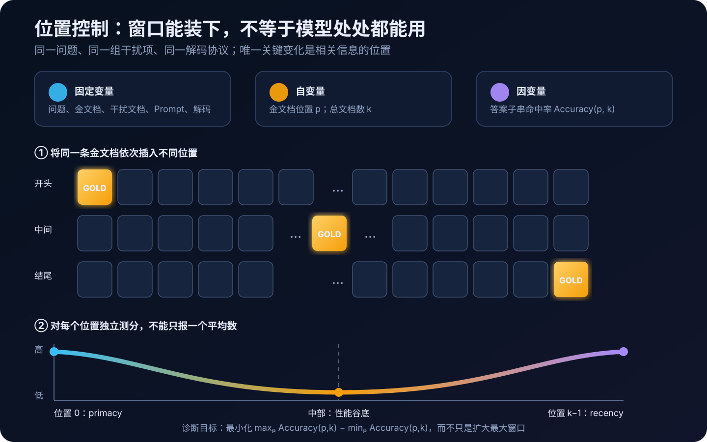
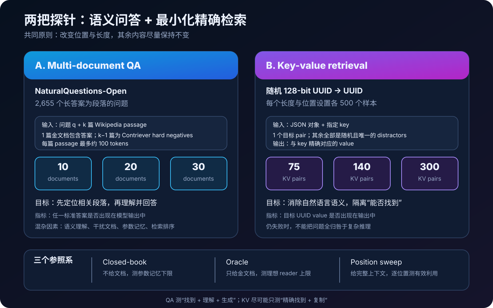
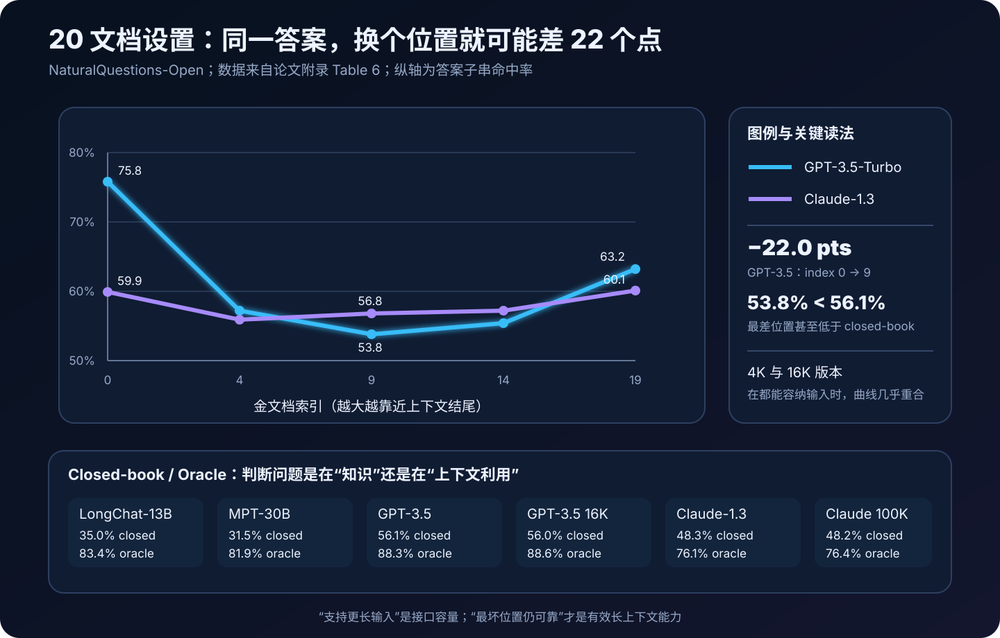
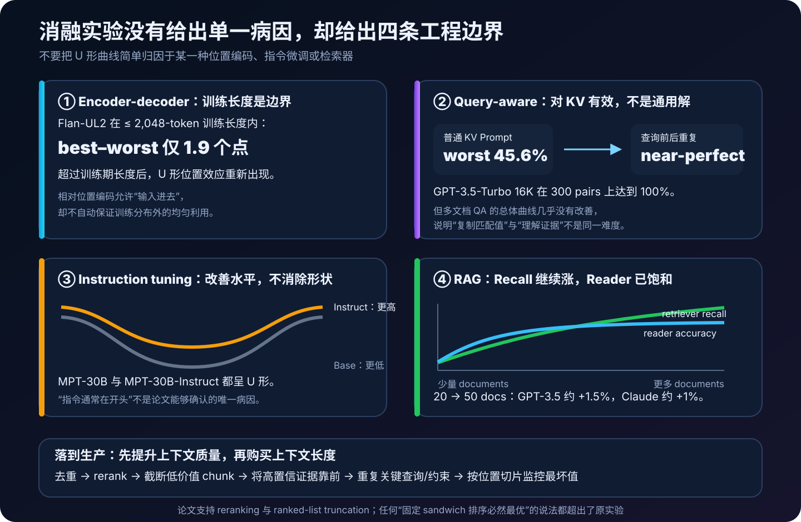

# Lost in the Middle 原理详解：上下文窗口很长，为什么关键信息仍会消失在中间


> **论文**：[Lost in the Middle: How Language Models Use Long Contexts](https://arxiv.org/abs/2307.03172)<br>
> **作者**：Nelson F. Liu、Kevin Lin、John Hewitt、Ashwin Paranjape、Michele Bevilacqua、Fabio Petroni、Percy Liang<br>
> **版本**：2023 年 arXiv 预印本；后正式发表于 TACL 2024，Volume 12，157–173<br>
> **关键词**：Long Context、Primacy Bias、Recency Bias、Multi-document QA、Key-value Retrieval、RAG、Position Robustness<br>
> **配套代码**：[lost_in_the_middle_minimal.py](./code/lost_in_the_middle_minimal.py)（零依赖教学实现；合成演示不是论文原始实验）<br>
> **一手资料**：[arXiv HTML](https://arxiv.org/html/2307.03172) · [PDF](https://arxiv.org/pdf/2307.03172) · [ACL Anthology](https://aclanthology.org/2024.tacl-1.9/) · [官方代码与数据](https://github.com/nelson-liu/lost-in-the-middle)

## 0. 先说结论

这篇论文追问了一个看似简单、实际长期被规格表掩盖的问题：

> 一个模型能够接收 4K、16K 甚至 100K tokens，是否意味着它能同样可靠地使用窗口里的每一个位置？

答案是否定的，至少对论文在 2023 年测试的模型与任务是如此。

作者没有把不同长度的任意文章直接塞给模型，而是做了一个很干净的**位置干预实验**：

1. 固定问题；
2. 固定包含答案的相关文档；
3. 固定其余干扰文档；
4. 只把相关文档从上下文开头逐步移动到中间、再移动到结尾；
5. 分位置测量回答准确率。

如果模型能稳健利用完整上下文，那么只要信息没有被截断，答案放在哪里都不应造成大幅变化。

实际却常出现一条 U 形曲线：

```text
相关信息在开头      相关信息在中间      相关信息在结尾
     较好        →       较差       →       回升
  primacy bias                             recency bias
```



以论文 20 文档设置中的 GPT-3.5-Turbo 为例：

| 金文档索引 | 0 | 4 | 9 | 14 | 19 |
|---:|---:|---:|---:|---:|---:|
| 准确率 | **75.8%** | 57.2% | **53.8%** | 55.4% | 63.2% |

从开头到中部下降 **22.0 个百分点**。更值得注意的是，中部最差值 53.8% 甚至低于不给任何文档时的 closed-book 准确率 56.1%。

论文又用一个几乎不需要语义推理的合成 key-value 任务做压力测试：给模型一个包含随机 UUID 键值对的 JSON，再要求返回指定 key 的 value。一些模型仍会在中部位置失败。这说明问题不能全部归咎于复杂问答或文档理解。

但这篇论文也经常被过度概括。准确结论不是：

```text
所有模型都永远看不见中间。
只要信息在中间，答案一定错误。
长上下文没有价值。
U 形曲线已经被证明由注意力机制单独造成。
```

而是：

> 标称窗口长度只是“允许输入多少”的接口容量；有效长上下文能力必须通过不同长度、不同位置、不同任务上的最坏性能来验证。

论文使用的是 GPT-3.5-Turbo 0613、Claude-1.3、MPT-30B-Instruct、LongChat-13B 等当时模型。今天评估新模型时，应该复用它的**控制实验思想**，而不是照搬旧排行榜。

一句话记忆：

> 不要只问“能塞多少 token”，要问“证据放在最不利的位置时，模型还能用对多少”。

---

## 1. 三种“上下文长度”不能混为一谈

### 1.1 标称上下文窗口：接口允许多少 token

模型规格通常给出最大上下文长度 $L_{\max}$：

$$
|x| + |y| \le L_{\max},
$$

其中 $x$ 是输入，$y$ 是待生成输出。

它回答的是工程问题：

```text
请求会不会因为 token 太多而被拒绝或截断？
```

它没有回答：

```text
模型能否在窗口所有位置稳定找到证据？
能否组合跨越很远的多条证据？
增加上下文是否真的提高最终正确率？
```

### 1.2 训练期序列长度：模型见过什么分布

一个模型可以在推理时接受比训练时更长的序列，例如通过：

- 相对位置表示；
- RoPE 缩放或插值；
- ALiBi；
- 稀疏或线性注意力；
- 额外的长序列适配训练。

但“数学上可以外推”不等于“训练出了均匀利用行为”。论文中的 Flan-UL2 就展示了这种边界：在不超过其训练期 encoder 长度的设置中位置较稳健，超过训练长度后又出现中部退化。

### 1.3 有效上下文长度：任务上真正能可靠使用多少

有效上下文不是单个固定数字，而更像一个条件函数：

$$
L_{\text{effective}}
=f(\text{model},\text{task},\text{prompt},\text{position},\text{distractors},\text{decode}).
$$

同一模型在以下任务上的有效长度可能完全不同：

- 从 JSON 精确复制一个 value；
- 在 20 篇文档中找到一篇并回答事实问题；
- 综合 10 份报告得出结论；
- 在长对话里恢复早期约束；
- 跨多个章节进行多跳推理。

因此，单独发布 $L_{\max}$，不能替代任务级验证。

---

## 2. 论文的核心识别策略：只移动相关信息

### 2.1 把位置变成可控变量

设：

- 问题为 $q$；
- 包含答案的金文档为 $g$；
- $k-1$ 篇干扰文档为 $D=\{d_1,\dots,d_{k-1}\}$；
- $\pi_p(g,D)$ 表示把 $g$ 放到索引 $p$ 后的文档序列。

对同一个问题构造：

$$
x_{q,k,p}
=\operatorname{Prompt}\bigl(q,\pi_p(g,D)\bigr),
\qquad p\in P_k.
$$

然后测量：

$$
A(p,k)=
\frac{1}{N}\sum_{i=1}^{N}
\mathbf{1}\left[
\operatorname{correct}\bigl(f(x_{i,k,p}),y_i\bigr)
\right].
$$

这里最重要的不是公式，而是**配对控制**：位置 $p=0$ 与 $p=9$ 使用同一批问题和同一批文档，差别主要来自顺序。

### 2.2 为什么不能比较两批不同问题

假设开头位置用简单事实题，中间位置用难题，那么：

$$
A(0,k)-A(k/2,k)
$$

同时混入了题目难度和位置效应。

论文通过移动同一金文档，把大量样本级差异抵消掉。复现时也应固定：

- 样本集合；
- distractor 集合；
- distractor 内部顺序；
- Prompt 模板；
- tokenizer 与 chat template；
- 解码参数；
- 模型快照。

### 2.3 两个实验轴必须同时扫描

论文控制两个变量：

1. **位置 $p$**：答案在第几篇文档或第几个 KV pair；
2. **长度 $k$**：上下文总共有多少文档或 KV pair。

只测固定 $k$ 的首、中、尾可以发现位置偏差；只增加 $k$ 可以发现长度退化。但完整诊断需要二维矩阵：

$$
\mathcal{A}=\{A(p,k):p\in P_k,\ k\in K\}.
$$

这也是论文最可复用的评测遗产。

---

## 3. 两个任务分别隔离了什么



### 3.1 多文档问答：找到、理解、生成

多文档 QA 要求模型：

1. 识别问题意图；
2. 在多篇文档中找到相关段落；
3. 抑制看似相关的 hard negatives；
4. 从金文档中抽取或推断答案；
5. 生成能命中标准答案的输出。

失败可能发生在任一环节。

### 3.2 Key-value retrieval：尽量只测找到与复制

KV 任务把自然语言语义尽可能拿掉：

```json
{
  "7dd8...": "a21f...",
  "38ae...": "d4b7...",
  "91c2...": "06ff..."
}
```

再询问：

```text
Key: "38ae..."
Corresponding value:
```

所有 key 与 value 都是随机 128-bit UUID：

- 几乎没有可利用的世界知识；
- 没有同义词或常识推理；
- 目标就是精确匹配与复制；
- 位置和长度可以严格控制。

如果模型连这里都在中部失败，那么“问题只是 QA 太难”就解释不通。

### 3.3 两个任务不能互相替代

KV 满分只证明一个非常窄的能力：

$$
\text{exact lookup} \neq \text{evidence understanding}.
$$

反过来，多文档 QA 失败也不能直接定位到检索，因为还包含理解、生成、参数记忆和答案歧义。论文用两个任务形成由简单到复杂的诊断阶梯。

---

## 4. 多文档 QA 数据是怎样构造的

### 4.1 题目来自 NaturalQuestions-Open

作者选择 NaturalQuestions-Open 中长答案是段落、而不是列表或表格的 **2,655** 个问题。

每个问题有：

- 人工标注的短答案；
- 包含答案的 Wikipedia 长答案段落；
- 可作为金文档的段落块。

文档被切为不超过约 100 tokens 的 passage。

### 4.2 金文档从人工标注取得

金文档 $g$ 不是由检索器猜出来的，而是直接取 NaturalQuestions 标注中包含答案的 Wikipedia 段落。

这让实验能够确定：

```text
完整上下文中一定存在一个预先知道的目标文档。
```

### 4.3 干扰文档不是随便抽的

作者使用在 MS MARCO 上微调的 Contriever 检索 Wikipedia，选出与问题高度相关、但不含 NQ 标准答案的 $k-1$ 篇 passage。

这类 distractor 是 hard negative：

- 主题可能相近；
- 词汇可能高度重合；
- 看起来像有答案；
- 比随机网页更接近真实 RAG 检索结果。

默认情况下，干扰文档按检索相关度从高到低排列；金文档再被插入指定位置。

### 4.4 位置网格

论文使用：

| 总文档数 $k$ | 金文档索引 $P_k$ |
|---:|---|
| 10 | 0、4、9 |
| 20 | 0、4、9、14、19 |
| 30 | 0、4、9、14、19、24、29 |

索引从 0 开始。index 0 是上下文最前端，index $k-1$ 是最末端。

### 4.5 论文怎样处理干扰项歧义

“不包含标注答案”不代表绝对不包含合理答案。例如 Wikipedia dump 时间戳与 NQ 标注时间可能不同。

作者做了三组稳健性检查：

1. 只保留已标注为无歧义的问题，结论相似；
2. 用随机 Wikipedia 文档替代 hard negatives，绝对准确率上升，但位置退化仍存在；
3. 随机打乱 distractor，并在 Prompt 中明确说明随机顺序，仍观察到 U 形趋势。

所以，论文的现象不能简单解释为“模型默认搜索结果按相关度排序”。

---

## 5. Prompt 与指标：实验看似简单，细节很敏感

### 5.1 多文档 QA Prompt

官方模板的结构是：

```text
Write a high-quality answer for the given question using only the provided
search results (some of which might be irrelevant).

Document [1] (Title: ...) ...
Document [2] (Title: ...) ...
...

Question: {question}
Answer:
```

文档拥有显式编号与标题。问题在普通模板中位于文档之后。

### 5.2 为什么 chat template 也属于实验变量

同一文本经过不同接口可能变成：

```text
system + user + assistant prefix
```

或：

```text
[INST] instruction + documents + question [/INST]
```

这会改变：

- 绝对 token 位置；
- 特殊 token；
- 指令离答案的距离；
- 模型在训练中熟悉的格式。

因此，今天重新运行不能只写“使用同样问题”，还要保存最终送入模型的序列。

### 5.3 论文使用贪心解码

主要实验使用 greedy decoding。这样可以减少采样噪声，让位置差异更容易归因于输入变化。

如果用随机采样，应至少：

- 固定 seed；
- 每个位置重复多次；
- 报告均值与置信区间；
- 保证每个位置使用相同采样协议。

### 5.4 准确率是答案子串命中

论文判断任一 NQ 标准答案是否出现在模型输出中。简化表示为：

$$
\operatorname{correct}(\hat y,Y)
=\mathbf{1}\left[
\exists y\in Y:\operatorname{norm}(y)
\subseteq \operatorname{norm}(\hat y)
\right].
$$

优点是便宜、确定、适合大规模比较。缺点也明显：

- 包含答案字符串但语义否定，也可能误判正确；
- 很短的答案可能误命中；
- 正确释义但未出现标准字符串，可能误判错误；
- 不评价引用、解释质量和幻觉。

因此这里测的是一个便于控制的 QA proxy，不是完整回答质量。

---

## 6. Closed-book 与 Oracle：给位置曲线装上上下界

### 6.1 Closed-book 测参数记忆

不给任何文档，只给问题：

$$
A_{\text{closed}}
=\operatorname{Acc}(f(q),Y).
$$

它回答：即使不用检索，模型自己能答对多少？

### 6.2 Oracle 测单文档 reader 上限

只给包含答案的金文档：

$$
A_{\text{oracle}}
=\operatorname{Acc}(f(q,g),Y).
$$

它避免 distractor 和长上下文，近似测“已找到正确段落后，模型能否使用”。

### 6.3 论文报告的基线

| 模型 | Closed-book | Oracle |
|---|---:|---:|
| LongChat-13B (16K) | 35.0% | 83.4% |
| MPT-30B-Instruct | 31.5% | 81.9% |
| GPT-3.5-Turbo | 56.1% | 88.3% |
| GPT-3.5-Turbo (16K) | 56.0% | 88.6% |
| Claude-1.3 | 48.3% | 76.1% |
| Claude-1.3 (100K) | 48.2% | 76.4% |

对 GPT-3.5-Turbo：

```text
Oracle 88.3%：知道正确段落在哪时，模型多数能用。
中部 53.8%：加入 19 篇干扰文档并把证据放中间后，大量优势消失。
Closed-book 56.1%：最差中部甚至没有“什么文档都不给”好。
```

这比只展示一条 U 形曲线更有诊断力：问题不是纯粹“模型不知道答案”，而是上下文组织让可用证据没有转化成正确输出。

---

## 7. 测了哪些模型，输入到底有多长

### 7.1 主要 decoder-only 模型

| 模型 | 标称窗口 | 论文备注 |
|---|---:|---|
| MPT-30B-Instruct | 8,192 | 先以 2,048 序列预训练，再做 8,192 长度适配；ALiBi |
| LongChat-13B (16K) | 16,384 | 从 LLaMA-13B 的 2,048 扩展；condensed RoPE |
| GPT-3.5-Turbo 0613 | 4K | 闭源 API |
| GPT-3.5-Turbo-16K 0613 | 16K | 上述模型的扩窗版本 |
| Claude-1.3 | 8K | 闭源 API |
| Claude-1.3 (100K) | 100K | 上述模型的扩窗版本 |

附录还测试了：

- GPT-4 8K 的 500 条、20 文档子集；
- Llama-2 7B、13B、70B 的 base 与 chat 版本；
- Flan-T5-XXL 与 Flan-UL2 等 encoder-decoder 模型；
- MPT-30B base，用于分析 instruction tuning。

### 7.2 GPT-4 为什么没有跑完整矩阵

作者估算，完整运行 GPT-4 的多文档 QA 与 KV 实验成本会超过 6,000 美元，因此只在 500 个随机问题、20 文档设置上测试 GPT-4 8K。

结果是绝对准确率更高，但仍出现首尾较好、中部较差的曲线。

### 7.3 多文档 QA 的实际 token 数

论文附录给出 GPT-3.5/Claude tokenizer 下的输入统计：

| 设置 | 平均 tokens | 最大 tokens |
|---|---:|---:|
| 10 docs | 1,475.6 | 1,960 |
| 20 docs | 2,946.2 | 3,920 |
| 30 docs | 4,419.2 | 6,101 |

所以多文档 QA 并不是在 100K 极限附近测试，而是在约 1.5K–6K token 范围内发现明显位置效应。

### 7.4 KV 任务更接近长窗口压力测试

GPT-3.5/Claude tokenizer 下：

| KV 数量 | 平均 tokens | 最大 tokens |
|---|---:|---:|
| 75 | 3,768.7 | 3,844 |
| 140 | 6,992.8 | 7,088 |
| 300 | 14,929.4 | 15,048 |

不同 tokenizer 会产生不同长度。例如 LongChat 在 300 pairs 下平均超过 21K，已经超出其 16K 标称窗口，因此并非每个模型都能覆盖每个设置。

---

## 8. 主要结果：一条平均分会掩盖什么



### 8.1 20 文档完整结果

| 模型 | index 0 | index 4 | index 9 | index 14 | index 19 |
|---|---:|---:|---:|---:|---:|
| Claude-1.3 | 59.9 | 55.9 | 56.8 | 57.2 | 60.1 |
| Claude-1.3 (100K) | 59.8 | 55.9 | 57.0 | 57.4 | 60.0 |
| GPT-3.5-Turbo | **75.8** | 57.2 | **53.8** | 55.4 | 63.2 |
| GPT-3.5-Turbo (16K) | **75.7** | 57.3 | **54.1** | 55.4 | 63.1 |
| MPT-30B-Instruct | 53.7 | 51.8 | 52.2 | 52.7 | 56.3 |
| LongChat-13B (16K) | **68.6** | 57.4 | 55.3 | **52.5** | 55.0 |

### 8.2 “U 形”不要求左右完全对称

LongChat 的末尾性能没有恢复到开头水平；MPT 的变化也比较平缓。因此 U 形描述的是总体模式：

$$
A(\text{middle})
< A(\text{beginning})
\quad\text{且经常}\quad
A(\text{middle})<A(\text{end}),
$$

不是要求每个模型画出完美对称的数学抛物线。

### 8.3 长度增加会放大某些模型的谷底

GPT-3.5-Turbo (16K) 在 30 文档设置中：

| index | 0 | 4 | 9 | 14 | 19 | 24 | 29 |
|---:|---:|---:|---:|---:|---:|---:|---:|
| accuracy | 73.4 | 55.1 | **50.5** | 50.9 | 51.8 | 54.9 | 63.7 |

开头到最差位置相差 22.9 个点。MPT-30B-Instruct 在相同设置变化较小，但绝对准确率也更低。

### 8.4 平均数为什么危险

假设五个位置准确率为：

$$
[75.8,57.2,53.8,55.4,63.2].
$$

均值约为：

$$
\bar A=61.08\%.
$$

它没有告诉你：

- 最佳位置是 75.8%；
- 最差位置只有 53.8%；
- 生产请求的证据位置分布是否与测试一致；
- 中部失败是否会集中在某类高风险文档。

长上下文模型至少应同时报告 mean、worst、best–worst gap 和位置曲线。

---

## 9. 扩大窗口为什么没有自动改善利用率

### 9.1 4K 与 16K 版本几乎重合

在 10、20 文档输入都能被两个 GPT-3.5 版本容纳时，它们的位置曲线几乎重合。例如 20 文档：

```text
GPT-3.5 4K : 75.8, 57.2, 53.8, 55.4, 63.2
GPT-3.5 16K: 75.7, 57.3, 54.1, 55.4, 63.1
```

Claude-1.3 8K 与 Claude-1.3 100K 也呈同样现象。

### 9.2 扩窗解决的是 admissibility

扩窗首先改变：

$$
\mathbf{1}[|x|\le L_{\max}],
$$

也就是输入是否被系统接受。

它未必改变：

$$
P(\text{correct}\mid |x|,p,\text{distractors}).
$$

要改善后者，可能还需要：

- 足量、位置多样的长序列训练；
- 能覆盖中部证据的监督任务；
- 更适合长距离信息选择的架构；
- query-aware contextualization；
- 更好的检索、重排与上下文压缩；
- 任务特定推理策略。

### 9.3 不应从结果反推出两个 API 后端完全相同

曲线相近能支持：扩窗版本在这些可共同容纳的输入上没有明显改善位置利用。

它不能证明：

- 两个服务内部权重完全一样；
- 扩窗方法只是简单改配置；
- 更长输入上的行为也完全一样；
- 所有未来扩窗模型都不会改善。

---

## 10. Key-value retrieval：连“查字典”也会丢

### 10.1 数据生成

每个样本包含：

$$
\mathcal{K}=\{(k_1,v_1),\dots,(k_n,v_n)\},
$$

所有 $k_i$、$v_i$ 都是唯一随机 UUID。给定目标 key $k_j$，期望输出 $v_j$。

作者测试：

| KV pairs | 每个设置样本数 |
|---:|---:|
| 75 | 500 |
| 140 | 500 |
| 300 | 500 |

位置同样覆盖首、四分之一、中点、四分之三、末尾等点。

### 10.2 这不是传统意义上的复杂推理

理想算法只是：

```python
value = json_object[target_key]
```

没有知识检索，没有多跳，没有同义词消歧。随机 UUID 还降低了语言模式带来的混杂。

### 10.3 模型表现并不一致

- Claude-1.3 与 100K 版本在测试设置上接近满分；
- GPT-3.5、MPT-30B-Instruct 在长设置和中部位置明显退化；
- LongChat-13B 的行为不同，有时会生成检索代码，而不是直接返回 value；
- 一些模型继续表现出首尾高、中部低。

官方实验文档给出的 MPT-30B-Instruct、140 pairs 示例结果是：

| index | 0 | 34 | 69 | 104 | 139 |
|---:|---:|---:|---:|---:|---:|
| accuracy | 100.0 | 93.6 | 88.6 | 80.4 | 96.2 |

它不完全对称，最差点也不必恰好落在正中央；关键仍是位置变化造成大幅波动。

### 10.4 KV 任务仍有局限

它更像 needle lookup，而不是完整长上下文理解：

- 只需一条局部证据；
- 不需跨文档组合；
- 不需摘要与全局一致性；
- 格式高度规律；
- 指定 key 本身提供强 lexical anchor。

因此 KV 应作为必要但不充分的底线测试。

---

## 11. Query-aware contextualization：为什么重复问题会有帮助

### 11.1 Decoder-only 的方向性

普通 Prompt 是：

```text
[documents / JSON]
[query]
[answer prefix]
```

在 decoder-only Transformer 中，靠前的文档 token 被计算时不能看到后面才出现的 query。它们的表征不是针对当前问题构造的。

作者尝试把 query 放在数据前后各一次：

```text
[query]
[documents / JSON]
[query]
[answer prefix]
```

这样文档 token 在因果注意力下至少能看到前置 query，而生成答案时又能看到末尾 query。

### 11.2 对 KV 的改善非常大

普通 Prompt 的最坏准确率低到 45.6%；使用 query-aware contextualization 后：

- 所有模型在 75、140、300 pairs 设置上都接近满分；
- GPT-3.5-Turbo 16K 在 300 pairs 设置达到 100%。

这说明 Prompt 中信息出现的先后顺序本身就能改变有效检索。

### 11.3 对多文档 QA 几乎没有解决问题

相同技巧对多文档 QA 的整体趋势影响很小：

- 金文档在最前时略有改善；
- 其他位置略有下降；
- 中部退化没有因此消失。

KV 只需精确定位字符串，而 QA 还需：

$$
\text{select evidence}
+\text{understand}
+\text{resolve distractors}
+\text{generate answer}.
$$

所以“把问题重复两次”是便宜的探针和局部优化，不是通用长上下文算法。

---

## 12. 架构、训练长度、指令微调与规模



### 12.1 Encoder-decoder 在训练长度内更稳健

论文比较 Flan-T5-XXL 与 Flan-UL2。Encoder 可以对输入做双向 contextualization，因此不同位置的信息可能更容易结合 query。

Flan-UL2 在不超过其 2,048-token 训练期 encoder 长度时：

$$
\max_p A(p)-\min_p A(p)=1.9\text{ 个百分点}.
$$

但当输入超过训练长度，U 形曲线再次出现。Flan-T5-XXL 也呈类似趋势。

结论不是“encoder-decoder 天生免疫”，而是：

> 架构与 query-aware 表征可能提高位置稳健性，但训练长度外推仍然困难。

### 12.2 Instruction tuning 不是唯一病因

一种直觉是：指令微调数据常把指令放开头，所以模型学会偏爱开头。

作者比较 MPT-30B base 与 MPT-30B-Instruct，发现两者都有 U 形曲线。Instruction tuning 提高了绝对表现，却没有创造或消除这一总体形状。

因此不能把问题完全归咎于 SFT 格式。

### 12.3 Llama-2 暗示规模与曲线形状有关

附录中的 Llama-2：

- 7B base/chat 主要表现为 recency bias；
- 13B、70B 开始同时出现 primacy 与 recency；
- 13B base 的 best–worst 差约 20 点；
- chat 微调把 13B 的最坏退化缩小到约 10 点，但没有消失；
- 70B 的 base/chat 位置趋势相近。

这提示“U 形”可能是模型获得某种开头使用能力后形成的，而非所有规模从一开始都呈相同曲线。

### 12.4 论文没有完成因果机制证明

这些是 preliminary investigations。它们排除或削弱了一些简单解释，却没有严格证明：

```text
具体哪一层、哪一个 head、哪一种位置表示导致了中部退化？
训练数据位置分布贡献多少？
优化与架构各自贡献多少？
模型输出失败是没找到、没理解，还是生成时被覆盖？
```

后续工作可以分析注意力、激活、logit lens 或因果干预，但不能把后续解释倒灌成这篇论文已经证明的结论。

---

## 13. “更多上下文总是更好”为什么不成立

### 13.1 受控实验与真实 RAG 的差别

前面的受控 QA 保证：

```text
上下文里恰好有 1 篇已知金文档。
```

真实 open-domain QA 中，top-$k$ 检索结果可能：

- 一个答案文档都没有；
- 有一篇；
- 有多篇重复或互补证据；
- 出现互相冲突的版本；
- 随 $k$ 增大加入越来越多低质量文档。

所以增加 $k$ 同时产生收益和成本。

### 13.2 Retriever recall 与 Reader accuracy 是两条曲线

令：

$$
R(k)=P(\text{top-}k\text{ 至少包含答案}),
$$

$$
Q(k)=P(\text{reader 最终回答正确}).
$$

检索器通常满足 $R(k+1)\ge R(k)$，因为增加文档不会让已经找到的答案消失。

但 $Q(k)$ 不必单调：

$$
Q(k+1)-Q(k)
=\underbrace{\text{新增证据收益}}_{\ge 0}
-\underbrace{\text{干扰、位置、成本与截断损失}}_{\ge 0}.
$$

### 13.3 论文的 NaturalQuestions-Open case study

作者让检索器返回不同数量的 Wikipedia 文档，再测 GPT-3.5-Turbo 与 Claude-1.3 的回答准确率。

结果：

- retriever recall 继续随 $k$ 增长；
- reader accuracy 很早就趋于饱和；
- 从 20 篇增到 50 篇，GPT-3.5-Turbo 只提升约 1.5%；
- Claude-1.3 只提升约 1%；
- 输入 token、延迟与成本却显著增加。

这不是说最优 $k$ 永远等于 20。它说明 $k$ 是模型、任务、检索器和成本共同决定的超参数，不能简单设置成窗口允许的最大值。

### 13.4 先提高上下文密度，再扩大长度

论文由此建议两个方向：

1. **reranking**：把更可能相关的文档推到前面；
2. **ranked-list truncation**：低边际价值时少给一些文档。

生产系统还可以加入：

- 去重与近重复聚类；
- passage 合并；
- query decomposition；
- metadata filter；
- citation-aware evidence extraction；
- 冲突检测；
- 先抽取再综合的分阶段阅读。

核心目标是提高：

$$
\text{context density}
=\frac{\text{与决策相关且可验证的信息量}}
{\text{输入 tokens}}.
$$

---

## 14. 怎样把位置稳健性变成可报告指标

论文主要报告每个位置的 accuracy 曲线。下面几项是基于论文协议的工程诊断量；除 accuracy 外，它们不是论文命名的官方新指标。

### 14.1 位置均值

$$
\bar A(k)=\frac{1}{|P_k|}\sum_{p\in P_k}A(p,k).
$$

适合总体概括，但不能单独使用。

### 14.2 最坏位置

$$
A_{\min}(k)=\min_{p\in P_k}A(p,k).
$$

对高风险系统，最坏位置通常比平均值更重要。

### 14.3 Best–worst gap

$$
\Delta_{\text{pos}}(k)
=\max_{p}A(p,k)-\min_{p}A(p,k).
$$

理想的长上下文模型应在提高整体准确率的同时压低 $\Delta_{\text{pos}}$。

### 14.4 Edge–middle penalty

若最前、最后位置为 $p_f,p_l$，中点为 $p_m$：

$$
\Delta_{\text{mid}}
=\frac{A(p_f,k)+A(p_l,k)}{2}-A(p_m,k).
$$

GPT-3.5 的 20 文档结果：

$$
\Delta_{\text{mid}}
=\frac{75.8+63.2}{2}-53.8
=15.7\text{ 点}.
$$

### 14.5 Worst-over-best ratio

$$
R_{\text{pos}}(k)
=\frac{\min_p A(p,k)}{\max_p A(p,k)}.
$$

越接近 1 越稳健。它在不同绝对能力模型之间比差值更易比较，但当最佳准确率很低时可能显得虚高，因此必须和绝对准确率一起报告。

### 14.6 Oracle utilization gap

还可以比较 oracle 与每个位置：

$$
G_{\text{oracle}}(p,k)
=A_{\text{oracle}}-A(p,k).
$$

它表示“明明证据存在，但加入上下文组织与干扰后损失了多少”。

### 14.7 不确定性与配对统计

位置扫描使用同一批问题，应该保留配对关系。可以按问题做 paired bootstrap：

1. 从 $N$ 个问题有放回抽样；
2. 同一 bootstrap 样本同时计算所有位置；
3. 得到 $A(p)$、$\Delta_{\text{pos}}$ 的分布；
4. 报告 95% 区间。

不要把每个位置当成完全独立的两批样本，否则会浪费配对控制带来的统计效率。

---

## 15. 教学代码：一个零依赖的位置扫描器

完整代码见：[lost_in_the_middle_minimal.py](./code/lost_in_the_middle_minimal.py)。

它实现：

- 多文档 QA 的金文档位置插入；
- 普通与 query-aware Prompt；
- UUID key-value 数据生成；
- 多位置成对扫描；
- 答案子串命中；
- best–worst、edge–middle 等诊断；
- rerank + deduplicate + truncate 骨架；
- 明确标注的合成 edge-biased mock model。

### 15.1 固定 distractor，只移动 gold

```python
def place_gold_document(case, total_documents, gold_index):
    documents = list(case.distractors[: total_documents - 1])
    documents.insert(gold_index, case.gold)
    return documents
```

这里不能为每个位置重新检索，因为重新检索会同时改变 distractor，破坏位置干预。

### 15.2 生成 query-aware KV Prompt

```python
def build_kv_prompt(case, query_aware=False):
    serialized = json.dumps(dict(case.records), indent=2)
    if query_aware:
        return (
            f'Key: "{case.key}"\nJSON data:\n{serialized}'
            f'\nKey: "{case.key}"\nCorresponding value:'
        )
    return f'JSON data:\n{serialized}\nKey: "{case.key}"\nCorresponding value:'
```

### 15.3 扫描位置

```python
curve = evaluate_kv_sweep(
    num_pairs=75,
    positions=(0, 18, 37, 56, 74),
    num_examples=200,
    predict=real_model,
    query_aware=False,
)
```

真实适配器只需满足：

```python
Callable[[str], str]
```

即输入最终 Prompt，返回模型文本。

### 15.4 运行

```bash
python3 papers/to-2026/code/lost_in_the_middle_minimal.py
```

输出首先打印论文报告的 GPT-3.5 20 文档曲线：

```text
index=0   accuracy=75.8%
index=4   accuracy=57.2%
index=9   accuracy=53.8%
index=14  accuracy=55.4%
index=19  accuracy=63.2%
```

随后打印合成 mock model 的普通与 query-aware 曲线。

### 15.5 合成模型为什么必须醒目标注

`EdgeBiasedMockModel` 人工定义了一条 U 形成功概率，只用于证明：

- 数据生成器能否工作；
- 位置扫描是否配对；
- 指标计算是否正确；
- 图表管道能否接真实输出。

它不是论文模型，不是实证结果，也不能用来评价任何 API。代码中论文真实数值与模拟结果使用不同常量和输出前缀，避免混淆。

### 15.6 接入真实模型时还要记录什么

至少保存：

```json
{
  "model": "exact-version-id",
  "prompt_hash": "...",
  "tokenizer": "...",
  "chat_template": "...",
  "gold_index": 9,
  "num_documents": 20,
  "input_tokens": 2941,
  "max_output_tokens": 100,
  "temperature": 0,
  "raw_output": "...",
  "normalized_correct": false
}
```

没有这些字段，位置曲线出现变化时很难判断是模型改善，还是模板、截断或服务版本改变。

---

## 16. 官方代码怎样复现

官方仓库：[nelson-liu/lost-in-the-middle](https://github.com/nelson-liu/lost-in-the-middle)。

### 16.1 安装

论文仓库基于 Python 3.9：

```bash
git clone https://github.com/nelson-liu/lost-in-the-middle.git
cd lost-in-the-middle
conda create -n lost-in-the-middle python=3.9 --yes
conda activate lost-in-the-middle
pip install -e .
```

正式复现应记录 commit，而不是永远跟随 `main`。

### 16.2 数据目录

仓库包含：

```text
qa_data/                 多文档 QA 数据
kv_retrieval_data/       UUID 键值数据
scripts/                 生成、推理、评分脚本
src/lost_in_the_middle/  Prompt 与数据结构
EXPERIMENTS.md           具体运行命令
```

QA 数据每行保存 question、answers、ctxs、gold annotation 等；KV 数据保存有序 `[key,value]` 列表、目标 key 与期望 value。

### 16.3 重新生成 20 文档位置数据

官方 README 的思路是先下载 Contriever 检索结果，再执行：

```bash
for gold_index in 0 4 9 14 19; do
  python -u scripts/make_qa_data_from_retrieval_results.py \
    --input-path nq-open-contriever-msmarco-retrieved-documents.jsonl.gz \
    --num-total-documents 20 \
    --gold-index ${gold_index} \
    --output-path qa_data/nq-open-20_total_documents_gold_at_${gold_index}.jsonl.gz
done
```

### 16.4 生成 KV 数据

```bash
python -u scripts/make_kv_retrieval_data.py \
  --num-keys 300 \
  --num-examples 500 \
  --output-path kv_retrieval_data/kv-retrieval-300_keys.jsonl.gz
```

运行模型时再用 `--gold-index` 把同一目标 pair 移到指定位置。

### 16.5 资源要求

官方 `EXPERIMENTS.md` 说明主要开放模型实验运行在一张或多张 80GB A100 上；Llama-2-70B 示例需要两张 80GB GPU。

这不是说所有复现都必须用同样硬件，而是：

- batch size；
- tensor parallel；
- quantization；
- attention kernel；
- 最大内存与截断策略

都可能影响可运行长度和可比性，需要记录。

### 16.6 今天无法原样重放所有闭源实验

GPT-3.5-Turbo 0613、Claude-1.3 等历史端点可能已经不可用或行为漂移。使用当前同名/近似模型只能得到“在相同协议上的新实验”，不能宣称精确复现 2023 API 输出。

可重复性应分两层：

1. **protocol reproduction**：重建数据、位置、Prompt、指标；
2. **output reproduction**：对同一权重或冻结 API 快照得到相同输出。

闭源服务通常只能较好满足第一层。

---

## 17. 把结论落到生产 RAG

### 17.1 分开监控 Retriever 与 Reader

至少记录三层指标：

| 层 | 指标示例 | 回答什么 |
|---|---|---|
| Retrieval | Recall@k、MRR、NDCG | 证据有没有被找到、排在哪里 |
| Context utilization | accuracy by gold position、citation recall | 找到后 reader 能不能用 |
| End-to-end | answer accuracy、groundedness、abstention | 用户最终得到什么 |

如果 Recall@50 很高、最终准确率不涨，继续优化检索召回可能不是当前瓶颈。

### 17.2 Rerank 后再决定 $k$

推荐流程：

```text
query
  → broad retrieval
  → metadata filter
  → deduplicate / cluster
  → cross-encoder or LLM rerank
  → token-budgeted truncation
  → reader
```

不要把向量库返回顺序未经检验地直接拼接到最大窗口。

### 17.3 把高置信证据靠前，但不要迷信固定模板

论文直接支持的是：相关信息靠前通常更好，因此有效 reranking 有前景。

它没有证明：

```text
把第二重要文档固定放最后形成“sandwich”一定最优。
```

末尾也可能受益于 recency，但末尾还承担：

- 用户问题；
- 输出格式；
- 安全约束；
- 当前对话轮次。

最优排布应在自己的模型和任务上做位置 A/B，而不是把 U 形曲线机械翻译成固定顺序。

### 17.4 先抽取，再综合

面对很多文档，可以将一次大 Prompt 拆成：

1. 每个 chunk 独立提取与问题相关的证据；
2. 验证引用与来源；
3. 去重、聚类、发现冲突；
4. 只把压缩证据交给最终 synthesis。

这把长上下文问题转换为多次较短、可验证的上下文问题，但会增加调用次数与错误传播，需要独立评估。

### 17.5 Query-aware Prompt 是低成本基线

可以尝试把关键查询、输出格式或判定条件在材料前后重复：

```text
任务与问题
材料
任务与问题的简短重述
回答前缀
```

但必须比较：

- lookup；
- single-document QA；
- multi-document synthesis；
- 不同长度；
- 不同模型。

论文已经显示它在 KV 上极强、在 QA 上有限。

### 17.6 检索文档可能包含 Prompt Injection

位置影响也会作用于恶意文档。将不可信网页靠近高影响位置，可能放大其中的伪指令。

生产系统应：

- 明确区分 instruction 与 evidence；
- 对文档做来源标记和转义；
- 禁止检索内容覆盖系统权限；
- 让回答引用证据；
- 对高风险动作使用结构化验证器，而不是只依赖长 Prompt。

---

## 18. 今天怎样设计一个更完整的长上下文评测

### 18.1 长度轴

不要只测“最大窗口”：

```text
1K → 2K → 4K → 8K → 16K → 32K → ...
```

应覆盖：

- 训练长度以内；
- 训练长度附近；
- 扩窗区间；
- 最大可接受长度附近。

### 18.2 位置轴

至少包含：

```text
0%, 10%, 25%, 50%, 75%, 90%, 100%
```

文档索引和 token 百分位都应记录。等文档索引不等于等 token 位置，因为 passage 长度不同。

### 18.3 干扰难度轴

分层构造：

- random negatives；
- lexical hard negatives；
- semantic hard negatives；
- 含过时答案的冲突文档；
- 恶意 instruction-like 文档；
- 重复证据；
- 同主题但回答另一问题的文档。

### 18.4 任务轴

单针检索不够。至少包括：

| 能力 | 任务例子 |
|---|---|
| 精确 lookup | UUID key-value |
| 单证据 QA | 一篇金文档 + distractors |
| 多跳组合 | 两篇或更多文档共同给答案 |
| 全局聚合 | 对所有记录计数、比较、求趋势 |
| 长文摘要 | 保留跨章节事实与立场 |
| 长对话状态 | 恢复早期约束并处理最新修改 |
| 长代码理解 | 跨文件调用链与变量追踪 |

### 18.5 多证据的位置组合

若需要两条证据 $g_1,g_2$，应扫描：

$$
(p_1,p_2)\in
\{\text{front,middle,end}\}^2.
$$

它能区分：

- 两条都在中部；
- 一条开头、一条结尾；
- 距离很远；
- 顺序颠倒。

这比单 needle 更接近真实综合任务。

### 18.6 报告完整矩阵，不造“万能长上下文分数”

一个总分会把模型间的不同失败模式抹平。推荐报告：

- 每任务、每长度、每位置曲线；
- mean 与 worst；
- best–worst gap；
- oracle gap；
- token、延迟、成本；
- 引用正确率与拒答率；
- bootstrap 区间。

---

## 19. 复现中最容易踩的坑

### 19.1 输入其实被静默截断

必须验证：

$$
|\text{system}|+|\text{prompt}|+|\text{reserved output}|
\le L_{\max}.
$$

SDK、推理服务和 tokenizer 可能在不同层截断。若结尾文档被裁掉，测到的是 truncation，不是位置偏差。

### 19.2 用文档索引代替 token 位置

第 10 篇文档未必在 50% token 位置。应同时记录：

- gold document index；
- gold start token；
- gold end token；
- 相对 token 百分位。

### 19.3 每个位置重新抽 distractor

这会破坏配对实验。正确方式是先冻结样本，再只做稳定插入。

### 19.4 Chat template 改变了首尾

一些框架自动把 system prompt 放开头，把 assistant 前缀放结尾。所谓“index 0”也许离真正序列开头还有大量 token。报告最终序列，而不是抽象模板。

### 19.5 问题本身泄露答案

合成任务必须保证 key/value 唯一，QA distractor 也应检查是否包含别名答案。否则模型可能绕过金文档。

### 19.6 Substring EM 被否定句欺骗

输出：

```text
答案不是 Paris，而是 Lyon。
```

仍包含 `Paris`。高风险复现可补充结构化短答案、LLM judge 或人工抽检，但必须保留与原论文可比的原指标。

### 19.7 模型版本与服务漂移

同一别名可能指向不同权重。保存：

- provider 返回的 model id；
- 日期；
- region；
- API 参数；
- system fingerprint（若有）；
- 原始输出。

### 19.8 把 context overflow 当作错误样本

某模型无法容纳 300 pairs 时，应标记 unsupported，而不是计为答错。窗口容量与窗口利用是两个不同维度。

### 19.9 只跑一个 Prompt

Query-aware 结果证明模板会显著改变 KV。更稳妥的做法是固定一个主协议，再用少量预注册的模板变体做鲁棒性检查，避免事后挑最好结果。

### 19.10 测试集污染与记忆

NQ 问题可能已进入预训练数据，因此必须保留 closed-book。否则无法区分模型从文档作答还是从参数记忆作答。

---

## 20. 论文的局限与适用边界

### 20.1 主要模型来自 2023 年

论文不能直接说明更新架构、长上下文训练和推理策略在 2026 年的表现。它提供的是测试协议与历史证据。

### 20.2 多文档 QA 只有一篇金文档

真实任务经常需要：

- 多条证据；
- 全局聚合；
- 时间顺序；
- 冲突解决；
- 长距离关系推理。

单金文档任务可能低估这些难度。

### 20.3 语言与领域有限

NaturalQuestions/Wikipedia 主要是英文开放域事实问答。法律合同、医学记录、中文长文、代码库和多轮对话可能有不同位置行为。

### 20.4 QA 上下文没有逼近所有模型的极限

QA 平均约 1.5K–4.4K tokens；KV 才到约 15K。它能证明“即使远未到 100K 上限也可能失败”，但不能完整刻画 100K 内每个位置。

### 20.5 指标只检查答案出现

它不评估：

- 解释质量；
- 证据引用；
- 事实一致性；
- 多余幻觉；
- 安全性；
- 对冲突证据的校准。

### 20.6 机制分析是初步的

论文比较了架构、query placement、instruction tuning 与规模，却没有完成神经机制层面的因果定位。

### 20.7 U 形不是每个模型的唯一形状

7B Llama-2 更像单纯 recency bias；Claude 在某些设置变化较平；LongChat 的曲线也不对称。正确说法是“经常观察到首尾优势和中部退化”，不是“所有模型必然画出完美 U”。

### 20.8 2023 与 2024 的年份容易混淆

论文在 2023 年以 arXiv 形式公开，版本号通常按 Lost in the Middle (2023) 引用；正式期刊版本发表于 TACL 2024。写作时应说明采用哪种年份口径。

---

## 21. 常见误解

### 误解一：上下文窗口 100K，说明模型能记住 100K

窗口表示请求可容纳；“记住、定位、理解、组合”需要任务级验证。

### 误解二：中部 token 完全没有被注意

论文测的是输出任务准确率，不是逐 token 注意力为零。失败也可能来自选择、理解或生成。

### 误解三：U 形曲线已经证明由注意力机制导致

论文观察相关现象并做消融，没有完成唯一因果机制证明。

### 误解四：把问题在前后各写一次就解决了

它几乎解决合成 KV，但没有解决多文档 QA 的总体位置退化。

### 误解五：更多检索文档一定提高 RAG

Recall 往往提高，最终 reader accuracy 可能很早饱和，甚至下降。

### 误解六：把重要文档放最后总是最好

论文常看到 recency recovery，但开头往往更强，而且生产 Prompt 末尾还有问题、格式和约束。需要实测。

### 误解七：长窗口模型一定比短窗口版本更会用上下文

在两者都能容纳的输入上，论文中的扩窗版本曲线几乎与普通版本重合。

### 误解八：KV retrieval 代表完整长上下文理解

它只是一条最小检索探针，不测综合、冲突或多跳。

### 误解九：一个平均准确率足够比较模型

均值会隐藏最坏位置和曲线形状。至少同时报告 worst 与 best–worst gap。

### 误解十：论文证明今天所有模型仍然 Lost in the Middle

论文证明当时多种模型存在问题，并给出未来模型应如何测试。新模型必须重新跑协议。

### 误解十一：位置偏差只影响 RAG

任何长输入都可能受影响：对话历史、代码库、日志、合同、论文、Agent memory 与工具输出。

### 误解十二：只要没有截断，失败就和长度无关

输入能完整进入窗口只是必要条件。干扰密度、训练分布与位置都可能随长度改变。

---

## 22. 这篇论文真正留下了什么

### 22.1 把“长上下文能力”从规格变成行为测量

过去常用最大窗口代表长上下文能力。论文把问题改写为：

$$
\text{position} \times \text{length} \times \text{task}
\longrightarrow \text{accuracy matrix}.
$$

这是比单个数字更诚实的定义。

### 22.2 建立了位置干预范式

同一证据、同一干扰项、只改变位置，成为后来长上下文评测和 needle-in-a-haystack 诊断的重要模板。

### 22.3 连接了模型研究与 RAG 工程

论文没有只说“模型有偏差”，还指出：

- rerank；
- truncate；
- 不要盲目最大化 $k$；
- 区分 retriever recall 与 reader accuracy。

这些建议直接影响 RAG pipeline 设计。

### 22.4 证明简单探针与真实任务必须并存

KV 能隔离 lookup，QA 能覆盖语义与生成。只用前者会高估能力，只用后者又难定位失败。

### 22.5 提醒我们“最坏位置”是产品属性

生产文档不会总把关键证据放在最有利位置。一个只有首尾高分的模型，在随机文档顺序下体验可能很不稳定。

真正可靠的长上下文系统，需要减少：

$$
\operatorname{Var}_{p}\left[A(p,k)\right]
$$

并提高 $A_{\min}(k)$。

---

## 23. 阅读、复现与上线检查清单

### 数据构造

- [ ] 同一问题的所有位置共享完全相同的 distractors；
- [ ] 金文档只有位置变化；
- [ ] 检查 distractor 是否含答案别名；
- [ ] 保存文档 index 与 token span；
- [ ] random、hard、adversarial negatives 分层报告。

### 模型协议

- [ ] 固定模型精确版本；
- [ ] 固定 tokenizer 与 chat template；
- [ ] 固定解码参数；
- [ ] 预留输出 tokens 后确认没有截断；
- [ ] 保存最终序列与原始输出。

### 指标

- [ ] 报告每个位置的 accuracy；
- [ ] 报告 mean、worst、best–worst；
- [ ] 同时给 closed-book 与 oracle；
- [ ] 使用配对 bootstrap；
- [ ] 对 substring EM 做人工误差抽检。

### RAG 系统

- [ ] Retriever recall 与 reader accuracy 分开；
- [ ] 对 top-$k$ 做消融；
- [ ] rerank、去重、截断分别评估；
- [ ] 对 query-aware Prompt 做任务分层 A/B；
- [ ] 把引用正确率、延迟和 token 成本纳入结果。

### 结论口径

- [ ] 不把 max window 当 effective context；
- [ ] 不把 KV 满分当完整理解；
- [ ] 不把观察到的 U 形写成唯一因果机制；
- [ ] 不把 2023 模型结论外推给所有新模型；
- [ ] 区分论文原始结果、自己复现和合成演示。

---

## 24. 总结

Lost in the Middle 的贡献可以压缩成五点：

1. **问题重定义**：最大窗口只是容量，不等于有效利用；
2. **控制实验**：固定问题和 distractor，只移动相关信息；
3. **核心发现**：多种模型首尾表现更好，中部显著退化；
4. **双任务诊断**：多文档 QA 测完整 reader，UUID KV 隔离精确 lookup；
5. **工程启示**：RAG 应 rerank、去重、截断并按位置测最坏值，而不是盲目塞满窗口。

最值得带走的不是某一条旧模型曲线，而是这个评测原则：

> 只有当模型在不同长度、不同位置、不同干扰难度下都能稳定使用证据时，才应该说它具备可靠的长上下文能力。

从系统角度看：

$$
\text{Long-context quality}
\neq \text{Window size},
$$

而更接近：

$$
\text{Retrieval recall}
\times
\text{Position-robust utilization}
\times
\text{Reasoning quality}
\times
\text{Grounded generation}.
$$

窗口只是容器；证据能否在最不利位置仍被找到、理解并正确使用，才是能力。

---

## 25. 前置阅读与延伸阅读

### 前置阅读

- [Transformer 原理](./00_Transformer_2017_原理.md)：因果注意力、位置表示与复杂度基础；
- [RAG 原理](./07_RAG_2020_原理.md)：检索器—生成器分工与端到端瓶颈；
- [DPR 原理](./36_DPR_2020_原理.md)：dense retrieval 与 top-$k$ passage；
- [FlashAttention 原理](./14_FlashAttention_2022_原理.md)：更长输入的系统可行性不等于任务有效性；
- [HELM 详解](./64_HELM_2022_原理.md)：为什么评测需要多场景、多指标和标准协议。

### 接着阅读

- [GQA 原理](./44_GQA_2023_原理.md)：长上下文推理中的 KV cache 成本；
- [FlashAttention-2 原理](./46_FlashAttention2_2023_原理.md)：进一步提高长序列 attention 吞吐；
- [Mistral 7B 原理](./48_Mistral_7B_2023_原理.md)：滑动窗口注意力与有效感受野；
- [MT-Bench / Chatbot Arena](./68_MT_Bench_Chatbot_Arena_2023_原理.md)：开放回答评测与裁判偏差；
- [官方论文项目页](https://github.com/nelson-liu/lost-in-the-middle)：数据、Prompt 与复现命令。

### 一手资料

- [arXiv:2307.03172](https://arxiv.org/abs/2307.03172)
- [arXiv HTML 全文](https://arxiv.org/html/2307.03172)
- [TACL / ACL Anthology 正式版本](https://aclanthology.org/2024.tacl-1.9/)
- [MIT Press 论文页](https://direct.mit.edu/tacl/article/doi/10.1162/tacl_a_00638/119630/Lost-in-the-Middle-How-Language-Models-Use-Long)
- [官方 GitHub 仓库](https://github.com/nelson-liu/lost-in-the-middle)
- [官方 Prompt 实现](https://github.com/nelson-liu/lost-in-the-middle/blob/main/src/lost_in_the_middle/prompting.py)
- [官方实验命令](https://github.com/nelson-liu/lost-in-the-middle/blob/main/EXPERIMENTS.md)
