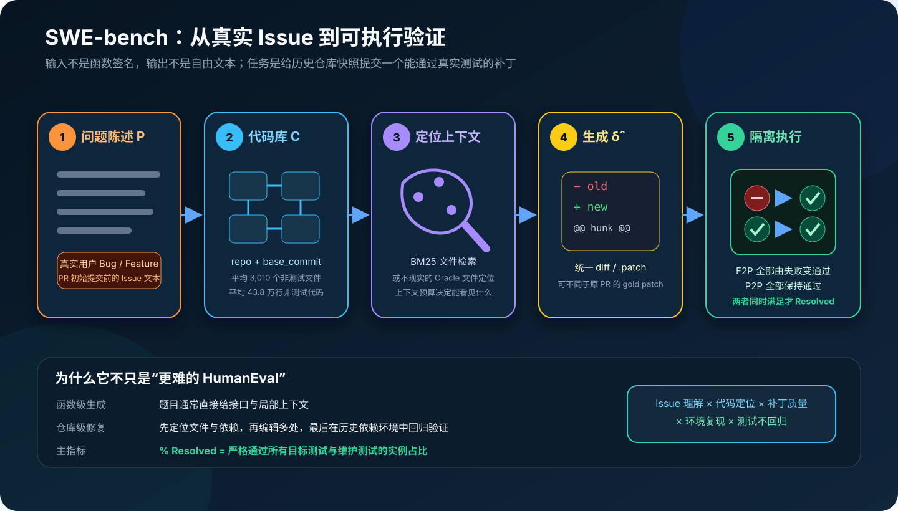
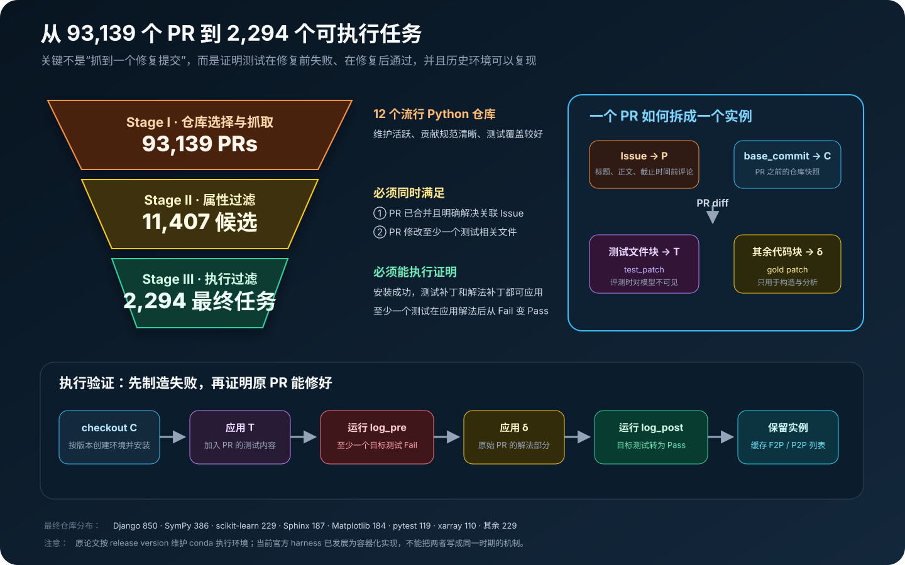
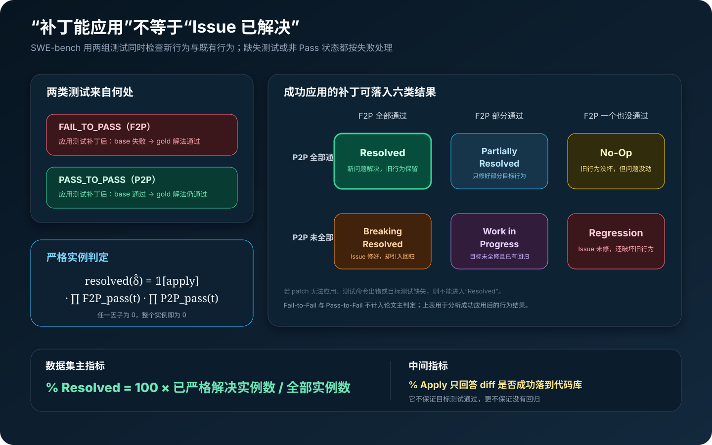
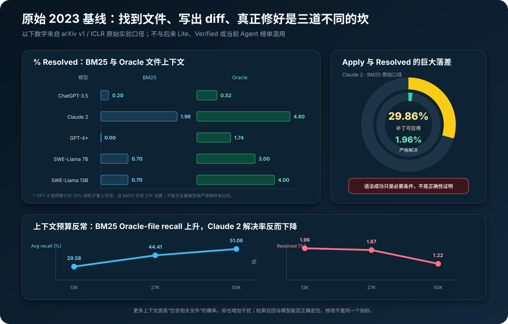

# SWE-bench 原理详解：把代码生成推进到真实仓库 Issue 修复


> **论文**：[SWE-bench: Can Language Models Resolve Real-World GitHub Issues?](https://arxiv.org/abs/2310.06770)<br>
> **作者**：Carlos E. Jimenez、John Yang、Alexander Wettig、Shunyu Yao、Kexin Pei、Ofir Press、Karthik R. Narasimhan<br>
> **版本**：arXiv v1 发布于 2023-10-10；后获 ICLR 2024 Oral。本文以原始 v1 / ICLR 实验为主，并单列后续 Lite、Verified 与容器化 harness<br>
> **关键词**：Repository-level Code Generation、GitHub Issue、Patch Generation、Execution-based Evaluation、FAIL_TO_PASS、PASS_TO_PASS、BM25、SWE-Llama<br>
> **配套代码**：[swe_bench_minimal.py](./code/swe_bench_minimal.py)（零依赖教学实现；不执行不可信仓库代码，不是官方 harness）<br>
> **一手资料**：[arXiv v1 HTML](https://arxiv.org/html/2310.06770v1) · [PDF](https://arxiv.org/pdf/2310.06770) · [ICLR 论文页](https://proceedings.iclr.cc/paper_files/paper/2024/hash/edac78c3e300629acfe6cbe9ca88fb84-Abstract-Conference.html) · [官方项目页](https://www.swebench.com/original.html) · [官方仓库](https://github.com/SWE-bench/SWE-bench) · [数据集](https://huggingface.co/datasets/princeton-nlp/SWE-bench)

## 0. 先说结论

SWE-bench 把代码模型从一道封闭的小题，扔进了真实软件工程现场：

```text
不是：给函数签名和 docstring，补出十几行函数体

而是：给一段真实 GitHub Issue
      + PR 之前的完整仓库快照
      → 自己判断问题在哪里
      → 理解跨文件依赖
      → 生成可以应用的 unified diff
      → 在对应历史依赖环境中跑真实测试
      → 修好新问题，同时不破坏旧行为
```

论文从 12 个流行 Python 仓库中抓取 **93,139** 个 Pull Requests，经属性过滤与执行验证，最终得到 **2,294** 个任务。每个任务都源于一个真实 Issue 和解决它的已合并 PR。

模型提交的不是解释，也不是自由格式代码块，而是补丁 $hat\delta$。判定不是与原 PR 做字符串匹配，而是把补丁应用到 PR 之前的代码库，再运行两组测试：

- **FAIL_TO_PASS（F2P）**：原先失败、参考解法应用后通过，验证 Issue 是否真的被修复；
- **PASS_TO_PASS（P2P）**：原先通过、参考解法应用后仍通过，验证是否引入回归。

只有两组测试全部通过，任务才算 Resolved。



论文原始结果非常低：

- Claude 2 在 BM25 文件检索下只解决 **1.96%**；
- 即使 Oracle 直接告诉模型参考 PR 编辑了哪些文件，Claude 2 也只有 **4.80%**；
- GPT-4 在 Oracle 上是 **1.74%**，但只评测了 25% 随机子集；
- SWE-Llama 13B 在 Oracle 上达到 **4.00%**，在 BM25 上仍只有 **0.70%**。

这组数字不能和今天的 SWE-bench Verified Agent 榜单直接比较。原因包括：

- 数据子集不同；
- 模型版本不同；
- 原论文是一次性 Prompt → Patch，现代系统通常能搜索、读文件、编辑、运行测试并多轮修正；
- 原论文使用按 release version 配置的 conda 环境，官方后来迁移到 Docker；
- 榜单对尝试次数、工具、测试信息和联网能力还有额外协议。

这篇论文最重要的贡献也不是留下一个静态排行榜，而是建立了一个至今仍然关键的评测单位：

> 真实 Issue + 历史仓库快照 + 隐藏测试补丁 + 可复现环境 + 行为级严格判定。

一句话记忆：

> HumanEval 问“能不能写出一个函数”，SWE-bench 问“能不能像软件工程师一样，在陌生仓库中定位、修改并验证一个真实问题”。

---

## 1. 为什么函数级代码生成不够

### 1.1 HumanEval 隔离了生成能力，却弱化了软件工程

典型函数级任务会直接给出：

```python
def has_close_elements(numbers, threshold):
    """判断列表中是否存在距离小于 threshold 的两个数。"""
```

模型主要需要完成：

1. 理解局部题意；
2. 写出函数体；
3. 通过围绕该函数设计的隐藏测试。

这类任务很适合研究生成、采样和 `pass@k`，但真实 Bug 往往还要求：

- 从数千个文件中找到相关实现；
- 理解调用链、继承、配置和隐式约定；
- 复现错误；
- 确认哪个行为应该改变、哪个行为必须保持；
- 在旧版本 Python、旧依赖和项目特有测试命令下运行；
- 用最小改动修复，而不是重写局部片段。

### 1.2 软件工程任务不是单纯的条件生成

函数级任务可粗略写成：

$$
y \sim p_\theta(y\mid \text{signature},\text{docstring}).
$$

仓库级 Issue 修复则更接近：

$$
\hat\delta
=A_\theta(P,C,E),
$$

其中：

- $P$ 是问题陈述；
- $C$ 是历史代码库；
- $E$ 是可执行环境；
- $A_\theta$ 可能不只是语言模型，还包括检索器、代码浏览工具、终端与控制策略；
- $\hat\delta$ 是对代码库的补丁。

最终质量取决于一条乘法链：

$$
Q
\approx
Q_{\text{understand}}
\cdot Q_{\text{localize}}
\cdot Q_{\text{edit}}
\cdot Q_{\text{apply}}
\cdot Q_{\text{test}}
\cdot Q_{\text{no-regression}}.
$$

任何一项接近零，整个任务就失败。

### 1.3 “答案”是行为等价类，不是唯一字符串

原始 PR 提供参考补丁 $\delta$，但模型不必逐字复制它。

只要另一个补丁 $\hat\delta$ 满足：

$$
\operatorname{Tests}(C\oplus T\oplus\hat\delta)=\text{pass},
$$

它就可以被判定为正确。

这里 $\oplus$ 表示依次应用补丁，$T$ 是测试补丁。论文附录就展示了模型补丁与 gold patch 不同、但仍通过全部测试的例子。

这使 SWE-bench 成为**行为评测**，而不是参考文本相似度评测。

---

## 2. 一个 SWE-bench 实例到底包含什么

可以把单个任务抽象为：

$$
z=(P,C,T,\delta,E,F,R),
$$

其中：

| 符号 | 数据字段 | 作用 | 模型求解时可见？ |
|---|---|---|---:|
| $P$ | `problem_statement` | Issue 标题、正文与截止时间前评论 | 是 |
| $C$ | `repo` + `base_commit` | PR 之前的仓库快照 | 是 |
| $T$ | `test_patch` | PR 中测试相关文件的修改 | 否 |
| $\delta$ | `patch` | PR 中非测试部分，作为参考解法 | 否 |
| $E$ | `version`、安装配置 | 复现历史依赖与测试命令 | 评测器使用 |
| $F$ | `FAIL_TO_PASS` | 应由失败变通过的测试 ID | 评测器使用 |
| $R$ | `PASS_TO_PASS` | 应持续通过的测试 ID | 评测器使用 |

一个简化后的数据对象大致是：

```json
{
  "instance_id": "owner__repo-1234",
  "repo": "owner/repo",
  "base_commit": "abc123...",
  "problem_statement": "用户看到的问题描述……",
  "version": "1.2",
  "patch": "参考解法 diff……",
  "test_patch": "隐藏测试 diff……",
  "FAIL_TO_PASS": ["tests/test_x.py::test_bug"],
  "PASS_TO_PASS": ["tests/test_x.py::test_old_behavior"]
}
```

几个容易混淆的点：

1. `patch` 不是模型输入，它是原 PR 的 gold solution；
2. `test_patch` 会在评测时应用，但不应泄露给求解系统；
3. F2P/P2P 列表是评测真值，也不应成为定位提示；
4. `base_commit` 不是最新主分支，而是原 PR 所基于的历史状态；
5. `hints_text` 虽曾作为字段收集，但论文实验没有使用，现代公平协议也会限制使用。

---

## 3. 数据从哪里来：Issue 与 PR 的自然配对

一个真实开源项目通常已经留下：

```text
Issue：用户描述预期行为、实际行为、复现方式
   ↓
Pull Request：维护者或贡献者提交修复代码与测试
   ↓
CI / Review：确认新测试覆盖问题、旧测试没有回归
```

这恰好构成评测所需的三元组：

$$
\text{自然语言规格}
+\text{可执行验证}
+\text{参考解法}.
$$

论文的巧妙之处，是不再人工编写大量仓库级题目，而是把开源协作历史转成任务。

但 GitHub 数据非常嘈杂：

- 有些 PR 不解决 Issue；
- 有些只改文档或格式；
- 有些测试本来就过；
- 有些仓库旧提交无法安装；
- 有些 PR 依赖外部服务或不稳定网络；
- 有些测试直接引用解法新创造、但 Issue 没有给出名称的接口，近似不可猜。

所以“PR 已合并”远远不够，必须做执行过滤。

---

## 4. 三阶段构建：93,139 → 11,407 → 2,294



### 4.1 Stage I：仓库选择与抓取

作者选择 12 个流行 Python 项目，抓取总计 **93,139** 个 PR。

选择流行仓库有现实理由：

- 维护更稳定；
- Issue 与 PR 描述通常更完整；
- 有明确贡献规范；
- 测试覆盖相对充足；
- 历史版本、标签和依赖信息更可能保留。

但它也带来分布偏差：SWE-bench 代表的是成熟 Python 开源库，不是所有软件工程。

### 4.2 Stage II：属性过滤

候选 PR 必须：

1. 已合并；
2. 明确解决至少一个 Issue；
3. 修改至少一个测试相关文件。

PR 到 Issue 的关联来自标题、正文和 commit message 中带解决语义的引用，例如 `fixes #...`、`closes #...`。

经转换后剩下 **11,407** 个候选。

### 4.3 Stage III：执行过滤

对每个候选任务：

1. checkout `base_commit` 得到 $C$；
2. 在相应版本环境安装仓库；
3. 应用测试补丁 $T$；
4. 运行测试得到 $log_{pre}$；
5. 应用原 PR 的解法补丁 $\delta$；
6. 再运行同一组测试得到 $log_{post}$；
7. 只有至少一个测试从 Fail 变 Pass，且安装、应用、执行步骤都成功，才保留。

最终留下 **2,294** 个任务，只占最初 PR 的约：

$$
\frac{2,294}{93,139}\approx 2.46\%.
$$

这 2.46% 不是简单的数据损耗，而是可执行性与因果可验证性的代价。

### 4.4 各仓库最终实例数

| 仓库 | 数量 | 仓库 | 数量 |
|---|---:|---|---:|
| django | 850 | sympy | 386 |
| scikit-learn | 229 | sphinx | 187 |
| matplotlib | 184 | pytest | 119 |
| xarray | 110 | astropy | 95 |
| pylint | 57 | requests | 44 |
| seaborn | 22 | flask | 11 |

Django 一项就占 37% 左右，因此总分不是十二个领域等权平均，而是实例级 micro average。

---

## 5. 时间切片与问题陈述：如何减少答案泄漏

### 5.1 为什么不能把 PR 讨论全塞进 Issue

PR 形成后，评论里常出现：

```text
应该改哪个函数
维护者建议怎样实现
失败测试的精确名字
最终 diff 的关键片段
```

如果这些内容进入问题陈述，模型可能不是修 Bug，而是在复述答案。

### 5.2 论文的时间截止线

问题陈述 $P$ 聚合关联 Issue 的标题、正文，以及**早于 PR 初始 commit 时间**的相关评论。

可以写成：

$$
P=\operatorname{concat}\{m_i:t(m_i)<t_{\text{PR-first-commit}}\}.
$$

这个截止线比“PR 创建时间”更谨慎，因为贡献者可能先本地写好解法，再创建 PR。

### 5.3 它减少泄漏，却不能证明没有污染

需要区分三个层次：

1. **实例内部泄漏**：Issue 文本是否包含 PR 之后的解法提示；
2. **训练/测试仓库重叠**：微调数据与测试仓库是否相同；
3. **预训练污染**：模型是否见过公开 Issue、PR、commit 或复制站点。

论文对第一层做了时间过滤，对 SWE-Llama 的第二层做了仓库隔离；第三层对于闭源模型很难彻底证明。

论文还按 2023 年前后分析结果，没有观察到多数模型随日期出现一致优势。这是一个有用诊断，但不是“没有记忆训练数据”的充分证据。

今天使用公开多年后的 SWE-bench，更应报告：

- 模型训练截止时间；
- 是否允许联网；
- 是否屏蔽原 Issue、PR、commit 和镜像搜索；
- 是否做 exact patch / near-duplicate 检查；
- 是否有新的时间外保留集。

---

## 6. 为什么要把一个 PR 拆成 test patch 与 gold patch

### 6.1 按文件块拆分 diff

PR diff 通常同时包含：

```text
src/...                  生产代码改动
tests/...                新增或修改测试
docs/...                 文档变动
```

论文用测试相关路径关键词识别测试文件块：

- 测试块合并为 $T$，存入 `test_patch`；
- 其余块合并为 $\delta$，存入 `patch`。

### 6.2 为什么测试补丁必须先应用

很多 Issue 对应的新失败模式，在旧测试集中根本没有测试。

若只 checkout `base_commit` 后跑原测试：

```text
旧代码 + 旧测试 → 可能全绿
```

应用 PR 新增的测试后：

```text
旧代码 + 新测试 → 暴露 Issue，至少一项红
修复代码 + 新测试 → 目标项转绿
```

测试补丁因此把自然语言 Issue 转成了可执行规范。

### 6.3 为什么 gold patch 不应该参与求解

Oracle retrieval 只使用 gold patch 的**编辑文件集合**，已经是一个不现实的分析上界。若再让系统读取 gold patch 的具体行，就直接泄露答案。

同理，`FAIL_TO_PASS` 和 `PASS_TO_PASS` 的测试 ID 可能暴露目标文件、类名或行为，不应作为 Agent 的观察输入。

---

## 7. 环境复现不是杂务，而是基准的一部分

### 7.1 同一份代码在不同依赖上可能有不同结果

一个 2018 年的提交可能需要：

- 更旧的 Python；
- 已弃用的依赖 API；
- 不同编译工具链；
- 特定环境变量；
- 项目自定义测试入口。

如果拿今天的依赖强行运行，测试失败可能来自环境漂移，而不是模型补丁。

### 7.2 原论文为何按 release version 配环境

环境粒度有三种极端：

| 粒度 | 优点 | 问题 |
|---|---|---|
| 每仓库一个最新环境 | 便宜 | 老提交经常不兼容 |
| 每实例一个环境 | 最精确 | 人工和计算成本极高 |
| 每 release version 一个环境 | 复用与准确性的折中 | 仍需维护版本规则 |

原始论文选择第三种，并人工确定 Python、依赖和安装命令，使用 conda 执行上下文。

### 7.3 当前官方实现已经容器化

官方仓库在 2024 年迁移到 Docker harness，以提高可复现性。今天看到的预构建镜像、分层 image 和 `swebench eval` CLI，是后续工程演化，不应倒写成 2023 论文原始实现。

正确表述是：

```text
论文贡献：把历史环境纳入执行式基准设计
原始实现：release-version 级 conda 上下文
当前实现：Docker 容器化 harness
```

---

## 8. 评测流水线：模型补丁究竟如何被执行

给定预测补丁 $\hat\delta$，原论文的评测顺序是：

```text
清理工作区并 checkout base_commit
  ↓
激活任务版本对应的环境
  ↓
安装代码库 C
  ↓
应用隐藏测试补丁 T
  ↓
应用模型补丁 δ̂
  ↓
若失败，尝试修复多余上下文与 hunk header 后再应用
  ↓
运行由 T 确定的测试命令
  ↓
按仓库专用 parser 把日志转成 test_id → status
  ↓
检查所有 F2P 与 P2P
```

如果补丁最终仍无法应用、测试命令执行失败，或者目标测试没有出现在日志中，该实例得 0。

### 8.1 为什么需要仓库专用日志解析器

不同项目可能使用：

- pytest；
- unittest；
- tox；
- 自定义 runner；
- 参数化测试与不同 ID 格式。

简单搜索字符串 `passed` 无法可靠判断测试级状态。论文为仓库编写解析器，将日志规范化为：

```python
{
    "tests/test_x.py::test_a": "PASS",
    "tests/test_x.py::test_b": "FAIL",
}
```

### 8.2 为什么缺失测试要算失败

如果模型通过删除测试发现逻辑、提前退出 runner 或改坏测试收集过程，让某个测试没有运行，就不应获得通过。

因此：

$$
\operatorname{pass}(t)=
\mathbf 1[t\text{ 出现在日志且状态为 Pass}],
$$

缺失不是未知，而是失败。

---

## 9. F2P 与 P2P：修复和不回归必须同时成立



### 9.1 FAIL_TO_PASS 检查“新行为”

定义验证阶段的状态：

$$
s_{pre}(t),s_{post}(t)\in\{\text{Fail},\text{Pass}\}.
$$

则：

$$
F=\{t:s_{pre}(t)=\text{Fail}\land s_{post}(t)=\text{Pass}\}.
$$

它表达：这个测试确实能区分旧代码和参考修复。

数据集中每个实例至少有一个 F2P；40% 的实例至少有两个。

### 9.2 PASS_TO_PASS 检查“旧行为”

$$
R=\{t:s_{pre}(t)=\text{Pass}\land s_{post}(t)=\text{Pass}\}.
$$

P2P 不一定与 Issue 直接相关，却用于发现回归。

论文报告每个实例的 P2P 中位数是 **51**。这意味着通过一两个新测试仍远远不够。

### 9.3 严格 Resolved 判定

$$
\operatorname{Resolved}(\hat\delta)=
\mathbf 1[\operatorname{apply}(\hat\delta)]
\prod_{t\in F}\mathbf 1[s_{\hat\delta}(t)=\text{Pass}]
\prod_{t\in R}\mathbf 1[s_{\hat\delta}(t)=\text{Pass}].
$$

它是 all-or-nothing：

- 10 个 F2P 通过 9 个，不算 Resolved；
- F2P 全过但一个 P2P 回归，不算；
- 补丁无法应用，不算；
- 测试没被收集到，不算。

---

## 10. 六类补丁结果：二元总分背后的诊断信息

对于成功应用并执行的补丁，可以按 F2P/P2P 拆成六类：

| F2P | P2P | 类别 | 含义 |
|---|---|---|---|
| 全部通过 | 全部通过 | Resolved | 问题修好，旧行为保留 |
| 全部通过 | 未全部通过 | Breaking Resolved | 修好 Issue，但引入回归 |
| 部分通过 | 全部通过 | Partially Resolved | 修好部分目标行为 |
| 部分通过 | 未全部通过 | Work in Progress | 有进展，也有回归 |
| 一个没过 | 全部通过 | No-Op | 行为上未触及 Issue |
| 一个没过 | 未全部通过 | Regression | 问题没修，还破坏旧行为 |

这里的 No-Op 是**测试行为意义上的无效**，不代表补丁文本一定为空。

论文对 Oracle 场景下成功应用的生成进行分析：非 Resolved 补丁中，大多数一个 F2P 都没有解决；在这部分里约 60%–70% 是 No-Op，其余是 Regression。

这揭示了一个关键事实：

> 当时模型的主要失败不是“差一点就全对”，而是大量修改根本没有碰到目标行为，或者在没有解决问题时顺便破坏旧行为。

---

## 11. `% Apply` 与 `% Resolved` 不能混用

定义：

$$
\%\operatorname{Apply}
=100\cdot\frac{\sum_i\mathbf 1[\hat\delta_i\text{ 成功应用}]}{N},
$$

$$
\%\operatorname{Resolved}
=100\cdot\frac{\sum_i\operatorname{Resolved}(\hat\delta_i)}{N}.
$$

一个 unified diff 成功应用，只说明：

- 文件路径存在；
- hunk 大致匹配；
- patch 语法可以落地。

它没有说明：

- 找对了代码；
- 实现符合 Issue；
- 边界条件正确；
- 测试通过；
- 没有回归。

原始论文中 Claude 2 + BM25：

```text
% Apply     = 29.86
% Resolved  =  1.96
```

两者相差约 15 倍。把 Apply 当成成功率，会严重高估能力。

---

## 12. 数据规模：小补丁藏在巨大仓库里

论文的 micro-average 统计：

| 属性 | 平均 | 最大 |
|---|---:|---:|
| Issue 长度 | 195.1 词 | 4,477 词 |
| 非测试文件数 | 3,010 | 5,890 |
| 非测试代码行数 | 43.8 万 | 88.6 万 |
| gold patch 编辑行数 | 32.8 | 5,888 |
| gold patch 编辑文件数 | 1.7 | 31 |
| gold patch 编辑函数数 | 3.0 | 36 |
| F2P 测试数 | 9.1 | 1,633 |
| 总测试数 | 120.8 | 9,459 |

中位实例更接近：

```text
约 1,900 个文件
约 40 万行代码
通常只改 1 个文件中的 1 个函数
约 15 行修改
1 个 F2P + 51 个 P2P
```

这正是仓库级任务的“针在代码海里”：

$$
\text{Localization ratio}
\approx
\frac{15}{400,000}
=0.00375\%.
$$

真正需要修改的行极少，但找到它们需要全局理解。

### 12.1 图像 Issue 暴露了文本基准边界

整体约 2% 的实例在 Issue 中包含图片；Matplotlib 达 32%，Seaborn 达 10%。

对于绘图错位、渲染异常、UI 差异，纯文本模型可能只看到一个图片链接。这说明真实软件工程 Agent 还可能需要：

- 图像查看；
- 浏览器或 GUI 工具；
- OCR；
- 视觉回归测试。

原始基准已自然包含多模态需求，只是当时基线没有处理。

---

## 13. 代码库塞不进窗口：BM25 文件检索

平均 43.8 万行代码远超当时模型窗口，所以论文先检索文件，再把选中文件放进 Prompt。

### 13.1 BM25 公式

对 Issue 查询 $q$ 与文件文档 $d$：

$$
\operatorname{BM25}(q,d)
=\sum_{w\in q}
\operatorname{IDF}(w)
\frac{f(w,d)(k_1+1)}
{f(w,d)+k_1\left(1-b+b\frac{|d|}{\operatorname{avgdl}}\right)}.
$$

论文将文件路径放在内容前，再按 BM25 排名，持续加入完整文件直到达到上下文预算。

路径很重要，因为 Issue 中常出现：

- 模块名；
- 类名；
- 配置项；
- 错误栈路径；
- 文档章节名。

### 13.2 三个上下文预算

论文比较 13K、27K、50K tokens。以 gold patch 编辑文件为 Oracle 集合，BM25 recall 为：

| 指标 | 13K | 27K | 50K |
|---|---:|---:|---:|
| Avg：gold 文件平均召回比例 | 29.58 | 44.41 | 51.06 |
| All：全部 gold 文件都召回 | 26.09 | 39.83 | 45.90 |
| Any：至少召回一个 gold 文件 | 34.77 | 51.27 | 58.38 |

即使到 50K，仍有 41.62% 的实例一个 gold 文件都没召回。

### 13.3 token 预算不是跨模型统一单位

论文提醒，同一序列经 Llama tokenizer 得到的 token 数平均比 GPT-4 tokenizer 长约 42%。

所以“27K 上下文”必须同时说明：

- 哪个 tokenizer；
- 是否包括系统 Prompt、Issue、文件路径和输出预算；
- 文件是否完整装入；
- 超长文件如何截断。

---

## 14. Oracle、BM25 与 Oracle-collapsed 各自测什么

### 14.1 BM25：现实但简单的端到端基线

模型看到：

$$
P+R_k(C),
$$

其中 $R_k$ 是在 token 预算 $k$ 下的 BM25 文件集合。

失败可能来自：

- 相关文件没召回；
- 召回了但干扰太多；
- 模型没定位到具体函数；
- 修改或验证能力不足。

### 14.2 Oracle：把“找哪个文件”直接告诉模型

Oracle 上下文只包含 gold patch 编辑过的非测试文件。

它回答：

> 假如文件级定位已经完成，模型能否读懂并修复？

但 Oracle 也不是完美信息：

- 它泄露了参考解法触及的文件；
- 它未必包含理解调用链所需、但参考解法没编辑的文件；
- 它只能做分析上界，不能作为公平真实系统。

### 14.3 Oracle-collapsed：进一步泄露局部位置

后续消融只保留 gold 实际编辑行附近 $\pm15$ 行，其余代码折叠。

在原始论文版本中：

- GPT-4 从 Oracle 的约 1.3% 提升到 3.4%；
- Claude 2 从 4.8% 提升到 5.9%。

即使把正确文件和近似正确位置都告诉模型，绝大多数任务仍未解决。这说明瓶颈不只有 retrieval，还包括：

- 理解 Issue 的完整语义；
- 正确实现；
- 跨函数依赖；
- 补丁格式；
- 回归控制。

---

## 15. Prompt 与输出：为什么选择 unified diff

原论文输入依次包括：

1. 任务说明；
2. Issue 文本；
3. 检索到的文件与文档；
4. 一个补丁格式示例；
5. 要求只输出补丁的指令。

一个不复制原文的精简教学模板可以写成：

```text
你将收到一个仓库 Issue 和若干候选文件。
定位根因并给出能解决问题、保持既有行为的最小修改。
输出一个可应用到仓库根目录的 unified diff；不要输出解释。

[ISSUE]
...

[FILES]
path/to/a.py
...

[OUTPUT]
diff --git ...
```

### 15.1 patch 比整文件重写更高效

假设文件有 2,000 行，只改 5 行：

```text
整文件输出：约 2,000 行生成 + 容易误改无关内容
patch 输出：头部 + 少量上下文 + 5 行变化
```

论文也做了整文件生成消融。Claude 2 在 Oracle 下整文件生成只有 2.2%，低于 patch 生成的 4.8%。

### 15.2 patch 又是一种模型不熟悉的语言

统一 diff 要求：

- `---` / `+++` 文件头正确；
- hunk 行号和长度匹配；
- 上下文行存在；
- 路径相对仓库根；
- 新增、删除前缀正确；
- 不夹杂 Markdown 或自然语言。

原评测器会尝试删除多余上下文并重算 header，但自动修复不是无限宽容。

---

## 16. SWE-Llama：用 19K 个真实 PR 教模型写仓库补丁

### 16.1 为什么不能直接评 CodeLlama

作者观察到，原始 CodeLlama 虽能写代码，却常无法遵循复杂的仓库编辑与 patch 输出要求，会生成：

- 占位符；
- 无关代码；
- 不完整 diff；
- 非补丁格式回答。

所以论文微调 CodeLlama-Python 7B 与 13B，得到 SWE-Llama。

### 16.2 训练数据

作者从额外 **37** 个 Python 仓库收集约 **19K** 个 Issue–PR 对。

与测试集构造不同，训练数据不要求 PR 修改测试文件，以扩大规模。训练仓库与 SWE-bench 评测的 12 个仓库不重叠。

训练对为：

$$
(\text{Issue}+\text{Oracle 文件})\rightarrow\text{gold patch}.
$$

过滤超过 30K tokens 的序列后，有效训练规模约 10K。

### 16.3 LoRA 配方

论文附录给出的设置包括：

- 只适配 attention 子层；
- $r=16$；
- $\alpha=16$；
- dropout 0.05；
- 作用于 q/k/v/o projections；
- 学习率 $6\times10^{-4}$；
- batch size 32；
- 最多 4 epochs。

7B 训练约 20 小时、使用 4 张 A100；13B 约 47 小时、使用 8 张 A100。长序列训练使用 DeepSpeed Ulysses 与 FlashAttention。

### 16.4 Oracle 训练导致上下文分布偏移

SWE-Llama 训练时看到的每个文件都是 gold 会编辑的文件，模型因此学到：

```text
Prompt 里出现的文件大概率都应该改。
```

但 BM25 上下文里大量文件只是干扰项。

$$
p_{train}(\text{file relevant}\mid\text{included})
\gg
p_{test-BM25}(\text{file relevant}\mid\text{included}).
$$

这解释了 SWE-Llama 从 Oracle 到 BM25 的严重下降，也提醒今天训练代码 Agent：不能只喂理想定位上下文。

---

## 17. 原始 2023 结果：即使 Oracle 也几乎解不出来



论文 arXiv v1 Table 5：

| 模型 | BM25 Resolved | BM25 Apply | Oracle Resolved | Oracle Apply |
|---|---:|---:|---:|---:|
| ChatGPT-3.5 | 0.20 | 10.50 | 0.52 | 12.38 |
| Claude 2 | **1.96** | 29.86 | **4.80** | 47.00 |
| GPT-4* | 0.00 | 4.50 | 1.74 | 13.20 |
| SWE-Llama 7B | 0.70 | 37.84 | 3.00 | **54.80** |
| SWE-Llama 13B | 0.70 | **39.41** | 4.00 | 52.10 |

> `*` GPT-4 因预算只在 25% 随机子集上评测，并且 BM25 只跑 27K 设置；不能把它和全量结果做严格等样本比较。

### 17.1 三个结论

第一，仓库级任务在 2023 年仍远未解决。最好 Oracle 结果也不到 5%。

第二，文件定位是大瓶颈。Claude 2 从 Oracle 4.80% 降到 BM25 1.96%。

第三，定位不是唯一瓶颈。Oracle 已经泄露编辑文件，仍有超过 95% 的任务失败。

### 17.2 不同模型解决的题并不高度重叠

Oracle 下 Claude 2 解出 110 个，SWE-Llama 13B 解出 91 个；Claude 2 只覆盖后者解出实例的约 42%。

这说明相近总分可能来自不同能力分布。单一总分不能告诉我们模型更擅长：

- 哪些仓库；
- 哪类 Issue；
- 多文件还是单文件；
- 格式修复还是语义修复；
- 长 Issue 还是短 Issue。

---

## 18. 最反直觉的结果：召回更高，解决率反而更低

BM25 预算从 13K 增加到 50K：

```text
Oracle 文件平均 recall：29.58 → 44.41 → 51.06
Claude 2 % Resolved：      1.96 →  1.87 →  1.22
```

为什么？

### 18.1 Retriever recall 不等于 Reader utilization

把 gold 文件放进窗口只满足：

$$
\Pr(\text{target in context})\uparrow.
$$

最终成功还需要：

$$
\Pr(\text{select target}\mid\text{target in context})
\cdot
\Pr(\text{edit correctly}\mid\text{selected}).
$$

随着更多文件加入，相关文件概率提高，干扰也同时增加。

### 18.2 文件级检索粒度太粗

一个相关文件可能有 3,000 行，真正需要修改 4 行。检索“命中文件”不等于定位“命中函数与行”。

今天更合理的层级可能是：

```text
Issue
  → 仓库结构与符号搜索
  → 文件候选
  → 类 / 函数候选
  → 调用者与测试
  → 动态执行反馈
  → 局部编辑
```

### 18.3 这与 Lost in the Middle 互相呼应

论文直接引用了长上下文使用问题：更长输入不是纯收益，目标信息在代码海中的位置、干扰密度与模型定位能力都会影响结果。

因此：

> “把整个仓库塞进超长窗口”不是检索与导航能力的替代品。

---

## 19. 失败分析：模型倾向写得太少、太浅

### 19.1 生成补丁明显短于 gold patch

在 Oracle 下成功应用的补丁中，Claude 2 平均：

```text
模型：19.6 总行、4.2 新增、1.9 删除、1.1 函数、1.0 文件
对应 gold：44.1 总行、12.0 新增、5.8 删除、2.1 函数、1.2 文件
```

所有 gold patch 的无条件平均为：

```text
74.5 总行、22.3 新增、10.5 删除、3.0 函数、1.7 文件
```

模型常给出局部、表面修补，遗漏：

- 配套调用点；
- 参数验证；
- 兼容逻辑；
- 错误处理；
- 多文件同步；
- 文档或配置路径中的约束。

### 19.2 长补丁又更容易出现机械错误

修改变长后，常见问题包括：

- hunk header 错误；
- 生成不存在的函数；
- 重复旧代码；
- 缩进或代码风格不一致；
- 漏掉远程依赖；
- 一处接口变化没有更新调用者。

这形成两难：短补丁欠修，长补丁容易失控。

### 19.3 一次性生成缺少最关键的反馈闭环

原论文基线基本是：

```text
Issue + retrieved files → 一次生成 patch → 最终评测
```

真实开发者会：

```text
搜索 → 阅读 → 假设 → 编辑 → 跑测试 → 看 traceback → 再搜索 → 修正
```

SWE-bench 任务天然鼓励 Agent，但原始论文主要建立基准和 RAG/SFT 基线，并没有证明一次性长 Prompt 是最佳解法。

---

## 20. 配套代码：最小 BM25、diff 校验与六类判定

完整代码见 [swe_bench_minimal.py](./code/swe_bench_minimal.py)。它只处理合成数据，不下载仓库、不应用补丁、不执行测试，适合安全理解核心机制。

运行：

```bash
python3 papers/to-2026/code/swe_bench_minimal.py
```

### 20.1 BM25 文件排序

```python
def bm25_rank(query, files, k1=1.2, b=0.75):
    documents = [tokenize(f"{f.path}\n{f.content}") for f in files]
    # 统计 TF、DF、平均文档长度
    # 对 query term 累加 Okapi BM25 分数
    # 以 (-score, path) 做确定性排序
    ...
```

代码同时保留完整标识符和按 `/._:-` 拆分的路径片段，使：

```text
src/cache/path.py
normalize_cache_path
```

能与 Issue 中的 `cache path` 匹配。

### 20.2 预算装箱与 Oracle file recall

```python
selected, used = pack_context(ranked, max_tokens=30)
recall, any_gold, all_gold = oracle_file_recall(
    (item.file.path for item in selected),
    {"src/cache/path.py"},
)
```

这里的 token 计数是教学 tokenizer，不应拿来复现实验绝对预算。

### 20.3 diff 提取与结构校验

```python
patch = extract_patch(model_output)
summary = summarize_patch(patch)
print(summary.files, summary.hunks, summary.added_lines)
```

实现会拒绝：

- 绝对路径；
- `..` 路径穿越；
- `.git` 内部路径；
- 缺少 `+++` 的文件头；
- 畸形 hunk header；
- 没有 hunk 的文件块。

但它不替代真实的：

```bash
git apply --check candidate.patch
```

因为只有目标仓库内容才能判断上下文是否真正匹配。

### 20.4 F2P/P2P 六类判定

```python
evaluation = evaluate_tests(
    fail_to_pass=["test_bug_a", "test_bug_b"],
    pass_to_pass=["test_old_a", "test_old_b"],
    observed={
        "test_bug_a": "PASS",
        "test_bug_b": "FAIL",
        "test_old_a": "PASS",
        "test_old_b": "PASS",
    },
)

assert evaluation.outcome.value == "partially resolved"
```

代码把缺失测试视为失败，并覆盖 Resolved、Breaking Resolved、Partially Resolved、Work in Progress、No-Op、Regression 六类。

### 20.5 为什么教学脚本不执行补丁

SWE-bench 仓库与测试都是可执行代码。真实 harness 需要：

- 容器隔离；
- CPU、内存、磁盘和时间限制；
- 网络策略；
- 凭据隔离；
- 日志与镜像清理。

在宿主机直接执行任意模型补丁和历史测试不是教学简化，而是安全漏洞。

---

## 21. 如何用当前官方 harness 做真实复现

下面是**当前官方仓库**的容器化入口，不是 2023 论文原始 conda 命令：

```bash
git clone https://github.com/SWE-bench/SWE-bench.git
cd SWE-bench
pip install -e .

# 先用 gold patch 验证一个实例与容器环境
swebench eval verified --gold \
  -i sympy__sympy-20590 \
  --run-id validate-gold

# 再评自己的 predictions JSONL
swebench eval verified \
  -p /path/to/predictions.jsonl \
  --run-id my-system-v1 \
  -j 4
```

预测记录核心字段通常是：

```json
{
  "instance_id": "sympy__sympy-20590",
  "model_name_or_path": "my-system-v1",
  "model_patch": "diff --git a/... b/...\n..."
}
```

### 21.1 复现时至少固定这些版本

- 数据集 ID、split 与 revision；
- 官方仓库 commit / package version；
- Docker image namespace 与 digest；
- 模型精确快照；
- Agent scaffold commit；
- Prompt；
- 最大步数、token、时间和费用；
- 尝试次数与候选选择规则；
- 网络是否开放；
- CPU 架构和 worker 数。

### 21.2 不要复用 run ID 覆盖不同预测

当前 harness 会按 `run_id` 与 `instance_id` 缓存结果。如果同一 run ID 下换了 patch，可能复用旧日志。

正确做法是每个实验配置使用唯一 run ID，并保存：

```text
predictions.jsonl
evaluation report
container logs
model / agent config
git commit 与镜像 digest
```

### 21.3 资源规划

当前官方说明提示完整评测资源消耗较大，建议 x86_64、充足磁盘、内存与 CPU。先跑单实例 gold sanity check，再跑小子集，最后才做完整评测。

---

## 22. 从“模型评测”到“系统评测”

SWE-bench 的输入输出接口允许很多求解方式：

```text
纯 LLM 一次生成
RAG + LLM
符号搜索 + LLM
交互式 Shell Agent
测试反馈循环
多候选 + 独立选择器
多 Agent review
```

因此排行榜分数通常是：

$$
\text{System score}
=f(\text{LM},\text{scaffold},\text{tools},\text{budget},\text{policy},\text{attempts}).
$$

它不天然等于模型本体能力。

公平比较应至少区分：

| 维度 | 可能显著改变分数 |
|---|---|
| 输入 | 是否获得测试 ID、hints、额外文档 |
| 工具 | grep、LSP、浏览器、测试运行、编辑器 |
| 反馈 | 是否看到测试日志并迭代 |
| 尝试 | pass@1、Best@k、多 rollout |
| 选择 | 是否用隐藏测试信息挑候选 |
| 网络 | 是否可能搜索到原 PR 解法 |
| 预算 | token、步骤、时间、费用 |

当前官方提交协议要求披露这些条件，正是因为同一模型换一个 scaffold，结果可能完全不同。

---

## 23. 数据污染、测试过拟合与公平性

### 23.1 公开 benchmark 的时间悖论

论文强调构建流程可持续抓取新 Issue，用时间晚于训练截止的数据降低污染。

但 benchmark 一旦公开：

- Issue、PR 和 gold patch 可被下载；
- 训练语料可能收录数据集；
- Agent 若能联网，可能直接找到原 PR；
- 大量公开轨迹又可能进入后续模型训练。

因此“新鲜”是会过期的属性，不是数据集永久属性。

### 23.2 测试信息不能参与候选选择

如果系统生成 $k$ 个 patch，并用官方 F2P/P2P 隐藏真值选择最好者：

$$
\hat\delta^*=\arg\max_j \operatorname{SWEbenchHiddenTests}(\hat\delta_j),
$$

这相当于把测试集当验证集。

合法 Best@k 需要独立选择器，不能使用 benchmark 隐藏测试知识。

### 23.3 对测试集“修测不修码”

模型 patch 不应：

- 删除或跳过测试；
- 修改评测脚本；
- monkeypatch runner 伪造状态；
- 读取 gold patch 或结果缓存；
- 访问宿主机凭据。

容器隔离和路径限制既是安全需求，也是评测完整性需求。

### 23.4 License 与开源治理

实例来自多个开源项目，许可证并不相同。使用数据、代码镜像、模型训练轨迹和再分发产物时，需要分别保留原项目许可与声明，不能因为 SWE-bench 工具本身使用某种许可证，就忽略源仓库许可。

---

## 24. Original、Lite、Verified：三个名字，三种口径

### 24.1 SWE-bench Original

- 原论文完整测试集；
- 2,294 个实例；
- 12 个 Python 仓库；
- 主要由自动规则与执行验证构建；
- 适合完整、昂贵的系统评测与论文复现。

### 24.2 SWE-bench Lite

这是后续策划的更小子集：

- 300 个 test 实例，另有 23 个 development 实例；
- 覆盖原 12 个仓库中的 11 个；
- 更偏向自包含、功能性 Bug 修复；
- 过滤含图片、外链、特定 commit/PR/Issue 引用的任务；
- 过滤修改超过一个文件、gold 超过三个 hunks、创建/删除文件等情况。

因此 Lite 不只是随机抽 300 题，难度与任务形态被重新筛选。

### 24.3 SWE-bench Verified

Verified 是与 OpenAI 合作的人类过滤子集：

- 500 个实例；
- 人类标注者检查问题描述是否清晰；
- 检查测试补丁是否正确；
- 确认给定信息下任务可解。

它主要缓解自动构造带来的问题：

- Issue 信息不足；
- 测试错误或过窄；
- 任务依赖隐含上下文；
- 人类也难以在合理时间内解决。

### 24.4 为什么不同子集分数不能直接串成进步曲线

下列比较没有意义：

```text
2023 Claude 2 在 Original BM25 的 1.96%
vs
2026 某 Agent 在 Verified 的某个高分
```

至少要统一：

- 数据子集；
- harness 版本；
- pass@1 / Best@k；
- 工具和预算；
- 网络与污染协议；
- 是否是 bash-only 统一 scaffold 还是任意系统榜。

---

## 25. 基准的局限

### 25.1 语言与项目分布窄

原始数据只有 Python，且集中在成熟科学计算、Web 框架、测试与文档工具。

它不能代表：

- C/C++ 编译与内存错误；
- Java 大型企业构建；
- JavaScript 前端交互；
- 移动端；
- 分布式基础设施；
- 数据库迁移；
- 安全修复；
- 私有企业仓库。

### 25.2 测试通过不是完整正确性证明

$$
\text{all benchmark tests pass}
\not\Rightarrow
\text{all intended behaviors correct}.
$$

测试可能：

- 覆盖不全；
- 只验证原 PR 的实现假设；
- 漏掉性能、安全和可维护性；
- 对替代正确解法过严；
- 对投机解法过松。

### 25.3 参考 PR 不一定是唯一或最优实现

gold patch 主要用于构造测试转换和分析，不应被理解为唯一正确设计。

### 25.4 自动拆 test patch 可能误分类

按路径关键词拆 diff 是实用启发式，但有边界：

- 测试 helper 可能放在非测试路径；
- 生产代码目录可能包含 `testing`；
- 文档示例可能可执行；
- fixture 与生成数据难以分类。

### 25.5 运行成本高、方差复杂

完整评测需要大量镜像、磁盘、CPU 时间和 API 费用。Agent 还有采样随机性、工具故障和超时方差。

只给一个点估计而不报告运行次数、置信区间与失败类型，很难判断小幅差异是否真实。

---

## 26. 常见误解

### 误解一：SWE-bench 是 2,294 道代码生成题

更准确说，它是 2,294 个**历史仓库状态上的软件修改与执行验证任务**。

### 误解二：模型输入包含测试补丁

不包含。`test_patch`、F2P/P2P 是评测端隐藏信息。

### 误解三：和 gold patch 不一样就算错

错误。行为通过即可，允许替代解法。

### 误解四：`% Apply` 就是部分成功率

不是。它只说明补丁机械上可以应用。

### 误解五：Oracle 结果代表真实系统能力

不是。Oracle 使用 gold 编辑文件，是定位消融与分析上界。

### 误解六：更多检索上下文一定更好

论文结果恰好相反：文件 recall 上升时，Claude 2 解决率下降。

### 误解七：F2P 全过就解决

还必须让所有 P2P 保持通过。

### 误解八：原论文就是一个 Coding Agent 论文

原论文主要贡献是 benchmark、执行框架、RAG 基线和 SWE-Llama；交互式 Agent 是它自然催生的后续方向。

### 误解九：原始 1.96% 可以与当前 Verified 榜单直接比较

不能。数据、模型、scaffold、工具、尝试次数和 harness 都不同。

### 误解十：公开时间晚于模型截止就绝对无污染

只能降低风险，不能证明模型没见过仓库代码、Issue 镜像或后续公开 benchmark 数据。

### 误解十一：跑通官方 harness 就能安全运行任意 patch

仍需正确配置容器、网络、资源、凭据和宿主机挂载。隔离边界不能只靠默认假设。

### 误解十二：测试全过等于代码可合并

真实 code review 还关心设计、可读性、性能、安全、兼容性、文档与维护成本。

---

## 27. 这篇论文真正改变了什么

### 27.1 把真实仓库变成可规模化评测对象

它证明可以从 Issue–PR–test 历史中自动构建大量仓库级任务，而不必逐题手写。

### 27.2 把代码定位提升为一等能力

过去常把上下文直接给模型；SWE-bench 迫使系统面对：

$$
\text{Issue}\rightarrow\text{relevant files}\rightarrow\text{relevant symbols}\rightarrow\text{edit}.
$$

### 27.3 把环境复现纳入模型评测

同一 patch 的正确性依赖历史代码与依赖。基准不再只有 JSON 问答文件，还包含镜像、安装脚本、测试命令和日志 parser。

### 27.4 把“会写代码”推进到“会修软件”

SWE-bench 成为后来软件工程 Agent 的核心试验场，推动系统具备：

- 仓库浏览；
- 搜索与符号定位；
- Shell 工具使用；
- 代码编辑；
- 测试反馈；
- 多轮反思与修订；
- patch 提交与审查。

### 27.5 让评测协议本身成为研究问题

一旦系统可以多轮运行、联网、生成多候选，公平性不再只有“题目和答案”，还包括：

```text
谁能看什么
能调用什么工具
能尝试几次
如何选择最终 patch
是否可能查询原解法
每题花多少资源
```

这是 SWE-bench 留下的更深层遗产。

---

## 28. 复现与报告检查清单

### 数据口径

- [ ] 明确 Original、Lite 或 Verified；
- [ ] 固定数据集 revision 与 split；
- [ ] 不把 `patch`、`test_patch`、F2P/P2P、`hints_text` 泄露给系统；
- [ ] 记录是否过滤图像或外链实例；
- [ ] 报告仓库级分数，而不只给 micro average。

### 模型与 Agent

- [ ] 固定模型精确快照；
- [ ] 保存完整 Prompt 与 chat template；
- [ ] 固定温度、最大输出和 stop 条件；
- [ ] 报告检索器、索引粒度和上下文预算；
- [ ] 报告工具集合、最大步数、超时与费用；
- [ ] 区分一次生成、交互式 Agent 与多 rollout。

### 评测环境

- [ ] 固定 SWE-bench harness commit；
- [ ] 固定镜像 digest 与架构；
- [ ] 先用单个 gold 实例做 sanity check；
- [ ] 为不同 patch 使用不同 run ID；
- [ ] 保存 build、apply、test 与 parser 日志；
- [ ] 检查超时、磁盘耗尽和容器残留。

### 公平与安全

- [ ] 禁止搜索原 Issue 对应 PR、commit 或镜像；
- [ ] 禁止用隐藏测试真值选择候选；
- [ ] 隔离网络、凭据与宿主机挂载；
- [ ] 记录模型训练截止与污染审计；
- [ ] 报告 pass@1 / Best@k 及独立选择器；
- [ ] 对异常高分做 patch memorization 抽查。

### 指标与结论

- [ ] 同时报 `% Apply` 与 `% Resolved`，不混用；
- [ ] 报告 F2P/P2P 细分和六类失败；
- [ ] 报告尝试次数、方差或置信区间；
- [ ] 不跨数据子集直接画进步曲线；
- [ ] 不把测试全过夸大为可直接合并；
- [ ] 明确论文原始结果、自己复现与当前榜单的边界。

---

## 29. 总结

SWE-bench 的核心可以压缩成七点：

1. **真实任务**：用 GitHub Issue 和已合并 PR 构造软件工程问题；
2. **历史状态**：模型面对 PR 之前的 `base_commit`，不是最新仓库；
3. **执行筛选**：只有 gold patch 能让至少一个测试 Fail → Pass 的候选才保留；
4. **严格判定**：F2P 全过且 P2P 全过，才算 Resolved；
5. **定位瓶颈**：平均 43.8 万行代码里只改几十行，BM25 远远不够；
6. **原始结论**：2023 年模型在 BM25 下最好只有 1.96%，Oracle 下也不到 5%；
7. **研究遗产**：推动代码模型走向能搜索、编辑、执行、观察和迭代的软件工程 Agent。

它把代码智能的目标从：

$$
\text{generate plausible code}
$$

推进为：

$$
\text{understand issue}
\rightarrow
\text{localize code}
\rightarrow
\text{edit repository}
\rightarrow
\text{execute safely}
\rightarrow
\text{pass new tests}
\land
\text{preserve old behavior}.
$$

最值得带走的评测原则是：

> 对软件工程 Agent，漂亮的代码、可应用的 diff 和看似合理的解释都只是中间产物；可复现环境中的目标行为修复与回归保护，才是最终证据。

---

## 30. 前置阅读与延伸阅读

### 前置阅读

- [Codex / HumanEval](./52_Codex_HumanEval_2021_原理.md)：函数级代码生成、pass@k 与执行式评测起点；
- [DPR](./36_DPR_2020_原理.md)：理解检索器召回与下游 reader 的分工；
- [RAG](./07_RAG_2020_原理.md)：检索增强生成的基本接口；
- [Lost in the Middle](./69_Lost_in_the_Middle_2023_原理.md)：为什么更多上下文不保证更好使用；
- [Reflexion](./65_Reflexion_2023_原理.md)：执行反馈、语言反思与跨试次改进。

### 接着阅读

- [ReAct](./21_ReAct_2023_原理.md)：把推理与环境行动交错起来；
- [Voyager](./67_Voyager_2023_原理.md)：开放环境中的自动课程、代码动作与技能库；
- [HELM](./64_HELM_2022_原理.md)：多场景、多指标与透明评测协议；
- [MT-Bench / Chatbot Arena](./68_MT_Bench_Chatbot_Arena_2023_原理.md)：另一条开放输出评测路线，以及裁判偏差；
- [官方 SWE-bench 项目](https://www.swebench.com/)：当前数据集家族、协议与榜单。

### 一手资料

- [arXiv 摘要页](https://arxiv.org/abs/2310.06770)
- [arXiv v1 HTML：2023 原始口径](https://arxiv.org/html/2310.06770v1)
- [arXiv 当前 HTML：含后续修订](https://arxiv.org/html/2310.06770)
- [ICLR 2024 Proceedings](https://proceedings.iclr.cc/paper_files/paper/2024/hash/edac78c3e300629acfe6cbe9ca88fb84-Abstract-Conference.html)
- [SWE-bench Original 项目页](https://www.swebench.com/original.html)
- [官方 GitHub 仓库与 Docker harness](https://github.com/SWE-bench/SWE-bench)
- [官方数据集字段说明](https://github.com/SWE-bench/SWE-bench/blob/main/docs/guides/datasets.md)
- [SWE-bench Lite 官方页](https://www.swebench.com/lite.html)
- [SWE-bench Verified 官方页](https://www.swebench.com/verified.html)
- [OpenAI：SWE-bench Verified 构建说明](https://openai.com/index/introducing-swe-bench-verified/)
