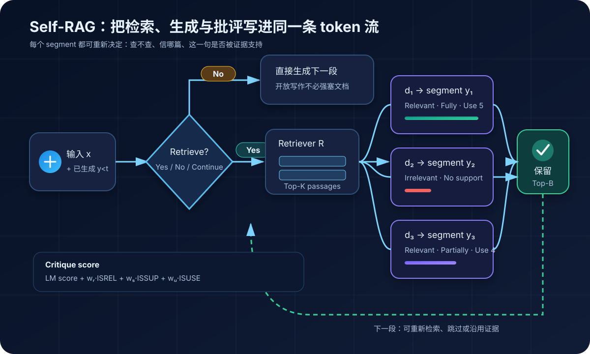
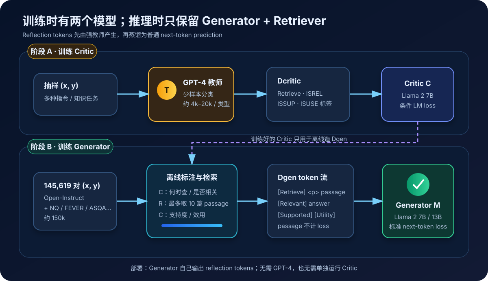
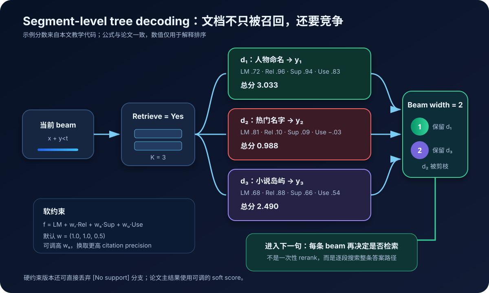
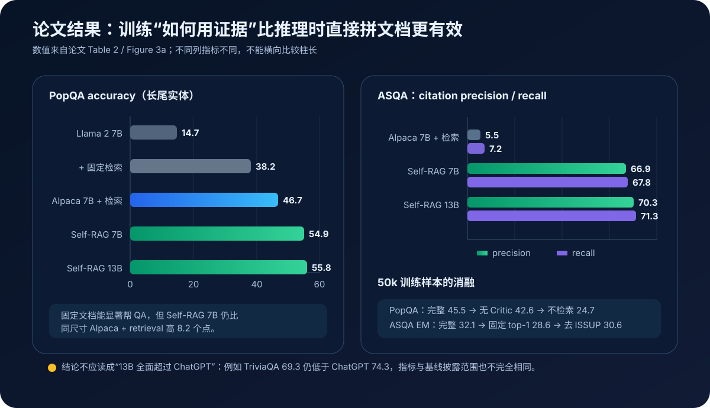

# Self-RAG 原理与实现：让模型学会何时检索、如何用证据，以及怎样批评自己的答案


> **论文**：[Self-RAG: Learning to Retrieve, Generate, and Critique through Self-Reflection](https://arxiv.org/abs/2310.11511)<br>
> **作者**：Akari Asai、Zeqiu Wu、Yizhong Wang、Avirup Sil、Hannaneh Hajishirzi<br>
> **时间**：2023 年 10 月首次公开；ICLR 2024 Oral<br>
> **关键词**：Retrieval-Augmented Generation、Adaptive Retrieval、Reflection Token、Critic、Attribution、Segment-level Beam Search、Controllable Generation<br>
> **官方资料**：[ICLR 论文 PDF](https://proceedings.iclr.cc/paper_files/paper/2024/file/25f7be9694d7b32d5cc670927b8091e1-Paper-Conference.pdf) · [项目主页](https://selfrag.github.io/) · [官方代码](https://github.com/AkariAsai/self-rag) · [7B 模型](https://huggingface.co/selfrag/selfrag_llama2_7b) · [训练数据](https://huggingface.co/datasets/selfrag/selfrag_train_data)<br>
> **本文代码**：[检索门、reflection score 与 segment beam search 的零依赖实现](./code/self_rag_minimal.py)<br>
> **前置阅读**：[RAG](./07_RAG_2020_原理.md) · [DPR](./36_DPR_2020_原理.md) · [Toolformer](./20_Toolformer_2023_原理.md) · [WebGPT](./54_WebGPT_2021_原理.md)

## 0. 先说结论

经典工程 RAG 往往不管问题类型，先固定取 $K$ 篇文档，再一次性塞进 prompt：

```text
问题 → 固定检索 Top-K → 拼接文档 → 生成答案
```

Self-RAG 把这条刚性流水线改成了语言模型内部的一组可学习决策：

```text
这一段需要外部事实吗？
  ├─ 不需要 → 直接生成
  └─ 需要   → 检索多篇文档
                ├─ 这篇文档相关吗？
                ├─ 生成内容被它支持吗？
                └─ 整体回答有用吗？
                     ↓
              给候选分支打分并保留更好的路径
```

这些决策不是自然语言长评语，而是扩进词表的 **reflection tokens**。最终 Generator 在自回归生成文本的同时，还会生成四类离散信号：

| 组 | 它回答的问题 | 取值 |
|---|---|---|
| `Retrieve` | 此处是否需要外部证据？ | `Yes / No / Continue` |
| `ISREL` | 当前 passage 对问题有用吗？ | `Relevant / Irrelevant` |
| `ISSUP` | 当前生成是否被 passage 支持？ | `Fully / Partially / No support` |
| `ISUSE` | 回答整体有多有用？ | `1 / 2 / 3 / 4 / 5` |

最重要的训练链路是：

1. 用 GPT-4 为少量样本标注四类 reflection labels；
2. 把这些标签蒸馏进一个本地 **Critic**；
3. 用 Critic 和 Retriever 离线增强约 15 万条指令数据；
4. 把 passage、答案和 reflection tokens 交错成一个 token 序列；
5. 用普通 next-token loss 微调最终 **Generator**；
6. 推理时不再需要 GPT-4 或 Critic，Generator 自己输出反思 token。

所以 Self-RAG 不是：

- 给现成聊天模型套三段反思 prompt；
- 生成完全文后再调用另一个 judge；
- 用 PPO 在线优化一个奖励模型；
- 把检索器与生成器完全联合训练；
- 保证所有引用都正确的事实核查器。

它更准确的定位是：

> **把“检索控制、证据判断和输出自评”蒸馏成同一个 Generator 能预测的控制 token，再用这些 token 做逐段搜索和推理时调权。**

论文最强的 13B 模型在 PopQA、PubHealth、ARC-Challenge 上分别得到 `55.8 / 74.5 / 73.1` accuracy，在 ASQA 上得到 `70.3 / 71.3` 的 citation precision / recall。它在多项指标上明显超过同尺寸固定检索基线，但不是所有任务都超过 ChatGPT：例如 TriviaQA 为 `69.3`，低于 ChatGPT 的 `74.3`。

如果只记一句话：

> RAG 让模型“看见文档”；Self-RAG 进一步训练模型决定“何时看、看哪篇、该不该相信，以及这一句是否真的有证据”。

---

## 1. 普通 RAG 的问题不只在“召回不准”

### 1.1 固定检索会把工具变成税

检索对于下面的问题很有价值：

```text
《行尸走肉》第七季何时首播？
```

但对下面的任务未必有帮助：

```text
根据“夕阳正在落下”写一首诗。
```

若系统对所有输入都固定检索 $K$ 篇文档，会产生四种成本：

- 检索与重排增加延迟；
- passage 占用上下文窗口；
- 无关文字分散注意力；
- 创意任务可能被检索语料不必要地限制。

可以把固定 RAG 写成：

$$
D=R_K(x),\qquad y\sim p_\theta(y\mid x,D),
$$

其中检索动作由系统硬编码，而不是模型根据当前生成状态决定。

Self-RAG 希望学习一个门：

$$
g_t\sim p_\theta(\texttt{Retrieve}\mid x,y_{<t}),
$$

只有 $g_t$ 判断外部知识有帮助时，才调用 $R$。

### 1.2 Top-1 相关，不代表每篇都相关

检索分数衡量 query 与 passage 的相似度，并不直接回答：

- passage 是否真的包含解决问题所需的信息；
- 是否只是出现了同名实体；
- 是否与当前要生成的这一个 claim 相关；
- 文档与模型答案是否互相矛盾。

例如问题问一本叫 *The Lie* 的书，Retriever 可能返回 Sam Harris 的 *Lying*。词面很像，文档也在谈“说谎”，但实体不相同。论文的人评样例中，Self-RAG 确实把这条 passage 和错误答案同时判成 `Relevant / Fully Supported`，而人工认为两者都错。

这个例子非常重要：

$$
\text{模型预测 Relevant}
\not\Rightarrow
\text{文档真的相关}.
$$

Reflection token 是模型的判断，不是来自世界的真值。

### 1.3 有相关 passage，也不等于答案受支持

相关性与支持度是两个不同问题：

```text
ISREL：这篇文档是否有助于回答问题？
ISSUP：这句话里的可核查信息是否由文档蕴含？
```

一篇 Ronaldinho 的生平文档当然相关，但若回答额外写入文档没有提到的出生地点，这条生成就只能被部分支持。

普通 RAG 常把两步混成一个相关性分数：

$$
s_R(x,d).
$$

Self-RAG 显式分解成：

$$
s_{\mathrm{rel}}(x,d),qquad
s_{\mathrm{sup}}(x,d,y_t).
$$

前者筛证据，后者审 claim。

### 1.4 一次检索不适合长答案

长答案包含多个事实段。第一句需要“谁命名”，第二句可能需要“名称来自哪部小说”，第三句又要解释另一组来源。只在开头用原问题检索一次，未必覆盖后续所有 claim。

Self-RAG 把输出分为：

$$
y=[y_1,y_2,\ldots,y_T],
$$

论文实验中一个句子就是一个 segment。每到新 segment，模型都能重新作检索决策，因此检索粒度从“整篇回答一次”变成“按段动态调用”。

---

## 2. 系统全景：一个 Generator，四种反思信号



给定输入 $x$ 和已生成前缀 $y_{<t}$，第 $t$ 段大致经历：

1. Generator 预测 `Retrieve`；
2. 若为 `No`，像普通 LM 一样直接生成 $y_t$；
3. 若为 `Yes`，Retriever 根据输入和当前生成状态返回 $K$ 篇 passage；
4. 对每篇 $d_k$ 并行预测 `ISREL`；
5. 在每篇 passage 条件下生成候选 segment $y_t^{(k)}$；
6. 再预测 `ISSUP` 与 `ISUSE`；
7. 用文本生成分数和 critique 分数组合排序；
8. segment-level beam search 保留 Top-$B$ 路径；
9. 进入下一段并重复。

抽象成一条交错序列，可能长这样：

```text
[Retrieve:Yes]
<paragraph> passage d₁ </paragraph>
[IsRel:Relevant]
answer segment y₁
[IsSup:Fully]
[Retrieve:Continue]
answer segment y₂
[Utility:5]
```

特殊 token 同时承担三种角色：

- **动作**：`Retrieve:Yes` 触发外部检索；
- **评估**：`Relevant`、`Fully Supported` 给候选分支打分；
- **控制接口**：部署者可调整不同 token 组的权重，改变输出偏好。

这就是论文所谓“self-reflection”的具体含义。它不是要求模型输出一篇自由形式的反省作文，而是让模型产生有限集合里的结构化判断。

---

## 3. 四类 reflection token 分别学什么

### 3.1 `Retrieve`：此处值不值得查

`Retrieve` 有三种值：

| 值 | 含义 |
|---|---|
| `Yes` | 当前续写需要新的外部证据 |
| `No` | 检索不会明显改善当前续写 |
| `Continue` | 已有 passage 信息仍足够，可继续用它生成下一段 |

`Continue` 很容易被忽略。它避免一篇信息丰富的 passage 只能支持一句话，也避免每个 segment 都重新发起相同查询。

`No` 也不是“模型确信自己知道答案”。它还可能表示：

- 当前是创作、改写或格式操作；
- Wikipedia 风格语料不适合这个任务；
- 外部事实不会显著改善回答。

因此 `Retrieve` 学到的是**检索效用判断**，不是纯粹的不确定性估计。

### 3.2 `ISREL`：文档是否对输入有用

$$
\texttt{ISREL}\in\{\text{Relevant},\text{Irrelevant}\}.
$$

它的输入包含 $x$ 与 $d$，目标是判断 passage 是否提供解决输入所需的信息。它与 Retriever score 不同：Retriever 负责高召回地产生候选，`ISREL` 在 Generator 的语义空间里再次审查候选。

可以把二者看成：

```text
Retriever：这篇可能有关，先捞上来
ISREL：它是否真的值得参与当前回答
```

### 3.3 `ISSUP`：生成内容是否被证据蕴含

$$
\texttt{ISSUP}
\in
\{\text{Fully},\text{Partially},\text{No support}\}.
$$

论文把 `No support` 一类也称作 `No support / Contradictory`。判断对象不是 passage 单独的质量，而是三元组：

$$
(x,d,y_t).
$$

同一篇 passage 对一个保守句子可能是 `Fully`，对加入额外细节的句子则可能是 `Partially` 或 `No support`。

### 3.4 `ISUSE`：回答是否有用

$$
\texttt{ISUSE}\in\{1,2,3,4,5\}.
$$

论文特别说明，它衡量的是 **perceived utility**：回答是否有帮助、信息充分、切题，而不直接等于事实正确。

因此完全可能出现：

```text
读起来很有用（Utility 5）
但证据不支持（No support）
```

这正是需要把 `ISSUP` 与 `ISUSE` 分开的原因。论文数据定义中，前三类判断按 segment 产生，`ISUSE` 主要在完整输出结束时给一次整体评分；推理解码则利用相应 token 概率参与候选排序。

---

## 4. 训练不是在线自我改进，而是两次监督蒸馏



Self-RAG 论文里有两个训练出的语言模型：

- Critic $C$：学习替 GPT-4 产生 reflection labels；
- Generator $M$：学习生成正文与 reflection tokens。

它们都从 Llama 2 初始化，都用标准条件语言模型目标训练，但数据和职责不同。

### 4.1 第一步：让 GPT-4 产生 Critic 监督

人工逐句标注“需不需要检索、相关不相关、支持到什么程度、有多有用”很昂贵。作者为每一类 token 写不同的 instruction 和 few-shot demonstrations，让 GPT-4 做离散分类。

论文最终收集的标签规模约为：

| 类型 | 样本数 |
|---|---:|
| `Retrieve` | 12,594 |
| `ISSUP` | 11,181 |
| `ISREL` | 19,317 |
| `ISUSE` | 3,831 |

GPT-4 使用温度 1，最大输出 200 tokens；格式不符合预期或类别名不合法的样本被丢弃。

作者每类随机人工检查 20 条，人与 GPT-4 的一致率为：

- 是否相关：95%；
- 是否需要检索：95%；
- 支持程度：90%；
- 有用程度：80%。

这里的样本很小，只能作为数据构造的 sanity check，不能当成普适的 critic 可靠性证明。

### 4.2 第二步：训练本地 Critic

Critic 的训练集记为：

$$
\mathcal D_{\text{critic}}
=\{(x,y,d,r)\},
$$

其中不同 token 类型实际需要的输入不同。例如 `ISREL` 需要 $(x,d)$，`ISSUP` 需要 $(x,d,y)$。

论文把目标简写为：

$$
\boxed{
\max_C
\mathbb E_{((x,y),r)\sim\mathcal D_{\text{critic}}}
\log p_C(r\mid x,y)
}
$$

Critic 用 Llama 2 7B 初始化。相对 GPT-4 标签，其测试准确率为：

| 类型 | Llama 2 7B Critic accuracy |
|---|---:|
| `Retrieve` | 93.8 |
| `ISSUP` | 93.5 |
| `ISREL` | 80.2 |
| `ISUSE` | 73.5 |

最后一项最低，说明“有多好”比“是否检索”更主观，也更难蒸馏。

### 4.3 Critic 是数据标注器，不是线上裁判

训练好 $C$ 后，作者用它给大规模指令数据离线插入标签。最终部署不需要同时托管：

```text
Generator + Critic + GPT-4
```

而只需要：

```text
Generator + Retriever
```

这是 Self-RAG 相对“每次生成后再调用一个 judge”的重要成本优势。

---

## 5. Generator 的训练数据是怎样造出来的

### 5.1 原始数据来源

作者混合了通用指令与知识密集任务，包括：

- GPT-4 Alpaca、Stanford Alpaca；
- FLAN-V2、ShareGPT、OpenAssistant 1；
- Wizard of Wikipedia、Natural Questions、FEVER；
- OpenBookQA、ARC-Easy、ASQA。

正文近似写作 150k，附录精确统计为 **145,619** 个 input-output pairs。

这种混合非常关键。如果只用问答数据，模型几乎会把所有输入都判为“需要检索”；加入诗歌、字符串操作、聊天等指令后，它才有机会学会 `No Retrieval`。

### 5.2 按句判断，按需插入 passage

对每个原始 $(x,y)$：

1. Critic 先判断整个实例是否需要检索；
2. 若不需要，只给输出附上 `ISUSE`；
3. 若需要，先用输入与完整输出检索相关 passage；
4. 用 spaCy 把输出切成句子；
5. 对第 $t$ 句，根据输入、前文和已有 passage 再判断是否检索；
6. 若需要，用 $x$ 与当前句 $y_t$ 组成查询；
7. 对候选 passage 预测 `ISREL` 和 `ISSUP`；
8. 优先选择 relevant 且 fully / partially supported 的 passage；
9. 把 passage 与 reflection tokens 插入原答案。

这里有一个训练—推理差异：造数据时作者能看到 gold output $y_t$，因此能用它帮助检索；推理时还没有未来 gold sentence，只能依赖 $x$ 与已生成前缀。这个差异是教学复现时必须保留的现实边界。

### 5.3 为什么要重采样

原始数据分布会让某些 token 压倒性占优：

- 通用指令中有大量不需要检索的简单任务；
- 开放域 QA 的 top passage 常常相关且完全支持答案。

若直接训练，模型可能只学会高频输出 `No Retrieval`，或无脑输出 `Relevant + Fully Supported`。作者因此：

- 丢弃 50% 完全没有 retrieval token 的实例；
- 在 QA 数据里上采样部分 `Irrelevant` 样本。

这揭示了 reflection-token 方法的一个通用工程规律：

> 控制 token 不只是加进词表就行，还要控制类别分布，否则它会退化成高频常量。

---

## 6. Generator 的目标仍是普通 next-token prediction

扩展后的训练目标可能是：

```text
[Retrieve:Yes]
<paragraph> Of the fifty states, eleven are named after an individual person. </paragraph>
[IsRel:Relevant]
Eleven of the fifty states are named after people.
[IsSup:Fully]
[Utility:5]
```

Generator 同时预测正文 token 与 reflection token：

$$
\boxed{
\max_M
\mathbb E_{(x,y,r)\sim\mathcal D_{\text{gen}}}
\log p_M(y,r\mid x)
}
$$

其中 $r$ 表示插入的反思 token。

### 6.1 Passage 进入上下文，但不进入 loss

检索出的 `<paragraph> ... </paragraph>` 不是 Generator 应该背诵的 target，因此训练时将这些 passage token 的 loss mask 掉：

$$
\mathcal L
=-
\sum_{i=1}^{L}
m_i\log p_M(z_i\mid z_{<i},x),
$$

其中：

$$
m_i=
\begin{cases}
0,& z_i\text{ 位于 passage 内};\\
1,& z_i\text{ 是答案或 reflection token}.
\end{cases}
$$

它让 passage 充当条件上下文，同时只训练模型预测：

- 如何判断它；
- 如何依据它写答案；
- 如何评价生成结果。

### 6.2 没有 PPO，也没有反向传播穿过 Retriever

Critique tokens 的灵感接近细粒度 reward，但论文不做 PPO：

```text
reward model → PPO 更新策略
```

而是：

```text
Critic 离线输出标签 → 插入训练文本 → SFT / LM loss
```

Retriever 使用现成的 Contriever-MS MARCO。Generator 的梯度不会穿过离散检索动作更新 Contriever，因此“end-to-end 学会检索、生成和批评”应理解为 Generator 的统一行为接口，而不是 Retriever 与 LM 的完全联合可微训练。

---

## 7. 推理第一关：自适应检索阈值

Generator 可以直接按最大概率的 `Retrieve` token 做硬决定，也可以读取 token 概率，设置阈值 $\delta$。

论文的 soft retrieval gate 是：

$$
\boxed{
s_{\mathrm{ret}}
=
\frac{p(\texttt{Yes})}
{p(\texttt{Yes})+p(\texttt{No})}
>\delta
}
$$

注意归一化只在 `Yes / No` 组内完成，不是拿 `p(Yes)` 与整个词表的概率直接比较。

默认阈值为：

$$
\delta=0.2.
$$

ASQA 强制需要引用，因此论文把阈值设为 0，鼓励所有相关段都走检索。

阈值提供了一个明确的成本旋钮：

| $\delta$ | 检索频率 | 典型效果 |
|---:|---:|---|
| 低 | 高 | 更多证据、更高延迟、更多文档噪声 |
| 高 | 低 | 更省成本、更依赖参数记忆 |

论文发现，同样提高阈值、减少检索时，PopQA 的准确率下降比 PubHealth 更明显。原因很直观：PopQA 专门包含低页面浏览量的长尾实体，参数记忆更不可靠。

### 7.1 为什么黑盒 API 很难原样实现

Self-RAG 的 soft gate 和 critique score 需要读取指定特殊 token 的概率。如果 API：

- 不暴露 logprobs；
- 只返回 top-N token，目标 token 不在其中；
- 不允许扩展 tokenizer；
- 自动删掉特殊 token；

就不能完整复现论文算法。用 prompt 让普通模型输出“要不要检索”可以模仿控制流，但不是论文训练出的 Self-RAG。

---

## 8. 推理第二关：多篇 passage 并行生成

一旦触发检索，Retriever 返回：

$$
D_t=R(x,y_{t-1})=\{d_1,d_2,\ldots,d_K\}.
$$

论文不是把 $K$ 篇文档全部堆进同一个 prompt 再生成一条答案，而是让 Generator 对每篇 passage 分别产生 continuation：

$$
y_t^{(k)}\sim p_M(y_t\mid x,y_{<t},d_k).
$$

这会形成 $K$ 个分支：

```text
同一前缀
  ├─ d₁ → [Relevant] y₁ [Fully]
  ├─ d₂ → [Irrelevant] y₂ [No support]
  └─ d₃ → [Relevant] y₃ [Partially]
```

优点是文档之间不会在一个长 prompt 中互相污染，并且每个候选的 claim 能与单独 passage 绑定。代价是一次检索后要做多路生成，计算量近似随 $K$ 增长。

论文训练阶段最多取 10 篇文档；默认推理用 Contriever 的 top-5。对传记与开放域 QA，还补充搜索引擎取回的 top-5；ASQA 为公平比较统一使用 GTR-XXL 提供的 5 篇文档。

---

## 9. 三种 critique 概率怎样变成分数



### 9.1 Relevance score

只在 `Relevant / Irrelevant` 组内归一化：

$$
\boxed{
s_{\mathrm{rel}}
=
\frac{p(\text{Relevant})}
{p(\text{Relevant})+p(\text{Irrelevant})}
}
$$

### 9.2 Support score

`Fully` 得 1 倍，`Partially` 得 0.5 倍，`No support` 得 0：

$$
Z_{\mathrm{sup}}
=p(\text{Fully})+p(\text{Partially})+p(\text{None}),
$$

$$
\boxed{
s_{\mathrm{sup}}
=
\frac{p(\text{Fully})+0.5p(\text{Partially})}
{Z_{\mathrm{sup}}}
}
$$

这不是把 argmax label 硬转成 0、0.5、1，而是保留了分类分布中的不确定性。

### 9.3 Utility score

五档 utility 对应权重：

$$
(-1,-0.5,0,0.5,1).
$$

令 $w_i$ 为第 $i$ 档权重，则：

$$
\boxed{
s_{\mathrm{use}}
=
\frac{\sum_{i=1}^{5}w_i p(\text{Utility}=i)}
{\sum_{i=1}^{5}p(\text{Utility}=i)}
}
$$

因此它的值域约为 $[-1,1]$，而 relevance 与 support 在 $[0,1]$。

### 9.4 最终 segment score

论文把生成分数与三类 critique 分数相加：

$$
S_{\text{critique}}
=w_{\mathrm{rel}}s_{\mathrm{rel}}
+w_{\mathrm{sup}}s_{\mathrm{sup}}
+w_{\mathrm{use}}s_{\mathrm{use}},
$$

$$
\boxed{
f(y_t,d)
=p_M(y_t\mid x,d,y_{<t})
+S_{\text{critique}}
}
$$

默认权重为：

$$
(w_{\mathrm{rel}},w_{\mathrm{sup}},w_{\mathrm{use}})
=(1.0,1.0,0.5).
$$

论文公式写作 segment probability；工程实现通常需要对序列分数做长度处理，并在 log space 计算，避免长序列概率下溢。本文教学代码使用显式的 length-normalized model score，重点演示 critique 组合，不声称复刻官方数值。

---

## 10. Segment-level beam search：选择的是答案路径

普通 reranker 只在回答结束后选择一个完整候选。Self-RAG 在每个 segment 都展开文档分支：

$$
\mathcal B_{t-1}
\xrightarrow{\text{retrieve }K\text{ docs}}
K|\mathcal B_{t-1}|\text{ continuations}
\xrightarrow{\text{score}}
\mathcal B_t.
$$

每轮只保留 Top-$B$：

$$
\mathcal B_t
=\operatorname{TopB}_{b,d,y_t}
\left[
S(b)+f(y_t,d)
\right].
$$

论文默认：

$$
B=2.
$$

### 10.1 软约束

通过调整 $w$ 改变排序：

- 增大 $w_{\mathrm{sup}}$：更重视证据支持；
- 增大 $w_{\mathrm{rel}}$：更强地排斥跑题 passage；
- 增大 $w_{\mathrm{use}}$：更重视完整、有帮助的回答。

论文在 ASQA 上观察到，提高 support 权重会提高 citation precision，却降低 MAUVE。直觉是：越严格只写证据完全覆盖的内容，回答越容易变短、保守，流畅与内容丰富度可能下降。

### 10.2 硬约束

也可以直接过滤不理想 token：

```python
if support_label == "none":
    discard(candidate)
```

硬约束更容易解释，却会放大分类错误：如果模型误把正确候选判成 `No support`，好答案会永久从 beam 消失。

论文消融中，按 `Retrieve=Yes` 做硬决策并不如 soft threshold；这说明 reflection probability 的相对置信度比 argmax label 含有更多可用信息。

---

## 11. 一次完整推理例子

假设问题是：

```text
How did U.S. states get their names?
```

### 11.1 检索门

模型给出：

```text
p(Yes)=0.86
p(No)=0.14
```

则：

$$
s_{\mathrm{ret}}=0.86>0.2,
$$

触发检索。

### 11.2 三篇 passage

```text
d₁: 50 个州中有 11 个以个人命名
d₂: Texas 的热门婴儿名字包括 Emma
d₃: California 名称源自西班牙小说中的虚构岛屿
```

三条 continuation 的示意得分为：

| 分支 | LM | Rel | Sup | Use | 总分 |
|---|---:|---:|---:|---:|---:|
| $d_1$ | 0.72 | 0.96 | 0.94 | 0.83 | 3.033 |
| $d_2$ | 0.81 | 0.10 | 0.09 | -0.03 | 0.988 |
| $d_3$ | 0.68 | 0.88 | 0.66 | 0.54 | 2.490 |

虽然 $d_2$ 分支的语言模型分最高，但它与问题无关，support 也很低，因此总分垫底。这说明 critique-guided decoding 修正的是：

$$
\text{最像自然语言的 continuation}
\neq
\text{最有证据的 continuation}.
$$

### 11.3 下一段不一定再查

选中 $d_1$ 后，模型写完第一句。下一段若只是总结：

```text
这些例子说明州名来自多种来源。
```

检索门可能输出 `No`，直接生成；若原 passage 仍包含足够信息，也可以输出 `Continue`。

这就是按需检索相对“一次固定 Top-K”的核心灵活性。

---

## 12. 最小代码：把论文算法拆成可运行部件

完整脚本见 [self_rag_minimal.py](./code/self_rag_minimal.py)，只依赖 Python 标准库，不下载模型。

运行：

```bash
python3 papers/to-2026/code/self_rag_minimal.py
python3 papers/to-2026/code/self_rag_minimal.py --test
```

### 12.1 检索门

```python
def should_retrieve(probs, threshold):
    score = probs["yes"] / (probs["yes"] + probs["no"])
    return score > threshold
```

它刻意不把 `Continue` 混进初始 Yes/No gate。

### 12.2 支持度分数

```python
def support_score(probs):
    denominator = probs["fully"] + probs["partially"] + probs["none"]
    return (probs["fully"] + 0.5 * probs["partially"]) / denominator
```

### 12.3 Critique-guided ranking

```python
total = (
    candidate.model_score
    + w_rel * relevance_score(candidate.is_rel)
    + w_sup * support_score(candidate.is_sup)
    + w_use * utility_score(candidate.is_use)
)
```

### 12.4 Segment beam search

```python
for beam in beams:
    retrieve = should_retrieve(retrieve_gate(query, beam), threshold)
    passages = retriever(query) if retrieve else (None,)

    for passage in passages:
        candidate = generator(query, beam, passage)
        expanded.append(beam.extend(candidate, score(candidate)))

beams = sorted(expanded, key=lambda b: b.score, reverse=True)[:beam_width]
```

真实系统还要处理 tokenizer special IDs、批量 KV cache、检索查询改写、停止条件、citation ID、长度归一化与多 GPU 推理。最小代码只保留可解释的算法骨架。

### 12.5 展示 passage loss mask

脚本还会序列化一个 Generator 训练样本，并打印概念性的 token mask：

```text
Target: [Retrieve:Yes] <paragraph> ... </paragraph>
        [IsRel:Relevant] answer [IsSup:Fully] [Utility:5]
Loss:     ✓              × passage ×
                             ✓ answer/reflection ✓
```

这能避免把“把 passage 放入序列”和“让模型预测 passage”混为一谈。

---

## 13. 实验设置：六类任务测的是不同能力

论文做 zero-shot evaluation，不给 few-shot demonstrations，只提供任务说明。

| 类别 | 数据集 | 指标 | 主要能力 |
|---|---|---|---|
| 短答案 QA | PopQA | answer inclusion accuracy | 长尾实体知识 |
| 短答案 QA | TriviaQA-unfiltered | answer inclusion accuracy | 开放域事实问答 |
| 封闭集判断 | PubHealth | accuracy | 公共健康事实核验 |
| 多选推理 | ARC-Challenge | accuracy | 科学常识与推理 |
| 长文本 | Biography | FactScore | 原子事实精度 |
| 带引用长回答 | ASQA | str-em、ROUGE、MAUVE、citation P/R | 正确性、流畅性、引用 |

### 13.1 PopQA 为什么尤其关键

论文只用 PopQA 中月 Wikipedia 页面浏览量低于 100 的 1,399 条长尾实体查询。它专门测试：当参数记忆不可靠时，模型能否正确调用外部知识。

### 13.2 Citation precision 与 recall 不一样

- **citation precision**：给出的 citation 是否真的支持对应 claim；
- **citation recall**：应被引用的 claim 是否都有引用覆盖。

一个系统可以只写一句极保守且有证据的话，precision 很高但 recall 不够；也可以写得很全、引用很多，却混入不受支持的 claim。

因此 Self-RAG 提供 support weight，而不是宣称存在唯一最优解。

---

## 14. 主结果：强项在长尾知识、事实性与引用



下面摘录论文 Table 2 的代表性结果。不同列是不同指标，不能跨列直接比较大小。

| 模型 | PopQA acc | TriviaQA acc | PubHealth acc | ARC acc | Bio FactScore | ASQA str-em | ASQA MAUVE | Cite P | Cite R |
|---|---:|---:|---:|---:|---:|---:|---:|---:|---:|
| ChatGPT | 29.3 | **74.3** | 70.1 | **75.3** | 71.8 | 35.3 | 68.8 | – | – |
| Ret-ChatGPT | 50.8 | 65.7 | 54.7 | 75.3 | – | **40.7** | **79.7** | 65.1 | **76.6** |
| Llama 2 7B + retrieval | 38.2 | 42.5 | 30.0 | 48.0 | 78.0 | 15.2 | 32.0 | 2.9 | 4.0 |
| Alpaca 7B + retrieval | 46.7 | 64.1 | 40.2 | 48.0 | 76.6 | 30.9 | 57.9 | 5.5 | 7.2 |
| Llama2-FT 7B + retrieval | 48.7 | 57.3 | 64.3 | 65.8 | 78.2 | **31.0** | 51.2 | 5.0 | 7.5 |
| **Self-RAG 7B** | 54.9 | 66.4 | 72.4 | 67.3 | **81.2** | 30.0 | **74.3** | 66.9 | 67.8 |
| **Self-RAG 13B** | **55.8** | **69.3** | **74.5** | **73.1** | 80.2 | **31.7** | 71.6 | **70.3** | **71.3** |

表中加粗以便按开源 Self-RAG 与相关基线观察，不完全复刻论文对 proprietary / non-proprietary 的字体规则。

### 14.1 PopQA

Self-RAG 13B 为 `55.8`，相比：

- 无检索 Llama 2 13B：`14.7`；
- 固定检索 Alpaca 13B：`46.1`；
- Ret-ChatGPT：`50.8`。

这说明长尾实体正是按需外部记忆的优势区间。

### 14.2 Biography factuality

Self-RAG 7B 的 FactScore 为 `81.2`，略高于 13B 的 `80.2`，也高于固定检索 Llama 2 7B 的 `78.0`。

更大模型没有在每列单调更强，提醒我们：

$$
\text{参数更多}
\not\Rightarrow
\text{reflection token 更校准}.
$$

### 14.3 ASQA 引用

固定检索开源基线的 citation precision / recall 很低，例如 Alpaca 7B 只有 `5.5 / 7.2`；Self-RAG 7B 达到 `66.9 / 67.8`，13B 达到 `70.3 / 71.3`。

巨大差距不只是“检索到更好的文档”，因为各基线使用对齐的 passage；关键是 Self-RAG 被显式训练成：

- 逐段绑定 passage；
- 判断 passage 是否相关；
- 判断 claim 是否被 passage 支持；
- 在解码时用这些判断筛选分支。

### 14.4 不要写成“13B 全面打败 ChatGPT”

Self-RAG 13B 低于 ChatGPT 的项目包括：

- TriviaQA：`69.3 < 74.3`；
- ARC-Challenge：`73.1 < 75.3`；
- ASQA str-em：`31.7 < 35.3`；
- ASQA MAUVE：`71.6` 高于 ChatGPT `68.8`，但低于 Ret-ChatGPT `79.7`；
- citation recall：`71.3 < 76.6` 的 Ret-ChatGPT。

更严谨的结论是：Self-RAG 在多种任务上显著超过同尺寸开源 LM 与朴素检索增强基线，并在部分指标上超过更大的 proprietary model。

---

## 15. 消融：训练时和推理时的每个部件都在起作用

论文为快速实验，用 **50k 训练样本版本**做消融。它不能与 150k 主模型数字直接混为同一行。

| 50k 版本 | PopQA acc | PubHealth acc | ASQA str-em |
|---|---:|---:|---:|
| 完整 Self-RAG | **45.5** | **73.5** | **32.1** |
| 训练时无 Retriever | 43.6 | 67.8 | 31.0 |
| 训练时无 Critic | 42.6 | 72.0 | 18.1 |
| 推理时禁用 retrieval | 24.7 | 73.0 | – |
| 只按硬 token 决定 retrieval | 28.3 | 72.6 | – |
| 永远只用 top-1 passage | 41.8 | 73.1 | 28.6 |
| beam score 去掉 `ISSUP` | 44.1 | 73.2 | 30.6 |

### 15.1 无 Critic 对 ASQA 伤害最大

`32.1 → 18.1` 表明：仅把 top-1 passage 放入训练，不教模型判断相关性与支持度，长答案能力会显著退化。

### 15.2 推理时完全不检索，PopQA 崩得更明显

`45.5 → 24.7`，但 PubHealth 只从 `73.5 → 73.0`。同一套模型在不同任务上对非参数记忆的依赖不同，正好支持“检索频率应按任务可调”。

### 15.3 固定 top-1 不是 Self-RAG 的等价简化

Top-1 版本 PopQA 为 `41.8`，ASQA 为 `28.6`，均低于完整系统。让多个 passage 产生候选，再用细粒度 critique 选择，确实提供了 Retriever 排名之外的价值。

### 15.4 去掉支持度分数会伤引用回答

ASQA 从 `32.1` 降到 `30.6`。变化不如完全去 Critic 大，但它直接证明 `ISSUP` 不是展示用元数据，而是参与了搜索。

---

## 16. Self-RAG 与几条相邻路线的区别

### 16.1 与原始 RAG

| 维度 | RAG 2020 | Self-RAG |
|---|---|---|
| 检索频率 | 输入时固定一次 | 每个 segment 按需决定 |
| 文档使用 | 作为潜变量边缘化 | 每篇文档形成生成分支 |
| 生成器 | BART | Llama 2 7B / 13B |
| 检索器 | DPR | Contriever-MS MARCO |
| 自评 | 无 | relevance / support / utility |
| 推理控制 | RAG-Sequence / Token | 阈值 + critique weights + beam |
| 训练目标 | QA likelihood | 带 reflection tokens 的 LM loss |

原始 RAG 的核心是潜在文档概率模型；Self-RAG 的核心是可学习控制 token 与逐段搜索。两者不能只用“都先搜索再生成”概括。

### 16.2 与 Toolformer

Toolformer 用“工具结果是否降低未来文本 loss”筛选 API 调用训练样本；Self-RAG 用 GPT-4 → Critic 为检索与证据质量产生显式标签。

共同点：

- 把外部动作线性化进 token 序列；
- 最终模型自己决定何时调用；
- 都用普通语言模型目标写回能力。

区别：Toolformer 主要学习调用时机与工具参数，Self-RAG 还训练 passage relevance、claim support 与 utility，并在推理时做多分支搜索。

### 16.3 与 WebGPT

WebGPT 的模型在文本浏览器中执行 Search、Click、Scroll、Quote 等多步动作，并用人类偏好训练 reward model。Self-RAG 使用预建语料上的 Retriever，动作空间更窄，但 evidence attribution 与逐段 critique 更结构化。

```text
WebGPT：研究轨迹 + 浏览环境 + 人类偏好
Self-RAG：按段检索 + reflection tokens + critique-guided decoding
```

### 16.4 与 Reflexion

名字都含 reflection，但机制完全不同：

| 维度 | Reflexion | Self-RAG |
|---|---|---|
| 发生时间 | trial 失败之后 | 每个输出 segment 前后 |
| 反思形式 | 自由文本经验 | 固定离散 token |
| 是否跨 trial 记忆 | 是 | 否 |
| 是否训练模型权重 | 通常不训练 | SFT 训练 Generator |
| 核心目标 | 下次尝试少犯错 | 按需检索与证据化生成 |

把任何“生成—批评—修改”流程都叫 Self-RAG，会丢掉论文最关键的训练和 token 设计。

---

## 17. 从论文复现到真实系统，还缺哪些工程件

### 17.1 特殊 token 与 tokenizer

需要把每个 reflection label 作为稳定的 special token 加入词表，并同步 resize embedding。若把 `[Fully Supported]` 当普通多个子词，概率读取和硬控制都会更脆弱。

### 17.2 检索语料版本

论文默认使用 Contriever-MS MARCO 与英文 Wikipedia passage。PopQA 基于 2022 WikiData，而默认 2018 Wikipedia 缺少较新实体，因此作者改用 2020 年 12 月语料。

这说明 RAG 评测里一个经常被漏报的变量是：

$$
\text{corpus snapshot date}.
$$

模型、Retriever 都不变，只换语料时间，长尾结果也可能变化。

### 17.3 批量化树搜索

朴素实现会对每条 beam、每篇 passage 分别跑一次 Generator：

$$
O(TBK)
$$

路生成调用。实际需要：

- 把同一层的 passage branch 批量推理；
- 复用 prefix KV cache；
- 控制每段最大 token 数；
- 只在需要时读取 critique logits；
- 给重复 passage 去重；
- 设置总 retrieval 与 token budget。

官方实现推荐 vLLM，原因正是多分支生成的吞吐压力。

### 17.4 引用渲染与 claim 对齐

Reflection token 告诉系统某一 segment 与 passage 的关系，但产品还需要：

- 给 passage 分配稳定 citation ID；
- 把 citation 放到具体 claim 后；
- 保存标题、URL、时间与原文 span；
- 检查引用是否覆盖整句还是部分子句；
- 防止最终清理 special tokens 时错位。

### 17.5 失败回退

如果所有 passage 都被判 `Irrelevant` 或 `No support`，系统不应无限检索。常见回退策略包括：

- 改写查询后只重试一次；
- 扩大召回池或换 Retriever；
- 明确回答“现有证据不足”；
- 对低风险任务退回参数答案，但标注无外部支持。

论文框架提供判断信号，产品仍需定义失败策略。

---

## 18. 局限与风险

### 18.1 Self-reflection 可能自信地错

Generator 既写答案，又评价自己的答案，两者共享参数与盲点。若模型误解文档，可能同时产生：

```text
错误答案 + [Relevant] + [Fully Supported] + [Utility:5]
```

因此：

$$
\text{self-critique}
\neq
\text{independent verification}.
$$

高风险场景仍需要独立 NLI、规则、外部 verifier 或人工审核。

### 18.2 Critic 继承 GPT-4 标签偏差

数据链是：

$$
\text{GPT-4 judgment}
\rightarrow C
\rightarrow D_{\mathrm{gen}}
\rightarrow M.
$$

教师在 usefulness、支持度或知识领域上的偏差会被逐级蒸馏。Critic 对 `ISUSE` 的 GPT-4 标签准确率只有 `73.5%`，已经暴露这一瓶颈。

### 18.3 Retriever 没被联合优化

Self-RAG 能拒绝坏 passage，但不能从根本上修复召回缺失：

$$
\text{gold evidence}\notin D_t
\Rightarrow
\text{后续 critique 无证可选}.
$$

“会判无关”不是“会找回漏掉的证据”。

### 18.4 计算成本仍可能很高

按需检索减少了无必要的调用，但一旦进入检索分支，$K$ 篇 passage × $B$ 条 beam × $T$ 个 segment 会显著增加生成计算。它把固定 RAG 的统一成本改成了输入相关的动态成本，并没有让复杂问答免费。

### 18.5 训练分布主要是英文知识任务

论文结果不能直接外推到：

- 中文语料；
- 法律、医疗等专业证据标准；
- 快速变化的实时网页；
- 表格、图片与多模态证据；
- 需要多跳组合而非逐句单 passage 支持的任务。

### 18.6 指标之间存在真实冲突

提高 citation precision 可能牺牲覆盖、长度与 MAUVE。真实产品应先声明优化目标，而不是把所有 reflection weight 都调高。

---

## 19. 常见误解

### 误解 1：Self-RAG 是一种 prompt 模板

不是。论文训练 Critic、构造带特殊 token 的 145,619 条数据，再微调 Generator。Prompt wrapper 只能模拟表面控制流。

### 误解 2：推理时一直运行 Critic

不是。Critic 用于离线构造 Generator 训练数据；最终 Generator 自己预测 reflection tokens。

### 误解 3：模型每生成一个 token 都检索

不是。论文实验以句子为 segment，在 segment 边界决定是否检索。

### 误解 4：`Retrieve=No` 表示模型知道答案

不一定。它表示检索预计不会改善当前续写，也可能因为任务根本不需要外部事实。

### 误解 5：`Relevant` 就等于 `Supported`

不等于。相关 passage 可以只支持句子的一部分，也可以与某个具体 claim 矛盾。

### 误解 6：Reflection tokens 是真实奖励

它们是模型概率和离散标签，是 learned proxy。论文用它们做 soft score，但没有来自环境的客观 reward。

### 误解 7：Self-RAG 联合训练了 Retriever

论文使用现成 Contriever-MS MARCO；训练重点是 Critic 与 Generator。

### 误解 8：有 `Fully Supported` 就保证事实正确

只能表示模型认为 passage 蕴含生成。passage 本身可能错误，实体可能混淆，模型也可能误判。

### 误解 9：13B 在所有任务都胜过 ChatGPT

不成立。TriviaQA 与 ARC 等指标仍低于 ChatGPT；比较还受提示、私有训练数据与可报告指标影响。

### 误解 10：它只是标准 RAG 加一个 reranker

不完整。它同时改变训练数据、词表、检索时机、passage 分支、segment 搜索和输出控制接口。

---

## 20. 一页纸记忆

### 核心对象

$$
x: \text{输入},\quad
y_t: \text{第 }t\text{ 个答案段},\quad
d: \text{passage},\quad
r: \text{reflection tokens}.
$$

### 四类 token

```text
Retrieve：Yes / No / Continue
ISREL：Relevant / Irrelevant
ISSUP：Fully / Partially / No support
ISUSE：1 / 2 / 3 / 4 / 5
```

### 两阶段训练

```text
GPT-4 labels → Critic C
Critic + Retriever → augmented Dgen
Dgen + next-token loss → Generator M
```

### 检索门

$$
\frac{p(\mathrm{Yes})}{p(\mathrm{Yes})+p(\mathrm{No})}>\delta.
$$

### 候选分数

$$
f
=\text{LM score}
+w_{\mathrm{rel}}s_{\mathrm{rel}}
+w_{\mathrm{sup}}s_{\mathrm{sup}}
+w_{\mathrm{use}}s_{\mathrm{use}}.
$$

### 默认推理配置

```text
retrieval threshold δ = 0.2
beam width B = 2
(w_rel, w_sup, w_use) = (1.0, 1.0, 0.5)
top passages = 5（默认实验设置）
```

### 最准确的一句话

> Self-RAG 用离线教师与 Critic 把细粒度证据判断蒸馏成 Generator 的特殊 token，再让这些 token 在推理时控制按需检索和逐段树搜索。

### 最重要的边界

> Reflection token 是可用的控制信号，不是真值；它能提高事实性与引用质量，但不能替代独立事实核查。

---

## 参考资料与延伸阅读

1. Akari Asai, Zeqiu Wu, Yizhong Wang, Avirup Sil, Hannaneh Hajishirzi. [Self-RAG: Learning to Retrieve, Generate, and Critique through Self-Reflection](https://proceedings.iclr.cc/paper_files/paper/2024/file/25f7be9694d7b32d5cc670927b8091e1-Paper-Conference.pdf), ICLR 2024.
2. [Self-RAG 官方项目主页](https://selfrag.github.io/).
3. [Self-RAG 官方 GitHub：训练、检索与推理实现](https://github.com/AkariAsai/self-rag).
4. Patrick Lewis et al. [Retrieval-Augmented Generation for Knowledge-Intensive NLP Tasks](https://arxiv.org/abs/2005.11401), NeurIPS 2020.
5. Gautier Izacard et al. [Unsupervised Dense Information Retrieval with Contrastive Learning](https://arxiv.org/abs/2112.09118), Contriever.
6. Tianyu Gao et al. [Enabling Large Language Models to Generate Text with Citations](https://arxiv.org/abs/2305.14627), ALCE.
7. Sewon Min et al. [FActScore: Fine-grained Atomic Evaluation of Factual Precision in Long Form Text Generation](https://arxiv.org/abs/2305.14251).

---

> 本文主视觉由 OpenAI 图像生成工具制作；流程图、训练图、解码图与结果图为本文原创 SVG。代码是用于解释论文机制的零依赖教学实现，不是官方仓库的等价复现。
