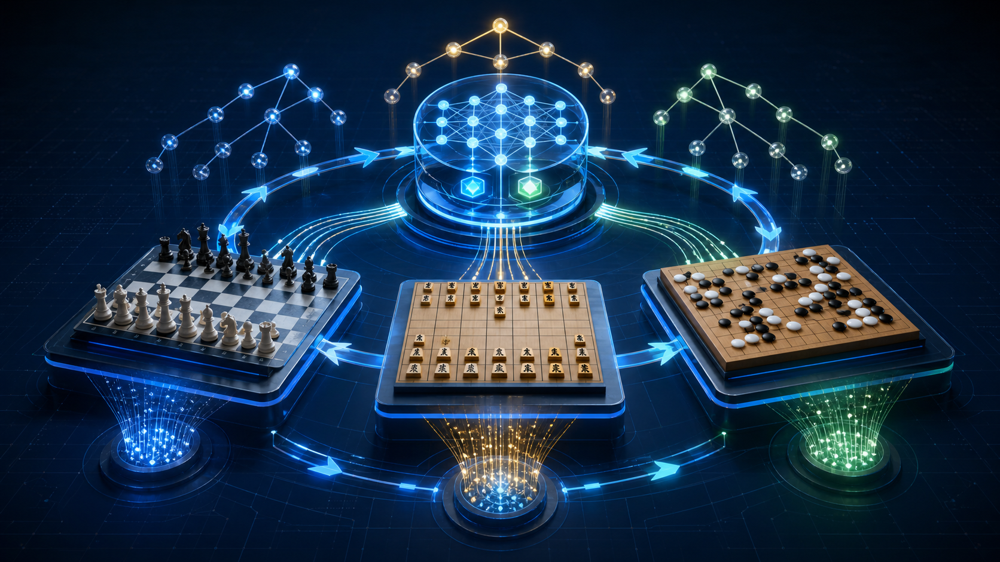
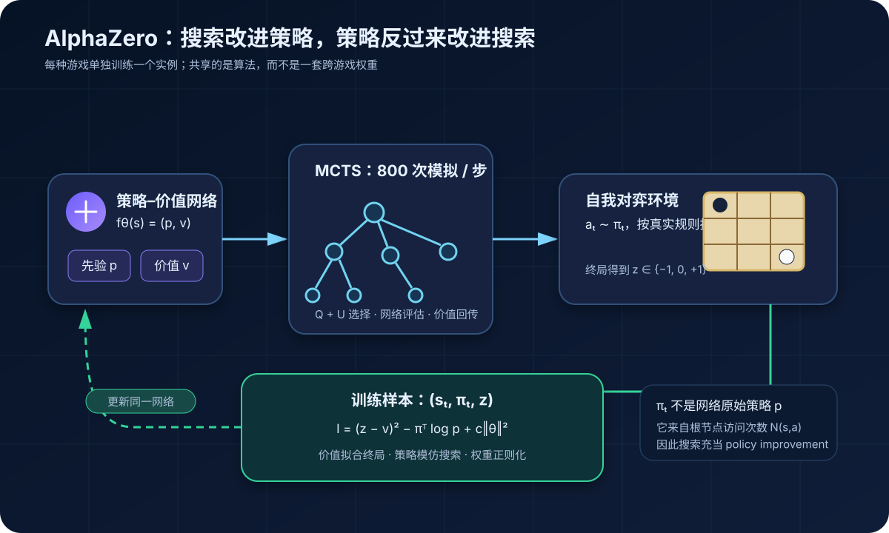
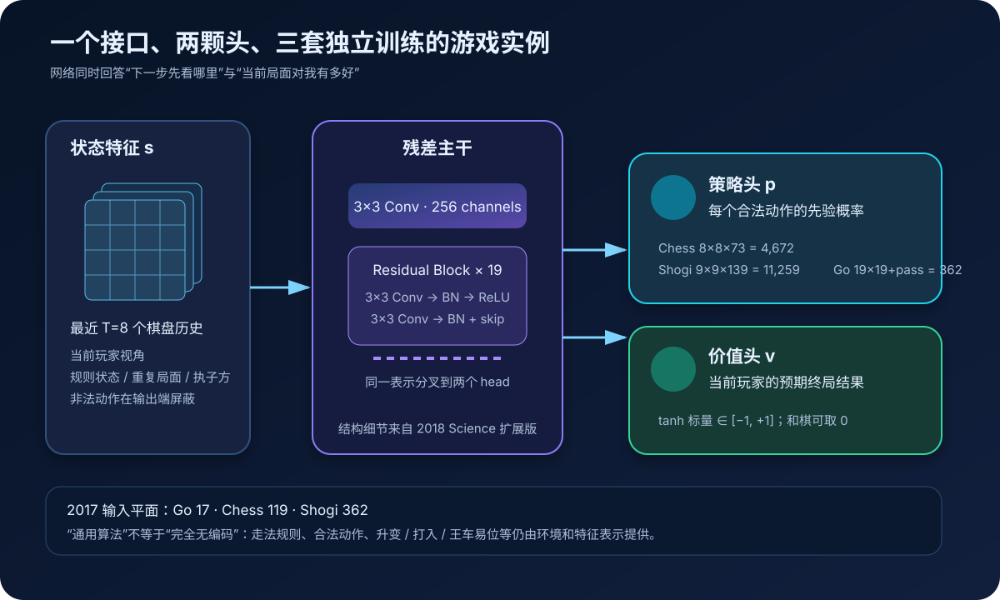
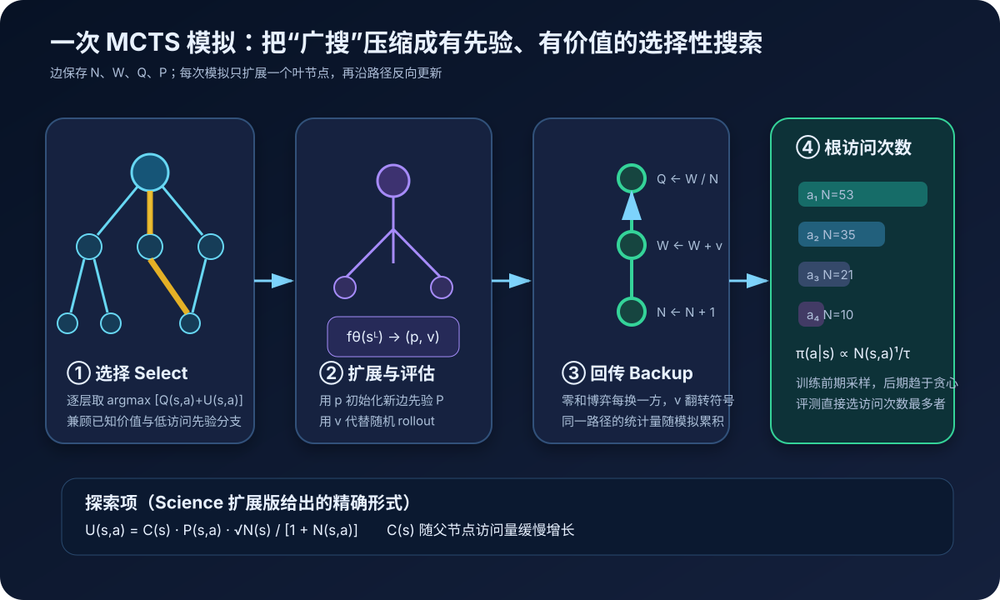
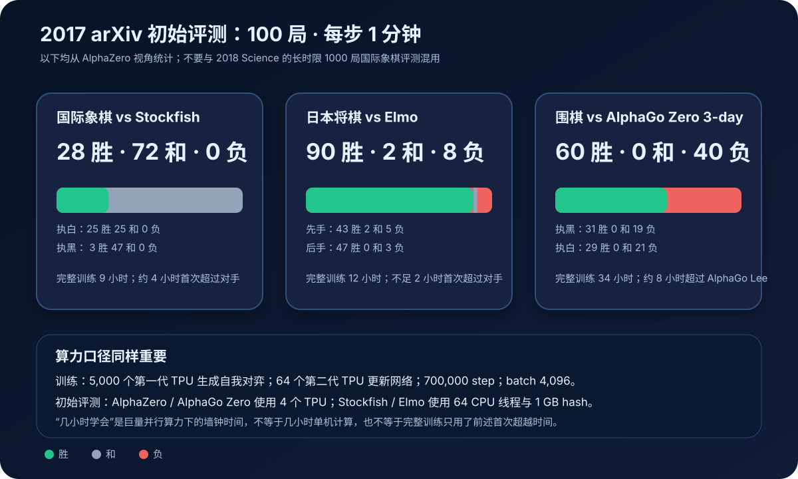

# AlphaZero 原理详解：用自我对弈，把搜索本身蒸馏回策略与价值网络



> **论文**：[Mastering Chess and Shogi by Self-Play with a General Reinforcement Learning Algorithm](https://arxiv.org/abs/1712.01815)<br>
> **作者**：David Silver、Thomas Hubert、Julian Schrittwieser、Ioannis Antonoglou、Matthew Lai、Arthur Guez、Marc Lanctot、Laurent Sifre、Dharshan Kumaran、Thore Graepel、Timothy Lillicrap、Karen Simonyan、Demis Hassabis<br>
> **版本**：arXiv v1 发布于 2017-12-05；2018 年以扩展实验和补充方法发表于 *Science*。本文以 2017 预印本为主，并单列两版差异<br>
> **关键词**：Self-Play、Reinforcement Learning、Monte Carlo Tree Search、PUCT、Policy–Value Network、Policy Iteration、Tabula Rasa<br>
> **配套代码**：[alphazero_minimal.py](./code/alphazero_minimal.py)（零依赖井字棋教学实现；保留算法闭环，不是论文规模复现）<br>
> **一手资料**：[arXiv 摘要页](https://arxiv.org/abs/1712.01815) · [2017 PDF](https://arxiv.org/pdf/1712.01815) · [2018 Science 论文](https://www.science.org/doi/10.1126/science.aar6404) · [作者公开的 Science 预印本与补充材料](https://storage.googleapis.com/deepmind-media/DeepMind.com/Blog/alphazero-shedding-new-light-on-chess-shogi-and-go/alphazero_preprint.pdf) · [DeepMind 介绍](https://deepmind.google/blog/alphazero-shedding-new-light-on-chess-shogi-and-go/)

## 0. 先说结论

AlphaZero 最容易被压缩成一句吸引眼球但不够准确的话：

> 一套不懂棋的 AI，在几小时内靠自己下棋超过了世界冠军程序。

更准确的表述是：

> AlphaZero 从随机初始化开始，不读人类棋谱，不使用开局库、残局表或人工估值函数；它拥有完整且精确的游戏规则，用一个策略–价值网络引导蒙特卡洛树搜索，再把搜索产生的更强策略与自我对弈的最终胜负训练回网络。研究团队为国际象棋、日本将棋和围棋分别训练了三个实例，但复用了同一套学习与搜索算法。

它的核心不是单独某个神经网络，也不是单独某种 MCTS，而是一个互相抬升的闭环：

```text
随机网络
  ↓
网络给出走法先验 p 与局面价值 v
  ↓
MCTS 用 p、v 做选择性搜索，得到更强的根策略 π
  ↓
按 π 自我对弈，终局得到胜负 z
  ↓
用 (s, π, z) 更新同一个网络
  ↓
更好的网络让下一轮搜索更准、更集中
  ↺
```



理解论文时要牢牢记住六点：

1. **策略网络的原始输出 $p$ 不是训练时真正执行的策略。**MCTS 把 $p$ 和 $v$ 改进成根访问分布 $\pi$。
2. **$\pi$ 是策略监督，$z$ 是价值监督。**搜索告诉网络“哪些动作值得选”，终局告诉网络“这个局面最终怎样”。
3. **这是搜索与学习的交替改进。**网络压缩历史搜索经验，搜索在当前局面上投入额外计算，再产生比网络更强的目标。
4. **一个网络同时输出 policy 与 value。**前者负责缩小搜索范围，后者让叶节点不必随机 rollout 到终局。
5. **“通用”指算法与主要超参数跨游戏复用。**不是一个权重文件同时下三种棋，更不是完全没有游戏编码。
6. **“几小时”是 5,000 个自我对弈 TPU 高度并行后的墙钟时间。**它不是单机几小时，也不能脱离总算力解读。

一句话记忆：

> AlphaZero 用 MCTS 充当局部 policy improvement，用神经网络充当搜索经验的全局压缩器，再以自我对弈不断重复这两步。

---

## 1. 论文要解决的，不只是“怎样下好国际象棋”

### 1.1 传统顶级棋类程序是一座工程知识塔

2017 年的 Stockfish 与 Elmo 已经极强。它们的典型配方包括：

- 高度优化的 alpha–beta 搜索；
- 人工设计或长期调优的局面评估项；
- 走法排序、剪枝、延伸和静态搜索；
- 开局与残局相关知识；
- 为特定棋种写下的大量工程适配。

这种路线非常成功，但有一个科学问题：

> 如果换一个游戏，过去几十年积累的评估函数与搜索技巧还能直接迁移多少？

AlphaZero 要验证的命题更一般：

> 能否只给系统规则和胜负目标，让同一学习算法自己发现有效的评估、走法偏好和搜索重点？

因此，国际象棋、将棋与围棋不是三个互不相干的榜单任务，而是一次跨域压力测试：

| 性质 | 国际象棋 | 日本将棋 | 围棋 |
|---|---|---|---|
| 棋盘 | $8\times8$ | $9\times9$ | $19\times19$ |
| 典型结构 | 长程棋子、升变、王车易位 | 俘虏可重新打入，分支更大 | 落子局部、全局领地 |
| 和棋 | 常见 | 存在 | 论文设置下无和棋结果 |
| 规则对称性 | 兵只向前，王翼/后翼不对称 | 方向与升变区不对称 | 旋转、翻转较自然 |
| 传统强程序 | Stockfish | Elmo | AlphaGo 系列 |

同一算法能在这些结构差异明显的环境中工作，才是标题里 **general reinforcement learning algorithm** 的主要证据。

### 1.2 AlphaGo 已证明“学习 + 搜索”有效，但还不够通用

2016 年的 AlphaGo 使用过人类棋谱、监督学习、强化学习、策略网络、价值网络与 rollout。2017 年的 [AlphaGo Zero](https://www.nature.com/articles/nature24270) 已经去掉人类棋谱，从自我对弈开始训练。

AlphaZero 再往前一步：

- 从只处理围棋，扩展到国际象棋和将棋；
- 从只优化胜负，改为优化可包含和棋的期望结果；
- 去掉对棋盘旋转/翻转对称性的依赖；
- 去掉新旧网络之间的 55% 晋级门；
- 尽量复用同一网络结构、搜索流程与超参数。

所以它不是“AlphaGo 换一张棋盘”，而是在验证 AlphaGo Zero 的核心闭环能否脱离围棋特有假设。

---

## 2. 先统一符号：AlphaZero 到底学什么

设：

- $s_t$：第 $t$ 步的局面，按当前行动方视角表示；
- $a_t$：当前选择的动作；
- $f_\theta$：参数为 $\theta$ 的策略–价值网络；
- $p_t$：网络对合法动作给出的先验概率；
- $v_t$：网络预测的当前局面期望结果；
- $\pi_t$：MCTS 根节点访问次数形成的改进策略；
- $z\in\{-1,0,+1\}$：从相应玩家视角观察的终局结果。

网络接口只有一句：

$$
(p,v)=f_\theta(s).
$$

其中：

$$
p_a=\Pr(a\mid s),
\qquad
v\approx\mathbb E[z\mid s].
$$

但一次落子并不是直接做：

$$
a=\arg\max_a p_a.
$$

实际流程是：

$$
(p,v)
\xrightarrow{\text{MCTS}}
\pi
\xrightarrow{\text{sample / greedy}}
a.
$$

这个区别是整篇论文的轴心。

### 2.1 $p$ 是 amortized knowledge

$p$ 来自一次前向传播，速度固定，代表网络从大量历史自我对弈中压缩出的全局走法偏好。

它很快，但没有为“眼前这个局面”投入额外思考。

### 2.2 $\pi$ 是 test-time computation 后的策略

$\pi$ 来自数百次树搜索模拟。搜索会：

- 检查多个候选变化；
- 利用对手回应修正当前判断；
- 给未充分探索但先验较高的分支机会；
- 汇总多个叶节点的价值。

因此通常可以把 $\pi$ 看成比原始 $p$ 更强、但也更昂贵的策略。

### 2.3 $z$ 不属于搜索，它来自真实终局规则

一盘自我对弈结束后，环境按规则给出：

$$
z=
\begin{cases}
+1,&\text{当前样本所属玩家最终获胜},\\
0,&\text{和棋},\\
-1,&\text{最终失败}.
\end{cases}
$$

同一个物理终局，对双方样本的符号相反。代码里如果不统一玩家视角，价值训练和 MCTS 回传都会悄悄出错。

---

## 3. 一个网络，两种功能

### 3.1 为什么 policy 和 value 要共用主干

策略头回答：

> 在这个局面，哪些动作更值得搜索？

价值头回答：

> 不继续展开的话，这个局面对当前玩家大约有多好？

二者需要理解许多相同结构：

- 棋子配置与活动性；
- 王的安全；
- 空间、先手与长期结构；
- 局部战术和全局战略；
- 某个变化最终能否转化为胜势。

共享残差主干能复用表示，也让一次叶节点推理同时拿到 $p$ 和 $v$。



### 3.2 输入不是一句 FEN，而是空间特征平面

输入一般写成：

$$
N\times N\times(MT+L).
$$

- $N\times N$ 是棋盘；
- $T=8$ 组历史局面；
- $M$ 是每个时刻用于表示双方棋子的平面数；
- $L$ 是执子方、回合数和特殊规则状态等常量平面。

2017 预印本列出的总输入平面数是：

| 游戏 | 输入平面数 | 包含的典型信息 |
|---|---:|---|
| 围棋 | 17 | 最近落子历史、当前执子方 |
| 国际象棋 | 119 | 双方各类棋子历史、王车易位、重复、无进展步数等 |
| 日本将棋 | 362 | 棋盘历史、双方棋子、手中俘虏棋子与规则状态等 |

棋盘始终朝向当前玩家。这样“我方”与“对方”的语义保持一致，价值 $v$ 也总能解释为当前玩家视角。

### 3.3 动作不是一个可变长字符串

国际象棋动作被编码为：

$$
8\times8\times73=4672.
$$

含义是先选起点格，再选一个相对移动平面：

- 56 个后式长程移动：8 个方向 $\times$ 1 到 7 格；
- 8 个马步；
- 9 个低升变动作。

将棋动作编码为：

$$
9\times9\times139=11259,
$$

额外容纳升变与把俘虏棋子重新打入棋盘。

围棋则是：

$$
19\times19+1=362,
$$

最后一个动作是 pass。

这些向量包含许多当前局面不合法的动作。推理时把非法动作概率置零，再对合法集合重新归一化。

### 3.4 2018 Science 补充材料给出的残差网络细节

2017 预印本强调三种游戏使用同一卷积网络结构；2018 扩展版把结构写得更完整：

1. 一个带 BatchNorm 与 ReLU 的卷积输入层；
2. 19 个 residual block；
3. 每个 block 含两层 $3\times3$、256 通道卷积和 skip connection；
4. 策略头输出 73、139 或 362 个动作 logit 结构；
5. 价值头经 $1\times1$ 单通道卷积、256 维全连接层，最后以 tanh 输出一个标量。

这里的卷积本身也是归纳偏置：系统并非没有结构假设，而是假设棋盘邻域、平移共享和残差层适合三种棋类。

---

## 4. MCTS：不是随机模拟，而是被网络聚焦的搜索

AlphaZero 的每条树边 $(s,a)$ 保存四个统计量：

| 统计量 | 含义 |
|---|---|
| $N(s,a)$ | 经过这条边的次数 |
| $W(s,a)$ | 沿这条边得到的累计价值 |
| $Q(s,a)=W/N$ | 平均动作价值 |
| $P(s,a)$ | 网络给出的动作先验 |

一次模拟分四步。



### 4.1 Select：沿 $Q+U$ 向下走

在已经展开的节点，选择：

$$
a_t
=
\arg\max_a
\left[Q(s_t,a)+U(s_t,a)\right].
$$

2018 Science 补充材料给出的探索项是：

$$
U(s,a)
=
C(s)P(s,a)
\frac{\sqrt{N(s)}}{1+N(s,a)},
$$

其中：

$$
C(s)
=
\log\left(
\frac{1+N(s)+c_{\text{base}}}{c_{\text{base}}}
\right)
+c_{\text{init}}.
$$

拆开看：

- $Q$ 高：过去模拟表明这条边好；
- $P$ 高：网络认为它值得看；
- $N(s,a)$ 小：它还没被充分探索；
- $N(s)$ 增大：父节点拥有更多预算，可逐渐补看其他分支。

早期 $Q$ 还不可靠，$P$ 帮搜索冷启动；后期访问增多，数据逐渐覆盖先验。

### 4.2 Expand：只扩展当前到达的叶节点

当模拟第一次到达未展开的叶节点 $s_L$ 时，调用网络：

$$
(p,v)=f_\theta(s_L).
$$

然后为每个合法动作初始化：

$$
N(s_L,a)=0,
\quad
W(s_L,a)=0,
\quad
Q(s_L,a)=0,
\quad
P(s_L,a)=p_a.
$$

不是把所有后继继续暴力展开，而是到此停止这次模拟。

### 4.3 Evaluate：价值网络替代昂贵 rollout

传统 MCTS 常从叶节点用快速随机策略一直走到终局，再拿实际结果估值。

AlphaZero 直接使用网络价值 $v$：

$$
v\approx\mathbb E[z\mid s_L].
$$

这样每次模拟只需树内行走和一次网络评估，不必每次都下完整盘随机棋。

代价是：如果价值网络在分布外局面上严重误判，搜索也可能被引向错误区域。MCTS 的多叶节点平均能缓冲部分误差，但不能消灭系统性偏差。

### 4.4 Backup：把叶节点价值沿路径回传

沿路径反向更新：

$$
N(s_t,a_t)\leftarrow N(s_t,a_t)+1,
$$

$$
W(s_t,a_t)\leftarrow W(s_t,a_t)+v_t,
$$

$$
Q(s_t,a_t)\leftarrow
\frac{W(s_t,a_t)}{N(s_t,a_t)}.
$$

真正实现时必须处理玩家视角。若叶节点价值是“叶节点当前行动方”的价值，那么每向上跨过一手，玩家互换，符号就要反转：

```python
for parent, action in reversed(path):
    value = -value
    parent.visits[action] += 1
    parent.value_sum[action] += value
```

漏掉 `value = -value` 会让父节点把“对手的好局面”当成自己的好局面，是最常见也最隐蔽的 AlphaZero 实现错误之一。

---

## 5. 根访问次数怎样变成策略 $\pi$

完成若干次模拟后，不能只看网络 $p$，而是读取根节点的访问次数：

$$
\pi(a\mid s)
=
\frac{N(s,a)^{1/\tau}}
{\sum_bN(s,b)^{1/\tau}}.
$$

- $\tau=1$ 时保留访问次数比例；
- $\tau\to0$ 时接近只选择访问最多的动作；
- 较大 $\tau$ 增加多样性。

2017 Methods 明确区分：

- **训练自我对弈**：按根访问次数形成的分布选择动作；
- **正式评测**：对根访问次数贪心，选择访问最多的动作。

为什么用访问次数而不是最大 $Q$？

1. 单条边的 $Q$ 可能只来自少量幸运模拟；
2. 访问次数综合了先验、价值与多轮竞争；
3. 它天然形成一个平滑的分类目标；
4. MCTS 已把对手回应纳入考虑，访问分布比单次网络预测更强。

### 5.1 根节点为什么要加 Dirichlet 噪声

若每盘自我对弈都从同一网络、同一局面确定性搜索，数据会快速收缩到少数变化。AlphaZero 在根节点把先验改成：

$$
P'(s,a)
=(1-\varepsilon)P(s,a)+\varepsilon\eta_a,
\qquad
\eta\sim\operatorname{Dir}(\alpha).
$$

沿用 AlphaGo Zero 的设置时 $\varepsilon=0.25$。论文按典型合法动作数缩放浓度参数：

| 游戏 | $\alpha$ |
|---|---:|
| 国际象棋 | 0.30 |
| 日本将棋 | 0.15 |
| 围棋 | 0.03 |

分支越多，$\alpha$ 越小，噪声越稀疏，避免把概率平均撒到大量动作上。

噪声只服务于训练探索；正式评测不应继续随机扰动根先验。

---

## 6. 自我对弈怎样产生监督信号

一盘训练棋在每一步做：

$$
\pi_t=\operatorname{MCTS}(s_t,f_\theta),
$$

$$
a_t\sim\pi_t,
$$

$$
s_{t+1}=\operatorname{Rules}(s_t,a_t).
$$

终局后得到 $z$，并把一盘棋拆成许多样本：

$$
(s_0,\pi_0,z_0),
(s_1,\pi_1,z_1),
\ldots,
(s_{T-1},\pi_{T-1},z_{T-1}).
$$

其中 $z_t$ 必须从 $s_t$ 当前行动方视角表示，所以随玩家交替变号。

### 6.1 为什么不直接拿实际动作做 one-hot 标签

一盘棋每步只实际执行一个 $a_t$，但 MCTS 已经比较过许多候选动作。

若标签只是执行动作的 one-hot：

- 大量搜索信息被丢掉；
- 两个访问次数接近的好动作被强行分成“正确/错误”；
- 采样噪声会直接进入监督。

用完整 $\pi_t$，等于把一次昂贵搜索的软结论蒸馏进网络。

### 6.2 为什么价值目标用最终胜负，而不是当前 $Q$

搜索 $Q$ 来自当前网络价值的回传，直接拿它监督价值头容易形成自我循环。

终局 $z$ 是由规则计算的外部锚点：

- 不依赖网络自信程度；
- 不依赖某条搜索路径的估值；
- 保证价值最终对齐真实胜负目标。

代价是奖励非常稀疏。中盘每个局面的价值都要等整盘结束后才能得到。

---

## 7. 三项损失分别负责什么

网络目标是：

$$
(p,v)=f_\theta(s),
$$

$$
\mathcal L(\theta)
=(z-v)^2
-\pi^\top\log p
+c\lVert\theta\rVert_2^2.
$$

### 7.1 价值损失

$$
\mathcal L_v=(z-v)^2.
$$

让 $v$ 逼近最终结果。它把整盘信用分配压缩成每个局面的回归问题。

### 7.2 策略损失

$$
\mathcal L_p=-\pi^\top\log p.
$$

这是 $\pi$ 对网络 $p$ 的交叉熵。直观上是：

> 下一次再见到类似局面，不要重新从均匀分支开始，把本次搜索发现的重点直接写进先验。

### 7.3 权重正则

$$
\mathcal L_{\text{reg}}=c\lVert\theta\rVert_2^2.
$$

抑制参数无约束增长，改善训练稳定性。

### 7.4 这是不是 policy gradient

论文把整体框架归入强化学习，因为：

- 数据由当前策略与环境交互产生；
- 没有固定离线标签；
- 策略变化会改变未来训练分布；
- 唯一外部任务信号是终局胜负。

但单次网络更新更像监督学习：

- policy 头拟合搜索分布 $\pi$；
- value 头回归终局结果 $z$；
- 没有直接使用 REINFORCE 的 $z\nabla\log p(a\mid s)$。

因此最好把它理解为：

> 强化学习产生数据与改进算子，监督损失完成函数逼近。

---

## 8. 真正的核心：近似广义策略迭代

把一轮训练抽象成两个算子：

### 8.1 Improvement：搜索比当前网络多想一会儿

$$
\pi_k
=
\mathcal I_{\text{MCTS}}(p_{\theta_k},v_{\theta_k}).
$$

MCTS 使用当前网络做先验与叶节点评估，通过局部计算得到更强策略 $\pi_k$。

### 8.2 Evaluation / Projection：把昂贵搜索压回网络

$$
\theta_{k+1}
\approx
\arg\min_\theta
\mathbb E_{(s,\pi,z)\sim\text{self-play}}
\left[
(z-v_\theta(s))^2
-\pi^\top\log p_\theta(s)
\right].
$$

网络无法逐局保存整棵树，只能把搜索结果投影到有限参数中。这种投影未必完全复制 $\pi$，但能跨局面泛化。

闭环因此形成：

```text
fθ 近似知道怎么下
  ↓ MCTS 在当前局面做额外计算
π 比 fθ 的原始 p 更强
  ↓ 交叉熵投影
新的 fθ 吸收 π 的经验
  ↓ 新的自我对弈分布
看到更强、更深的新局面
```

这也是 AlphaZero 与普通行为克隆的根本区别：行为克隆的老师是固定数据集；AlphaZero 的“老师”由学生当前能力加搜索临时构造，而且老师随学生一起增强。

### 8.3 为什么这个闭环能从随机开始

最初 $p$ 接近随机，$v$ 也不准，但系统仍有三个非随机锚点：

1. 游戏规则保证状态转移正确；
2. 终局评分给出真实 $z$；
3. MCTS 的探索项保证不只看一个分支。

早期改进很微弱，但只要搜索后的 $\pi$ 平均略优于原始策略，网络就能吸收这点增益，再产生稍强的数据分布。数百万盘并行自我对弈把小优势累积起来。

这不是证明任何游戏上都必然收敛，而是一个在三种确定性完全信息零和棋类上被大规模验证的经验机制。

---

## 9. AlphaZero 相比 AlphaGo Zero 改了什么

| 组件 | AlphaGo Zero | AlphaZero |
|---|---|---|
| 价值目标 | 围棋胜/负概率 | 期望结果，允许 $z=0$ 和棋 |
| 数据增强 | 使用 8 种旋转/翻转 | 不假设对称性，不做这类增强 |
| 搜索输入变换 | 随机旋转/翻转后评估 | 不变换棋盘 |
| 网络晋级 | 新网络胜率超过旧最佳 55% 才替换 | 维护一张持续更新的网络 |
| 自我对弈方 | 当前“最佳网络” | 最新网络参数 |
| 超参数 | 针对围棋得到 | 三种游戏尽量复用 |
| 游戏实例 | 围棋 | Chess、Shogi、Go 分别训练 |

### 9.1 为什么要去掉 55% gate

AlphaGo Zero 把训练分成离散迭代：

1. 候选网络训练完成；
2. 与当前最佳网络对战；
3. 胜率超过 55% 才晋级；
4. 新自我对弈改用晋级后的网络。

AlphaZero 直接持续更新同一网络，减少了评测门槛与同步阶段，也让自我对弈更快使用最新能力。

代价是网络可能短期退化，不再由显式 gate 阻止。论文用大规模稳定训练和重复实验说明该做法在这里可行，但这不意味着任何自我对弈系统都可以无条件去掉版本评估。

### 9.2 为什么去掉对称增强很重要

围棋规则较适合旋转与翻转；国际象棋的兵只能前进，王翼和后翼易位也不对称。若通用算法把几何对称写死，就无法自然迁移。

AlphaZero 宁愿让网络自己学方向差异，也不把围棋特性写进通用训练流程。

---

## 10. “从零开始、没有领域知识”到底是什么意思

论文的 tabula rasa 不是说程序连规则都不知道。

### 10.1 没有使用的知识

AlphaZero 没有使用：

- 人类棋谱；
- 人工开局库；
- 残局表库；
- 手工棋子价值；
- 针对局面结构写下的评估函数；
- 特定棋种的搜索启发式扩展。

### 10.2 明确使用的知识

2018 补充材料专门列出它获得的领域信息：

1. **棋盘是网格。**输入和输出按空间平面组织；
2. **完美规则模型。**MCTS 能精确执行动作、判断终局并评分；
3. **规则状态编码。**包括王车易位、重复局面、无进展规则、升变、将棋打入等；
4. **合法动作掩码。**系统知道哪些动作不能下；
5. **典型分支数。**用于缩放根 Dirichlet 噪声；
6. **最大步数规则。**Chess / Shogi 超过 512 步判和，Go 超过 722 步按规则计分。

所以更严谨的说法是：

> AlphaZero 没有人类战略知识和示范数据，但拥有精确环境模型、规则特征与棋盘归纳偏置。

### 10.3 它究竟是 model-free 还是 model-based

若“模型”指一个学习得到的环境动力学网络，AlphaZero 没有训练 world model。

若“model-based”指规划时能调用状态转移模型，那么它显然拥有游戏规则这个完美 simulator，MCTS 正是在其中展开未来。

因此不宜用一句“纯 model-free RL”概括它。更清楚的描述是：

> 学习策略与价值，使用已知规则模型做在线规划。

---

## 11. 三种游戏共享什么，又不共享什么

论文明确写的是 **separate instances**。

| 项目 | 是否共享 |
|---|---|
| 自我对弈流程 | 是 |
| MCTS / PUCT 算法 | 是 |
| policy–value 联合目标 | 是 |
| 主体网络结构 | 是 |
| 主要训练设置 | 尽量共享 |
| 根噪声 $\alpha$ | 否，按分支数缩放 |
| 学习率下降时点 | 版本/游戏间有差异 |
| 输入与动作平面 | 否，服从各自规则 |
| 训练数据 | 否 |
| 网络参数 $\theta$ | **否** |

所以：

```text
正确：同一算法分别训练出 chess-AZ、shogi-AZ、go-AZ
错误：一个多任务 AlphaZero 权重同时在三张棋盘上切换
```

这项工作证明的是算法层面的通用性，还没有证明跨游戏表示迁移或一套权重的多任务泛化。

---

## 12. 2017 预印本的训练规模

三种游戏都从随机参数开始，训练：

$$
700{,}000\ \text{mini-batches},
\qquad
\text{batch size}=4096.
$$

训练期硬件：

- 5,000 个第一代 TPU 生成自我对弈；
- 64 个第二代 TPU 更新神经网络。

每步训练搜索使用 800 次 MCTS 模拟。

| 2017 配置 | 国际象棋 | 日本将棋 | 围棋 |
|---|---:|---:|---:|
| 完整训练墙钟时间 | 9 小时 | 12 小时 | 34 小时 |
| 自我对弈局数 | 4,400 万 | 2,400 万 | 2,100 万 |
| 每步模拟 | 800 | 800 | 800 |
| 训练时等效思考时间 | 40 ms | 80 ms | 200 ms |
| 根噪声 $\alpha$ | 0.30 | 0.15 | 0.03 |

初始学习率是 0.2，之后降为：

$$
0.02\rightarrow0.002\rightarrow0.0002.
$$

### 12.1 “4 小时学会国际象棋”哪里不准确

论文曲线报告：

- Chess 约 4 小时、300k step 首次超过 Stockfish；
- Shogi 不足 2 小时、110k step 首次超过 Elmo；
- Go 约 8 小时、165k step 超过 AlphaGo Lee。

但完整训练仍是 9 / 12 / 34 小时。前者是学习曲线与某条基线的首次交点，后者是最终模型训练时长。

而且“小时”只表示墙钟时间：4,400 万盘国际象棋能在 9 小时内生成，靠的是数千 TPU 并发，不是算法只消耗了普通电脑 9 小时。

---

## 13. 2017 初始评测结果怎样读

评测设置：

- 每组 100 局；
- 每步固定思考 1 分钟；
- AlphaZero / AlphaGo Zero 使用一台含 4 个 TPU 的机器；
- Stockfish 8 / Elmo 使用 64 CPU 线程与 1 GB hash；
- 双方关闭 pondering，并启用各自认输规则。



从 AlphaZero 视角汇总：

| 对手 | 胜 | 和 | 负 |
|---|---:|---:|---:|
| Stockfish 8 | 28 | 72 | 0 |
| Elmo | 90 | 2 | 8 |
| AlphaGo Zero 3-day | 60 | 0 | 40 |

国际象棋再按执色拆分：

- AlphaZero 执白：25 胜、25 和、0 负；
- AlphaZero 执黑：3 胜、47 和、0 负。

日本将棋：

- AlphaZero 先手：43 胜、2 和、5 负；
- AlphaZero 后手：47 胜、0 和、3 负。

围棋：

- AlphaZero 执黑：31 胜、19 负；
- AlphaZero 执白：29 胜、21 负。

### 13.1 这些结果能说明什么

它们强有力地说明：在论文设定与硬件配置下，完整训练的 AlphaZero 明显超过所选顶级基线；特别是对 Stockfish 的 100 局不败，引发了广泛关注。

### 13.2 这些结果不能说明什么

它们不等于：

- 数学证明 AlphaZero 是完美棋手；
- 证明国际象棋已被求解；
- 所有硬件预算下都优于所有 Stockfish 配置；
- 三种胜率可以不考虑和棋率直接比较；
- 100 局足以精确估计极小负率。

国际象棋高水平对局和棋很多，Elo 差会被压缩；有限局数的“不败”也只是样本结果，不是失败概率为零。

---

## 14. 少看一千倍局面，为什么仍然更强

2017 版报告的每秒局面评估数：

| 游戏 | AlphaZero | 传统对手 |
|---|---:|---:|
| Chess | 8 万 | Stockfish 7,000 万 |
| Shogi | 4 万 | Elmo 3,500 万 |
| Go | 1.6 万 | — |

AlphaZero 不是搜索更多，而是让每次评估更贵、更有信息：

- policy $p$ 把预算集中在少数高潜力分支；
- value $v$ 给出非线性深层局面判断；
- MCTS 汇总多个搜索叶，不必穷举大量低价值变化。

粗略地说：

$$
\text{搜索强度}
\neq
\text{每秒节点数},
$$

更像是：

$$
\text{有效搜索}
\approx
\text{节点数量}
\times
\text{节点选择质量}
\times
\text{叶节点评估质量}.
$$

但“少看一千倍”也不能直接解释成能效更高。一次 TPU 深度网络评估与一次 CPU 手工评估的成本不同，硬件、批处理、功耗和延迟都不在同一单位里。

### 14.1 MCTS 为什么可能比 alpha–beta 更适配神经估值

论文提出一种解释：

- alpha–beta 接近显式 minimax，某个叶节点的严重估值误差可能沿主变化直接传到根；
- AlphaZero 的 MCTS 对一个子树内多个叶节点价值做平均，部分无偏或方向不同的误差可能相互抵消。

这是论文的机制推测，不是一般定理。若神经网络在一类变化上有系统性盲点，平均也未必能救回来。

### 14.2 它真的“重新发明”了人类开局吗

论文分析了人类数据库中常见的多个国际象棋开局，发现 AlphaZero 在自我对弈中也会独立走出 English Opening、Queen's Gambit、Sicilian Defence、Ruy Lopez 等结构，并在从这些开局开始的对局中击败 Stockfish。

这说明有效战略结构可以从规则与自我对弈中涌现，不必由棋谱监督注入。

但不能据此说它的内部概念与人类理论完全相同：

- 同一落子序列可能来自不同评估依据；
- 开局频率受自我对弈策略与搜索温度影响；
- “发现某个开局”不等于用人类术语理解它。

---

## 15. 2017 arXiv 与 2018 Science：为什么数字不一样

网上经常同时出现“Go 训练 34 小时”和“Go 训练 13 天”，“64 个训练 TPU”和“16 个训练 TPU”。它们分别来自两版实验，不是简单笔误。

| 项目 | 2017 arXiv 预印本 | 2018 Science 扩展版 |
|---|---|---|
| 标题 | *Mastering Chess and Shogi…* | *A general reinforcement learning algorithm…* |
| Chess 完整训练 | 9 小时 | 9 小时 |
| Shogi 完整训练 | 12 小时 | 12 小时 |
| Go 完整训练 | 34 小时 | 约 13 天 |
| 网络训练硬件 | 64 个第二代 TPU | 16 个第二代 TPU |
| 自我对弈硬件 | 5,000 个第一代 TPU | 5,000 个第一代 TPU |
| Go 超过 AlphaGo Lee | 约 8 小时 / 165k step | 约 30 小时 / 74k step |
| Chess 主评测 | 100 局、每步 1 分钟 | 1,000 局、3 小时基础时限 + 每步 15 秒 |
| Chess 对手 CPU | 64 线程、1 GB hash | 44 核，按 TCEC 机器设置 |
| Chess 结果 | 28–72–0 | 155–839–6 |
| Shogi 结果 | 90–2–8 | 胜率 91.2% |
| Go 对 AG0 | 60–40 | 胜率 61% |

Science 版的主要意义不是推翻 2017 结果，而是：

- 延长 Go 训练；
- 增加独立训练运行，检查重复性；
- 使用更长、更严格的正式对局；
- 给出更完整的搜索、表示、架构与配置细节；
- 在更接近竞赛设置的 Stockfish 配置下仍保持明显优势。

引用数字时应注明版本。尤其不要在同一段中写成：

```text
64 个训练 TPU + Go 13 天 + 155 胜 839 和 6 负
```

这会把 2017 的硬件与 2018 的时长、赛果拼成一个不存在的实验。

---

## 16. 最小代码：在井字棋上跑通完整闭环

完整教学实现见：[alphazero_minimal.py](./code/alphazero_minimal.py)。

它保留：

- 当前玩家视角的状态；
- policy–value 双输出接口；
- PUCT 选择；
- 叶节点扩展、评估与符号翻转回传；
- 根 Dirichlet 噪声；
- 访问次数策略 $\pi$；
- 自我对弈样本 $(s,\pi,z)$；
- value MSE + policy cross-entropy；
- 对随机策略的独立评测。

为保持零依赖和秒级运行，它把：

```text
国际象棋 / 将棋 / 围棋  →  井字棋
19-block ResNet           →  表格 policy/value 参数
5,000 个 TPU worker       →  单进程循环
800 simulations / move    →  默认 40 simulations / move
```

这不是性能复现，而是算法结构复现。

### 16.1 当前玩家视角

```python
@dataclass(frozen=True)
class State:
    # own pieces = +1, opponent pieces = -1
    board: tuple[int, ...] = (0,) * 9

    def play(self, action: int) -> "State":
        next_board = list(self.board)
        next_board[action] = 1
        # 执行动作后换人，把整个棋盘翻成新行动方视角
        return State(tuple(-piece for piece in next_board))
```

这一规范让同一套模型无需额外传入“X 还是 O”，但意味着终局与回传都必须按当前视角解释。

### 16.2 简化 PUCT

代码为了教学可读性，用常数 $c_{\text{puct}}$ 代替 Science 版缓慢变化的 $C(s)$：

```python
q_value = value_sum[action] / count if count else 0.0
exploration = (
    c_puct * prior[action] * sqrt(parent_visits) / (1 + count)
)
score = q_value + exploration
```

控制结构与论文一致，探索系数细节是明确的简化。

### 16.3 搜索访问分布

```python
weights = {
    action: root.visits[action] ** (1.0 / temperature)
    for action in root.visits
}
pi = {action: weight / sum(weights.values()) for action, weight in weights.items()}
```

注意训练标签是 `pi`，不是网络 `prior`，也不是最终只执行的一个动作。

### 16.4 终局结果回填

```python
outcome = terminal_state.terminal_value()
examples = []
for old_state, policy in reversed(history):
    outcome = -outcome
    examples.append((old_state, policy, outcome))
```

每逆推一步，行动方切换一次，所以 $z$ 翻一次符号。

### 16.5 训练目标

```python
policy_gradient = p[action] - pi.get(action, 0.0)
value_gradient = 2.0 * (v - z) * (1.0 - v * v)
```

第二项中的 $(1-v^2)$ 来自 $v=\tanh(\text{raw value})$ 的链式求导。

### 16.6 运行

```bash
python3 papers/to-2026/code/alphazero_minimal.py --test
python3 papers/to-2026/code/alphazero_minimal.py \
  --iterations 12 \
  --games 12 \
  --simulations 40
```

仓库检查时使用更短的 6 轮配置，固定随机种子得到：

```text
all tests passed
iteration=01 positions=  64 loss=1.9772
...
iteration=06 positions= 365 loss=1.7347
vs random (100 games): 82 wins / 16 draws / 2 losses
```

不要把这组井字棋数字与论文结果并列。它只证明搜索、样本生成、训练和评测能首尾相接；小型表格模型、随机波动与极小状态空间都和论文不同。

---

## 17. 从教学实现到可用复现，还缺哪些工程件

### 17.1 一个无歧义的 Game API

至少要提供：

```text
initial_state()
legal_actions(state)
next_state(state, action)
is_terminal(state)
terminal_value(state, player)
encode_state(state)
encode_action(action)
```

规则引擎的 bug 会直接污染“真实”标签 $z$，比普通数据噪声更危险。

### 17.2 batched inference service

MCTS 每次只产生一个叶节点请求，单独送入加速器会浪费吞吐。论文把许多并行自我对弈局面的叶节点组成 batch，再调用网络。

真实系统需要权衡：

- 等待更多叶节点可提高吞吐；
- 但等待会增加单步延迟；
- worker 太多会让网络版本陈旧；
- batch 太小会浪费 TPU/GPU。

### 17.3 并行树搜索

若多个线程同时搜索同一根节点，需要避免都冲向相同路径。常见工程方案包括 virtual loss、节点锁和异步批量评估。

这些是实现并发的手段，不应和论文核心数学目标混为一谈。

### 17.4 replay buffer 与版本管理

自我对弈数据是 on-policy 附近的数据流。系统要决定：

- 保留最近多少局；
- 每个样本训练多少次；
- worker 多久拉一次新参数；
- 崩溃后怎样恢复训练步、优化器和随机状态；
- 如何避免一个短期退化网络迅速污染全部数据。

### 17.5 训练与评测必须分离

训练可使用：

- 根噪声；
- 温度采样；
- resign 阈值；
- 快速 800 次模拟。

正式评测则应：

- 关闭根噪声；
- 对访问次数贪心；
- 固定硬件与时间控制；
- 交替先后手；
- 报告胜/和/负与置信区间；
- 保存对局记录和完整配置。

混用训练探索和评测策略，会让结果不可解释。

### 17.6 不要只记录最终 Elo

还应监控：

- policy entropy；
- 根访问分布与原始 $p$ 的 KL；
- value calibration；
- 胜/和/负比例；
- 平均对局长度；
- 非法动作 mask 率；
- 每秒叶节点评估数；
- self-play worker 的网络版本延迟；
- 固定开局集上的能力变化。

否则 loss 看似稳定，规则视角或价值符号早已错掉，也可能很久才被发现。

---

## 18. 局限与应该保留的质疑

### 18.1 算力成本巨大

5,000 个自我对弈 TPU 让墙钟时间非常短，也让实验难以由普通研究团队原样复现。

论文证明了方法上限，不等于提供了低成本配方。

### 18.2 需要完美、廉价、可复制的规则环境

棋类有几个罕见优势：

- 状态完全可观测；
- 动作合法性精确；
- 转移确定；
- 模拟不会伤害真实世界；
- 可以无限复制环境；
- 终局胜负客观。

机器人、开放网络环境、医疗或对话没有这么干净的 simulator。把 AlphaZero 直接搬过去，会立即遇到模型误差、安全成本和奖励定义问题。

### 18.3 任务范围仍窄

三个任务都是：

- 双人；
- 轮流行动；
- 完全信息；
- 零和；
- 离散动作；
- 可精确模拟。

它没有直接解决多智能体合作、非零和博弈、部分可观测、随机动力学或连续控制。

### 18.4 稀疏终局奖励导致样本量惊人

价值学习只靠最终 $z$，中间没有人工 shaping。概念上优雅，数据上昂贵：2017 版为三种游戏分别生成数千万盘自我对弈。

### 18.5 评测硬件不是天然可比单位

“双方每步一分钟”控制了墙钟时间，但：

- 一方运行在 TPU，一方运行在 CPU；
- 内存、批处理、并行结构不同；
- Stockfish 的 hash、线程和版本设置会影响实力；
- 节点数不能直接换算成 FLOPs 或能耗。

2018 Science 版使用更严格的长时限和 TCEC 风格配置，是对初始评测质疑的重要补充；它仍不能把异构程序比较变成完全无争议的单一数字。

### 18.6 复现透明度有限

论文和补充材料披露了核心算法、表示、网络与多项配置，但没有把训练数千万盘所需的完整生产系统和论文模型检查点变成一个普通团队可直接重跑的官方端到端包。

因此社区实现可以复现思想和缩小版能力，不能自动等同于复现论文算力、数据流和最终强度。

### 18.7 卷积结构并非真正领域无关

棋盘平面与卷积非常匹配。对图、文本、集合或不规则空间，状态表示和动作结构仍需要重新设计。

论文证明的是“跨三种棋盘游戏的算法通用性”，不是“任何任务无需架构选择”。

---

## 19. 常见误解

### 误解 1：一个 AlphaZero 模型同时会下三种棋

不是。三种游戏分别训练参数，只共享算法和主体配置。

### 误解 2：AlphaZero 完全不知道规则

不是。它没有人类策略知识，但拥有完整规则、合法动作、终局评分与规则状态编码。

### 误解 3：它训练 4 小时就得到了论文最终国际象棋模型

不是。4 小时是学习曲线首次超过 Stockfish 的时点，完整训练约 9 小时，而且使用数千 TPU 并发。

### 误解 4：MCTS 就是把随机棋一直下到终局

不是。AlphaZero 在叶节点调用神经网络，用 $v$ 评估，不执行传统随机 rollout。

### 误解 5：网络 policy $p$ 直接决定动作

不是。$p$ 是搜索先验；根访问次数形成的 $\pi$ 才是自我对弈动作分布与训练目标。

### 误解 6：价值头在预测棋子分或人类胜率标签

不是。它回归自我对弈最终结果的期望值，不需要人工局面分。

### 误解 7：AlphaZero 是纯粹无模型强化学习

不严谨。它不学习环境模型，却在精确游戏规则模型中做 MCTS 规划。

### 误解 8：2017 与 2018 的数字可以自由拼接

不可以。Go 训练时长、训练 TPU 数、正式时限、对手硬件和赛果都变过，引用必须注明版本。

### 误解 9：它每秒只看更少节点，所以总能耗一定更低

不成立。节点的硬件与计算成本完全不同，论文节点速率不是能效指标。

### 误解 10：100 局不败证明它永远不会输

不是。有限样本中的 0 负不等于真实负率为零；Science 长时限 1000 局中也出现了 6 负。

---

## 20. 它为什么影响了后来的推理系统

AlphaZero 给后来很多“训练 + 搜索”系统留下了一个通用模板：

```text
快速模型给先验和估值
        ↓
推理时搜索产生更强候选
        ↓
可验证结果提供外部锚点
        ↓
把昂贵推理蒸馏回快速模型
```

这与今天语言模型中的若干路线有结构相似性：

- best-of-N / tree search 生成多个推理候选；
- verifier 或 reward model 评估中间状态和答案；
- 搜索轨迹回流为训练数据；
- test-time compute 与参数内能力交换。

但类比不能过度：

| 棋类 AlphaZero | 语言推理 |
|---|---|
| 动作是否合法可精确判断 | 文本下一步通常没有严格合法集合 |
| 规则转移完美 | 世界知识与工具状态可能不完整 |
| 终局胜负客观 | 开放回答常没有唯一奖励 |
| 可无限自我对弈 | 合成数据可能积累偏差 |
| 对手明确、零和 | 用户目标通常不是零和博弈 |

AlphaZero 最可迁移的不是某个棋盘张量，而是这条设计原则：

> 让推理时计算产生比基础模型更强的目标，再把这种改进持续写回模型；同时必须保留一个不依赖模型自信的外部验证锚点。

---

## 21. 一页纸记住 AlphaZero

### 输入与网络

$$
(p,v)=f_\theta(s).
$$

- $p$：动作先验；
- $v$：当前玩家的期望结果。

### 搜索选择

$$
a=\arg\max_a[Q(s,a)+U(s,a)],
$$

$$
U(s,a)=C(s)P(s,a)\frac{\sqrt{N(s)}}{1+N(s,a)}.
$$

### 改进策略

$$
\pi(a\mid s)
\propto
N(s,a)^{1/\tau}.
$$

### 自我对弈数据

$$
(s_t,\pi_t,z_t).
$$

### 训练目标

$$
\mathcal L
=(z-v)^2
-\pi^\top\log p
+c\lVert\theta\rVert^2.
$$

### 改进闭环

$$
f_{\theta_k}
\xrightarrow{\text{MCTS}}
\pi_k
\xrightarrow{\text{self-play}}
(s,\pi,z)
\xrightarrow{\text{SGD}}
f_{\theta_{k+1}}.
$$

### 三个边界

- 同一算法，三套独立权重；
- 无人类棋谱，不等于无游戏规则；
- 墙钟几小时，不等于低计算量。

最终一句话：

> AlphaZero 的突破，是把“搜索得到的临时智慧”变成可学习的策略标签，把“最终胜负”变成价值标签，让网络与搜索在数千万盘自我对弈中互相升级。

---

## 参考资料

1. Silver et al., [Mastering Chess and Shogi by Self-Play with a General Reinforcement Learning Algorithm](https://arxiv.org/abs/1712.01815), arXiv, 2017.
2. Silver et al., [A general reinforcement learning algorithm that masters chess, shogi, and Go through self-play](https://www.science.org/doi/10.1126/science.aar6404), *Science*, 2018.
3. DeepMind, [AlphaZero: Shedding new light on chess, shogi, and Go](https://deepmind.google/blog/alphazero-shedding-new-light-on-chess-shogi-and-go/), 2018.
4. Silver et al., [Mastering the game of Go without human knowledge](https://www.nature.com/articles/nature24270), *Nature*, 2017.
