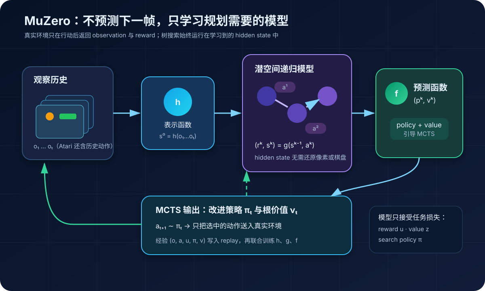
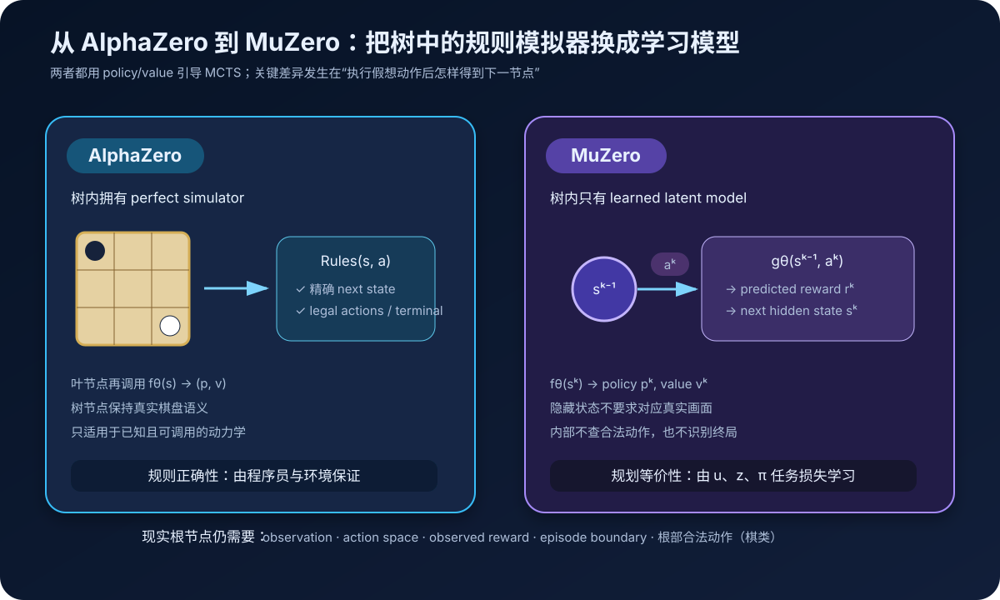
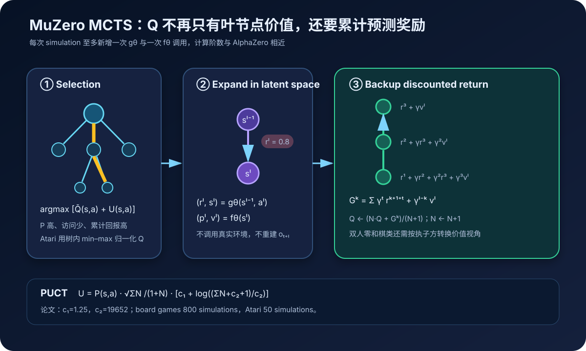
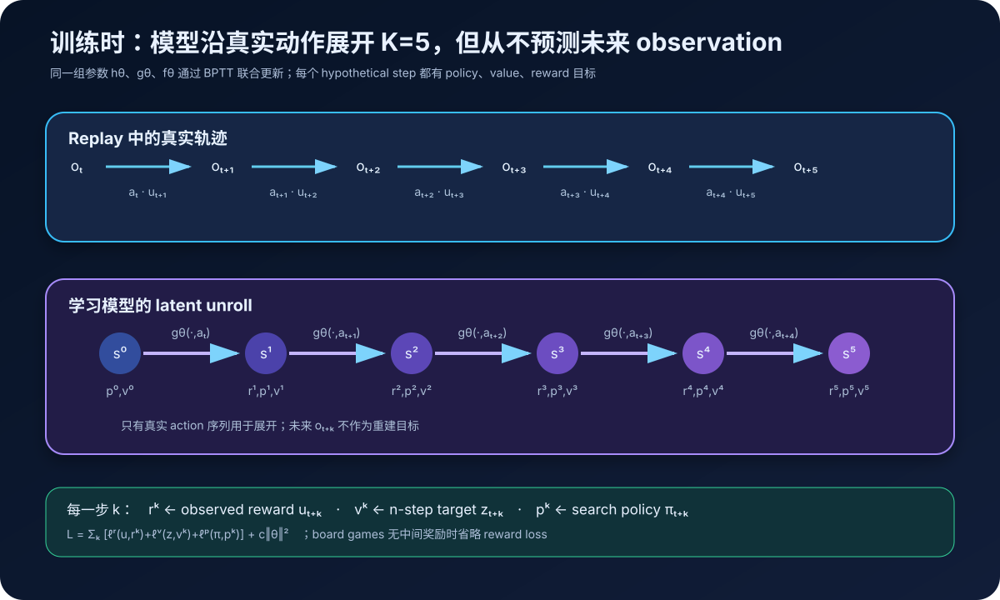
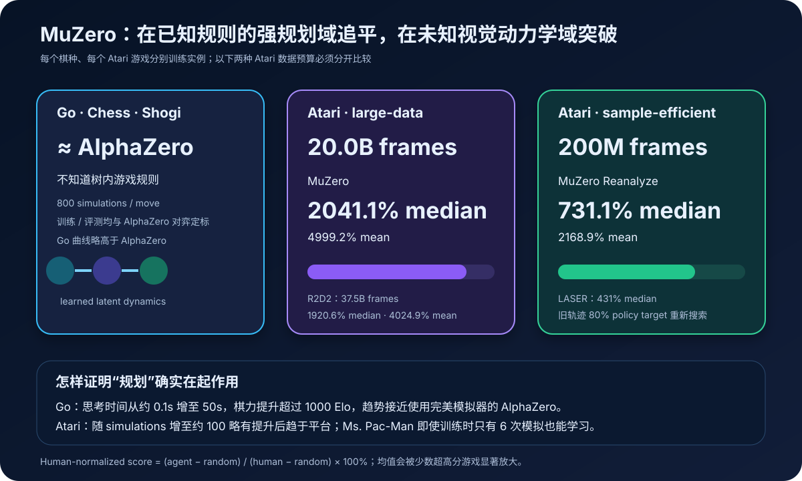

# MuZero 原理详解：不预测世界长什么样，只学习怎样在其中规划


> **论文**：[Mastering Atari, Go, Chess and Shogi by Planning with a Learned Model](https://arxiv.org/abs/1911.08265)<br>
> **作者**：Julian Schrittwieser、Ioannis Antonoglou、Thomas Hubert、Karen Simonyan、Laurent Sifre、Simon Schmitt、Arthur Guez、Edward Lockhart、Demis Hassabis、Thore Graepel、Timothy Lillicrap、David Silver<br>
> **版本**：arXiv v1 发布于 2019-11-19，v2 修订于 2020-02-21；正式版于 2020-12-23 发表于 *Nature*。本文以 arXiv v2 / Nature 方法与结果为主<br>
> **关键词**：Model-based Reinforcement Learning、Learned Dynamics、Latent Planning、Monte Carlo Tree Search、Value-equivalent Model、Self-Play、Reanalyze<br>
> **配套代码**：[muzero_minimal.py](./code/muzero_minimal.py)（零依赖 LineWorld 教学实现；保留潜空间搜索与联合训练闭环，不是论文规模复现）<br>
> **一手资料**：[arXiv 摘要页](https://arxiv.org/abs/1911.08265) · [arXiv PDF](https://arxiv.org/pdf/1911.08265) · [Nature 正式版](https://www.nature.com/articles/s41586-020-03051-4) · [Google DeepMind 介绍](https://deepmind.google/blog/muzero-mastering-go-chess-shogi-and-atari-without-rules/) · [论文附属伪代码](https://arxiv.org/src/1911.08265/anc/pseudocode.py)

## 0. 先说结论

AlphaZero 的强大搜索建立在一个非常奢侈的前提上：

> 树中的每个假想动作，都能交给精确规则模拟器执行。

这在棋类里没有问题。程序知道：

- 动作是否合法；
- 落子后棋盘是什么；
- 游戏是否结束；
- 终局谁赢；
- 搜索树中的每个节点对应哪个真实局面。

但 Atari、机器人和现实控制通常没有一个可免费调用、永不出错的规则模拟器。

MuZero 的突破，是把 AlphaZero 树中的精确 simulator 换成一个端到端学习的潜在模型：

$$
s^0=h_\theta(o_1,\ldots,o_t),
$$

$$
(r^k,s^k)=g_\theta(s^{k-1},a^k),
$$

$$
(p^k,v^k)=f_\theta(s^k).
$$

三个函数分别负责：

- $h$，representation：把观察历史编码成根隐藏状态；
- $g$，dynamics：在隐藏状态上执行假想动作，预测即时奖励和下一个隐藏状态；
- $f$，prediction：从隐藏状态预测策略先验和长期价值。

最反直觉的一点是：

> $s^k$ 不必重建真实棋盘，也不必生成下一帧 Atari 画面。它只要保留足够信息，让搜索中的 reward、policy 和 value 正确即可。



整套系统形成以下闭环：

```text
真实观察历史 o₁…oₜ
    ↓ representation h
根隐藏状态 s⁰
    ↓ learned dynamics g + prediction f
潜空间 MCTS → 改进策略 πₜ、根价值 νₜ
    ↓
只把最终选中的动作 aₜ₊₁ 送入真实环境
    ↓
得到真实观察 oₜ₊₁ 与奖励 uₜ₊₁
    ↓
轨迹写入 replay
    ↓
沿真实动作展开 K=5 步，训练 reward / value / policy
```

MuZero 最重要的六个结论：

1. **它是 model-based RL。**MCTS 明确使用学习到的动力学模型规划。
2. **它不是像素生成模型。**没有 next-frame reconstruction loss。
3. **模型学习的是规划等价性。**reward、value 与 search policy 是唯一主要监督。
4. **真实环境没有消失。**只有假想搜索不调用环境；真正执行动作仍需环境返回观察、奖励与 episode boundary。
5. **MuZero 不是一套权重同时玩 60 个游戏。**Go、Chess、Shogi 和每个 Atari 游戏都分别训练实例。
6. **Reanalyze 是单独的数据高效变体。**200M-frame 结果不能和原版 MuZero 的 20B-frame 结果混成一个实验。

一句话记忆：

> AlphaZero 用已知规则搜索真实状态；MuZero 用任务损失学习一个没有显式语义的潜在 MDP，再在这个潜在 MDP 里搜索。

---

## 1. 为什么 AlphaZero 还不够通用

### 1.1 规划需要“如果我这样做，会发生什么”

任何前瞻规划都需要某种模型：

$$
(s_{t+1},u_{t+1})
\sim
P(\cdot\mid s_t,a_t).
$$

国际象棋规则可以直接写成程序，所以 AlphaZero 能在搜索树里精确执行数千条变化。

现实问题却常常只有交互接口：

```text
给环境一个 action
环境过一会儿返回 observation、reward、done
```

动力学可能：

- 未知；
- 高维；
- 随机；
- 部分可观测；
- 难以写成完整规则；
- 真实试错成本很高。

若树搜索每扩展一个节点都必须真的操作机器人或真实系统，规划就失去了意义。

### 1.2 传统 learned world model 为什么难

早期 model-based RL 常尝试预测完整未来：

$$
\hat o_{t+1}
=
F_\theta(o_{\le t},a_t).
$$

对于 Atari，这意味着生成每个像素：

- 背景纹理；
- 精灵动画；
- 计分板；
- 闪烁与运动；
- 与决策无关的视觉细节。

多步递归后，小像素误差还会逐步累积。

但一个智能体并不需要知道每滴雨的形状，只需要知道“会淋湿”和“带伞有用”。

MuZero 因此改变建模目标：

```text
不是：准确生成未来 observation

而是：准确预测规划会用到的
      reward + policy + value
```

### 1.3 value-equivalent model

如果两个内部模型产生的画面完全不同，但对所有重要动作序列都给出相同的奖励、策略排序和长期价值，那么它们对决策可能是等价的。

MuZero 学习的正是这种 **value-equivalent** 潜在模型：

> 不追求环境语义上的真实，只追求规划结果上的有用。

---

## 2. AlphaZero 与 MuZero 的边界在哪里



### 2.1 AlphaZero 的树节点

AlphaZero 在树中调用：

$$
s'=\operatorname{Rules}(s,a).
$$

模拟器同时提供：

- 精确后继状态；
- 合法动作集合；
- 终局检测；
- 终局评分。

神经网络只需要：

$$
(p,v)=f_\theta(s).
$$

### 2.2 MuZero 的树节点

MuZero 只在根节点读取真实观察：

$$
s^0=h_\theta(o_{\le t}).
$$

树中所有后续节点都由：

$$
(r^k,s^k)=g_\theta(s^{k-1},a^k)
$$

生成。

它不要求：

- $s^k$ 是棋盘编码；
- 从 $s^k$ 解码出 Atari 像素；
- $s^k$ 和真实第 $t+k$ 步 observation 一一对应；
- 动力学显式预测 done。

### 2.3 三处规则知识被替换

论文附录明确比较了三点。

| AlphaZero 在树内使用 | MuZero 的替代方式 |
|---|---|
| 精确 state transition | $g_\theta$ 产生下一个 hidden state |
| 每个节点的合法动作 | 只在真实根节点 mask；树内不查询规则 |
| terminal detection / terminal value | 树内不特殊处理终局，始终用模型 value |

搜索甚至可能在潜空间里“越过”真实终局继续展开。训练时把终局后的状态视为 absorbing state，让模型学会保持相同价值。

这听起来不够优雅，却是“不知道规则”的直接代价：如果没有终局模型，就不能在树内调用一个不存在的 `is_terminal()`。

---

## 3. 三个函数到底分别学什么

### 3.1 Representation $h_\theta$

$$
s_t^0
=
h_\theta(o_1,\ldots,o_t).
$$

它把真实交互历史压缩成搜索根状态。

为什么输入是历史而不是单帧？

- 单张 Atari 画面看不出速度；
- 某个动作不一定立即产生可见变化；
- 部分环境状态隐藏在过去事件中；
- Chess 的重复局面与和棋规则依赖历史。

论文输入：

- Go、Shogi：最近 8 个棋盘状态；
- Chess：最近 100 个棋盘状态，以正确预测重复与和棋；
- Atari：最近 32 张 $96\times96$ RGB 帧，以及产生这些帧的最近 32 个动作。

Atari 动作历史很重要，因为“按键被执行”不保证当帧能看到明显变化。

### 3.2 Dynamics $g_\theta$

$$
(r_t^k,s_t^k)
=
g_\theta(s_t^{k-1},a_{t+k}).
$$

给定潜状态与动作，动力学模型输出：

- $r_t^k$：该假想转移的即时奖励预测；
- $s_t^k$：下一假想隐藏状态。

同一个 $g_\theta$ 被反复调用，所以它是一个 recurrent process：

$$
s^0
\xrightarrow{a^1,g}
s^1
\xrightarrow{a^2,g}
s^2
\xrightarrow{a^3,g}
\cdots
$$

原论文使用确定性动力学。即使真实 Atari 可能包含随机性，模型仍输出一个确定性潜转移，而不是后继状态分布。

### 3.3 Prediction $f_\theta$

$$
(p_t^k,v_t^k)
=
f_\theta(s_t^k).
$$

- $p^k$：动作先验，帮助 MCTS 聚焦；
- $v^k$：从当前潜节点开始的期望折扣回报。

它与 AlphaZero 的 policy–value head 功能相似，区别是输入已经不是规则定义的真实棋盘，而是 $g$ 递归产生的隐藏状态。

### 3.4 为什么不用三个完全独立模型

论文把 $h$、$g$、$f$ 的参数共同写成 $\theta$，并通过模型展开做端到端 BPTT。

梯度会迫使表示层保留：

- 预测未来奖励所需的信息；
- 区分高低价值动作所需的信息；
- 复现搜索改进策略所需的信息。

没有 observation reconstruction，意味着与三项任务无关的信息可以被主动丢掉。

---

## 4. MuZero 怎样规划

每条潜状态边 $(s,a)$ 保存：

| 统计量 | 含义 |
|---|---|
| $N(s,a)$ | 访问次数 |
| $Q(s,a)$ | 平均累计折扣回报 |
| $P(s,a)$ | policy prior |
| $R(s,a)$ | 动力学模型预测的即时奖励 |
| $S(s,a)$ | 动力学模型预测的后继隐藏状态 |

AlphaZero 的边不需要额外存 $R$ 与 $S$，因为规则模拟器随时可以重算；MuZero 把学习模型的输出缓存到树中。



### 4.1 Selection：PUCT

MuZero 选择最大化：

$$
a
=
\arg\max_a
\left[
\bar Q(s,a)+U(s,a)
\right],
$$

其中：

$$
U(s,a)
=
P(s,a)
\frac{\sqrt{\sum_bN(s,b)}}{1+N(s,a)}
\left[
c_1+log\left(
\frac{\sum_bN(s,b)+c_2+1}{c_2}
\right)
\right].
$$

论文设置：

$$
c_1=1.25,
\qquad
c_2=19652.
$$

含义仍是：

- $Q$ 高的动作利用更多；
- $P$ 高但访问少的动作值得探索；
- 父节点访问越多，探索项的尺度缓慢变化。

### 4.2 为什么要归一化 $Q$

棋类回报范围固定，Atari 分数却可能从个位数到百万级。

若直接把原始 $Q$ 和概率型探索项相加：

- 在高分游戏里 $U$ 几乎不起作用；
- 在低分游戏里 $U$ 又可能过强；
- 必须为每个游戏人工调常数。

MuZero 使用当前搜索树观察到的最小值与最大值：

$$
\bar Q(s,a)
=
\frac{Q(s,a)-Q_{\min}}
{Q_{\max}-Q_{\min}},
$$

把选择时的 $Q$ 映射到 $[0,1]$。

这是在线、树内归一化，不是用整个游戏的已知最高分。

### 4.3 Expansion：每次模拟只多想一步

到达叶边 $(s^{l-1},a^l)$ 后：

$$
(r^l,s^l)=g_\theta(s^{l-1},a^l),
$$

$$
(p^l,v^l)=f_\theta(s^l).
$$

新节点各动作初始化：

$$
N(s^l,a)=0,
\quad
Q(s^l,a)=0,
\quad
P(s^l,a)=p_a^l.
$$

一次 simulation 最多新增一次 $g$ 和一次 $f$ 调用，所以单次模拟计算量与 AlphaZero 同阶。

### 4.4 Backup：奖励不能丢

AlphaZero 棋类没有中间奖励，叶节点 value 回传就够了。

MuZero 要支持 Atari，需要沿路径累计：

$$
G^k
=
\sum_{\tau=0}^{l-1-k}
\gamma^\tau r^{k+1+\tau}
+
\gamma^{l-k}v^l.
$$

例如三步路径：

$$
G^2=r^3+\gamma v^3,
$$

$$
G^1=r^2+\gamma r^3+\gamma^2v^3,
$$

$$
G^0=r^1+\gamma r^2+\gamma^2r^3+\gamma^3v^3.
$$

然后更新：

$$
Q(s^{k-1},a^k)
\leftarrow
\frac{NQ+G^k}{N+1},
$$

$$
N(s^{k-1},a^k)
\leftarrow
N(s^{k-1},a^k)+1.
$$

双人零和棋类还要按执子方转换价值视角；单智能体 Atari 不做交替翻号。

### 4.5 根访问次数仍然产生 $\pi$

完成搜索后：

$$
\pi_t(a)
\propto
N(s_t^0,a)^{1/T}.
$$

动作从 $\pi_t$ 采样或贪心选取，并送入真实环境。

注意信息边界：

```text
树中其余数百条分支：只存在于 learned latent model
最终选中的一个动作：真正交给 environment
```

---

## 5. 行动之后，真实环境仍然负责什么

真实环境执行：

$$
(o_{t+1},u_{t+1},d_{t+1})
=
\operatorname{EnvStep}(a_{t+1}).
$$

其中：

- $o_{t+1}$：新观察；
- $u_{t+1}$：真实奖励；
- $d_{t+1}$：episode 是否结束。

MuZero 并不是摆脱环境，而是减少了规划对环境 simulator 的依赖。

它仍然需要知道或获得：

- 动作空间；
- 当前真实观察；
- 执行动作后的奖励；
- episode boundary；
- 训练和评测协议；
- 棋类真实根节点的合法动作。

“without rules” 更准确的含义是：

> 搜索树内部不使用游戏规则推进状态，不是智能体连 action、reward、done 的交互接口都不知道。

---

## 6. 三类训练目标如何对齐真实轨迹

回放缓冲区保存每个真实时刻的：

$$
(o_t,a_t,u_t,\pi_t,\nu_t).
$$

- $a_t$：真实执行动作；
- $u_t$：环境奖励；
- $\pi_t$：当时 MCTS 根访问分布；
- $\nu_t$：当时 MCTS 根价值。

从某个时刻 $t$ 采样后，模型沿真实动作序列递归：

$$
s_t^0=h_\theta(o_{\le t}),
$$

$$
(r_t^1,s_t^1)=g_\theta(s_t^0,a_{t+1}),
$$

$$
(r_t^2,s_t^2)=g_\theta(s_t^1,a_{t+2}),
$$

直到 $K$ 步。



### 6.1 Policy target

每个假想步 $k$：

$$
p_t^k
\approx
\pi_{t+k}.
$$

目标不是 replay 中实际执行动作的 one-hot，而是当时搜索的完整访问分布。

和 AlphaZero 一样，搜索充当 policy improvement，网络把昂贵搜索蒸馏回快速 policy。

### 6.2 Reward target

$$
r_t^k
\approx
u_{t+k}.
$$

这里是动力学模型输出的预测奖励，对齐真实环境已经观察到的奖励。

没有 pixel loss，也没有 hidden-state reconstruction loss。

棋类没有中间奖励时，论文省略 reward prediction loss；终局输赢通过 value target 学习。

### 6.3 Value target

对于一般长序列任务：

$$
z_t
=
u_{t+1}
+\gamma u_{t+2}
+\cdots
+\gamma^{n-1}u_{t+n}
+\gamma^n\nu_{t+n}.
$$

它是 n-step return：

- 前 $n$ 步使用真实观察奖励；
- 更远未来用第 $t+n$ 步历史 MCTS 根价值 $\nu_{t+n}$ bootstrap。

原版 Atari：

$$
n=10,
\qquad
\gamma=0.997.
$$

棋类直接 bootstrap 到游戏结束，等价于预测最终输、和、赢结果。

---

## 7. 总损失：模型只被要求对规划有用

$$
\mathcal L_t(\theta)
=
\sum_{k=0}^{K}
\left[
\ell^r(u_{t+k},r_t^k)
+\ell^v(z_{t+k},v_t^k)
+\ell^p(\pi_{t+k},p_t^k)
\right]
+c\lVert\theta\rVert_2^2.
$$

| 损失 | 训练对象 | 外部锚点 |
|---|---|---|
| $\ell^r$ | 动力学奖励 | 真实环境 reward |
| $\ell^v$ | 长期价值 | n-step return / 终局结果 |
| $\ell^p$ | 动作先验 | MCTS 根访问分布 |

### 7.1 Board games 与 Atari 的 loss 不完全相同

Go、Chess、Shogi：

- reward 与 value 使用平方误差；
- policy 使用交叉熵；
- 没有中间奖励时省略 reward loss。

Atari：

- reward 与 value 的尺度跨游戏变化很大；
- 论文把标量变换成分类分布；
- reward、value 和 policy 都以交叉熵训练。

### 7.2 为什么没有 observation loss 仍能学到 dynamics

若 $g$ 产生的隐藏状态丢失了未来决策所需信息，就会导致：

- 下一步 reward 预测错；
- 后续 value 预测错；
- 后续 policy 无法匹配 MCTS。

这些误差沿 $K$ 步展开反向传播，迫使 $g$ 保留任务相关结构。

模型没有被要求解释世界，而是被要求支持未来的行动判断。

### 7.3 hidden state 没有唯一正确答案

没有 reconstruction target 意味着许多潜表示都可能同样好：

- 可以旋转表示空间；
- 可以压掉不影响回报的细节；
- 可以把多种观察折叠到同一隐藏状态；
- 可以缓存对 policy/value 有帮助的计算结果。

这使模型高效，也使其更难解释和诊断。

---

## 8. K=5：训练只展开五步，搜索为什么能更深

所有论文实验都使用：

$$
K=5.
$$

这表示训练时从每个 replay 起点递归调用 $g$ 五次，并在六个潜节点上施加目标。

它不表示搜索树最大深度只有 5。

因为 $g_\theta$ 参数共享，搜索时可以继续调用：

$$
s^5\to s^6\to s^7\to\cdots
$$

论文分析显示，模型能在训练展开深度之外继续规划；Go 中也能在远长于训练时思考预算的搜索下继续增强。

但这不是无条件保证。递归越深：

- 潜状态越可能偏离训练分布；
- 确定性模型误差可能累积；
- Atari 的规划收益更早进入平台。

### 8.1 两处梯度缩放

论文为保持不同展开步数下的梯度尺度稳定：

1. 每个 head 的 loss 乘 $1/K$；
2. dynamics function 起点的梯度乘 $1/2$。

此外，将隐藏状态线性缩放到 $[0,1]$，与动作平面范围一致：

$$
s_{\text{scaled}}
=
\frac{s-\min(s)}{\max(s)-\min(s)}.
$$

这些看似工程化的处理，对长递归网络稳定训练非常重要。

---

## 9. Atari 的标量压缩与 601 类表示

Atari 的 reward/value 可能跨多个数量级。MuZero 沿用 R2D2 的可逆变换：

$$
H(x)
=
\operatorname{sign}(x)
\left(\sqrt{|x|+1}-1\right)
+\varepsilon x,
\qquad
\varepsilon=0.001.
$$

平方根压缩大数，线性小项保持可逆性。

然后把 $H(x)$ 投影到整数 support：

$$
\{-300,-299,\ldots,299,300\},
$$

共 601 类。

若变换后的目标是 3.7：

$$
\phi(3.7)
=
0.3\,\delta_3
+0.7\,\delta_4.
$$

这不是把回归粗暴舍入为整数，而是在相邻 support 上线性插值。

推理时：

1. 对 601 类 softmax 求期望；
2. 应用 $H^{-1}$；
3. 恢复真实标量 reward 或 value。

配套代码实现了完整往返：

```python
distribution = encode_support(100.0)
recovered = decode_support(distribution)
assert abs(recovered - 100.0) < 1e-6
```

它解决的是数值尺度与分类训练稳定性，不是把 Atari 变成 601 个离散回报等级。

---

## 10. Replay 与数据生成

### 10.1 actor 仍用最新模型做 MCTS

网络 checkpoint 每 1,000 个训练 step 更新给 actors。

每次真实决策：

- board games：800 simulations；
- Atari：50 simulations。

Atari 每四帧选择一次动作，并把该动作重复四次，遵循常见 ALE 协议。

### 10.2 缓冲区规模

论文使用：

- board games：最近 100 万局；
- Atari：最近 12.5 万个长度为 200 的序列。

Atari 单局可达 30 分钟或 108,000 帧，因此每 200 步就把中间序列发给训练端，不等整局结束。

### 10.3 采样方式

- board games：均匀采样状态；
- Atari：prioritized replay。

Atari priority 基于历史搜索价值与 n-step target 的误差：

$$
p_i=|\nu_i-z_i|.
$$

并使用 importance sampling 权重修正优先采样偏差。论文实验取 $\alpha=\beta=1$。

### 10.4 训练温度

Atari 在整局中都按访问次数分布采样动作，温度随训练下降：

| 训练 step | $T$ |
|---|---:|
| 前 500k | 1.00 |
| 接着 250k | 0.50 |
| 最后 250k | 0.25 |

能力增强后逐渐从探索转向更贪心的策略。

---

## 11. MuZero Reanalyze：用新模型重看旧经验

普通 MuZero replay 中的 $\pi_t$ 和 $\nu_t$ 是轨迹生成当时的搜索结果。

模型不断变强后，旧 target 会显得陈旧：

```text
旧观察仍然有用
旧真实奖励仍然正确
但旧网络做出的搜索策略可能已经过时
```

Reanalyze 从 replay 取旧状态，用最新模型重新运行 MCTS，生成更新的 policy target。

Nature / arXiv v2 变体设置：

- 80% update 使用重新搜索后的新 policy target；
- value bootstrap 使用较新的 target network；
- $n$ 从 10 降为 5；
- 每个环境 state 抽取样本数从 0.1 增至 2.0；
- value loss 权重降为 0.25；
- policy 与 reward 权重保持 1.0。

这不是“免费重算”：

- 节省真实环境 frames；
- 增加模型推理和 MCTS 计算；
- 使同一批经验被更多次利用。

因此 sample efficiency 与 compute efficiency 必须分开讨论。

---

## 12. 网络结构与输入编码

### 12.1 Board games

MuZero 尽量沿用 AlphaZero 结构：

- $3\times3$ 卷积；
- 256 hidden planes；
- representation / dynamics 使用 16 个 residual blocks，而对应 AlphaZero 是 20 个；
- prediction head 采用类似 AlphaZero 的 policy/value 结构。

这里沿用 MuZero 论文的“16 对 20 blocks”计数口径。AlphaZero 补充材料也常写成“输入卷积层 + 19 个 residual blocks”；跨论文比较时，前者把一次完整评估的主体深度概括为 20，二者不是两套互相矛盾的 AlphaZero 实验。

论文发现 Go 中 MuZero 略高于 AlphaZero，尽管每个树节点的 residual block 计算更少。作者推测潜在 dynamics 可能在树中缓存了部分计算。

### 12.2 Atari representation

输入共有 128 个平面：

$$
32\times3\ \text{RGB planes}
+
32\ \text{action planes}.
$$

空间分辨率从 $96\times96$ 逐步下采样：

```text
96×96
  ↓ stride-2 conv
48×48 · 128 channels
  ↓ residual blocks + stride-2 conv
24×24 · 256 channels
  ↓ average pool
12×12
  ↓ residual blocks + average pool
 6×6 · 256 channels
```

潜动力学始终在 $6\times6$ 分辨率工作，所以一次假想步比重新处理完整 32 帧观察历史便宜。

### 12.3 动作编码

动作作为空间平面与隐藏状态拼接：

- Go：落点 one-hot 平面；
- Chess：8 个平面编码起点、终点与升变；
- Shogi：11 个平面额外编码打入棋子；
- Atari：动作 one-hot 向量平铺为空间平面。

动作编码依然带有领域结构。MuZero 不知道环境转移规则，不等于完全不知道动作接口和棋盘几何。

---

## 13. 训练与算力配置

所有任务：

$$
1{,}000{,}000\ \text{mini-batches},
\qquad
K=5.
$$

| 配置 | Board games | Atari 每个游戏 |
|---|---:|---:|
| batch size | 2,048 | 1,024 |
| simulations / search | 800 | 50 |
| discount | 1 | 0.997 |
| training TPU | 16 个第三代 TPU | 8 个第三代 TPU |
| self-play TPU | 1,000 个第三代 TPU | 32 个第三代 TPU |

每个 Atari 游戏都单独跑这套训练。所谓“57 games”不是一张网络共享 57 个任务，而是 57 个独立训练实验。

原版大数据 Atari 设置约使用 20B environment frames / game；Reanalyze 设置限制为 200M frames / game。

再次强调：

> 减少真实 frames 不必然减少总 FLOPs。Reanalyze 用更多离线搜索换取环境样本效率。

---

## 14. 主结果：棋类追平 AlphaZero，Atari 创下当时新高



### 14.1 Go、Chess、Shogi

MuZero 在不知道树内游戏规则的情况下，匹配 AlphaZero 的超人水平。

评测与学习曲线使用 800 simulations / move，并通过对 AlphaZero、Stockfish、Elmo 等基线的 tournament 建立 Elo。

Go 中 MuZero 的最终曲线略高于 AlphaZero，但论文更重要的结论不是“高了多少 Elo”，而是：

> 学习到的潜模型能在最依赖精确规划的游戏里，接近完美 simulator 的搜索质量。

### 14.2 Atari large-data

57 个游戏、每个约 20B frames：

| Agent | Frames | Median HNS | Mean HNS |
|---|---:|---:|---:|
| R2D2 | 37.5B | 1920.6% | 4024.9% |
| MuZero | 20.0B | **2041.1%** | **4999.2%** |

MuZero：

- 在 42 / 57 个游戏上超过此前强 model-free 基线 R2D2；
- 在全部 57 个游戏上超过此前 model-based 方法 SimPLe；
- 同时刷新 mean 与 median human-normalized score。

### 14.3 Atari sample-efficient

200M frames：

| Agent | Median HNS | Mean HNS |
|---|---:|---:|
| IMPALA | 191.8% | 957.6% |
| Rainbow | 231.1% | — |
| LASER | 431% | — |
| MuZero Reanalyze | **731.1%** | **2168.9%** |

这组数字属于 Reanalyze 变体，不应写成“原版 MuZero 只用 200M frames 就达到 2041%”。

### 14.4 Human-normalized score 怎样算

$$
\operatorname{HNS}
=
\frac{\operatorname{Score}_{agent}-\operatorname{Score}_{random}}
{\operatorname{Score}_{human}-\operatorname{Score}_{random}}
\times100\%.
$$

超过 100% 代表超过该人类参考分数，不代表完成度超过 100%。

Mean 会被少数能刷出极高分的游戏显著放大，所以必须同时看 median 与逐游戏结果。

### 14.5 Atari 评测协议

- 每个游戏评测 1,000 episodes；
- 每局最多 30 分钟或 108,000 frames；
- 默认 50 simulations / move；
- 同时考虑随机 no-op starts 和 human starts，以减少确定性模拟器的起点偏差。

---

## 15. 论文怎样证明“learned model 真的用于规划”

只看最终分数不能区分两种解释：

1. learned model 确实支持有效 lookahead；
2. policy 网络已经学会直接行动，搜索只是昂贵装饰。

论文做了多组分析。

### 15.1 Go：给更多思考时间，棋力继续上升

完全训练后的 MuZero 从约 0.1 秒增加到 50 秒思考时间，棋力提升超过 1,000 Elo，扩展趋势接近使用完美 simulator 的 AlphaZero。

而训练时搜索预算只对应约 0.1 秒。这说明 learned dynamics 不只在训练预算附近有效，还能支持大得多的测试时搜索。

### 15.2 Atari：收益存在，但较早平台

Atari 从 1 次 simulation 增加搜索预算，平均表现有所提高，到约 100 simulations 后进入平台，继续增加只略有下降。

论文推测原因是 Atari learned model 比 Go 更不准确。

同时，单次 simulation 时表现仍然不错，说明 policy 已经把历史搜索收益内化。

### 15.3 Ms. Pac-Man：MCTS 训练优于 Q-learning 替代

研究者保持网络规模和训练量接近，把 MuZero 的搜索目标换成 model-free Q-learning，并移除搜索。

该变体最终接近 R2D2，却比 MuZero 学得慢、最终分数更低。

这支持：

> MCTS policy improvement 产生的软策略目标，比这里的 Q-learning target 提供了更强训练信号。

### 15.4 少于动作数的搜索也能学

Ms. Pac-Man 最多有 8 个动作，但训练时只有 6 次 simulations 仍能有效学习。

这说明搜索不必穷举全部动作；policy prior、跨状态泛化和后续训练可以共同放大有限搜索。

---

## 16. 最小代码：MCTS 完全看不到环境规则

完整代码见：[muzero_minimal.py](./code/muzero_minimal.py)。

教学环境是五格 LineWorld：

```text
pit ← · · agent · → goal
-1                    +1
```

代码刻意把真实规则和搜索分开：

```python
class LineWorld:
    def step(self, action):
        # 真实环境动力学，只允许实际行动调用
        ...

class LatentMCTS:
    def search(self, observation_history):
        # 搜索中没有 LineWorld.step()
        # 只调用 model.representation / dynamics / prediction
        ...
```

### 16.1 表格化的 $h/g/f$

```python
def representation(observation_history):
    return HiddenState(root_observation=observation_history[-1])

def dynamics(hidden, action):
    reward = learned_reward[(hidden, action)]
    next_hidden = HiddenState(
        hidden.root_observation,
        hidden.imagined_actions + (action,),
    )
    return reward, next_hidden

def prediction(hidden):
    return learned_policy[hidden], learned_value[hidden]
```

这里的下一隐藏状态只是“根观察 + 假想动作路径”标识，不是环境真实位置。

测试明确验证：

```python
root = HiddenState(2, ())
_, child = model.dynamics(root, ACTION_RIGHT)

assert child == HiddenState(2, (ACTION_RIGHT,))
assert child.root_observation == 2
# 真实环境走右后 observation 是 3，但模型没有重建它。
```

### 16.2 含奖励的回传

```python
backed_up = leaf_value
for parent, action, predicted_reward in reversed(path):
    backed_up = predicted_reward + discount * backed_up
    parent.visits[action] += 1
    parent.value_sum[action] += backed_up
```

这正是 MuZero 相比 AlphaZero 最关键的搜索改动。

### 16.3 n-step value target

```python
target = sum(
    discount**k * episode.rewards[index + k]
    for k in range(td_steps)
    if index + k < len(episode.rewards)
)

if index + td_steps < len(episode.root_values):
    target += discount**td_steps * episode.root_values[index + td_steps]
```

### 16.4 K-step latent unroll

```python
hidden = model.representation(history)

for k in range(K + 1):
    train_policy_and_value(hidden, pi[t + k], z[t + k])
    train_reward(hidden, action[t + k], reward[t + k])
    _, hidden = model.dynamics(hidden, action[t + k])
```

和论文一样，模型沿 replay 中真实发生的 action 序列展开；没有未来 observation reconstruction。

### 16.5 运行

```bash
python3 papers/to-2026/code/muzero_minimal.py --test

python3 papers/to-2026/code/muzero_minimal.py \
  --iterations 12 \
  --games 10 \
  --simulations 24
```

固定随机种子的短训练输出：

```text
all tests passed
before training: 0 goal / 100 fail, mean_return=-1.010
iteration=01 episodes= 10 loss=1.2353
iteration=03 episodes= 30 loss=0.8572
iteration=06 episodes= 60 loss=0.4796
iteration=09 episodes= 90 loss=0.3938
iteration=12 episodes=120 loss=0.4659
after training:  100 goal / 0 fail, mean_return=0.990
```

这只验证控制闭环：

- 真实环境产生经验；
- 潜模型学习奖励、策略、价值；
- MCTS 用学习模型规划；
- 新规划产生更好经验。

它使用表格参数，没有卷积、分布式 actors、prioritized replay 或真正的像素输入，不能视为 Atari / 棋类复现。

---

## 17. 从教学代码到论文规模，还缺什么

### 17.1 严格隔离 real environment 与 model environment

最重要的复现测试是：

> MCTS 内部是否意外调用了真实 `env.step()`？

若调用了，它就退化成 AlphaZero 式已知模拟器搜索，不再是 MuZero。

建议用接口与依赖注入强制隔离：

```text
Actor: 可以访问真实 environment
Planner: 只能访问 initial_inference / recurrent_inference
Learner: 只能访问 replay 与网络
```

### 17.2 两种 inference API

生产系统通常暴露：

```text
initial_inference(observation_history)
    -> hidden_state, policy, value

recurrent_inference(hidden_state, action)
    -> next_hidden_state, reward, policy, value
```

前者要编码完整观察历史，较贵；后者只在低分辨率潜状态递归，适合大量树节点批处理。

### 17.3 批量化树叶评估

单棵树逐节点调用 TPU/GPU 会浪费吞吐。需要：

- 多 actors 并行；
- 多棵树 leaf batching；
- virtual loss 或并发访问控制；
- inference queue 的延迟–吞吐折中；
- 隐藏状态缓存。

### 17.4 replay 版本与 target staleness

每条样本至少应保存：

```text
observation history
actions
environment rewards
episode termination
root visit distributions
root values
network version
```

否则很难判断训练不稳来自：

- dynamics 误差；
- 陈旧 policy target；
- priority 偏置；
- actor 参数延迟；
- value bootstrap 漂移。

### 17.5 终局 padding

树内没有 terminal detector。训练 batch 跨过真实 episode 末尾时，需要把后续变成 absorbing state，并正确处理：

- padding action；
- 零后续 reward；
- 固定 terminal value；
- loss mask；
- 玩家视角。

处理错误会让模型学会在“游戏结束后”继续刷奖励。

### 17.6 监控模型，而不只看 episodic return

建议记录：

- reward prediction calibration；
- value target error；
- policy KL：$D_{KL}(\pi\Vert p)$；
- search depth 分布；
- root value 与最终 return 偏差；
- 按 imagined depth 分桶的误差；
- 1 / 5 / 10 / 50 / 100 simulations 的性能曲线；
- reanalysis target 与原始 target 差异；
- latent activation 范围与梯度范数。

只看最终 reward，很难分辨“模型确实会规划”还是“policy 绕过了坏模型”。

---

## 18. 局限与风险

### 18.1 确定性模型难表达真正多模态未来

真实环境若同一状态动作可能产生多个不同后果，确定性 $g$ 容易把它们压成某种平均潜结果。

这可能足以预测期望 value，却不适合：

- 风险敏感规划；
- 稀有灾难建模；
- 需要保持多个未来假设的任务。

论文明确把 stochastic transitions 留作后续工作。

### 18.2 部分可观测问题没有被彻底解决

输入观察历史能缓解 POMDP，但 MuZero 没有显式 belief-state inference，也没有保证 $h$ 是充分统计量。

论文脚注也指出，Poker 一类不完全信息博弈没有被直接解决。

### 18.3 无重建损失带来可解释性与调试困难

潜状态预测错时，无法直接展示“它认为下一帧是什么”。

只能通过 reward、value、policy 和搜索行为间接诊断，模型内部可能存在人类难以理解的 shortcut。

### 18.4 模型误差会被搜索利用

规划器会主动寻找模型认为高回报的分支。若 learned model 存在漏洞，MCTS 可能放大漏洞，而不是回避它。

这与 model exploitation / planner overfitting 问题相同：

$$
\arg\max_a \hat V(a)
$$

最容易选到预测误差为正的动作。

### 18.5 计算成本极高

每个 Atari 游戏：

- 独立训练；
- 1M mini-batches；
- 数十亿 frames；
- 多 TPU actors 与 learner；
- 每次动作 50 次 latent MCTS。

MuZero 扩展了规划适用范围，但不是低成本 RL 配方。

### 18.6 Atari 的 environment frames 不是现实样本成本

Atari simulator 可高速复制、重置，真实机器人或在线系统做不到。

即使 Reanalyze 降到 200M frames，对许多现实任务仍然巨大。

### 18.7 单任务训练限制通用性结论

论文跨多种环境复用了算法，却没有训练一张可直接迁移到新游戏的通用世界模型。

它证明的是：

> 同一方法可在许多任务上分别训练成功。

不是：

> 一个 MuZero agent 能零样本理解任意新环境。

### 18.8 根节点仍使用领域接口

棋类在真实根节点仍使用合法动作 mask，输入和动作编码也包含棋盘结构。

因此“没有规则”不应夸张成“没有任何任务定义或先验”。

---

## 19. 常见误解

### 误解 1：MuZero 没有模型

错误。它明确学习并递归使用 dynamics model；“Zero”不是 model-free。

### 误解 2：MuZero 预测下一张 Atari 图像

错误。它不以未来 observation 为目标，只预测 reward、policy、value。

### 误解 3：hidden state 就是真实环境 state 的压缩版

不一定。论文刻意不赋予 $s^k$ 环境语义，只要求支持未来任务预测。

### 误解 4：训练 K=5，所以 MCTS 最多看五步

错误。共享 dynamics 可以在搜索时递归超过五步，只是深处误差风险更大。

### 误解 5：树搜索完全不知道动作是否合法

需要区分位置：棋类真实根节点仍可 mask 合法动作；根以下的 learned tree 不调用规则 mask。

### 误解 6：MuZero 连环境奖励都不知道

错误。真实交互会返回 observed reward，并直接监督 reward head。

### 误解 7：树内会在真实 terminal 自动停止

错误。MuZero 没有树内 terminal detector，可能继续展开；训练用 absorbing-state 行为处理。

### 误解 8：一个模型同时玩 Go、Chess、Shogi 和 57 个 Atari 游戏

错误。共享算法，不共享最终权重；每个任务单独训练。

### 误解 9：200M frames 的 MuZero 得到 2041.1% median

错误。2041.1% 属于原版 MuZero 20B-frame 设置；200M 的 Reanalyze 是 731.1%。

### 误解 10：Reanalyze 让旧经验“变成新经验”

不完全。真实 observation/action/reward 不变，只用新网络重新计算 policy target 与更鲜的 value bootstrap。

### 误解 11：模型不用重建，所以不会有 compounding error

错误。潜状态依然递归，深层 $s^k$ 会偏离训练分布，只是误差不再用像素距离衡量。

### 误解 12：超过 1000% human-normalized 代表比人类强十倍

不严谨。HNS 是相对 random–human 分差的线性归一化，受计分上限、基线和刷分机制影响。

---

## 20. MuZero 与几条相邻路线的区别

### 20.1 与 AlphaZero

```text
AlphaZero：规则 simulator + policy/value network + MCTS
MuZero：   representation + learned dynamics/reward + policy/value + MCTS
```

MuZero 是 AlphaZero 搜索式策略迭代向未知动力学环境的推广。

### 20.2 与 DQN / R2D2

DQN 类方法直接学习：

$$
Q(o,a),
$$

行动时通常不做 learned-model tree search。

MuZero 则在每次决策前用 $g$ 构造潜搜索树，再把搜索分布训练回 policy。

### 20.3 与像素 world model

像素 world model 追求：

$$
p(o_{t+1}\mid o_{\le t},a_t).
$$

MuZero 追求：

$$
(r^k,p^k,v^k)
$$

对决策正确，不关心可视化未来是否逼真。

### 20.4 与普通 model predictive control

MPC 通常在已知或学习模型上优化有限动作序列，执行第一步后重新规划。

MuZero 也有 receding-horizon 特征，但额外通过：

- policy prior；
- value bootstrap；
- MCTS visit target；
- replay 中端到端策略迭代；

把规划与长期表征学习耦合在一起。

---

## 21. 对后来推理系统的启发

MuZero 把一个重要思想推得很远：

> 内部模型不必完整复刻世界，只需保留决策和验证真正需要的结构。

在语言模型和 Agent 系统中，可以类比为：

```text
真实 observation / tool result
        ↓ representation
紧凑的任务状态
        ↓ action-conditioned transition
多个假想计划分支
        ↓ reward / verifier / value
选择真实执行的一步，再观察并重规划
```

但语言与现实任务缺少 MuZero 享有的干净条件：

- reward 常不可靠；
- action 语义开放；
- tool 状态可能变化；
- 错误动作可能有外部成本；
- 没有数十亿次无害重试；
- 验证器本身也会错。

真正可迁移的设计原则是：

1. 把真实行动和内部想象严格隔离；
2. 内部模型围绕决策目标训练，不盲目重建全部输入；
3. 每次只执行计划中的第一步；
4. 获得新观察后重新编码、重新规划；
5. 用外部真实反馈持续校准潜模型；
6. 防止规划器利用模型误差。

---

## 22. 一页纸记住 MuZero

### 三个函数

$$
s^0=h_\theta(o_{\le t}),
$$

$$
(r^k,s^k)=g_\theta(s^{k-1},a^k),
$$

$$
(p^k,v^k)=f_\theta(s^k).
$$

### 搜索选择

$$
a=\arg\max_a[\bar Q(s,a)+U(s,a)].
$$

### 含奖励回传

$$
G^k
=
\sum_{\tau=0}^{l-1-k}\gamma^\tau r^{k+1+\tau}
+\gamma^{l-k}v^l.
$$

### n-step 价值目标

$$
z_t
=
\sum_{i=1}^{n}\gamma^{i-1}u_{t+i}
+\gamma^n\nu_{t+n}.
$$

### K-step 联合损失

$$
\mathcal L
=
\sum_{k=0}^{K}
(\ell^r+\ell^v+\ell^p)
+c\lVert\theta\rVert^2,
\qquad
K=5.
$$

### 三个绝对不要混淆的边界

- learned model 不等于 observation reconstruction；
- without rules 不等于 without environment feedback；
- same algorithm 不等于 same multitask weights。

最终一句话：

> MuZero 让世界模型从“逼真地预测未来”转向“充分地支持规划”：真实环境负责提供观察与奖励，学习模型负责在潜空间想象，MCTS 负责改进策略，三者通过 replay 中的 reward、value、policy 目标闭环联合优化。

---

## 参考资料

1. Schrittwieser et al., [Mastering Atari, Go, Chess and Shogi by Planning with a Learned Model](https://arxiv.org/abs/1911.08265), arXiv, 2019/2020.
2. Schrittwieser et al., [Mastering Atari, Go, chess and shogi by planning with a learned model](https://www.nature.com/articles/s41586-020-03051-4), *Nature* 588, 604–609, 2020.
3. Google DeepMind, [MuZero: Mastering Go, chess, shogi and Atari without rules](https://deepmind.google/blog/muzero-mastering-go-chess-shogi-and-atari-without-rules/), 2020.
4. Silver et al., [A general reinforcement learning algorithm that masters chess, shogi, and Go through self-play](https://www.science.org/doi/10.1126/science.aar6404), *Science*, 2018.
