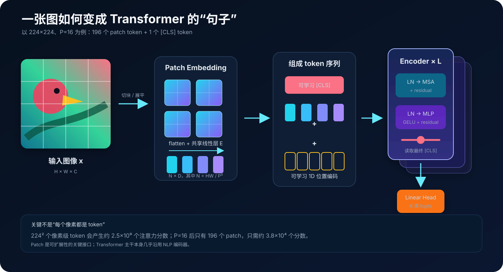
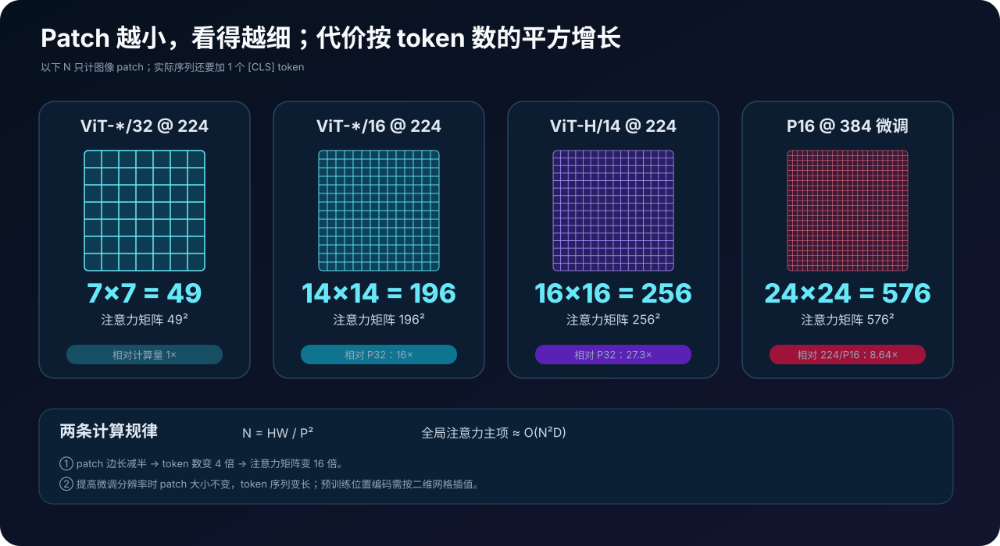
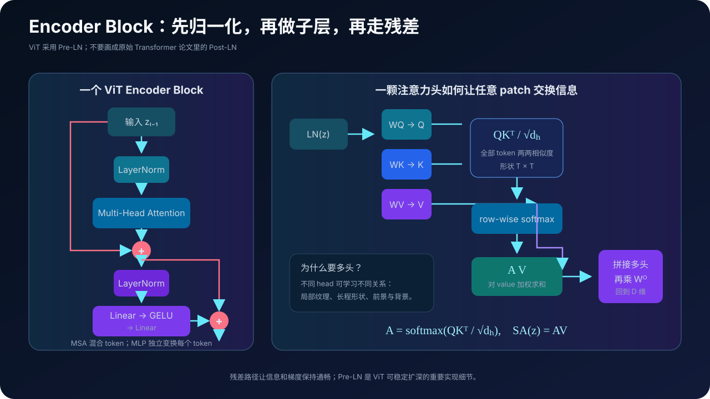
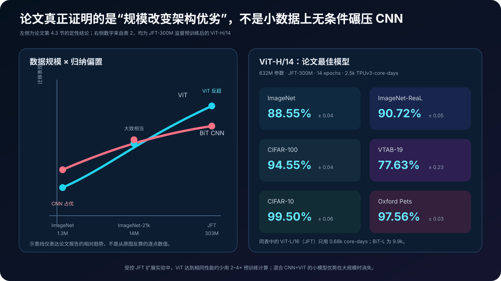
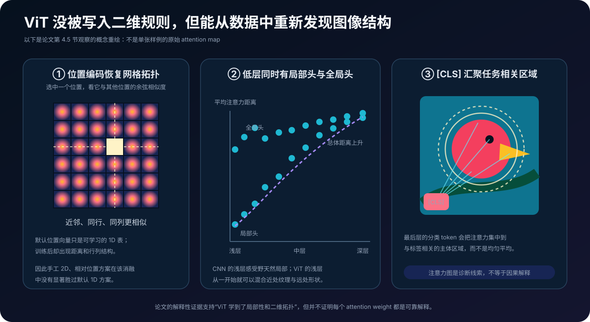

# Vision Transformer 原理详解：把图像切成 patch，让标准 Transformer 学会看图


> **论文**：[An Image is Worth 16x16 Words: Transformers for Image Recognition at Scale](https://arxiv.org/abs/2010.11929)<br>
> **作者**：Alexey Dosovitskiy、Lucas Beyer、Alexander Kolesnikov、Dirk Weissenborn、Xiaohua Zhai、Thomas Unterthiner、Mostafa Dehghani、Matthias Minderer、Georg Heigold、Sylvain Gelly、Jakob Uszkoreit、Neil Houlsby<br>
> **版本**：arXiv v1 发布于 2020-10-22，v2 修订于 2021-06-03；发表于 ICLR 2021。本文以 v2 / ICLR camera-ready 为准<br>
> **关键词**：Vision Transformer、Patch Embedding、Image Classification、Self-Attention、Large-scale Pre-training、Inductive Bias、Transfer Learning<br>
> **配套代码**：[vit_minimal.py](./code/vit_minimal.py)（零依赖、纯 Python 的前向教学实现；保留 patch、位置编码、Pre-LN MSA、MLP 与分类头，不是训练复现）<br>
> **一手资料**：[arXiv 摘要页](https://arxiv.org/abs/2010.11929) · [arXiv HTML](https://arxiv.org/html/2010.11929v2) · [arXiv PDF](https://arxiv.org/pdf/2010.11929) · [OpenReview](https://openreview.net/forum?id=YicbFdNTTy) · [Google Research 解读](https://research.google/blog/transformers-for-image-recognition-at-scale/) · [官方 JAX/Flax 实现](https://github.com/google-research/vision_transformer)

## 0. 先说结论

Vision Transformer，简称 ViT，最常被概括为：

> 把图像切成 $16\times16$ 的小块，把每块当成一个词，再交给 Transformer。

方向对了，但这句话会掩盖论文真正重要的发现。

ViT 的技术骨架非常简单：

1. 把 $H\times W\times C$ 图像切成不重叠的 $P\times P$ patch；
2. 展平每个 patch，用共享线性层投影到 $D$ 维；
3. 在序列前加一个可学习的 `[CLS]` token，再加可学习位置编码；
4. 用标准 Pre-LN Transformer Encoder 做全局信息交换；
5. 读取最后的 `[CLS]` 表示进行分类。



但论文的科学结论不是“Transformer 天生比 CNN 更适合图像”，而是：

> CNN 把局部性、二维邻域和平移等变性写进了架构，所以小数据时更容易泛化；ViT 的视觉先验更弱，小数据时反而吃亏，但在足够大的监督数据上，它可以从数据中学回这些结构，并展现出更好的性能–计算扩展性。

读完本文，至少应记住下面八点：

1. **ViT 不是把每个像素当 token。**patch 是把序列长度从 $HW$ 降到 $HW/P^2$ 的关键。
2. **标题中的 16×16 不是固定规则。**论文同时使用 /32、/16 和 /14；最佳模型是 ViT-H/14。
3. **patch 线性投影等价于核大小和步幅都为 $P$ 的卷积。**区别主要在后面的网络是否持续注入卷积先验。
4. **ViT 使用 Pre-LN Encoder。**每个注意力或 MLP 子层之前做 LayerNorm，之后走残差。
5. **默认位置编码是可学习的一维表。**它按 raster order 对 patch 编号，却能从训练中恢复二维行列结构。
6. **原论文成功高度依赖大规模预训练。**从头训练 ImageNet 时，ViT 不占优；JFT-300M 上才充分释放大模型能力。
7. **论文最佳 88.55% 不是 ViT-B/16 在 ImageNet-1K 从头训练的成绩。**它来自 632M 参数的 ViT-H/14，先在私有 JFT-300M 上监督预训练，再迁移到 ImageNet。
8. **“纯 Transformer”是相对 CNN 主干而言。**模型仍有 patch 提取、位置编码、分类 token 和 MLP 头，并非毫无视觉接口。

一句话记忆：

> ViT 用 patch 把二维图像翻译成一维 token 序列，把视觉建模问题交给几乎原样的 Transformer；论文再用大规模预训练证明，数据可以部分替代手工写入的视觉归纳偏置。

---

## 1. 2020 年的问题：视觉必须依赖卷积吗

### 1.1 CNN 为什么长期统治视觉

卷积不是普通线性层换了个名字，它预先写入了三类非常强的假设。

**局部性（locality）**：一个像素先与附近像素交互，边缘、角点、纹理自然从局部形成。

**权重共享**：同一组卷积核在整张图上滑动，同一种边缘无论出现在哪都可被识别。

**平移等变性（translation equivariance）**：输入移动，特征图也相应移动。配合池化与数据增强，模型容易得到近似平移不变性。

这些归纳偏置带来很高的数据效率。即使训练样本有限，网络也不必从零发现“相邻像素通常更相关”。

### 1.2 此前的视觉注意力通常没有真正离开 CNN

ViT 之前，注意力进入视觉主要有几条路线：

- 在 CNN 特征图上叠加注意力；
- 只在局部邻域内做自注意力；
- 用轴向、稀疏或分块注意力近似全局交互；
- 先让 CNN 提取视觉 token，再交给 Transformer；
- 像 iGPT 那样降低分辨率和色彩空间后，对像素序列建模。

原因很直接：若 $224\times224$ 图像的每个像素都是 token，序列长度是 $50{,}176$，单头注意力矩阵就含：

$$
50{,}176^2\approx2.52\times10^9
$$

个元素，尚未计算通道和多层开销。

ViT 的问题因此非常克制：

> 不设计复杂的视觉专用注意力，只加最少的图像输入适配，标准 Transformer 能否直接完成大规模图像识别？

这个“少设计”的实验哲学，正是论文后来影响深远的原因。

---

## 2. 总览：从二维数组到一维 token 序列

设输入图像：

$$
\mathbf{x}\in\mathbb{R}^{H\times W\times C},
$$

patch 边长为 $P$。假设 $H,W$ 都能被 $P$ 整除，则 patch 数为：

$$
N=\frac{HW}{P^2}.
$$

每个 patch 展平后长度为 $P^2C$：

$$
\mathbf{x}_p
\in
\mathbb{R}^{N\times(P^2C)}.
$$

用共享矩阵 $\mathbf E$ 把每块投影到 Transformer 隐藏维度 $D$：

$$
\mathbf E\in\mathbb{R}^{(P^2C)\times D}.
$$

再把一个可学习的分类向量放在最前面，并加位置编码：

$$
\mathbf z_0
=
[\mathbf x_{\text{class}};
\mathbf x_p^1\mathbf E;
\mathbf x_p^2\mathbf E;
\ldots;
\mathbf x_p^N\mathbf E]
+\mathbf E_{\text{pos}},
$$

其中：

$$
\mathbf E_{\text{pos}}
\in
\mathbb{R}^{(N+1)\times D}.
$$

这个 $N+1$ 长的序列进入 $L$ 个 Encoder block。最终取第 0 个 token：

$$
\mathbf y=\operatorname{LN}(\mathbf z_L^0),
$$

再接分类头得到 logits。

这几行就是 ViT 主干。论文的大部分价值，不来自继续堆叠视觉模块，而来自证明这套极简接口能够扩展。

---

## 3. Patch Embedding：最简单，也最容易被低估的一步

### 3.1 用 ViT-B/16 算一遍形状

对常见输入：

$$
H=W=224,\quad C=3,\quad P=16,\quad D=768,
$$

每行、每列各有：

$$
224/16=14
$$

个 patch，因此：

$$
N=14\times14=196.
$$

每个 patch 展平为：

$$
16\times16\times3=768
$$

维。ViT-B/16 的投影恰好是 $768\to768$，但这是数值巧合，不是架构要求。

投影矩阵仅权重就有：

$$
16^2\times3\times768=589{,}824
$$

个参数。加入 `[CLS]` 后，Encoder 实际看到 $197$ 个 token。

### 3.2 线性投影为什么等价于卷积

把每个不重叠 patch 展平后乘同一个矩阵，本质上等价于：

```python
Conv2d(
    in_channels=C,
    out_channels=D,
    kernel_size=P,
    stride=P,
)
```

卷积核覆盖一个 patch，步幅也是一个 patch，所以各窗口不重叠。每个输出通道对应线性投影的一列权重。

因此，ViT 与 CNN 的边界不在“是否调用了一个卷积算子”，而在于：

- CNN 在后续每层持续使用局部连接和权重共享；
- 原始 ViT 在 stem 之后立即转为全局 token 交互；
- ViT 不建立卷积式逐层扩大感受野的层级结构。

官方实现和今天常见库通常直接用卷积高效完成 patch embedding。

### 3.3 Patch 是信息压缩，也是计算旋钮

全局注意力的主要 token 混合项约为：

$$
O(N^2D).
$$

而：

$$
N=\frac{HW}{P^2}.
$$

所以 patch 边长减半，会让 token 数变为 4 倍，注意力矩阵变为 16 倍。



| 输入与 patch | patch 网格 | $N$ | 仅比较 $N^2$ |
|---|---:|---:|---:|
| $224^2, P=32$ | $7\times7$ | 49 | 1× |
| $224^2, P=16$ | $14\times14$ | 196 | 16× |
| $224^2, P=14$ | $16\times16$ | 256 | 27.3× |
| $384^2, P=16$ | $24\times24$ | 576 | 相对 $224/P16$ 为 8.64× |

不过不要把“注意力二次复杂度”误写成“整个 ViT 都严格按 $N^2$ 增长”。Encoder 里还有投影和 MLP，典型项包括：

$$
O(ND^2)+O(N^2D).
$$

当 $D$ 很大、$N$ 还不长时，通道投影和 MLP 也可能占主要计算；随着分辨率升高，$N^2$ 项才越来越突出。

### 3.4 标题不是模型规范

“An Image is Worth 16×16 Words”是一句极成功的标题，不表示所有 ViT 都使用 $16\times16$ patch。

命名规则是：

```text
ViT-{模型规模}/{patch 边长}
```

例如：

- `ViT-B/32`：Base，$32\times32$ patch；
- `ViT-L/16`：Large，$16\times16$ patch；
- `ViT-H/14`：Huge，$14\times14$ patch。

论文最佳模型恰恰是 `/14`。

---

## 4. `[CLS]` 与位置编码：让“词袋”变成有序图像

### 4.1 为什么需要 `[CLS]`

Transformer 会输出每个 token 的新表示，但图像分类只需要一个全局向量。

ViT 沿用 BERT 的做法，在序列头部放一个可学习向量：

$$
\mathbf z_0^0=\mathbf x_{\text{class}}.
$$

经过每层全局自注意力后，它可以从所有 patch 汇聚信息。最终用：

$$
\mathbf z_L^0
$$

代表整张图。

`[CLS]` 不是图像内容，也不是固定均值；它是一个通过任务损失学会“向哪些 patch 取信息”的汇聚槽位。

### 4.2 为什么没有位置编码就不行

自注意力本身对 token 排列近似置换等变。若把 patch 顺序打乱，模型只看到同一袋局部内容，却不知道：

- 鸟头在鸟身上方还是下方；
- 左眼和右眼如何排列；
- 天空与地面谁在上；
- 两块边缘是否空间相邻。

所以 ViT 给每个序列位置加一个向量。

论文默认采用**可学习 1D 绝对位置编码**：把二维 patch 网格按行优先顺序拉平成序列，然后为每个索引学习一个 $D$ 维向量。

这并不是一个显式二维方案。初始化时，第 20 个位置并不知道第 19、21 个位置是邻居，更不知道它们来自第几行；这些关系要从数据中学出。

### 4.3 位置编码消融告诉了我们什么

论文附录 D.4 在 ViT-B/16 的 ImageNet 5-shot linear 设置中比较：

| 位置方案 | 默认只在 stem 后加入 |
|---|---:|
| 无位置编码 | 61.382% |
| 可学习 1D | 64.206% |
| 可学习 2D | 64.001% |
| 相对位置 | 64.032% |

正确解读是：

1. **位置信息明显有用**，否则下降约 2.8 个点；
2. 在论文这一设置下，显式 2D 或相对位置没有明显胜过简单 1D；
3. 这不等于“所有视觉任务都不需要更好的位置机制”，也不等于后续更大分辨率、检测、分割模型会得到同一结论。

### 4.4 `[CLS]` 并不是唯一可行的池化

camera-ready 附录补做了 `[CLS]` 与全局平均池化（GAP）的对比。作者发现两者在正确调整学习率后表现接近。

所以：

> `[CLS]` 是为了贴近 NLP Transformer 的方便设计，不是 ViT 成功不可替代的秘密组件。

---

## 5. Encoder：标准 Transformer 到底怎样处理图像

### 5.1 ViT 使用 Pre-LN 残差块

第 $\ell$ 层的两步是：

$$
\mathbf z'_\ell
=
\operatorname{MSA}(\operatorname{LN}(\mathbf z_{\ell-1}))
+\mathbf z_{\ell-1},
$$

$$
\mathbf z_\ell
=
\operatorname{MLP}(\operatorname{LN}(\mathbf z'_\ell))
+\mathbf z'_\ell.
$$



注意执行顺序：

```text
x -> LayerNorm -> Multi-Head Self-Attention -> + x
  -> LayerNorm -> Linear -> GELU -> Linear -> + residual
```

这是 **Pre-LN**。很多简图沿用 2017 Transformer 的 Post-LN 画法，会把实现细节画错。

MLP 对每个 token 独立应用，两层之间使用 GELU。token 之间的信息交换主要发生在 MSA。

### 5.2 单头注意力

对输入：

$$
\mathbf z\in\mathbb R^{T\times D},\qquad T=N+1,
$$

先投影得到 query、key、value：

$$
[\mathbf q,\mathbf k,\mathbf v]
=
\mathbf z\mathbf U_{qkv}.
$$

注意力权重：

$$
\mathbf A
=
\operatorname{softmax}
\left(
\frac{\mathbf q\mathbf k^\top}{\sqrt{D_h}}
\right),
$$

输出：

$$
\operatorname{SA}(\mathbf z)=\mathbf A\mathbf v.
$$

矩阵 $A_{ij}$ 可以理解为：第 $i$ 个 token 更新自己时，从第 $j$ 个 token 读取多少信息。

### 5.3 多头为什么有意义

若有 $k$ 个 head，通常令：

$$
D_h=D/k.
$$

各 head 独立计算注意力，再拼接并做输出投影：

$$
\operatorname{MSA}(\mathbf z)
=
[\operatorname{SA}_1(\mathbf z);\ldots;\operatorname{SA}_k(\mathbf z)]
\mathbf U_{msa}.
$$

不同 head 可以分工捕捉：

- 同一物体内的局部纹理；
- 相隔很远但属于同一轮廓的 patch；
- 主体与背景的关系；
- `[CLS]` 与判别性区域的联系。

与卷积逐层扩大感受野不同，ViT 从第一层起理论上就能让任何 patch 与任何 patch 交互。

---

## 6. 三档模型配置：B、L、H 从哪里来

ViT 的 Base 和 Large 基本沿用 BERT 的尺寸，论文再加入 Huge：

| 模型 | Encoder 层数 $L$ | 隐藏维 $D$ | MLP 隐藏维 | Heads | 参数量 |
|---|---:|---:|---:|---:|---:|
| ViT-Base | 12 | 768 | 3,072 | 12 | 86M |
| ViT-Large | 24 | 1,024 | 4,096 | 16 | 307M |
| ViT-Huge | 32 | 1,280 | 5,120 | 16 | 632M |

模型尺寸和 patch 尺寸是两个独立旋钮：

- 从 B 到 L/H：增大层数、通道、MLP 和参数；
- 从 /32 到 /16、/14：主要增加 token 数和计算，不会按同样比例增加参数。

论文附录的形状实验还观察到：

- 增加深度的收益最明显，但 16 层后已出现边际递减；
- 单纯增加宽度的改善相对较小；
- 减小 patch 能在几乎不增加参数的情况下稳定改善表现；
- 各维度按比例扩展最稳妥。

这也解释了为什么“参数量”不能单独预测 ViT 的性能和成本；序列长度同样关键。

---

## 7. 归纳偏置：ViT 究竟丢掉了什么

论文对 CNN 和 ViT 的区分非常明确。

| 结构先验 | CNN | 原始 ViT |
|---|---|---|
| 局部邻域 | 每层硬编码 | 仅 patch 提取显式局部；注意力可全局 |
| 二维拓扑 | 卷积核天然知道邻接 | 默认位置表初始化时不知道二维行列 |
| 平移等变 | 卷积权重共享天然提供 | 不在全模型中严格保证 |
| 感受野 | 随深度逐层扩大 | 第一层即可全局 |
| 数据效率 | 小数据通常更强 | 原论文配方下更依赖大数据 |
| 扩展自由度 | 强视觉先验也会限制形式 | 更通用、易复用 Transformer 基础设施 |

这里有一个容易忽略的细节：论文说 ViT 的 MLP 层是局部且平移等变的，是指**同一个 token-wise MLP 共享应用于每个位置**。它并不会像卷积那样混合相邻 patch；真正的空间混合由注意力负责。

### 7.1 Hybrid ViT 是什么

论文也实验了混合架构：

```text
图像 -> ResNet 特征图 -> 切成 1×1 或更大 feature patches
     -> 线性投影 -> Transformer
```

当 patch 是特征图上的 $1\times1$ 时，就是把特征图的空间维展平为 token。

受控扩展实验发现：

- 计算预算较小时，CNN stem + ViT 的 hybrid 略优于纯 ViT；
- 模型和计算增大后，这个差距消失。

这正符合归纳偏置的作用：数据和模型不足时，局部卷积先验帮助更大；规模足够时，模型可以自己学习。

---

## 8. 训练与迁移：ViT 成功所需的真正配方

### 8.1 三种预训练数据规模

论文用三档数据研究规模效应：

| 数据集 | 图像数 | 类别数 | 可用性 |
|---|---:|---:|---|
| ImageNet / ILSVRC-2012 | 1.3M | 1,000 | 公开 |
| ImageNet-21k | 14M | 21,000 | 公开研究数据 |
| JFT-300M | 303M | 18,000 | Google 内部数据 |

作者还按既有协议对预训练数据与下游测试集去重。

这一信息决定了如何正确引用结果。若只写“ViT 在 ImageNet 达到 88.55%”，读者很容易误以为模型只用 1.3M 张 ImageNet 图从头训练；实际最佳结果使用了约 303M 张 JFT 图像进行监督预训练。

### 8.2 预训练超参数

主要设置包括：

- 优化器：Adam，$\beta_1=0.9,\beta_2=0.999$；
- batch size：4096；
- warmup：10k steps；
- 预训练分辨率：224；
- JFT 主实验：线性学习率衰减、weight decay 0.1、dropout 0；
- ViT-H/14：JFT 上训练 14 epochs，base LR 为 $3\times10^{-4}$；
- ImageNet-21k 配方使用 weight decay 0.03、dropout 0.1；
- ImageNet 从头训练使用 300 epochs、cosine decay、weight decay 0.3、dropout 0.1，并做全局梯度裁剪。

所以论文正文概括的“高 weight decay 0.1”主要对应大规模比较，不能覆盖附录中每个数据集的专门配置。

### 8.3 微调时为什么提高分辨率

预训练后，作者移除原分类头，为下游 $K$ 类任务接一个零初始化的 $D\times K$ 线性层。

微调默认设置：

- SGD + momentum 0.9；
- batch size 512；
- cosine learning-rate decay；
- no weight decay；
- 全局梯度范数裁剪为 1；
- 除特别说明外，分辨率为 384。

最佳 ImageNet 结果更高：ViT-L/16 用 512，ViT-H/14 用 518，并使用系数 0.9999 的 Polyak averaging。

提高分辨率时保持 patch 大小不变：

$$
P_{\text{fine-tune}}=P_{\text{pretrain}}.
$$

因此 patch 网格和序列变长。Transformer 可以接收变长序列，但原位置表尺寸不匹配。论文做法是：

1. 单独保留 `[CLS]` 的位置向量；
2. 把其余位置向量还原为二维网格；
3. 按新网格做 2D 插值；
4. 再展平并拼回 `[CLS]` 位置。

这与 patch 提取一起，是作者明确指出的两处手工注入二维图像结构的地方。

### 8.4 预训练头与微调头不是同一个结构

论文预训练时使用带一个隐藏层的 MLP head；迁移时把整个两层 head 移除，换成单个零初始化线性层。

因此加载 checkpoint 时，最常见的正确操作是：

```text
保留 patch embed + position + Transformer
丢弃原任务 classifier
按新类别数创建新 linear head
```

类别数不同时硬加载分类头，通常会出现 shape mismatch，或者更隐蔽地带来错误初始化。

---

## 9. 实验：哪些结论有数字支撑



### 9.1 论文最佳模型

表 2 的 ViT-H/14 先在 JFT-300M 上预训练，结果为三次微调的均值与标准差：

| 下游任务 | ViT-H/14（JFT） |
|---|---:|
| ImageNet | **88.55 ± 0.04** |
| ImageNet-ReaL | **90.72 ± 0.05** |
| CIFAR-10 | **99.50 ± 0.06** |
| CIFAR-100 | **94.55 ± 0.04** |
| Oxford-IIIT Pets | **97.56 ± 0.03** |
| Oxford Flowers-102 | 99.68 ± 0.02 |
| VTAB-19 | **77.63 ± 0.23** |
| 预训练成本 | 2.5k TPUv3-core-days |

粗体是表中相对所列基线的最佳值；Flowers-102 上，ViT-L/16（JFT）的 99.74 略高。

### 9.2 与 BiT-L 的计算比较

同表中的主要参照：

| 模型 | 预训练数据 | ImageNet | TPUv3-core-days |
|---|---|---:|---:|
| ViT-H/14 | JFT-300M | 88.55 | 2.5k |
| ViT-L/16 | JFT-300M | 87.76 | 0.68k |
| ViT-L/16 | ImageNet-21k | 85.30 | 0.23k |
| BiT-L / ResNet152×4 | JFT-300M | 87.54 | 9.9k |
| Noisy Student / EfficientNet-L2 | ImageNet + 无标签 JFT | 88.4 / 88.5 | 12.3k |

注意，跨论文的 core-days 还受训练日程、优化器和实现影响。作者因此另做了在 JFT 上的受控扩展实验，得到更可信的架构比较：

> 在五个迁移任务的平均表现上，ViT 达到相同性能约少用 2–4× 预训练计算。

这比单看 2.5k 对 9.9k 更严谨。

### 9.3 数据规模决定谁占优

论文分别在 ImageNet、ImageNet-21k、JFT 子集和完整 JFT 上训练。

整体模式是：

```text
ImageNet 1.3M：    CNN 占优；大 ViT 甚至不如小 ViT
ImageNet-21k 14M：差距大幅缩小，ViT-L 与 ViT-B 接近
JFT-300M：         ViT 超过 BiT，大模型优势释放
```

Google Research 的同期总结还给出：只在 ImageNet 上训练的 ViT 最好为 77.9% top-1，而当时无额外数据的强 CNN 可达 85.8%。这清楚说明原始 ViT 配方不是一个小数据捷径。

### 9.4 自监督实验：一颗尚未成熟的种子

论文还仿照 BERT 做 masked patch prediction：

- 随机选 50% patch；
- 其中 80% 换成 `[MASK]` embedding；
- 10% 换成随机其他 patch；
- 10% 保持原样；
- 预测被破坏 patch 的 3-bit 平均颜色，共 512 类。

ViT-B/16 自监督预训练后在 ImageNet 达到 79.9%，比从头训练高 2 个点，但仍比监督预训练低 4 个点。

它不是论文主结果，却指出了一条后来极重要的路线：视觉 Transformer 与掩码建模天然兼容。

---

## 10. ViT 学到了什么：从注意力内部看图像



### 10.1 Patch 投影学出局部基函数

作者对 ViT-L/32 的 patch embedding 权重做主成分分析。主成分呈现出类似方向、颜色和局部纹理基函数的结构。

换句话说，第一层线性投影虽然没有被规定为边缘检测器，却会在训练中发现有用的 patch 内低维基底。

### 10.2 1D 位置表学回二维行列

训练后，空间相近的 patch 位置向量更相似；同一行、同一列也出现明显结构，有时还会出现正弦式图样。

这支持一个关键解释：

> ViT 并非不需要二维结构，而是把“手工规定二维结构”改成“用损失从数据中学习二维结构”。

### 10.3 浅层已经同时使用局部与全局信息

作者计算每个 head 按注意力权重加权的平均空间距离，将其视作 CNN 感受野的类比：

- 浅层有些 head 只看附近 patch；
- 浅层另一些 head 已横跨大半张图；
- 网络越深，整体注意力距离越大；
- hybrid 模型的浅层局部注意力较少，可能因为 CNN stem 已完成这项工作。

这说明 ViT 会自己形成类似卷积早期局部处理的 head，同时保留从第一层就全局交互的自由。

### 10.4 `[CLS]` 注意力会落在语义相关区域

论文把输出 token 对输入空间的注意力可视化，常能看到与分类主体相关的区域。

但应避免过度解释：attention weight 是模型内部的一种路由权重，不自动等于因果重要性或完整解释。它适合诊断模型关注模式，不能单独证明“模型因为这个区域才做出预测”。

---

## 11. 零依赖代码：用列表把 ViT 前向传播跑通

配套文件 [vit_minimal.py](./code/vit_minimal.py) 不依赖 NumPy、PyTorch 或 JAX，便于逐行观察：

- `patchify`：把 $4\times4\times1$ 教学图像切成 4 个 $2\times2$ patch；
- `conv_patch_embed`：验证 patch projection 与 stride-$P$ 卷积等价；
- `multi_head_attention`：显式构造每个 $T\times T$ attention map；
- `encoder_block`：实现 Pre-LN MSA + MLP 两条残差；
- `bilinear_resize_position_grid`：演示升分辨率时二维位置网格插值；
- `TinyVisionTransformer`：两层、两头、8 维隐藏状态的完整前向通路。

### 11.1 Patchify

```python
def patchify(image, patch_size):
    patches = []
    for top in range(0, height, patch_size):
        for left in range(0, width, patch_size):
            patch = []
            for row in range(top, top + patch_size):
                for col in range(left, left + patch_size):
                    patch.extend(image[row][col])
            patches.append(patch)
    return patches
```

遍历顺序决定 1D token 的 raster order；位置编码与这个顺序必须一致。

### 11.2 Pre-LN Encoder

```python
attention_output, maps = multi_head_attention(
    layer_norm(tokens), wq, wk, wv, wo, heads
)
tokens = add_rows(tokens, attention_output)

mlp = linear(layer_norm(tokens), w1, b1)
mlp = [[gelu(value) for value in row] for row in mlp]
tokens = add_rows(tokens, linear(mlp, w2, b2))
```

代码故意把残差拆开写，以免框架中的一行模块调用掩盖公式结构。

### 11.3 运行

```bash
python3 papers/to-2026/code/vit_minimal.py
python3 papers/to-2026/code/vit_minimal.py --test
```

示例输出：

```text
image shape:       4 x 4 x 1
patch shape:       2 x 2 x 1
patches:           4
encoder tokens:    5 ([CLS] + 4 patches)
logits:            [0.1137, -0.16755, 0.33541]
probabilities:     [0.33299, 0.25136, 0.41565]
layer-1 head-1 CLS attention: [0.18619, 0.22379, 0.18937, 0.19873, 0.20193]
```

测试还会检查：

- patch 展平顺序；
- 线性 patch projection 与卷积写法数值一致；
- 每行 attention 概率之和为 1；
- `[CLS] + 4 patches` 确实产生 $5\times5$ map；
- $2\times2\to3\times3$ 位置插值保持角点，并让中心等于四角双线性平均。

这份代码没有反向传播、优化器和图像数据集，因此只能说明结构，不能复现论文精度。

---

## 12. 若要写一个可训练 ViT，最容易错在哪里

### 12.1 张量形状

PyTorch 风格的关键形状应是：

```text
input image       [B, C, H, W]
patch conv        [B, D, H/P, W/P]
flatten+transpose [B, N, D]
prepend CLS       [B, N+1, D]
encoder           [B, N+1, D]
take token 0      [B, D]
classifier        [B, K]
```

最常见 bug 是 flatten 后没有把通道维转到最后，或者位置表按旧 $N$ 直接相加。

### 12.2 QKV 拆头

若 QKV 初始形状为 `[B,T,3D]`，通常要重排为：

```text
[3, B, heads, T, head_dim]
```

注意力 logits 应是 `[B, heads, T, T]`，softmax 必须沿最后一个 key 维进行。

### 12.3 缩放因子

必须除以：

$$
\sqrt{D_h},
$$

不是 $\sqrt D$，也不是 head 数。否则隐藏维增大时 logits 方差过大，softmax 容易过早饱和。

### 12.4 高分辨率位置插值

不要把 `[CLS]` 位置一起当二维格点插值。正确流程是先拆开：

```text
pos[:, :1]    -> CLS position，原样保留
pos[:, 1:]    -> reshape 为 old_h × old_w
              -> resize 到 new_h × new_w
              -> flatten 后与 CLS 拼回
```

同时不要武断地用 `sqrt(N)` 推断旧网格，除非确定训练输入是正方形；支持矩形图像时应保存原网格高宽。

### 12.5 训练配方不能从架构名推出来

今天常见的 ViT 训练会加入强数据增强、Mixup、CutMix、RandAugment、随机深度、EMA、AdamW、蒸馏或不同位置编码。它们可以显著改善小数据训练，但不等于 2020 论文的原始配方。

复现实验时必须写清：

- 是原论文结果，还是后续 AugReg / DeiT 类配方；
- 从头训练还是加载 ImageNet-21k/JFT checkpoint；
- 输入分辨率和 patch 大小；
- 预训练与微调数据是否相同；
- 报告单次、均值还是模型集成。

---

## 13. 六个常见误解

### 误解一：ViT 完全不使用卷积

原论文的纯 ViT 不使用 CNN 主干，但 patch embedding 与 kernel/stride 都为 $P$ 的卷积运算等价。说“没有卷积归纳偏置”比说“实现里绝不会出现 Conv2d”更准确。

### 误解二：一张图就是 16×16 个词

标题说的是每个“词”覆盖 $16\times16$ 像素，不是整张图只有 $16\times16$ 个 token。$224/P16$ 是 $14\times14=196$ 个 patch。

### 误解三：88.55% 证明 ViT-B/16 从头训练就胜过 CNN

88.55% 来自 ViT-H/14、632M 参数、JFT-300M 监督预训练和高分辨率微调。论文反而明确报告 ImageNet 小数据时 ViT 弱于 CNN。

### 误解四：位置编码是二维正弦编码

原始 ViT 默认是可学习 1D 绝对位置表。它只是按二维网格的 raster order 排列；二维拓扑主要靠训练学出。

### 误解五：全局注意力意味着每层都只看全局

“能够全局访问”不等于“每个 head 都均匀看全图”。论文观察到浅层同时存在局部 head 和全局 head。

### 误解六：ViT 证明归纳偏置没有价值

论文证明的是大规模训练可以压过某些手工偏置，不是偏置无用。小数据时 CNN 和 hybrid 更好，正是局部先验有价值的证据。

---

## 14. 局限：这篇奠基论文没有解决什么

### 14.1 对大规模数据的依赖

最强结果依赖不可公开获取的 JFT-300M。即便公开 ImageNet-21k 已能得到很强迁移结果，论文当时仍没有给普通研究者一条低成本复现 88.55% 的路径。

### 14.2 全局注意力随分辨率二次增长

图像越大、patch 越小，token 数越长。检测、分割和高分辨率输入很快让 $N^2$ 成为瓶颈。

这推动了后续的窗口注意力、层级结构、token 压缩和高效注意力路线。

### 14.3 固定 patch 会损失细粒度边界

一个 patch 在进入主干前被一次性压成 $D$ 维。粗 patch 可能把小物体、细边缘或局部几何混在一起；细 patch 又显著增加成本。

### 14.4 原论文主要验证分类与迁移

论文有 VTAB 等广泛迁移评测，但主体仍是图像级分类。密集预测、检测、视频、生成和视觉语言对齐需要额外结构与训练目标。

### 14.5 注意力可视化不是完整可解释性

模型学到网格结构和语义注意力是有价值的诊断证据，但不能推出稳健性、公平性、因果推理或人类式视觉理解。

### 14.6 “架构效率”不等于“总资源门槛低”

ViT 在受控比较中拥有更好的性能–计算曲线，但最佳模型仍使用数百 M 参数、数亿图像和大量 TPU。相对高效与绝对便宜是两回事。

---

## 15. 为什么 ViT 成为视觉基础模型的转折点

ViT 的历史影响可以分成四层。

### 15.1 统一了视觉和语言的表示接口

图像变成 token 序列后，视觉与文本可以复用：

- 注意力实现；
- 预训练–微调范式；
- `[CLS]` / pooling 接口；
- 深度、宽度、序列长度的扩展经验；
- 分布式 Transformer 训练基础设施。

这为 CLIP、视觉语言模型和通用多模态模型提供了非常自然的视觉编码器。

### 15.2 把视觉问题转成规模问题

此前研究常问“应该加入哪种视觉模块”；ViT 之后，一个同样重要的问题变成：

> 如果架构足够通用，增加数据、计算和自监督目标会发生什么？

这条路线随后延伸到 DeiT 的数据高效训练、Swin 的层级窗口、MAE 的 masked image modeling，以及更大规模的视觉与多模态预训练。

### 15.3 让 patch 成为通用视觉 token

patch 不一定是最终答案，但它提供了一个极其简单的离散计算单位。后续模型可以围绕它做：

- mask；
- 合并或丢弃；
- 跨模态对齐；
- 局部窗口；
- 多尺度层级；
- 稀疏路由；
- 自回归或扩散生成。

### 15.4 它提供了一个干净的科学对照

ViT 故意减少视觉专用设计，使研究者能更清楚地分离：

- 归纳偏置带来的数据效率；
- 模型规模带来的容量；
- 数据规模带来的结构学习；
- 训练计算带来的性能。

即使后来很多模型重新加入局部窗口、卷积 stem 或层级结构，也是在这个干净基线之上回答“哪些视觉偏置值得加回来”。

---

## 16. 用四个思考题检验理解

### 16.1 把 224/P16 改成 448/P16，会发生什么

每边 token 从 14 变 28，$N$ 从 196 变 784，是 4 倍；注意力矩阵约变 16 倍。位置表需要从 $14\times14$ 插值到 $28\times28$，patch projection 权重可以复用。

### 16.2 把 224/P16 改成 224/P8，会发生什么

同样从 $14\times14$ 变 $28\times28$，注意力代价也是约 16 倍。但 patch projection 输入维度从 $16^2C$ 变为 $8^2C$，其权重形状不能直接复用；它与单纯升分辨率不是同一种迁移。

### 16.3 如果打乱 patch 顺序，也同步打乱位置编码呢

若内容 token 和对应位置向量始终一起移动，模型看到的“内容 + 原位置”配对不变，理论上只是序列存储顺序改变，Transformer 的置换等变性使结果可保持一致。

若只打乱内容而不打乱位置，模型就会把图像碎片放到错误坐标，空间结构被破坏。

### 16.4 为什么 `[CLS]` 能收集信息，但普通 patch 也能全局看

所有 token 都能全局注意。`[CLS]` 的特殊性不在可见范围，而在训练目标：分类头只读取它，所以梯度会驱动它成为任务需要的汇聚向量。普通 patch 则还要维持各自位置的表示。

---

## 17. 总结

ViT 的主干可以浓缩成四个公式：

$$
N=HW/P^2,
$$

$$
\mathbf z_0=[\mathbf x_{\text{class}};\mathbf x_p^1\mathbf E;\ldots;\mathbf x_p^N\mathbf E]+\mathbf E_{pos},
$$

$$
\mathbf z'_\ell=\operatorname{MSA}(\operatorname{LN}(\mathbf z_{\ell-1}))+\mathbf z_{\ell-1},
$$

$$
\mathbf z_\ell=\operatorname{MLP}(\operatorname{LN}(\mathbf z'_\ell))+\mathbf z'_\ell.
$$

但理解这篇论文，不能只会背结构图。真正的逻辑链是：

```text
像素级全局注意力太贵
    ↓
用 patch 把图像压成中等长度序列
    ↓
尽量原样复用 Transformer Encoder
    ↓
视觉先验更弱，小数据泛化不如 CNN
    ↓
大规模监督预训练让模型学回局部性与二维拓扑
    ↓
ViT 在迁移表现与计算扩展性上超过强 CNN 基线
```

因此，这篇论文最深的启示不是“卷积已经过时”，而是：

> 当数据、算力和通用序列架构达到足够规模时，一部分过去必须由工程师写进网络的领域知识，可以转而由模型从数据中学习；但这份自由要用更高的数据需求和更长序列的计算成本来交换。

---

## 参考资料与延伸阅读

1. Dosovitskiy et al., [An Image is Worth 16x16 Words: Transformers for Image Recognition at Scale](https://arxiv.org/abs/2010.11929), ICLR 2021.
2. Google Research, [Transformers for Image Recognition at Scale](https://research.google/blog/transformers-for-image-recognition-at-scale/), 2020.
3. Google Research, [Vision Transformer and MLP-Mixer Architectures：官方 JAX/Flax 代码与 checkpoint](https://github.com/google-research/vision_transformer).
4. Vaswani et al., [Attention Is All You Need](https://arxiv.org/abs/1706.03762), NeurIPS 2017.
5. Kolesnikov et al., [Big Transfer (BiT): General Visual Representation Learning](https://arxiv.org/abs/1912.11370), ECCV 2020.
6. Touvron et al., [Training data-efficient image transformers & distillation through attention](https://arxiv.org/abs/2012.12877), ICML 2021.
7. Liu et al., [Swin Transformer: Hierarchical Vision Transformer using Shifted Windows](https://arxiv.org/abs/2103.14030), ICCV 2021.
8. He et al., [Masked Autoencoders Are Scalable Vision Learners](https://arxiv.org/abs/2111.06377), CVPR 2022.
9. Radford et al., [Learning Transferable Visual Models From Natural Language Supervision](https://arxiv.org/abs/2103.00020), ICML 2021.

建议阅读顺序：

```text
Transformer
  → ViT（图像如何 token 化）
  → DeiT（如何降低数据门槛）
  → Swin（如何重新引入局部窗口与层级）
  → CLIP（如何把视觉 token 与语言对齐）
  → MAE（如何做视觉掩码自监督）
  → GPT-4 / Gemini（多模态基础模型）
```
