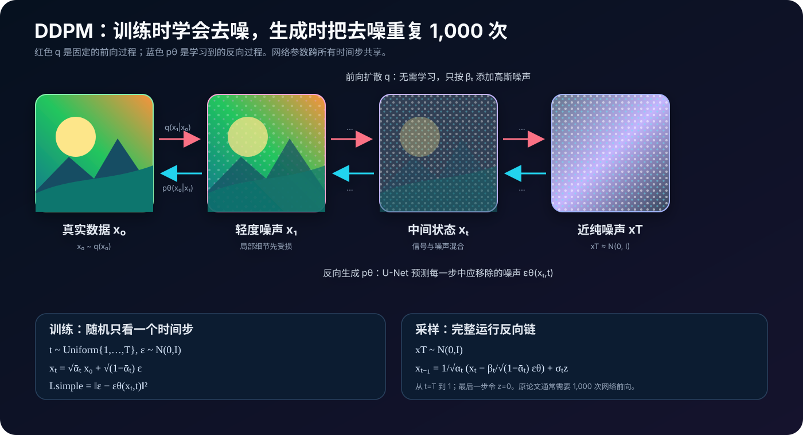
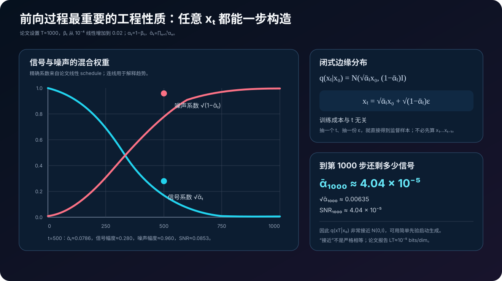
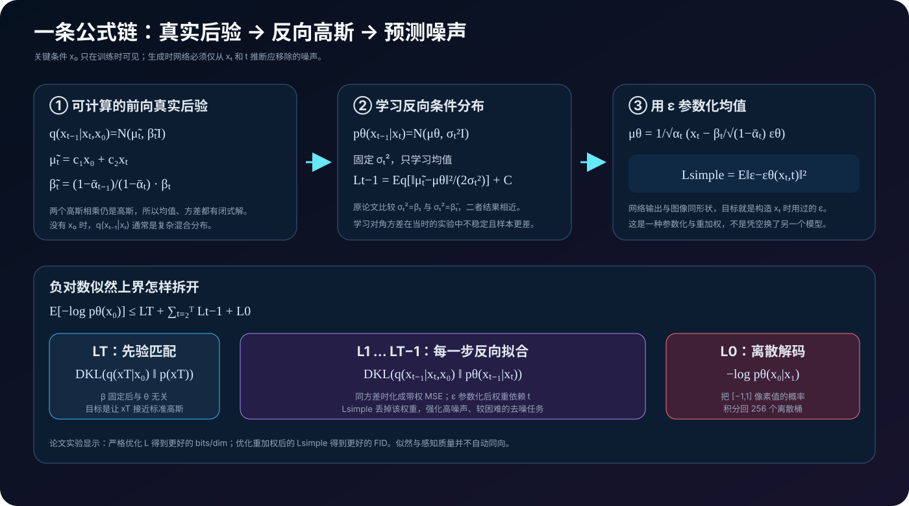
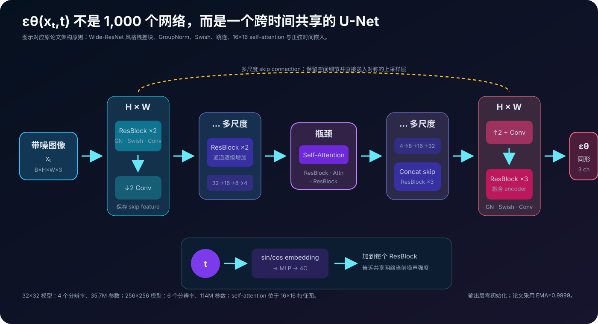
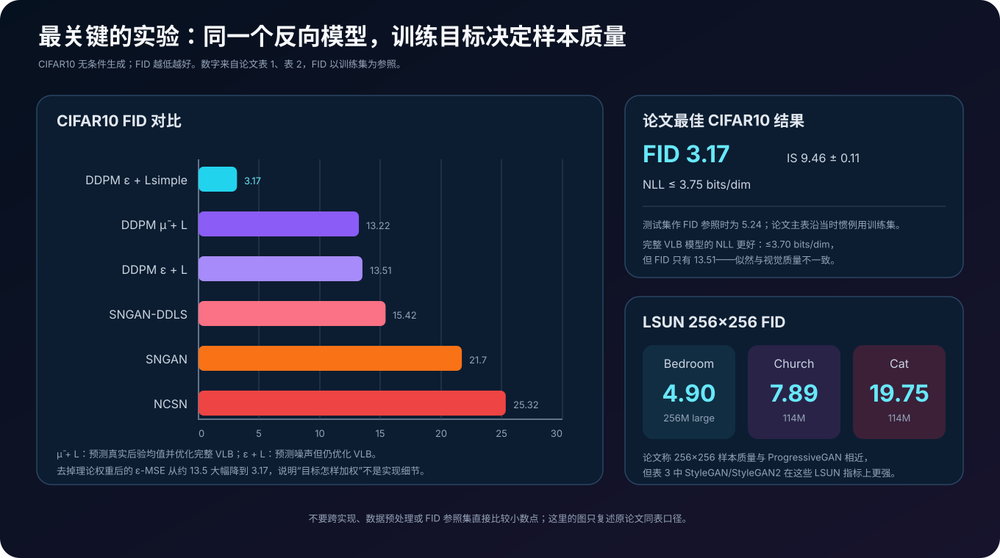

# DDPM 原理详解：把图像生成变成 1,000 个高斯去噪步骤


> **论文**：[Denoising Diffusion Probabilistic Models](https://arxiv.org/abs/2006.11239)<br>
> **作者**：Jonathan Ho、Ajay Jain、Pieter Abbeel<br>
> **版本**：arXiv v1 发布于 2020-06-19，v2 修订于 2020-12-16；发表于 NeurIPS 2020。本文以 arXiv v2 / NeurIPS 版本为准<br>
> **关键词**：Diffusion Model、Denoising、Variational Inference、Score Matching、U-Net、Noise Prediction、Ancestral Sampling、Generative Model<br>
> **配套代码**：[ddpm_minimal.py](./code/ddpm_minimal.py)（零依赖、纯 Python 的一维双峰分布演示；覆盖前向闭式采样、真实后验、噪声参数化与完整反向链，不是图像训练复现）<br>
> **一手资料**：[arXiv 摘要页](https://arxiv.org/abs/2006.11239) · [arXiv PDF](https://arxiv.org/pdf/2006.11239) · [NeurIPS 论文页](https://proceedings.neurips.cc/paper/2020/hash/4c5bcfec8584af0d967f1ab10179ca4b-Abstract.html) · [作者项目页](https://hojonathanho.github.io/diffusion/) · [官方 TensorFlow 实现](https://github.com/hojonathanho/diffusion)

## 0. 先说结论

DDPM，Denoising Diffusion Probabilistic Models，最常被描述为：

> 先不断给真实图像加噪，直到它变成纯高斯噪声；再训练神经网络把这个过程倒过来。

这句话方向正确，但还不够精确。DDPM 真正做的是把一个困难的分布生成问题，拆成许多小的条件高斯建模问题：

1. 定义一个**固定、不学习**的前向马尔可夫链 $q$，每一步加入少量高斯噪声；
2. 选择足够长的链，使终点 $x_T$ 几乎服从标准高斯分布；
3. 学习另一个反向马尔可夫链 $p_\theta$，从 $x_T\sim\mathcal N(0,I)$ 逐步采样回 $x_0$；
4. 用变分推断把最大似然训练拆成逐步的 KL 散度；
5. 进一步把反向均值参数化成“预测加入过的噪声 $\epsilon$”；
6. 最终把训练目标简化为一条普通的均方误差：

$$
L_{\text{simple}}
=
\mathbb E_{t,x_0,\epsilon}
\left[
\left\|
\epsilon-epsilon_\theta
\left(
\sqrt{\bar\alpha_t}x_0+\sqrt{1-\bar\alpha_t}\epsilon,
t
\right)
\right\|^2
\right].
$$



读完本文，至少应记住下面十点：

1. **前向过程不是神经网络。**$q(x_t\mid x_{t-1})$ 由预先选好的 $\beta_t$ 完全确定，训练时没有参数。
2. **训练不需要真的连续加噪 $t$ 次。**闭式分布 $q(x_t\mid x_0)$ 允许从 $x_0$ 一步构造任意噪声等级的 $x_t$。
3. **真正可计算的是 $q(x_{t-1}\mid x_t,x_0)$。**不带 $x_0$ 的 $q(x_{t-1}\mid x_t)$ 通常并不是简单高斯。
4. **网络预测 $\epsilon$，但模型仍定义了 $p_\theta(x_{t-1}\mid x_t)$。**噪声预测只是反向高斯均值的一种参数化。
5. **$L_{\text{simple}}$ 不是原始 ELBO 本身。**它丢掉随时间变化的理论权重，是一个重加权变分目标。
6. **预测噪声与 score matching 相连。**在噪声等级 $t$ 上，score 与 $-\epsilon/\sqrt{1-\bar\alpha_t}$ 成正比。
7. **原论文的生成网络是时间条件 U-Net。**它使用残差块、GroupNorm、Swish、skip connection，并在 $16\times16$ 特征图上加入 self-attention。
8. **原始 DDPM 采样很慢。**论文使用 $T=1000$，生成一批样本要运行 1,000 次网络前向。
9. **更好的似然不等于更好的 FID。**完整变分下界得到更好的 bits/dim，简化噪声 MSE 却得到明显更好的样本质量。
10. **DDIM、学习反向方差、classifier guidance、latent diffusion 都是后续工作。**它们影响了今天的扩散模型，但不能倒写成 2020 年 DDPM 的原始贡献。

一句话记忆：

> DDPM 用一个固定高斯过程把数据逐步变成噪声，再用变分推断把反向生成改写为跨噪声等级的去噪学习；最关键的工程选择，是让同一个 U-Net 预测构造 $x_t$ 时加入的噪声。

---

## 1. 2020 年的问题：高质量生成是否必须依赖对抗训练

### 1.1 当时四条主流生成路线各有代价

在 DDPM 之前，深度生成模型已经有几条成熟路线。

**自回归模型**把联合分布分解为：

$$
p(x)=\prod_i p(x_i\mid x_{<i}).
$$

它有清楚的似然目标，但必须按坐标顺序生成，图像采样慢；像素顺序本身还会写入很强的归纳偏置。

**VAE**通过潜变量与变分下界训练，编码、解码都很直接，但当时的像素级 VAE 往往容易产生偏平滑的图像。

**Normalizing Flow**提供精确似然和可逆映射，却要让网络满足可逆性与 Jacobian 可计算等架构约束。

**GAN**能生成锐利图像，但依赖生成器与判别器的对抗博弈，可能出现训练不稳定、mode collapse，而且没有直接的归一化似然。

DDPM 提出一个很有吸引力的组合：

- 训练目标稳定，核心只是回归；
- 反向条件分布有概率模型解释；
- 可以计算变分似然上界；
- 不需要判别器；
- 样本质量能达到当时强 GAN 的量级。

它的交换条件也很明显：需要很长的顺序采样链。

### 1.2 DDPM 并不是第一篇扩散模型论文

扩散概率模型可以追溯到 Sohl-Dickstein 等人的 2015 年工作。那篇论文已经提出：

1. 用一个逐步破坏数据结构的前向扩散过程；
2. 学习有限时间的反向过程；
3. 通过变分下界训练这个潜变量模型。

2019 年前后的 denoising score matching 与 annealed Langevin dynamics 又证明：若能在多个噪声尺度上学习数据密度的 score，就能从噪声生成样本。

Ho、Jain 和 Abbeel 的关键推进不是发明“加噪再去噪”这四个字，而是把几条路线连接起来，并给出能真正生成高质量图像的配方：

- 很小的高斯扩散步；
- 让终点接近标准高斯的长链；
- 时间条件 U-Net；
- 固定反向方差；
- $\epsilon$-prediction；
- 去掉理论权重的 $L_{\text{simple}}$。

这使扩散模型从一个有理论吸引力、但样本质量并不突出的模型族，变成后来生成建模的主干路线。

---

## 2. 概率模型总览：两条方向相反的马尔可夫链

先把所有随机变量和方向分清。

### 2.1 反向过程才是生成模型

DDPM 定义联合分布：

$$
p_\theta(x_{0:T})
=
p(x_T)\prod_{t=1}^{T}p_\theta(x_{t-1}\mid x_t),
$$

其中：

$$
p(x_T)=\mathcal N(x_T;0,I),
$$

$$
p_\theta(x_{t-1}\mid x_t)
=
\mathcal N
\left(
x_{t-1};
\mu_\theta(x_t,t),
\Sigma_\theta(x_t,t)
\right).
$$

最终关心的图像分布是把中间变量积掉：

$$
p_\theta(x_0)
=
\int p_\theta(x_{0:T})\,dx_{1:T}.
$$

生成时先采 $x_T\sim\mathcal N(0,I)$，再按照 $T,T-1,\ldots,1$ 的顺序逐步采样。

### 2.2 前向过程是固定的近似后验

训练时需要一个把数据映射到潜变量的分布：

$$
q(x_{1:T}\mid x_0)
=
\prod_{t=1}^{T}q(x_t\mid x_{t-1}),
$$

$$
q(x_t\mid x_{t-1})
=
\mathcal N
\left(
x_t;
\sqrt{1-\beta_t}\,x_{t-1},
\beta_t I
\right).
$$

$\beta_t\in(0,1)$ 是第 $t$ 步加入的噪声方差。论文不学习它，而是把它当作超参数日程。

“近似后验”这个词来自变分推断视角。与普通 VAE 不同：

- VAE 的 $q_\phi(z\mid x)$ 通常由编码器学习；
- DDPM 的 $q(x_{1:T}\mid x_0)$ 完全固定；
- 所有中间潜变量 $x_t$ 与图像 $x_0$ 维度相同；
- 顶层潜变量 $x_T$ 被刻意设计得几乎不保留 $x_0$ 信息。

### 2.3 为什么反向一步也可以设成高斯

如果每个 $\beta_t$ 足够小，前向一步只做极微小扰动。在连续时间极限附近，反向时间动态也能用局部高斯转移描述。

但不要把这理解成：

> 任意大的加噪过程倒过来都严格是单高斯。

真正的 $q(x_{t-1}\mid x_t)$ 对复杂数据分布可能是多峰的。DDPM 依赖“小步、长链”让每一步的条件分布足够简单，再用神经网络给出其均值。

---

## 3. 前向过程：为什么能一步跳到任意噪声等级

### 3.1 三个必须熟悉的记号

定义：

$$
\alpha_t:=1-\beta_t,
$$

$$
\bar\alpha_t:=\prod_{s=1}^{t}\alpha_s,
$$

并约定：

$$
\bar\alpha_0=1.
$$

于是单步前向过程可以重参数化为：

$$
x_t
=
\sqrt{\alpha_t}x_{t-1}
+
\sqrt{1-\alpha_t}\epsilon_t,
\qquad
\epsilon_t\sim\mathcal N(0,I).
$$

这里的 $\alpha_t$ 是**单步信号保留率**，$\bar\alpha_t$ 是从 $x_0$ 到 $x_t$ 的**累计信号保留率**。漏掉横线会把两套系数完全搞混。

### 3.2 展开两步看闭式分布从哪里来

先写：

$$
x_1
=
\sqrt{\alpha_1}x_0
+
\sqrt{1-\alpha_1}\epsilon_1.
$$

再代入第二步：

$$
\begin{aligned}
x_2
&=
\sqrt{\alpha_2}x_1
+
\sqrt{1-\alpha_2}\epsilon_2\\
&=
\sqrt{\alpha_1\alpha_2}x_0
+
\sqrt{\alpha_2(1-\alpha_1)}\epsilon_1
+
\sqrt{1-\alpha_2}\epsilon_2.
\end{aligned}
$$

后两项是两个独立高斯，它们的总方差为：

$$
\alpha_2(1-\alpha_1)+(1-\alpha_2)
=
1-\alpha_1\alpha_2.
$$

因此可以合并成一份新的标准高斯 $\epsilon$：

$$
x_2
=
\sqrt{\bar\alpha_2}x_0
+
\sqrt{1-\bar\alpha_2}\epsilon.
$$

递推可得任意时间步：

$$
q(x_t\mid x_0)
=
\mathcal N
\left(
x_t;
\sqrt{\bar\alpha_t}x_0,
(1-\bar\alpha_t)I
\right),
$$

也就是：

$$
\boxed{
x_t
=
\sqrt{\bar\alpha_t}x_0
+
\sqrt{1-\bar\alpha_t}\epsilon,
\qquad
\epsilon\sim\mathcal N(0,I)
}
$$



### 3.3 这条闭式公式为什么决定了训练效率

若没有闭式公式，为了得到 $x_{731}$，必须依次采：

```text
x0 → x1 → x2 → … → x731
```

现在只需要：

1. 从数据集取一张 $x_0$；
2. 均匀抽 $t\in\{1,\ldots,T\}$；
3. 抽一份 $\epsilon\sim\mathcal N(0,I)$；
4. 用一条式子直接得到 $x_t$。

因此一次训练迭代只执行**一次** U-Net，不随抽到的 $t$ 增长。

这也解释了 DDPM 一个看似矛盾的特征：

- 训练能随机时间步并行，成本相对友好；
- 采样必须沿反向链顺序执行，原始实现很慢。

### 3.4 SNR 提供了更直观的噪声尺度

由：

$$
x_t=\sqrt{\bar\alpha_t}x_0+\sqrt{1-\bar\alpha_t}\epsilon
$$

可定义：

$$
\operatorname{SNR}(t)
=
\frac{\bar\alpha_t}{1-\bar\alpha_t}.
$$

- $t$ 小：$\bar\alpha_t\approx1$，SNR 很高，任务接近修复细微像素噪声；
- $t$ 中等：信号与噪声混合，模型要恢复形状、颜色和语义；
- $t$ 大：$\bar\alpha_t\approx0$，SNR 极低，模型主要依赖数据先验。

论文使用：

$$
T=1000,
\qquad
\beta_1=10^{-4},
\qquad
\beta_T=0.02,
$$

并让 $\beta_t$ 线性增加。按这组数值计算：

$$
\bar\alpha_{1000}\approx4.04\times10^{-5},
$$

$$
\sqrt{\bar\alpha_{1000}}\approx0.00635.
$$

终点仍不是数学上严格的纯噪声，但来自 $x_0$ 的均值信号已经很小。论文报告：

$$
L_T
=
D_{\mathrm{KL}}(q(x_T\mid x_0)\|\mathcal N(0,I))
\approx10^{-5}\ \text{bits/dim}.
$$

所以生成时可以直接从 $\mathcal N(0,I)$ 启动，训练–生成的终点分布偏差很小。

---

## 4. 最关键的高斯：$q(x_{t-1}\mid x_t,x_0)$

很多 DDPM 解释在这里一笔带过，但这是整个推导的铰链。

### 4.1 为什么要额外条件在 $x_0$ 上

我们希望训练：

$$
p_\theta(x_{t-1}\mid x_t).
$$

自然想到用真实反向条件分布：

$$
q(x_{t-1}\mid x_t)
$$

监督它。问题是，数据分布 $q(x_0)$ 本身非常复杂，积分掉 $x_0$ 后的 $q(x_{t-1}\mid x_t)$ 往往也是复杂混合分布，没有可直接使用的闭式参数。

训练时 $x_0$ 已知，因此改用：

$$
q(x_{t-1}\mid x_t,x_0).
$$

借助贝叶斯公式：

$$
q(x_{t-1}\mid x_t,x_0)
\propto
q(x_t\mid x_{t-1})q(x_{t-1}\mid x_0).
$$

右边两项都是关于 $x_{t-1}$ 的高斯：

$$
q(x_t\mid x_{t-1})
=
\mathcal N(\sqrt{\alpha_t}x_{t-1},\beta_tI),
$$

$$
q(x_{t-1}\mid x_0)
=
\mathcal N
(\sqrt{\bar\alpha_{t-1}}x_0,(1-\bar\alpha_{t-1})I).
$$

两个高斯相乘仍是高斯。

### 4.2 配方后得到真实后验

把与 $x_{t-1}$ 有关的二次项收集起来，可以得到：

$$
q(x_{t-1}\mid x_t,x_0)
=
\mathcal N
\left(
x_{t-1};
\tilde\mu_t(x_t,x_0),
\tilde\beta_tI
\right),
$$

其中：

$$
\boxed{
\tilde\mu_t(x_t,x_0)
=
\frac{\sqrt{\bar\alpha_{t-1}}\beta_t}{1-\bar\alpha_t}x_0
+
\frac{\sqrt{\alpha_t}(1-\bar\alpha_{t-1})}{1-\bar\alpha_t}x_t
}
$$

以及：

$$
\boxed{
\tilde\beta_t
=
\frac{1-\bar\alpha_{t-1}}{1-\bar\alpha_t}\beta_t
}
$$

直觉上，真实后验均值是 $x_0$ 与 $x_t$ 的加权组合：

- $x_0$ 告诉我们干净终点在哪里；
- $x_t$ 告诉我们当前这条随机轨迹在哪里；
- 系数由噪声日程唯一决定。

### 4.3 三个分布不要混为一谈

| 分布 | 是否已知 | 是否高斯 | 用途 |
|---|---|---|---|
| $q(x_t\mid x_{t-1})$ | 完全已知 | 是 | 前向单步加噪 |
| $q(x_{t-1}\mid x_t,x_0)$ | 训练时可算 | 是 | 构造反向训练目标 |
| $q(x_{t-1}\mid x_t)$ | 通常不可直接算 | 未必是单高斯 | 理想但不可用的真实反向条件 |
| $p_\theta(x_{t-1}\mid x_t)$ | 需要学习 | 设计为高斯 | 生成时真正执行的反向步 |

尤其不能写成：

$$
q(x_{t-1}\mid x_t)=q(x_{t-1}\mid x_t,x_0).
$$

右边额外知道答案 $x_0$，只在训练时作为可处理的 teacher distribution 出现。

---

## 5. 从最大似然到逐步 KL：变分下界怎样拆开

### 5.1 原始变分目标

直接计算 $-\log p_\theta(x_0)$ 需要积分掉 $x_{1:T}$。使用固定前向过程 $q$ 作变分分布：

$$
\begin{aligned}
\mathbb E[-\log p_\theta(x_0)]
&\le
\mathbb E_q
\left[
-\log\frac{p_\theta(x_{0:T})}{q(x_{1:T}\mid x_0)}
\right]\\
&=:L.
\end{aligned}
$$

将马尔可夫分解代入，可写为：

$$
\begin{aligned}
L
=
\mathbb E_q
\left[
-\log p(x_T)
-
\sum_{t\ge1}
\log\frac{p_\theta(x_{t-1}\mid x_t)}{q(x_t\mid x_{t-1})}
\right].
\end{aligned}
$$

这已经是合法 ELBO，但直接按整条轨迹 Monte Carlo 估计，方差较高，也看不出每一项在学什么。

### 5.2 Rao–Blackwell 化后的三类项

利用上一节的真实后验，论文把它改写成：

$$
\boxed{
L
=
\underbrace{D_{\mathrm{KL}}(q(x_T\mid x_0)\|p(x_T))}_{L_T}
+
\sum_{t=2}^{T}
\underbrace{D_{\mathrm{KL}}
\left(
q(x_{t-1}\mid x_t,x_0)
\|p_\theta(x_{t-1}\mid x_t)
\right)}_{L_{t-1}}
-
\underbrace{\log p_\theta(x_0\mid x_1)}_{L_0}
}
$$

三类项各司其职。

#### $L_T$：终点先验匹配

$$
L_T
=
D_{\mathrm{KL}}(q(x_T\mid x_0)\|p(x_T)).
$$

论文固定 $\beta_t$，因此这项不依赖 $\theta$，训练时可以忽略。它仍然影响模型设计：若终点没有接近 $\mathcal N(0,I)$，生成时就会从错误先验起步。

#### $L_{t-1}$：每一个反向步的匹配

$$
L_{t-1}
=
D_{\mathrm{KL}}
\left(
q(x_{t-1}\mid x_t,x_0)
\|p_\theta(x_{t-1}\mid x_t)
\right).
$$

这两边都是高斯，KL 有闭式表达。训练不再需要对 $x_{t-1}$ 做高方差采样估计。

#### $L_0$：最后一步离散图像解码

$$
L_0=-\log p_\theta(x_0\mid x_1).
$$

论文把 8-bit 像素从 $\{0,\ldots,255\}$ 线性缩放到 $[-1,1]$，再用高斯在每个离散像素桶上的概率质量定义解码器。这样报告的变分界可以解释成离散图像的无损码长，而不必给数据额外添加 dequantization noise。



---

## 6. 为什么预测噪声 $\epsilon$，而不是直接预测图像

### 6.1 先固定反向方差

论文先把反向分布写成：

$$
p_\theta(x_{t-1}\mid x_t)
=
\mathcal N
\left(
x_{t-1};
\mu_\theta(x_t,t),
\sigma_t^2I
\right).
$$

其中 $\sigma_t^2$ 不学习。论文测试了两个边界选择：

$$
\sigma_t^2=\beta_t,
$$

或：

$$
\sigma_t^2=\tilde\beta_t.
$$

二者实验结果相近。直观上，$\beta_t$ 给出较大的反向熵，$\tilde\beta_t$ 给出较小的反向熵；它们分别对应论文讨论的两种极端数据情形。

固定同方差后，高斯 KL 中与均值有关的部分就是：

$$
L_{t-1}
=
\mathbb E_q
\left[
\frac{1}{2\sigma_t^2}
\left\|
\tilde\mu_t(x_t,x_0)-\mu_\theta(x_t,t)
\right\|^2
\right]
+C,
$$

其中 $C$ 与 $\theta$ 无关。

最直接的方法当然是让网络输出 $\tilde\mu_t$。DDPM 的关键选择是换一种等价参数化。

### 6.2 从 $x_t$ 与 $\epsilon$ 恢复 $x_0$

前向闭式重参数化为：

$$
x_t
=
\sqrt{\bar\alpha_t}x_0
+
\sqrt{1-\bar\alpha_t}\epsilon.
$$

移项就有：

$$
x_0
=
\frac{x_t-\sqrt{1-\bar\alpha_t}\epsilon}{\sqrt{\bar\alpha_t}}.
$$

如果网络预测 $\epsilon_\theta(x_t,t)$，就能构造干净图像估计：

$$
\boxed{
\hat x_0(x_t,t)
=
\frac{x_t-\sqrt{1-\bar\alpha_t}\epsilon_\theta(x_t,t)}
{\sqrt{\bar\alpha_t}}
}
$$

再把这个 $x_0$ 表达式代入真实后验均值 $\tilde\mu_t$，整理可得：

$$
\boxed{
\mu_\theta(x_t,t)
=
\frac{1}{\sqrt{\alpha_t}}
\left(
x_t
-
\frac{\beta_t}{\sqrt{1-\bar\alpha_t}}
\epsilon_\theta(x_t,t)
\right)
}
$$

所以网络虽然输出“噪声”，生成模型实际使用的仍是一个有明确均值和方差的高斯条件分布。

### 6.3 ELBO 中间项怎样化成带权噪声 MSE

把 $\mu_\theta$ 的噪声参数化代入均值 MSE，得到：

$$
L_{t-1}-C
=
\mathbb E_{x_0,\epsilon}
\left[
\frac{\beta_t^2}
{2\sigma_t^2\alpha_t(1-\bar\alpha_t)}
\left\|
\epsilon
-
\epsilon_\theta
\left(
\sqrt{\bar\alpha_t}x_0
+
\sqrt{1-\bar\alpha_t}\epsilon,
t
\right)
\right\|^2
\right].
$$

这已经说明：变分推断可以写成不同噪声等级上的去噪回归，只是每个 $t$ 有一个理论权重。

### 6.4 $L_{\text{simple}}$ 做了什么改变

论文最终用于最佳样本质量的目标是：

$$
\boxed{
L_{\text{simple}}(\theta)
=
\mathbb E_{t,x_0,\epsilon}
\left[
\left\|
\epsilon
-
\epsilon_\theta
\left(
\sqrt{\bar\alpha_t}x_0
+
\sqrt{1-\bar\alpha_t}\epsilon,
t
\right)
\right\|^2
\right]
}
$$

其中 $t$ 在 $1$ 到 $T$ 间均匀采样。

它**去掉了**：

$$
\frac{\beta_t^2}
{2\sigma_t^2\alpha_t(1-\bar\alpha_t)}
$$

这个随时间变化的权重。

因此更准确的说法是：

> $L_{\text{simple}}$ 是由变分界启发的、重加权后的噪声预测目标，而不是与原 ELBO 数值完全相等。

按论文的噪声日程，这种改写相对下调了小 $t$、低噪声项的重要性，让网络把更多容量放在高噪声、较困难的去噪任务上。实验表明它改善了 FID，但牺牲了 bits/dim。

### 6.5 为什么不直接预测 $x_0$

从代数上看，预测 $x_0$、$x_{t-1}$、真实后验均值或 $\epsilon$ 都可以转换为反向均值参数化。

论文报告，早期实验中直接预测 $x_0$ 的样本质量更差；而 $\epsilon$-prediction 同时具备：

- 目标尺度较统一：每个时间步都预测标准高斯噪声；
- 与 denoising score matching 直接相连；
- 配合无权 MSE 时有很强的经验效果；
- 代码实现极其简单。

但这不是“理论上只能预测 $\epsilon$”。后续扩散模型还会使用 $x_0$ prediction、velocity prediction 等不同参数化。

---

## 7. 与 score matching 和 Langevin dynamics 的连接

### 7.1 条件高斯的 score

对固定 $x_0$，前向边缘分布是：

$$
q(x_t\mid x_0)
=
\mathcal N
(\sqrt{\bar\alpha_t}x_0,(1-\bar\alpha_t)I).
$$

关于 $x_t$ 的 score 为：

$$
\begin{aligned}
\nabla_{x_t}\log q(x_t\mid x_0)
&=
-\frac{x_t-\sqrt{\bar\alpha_t}x_0}{1-\bar\alpha_t}\\
&=
-\frac{\epsilon}{\sqrt{1-\bar\alpha_t}}.
\end{aligned}
$$

因此预测噪声等价于预测一个经过尺度变换的 score：

$$
s_\theta(x_t,t)
\approx
-\frac{\epsilon_\theta(x_t,t)}{\sqrt{1-\bar\alpha_t}}.
$$

### 7.2 条件 score 与边缘 score 的区别

训练样本里知道 $x_0$ 和构造 $x_t$ 用的 $\epsilon$，所以监督信号来自条件 score。

但网络输入只有 $(x_t,t)$，看不到 $x_0$。在平方损失下，最优预测器是：

$$
\epsilon_\theta^*(x_t,t)
=
\mathbb E[\epsilon\mid x_t].
$$

它对应噪声后数据边缘分布 $q_t(x_t)$ 的 score。这正是 denoising score matching 的核心技巧：无需知道数据密度的归一化常数，只靠加噪样本和已知扰动就能学习 score。

### 7.3 为什么采样公式像 Langevin dynamics

Langevin dynamics 用 score 指向高密度区域，并在每一步加入随机噪声。DDPM 的反向更新：

$$
x_{t-1}
=
\frac{1}{\sqrt{\alpha_t}}
\left(
x_t
-
\frac{\beta_t}{\sqrt{1-\bar\alpha_t}}
\epsilon_\theta(x_t,t)
\right)
+
\sigma_tz
$$

也包含：

- 一个由 score / 噪声预测给出的去噪漂移；
- 一个高斯随机项；
- 随时间变化、由前向 $\beta_t$ 严格导出的系数。

与早期 NCSN 的区别在于，DDPM 不在训练后再手工拼一个 Langevin sampler，而是用变分推断直接训练这条有限步采样链。

---

## 8. 训练与采样算法：逐行解释

### 8.1 训练算法

论文 Algorithm 1 可以写成：

```text
repeat
    x0 ~ q(x0)                          # 取一张真实图像
    t  ~ Uniform({1, ..., T})           # 随机一个噪声等级
    ε  ~ N(0, I)                        # 与图像同形状的标准高斯
    xt = sqrt(ᾱt)x0 + sqrt(1-ᾱt)ε      # 一步构造带噪输入
    loss = ||ε - εθ(xt, t)||²           # 网络预测加入过的噪声
    对 θ 做一次梯度下降
until converged
```

它没有：

- 判别器；
- 负样本挖掘；
- 在训练图中展开 1,000 步；
- 需要学习的 encoder；
- 对整个生成链反向传播。

### 8.2 采样算法

论文 Algorithm 2 是：

```text
xT ~ N(0, I)
for t = T, ..., 1:
    if t > 1:
        z ~ N(0, I)
    else:
        z = 0
    xt-1 = 1/sqrt(αt) * (
              xt - βt/sqrt(1-ᾱt) * εθ(xt, t)
           ) + σt*z
return x0
```

最后一步令 $z=0$，因为已经到输出图像，不再添加新的随机噪声。

### 8.3 采样为什么不能像训练那样随机跳步

训练时已知 $x_0$，所以能用 $q(x_t\mid x_0)$ 一步构造任意 $x_t$。

生成时没有 $x_0$，只能使用模型给出的局部反向条件：

$$
p_\theta(x_{t-1}\mid x_t).
$$

原始 DDPM 并没有定义从 $x_t$ 直接跳到 $x_{t-k}$ 的学习条件分布。因此必须依次执行：

```text
xT → xT-1 → ... → x1 → x0
```

后来的 DDIM、ODE/SDE sampler、蒸馏和高阶 solver，才系统解决减少网络评估次数的问题。

---

## 9. 神经网络：时间条件 U-Net 到底预测什么



### 9.1 输入与输出形状完全相同

若图像是：

```text
x_t: [B, H, W, C]
```

那么网络输出：

```text
epsilon_theta(x_t, t): [B, H, W, C]
```

每个坐标都预测一项高斯噪声。时间步 $t$ 也是输入，否则同一张像素数组在不同噪声等级下应该怎样解释，网络无从得知。

### 9.2 U-Net 主干

论文架构基于 PixelCNN++ 的 U-Net / Wide ResNet 风格骨架：

- 下采样路径逐级减小空间分辨率、增加通道；
- 每个分辨率使用两个卷积残差块；
- 上采样路径通过 skip connection 拼接下采样特征；
- 使用 GroupNorm 替换 weight normalization；
- 激活函数是 Swish；
- 残差块的第二个卷积做零初始化；
- 在 $16\times16$ 特征图分辨率加入 self-attention；
- 输出仍与输入图像同分辨率、同通道数。

U-Net 很适合去噪：

- 低分辨率瓶颈捕获全局结构；
- 高分辨率 skip feature 保留边缘和局部位置；
- 同一个网络能根据时间条件处理从轻微噪声到近纯噪声的任务。

### 9.3 时间嵌入怎样进入残差块

论文复用 Transformer 的正弦位置编码思想，把标量时间步映射为 sin/cos 特征：

$$
\operatorname{emb}(t)_{2i}
=
\sin(t/10000^{2i/d}),
$$

$$
\operatorname{emb}(t)_{2i+1}
=
\cos(t/10000^{2i/d}).
$$

随后经过两层 MLP，把时间嵌入投影到残差块通道数，在卷积之间加到每个空间位置：

```text
h = Conv(Swish(GroupNorm(x)))
h = h + Linear(Swish(time_embedding))[:, None, None, :]
h = Conv(Dropout(Swish(GroupNorm(h))))
out = shortcut(x) + h
```

这样网络参数在所有时间步共享，但行为可以随噪声等级改变。

### 9.4 self-attention 在哪里

原论文不是纯卷积 U-Net。它在 $16\times16$ 特征图上插入 self-attention：

$$
\operatorname{Attention}(Q,K,V)
=
\operatorname{softmax}
\left(
\frac{QK^\top}{\sqrt C}
\right)V.
$$

选择 $16\times16$ 是局部与全局的折中：token 数只有 $256$，全局注意力还可承受，又能让远距离区域协调结构。

### 9.5 论文模型规模

| 数据与分辨率 | 分辨率层级 | 参数量 |
|---|---:|---:|
| CIFAR10，$32\times32$ | 4 层，$32\to16\to8\to4$ | 35.7M |
| CelebA-HQ / LSUN，$256\times256$ | 6 层 | 114M |
| LSUN Bedroom large | 更宽模型 | 约 256M |

这里没有 1,000 份模型。只有一个 $\epsilon_\theta$，在不同 $t$ 上重复调用。

---

## 10. 代码：最小 PyTorch 训练核与零依赖概率演示

### 10.1 预计算噪声日程

实际实现通常先把所有只依赖 $t$ 的系数预计算好：

```python
import torch

T = 1000
betas = torch.linspace(1e-4, 2e-2, T, dtype=torch.float64)
alphas = 1.0 - betas
alpha_bars = torch.cumprod(alphas, dim=0)
alpha_bars_prev = torch.cat([torch.ones(1, dtype=torch.float64), alpha_bars[:-1]])

posterior_variance = (
    betas * (1.0 - alpha_bars_prev) / (1.0 - alpha_bars)
)
```

这里数组下标 `0` 对应论文的 $t=1$，数组下标 `T-1` 对应论文的 $t=T$。这是实现中最常见的 off-by-one 来源。

### 10.2 把一维时间系数广播到图像

一个 batch 中每张图可能抽到不同 $t$，需要先按时间索引取值，再扩成 `[B,1,1,1]`：

```python
def extract(coefficients, t, x):
    """coefficients: [T], t: [B], return shape broadcastable to x."""
    values = coefficients.to(device=x.device, dtype=x.dtype)[t]
    return values.reshape(t.shape[0], *((1,) * (x.ndim - 1)))
```

不要直接用一个标量 `coefficients[t]` 假设整个 batch 的时间相同，也不要让 schedule 默默留在 CPU 或 `float64`，与 GPU 图像张量混算。

### 10.3 一步构造训练输入

```python
def q_sample(x0, t, noise, alpha_bars):
    sqrt_ab = extract(alpha_bars.sqrt(), t, x0)
    sqrt_one_minus_ab = extract((1.0 - alpha_bars).sqrt(), t, x0)
    return sqrt_ab * x0 + sqrt_one_minus_ab * noise
```

训练损失只剩：

```python
def ddpm_loss(model, x0, alpha_bars):
    batch = x0.shape[0]
    t = torch.randint(0, len(alpha_bars), (batch,), device=x0.device)
    noise = torch.randn_like(x0)
    xt = q_sample(x0, t, noise, alpha_bars)
    predicted_noise = model(xt, t)
    return torch.nn.functional.mse_loss(predicted_noise, noise)
```

这几行就是 $L_{\text{simple}}$ 的核心。数据加载、U-Net、优化器、EMA 和分布式训练都很重要，但不会改变目标的数学结构。

### 10.4 一步反向采样

下面用论文直接给出的 $\epsilon$ 参数化均值，并选择 $\sigma_t^2=\tilde\beta_t$：

```python
@torch.no_grad()
def p_sample(model, xt, t, betas, alphas, alpha_bars, posterior_variance):
    beta_t = extract(betas, t, xt)
    alpha_t = extract(alphas, t, xt)
    alpha_bar_t = extract(alpha_bars, t, xt)

    predicted_noise = model(xt, t)
    mean = (xt - beta_t / (1.0 - alpha_bar_t).sqrt() * predicted_noise) / alpha_t.sqrt()

    variance_t = extract(posterior_variance, t, xt)
    noise = torch.randn_like(xt)
    nonzero = (t != 0).to(xt.dtype).reshape(xt.shape[0], *((1,) * (xt.ndim - 1)))
    return mean + nonzero * variance_t.sqrt() * noise
```

完整生成是：

```python
@torch.no_grad()
def sample(model, shape, schedule, device):
    x = torch.randn(shape, device=device)
    for index in reversed(range(len(schedule.betas))):
        t = torch.full((shape[0],), index, device=device, dtype=torch.long)
        x = p_sample(model, x, t, **schedule)
    return x
```

两个实现口径需要写清：

- 论文说 $\sigma_t^2=\beta_t$ 与 $\tilde\beta_t$ 都可；
- 官方 CIFAR 默认配置使用 `fixedlarge`，主要步取 $\beta_t$；
- 本节和配套教学脚本用 `fixedsmall`，即 $\tilde\beta_t$；
- 二者都是原论文讨论的固定方差，而不是后续的 learned variance。

### 10.5 配套零依赖脚本为什么用一维双峰分布

完整 U-Net 训练需要 PyTorch、图像数据、GPU 和较长时间，不适合作为逐行核对公式的最小样例。

配套文件 [ddpm_minimal.py](./code/ddpm_minimal.py) 选择：

$$
q(x_0)
=
\frac12\delta(x_0+1)
+
\frac12\delta(x_0-1).
$$

对于这个一维双峰分布，平方误差下的 Bayes 最优噪声预测器可以解析写出。先有：

$$
\mathbb E[x_0\mid x_t]
=
\tanh
\left(
\frac{\sqrt{\bar\alpha_t}x_t}{1-\bar\alpha_t}
\right),
$$

再得到：

$$
\mathbb E[\epsilon\mid x_t]
=
\frac{x_t-\sqrt{\bar\alpha_t}\mathbb E[x_0\mid x_t]}
{\sqrt{1-\bar\alpha_t}}.
$$

脚本用它代替训练好的 U-Net，于是可以在零依赖条件下：

- 验证从 $\epsilon$ 恢复 $x_0$；
- 验证后验均值公式与噪声参数化均值一致；
- 比较最优噪声预测器与零预测器的 MSE；
- 从 $x_T\sim\mathcal N(0,1)$ 完整运行 1,000 步反向链；
- 检查最终样本是否均衡落在 $-1$ 和 $+1$ 两个模态。

运行：

```bash
python3 papers/to-2026/code/ddpm_minimal.py
python3 papers/to-2026/code/ddpm_minimal.py --test
```

典型输出：

```text
Ho et al. linear schedule
 t       beta_t     alpha_bar_t        SNR_t
   1    0.0001000      0.99990000          9999
 250    0.0050601      0.52408537       1.10122
 500    0.0100400      0.07858724     0.0852899
 750    0.0150200      0.00335055    0.00336181
1000    0.0200000      0.00004036   4.03599e-05

Formula checks
max x0 reconstruction error : 1.577e-14
max posterior-mean mismatch : 2.470e-13

Simplified objective on random training tuples
Bayes epsilon predictor MSE : 0.1204
zero predictor MSE          : 1.0047
```

这个脚本演示的是**相同概率公式在标量上的行为**，不是声称一维解析 predictor 能替代真实图像 U-Net。

---

## 11. 原论文训练配方：架构之外还有哪些关键数字

### 11.1 通用设置

论文所有实验都使用：

| 项目 | 设置 |
|---|---|
| 扩散步数 | $T=1000$ |
| $\beta$ schedule | 从 $10^{-4}$ 到 $0.02$ 线性增加 |
| 优化器 | Adam，默认 $\beta_1,\beta_2$ |
| 参数平均 | EMA，decay = 0.9999 |
| 时间条件 | Transformer 式 sinusoidal embedding |
| attention | $16\times16$ feature map |
| 数据范围 | 8-bit 像素线性缩放到 $[-1,1]$ |

论文尝试过 constant、linear 和 quadratic $\beta$ 日程，在都满足 $L_T\approx0$ 的候选中选择了线性日程。$T=1000$ 并未系统 sweep，而是与此前扩散 / score 模型的网络评估次数对齐。

### 11.2 CIFAR10

| 项目 | 设置 |
|---|---:|
| 分辨率 | $32\times32$ |
| 参数量 | 35.7M |
| batch size | 128 |
| 学习率 | $2\times10^{-4}$ |
| dropout | 0.1 |
| 数据增强 | 随机水平翻转 |
| 训练步数 | 800k |
| 训练速度 | TPU v3-8 上约 21 step/s |
| 总训练时间 | 约 10.6 小时 |

作者对 dropout 在 $\{0.1,0.2,0.3,0.4\}$ 中做了 sweep。没有 dropout 时，样本出现类似未正则化 PixelCNN++ 的过拟合伪影。

### 11.3 CelebA-HQ 与 LSUN 256×256

| 项目 | 设置 |
|---|---:|
| 标准模型参数量 | 114M |
| LSUN Bedroom large | 约 256M |
| batch size | 64 |
| 学习率 | $2\times10^{-5}$ |
| dropout | 0 |
| 训练速度 | TPU v3-8 上约 2.2 step/s |
| 采样速度 | 128 张约 300 秒 |

训练步数分别为：

- CelebA-HQ：0.5M；
- LSUN Bedroom：2.4M；
- LSUN Cat：1.8M；
- LSUN Church：1.2M；
- LSUN Bedroom large：1.15M。

除 LSUN Bedroom 外，其余大图数据也使用随机水平翻转。

### 11.4 评测口径

CIFAR10 的 IS 与 FID 使用 50,000 个生成样本。论文主表的 FID 按当时惯例相对**训练集**计算；若改为相对测试集，最佳模型 FID 为 5.24，而不是 3.17。

最终实验各训练一次，在训练过程中持续评估，并报告最低 FID 时的样本质量和似然。这意味着数字不是多次独立训练的均值，复现时不能把 `±` 误解成训练种子方差；表中 IS 的误差来自指标估计。

---

## 12. 实验结果：真正支撑了哪些结论



### 12.1 CIFAR10 主结果

论文的无条件 CIFAR10 最佳结果为：

| 模型 | IS ↑ | FID ↓ | NLL test（train）↓ |
|---|---:|---:|---:|
| DDPM，完整 $L$，固定方差 | $7.67\pm0.13$ | 13.51 | $\le3.70$（3.69） |
| DDPM，$L_{\text{simple}}$ | **$9.46\pm0.11$** | **3.17** | $\le3.75$（3.72） |

论文发布时，3.17 是无条件 CIFAR10 上非常强的 FID，也优于许多表中的条件生成模型。

但应同时看到：

- 优化完整 $L$ 的模型有更好 NLL；
- 优化 $L_{\text{simple}}$ 的模型有远好于它的 IS / FID；
- 样本感知质量和无损似然没有保持同一排序。

### 12.2 参数化与目标消融

论文表 2 是理解 DDPM 的核心证据：

| 均值参数化 | 训练目标 / 方差 | IS ↑ | FID ↓ |
|---|---|---:|---:|
| 预测 $\tilde\mu_t$ | $L$，learned diagonal $\Sigma$ | $7.28\pm0.10$ | 23.69 |
| 预测 $\tilde\mu_t$ | $L$，fixed isotropic $\Sigma$ | $8.06\pm0.09$ | 13.22 |
| 预测 $\tilde\mu_t$ | 无权均值 MSE | 不稳定 | 不稳定 |
| 预测 $\epsilon$ | $L$，learned diagonal $\Sigma$ | 不稳定 | 不稳定 |
| 预测 $\epsilon$ | $L$，fixed isotropic $\Sigma$ | $7.67\pm0.13$ | 13.51 |
| 预测 $\epsilon$ | 无权 $\|\epsilon-\epsilon_\theta\|^2$ | **$9.46\pm0.11$** | **3.17** |

可以得出四个有限而清楚的结论：

1. 固定反向方差比当时直接学习对角方差更稳定；
2. 若都优化完整变分界，预测 $\tilde\mu_t$ 与预测 $\epsilon$ 大致相当；
3. 无权 MSE 不是对任何输出参数化都有效；
4. **$\epsilon$ 参数化与无权 MSE 的组合**才产生最佳样本质量。

所以不能只说“扩散模型用 MSE 就行”。输出语义、方差选择和时间权重共同决定训练行为。

### 12.3 LSUN 256×256

论文报告：

| 模型 | Bedroom | Church | Cat |
|---|---:|---:|---:|
| DDPM，114M | 6.36 | 7.89 | 19.75 |
| DDPM large，约 256M | **4.90** | — | — |

作为参照，论文表中的 ProgressiveGAN 为 8.34 / 6.42 / 37.52；StyleGAN 与 StyleGAN2 在若干 LSUN 指标上更强。

因此更准确的总结是：DDPM 首次证明扩散概率模型能生成与当时强 GAN 相近量级的高分辨率样本，而不是它已经在所有数据集、所有指标上全面胜过 GAN。

### 12.4 训练速度与采样速度极不对称

在论文硬件上：

- CIFAR10 训练约 21 step/s，800k 步约 10.6 小时；
- 生成一批 256 张 CIFAR10 图像约 17 秒；
- 生成一批 128 张 $256\times256$ 图像约 300 秒。

因为 batch 内样本可并行，但 1,000 个时间步不能并行。DDPM 很快把“高质量生成”问题转成了“怎样减少顺序去噪步”问题。

---

## 13. 渐进生成与有损压缩：论文容易被忽略的另一半


### 13.1 每个中间状态都能预测最终图像

在反向采样到任意 $x_t$ 时，都可以计算：

$$
\hat x_0
=
\frac{x_t-\sqrt{1-\bar\alpha_t}\epsilon_\theta(x_t,t)}
{\sqrt{\bar\alpha_t}}.
$$

论文观察 $\hat x_0$ 随反向过程变化：

- 早期先出现大尺度布局和类别；
- 中期形成形状、颜色和姿态；
- 后期补上纹理、边缘和微小像素误差。

这是一种强烈的 coarse-to-fine 经验现象。不过不要把它升级成“DDPM 严格按 Fourier 频率从低到高生成”的定理；原论文没有证明这样的频率分解。

### 13.2 为什么高质量样本却没有顶尖似然

最佳 CIFAR10 样本模型的变分码长约为：

$$
3.75\ \text{bits/dim}.
$$

论文把：

$$
L_1+\cdots+L_T
$$

解释成 rate，把：

$$
L_0
$$

解释成 distortion，得到：

| 部分 | bits/dim |
|---|---:|
| rate | 1.78 |
| distortion | 1.97 |

该 distortion 对应 $[0,255]$ 像素尺度上仅约 0.95 的 RMSE。也就是说，超过一半的无损码长在描述人眼几乎不可察觉的像素细节。

这解释了一个看似矛盾的现象：

> 模型可以生成非常自然的图像，却在 lossless likelihood 上落后于自回归模型，因为似然会认真计费每一个不重要的像素级误差。

### 13.3 渐进压缩还不是实用编码器

论文 Algorithms 3 和 4 使用 minimal random coding 一类思想：若发送方知道 $q$、接收方预先知道 $p$，可用约 $D_{\mathrm{KL}}(q\|p)$ 比特发送来自 $q$ 的样本。

沿反向链逐步发送 $x_T,x_{T-1},\ldots,x_0$，总期望码长恰好对应变分界。

但原论文附录明确指出，高维 minimal random coding 在这里不可 tractable。因此这部分是：

- 对 ELBO 的压缩解释；
- 对 coarse-to-fine 信息分配的 proof of concept；
- 不是已经能替代 JPEG、PNG 或现代神经压缩器的系统。

### 13.4 与自回归解码的关系

论文还给出一个思想实验：

1. 令 $T$ 等于数据维数；
2. 每个前向步遮住一个坐标，而不是加高斯噪声；
3. $x_T$ 是全空白数据；
4. 反向模型逐个预测被遮住的坐标。

这时扩散训练就退化为一种自回归训练。

因此高斯扩散可以理解成更一般的“信息揭示顺序”：它不是按左到右或固定像素顺序生成，而是用连续高斯噪声逐步揭示整张图的信息。

这不表示 DDPM 采样是并行的。所有像素在一步内同时更新，但 1,000 个扩散时间步仍然顺序执行。

---

## 14. 潜变量结构与插值

### 14.1 用前向过程作随机编码器

给两张真实图像 $x_0$ 与 $x'_0$，先在同一噪声等级 $t$ 编码：

$$
x_t\sim q(x_t\mid x_0),
\qquad
x'_t\sim q(x'_t\mid x'_0).
$$

在线性空间中插值：

$$
\bar x_t
=(1-\lambda)x_t+\lambda x'_t,
\qquad
\lambda\in[0,1].
$$

再通过反向过程解码：

$$
\bar x_0\sim p_\theta(x_0\mid\bar x_t).
$$

论文在 CelebA-HQ 上固定不同 $\lambda$ 的随机噪声，展示平滑变化的姿态、肤色、发型、表情与背景。

### 14.2 时间步控制保留多少语义

- $t$ 小：latent 仍接近原图，重建只在细节上有随机变化；
- $t$ 中等：保留主体高层属性，允许外观明显变化；
- $t$ 接近 $T$：源图信息几乎消失，解码接近全新生成。

论文还从同一个中间 latent 多次运行随机反向链：

- 低噪声 latent 的多个结果共享几乎所有高层属性；
- 高噪声 latent 只约束更粗的属性；
- 反向链中的随机项主要在当前噪声尺度允许的自由度上变化。

这为后来 image-to-image、编辑、inversion 和条件控制提供了直观基础，但这些完整应用并不是原论文已经解决的任务。

---

## 15. 实现时最容易错的十个地方

### 15.1 把 $\alpha_t$ 与 $\bar\alpha_t$ 混用

单步分布用：

$$
\sqrt{\alpha_t}x_{t-1},
$$

从 $x_0$ 直接跳到 $x_t$ 用：

$$
\sqrt{\bar\alpha_t}x_0.
$$

少一条横线，整个 schedule 就变了。

### 15.2 论文时间从 1 开始，代码数组从 0 开始

论文 $t=1$ 通常对应代码 `t=0`。所以：

```text
paper β1     <-> code betas[0]
paper ᾱ0=1  <-> 额外 prepend 的 sentinel
paper xT     <-> code index T-1 的状态之后
```

建议在变量名或注释中明确两套约定，不要混着写。

### 15.3 第一步后验方差为 0

因为 $\bar\alpha_0=1$：

$$
\tilde\beta_1=0.
$$

直接计算 $\log\tilde\beta_1$ 会得到负无穷。官方实现为了 ELBO 数值计算，会用后一个方差值替代第一项的 clipped log variance；采样最后一步则直接不加噪声。

### 15.4 反向采样最后一步还在加 $z$

论文明确：

```text
t > 1: z ~ N(0,I)
t = 1: z = 0
```

若最后一步仍加噪，输出会被无谓污染。

### 15.5 忘记把图像缩放到 $[-1,1]$

$\beta$ 日程相对于数据尺度定义。若输入仍是 `[0,255]`，同样的高斯噪声几乎微不足道；若用 `[0,1]`，端点解码、clipping 与复现指标又要同步修改。

### 15.6 把 $\epsilon_\theta$ 当成每步实际抽到的全部随机性

网络预测的是构造 $x_t$ 时噪声的条件期望，不是能够逐样本完美恢复的秘密随机种子。反向采样还会显式加入新的 $z$。

### 15.7 错把方差选择当作均值公式的一部分

反向均值由 $\epsilon_\theta$ 转换；$\sigma_t^2$ 决定在均值周围采多大的随机步。$\beta_t$、$\tilde\beta_t$、learned variance 是不同选择，不能在公式与代码中悄悄混用。

### 15.8 softmax / attention 维度写错

在 $16\times16$ 特征图上，注意力权重应在 key 的 $H\!W$ 维做 softmax。若 reshape 后误沿 query 或通道维归一化，形状可能仍能运行，但语义完全错误。

### 15.9 忽略 EMA 权重

论文用 decay 0.9999 的参数 EMA 做评估。直接拿最后一个在线训练权重采样，FID 可能明显变差。复现报告必须说明使用 raw 还是 EMA checkpoint。

### 15.10 为了“更快”直接跳过时间步

原始 DDPM 的每个反向条件只对应相邻时间步。简单把循环从 1,000 步改成 100 步、仍套相邻步系数，并不自动得到正确 sampler。需要 DDIM、重新推导的跳步条件或专门的 solver。

---

## 16. 八个常见误解

### 误解一：DDPM 的前向过程也需要训练

不需要。原论文固定 $\beta_t$，因此 $q$ 无参数。训练对象是反向过程中的 $\epsilon_\theta$ / $\mu_\theta$。

### 误解二：训练一张图要连续运行 1,000 次加噪

不需要。$q(x_t\mid x_0)$ 有闭式分布，一次乘加就能构造随机时间步的 $x_t$。

### 误解三：网络学的是把 $x_t$ 直接变成 $x_0$

原论文最佳配置让网络预测 $\epsilon$。可以从预测噪声解析得到 $\hat x_0$，但网络的直接监督目标不是像素重建 $\|x_0-\hat x_0\|^2$。

### 误解四：$L_{\text{simple}}$ 就是严格 ELBO

不是。它丢掉了随 $t$ 变化的系数，对各噪声等级重新加权。完整 $L$ 的 likelihood 更好，$L_{\text{simple}}$ 的 FID 更好。

### 误解五：真实反向过程天然是高斯

$q(x_{t-1}\mid x_t,x_0)$ 是高斯；积分掉 $x_0$ 后的 $q(x_{t-1}\mid x_t)$ 未必是单高斯。小 $\beta_t$ 让局部高斯反向建模成为合理近似。

### 误解六：DDPM 就是普通去噪自编码器重复使用

它确实学习去噪，但还包含特定的噪声日程、有限步概率链、变分下界、反向均值与方差，以及从标准高斯出发的 ancestral sampling。只有图像去噪器并不自动成为 DDPM。

### 误解七：Stable Diffusion 就是这篇 DDPM

Stable Diffusion 继承扩散去噪思想，但采用后来的 latent diffusion、文本条件、cross-attention、不同参数化与采样器。2020 DDPM 在像素空间做无条件生成，没有文本编码器，也没有 classifier-free guidance。

### 误解八：扩散模型已经解决 mode collapse，因此覆盖绝对完整

论文展示了高样本质量和最近邻分析，但没有证明所有 mode 都被完整覆盖，也没有建立对 mode dropping 的理论保证。任何有限模型和有限评测都不能从 FID 3.17 推出完美分布恢复。

---

## 17. 局限：这篇奠基论文没有解决什么

### 17.1 采样需要 1,000 次顺序网络评估

这是原始 DDPM 最明显的实用瓶颈。U-Net 每一步都要读取完整图像特征，$256\times256$ 生成在当时硬件上一批要数分钟。

### 17.2 最佳 FID 目标不是最佳 likelihood 目标

$L_{\text{simple}}$ 的经验效果很好，但它牺牲了严格 ELBO 的时间权重。为什么某种权重最符合人类感知、怎样同时获得最佳样本与似然，原论文没有完全解决。

### 17.3 反向方差没有学好

论文尝试学习对角 $\Sigma_\theta$ 时训练不稳定、样本更差，于是固定方差。后来的 Improved DDPM 才给出更稳健的 learned variance 与混合目标。

### 17.4 线性 $\beta$ 日程是经验选择

论文只在有限候选中选择线性 schedule，没有建立它的最优性。后续 cosine schedule、连续时间 SDE 和 log-SNR 参数化会更系统地设计噪声路径。

### 17.5 主要是无条件像素空间生成

原论文聚焦无条件 CIFAR10、CelebA-HQ 与 LSUN。它没有提供：

- 文本到图像；
- 强类别 guidance；
- 图像编辑接口；
- latent-space 压缩；
- 视频或 3D 生成；
- 少步实时采样。

### 17.6 FID 与 NLL 都不是完整评测

FID 依赖特征提取器、样本量和参照集；bits/dim 又会重罚人眼不在意的细节。二者能揭示不同性质，但都不能单独代表多样性、记忆、语义一致性或公平性。

### 17.7 高质量结果仍需要可观算力

“损失只是 MSE”不表示训练廉价。114M–256M U-Net、数十万到数百万训练步、EMA 和大规模 50k 样本评估，都构成显著计算成本。

### 17.8 压缩解释尚不可直接部署

渐进编码算法依赖高维不可 tractable 的 minimal random coding 假设。它是一种理解 ELBO 和信息分配的方式，不是完整压缩产品。

---

## 18. 为什么 DDPM 成为现代生成模型的转折点

### 18.1 把复杂生成训练变成标准监督回归

DDPM 的训练循环几乎可以概括为：

```text
随机图像 + 随机时间 + 随机高斯
              ↓
         合成带噪输入
              ↓
         U-Net 预测高斯
              ↓
              MSE
```

它没有对抗博弈，目标平滑，能够直接受益于成熟的视觉网络、优化器、归一化和分布式训练基础设施。

### 18.2 统一了变分模型与 score-based model

论文显示：

- 从潜变量模型看，它在优化有限步马尔可夫链的变分界；
- 从去噪看，它在多噪声尺度上预测扰动；
- 从 score matching 看，它在估计噪声边缘分布的梯度；
- 从采样看，它执行系数由前向过程导出的 Langevin-like dynamics。

这让此前相对分散的理论语言落在同一套可运行算法上。

### 18.3 明确暴露了后续研究的四个旋钮

DDPM 之后，扩散研究可以沿四个相对独立的轴推进：

1. **噪声路径**：linear、cosine、SDE、log-SNR；
2. **预测目标**：$\epsilon$、$x_0$、score、velocity；
3. **条件控制**：class guidance、classifier-free guidance、cross-attention；
4. **采样器**：DDIM、ODE solver、高阶 solver、蒸馏与一致性模型。

原论文最重要的价值之一，是给这些改动提供了清楚、强力、概率上可解释的基线。

### 18.4 后续路线：哪些不是原论文贡献

| 后续工作 | 新增了什么 | 与原始 DDPM 的区别 |
|---|---|---|
| DDIM（2020） | 非马尔可夫前向族、确定性/少步采样 | 改采样路径，训练目标可沿用 |
| Improved DDPM（2021） | cosine schedule、学习方差、hybrid objective | 改善 likelihood 与少步采样 |
| Diffusion Models Beat GANs（2021） | classifier guidance、扩大模型 | 强类别条件与更高分辨率质量 |
| Score SDE（2021） | 连续时间 SDE / reverse-time SDE | 把离散扩散统一到连续时间 |
| Latent Diffusion（2022） | 在自动编码器 latent 中扩散 | 显著降低高分辨率空间成本 |

读论文时应先把 DDPM 的原始闭环理解清楚，再把后续组件一件件装上去；否则很容易把今天扩散系统的全部配方都误称为“DDPM 算法”。

---

## 19. 用六个思考题检验理解

### 19.1 为什么训练时能随机抽 $t$，采样时却不能随机抽顺序

训练知道 $x_0$，能通过 $q(x_t\mid x_0)$ 一步得到任意 $x_t$；采样没有 $x_0$，原始模型只提供相邻反向条件 $p_\theta(x_{t-1}\mid x_t)$，所以必须顺序执行。

### 19.2 如果 $\beta_t$ 一开始就非常大，会怎样

一步会抹掉大量信息，真实 $q(x_{t-1}\mid x_t)$ 可能高度多峰，单高斯反向条件难以近似；训练与采样之间的局部分布假设会变差。

### 19.3 为什么 $x_T$ 必须接近标准高斯

生成时能方便采到的是 $p(x_T)=\mathcal N(0,I)$。若训练前向终点 $q(x_T)$ 与它差很远，反向模型会在训练从未见过的起点上工作，产生 distribution shift。

### 19.4 若 $\epsilon_\theta$ 完美预测前向采样用的 $\epsilon$，是否每一步都应确定性更新

不一定。$\epsilon_\theta(x_t,t)$ 在 MSE 下学习的是条件期望，而同一个 $x_t$ 可能对应多个 $x_0$ 与前向噪声。反向条件本身需要随机性来表达多种可能，故 $t>1$ 仍加入 $\sigma_tz$。

### 19.5 为什么完整 ELBO 更好，却生成图更差

ELBO 按无损码长最优地权衡各时间项，会投入大量容量拟合低噪声、视觉上不重要的精细误差；$L_{\text{simple}}$ 重加权后更关注困难的高噪声去噪，经验上更有利于全局结构和 FID。

### 19.6 若把 $T$ 从 1000 改成 100，仍保持 $\beta_1,\beta_T$ 不变，会怎样

累计乘积 $\bar\alpha_T$ 会完全不同，终点可能保留大量信号，不再接近标准高斯。不能只缩短循环而不重新设计 schedule、训练目标与 sampler。

---

## 20. 总结

DDPM 的主干可以浓缩成六组公式。

前向单步：

$$
q(x_t\mid x_{t-1})
=
\mathcal N(\sqrt{\alpha_t}x_{t-1},\beta_tI).
$$

任意时间闭式采样：

$$
x_t
=
\sqrt{\bar\alpha_t}x_0
+
\sqrt{1-\bar\alpha_t}\epsilon.
$$

真实条件后验：

$$
q(x_{t-1}\mid x_t,x_0)
=
\mathcal N(\tilde\mu_t,\tilde\beta_tI).
$$

反向均值的噪声参数化：

$$
\mu_\theta(x_t,t)
=
\frac{1}{\sqrt{\alpha_t}}
\left(
x_t-
\frac{\beta_t}{\sqrt{1-\bar\alpha_t}}
\epsilon_\theta(x_t,t)
\right).
$$

简化训练目标：

$$
L_{\text{simple}}
=
\mathbb E\|\epsilon-\epsilon_\theta(x_t,t)\|^2.
$$

反向采样：

$$
x_{t-1}
=
\mu_\theta(x_t,t)
+
\sigma_tz.
$$

但真正理解 DDPM，不是只背下这六行，而是能说清下面这条逻辑链：

```text
复杂数据分布难以直接生成
        ↓
用很多个小高斯步骤逐渐破坏数据
        ↓
终点变成可直接采样的标准高斯
        ↓
条件在 x0 时，每一步真实后验都有闭式
        ↓
ELBO 拆成逐步高斯 KL
        ↓
把反向均值重参数化为预测 ε
        ↓
用随机时间步的 MSE 稳定训练共享 U-Net
        ↓
生成时从噪声顺序运行 1,000 个反向步骤
```

DDPM 最深远的贡献，不是提出“图像可以去噪”，而是证明：

> 只要设计一条足够平滑、终点足够简单的噪声路径，就可以把高维生成建模变成一组共享参数的局部去噪问题；变分推断、score matching 与随机采样因而能落在同一套稳定而高质量的算法中。

---

## 参考资料与延伸阅读

1. Ho, Jain, Abbeel, [Denoising Diffusion Probabilistic Models](https://arxiv.org/abs/2006.11239), NeurIPS 2020.
2. Ho et al., [DDPM 官方 TensorFlow 实现](https://github.com/hojonathanho/diffusion), 2020.
3. Sohl-Dickstein et al., [Deep Unsupervised Learning using Nonequilibrium Thermodynamics](https://arxiv.org/abs/1503.03585), ICML 2015.
4. Song, Ermon, [Generative Modeling by Estimating Gradients of the Data Distribution](https://arxiv.org/abs/1907.05600), NeurIPS 2019.
5. Vincent, [A Connection Between Score Matching and Denoising Autoencoders](https://direct.mit.edu/neco/article/23/7/1661/7677/A-Connection-Between-Score-Matching-and-Denoising), Neural Computation 2011.
6. Ronneberger et al., [U-Net: Convolutional Networks for Biomedical Image Segmentation](https://arxiv.org/abs/1505.04597), MICCAI 2015.
7. Song et al., [Denoising Diffusion Implicit Models](https://arxiv.org/abs/2010.02502), ICLR 2021.
8. Nichol, Dhariwal, [Improved Denoising Diffusion Probabilistic Models](https://arxiv.org/abs/2102.09672), ICML 2021.
9. Dhariwal, Nichol, [Diffusion Models Beat GANs on Image Synthesis](https://arxiv.org/abs/2105.05233), NeurIPS 2021.
10. Song et al., [Score-Based Generative Modeling through Stochastic Differential Equations](https://arxiv.org/abs/2011.13456), ICLR 2021.
11. Rombach et al., [High-Resolution Image Synthesis with Latent Diffusion Models](https://arxiv.org/abs/2112.10752), CVPR 2022.

建议阅读顺序：

```text
VAE / 变分下界
  → 2015 Diffusion Probabilistic Model
  → NCSN / Denoising Score Matching
  → DDPM（离散时间统一与高质量图像）
  → DDIM（少步 / 确定性采样）
  → Improved DDPM（方差与日程）
  → Score SDE（连续时间统一）
  → Classifier Guidance / Classifier-Free Guidance
  → Latent Diffusion（高分辨率与文本条件）
```
