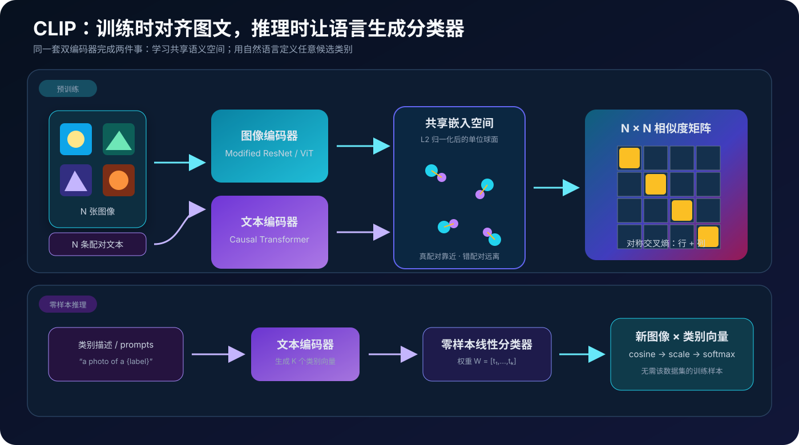
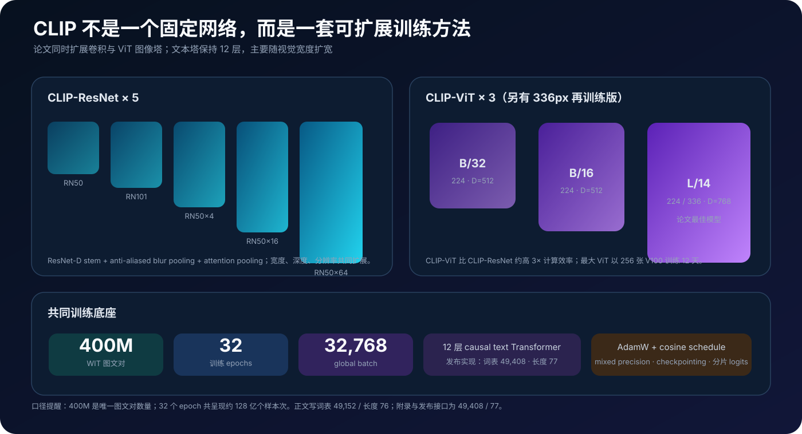
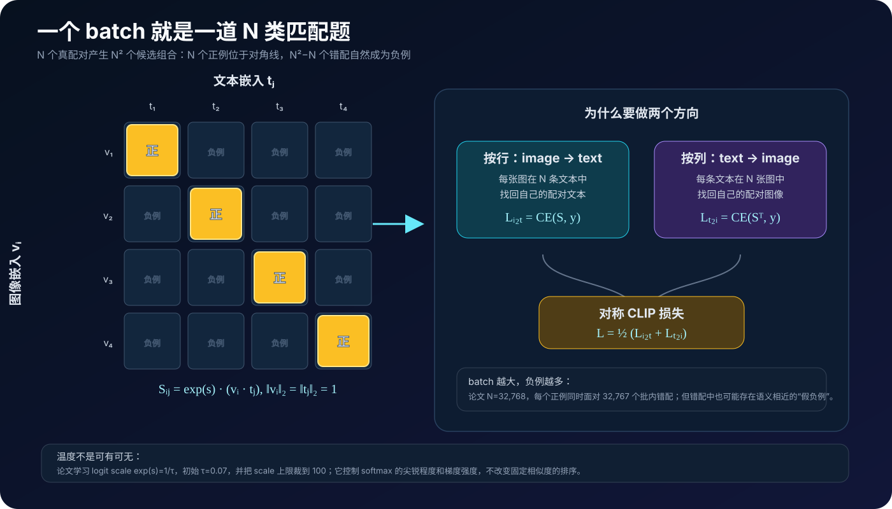
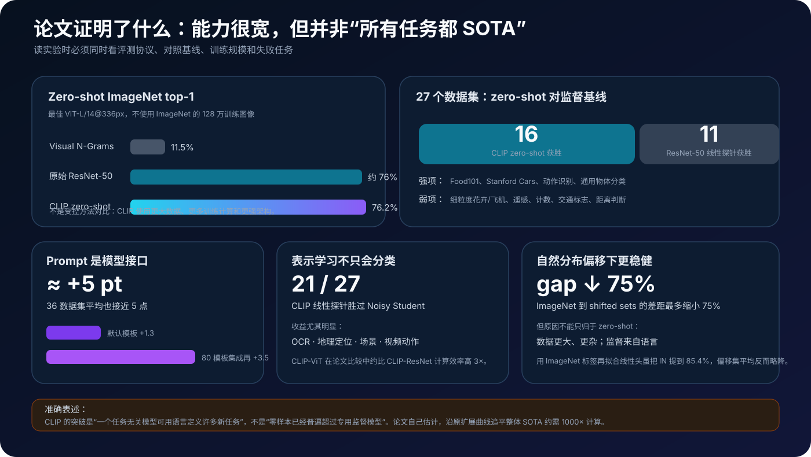
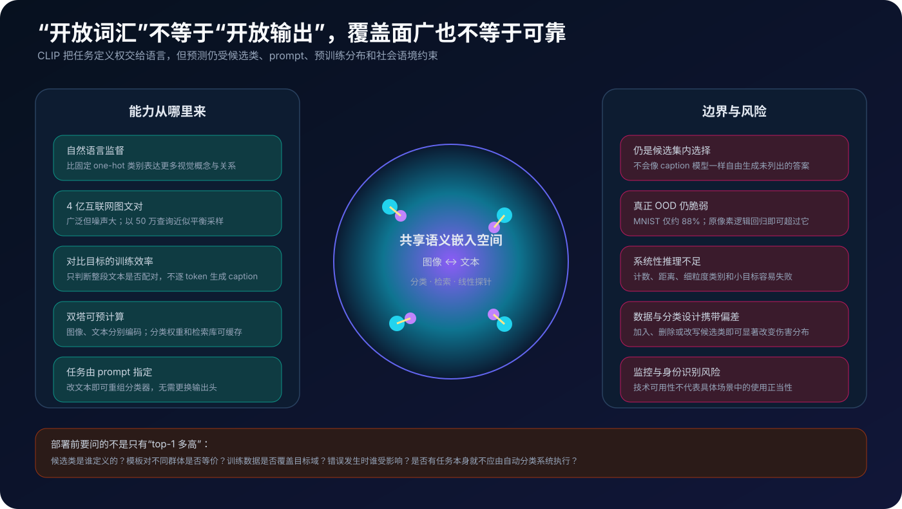

# CLIP 原理详解：用自然语言给视觉模型“现场生成”分类器


> **论文**：[Learning Transferable Visual Models From Natural Language Supervision](https://arxiv.org/abs/2103.00020)<br>
> **作者**：Alec Radford、Jong Wook Kim、Chris Hallacy、Aditya Ramesh、Gabriel Goh、Sandhini Agarwal、Girish Sastry、Amanda Askell、Pamela Mishkin、Jack Clark、Gretchen Krueger、Ilya Sutskever<br>
> **版本**：arXiv v1 发布于 2021-02-26；发表于 ICML 2021。本文以论文 v1 与 OpenAI 官方开源实现为准<br>
> **关键词**：Contrastive Language–Image Pre-training、Natural Language Supervision、Dual Encoder、InfoNCE、Zero-shot Transfer、Prompt Engineering、Open-vocabulary Vision<br>
> **配套代码**：[clip_minimal.py](./code/clip_minimal.py)（零依赖、纯 Python；实现归一化、批内图文对比损失、温度缩放、prompt ensemble 与 zero-shot 分类，不训练 CNN / Transformer）<br>
> **一手资料**：[arXiv 摘要页](https://arxiv.org/abs/2103.00020) · [arXiv HTML](https://arxiv.org/html/2103.00020v1) · [arXiv PDF](https://arxiv.org/pdf/2103.00020) · [OpenAI 官方解读](https://openai.com/index/clip/) · [官方代码与模型](https://github.com/openai/CLIP)

## 0. 先说结论

CLIP，全称 **Contrastive Language–Image Pre-training**，可以压缩成一句话：

> 在 4 亿对互联网图像与文本上，让图像编码器和文本编码器把正确配对映射到相近位置、错误配对映射到较远位置；下游分类时，再用文本编码器把类别描述直接变成分类器权重。

这句话看似只是在“对齐图和文”，真正改变视觉范式的却是输出接口。

传统图像分类器把最后一层固定成 $K$ 个类别：

$$
\mathbf z=\mathbf W^\top f_\theta(x)+\mathbf b,
\qquad
\mathbf W\in\mathbb R^{d\times K}.
$$

训练完成后，$\mathbf W$ 的第 $k$ 列只对应一个预先规定好的 ID。若要增加“水獭”“卫星图中的机场”或“手写数字”之类的新概念，通常要收集新标签并重新拟合分类头，甚至微调整个模型。

CLIP 把固定参数 $\mathbf w_k$ 换成文本编码器生成的向量：

$$
\mathbf w_k
=
\operatorname{Normalize}\!\left(
g_\phi(\operatorname{Prompt}(c_k))
\right).
$$

于是任务不再只由训练代码中的标签表定义，也可以由自然语言描述：

```text
"a photo of a golden retriever"
"a satellite photo of an airport"
"the number '7'"
```



读完本文，至少应记住下面十二点：

1. **CLIP 不是图像生成模型。**它的原始目标是图文匹配与表示学习，本身不生成图片，也不生成 caption。
2. **核心不是“两个 Transformer”。**CLIP 是一套双塔对比学习方法；图像塔既可以是改造 ResNet，也可以是 ViT，文本塔才固定使用 Transformer。
3. **一个 batch 同时构造正例和负例。**$N$ 对样本产生 $N$ 个对角线正例和 $N^2-N$ 个批内错配。
4. **损失是双向的。**既让每张图找回自己的文本，也让每条文本找回自己的图像，然后平均两个交叉熵。
5. **相似度前必须 L2 归一化。**点积因此等于余弦相似度；模型主要学习方向，不应靠向量范数作弊。
6. **温度是可学习参数。**官方实现学习 $\exp(s)=1/\tau$，初始化为 $1/0.07$；论文训练时把 scale 上限裁到 100 以避免不稳定。
7. **zero-shot 分类仍是线性分类。**它只是把“从标注样本拟合权重”换成“从类别文本生成权重”。
8. **prompt 不是装饰。**仅将裸类名包成 `a photo of a {label}`，ImageNet 就提高 1.3 个点；80 个模板的 embedding ensemble 再提高 3.5 个点。
9. **76.2% 是最佳 ViT-L/14@336px 的 zero-shot ImageNet top-1。**不是所有 CLIP 模型的成绩，也不是在 ImageNet 上微调后的成绩。
10. **“开放词汇”不等于“开放输出”。**给定 $K$ 个候选文本，原始 CLIP 仍只能从这 $K$ 个候选中选择；它不能像 caption 模型那样自由生成未列出的答案。
11. **分布覆盖不是系统性泛化。**CLIP 在自然图像分布变化上很稳健，却仍会在计数、距离判断、细粒度类别和真正陌生的图像域上失败。
12. **类别设计本身会改变偏差与伤害。**使用什么候选类、如何措辞、阈值设在哪里，都不只是工程细节。

一句话记忆：

> CLIP 用对比学习把互联网自然语言变成可扩展的视觉监督，再把文本编码器变成一个按需生成分类器权重的超网络；它打开了开放词汇视觉，但没有消除数据偏差、分布外脆弱性和任务边界。

---

## 1. 2021 年以前的矛盾：视觉类别很窄，互联网语言很宽

### 1.1 固定标签把模型能力锁进一个封闭集合

ImageNet 式监督非常干净：

```text
图像 -> 1000 类中的一个 ID
```

这种接口易于训练和评测，却有三个根本限制。

第一，**标签空间由数据集作者提前决定**。世界上可描述的视觉概念远多于 1000 或 18,291 个离散类，模型学到多少取决于人类事先列了多少类。

第二，**新任务需要新标注**。模型即使已经见过大量相关视觉内容，仍要收集目标数据集样本，把类别语义重新“教”一遍。

第三，**类 ID 没有语言结构**。`class_207` 与 `class_208` 的距离不表达“金毛犬”和“拉布拉多犬”之间的关系；监督信号只告诉模型哪个格子正确。

NLP 在同一时期已展示另一种可能：任务无关预训练先从海量原始文本吸收知识，再用自然语言接口零样本或少样本迁移。CLIP 追问：

> 视觉能否也直接从互联网中已有的自然语言监督学习，而不是永远依赖人工整理好的固定类表？

### 1.2 自然语言监督到底“监督”了什么

网页中的图像标题、alt text、说明、描述和上下文并不是金标准标注。它们可能：

- 精确描述图中主体；
- 描述地点、动作或风格；
- 只谈与图像相关的话题；
- 包含主观判断、广告文案或噪声；
- 携带社会偏见与错误信息。

所以把 CLIP 简称为“无监督学习”并不准确。论文刻意使用 **natural language supervision**：

- 它不是人工众包的 one-hot 标签；
- 也不是完全不使用外部语义的纯视觉自监督；
- 它利用人类已经写在互联网中的语言作为弱而丰富的监督。

自然语言的优势不在“更干净”，而在 **表达力和可扩展性**。一句话可以同时包含对象、属性、动作、场景、地点、文字和关系，远超一个类别 ID。

### 1.3 CLIP 不是第一个图文表示模型

更早的工作已经尝试：

- 从配图文档中预测名词和形容词；
- 用图片元数据构造 bag-of-words 多标签任务；
- 学习视觉 n-gram，并用类名做 zero-shot；
- 用 caption language modeling 学视觉表示；
- 在医学影像中做图文对比学习。

CLIP 的突破不是凭空发明“图文对齐”，而是把三个因素同时做到足够大：

```text
互联网规模数据
    ×
高效的批内对比目标
    ×
可预测扩展的现代 CNN / ViT + Transformer
```

论文最好的理解方式因此不是“一个新损失函数”，而是“一个老方向终于跨过规模和效率门槛”。

---

## 2. WIT：4 亿图文对是怎样来的

公开的 MS-COCO 与 Visual Genome 约各有 10 万张训练图，质量高但规模不足。YFCC100M 虽有 1 亿照片，元数据却经常只是自动文件名或相机参数；论文称过滤到带英文自然语言标题或描述后只剩约 1500 万张。

为研究真正的互联网规模，作者构建了 **WIT（WebImageText）**：

$$
|\mathcal D| \approx 4\times10^8
$$

个图像–文本对。

### 2.1 不是从网页上随便抓 4 亿条

为了覆盖更多视觉概念，作者先构造约 50 万个查询：

- 英文 Wikipedia 中出现至少 100 次的词；
- 点互信息较高的二元短语；
- 搜索量达到阈值的 Wikipedia 文章标题；
- 尚未覆盖的 WordNet synset。

每个查询最多纳入 2 万个图文对，用这种上限做近似类别平衡，避免少数高频概念完全淹没长尾。

这不是严格意义上的“50 万类监督”。查询用于 **数据发现与采样**，训练时模型看到的仍是原始文本，不是查询 ID。

### 2.2 400M、12.8B 和 WebText 的口径

容易混淆的三个数字是：

| 数字 | 含义 |
|---|---|
| 400M | 不同的 WIT 图文对数量 |
| 32 epochs | 每个样本平均被训练 32 轮 |
| 12.8B | $400\text{M}\times32$，训练过程中的样本呈现次数，不是 128 亿条唯一图文对 |

论文还说 WIT 的总词数与训练 GPT-2 的 WebText 大致相当。这个比较强调的是自然语言监督规模，不表示两个数据集内容相同。

### 2.3 最大的复现缺口也在数据

论文公开了模型和推理代码，却没有公开 WIT 数据集。读者无法完整审计：

- 数据来源和许可；
- 清洗、去重与语言过滤；
- 人口群体和地域分布；
- 搜索查询与采样造成的选择偏差；
- 具体训练样本是否进入某个下游 benchmark。

这使 CLIP 的“方法可复现”和“整套训练可复现”必须分开讨论。

---

## 3. 为什么选择对比学习，而不是让模型写 caption

### 3.1 生成完整文本是一道过难的代理任务

作者最初尝试过类似 VirTex 的方案：

```text
图像 -> 图像编码器 -> 文本 Transformer -> 逐 token 生成配套文本
```

它的表达力很强，却要求模型预测原文的每个词。对一张相同图片，合理描述可能有无数种：

```text
"a dog running on grass"
"a joyful pet outdoors"
"my puppy in the park"
```

如果训练目标只把其中一句当唯一正确答案，模型要花大量计算学习措辞、语序和语言生成，而论文真正需要的是可迁移的视觉语义。

实验中，63M 参数的 caption Transformer 已消耗约图像 ResNet-50 两倍的计算，却在 zero-shot ImageNet 能力上比预测文本 bag-of-words 的简单基线学得慢 3 倍。

### 3.2 把问题从“复述句子”改成“找对搭档”

CLIP 不再问：

> 给定图片，原 caption 的下一个 token 是什么？

而是问：

> 在当前 batch 的 $N$ 条文本里，哪一条曾与这张图同时出现？

相对于 bag-of-words 预测基线，换成图文对比目标又把 zero-shot ImageNet 学习效率提高约 4 倍。

这里的关键取舍是：

- **丢掉生成细节**：不再建模完整文本分布；
- **保留跨模态语义**：必须判断整段文字与图像是否匹配；
- **获得计算效率**：一次矩阵乘法就能比较 batch 中所有组合。

这也解释了 CLIP 的能力边界：它是高效的匹配器和表示模型，不是自由回答视觉问题的生成器。

---

## 4. 双塔架构：图像和文本在哪里相遇



CLIP 使用两个可以独立运行的编码器：

$$
\mathbf h_i=f_\theta(x_i),\qquad
\mathbf u_i=g_\phi(y_i).
$$

再通过线性投影进入同一个 $d$ 维空间：

$$
\mathbf z_i^{I}=\mathbf h_i\mathbf W_I,\qquad
\mathbf z_i^{T}=\mathbf u_i\mathbf W_T.
$$

论文特意没有使用 SimCLR 常见的非线性投影 MLP，因为实验中没有发现训练效率收益；图像与文本表示只经线性层对齐。

### 4.1 图像塔：Modified ResNet 或 ViT

论文训练五个 ResNet：

- RN50；
- RN101；
- RN50x4；
- RN50x16；
- RN50x64。

它们不是原样的 torchvision ResNet。主要修改包括：

- 使用 ResNet-D 风格的三层 stem；
- 下采样卷积前加入 average pooling，做 anti-aliasing；
- 用单层多头 QKV attention pooling 取代最终 global average pooling；
- 扩展大模型时同时增加宽度、深度和输入分辨率。

另外训练三个 ViT：

- ViT-B/32；
- ViT-B/16；
- ViT-L/14。

CLIP-ViT 基本沿用原始 ViT，只在 patch embedding 与位置 embedding 相加后额外加一层 LayerNorm，并调整初始化。ViT-L/14 还以 336 分辨率再训练一个 epoch，得到论文最佳模型 `ViT-L/14@336px`。

### 4.2 文本塔：12 层 causal Transformer

基础文本编码器约 63M 参数：

- 12 层 Transformer；
- 宽度 512；
- 8 个 attention heads；
- lower-cased byte-level BPE；论文正文写 49,152，附录和发布 checkpoint 对应 49,408 个 token；
- 使用 masked self-attention，即 causal mask；
- 用最高层 `[EOS]` 位置的激活作为文本表示；
- LayerNorm 后做线性投影。

这里有两处值得保留的原文口径差异。论文正文写词表 49,152、最大序列长度 capped at 76；附录表 18 写 vocabulary size 49,408，而官方开源 tokenizer 的实际词表也是 49,408，张量 `context_length` 则是 77。发布实现将 `[SOS]`、BPE 内容与 `[EOS]` 一起放入这 77 个位置。复现代码时应以 checkpoint 的 49,408 × 77 接口为准，不要因正文数字手工删减。

为什么编码任务还用 causal mask，而不是 BERT 式双向注意力？论文给出的动机是保留未来从预训练语言模型初始化或加入语言建模辅助目标的可能性；这不是 CLIP 对比目标本身的必要条件。

### 4.3 双塔与跨模态融合模型的区别

CLIP 在得到最终向量之前，图像 token 和文本 token **没有逐层 cross-attention**：

```text
image -> image encoder -> one vector ┐
                                      ├-> similarity
text  -> text encoder  -> one vector ┘
```

优点：

- 图像库和文本库可以分别离线编码；
- 训练时所有两两相似度是一条矩阵乘法；
- 检索和大类表分类很高效；
- 可以独立替换或扩展任一编码器。

代价：

- 一个全局向量要压缩全部局部细节；
- 缺少 token 级细粒度交互；
- 对关系、计数、空间组合和小目标通常不如带跨模态融合的后续模型。

---

## 5. 核心数学：N×N 矩阵里到底优化了什么

设一个 batch 有 $N$ 个配对样本：

$$
\{(x_i,y_i)\}_{i=1}^{N}.
$$

图像与文本分别编码并投影：

$$
\mathbf a_i=f_\theta(x_i)\mathbf W_I,
\qquad
\mathbf b_i=g_\phi(y_i)\mathbf W_T.
$$

### 5.1 先投到单位球面

$$
\mathbf v_i
=
\frac{\mathbf a_i}{\|\mathbf a_i\|_2},
\qquad
\mathbf t_i
=
\frac{\mathbf b_i}{\|\mathbf b_i\|_2}.
$$

归一化后：

$$
\mathbf v_i^\top\mathbf t_j
=
\cos(\mathbf v_i,\mathbf t_j)\in[-1,1].
$$

这样模型不能简单放大向量范数来降低损失，匹配主要取决于方向。

### 5.2 所有图文两两比较

定义可学习的 logit scale：

$$
\alpha=\exp(s)=\frac1{\tau}.
$$

相似度 logits 为：

$$
S_{ij}
=
\alpha\,\mathbf v_i^\top\mathbf t_j.
$$

得到：

$$
\mathbf S\in\mathbb R^{N\times N}.
$$



对角线 $S_{ii}$ 是真实图文对；非对角线 $S_{ij},i\ne j$ 是当前 batch 中未配对的组合。

### 5.3 图像到文本方向

固定第 $i$ 张图，在所有文本中分类：

$$
p_{i\to t}(j)
=
\frac{\exp(S_{ij})}
{\sum_{k=1}^{N}\exp(S_{ik})}.
$$

正确目标是 $j=i$：

$$
\mathcal L_{I\to T}
=
-\frac1N
\sum_{i=1}^{N}
\log p_{i\to t}(i).
$$

### 5.4 文本到图像方向

固定第 $j$ 条文本，在所有图像中分类：

$$
p_{j\to i}(i)
=
\frac{\exp(S_{ij})}
{\sum_{k=1}^{N}\exp(S_{kj})}.
$$

对应损失：

$$
\mathcal L_{T\to I}
=
-\frac1N
\sum_{j=1}^{N}
\log p_{j\to i}(j).
$$

最终目标：

$$
\boxed{
\mathcal L_{\text{CLIP}}
=
\frac12
\left(
\mathcal L_{I\to T}
+
\mathcal L_{T\to I}
\right)
}
$$

这就是论文所谓 symmetric cross entropy，也可视为跨模态 InfoNCE / multi-class N-pair loss。

### 5.5 为什么一个方向不够

只做 image→text 时，每一行被归一化，但没有直接要求每一列都能从图像中被唯一找回。反向损失补上列方向约束，使两个塔更对称：

- 图像必须区分多条文本；
- 文本也必须区分多张图像；
- 训练目标与双向图文检索一致。

### 5.6 batch 大小为什么重要

论文 global batch 为 $32{,}768$。对每个正例，它提供：

$$
32{,}768-1=32{,}767
$$

个批内错配。整个矩阵有：

$$
32{,}768^2\approx1.074\times10^9
$$

个 logit，其中对角线正例只占约 $0.0031\%$。

大 batch 带来丰富负例，却也产生显存和通信压力。论文把相似度计算分片，每张 GPU 只计算本地需要的矩阵子集。

### 5.7 批内“负例”不一定真是语义负例

若 batch 中有：

- 两张不同角度的同一只狗；
- “a golden retriever” 与 “a dog”；
- 同一地点的两张照片；
- 两段都适合一张图的描述；

训练目标仍把非对角组合当作负例。这种 **false negative** 是实例级对比目标的结构性问题。

不能把 CLIP 损失解释成“所有非配对语义都应互斥”。它只知道数据中哪对一起出现，不知道其他组合是否也合理。

---

## 6. 温度：为什么余弦相似度还要乘一个数

如果所有 logits 只在 $[-1,1]$，softmax 往往过于平坦。温度通过：

$$
S_{ij}
=
\frac{\mathbf v_i^\top\mathbf t_j}{\tau}
$$

控制概率分布尖锐程度。

- $\tau$ 大，logits 差异缩小，概率更平；
- $\tau$ 小，logits 差异放大，概率更尖；
- 对固定相似度，缩放不改变排序，却会改变置信度与梯度。

CLIP 不手调固定温度，而是直接学习对数参数：

```python
logit_scale = nn.Parameter(log(1 / 0.07))
scale = logit_scale.exp()
logits = scale * image_features @ text_features.T
```

使用 $\exp(s)$ 保证 scale 始终为正。论文称训练时将 scale 裁到最大 100，避免 softmax 过度饱和导致不稳定。官方发布的 `model.py` 前向只调用 `.exp()`；若自己复现训练，需要不要误以为发布前向代码已包含论文中的裁剪逻辑。

---

## 7. Zero-shot 分类：文本怎样变成线性层权重

预训练后，给一个下游数据集的类别集合：

$$
\mathcal C=\{c_1,\ldots,c_K\}.
$$

为每个类写一个 prompt：

$$
q_k=\text{“a photo of a }\{c_k\}\text{.”}
$$

经文本编码器得到：

$$
\mathbf w_k
=
\frac{g_\phi(q_k)}
{\|g_\phi(q_k)\|_2}.
$$

把所有类别向量按列拼起来：

$$
\mathbf W=[\mathbf w_1,\ldots,\mathbf w_K]
\in\mathbb R^{d\times K}.
$$

新图像的归一化表示为 $\mathbf v$，预测：

$$
\mathbf z
=
\alpha\mathbf W^\top\mathbf v,
\qquad
p(y=k\mid x)
=
\operatorname{softmax}(\mathbf z)_k.
$$

这就是一个：

- 输入 L2 归一化；
- 权重 L2 归一化；
- 无 bias；
- 带 temperature scaling；

的 multinomial logistic regression。

论文给出一个很有启发性的解释：

> 图像编码器是视觉 backbone；文本编码器是 hypernetwork，根据语言描述动态生成线性分类器的权重。


### 7.1 为什么裸类名常常不够

直接编码 `crane` 有两个问题。

**歧义**：它可能是鹤，也可能是起重机。

**分布差**：WIT 中与图片配对的文本通常是一句描述，而不是孤零零一个词。

默认模板：

```text
a photo of a {label}
```

既告诉文本塔“这段话在描述图像内容”，也把输入拉回预训练文本分布。论文报告它使 ImageNet top-1 提高 1.3 个点。

对特定任务还可加语境：

```text
a photo of a {label}, a type of pet
a photo of {label}, a type of food
a satellite photo of {label}
the number "{label}"
```

这里的 prompt engineering 不是让模型逐步推理，而是在定义类别向量的语义与先验。

### 7.2 Prompt ensemble 在 embedding 空间完成

对类别 $c_k$ 准备 $M$ 个模板，得到：

$$
\mathbf t_{km}
=
\operatorname{Normalize}
\left(g_\phi(q_{km})\right).
$$

先平均，再归一化：

$$
\mathbf w_k
=
\operatorname{Normalize}
\left(
\frac1M\sum_{m=1}^{M}\mathbf t_{km}
\right).
$$

然后只缓存一个 $\mathbf w_k$。因此，无论用了多少模板，批量图像推理时仍只需与 $K$ 个类别向量比较，而不是每次重复编码 $KM$ 段文本。

论文在 ImageNet 上集成 80 个上下文模板，比单一默认模板再提高 3.5 个点；prompt engineering 与 ensemble 合计接近 5 个点。这个收益大致相当于基线方法使用 4 倍计算的改进，却可在缓存文本向量后摊薄到几乎不增加单图成本。

### 7.3 类别集合会改变每个概率

softmax 是相对选择。若原候选集是：

```text
cat, dog
```

再加入：

```text
wolf, fox, coyote
```

即使图像向量完全不变，`dog` 的概率也会变化。若缺少正确类别，模型仍会从错误候选中给出最高分。

所以 CLIP 的分数不能脱离：

- 候选类全集；
- prompt 文本；
- temperature；
- 决策阈值；

单独解释为绝对事实。

---

## 8. 训练配方与计算规模

论文训练 5 个 ResNet 和 3 个 ViT，共 8 个基础模型，全部从随机初始化训练 32 epochs。

共同设置：

| 项目 | 论文设置 |
|---|---:|
| 数据 | 400M WIT 图文对 |
| Global batch | 32,768 |
| Epochs | 32 |
| Optimizer | Adam + decoupled weight decay（即 AdamW 思路） |
| Weight decay | 0.2 |
| LR schedule | cosine decay |
| Warmup | 2,000 iterations |
| 初始 temperature | $\tau=0.07$ |
| 最大 logit scale | 100 |
| 精度 | mixed precision |
| 省显存 | gradient checkpointing、半精度 Adam statistics、文本权重 stochastic rounding |
| 数据增强 | resize 后随机方形 crop |

其中：

- RN50 / RN101 学习率 $5\times10^{-4}$；
- ViT-B/32 / B/16 学习率 $5\times10^{-4}$；
- ViT-L/14 学习率 $4\times10^{-4}$；
- ViT-L/14 的 336px 额外 epoch 学习率 $2\times10^{-5}$。

最大 ResNet RN50x64 使用 592 张 V100 训练 18 天；最大 ViT 使用 256 张 V100 训练 12 天。

### 8.1 “训练效率高”不等于“训练便宜”

CLIP 的对比目标比 caption baseline 高效，是在 **相同研究目标下的相对比较**。最终系统依旧需要：

- 数亿样本；
- 超大 global batch；
- 数百张高端 GPU；
- 大规模分布式通信与分片相似度；
- 训练与数据治理基础设施。

因此正确表述是：

> 对比目标让自然语言视觉预训练变得可扩展；它没有把大规模预训练变成低资源任务。

### 8.2 为什么 ViT 路线最终胜出

在论文的比较范围内，CLIP-ViT 约比 CLIP-ResNet 高 3 倍计算效率。最佳 ViT-L/14@336px 在 27 数据集线性探针套件上，比此前最佳模型平均高 5 个点。

这与 ViT 论文的发现一致：数据足够大时，较弱的视觉归纳偏置可以换来更好的规模扩展性。CLIP 又补上一点——互联网图文对提供了足够广的监督，使 ViT 不只学 ImageNet 风格物体类别。

---

## 9. 实验结果：突破在哪里，边界又在哪里



### 9.1 Zero-shot ImageNet：76.2%

最佳 CLIP ViT-L/14@336px：

- ImageNet zero-shot top-1：76.2%；
- top-5：95.0%；
- 未使用 ImageNet 的 128 万张带标签训练样本；
- top-1 大致匹配原始监督 ResNet-50。

与 2017 年 Visual N-Grams 的 ImageNet zero-shot 11.5% 相比，这是巨幅提高。但论文明确警告不是受控的算法对照：

- CLIP 数据约大 10 倍；
- 单次视觉推理计算可能近 100 倍；
- 训练计算可能超过 1000 倍；
- 使用了此前不存在的 Transformer / ViT 架构。

这个结果证明“大规模自然语言监督可训练实用 zero-shot 分类器”，不能单独证明“对比损失比 Visual N-Grams 的算法优越 64.7 个点”。

### 9.2 27 数据集：胜过 ResNet-50 线性探针 16 次

论文把 zero-shot CLIP 与一个简单监督基线比较：冻结标准 ResNet-50 特征，再对每个数据集拟合 regularized logistic regression。

CLIP 在 27 个数据集中赢 16 个，包括 ImageNet。

表现很强的例子：

- Stanford Cars、Food101：领先超过 20 点；
- Kinetics-700：领先 14.5 点；
- UCF101：领先 7.7 点；
- STL10：达到 99.3%。

明显薄弱的任务：

- Flowers102、FGVC Aircraft；
- EuroSAT、RESISC45 卫星图；
- PatchCamelyon 肿瘤检测；
- CLEVRCounts 计数；
- GTSRB 交通标志；
- KITTI Distance 距离判断。

这组实验揭示一个重要规律：自然语言监督天然包含大量名词、动作、场景和文字，却不自动提供精确计数、几何距离、医学定义或细粒度专家 taxonomy。

### 9.3 Zero-shot 与 few-shot 的关系

在相同 CLIP 特征上：

- zero-shot 平均匹配 4-shot logistic regression；
- ImageNet 上约匹配 16-shot；
- 与所有公开模型的 few-shot 结果比，zero-shot CLIP 接近最佳 16-shot 模型；
- 不同数据集的“等效标注数”差异极大，从低于 1-shot 到约每类 184 个样本；
- 中位数 5.4，均值 20.8。

为什么 zero-shot 可能胜过 one-shot？一张示例图包含许多可能概念，学习器不知道标签指的是主体、背景、颜色还是动作；一句自然语言可以直接说清“要识别什么”。

但不要把这个结论泛化成“文本一定比样本高效”。Flowers102 和 EuroSAT 上，zero-shot 连 one-shot 都不如；效果取决于预训练数据覆盖和 prompt 是否表达了正确任务。

### 9.4 Zero-shot 与 fully supervised linear probe 仍有大差距

同一 CLIP 表示上，zero-shot 与充分监督 linear probe 的性能相关系数为 0.82，说明表示强的任务通常 zero-shot 也强。

但多数数据集上，zero-shot 仍比 fully supervised linear probe 低 10–25 个点；只有 STL10、CIFAR10、Food101、OxfordPets 与 Caltech101 的差距不超过 3 点。

因此瓶颈有两层：

1. 图像表示是否包含任务需要的信息；
2. 自然语言生成的分类边界是否正好匹配数据集标注规则。

CLIP 同时研究 representation learning 和 task learning，二者不能只用一个 zero-shot 分数混为一谈。

### 9.5 线性探针：表示本身的迁移能力

最佳 CLIP 表示的 linear probe：

- 在 27 个数据集中胜过 Noisy Student EfficientNet-L2 的 21 个；
- 在更广的 27 数据集套件上，平均比此前最佳高约 5 点；
- 在传统 12 数据集套件上平均高约 2.6 点。

优势尤其集中在：

- OCR；
- 地理定位；
- 场景识别；
- 视频动作识别。

论文选择 linear probe 而不是 end-to-end fine-tuning，是为了更直接暴露预训练表示的好坏，减少每个数据集单独调参带来的比较自由度。实际应用中 fine-tuning 往往更强，但会掩盖预训练表示的失败。

### 9.6 图文检索

CLIP 的预训练任务与图文检索直接一致。论文在 Flickr30k 与 MS-COCO 上做 zero-shot 双向检索：

- 超过此前 zero-shot 结果；
- Flickr30k 文本检索可与当时 fine-tuned 强结果竞争；
- 图像检索相对总体 SOTA 的差距更大；
- MS-COCO 上 fine-tuning 仍带来显著收益。

检索时给描述前加 `a photo of`，zero-shot R@1 还能提高 1–2 个点。这再次说明 prompt 会改变共享空间中的查询方向。

---

## 10. 稳健性：为什么 zero-shot CLIP 在自然分布偏移上更强

论文比较 ImageNet 及 7 个相关 shift 数据集，包括：

- ImageNetV2；
- ImageNet-A；
- ImageNet-R；
- ObjectNet；
- ImageNet Sketch；
- ImageNet-Vid；
- Youtube-BB。

zero-shot CLIP 把 ImageNet 与分布偏移准确率之间的 gap 最多缩小 75%，并在其中 5 个数据集上刷新当时结果。

可能原因包括：

- WIT 比 ImageNet 分布更广；
- 互联网包含绘画、草图、视频帧等多种视觉风格；
- 自然语言监督不只聚焦 1000 个物体类；
- 可直接为目标数据集生成匹配的类别文本，而不是把固定 ImageNet 类硬映射过去。

### 10.1 适配 ImageNet 反而暴露“分布过拟合”

作者冻结 CLIP 特征，在 ImageNet 训练集上拟合 L2-regularized logistic regression：

- ImageNet 准确率提高 9.2 个点，达到 85.4%；
- 分布偏移数据集的平均准确率却略微下降；
- ImageNet-R 下降 4.7；
- ObjectNet 下降 3.8；
- ImageNet Sketch 下降 2.8；
- ImageNet-A 下降 1.9。

它说明监督适配学到的额外收益高度集中于 ImageNet 的特定分布。更高 in-distribution accuracy 不保证更高 out-of-distribution accuracy。

### 10.2 不能把全部稳健性归因于 zero-shot

论文也很谨慎：zero-shot 只是与其他变量一起变化。CLIP 同时拥有：

- 更大、更杂的数据；
- 不同监督形式；
- 不同模型架构；
- 不同计算规模。

所以实验支持“zero-shot CLIP 更稳健”，却不能识别因果上究竟是 zero-shot、语言监督还是数据多样性贡献最大。

### 10.3 真正 OOD 仍然脆弱

CLIP 在 Rendered SST-2 等数字渲染文字上能学到语义 OCR，但 zero-shot MNIST 只有约 88%，连 raw pixels 上的监督 logistic regression 都能超过。

论文通过最近邻检查发现，WIT 中几乎没有类似 MNIST 的图。作者据此直言：CLIP 没有解决深度学习的脆弱泛化，只是希望超大数据让更多输入变成“近似分布内”；MNIST 说明这种希望很容易被打破。

这一区分很重要：

```text
对多个常见自然图像域稳健
≠
学会了领域无关的抽象视觉规则
```

---

## 11. 数据重叠：zero-shot 会不会其实见过测试图

互联网预训练无法假定与公开 benchmark 完全无重叠。作者训练一个近重复检测器，在 35 个评测数据集与 4 亿训练样本之间搜索。

报告结果：

- 9 个数据集未检测到重叠；
- 中位重叠率 2.2%；
- 平均重叠率 3.2%；
- 大多数数据集对总体准确率的影响不超过 0.1；
- 最大检测到的提升是 Birdsnap 上 0.6；
- Country211 重叠最高，为 21.5%，但估计只提高 0.2。

Country211 来自 YFCC100M，而 WIT 包含其过滤子集，重叠不意外；重复图片的配套文本又往往没说地点，因此“见过图”不等于获得目标标签。

### 11.1 这个分析能排除什么，不能排除什么

它提供证据表明论文主要结果不太可能只由近重复测试图驱动，但不是完整的数据无污染证明：

- 检测器不可能人工核查 4 亿样本的召回率；
- 语义近似但像素不近似的泄漏更难发现；
- overlap 与 clean 子集难度可能不同；
- 低分辨率图片容易产生假阳性；
- 开发期间多次看完整验证集，仍会产生 benchmark-level 选择偏差。

论文在局限部分明确承认：尽管称 zero-shot，研究过程反复查询完整验证集来选择方法和 prompt，这不符合“从未接触目标任务反馈”的最严格 zero-shot 定义。

因此更准确的说法是：

> CLIP 没有用下游训练样本拟合每个分类器参数；但系统设计、prompt 与模型选择仍吸收了评测集反馈。

---

## 12. 偏差、类别设计与监控风险



CLIP 的灵活性把一部分模型设计从训练阶段移到了推理阶段。任何开发者都能加入任意类别文本，模型就会返回分数。这既是能力，也是风险。

### 12.1 模型偏差不只来自训练数据

论文把来源分成至少三类：

- **数据**：互联网文本和图像包含刻板印象、侮辱与群体不平衡；
- **算法**：采样、目标、架构和阈值会放大或抑制某些模式；
- **class design**：候选类是什么、如何命名、哪些类同时出现。

最后一点对 CLIP 特别关键。传统固定分类器的类表在训练前就锁定；CLIP 的类表可在部署时随意改变，因此部署者也参与塑造模型行为。

### 12.2 FairFace 探针显示严重群体差异

论文将 FairFace 人脸与人口属性候选，以及犯罪相关和非人类候选一起做探索性分类。结果包括：

- 总体 4.9% 的图像被错分到所测试的非人类类别；
- “Black”子集约 14%，其他 race 类别低于 8%；
- 16.5% 男性图像被分到犯罪相关类别，女性为 9.8%；
- 0–20 岁群体也出现更高的有害错分比例。

这些不是适合部署的人群分类任务，也不是对所有 prompt 与阈值的普遍估计。它们的价值在于证明：

> 一个表面上通用的图文相似度模型，会把网络语料中的贬损关联带入可自由组合的分类接口。

当作者给候选集增加 `child` 类后，20 岁以下群体落入犯罪或非人类类别的比例显著下降。这不是说问题已解决，而是说明 **候选集设计本身就会重排伤害**。

### 12.3 监控实验说明“会粗分”不等于“可靠感知”

在 515 张 CCTV 图像上：

- 手写的粗粒度候选描述，top-1 为 91.8%；
- 加入与正确描述非常接近的干扰项后，降到 51.1%；
- 模型有 40.7% 的情况选了那个“几乎对”的干扰项；
- 对小目标是否存在的细粒度检测接近随机。

这展示两个部署陷阱：

1. benchmark 候选若太容易，会高估真实能力；
2. 细小但重要的差异可能正是安全场景的核心，而全局 embedding 会忽略它。

技术上能做身份相似度、地点识别或行为分类，也不意味着在社会语境中应该部署。任务合法性、正当性和利益相关方影响不能由 top-1 决定。

---

## 13. 零依赖代码：把 CLIP 的数学核心跑通

配套文件 [clip_minimal.py](./code/clip_minimal.py) 不依赖 NumPy、PyTorch 或网络下载。它故意从两个编码器的输出开始，保留最能定义 CLIP 的部分：

- `l2_normalize`：投影到单位球面；
- `similarity_logits`：生成 image×text 相似度矩阵；
- `clip_loss`：计算两个方向的对角线交叉熵；
- `prompt_ensemble`：先逐 prompt 归一化、再平均、再归一化；
- `build_zero_shot_classifier`：每个类生成一个权重向量；
- `zero_shot_predict`：对新图像做带温度的文本类别分类。

### 13.1 相似度与对称损失

```python
def clip_loss(image_features, text_features, logit_scale=1.0 / 0.07):
    logits = similarity_logits(
        image_features,
        text_features,
        logit_scale,
    )
    image_to_text = mean_diagonal_cross_entropy(logits)
    text_to_image = mean_diagonal_cross_entropy(transpose(logits))
    return (
        (image_to_text + text_to_image) / 2.0,
        image_to_text,
        text_to_image,
        logits,
    )
```

`mean_diagonal_cross_entropy` 把第 $i$ 行的目标设为 $i$。转置后再算一次，同一条函数就得到 text→image 损失。

### 13.2 Prompt ensemble

```python
def prompt_ensemble(prompt_features):
    normalized = normalize_rows(prompt_features)
    average = [
        sum(row[d] for row in normalized) / len(normalized)
        for d in range(len(normalized[0]))
    ]
    return l2_normalize(average)
```

两个归一化位置都重要：

1. 先归一化每个 prompt，避免某个文本向量仅因范数大而主导平均；
2. 平均后再次归一化，保证最终类别权重仍在单位球面。

### 13.3 运行

```bash
python3 papers/to-2026/code/clip_minimal.py
python3 papers/to-2026/code/clip_minimal.py --test
```

示例输出的核心形状是：

```text
paired batch:       3 images x 3 texts
logit scale:        1 / 0.07 = 14.2857
similarity logits:
    14.xx    3.xx    3.xx
     3.xx   14.xx    2.xx
     3.xx    3.xx   14.xx
...
prediction:          food
```

测试会检查：

- L2 归一化后范数确实为 1；
- stable softmax 面对大 logits 不溢出；
- 对齐文本的损失小于交换后的文本；
- `logits.T` 等于反向相似度矩阵；
- 对称损失确实是两个方向的均值；
- prompt ensemble 的结果重新归一化；
- 增大 scale 不改变 argmax，但提高固定样本的最大概率；
- 图像数与文本数不一致时拒绝构造训练目标。

代码不包含 CNN、ViT、Tokenizer、Transformer、反向传播和分布式 all-gather，因此是公式级教学实现，不是 400M 数据训练复现。

---

## 14. 用 PyTorch 写训练核心，最少需要哪些行

假设 `image_encoder` 与 `text_encoder` 已输出 `[N,d_i]`、`[N,d_t]` 表示：

```python
import torch
import torch.nn.functional as F

def clip_objective(
    image_hidden,
    text_hidden,
    image_projection,
    text_projection,
    logit_scale,
):
    image = F.normalize(
        image_hidden @ image_projection,
        dim=-1,
    )
    text = F.normalize(
        text_hidden @ text_projection,
        dim=-1,
    )

    scale = logit_scale.exp().clamp(max=100.0)
    logits_per_image = scale * image @ text.T
    logits_per_text = logits_per_image.T

    targets = torch.arange(
        image.shape[0],
        device=image.device,
    )
    loss_i = F.cross_entropy(
        logits_per_image,
        targets,
    )
    loss_t = F.cross_entropy(
        logits_per_text,
        targets,
    )
    return (loss_i + loss_t) / 2
```

多 GPU 训练还需要一个关键步骤：在计算 logits 前，收集其他 rank 的图像与文本 embedding，形成 **global batch**。若每张卡只与本地文本比较，负例数会从 global batch 降到 local batch，训练目标已经不同。

### 14.1 分布式实现最容易错的地方

**错一：只 all-gather 文本，不 gather 图像。**

双向损失不再对称，text→image 的候选集合不完整。

**错二：gather 后标签仍用本地 `0..B-1`。**

rank $r$ 的本地第 $i$ 个样本在 global matrix 中目标通常是 $rB+i$；标签 offset 错会把真配对当负例。

**错三：all-gather 切断本地梯度。**

某些通信 API 返回 detached tensor。至少本地切片必须保留梯度；现代分布式框架可使用支持 autograd 的 gather。

**错四：先做 softmax 再跨卡拼。**

softmax 分母必须覆盖完整候选集合，应先形成 global logits，再归一化。

**错五：忘记 clamp 或数值精度。**

半精度下过大的 scale 很容易让 logits 饱和；相似度和 loss reduction 常需要谨慎使用 FP32。

---

## 15. 官方推理代码中的几个细节

官方模型前向大致是：

```python
image_features = encode_image(image)
text_features = encode_text(text)

image_features /= image_features.norm(dim=1, keepdim=True)
text_features /= text_features.norm(dim=1, keepdim=True)

logit_scale = self.logit_scale.exp()
logits_per_image = (
    logit_scale
    * image_features
    @ text_features.t()
)
logits_per_text = logits_per_image.t()
```

### 15.1 文本表示取 `[EOS]`，不是平均池化

官方代码定位 token ID 最大的位置：

```python
x = x[torch.arange(x.shape[0]), text.argmax(dim=-1)]
x = x @ self.text_projection
```

这是因为官方 tokenizer 中 `[EOS]` token ID 最大，`argmax` 恰好找出它。若换自己的 tokenizer，不能假定“最大 token ID 就是 EOS”；应显式保存 EOS mask 或长度。

### 15.2 图像预处理是模型的一部分

官方预处理包括：

- resize；
- bicubic interpolation；
- center crop；
- 转 RGB；
- 转 tensor；
- 使用 CLIP 专用通道 mean/std 归一化。

不能随意换成普通 ImageNet mean/std，还期待完全一致的 embedding 和准确率。

### 15.3 100.0 不是神秘常数

官方 zero-shot 示例常写：

```python
similarity = (
    100.0
    * image_features
    @ text_features.T
).softmax(dim=-1)
```

这是温度缩放的近似上界，不是 cosine similarity 的必要组成。若只做最近邻排序，正的统一 scale 不改变排名；若需要概率、阈值、loss 或校准，它会显著改变结果。

### 15.4 文本 classifier 应缓存

类别与模板不变时，文本向量只算一次：

```text
K classes × M prompts
        ↓ text encoder（一次）
K cached class vectors
        ↓
many images × K matrix multiply
```

若每张图都重新编码同一批文本，会浪费双塔架构最重要的推理优势。

---

## 16. 七个常见误解

### 误解一：CLIP 是把图片翻译成文字

CLIP 不生成文本。它把图像和文本压成向量并比较相似度。图像 caption 需要生成式 decoder 或其他语言模型。

### 误解二：CLIP 的两个塔都是 Transformer

文本塔是 Transformer；图像塔可以是 Modified ResNet 或 ViT。`RN50` 也是正式 CLIP 模型。

### 误解三：非对角线都是真正语义负例

它们只是数据上没有配对。两个 caption 可能都适合同一张图，两个图也可能语义等价。批内目标把它们推开只是训练近似。

### 误解四：Zero-shot 意味着研究过程从没看过目标数据集

下游分类器没有用目标训练样本拟合，但作者反复查询完整 validation sets 来选择方法和 prompt。严格意义的 task-unseen zero-shot 口径要更谨慎。

### 误解五：76.2% 是 CLIP-B/32 的 ImageNet 成绩

76.2% 来自最佳 ViT-L/14@336px、prompt engineering 与 80-template ensemble。较小模型明显更低。

### 误解六：开放词汇意味着能回答任意视觉问题

原始 CLIP 只在提供的候选文本里打分。没有 caption generation、工具调用或多轮推理，也不保证语言能描述的任务都已学会。

### 误解七：更好的自然分布偏移表现等于解决 OOD

CLIP 对常见自然图像域更稳健，仍在 MNIST、计数、距离判断和专门领域任务上脆弱。更广覆盖与抽象规则泛化是两回事。

---

## 17. 局限：论文没有解决什么

### 17.1 仍远未普遍达到任务专用 SOTA

Zero-shot CLIP 平均只是与一个标准 ResNet-50 特征上的监督线性分类器竞争，而该基线在 2021 年多数任务上已远低于总体 SOTA。

论文按当时扩展曲线估计，若只靠相同方式扩计算，zero-shot CLIP 要追平整体 SOTA 约需 1000 倍计算，当时硬件不可行。方法效率仍是核心问题。

### 17.2 细粒度、抽象和系统性任务弱

模型会识别宽泛语义，却常在以下任务失败：

- 车型、花种、飞机型号；
- 物体计数；
- 距离估计；
- 小目标存在性；
- 医学和遥感专门类别；
- 与预训练分布不同的手写字符。

对比学习能把共现语义压进空间，不自动获得精确的对象级绑定、组合关系或算法式视觉能力。

### 17.3 输出仍受候选集合约束

如果正确答案没出现在候选集中，softmax 仍会给一个错误类高概率。CLIP 缺少：

- “以上皆非”机制；
- 自由生成新描述；
- 自动发现未知类；
- 可靠的开放集拒识与概率校准。

“开放词汇分类”比固定标签灵活，但仍不是完整开放世界识别。

### 17.4 数据效率并没有真正改善

CLIP 不是用很少数据学会视觉，而是利用互联网让弱监督扩到很大。论文形象计算：若每秒展示一张图，走完 32 epochs 的 128 亿样本次需要约 405 年。

丰富监督来源解决了标签瓶颈，没有解决神经网络本身需要海量观察的问题。

### 17.5 WIT 不公开，数据治理不透明

训练数据既决定能力，也决定：

- 偏差；
- 版权与许可问题；
- 隐私暴露；
- 地域和语言覆盖；
- benchmark contamination；
- 能否被独立复现和审计。

模型权重开放不能替代数据透明。

### 17.6 Zero-shot 方法开发仍依赖 benchmark

作者用验证集反馈设计 prompt、选择模型和评估协议。评测数据没有用于梯度更新，不表示研究者没有对 benchmark 过拟合。

未来更严格的做法应预注册 prompt 规则、使用真正保留的任务，或把 prompt 搜索成本与验证反馈纳入 zero-shot 定义。

### 17.7 社会偏差可被自然语言接口轻易激活

互联网关联进入共享空间后，任意类别文本都可能把有害 stereotype 变成可执行分类器。类别定义者对输出和伤害分布负有直接责任。

### 17.8 双塔全局向量牺牲细粒度交互

双塔让大规模检索极快，但一个向量难以完整保留：

- 多个对象及其属性绑定；
- 位置与关系；
- 小目标；
- 文本在图中哪个区域；
- 需要多步比较的证据。

这也是后来视觉语言模型加入 cross-attention、region token、Q-Former 或语言模型 decoder 的原因之一。

---

## 18. 为什么 CLIP 成为现代多模态模型的重要地基

### 18.1 把图像和自然语言接到同一接口

ViT 把图像变成 token；CLIP 更进一步，让图像表示和文本表示进入可比较的语义坐标系。这使下游系统能复用：

- 文本检索图像；
- 图像检索文本；
- 开放词汇分类；
- 语义去重和聚类；
- 文本条件视觉生成的语义约束；
- 多模态模型的预训练视觉塔。

### 18.2 证明“任务描述”可以成为视觉分类头

最深的范式变化不是 accuracy，而是：

```text
以前：模型参数定义它会分哪些类
现在：模型参数学习语义空间，文本在推理时定义要分哪些类
```

分类器从固定资产变成按需生成的函数。这与语言模型通过 prompt 指定任务有相似精神，只是 CLIP 把 prompt 变成了线性权重。

### 18.3 把 prompt 工程带进视觉评测

论文表明同一个模型、同一张图，只改类别描述就能改变数个百分点。此后评测开放词汇模型必须报告：

- 模板；
- 类名同义词；
- ensemble 方式；
- 候选集；
- 是否调过验证集；
- 文本编码器和 tokenizer。

不报告这些，所谓“zero-shot accuracy”就难以复核。

### 18.4 让规模成为多模态能力的重要变量

在 44 倍模型计算范围内，CLIP 的 36 数据集、39 项 zero-shot 平均误差呈平滑 log-log 趋势；单任务曲线更噪声，甚至可能非单调。

它说明多模态能力可随规模预测性改善，也提醒：

> 平均扩展律不能保证每个敏感任务都单调变好；总体分数上升可能掩盖某个子群体或专门任务退化。

---

## 19. 用六个思考题检验理解

### 19.1 Batch 从 256 增到 32,768，会发生什么

每个样本的候选从 256 增到 32,768，负例更多，任务更难，表示通常更有判别性；相似度矩阵元素从 $65{,}536$ 增到约 $1.074$ billion，显存、通信和 false negative 风险也大幅增加。

### 19.2 如果不做 L2 归一化呢

点积同时受方向和范数影响。编码器可以通过放大特征范数提高某些 logits，温度与向量长度纠缠，zero-shot 类别权重也不再是统一尺度的 cosine classifier。

### 19.3 若把 $\tau$ 从 0.07 改到 0.01，预测类别会变吗

对一组固定 cosine similarity，统一乘正数 $1/\tau$ 不改变 argmax，所以 top-1 不变；softmax 更尖、置信度更高。训练中梯度会变化，因此最终学到的 embedding 可能不同。

### 19.4 为什么 prompt ensemble 平均 embedding，而不是平均最终概率

embedding 可离线平均并缓存成一个类向量，之后每张图的成本与单模板相同；平均概率则必须为每个模板保留一套 logits，且结果更依赖 temperature。两者数学上一般不等价。

### 19.5 为什么 zero-shot 可能优于 one-shot

一个示例图对概念定义有歧义；一句语言能直接指定“分类的是宠物品种而不是背景颜色”。但前提是文本塔理解该描述且预训练覆盖相应概念。

### 19.6 如果两个不同文本都正确描述一张图，损失怎么办

数据只标一个对角配对时，另一个正确文本仍被当作负例。损失会推动它们分开。这说明 CLIP 学的是数据配对分布的近似，不是完备的逻辑真值表。

---

## 20. 总结

CLIP 的完整逻辑链可以写成：

```text
固定视觉类表表达力有限
    ↓
互联网天然存在大量图像–自然语言配对
    ↓
逐 token 生成 caption 太贵
    ↓
改成 batch 内“找对搭档”的双向对比任务
    ↓
图像与文本被映射到同一单位球面
    ↓
文本描述可直接生成线性分类器权重
    ↓
无需目标训练样本即可做多数据集 zero-shot 迁移
    ↓
prompt、候选集、数据覆盖与偏差成为新的关键变量
```

核心公式只有四组。

编码并归一化：

$$
\mathbf v_i
=
\operatorname{Normalize}(f_\theta(x_i)\mathbf W_I),
\qquad
\mathbf t_i
=
\operatorname{Normalize}(g_\phi(y_i)\mathbf W_T).
$$

构造全矩阵：

$$
S_{ij}
=
\exp(s)\,\mathbf v_i^\top\mathbf t_j.
$$

对称损失：

$$
\mathcal L
=
\frac12
\left[
\operatorname{CE}(\mathbf S,\mathbf y)
+
\operatorname{CE}(\mathbf S^\top,\mathbf y)
\right],
\qquad
y_i=i.
$$

Zero-shot 分类：

$$
p(y=k\mid x)
=
\operatorname{softmax}
\left(
\exp(s)\,
\mathbf v^\top
\operatorname{Normalize}
(g_\phi(\operatorname{Prompt}(c_k)))
\right).
$$

但理解 CLIP 不能止于背损失。它真正留下的认识是：

> 自然语言不仅能描述模型输出，也能直接充当视觉监督和任务规范；当数据与计算规模足够大时，一个通用图文空间可以把大量新类别“即时编译”为分类器。与此同时，任务定义、候选集合、prompt 和数据偏差也从隐藏的训练细节，变成了必须被审计的模型接口。

---

## 参考资料与延伸阅读

1. Radford et al., [Learning Transferable Visual Models From Natural Language Supervision](https://arxiv.org/abs/2103.00020), ICML 2021.
2. OpenAI, [CLIP: Connecting text and images](https://openai.com/index/clip/), 2021.
3. OpenAI, [CLIP official code and model weights](https://github.com/openai/CLIP).
4. Sohn, [Improved Deep Metric Learning with Multi-class N-pair Loss Objective](https://proceedings.neurips.cc/paper/2016/hash/6b180037abbebea991d8b1232f8a8ca9-Abstract.html), NeurIPS 2016.
5. van den Oord et al., [Representation Learning with Contrastive Predictive Coding](https://arxiv.org/abs/1807.03748), 2018.
6. Zhang et al., [Contrastive Learning of Medical Visual Representations from Paired Images and Text](https://arxiv.org/abs/2010.00747), 2020.
7. Dosovitskiy et al., [An Image is Worth 16x16 Words](https://arxiv.org/abs/2010.11929), ICLR 2021.
8. Jia et al., [Scaling Up Visual and Vision-Language Representation Learning With Noisy Text Supervision](https://arxiv.org/abs/2102.05918), ICML 2021.
9. Schuhmann et al., [LAION-5B: An open large-scale dataset for training next generation image-text models](https://arxiv.org/abs/2210.08402), NeurIPS Datasets and Benchmarks 2022.
10. Alayrac et al., [Flamingo: a Visual Language Model for Few-Shot Learning](https://arxiv.org/abs/2204.14198), NeurIPS 2022.
11. Li et al., [BLIP-2: Bootstrapping Language-Image Pre-training with Frozen Image Encoders and Large Language Models](https://arxiv.org/abs/2301.12597), ICML 2023.
12. Liu et al., [Visual Instruction Tuning](https://arxiv.org/abs/2304.08485), NeurIPS 2023.

建议阅读顺序：

```text
Transformer
  → Vision Transformer（图像如何成为 token）
  → N-pair / InfoNCE（批内对比目标）
  → CLIP（图像与自然语言如何对齐）
  → ALIGN / OpenCLIP（数据与规模）
  → Flamingo / BLIP-2 / LLaVA（如何接入生成式语言模型）
  → Latent Diffusion（CLIP 文本空间如何服务图像生成）
```
