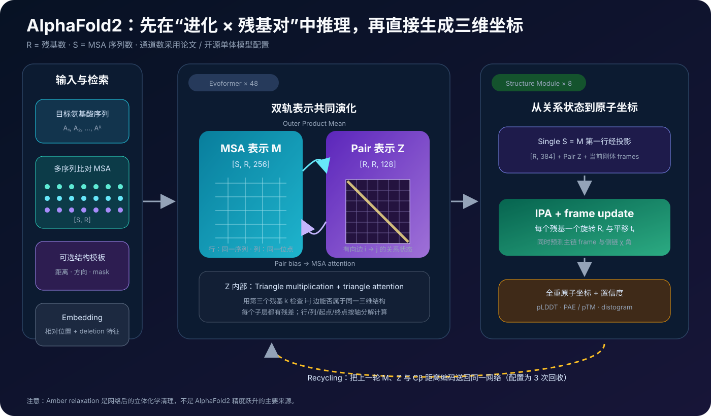
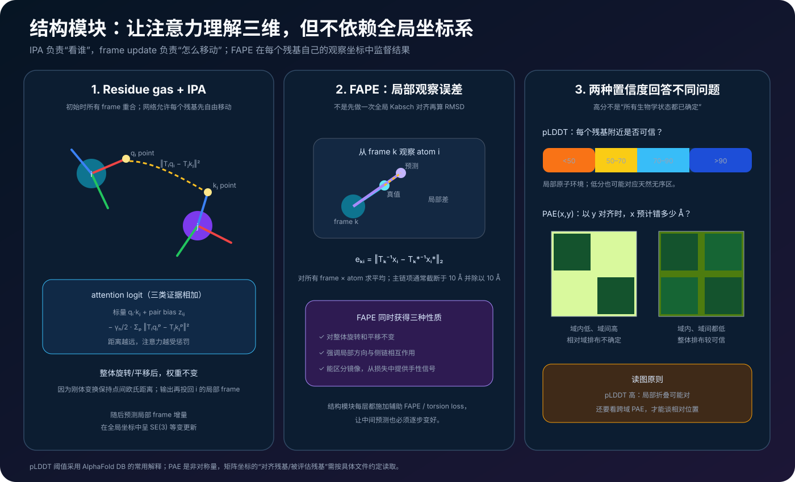
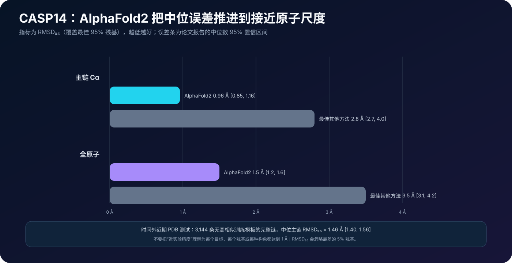

# AlphaFold2 原理详解：把进化约束编译成三维蛋白质结构


> **论文**：[Highly accurate protein structure prediction with AlphaFold](https://www.nature.com/articles/s41586-021-03819-2)<br>
> **作者**：John Jumper、Richard Evans、Alexander Pritzel、Tim Green、Michael Figurnov、Olaf Ronneberger、Kathryn Tunyasuvunakool、Russ Bates、Augustin Žídek、Anna Potapenko、Alex Bridgland、Clemens Meyer、Simon A. A. Kohl、Andrew J. Ballard、Andrew Cowie、Bernardino Romera-Paredes、Stanislav Nikolov、Rishub Jain、Jonas Adler、Trevor Back、Stig Petersen、David Reiman、Ellen Clancy、Michal Zielinski、Martin Steinegger、Michalina Pacholska、Tamas Berghammer、Sebastian Bodenstein、David Silver、Oriol Vinyals、Andrew W. Senior、Koray Kavukcuoglu、Pushmeet Kohli、Demis Hassabis<br>
> **版本**：Nature 596, 583–589；在线发表于 2021-07-15。本文以 Nature 正文、62 页补充材料与官方开源单体模型为准<br>
> **关键词**：Protein Structure Prediction、Multiple Sequence Alignment、Evoformer、Pair Representation、Triangle Update、Invariant Point Attention、FAPE、Recycling、pLDDT、PAE<br>
> **配套代码**：[alphafold2_minimal.py](./code/alphafold2_minimal.py)（零依赖、纯 Python；演示 outer-product mean、三角乘法、带 pair bias 的 MSA attention、IPA 刚体不变性与 FAPE，不是可训练折叠器）<br>
> **一手资料**：[Nature 正文](https://www.nature.com/articles/s41586-021-03819-2) · [补充材料 PDF](https://media.springernature.com/original/springer-static/esm/art%3A10.1038%2Fs41586-021-03819-2/MediaObjects/41586_2021_3819_MOESM1_ESM.pdf) · [官方代码](https://github.com/google-deepmind/alphafold) · [DeepMind 方法概览](https://deepmind.google/blog/enabling-high-accuracy-protein-structure-prediction-at-the-proteome-scale/) · [AlphaFold DB 置信度说明](https://alphafold.ebi.ac.uk/faq)

## 0. 先说结论

AlphaFold2 最容易被压缩成一句神话：

> 输入一条氨基酸序列，Transformer 就把蛋白质折叠出来了。

这句话同时漏掉了它最重要的输入、表示和几何设计。更准确的版本是：

> AlphaFold2 从目标序列出发，先检索同源序列组成多序列比对（MSA），让一个 48 层 Evoformer 在“序列 × 位点”表示与“残基 × 残基”表示之间反复交换信息；再让一个对三维刚体变换具有正确对称性的结构模块，直接生成主链 frame、侧链扭转角和全重原子坐标；最后把预测结构回收进同一网络继续精修，并同时输出可供使用者判断可靠性的置信度。



读完本文，至少应记住下面十二点：

1. **AlphaFold2 预测的是结构，不是折叠动力学。**它不模拟蛋白从展开态沿时间轨迹折叠，也不直接给出自由能景观或折叠速率。
2. **“仅从序列预测”不等于只把一条序列喂给神经网络。**标准管线还从大型序列库检索 MSA，并可使用同源结构模板；这些都由目标序列自动导出，不是实验者提供目标结构。
3. **核心不是一张 contact map。**旧管线常先预测距离再做外部优化；AlphaFold2 的结构模块在训练图中直接输出三维坐标，真正做到了 end-to-end。
4. **Evoformer 同时维护两种状态。**MSA 表示 $M\in\mathbb R^{S\times R\times256}$ 保存进化与序列语境；pair 表示 $Z\in\mathbb R^{R\times R\times128}$ 保存每对残基的有向关系。
5. **两种表示形成闭环。**$Z$ 给 MSA 行注意力加 bias；MSA 又通过 outer-product mean 持续写回 $Z$，不是预先算一次协方差就结束。
6. **三角更新是结构归纳偏置。**要更新 $i\to j$，网络显式汇总所有第三个残基 $k$ 的 $i\to k$ 与 $j\to k$ 等边信息，让 pair 状态学习三维几何的一致性。
7. **结构模块把每个残基暂时看作自由刚体。**先允许主链断开、并行移动，再用损失和最终 Amber relaxation 恢复合理化学几何；这比每一步都解决链闭合更容易优化。
8. **IPA 不是普通 attention 加坐标。**它把每个残基局部坐标系中的 query/key/value 点变换到全局空间，以点间距离参与注意力，再把输出变回局部坐标。
9. **FAPE 不做单次全局对齐。**它从许多残基 frame 分别观察所有原子，惩罚局部坐标误差，因此既对整体旋转平移不变，又重视方向、侧链关系和手性。
10. **Recycling 是同一参数网络的迭代精修。**官方单体配置的 `num_recycle=3` 表示初次前向后再回收 3 次；论文的网络探针因此得到 $4\times48=192$ 个 Evoformer block 位置。
11. **pLDDT 与 PAE 不能互换。**前者回答局部残基环境是否可信，后者回答两个残基或结构域的相对摆放是否可信。
12. **CASP14 的 0.96 Å 有严格口径。**它是 87 个评测 domain 上、最佳 95% 残基覆盖的 Cα RMSD 中位数，不是“所有蛋白、全部原子的平均误差都小于 1 Å”。

一句话记忆：

> AlphaFold2 的突破不是把一个更大的 Transformer 用在蛋白上，而是把进化统计、残基对图推理、SE(3) 几何、局部坐标损失和迭代精修组织成一条可微的端到端系统。

---

## 1. 它解决的到底是哪一个“蛋白质折叠问题”

### 1.1 从序列到结构，不等于从时间零模拟到折叠完成

一条蛋白质序列可以写成：

$$
a_1,a_2,\ldots,a_R,
\qquad a_i\in\{20\text{ 种标准氨基酸}\}.
$$

结构预测任务要给出各原子的三维坐标：

$$
\hat X=f(a_1,\ldots,a_R),
\qquad
\hat X\in\mathbb R^{N_{\text{atom}}\times3}.
$$

这里的 $f$ 学的是“在训练数据与输入语境下，什么结构最可能与这条序列对应”。它没有显式积分牛顿方程，也不产生物理时间单位上的折叠路径。

因此三件事必须分开：

| 问题 | AlphaFold2 是否直接回答 |
|---|---|
| 单体在典型实验条件下的主导静态结构 | 经常能高精度预测 |
| 从展开态如何随时间折叠 | 否 |
| 多构象平衡、配体诱导变化、突变稳定性与自由能 | 原论文没有直接解决 |

论文所说的 protein folding problem 特指其中的 **structure prediction component**。

### 1.2 为什么这是一个难问题

长度为 $R$ 的蛋白有大量主链与侧链自由度。只枚举每个扭转角的少数离散状态，组合数也会指数增长。纯物理路线还面临：

- 溶剂、离子与环境难以精确建模；
- 微小能量误差可改变最低能构象；
- 长时间尺度分子动力学计算昂贵；
- “找到低能结构”与“在有限算力找到正确结构”不是同一件事。

另一条路线利用进化历史：能存活下来的同源蛋白序列不是独立随机字符串，它们共同受结构和功能约束。AlphaFold2 的关键选择是把这些约束交给网络学习，同时把正确的几何对称性写进结构模块。

### 1.3 预测为何能接近实验，却不能取代实验

实验结构本身也带条件：晶体堆积、冷冻电镜样品状态、配体、pH、复合物和分辨率都会影响观测。模型输出则是基于训练分布和输入检索到的最可能结构假设。

高精度预测能显著加速假设生成、构建实验模型和功能分析，但它不会自动告诉我们：

- 细胞内是否采用同一构象；
- 某个低置信区域是无序、柔性，还是缺少复合物伙伴；
- 一个口袋在配体存在时是否打开；
- 一个点突变是否真正改变热力学稳定性；
- 金属、辅因子、翻译后修饰怎样改变结构。

---

## 2. 最少的结构生物学前置知识

### 2.1 残基、主链与侧链

蛋白主链重复出现：

```text
N — Cα — C — N — Cα — C — ...
```

每个残基的 Cα 还连接一个决定氨基酸类型的侧链。主链构象常用 $\phi,\psi,\omega$ 扭转角描述，侧链主要由 $\chi_1,\chi_2,\ldots$ 描述。

AlphaFold2 不把每个原子的三个坐标都当成互不相关的回归量。它先为每个残基预测一个代表 N–Cα–C 主链几何的刚体 frame：

$$
T_i=(R_i,t_i),
\qquad
R_i\in SO(3),\quad t_i\in\mathbb R^3,
$$

再从 frame 与扭转角构造全原子位置。这样，固定的键长、键角和残基几何可以被复用。

### 2.2 MSA 是什么

多序列比对把同源蛋白排列到共同列：

```text
target   M K T A Y L V G ...
homolog1 M R T A F L I G ...
homolog2 M K S A Y V V G ...
homolog3 M - T S F L I G ...
```

- 每一行是一条同源序列；
- 每一列近似对应同一进化位置；
- `-` 是插入/缺失造成的 gap。

若两个位点在三维空间接触，一个位点的突变破坏了相互作用，另一个位点可能发生补偿突变。跨许多同源序列观察到的协变，是空间接近的重要证据。

但“相关”不自动等于“直接接触”。系统发育关系、共同祖先、功能位点和采样偏差都会制造相关。AlphaFold2 不手工固定一种协方差统计，而是让 MSA attention、masked-MSA 目标和 pair 推理共同解释它。

### 2.3 模板是提示，不是答案拷贝

模板来自已解析的同源结构。模型把模板残基对距离、方向、氨基酸类型和 mask 编码到 pair 表示，并通过 attention 聚合多个模板。

模板可以很有帮助，但论文最重要的结果之一是：即使没有相似已知结构，系统仍能经常给出高精度结果。模板也不是硬约束；错误或局部模板可以被网络降权。

---

## 3. 全景：三个空间、两次翻译

AlphaFold2 可以理解成在三个表示空间中工作：

```text
进化空间 M [S,R,256]
        ↕
关系图空间 Z [R,R,128]
        ↓
三维几何空间 {T_i, χ_i, atom coordinates}
```

第一阶段 Evoformer 做第一次翻译：

$$
(\text{MSA},\text{sequence},\text{templates})
\longrightarrow (M,Z).
$$

第二阶段结构模块做第二次翻译：

$$
(M_{1,:,:},Z)
\longrightarrow
\{T_i,\chi_i,\hat x_{i,a}\}.
$$

这里 $M_{1,:,:}$ 是 MSA 第一行、也就是目标序列对应的 single representation：

$$
S=M_{1,:,:}\in\mathbb R^{R\times384}
$$

（经过投影后通道为 384）。

这套分工很重要：Evoformer 不需要在每一层维护完整原子坐标，先把“谁可能靠近谁、方向和关系是什么”推理充分；结构模块再在明确的三维对称性下落地。

---

## 4. 数据管线：神经网络前面还有一台检索机器

### 4.1 从目标序列搜索同源序列

论文使用：

- `jackhmmer` 搜索 UniRef90 与 MGnify；
- `HHblits` 搜索 BFD + Uniclust30；
- `HHsearch` 在 PDB70 中找模板。

BFD 当时包含约 6598 万个蛋白家族，覆盖约 22.04 亿条序列。数据规模说明了一件事：AlphaFold2 的推理成本不只有一次 GPU 前向，CPU 上的数据库搜索和特征准备也是系统的一部分。

### 4.2 深 MSA 不能原样塞进显存

若同源序列数为 $S$、残基数为 $R$，MSA 表示成本为 $O(SR)$；pair 表示则是 $O(R^2)$。真实搜索结果可能非常深，因此管线会：

1. 对 MSA 序列做聚类；
2. 选择 cluster centre 进入主 MSA stack；
3. 把未聚类序列压缩成 cluster profile 与 deletion mean；
4. 另用较窄的 extra-MSA stack 处理更多序列；
5. 训练时做 block deletion、subsampling 和残基 crop。

这不是无关紧要的预处理。哪些序列进入主栈、哪些被汇总，会改变网络在本轮看到的进化证据。

### 4.3 数据时间切分要看两个日期

论文使用了 2019-08-28 下载的 PDB 快照，但训练结构的最大发布日期限制为 2018-04-30；CASP14 预测时模板库则下载于 2020-05。前者用于避免训练标签泄漏，后者模拟当时实际可用模板。

谈“训练截止日期”时把下载日期、结构发布日期和模板检索日期混成一个数字，会误判时间外评测是否干净。

---

## 5. Evoformer：不是把 MSA 展平后做一次 Transformer

一个标准单体模型使用 48 个 Evoformer block。每个 block 内有两条相互通信的栈。

MSA 栈顺序包含：

1. 带 pair bias 的 MSA row-wise gated self-attention；
2. MSA column-wise gated self-attention；
3. MSA transition；
4. outer-product mean，把 MSA 写回 pair。

Pair 栈顺序包含：

1. triangle multiplication outgoing；
2. triangle multiplication incoming；
3. triangle attention starting node；
4. triangle attention ending node；
5. pair transition。


每个子层基本都遵循：

$$
x\leftarrow x+\operatorname{Dropout}(F(\operatorname{LayerNorm}(x))).
$$

这与 Pre-LN Transformer 有亲缘关系，但算子的轴、pair bias、三角收缩与门控都为蛋白结构问题定制。

---

## 6. MSA attention：分别沿“残基轴”和“进化轴”思考

### 6.1 Row attention：一条序列内部哪些位点相关

固定第 $s$ 条序列，对残基位置 $i$ 查询位置 $j$：

$$
\ell^{h}_{sij}
=
\frac{(q^{h}_{si})^\top k^{h}_{sj}}{\sqrt c}
+b^{h}_{ij},
$$

其中 pair bias：

$$
b^{h}_{ij}=\operatorname{Linear}^{h}(\operatorname{LN}(z_{ij})).
$$

于是 attention：

$$
a^{h}_{sij}=\operatorname{softmax}_{j}(\ell^{h}_{sij}).
$$

普通自注意力只问“两个 MSA cell 内容是否匹配”；这里还问“当前 pair 栈认为残基 $i,j$ 是什么关系”。这正是 $Z\to M$ 的通道。

### 6.2 为什么 pair bias 对所有 MSA 行共享

$z_{ij}$ 描述的是目标蛋白残基位点 $i,j$ 的关系，而非某一条同源序列私有的信息。把同一个 bias 加到所有行，相当于用当前结构假设指导每条序列如何重新读取自身位点。

### 6.3 Column attention：同一位点如何跨物种交换证据

固定残基列 $i$，attention 沿序列轴 $s$ 运行。它允许同一进化位置的不同氨基酸、gap 与 deletion 特征互相解释。

Row 和 column attention 是 axial attention：不在 $SR$ 个 cell 上构造完整 $(SR)^2$ attention，而是分轴混合。主要注意力成本约为：

$$
O(SR^2)+O(RS^2),
$$

仍然昂贵，但比 $O(S^2R^2)$ 可行得多。

---

## 7. Outer Product Mean：把进化模式写成残基对特征

对归一化后的 MSA cell 做两个投影：

$$
a_{si}=W_a\operatorname{LN}(m_{si}),
\qquad
b_{sj}=W_b\operatorname{LN}(m_{sj}).
$$

对每对位置 $i,j$，跨序列平均外积：

$$
o_{ij}
=
\frac{1}{S_{ij}}
\sum_s
a_{si}\otimes b_{sj},
$$

再展平并投影到 pair 通道：

$$
z_{ij}\leftarrow z_{ij}+W_o\operatorname{vec}(o_{ij}).
$$

外积不是一个标量相关系数。若投影通道为 $c$，每条序列对 $(i,j)$ 产生 $c\times c$ 的交互模式，能表达“位点 $i$ 的某类特征与位点 $j$ 的另一类特征共同出现”。

更关键的是，这个操作在 **每个 Evoformer block** 中重复。MSA 已被 pair 假设重新解释后，又生成新的 pair 更新：

```text
Z 影响 M 如何读 MSA
    ↓
更新后的 M 重新归纳位点共变
    ↓
Outer Product Mean 写回 Z
    ↓
Z 再做三角一致性推理
```

这比“一开始算好共变矩阵，后面只用 CNN 读图”更接近联合推断。

---

## 8. Pair stack：为什么第三个残基 $k$ 如此重要

### 8.1 Pair 表示是有向边

把每个残基当图节点，$z_{ij}$ 当从 $i$ 指向 $j$ 的边状态。它不是单一距离，也不必满足 $z_{ij}=z_{ji}$；方向、模板局部 frame 和相对位置都可能让两个方向不同。

### 8.2 Outgoing triangle multiplication

省略 LayerNorm、线性层、gate 和通道下标，核心索引收缩是：

$$
\Delta z^{\text{out}}_{ij}
\propto
\sum_k a_{ik}\odot b_{jk}.
$$

它问：$i$ 与 $j$ 指向共同第三点 $k$ 的两条边，能为 $i\to j$ 提供什么证据？

### 8.3 Incoming triangle multiplication

另一方向是：

$$
\Delta z^{\text{in}}_{ij}
\propto
\sum_k a_{ki}\odot b_{kj}.
$$

它问：共同第三点 $k$ 指向 $i,j$ 的两条边怎样约束 $i\to j$？

真实模块给左右投影加 sigmoid gate，再对结果 LayerNorm、线性投影，并用 output gate 控制写回幅度。乘法更新能低成本捕获强二阶交互。

### 8.4 Triangle attention

以 starting-node 版本为例，更新 $z_{ij}$ 时 attention 遍历 $z_{ik}$，但 logit 还加入“缺失边” $z_{jk}$ 的 bias：

$$
a_{ijk}
=
\operatorname{softmax}_{k}
\left(
\frac{q_{ij}^{\top}k_{ik}}{\sqrt c}
+b_{jk}
\right).
$$

也就是说，$z_{ij}$ 是否听取 $z_{ik}$，不能只看两条共享起点的边是否相似，还要看闭合三角形的第三条边 $j\leftrightarrow k$。

### 8.5 “三角不等式”只是直觉，不是硬编码

论文用距离三角不等式解释设计动机，但 $Z$ 是 128 维学习表示，并非一张必须满足：

$$
d_{ij}\le d_{ik}+d_{kj}
$$

的标量距离表。三角模块给网络提供了适合学习几何一致性的通信拓扑；一致性规则仍从数据中学习。

---

## 9. Structure Module：先把蛋白拆成“残基气体”

### 9.1 为什么故意断开肽链

结构模块初始化时，所有残基 frame 都是单位旋转、零平移：

$$
T_i^{(0)}=(I,0).
$$

随后把 $R$ 个残基当作可自由移动的刚体，即论文所说的 **residue gas**。中间结构可能出现断裂和不物理的长线。

这看起来违背化学，却是聪明的优化取舍：

- 若始终保持链连续，移动一个局部会牵动后面整条链；
- 局部修正必须同时解决复杂的 loop closure；
- 自由刚体允许所有区域并行靠近合理位置；
- 最终再用 violation loss 与 Amber relaxation 清理键长、键角和 clash。

### 9.2 八层共享什么输入

结构模块使用：

- single representation $s_i$；
- pair representation $z_{ij}$；
- 当前残基 frame $T_i$。

每层大致执行：

```text
single
  → Invariant Point Attention(pair, frames)
  → transition MLP
  → backbone frame update
  → torsion-angle / side-chain update
```

结构模块有 8 个 block；每一层中间输出都接受辅助结构损失，所以不是前 7 层随便过渡、最后一层才负责结构。

---

## 10. IPA：同时看语义、关系和三维距离



### 10.1 从局部点到全局点

每个 attention head 为残基 $i$ 从 single 表示生成：

- 标量 query/key/value；
- 若干三维 query points；
- 若干三维 key/value points。

点先在残基自己的局部 frame 中生成，例如 $\tilde q_i^p$，再经当前 frame 进入全局坐标：

$$
q_{i,\text{global}}^p=T_i\circ\tilde q_i^p
=R_i\tilde q_i^p+t_i.
$$

### 10.2 IPA logit 的三部分

省略论文中的平衡常数，一个 head 的核心形式是：

$$
\ell_{ij}^{h}
=
\underbrace{\frac{(q_i^h)^\top k_j^h}{\sqrt c}}_{\text{single 标量内容}}
+
\underbrace{b_{ij}^h}_{\text{pair 关系}}
-
\underbrace{\frac{\gamma_h}{2}
\sum_p
\left\|
T_i\tilde q_i^{hp}-T_j\tilde k_j^{hp}
\right\|_2^2}_{\text{三维点距离}}.
$$

$\gamma_h$ 经 softplus 保证为正。点越远，logit 越小，于是 IPA 天然偏向当前结构中的空间邻域，同时还能听取远程 pair 证据。

### 10.3 为什么叫 invariant

对所有 frame 同时施加任意全局刚体变换 $G$：

$$
T_i' = G\circ T_i.
$$

点间距离保持不变：

$$
\|G(T_iq)-G(T_jk)\|_2
=
\|T_iq-T_jk\|_2.
$$

因此 attention 权重不依赖“蛋白在坐标文件中朝哪个方向、放在哪个原点”。这叫全局旋转和平移 **不变性**。

### 10.4 为什么结构更新又是 equivariant

IPA 聚合的全局 value points 会变回查询残基 $i$ 的局部 frame：

$$
\tilde o_i=T_i^{-1}\left(\sum_j a_{ij}T_j\tilde v_j\right).
$$

局部输出预测 frame 增量，再右复合到当前 $T_i$。若输入整体先经过 $G$，输出 frame 也整体跟着经过 $G$。这叫 **等变性**：

$$
f(GX)=Gf(X).
$$

简记：分类/注意力权重不应随全局姿态变化；坐标输出则应该跟着姿态一起变化。

---

## 11. 从 frame 到全原子坐标

### 11.1 Backbone update

每层从 single activation 预测 6 个量：3 个平移分量与一个以四元数形式参数化的旋转增量。论文用固定标量分量为 1 的四元数：

$$
q=(1,b,c,d),
$$

归一化后转为旋转矩阵。增量在当前残基局部 frame 中应用，所以全局行为保持等变。

### 11.2 侧链不是逐原子自由漂移

网络为每个残基预测以二维单位向量表示的扭转角：

$$
(\sin\alpha,\cos\alpha).
$$

这避免角度 $-\pi$ 与 $\pi$ 在数值上看似相距很远。结合预定义刚体树、标准键长和键角，可以从主链 frame 与 $\chi$ 角构造 atom14，再映射到 atom37 表示。

### 11.3 对称原子需要特殊处理

某些侧链原子交换命名后化学结构不变。若真值文件任选了一种命名，直接逐名字监督会惩罚等价预测。训练前会比较两种命名与预测的距离误差，选择更匹配的真值排列。

### 11.4 Amber relaxation 做什么、不做什么

最终用 Amber99SB 力场做带谐波约束的能量最小化，主要消除：

- 键长和键角异常；
- 原子 clash；
- 残余立体化学违规。

论文明确报告：relaxation 不提升 GDT 或 lDDT-Cα 意义上的预测准确度。它是几何清理，不是把粗糙神经网络输出“物理模拟成正确答案”的秘密步骤。

---

## 12. FAPE：为什么 RMSD 不够做主损失

### 12.1 单次全局对齐的问题

RMSD 通常先寻找一个全局刚体变换，把预测与真值尽量对齐，再平均原子误差。若一个双结构域蛋白的两个域内部都对、相对角度错，单个全局对齐会在两域之间折中，难以告诉模型局部哪里对、跨域哪里错。

### 12.2 从每个 frame 分别观察所有点

设预测 frame 与点为 $T_k,x_i$，真值为 $T_k^*,x_i^*$。FAPE 的一个元素是：

$$
e_{ki}
=
\left\|
T_k^{-1}x_i-(T_k^*)^{-1}x_i^*
\right\|_2.
$$

主链 FAPE 对所有 frame–point 对求平均，并做截断与尺度归一化：

$$
\mathcal L_{\text{FAPE}}
=
\frac{1}{N_{\text{frame}}N_{\text{point}}}
\sum_{k,i}
\frac{\min(d_{\text{clamp}},e_{ki})}{d_{\text{scale}}},
$$

典型 $d_{\text{clamp}}=d_{\text{scale}}=10$ Å。

### 12.3 它为什么对全局刚体变换不变

若预测的所有 frame 和点同时经过 $G$：

$$
(GT_k)^{-1}(Gx_i)=T_k^{-1}x_i.
$$

所以任意平移或旋转整个预测，FAPE 不变。损失不会浪费容量学习 PDB 坐标系的任意姿态。

### 12.4 FAPE 不是距离矩阵损失

只比较原子间距离会对镜像结构给出相同结果；蛋白却有固定手性。FAPE 使用有方向的局部 frame，能区分反射镜像。论文把它称为模型获得手性信号的主要来源。

### 12.5 为什么要 clamp

当结构还很差时，少数相距几十或几百 Å 的点会产生巨大梯度，淹没局部可修正信号。截断使网络先学会局部与中尺度几何。训练中还会以一定概率使用不截断 FAPE，保留全局排布压力。

---

## 13. 多任务损失：结构之外还监督什么

AlphaFold2 的目标不是单一 FAPE。可概括为：

$$
\mathcal L
=
\mathcal L_{\text{structure}}
+\lambda_{\text{dist}}\mathcal L_{\text{distogram}}
+\lambda_{\text{MSA}}\mathcal L_{\text{masked-MSA}}
+\lambda_{\text{conf}}\mathcal L_{\text{pLDDT}}
+\lambda_{\text{exp}}\mathcal L_{\text{resolved}}
+\lambda_{\text{viol}}\mathcal L_{\text{violation}}.
$$

### 13.1 Structure / side-chain losses

包含主链与侧链 FAPE、扭转角误差和角度向量范数正则。结构模块各层都有辅助 loss，最终层承担全原子监督。

### 13.2 Distogram loss

最终 pair 表示预测残基对距离分箱并做交叉熵。它不是最终建模路径，却给 $Z$ 一个清晰的几何辅助目标。

### 13.3 Masked-MSA loss

训练随机替换约 15% MSA token，要求从最终 MSA 表示恢复原氨基酸：

$$
\mathcal L_{\text{masked-MSA}}
=
-\sum_{(s,i)\in\mathcal M}\log p(a_{si}\mid M_{\text{corrupt}}).
$$

它与结构损失联合训练，不是先做独立蛋白语言模型预训练再微调。作用是迫使 Evoformer 理解进化和协变模式。

### 13.4 Experimentally resolved head

有些原子在实验结构中没有解析出来。一个 head 预测每个原子是否 resolved，帮助模型区分“真值缺失”和“结构不存在”。

### 13.5 Violation loss

惩罚异常键长、键角和非键合原子 clash。它只在 fine-tuning 阶段开启；补充材料指出过早加入会让训练非常不稳定。

---

## 14. Recycling：把一次前向变成固定点迭代

一次结构输出不是终点。第 $t$ 轮会把：

- 上一轮目标序列 MSA 表示 $M^{t-1}_{1,:,:}$；
- 上一轮 pair 表示 $Z^{t-1}$；
- 上一轮结构的 Cβ–Cβ 距离分箱；

经归一化/编码后加回新一轮输入：

$$
(M^t,Z^t,X^t)
=
F_\theta(
M^0,Z^0;
M^{t-1},Z^{t-1},D(X^{t-1})
).
$$

所有轮次共享同一组参数 $\theta$。它很像学习到的固定点迭代：

```text
当前结构假设
  → 重新解释 MSA 与 pair
  → 产生更一致的结构
  → 再作为下一轮条件
```

### 14.1 `num_recycle=3` 为什么对应四轮

开源配置把 recycling 计作“额外回收次数”：先有一次初始前向，再回收 3 次，共运行 4 次 Evoformer stack。

论文用每个 block 后训练的探针查看中间结构，因此：

$$
4\text{ 轮}\times48\text{ blocks}=192
$$

个观察点。某些蛋白在前几层就出现正确 fold；困难目标 T1064 则几乎用完整个深度才稳定。

### 14.2 为什么训练代价没有简单乘四

训练随机采样 recycle 次数，并主要对最后一次迭代反向传播；早期轮次可停止梯度。这样模型学会利用回收输入，而显存和反向图不会线性爆炸。

---

## 15. 训练：有限实验结构怎样撑起大模型

### 15.1 监督数据与采样

训练结构来自 PDB，并按 40% 序列一致性聚类。采样概率与 cluster size 近似成反比，避免少数巨大同源家族主导训练。

主训练阶段：

- 随机 crop 到 256 residues；
- global batch 128；
- 每个 TPU v3 core 一个样本，共 128 cores；
- 约看 1000 万个样本，约训练一周。

Fine-tuning：

- crop 增到 384 residues；
- 增大 MSA stack；
- 降低学习率；
- 加入结构 violation loss；
- 约再训练 4 天。

这些数字描述论文系统，不是“复现只要 11 天”。MSA 数据库、特征预计算、实验筛选、调参与失败运行都不在单次最终训练时长中。

### 15.2 Self-distillation

作者先训练一个只用 PDB 标签的教师模型，再对 Uniclust30 中 355,993 条序列用完整 MSA 预测结构，并按自估计置信度筛选伪标签。

最终模型从头训练，样本混合为：

$$
75\%\ \text{蒸馏序列}
+
25\%\ \text{PDB 结构}.
$$

学生看到的是经过 MSA subsampling、crop 等扰动的输入，因此不能简单背教师输出。它必须用更少或不同证据重建高置信结构。

这条路线把海量“只有序列、没有实验结构”的数据变成结构监督，但伪标签仍来自模型自己；错误与盲点也可能被继承。

### 15.3 五个模型不是五层 ensemble

论文训练五个不同随机种子、部分使用模板、部分不使用模板的模型。推理产生多组候选后，用预测置信度排序选出最佳模型。CASP14 还使用 MSA cluster resampling 形成 ensemble；论文发表时发现关闭 ensemble 准确率接近，却可快约 8 倍。

---

## 16. 实验结果：突破在哪里



### 16.1 CASP14 是盲测，不是训练集排行榜

CASP 每两年组织一次。参赛者预测已经由实验测出、但尚未公开的结构，评测结束后才揭晓真值。AlphaFold2 在 2020 年以 `AlphaFold2` 队名参加 CASP14。

在 87 个 domain 上：

| 指标（越低越好） | AlphaFold2 | 最佳其他方法 |
|---|---:|---:|
| 主链 Cα RMSD₉₅ 中位数 | 0.96 Å | 2.8 Å |
| 全原子 RMSD₉₅ 中位数 | 1.5 Å | 3.5 Å |

主链 0.96 Å 的 95% 置信区间为 0.85–1.16 Å；论文用碳原子约 1.4 Å 的宽度帮助建立尺度直觉。

### 16.2 RMSD₉₅ 的下标不能省

RMSD 对少量离群残基非常敏感。RMSD₉₅ 先选择能最佳叠合的 95% 残基，再计算误差；最差 5% 不进入数值。

它适合比较主体结构，却不等于：

- 每个残基都在 0.96 Å 内；
- 全部原子误差为 0.96 Å；
- 柔性尾部和跨域排布都正确；
- 87 个 domain 之外没有失败案例。

### 16.3 时间外近期 PDB 测试

论文还评估了训练截止后公开的结构。对 3,144 条经过过滤、没有高相似训练模板的完整蛋白链，主链 RMSD₉₅ 中位数为 1.46 Å（95% CI 1.40–1.56 Å）。

完整链指标比 domain 更敏感于结构域相对摆放，因此这个结果既说明泛化很强，也解释了它为何比 CASP domain 的 0.96 Å 更高。

### 16.4 长蛋白与侧链

论文展示了 2,180 残基 T1044 的正确 domain packing；当主链准确时，侧链 rotamer 准确率也显著提高。T1056 的锌结合位点侧链被准确放置，尽管模型没有显式预测锌离子。

这不是说离子不重要，而是说明局部蛋白几何可从序列和结构语境中被强约束。

---

## 17. 置信度：怎样知道模型哪里可能错

### 17.1 pLDDT 是逐残基局部置信度

lDDT 不需要一次全局对齐，而是比较局部原子对距离是否落在多个阈值内。模型把每个残基的 lDDT-Cα 分成 50 个 bin 预测概率，再取期望得到 pLDDT：

$$
\operatorname{pLDDT}_i
=100\sum_b p_{ib}c_b.
$$

AlphaFold DB 常用解释是：

| pLDDT | 常见解释 |
|---:|---|
| >90 | 很高局部置信度 |
| 70–90 | 通常可相信主链 |
| 50–70 | 低置信度，应谨慎 |
| <50 | 很低；可能是天然无序或缺少结构语境 |

论文在 10,795 条链上报告真实 lDDT-Cα 与 pLDDT 的 Pearson $r=0.76$，线性拟合接近：

$$
\text{lDDT-Cα}\approx0.997\times\text{pLDDT}-1.17.
$$

### 17.2 pLDDT 高不代表 domain packing 对

两个结构域各自都折叠正确，但铰链角度可能不确定。每个域内部 pLDDT 都可很高，仍无法回答相对摆放。

### 17.3 PAE 回答相对位置问题

Predicted Aligned Error 定义为：若用真值与预测的残基 $y$ 所在局部 frame 对齐，残基 $x$ 的位置预计误差多少 Å。

$$
\operatorname{PAE}(x,y)
\neq
\operatorname{PAE}(y,x)
$$

一般并不对称。看跨结构域 block：

- 域内 PAE 低、域间 PAE 高：各域可能对，但相对位置不可靠；
- 域内和域间都低：模型也确信全局装配；
- 大片高 PAE：不要把坐标当成刚性整体解释。

### 17.4 pTM 是 PAE 分布的全局汇总

模型从 pair 表示预测对齐误差分布，再估计 TM-score，得到 pTM。论文在 10,795 条链上报告 pTM 与真实 full-chain TM-score 的 Pearson $r=0.85$。

pTM 方便排序整条链，但一维分数会丢掉“到底哪两个域不确定”。需要解释结构时，PAE heatmap 比单个 pTM 更有信息。

---

## 18. 零依赖代码：把五个数学核心跑通

配套文件 [alphafold2_minimal.py](./code/alphafold2_minimal.py) 不依赖 NumPy、PyTorch、数据库或网络。它实现：

- `outer_product_mean`：`[S,R,C] → [R,R,C²]` 的原始外积平均；
- `msa_row_attention_with_pair_bias`：pair 关系怎样改变 MSA 行注意力；
- `triangle_multiplication_outgoing/incoming`：两种三角索引收缩；
- `ipa_attention_weights`：标量、pair bias 与全局点距离共同生成注意力；
- `fape`：从每个局部 frame 比较预测点与真值点。

### 18.1 Outer-product mean

```python
for i in range(residues):
    for j in range(residues):
        for sequence in range(sequences):
            left = msa[sequence][i]
            right = msa[sequence][j]
            for a in range(channels):
                for b in range(channels):
                    pair[i][j][a * channels + b] += left[a] * right[b]
```

真实模型在外积前使用两个独立 learned projection，并在展平后投影到 128 维；教学代码用恒等投影，保留最关键的 $s,i,j$ 索引。

### 18.2 三角乘法

```python
def triangle_multiplication_outgoing(pair):
    residues = len(pair)
    return [
        [sum(pair[i][k] * pair[j][k] for k in range(residues))
         for j in range(residues)]
        for i in range(residues)
    ]
```

这正对应 `ikc,jkc->ijc` 的标量通道版本。Incoming 则对应 `kic,kjc->ijc`。

### 18.3 IPA 的刚体不变性测试

```python
global_motion = Frame(rotation_z(71.0), [10.0, -4.0, 2.5])
moved_frames = [frame.left_compose(global_motion) for frame in frames]

before = ipa_attention_weights(..., frames, ...)
after = ipa_attention_weights(..., moved_frames, ...)

assert max_abs_difference(before, after) < 1e-12
```

整体旋转 71° 并平移后，浮点误差范围内 attention 权重不变。这比只在文字里说 “SE(3)-aware” 更容易形成直觉。

### 18.4 运行

```bash
python3 papers/to-2026/code/alphafold2_minimal.py
python3 papers/to-2026/code/alphafold2_minimal.py --test
```

示例输出：

```text
MSA shape:                 [3 sequences, 3 residues, 2 channels]
outer-product mean shape:  [3, 3, 4]
triangle outgoing z[0,2]: 0.4547
triangle incoming z[0,2]: 0.4547
IPA weights from residue 0: 0.671 0.320 0.009
max IPA change after global rigid motion: 1.110e-16
FAPE for a small coordinate error: 0.0447
```

测试还检查：

- outer-product mean 的手算结果；
- outgoing/incoming 使用不同索引方向；
- pair bias 能改变 row attention；
- softmax 行和为 1；
- IPA 对共同刚体运动不变；
- 完全一致结构的 FAPE 为 0。

代码折叠了 learned projections、multi-head、gate、残差、模板、全原子刚体树与反向传播，因此是机制显微镜，不是 93M 参数模型的微缩复现。

---

## 19. 计算复杂度：为什么长蛋白特别贵

设 MSA 主栈深度为 $S$、残基数为 $R$。

| 组件 | 主要规模 |
|---|---:|
| MSA 表示存储 | $O(SR)$ |
| Pair 表示存储 | $O(R^2)$ |
| MSA row attention | $O(SR^2)$ |
| MSA column attention | $O(RS^2)$ |
| Triangle multiplication / attention | 朴素核心约 $O(R^3)$ |
| IPA | 约 $O(R^2)$ |

实际实现通过 axial 分解、chunking、subbatch、低精度、重计算和 MSA 聚类控制常数，但 $R$ 的二次/三次项无法凭工程完全消失。

论文开源实现的单模型 V100 代表时间（含 ensemble 时）为：

- 256 residues：4.8 分钟；
- 384 residues：9.2 分钟；
- 2,500 residues：18 小时。

关闭 ensemble 后约为 0.6 分钟、1.1 分钟和 2.1 小时。16 GB V100 不做 ensemble 时大约能处理 1,300 residues；2,500 residues 需借助 unified memory。数据库搜索和 Amber relaxation 另算 CPU 时间。

这说明“推理几分钟”只适用于中小蛋白与特定硬件/配置，不能无条件外推。

---

## 20. 网络到底学到了什么

### 20.1 结构假设很早出现，然后持续精修

作者冻结主网络，在每个 Evoformer block 后各训练一个结构探针。许多目标前几层就形成大致正确 fold，后续层平滑提升；困难的 SARS-CoV-2 ORF8 目标则多次重排二级结构，接近最后才收敛。

这说明 Evoformer 的中间状态不只是抽象 embedding；它越来越接近一个可被结构模块解码的具体三维假设。

### 20.2 深度 MSA 主要帮助找到正确盆地

论文观察到 MSA 有明显阈值：有效深度低于约 30 时精度显著下降，超过约 100 后继续加深收益变小。

作者的解释是：进化信息尤其帮助早期找到粗略正确结构；一旦进入正确结构盆地，后续几何精修对 MSA 深度没那么敏感。

这也解释了为什么删除 BFD 或 MGnify 对多数目标影响小，却会让少数序列数据库覆盖不足的目标骤降 20+ GDT。

### 20.3 没有单一“秘密模块”

消融显示 self-distillation、recycling、模板、MSA、三角更新、IPA 与辅助损失都贡献精度。只用 triangle attention 或只用 triangle multiplication 仍能得到较高精度，但两者结合更好。

AlphaFold2 更像一组彼此咬合的偏置：

```text
进化证据给出候选关系
→ 三角图推理检查关系一致性
→ 几何模块把关系落成坐标
→ 局部 frame 损失检查方向与手性
→ recycling 把坐标反过来修正关系
```

---

## 21. 八个常见误解

### 误解一：AlphaFold2 模拟了蛋白折叠过程

没有。中间结构轨迹是网络计算轨迹，不对应真实时间、能量或生物折叠中间态。

### 误解二：输入只有一条 FASTA，所以没有外部知识

用户接口可以只提交 FASTA，但标准数据管线会搜索海量序列库与模板库。数据库是推理系统的一部分。

### 误解三：Evoformer 就是用于 MSA 的二维 Transformer

它确实使用 axial attention，但定义性创新还包括 MSA↔pair 闭环、outer-product mean、三角乘法与三角 attention。

### 误解四：Pair 表示就是距离矩阵

$Z$ 是有向的 128 维潜变量。Distogram 只是从它读出的一个辅助 head；方向、模板和结构语境不能被一个标量距离完整表达。

### 误解五：三角更新硬编码了三角不等式

没有。它硬编码的是“更新一条边时通过第三点查看另两条边”的通信模式；具体几何规则由网络学习。

### 误解六：pLDDT 高就说明整个复合物/多域排布正确

pLDDT 是局部指标。域间与链间相对位置要看 PAE、pTM 或专门的界面指标。

### 误解七：Amber relaxation 负责把预测变准

论文报告 relaxation 基本不提高 GDT/lDDT，它主要消除立体化学违规。

### 误解八：0.96 Å 表示所有预测原子平均误差不到 1 Å

它是 CASP14 domain、Cα、最佳 95% 覆盖、跨目标中位数。全原子对应数字是 1.5 Å，而且仍是 RMSD₉₅ 中位数。

---

## 22. 局限：论文没有解决什么

### 22.1 浅 MSA 与孤儿蛋白

有效 MSA 深度低于约 30 时准确率明显下降。单序列模型后来快速发展，但不属于这篇 2021 AlphaFold2 论文的结论。

### 22.2 异源复合物与环境依赖结构

原论文模型以单链为中心，对形状主要由异源链接触决定的 bridging domain 更弱。AlphaFold-Multimer 是后续系统，不应倒灌成原论文已经解决的能力。

### 22.3 构象集合与动态

蛋白可能有 open/closed、active/inactive 等多态，柔性区也不存在唯一刚性结构。单个最高置信预测无法描述完整构象分布和动力学。

### 22.4 配体、离子与共价修饰

原论文不显式预测小分子、金属、核酸、翻译后修饰和实验环境。即便口袋侧链看似准确，也不能据此断言配体结合模式或亲和力。

### 22.5 突变效应

给突变序列重新跑模型，输出结构变化小，不等于突变无害。模型倾向输出典型折叠，pLDDT 也不是 $\Delta\Delta G$；稳定性、表达、动力学和功能可在主链几乎不变时显著变化。

### 22.6 置信度不是校准过的科学结论概率

pLDDT/PAE 预测的是与训练指标有关的结构误差，不是“这个生物机制为真的概率”。分布外蛋白、错误 oligomeric state 或缺失配体可能让模型自信地给出错误解释。

### 22.7 训练数据继承实验数据库偏差

PDB 更偏向易表达、易纯化、能结晶或能被冷冻电镜解析的体系；结构家族和模式生物覆盖也不均匀。Self-distillation 扩大序列覆盖，却不能创造实验标签中没有的状态多样性。

---

## 23. 为什么 AlphaFold2 是科学机器学习的转折点

### 23.1 它把“预测约束 + 外部优化”改成端到端坐标学习

AlphaFold1 时代的典型思路是：网络预测距离分布，再用单独势能和优化程序组装结构。AlphaFold2 把表示推理与坐标生成放进同一可微图，FAPE 直接把最终几何错误传回 Evoformer。

### 23.2 它展示了领域知识怎样进入架构

这里的领域知识不是手工写一套完整能量函数，而是选择正确的表示和对称性：

- MSA 行/列对应进化结构；
- pair 表示对应残基图边；
- 三角更新对应三点几何一致性；
- frame 对应残基局部方向；
- IPA/FAPE 尊重 SE(3) 对称性；
- violation 与 rigid-group construction 注入化学常识。

这种“弱硬编码、强结构偏置”的方式影响了后来的几何深度学习、蛋白设计和分子建模。

### 23.3 它让置信度成为模型产品的一部分

结构预测不只给坐标，还给 pLDDT、PAE/pTM，允许研究者决定：

- 哪些局部可以用于机制假设；
- 哪些 loop 应忽略；
- 哪些 domain 可拆开使用；
- 哪些全局排布必须继续实验验证。

高影响科学模型必须同时输出答案和“哪里可能不可信”的接口，这是 AlphaFold2 留下的另一条重要工程原则。

---

## 24. 用六个思考题检验理解

### 24.1 若把所有预测坐标整体旋转 90°，IPA 与 FAPE 会怎样

若所有 frame 和点一起旋转，IPA 权重不变、FAPE 不变；输出坐标整体跟着旋转。这正是不变注意力与等变坐标输出的区别。

### 24.2 为什么只有 MSA row attention 不够

它能建模一条同源序列内部位点关系，却不能直接让同一位点跨不同序列比较替换模式；column attention 补上进化轴的信息交换。

### 24.3 若只在网络开头做一次 outer-product mean 会怎样

MSA 可以给 pair 初始共变证据，但 pair 的结构假设无法反过来指导 MSA 重读同源序列，也无法在每层用更新后的 MSA 修正 pair，联合推断闭环被切断。

### 24.4 为什么 FAPE 截断可能帮助训练，却也不能永远只截断

早期巨大错误不再支配梯度，模型能先修局部；但若所有远距离误差都饱和，跨域整体排布压力不足，所以训练还混入 unclamped FAPE。

### 24.5 两个域 pLDDT 都是 95，是否能直接分析域间界面

不能。95 只说明各自局部环境高置信；若跨域 PAE 高，两域相对位置可能任意，界面解释不可靠。

### 24.6 为什么 residue gas 中间断链不等于最终结构不尊重化学

断链是优化期间的自由度；FAPE、扭转角、violation loss、刚体原子构造与最终 Amber relaxation共同把输出拉回合理化学结构。中间计算轨迹不是物理轨迹。

---

## 25. 总结

AlphaFold2 的完整逻辑链可以写成：

```text
实验结构稀缺，序列数量巨大
    ↓
MSA 中保存了自然选择留下的结构约束
    ↓
Evoformer 让 MSA 表示与残基对表示反复通信
    ↓
Outer Product Mean 把进化模式写入 pair
    ↓
三角更新让每条边通过第三个残基检查几何一致性
    ↓
Structure Module 把 single + pair 变成每残基刚体
    ↓
IPA 在局部 frame 与全局三维距离之间安全通信
    ↓
FAPE 从每个局部观察者监督方向、位置和手性
    ↓
Recycling 把坐标假设送回网络继续修正
    ↓
pLDDT / PAE 告诉使用者局部与全局哪里可信
```

五组公式抓住它的骨架。

MSA 写回 pair：

$$
o_{ij}=\frac1S\sum_s a_{si}\otimes b_{sj}.
$$

三角乘法：

$$
\Delta z^{\text{out}}_{ij}\propto\sum_k a_{ik}\odot b_{jk},
\qquad
\Delta z^{\text{in}}_{ij}\propto\sum_k a_{ki}\odot b_{kj}.
$$

IPA 几何 logit：

$$
\ell_{ij}
=\text{scalar}_{ij}+\text{pair}_{ij}
-\gamma\sum_p\|T_iq_i^p-T_jk_j^p\|^2.
$$

Frame-aligned point error：

$$
\operatorname{FAPE}
\propto
\sum_{k,i}
\min\left(d_{\max},
\|T_k^{-1}x_i-(T_k^*)^{-1}x_i^*\|
\right).
$$

Recycling：

$$
(M^t,Z^t,X^t)=F_\theta(M^0,Z^0;M^{t-1},Z^{t-1},D(X^{t-1})).
$$

但真正值得带走的不是某个 einsum 字符串，而是一种建模方法：

> 当问题同时包含海量弱证据、组合关系与严格几何对称性时，不必在“纯数据驱动”和“完整手写物理”之间二选一。可以让网络学习难以手工表达的统计规律，同时用表示、通信拓扑、坐标系和损失把不可违背的结构写进计算图。

---

## 参考资料与延伸阅读

1. Jumper et al., [Highly accurate protein structure prediction with AlphaFold](https://www.nature.com/articles/s41586-021-03819-2), Nature 596, 2021.
2. Jumper et al., [Supplementary Information](https://media.springernature.com/original/springer-static/esm/art%3A10.1038%2Fs41586-021-03819-2/MediaObjects/41586_2021_3819_MOESM1_ESM.pdf), 62 pages, 2021.
3. Google DeepMind, [AlphaFold official implementation](https://github.com/google-deepmind/alphafold).
4. Google DeepMind, [AlphaFold science timeline and overview](https://deepmind.google/science/alphafold/).
5. Tunyasuvunakool et al., [Highly accurate protein structure prediction for the human proteome](https://www.nature.com/articles/s41586-021-03828-1), Nature 596, 2021.
6. AlphaFold Protein Structure Database, [FAQ: pLDDT and PAE](https://alphafold.ebi.ac.uk/faq).
7. Senior et al., [Improved protein structure prediction using potentials from deep learning](https://www.nature.com/articles/s41586-019-1923-7), Nature 577, 2020.
8. Evans et al., [Protein complex prediction with AlphaFold-Multimer](https://www.biorxiv.org/content/10.1101/2021.10.04.463034v2), 2021/2022.
9. Ahdritz et al., [OpenFold: Retraining AlphaFold2 yields new insights into its learning mechanisms and capacity for generalization](https://www.nature.com/articles/s41592-024-02272-z), Nature Methods, 2024.
10. Varadi et al., [AlphaFold Protein Structure Database: massively expanding the structural coverage of protein-sequence space with high-accuracy models](https://academic.oup.com/nar/article/50/D1/D439/6430488), Nucleic Acids Research, 2022.

建议阅读顺序：

```text
蛋白质主链 / 侧链与 MSA 基础
  → AlphaFold1（距离分布 + 外部结构优化）
  → AlphaFold2 正文（问题、结果、核心直觉）
  → 补充材料 Algorithms 2–32（精确张量操作）
  → 官方 JAX 实现（工程与配置）
  → AlphaFold-Multimer（复合物）
  → OpenFold（可训练复现与机制研究）
```
