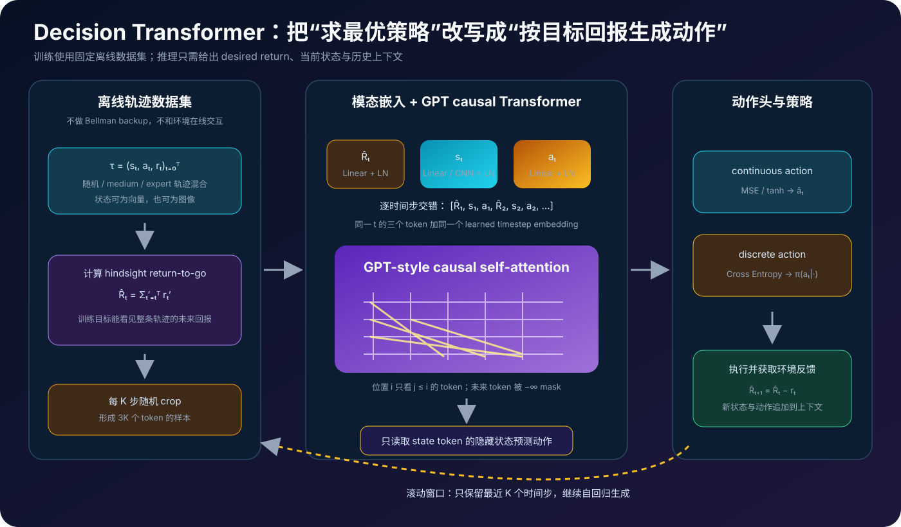
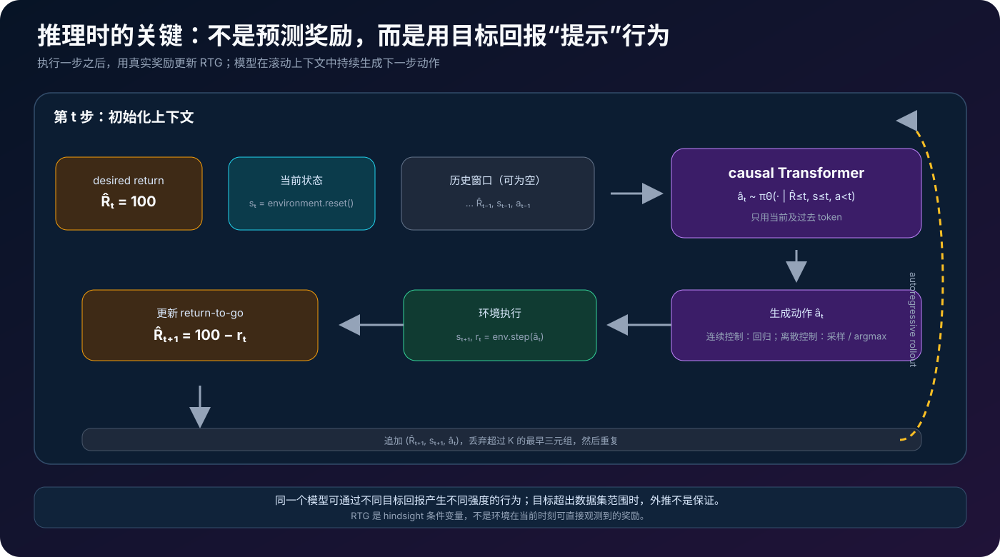
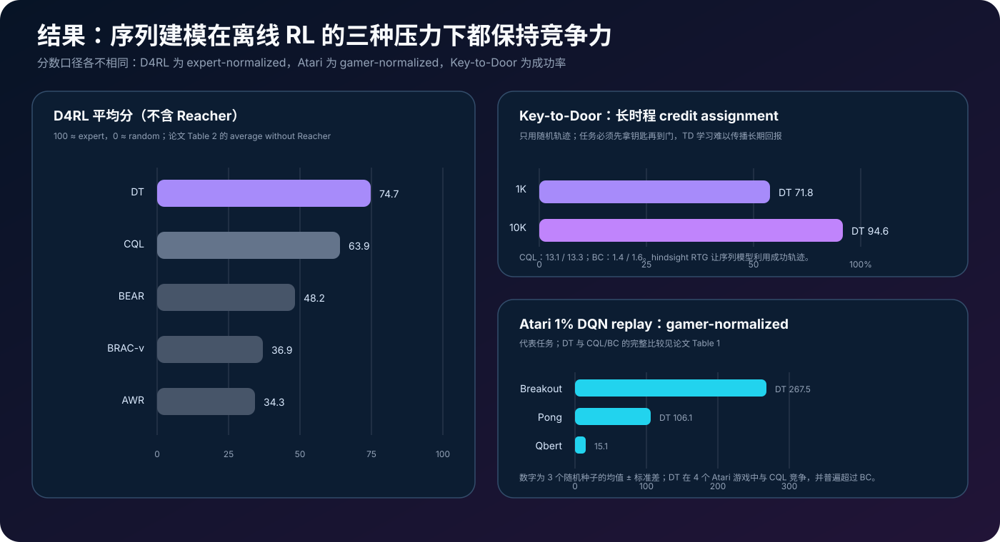

# Decision Transformer 原理详解：把离线强化学习改写成回报条件序列生成


> **论文**：[Decision Transformer: Reinforcement Learning via Sequence Modeling](https://arxiv.org/abs/2106.01345)<br>
> **作者**：Lili Chen、Kevin Lu、Aravind Rajeswaran、Kimin Lee、Aditya Grover、Michael Laskin、Pieter Abbeel、Aravind Srinivas、Igor Mordatch<br>
> **版本**：arXiv v1 发布于 2021-06-02，v2 发布于 2021-06-24；发表于 NeurIPS 2021。本文以 NeurIPS 版本与作者官方代码为准<br>
> **关键词**：Offline RL、Return-to-go、Trajectory Modeling、Causal Transformer、GPT、Behavior Cloning、Credit Assignment、Conditional Generation<br>
> **配套代码**：[decision_transformer_minimal.py](./code/decision_transformer_minimal.py)（零依赖、纯 Python；实现 RTG、三元组 token、causal attention、动作损失与滚动推理）<br>
> **一手资料**：[arXiv](https://arxiv.org/abs/2106.01345) · [NeurIPS PDF](https://proceedings.neurips.cc/paper_files/paper/2021/file/7f489f642a0ddb10272b5c31057f0663-Paper.pdf) · [官方代码](https://github.com/kzl/decision-transformer) · [作者项目页](https://sites.google.com/berkeley.edu/decision-transformer)

## 0. 先说结论

Decision Transformer（DT）最反直觉的地方，是它没有把离线强化学习写成 $Q$ 学习或 policy gradient，而是写成一个监督式序列预测问题：

> 给定“我希望这条轨迹最终拿到多少回报”、最近的状态和动作历史，让一个 GPT 风格的 causal Transformer 预测下一步动作。

它使用的训练序列不是：

```text
(state, action, reward), (state, action, reward), ...
```

而是：

$$
\tau=
(\hat R_1,s_1,a_1,
\hat R_2,s_2,a_2,
\ldots,
\hat R_T,s_T,a_T),
$$

其中：

$$
\hat R_t=\sum_{t'=t}^{T}r_{t'}
$$

称为 **return-to-go（RTG，剩余回报）**。



读完本文，至少应记住下面十二点：

1. **DT 主要解决的是 offline RL。**训练阶段只读取固定数据集，不能通过在线试错补充样本。
2. **它不是把 reward token 原样预测出来。**模型使用从当前时刻向未来累加的 RTG，因为推理时可以先指定希望达到的回报。
3. **一个时间步对应三个 token。**长度为 $K$ 的上下文不是 $K$ 个 token，而是 $3K$ 个交错 token。
4. **动作在 state token 位置预测。**对连续控制使用 MSE，对离散动作使用交叉熵；论文没有发现必须同时预测 state 或 RTG。
5. **GPT 的 causal mask 是策略因果性。**预测 $a_t$ 时可以看 $\hat R_t,s_t$ 和过去 token，不能看未来 state、future action 或真实 future reward。
6. **RTG 是 hindsight 条件变量。**训练时它由完整轨迹回看计算；部署时则由初始目标回报和每一步实际奖励递减维护。
7. **这不是普通 behavior cloning。**BC 在所有数据上拟合 $p(a_t\mid s_t)$；DT 拟合 $p(a_t\mid \hat R_t,s_{\le t},a_{<t})$，同一模型可按目标回报改变行为强度。
8. **Transformer 的长上下文承担 credit assignment。**关键事件可能在很久之前，模型能把它与未来回报关联，而不是只靠一步 TD backup 传播。
9. **DT 不显式学习 Bellman 一致性。**没有 $y=r+\gamma\max Q(s',a')$ 这样的 bootstrapping 目标，也没有显式 actor–critic 交替。
10. **效果并不来自一个神奇规模。**论文使用相对朴素的 GPT 架构，真正的范式变化是把策略优化接口改成条件生成接口。
11. **在 Key-to-Door 的随机轨迹上，hindsight RTG 尤其有用。**1K 条随机轨迹成功率 71.8%，10K 条达到 94.6%，而 CQL 只有 13.1% / 13.3%。
12. **“给更高目标就一定得到更高回报”不是保证。**目标超出数据覆盖时是分布外条件生成，模型可能外推，也可能崩溃。

一句话记忆：

> Decision Transformer 用 return-to-go 把“想要的未来”变成 prompt，用 causal Transformer 把离线轨迹变成动作生成器，以序列建模替代 TD bootstrapping。

---

## 1. 2021 年的矛盾：offline RL 为什么难

### 1.1 MDP 的标准写法

强化学习环境是一个 MDP：

$$
\mathcal M=(\mathcal S,\mathcal A,P,r,\gamma).
$$

在时刻 $t$，智能体观察状态 $s_t$，执行动作 $a_t$，环境根据 $P$ 转移到 $s_{t+1}$ 并给出奖励 $r_t$。目标是最大化：

$$
J(\pi)=
\mathbb E_{\tau\sim\pi}
\left[
\sum_{t=0}^{T-1}\gamma^t r_t
\right].
$$

经典 model-free RL 会估计价值函数、优势函数或策略梯度。例如 Q-learning 的 TD target：

$$
y_t=r_t+\gamma\max_{a'}Q_{\bar\theta}(s_{t+1},a').
$$

### 1.2 Offline RL 去掉了什么

在线 RL 可以让策略执行动作、获得新状态、收集新奖励；offline RL 只有固定数据集：

$$
\mathcal D=\{\tau^{(i)}\}_{i=1}^{N},
\qquad
\tau^{(i)}=(s_0,a_0,r_0,\ldots,s_T).
$$

数据可能来自随机策略、medium 策略、expert 策略及其 replay buffer 的混合。

没有在线交互会带来三个困难：

**分布外动作（OOD action）**：Q 函数在数据没覆盖的动作上可能产生虚高估计，策略却会选择这些动作。

**bootstrapping 误差**：错误的 $Q(s',a')$ 进入下一步 target，会沿时间递归放大。

**有限数据与长时程 credit assignment**：某个早期动作可能几百步后才带来奖励，局部监督很弱。

### 1.3 传统离线 RL 的共同复杂度

CQL、BEAR、BRAC 等方法会围绕以下问题设计不同组件：

- 如何保守估计数据分布外的 Q 值；
- 如何约束策略不要离开行为策略；
- 如何做 target network 和 TD 稳定化；
- 如何在奖励稀疏时传播 credit；
- 如何处理连续动作的最大化。

DT 的问题意识是：

> 如果数据集中已经包含了不同质量的轨迹，能不能直接学习“什么样的历史会导向什么样的未来”，然后在推理时请求高质量未来？

---

## 2. 从 policy optimization 到 sequence modeling

### 2.1 语言模型到底学什么

GPT 并不求解每个 token 的长期价值。它学习：

$$
p(x_1,\ldots,x_n)=
\prod_{i=1}^{n}p(x_i\mid x_{<i}).
$$

如果把动作决策也写成序列建模：

$$
p(a_t\mid \text{历史},\text{目标})
$$

就可以复用 Transformer、causal mask、预训练基础设施和监督交叉熵/MSE。

### 2.2 轨迹是“强化学习领域的句子”

一条轨迹可以看成带有三种词的句子：

```text
目标：还剩多少回报？
状态：我现在在哪里？
动作：下一步怎样做？
```

原始 reward $r_t$ 描述刚刚发生的结果。若把它按时间交错输入，推理时不容易使用“未来想拿多少分”这个控制旋钮。RTG 则把未来目标放在当前决策之前：

```text
R̂_t  ->  s_t  ->  predict a_t
```

训练时 $R̂_t$ 来自完整轨迹；测试时用户直接填写或选择 $R̂_t$。

### 2.3 与 Trajectory Transformer 的区别

两者都把 RL 变成序列建模，但目标不同：

| 方法 | 主要序列 | 推理方式 |
|---|---|---|
| Decision Transformer | RTG、state、action | 条件生成下一动作 |
| Trajectory Transformer | 离散化 state/action/reward | 建模完整轨迹并用 beam search 规划 |

DT 不显式预测状态转移，也不进行 beam search 的模型式规划；它更接近一个目标回报条件的 autoregressive policy。

---

## 3. Return-to-go：为什么不是直接输入 reward

### 3.1 定义与例子

给一条奖励序列：

```text
r = [1, 0, 2, -1]
```

则：

```text
R̂_0 = 1 + 0 + 2 - 1 = 2
R̂_1 =     0 + 2 - 1 = 1
R̂_2 =         2 - 1 = 1
R̂_3 =            -1 = -1
```

数学上：

$$
\hat R_t=\sum_{t'=t}^{T-1}r_{t'}.
$$

论文在这项工作中使用 undiscounted return-to-go；折扣版本也可以定义，但会改变目标尺度与推理更新。

### 3.2 RTG 是一个可控条件

训练好的模型近似：

$$
p_\theta(a_t\mid \hat R_t,s_t,\hat R_{t-1},s_{t-1},a_{t-1},\ldots).
$$

推理可以从：

```text
target return = expert-level score
```

开始，而不是从一条已经知道的 expert action 开始。不同目标回报可以产生不同风格的轨迹。

### 3.3 RTG 不是环境能直接观测到的量

训练数据中 RTG 是 hindsight 变量，使用了当前时刻之后的真实奖励；在线部署时不能偷窥未来。正确做法是：

1. 初始化目标回报；
2. 用当前状态生成动作；
3. 环境返回实际奖励 $r_t$；
4. 更新 $\hat R_{t+1}=\hat R_t-r_t$；
5. 继续生成。

因此它不是数据泄漏，而是一个由“目标 + 已实现奖励”递推维护的控制变量。

### 3.4 为什么高目标可能帮助超越普通 BC

BC 学：

$$
\pi_{\text{BC}}(a_t\mid s_t).
$$

若同一个状态在数据中有随机动作和 expert 动作，BC 可能平均它们。DT 额外看到 RTG 与历史，可以学习：

```text
类似状态 + 高剩余回报历史 → 选择高质量动作
类似状态 + 低剩余回报历史 → 选择另一种行为
```

这不是精确的因果反事实保证，而是利用轨迹分布中的条件相关性。

---

## 4. Tokenization：每个时间步为什么有三个 token

### 4.1 交错序列

长度 $T$ 的轨迹写成：

$$
\tau=
(\hat R_1,s_1,a_1,
\hat R_2,s_2,a_2,
\ldots,
\hat R_T,s_T,a_T).
$$

若截取最近 $K$ 个时间步，Transformer 输入长度是：

$$
n=3K.
$$

这与语言模型 token 不同：一个环境时间步对应 return、state、action 三种模态。

### 4.2 模态嵌入

连续状态和 RTG 用线性层：

$$
e^R_t=W_R\hat R_t,
\qquad
e^s_t=W_s s_t,
\qquad
e^a_t=W_a a_t.
$$

视觉 Atari 状态则用卷积编码器得到 $e^s_t$。每种模态之后都做 LayerNorm。

### 4.3 timestep embedding 与 token position 不同

标准 Transformer 常给每个 token 一个位置编码。但 DT 的一个环境 timestep 对应三个 token，所以论文给同一个 $t$ 的三种模态共享 timestep embedding：

$$
z^R_t=e^R_t+e^{\text{time}}_t,
\quad
z^s_t=e^s_t+e^{\text{time}}_t,
\quad
z^a_t=e^a_t+e^{\text{time}}_t.
$$

模型仍然知道 token 在交错序列中的顺序，同时知道三个 token 属于同一个时间步。

### 4.4 为什么不是 `[R_t, s_t, a_{t-1}]`

训练时 action token $a_t$ 放在 state token 之后，但动作预测头读取 state token 的输出：

```text
[R_t] -> [s_t] -> predict a_t
                         ↑
                  不能看真实 a_t
```

真实 $a_t$ token 可以作为后续时间步的历史上下文，但不能让 state token 直接泄漏目标动作。

---

## 5. Causal Transformer：策略因果性如何实现

### 5.1 一个 attention 层

对 token 表示 $x_i$：

$$
q_i=W_Qx_i,\quad k_i=W_Kx_i,\quad v_i=W_Vx_i.
$$

因果注意力只允许 $j\le i$：

$$
\alpha_{ij}
=
\operatorname{softmax}_{j\le i}
\left(
\frac{q_i^\top k_j}{\sqrt d}
\right),
\qquad
z_i=\sum_{j\le i}\alpha_{ij}v_j.
$$

未来位置在 logits 中填 $-\infty$。

### 5.2 预测动作时能看到哪些东西

假设 token 索引为：

```text
0: R̂_t       1: s_t       2: a_t
3: R̂_{t+1}   4: s_{t+1}  5: a_{t+1}
```

在 state token `1` 上预测 $a_t$，它可以关注 index 0、1，不能关注真实 action index 2，也不能关注未来。预测 $a_{t+1}$ 时，state token index 4 可以看到完整的前一时间步三元组和 $R̂_{t+1},s_{t+1}$。

### 5.3 Transformer 的“信用分配”不是 TD backup

注意力可以让当前 state token 直接读取很久以前的关键事件：

```text
拿到钥匙（早期） ──────────────┐
                               ├→ 当前动作
目标回报 / 历史状态 ────────────┘
```

这是一种隐式的状态–回报关联，而不是显式计算每个中间状态的 Bellman target。

---

## 6. 训练目标：一个普通的监督学习循环

### 6.1 连续动作

对每个 state token 的隐藏状态 $h^s_t$：

$$
\hat a_t=f_{\theta}(h^s_t).
$$

连续动作使用均方误差：

$$
\mathcal L_{\text{MSE}}
=
\frac1K\sum_{t=1}^{K}
\|\hat a_t-a_t\|_2^2.
$$

实际代码常对 action 归一化，并用 `tanh` 将输出限制在环境动作范围。

### 6.2 离散动作

对离散 action logits 使用交叉熵：

$$
\mathcal L_{\text{CE}}
=
-\frac1K\sum_t\log p_\theta(a_t\mid h^s_t).
$$

### 6.3 为什么不必预测 state 和 RTG

论文实验发现只训练 action prediction 已足够取得良好性能。预测 state / RTG 可以作为额外辅助目标，但不是 DT 的定义部分。

这也是它与 Trajectory Transformer 的重要区别：DT 的最小版本不是一个完整世界模型，而是 return-conditioned policy。

### 6.4 padding 与 timestep mask

实际数据集中的 episode 长度不同，batch 通常要：

- 随机采样长度为 $K$ 的窗口；
- 不足长度的窗口 padding；
- 用 attention mask 阻止 padding 参与注意力；
- 用 loss mask 只计算真实 state token 的 action loss；
- 对 Atari 的 frame stack 与 done 边界做额外处理。

---

## 7. 推理：一边执行，一边维护目标



### 7.1 初始化

给定：

- 目标回报 $\hat R_1^{\text{target}}$；
- 环境初始状态 $s_1$；
- 空的 action/history；
- 最大上下文长度 $K$。

构造：

$$
(\hat R_1^{\text{target}},s_1).
$$

模型输出 $a_1$。

### 7.2 环境反馈后递减 RTG

执行后获得 $r_1,s_2$：

$$
\hat R_2^{\text{target}}
=\hat R_1^{\text{target}}-r_1.
$$

注意这不是重新计算数据集真实 RTG，而是维护“为了完成原目标还剩多少”。随后输入：

$$
(\hat R_1,s_1,a_1,\hat R_2,s_2).
$$

### 7.3 滚动窗口

当历史超过 $K$ 个 timestep，只保留最近 $K$ 个 timestep，也就是最近 $3K$ 个 token。这样计算成本固定，但长期信息会被截断。

### 7.4 连续动作怎样采样

论文实现通常直接读取连续动作回归输出；离散动作可从 softmax 分布采样或取 argmax。DT 的随机性可以来自 action sampling、模型 ensemble 或数据中的多模态行为，而不是必须来自显式探索噪声。

---

## 8. 论文结果：三类任务、三种压力



### 8.1 Atari：高维视觉与延迟回报

作者使用 DQN replay 数据的 1%，约 50 万条 transition，并比较 Breakout、Qbert、Pong、Seaquest。Atari 同时考验视觉编码、长时程 credit assignment 与离散动作。

代表结果（gamer-normalized）：

| 游戏 | DT | CQL | BC |
|---|---:|---:|---:|
| Breakout | 267.5 ± 97.5 | 211.1 | 138.9 ± 61.7 |
| Qbert | 15.1 ± 11.4 | 104.2 | 17.3 ± 14.7 |
| Pong | 106.1 ± 8.1 | 111.9 | 85.2 ± 20.0 |
| Seaquest | 2.4 ± 0.7 | 1.7 | 2.1 ± 0.3 |

DT 并非每个游戏都第一；Qbert 是明显例外。论文结论是整体竞争力，而不是“Transformer 在所有 Atari 上碾压 CQL”。

### 8.2 D4RL Gym：连续控制

D4RL 使用 HalfCheetah、Hopper、Walker、Reacher，并构造 medium、medium-replay、medium-expert 数据集。

论文 Table 2 中 DT 的代表分数：

| 数据 / 环境 | DT |
|---|---:|
| Medium-Expert HalfCheetah | 86.8 ± 1.3 |
| Medium-Expert Hopper | 107.6 ± 1.8 |
| Medium-Expert Walker | 108.1 ± 0.2 |
| Medium HalfCheetah | 42.6 ± 0.1 |
| Medium Hopper | 67.6 ± 1.0 |
| Medium-Replay Hopper | 82.7 ± 7.0 |
| Medium-Replay Walker | 66.6 ± 3.0 |

不含 Reacher 的平均分是 74.7，对比 CQL 63.9；所有设置平均（含 Reacher）DT 为 69.2，CQL 为 54.2。不同环境的归一化和数据质量很重要，不能把这些数字当作跨 benchmark 的绝对单位。

### 8.3 Key-to-Door：长时程 credit assignment

任务要求智能体先找到钥匙，再到门；奖励集中在成功事件，早期动作与最终奖励相隔很远。只用随机轨迹：

| 数据量 | DT | CQL | BC |
|---:|---:|---:|---:|
| 1K trajectories | 71.8% | 13.1% | 1.4% |
| 10K trajectories | 94.6% | 13.3% | 1.6% |

这是 DT 最能说明问题的实验：hindsight RTG 把“成功轨迹”作为可条件化的序列模式，模型无需通过 TD backup 从门反复传播价值。

### 8.4 延迟奖励消融

作者把 D4RL 的 dense reward 改成只在最后一步给累计回报。DT 性能基本保持，CQL 明显崩溃，而 BC 因为本就不看 reward，变化也小。

这个结果要谨慎解读：

- 它显示 DT 不依赖每一步都有密集奖励；
- 它不证明 DT 比所有 imitation learning 都好；
- 在 reward 无法区分质量、数据没有好轨迹时，RTG 条件也没有魔法。

---

## 9. DT 是 behavior cloning 的一个条件化推广吗

### 9.1 Percentile Behavior Cloning（%BC）对照

论文提出 %BC：按 episode return 排序，只在 top $X\%$ 数据上做 behavior cloning。它提供一个很强的基线：如果 DT 只是“自动挑高回报样本做 BC”，%BC 应该接近。

观察是：

- 数据充足的 D4RL 中，%BC 可以匹配甚至超过一些离线 RL 方法；
- DT 通常与最佳 %BC 竞争；
- Atari 的低数据量下，DT 比简单挑 top 数据更稳。

### 9.2 两者的差异

%BC 学一个静态子集策略：

$$
p(a_t\mid s_t,\text{episode return percentile}=X).
$$

DT 则在同一个模型中使用具体 RTG、历史 state/action 和长上下文：

$$
p(a_t\mid \hat R_t,s_{\le t},a_{<t}).
$$

DT 可以把多个质量层级的轨迹放进一个条件模型，而不是训练一组不同的 BC 模型。

### 9.3 这仍然不是一般意义上的 policy improvement 保证

只要目标回报落在数据分布支持内，条件生成通常更可信。若目标远高于数据最好轨迹，模型是在做外推：它可能拼接局部模式，可能产生看似合理但不可执行的动作。

---

## 10. 零依赖代码：把 DT 的最小闭环跑通

配套文件 [decision_transformer_minimal.py](./code/decision_transformer_minimal.py) 不依赖 NumPy、PyTorch 或 gym。它包含：

- `returns_to_go`：从后向前计算 RTG；
- `interleave_trajectory`：构造三元组 token；
- `causal_attention`：实现上三角未来遮罩；
- `TinyDecisionTransformer`：小型确定性 GPT 风格前向；
- `action_mse`：连续 action 的监督损失；
- `rollout_step`：目标回报条件的一步生成。

### 10.1 RTG 计算

```python
def returns_to_go(rewards):
    running = 0.0
    result = [0.0] * len(rewards)
    for index in range(len(rewards) - 1, -1, -1):
        running += rewards[index]
        result[index] = running
    return result
```

### 10.2 三元组 token

```python
for timestep, target_return, state, action in zip(
    timesteps, returns, states, actions
):
    tokens.extend([
        Token(timestep, "return", [target_return]),
        Token(timestep, "state", state),
        Token(timestep, "action", action),
    ])
```

### 10.3 Causal mask

```python
logits = [
    dot(query, keys[j]) / math.sqrt(key_width)
    if j <= i else -math.inf
    for j in range(len(tokens))
]
```

`j > i` 被置为负无穷；softmax 后未来权重严格为 0。测试会检查 state token 不能读取后续 action 和未来 timestep。

### 10.4 运行

```bash
python3 papers/to-2026/code/decision_transformer_minimal.py
python3 papers/to-2026/code/decision_transformer_minimal.py --test
```

示例输出：

```text
trajectory length:       4 timesteps
token length:            3K = 12
returns-to-go:            ['2.0', '1.0', '1.0', '-1.0']
causal weights at token 4: ... 0.00 0.00 ...
target return at rollout: 5.0
first generated action:  -0.995
all tests passed
```

这里的 action 数值没有控制意义，因为模型参数是手写的；代码展示的是数据组织、因果性和推理状态机。

---

## 11. 如果换成 PyTorch，训练核心需要哪些行

真实模型会使用 GPT block，但训练逻辑仍然非常短：

```python
def decision_transformer_loss(model, rtg, states, actions, timesteps):
    # states / actions: [batch, K, dim]
    hidden = model(rtg, states, actions, timesteps)
    # hidden[:, 1::3] are the state-token outputs
    state_hidden = hidden[:, 1::3]
    action_pred = action_head(state_hidden)
    return torch.mean((action_pred - actions) ** 2)
```

对离散动作改成：

```python
action_logits = action_head(state_hidden)
loss = F.cross_entropy(
    action_logits.reshape(-1, action_dim),
    actions.reshape(-1),
)
```

### 11.1 batch 与 padding 的坑

**坑一：把 $K$ 当成 token 数。**模型的 sequence length 是 $3K$；attention mask 和位置索引都要按交错结构处理。

**坑二：用 action token 的输出预测同一个 action。**这会让真实 action 泄漏到目标。应读取 state token 位置。

**坑三：忘记 timestep embedding。**标准 token position 不能表达“一步对应三个模态”，需要让同一时间步的三种 token 共享 episode timestep embedding。

**坑四：padding 进入 loss。**只有有效 state token 应参与动作损失。

**坑五：训练 RTG 与推理 RTG 定义不一致。**训练用未折扣 RTG，推理却按折扣或错误符号递减，会造成条件分布错位。

### 11.2 图像状态

Atari 的 state token 不是原始像素直接线性投影，而是卷积编码器输出的视觉表示，再与 RTG/action embedding 放到同一 hidden size。作者在实验中使用更短或不同的 context length：多数 Atari 为 $K=30$，Pong 为 $K=50$。

---

## 12. 与传统 offline RL 的逐项对照

| 维度 | TD / CQL 类方法 | Decision Transformer |
|---|---|---|
| 核心预测 | $Q(s,a)$ 或 $V(s)$ | $a_t$ 条件分布 |
| 训练 target | Bellman bootstrapping | 数据中的真实动作 |
| 价值传播 | 通过 TD target 递归传播 | 通过长上下文 attention 建立关联 |
| OOD 处理 | 保守 Q、行为约束等显式机制 | 依赖数据支持与条件生成分布 |
| 目标控制 | policy/value 超参数 | 推理时指定 target return |
| reward 密度 | 通常影响 TD 学习 | RTG 可用最终累计回报 |
| 环境模型 | 不一定有 | DT 本身不预测状态转移 |
| 在线探索 | 需要与环境交互才更新 | 论文设定中没有在线交互 |

### 12.1 DT 避开的难题

- target network 不稳定；
- Q 值过估计；
- 连续 action 上的显式 argmax；
- 多个 critic / actor 损失的平衡；
- Bellman backup 的分布外误差传播。

### 12.2 DT 引入的新难题

- 目标回报应如何设定；
- 数据是否覆盖目标行为；
- context length 是否足够；
- 长序列 attention 的计算和内存；
- autoregressive rollout 的误差累积；
- 将离线相关性误读成真正的可控因果规律。

---

## 13. 论文中的重要消融与解释

### 13.1 没有 RTG 会怎样

作者比较去掉 return-to-go conditioning 的同架构模型。没有 RTG 时，模型更接近 history-conditioned BC，无法用一个显式标量请求不同质量的行为。

### 13.2 context length 为什么重要

更大的 $K$ 可以提供更长的 credit assignment 路径，但代价是：

$$
\text{attention cost}\propto(3K)^2.
$$

在数据有限、任务短时，增加 K 不一定有益；在 Key-to-Door 这类长时程任务，短上下文会切断关键事件与回报之间的关联。

### 13.3 模型能不能做 critic

作者在 Key-to-Door 上修改 DT，使其也预测 return token。模型能持续更新对成功事件的回报概率，并把注意力放在“拿到钥匙”和“到达门”等关键事件附近。

这说明 Transformer 表示可以包含价值相关信息，但原始 DT 的主要接口仍是 action policy，不应把它直接等同于一个校准良好的 Q 函数。

### 13.4 目标回报与真实回报的相关性

论文 Figure 4 改变 target return，观察实际 episode return。Pong、HalfCheetah、Walker 等任务中目标与真实回报高度相关；Seaquest 等任务甚至出现超过数据集最高回报的外推现象。

“能外推”是实验观察，不是理论保证。高目标仍可能产生不支持的 action 序列。

---

## 14. 八个常见误解

### 误解一：Decision Transformer 是 online RL 算法

论文主实验是 offline RL。模型从固定轨迹训练，推理时与环境交互执行动作，但不在 rollout 期间更新参数。

### 误解二：它把 reward 当成下一个 token 预测

核心序列使用 return-to-go，而不是直接预测 reward。RTG 让未来目标在当前动作生成前可见。

### 误解三：它就是对 top 10% 数据做 behavior cloning

%BC 是论文专门的对照。DT 在同一模型中条件化不同 RTG，并使用所有上下文，不能简单等价。

### 误解四：目标回报写成 100，模型就一定得到 100

只有当数据覆盖这个目标、状态分布没有严重偏移、动作可执行且 rollout 不累积错误时，条件生成才可能接近目标。目标是 prompt，不是约束求解器。

### 误解五：Transformer 解决了 offline RL 的 OOD action 问题

它通过行为序列建模减少显式 Q 外推，但仍可能生成数据分布外的动作，尤其在目标回报或状态历史超出训练分布时。

### 误解六：每一步都输入未来真实 RTG

训练时 RTG 用 hindsight 计算；推理时只能用初始目标和已经观测到的奖励递减。不能偷窥未来奖励。

### 误解七：只要上下文更长就一定更好

长上下文增加计算、数据需求和过拟合风险；超过任务真正的 credit horizon 后，额外 token 可能只是噪声。

### 误解八：DT 能完成任意规划

原始 DT 主要做条件动作生成，不显式生成候选未来、不做 beam search，也不保证碰撞约束、可达性或安全性。

---

## 15. 局限与部署风险

### 15.1 数据覆盖决定能力上限

若离线数据没有达到目标回报的轨迹，DT 无法凭空知道怎样达到它。它可以组合局部模式，但组合出的长序列未必在环境中可执行。

### 15.2 Reward specification 可能被钻空子

DT 条件化的是数据集中的 reward 定义。如果 reward 设计错误，模型会生成高 reward 而非高真实目标的行为；这与 RL reward hacking 的问题相同，只是被转化成条件生成。

### 15.3 长序列 rollout 有 exposure bias

训练时 state/action 历史来自数据，推理时历史包含模型自己生成的动作。一个早期小误差会改变后续状态，使上下文离开训练分布。

### 15.4 RTG 的绝对尺度不稳定

不同环境、数据集质量、episode 长度和 reward normalization 会改变 RTG 数值。生产系统需要记录：

- reward 是否归一化；
- target return 的选择协议；
- episode horizon；
- context length；
- action clipping 与 deterministic/stochastic sampling。

### 15.5 安全约束不在原始目标里

如果数据只记录 reward 而没有碰撞、能耗、风险或约束 token，DT 不会自动推断安全边界。安全部署需要额外的 action shield、约束模型、过滤器或在线验证。

### 15.6 不要把离线 benchmark 结果直接外推到真实机器人

D4RL 的动力学、状态观测与 reward 已被定义好；真实系统还有传感器噪声、执行器延迟、分布漂移和不可逆损坏。DT 的论文结果证明了方法在 benchmark 上的可行性，不是现实世界安全认证。

---

## 16. 为什么这篇论文重要

### 16.1 它改变了 RL 的接口

传统接口：

```text
状态 → 价值估计 / 策略优化 → 动作
```

DT 接口：

```text
目标回报 + 状态历史 + 动作历史 → 序列模型 → 动作
```

后者天然支持条件行为、任务描述和多任务轨迹建模。

### 16.2 它把 hindsight information 变成 prompt

训练数据中的未来回报通常只被用来构造 value target；DT 把它显式放入输入序列，让模型学会“在什么上下文下，什么行为导向什么结果”。这为后续 goal-conditioned、few-shot、prompted policy 和多任务 Decision Transformer 提供了接口。

### 16.3 它证明 supervised loss 可以学习 policy improvement 风格行为

论文并没有声称“监督学习已经等价于 RL”。更准确的结论是：当离线数据包含质量梯度、目标回报可解释、长上下文足够时，条件序列建模能在不做 dynamic programming 的情况下学到高质量策略。

### 16.4 它把大模型工程带进决策学习

模型可以复用：

- GPT 的 causal mask；
- 模态 embedding；
- 长序列训练；
- context length scaling；
- 多任务条件化；
- 预训练与迁移学习。

这条路线后来影响了 trajectory modeling、robot foundation models、return-conditioned policy 与 sequence-based planning。

---

## 17. 用六个思考题检验理解

### 17.1 为什么 RTG 要放在 state 前面

因为 state token 需要在预测 action 前读取目标条件。若把 RTG 放在 action 后面，causal mask 会阻止它影响当前动作。

### 17.2 为什么 action token 仍然放进输入

真实过去动作是决策历史的一部分。当前 state token 不能看同一步未来 action，但下一步 state token 应能看到已经执行的 $a_t$，所以 action token 要保留在交错序列中。

### 17.3 如果把一个时间步压成一个向量会怎样

可以做，但会失去论文中模态级的 causal 结构和统一 GPT 接口。三个 token 让模型能分别在 return/state/action 表示上学习 attention，并直接读取 state token 作为动作预测位置。

### 17.4 为什么 Key-to-Door 对 DT 友好

成功轨迹中“拿钥匙”与“到门”之间存在长距离依赖。RTG 把最终成功标签反向关联到整条轨迹，Transformer 又能在长上下文中读取关键事件；TD 方法在稀疏奖励下更难传播。

### 17.5 若目标回报超过数据集最高回报，为什么偶尔还能成功

模型可能组合高质量轨迹中的局部状态–动作模式，形成轻微外推。但这只是函数逼近的偶然泛化，不能保证对不同任务、不同目标或更长 horizon 成立。

### 17.6 DT 和 world model 的边界在哪里

DT 原始版本主要输出动作，不显式预测 $s_{t+1}$。若要规划完整未来，需要额外的状态预测、trajectory model、搜索或 model-predictive control。

---

## 18. 总结

Decision Transformer 的完整逻辑链可以写成：

```text
offline RL 没有在线探索，TD bootstrapping 容易 OOD
    ↓
固定数据中已经包含不同质量的完整轨迹
    ↓
用未来奖励和构造 hindsight return-to-go
    ↓
把每个时间步写成 [R̂_t, s_t, a_t] 三元组
    ↓
用模态 embedding + timestep embedding 组成 3K token
    ↓
用 causal GPT 只看过去，读取 state token 预测 action
    ↓
训练变成连续 action MSE / 离散 action CE
    ↓
推理时指定目标回报，执行动作后递减 RTG
    ↓
滚动窗口继续生成，得到条件行为策略
```

四组公式抓住方法骨架。

Return-to-go：

$$
\hat R_t=\sum_{t'=t}^{T}r_{t'}.
$$

轨迹 token：

$$
\tau=(\hat R_1,s_1,a_1,\ldots,\hat R_T,s_T,a_T).
$$

因果动作策略：

$$
\hat a_t
=f_\theta(\hat R_{\le t},s_{\le t},a_{<t}).
$$

连续动作损失：

$$
\mathcal L
=\frac1K\sum_{t=1}^{K}
\|f_\theta(h^s_t)-a_t\|_2^2.
$$

但真正重要的认识是：

> Decision Transformer 没有让 Transformer“神奇地懂 RL”；它重新定义了模型要学习的条件分布。只要数据把“目标、上下文、行为和结果”连接得足够好，序列模型就可以把一部分策略改进问题转化为可扩展的条件生成问题。

---

## 参考资料与延伸阅读

1. Chen et al., [Decision Transformer: Reinforcement Learning via Sequence Modeling](https://arxiv.org/abs/2106.01345), NeurIPS 2021.
2. Chen et al., [NeurIPS paper PDF](https://proceedings.neurips.cc/paper_files/paper/2021/file/7f489f642a0ddb10272b5c31057f0663-Paper.pdf).
3. Chen et al., [Official Decision Transformer code](https://github.com/kzl/decision-transformer).
4. [Decision Transformer project page](https://sites.google.com/berkeley.edu/decision-transformer).
5. Janner et al., [Offline Reinforcement Learning as One Big Sequence Modeling Problem](https://trajectory-transformer.github.io/), NeurIPS 2021.
6. Kumar et al., [Conservative Q-Learning for Offline Reinforcement Learning](https://arxiv.org/abs/2006.04779), NeurIPS 2020.
7. Fu et al., [D4RL: Datasets for Deep Data-Driven Reinforcement Learning](https://arxiv.org/abs/2004.07219), 2020.
8. Srivastava et al., [Training Agents using Upside-Down Reinforcement Learning](https://arxiv.org/abs/1912.02877), 2019.
9. Kumar et al., [Reward-Conditioned Policies](https://arxiv.org/abs/1912.13465), 2019.
10. Vaswani et al., [Attention Is All You Need](https://arxiv.org/abs/1706.03762), NeurIPS 2017.

建议阅读顺序：

```text
MDP / offline RL / CQL
  → Transformer / GPT causal mask
  → Decision Transformer（RTG 条件动作生成）
  → Trajectory Transformer（完整轨迹建模与 beam search）
  → Multi-task / Prompting Decision Transformer
  → Decision-Pretrained Transformer / Robotics foundation models
```
