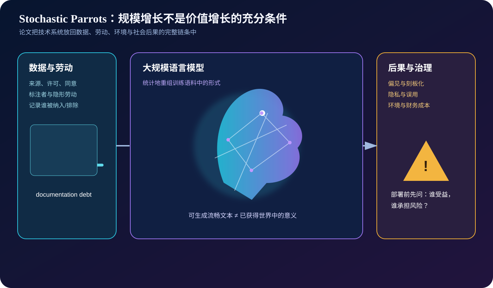
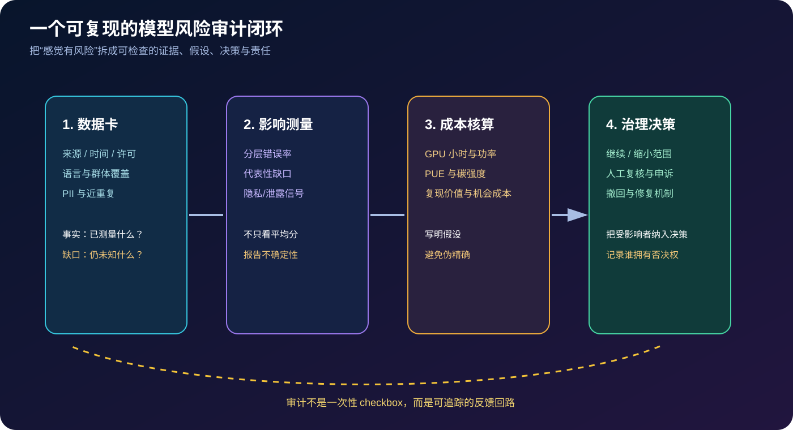
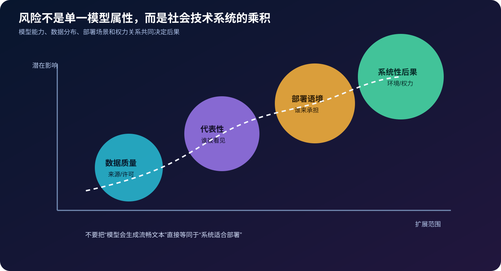

# Stochastic Parrots 详解：当语言模型的规模超过了数据、责任与治理能力


> **论文**：[On the Dangers of Stochastic Parrots: Can Language Models Be Too Big?](https://dl.acm.org/doi/10.1145/3442188.3445922)<br>
> **作者**：Emily M. Bender、Timnit Gebru、Angelina McMillan-Major、Shmargaret Shmitchell<br>
> **会议**：ACM FAccT 2021，pp. 610–623<br>
> **关键词**：Large Language Models、Stochastic Parrot、Data Documentation、Bias、Environmental Cost、Accountability、Sociotechnical Systems<br>
> **配套代码**：[stochastic_parrots_audit.py](./code/stochastic_parrots_audit.py)（零依赖，用于数据卡、代表性、碳排估算和风险登记的教学审计脚本）<br>
> **一手资料**：[ACM DOI](https://dl.acm.org/doi/10.1145/3442188.3445922) · [ACM 开放版摘要](https://doi.org/10.1145/3442188.3445922) · [FAccT 2021 收录页](https://facctconference.org/2021/acceptedpapers.html)

## 0. 先说结论

这篇论文不是一篇提出新模型结构或刷新 benchmark 的工程论文，而是一篇在大模型急速扩张时期发出的**风险与研究方法论论文**。它要求读者把“模型能生成流畅文本”与“模型理解意义、适合部署、值得继续扩大”严格区分开来。

作者用 **stochastic parrot（随机鹦鹉）** 这个比喻提醒我们：语言模型可以依据训练语料中的统计规律，概率性地拼接出形式上连贯的句子；但流畅的形式本身并不证明模型拥有人的意义理解、意图、经验或责任主体性。



文章真正关心的不是“模型是不是一只鹦鹉”这一句口号，而是以下问题：

1. 训练数据从哪里来，谁被记录，谁被遗漏，谁承担标注与审核劳动？
2. 数据集的规模、质量和代表性是否被诚实地描述，而不是用“互联网规模”掩盖文档债务？
3. 训练与部署的环境、财务和机会成本是否被纳入研究决策？
4. 偏见、刻板印象、仇恨、隐私泄露和错误信息会怎样被模型放大或重新分配？
5. 受到伤害的群体是否有参与定义问题、评估系统和要求修复的权力？
6. 如果系统的目标、数据、评测和用途都不清楚，谁能对结果负责？

一句话记忆：

> 论文不是说“语言模型只能机械复读”，而是说**语言形式的统计流畅性不能替代意义、数据谱系、社会责任和部署前的风险证明**。

## 1. 论文定位：它解决的不是 perplexity，而是研究决策

### 1.1 2021 年的背景

论文发表于 2021 年 3 月的 FAccT ’21。当时 NLP 研究已经从 BERT、GPT-2、GPT-3 走向更大的参数、更长的训练语料和更昂贵的计算资源。典型范式是：

```text
抓取更多网页 → 训练更大的预训练模型 → 在英文 benchmark 上刷新分数
```

这种路线有明显收益：预训练模型可以迁移到大量任务，少样本能力变强，语言接口也更自然。但论文指出，研究社区容易把“可测量的 leaderboard 提升”当成唯一进步标准，忽略了成本和伤害的分布。

### 1.2 这是一篇立场鲜明的 position / critical analysis paper

阅读时要避免两个极端：

- 把文章误读成一条可由单个实验完全证伪或证实的“模型定理”；
- 因为它批评大模型，就把所有现代语言模型的能力都简化成“没有任何结构”。

更准确的读法是：文章提出了一个**研究与部署前的审查框架**，强调能力指标不是完整的价值函数。后续模型可能学到更丰富的内部结构，但数据、权力、成本和问责问题不会因为生成质量提高而自动消失。

### 1.3 为什么标题是“Can Language Models Be Too Big?”

“太大”不是一个只由参数量决定的阈值。至少要同时考虑：

$$
\text{是否值得扩大}
=f(\text{能力收益},\text{数据质量},\text{环境成本},\text{财务成本},
\text{风险暴露},\text{治理能力},\text{替代方案}).
$$

如果扩大模型只带来很小的平均 benchmark 增益，却增加了显著的能源消耗、数据风险和不可审计性，那么“更大”就未必是研究上的进步。

## 2. “随机鹦鹉”到底在说什么

### 2.1 语言模型的最小数学描述

自回归语言模型学习的是 token 序列的条件概率：

$$
p(x_1,\ldots,x_n)=
\prod_{t=1}^{n}p_\theta(x_t\mid x_{<t}).
$$

训练通常最小化 next-token cross entropy：

$$
\mathcal L(\theta)=
-\sum_t\log p_\theta(x_t\mid x_{<t}).
$$

这个目标明确奖励模型复现训练分布中“什么形式经常跟在什么形式后面”。它并没有在目标函数里直接要求模型拥有人的身体经验、社会意图、事实责任或对话中的共同情境。

因此，“随机鹦鹉”可以拆成三个层次：

| 层次 | 论文提醒 | 不应推出的过度结论 |
|---|---|---|
| 统计机制 | 输出来自概率分布与语料模式的重组 | 模型完全没有任何可泛化结构 |
| 语义边界 | 形式流畅不等于对意义负责 | 所有生成内容都必然无用 |
| 社会后果 | 用户可能把流畅输出误认为可靠理解 | 只要加大模型就能解决偏见和责任 |

### 2.2 “理解”问题与工程决策问题是两件事

论文借用了语言形式与意义之间的区分：一个系统能生成语法正确的句子，并不自动证明它拥有与人类相同的意义 grounding。这个哲学与认知科学问题很深，但工程上可以先采取更保守的规则：

> 不要因为输出像一个有意图的说话者，就把决策权、可信度或责任主体性赋予模型。

这条规则即使在你相信模型具备某种内部世界模型时仍然成立，因为部署风险来自系统整体，而不只是模型“有没有意识”。

### 2.3 能力、理解、可靠性、责任不能混成一个分数

建议将四个概念分开：

- **能力（capability）**：在某个任务和数据分布上完成得多好；
- **理解（understanding）**：是否有可支持语义、情境和因果解释的内部表征；
- **可靠性（reliability）**：换分布、换用户、换提示后是否稳定、可校准；
- **责任（accountability）**：出错、伤害或歧视时，谁能解释、修复和承担后果。

benchmark 主要测第一项，论文要求研究者不要用第一项替代后三项。

## 3. 四个核心论证轴

## 3.1 数据：规模不是质量，网页不是中性的世界

### 3.1.1 “把互联网都抓进来”会带来文档债务

大规模网页语料通常混合了新闻、论坛、个人博客、广告、代码、机器生成文本、重复页面、被盗内容和各种语言。若只报告 token 数，不报告来源和过滤规则，就会留下 **documentation debt（文档债务）**：

- 数据来自哪些站点、时间段和地区？
- 哪些内容被删除，依据是什么？
- 版权、许可、个人信息和撤回请求如何处理？
- 去重、质量过滤、语言识别和毒性过滤的误差是多少？
- 数据中被代表的人群是否同意这种再利用？

规模可以让模型看到更多模式，却不能让未知的来源、偏见和许可问题自动消失。

### 3.1.2 代表性不是“平均分布”四个字

网页语料的频率不是社会人口分布的天然镜像。某一群体在语料中的比例低，可能来自数字接入差异、语言资源不足、平台政策、审查或历史权力关系；某一群体比例高，也可能只是少数网站被大量复制。

最基本的审计应同时报告：

$$
\text{observed share}(g)=\frac{\#\text{records in group }g}{\#\text{audited records}},
$$

以及参考人群或目标任务中的 share。二者的比值只能作为线索，不应被解释为“偏见的唯一真值”。

### 3.1.3 数据卡应该记录什么

至少包括：

1. 数据来源、抓取时间、许可和可撤回机制；
2. 语言、地区、体裁、作者群体与时间分布；
3. PII、版权文本、仇恨与违法内容的处理；
4. 标注、过滤、去重和质量控制中的人工劳动；
5. 已知缺口、适用范围和不应使用的场景；
6. 数据更新与版本之间的差异。

## 3.2 偏见与伤害：模型会复制、放大并规模化

### 3.2.1 从数据偏差到系统伤害的链条

可以把常见链条写成：

```text
历史不平等 → 语料中的不平衡/刻板印象
        → 训练目标把模式压缩进参数
        → 生成与分类中的差异化错误
        → 产品把输出接入筛选、搜索、教育或公共服务
        → 伤害在更大范围、更低成本地复制
```

“模型只是反映数据”不能免除系统责任，因为部署方选择了数据、阈值、接口和使用者，也决定了谁有机会申诉。

### 3.2.2 评测不能只给一个总平均

平均 accuracy 或 perplexity 可能掩盖小群体上的灾难性错误。至少要做：

- 按语言、方言、地区、性别、年龄、残障或职业等相关维度分层；
- 报告错误率、拒答率、毒性率和置信度的区间；
- 让受影响群体参与定义“什么算伤害”；
- 测试提示改写、上下文变化和模型版本漂移；
- 区分模型本身、检索语料、审核策略和产品 UI 造成的错误。

## 3.3 环境与财务成本：算清楚“扩大一次”意味着什么

### 3.3.1 粗略排放公式

训练能耗可以先用可审计的近似式：

$$
E_{\text{kWh}}
\approx H_{\text{GPU}}\times P_{\text{kW}}\times \mathrm{PUE},
$$

$$
C_{\text{kgCO}_2\mathrm e}
\approx E_{\text{kWh}}\times I_{\text{kgCO}_2\mathrm e/\text{kWh}}.
$$

其中 PUE 是数据中心总能耗与 IT 能耗的比值，碳强度取决于地区和时间。这个估算不是精确的生命周期评估，但比只报告 GPU 型号更诚实。

### 3.3.2 不要只算训练一次

成本还包括：

- 超参数搜索与失败运行；
- 数据清洗、存储、网络传输和 checkpoint；
- 推理服务、复制模型与用户请求；
- 标注、审核、红队和事故响应的人力；
- 受影响群体承担的隐性成本；
- 因为追逐更大模型而放弃的其他研究和公共资源。

论文的关键问题不是“碳排是否为零”，而是：**能力提升是否足以证明这些成本与风险值得承担？**

## 3.4 不可解释性与问责：流畅输出会制造过度信任

模型内部参数、训练数据和版本通常不透明；用户又容易把自然语言输出当作有意图的回答。二者叠加会产生：

- 错误信息的权威感；
- 语料中的刻板印象以中性语气再现；
- 个人信息被生成、拼接或泄露；
- 责任在模型、平台、数据供应商和最终用户之间相互推诿。

可解释性因此不应只等于“给一张 attention heatmap”。更实用的问责证据是：数据谱系、模型卡、版本日志、限制条件、人工复核、申诉渠道、撤回与修复流程。



## 4. 论文推荐的研究流程

论文摘要给出的方向可以整理为一个 pre-development checklist：

### Step 1：先问“为什么要做这个系统”

把目标写成可验证的任务，而不是“训练一个更大的通用模型”。例如：

```text
目标：帮助经过培训的编辑发现文档中的术语不一致
不做：自动发布、替代事实核查、处理未成年人敏感信息
成功：编辑节省时间，同时不增加分层错误率和隐私事件
```

如果用小模型、检索、规则或人工流程就能解决，就不应把“大模型”当默认答案。

### Step 2：在模型前投入资源做数据策划

先完成数据卡、采样审计、许可检查、去重、PII 处理、目标群体咨询，再决定是否需要扩大参数量。论文明确反对把“把所有网页吞进去”当作数据策略。

### Step 3：把受影响者纳入设计与评估

受影响者不只是测试集里的匿名样本。他们应参与：问题定义、伤害分类、输出审阅、发布门槛、申诉与修复流程。

### Step 4：用机会成本评估规模

比较候选方案：小模型、领域模型、检索增强、规则系统、人工协作、完全不部署。记录每个方案的能力收益、成本、风险和可逆性。

### Step 5：发布前做限制性声明

明确适用语言、场景、已知失败模式、数据缺口、不得用于的决策，以及谁有权暂停系统。

## 5. 一个最小但可复现的审计脚本

配套脚本不是训练 LLM，而是把论文关心的假设写成可运行的算术和记录结构：

```python
from stochastic_parrots_audit import (
    DatasetCard, EnergyEstimate, estimate_emissions,
    normalized_gap, representation_rates,
)

card = DatasetCard(
    name="my-corpus",
    source="documented sources",
    collection_date="2026-01",
    languages=("zh", "en"),
    license="verified",
    consent_known=True,
    pii_removed=True,
    documented_limitations=("long-tail languages underrepresented",),
)

share = representation_rates({"en": 920, "zh": 60, "other": 20})
gap = normalized_gap(share, {"en": 80, "zh": 15, "other": 5})
carbon = estimate_emissions(EnergyEstimate(
    gpu_hours=1200, power_kw=0.45, pue=1.2,
    carbon_intensity_kg_per_kwh=0.38,
))
```

这段代码的重点不是生成一个“公平分数”，而是把：

- 分母是什么；
- 参考分布是什么；
- 哪些数字是测量值；
- 哪些数字是功率、PUE、碳强度等假设；
- 哪些数据缺口仍未解决；

全部显式写出来。

运行：

```bash
python3 papers/to-2026/code/stochastic_parrots_audit.py --test
python3 papers/to-2026/code/stochastic_parrots_audit.py
```

示例输出会包含 dataset card、各群体的观测比例、相对参考比例、能耗/排放估算和风险登记表。

### 5.1 为什么函数不直接输出“偏见结论”

`normalized_gap` 返回的是 observed/reference 比值，不会自动把 0.7 命名为“歧视”。因为同一个比例可能由采样策略、标签误差、平台覆盖、任务定义或真实人口差异造成。审计工具应该帮助人提出问题，而不是替代领域判断。

### 5.2 能源估算的敏感性分析

如果功率和碳强度不确定，可以跑多个场景：

```python
for intensity in (0.1, 0.38, 0.8):
    estimate = EnergyEstimate(1200, 0.45, 1.2, intensity)
    print(intensity, estimate_emissions(estimate)["emissions_kg_co2e"])
```

结果应作为区间或情景，而不是带很多小数点的伪精确数字。

## 6. 数据卡、模型卡与审计记录模板

### 6.1 数据卡最小模板

```yaml
name: example-corpus
version: 0.3
sources:
  - domain: example.org
    collected_at: 2026-01-15
    license: CC-BY / verified
coverage:
  languages: [zh, en]
  regions: [CN, US]
processing:
  deduplication: minhash-v2
  pii_removal: regex + human review
  toxic_content: retained for research, access restricted
known_limitations:
  - long-tail languages underrepresented
  - source-level consent not uniformly known
intended_use: research and offline evaluation
out_of_scope: automated eligibility or safety decisions
```

### 6.2 模型卡中应加入的风险信息

- 训练数据版本与是否混入用户数据；
- 预训练、指令微调和安全过滤的差异；
- 对不同语言、方言、群体和领域的分层结果；
- 生成错误、隐私泄露、毒性和提示注入的案例；
- 适用范围、禁止用途、人工监督和撤回机制；
- 推理成本、延迟、能耗和服务可用性。

### 6.3 事故记录不应只写“模型 hallucinated”

一个可追责的事件记录至少包含：

```text
时间与版本：哪一个 checkpoint / prompt / 检索索引？
输入与输出：是否含敏感信息，如何安全保存？
影响对象：谁受到什么具体影响？
触发路径：数据、模型、UI、人工流程还是组织决策？
检测与响应：谁发现，多久暂停，谁批准恢复？
修复与验证：删数据、改模型、改产品还是限制场景？
```

## 7. 如何理解论文的几个常见争议

### 7.1 “模型后来展现了推理，所以随机鹦鹉被证伪了？”

不必把比喻当成对所有能力的二值断言。现代模型可能学到复杂的组合结构、工具使用和某些世界规律；但这些能力不自动解决：数据许可、代表性、环境成本、隐私、误用和责任。论文最稳固的贡献是把这些问题放回能力叙事中心，而不是证明某个永恒的认知结论。

### 7.2 “既然有偏见，过滤数据不就行了？”

过滤会改变分布，也可能删除少数群体的表达、语境和对伤害的记录。过滤规则本身需要透明、可审查，并与目标用途和受影响者协商。保留研究用途的数据也不等于可以无条件公开或部署。

### 7.3 “模型只是工具，责任在用户。”

工具的设计者和部署者仍然选择了默认提示、排序、阈值、自动化程度和申诉入口。责任应沿系统链条分配，而不能在输出出错后单方面归咎于最后一个用户。

### 7.4 “环境成本可以靠绿色能源抵消。”

低碳电力能降低排放估算，但不等于消除水、土地、硬件供应链、电子废弃物、财务集中和机会成本。能源核算应写明边界，而不是把一个碳数字当作全部影响。

### 7.5 “更多数据天然能修复长尾语言。”

长尾语言需要来源、授权、社区参与、标注和评测资源；单纯把更多高资源语言网页加入语料，可能让整体 perplexity 变好，却不会修复目标语言的服务质量。

## 8. 与常见 ML 论文阅读框架的对照

| 常见问题 | 传统模型论文的回答 | Stochastic Parrots 要求增加的回答 |
|---|---|---|
| 模型多大？ | 参数、层数、训练 token | 为什么需要这个规模，替代方案是什么？ |
| 数据多大？ | token 数、来源名称 | 许可、谱系、代表性、缺口、处理劳动？ |
| 指标多高？ | 平均 benchmark | 分层错误、校准、真实场景和受影响者定义？ |
| 训练多久？ | wall-clock、GPU 数 | 能源、碳、失败运行、推理和机会成本？ |
| 能否复现？ | 代码和 checkpoint | 数据版本、过滤规则、访问权、责任和治理？ |
| 出错怎么办？ | future work | 谁能暂停、申诉、修复、撤回和赔偿？ |

## 9. 一张风险地图



从工程视角，风险可以沿四个相互耦合的方向累积：

1. **数据质量**：来源未知、重复、版权、隐私、标注误差；
2. **代表性**：群体缺失、语言等级、历史刻板印象；
3. **部署语境**：高风险决策、自动化程度、用户误信、反馈回路；
4. **系统性后果**：环境负担、权力集中、劳动替代、责任逃逸。

模型越大，潜在影响范围可能越广，但影响方向并不只由参数量决定。一个小模型接入高风险流程也可能造成严重伤害；一个大模型在受限、可逆、有人审查的场景中风险可能不同。关键是把场景作为一等变量。

## 10. 从论文到今天的大模型实践

这篇 2021 年论文对后来的实践产生了几条持续影响：

- 数据集文档、datasheets、dataset cards 和 model cards 成为常见治理工具；
- 训练数据许可、去重、PII 处理和数据来源追踪变成模型发布前的必答题；
- “平均 benchmark”之外，语言公平性、毒性、隐私、越权和安全评测被更系统地讨论；
- 研究者开始报告训练成本、硬件、能耗或碳排估算；
- 受影响群体、领域专家和 red team 被纳入评估流程；
- “能力更强”与“应该部署”之间的逻辑间隔被明确指出。

这些实践并不意味着问题已经解决。文档可以写得很漂亮，却不一定改变决策权；公平指标可以很多，却不一定覆盖真实伤害；碳排可以计算，却不一定改变扩大模型的激励。论文最重要的要求仍然是：**把技术决定放回社会关系与责任结构中**。

## 11. 阅读这篇论文时的五个问题

1. 作者在哪些地方把语言形式与意义理解区分开？哪些论证是理论性的，哪些是经验性的？
2. 如果一个模型在某任务上可靠，什么额外证据才足以支持高风险部署？
3. “代表性”应相对于哪个目标人群、哪个任务和哪个时间段定义？
4. 训练成本、推理成本和机会成本应由谁承担，谁有权决定“值得不值得”？
5. 在你的项目中，谁是受影响者，他们是否参与了数据、指标和发布门槛的定义？

## 12. 总结

`On the Dangers of Stochastic Parrots` 的核心不是给语言模型贴上“无意义机器”的永久标签，而是反对一种危险的研究惯性：

```text
更大模型 → 更好 benchmark → 更值得部署
```

作者要求把中间被省略的部分补回来：数据从哪里来、谁被代表、谁的劳动被隐藏、训练和部署消耗什么、哪些人承担风险、谁拥有修复与否决权。

对今天的工程团队而言，最实用的结论是：

> 在扩大模型之前，先证明问题值得解决；在收集数据之前，先记录来源与责任；在发布系统之前，先让受影响者参与定义风险；在看到流畅输出时，永远不要把它当成理解、事实或责任的替代品。

## 参考资料

1. Bender, E. M., Gebru, T., McMillan-Major, A., & Shmitchell, S. (2021). [On the Dangers of Stochastic Parrots: Can Language Models Be Too Big?](https://dl.acm.org/doi/10.1145/3442188.3445922). *FAccT ’21*, 610–623.
2. [ACM DOI / Open Access article page](https://doi.org/10.1145/3442188.3445922).
3. [ACM FAccT 2021 accepted papers](https://facctconference.org/2021/acceptedpapers.html).
4. Gebru, T. et al. (2021). [Datasheets for Datasets](https://cacm.acm.org/research/datasheets-for-datasets/).
5. Mitchell, M. et al. (2019). [Model Cards for Model Reporting](https://dl.acm.org/doi/10.1145/3287560.3287596).
