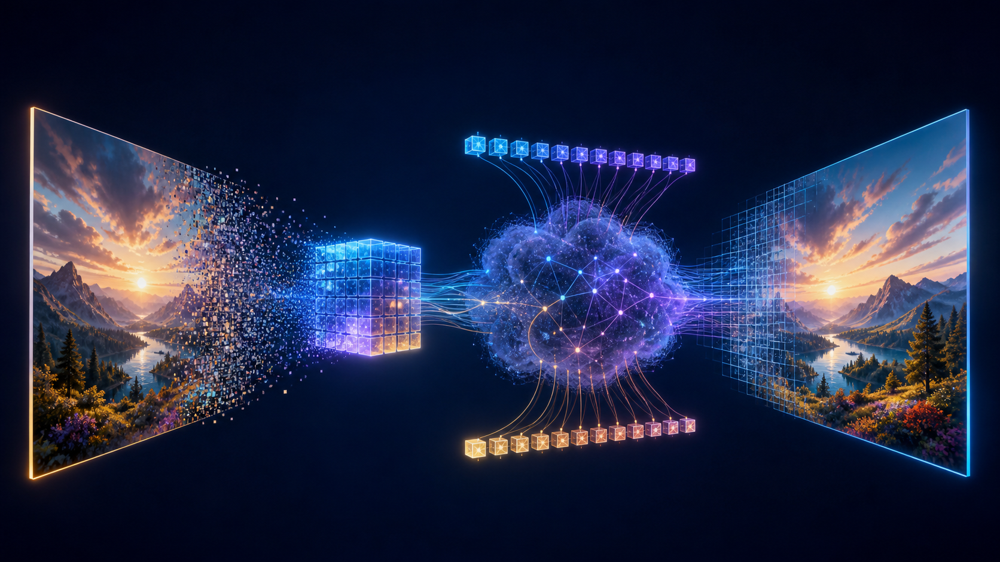
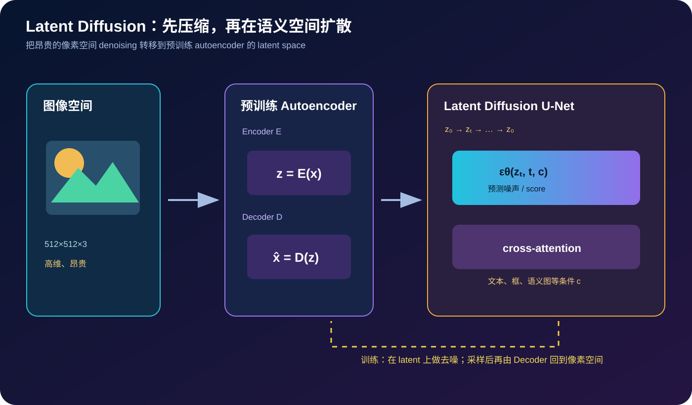
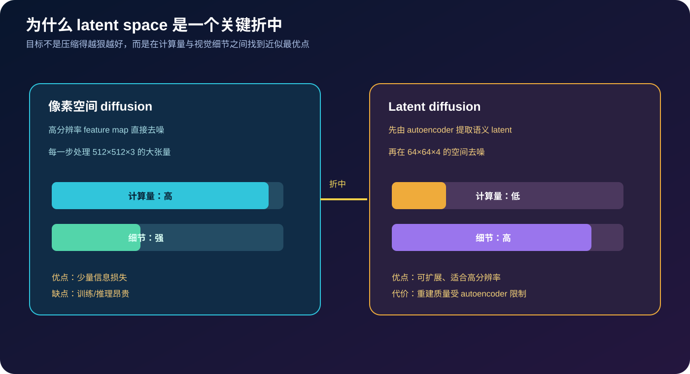
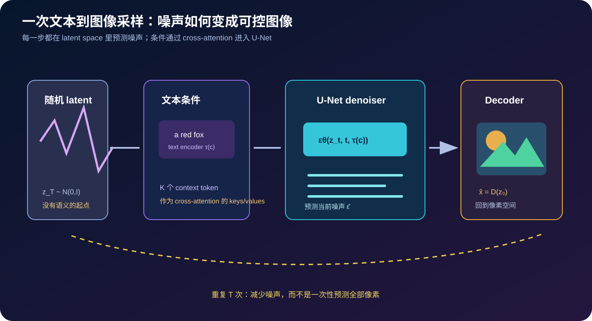

# Latent Diffusion 原理详解：在压缩后的语义空间里生成高分辨率图像



> **论文**：[High-Resolution Image Synthesis with Latent Diffusion Models](https://arxiv.org/abs/2112.10752)<br>
> **作者**：Robin Rombach、Andreas Blattmann、Dominik Lorenz、Patrick Esser、Björn Ommer<br>
> **版本**：arXiv v1 发布于 2021-12-20，v2 修订于 2022-04-13；发表于 CVPR 2022<br>
> **关键词**：Diffusion Models、Latent Space、Autoencoder、U-Net、Cross-Attention、Text-to-Image、Inpainting、Super-Resolution<br>
> **配套代码**：[latent_diffusion_minimal.py](./code/latent_diffusion_minimal.py)（零依赖，演示 forward noising、epsilon loss、cross-attention、DDIM step 与 latent 尺寸折中）<br>
> **一手资料**：[arXiv](https://arxiv.org/abs/2112.10752) · [arXiv HTML](https://arxiv.org/html/2112.10752) · [论文 PDF](https://arxiv.org/pdf/2112.10752) · [CompVis 官方代码](https://github.com/CompVis/latent-diffusion)

## 0. 先说结论

Latent Diffusion Model（LDM）最重要的想法可以浓缩成一句话：

> 不要在 512×512×3 的像素空间里反复预测噪声；先用一个预训练 autoencoder 把图像压缩成较小的 latent，再在 latent space 做 diffusion，最后解码回像素。

论文解决的是 diffusion model 的一个工程瓶颈：像素空间扩散虽然质量好、条件控制灵活，但每一个时间步都要处理高分辨率 feature map，训练和采样成本非常高。LDM 将复杂度转移到一个感知上足够好的压缩空间，并用 cross-attention 接入文本、边界框、语义布局等条件。



读完本文，至少应记住下面十二点：

1. **LDM 不是另一种完全不同的 diffusion 方程。**核心 DDPM/score matching 目标仍然存在，变化主要是扩散发生的位置从 $x$ 换成了 $z=E(x)$。
2. **Autoencoder 与 diffusion 分阶段训练。**先训练编码器/解码器得到可用 latent，再冻结或固定其表示训练 latent denoiser。
3. **压缩不能只追求像素 MSE。**论文强调感知质量与细节保留；autoencoder 的 perceptual loss、对抗项和 KL/向量量化正则共同决定 latent 是否适合生成。
4. **U-Net 预测噪声，而不是直接预测最终图片。**训练样本是 $z_t=\sqrt{\bar\alpha_t}z_0+\sqrt{1-\bar\alpha_t}\epsilon$，目标通常是 $epsilon$。
5. **条件通过 cross-attention 注入。**文本编码器输出 context tokens，U-Net 中的 feature tokens 作为 queries，文本 tokens 作为 keys/values。
6. **空间大小显著下降。**典型 $f=8$ 的 autoencoder 将 512×512 图像映射为 64×64×4 latent，扩散网络不必在 RGB 高分辨率上工作。
7. **高分辨率生成仍然是卷积式的。**latent U-Net 可以使用全卷积结构，条件和多尺度特征让它比直接在像素空间更容易扩展。
8. **LDM 是 Stable Diffusion 的方法基础，但论文本身不等于某个具体 checkpoint。**Stable Diffusion 还涉及数据、文本编码器、训练配置、采样器和发布许可。
9. **采样成本仍然是序列性的。**latent 降低每一步成本，却没有消灭多步 denoising；DDIM、DPM-Solver、蒸馏等属于后续采样加速方向。
10. **latent 是有损的。**细节、文字、精确几何和颜色可能在 autoencoder 阶段丢失，扩散模型无法恢复编码器从未保留的信息。
11. **条件控制不等于严格约束。**文本条件是统计引导，不能保证每个对象数量、拼写、空间关系都正确。
12. **关键折中是“复杂度—细节—可控性”。**压缩太弱，计算省不下来；压缩太强，重建和生成质量受损。

一句话记忆：

> LDM 把 diffusion 的高成本从像素坐标搬到一个感知压缩的 latent 坐标，再用 cross-attention 把文本等条件注入 U-Net，从而在可承受的算力下完成高分辨率生成。

## 1. 为什么要离开像素空间

### 1.1 像素空间 diffusion 在做什么

给定真实图像 $x_0$，前向过程逐步加入高斯噪声：

$$
q(x_t\mid x_{t-1})
=\mathcal N\left(\sqrt{1-\beta_t}x_{t-1},\beta_t I\right).
$$

把多个步骤合并，可以直接采样：

$$
x_t=\sqrt{\bar\alpha_t}x_0
+\sqrt{1-\bar\alpha_t}\epsilon,
\qquad \epsilon\sim\mathcal N(0,I),
$$

其中：

$$
\alpha_t=1-\beta_t,
\qquad
\bar\alpha_t=\prod_{s=1}^{t}\alpha_s.
$$

神经网络 $\epsilon_\theta(x_t,t)$ 学习从带噪图像中预测所加入的噪声，常见简化目标是：

$$
\mathcal L_{\text{simple}}
=\mathbb E_{x_0,t,\epsilon}
\left[
\|\epsilon-\epsilon_\theta(x_t,t)\|_2^2
\right].
$$

采样时从 $x_T\sim\mathcal N(0,I)$ 开始，反复执行去噪更新，最终得到 $x_0$。

### 1.2 分辨率为什么会迅速放大成本

512×512 RGB 图像有：

$$
512\times512\times3=786{,}432
$$

个像素元素。实际 U-Net 通常还会在多个通道、多个分辨率的 feature map 上计算。每一个 diffusion step 都要执行一次庞大的网络前向；如果采样需要几十到几百步，代价会被进一步放大。

这不是简单的“显存不够”。高分辨率还意味着：

- 每个卷积层处理更多空间位置；
- attention 的 token 数增加；
- batch size 下降，训练更不稳定；
- 生成一张图需要重复执行很多次 denoiser。

### 1.3 直接缩小图片为什么不够

把输入图片 resize 到 64×64 再 diffusion 的确便宜，但会先验地丢掉纹理、边缘、小物体和文字。LDM 的关键不是简单插值缩小，而是学习一个**感知压缩 autoencoder**：

$$
z=E(x),
\qquad
\hat x=D(z).
$$

希望 $\hat x$ 在人眼感知上接近 $x$，同时 $z$ 的空间尺寸明显更小。扩散模型只负责生成“像真实图像 latent 的 $z$”，Decoder 再将其还原为像素。

## 2. Autoencoder：什么样的 latent 才适合生成

### 2.1 编码器与解码器

编码器 $E$ 把图像映射到 latent：

$$
z=E(x)\in\mathbb R^{h/f\times w/f\times c_z},
$$

解码器 $D$ 负责重建：

$$
\hat x=D(z).
$$

这里 $f$ 是空间下采样因子。典型配置中 $f=8$，512×512 图像会变为 64×64 的 latent 网格，通道数可能是 4。

### 2.2 为什么不能只用像素 MSE

如果只最小化：

$$
\mathcal L_{\text{pixel}}=\|x-D(E(x))\|_2^2,
$$

模型容易把容量花在平均颜色和低频结构上，或生成像素数值上接近但感知上模糊的重建。LDM 采用感知损失与对抗训练等手段，让重建更符合视觉感受，并使用 KL 正则或向量量化等方式约束 latent 分布。

一个教学版目标可以写成：

$$
\mathcal L_{\text{AE}}
=\lambda_{\text{rec}}\mathcal L_{\text{rec}}(x,D(E(x)))
+\lambda_{\text{perc}}\mathcal L_{\text{perc}}
+\lambda_{\text{reg}}\mathcal L_{\text{reg}}.
$$

论文的经验结论是：压缩因子要选在一个近似最优点。过小的 latent 让 diffusion 仍然昂贵，过大的压缩则破坏细节和语义。

### 2.3 正则化 latent 的两种直觉

**KL-reg autoencoder**：令编码器输出近似一个受约束的连续分布，让 latent 更平滑、更容易被 diffusion 建模。

**VQ-reg / quantized autoencoder**：通过离散码本或量化约束 latent，提升表示的结构性，但需要处理 codebook 和量化误差。

两者都不是“扩散本身的必需品”，它们服务于一个共同目标：让 $z$ 既保留视觉信息，又具有适合生成建模的分布。



## 3. Latent diffusion 的训练目标

### 3.1 在 latent 上加噪

先编码真实样本：

$$
z_0=E(x_0).
$$

然后使用与 DDPM 同形的前向过程：

$$
z_t=\sqrt{\bar\alpha_t}z_0
+\sqrt{1-\bar\alpha_t}\epsilon.
$$

注意：噪声不是直接加到 RGB 图像，而是加到 latent feature map。模型学习：

$$
\epsilon_\theta(z_t,t,c),
$$

其中 $c$ 可以为空，也可以是文本、类别、边界框或语义布局。

### 3.2 无条件与条件训练

无条件 LDM 的目标近似为：

$$
\mathcal L_{\text{LDM}}
=\mathbb E_{z_0,t,\epsilon}
\left[
\|\epsilon-\epsilon_\theta(z_t,t)\|_2^2
\right].
$$

条件 LDM 则变成：

$$
\mathcal L_{\text{cond}}
=\mathbb E_{z_0,c,t,\epsilon}
\left[
\|\epsilon-\epsilon_\theta(z_t,t,\tau(c))\|_2^2
\right],
$$

其中 $\tau$ 是条件编码器，例如文本 Transformer。

### 3.3 为什么训练目标看起来仍然很简单

复杂性主要在表示、网络结构和数据规模，而非公式本身。预测噪声的好处是：

- 目标尺度稳定，适合不同时间步；
- 可以直接使用 DDPM、DDIM 等反向推导；
- condition 只需进入 denoiser，不需要为每类任务重写损失；
- 与 score matching 有紧密联系。

### 3.4 latent scaling：工程里常被忽略的一步

实际实现通常会对编码后的 latent 使用一个固定缩放因子，使其分布与 diffusion 网络的假设匹配：

```python
z = autoencoder.encode(image)
z = latent_scale * z
```

解码前要执行相反的缩放：

```python
image = autoencoder.decode(z / latent_scale)
```

如果漏掉这一对操作，噪声相对信号的比例会变化，采样结果可能明显恶化。

## 4. U-Net 与 cross-attention：条件是怎样进入生成过程的

### 4.1 U-Net 仍然负责多尺度去噪

LDM 使用 U-Net 风格的 encoder–middle–decoder 结构：

```text
z_t
 ↓ down blocks（逐步降低空间分辨率、增加通道）
middle block
 ↓ up blocks（恢复空间分辨率，并跳连细节）
ε̂
```

时间步 $t$ 通过 sinusoidal 或 learned embedding 注入每个残差块，告诉网络当前噪声强度。

### 4.2 self-attention 与 cross-attention 的区别

设 U-Net 某层的空间 feature 展平为：

$$
H\in\mathbb R^{N\times d},
$$

其中 $N$ 是空间位置数；条件编码器输出：

$$
C\in\mathbb R^{M\times d_c},
$$

例如文本 token 序列。cross-attention 为：

$$
Q=W_QH,
\qquad K=W_KC,
\qquad V=W_VC,
$$

$$
\operatorname{Attn}(H,C)
=\operatorname{softmax}\left(\frac{QK^\top}{\sqrt d}\right)V.
$$

这里 query 来自图像 latent feature，key/value 来自文本 context。直观上，每个空间位置都可以询问文本中的哪些 token 与当前去噪位置相关。

### 4.3 为什么 cross-attention 比把文本向量简单拼接更灵活

把文本压成一个全局向量会丢掉 token 级关系；cross-attention 保留了：

- 对象词与属性词的对应；
- 多个实体之间的条件信息；
- 不同 U-Net 层对不同语义粒度的访问；
- 文本以外的序列条件，例如布局、类别或检测框编码。

因此论文可以把“文本”抽象成一般的 conditioning input，而不是把网络写死为 text-to-image。

## 5. 从文本到图像的采样流程



### 5.1 初始化

文本 prompt 经过条件编码器：

$$
c=\tau(\text{prompt}).
$$

然后从标准高斯 latent 开始：

$$
z_T\sim\mathcal N(0,I).
$$

### 5.2 预测噪声并估计干净 latent

在时间步 $t$，U-Net 输出：

$$
\hat\epsilon=\epsilon_\theta(z_t,t,c).
$$

可以估计无噪声 latent：

$$
\hat z_0
=\frac{z_t-\sqrt{1-\bar\alpha_t}\hat\epsilon}
{\sqrt{\bar\alpha_t}}.
$$

再依据选定的 DDPM、DDIM 或其他 sampler 更新到 $z_{t-1}$。

### 5.3 DDIM 的确定性直觉

以 eta=0 的 DDIM 为例：

$$
z_{t-1}
=\sqrt{\bar\alpha_{t-1}}\hat z_0
+\sqrt{1-\bar\alpha_{t-1}}\hat\epsilon.
$$

它可以使用比训练时更少的时间步，并在相同初始噪声和条件下得到较确定的路径。实际系统会使用更复杂的 scheduler，但“预测噪声—估计 clean latent—跳到下一时间步”的接口不变。

### 5.4 解码回图像

当迭代结束得到 $z_0$ 后：

$$
\hat x=D(z_0).
$$

Decoder 的能力决定了 latent 能否还原高频纹理。扩散模型不是凭空补回所有细节；如果 autoencoder 在压缩时丢失了信息，生成过程只能依据数据分布猜测。

## 6. Classifier-free guidance：为什么 prompt 能“拉”结果

论文讨论了多种条件引导方式；现代文本到图像实践中常见的是 classifier-free guidance（CFG）。训练时随机丢弃条件，模型同时学会：

$$
\epsilon_\theta(z_t,t,c),
\qquad
\epsilon_\theta(z_t,t,\varnothing).
$$

采样时组合为：

$$
\hat\epsilon
=\epsilon_\theta(z_t,t,\varnothing)
+w\left[
\epsilon_\theta(z_t,t,c)
-\epsilon_\theta(z_t,t,\varnothing)
\right].
$$

$w$ 越大，通常越强调 prompt 一致性，但也可能带来过饱和、构图僵化或细节损失。它是质量、条件遵循和多样性之间的旋钮，不是“越大越好”。

## 7. LDM 能做什么

论文在多个任务上验证了框架的通用性：

### 7.1 无条件图像生成

去掉外部条件，模型学习训练图像 latent 分布：

$$
p(x)\approx p_D(z),\qquad z=E(x).
$$

与像素 diffusion 相比，latent 计算更便宜；与过度压缩相比，感知 autoencoder 又保留了足够细节。

### 7.2 文本到图像

文本编码器通过 cross-attention 控制主体、属性、风格和场景。重要的是，这种条件接口并不要求 diffusion 网络直接理解自然语言语法；文本 Transformer 先把 prompt 转为 context tokens，U-Net 只需要学会如何使用这些 tokens。

### 7.3 语义布局与边界框条件

条件不必是文字。对象类别、位置框、语义图或其他结构化输入都可以编码为 context，让同一个 denoiser 适配不同控制任务。

### 7.4 Inpainting

给定已知区域与 mask，在 latent 中把噪声区域逐步重建，同时保留上下文区域。这比直接把整张图片重新生成更适合局部编辑，但边界一致性依赖 mask、编码器和采样策略。

### 7.5 Super-resolution

低分辨率图像可以作为条件，引导 latent diffusion 生成高分辨率结果。它不是简单插值，而是从数据分布中补足符合上下文的细节，因此也可能“幻觉式”地生成不存在的纹理。

## 8. 与 DDPM、Pixel Diffusion、VAE、GAN 的关系

| 方法 | 主要建模空间 | 生成机制 | 主要折中 |
|---|---|---|---|
| VAE | latent | 一次解码 | 快，但重建/细节可能受限 |
| GAN | pixel 或 feature | 对抗训练，一次生成 | 快，训练稳定性与覆盖度较难 |
| Pixel DDPM | 像素空间 | 多步去噪 | 质量强，但高分辨率成本高 |
| LDM | autoencoder latent | latent 多步去噪 + Decoder | 省算力，受 latent 重建限制 |
| Pixel autoregressive | 像素/token 序列 | 逐 token 预测 | 表达力强，但序列很长 |

LDM 不是把 VAE 与 diffusion 简单串联就结束了。关键在于：autoencoder 的 latent 必须保留足够视觉信息，而 diffusion 的网络又要在该表示上获得比像素空间更好的计算效率。

## 9. 最小教学代码解读

配套代码刻意不依赖 PyTorch、CUDA 或大型 checkpoint，只把论文公式写成可运行的纯 Python：

```python
betas = linear_beta_schedule(1000)
alpha_bars = cumulative_alphas(betas)
z_t = q_sample(z0, t, alpha_bars, noise)
loss = mse(eps_pred, noise)
```

这里对应：

1. 构造噪声 schedule；
2. 计算 $\bar\alpha_t$；
3. 根据闭式公式采样 $z_t$；
4. 用 MSE 训练网络预测噪声。

cross-attention 的最小版本：

```python
query = unet_features      # N 个空间位置
context = text_tokens      # M 个文本 token
conditioned = cross_attention(query, context)
```

它清楚展示了 query 与 context 的角色差异：空间 feature 询问文本，而不是把文本当作一个拼接到图片末尾的特殊像素。

运行代码：

```bash
python3 papers/to-2026/code/latent_diffusion_minimal.py --test
python3 papers/to-2026/code/latent_diffusion_minimal.py
```

示例输出会显示 512×512 图像经过 $f=8$、$c_z=4$ 的 latent 尺寸、像素/latent 元素比例、一次 forward noising、DDIM 更新和 cross-attention 结果。

### 9.1 真正训练时还缺什么

教学代码没有伪装成可直接生成高质量图片的项目。真实系统还需要：

- 训练好的 perceptual autoencoder；
- 时间步 embedding 与多尺度 U-Net；
- 文本 tokenizer 与 Transformer encoder；
- 多头 cross-attention、残差块和归一化；
- 大规模图文数据与清洗/去重策略；
- 混合精度、梯度累积、checkpoint 与分布式训练；
- scheduler、CFG、VAE decode 和安全过滤。

这种“只实现公式接口、不冒充完整模型”的代码更适合论文精读和单元测试。

## 10. 论文实验应该怎样读

论文的实验重点不是只报告一张图片的主观质量，而是同时比较：

- 视觉保真度与样本质量；
- 计算量、训练效率和采样成本；
- 无条件生成、条件生成、语义布局、inpainting、super-resolution；
- 不同压缩因子和 autoencoder 配置；
- 与像素空间 diffusion 和其他生成方法的折中。

阅读指标时要特别注意：

1. **FID 不是完整的感知质量。**它对特征分布敏感，却不能告诉你文字是否拼写正确、对象数量是否正确。
2. **高分辨率结果不等于真实细节。**Decoder 与数据分布可能共同产生视觉上合理但事实不存在的纹理。
3. **采样步数与 scheduler 影响速度/质量。**不能把一种 sampler 的运行时间直接推广到所有实现。
4. **文本条件的成功率不是纯模型属性。**prompt 模板、文本编码器、训练 caption 和 guidance scale 都会影响结果。

## 11. 常见误解与边界

### 11.1 “latent diffusion 就是低分辨率 diffusion”

不是。低分辨率 diffusion 直接把图片 resize 后生成；LDM 先学习一个具有感知结构的 autoencoder latent，并在 decode 时恢复高分辨率。两者的瓶颈、损失和信息保留方式不同。

### 11.2 “压缩越强，生成越快越好”

压缩因子增大，U-Net 计算下降，但重建误差和信息瓶颈上升。人脸纹理、细小文字、精确边缘、物体数量和空间关系尤其容易受到影响。

### 11.3 “cross-attention 保证 prompt 逐词执行”

它提供了条件通道，不提供形式化约束。复杂关系、计数、否定、空间组合和长 prompt 仍可能失败。需要控制网络、结构条件、分阶段生成或外部验证时，不能只加大 guidance。

### 11.4 “Stable Diffusion 就是论文中的一个模型”

Stable Diffusion 建立在 LDM 思路上，但具体 checkpoint 还包含特定 autoencoder、文本编码器、数据集、训练分辨率、条件策略、采样器和发布协议。读论文时应区分方法家族与具体产品/权重。

### 11.5 “生成的细节都来自真实输入”

超分辨率、inpainting 和图像编辑都可能产生数据分布中的 plausible detail，而不是输入中曾经观测到的事实。医疗、法证、卫星或历史图像场景尤其需要标注这种不确定性。

## 12. 工程实践清单

### 12.1 训练前

- 评估像素 diffusion、latent diffusion、VAE 或检索方案的成本/收益；
- 检查 autoencoder 重建在目标领域中的细节保真度；
- 记录 latent 的均值、方差和缩放因子；
- 明确文本数据许可、重复、隐私和不适宜内容；
- 设计分层评测：人、物体、文字、计数、空间关系和长尾概念。

### 12.2 训练中

- 监控噪声预测 loss 之外的重建与条件一致性；
- 固定验证 prompt，避免只挑选最好看的样本；
- 比较不同压缩因子、latent channels 和 scheduler；
- 记录 GPU 小时、显存、失败运行和推理步数；
- 对安全过滤、数据去重与 checkpoint 版本做可追溯记录。

### 12.3 部署前

- 测试提示注入、隐私复现、版权近似、偏见和危险内容；
- 对文字、计数、空间关系和身份属性做专门评测；
- 给 inpainting、super-resolution 等任务附上“可能生成不存在细节”的说明；
- 对高风险场景保留人工审核、撤销和申诉机制；
- 不把高 FID 或人类偏好分数直接当作事实可靠性。

## 13. 进一步影响：为什么它改变了生成模型的工程接口

LDM 的影响不只在“更快地生成图片”，而在于它把生成系统拆成了可以组合的模块：

```text
视觉压缩器：x <-> z
条件编码器：prompt / layout / box -> c
生成器：z_t, t, c -> ε̂
采样器：ε̂ -> z_0
解码器：z_0 -> image
```

这种接口允许：

- 替换文本编码器而不重写全部 U-Net；
- 使用同一 diffusion backbone 支持文本、布局、深度或边缘条件；
- 在 latent 中进行编辑、修复和超分辨率；
- 把训练成本从像素级高维空间降下来，为开放权重和社区实验创造条件。

但模块化也会把风险分散到多个组件：数据、VAE、文本 encoder、U-Net、scheduler 和产品 UI 各自都可能造成失败。调试时不能只看 U-Net 的 loss。

## 14. 思考题

1. 如果 autoencoder 的重建在 LPIPS 上很好，但小文字全部模糊，什么任务不应使用这个 latent？
2. 在同样算力下，你会选择更大的 latent diffusion，还是更强的 autoencoder？为什么？
3. CFG scale 增大后 prompt 一致性提高但多样性下降，这是否可以用单一 benchmark 表达？
4. 对医疗图像超分辨率，如何区分“感知上合理”与“诊断事实正确”？
5. 如果文本 encoder 已经包含社会偏见，单独改进 U-Net 能否解决？
6. 在推理成本中，latent U-Net、文本 encoder、VAE decode 和 scheduler 分别占多少？怎样测量而不是猜测？

## 15. 总结

Latent Diffusion 的贡献可以分成三层：

1. **表示层**：用感知 autoencoder 找到一个比像素更紧凑、又保留视觉细节的 latent space；
2. **生成层**：把 DDPM/score matching 的多步去噪迁移到 latent 上；
3. **控制层**：用 cross-attention 将文本、边界框、语义图等条件统一接入 U-Net。

最终的设计折中是：

$$
\text{可扩展高分辨率生成}
\approx
\text{感知压缩}
+\text{latent denoising}
+\text{通用条件接口}
$$

它没有消除 diffusion 的多步采样、autoencoder 的信息瓶颈或生成模型的幻觉；它做的是把最昂贵的计算放到一个更适合建模的空间，并让高分辨率条件生成成为可工程化的系统。

## 参考资料

1. Rombach, R. et al. (2022). [High-Resolution Image Synthesis with Latent Diffusion Models](https://arxiv.org/abs/2112.10752). *CVPR 2022*.
2. [论文 arXiv HTML](https://arxiv.org/html/2112.10752) · [PDF](https://arxiv.org/pdf/2112.10752).
3. Ho, J. et al. (2020). [Denoising Diffusion Probabilistic Models](https://arxiv.org/abs/2006.11239).
4. Song, J. et al. (2020). [Denoising Diffusion Implicit Models](https://arxiv.org/abs/2010.02502).
5. [CompVis latent-diffusion 官方代码](https://github.com/CompVis/latent-diffusion).
