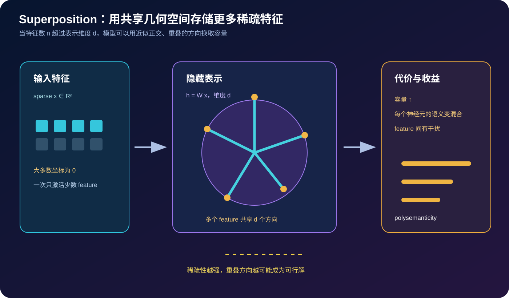
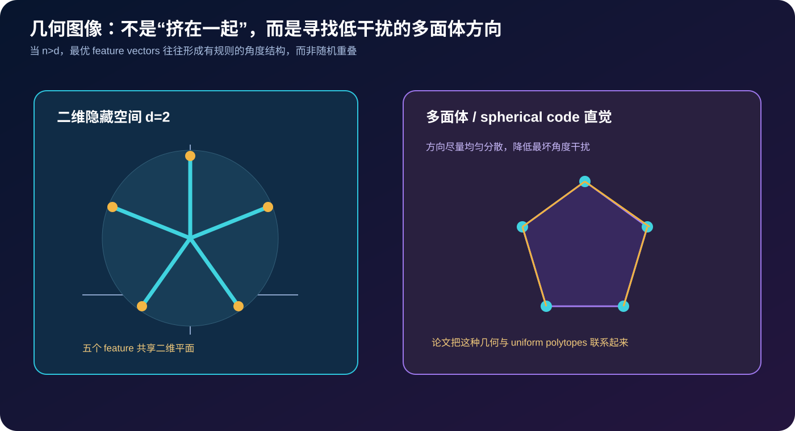

# Toy Models of Superposition 详解：神经网络如何把更多稀疏特征“折叠”进更少维度


> **论文**：[Toy Models of Superposition](https://arxiv.org/abs/2209.10652)<br>
> **作者**：Nelson Elhage、Tristan Hume、Catherine Olsson、Nicholas Schiefer、Tom Henighan、Shauna Kravec、Zac Hatfield-Dodds、Robert Lasenby、Dawn Drain、Carol Chen、Roger Grosse、Sam McCandlish、Jared Kaplan、Dario Amodei、Martin Wattenberg、Christopher Olah<br>
> **版本**：arXiv v1 发布于 2022-09-21；本文按论文 v1 与作者 [Transformer Circuits](https://transformer-circuits.pub/2022/toy_model/index.html) 版本讲解<br>
> **关键词**：Superposition、Polysemanticity、Sparse Features、Toy Model、Feature Geometry、Phase Change、Mechanistic Interpretability、Adversarial Examples<br>
> **配套代码**：[toy_superposition.py](./code/toy_superposition.py)（零依赖、纯 Python；训练稀疏特征的 tied linear autoencoder，比较维度不足时的重建误差与方向相似度）<br>
> **一手资料**：[arXiv](https://arxiv.org/abs/2209.10652) · [arXiv PDF](https://arxiv.org/pdf/2209.10652) · [Transformer Circuits 文章](https://transformer-circuits.pub/2022/toy_model/index.html)

## 0. 先说结论

神经网络可解释性里有一个反复出现的现象：**一个神经元往往对多个看起来无关的概念同时激活**。这叫 **polysemanticity（多语义性）**。如果把神经元当作“一个概念一个槽位”，这种现象就很难解释。

`Toy Models of Superposition` 给出一个极具影响力的答案：

> 当模型需要表示的特征数量 $n$ 超过隐藏空间维度 $d$，但每个特征又足够稀疏时，模型可能把多个特征编码成同一空间中的不同方向；这些方向不必彼此正交，而是以可控的几何重叠换取更大的有效容量。

这就是 **superposition（叠加）**。它不是简单的“神经元混乱”或“权重压缩”，而是一种由损失函数、稀疏度、特征重要性和表示维度共同决定的优化结果。



读完本文，至少应记住下面十二点：

1. **polysemanticity 是观测现象，superposition 是解释机制。**前者说一个神经元/方向响应多个特征，后者说这些特征可能以重叠方向被编码。
2. **先分清特征与神经元。**特征是模型内部有用的变量，神经元只是某个坐标基底；二者不必一一对应。
3. **维度不足不一定导致简单丢弃。**如果特征稀疏，模型可让不同特征共享方向，在大多数样本上避免同时发生干扰。
4. **稀疏性是 superposition 的关键条件。**特征越少同时出现，重叠方向带来的冲突越少。
5. **这是一个损失权衡。**增加一个方向的表示收益，与特征同时出现时的干扰成本竞争。
6. **论文观察到相变。**随着特征稀疏度变化，最优解会从近似正交表示跳到几何折叠的 superposition 表示。
7. **几何不是随机挤压。**在低维空间中，特征方向可能形成均匀多面体、spherical code 或 antipodal pair 等有规则结构。
8. **特征重要性会改变几何。**高频或高损失权重特征往往优先获得更独立、更稳定的方向，低重要性特征更可能被叠加。
9. **神经元可解释性可能低于特征可解释性。**在错误坐标基底中，一个 neuron 的激活会混合多个 feature；换一组方向可能更稀疏、更可读。
10. **superposition 与 adversarial examples 有潜在联系。**小扰动可以沿着模型中较弱、较难观察的特征方向改变内部状态。
11. **toy model 是机制实验，不是大模型定理。**它揭示一种可行机制，但不能单独证明所有 Transformer 的 polysemanticity 都来自同一原因。
12. **机械可解释性的目标不是只给神经元贴标签。**更重要的是恢复模型内部的 feature、方向、干扰和计算电路。

一句话记忆：

> 当特征很多、维度有限、激活稀疏时，网络可能用一组有几何结构的重叠方向来“超额存储”特征；神经元的多语义性，可能是观察坐标系不对的结果。

## 1. 从“一个神经元一个概念”开始，但不要停在那里

### 1.1 单语义 neuron 的直觉

在最简单的想象中，隐藏层有 $d$ 个神经元，就有 $d$ 个可解释概念：

```text
neuron 1 → 猫
neuron 2 → 汽车
neuron 3 → 否定
...
```

如果一个输入包含“猫”，神经元 1 激活；如果包含“汽车”，神经元 2 激活。这个图景对应于一组彼此正交的 feature directions。

### 1.2 现实中的 polysemanticity

实际观测常常更像：

```text
neuron 17 → 猫耳朵、汽车轮胎、某种句法模式、一个罕见名字
```

这可能有几种解释：

- 训练数据中这些概念存在统计关联；
- 神经元是多个 feature 的线性混合；
- 网络使用了超出坐标维度的 superposition；
- 观察的层或激活函数不适合直接解释；
- 该单元只是某条电路的一部分，而不是语义字典项。

论文关注第二、第三种机制，并用小到可以完整可视化的模型进行隔离实验。

### 1.3 特征不是神经元

把隐藏激活写成：

$$
h\in\mathbb R^d.
$$

如果模型内部真正表示了 $n$ 个 feature，且每个 feature 有一个方向 $w_i\in\mathbb R^d$，那么可以写成：

$$
h\approx\sum_{i=1}^{n}x_iw_i,
$$

其中 $x_i$ 是 feature $i$ 是否出现或它的强度。只有当 $w_i$ 恰好对应标准坐标轴时，才会出现“一个 feature 对应一个 neuron”。

因此更一般的解释对象是：

- feature activation $x_i$；
- feature direction $w_i$；
- feature 之间的相互干扰；
- 从 feature 到神经元坐标的线性投影。

## 2. Toy model：把大问题压缩成一个可以算清楚的优化问题

### 2.1 输入是稀疏 feature 向量

设输入有 $n$ 个真实特征：

$$
x=(x_1,\ldots,x_n)\in\mathbb R^n.
$$

每个 $x_i$ 以较小概率被激活。比如：

```text
x = [0, 1, 0, 0, 1, 0, 0, 0]
```

这里第 2、5 个特征同时出现，其他特征为 0。稀疏性可以用：

$$
\Pr[x_i\neq0]=p
$$

描述，$p$ 越小，平均每个样本激活的 feature 越少。

### 2.2 隐藏维度是瓶颈

模型只能使用 $d$ 维隐藏表示：

$$
d<n.
$$

如果强制每个 feature 拥有一个独立方向，最多只能无损存储 $d$ 个 feature。superposition 的思路是允许：

$$
w_i\in\mathbb R^d,
\qquad
\|w_i\|=1,
$$

但不要求 $w_i^\top w_j=0$。

于是 $n$ 个 feature 可以映射到 $d$ 维空间，只要常见样本中同时激活的 feature 对方向干扰不太严重。

### 2.3 一个最小的 tied autoencoder

教学模型使用：

$$
h=Wx,
\qquad
\hat x=W^\top h=W^\top W x,
$$

其中：

$$
W\in\mathbb R^{d\times n}.
$$

训练目标是重建输入：

$$
\mathcal L_{\text{recon}}
=\mathbb E_x\left[\|W^\top W x-x\|_2^2\right].
$$

这不是论文所有 toy setup 的完整复现，而是一个最小可视化版本：当 $d<n$ 时，它已经能展示共享方向、重建误差和 feature coherence 的基本权衡。

### 2.4 稀疏惩罚的另一种写法

论文中的不同 toy model 会使用不同的稀疏性/特征分布和损失参数化。一个常见的抽象形式是：

$$
\mathcal L
=\mathbb E\left[\|\hat x-x\|^2\right]
+\lambda\,\Omega(x),
$$

其中 $\Omega$ 鼓励激活稀疏或惩罚同时使用多个 feature。这里要注意：

- **输入稀疏**决定特征碰撞有多常见；
- **激活稀疏**决定表示是否容易被拆成可解释方向；
- **重建损失**决定丢失 feature 有多贵；
- **正则项**决定模型愿意牺牲多少重建换取更稀疏的表示。

## 3. 为什么稀疏性允许“超额存储”

### 3.1 同时出现才会产生直接干扰

假设两个 feature 用方向 $w_i,w_j$ 表示。若样本只激活 $i$：

$$
h=w_i,
$$

即使 $w_i$ 与 $w_j$ 有夹角，也不一定有问题。只有当 $i,j$ 同时激活：

$$
h=w_i+w_j,
$$

解码时 $w_i$ 可能在 $w_j$ 的方向上产生错误投影，才会造成可见干扰。

因此，模型比较两种代价：

1. 为 feature 增加独立维度的机会成本；
2. 让 feature 共享方向、偶尔发生碰撞的重建成本。

当碰撞概率很低时，第二种代价可能更便宜。

### 3.2 一个两 feature 的几何例子

令两个 feature 的方向夹角为 $\theta$：

$$
w_i^\top w_j=\cos\theta.
$$

如果 feature $i$ 和 $j$ 经常同时出现，模型倾向于让 $\theta$ 接近 $90^\circ$；如果它们极少同时出现，模型可以接受更小的角度，甚至把多个方向安排成规则多边形。

换句话说，**方向的相似度不只由语义相似性决定，还由共现统计决定**。

### 3.3 不是免费容量

superposition 不违反线性代数，也不凭空创造维度。它把错误从“永远无法表示某个 feature”换成“在 feature 碰撞时产生干扰”。如果输入分布改变，让原本罕见的 feature 组合大量出现，重建质量就会下降。

这也是为什么 superposition 可能与分布外脆弱性、对抗样本和模型错误相关：攻击者可以主动制造训练分布中罕见的 feature 共现。

## 4. 相变：从正交表示到叠加表示

### 4.1 什么叫相变

随着稀疏度或正则强度连续变化，最优表示有时不是平滑变化，而是在某个阈值附近突然改变结构：

- 特征密集时：使用少量近似正交方向，优先保证常见共现的重建；
- 特征稀疏时：使用更多相互倾斜的方向，换取更高 feature 容量。

这就是论文强调的 **phase change**。它不是热力学相变的严格物理等价，而是损失景观中不同几何方案之间的最优解切换。


### 4.2 为什么会突然跳变

可以把两种方案的损失粗略写成：

$$
L_{\text{orth}}(p)
\quad\text{和}\quad
L_{\text{super}}(p).
$$

当 $p$ 较大时，同时激活概率高，叠加方案的碰撞项迅速增加；当 $p$ 足够小时，叠加方案的容量收益超过碰撞成本。两条曲线交叉，就会出现最优结构的切换。

### 4.3 相图应该如何读

实验相图通常把两个超参数放在坐标轴上，例如：

- 每个 feature 的激活概率；
- hidden dimension 与 feature 数的比值；
- 特征重要性或损失权重；
- 稀疏惩罚强度。

颜色则表示：

- 是否处于 superposition；
- 重建误差；
- feature direction 的 coherence；
- 每个神经元承担的语义数量。

不要把相图的阈值当成所有网络的普适常数。它取决于输入分布、激活函数、损失、优化和归一化。

## 5. 几何：为什么会出现多面体

### 5.1 低维空间里如何放更多方向

在一维空间中，最多有两个互相相反的方向：$+1$ 与 $-1$。在二维空间，若希望放置多个单位向量并尽量均匀分散，正多边形是自然候选。

在三维空间，模型可能形成 tetrahedron、octahedron 等规则多面体方向。一般来说，这与寻找低最大内积的 **spherical code** 有关：

$$
\min_{\{w_i\}}
\max_{i\ne j}|w_i^\top w_j|.
$$

但实际最优目标通常不是纯粹的最大内积最小化，因为不同 feature 的频率、幅度和共现概率并不相同。

### 5.2 antipodal pair 与符号

如果激活可以区分正负方向，两个 feature 可能使用 $w$ 和 $-w$。这是一种非常高效的折叠：同一条轴的两端承载不同 feature。若网络使用 ReLU 等非负激活，方向和符号约束会改变可行的几何结构。

### 5.3 规则几何不是语义地图

几何上均匀分布的方向不意味着 feature 在人类语义上均匀。方向主要反映：

- 共现统计；
- 激活频率；
- 重建损失权重；
- 网络非线性和归一化。

因此不要直接把 feature vector 的夹角解释为“概念语义相似度”。它可能是“哪些特征需要避免同时碰撞”的编码。



## 6. 特征重要性：谁得到独立方向

### 6.1 不同 feature 的损失权重

如果 feature $i$ 的出现频率或幅度更高，它造成的重建误差更频繁，模型会优先为它提供较干净的方向。相反，罕见 feature 可能被安排到共享方向，承受更高的条件性干扰。

这意味着神经元的 polysemanticity 不一定均匀：一个坐标可能主要表示一个高重要性 feature，同时顺便承载若干低频 feature。

### 6.2 解释性中的“主语义”陷阱

用激活最高的样本给一个 neuron 命名，常常只能得到主语义。其他被叠加的 feature 可能：

- 只在罕见上下文中出现；
- 与主语义方向相反或被非线性门控；
- 激活幅度较小，难以通过 top examples 发现；
- 在分布外输入或对抗扰动下突然显现。

因此完整分析应包括 activation maximization、feature steering、消融、因果 tracing 和对比样本，而不是只看几个可视化例子。

## 7. 与机械可解释性的关系

### 7.1 从 neuron-centric 转向 feature-centric

传统解释流程：

```text
找一个神经元 → 看它最强激活的文本 → 给它贴标签
```

superposition 提醒我们改成：

```text
寻找可复现 feature → 估计 feature direction → 研究其写入/读取电路
```

这为后来的 sparse autoencoder（SAE）路线提供了重要直觉：如果原始激活空间是一个混合坐标，训练一个过完备、稀疏的字典，可能恢复比 neuron 更接近 feature 的基。

### 7.2 可解释性不等于字典学习成功

SAE 或其他分解方法找到稀疏 feature 后，还要问：

- feature 是否稳定、可复现？
- 它是因果变量还是相关性摘要？
- reconstruction error 是否集中在重要 feature？
- feature 是否只是把原始 polysemanticity 搬到新的 feature 之间？
- 解释结果能否预测干预后的模型行为？

toy model 的价值在于提供可控基准：我们知道真实 feature 是什么，可以检验分解是否找回它们。

### 7.3 叠加与电路

即使单个 neuron 语义混合，后续层也可能通过组合方向把信息重新读出。模型电路可以利用：

- 方向的正交/近正交关系；
- 正负符号；
- 稀疏门控；
- 多层叠加与反叠加；
- 对特定上下文的条件读取。

因此“某个 neuron 不可解释”不等于“整个模型不可解释”。它意味着正确的解释单位可能更高维、更分布式。

## 8. 对抗样本的启发

论文讨论了 superposition 与 adversarial examples 之间的潜在关系。直觉是：

1. 模型可以把许多 feature 放入低维空间；
2. 一些 feature 只在训练分布中很少共现；
3. 小扰动可能激活、抑制或组合这些方向；
4. 下游电路读取到异常组合，导致输出改变。

这不是说“所有对抗样本都由 superposition 造成”，而是提示一种可研究的机制：鲁棒性不只取决于单个 neuron 的权重，还取决于 feature geometry 与数据分布。

## 9. 最小教学代码：训练一个能叠加 feature 的模型

运行：

```bash
python3 papers/to-2026/code/toy_superposition.py --test
python3 papers/to-2026/code/toy_superposition.py
```

代码做四件事：

1. 从 Bernoulli 分布生成稀疏 feature 向量；
2. 学习 tied linear autoencoder $h=Wx,\hat x=W^\top W x$；
3. 对列向量归一化，避免模型只靠改变范数取巧；
4. 比较 $d=n$、$d<n$ 时的重建 MSE 和平均 feature cosine coherence。

核心梯度来自：

$$
\hat x=W^\top W x,
\qquad e=\hat x-x,
$$

$$
\frac{\partial\|e\|^2}{\partial W}
=2(Wx)e^\top+2(We)x^\top.
$$

代码中的对应片段：

```python
h = mat_vec(w, x)
reconstruction = transpose_mat_vec(w, h)
error = [reconstruction[j] - x[j] for j in range(n_features)]
w_error = mat_vec(w, error)
for i in range(hidden_dim):
    for j in range(n_features):
        grad = 2 * h[i] * error[j] + 2 * w_error[i] * x[j]
        w[i][j] -= lr * grad
```

这段实现故意保持简单：没有 ReLU、稀疏编码器、复杂重要性权重或完整论文相图，但它足以让你观察“维度不足并不等于只保留前 d 个特征”。

### 9.1 怎样解读脚本输出

```text
hidden  features  sparsity   mse       mean |cos(feature_i, feature_j)|
     8         8      0.12   ...             ...
     4         8      0.12   ...             ...
     2         8      0.12   ...             ...
```

- `mse` 衡量表示/解码误差；
- `coherence` 衡量不同 feature 方向的平均绝对余弦相似度；
- $d<n$ 时，coherence 不必为 0，说明方向发生共享；
- 改变 sparsity 可以观察共享方向是否更容易成为低损失解。

不要把一次随机种子的数值当作论文定量结论。优化器、步数、学习率和归一化都会改变几何。

## 10. 重要的实验直觉

### 10.1 特征数与维度比

当 $n\le d$，模型通常可以给大部分 feature 分配近似正交方向，重建较容易；当 $n>d$，模型必须在以下选项中选择：

- 忽略低重要性 feature；
- 让 feature 共享方向；
- 通过非线性或上下文门控减少碰撞；
- 增加隐藏维度。

### 10.2 稀疏度

稀疏度不是只影响激活数量，还影响 feature 共现图。两个 feature 即使语义完全无关，只要很少同时出现，就可以在几何上更接近；两个语义相似的 feature 若经常同时出现，也可能必须分开。

### 10.3 非均匀 feature importance

给不同 feature 不同重要性后，几何会表现出“核心 feature 保持正交、长尾 feature 进入 superposition”的层次结构。这与大模型中的长尾知识和少见 token 现象有概念上的呼应，但不能直接等同。

### 10.4 训练路径与局部最优

同一损失可能存在多个对称解。不同随机初始化、优化路径、归一化和噪声会得到旋转、置换或不同多面体排列。比较模型时要区分：

- 坐标置换带来的表面差异；
- 真正的 feature 几何差异；
- 只影响参数表示、但不影响函数行为的对称性。

## 11. 常见误解

### 11.1 “superposition 就是权重压缩”

不准确。权重压缩通常以存储/计算成本为目标；superposition 是模型内部用重叠方向表示多个 feature 的机制，重点是功能表示和干扰代价。

### 11.2 “只要看到一个 neuron 对两个概念激活，就是 superposition”

不够。多语义激活也可能来自数据相关、共享下游电路、非线性、测量噪声或特征定义错误。需要干预和可控 toy model 证据。

### 11.3 “方向夹角越小，两个概念越相似”

夹角可能表达的是共现/干扰优化，而不是语义相似度。应结合 feature activation、数据分布和因果实验解释。

### 11.4 “稀疏性越强，模型一定越可解释”

稀疏性降低碰撞成本，但也可能让重要信息只在少数上下文中出现；过强的稀疏约束会增加重建误差或产生不稳定字典。

### 11.5 “toy model 已经证明 Transformer 里所有神经元都在叠加”

没有。toy model 的作用是展示一种机制在简单条件下如何自然出现，并给大模型实验提供可检验假设。真实 Transformer 还有注意力、层归一化、非线性、残差流和训练数据等复杂因素。

## 12. 从 toy model 到大模型分析的实验路线

如果想把这篇论文的思路用于真实模型，可以按以下步骤推进：

1. 选择一个层或残差流，收集多样化激活样本；
2. 估计激活稀疏度、特征频率和不同上下文的共现；
3. 用 SAE、字典学习或其他过完备分解提取候选 feature；
4. 检查 feature 的 top examples、反例和跨 prompt 稳定性；
5. 对 feature 做 activation patching、steering、ablation 和 causal tracing；
6. 测量 feature 干预对下游 token 概率和行为的影响；
7. 比较原始 neuron basis 与 feature basis 的重建误差、稀疏性和可解释性。

最重要的是不要把“看起来有语义”当成充分证据。一个 feature 是否真的参与模型计算，需要因果验证。

## 13. 与后续稀疏自编码器工作的关系

Toy Models of Superposition 为一个自然问题提供了动力：

> 如果模型内部用过完备的 feature directions 表示信息，我们能否训练一个稀疏字典，把这些方向显式分解出来？

这条路线后来与 sparse autoencoder、dictionary learning、feature visualization 和 mechanistic interpretability 深度结合。共同思想是：

$$
\text{少量观测维度}
\quad\longrightarrow\quad
\text{更多但稀疏的潜在 feature}
$$

不过，真实模型的 feature 可能不是线性、静态或独立的。SAE 的 feature 仍需接受稳定性、因果性、覆盖率和盲点测试。

## 14. 论文的边界与批判性阅读

### 14.1 优点

- 把 polysemanticity 从令人困惑的可视化现象变成可计算的表示优化问题；
- 用极小模型隔离稀疏度、维度和特征重要性；
- 给出相变和多面体几何等可检验预测；
- 连接了表示容量、可解释性和对抗鲁棒性。

### 14.2 局限

- toy feature 分布远比真实语言或视觉数据简单；
- 线性 autoencoder 不能代表 Transformer 的完整电路；
- 几何结构可能依赖特定损失、非线性、初始化和归一化；
- polysemanticity 的发现与真实语义边界本身仍然需要人类判断；
- superposition 是一种机制解释，不是对所有模型和层的唯一解释。

正确的使用方式是把论文当作**机制假设生成器**：它告诉我们该测什么、该画什么相图、该设计什么干预，而不是替代对真实模型的证据。

## 15. 思考题

1. 如果两个 feature 很少同时出现，但在语义上完全无关，它们为何可能共享方向？
2. 如果提高 hidden dimension 后 polysemanticity 下降，这是否说明所有 feature 都被“正确分离”了？
3. 如何设计一个实验区分“语义相似导致方向接近”和“低共现导致方向接近”？
4. 为什么只看一个 neuron 的 top activating examples 可能错过长尾 feature？
5. 对抗扰动如何主动制造原本罕见的 feature 共现？
6. 一个 SAE 找到更多稀疏 feature 后，怎样证明它们是模型实际使用的 feature，而不是重建技巧？

## 16. 总结

`Toy Models of Superposition` 的核心贡献，是把一个对神经网络可解释性很重要的直觉变成了可计算的几何模型：

1. 真实 feature 数量可能超过隐藏维度；
2. feature 的稀疏激活降低了同时碰撞的概率；
3. 模型可以把 feature 放在重叠但有结构的方向上；
4. 低维几何、多面体和相变是这种折中的可观测表现；
5. neuron-centric 的解释可能需要升级为 feature-centric 的机制分析。

最终的抽象可以写成：

$$
\text{表示容量收益}
\quad\leftrightarrow\quad
\text{feature 共现时的干扰成本}.
$$

当 feature 足够稀疏，网络宁愿接受偶发干扰，也要把更多信息放进有限维度。理解这一点，有助于解释为什么大模型内部可能同时存在高度可解释的局部 feature、混合的 polysemantic neuron，以及需要过完备稀疏字典才能恢复的隐藏结构。

## 参考资料

1. Elhage, N. et al. (2022). [Toy Models of Superposition](https://arxiv.org/abs/2209.10652).
2. [Transformer Circuits: Toy Models of Superposition](https://transformer-circuits.pub/2022/toy_model/index.html).
3. Olah, C. et al. (2020). [Zoom In: An Introduction to Circuits](https://distill.pub/2020/circuits/zoom-in/).
4. Anthropic (2023). [Towards Monosemanticity: Decomposing Language Models With Dictionary Learning](https://transformer-circuits.pub/2023/monosemantic-features/index.html).
