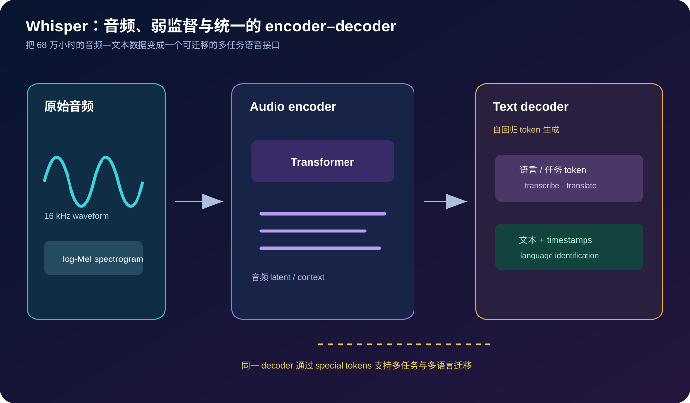
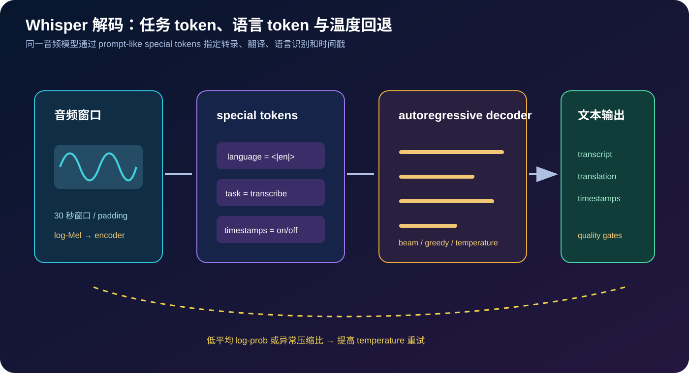

# Whisper 原理详解：用大规模弱监督把语音识别做成一个鲁棒的多任务接口


> **论文**：[Robust Speech Recognition via Large-Scale Weak Supervision](https://arxiv.org/abs/2212.04356)<br>
> **作者**：Alec Radford、Jong Wook Kim、Tao Xu、Greg Brockman、Christine McLeavey、Ilya Sutskever<br>
> **版本**：arXiv v1 发布于 2022-12-06；本文按论文 v1 与 OpenAI Whisper 开源实现讲解<br>
> **关键词**：Automatic Speech Recognition、Weak Supervision、Multilingual、Speech Translation、Zero-shot Transfer、Robustness、Encoder–Decoder Transformer、Timestamp<br>
> **配套代码**：[whisper_audio_minimal.py](./code/whisper_audio_minimal.py)（零依赖；演示 16 kHz 分帧、STFT、mel-like filterbank、30 秒切片与温度回退，不是完整 ASR 模型）<br>
> **一手资料**：[arXiv](https://arxiv.org/abs/2212.04356) · [论文 PDF](https://arxiv.org/pdf/2212.04356) · [OpenAI Whisper 仓库](https://github.com/openai/whisper) · [模型卡](https://github.com/openai/whisper/blob/main/model-card.md)

## 0. 先说结论

Whisper 的核心不是提出一个全新的 Transformer 结构，而是把以下三件事组合成一个非常有效的工程范式：

1. **大规模弱监督音频—文本数据**：从互联网视频中收集约 68 万小时的多语言语音及其转录/字幕；
2. **统一的 encoder–decoder Transformer**：输入 30 秒音频窗口，输出带任务与语言控制 token 的文本序列；
3. **面向真实分布的训练与评测**：不把干净、同质、人工标注的 benchmark 当作唯一目标，而是让模型接触口音、噪声、录音设备、语言和领域的广泛变化。

它解决的是传统 ASR 的一个长期矛盾：在单一数据集上微调的模型，换语言、换口音、换噪声或换领域后容易崩溃；但为每种变化分别标注数据、训练模型和维护管线，成本极高。



读完本文，至少应记住下面十五点：

1. **Whisper 是监督学习，只是监督信号弱且规模大。**音频与网页字幕/转录对齐不完美，不等于没有标签。
2. **它不是 CTC-only 模型。**Whisper 使用 encoder–decoder Transformer，让 decoder 自回归地产生文本 token。
3. **输入被统一成 16 kHz、30 秒窗口的 log-Mel spectrogram。**长音频通过窗口化处理，最后再拼接/对齐。
4. **一个 decoder 支持多任务。**转录、英语翻译、语言识别、无语音检测和时间戳由 special tokens 控制。
5. **语言 token 是条件，不是额外训练出的独立模型。**同一套参数可以根据 prompt-like token 改变输出任务。
6. **弱监督的主要收益是覆盖。**数据不必每条完美，但覆盖语言、口音、设备和场景后，模型更容易学到鲁棒表示。
7. **噪声不会自动消失。**网页字幕可能错位、漏词、夹杂音乐或说话人信息，训练和解码策略必须容忍这些误差。
8. **零样本是相对的。**Whisper 不针对每个下游数据集微调，但仍依赖大规模预训练和语言/任务 token 先验。
9. **鲁棒性来自数据分布与任务统一，而不只是模型大小。**更大的模型通常更强，但数据质量、语言覆盖和解码设置同样关键。
10. **timestamp 是序列 token，不是后处理的简单 VAD 标签。**它让输出能映射回音频时间轴，但精度仍受窗口、tokenizer 和声学证据限制。
11. **语音翻译可以复用同一 encoder。**改变 task token，decoder 直接把非英语语音映射为英语文本。
12. **ASR 错误不只由声学决定。**语言模型先验可能“修正”听到的词，也可能在噪声或专名处产生幻觉。
13. **多语言平均 WER 会掩盖长尾语言差异。**评测应分语言、口音、领域和噪声分层。
14. **开源权重不等于数据和训练完全可复现。**数据来源、过滤、许可和版本仍是重要的治理问题。
15. **Whisper 的历史影响是把“通用语音接口”变成可部署组件。**它为字幕、会议转写、检索和语音代理提供了统一底座。

一句话记忆：

> Whisper 用大规模、异质、弱对齐的音频—文本监督训练一个多语言 encoder–decoder，把语音识别、语音翻译、语言识别和时间戳统一成 token 生成问题，以规模和覆盖换取真实场景的鲁棒性。

## 1. 传统 ASR 的问题：干净 benchmark 与真实音频之间有鸿沟

### 1.1 经典监督 ASR 管线

传统语音识别通常包含：

```text
音频 → 声学特征 → 声学模型 → 发音词典/语言模型 → 文本
```

现代端到端 ASR 则把声学模型和语言模型更多地整合：

```text
音频 → encoder → CTC / RNN-T / attention decoder → token 序列
```

它们在目标语言、采样率、说话人和领域相对稳定时表现很好。但部署到开放世界，变化来源很多：

- 录音设备和混响不同；
- 背景音乐、多人说话、远场噪声；
- 口音、方言、语速、代码切换；
- 专有名词、俚语、技术术语；
- 目标语言没有足够人工转录数据；
- 训练集与测试集的版权/领域分布完全不同。

### 1.2 “每个领域单独微调”难以规模化

假设有 $L$ 种语言、$D$ 个领域、$N$ 种录音条件，逐一构造监督数据会面临近似乘法式的维护成本：

$$
\text{data cost}\propto L\times D\times N.
$$

更麻烦的是，真实变化并不是互相独立的：某种口音可能只在某些领域出现，某类设备又只在某个平台普遍存在。

Whisper 的策略是先把模型暴露在更广的数据分布中，再用统一任务接口迁移到下游，而不是为每个组合单独设计一套模型。

### 1.3 为什么网页字幕是“弱监督”

互联网音频与文本通常存在：

- 文本来自人工字幕、自动字幕或节目说明；
- 时间戳粗糙或缺失；
- 文本可能被编辑、删节或翻译；
- 音频中有音乐、掌声、多人重叠和非语言声音；
- 语言标签和转录质量不一致。

它显然不如逐字人工转录干净，但数量、语言与场景覆盖远超小规模高质量数据。论文的关键假设是：**足够大的弱监督总体可以让模型学到比小而干净数据更广的分布结构**。

## 2. Whisper 的统一任务接口

### 2.1 音频输入

给定原始 waveform $a$，Whisper 先转换为固定采样率的声学特征：

$$
m=\operatorname{LogMel}(\operatorname{STFT}(\operatorname{Resample}(a,16\text{kHz}))).
$$

论文实现使用 80 通道 log-Mel spectrogram。输入通常按 30 秒窗口组织，短音频 padding，长音频切成多个窗口。

### 2.2 文本输出

decoder 自回归建模：

$$
p(y\mid m,c)
=\prod_{t=1}^{T}p(y_t\mid y_{<t},m,c),
$$

其中 $c$ 是 special token 组成的任务条件，例如：

```text
<|startoftranscript|>
<|en|>
<|transcribe|>
<|notimestamps|>
```

如果任务是把非英语语音翻译成英语，则 task token 改为 translate；如果需要时间戳，则启用 timestamp token。

### 2.3 一个 decoder 支持多种任务



可以将任务写成条件分布：

$$
p_\theta(y\mid a,\text{language},\text{task},\text{timestamps}).
$$

这与为 ASR、翻译、语言识别分别训练三个模型不同：共享 audio encoder 与大部分 decoder 参数，让不同任务之间的语言和声学知识互相迁移。

### 2.4 训练目标

给定正确 token 序列 $y^*$，训练使用 teacher forcing 的交叉熵：

$$
\mathcal L(\theta)
=-\sum_t\log p_\theta(y_t^*\mid y_{<t}^*,m,c).
$$

它看起来与机器翻译的 seq2seq 目标相同；不同点在于 Whisper 的数据、语言集合、任务 token 和声学前端都被统一到同一个大规模训练协议中。

## 3. 音频前端：从 waveform 到 log-Mel

### 3.1 短时傅里叶变换

语音是时间变化信号，直接把整段 waveform 送入 Transformer 会让序列过长。Whisper 先分帧并乘窗：

$$
x_t[n]=a[tH+n]w[n],
$$

再计算频域能量：

$$
P_t[k]
=\left|\sum_{n=0}^{N-1}x_t[n]e^{-2\pi i kn/N}\right|^2.
$$

log-Mel 特征进一步把频率 bin 聚合到符合听觉尺度的 Mel 滤波器：

$$
m_t[j]=\log\left(\epsilon+\sum_k B_j[k]P_t[k]\right).
$$

### 3.2 为什么使用固定 30 秒窗口

固定窗口带来工程上的确定性：

- encoder 输入长度固定，batch 训练容易；
- 长音频可以滑动或顺序分块；
- 时间戳 token 可以在窗口内对齐；
- 解码器上下文和显存上限可控。

代价是跨窗口上下文有限。长会议中一个名字可能在前一个窗口出现，后一个窗口未必知道；实现通常需要前文提示、窗口重叠或后处理拼接。

### 3.3 教学代码

配套代码用纯 Python 实现了简化版 STFT 与三角 Mel filterbank：

```python
power = stft_power(samples, sample_rate=16_000)
bank = mel_filterbank(16_000, fft_size=400, mel_bins=80)
features = log_mel_spectrogram(samples, mel_bins=80)
```

它不是为了替代高性能 FFT 库，而是把 Whisper 的输入接口写成可检查的数学对象。运行：

```bash
python3 papers/to-2026/code/whisper_audio_minimal.py --test
python3 papers/to-2026/code/whisper_audio_minimal.py
```

## 4. 编码器与解码器

### 4.1 Audio encoder

log-Mel 帧先经过卷积下采样和位置编码，再进入 Transformer encoder。其输出可以看成声学上下文序列：

$$
H=\operatorname{Encoder}_\theta(m)
\in\mathbb R^{T'\times d}.
$$

每个时间位置不再只是局部频谱，而是融合了更长范围的语音上下文。

### 4.2 Text decoder 的 cross-attention

decoder 在生成第 $t$ 个 token 时：

1. self-attention 读取此前已经生成的文本 token；
2. cross-attention 读取 audio encoder 输出 $H$；
3. 输出下一个 token 的概率分布。

$$
q_t=W_Qs_t,
\quad k_i=W_KH_i,
\quad v_i=W_VH_i,
$$

$$
\operatorname{CrossAttn}(s_t,H)
=\operatorname{softmax}\left(\frac{q_tK^\top}{\sqrt d}\right)V.
$$

这让 decoder 可以在语言先验与音频证据之间动态平衡：听到熟悉句式时语言模型帮助流畅生成，遇到专名或噪声时则需要更依赖声学证据。

### 4.3 Causal mask 与 teacher forcing

训练时第 $t$ 个 token 只能看到真实前缀 $y_{<t}$，不能偷看 $y_{>t}$。推理时则把自己生成的 token 追加回上下文，形成 autoregressive loop：

```text
audio → encoder states
start/task tokens → decoder → token₁
prefix + token₁ → decoder → token₂
prefix + token₁ + token₂ → decoder → ...
```

这带来比 CTC 更灵活的输出格式，也带来顺序解码的延迟和语言模型幻觉风险。

## 5. 大规模弱监督：为什么“脏数据”能工作

### 5.1 数据规模与覆盖

Whisper 使用约 68 万小时的多语言音频—文本数据，其中相当部分来自互联网视频。论文强调的价值不是每个样本都有同样高的转录质量，而是总体覆盖了：

- 多种语言与语言家族；
- 不同口音、年龄、语速和说话风格；
- 播客、采访、讲座、视频和日常对话；
- 音乐、混响、背景噪声和非理想录音；
- 多样的字幕书写规范和标点。

### 5.2 弱监督的噪声模型

可以把观测文本写为：

$$
\tilde y=y+\eta,
$$

其中 $y$ 是理想转录，$\eta$ 表示漏词、错词、时间错位、标点差异和非语音文本。大规模训练并不假设 $\eta=0$，而是让模型在不同噪声实例上学习其统计规律。

### 5.3 为什么规模能够部分抵消标签噪声

当噪声近似随机、不同来源的错误不完全一致时，模型可能通过重复模式学习稳定的声学—语言关联。用简化的期望风险表示：

$$
\mathbb E_{(a,\tilde y)}[\ell(f_\theta(a),\tilde y)]
$$

并不等于真实标签风险，但扩大多样数据可以降低对单一来源偏差的过拟合。

这不是噪声越多越好。系统性错误、语言缺失、平台偏见和版权问题不会被平均掉，反而可能被模型规模放大。

### 5.4 数据过滤与训练策略

论文和公开实现包含数据整理、语言识别、转录质量筛选等工程环节。阅读时应把它们视为模型的一部分：

- 数据来源决定覆盖与偏差；
- 过滤器决定哪些声音被学习；
- 伪标签质量决定 decoder 的文本先验；
- 训练采样比例决定长尾语言的可见度。

## 6. 多语言、多任务与零样本迁移

### 6.1 语言识别

在解码初始阶段，模型可以根据音频 encoder 表示预测语言 token。语言识别结果又能作为后续转录的条件。错误的语言判断可能导致后续 token 分布整体偏移，因此实际应用需要检查语言置信度和代码切换场景。

### 6.2 英语转录与语音翻译

对于英语转录，任务条件可表示为：

$$
c_{\text{transcribe}}=(\text{language},\text{transcribe}).
$$

对于非英语到英语翻译：

$$
c_{\text{translate}}=(\text{source language},\text{translate to English}).
$$

共享 encoder 让声学表示可以跨语言迁移，decoder 则使用英语语言先验生成目标文本。

### 6.3 为什么零样本不等于无需配置

“zero-shot”表示没有在目标 benchmark 的标注训练集上微调，但仍需要：

- 选择语言与任务 token；
- 设置 temperature、beam 或采样策略；
- 处理 30 秒窗口和上下文；
- 选择是否启用时间戳；
- 对专名、数字和标点做领域后处理。

如果你在目标数据上调了大量规则和提示，系统已经不再是纯粹的零配置基线。

## 7. 解码、温度回退与时间戳

### 7.1 Greedy、beam 与采样

给定 decoder logits，最简单的策略是：

$$
y_t=\arg\max_y p(y\mid y_{<t},H).
$$

beam search 保留多个候选前缀，可能提高长序列概率，但增加计算和重复/幻觉风险。temperature sampling 则改变分布尖锐程度：

$$
p_T(y)=\operatorname{softmax}(\ell_y/T).
$$

$T$ 越高，分布越平，输出多样性增加，但错误也可能增加。

### 7.2 质量门控与温度回退

公开 Whisper 实现会使用平均 log probability、gzip compression ratio 等信号判断一次解码是否异常；失败时用更高 temperature 重试。教学代码用简化策略表达这个思想：

```python
temperature = temperature_fallback(
    avg_logprob=-1.4,
    compression_ratio=3.1,
)
```

它不是论文中所有解码细节的完整复现，但揭示了一个重要工程原则：**让模型暴露不确定性，并在明显异常时改变解码策略，而不是无条件接受第一遍文本。**

### 7.3 时间戳 token

时间戳可以作为特殊 token 交错在文本 token 中：

```text
<|0.00|> hello <|1.20|> world <|2.80|>
```

这让文本与音频时间轴共享一个序列接口，便于字幕和片段级检索。但时间戳不是逐样本声学边界的精确测量：窗口化、token 离散粒度、说话重叠和字幕延迟都会造成误差。

## 8. 论文实验应该怎样读

### 8.1 不只看 LibriSpeech

Whisper 论文强调跨数据集、跨语言和跨场景评测，尤其关注与训练数据分布不同的测试。评测维度包括：

- 英语和非英语转录；
- 语音翻译；
- 不同噪声与录音条件；
- 口音、说话风格和领域变化；
- 与专门微调模型的比较；
- 模型规模带来的收益与成本。

### 8.2 WER 的含义与限制

词错误率为：

$$
\mathrm{WER}=\frac{S+D+I}{N},
$$

其中 $S$ 为 substitution，$D$ 为 deletion，$I$ 为 insertion，$N$ 为参考词数。

字符错误率（CER）或多语言 tokenizer 指标在没有清晰词边界的语言中更合适。比较不同语言时不能把 WER 数字简单排成一个全局榜单，因为分词规则、书写系统和参考转录规范不同。

### 8.3 鲁棒性结果的正确解读

Whisper 的优势通常体现在分布外和噪声条件下相对稳定，而不只是某个干净 benchmark 的最低 WER。原因可能同时来自：

1. 更广数据覆盖；
2. 更大的模型容量；
3. 多任务共享与语言先验；
4. 解码中的质量门控和窗口策略。

因此做复现实验时，应固定模型版本、音频重采样、文本规范化、解码温度和后处理。

## 9. 与 CTC、RNN-T 和传统 seq2seq 的对比

| 方法 | 输出机制 | 优点 | 代价 |
|---|---|---|---|
| CTC | 条件独立 frame-to-token + blank | 训练/推理简单，可流式 | 条件独立假设较强，对复杂格式控制有限 |
| RNN-T | encoder 与预测网络联合对齐 | 适合低延迟流式 | 训练和解码接口更复杂 |
| Attention seq2seq | encoder–decoder 自回归 | 灵活、语言建模能力强 | 顺序解码、幻觉和延迟 |
| Whisper | 大规模弱监督的多语言 seq2seq | 统一转录/翻译/时间戳、零样本鲁棒 | 非天然流式、资源消耗大、长尾偏差 |

Whisper 的关键创新更偏向数据和任务接口，而不是提出新的对齐算法。它用自回归 decoder 换取了灵活的 special-token 控制。

## 10. 最小教学代码解读

配套脚本覆盖以下接口：

```python
chunks = chunk_audio(samples, sample_rate=16_000, seconds=30.0)
mel = log_mel_spectrogram(samples, sample_rate=16_000, mel_bins=80)
temperature = temperature_fallback(avg_logprob, compression_ratio)
```

### 10.1 30 秒切片

```python
size = int(sample_rate * seconds)
for start in range(0, len(samples), size):
    part = samples[start:start + size]
    part += [0.0] * (size - len(part))
```

这解释了长音频为什么需要窗口拼接，也提示了边界问题：一个词可能被切在两个窗口之间。

### 10.2 STFT 与 Mel filterbank

代码使用直接 DFT 以保持零依赖；生产实现应使用 FFT 和向量化矩阵运算。教学版本的价值在于让每个维度都可见：采样率、帧长、hop、频率 bin 和 Mel 通道。

### 10.3 代码不是完整 Whisper

它没有实现：

- Transformer encoder/decoder；
- tokenizer 与 special token vocabulary；
- beam search、KV cache 和完整 temperature fallback；
- Whisper checkpoint 加载；
- VAD、说话人分离和字幕后处理。

这样做是有意的：论文阅读代码应帮助理解接口，而不是复制一个依赖复杂运行时的完整产品。

## 11. 工程实践清单

### 11.1 音频输入

- 明确采样率、声道、归一化和 clipping 策略；
- 检查极短音频、静音、音乐和多说话人；
- 记录窗口长度、重叠和跨窗口 prompt；
- 对长录音保留原始时间轴，避免拼接后无法定位。

### 11.2 文本规范化

- 统一数字、标点、大小写和空白规则；
- 对中文、日文、阿拉伯文等语言使用合适的 CER/WER；
- 把专名、URL、代码和医学术语单独评测；
- 不要用过度 aggressive normalization 掩盖真实错误。

### 11.3 质量与安全

- 使用平均 log probability、压缩比和重复模式检测异常输出；
- 对低置信度片段触发人工复核；
- 评测隐私泄露、敏感内容、未成年人和医疗/法律场景；
- 将语言识别置信度、时间戳和模型版本写入审计日志。

### 11.4 成本与延迟

- 记录实时率（RTF）、GPU/CPU 使用和窗口重叠开销；
- 对实时通话不要直接假设离线 Whisper 的吞吐可用；
- 选择模型大小时同时考虑 WER、语言覆盖、延迟与并发；
- 需要流式时评估专门 streaming ASR，而不是只截短音频。

## 12. 常见误解

### 12.1 “弱监督就是不需要清洗数据”

错误。弱监督可以容忍单样本噪声，但仍需要去重、语言识别、质量筛选、版权和隐私治理。数据越大，系统性偏差的影响范围也越大。

### 12.2 “Whisper 的 WER 在所有语言上都一样可靠”

不同语言的书写规范、词边界和训练覆盖不同，WER 不可直接横向比较。应结合 CER、分层样本和语言社区反馈。

### 12.3 “模型听不清时只会输出空白”

自回归 decoder 具有语言先验，在模糊音频、音乐或静音上可能生成看似流畅但并未被音频支持的文本。质量门控、VAD 和人工审核很重要。

### 12.4 “30 秒窗口等于只能识别 30 秒”

长音频可以分块处理，但跨窗口上下文、时间戳拼接和说话人变化会带来额外误差。窗口化是工程策略，不是模型的语义边界。

### 12.5 “多任务 token 让模型自动理解所有任务”

任务 token 只提供条件接口；输出质量仍取决于训练覆盖、解码设置和输入分布。它不是形式化的任务保证。

## 13. 数据、版权与隐私边界

Whisper 的方法论成功不能被简化成“抓更多网页音频”。真实系统还需回答：

- 音频和转录的许可是否允许训练与再分发？
- 说话人是否知道录音会被用于模型训练？
- 模型是否可能复现个人身份、地址、电话或敏感陈述？
- 长尾语言是否被不平等地代表或错误标注？
- 部署者如何处理删除请求、错误转录和申诉？

大规模弱监督的优势是覆盖，代价是数据谱系与社会责任更难追踪。模型卡、数据文档、脱敏和访问控制应成为工程的一部分。

## 14. 从 Whisper 到语音代理

Whisper 的 encoder–decoder 接口很适合作为语音代理的前端：

```text
音频 → Whisper → 文本 → 检索/工具/LLM → 文本 → TTS
```

但语音转文本错误会进入后续工具链，形成放大效应。高风险操作应：

- 保留原始音频与转录对照；
- 显示低置信度片段；
- 要求用户确认姓名、金额、时间和指令；
- 对模型生成的文本与音频证据做可追溯关联。

## 15. 思考题

1. 为什么大规模弱监督可能比小规模精确标注更能改善噪声鲁棒性？什么情况下会相反？
2. 语言 token 和 task token 的设计如何影响多任务负迁移？
3. 对一个长会议，窗口重叠、前文 prompt 和说话人分离分别解决什么问题？
4. 如何设计一个跨语言公平的 ASR 评测，而不是把 WER 排成单一榜单？
5. 在医疗转录中，怎样区分“语言模型自动修正”与“凭空编造”？
6. 如果模型的平均 log probability 很高，但专有名词错误率很高，应该改数据、解码还是后处理？

## 16. 总结

Whisper 的贡献可以归纳为四层：

1. **数据层**：利用约 68 万小时的异质音频—文本弱监督，扩大语言、口音和场景覆盖；
2. **表示层**：把 16 kHz 音频转为固定窗口的 log-Mel，再由 Transformer encoder 建模长程声学上下文；
3. **任务层**：用 special tokens 统一转录、翻译、语言识别和时间戳；
4. **部署层**：通过多模型规模、窗口化和质量感知解码，把研究模型变成通用语音组件。

它没有消除噪声标签、语言不平等、幻觉、版权和隐私问题；它证明的是另一件更实用的事：

> 当监督数据足够广、任务接口足够统一、模型容量足够大时，弱监督可以把语音识别从“每个领域单独训练的专用模型”推进到“跨语言、跨场景、可迁移的通用语音接口”。

## 参考资料

1. Radford, A. et al. (2022). [Robust Speech Recognition via Large-Scale Weak Supervision](https://arxiv.org/abs/2212.04356).
2. [Whisper arXiv PDF](https://arxiv.org/pdf/2212.04356).
3. [OpenAI Whisper 官方仓库](https://github.com/openai/whisper).
4. [Whisper model card](https://github.com/openai/whisper/blob/main/model-card.md).
5. Baevski, A. et al. (2020). [wav2vec 2.0](https://arxiv.org/abs/2006.11477).
