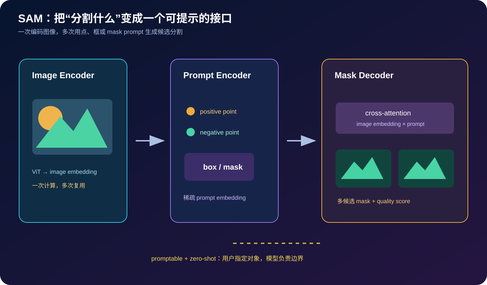
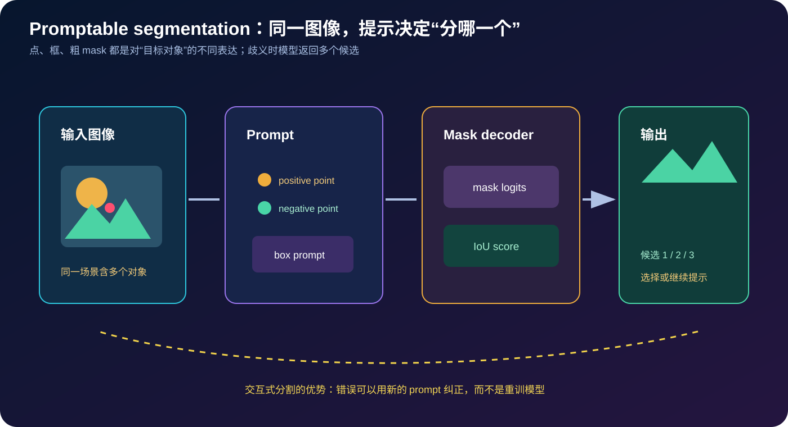
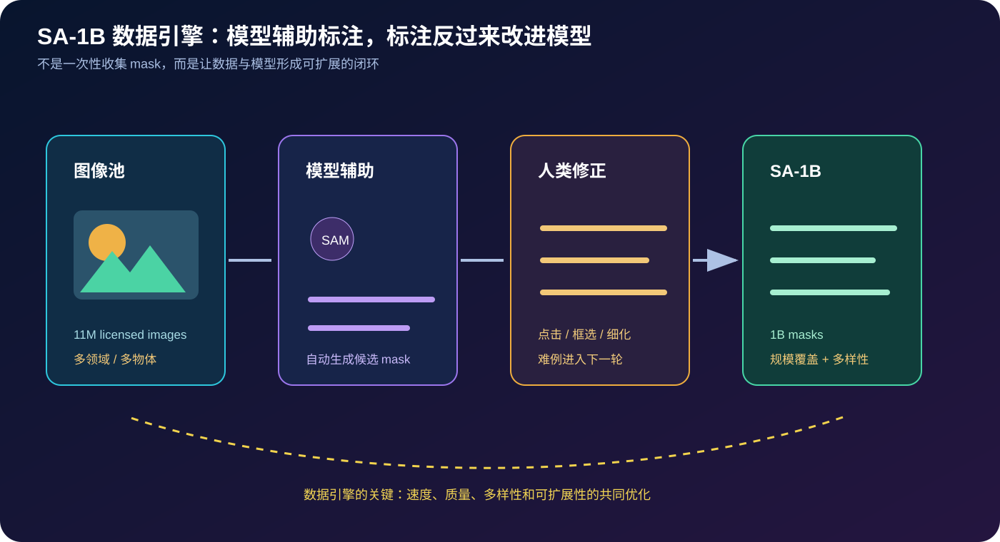

# Segment Anything 原理详解：把图像分割变成一个可提示、可迁移的基础视觉接口


> **论文**：[Segment Anything](https://arxiv.org/abs/2304.02643)<br>
> **作者**：Alexander Kirillov、Eric Mintun、Nikhila Ravi、Hanzi Mao、Chloe Rolland、Laura Gustafson、Tete Xiao、Spencer Whitehead、Alexander C. Berg、Wan-Yen Lo、Piotr Dollár、Ross Girshick<br>
> **版本**：arXiv v1 发布于 2023-04-05；本文按论文 v1 与官方 Segment Anything 实现讲解<br>
> **关键词**：Promptable Segmentation、Foundation Model、Image Encoder、Prompt Encoder、Mask Decoder、SA-1B、Zero-shot Transfer、Interactive Annotation<br>
> **配套代码**：[sam_minimal.py](./code/sam_minimal.py)（零依赖；演示 point/box prompt、候选 mask、稳定性评分与 IoU，不是完整 SAM checkpoint）<br>
> **一手资料**：[arXiv](https://arxiv.org/abs/2304.02643) · [论文 PDF](https://arxiv.org/pdf/2304.02643) · [官方项目页](https://segment-anything.com/) · [官方代码](https://github.com/facebookresearch/segment-anything)

## 0. 先说结论

Segment Anything（SAM）提出的不是一个只在固定类别上输出 mask 的分割器，而是一套新的视觉接口：

> 给定一张图像和一个 prompt（点、框、粗 mask 等），模型输出对应对象的一个或多个候选分割，并给出质量估计；同一图像 embedding 可以被多次复用，支持交互式分割和自动标注。

这套接口由三个组件组成：

1. **Image Encoder**：用较大的 Vision Transformer 把图像编码成高维 embedding；
2. **Prompt Encoder**：把点、框、mask 等提示编码成稀疏/稠密 prompt embedding；
3. **Mask Decoder**：用轻量 Transformer 将 image embedding 与 prompt embedding 融合，输出 mask logits、IoU 预测和多个候选 mask。



论文同时提出 **SA-1B** 数据集与数据引擎：在约 1,100 万张获得许可且注重隐私的图像上构建超过 10 亿个 masks。核心不是单纯收集更多标注，而是让模型辅助标注，人工修正难例，再把新数据反馈给模型，形成可扩展的闭环。

读完本文，至少应记住下面十五点：

1. **SAM 的任务不是“识别这是什么类别”，而是“根据提示分出哪个对象”。**它可以输出没有预定义类别名的 mask。
2. **Promptable 是模型接口。**点、框和已有 mask 都是对目标对象的不同约束方式。
3. **SAM 不是纯 bottom-up proposal generator。**没有 prompt 时，它并不知道用户想要哪个对象；自动 mask generation 是额外的网格提示流程。
4. **图像编码与 mask 解码分离。**高成本 image encoder 可以缓存，交互时只重复轻量 decoder。
5. **Prompt encoder 同时处理稀疏和稠密提示。**点/框是 sparse tokens，mask 是与图像空间对应的 dense embedding。
6. **Mask decoder 返回多个候选是有意设计。**一个点可能落在零件、物体或整体区域，模型用候选 mask 暴露歧义，而不是强行输出一个答案。
7. **IoU head 是质量估计，不是绝对真值。**它帮助排序候选 mask，但仍需阈值、人工检查或下游评测。
8. **SA-1B 是模型与数据引擎共同产物。**自动、辅助和手工标注阶段互相促进，而不是一次性众包完成。
9. **零样本迁移的对象是分割接口。**论文展示跨数据分布与任务的迁移，但不意味着任意细粒度医学/工业边界都无需适配。
10. **分割质量和语义理解不同。**SAM 可以把物体边界分得很好，却未必知道它是什么、是否属于某个业务类别。
11. **高分辨率图像编码成本很高。**缓存 embedding 是交互部署的关键；在大规模视频上还要考虑时序一致性。
12. **“Anything”不是“所有场景都完美”。**透明物体、细小文字、遮挡、医学结构、极端长尾和域外图像仍可能失败。
13. **提示工程会改变结果。**点选在哪里、框有多紧、是否加入负点，都会影响边界。
14. **SA-1B 的许可、隐私和代表性仍需单独审查。**大规模数据不自动解决数据治理问题。
15. **SAM 的长期影响是把视觉分割变成可组合基础组件。**它可接入跟踪、检测、编辑、3D、机器人和数据标注管线。

一句话记忆：

> SAM 用一个可复用的图像 embedding、一个通用 prompt 接口和一个轻量 mask decoder，把“分割哪个对象”从固定类别训练目标改写成了交互式条件生成问题。

## 1. 为什么需要“可提示分割”

### 1.1 传统语义/实例分割的固定任务接口

经典语义分割通常学习：

$$
f_\theta(I)\rightarrow Y,
$$

其中每个像素 $Y_{ij}$ 属于预先定义的类别集合。实例分割还要为每个对象输出 mask 和类别。

这种接口对 benchmark 很清晰，却把“要分哪一个对象”写死在训练标签中：

```text
训练：person / car / dog / ...
部署：只能在已知类别和相似分布上预测
```

现实应用往往不是这样。用户可能想分出：

- 一张照片里的任意一个物体；
- 医学图像中的某个结构；
- 工业图像中的裂纹或零件；
- 一段视频中用户刚刚点击的目标；
- 没有类别名、但边界清楚的区域。

如果每种对象都重新收集 mask 并训练模型，视觉系统就难以扩展。

### 1.2 “Anything”重新定义了输出协议

SAM 将任务改写为：

$$
M=\operatorname{SAM}(I,p),
$$

其中 $I$ 是图像，$p$ 是 prompt，$M$ 是一个或多个 mask。类别名不是必需输入，用户只需给出位置或粗略区域。

这很像语言模型中的 promptable interface：模型先学习通用表示，任务细节由输入条件指定。

### 1.3 为什么 prompt 可以替代类别标签

类别标签回答的是：

```text
这个像素属于哪一类？
```

prompt 回答的是：

```text
我指的是图中的哪一个区域/对象？
```

前者需要固定 ontology，后者允许开放世界的目标选择。SAM 仍然可以与分类器、检测器结合：检测器提供 box，SAM 将 box 转成精细 mask；分类器负责语义，SAM 负责边界。

## 2. SAM 的整体架构

### 2.1 Image Encoder：高成本、可缓存

给定图像 $I$，图像编码器生成：

$$
E_I=\operatorname{ImageEncoder}(I).
$$

论文使用 ViT 风格的图像编码器，将图像划分为 patch token，再通过 Transformer 建模全局关系。它的职责是提供可供不同 prompt 查询的视觉表示，而不是直接输出某个类别的 mask。

实际交互中，一张图只需要做一次：

```text
I → image encoder → E_I（缓存）
```

之后每次点击、拖框或加入负点，只运行 prompt encoder 和 mask decoder。

### 2.2 Prompt Encoder：稀疏与稠密两类提示

点和框属于稀疏提示：

$$
E_p^{\text{sparse}}=\operatorname{PromptEncoder}(\text{points},\text{boxes}).
$$

mask 属于稠密提示：它与图像空间对齐，经过卷积/下采样后得到：

$$
E_p^{\text{dense}}=\operatorname{PromptEncoder}(\text{mask}).
$$

点通常带有正/负标签：

- 正点：这个位置属于目标；
- 负点：这个位置不属于目标。

框提供目标的粗空间范围。已有 mask 可作为下一轮 refinement 的输入。

### 2.3 Mask Decoder：轻量、重复运行

mask decoder 接收 image embedding、prompt embedding 和可学习的 mask tokens：

$$
Z=\operatorname{MaskDecoder}(E_I,E_p).
$$

输出包括：

1. 多个低分辨率 mask logits；
2. 每个 mask 的 predicted IoU/质量分数；
3. 上采样到原始图像大小的 mask。



## 3. Prompt encoder 的细节直觉

### 3.1 点提示与位置编码

点不只是一个二元标签，它还包含归一化坐标 $(x,y)$。模型需要同时知道：

- 位置在哪里；
- 该点是前景还是背景；
- 多个点之间如何组合。

因此点 embedding 可以抽象成：

$$
e_{\text{point}}=e_{\text{pos}}(x,y)+e_{\text{label}}(l).
$$

框可以由左上/右下两个角点编码，并附加 box-corner 类型 embedding。

### 3.2 mask prompt 与 image embedding 对齐

稠密 mask prompt 不能只压成一个全局向量，否则会丢失边界位置。它通常被下采样并与 image embedding 在空间上融合：

$$
E_p^{\text{dense}}(u,v)
\quad\text{与}\quad
E_I(u,v)
$$

在同一坐标系中交互。

### 3.3 没有 prompt 时会发生什么

没有 prompt 时，SAM 不知道用户要哪个对象。官方的自动 mask generator 会在图像上采样密集网格点，把每个点当成 prompt，再使用质量预测、稳定性和 NMS 等策略筛选重复 mask。

因此“自动分割整张图”其实是：

```text
网格 prompts → 多次 SAM 解码 → quality/stability filtering → mask 去重
```

## 4. Mask decoder 与多候选输出

### 4.1 一个点存在天然歧义

点击一个人脸，目标可能是：

- 鼻子；
- 脸部；
- 整个人；
- 包含衣服的前景主体。

如果模型只输出一个 mask，它必须把歧义隐藏在一个选择中。SAM 设计为输出多个 mask 候选，并为每个候选预测质量。

### 4.2 解码的抽象形式

令 image token 为 $X$，prompt token 为 $P$，mask token 为 $q_k$：

$$
H=\operatorname{TwoWayTransformer}(X,P,q_k),
$$

$$
M_k=\operatorname{Upsample}(H_k),
\qquad
\hat q_k=\operatorname{IoUHead}(H_k).
$$

`TwoWayTransformer` 的直觉是：prompt 读取图像，图像 token 也读取 prompt，使“我要分的目标”与“图像中有哪些边界”双向交互。

### 4.3 质量分数不是概率校准

predicted IoU 主要用于排序候选 mask。它可能在训练分布内有用，却不一定在新域上校准。生产应用应把它和：

- prompt 稳定性；
- mask 面积异常；
- 边界质量；
- 下游分类/跟踪一致性；
- 人工反馈；

一起使用。

## 5. 训练目标：从提示重建真实 mask

### 5.1 Prompt 采样

训练时从真实 mask $M^*$ 采样模拟 prompt：

- 在 mask 内采样正点；
- 在 mask 外采样负点；
- 根据 mask 生成 box；
- 使用粗 mask 或低分辨率 mask 作为 refinement 条件。

模型学习：

$$
\hat M=\operatorname{SAM}_\theta(I,p),
$$

使预测 mask 与真实 mask $M^*$ 对齐。

### 5.2 Mask loss 与 IoU 质量损失

一个抽象训练目标为：

$$
\mathcal L
=\lambda_{\text{mask}}\mathcal L_{\text{mask}}(\hat M,M^*)
+\lambda_{\text{iou}}\mathcal L_{\text{iou}}(\hat q,\operatorname{IoU}(\hat M,M^*)).
$$

mask loss 可以包含 focal、dice 或其他像素级损失；IoU head 则学习估计候选 mask 的质量。

### 5.3 为什么一个 promptable 模型能迁移

训练并不是为每个类别设计独立头，而是不断随机化“怎样提示对象”。模型必须学习：

1. 从图像中找出边界和区域结构；
2. 解释 prompt 的空间意图；
3. 输出与目标 prompt 一致的 mask。

这使得类别名和训练 ontology 不再是分割接口的唯一入口。

## 6. SA-1B 数据引擎



### 6.1 三阶段标注闭环

论文的数据引擎可以理解为三个阶段：

**辅助人工标注**：标注者点击对象，模型实时生成 mask；人工修正边界，效率高于从头描边。

**半自动标注**：模型自动生成容易的 mask，人类负责确认和修正更复杂的对象。

**全自动标注**：在模型足够稳定后，对图像密集采样 prompts，自动生成大量候选 mask，再通过质量和稳定性筛选。

闭环表示为：

```text
模型 → 辅助标注 → 新 mask → 训练模型 → 更强的模型
```

### 6.2 规模与覆盖

论文摘要报告 SA-1B 包含约 1,100 万张图像和超过 10 亿个 masks。规模的意义不只是总数，还包括对象大小、场景、类别和边界形状的多样性。

### 6.3 数据引擎的隐藏假设

模型辅助标注会提高速度，但也会引入反馈偏差：

- 模型更容易标注自己已经擅长的对象；
- 人类可能过度接受模型的默认边界；
- 难例如果没有被主动采样，会在数据中不足；
- 自动生成的 mask 可能把早期错误规模化。

因此数据引擎必须包含难例挖掘、人工审计、跨域采样与质量抽检，而不只是追求 mask 数量。

## 7. 零样本迁移与评测

### 7.1 迁移的含义

SAM 的 zero-shot transfer 指：不针对目标数据集重新训练 mask 模型，只用点、框或其他 prompt 运行模型。评测可以覆盖：

- 不同图像分布；
- 不同对象类别；
- 不同分割任务；
- 不同 prompt 类型。

这和“所有任务都无需任何工程适配”不同。输入预处理、prompt 生成和后处理仍可能需要针对场景设计。

### 7.2 IoU 与边界质量

常见 mask 指标为：

$$
\operatorname{IoU}(M, M^*)
=\frac{|M\cap M^*|}{|M\cup M^*|}.
$$

边界精细的任务还需要 boundary IoU、边缘 F-score 或 contour distance。一个大物体的 IoU 很高，并不代表边缘细节精确；一个很小的物体，几个像素偏差就可能显著影响 IoU。

### 7.3 Prompt 质量是评测变量

同一模型的结果会受以下因素影响：

- 正点是否位于目标中心；
- 框是否紧或包含背景；
- 负点是否放在混淆对象上；
- 点的数量和顺序；
- 是否允许多候选输出。

严谨评测应固定 prompt 采样协议，并报告交互轮数，而不是只展示最容易的单点结果。

## 8. 轻量教学代码：prompt → mask → quality

配套代码用高斯软区域代替真实 ViT embedding 和 mask decoder，演示接口而不是伪造模型效果：

```python
prompt = [Point(0.47, 0.48, 1), Point(0.2, 0.2, 0)]
box = Box(0.2, 0.2, 0.8, 0.8)
candidates = candidate_masks(prompt, box)
best_mask, stability = candidates[0]
```

运行：

```bash
python3 papers/to-2026/code/sam_minimal.py --test
python3 papers/to-2026/code/sam_minimal.py
```

代码覆盖：

- 正/负点 prompt；
- box prompt；
- 低分辨率 mask 生成与最近邻上采样；
- 多候选 mask；
- threshold stability score；
- IoU 计算。

真实 SAM 还需要：

- ViT image encoder；
- positional embedding 和 prompt embedding；
- two-way Transformer mask decoder；
- hypernetwork 生成 mask logits；
- GPU 推理、模型权重和自动 mask generator；
- NMS、区域过滤和图像后处理。

## 9. 常见误解

### 9.1 “SAM 是目标检测器”

SAM 不负责给每个区域命名，也不保证自动发现所有对象。它擅长在 prompt 指定后产生 mask。要做“找出所有汽车并分类”，通常需要检测器/分类器与 SAM 组合。

### 9.2 “一个正点就能精确分割任何对象”

正点只提供局部约束。遮挡、重叠、细长结构和相邻同类对象可能需要负点、框或多轮交互。

### 9.3 “mask score 就是置信度”

质量 head 的分数需要在目标域校准。域外图像上高分不一定对应高 IoU。

### 9.4 “SA-1B 越大，所有领域越公平”

规模并不自动等于代表性。医学、工业、卫星、低资源地区或隐私敏感场景可能在数据中不足，且标注策略可能偏向容易被模型识别的对象。

### 9.5 “自动 mask generator 等于无提示分割”

它是通过密集网格 prompt 近似无提示流程，再依赖质量、稳定性和去重筛选。计算量和误检会随网格密度增长。

## 10. SAM 与其他视觉基础模型的关系

| 模型/范式 | 条件入口 | 输出 | 主要能力 |
|---|---|---|---|
| 分类模型 | 图像 | 类别 logits | 固定 ontology 分类 |
| 检测模型 | 图像 | box + 类别 | 找对象并命名 |
| CLIP | 图像 + 文本 | 相似度 | 开放词汇匹配 |
| SAM | 图像 + 点/框/mask | 像素 mask | promptable 边界分割 |
| Grounded-SAM | 文本/检测框 + SAM | 命名对象 mask | 语义定位 + 精细分割 |

SAM 的可组合性正是它的价值：检测器或文本模型负责“是什么/在哪里”，SAM 负责“精确边界在哪里”。

## 11. 工程实践清单

### 11.1 交互式标注

- 缓存 image embedding，避免每次点击重复编码；
- 先用正点，再用负点处理混淆区域；
- 对多个候选 mask 显示面积、质量和边界；
- 记录每一轮 prompt 和人工修改，用于审计；
- 对细小对象放大显示，不只依赖低分辨率预览。

### 11.2 视频与跟踪

- 逐帧独立分割可能产生闪烁；
- 需要结合 tracker、光流或视频模型维护时序一致性；
- 场景切换和遮挡时重新 prompt；
- 记录对象 ID 与 mask 版本，避免错误传播。

### 11.3 高风险场景

医疗、法证、自动驾驶和工业质检中，SAM 输出应被视为候选辅助结果：

- 展示不确定性与失败案例；
- 保留原图、prompt、模型版本和 mask；
- 人工确认关键边界；
- 评估漏分、误分和边界偏差，而不只看平均 IoU。

## 12. 影响与后续方向

SAM 推动了几条研究与工程路线：

1. **Grounded segmentation**：文本/检测器提供语义 prompt，SAM 提供 mask；
2. **开放词汇视觉**：类别不再是 mask 模型的固定头；
3. **交互式标注工具**：模型成为标注助手而非只在训练后部署；
4. **视频/3D/医学扩展**：把 promptable 接口带到新的空间和模态；
5. **数据引擎**：基础模型与标注系统共同生成训练数据。

同时也暴露了新的问题：如何衡量 prompt 交互成本、如何控制自动标注反馈偏差、如何在域外场景校准 mask 质量，以及如何治理大规模视觉数据。

## 13. 思考题

1. 为什么 SAM 需要返回多个候选 mask，而不是只预测一个最优 mask？
2. 如果 box prompt 很松，模型应扩大目标还是排除背景？这种偏好由什么训练信号决定？
3. 如何把 CLIP 的文本语义与 SAM 的像素边界连接起来？Grounded-SAM 会有哪些误差传递？
4. SA-1B 的自动标注闭环可能放大哪些早期模型偏差？如何设计难例采样？
5. 对透明物体或细线结构，IoU 为什么可能不是充分指标？
6. 如果图像 embedding 可缓存，如何设计多用户交互服务的显存与隐私隔离？

## 14. 总结

Segment Anything 的贡献可以归纳为三层：

1. **任务层**：把固定类别分割改写成 promptable segmentation；
2. **模型层**：用 image encoder、prompt encoder 和轻量 mask decoder 解耦高成本视觉表示与交互查询；
3. **数据层**：用模型辅助标注的数据引擎构建 SA-1B，推动分割基础模型的规模化训练。

其核心抽象是：

$$
\text{图像 embedding}
+\text{prompt embedding}
\xrightarrow{\text{mask decoder}}
\text{候选区域 mask + 质量估计}.
$$

SAM 并没有让所有图像分割问题自动解决，也没有替代检测、分类、跟踪和领域验证；它提供的是一个更开放、更可组合的像素级接口。理解这一点，才能在实际系统中正确使用它：让上游模型指定语义，让 SAM 精细化边界，让人工与质量审计负责最后的可信度。

## 参考资料

1. Kirillov, A. et al. (2023). [Segment Anything](https://arxiv.org/abs/2304.02643).
2. [Segment Anything 官方项目页](https://segment-anything.com/).
3. [官方代码仓库](https://github.com/facebookresearch/segment-anything).
4. [SA-1B 数据集页面](https://ai.meta.com/datasets/segment-anything/).
5. Kirillov, A. et al. (2019). [Panoptic Segmentation](https://arxiv.org/abs/1801.00868).
