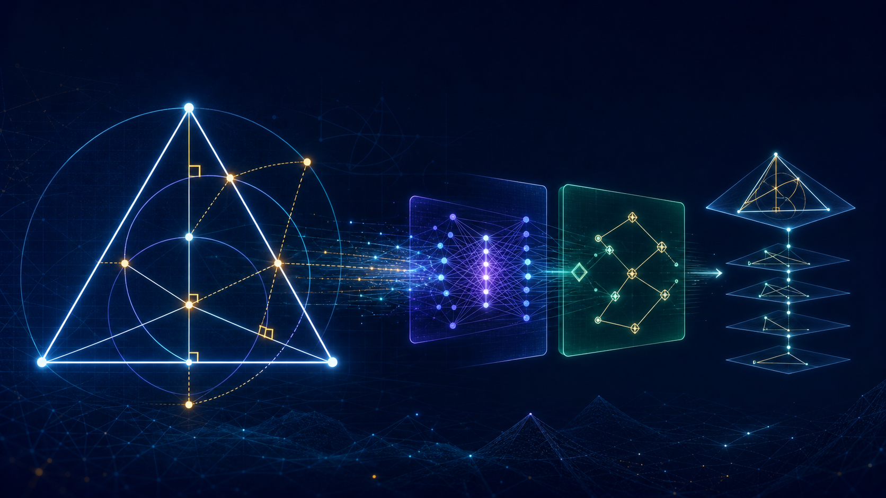
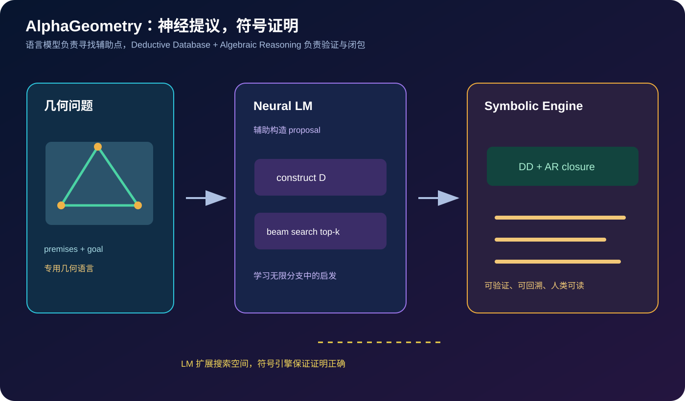
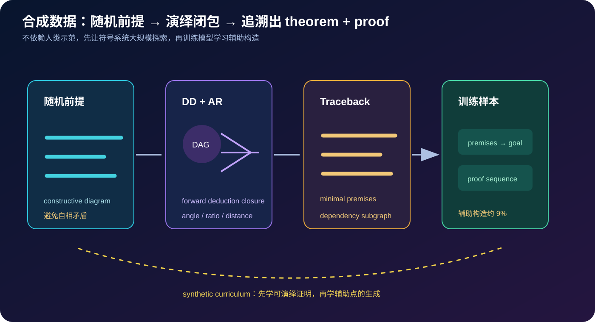
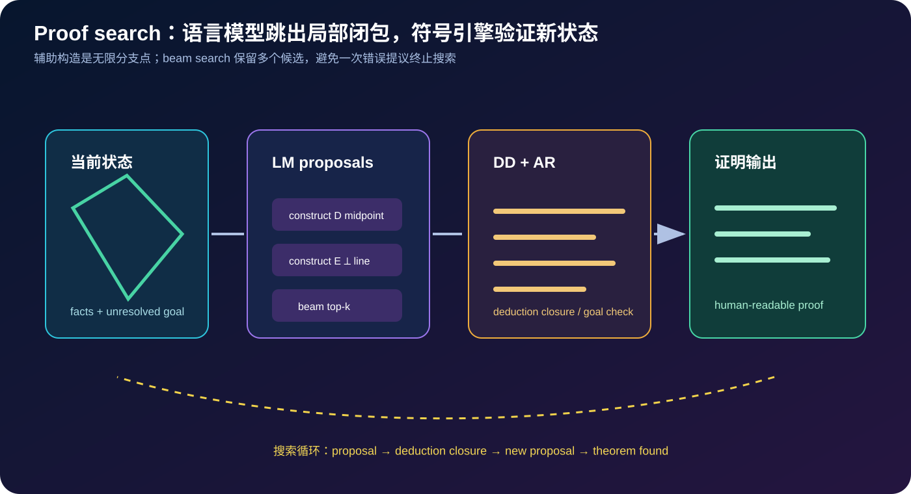

# AlphaGeometry 原理详解：让语言模型提出辅助线，让符号系统完成证明



> **论文**：[Solving Olympiad Geometry without Human Demonstrations](https://www.nature.com/articles/s41586-023-06747-5)<br>
> **作者**：Trieu H. Trinh、Yuhuai Wu、Quoc V. Le、He He、Thang Luong<br>
> **发表**：Nature 625, 476–482（2024）；arXiv 版本于 2024 年前后公开传播<br>
> **关键词**：Neuro-symbolic Reasoning、Euclidean Geometry、Deductive Database、Algebraic Reasoning、Auxiliary Construction、Synthetic Data、Beam Search、Theorem Proving<br>
> **配套代码**：[alpha_geometry_minimal.py](./code/alpha_geometry_minimal.py)（零依赖；演示 Horn 式演绎闭包、辅助点 proposal、beam search 和可回溯证明，不是完整系统复现）<br>
> **一手资料**：[Nature 正式论文](https://www.nature.com/articles/s41586-023-06747-5) · [论文 PDF](https://www.nature.com/articles/s41586-023-06747-5.pdf) · [arXiv](https://arxiv.org/abs/2312.11829) · [DeepMind 项目介绍](https://deepmind.google/discover/blog/ai-solves-imo-geometry-problems-at-silver-medal-level/)

## 0. 先说结论

AlphaGeometry 不是让一个大型语言模型直接“写出一篇几何证明”，而是把问题拆成两个互补的角色：

> 神经语言模型负责在无限多的辅助构造中提出有希望的候选；符号推理引擎负责在每个候选之后穷举可达事实、检查代数关系，并输出机器可验证的证明。

核心闭环是：

```text
几何前提 + 目标
      ↓
符号引擎 DD + AR 做 deduction closure
      ↓ 目标仍未到达
神经语言模型提出辅助点/辅助线
      ↓ beam search 保留多个候选
把新构造加入状态
      ↓
DD + AR 再次闭包与回溯
      ↺ 直到证明目标或耗尽搜索预算
```



论文解决的难点不是“角度相等如何推导”这么简单，而是**辅助构造的开放式搜索**：人类会想到作中线、作平行线、作垂线、取圆心或引入交点，但专门的符号引擎通常只能在已有对象和规则中前向推导，无法凭空生成新对象。

论文的关键事实：

- 从随机生成的几何前提出发，使用符号引擎合成超过 1 亿条定理与证明；
- 其中约 9% 的证明包含辅助构造；
- 在 IMO-AG-30（30 道可翻译到该几何环境的奥赛几何题）上解决 25 题；
- 前一最佳方法解决 10 题，加入代数推理和人工启发式的强基线解决 18 题；
- AlphaGeometry 解决了 2000、2015 年等关键年份的几何题，并生成可读、可验证的证明。

读完本文，至少应记住下面十五点：

1. **AlphaGeometry 是 neuro-symbolic system，不是纯 LLM 数学问答。**神经模型提出候选，符号引擎决定候选是否真的成立。
2. **几何数据稀缺的根因是形式化困难。**自然语言图形题很难直接翻译成 Lean 等通用形式系统。
3. **系统采用专用 Euclidean geometry language。**它覆盖经典平面几何中的点、线、圆、共线、垂直、等长、角度和比值等关系。
4. **Deductive Database（DD）负责 Horn 式规则闭包。**它从前提快速推出所有可达的几何事实。
5. **Algebraic Reasoning（AR）补充角度、距离、比例和线性关系的追逐。**仅有离散几何规则不够解决奥赛题。
6. **辅助构造是 exogenous term generation。**生成一个新点会带来近乎无限的分支，正是神经模型发挥作用的地方。
7. **合成数据不使用人类题面作为训练前提。**随机采样构造，再由符号系统生成可验证 theorem/proof。
8. **Dependency difference 找出真正需要的辅助对象。**从结论回溯最小依赖子图，把不直接属于结论的对象交给模型学习生成。
9. **训练分两阶段。**先在约 1 亿条合成证明上预训练，再在包含辅助构造的约 900 万条子集上微调。
10. **推理不是一次生成整篇证明。**模型每轮只提出一个新的辅助构造，DD+AR 随后扩张闭包。
11. **Beam search 对无限分支做有限近似。**保留 top-k 构造，降低一次错误 proposal 终止搜索的风险。
12. **证明可读性来自符号引擎。**语言模型本身可能生成语法或语义错误，最终证明必须通过形式规则验证。
13. **25/30 不等于解决所有 IMO。**测试集只包含能翻译到该专用几何环境的经典平面几何题，不包括组合几何、几何不等式等类型。
14. **系统的工具箱比人类更窄。**它主要使用几何与代数规则，不直接使用复数等人类常见技巧，因此覆盖和证明风格都有边界。
15. **论文的可迁移贡献是数据与搜索框架。**在形式化数据稀缺的数学领域，先用程序生成可验证课程，再学习不可穷举的构造动作。

一句话记忆：

> AlphaGeometry 用符号系统保证“每一步是真的”，用神经模型负责“下一条辅助线可能在哪里”，再用合成证明数据训练模型学会提出这些新对象。

## 1. 为什么奥赛几何难于机器学习

### 1.1 几何题不只是判定一个公式

很多形式数学任务可以写成：

$$
\text{给定公理与前提 }P，证明目标 N.
$$

几何题还包含图形对象、空间关系、构造动作和非退化条件。一个人类题面可能说：

```text
在三角形 ABC 中，作某条角平分线与外接圆交于 D，证明……
```

机器需要知道：

- 点、线、圆的对象是什么；
- “交于”产生哪些新点；
- 哪些点不能重合；
- 角、距离、方向和比例如何表示；
- 图形的拓扑和几何一致性怎样保证。

### 1.2 形式化数据稀缺

神经定理证明通常依赖大量人类证明或形式库。然而几何题存在双重瓶颈：

1. 人类证明是自然语言、图形和隐含常识的混合体；
2. 把它翻译成机器可验证语言需要大量领域专家。

因此论文没有先等待百万条人类形式证明，而是设计了一个可以随机生成一致前提、再由符号系统生成 proof 的数据引擎。

### 1.3 辅助构造造成无限分支

如果只允许使用已有点，符号引擎可以枚举规则；但奥赛几何的关键往往是：

- 作一个中点；
- 过某点作平行线；
- 作垂线并取交点；
- 引入圆心、外心、内心、重心；
- 延长边或构造等长点。

设当前状态有 $n$ 个对象，允许的构造动作数量可能随对象组合快速增长；而新对象产生后，又会创造更多动作。搜索树近似具有开放分支：

$$
\text{state}
\rightarrow
\{\text{construct }X_1,\text{construct }X_2,\ldots\}.
$$

专门写规则可以覆盖常见套路，却很难穷尽人类几何经验。

## 2. AlphaGeometry 的几何表示语言

### 2.1 专用语言而不是直接使用通用证明器

论文采用类似 GEX/JGEX/GeoLogic 的专用几何环境。原因是通用 Lean 等形式语言要表达几何中的图形、非退化和空间关系，前置工程量很大。

几何语言可以表达：

- `collinear(A,B,C)`：三点共线；
- `perpendicular(A,B,C,D)`：两线垂直；
- `equal(AB,CD)`：线段等长；
- `angle(A,B,C)=angle(D,E,F)`：角相等；
- `midpoint(D,B,C)`：D 是 BC 的中点；
- 点在圆上、圆心、切线、平行与交点。

### 2.2 从题面到符号状态

形式化后的问题可抽象为：

$$
\mathcal P=(P,N),
$$

其中 $P$ 是初始 premises，$N$ 是待证明 conclusion。proof 是一串动作：

$$
P\xrightarrow{a_1}P_1\xrightarrow{a_2}P_2\cdots\xrightarrow{a_T}N.
$$

有些动作是纯 deduction：从已有事实推出新事实；有些动作是 construction：创建新的点或几何对象。

### 2.3 不是所有 IMO 几何都能表示

论文构建的 IMO-AG-30 只包含能够翻译进这套经典平面几何环境的问题。论文指出，大约 75% 的相关 IMO 几何题可以适配；几何不等式、组合几何和依赖更一般数学工具的题目不在范围内。

这个限制不是瑕疵，而是重要的实验边界：机器解出的“25/30”必须和题目翻译协议一起解读。

## 3. Deductive Database：把已知事实闭包化

### 3.1 Horn clause 规则

DD 使用类似 definite Horn clause 的规则：

$$
Q(x)\leftarrow P_1(x),P_2(x),\ldots,P_k(x).
$$

例如：

```text
midpoint(D,B,C) -> equal(B,D,D,C)
midpoint(D,B,C) -> collinear(B,D,C)
equal(B,D,D,C) ∧ collinear(B,D,C) -> D_is_center_of_BC
```

给定当前事实集合 $F$，引擎不断加入规则右侧结论，直到达到 fixed point：

$$
\operatorname{Closure}(F)=F^*.
$$

### 3.2 为什么闭包比让 LLM 自己“解释”可靠

语言模型可能输出看似合理但不成立的句子；DD 只接受规则前提真正满足的结论。这样每个 proof step 都有父节点，可以回溯成有向无环图。

### 3.3 只靠 DD 不够

DD 很适合：

- 共线、平行、垂直等关系传播；
- 等长、圆周、对称等模式规则；
- 从已知对象做快速 closure。

但许多奥赛题需要：

- 角度追逐；
- 比值和距离关系；
- 多个线性方程组合；
- 需要新对象才能触发的代数关系。

因此 AlphaGeometry 加入 Algebraic Reasoning（AR），在 DD 闭包基础上做角、比、距离和线性算术推理。

## 4. Algebraic Reasoning：补上角度与比例的缺口

### 4.1 为什么离散规则不够

假设已知：

$$
\angle A=30^\circ,\quad
\angle B=70^\circ.
$$

要推出：

$$
\angle C=80^\circ,
$$

这不是一个单一的“若 A 且 B 则 C”几何模板，而是数值关系：

$$
\angle C=180^\circ-\angle A-\angle B.
$$

同样，长度、比例和相似三角形也需要代数消元。AR 通过把可用关系编码为线性算子并进行闭包，补充 DD 的规则推理。

### 4.2 DD + AR 的交替闭包

系统反复执行：

```text
DD 推出结构关系
  ↓
AR 推出角度/距离/比例关系
  ↓
新关系再次触发 DD
  ↓
直到 closure 不再增长
```

这比只运行一次 algebra solver 更接近几何证明中的相互触发。

## 5. 合成数据生成：不用人类示范也能训练



### 5.1 随机采样一致的构造前提

系统不是随机写一堆互相矛盾的事实，而是使用 constructive diagram builder：一次加入一个几何构造动作，从而保持图形的一致性。

例如：

```text
构造三角形 ABC
构造 D 为 BC 的中点
构造过 A 的垂线
构造与圆相交的点 E
```

每个动作产生新的对象与可用关系，随后 DD+AR 计算其可达结论。

### 5.2 从闭包 DAG 回溯最小问题

给定 closure 中的某个结论节点 $N$，系统沿父节点回溯，得到它真正依赖的最小子图：

$$
G(N)=\operatorname{Traceback}(N).
$$

于是形成训练样本：

$$
(P,N,G(N))
$$

即：最小 premises、目标结论和一条可验证 proof。

### 5.3 Dependency difference：发现辅助构造

关键观察是：结论 $N$ 的依赖对象和原始前提对象之间的差异，往往正是证明中需要新增的辅助对象。

如果证明最终使用点 D，但 D 并非目标结论本身需要的对象，那么把 D 作为需要生成的 proof term，训练语言模型学习“什么时候应该构造 D”。

这一步把辅助构造从硬编码 heuristic 变成了神经模型可以学习的动作。

### 5.4 规模与课程

论文报告：

- 生成超过 1 亿条去重后的合成定理与证明；
- 约 9% 包含辅助构造；
- 最长合成证明可达到 247 步；
- 先用全部合成数据预训练语言模型；
- 再用约 900 万条含辅助构造样本微调。

这种课程很重要：如果一开始只训练辅助点，模型不知道符号引擎会怎样响应；先学习 DD+AR 的输出，再学习如何扩展状态，能让 proposal 更贴合底层引擎。

## 6. 神经语言模型学的是什么

### 6.1 序列化 theorem 与 proof

系统把符号状态序列化成文本：

```text
<premises> <conclusion> <proof>
```

语言模型通过 next-token prediction 学习几何语法、对象命名和辅助构造模式。

它不是直接学习“答案是 42”，而是学习条件分布：

$$
p_\theta(a_{t+1}\mid P,N,a_{\le t}),
$$

其中 $a_{t+1}$ 是下一个构造动作。

### 6.2 为什么要 fine-tune 辅助构造子集

纯 deduction proof 数量很大，适合让模型熟悉符号引擎；但推理时真正稀缺、最有价值的是辅助构造。于是微调数据聚焦于：

```text
当前事实闭包 + 未证明目标 → 下一条辅助构造
```

这和把一个通用语言模型微调成工具调用器很相似：重点不是重新学习所有知识，而是学习何时生成能改变状态空间的动作。

## 7. Proof search：交替展开而不是整篇自由生成



### 7.1 一轮搜索

当前状态包含：

$$
S_t=(F_t,\text{history}_t),
$$

其中 $F_t$ 是已知事实闭包。系统执行：

1. DD+AR 计算 closure；
2. 如果目标在 closure 中，结束；
3. 语言模型提出候选辅助构造；
4. 选择 top-k proposal；
5. 把每个 proposal 加入状态，进入下一轮。

### 7.2 Beam search 的作用

如果每轮只选概率最高的一个构造，一次错误就会让后续搜索走偏。beam search 保留 $k$ 个状态：

$$
\mathcal B_{t+1}
=\operatorname{TopK}\left(
\{\operatorname{Expand}(S,a):S\in\mathcal B_t,a\in\operatorname{Proposals}(S)\}
\right).
$$

论文实验显示，降低 beam size 会损失部分性能，但即使使用远低于完整预算的搜索，也能保持较强结果。这说明模型 proposal 并非完全随机。

### 7.3 证明终止条件

搜索在两种情况下停止：

- DD+AR closure 已包含目标结论；
- 达到最大轮数或搜索预算。

只有第一种情况才输出证明。这样自然语言模型即使产生语法正确但数学错误的 proposal，也会被符号引擎拒绝。

## 8. 最小教学代码

配套脚本用一个极小的几何规则集展示同样的分工：

```python
facts, proof = deductive_closure({"midpoint(D,B,C)"})
assert "equal(B,D,D,C)" in facts
assert "collinear(B,D,C)" in facts

result = prove({"triangle(A,B,C)"}, "collinear(B,D,C)")
```

运行：

```bash
python3 papers/to-2026/code/alpha_geometry_minimal.py --test
python3 papers/to-2026/code/alpha_geometry_minimal.py
```

脚本包含：

- Horn-style forward chaining；
- `ProofState` 事实与证明轨迹；
- 一个确定性的 proposal 函数代替真实语言模型；
- top-k beam search；
- 构造 midpoint 后由符号规则推出等长和共线；
- 目标未达成时返回失败而不是伪造证明。

它不实现真实的几何坐标、角度代数、Transformer 或 1 亿条合成数据，目的是让“提议—验证—闭包—回溯”的系统边界可运行、可测试。

## 9. 评测：25/30 应如何解读

### 9.1 IMO-AG-30

论文构建了 30 道经典 IMO 几何问题的专用翻译基准。AlphaGeometry 解决 25 题，前一最佳方法解决 10 题，DD+AR 加人工启发式的强基线解决 18 题。

组件增量也很有说明力：

- DD：14 题；
- DD + AR：增加到 14 题（代数推理带来 7 题增益的总体比较需结合论文表格口径理解）；
- 完整系统加入语言模型辅助构造：25 题。

更稳妥的核心结论是：代数引擎和神经辅助构造各自贡献了明显能力，最终 25/30 显著超过纯符号或人工启发式基线。

### 9.2 人类金牌水平比较

论文把机器的 0/1 解题结果与 IMO 人类分数按比例映射比较，并由有经验的美国 IMO 教练评审 AlphaGeometry 在 2000、2015 年等题目的证明，认为其可获得满分级别评价。

但这不是严格同场比赛：

- 人类解决完整 IMO，包含代数、数论、组合等题型；
- AlphaGeometry 只处理可翻译的经典几何；
- 人类受 4.5 小时与无计算器约束，机器使用并行搜索；
- 输入形式是专用符号题面，不是自然语言原题。

### 9.3 更大测试集

在包含课本练习、地区奥赛和著名定理的 231 题集合上，论文报告 AlphaGeometry 解出约 98.7%，但这一结果仍应结合题型和翻译环境理解，不能泛化为“AI 已解决几何”。

## 10. 与其他证明方法的关系

| 方法 | 核心机制 | 优点 | 局限 |
|---|---|---|---|
| Wu / Gröbner bases | 坐标化、多项式消元 | 理论完备性较强 | 证明可能巨大且不人类化 |
| 纯 DD/规则系统 | 前向符号闭包 | 快、可验证、可解释 | 不能自由创建辅助对象 |
| 人工启发式搜索 | 模板化辅助构造 | 对熟悉套路有效 | 覆盖有限、人工维护 |
| GPT 类 LLM 直接证明 | 自回归自然语言 | 表达灵活 | 易出现语法/语义幻觉，难验证 |
| AlphaGeometry | LM proposal + DD + AR | 兼顾搜索、验证与可读性 | 受专用语言和搜索预算限制 |

AlphaGeometry 的核心不是让神经网络取代符号系统，而是把神经模型放在最适合它的位置：搜索开放动作；把形式验证交给最可靠的规则与代数引擎。

## 11. 常见误解

### 11.1 “AlphaGeometry 读懂了人类自然语言几何题”

论文使用的是经过翻译的专用几何表示。翻译本身是重要前置工作，且只覆盖部分题型。自然语言到形式几何的完整自动化仍是独立难题。

### 11.2 “语言模型证明了定理”

语言模型提出辅助构造；最终证明步骤由 DD+AR 验证。若 proposal 不能让符号闭包抵达目标，就不会成为有效证明。

### 11.3 “合成数据不含人类信息，所以没有先验”

系统的规则、几何语言、构造动作和代数引擎都由人类设计。没有人类证明示范，不等于没有人类结构先验。

### 11.4 “25/30 说明已经超过 IMO 金牌选手”

论文说它在特定几何测试和人类专家评审下接近/达到平均金牌水平。不能将这一结果外推到完整 IMO 或所有数学领域。

### 11.5 “无限辅助构造可以靠更大 beam 完全解决”

beam search 只是有限近似。候选质量、搜索预算、重复状态、证明长度和引擎覆盖都会影响结果。

## 12. 数据生成、形式化与可验证性的启示

AlphaGeometry 对数学 AI 的价值至少有三层：

### 12.1 合成数据可以是能力课程

只要规则系统足够可靠，就能生成：

```text
随机前提 → 真实 closure → 目标节点 → traceback proof
```

这样的数据比无验证的自然语言数学答案更适合作为训练信号，因为每一步都能重新执行。

### 12.2 模型学习搜索动作而不只是答案

辅助构造属于改变状态空间的 action。让模型预测 action 比让它一次性生成完整证明更容易与符号执行对接，也更适合 beam search、工具调用和失败重试。

### 12.3 可读证明是调试接口

如果神经模型只输出一个成功率，研究者很难知道它是发现了新思路还是利用了漏洞。AlphaGeometry 的 proof trace 可以：

- 检查每一步依赖；
- 找出无用前提；
- 发现更一般的定理；
- 让人类专家审阅证明；
- 定位搜索失败的位置。

## 13. 局限与未来方向

### 13.1 几何语言的表达边界

专用表示带来高效验证，也限制了题型覆盖。未来需要更强的几何形式化、自然语言到形式图形的翻译和与 Lean 等通用证明器的桥接。

### 13.2 证明风格与人类不同

AlphaGeometry 常用较低级的工具箱，证明可能很长、很机械。短证明不一定更正确，长证明也不一定更接近人类洞察；如何优化可读性是另一项研究问题。

### 13.3 搜索成本

并行 beam search、符号闭包和大量候选构造都需要算力。实际部署要报告 wall-clock、并行 worker、beam size 和超时策略，而不是只报解题数。

### 13.4 训练/测试污染与题库记忆

论文的合成训练数据避免使用人类设计的题目作为 premises，但真实评测仍应关注公开题目、翻译表示和相关定理是否可能出现在其他模型预训练数据中。

## 14. 思考题

1. 为什么“辅助构造”比普通的角度推理更适合交给语言模型？
2. 如果 DD+AR 已经足够强，语言模型最有价值的输出是什么？
3. 如何设计不会自相矛盾的随机几何前提生成器？
4. `dependency difference` 怎样帮助识别证明中真正的新对象？
5. 机器使用 512 beam 并行搜索与人类在 4.5 小时内解题，怎样做公平比较？
6. 在代数、数论或程序验证中，什么对应于几何的 auxiliary construction？

## 15. 总结

AlphaGeometry 的核心贡献可以归纳为四层：

1. **表示层**：用专用几何语言把点、线、角度、距离和构造动作形式化；
2. **符号层**：用 DD+AR 快速计算可验证的几何与代数闭包；
3. **神经层**：在合成 theorem/proof 上训练语言模型提出辅助构造；
4. **搜索层**：用 beam search 交替扩展状态、验证 closure，直到目标可证明。

最终抽象是：

$$
\text{神经启发式搜索}
+\text{符号验证}
+\text{可验证合成数据}
\Longrightarrow
\text{可读的几何证明}.
$$

它展示了一条非常有价值的数学 AI 路线：当人类示范稀缺、形式化成本高、搜索空间存在无限分支时，不必在“纯神经生成”和“纯手写规则”之间二选一；可以让程序生成可验证课程，让神经模型学习开放式动作，再让符号系统把创造性建议约束在正确证明之内。

## 参考资料

1. Trinh, T. H. et al. (2024). [Solving Olympiad Geometry without Human Demonstrations](https://www.nature.com/articles/s41586-023-06747-5). *Nature*, 625, 476–482.
2. [Nature 正式论文与补充材料](https://www.nature.com/articles/s41586-023-06747-5).
3. [AlphaGeometry arXiv 版本](https://arxiv.org/abs/2312.11829).
4. [DeepMind 项目介绍](https://deepmind.google/discover/blog/ai-solves-imo-geometry-problems-at-silver-medal-level/).
5. [AlphaGeometry 开源代码仓库](https://github.com/google-deepmind/alphageometry).
