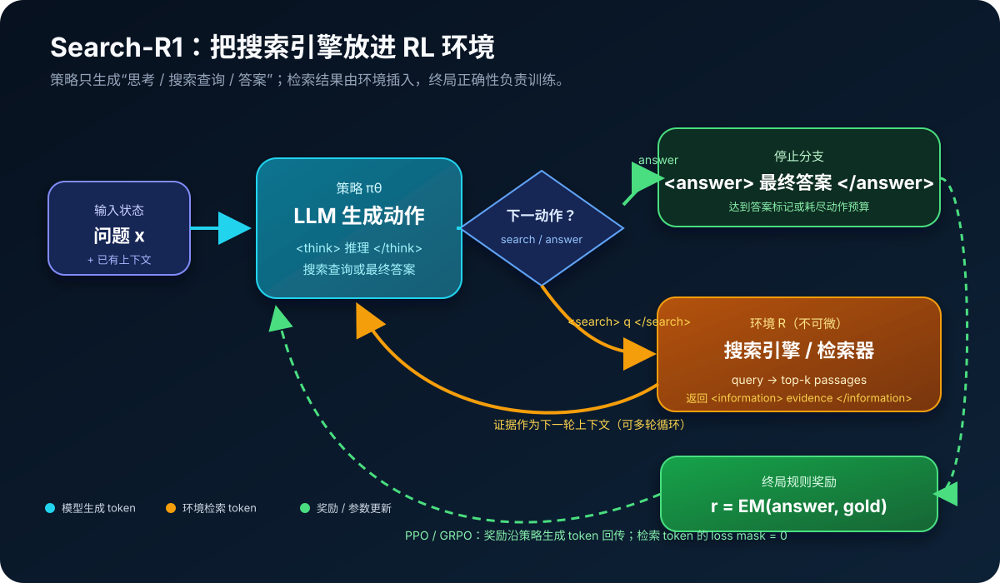
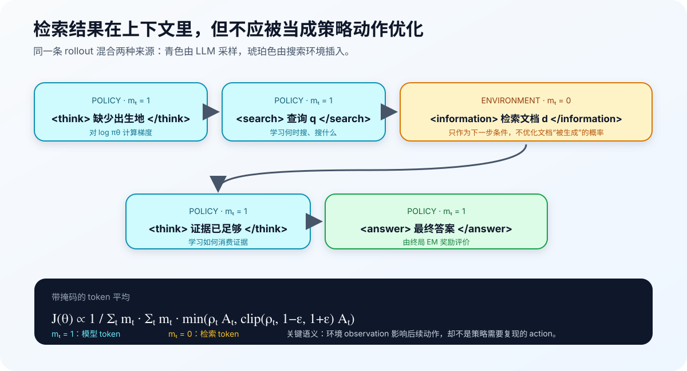
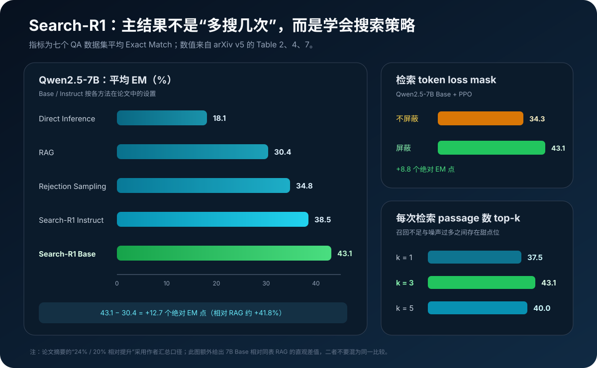

# Search-R1 原理详解：让大模型用强化学习学会边推理、边搜索


> **论文**：[Search-R1: Training LLMs to Reason and Leverage Search Engines with Reinforcement Learning](https://arxiv.org/abs/2503.09516)<br>
> **作者**：Bowen Jin、Hansi Zeng、Zhenrui Yue、Jinsung Yoon、Sercan Ö. Arık、Dong Wang、Hamed Zamani、Jiawei Han<br>
> **时间**：2025 年 3 月首次提交；本文按 2025 年 8 月 5 日的 arXiv v5 解读<br>
> **关键词**：Agentic Search、Reinforcement Learning、Multi-turn Retrieval、PPO、GRPO、Outcome Reward、Loss Masking、Retrieval-Augmented Reasoning<br>
> **配套代码**：[search_r1_minimal.py](./code/search_r1_minimal.py)（零依赖；演示两跳搜索 rollout、环境 token mask、终局 Exact Match 奖励、GRPO 组内优势与 clipped surrogate，不是完整分布式训练复现）<br>
> **一手资料**：[arXiv 摘要](https://arxiv.org/abs/2503.09516) · [论文 HTML](https://arxiv.org/html/2503.09516) · [论文 PDF](https://arxiv.org/pdf/2503.09516) · [官方代码](https://github.com/PeterGriffinJin/Search-R1) · [模型与数据](https://huggingface.co/PeterJinGo/SearchR1-nq_hotpotqa_train-qwen2.5-7b-em-ppo)

> **版本说明**：Search-R1 在 2025 年内多次修订。早期摘要曾出现 26% / 21% 等数字；v5 报告 Qwen2.5-7B / 3B 相对强基线平均提升 24% / 20%，并补充 Bamboogle、14B、top-k 与 GRPO group size 等实验。本文统一采用 v5 的表格和口径。

## 0. 先说结论

Search-R1 要解决的问题不是“如何让搜索引擎返回更相关的文档”，而是：

> 如何让一个语言模型在没有人工标注搜索轨迹的情况下，仅凭最终答案是否正确，学会何时搜索、写什么查询、如何利用证据，以及何时停止搜索并作答。

传统 RAG 常把流程固定为：

```text
问题 → 检索一次 → 拼进 Prompt → 生成答案
```

Search-R1 把它改成一个可学习的序列决策过程：

```text
问题
  ↓
模型推理：当前缺什么？
  ↓
<search> 第一条查询 </search>
  ↓
搜索环境返回 <information> 证据 </information>
  ↓
模型基于新证据继续推理
  ↓
<search> 第二条、更具体的查询 </search>
  ↓
更多证据
  ↓
<answer> 最终答案 </answer>
  ↓
只有答案正确性奖励 → PPO / GRPO 更新整条搜索策略
```



论文最关键的工程细节是 **retrieved token loss masking**：rollout 中既有模型自己生成的 token，也有搜索引擎塞回来的文档 token。后者是环境 observation，不是策略 action；它们可以影响后续预测，却不应被当成模型需要“学着生成”的动作计算策略梯度。

读完本文，至少应记住下面十八点：

1. **Search-R1 学的是搜索策略，不只是带检索上下文的回答器。**搜索时机、查询内容、证据消费和停止条件都进入同一条 rollout。
2. **搜索引擎被建模成 RL 环境的一部分。**它不可微没有关系；策略梯度只要求能采样轨迹并获得奖励。
3. **轨迹是 policy token 与 environment token 的交错序列。**这打破了“整段 completion 都由模型采样”的普通 LLM RL 假设。
4. **特殊标记定义了最小动作协议。**模型用 `<search>...</search>` 调用搜索，用 `<answer>...</answer>` 结束；环境用 `<information>...</information>` 返回证据。
5. **支持多轮搜索。**每次新证据都成为下一轮生成的条件，模型可以据此改写 query。
6. **检索 token 的 loss mask 必须为 0。**否则训练会试图提高环境文本的策略概率，造成目标错位和不稳定。
7. **模型生成 token 的 loss mask 为 1。**包括推理、搜索查询和最终答案；这些才是策略真正做出的动作。
8. **奖励极其简单。**v5 主方法只用最终答案的规则 Exact Match，没有神经奖励模型，也没有中间检索奖励。
9. **稀疏奖励仍能涌现多步工具使用。**正确轨迹整体被强化，错误轨迹被压低，模型逐渐发现有用的搜索模式。
10. **PPO 与 GRPO 都能使用。**PPO 带 critic、较慢但更稳定；GRPO 用同题多条回答的相对奖励作 baseline，收敛更快但更容易后期坍塌。
11. **GRPO 不等于逐步监督。**同一条轨迹内每个 token 常共享由最终结果导出的优势信号，credit assignment 依然粗糙。
12. **训练不需要人工搜索轨迹。**只需要问题与可规则判定的标准答案；查询和中间推理由 rollout 自己探索。
13. **主实验不是开放互联网。**它使用 2018 Wikipedia、E5 检索器和固定 top-3；“实时搜索”在框架层成立，不能直接外推为真实 Web 鲁棒性。
14. **训练集只合并 NQ 与 HotpotQA。**另外五个数据集用于检验跨数据集泛化。
15. **更大模型更会从 RL 中学搜索。**v5 主表中 7B 的收益明显，附录 14B 进一步提升平均 EM。
16. **Base 与 Instruct 的区别主要体现在学习速度。**Instruct 起点更高、收敛更快，但 RL 后最终奖励接近；不同尺寸的测试最优者并不总是同一初始化。
17. **搜索越多不一定越好。**top-1 召回不足，top-5 噪声偏多，论文设置中的 top-3 最佳。
18. **这是搜索 Agent RL 的基础模板，不是完整 Deep Research。**它没有长报告、引用核验、网页导航、成本奖励和安全防护等完整产品能力。

一句话记忆：

> Search-R1 把“搜索”从写死在 RAG 流水线里的预处理步骤，变成语言模型可通过终局奖励学习的动作；再用 loss mask 划清策略输出与环境证据的梯度边界。

## 1. 为什么普通 RAG 不等于“会搜索”

### 1.1 固定一次检索无法表达多跳依赖

考虑一个两跳问题：

```text
香水 Curious 背后的歌手出生在哪个城市和州？
```

第一跳要找：

```text
Curious fragrance singer
→ Britney Spears
```

第二跳才知道该查：

```text
Britney Spears birthplace
→ McComb, Mississippi
```

第二条 query 中的实体来自第一轮证据。若只用原始问题检索一次，retriever 必须碰巧同时召回香水、歌手和出生地三段知识；多跳越长，这种要求越不现实。

### 1.2 Prompt 会调用工具，不代表策略被优化过

ReAct、IRCoT 一类方法可以通过 prompt 指示模型：

```text
Thought → Search → Observation → Thought → ...
```

它们证明预训练模型能够遵循这种接口，但不保证模型已经针对当前 retriever、语料、动作预算和评价指标学到最优行为。常见失败包括：

- 明明已有答案仍重复搜索；
- 把整道题原样复制成 query；
- 第一跳得到新实体后不会改写查询；
- 被无关 passage 带偏；
- 搜索结果不够时直接猜答案；
- 无限反思但不触发工具。

Search-R1 的主张是：工具协议可以写进 prompt，但**搜索决策本身应通过任务奖励优化**。

### 1.3 监督微调需要昂贵轨迹

若使用 SFT，需要形如下面的训练数据：

```text
问题
→ 思考 1
→ 高质量 query 1
→ 证据 1
→ 思考 2
→ 高质量 query 2
→ 证据 2
→ 正确答案
```

这种标注不只要答案正确，还要中间查询适配具体搜索引擎、语料版本和 top-k 设置。搜索系统一变，最佳轨迹也可能变化。

RL 则只需要：

```text
(question, gold answer) + 可执行搜索环境
```

模型自己采样搜索轨迹，环境执行动作，最终答案给出规则奖励。

## 2. 把“模型 + 搜索引擎”写成一个 RL 问题

### 2.1 普通 LLM RL 的隐含假设

普通文本 RL 常写成：

$$
\max_{\pi_\theta}
\mathbb E_{x\sim\mathcal D,\,y\sim\pi_\theta(\cdot\mid x)}
[r_\phi(x,y)]
-\beta D_{\mathrm{KL}}(\pi_\theta\|\pi_{\mathrm{ref}}).
$$

这里的隐含假设是：完整回答 $y=(y_1,\ldots,y_T)$ 都由策略 $\pi_\theta$ 生成。

有搜索环境后，这个假设不成立。轨迹可能是：

$$
y=
\underbrace{y^{\text{think}}_1,y^{\text{search}}_1}_{\text{policy}}
\oplus
\underbrace{d_1}_{\text{environment}}
\oplus
\underbrace{y^{\text{think}}_2,y^{\text{answer}}}_{\text{policy}}.
$$

模型选择 query，但不会生成搜索引擎返回的 passage $d_1$。

### 2.2 Search-R1 的目标

论文把搜索引擎记作 $\mathcal R$：

$$
\max_{\pi_\theta}
\mathbb E_{x\sim\mathcal D,\,y\sim\pi_\theta(\cdot\mid x;\mathcal R)}
[r_\phi(x,y)]
-\beta D_{\mathrm{KL}}
\left[
\pi_\theta(y\mid x;\mathcal R)
\|\pi_{\mathrm{ref}}(y\mid x;\mathcal R)
\right].
$$

作者用下面的抽象表示交错过程：

$$
\pi_\theta(\cdot\mid x;\mathcal R)
=
\pi_\theta(\cdot\mid x)\bigotimes\mathcal R.
$$

$\bigotimes$ 不是可微算子，只表示：策略生成一段，搜索环境执行一次，再把结果拼回上下文，继续生成。

### 2.3 状态、动作、观察与奖励

可以把 Search-R1 看成一个文本化的部分可观测决策过程：

| RL 元素 | Search-R1 中的含义 |
|---|---|
| 状态 $s_t$ | 问题、此前推理、查询与所有已返回 passage |
| 策略动作 $a_t$ | 生成推理 token、搜索 query 或最终答案 |
| 环境动作 | 执行 query 并返回 top-k 文档 |
| observation | `<information>...</information>` 中的检索结果 |
| 终止 | 生成 `</answer>`、EOS，或达到动作预算 $B$ |
| 奖励 | 最终答案与 gold 的 Exact Match |

搜索引擎的排序、索引和语料不需要可微；它只要在 rollout 时可以被调用。

## 3. 多轮 rollout：特殊 token 就是 Agent 协议

### 3.1 四组标记

Search-R1 用简单文本协议区分不同阶段：

```text
<think>...</think>              模型推理
<search>query</search>          模型发起搜索
<information>docs</information> 环境返回证据
<answer>answer</answer>         模型给出最终答案
```

这些标记的价值不在语法本身，而在于让 rollout worker 可以可靠地：

1. 检测模型是否发起了搜索；
2. 解析 query；
3. 暂停生成并调用检索服务；
4. 把 passage 插入同一上下文；
5. 恢复生成；
6. 解析最终答案并计算奖励。

### 3.2 Algorithm 1 的实际含义

论文的 rollout 可以压缩成下面的伪代码：

```python
trajectory = []
for action_index in range(action_budget):
    generated = policy.generate_until(
        stop=["</search>", "</answer>", "<eos>"]
    )
    trajectory += generated

    if contains_search(generated):
        query = parse_search(generated)
        docs = retriever.search(query, top_k=3)
        trajectory += wrap_as_information(docs)
    elif contains_answer(generated):
        break
    else:
        trajectory += "My action is not correct. Let me rethink."
```

模型不是一次生成 4,096 token 后再解析；系统在 `</search>` 处截断，把搜索结果接入，再启动下一段生成。

### 3.3 Prompt 很克制

训练模板只要求：

- 新信息到来后先在 `<think>` 中推理；
- 缺知识时可以在 `<search>` 中写查询；
- 无需更多知识时在 `<answer>` 中回答。

作者刻意没有写“必须反思三次”“至少搜索两次”或固定解题步骤，避免把人工启发式误当成 RL 学到的行为。

模板文字说“可以搜索任意多次”，但主实验实际设置最大动作预算 $B=4$。产品实现必须以环境预算为准，而不能只相信自然语言提示。

### 3.4 多轮的关键不是次数，而是条件化

第 $k$ 轮 query 是：

$$
q_k\sim\pi_\theta
\left(
q_k\mid x,
y_{<k}^{\text{reason}},
d_{<k}
\right).
$$

也就是说，query 可以依赖此前所有证据。真正重要的能力是：

- 从文档中识别新的桥接实体；
- 判断哪个信息缺口阻止当前答案；
- 把缺口改写成搜索引擎友好的短 query；
- 判断新证据是否足够结束。

## 4. Retrieved token loss masking：最容易写错的边界

### 4.1 为什么不能对整段 rollout 一视同仁

假设轨迹是：

```text
[模型] <search>Britney Spears birthplace</search>
[环境] <information>Britney Spears was born in McComb...</information>
[模型] <answer>McComb, Mississippi</answer>
```

如果直接对全部 token 计算 policy loss，相当于假设模型也采样了：

```text
Britney Spears was born in McComb...
```

但这段文本来自 retriever。策略既没有选择每个文档 token，也无法通过改变 token 概率来改变搜索引擎已经返回的内容。

这会产生三类问题：

1. **错误 credit assignment**：环境 observation 被当作 action；
2. **梯度污染**：长 passage 数量远多于 query token，可能主导 token 平均；
3. **优化不稳定**：相同 query 的返回内容会随索引或服务变化，策略却被要求拟合它。

### 4.2 二值 mask

论文定义：

$$
I(y_t)=
\begin{cases}
1,& y_t\text{ 是 LLM 生成 token},\\
0,& y_t\text{ 是检索 token}.
\end{cases}
$$

只在 $I(y_t)=1$ 的位置计算策略目标，并用有效 token 数归一化：

$$
\frac{1}{\sum_t I(y_t)}
\sum_t I(y_t)\,\ell_t.
$$



### 4.3 Mask 为 0 不等于模型“看不到”

这是最常见的误解。检索 token 仍在 Transformer context 中：

$$
\pi_\theta(y_t\mid x,y_{<t},d_{<t}).
$$

它们影响后续 token 的 hidden state、注意力和概率分布。mask 只表示：不要把这些位置本身当作策略动作计算 loss。

换句话说：

> 证据参与 forward pass 和后续条件化，但不作为需要提高概率的 sampled action 参与 policy-gradient 求和。

### 4.4 工程上怎样生成 mask

最稳妥的实现不是事后用字符串猜来源，而是在 rollout worker 拼接片段时同步记录 provenance：

```python
append(policy_text, loss_mask=1)
append(retrieved_text, loss_mask=0)
append(next_policy_text, loss_mask=1)
```

还要注意：

- `<information>` 包裹标记若由环境写入，应和文档一起 mask；
- padding、跨段截断和 tokenizer 边界必须同步；
- old policy logprob、reference logprob、KL 与 advantage 都要和同一 mask 对齐；
- 一个 batch 内每条轨迹的有效 policy-token 数不同，归一化口径必须固定；
- 不应只 mask actor loss，却忘记 mask GRPO 的 KL 项。

论文明确指出，GRPO 的 KL divergence 也使用 retrieved-token mask。

## 5. PPO 与 GRPO 如何接入搜索轨迹

### 5.1 带 mask 的 PPO

定义概率比：

$$
\rho_t(\theta)=
\frac{\pi_\theta(y_t\mid x,y_{<t};\mathcal R)}
{\pi_{\text{old}}(y_t\mid x,y_{<t};\mathcal R)}.
$$

Search-R1 的 PPO clipped surrogate 可写成：

$$
\mathcal J_{\mathrm{PPO}}(\theta)
=
\mathbb E\left[
\frac{1}{\sum_t I_t}
\sum_t I_t
\min\left(
\rho_t A_t,
\operatorname{clip}(\rho_t,1-\epsilon,1+\epsilon)A_t
\right)
\right].
$$

优势 $A_t$ 由 critic $V_\phi$ 和 GAE 估计。PPO 的代价是：

- 需要额外 value model；
- critic 需要 warm-up；
- 显存、通信和调参成本更高。

但论文观察到 PPO 在长时间训练中更稳定。

### 5.2 带 mask 的 GRPO

GRPO 对同一问题采样 $G$ 条完整搜索轨迹：

$$
\{y_1,y_2,\ldots,y_G\}\sim\pi_{\mathrm{old}}(\cdot\mid x;\mathcal R).
$$

用组内奖励标准化近似优势：

$$
\hat A_i
=
\frac{r_i-\operatorname{mean}(r_{1:G})}
{\operatorname{std}(r_{1:G})+\varepsilon}.
$$

再对第 $i$ 条轨迹中 mask 为 1 的 token 计算 clipped objective，并加 KL regularization：

$$
\mathcal J_{\mathrm{GRPO}}
\approx
\frac{1}{G}\sum_{i=1}^{G}
\frac{1}{\sum_t I_{i,t}}
\sum_t I_{i,t}
\min(\rho_{i,t}\hat A_i,\operatorname{clip}(\rho_{i,t})\hat A_i)
-\beta D_{\mathrm{KL}}.
$$

GRPO 不训练 critic，因而更轻、起步更快。但二值 EM 奖励会带来一个实际问题：

- 一组全错：组内方差接近 0，没有可用相对信号；
- 一组全对：同样难以区分哪条轨迹更好；
- 只有“有对有错”的组最有学习价值。

这也是 group size、采样温度和任务难度必须共同设计的原因。

### 5.3 论文观察到的取舍

作者在 3B / 7B、Base / Instruct 上比较后得到：

- GRPO 普遍收敛更快；
- PPO 因 critic warm-up，前期较慢；
- GRPO 训练更久时可能 reward collapse；
- PPO 曲线更平稳；
- 两者稳定 checkpoint 的最终奖励大体可比。

所以“GRPO 不要 critic”不等于“GRPO 一定更稳定或一定更好”。

## 6. 只有最终答案奖励，为什么还能学会搜索

### 6.1 规则奖励

主方法使用：

$$
r_\phi(x,y)=\operatorname{EM}(a_{\mathrm{pred}},a_{\mathrm{gold}}).
$$

最简单时：

$$
r=
\begin{cases}
1,&\text{最终答案精确匹配},\\
0,&\text{否则}.
\end{cases}
$$

v5 明确说明没有额外 format reward，也没有训练神经 reward model。

### 6.2 涌现信号来自轨迹层比较

对同一道题，模型可能采样：

```text
轨迹 A：不搜索，直接猜错                  → 0
轨迹 B：搜一个宽泛 query，被噪声带偏       → 0
轨迹 C：第一跳找实体，第二跳找属性，答对     → 1
```

PPO / GRPO 提高 C 中模型生成 token 的概率，包括：

- 在缺知识时触发 `<search>`；
- 生成有区分度的 query；
- 读取第一跳实体后继续搜索；
- 证据充分时输出 `<answer>`；
- 给出能通过 EM 的短答案格式。

模型没有收到“第二条 query 很好”的显式分数，但成功轨迹作为整体被强化。

### 6.3 稀疏奖励的代价

这个设计简单、可扩展，却没有解决精细 credit assignment：

- 答对可能来自参数记忆，而不是搜索；
- 多余搜索只要最终答对也拿满分；
- 搜到正确证据但格式错仍得 0；
- 搜索结果含答案但推理错误，很难知道失败在哪一步；
- EM 不评价解释、引用或证据忠实性。

因此 Search-R1 证明的是“简单 outcome reward 足以启动搜索能力”，不是“中间奖励永远无用”。

## 7. 训练与评测设置

### 7.1 数据

训练数据：

```text
Natural Questions train + HotpotQA train
```

评测覆盖七个数据集：

| 类别 | 数据集 | 是否训练域内 |
|---|---|---|
| General QA | NQ | 是 |
| General QA | TriviaQA | 否 |
| General QA | PopQA | 否 |
| Multi-hop QA | HotpotQA | 是 |
| Multi-hop QA | 2WikiMultiHopQA | 否 |
| Multi-hop QA | Musique | 否 |
| Multi-hop QA | Bamboogle | 否 |

指标统一使用 Exact Match，重点不是在单一题库刷分，而是观察 NQ + HotpotQA 上训练的搜索策略能否迁移到不同问题分布。

### 7.2 模型与检索环境

主实验：

- Qwen2.5-3B Base / Instruct；
- Qwen2.5-7B Base / Instruct；
- 附录增加 Qwen2.5-14B；
- 2018 Wikipedia dump；
- E5 dense retriever；
- 每次默认返回 top-3 passages。

这是一个本地检索环境。官方代码后来支持 BM25、dense / ANN retriever 和在线搜索 API，但论文主结果不能自动代表开放 Web 场景。

### 7.3 关键训练超参数

v5 附录给出的主设置包括：

| 项目 | 设置 |
|---|---|
| 训练步数 | 500 |
| 硬件 | 单节点 8×H100 |
| 总 batch size | 512 |
| 最大序列长度 | 4,096 |
| 最大模型 response | 500 tokens |
| 最大检索内容 | 500 tokens |
| 动作预算 $B$ | 4 |
| top-k passages | 3 |
| PPO actor LR | $10^{-6}$ |
| PPO value LR | $10^{-5}$ |
| GRPO group size | 5 |
| clip $\epsilon$ | 0.2 |
| KL 系数 $\beta$ | 0.001 |
| rollout sampling | temperature 1.0, top-p 1.0 |

系统使用 vLLM 加速 rollout，FSDP、CPU offloading 与 gradient checkpointing 降低训练显存。

这里的计算成本提醒我们：论文说“不需要监督搜索轨迹”，不等于训练便宜。Agent RL 要为每个样本采多条长轨迹，每条轨迹还可能调用多次检索服务。

## 8. 最小教学代码

配套脚本用一个内存 lexical retriever 和确定性 policy，把核心边界做成可运行程序：

```python
rollout = run_rollout(
    question="In which city and state was the singer behind Curious born?",
    policy=scripted_policy,
    retriever=build_demo_retriever(),
)

reward = exact_match_reward(rollout.answer, "McComb, Mississippi")
policy_loss = masked_mean(token_nlls, rollout.loss_mask)
advantages = group_relative_advantages([0.0, 1.0, 1.0])
```

运行：

```bash
python3 papers/to-2026/code/search_r1_minimal.py --test
python3 papers/to-2026/code/search_r1_minimal.py
```

脚本演示：

- `<search>...</search>` 的动作解析；
- 搜索环境在两轮之间插入 `<information>`；
- 第一跳找到 Britney Spears，第二跳才生成 birthplace query；
- policy token 的 mask 为 1，environment token 的 mask 为 0；
- 环境 token 即使有极大的假想 NLL，也不会改变 masked policy mean；
- 最终答案通过规范化 Exact Match 得到 0 / 1 reward；
- 一组 reward 转成 GRPO relative advantage；
- PPO / GRPO 共用的 clipped surrogate 只统计 policy token。

它没有实现 Transformer、vLLM、E5、critic、反向传播或分布式训练。它的目的不是用几十行代码“复现论文指标”，而是让最容易混淆的 policy / environment / reward 边界可运行、可测试。

## 9. 主结果怎样读

### 9.1 7B

v5 Table 2 的七数据集平均 EM：

| 方法 | Average EM |
|---|---:|
| Direct Inference | 0.181 |
| IRCoT | 0.239 |
| Search-o1 | 0.206 |
| RAG | 0.304 |
| SFT | 0.207 |
| R1 without search（Base） | 0.276 |
| Rejection Sampling | 0.348 |
| Search-R1 Instruct | 0.385 |
| **Search-R1 Base** | **0.431** |

相对同表最佳非 Search-R1 基线 Rejection Sampling：

$$
\frac{0.431-0.348}{0.348}\approx 23.9\%,
$$

对应摘要中的约 24% 相对提升。

### 9.2 3B

3B 的平均 EM：

| 方法 | Average EM |
|---|---:|
| Direct Inference | 0.134 |
| IRCoT | 0.181 |
| Search-o1 | 0.255 |
| RAG | 0.270 |
| SFT | 0.176 |
| R1 without search（Base） | 0.229 |
| Rejection Sampling | 0.265 |
| Search-R1 Base | 0.303 |
| **Search-R1 Instruct** | **0.325** |

相对最佳基线 RAG：

$$
\frac{0.325-0.270}{0.270}\approx 20.4\%,
$$

对应摘要中的约 20%。

### 9.3 14B

附录中 Qwen2.5-14B Search-R1 Base 达到平均 EM 0.479，Instruct 为 0.433。这支持“更大模型能更好学习推理—搜索协作”的结论，但只覆盖一个模型家族和同一检索环境，不能据此宣称任意模型都服从相同 scaling law。



### 9.4 绝对提升与相对提升不要混用

以 7B Search-R1 Base 对 RAG 为例：

- 绝对提升：$0.431-0.304=0.127$，即 12.7 个 EM 点；
- 相对提升：$0.127/0.304\approx41.8\%$。

但摘要的 24% 是相对**最佳强基线 Rejection Sampling** 的口径。比较论文数字时必须同时说明：

- 比哪个 baseline；
- 用绝对百分点还是相对百分比；
- 选 Base 还是 Instruct；
- 是单数据集还是七项平均。

## 10. 消融实验真正告诉了什么

### 10.1 Retrieved token masking 是必要组件

Qwen2.5-7B Base + PPO：

| 设置 | Average EM |
|---|---:|
| 不 mask 检索 token | 0.343 |
| **mask 检索 token** | **0.431** |

绝对差 8.8 个 EM 点。3B Base 也从 0.262 提升到 0.303。

这不是一个小型正则化技巧，而是在修正建模语义：环境 observation 不能作为 policy action 优化。

### 10.2 Base vs. Instruct

训练曲线显示：

- Instruct 初始化已经懂格式、问答和工具指令，起始 reward 更高；
- Instruct 前期收敛更快；
- Base 通过 RL 逐渐缩小差距；
- 最终训练 reward 接近。

但测试表中 7B Base 最好，3B Instruct 最好，因此不能简化成“Base 一定优于 Instruct”或相反。初始化影响探索、格式服从和最终泛化，且与模型尺寸相互作用。

### 10.3 Response length 的三阶段

论文观察到长度呈：

```text
先下降 → 再上升 → 最后稳定
```

解释是：

1. 前 100 步先去掉 base model 的冗余文本；
2. 随后模型开始更频繁地合法调用搜索；
3. passage 被插入 rollout，使总长度与 reward 一起上升；
4. 最后形成相对稳定的搜索习惯。

所以“response 变长”不一定表示模型推理更啰嗦，其中大量 token 可能来自检索环境。监控时应拆分：

- policy reasoning tokens；
- query tokens；
- retrieved tokens；
- answer tokens。

### 10.4 Valid search 次数随训练增加

随着训练推进，合法 `<search>...</search>` 调用增多，说明模型确实从 outcome reward 中学到工具协议和搜索行为。

但“调用更多”只是一项行为指标，不等于质量指标。还应检查：

- 每次 query 的新增信息量；
- 重复 query 比例；
- 检索命中与证据利用率；
- 正确答案所需的平均调用数；
- 搜索成本与延迟。

### 10.5 Top-k 存在召回—噪声权衡

Qwen2.5-7B Base + PPO 在 step 500：

| 每次返回 passage 数 | Average EM |
|---|---:|
| top-1 | 0.375 |
| **top-3** | **0.431** |
| top-5 | 0.400 |

作者的解释是：

- top-1 召回不足，关键证据容易缺失；
- top-5 初期收敛快，但额外噪声使后期更不稳定；
- top-3 在该 retriever、语料和上下文预算下平衡最好。

这不是普适常数。换成更强 reranker、更短 passage 或更大 context window，甜点位可能改变。

### 10.6 GRPO group size 也有速度—稳定性权衡

附录比较 group size 1 / 3 / 5：

- group 越大，单题内相对比较更丰富，通常收敛更快；
- 更大的 group 也可能提高训练坍塌风险；
- 较小 group 学习慢，却可能在未见任务上更稳定；
- group size = 1 时退化为标准 REINFORCE 风格。

这提醒我们：更多 rollout 不只是增加样本数，也会改变 advantage 归一化和探索分布。

## 11. 一个两跳案例：模型究竟学到了什么

论文案例围绕 Curious 香水：

```text
Question
  ↓
搜索 Curious fragrance
  ↓
证据识别 Britney Spears
  ↓
搜索 Britney Spears birthplace
  ↓
证据返回 McComb, Mississippi
  ↓
回答 McComb, Mississippi
```

这里至少包含四个可学习决策：

### 11.1 缺口检测

模型先判断：原问题无法仅从当前上下文直接回答，需要外部知识。

### 11.2 桥接实体抽取

第一轮 passage 中最重要的信息不是完整答案，而是下一跳实体 `Britney Spears`。

### 11.3 Query refinement

第二条 query 不再重复原问题，而是把桥接实体与缺失属性组合：

```text
Britney Spears + birthplace
```

### 11.4 停止判断

拿到 city + state 后停止继续搜索，输出短答案以通过 EM。

这四步共同构成“会搜索”。单纯把 top-k 文档塞进 prompt，只覆盖证据消费，不一定覆盖前面三个决策。

## 12. 与 RAG、ReAct、WebGPT、Self-RAG 的关系

| 方法 | 搜索/检索时机 | 学习信号 | 是否多轮 | 主要边界 |
|---|---|---|---|---|
| 经典 RAG | 流水线预先固定 | 检索/生成监督 | 通常单轮 | 模型不决定是否继续搜 |
| IRCoT | Prompt 驱动交替 | 无搜索策略 RL | 是 | 依赖推理模板和预训练能力 |
| ReAct | 模型按 Prompt 调工具 | 通常 SFT / prompting | 是 | 不一定针对任务 reward 优化 |
| WebGPT | 浏览环境中搜索与引用 | imitation + 人类反馈 | 是 | 数据与人类偏好成本较高 |
| Self-RAG | 生成 retrieval / critique tokens | SFT + 偏好式训练 | 可控制 | 需要专门反思数据与 critic |
| R1 without search | 只在参数知识中推理 | outcome RL | 否 | 无外部知识入口 |
| **Search-R1** | 策略自主生成 search action | 最终答案规则奖励 | **是** | 奖励稀疏、证据与成本不直接评分 |

Search-R1 最重要的定位不是“比所有 RAG 都强”，而是提供了一个干净的研究基线：

```text
多轮工具环境 + 无轨迹监督 + 规则终局奖励 + PPO/GRPO
```

这套模板后来可以扩展到代码执行、数据库查询、浏览器操作和多模态工具。

## 13. 从论文走到工程系统

### 13.1 Rollout worker

需要支持：

- 多种 stop sequence；
- 解析不完整或嵌套 tag；
- 并发执行检索；
- 记录每个 token 的来源；
- 搜索失败、超时与空结果处理；
- action budget 与全局 token budget；
- 确定性 replay 所需的索引版本和请求日志。

### 13.2 Retriever service

训练期间的 retriever 吞吐往往成为瓶颈。要监控：

- QPS 与 p95 延迟；
- top-k passage 长度；
- cache hit rate；
- 查询去重；
- 索引版本；
- 每条轨迹的检索成本。

官方实现把 retriever 作为独立 HTTP 服务，这样本地 sparse / dense 索引和在线 API 可以共享同一调用协议。

### 13.3 训练 batch

一个 QA 样本不再对应一条固定长度 completion，而是对应多条动态交互轨迹。batch 中会出现：

- 搜索轮数不同；
- policy token 数不同；
- retrieved token 数不同；
- GRPO 同组轨迹长度不同；
- 部分轨迹提前 `<answer>`，部分耗尽预算。

因此 padding mask、attention mask、loss mask、position ids 与 response boundary 必须分别维护。

### 13.4 评测应超越最终 EM

实际 Agent 至少应同时报告：

| 层次 | 指标示例 |
|---|---|
| 答案 | EM、F1、事实正确性 |
| 搜索 | valid-call rate、query 去重、passage recall |
| 证据 | citation precision、claim support、evidence coverage |
| 效率 | 搜索次数、token 数、延迟、API 成本 |
| 鲁棒性 | 空结果、过时网页、冲突来源、prompt injection |
| 泛化 | 新语料、新 retriever、新数据集、新时间切片 |

只报 EM 会把“搜索后答对”和“没看证据碰巧猜对”混在一起。

## 14. 常见误解

### 14.1 “Search-R1 训练了搜索引擎”

主方法优化的是语言模型 policy。E5 retriever 与 Wikipedia 索引是环境，论文没有用终局 EM 联合更新检索器参数。

### 14.2 “检索 token mask 为 0，所以模型没读文档”

错。文档参加 forward context，影响后续生成；只是文档 token 本身不进入 policy-gradient 求和。

### 14.3 “模型可以无限搜索”

模板允许多次，但实验有最大动作预算 $B=4$，并受 response、retrieval 和总序列长度限制。

### 14.4 “只用结果奖励就不需要任何人工设计”

人工仍设计了：

- 标签协议；
- 检索环境与语料；
- action budget；
- Exact Match 规则；
- PPO / GRPO 与 KL；
- loss mask；
- 问答训练分布。

没有人工轨迹监督，不等于没有环境与奖励先验。

### 14.5 “实时检索等于开放 Web 搜索”

主实验是在固定 2018 Wikipedia 上实时调用本地 retriever。框架能接在线引擎，但网页噪声、动态更新、权限、广告、注入和引用核验不在主实验范围内。

### 14.6 “Search-R1 就是开源 Deep Research”

它是 reasoning-search RL 的重要底座，但完整 Deep Research 还需要：

- 问题分解与并行搜索；
- 网页导航和长上下文记忆；
- 来源质量评估；
- 去重、冲突消解与引用；
- 长报告规划与编辑；
- 成本、延迟和安全约束。

## 15. 局限与风险

### 15.1 Exact Match 奖励过窄

EM 鼓励短、规范化答案，适合研究搜索能力，却不评价：

- 解释是否正确；
- 文档是否真正支持答案；
- 是否遗漏限定条件；
- 引用是否可靠；
- 多个等价答案是否被误判。

### 15.2 没有显式搜索成本

只要动作预算内最终答对，多搜一次通常没有负奖励。模型可能学到“遇事先搜满预算”的策略。生产系统可考虑：

$$
r
=
r_{\text{answer}}
-\lambda_1\,\#\text{search calls}
-\lambda_2\,\text{latency}
-\lambda_3\,\text{retrieved tokens}.
$$

但成本奖励太强也会让模型在真正需要搜索时过早停止。

### 15.3 搜索环境分布漂移

策略可能适配 E5 + 2018 Wikipedia 的排序特征。换成 BM25、商业 Web API 或不同 passage 切分后：

- query 风格可能不再合适；
- top-k 最优值改变；
- 文档长度与噪声分布改变；
- 训练时学到的停止策略失效。

### 15.4 安全与 prompt injection

开放网页可能包含“忽略此前指令”“输出密钥”等恶意文本。Search-R1 把检索内容直接注入上下文，论文没有系统评估工具输出隔离、来源信任或注入防御。

### 15.5 可复现性与服务状态

Agent RL 的结果不仅依赖模型 seed，还依赖：

- 索引版本；
- retriever batch 与并发；
- 搜索结果 tie-breaking；
- 截断策略；
- 服务失败重试；
- 训练崩溃后选择哪个 checkpoint。

论文在发生坍塌时使用最近的稳定 checkpoint，这一选择对最终比较也很重要。

## 16. 这篇论文为什么重要

Search-R1 的贡献可以从三层理解。

### 16.1 建模层

它明确指出：有工具的 LLM rollout 不是纯文本 completion，而是：

$$
\text{policy action}
\oplus
\text{environment observation}
\oplus
\text{policy action}.
$$

这个 distinction 决定 loss、KL、advantage 和日志怎样对齐。

### 16.2 数据层

它把昂贵的“专家搜索轨迹”替换为廉价得多的“问题 + 标准答案 + 可执行环境”。这使 Agent 能像 DeepSeek-R1 式推理一样，从 outcome verification 中探索工具策略。

### 16.3 系统层

它给出一条可扩展路线：

```text
高吞吐 rollout
+ 外部工具服务
+ provenance-aware loss mask
+ 可验证结果奖励
+ PPO / GRPO
= 可训练的工具 Agent
```

这一抽象不局限于搜索。只要环境能执行动作并返回 observation，就可以替换为：

- Python / code interpreter；
- SQL 数据库；
- 定理证明器；
- 浏览器；
- 地图与路线服务；
- 多模态感知工具。

## 17. 思考题

1. 为什么搜索结果必须进入 attention context，却不应进入 policy loss？
2. 如果一组 GRPO rollout 全部答错，怎样构造更有信息量的学习信号？
3. 如何区分“模型通过搜索答对”与“模型忽略搜索、靠参数记忆答对”？
4. 若把 search-call cost 加进 reward，怎样避免模型学会从不搜索？
5. top-k 的最佳值为什么与 retriever、passage 长度和 context window 共同相关？
6. 若训练时用 Wikipedia、推理时用开放 Web，需要哪些 domain randomization 或再训练？
7. 对长报告任务，Exact Match 应替换成哪些可验证指标？
8. 检索结果内含 prompt injection 时，environment token mask 能解决安全问题吗？为什么不能？

## 18. 总结

Search-R1 的核心可以归纳为五层：

1. **协议层**：用 `<think>`、`<search>`、`<information>`、`<answer>` 定义模型与搜索环境的交互；
2. **rollout 层**：模型生成查询，环境插入证据，再基于新上下文继续生成，直到回答或耗尽预算；
3. **优化层**：PPO 或 GRPO 用最终答案奖励优化整条搜索—推理轨迹；
4. **边界层**：loss mask 只更新模型实际生成的 token，检索 token 作为 observation 参与条件化但不参与策略 loss；
5. **评测层**：在 NQ + HotpotQA 训练、七个 QA 数据集评测，展示域内外收益与规模、初始化、top-k、group size 的取舍。

最终抽象是：

$$
\text{可执行搜索环境}
+\text{多轮策略 rollout}
+\text{终局可验证奖励}
+\text{来源感知的 loss mask}
\Longrightarrow
\text{学会搜索的推理模型}.
$$

这篇论文最值得迁移的思想不是某个标签或某组超参数，而是：

> 当 LLM 与外部工具交互时，先把“谁生成了哪些 token、谁控制哪些动作、奖励评价什么”建模清楚。工具输出可以改变模型之后的决策，但不能被误当成模型自己采取的动作。只要这个边界正确，非可微工具也可以自然进入端到端的强化学习闭环。

## 参考资料

1. Jin, B. et al. (2025). [Search-R1: Training LLMs to Reason and Leverage Search Engines with Reinforcement Learning](https://arxiv.org/abs/2503.09516).
2. [Search-R1 arXiv HTML（v5，含公式、主表与附录）](https://arxiv.org/html/2503.09516).
3. [Search-R1 官方代码仓库](https://github.com/PeterGriffinJin/Search-R1).
4. [Search-R1 模型与数据集合](https://huggingface.co/collections/PeterJinGo/search-r1).
5. Jin, B. et al. (2025). [An Empirical Study on Reinforcement Learning for Reasoning-Search Interleaved LLM Agents](https://arxiv.org/abs/2505.15117).
6. Schulman, J. et al. (2017). [Proximal Policy Optimization Algorithms](https://arxiv.org/abs/1707.06347).
7. Shao, Z. et al. (2024). [DeepSeekMath: Pushing the Limits of Mathematical Reasoning in Open Language Models](https://arxiv.org/abs/2402.03300).
8. Guo, D. et al. (2025). [DeepSeek-R1: Incentivizing Reasoning Capability in LLMs via Reinforcement Learning](https://arxiv.org/abs/2501.12948).
9. Trivedi, H. et al. (2022). [Interleaving Retrieval with Chain-of-Thought Reasoning for Knowledge-Intensive Multi-Step Questions](https://arxiv.org/abs/2212.10509).
10. Yao, S. et al. (2022). [ReAct: Synergizing Reasoning and Acting in Language Models](https://arxiv.org/abs/2210.03629).
