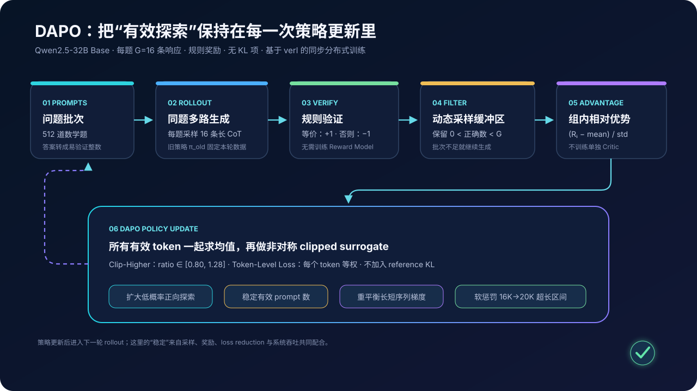
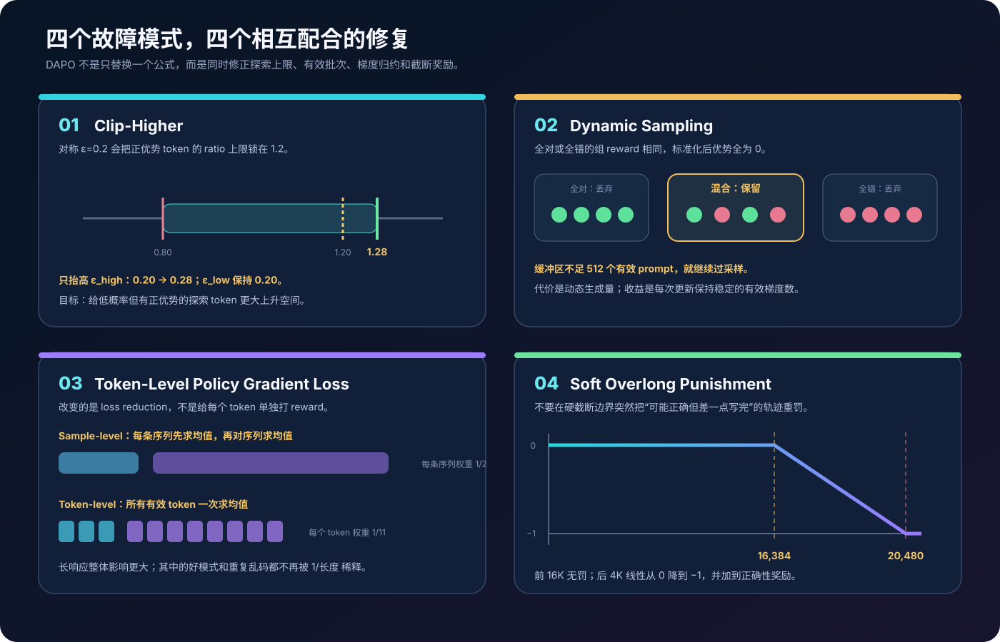
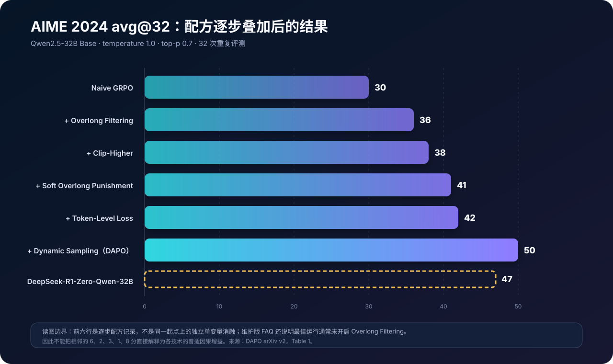

# DAPO 原理详解：把大模型长推理强化学习做成可复现的系统工程


> **论文**：[DAPO: An Open-Source LLM Reinforcement Learning System at Scale](https://arxiv.org/abs/2503.14476)<br>
> **作者**：Qiying Yu、Zheng Zhang、Ruofei Zhu 等；ByteDance Seed、清华大学 AIR / SIA-Lab、香港大学<br>
> **时间**：2025 年 3 月 17 日首次公开；本文按 2025 年 5 月 20 日的 arXiv v2 解读；后收录于 NeurIPS 2025<br>
> **关键词**：Reasoning RL、GRPO、Clip-Higher、Dynamic Sampling、Token-Level Loss、Overlong Reward Shaping、verl、AIME<br>
> **配套代码**：[dapo_minimal.py](./code/dapo_minimal.py)（零依赖；实现组相对优势、动态组筛选、非对称 clipped surrogate、sample/token 两种 loss reduction 与软超长惩罚，不是 32B 分布式训练复现）<br>
> **前置阅读**：[PPO](https://arxiv.org/abs/1707.06347) · [DeepSeekMath / GRPO](57_DeepSeekMath_2024_原理.md) · [Training Verifiers](53_Training_Verifiers_2021_原理.md) · [DeepSeek-R1](30_DeepSeek_R1_2025_原理.md)<br>
> **一手资料**：[论文 HTML](https://arxiv.org/html/2503.14476) · [项目主页](https://dapo-sia.github.io/) · [ByteDance 论文页](https://seed.bytedance.com/en/public_papers/dapo-an-open-source-llm-reinforcement-learning-system-at-scale) · [官方仓库](https://github.com/BytedTsinghua-SIA/DAPO) · [维护版 verl recipe](https://github.com/verl-project/verl-recipe/tree/main/dapo) · [DAPO-Math-17K](https://huggingface.co/datasets/BytedTsinghua-SIA/DAPO-Math-17k) · [DAPO-Qwen-32B](https://huggingface.co/BytedTsinghua-SIA/DAPO-Qwen-32B)

> [!IMPORTANT]
> DAPO 是 **Decoupled Clip and Dynamic sAmpling Policy Optimization**，不是偏好优化里的 DPO（Direct Preference Optimization）。它从 `Qwen2.5-32B Base` 出发，用可规则验证的数学答案做在线 RL；没有偏好对、没有离线 chosen/rejected 数据，也不是一个仅靠改动 clip 上限就能概括的单点算法。

> **版本边界**：论文给出 2025 年实验配方；verl 中的 DAPO recipe 此后持续维护，参数路径、warm-up、硬件记录与复现分数会变化。本文把“论文报告”与“当前维护实现”分开标注，不把今天的脚本反推成原始实验事实。

---

## 0. 先说结论

DAPO 面对的是一个很具体的落差：DeepSeek-R1 说明了纯强化学习能够从 Base 模型中激发长链推理，但社区照着公开描述做 naive GRPO 时，训练常出现熵坍塌、有效梯度减少、长度失控和截断奖励噪声。

论文从同一个 `Qwen2.5-32B Base` 出发：

```text
Naive GRPO                         AIME 2024 avg@32 = 30
DeepSeek-R1-Zero-Qwen-32B（报告值）                  = 47
DAPO                                                   = 50
```

DAPO 的回答不是“换一种更复杂的 reward model”，而是把四个训练细节组合起来：

```text
探索空间坍塌     → Clip-Higher
批次有效梯度缩水 → Dynamic Sampling
长短响应权重失衡 → Token-Level Policy Gradient Loss
硬截断制造噪声   → Overlong Reward Shaping
```

读完本文，至少应记住下面十八点：

1. **DAPO 是一套长 CoT 在线 RL 配方与开源系统，不只是一个新 loss 名称。**算法、数据、分布式训练代码和监控方式共同决定结果。
2. **它仍以 GRPO 为骨架。**同题采样 $G$ 条回答，用组内奖励均值和标准差形成优势，不训练独立 critic。
3. **奖励以规则正确性为主。**答案等价得 $+1$，否则得 $-1$；软长度惩罚再加到该奖励上。
4. **DAPO 删除了 reference-policy KL 项。**作者认为长推理策略需要明显偏离初始 Base 分布；这不是“所有 RLHF 都应去掉 KL”的一般结论。
5. **Clip-Higher 只放宽上界。**论文设置 $arepsilon_{low}=0.20$、$arepsilon_{high}=0.28$，不是把整个 trust region 等比例放大。
6. **放宽上界针对低概率正优势 token。**旧概率 0.01 在 1.2 上界下最多升到 0.012，探索动作的绝对增量过小；高概率动作却常不会真正受限。
7. **下界仍保留 0.20。**作者担心进一步放宽向下更新会把 token 概率压到接近 0，永久缩小采样支持集。
8. **Dynamic Sampling 丢的是零组内方差的 prompt group。**若 16 条全对或全错，归一化优势全为 0，留在训练批次只会稀释有效梯度。
9. **动态采样不是固定比例过滤。**系统先过采样，再持续补充，直到缓冲区装满目标数量的“有对有错”组，因此每步 rollout 成本是动态的。
10. **Token-Level Loss 改的是归约方式，不是 reward 粒度。**同一回答的 token 仍共享 outcome-derived advantage；论文没有给每一步推理单独标注奖励。
11. **原始 GRPO 让每条序列等权。**先在序列内按 token 求均值，再跨序列求均值，长回答中单个 token 的权重会被 $1/|o_i|$ 稀释。
12. **DAPO 让每个有效 token 等权。**把整个 group 的 token 放在一起求均值，所以长回答整体获得更大梯度权重。
13. **Token-Level Loss 本身带有长度权衡。**它能加强对长回答中好模式和乱码重复的学习/惩罚，也可能让长序列主导更新；它不是无条件更“公平”。
14. **Soft Overlong Punishment 留出 4,096-token 缓冲区。**前 16,384 token 不罚，之后线性降到 $-1$，实际生成上限是 20,480。
15. **DAPO-Math-17K 把答案变换为整数。**目的不是让题目更简单，而是让 rule verifier 更可靠，减少公式解析器制造的假正例/假负例。
16. **AIME 50 是 avg@32。**评测将题集重复 32 次，temperature 1.0、top-p 0.7；它不是贪心单次准确率，也不是 pass@32。
17. **论文表 1 是逐步配方记录，不是完整析因实验。**各行并非所有技术都从同一基线独立开关，不能把相邻差值当作普适的单项因果增益。
18. **训练 reward 不能代替验证准确率。**作者观察到训练奖励与验证正确率常相关性很弱；长度、熵、平均生成概率与 held-out accuracy 必须联看。

一句话记忆：

> DAPO 把每次更新中的“探索余量、有效 prompt 数、token 权重和长度奖励”都重新校准，让长推理 GRPO 不再被几个看似微小的工程细节拖垮。

---

## 1. 为什么照着 GRPO 公式仍可能只得到 30 分

### 1.1 R1 留下的复现缺口

DeepSeek-R1 的关键启发是：Base 模型可以通过可验证奖励和大规模 RL，逐渐出现更长的推理、自检与回溯行为。但一篇技术报告无法枚举大规模训练系统中的所有耦合项，例如：

- rollout 是固定 prompt 数，还是固定有效 group 数；
- 被截断的轨迹如何奖励、是否参与 loss；
- 变长响应在 loss reduction 中获得多少权重；
- clip 的上下界是否对称；
- KL 约束到底加在 reward 还是 actor loss；
- 分布式同步生成怎样处理长尾序列。

这些并不是“只影响一点性能”的外围实现。在线 RL 会反复用当前策略生成下一批数据，微小偏差能经过多轮策略—数据反馈被放大。

### 1.2 四个故障会互相加强

考虑下面的闭环：

```text
策略变尖锐
  → 同题 16 条响应越来越相似
  → 更多 group 变成全对或全错
  → 有效优势样本减少、梯度更噪
  → 模型抓住少数高概率模式
  → 策略进一步变尖锐
```

与此同时，长 CoT 还引入另一条反馈：

```text
响应变长
  → 更多样本撞到硬上限
  → 正确但未写完的推理被突然重罚
  → reward 噪声上升
  → 长回答中的坏 token 又被 sample-level mean 稀释
  → 重复、乱码与无效反思不易被压下去
```

所以 DAPO 的贡献应按“打断耦合故障链”理解，而不是寻找唯一的神奇超参数。

---

## 2. 起点：规则奖励与 GRPO

### 2.1 同题采样与规则验证

数据中每个样本是问题—答案对 $(q,a)$。旧策略对同一道题生成 $G$ 条响应：

$$
\{o_i\}_{i=1}^{G}\sim\pi_{\theta_{old}}(\cdot\mid q).
$$

从响应中解析最终答案 $\hat y_i$，再用规则判等：

$$
R(\hat y_i,y)=
\begin{cases}
+1,&\operatorname{is\_equivalent}(\hat y_i,y),\\
-1,&\text{otherwise}.
\end{cases}
$$

这绕开了学习式 reward model 的泛化误差，但 verifier 本身仍是奖励函数：解析规则若错，策略就会优化错误信号。因此论文专门把训练答案转换为整数。

### 2.2 组相对优势

GRPO 不训练 value model，而是把同题响应互相当作 baseline：

$$
\hat A_{i,t}=
\frac{R_i-\operatorname{mean}(R_{1:G})}
{\operatorname{std}(R_{1:G})}.
$$

在 outcome reward 设置中，同一响应的所有 token 通常共享同一个 $\hat A_i$。下标 $t$ 表明它被用于第 $t$ 个 token 的策略梯度，并不代表每个 token 有独立 reward。

若奖励是：

```text
[-1, -1, +1, +1]
```

标准化后，错误响应获得负优势，正确响应获得正优势。若奖励是：

```text
[+1, +1, +1, +1]
```

均值是 $+1$、方差为 0，组内没有任何“谁比谁好”的信息。

### 2.3 原始 GRPO 的 sample-level 目标

记 importance ratio 为：

$$
r_{i,t}(\theta)=
\frac{\pi_\theta(o_{i,t}\mid q,o_{i,<t})}
{\pi_{\theta_{old}}(o_{i,t}\mid q,o_{i,<t})}.
$$

论文中的 naive GRPO 先在每条响应内求 token 均值，再对 $G$ 条响应求均值：

$$
\mathcal J_{\text{GRPO}}
=
\frac{1}{G}\sum_{i=1}^{G}
\frac{1}{|o_i|}\sum_{t=1}^{|o_i|}
\min\left(
r_{i,t}\hat A_i,
\operatorname{clip}(r_{i,t},1-\varepsilon,1+\varepsilon)\hat A_i
\right).
$$

每条响应总权重都是 $1/G$。这在短回答场景很自然，在长度相差数倍的 long-CoT 中却不一定合适。

### 2.4 为什么去掉 KL

常规 RLHF 会用 frozen reference policy 限制策略漂移：

$$
\mathcal J\leftarrow\mathcal J-\beta D_{KL}(\pi_\theta\|\pi_{ref}).
$$

DAPO 不使用这一项。作者的论点是：RLHF 通常要在保持原模型语言分布的同时改变偏好行为；从 Base 模型激发长 CoT 则需要显著离开初始分布，reference KL 可能过早阻止这种变化。

边界必须说清：

- 这是论文在**可验证数学、Base 模型、特定训练尺度**中的设计；
- 没有 KL 会减少一个稳定器，也可能增加语言退化、分布漂移与 reward exploitation 风险；
- 对开放式对话、安全对齐或不可靠 reward model，不能直接照搬。

---

## 3. DAPO 总目标：一条公式里改了什么



DAPO 的策略目标为：

$$
\mathcal J_{\text{DAPO}}(\theta)
=
\mathbb E\left[
\frac{1}{\sum_{i=1}^{G}|o_i|}
\sum_{i=1}^{G}\sum_{t=1}^{|o_i|}
\min\left(
r_{i,t}\hat A_i,
\operatorname{clip}
\left(r_{i,t},1-\varepsilon_{low},1+\varepsilon_{high}\right)
\hat A_i
\right)
\right],
$$

满足：

$$
0<\left|\left\{o_i:\operatorname{is\_equivalent}(o_i,a)\right\}\right|<G.
$$

与 naive GRPO 对照，改动可以逐项定位：

| 位置 | Naive GRPO | DAPO | 解决的问题 |
|---|---|---|---|
| clip | $[1-\varepsilon,1+\varepsilon]$ | $[1-\varepsilon_{low},1+\varepsilon_{high}]$ | 正向探索上限过紧 |
| group 条件 | 接受全部 prompt | 只训练有对有错的 group | 零优势稀释批次 |
| loss reduction | sequence mean → batch mean | 全部 token 一次求均值 | 长响应 token 权重过低 |
| reward | 正误 / 截断硬罚 | 正误 + 软长度区间 | 硬截断 reward 噪声 |
| KL | 可带 reference KL | 删除 | 允许长 CoT 偏离 Base 分布 |

注意：软长度奖励不直接出现在上面的 policy objective 形式里，因为它先进入 $R_i$，再通过组内归一化影响 $\hat A_i$。

---

## 4. 四项关键技术



### 4.1 Clip-Higher：为什么 1.2 对低概率 token 更苛刻

标准 PPO/GRPO 常用 $\varepsilon=0.2$，把 ratio 限在 $[0.8,1.2]$。对正优势 token，策略想提高其概率。考虑旧策略中的两个动作：

| token 类型 | 旧概率 | 乘以 1.2 后的“上界” | 实际含义 |
|---|---:|---:|---|
| 低概率探索 token | 0.01 | 0.012 | 绝对增量只有 0.002 |
| 高概率利用 token | 0.90 | 1.08 | 概率天然不超过 1，约束几乎不生效 |

相同的 ratio 上限并不意味着相同的绝对探索空间。论文还观察到，被 upper clip 命中的 token 平均概率低于 0.2，符合“上界主要卡住低概率动作”的判断。

DAPO 因此设置：

$$
\varepsilon_{low}=0.20,\qquad
\varepsilon_{high}=0.28,
$$

即 ratio 区间 $[0.80,1.28]$。核心实现只有几行：

```python
ratio = exp(logp_new - logp_old)
ratio_clipped = clamp(ratio, 1 - eps_low, 1 + eps_high)
surrogate = min(ratio * advantage, ratio_clipped * advantage)
```

为什么不同时扩大 $\varepsilon_{low}$？对负优势动作，策略要降低概率；过于激进的向下更新可能把原本罕见的 token 压到几乎永远采不到。DAPO 想抬高探索天花板，不想拆掉防止支持集坍塌的地板。

但 `0.28` 不是理论最优常数。它是论文在该模型、数据、group size 和训练规模下的经验选择；换成更小模型、不同温度或不同奖励稀疏度，应重新监控 clip fraction、entropy 与验证准确率。

### 4.2 Dynamic Sampling：固定“有效 prompt 数”

对第 $j$ 个 prompt，令组内正确率为：

$$
\operatorname{acc}_j=
\frac{1}{G}\sum_{i=1}^{G}
\mathbf 1[\hat y_{j,i}=y_j].
$$

DAPO 只保留：

$$
0<\operatorname{acc}_j<1.
$$

直觉是：

```text
acc = 1：16 条全对 → 相对优势全 0
acc = 0：16 条全错 → 相对优势全 0
0 < acc < 1：同题内存在可比较的好/坏响应 → 有训练信号
```

伪代码如下：

```python
buffer = []
while len(buffer) < target_prompt_batch:
    prompts = oversample_prompts()
    groups = rollout(prompts, responses_per_prompt=16)
    for group in groups:
        acc = mean(rule_correct(response) for response in group)
        if 0 < acc < 1:
            buffer.append(group)
train_on(buffer[:target_prompt_batch])
```

它和“把 batch 里无用样本删掉”有本质区别：删完就更新会让有效 batch size 随训练进程变小；DAPO 会继续生成，直到凑够目标数量。

论文认为同步 rollout 常被最长的长尾响应决定墙钟时间，因此多生成一些短组未必线性增加耗时；同时更高质量的更新能减少总训练步数。这个判断依赖系统结构：若生成已高度异步、按 token 精细调度或搜索成本很高，结论可能不同。

动态筛选还隐式改变了训练分布：

- 太容易的题在模型全对后退出；
- 太难的题在模型全错时也退出；
- 训练逐渐集中到当前策略的“能力边界”。

因此它很像一种在线自适应课程，但也可能长期忽略“全错却值得学习”的难题。DAPO 的规则是提高当前 PG 的信噪比，不等于解决 exploration reachability。

### 4.3 Token-Level Loss：等 token，不等序列

设第 $i$ 条响应每个 token 的 clipped surrogate 为 $\ell_{i,t}$。

原始 sample-level reduction：

$$
L_{sample}
=
\frac{1}{G}\sum_{i=1}^{G}
\left(\frac{1}{|o_i|}\sum_{t=1}^{|o_i|}\ell_{i,t}\right).
$$

DAPO token-level reduction：

$$
L_{token}
=
\frac{1}{\sum_i|o_i|}
\sum_{i=1}^{G}\sum_{t=1}^{|o_i|}\ell_{i,t}.
$$

假设只有两条响应，长度分别是 100 和 1,000：

| reduction | 100-token 响应总权重 | 1,000-token 响应总权重 | 单 token 权重 |
|---|---:|---:|---:|
| sample-level | 1/2 | 1/2 | 短响应 token 是长响应的 10 倍 |
| token-level | 100/1100 | 1000/1100 | 所有 token 相同 |

论文的动机有正反两面：

- 高质量长推理中的有效模式，不会因长度被稀释；
- 低质量长推理中的重复和乱码，也会受到更强惩罚。

常见误读是“token-level loss 提供了更细的 credit assignment”。并没有。若只用终局奖励，响应内每个 token 仍共享同一个相对优势；改变的只是这些 token 在 batch loss 中怎样加权。真正的逐步 credit assignment 还需要 process reward、value estimation 或其他 token/step-level 信号。

### 4.4 Overlong Reward Shaping：把悬崖改成斜坡

长 CoT 必须设生成上限。最粗糙的处理是：只要撞到上限，就判为错误或给固定负奖励。但一条轨迹可能推理方向完全正确，只是差几个 token 没来得及输出答案；硬惩罚会把“推理错误”和“预算不足”混为一谈。

论文讨论了两种机制：

1. **Overlong Filtering**：对被截断样本 mask loss，不让噪声进入更新；
2. **Soft Overlong Punishment**：在硬上限前设置线性惩罚区间。

软长度奖励为：

$$
R_{length}(y)=
\begin{cases}
0,&|y|\le L_{max}-L_{cache},\\
\dfrac{(L_{max}-L_{cache})-|y|}{L_{cache}},
&L_{max}-L_{cache}<|y|\le L_{max},\\
-1,&|y|>L_{max}.
\end{cases}
$$

论文设置：

```text
不受惩罚的期望最大长度 = 16,384
soft cache                =  4,096
实际生成硬上限 L_max      = 20,480
```

长度奖励加到正确性奖励：

$$
R_i=R_{correct,i}+R_{length,i}.
$$

例如一条错误且恰好走到 18,432 token 的响应，长度罚为 $-0.5$，总 reward 可以是 $-1.5$。真正进入 GRPO 的仍是同题组内标准化后的相对值，而不是未经处理的绝对 reward。

论文表 1 出现了 Overlong Filtering，维护版 verl recipe 的 FAQ 则说明多数实验、包括最佳结果，并未启用该过滤，因为它与 soft reward shaping 有重叠。因此最稳妥的复现方式是把两者视为可替换/可组合的截断处理策略，逐项核对具体 run，而不是看到 `+` 就默认全部开关始终叠加。

---

## 5. 数据：为什么 DAPO-Math-17K 要把答案变成整数

### 5.1 规则奖励的瓶颈常在解析器

数学答案可能是：

```text
11 - 2√6
(a + √b) / c
一个区间
一组根
矩阵或几何关系
```

要判断模型输出和 gold 是否等价，解析器必须处理 LaTeX、化简、变量约束、格式噪声与可能的多解。任何误判都会成为在线 RL 可反复利用的 reward bug。

DAPO 的策略是优先选择并改写成整数答案。比如原答案形如：

$$
\frac{a+\sqrt b}{c},
$$

就把问题改成要求输出 $a+b+c$。附录给出的流程包括：识别答案格式、改写题面、求解改写后的题目，再确认最终整数。

### 5.2 17K 的含义

论文称最终数据集包含 17K 个 prompt，每个 prompt 配一个整数答案，来源包括网页、竞赛官网、爬取与人工标注。

这带来清晰收益：

- verifier 简单、便宜且确定；
- 可以大规模并行计算 reward；
- 减少符号解析误差；
- 更容易定位数据与答案问题。

也带来任务偏置：

- 训练问题被塑造成 AIME 式短整数终局；
- 不能证明同一配方已在开放证明、代码、事实问答或主观写作上成立；
- 改写过程本身可能引入题意变化、泄漏或难度偏移。

当前 Hugging Face 托管快照可能为了训练打包显示扩展/重复后的物理行数。复现时应以论文定义的 17K 原始 prompt 口径为准，并检查唯一索引和去重结果，不能把数据查看器的行数直接解释为同等数量的独立题目。

---

## 6. 从 Algorithm 1 看一次完整更新

DAPO 的训练循环可以压缩为：

```text
输入：策略 πθ、规则 verifier、训练题 D、clip 下/上界

for rollout_step = 1 ... M:
    1. 复制当前策略：π_old ← πθ
    2. 从 D 取一批问题
    3. 每题用 π_old 采样 G 条回答
    4. 解析答案并计算正确性 + 长度 reward
    5. 丢弃全对/全错 group，把混合 group 放进 buffer
    6. buffer 不足目标 prompt 数：继续 rollout
    7. 在每个 group 内标准化 reward，得到相对优势
    8. 重复 μ 次，用 token-level 非对称 clipped objective 更新 πθ
```

这里有两个容易遗漏的时间尺度：

- `π_old` 在一个 rollout step 内固定，保证 ratio 的行为策略定义清楚；
- 同一批 rollout 数据可做多次 gradient update，因此 clip 约束才有意义。

如果每次更新后仍用旧 log-prob 却没有正确保存行为策略，importance ratio 就失去解释；如果 rollout 与 actor 权重异步刷新，也要明确 staleness 语义。

---

## 7. 零依赖代码：把四个算子单独跑起来

配套文件 [dapo_minimal.py](./code/dapo_minimal.py) 不加载模型，目的是让公式可执行、可断言。

### 7.1 动态筛选

```python
def is_informative_group(rewards):
    return bool(rewards) and min(rewards) < max(rewards)

def dynamic_sample(candidate_groups, target_groups):
    buffer = []
    for group in candidate_groups:
        if is_informative_group([x.reward for x in group]):
            buffer.append(list(group))
        if len(buffer) == target_groups:
            return buffer
    raise RuntimeError("not enough informative groups")
```

论文用规则 accuracy 判断全对/全错；示例用 reward 是否存在差异表达同一个最小思想。真实实现若叠加长度 reward，最好显式使用 `acc` 作为 filter metric，避免“全错但长度不同”被误当作有效正确性 group。

### 7.2 非对称裁剪

```python
def clipped_surrogate(log_ratio, advantage,
                      eps_low=0.20, eps_high=0.28):
    ratio = math.exp(log_ratio)
    clipped = min(max(ratio, 1 - eps_low), 1 + eps_high)
    return min(ratio * advantage, clipped * advantage)
```

断言覆盖了正负优势的两个方向：

```python
assert clipped_surrogate(log(1.50), +1.0) == 1.28
assert clipped_surrogate(log(0.60), -1.0) == -0.80
```

第二行容易写错：PPO 最大化的是两个 surrogate 的较小值；对负优势，乘法会反转直觉，不能简单先 clip advantage。

### 7.3 两种 loss reduction

代码同时计算：

```python
sample_level = mean(mean(tokens_in_sequence) for sequence in batch)
token_level  = mean(token for sequence in batch for token in sequence)
```

只要序列长度不同，两者通常就不同。这个对照比只看框架参数 `loss_agg_mode="token-mean"` 更容易确认自己究竟实现了哪一种归约。

### 7.4 软长度曲线

脚本用 20-token 上限、4-token cache 做缩小示例：

```text
length=16 →  0.00
length=17 → -0.25
length=18 → -0.50
length=19 → -0.75
length=20 → -1.00
```

运行：

```bash
python3 papers/to-2026/code/dapo_minimal.py
python3 papers/to-2026/code/dapo_minimal.py --test
```

脚本刻意没有模拟的部分包括：tokenization、规则答案解析、分布式 vLLM rollout、old log-prob 重算、FSDP、sequence parallel、梯度更新和 checkpoint 恢复。它是算法语义测试，不是性能复现。

---

## 8. 系统实现：论文配方怎样落到 verl

### 8.1 为什么“大规模”首先是数据流问题

一次论文规模的 rollout 是：

$$
512\ \text{prompts}\times16\ \text{responses}=8192\ \text{responses}.
$$

每条最多 20,480 response tokens，理论上限超过 1.67 亿 token/step，实际虽远低于上限，仍会产生明显的长度长尾。系统必须协调：

- 生成引擎与 actor 训练的 GPU 资源；
- variable-length packing 与 padding 浪费；
- old/new policy log-prob；
- reward 与 group 聚合；
- dynamic sampling 补采样；
- 多次 mini-batch 更新；
- 故障恢复与指标记录。

DAPO 基于 verl，把 rollout、reward、reference/actor 计算与分布式训练编排在同一系统中。算法论文里一行“继续采样直到 buffer 满”，在系统里意味着动态 job 长度、group identity 保留、跨批拼接与全局截断对齐。

### 8.2 论文概念与维护版参数映射

当前维护版 recipe 中常见的对应关系是：

| 论文概念 | verl recipe 参数示意 |
|---|---|
| GRPO advantage | `algorithm.adv_estimator=grpo` |
| 删除 reward KL | `algorithm.use_kl_in_reward=False` |
| 删除 actor KL loss | `actor_rollout_ref.actor.use_kl_loss=False` |
| Clip-Higher | `clip_ratio_low=0.2`、`clip_ratio_high=0.28` |
| 每题 16 路 | `actor_rollout_ref.rollout.n=16` |
| 过采样 | `data.gen_batch_size > data.train_batch_size` |
| 动态 group 筛选 | `algorithm.filter_groups.enable=True`、`metric=acc` |
| Token-Level Loss | `actor_rollout_ref.actor.loss_agg_mode=token-mean` |
| 20K 上限 | `data.max_response_length=20480` |
| 4K soft cache | `overlong_buffer.len=4096`、`penalty_factor=1.0` |

维护版 Qwen2.5-32B 示例还把生成 prompt batch 设为训练 prompt batch 的 3 倍，再从中筛够有效组。这个 `3×` 是当前复现脚本的工程选择，不是论文目标函数中的常数。

### 8.3 不要把当前复现记录写回原论文

维护仓库报告过 16 节点 × 8 H800 的复现运行，并给出 52% 等结果；原论文主结果是 50。两者使用的提交、框架版本和部分配置不同。

正确记录实验至少应保存：

```text
paper/version
verl + recipe commit
model/tokenizer revision
dataset revision and unique prompt count
rollout engine version
GPU topology
all Hydra overrides
random seed
evaluation sampling protocol
```

否则“DAPO 得到多少分”会把不同实验对象混成一个数字。

---

## 9. 论文训练与评测配置

| 项目 | 论文设置 |
|---|---|
| 初始模型 | Qwen2.5-32B Base |
| 优化器 | AdamW |
| 学习率 | 恒定 $1\times10^{-6}$ |
| warm-up | 前 20 个 rollout steps 线性 warm-up |
| rollout prompt batch | 512 |
| 每题响应数 $G$ | 16 |
| training mini-batch | 512；论文表述为每个 rollout step 16 次 gradient updates |
| clip | $\varepsilon_{low}=0.20$、$\varepsilon_{high}=0.28$ |
| 无惩罚期望长度 | 16,384 response tokens |
| soft cache | 4,096 tokens |
| 实际生成上限 | 20,480 response tokens |
| AIME 评测 | 重复 32 次，报告 avg@32 |
| 评测采样 | temperature 1.0、top-p 0.7 |

`avg@32` 的含义是对随机采样评测的 32 次结果求平均，主要用于降低小型 AIME 集合的方差。它不同于：

- `pass@32`：32 次中至少一次答对；
- `maj@32`：32 次多数投票后是否答对；
- greedy/top-1：单次确定性解码。

不同协议的数字不能横向直接比较。

---

## 10. 结果：30 到 50 应该怎样读



论文表 1 报告：

| 配方行 | AIME 2024 avg@32 |
|---|---:|
| DeepSeek-R1-Zero-Qwen-32B（外部报告基线） | 47 |
| Naive GRPO | 30 |
| + Overlong Filtering | 36 |
| + Clip-Higher | 38 |
| + Soft Overlong Punishment | 41 |
| + Token-Level Loss | 42 |
| + Dynamic Sampling（DAPO） | **50** |

### 10.1 可以得出的结论

- naive GRPO 在同一 Base 模型上明显低于论文目标；
- 截断处理、探索、loss reduction 和有效 group 管理都值得纳入大规模 RL 配方；
- 完整 DAPO 达到 50，超过论文引用的 R1-Zero-Qwen-32B 47；
- 论文声称达到该结果所用训练 steps 约为 R1-Zero 报告的一半。

### 10.2 不能得出的结论

不能说：

```text
Dynamic Sampling 对所有模型必然 +8
Token-Level Loss 的真实独立贡献只有 +1
Clip-Higher 与其他机制没有交互
```

原因有三：

1. 表格是按配方演进排列，不是每个开关都从同一完整基线做 on/off；
2. 在线 RL 的前序技术会改变后续采样分布，增益不可简单相加；
3. 维护 recipe 的 FAQ 明确提示，最佳运行通常没有启用 Overlong Filtering，说明 `+` 行也不应机械理解为所有旧开关永久保留。

更严格的证据应是多随机种子、全因子或至少 leave-one-out 消融，并同时报告 token 成本、墙钟时间、熵与响应长度。

---

## 11. 训练动态：为什么只盯 reward 会被骗

论文建议同时监控四类曲线。

### 11.1 平均响应长度

长度增加通常意味着策略获得更大推理空间，但不是越长越好：

- 长度上升且验证准确率上升，可能是有效 test-time compute；
- 长度上升但准确率不变，可能只是冗余反思；
- 长度暴涨伴随高熵，可能是乱码、重复或终止失败；
- 长度平台或短暂下降，不一定代表训练崩坏。

因此长度要和 held-out accuracy、截断率、正确答案前 token 数一起看。

### 11.2 训练 reward

作者观察到训练 reward 往往稳定上升，却与验证准确率相关性很弱。这是典型的在线过拟合信号：模型学会适配训练题分布或 verifier 细节，不等于真正提升泛化推理。

最低限度应分开记录：

```text
train rule accuracy
train shaped reward
validation avg@k
validation response length
unique-answer / trajectory diversity
```

### 11.3 生成熵与平均概率

- 熵太低：分布尖锐、同题响应趋同、探索坍塌；
- 熵太高：可能出现无约束探索、重复与乱码；
- 平均生成概率与熵方向大致相反，但不能仅凭一个全局均值诊断。

DAPO 实验中，Clip-Higher 使熵保持缓慢上升，被作者视为健康探索。更稳妥的工程监控还应按 token 位置、正确/错误轨迹、被 clip 的方向和答案前后阶段切片。

---

## 12. “反思行为涌现”能说明什么

论文案例展示了训练后期出现类似：

```text
等等，重新考虑这个条件……
前面的几何关系可能不对……
换一种坐标表示再检查……
```

的回溯模式。可以合理说：在当前数据和奖励下，带有自检/修正文本模式的正确轨迹被采到并强化，后续采样中出现得更多。

不能仅凭一条 case study 推出：

- 模型形成了可独立验证的内部“反思模块”；
- 反思 token 本身导致答案正确；
- 越多使用 “wait” 或 “rethink” 就越会推理；
- 行为已泛化到数学之外。

判定因果需要对反思片段做干预、控制长度和题目难度，并比较相同计算预算下的正确率。

---

## 13. DAPO、PPO、GRPO 与 DPO 不要混淆

| 方法 | 数据来源 | advantage / 学习信号 | Critic | 关键约束 | DAPO 的关系 |
|---|---|---|---|---|---|
| PPO | 在线 rollout + reward | GAE / value advantage | 通常需要 | 对称 clip，常带 KL | DAPO 继承 clipped surrogate 思想 |
| GRPO | 同题多路在线 rollout | 组内 reward 标准化 | 不需要 | sample-level reduction，常带 KL | DAPO 的直接骨架 |
| DAPO | 可验证任务在线 rollout | 组相对 outcome advantage | 不需要 | 非对称 clip、动态组、token mean、长度 shaping、无 KL | 本文方法 |
| DPO | 离线偏好对 | chosen 与 rejected 的相对似然 | 不需要 | reference-relative 分类目标 | 与 DAPO 名称相似，问题设定不同 |

DAPO 也不等于 process reward model。它的 token-level loss 只是梯度聚合到 token 维，reward 仍主要来自最终答案。

---

## 14. 局限与开放问题

### 14.1 证据集中在单模型、单领域

论文主实验是 Qwen2.5-32B Base + 数学 + AIME 2024。没有系统证明同样的四项设置能以相同比例迁移到：

- 7B / 70B 或 MoE；
- 代码执行与仓库级任务；
- 开放式问答和工具 Agent；
- 非规则可验证的写作、对话与安全对齐。

### 14.2 Dynamic Sampling 只保留能力边界

全错题没有相对梯度，但它们可能是最需要新探索的题。过滤只能避免它们稀释当前批次，不能创造成功轨迹。可研究方向包括 curriculum、难题重写、搜索增强、过程奖励或不同 group baseline。

### 14.3 Token-Level Loss 会改变长度偏好

长序列得到更高总权重。若数据中长回答更容易包含偶然正确、奖励漏洞或格式问题，这种归约也会放大坏信号。应至少比较：

```text
seq-mean-token-mean
token-mean
按长度分桶的混合归约
长度归一化但对截断单独处理
```

### 14.4 整数答案降低了 reward 歧义，也缩窄了任务

将复杂表达式改成整数很适合验证，但无法覆盖证明完整性、解释质量和多解语义。模型可能只在“终局整数可判定”分布上学会长文本搜索，而不是一般数学论证。

### 14.5 开源不等于低成本复现

代码和数据开放解决了语义与实现可见性，不会消除 32B 模型、8K 级并发响应、20K 上下文和多节点通信的硬件门槛。维护仓库能给出具体复现记录，是很重要的一步；单机用户仍应先用较小模型验证机制和指标，而不是把 AIME 50 当作 smoke test。

### 14.6 缺少更完整的统计不确定性

AIME 题数小，avg@32 降低了采样噪声，但不能替代训练随机种子方差。动态采样、在线数据与分布式数值差异都可能让不同 run 分叉。

---

## 15. 实践清单：怎样排查一个 DAPO 训练

### 数据与 verifier

- [ ] gold 是否能稳定解析，数学等价规则是否有单测？
- [ ] 训练题与 AIME / 验证集是否去重？
- [ ] 物理行数与 unique prompt 数是否分开记录？
- [ ] correctness reward 与 length reward 是否分别打日志？

### Rollout 与 group

- [ ] 每个 prompt 的 16 条响应是否保持同一个 group id？
- [ ] 全对/全错过滤依据是 `acc`，还是被 shaping 后的总 reward？
- [ ] 有效 prompt 不足时是否真的继续采样，而不是缩小 batch 更新？
- [ ] `num_gen_batches`、有效率与难度分布是否随 step 记录？

### Policy loss

- [ ] old log-prob 是否来自生成该轨迹的同一版本策略？
- [ ] ratio 与 clip fraction 是否分别按上/下界统计？
- [ ] `eps_low=0.2`、`eps_high=0.28` 是否没有在配置合并中被覆盖？
- [ ] loss 是全 token mean，还是误写成每序列 token mean？
- [ ] KL reward 和 actor KL loss 是否都按实验意图关闭？

### 长度与稳定性

- [ ] 16,384 是无罚阈值，20,480 才是实际生成 cap？
- [ ] soft penalty 是否只在最后 4,096 token 线性变化？
- [ ] 截断率、EOS 率、长度分位数是否记录？
- [ ] 熵、平均概率、重复率与验证准确率是否联动观察？

### 复现报告

- [ ] 区分论文 50、维护仓库复现分数与自己的 run？
- [ ] 记录模型/数据/verl/recipe 精确 revision？
- [ ] 评测是 avg@32、maj@32、pass@32 还是 greedy？
- [ ] 报告 GPU-hours、生成 token 和墙钟时间，而不只报 gradient steps？

---

## 16. 常见问题

### Q1：DAPO 最大的创新是把 clip 从 0.2 改成 0.28 吗？

不是。它只把上界改为 0.28，下界仍是 0.2；而且完整配方还包括动态采样、token-level reduction、长度 reward、去 KL、整数 verifier 数据与分布式系统实现。

### Q2：为什么全错 group 不能把所有响应都往下压？

GRPO 的 baseline 是同题组内相对奖励。若全部都是 $-1$，每条都等于组均值，标准化优势为 0；它不知道哪条“更不坏”。需要更细 reward、跨题 baseline、value function 或先采到至少一条成功轨迹，才有方向。

### Q3：Token-Level Loss 是否会让模型主动生成更长答案？

它会让长回答获得更高总梯度权重，但方向由优势决定：长且正确会被更强强化，长且错误也会被更强压制。最终长度趋势由 reward、数据、探索、EOS 概率和 soft punishment 共同决定。

### Q4：Soft Overlong Punishment 是否等价于长度正则？

它是一种只在接近硬上限时生效的分段长度 reward，不会惩罚 16,384 token 以内的长度。普通每-token 长度成本从开头就累计，优化偏好不同。

### Q5：没有 KL 为什么还能稳定？

稳定性由多种机制共同提供：old-policy clipped surrogate、非对称但有限的 ratio 区间、有效 group 控制、可靠规则 reward、长度 shaping 与小学习率。去 KL 是去掉 reference anchoring，不是取消全部约束。

### Q6：能在单卡复现论文 50 分吗？

不能把零依赖示例或小模型 smoke test 等同于论文规模。可以先验证算子、数据和曲线语义；32B、16 路长响应与多次更新的完整吞吐需要大规模并行资源。

---

## 17. 总结

DAPO 最有价值的地方，是把“推理 RL 为什么看似公式正确却训练失败”拆成了可观察、可实现、可测试的系统问题：

```text
Clip-Higher
  → 不让低概率正优势 token 过早失去上升空间

Dynamic Sampling
  → 每一步都凑够有组内对比信号的 prompt

Token-Level Policy Gradient Loss
  → 不让长 CoT 中的单 token 梯度被序列均值稀释

Overlong Reward Shaping
  → 不在硬截断点制造突变奖励噪声

Integer-answer dataset + rule verifier
  → 尽量让强化信号正确、便宜、可扩展

verl system
  → 把动态生成、分组、奖励、更新和长序列并行真正跑起来
```

它没有证明“纯 RL 已经解决通用推理”，也没有把每项技术的普适因果贡献完全分离。但它给社区提供了一份很难得的工程化答案：大型推理模型的 RL 成败，往往不在宏观口号，而在每个 token、每个 group、每条截断轨迹与每轮数据流是否使用了同一种清晰语义。

---

## 参考资料

1. Yu et al. [DAPO: An Open-Source LLM Reinforcement Learning System at Scale](https://arxiv.org/abs/2503.14476), 2025.
2. DAPO Team. [Official Project Page](https://dapo-sia.github.io/).
3. ByteDance Seed. [DAPO Publication Page](https://seed.bytedance.com/en/public_papers/dapo-an-open-source-llm-reinforcement-learning-system-at-scale).
4. BytedTsinghua-SIA. [DAPO Official Repository](https://github.com/BytedTsinghua-SIA/DAPO).
5. verl project. [Maintained DAPO Recipe](https://github.com/verl-project/verl-recipe/tree/main/dapo).
6. Sheng et al. [HybridFlow: A Flexible and Efficient RLHF Framework](https://arxiv.org/abs/2409.19256), 2024.
7. Shao et al. [DeepSeekMath: Pushing the Limits of Mathematical Reasoning in Open Language Models](https://arxiv.org/abs/2402.03300), 2024.
8. Guo et al. [DeepSeek-R1: Incentivizing Reasoning Capability in LLMs via Reinforcement Learning](https://arxiv.org/abs/2501.12948), 2025.
9. Schulman et al. [Proximal Policy Optimization Algorithms](https://arxiv.org/abs/1707.06347), 2017.
10. Hugging Face. [DAPO-Math-17K](https://huggingface.co/datasets/BytedTsinghua-SIA/DAPO-Math-17k) · [DAPO-Qwen-32B](https://huggingface.co/BytedTsinghua-SIA/DAPO-Qwen-32B).
