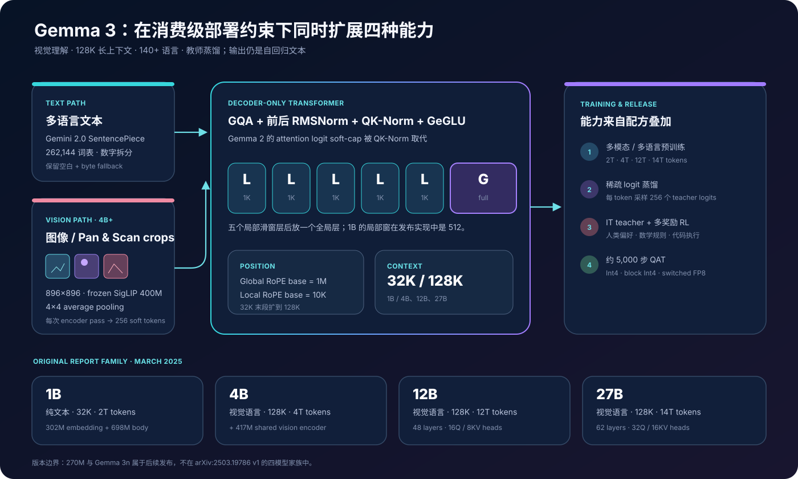
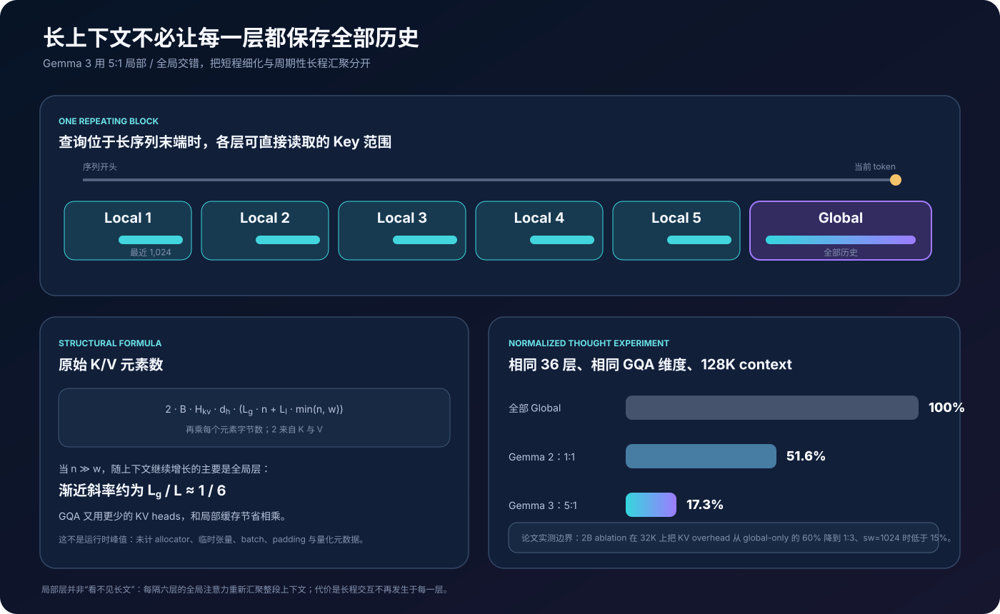
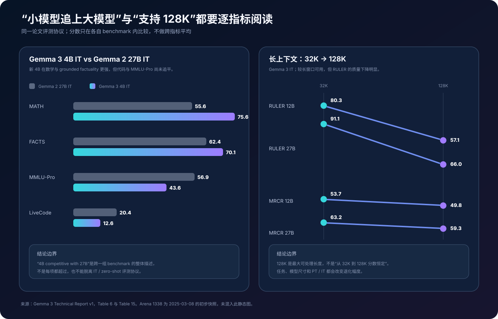

# Gemma 3 原理详解：视觉、128K 长上下文、蒸馏与消费级部署如何放进一个开放模型族


> **论文**：[Gemma 3 Technical Report](https://arxiv.org/abs/2503.19786)<br>
> **作者**：Gemma Team，Google DeepMind<br>
> **时间**：模型于 2025 年 3 月 12 日发布；技术报告 arXiv v1 于 2025 年 3 月 25 日公开<br>
> **关键词**：Open-weight Model、Multimodal LLM、SigLIP、Pan & Scan、Local/Global Attention、GQA、QK-Norm、128K Context、Knowledge Distillation、QAT<br>
> **配套代码**：[gemma3_minimal.py](./code/gemma3_minimal.py)（零依赖；演示 5:1 注意力层型、可见 Key 范围、KV Cache 估算、视觉 token 预算和稀疏 teacher-logit 蒸馏，不是 Gemma 3 权重或训练代码）<br>
> **前置阅读**：[Transformer](00_Transformer_2017_原理.md) · [RoPE](09_RoFormer_RoPE_2021_原理.md) · [GQA](44_GQA_2023_原理.md) · [Vision Transformer](74_Vision_Transformer_2020_原理.md) · [CLIP](76_CLIP_2021_原理.md) · [Gemini 1.0](28_Gemini_2023_原理.md)<br>
> **一手资料**：[arXiv HTML](https://arxiv.org/html/2503.19786) · [论文 PDF](https://arxiv.org/pdf/2503.19786) · [官方发布指南](https://developers.googleblog.com/en/introducing-gemma3/) · [官方架构解读](https://developers.googleblog.com/en/gemma-explained-whats-new-in-gemma-3/) · [模型卡](https://ai.google.dev/gemma/docs/core/model_card_3) · [27B IT 权重页](https://huggingface.co/google/gemma-3-27b-it) · [官方 JAX 实现](https://github.com/google-deepmind/gemma)

> [!IMPORTANT]
> 本文严格讨论 `arXiv:2503.19786v1` 对应的首发 Gemma 3：**1B、4B、12B、27B 四档**。其中 1B 是纯文本 32K 模型，只有 4B / 12B / 27B 接入视觉编码器并支持 128K。后来发布的 Gemma 3 270M、Gemma 3n、MedGemma、TranslateGemma 等不属于这份报告，不能把它们的架构、训练 token 或端侧能力倒灌进来。

> [!NOTE]
> Gemma 3 是**开放权重**模型，模型权重受 Gemma Terms / Prohibited Use Policy 约束；官方 JAX 代码仓库采用 Apache 2.0。报告没有开放预训练语料明细、大模型 teacher、完整后训练数据、RL 超参数、reward model 或端到端训练脚本，因此“可以下载权重”不等于“可以逐步复现训练”。

---

## 0. 先说结论

Gemma 3 不是简单把 Gemma 2 的上下文窗口改成 128K。它同时重做了四条轴：

```text
输入：纯文本 → 文本 + 图像
上下文：8K / 32K 级 → 4B+ 支持 128K
语言：重配多语言数据 + Gemini 2.0 tokenizer，覆盖 140+ 语言
训练：预训练蒸馏 + IT teacher 蒸馏 + 多种 RL + QAT
```

真正把这些能力装进标准硬件的关键，不是某一项 benchmark，而是一个系统性取舍：

> 让多数层只缓存最近 1,024 个 token，每五个局部层插入一个能访问全部历史的全局层；长程信息仍能周期性汇聚，KV Cache 却不必在每层都随上下文线性增长。

读完本文，至少应记住下面二十四点：

1. **首发 Gemma 3 只有四个尺寸**：1B、4B、12B、27B，并同时发布 PT 与 IT checkpoint。
2. **1B 是例外。**它没有视觉编码器，最大上下文为 32K；4B、12B、27B 才是 image-text input、text output 的 128K 模型。
3. **“多模态”不是任意模态。**原报告支持文本和图像输入、文本输出；视频可以拆帧作为多张图像输入，但没有音频编码器，也不直接生成图像。
4. **视觉前端是约 400M 的 SigLIP ViT。**4B / 12B / 27B 共享同一种 417M 参数视觉编码器设计，训练语言模型时保持冻结。
5. **每次视觉编码固定压成 256 个 soft tokens。**896×896 的高分辨率 encoder 输出经过 4×4 average pooling，不把全部 patch token 塞进长上下文。
6. **Pan & Scan 是推理时预处理，不是另一套视觉模型。**它把非方形或高分辨率图像切成不重叠 crop，再分别缩放到 896×896；细节更清楚，但每个 crop 都增加编码和 token 成本。
7. **主干仍是 decoder-only Transformer。**使用 GQA、GeGLU、RoPE，以及 attention / FFN 子层前后的 RMSNorm。
8. **QK-Norm 取代 Gemma 2 的 attention logit soft-capping。**先约束 Query / Key 的尺度，再计算点积，避免依赖固定 logit 上限。
9. **注意力层按 `LLLLLG` 重复。**五个 local sliding-window 层接一个 global 层，并从 local 层开始。
10. **4B+ 的局部滑窗是 1,024 token。**官方发布实现中 1B 使用 512；论文正文主要用 1,024 讨论长上下文架构。
11. **局部层减少的不只是 attention FLOPs，也包括 KV Cache。**local 层只需保留窗口内 K/V，全局层才保存完整历史。
12. **GQA 与局部缓存是两层独立节省。**GQA 减少每个 token 的 KV heads，local/global 交错减少大多数层需要缓存的 token 数，两者效果相乘。
13. **128K 不是从头用 128K 序列训练。**4B / 12B / 27B 先以 32K 预训练，在末段通过 RoPE rescaling 扩到 128K。
14. **Global 与 Local 使用不同 RoPE base。**全局层从 10K 提高到 1M，局部层保持 10K；论文经验上使用 scale factor 8。
15. **支持 128K 不等于质量不衰减。**例如 27B IT 的 RULER 从 32K 的 91.1 降到 128K 的 66.0；退化幅度取决于任务、尺寸和 PT / IT。
16. **预训练 token 随尺寸变化**：1B 2T、4B 4T、12B 12T、27B 14T，不是四档都在同一 token 预算上训练。
17. **词表实际为 262,144。**论文表格把它近似写成 256K，正文写 262K；tokenizer 来自 Gemini 2.0，采用 split digits、保留空白和 byte encodings。
18. **所有尺寸都做预训练知识蒸馏。**每个 token 从 teacher 分布按概率采样 256 个 vocabulary logits，未采样 target 置零，再归一化做 cross-entropy。
19. **teacher 越大并非短程总是越好。**短训练 horizon 中小 teacher 更有正则效果；训练 token 足够多后，大 teacher 的质量优势反转胜出。
20. **IT 不只是 SFT。**后训练结合大型 instruction teacher 蒸馏、改进版 BOND / WARM / WARP，以及人类偏好、数学真值和代码执行等多种 reward。
21. **QAT 是正式发布链的一部分。**每个模型额外训练约 5,000 步，用原始 checkpoint 概率作 target，提供 per-channel Int4、block Int4 与 switched FP8 版本。
22. **4B IT “可比 Gemma 2 27B IT”不是每项都超过。**MATH 与 FACTS Grounding 更强，但 MMLU-Pro 和 LiveCodeBench 仍落后。
23. **27B IT 与 Gemini 1.5 Pro “comparable”也不是全面胜出。**它在 MATH / HiddenMath 更高，在 GPQA、MMLU-Pro 等更低，MMMU 接近。
24. **Arena 1338 是时间快照。**论文使用 2025 年 3 月 8 日的初步 Elo，而且当时 Arena 不评视觉能力；不能拿今天的动态榜单反向替换该数字。



一句话记忆：

> Gemma 3 用固定视觉 token、5:1 局部/全局注意力、末段位置扩展和多阶段蒸馏，把视觉、长上下文与较强后训练压进 1B–27B 的开放权重模型族；它的优势是能力—内存折中，而不是“128K 内所有 token 都在每层全连接”。

---

## 1. 先分清四个模型、两类 checkpoint 和三个后续分支

### 1.1 原始四模型家族

论文 Table 1 给出的参数分解如下：

| 模型 | 视觉编码器 | Embedding 参数 | 非 Embedding 参数 | 近似总量 | 上下文 | 视觉输入 |
|---|---:|---:|---:|---:|---:|---|
| Gemma 3 1B | 0 | 302M | 698M | 1.0B | 32K | 否 |
| Gemma 3 4B | 417M | 675M | 3,209M | 4.30B | 128K | 是 |
| Gemma 3 12B | 417M | 1,012M | 10,759M | 12.19B | 128K | 是 |
| Gemma 3 27B | 417M | 1,416M | 25,600M | 27.43B | 128K | 是 |

品牌名是近似尺寸，不应拿 `4B` 直接推断磁盘字节、训练 FLOPs或非 embedding body 的参数量。4B checkpoint 的总模块参数约 4.30B，其中视觉编码器已经占 417M。

三个视觉模型使用同一种 SigLIP encoder 设计，不表示它们在推理时共享同一份跨进程内存；每个部署实例仍要加载或调用对应视觉前端。

### 1.2 PT 与 IT 回答不同问题

```text
PT（pre-trained）
  → 续写式基础模型，适合领域继续预训练、迁移或自定义后训练

IT（instruction-tuned）
  → 按 user / model turn 对话，接受图文指令并输出回答
```

论文同时报告 PT probing、下游 transfer 和 IT benchmark。看到一个分数时必须先确认 checkpoint 类型：

- PT 的 MMLU、MATH 常用 few-shot / in-context protocol；
- IT 的 Table 6 使用统一 zero-shot 设置；
- 视觉 PT 可以再按 PaliGemma 2 protocol 做任务微调；
- Arena 只比较 IT 的对话偏好。

### 1.3 不属于这篇报告的“Gemma 3”名字

后续官方模型卡可能同时列出：

```text
Gemma 3 270M
Gemma 3n E2B / E4B
ShieldGemma 2
MedGemma
TranslateGemma
```

它们分别有新的训练预算、端侧架构、领域数据或安全用途。尤其 Gemma 3n 使用 MatFormer、Per-Layer Embeddings、AltUp / LAuReL 和移动视觉/音频前端，和本文的标准 Gemma 3 decoder 不是同一个架构。

---

## 2. 主干架构：Gemma 2 骨架改了哪些地方

### 2.1 Decoder-only、GQA 与双重 RMSNorm

对第 $l$ 层，可以用下列教学抽象表示：

$$
a_l=
\operatorname{RMSNorm}_{post}
\left[
\operatorname{Attn}
\left(
\operatorname{RMSNorm}_{pre}(h_l)
\right)
\right],
\qquad
\tilde h_l=h_l+a_l,
$$

$$
f_l=
\operatorname{RMSNorm}_{post}
\left[
\operatorname{GeGLU}
\left(
\operatorname{RMSNorm}_{pre}(\tilde h_l)
\right)
\right],
\qquad
h_{l+1}=\tilde h_l+f_l.
$$

这里是为了表达“attention / FFN 计算前后都有 normalization，之后再走残差”的结构；真实实现为两个子层维护各自的 norm 参数。

GQA 让多个 Query heads 共享较少的 K/V heads。若 Query head 数为 $H_q$、KV head 数为 $H_{kv}$：

$$
H_{kv}<H_q.
$$

每个历史 token 的 K/V 存储从 MHA 的：

$$
2H_qd_h
$$

降为：

$$
2H_{kv}d_h.
$$

这与 local/global attention 是正交设计：前者减少每个缓存位置的宽度，后者减少多数层保存的位置数。

### 2.2 QK-Norm 取代 soft-capping

Gemma 2 会对 attention logits 使用 soft-cap，概念上类似：

$$
\operatorname{softcap}_c(x)
=c\tanh(x/c).
$$

Gemma 3 删除 attention logit soft-cap，改为 QK-Norm。教学化地写：

$$
\bar q=\operatorname{Norm}(q),\qquad
\bar k=\operatorname{Norm}(k),
$$

$$
a_{ij}=\frac{\bar q_i^\top\bar k_j}{\sqrt{d_h}}.
$$

区别在于：

- soft-cap 在点积以后压缩过大的 logit；
- QK-Norm 在点积以前稳定向量尺度。

报告没有把提升归因于单独一项完整消融，官方开发者解读称它同时改善准确率与处理效率。不能把“删除 soft-cap”误写成“完全不再控制 attention 数值范围”。

### 2.3 发布实现中的结构参数

论文正文主要公开参数分解；官方 JAX 实现补充了层数和 head 设置：

| 模型 | Layers | $d_{model}$ | Q heads | KV heads | head dim | local window | Vision |
|---|---:|---:|---:|---:|---:|---:|---|
| 1B | 26 | 1,152 | 4 | 1 | 256 | 512 | 无 |
| 4B | 34 | 2,560 | 8 | 4 | 256 | 1,024 | 有 |
| 12B | 48 | 3,840 | 16 | 8 | 256 | 1,024 | 有 |
| 27B | 62 | 5,376 | 32 | 16 | 128 | 1,024 | 有 |

这张表属于发布实现语义，不是论文 Table 1 的逐字转录。未来库版本可能加入后续模型类；复现实验应固定 commit，不能只写“用了最新 gemma 包”。

---

## 3. 5:1 局部 / 全局注意力：128K 的内存核心



### 3.1 层型是 `LLLLLG`，不是 token 稀疏路由

Gemma 3 重复下面的模式：

```text
Layer 0  Local
Layer 1  Local
Layer 2  Local
Layer 3  Local
Layer 4  Local
Layer 5  Global
Layer 6  Local
...
```

Local 层中，第 $t$ 个 token 只能直接访问：

$$
j\in[\max(0,t-w+1),t],
$$

其中 4B+ 的 $w=1024$。Global 层仍使用因果全注意力：

$$
j\in[0,t].
$$

所以它不是 Mistral 式“所有层都只有滑窗”，也不是 MoE 式参数稀疏。每隔六层，所有历史 token 仍能进行一次全局交互。

### 3.2 KV Cache 公式

设：

- batch size 为 $B$；
- KV head 数为 $H_{kv}$；
- head dim 为 $d_h$；
- 全局层数为 $L_g$；
- 局部层数为 $L_l$；
- 当前上下文长度为 $n$；
- local window 为 $w$；
- 每元素字节数为 $s$。

只计算原始 K/V tensor，近似内存为：

$$
M_{KV}
=2BsH_{kv}d_h
\left[
L_gn+L_l\min(n,w)
\right].
$$

全局注意力模型则是：

$$
M_{global}
=2BsH_{kv}d_hLn.
$$

当 $n\gg w$ 且 $L_g:L_l\approx1:5$：

$$
\frac{M_{KV}}{M_{global}}
\approx
\frac{1}{6}+
\frac{5w}{6n}.
$$

上下文越长，第二项越小，渐近斜率接近全局模型的六分之一。

### 3.3 计算量也按同样思路下降

忽略常数与 GQA 宽度：

$$
C_{attn}
\approx
L_gO(n^2)+L_lO(nw).
$$

只有全局层承担 $n^2$ 的长程注意力，五分之六的层近似线性于 $nw$。这不代表总推理成本只有六分之一：

- FFN 计算没有按上下文范围减少；
- global 层仍可能成为长序列瓶颈；
- prefill、decode、batch 与 kernel 实现的瓶颈不同；
- 图像 crop、投影和 sampling 也占成本。

### 3.4 论文实测应怎样读

论文在 2B text-only ablation 上比较 32K prefill：

- global-only 架构中，KV Cache 相对模型内存的 overhead 约 60%；
- `local:global=1:3`、`window=1024` 时降到 15% 以下；
- local/global 比例提高到 7:1，验证 perplexity 变化仍很小；
- local window 大幅缩短也没有在该 ablation 上明显伤害 perplexity。

这些结果支持“多数层不必全局”的方向，但边界包括：

- ablation 使用较小 text-only 模型；
- perplexity 不是所有长程任务的充分指标；
- 1:3 memory 图与最终 5:1 配方不是同一个点；
- 运行时总显存还包括权重、activation、allocator 和临时 buffer。

---

## 4. 长上下文：32K 预训练后怎样扩到 128K

### 4.1 不是从头喂 128K

论文明确说明：4B、12B、27B 大部分预训练使用最长 32K 序列，在预训练末段才扩到 128K。

```text
主体预训练：≤ 32K
  ↓
提高 global RoPE base：10K → 1M
  ↓
对 global attention 做位置尺度扩展，经验 scale factor = 8
  ↓
末段长上下文训练
  ↓
支持 128K
```

1B 没有这一 128K 扩展，保持 32K。

### 4.2 为什么 Local 与 Global 用不同 RoPE base

RoPE 在第 $m$ 个二维子空间中的角频率可抽象为：

$$
\omega_m=b^{-2m/d_h},
$$

位置 $p$ 的相位为：

$$
\phi_{p,m}=p\omega_m.
$$

提高 base $b$ 会让一部分维度的旋转更慢，有利于更长距离外推。Gemma 3 设置：

```text
Global layers: base = 1,000,000
Local layers:  base =    10,000
```

局部层只看最近 1K，本来不需要表达 128K 绝对跨度；全局层承担长程定位，才需要更慢的位置变化。

### 4.3 scale factor 8 不等于“上下文恰好放大 8 倍”

32K 到 128K 是四倍长度，但论文经验使用 position rescaling factor 8。这个数是训练与 perplexity 曲线选出的配置，不应仅用长度比例推导，也不意味着有效上下文自动成为 256K。

论文观察：模型能泛化到 128K，但继续外推会快速退化。因此 128K 是已训练/验证的产品边界，不是无限 RoPE 外推的证明。

### 4.4 最大窗口与有效窗口不是一回事

论文 Table 15 的 IT 结果：

| Benchmark | 模型 | 32K | 128K | 变化 |
|---|---:|---:|---:|---:|
| RULER | 12B | 80.3 | 57.1 | -23.2 |
| RULER | 27B | 91.1 | 66.0 | -25.1 |
| MRCR | 12B | 53.7 | 49.8 | -3.9 |
| MRCR | 27B | 63.2 | 59.3 | -3.9 |

RULER 对 retrieval、tracking 和干扰项位置更敏感，下降明显；MRCR 下降较小。这说明“支持 128K”的正确翻译是：

> 模型和实现允许在该长度处理输入，并在长上下文 benchmark 上保有非平凡能力；不同任务的有效利用率不会保持恒定。

---

## 5. 视觉路径：896×896 怎样变成 256 个 soft tokens

### 5.1 冻结 SigLIP 视觉编码器

4B、12B、27B 接入约 400M 的 SigLIP encoder。SigLIP 是 Vision Transformer，以 sigmoid 对比目标训练图文表示。

Gemma 3 的视觉路径可抽象为：

$$
I
\xrightarrow{\text{resize / crop}}
I_{896\times896}
\xrightarrow{E_{SigLIP}}
Z_{patch}
\xrightarrow{\text{4×4 avg pool}}
Z_{256}
\xrightarrow{P}
\tilde Z_{256\times d_{model}}.
$$

其中 $P$ 是 multimodal projector，把视觉特征映射到语言模型宽度。$\tilde Z$ 被语言模型当作一段连续 soft tokens，而不是离散词表 ID。

报告公开的关键边界：

- 输入固定缩放到 896×896；
- encoder 在 Gemma 3 训练时冻结；
- 每次 encoder pass 固定得到 256 image tokens；
- 语言模型学习如何消费这些视觉表示；
- 训练时可以预先计算 image embeddings，减少 LLM 训练阶段的视觉计算。

### 5.2 为什么高分辨率仍只输出 256 tokens

若直接保留高分辨率的全部 patch，视觉 token 会大量占用上下文，并进入每层 attention。Gemma 3 选择把分辨率收益留在 encoder 内，再用 average pooling 固定接口宽度。

论文短程 2B ablation：

| Encoder resolution | DocVQA | InfoVQA | TextVQA |
|---:|---:|---:|---:|
| 256 | 31.9 | 23.1 | 44.1 |
| 448 | 45.4 | 31.6 | 53.5 |
| 896 | **59.8** | **33.7** | **58.0** |

高分辨率明显帮助 OCR / document tasks，即使输出 soft-token 数仍是 256。它说明 encoder 可以先在更细的像素网格中提取信息，再压缩；不说明 average pooling 没有损失。

### 5.3 Pan & Scan 解决什么

把长截图或宽幅图强行拉成正方形会导致：

- 字符变形或太小；
- 小物体消失；
- 原始长宽比被破坏；
- 局部高分辨率细节丢失。

P&S 在需要时把图像分成若干不重叠、等尺寸 crop，覆盖整张图，每个 crop 再缩放为 896×896。概念成本为：

$$
N_{vision\ tokens}
=256\times N_{encoder\ passes}.
$$

如果一张图使用原图视图加若干 crop，context 与视觉 encoder 成本会按 pass 数增长。论文没有公开一条足以逐像素复现的 crop planner，因此配套代码要求调用者显式传入 pass 数，不伪造官方 P&S 算法。

### 5.4 P&S 的收益集中在读图文字

预训练 checkpoint 的 4-shot ablation：

| 模型 | 设置 | DocVQA | InfoVQA | TextVQA |
|---|---|---:|---:|---:|
| 4B | 无 P&S | 72.8 | 44.1 | 58.9 |
| 4B | 有 P&S | **81.0** | **57.0** | **60.8** |
| 27B | 无 P&S | 85.6 | 59.4 | 68.6 |
| 27B | 有 P&S | **90.4** | **76.4** | **70.2** |

InfoVQA 提升最大，符合 infographic 中小字号文字、非方形布局依赖 crop 的直觉。P&S 可关闭以降低延迟；对普通方形照片，额外 crop 不一定值得。

### 5.5 图像 block 与文本的 attention mask

官方开发者架构说明补充：Gemma 3 对图像输入使用 block 内双向 attention，而文本生成保持因果方向。教学抽象为：

$$
M_{ij}=
\begin{cases}
1,&i,j\text{ 属于同一 image block},\\
1,&j\le i\text{ 且满足该层 local/global 范围},\\
0,&\text{otherwise}.
\end{cases}
$$

图像 patches 是同时已知的条件，不必像输出文字那样按左到右预测；后续文本可以读取此前完整 image block。

---

## 6. 预训练：不同尺寸为什么吃不同 token 预算

### 6.1 训练 token 与硬件

| 模型 | 预训练 token | TPU | Chips | Data shards | Sequence shards | Replicas |
|---|---:|---|---:|---:|---:|---:|
| 1B | 2T | TPUv5e | 512 | 16 | 16 | 2 |
| 4B | 4T | TPUv5e | 2,048 | 16 | 16 | 8 |
| 12B | 12T | TPUv4 | 6,144 | 16 | 16 | 24 |
| 27B | 14T | TPUv5p | 6,144 | 24 | 8 | 32 |

训练 token 包含文本与图像相关数据。模型越大总体预算越高，但并不按参数线性增加：4B 到 12B 参数约三倍、token 也三倍；12B 到 27B 参数超过两倍，token 只从 12T 到 14T。

报告没有给出：

- 文本 / 图像 token 的统一换算方式；
- 各语言和领域的具体混合比例；
- 长上下文末段占多少 token；
- teacher inference 的额外计算；
- 总训练 FLOPs 与能耗。

所以不能仅用公开 token 数做完整 compute-optimal 分析。

### 6.2 多语言数据与 tokenizer

Gemma 3 增加单语和平行数据，并参考语言不平衡重加权策略。官方发布材料称支持 140+ 语言；“支持”不等于：

- 140 种语言数据量相等；
- 每种都达到英语水平；
- 所有语言都做过同等 benchmark；
- 视觉文本覆盖同样多语言。

tokenizer 来自 Gemini 2.0：

```text
SentencePiece
split digits
preserved whitespace
byte-level encodings / fallback
vocabulary = 262,144
```

数字拆分让长数字表示更规律，byte fallback 避免未知字符，保留空白对代码和格式敏感任务重要。更均衡的词表能减少非英语被切得过碎，但效果仍依赖训练数据。

### 6.3 数据过滤与去污染

报告称预训练阶段包含：

- 不安全内容过滤；
- 部分个人和敏感信息移除；
- benchmark decontamination；
- 降低可背诵敏感输出风险；
- 质量 reweighting，减少低质量数据。

“做过去污染”不等于评测完全无污染。论文自己提醒，公开 benchmark 与网页语料的重合风险仍使 pretraining probe 的因果结论不确定。

---

## 7. 预训练蒸馏：每个 token 只保存 256 个 teacher logits

### 7.1 从 hard label 到 teacher distribution

普通 next-token loss 只把真实 token $y_t$ 当作 target：

$$
\mathcal L_{NLL}
=-\log p_S(y_t\mid x,y_{<t}).
$$

teacher distribution 还告诉 student：哪些错误 token 比另一些更合理。完整蒸馏为：

$$
\mathcal L_{KD}
=-\sum_{v\in\mathcal V}
q_T(v)\log p_S(v).
$$

但词表有 262,144 项，为每个训练 token 存完整 teacher logits 成本很高。

### 7.2 稀疏 256-logit target

论文做法是从 teacher distribution 按概率采样 $|S_t|=256$ 个词表项，未采样项 target 概率设为 0，再对采样集合归一化：

$$
\tilde q_T(v)=
\begin{cases}
\dfrac{\exp z_T(v)}
{\sum_{u\in S_t}\exp z_T(u)},&v\in S_t,\\
0,&v\notin S_t.
\end{cases}
$$

蒸馏 loss：

$$
\mathcal L_{sparseKD}
=-\sum_{v\in S_t}
\tilde q_T(v)\log p_S(v).
$$

这比 top-1 hard label 富含“相似答案”信息，又把 teacher target 存储从 $|\mathcal V|$ 降到 256 项。

需要注意：

- 报告说“sampled, weighted by teacher probabilities”，不是简单固定 top-256；
- 未采样 target 为 0 不代表 teacher 认为它们不可能，只是稀疏近似；
- student softmax 仍覆盖完整词表，采样 target 会间接压低未入选总概率；
- teacher 身份、温度、采样重复处理和全套 loss 混合没有充分公开。

### 7.3 为什么长 horizon 后大 teacher 更好

论文比较大小两个 teacher：

```text
短训练 horizon：小 teacher 更好
长训练 horizon：大 teacher 更好
```

作者的解释是，小 teacher 的较软/较差目标在训练初期可能提供更强正则；学生训练足够久后，大 teacher 的知识质量最终占优。

这否定了两个过度概括：

- “student 小，所以 teacher 也应小”；
- “teacher 越强，从第一步就一定越好”。

teacher 选择必须连同训练 token、student 容量和蒸馏目标一起评估。

---

## 8. 后训练：IT teacher、RL 与模型合并

### 8.1 不是单一 RLHF 阶段

Gemma 3 的 PT checkpoint 通过改进后训练变成 IT。报告列出：

```text
大型 instruction-tuned teacher 蒸馏
  + 改进版 BOND（on-policy distillation / RL 风格优化）
  + WARM（weight-averaged reward models）
  + WARP（policy / model merging 路线）
  + 多种任务 reward
```

reward 包括：

- 人类反馈训练的 weight-averaged reward models；
- 代码执行反馈；
- 数学题 ground-truth reward；
- helpfulness、reasoning、instruction following、多语言与安全目标。

官方开发者指南将它概括为：大型 IT teacher 蒸馏、RLHF、RLMF 和 RLEF。论文没有公开各 reward 权重、采样策略、rollout 数、KL、优化步数或 merge 系数，因此不能把它重写成一份可直接运行的 PPO / DPO 配方。

### 8.2 后训练数据过滤本身也是能力设计

过滤项包括：

- 个人信息；
- 不安全或有毒输出；
- 错误的自我身份声明；
- 重复样本；
- 低质量或不符合格式的示例。

团队还加入鼓励 attribution、hedging 和 refusal 的数据子集，以改善 factuality 而不明显损害其他能力。

这提醒我们：Gemma 3 4B IT 的提升不能全部归因于 PT 蒸馏或模型架构，后训练数据选择和 reward 也改变了行为分布。

### 8.3 Chat template 与结束 token

论文 Table 4 的格式：

```text
[BOS]<start_of_turn>user
Who are you?<end_of_turn>
<start_of_turn>model
My name is Gemma!<end_of_turn>
```

关键点：

- `[BOS]` 必须添加真实 token，不能把字符串 `"[BOS]"` 当普通文本 tokenize；
- PT generation 以 `<eos>` 结束；
- IT model turn 以 `<end_of_turn>` 结束；
- 微调时若终止 token 用错，模型会学坏对话边界；
- 报告模板只展示 user / model turn，不应假定任意框架的 system role 会被原生理解。

---

## 9. QAT：权重量化不等于长上下文显存问题消失

### 9.1 约 5,000 步量化感知训练

官方同时发布原始 checkpoint 和 QAT 版本。流程是：

```text
加载非量化 checkpoint
  ↓
在前向中模拟目标低精度权重
  ↓
用原 checkpoint 输出概率作为 teacher target
  ↓
混合匹配 PT / IT 分布的数据
  ↓
约 5,000 steps 适配量化误差
```

目标格式：

- per-channel Int4；
- block size 32 的 Int4；
- switched FP8（SFP8）。

QAT 与纯 PTQ 的区别是：模型权重会在模拟量化误差存在时继续优化，而不是训练完直接四舍五入。

### 9.2 论文内存表

论文以 32,768 context 报告 GB：

| 模型 | BF16 weights | Int4 | Block Int4 | SFP8 | BF16 + KV | Int4 + KV | Block Int4 + KV | SFP8 + KV |
|---|---:|---:|---:|---:|---:|---:|---:|---:|
| 1B | 2.0 | 0.5 | 0.7 | 1.0 | 2.9 | 1.4 | 1.6 | 1.9 |
| 4B | 8.0 | 2.6 | 2.9 | 4.4 | 12.7 | 7.3 | 7.6 | 9.1 |
| 12B | 24.0 | 6.6 | 7.1 | 12.4 | 38.9 | 21.5 | 22.0 | 27.3 |
| 27B | 54.0 | 14.1 | 15.3 | 27.4 | 72.7 | 32.8 | 34.0 | 46.1 |

Int4 没有达到理想 `BF16 / 4` 的每个点，原因可能包括 scales、分块、padding、未量化张量和格式开销。更重要的是：

> 权重从 BF16 变成 Int4 后，KV Cache 不会自动按同一比例缩小。

长上下文、batch size 和 cache dtype 仍可能让推理显存被 KV 主导。Gemma 3 的 local/global 设计与 GQA 解决的正是这个独立问题。

---

## 10. 零依赖代码：验证结构语义，不下载 27B 权重

配套 [gemma3_minimal.py](./code/gemma3_minimal.py) 把四个容易混淆的机制拆成纯 Python。

### 10.1 注意力层型

```python
def attention_pattern(num_layers, local_layers_per_global=5):
    period = local_layers_per_global + 1
    return tuple(
        "global" if (layer + 1) % period == 0 else "local"
        for layer in range(num_layers)
    )
```

如果层数不能被 6 整除，模式会按发布实现截断。例如 4B 有 34 层：

```text
29 local + 5 global
```

这仍叫 5:1 repeating pattern，不要求最终统计恰好是整数比。

### 10.2 可见 Key 范围

```python
if layer_type == "global":
    key_range = (0, query_position + 1)
else:
    key_range = (
        max(0, query_position + 1 - local_window),
        query_position + 1,
    )
```

第 2,000 个位置在 local window 1,024 中只保留 `[977, 2001)`；到第六个 global 层又可读取 `[0, 2001)`。

### 10.3 KV Cache 估算

代码按每层实际缓存位置求和：

```python
cached_positions = 0
for layer_type in attention_pattern(config.num_layers):
    cached_positions += (
        context
        if layer_type == "global"
        else min(context, config.local_window)
    )

elements = (
    2 * batch_size * num_kv_heads * head_dim * cached_positions
)
```

运行 4B / 128K 示例：

```bash
python3 papers/to-2026/code/gemma3_minimal.py \
  --model 4b --context 131072
```

输出的是原始 K/V tensor 理论量，用于比较层型；它不会冒充论文 Table 3 的完整运行时内存。

### 10.4 视觉 token 预算

```python
vision_tokens = (
    image_count * encoder_passes_per_image * 256
)
```

正常单图一次 pass 是 256；两张图、每张三次 P&S pass 是 1,536。真正 crop 数由图像比例与实现策略决定。

### 10.5 稀疏蒸馏 target

```python
selected_probs = softmax(
    [teacher_logits[token_id] for token_id in sampled_ids]
)
target = [0.0] * vocab_size
for token_id, probability in zip(sampled_ids, selected_probs):
    target[token_id] = probability
```

测试确认 target 总和为 1、未采样词概率为 0，并验证与 teacher 排序一致的 student loss 更低。

运行断言：

```bash
python3 papers/to-2026/code/gemma3_minimal.py --test
```

脚本没有实现：真实 attention kernel、SigLIP、P&S crop planner、RoPE 插值、teacher 采样器、JAX sharding、QAT fake quant 或权重加载。它是论文算子的语义检查，不是替代官方库。

---

## 11. 结果：4B 追上 27B，究竟追上了什么



### 11.1 Gemma 3 4B IT vs Gemma 2 27B IT

论文统一 zero-shot 设置中的代表项：

| Benchmark | Gemma 2 27B IT | Gemma 3 4B IT | 谁更高 |
|---|---:|---:|---|
| MATH | 55.6 | **75.6** | Gemma 3 4B |
| FACTS Grounding | 62.4 | **70.1** | Gemma 3 4B |
| MMLU-Pro | **56.9** | 43.6 | Gemma 2 27B |
| LiveCodeBench | **20.4** | 12.6 | Gemma 2 27B |
| Bird-SQL | **46.7** | 36.3 | Gemma 2 27B |

所以“Gemma 3 4B competitive with Gemma 2 27B”是多能力整体描述，最强证据来自数学、对齐和 factuality 的大幅后训练提升，不是参数缩小 7 倍后所有基础能力都无损保留。

### 11.2 Gemma 3 27B IT vs Gemini 1.5 Pro

| Benchmark | Gemini 1.5 Pro | Gemma 3 27B IT |
|---|---:|---:|
| MMLU-Pro | **75.8** | 67.5 |
| LiveCodeBench | **34.2** | 29.7 |
| Bird-SQL | 54.4 | 54.4 |
| GPQA Diamond | **59.1** | 42.4 |
| FACTS Grounding | **80.0** | 74.9 |
| MATH | 86.5 | **89.0** |
| HiddenMath | 52.0 | **60.3** |
| MMMU | **65.9** | 64.9 |

“Comparable across benchmarks”成立于整体能力轮廓，并不意味着 27B 开放模型复刻了 Gemini 1.5 Pro 的全部推理、工具、多模态或服务能力。

### 11.3 Arena 1338 的时间和模态边界

论文列出 2025 年 3 月 8 日初步结果：

```text
Gemma 3 27B IT: Elo 1338，95% CI +8 / -9，表中并列第 9
Gemma 2 27B IT: Elo 1220
```

需要同时保留四个限定：

1. Arena 是动态榜单，模型池和投票会变化；
2. 1338 是论文冻结的历史快照；
3. 人类偏好 Elo 不等于静态 benchmark accuracy；
4. 当时 Arena 比较不计视觉能力。

---

## 12. 消融实验真正支持哪些因果判断

### 12.1 Local:Global 比例

Text-only 小模型中，从 1:1 提高到 7:1 对 validation perplexity 影响很小。这支持“全局层可以更稀疏”，但没有证明所有 retrieval、代码或图像任务在 7:1 都无损。

最终选择 5:1 是质量、内存和长程通信的折中，不是论文搜索出的唯一理论最优点。

### 12.2 Sliding window

论文在 1:1、1:3 等设置下缩短 local window，perplexity 变化仍小。最终 4B+ 用 1,024，Gemma 2 用 4,096。

这说明大量局部 token 的直接 attention 可能冗余；但代码仓库、精确复制或局部间隔超过 1K 的任务，仍需要依靠后续 global 层恢复联系。

### 12.3 Vision resolution

256 → 448 → 896 的 DocVQA / TextVQA 单调改善，是相对干净的 encoder-resolution ablation。由于输出都压为 256 tokens，提升可归因于视觉前端先看到更细像素，而不是 context token 更多。

### 12.4 Pan & Scan

同一 checkpoint 开关 P&S，在文档与 infographic 任务显著改善。这是 inference-time compute 换准确率，不能算“模型参数能力免费提升”。

### 12.5 Teacher size

小 teacher 短 horizon 更好、大 teacher 长 horizon 更好，说明 teacher quality 与 regularization 发生交互。它不是对 Gemma 3 最终所有尺寸的完整 teacher 消融，因为 teacher 身份与预算细节未公开。

---

## 13. 多语言、视觉和 STEM 提升并非每项单调

### 13.1 预训练阶段的多语言代表结果

Gemma 3 27B PT 相对 Gemma 2 27B PT：

| Benchmark | Gemma 2 27B | Gemma 3 27B |
|---|---:|---:|
| MGSM | 68.0 | **74.3** |
| Global MMLU-Lite | 69.4 | **75.7** |
| WMT24++ | 53.0 | **55.7** |
| FLORES | 44.3 | **48.8** |
| XQuAD | 73.9 | **76.8** |

这些结果支持数据与 tokenizer 调整有效，但不能据此说 140+ 语言都等量提升。IndicGenBench 中也存在接近、回落或尺寸非单调的子项。

### 13.2 STEM / Code 也有例外

27B PT：

```text
MATH:      42.1 → 50.0
GSM8K:     74.6 → 82.6
MBPP:      60.8 → 65.6
HumanEval: 51.2 → 48.8
GPQA:      26.3 → 24.3
```

论文自己指出 4B / 12B 的代码整体改善更一致，27B 不完全如此。技术报告中“improves in most categories”不能缩写成“所有 benchmark 单调提高”。

---

## 14. 隐私、记忆与安全评估

### 14.1 记忆测试怎样做

团队从训练语料各 corpus 均匀抽样，用：

```text
50-token prefix → 模型续写 50-token suffix
```

分类：

- exact memorization：续写 token 全部与原 suffix 相同；
- approximate memorization：编辑距离不超过 10%。

论文报告 Gemma 3 的长文本记忆率低于先前 Gemma / Gemini，图使用对数纵轴；4B、12B、27B 之间差异较小，1B 更低。approximate memorization 平均约为 exact 的 24 倍。

“更低”不等于“没有记忆”：

- 测试只覆盖抽样 corpus 与固定 prefix attack；
- discoverable extraction 会随 prompt、sampling 和攻击方法变化；
- 编辑距离阈值不是语义泄漏的完整测量。

### 14.2 个人信息结果的正确表述

团队用 Google Cloud Sensitive Data Protection 检测被判为 memorized 的输出，没有在 Gemma 3 样本中检测到个人信息。

论文的谨慎结论是：

> 在该测试和检测阈值下，个人信息率较低，低于检测能力。

不能改写为“训练数据没有个人信息”或“模型绝不会输出个人信息”。检测器高召回也有大量 false positives，且仍可能 false negative。

### 14.3 Safety

预训练做安全过滤，IT 同时用 SFT / RLHF 对齐 Google safety policies，覆盖儿童性剥削、PII、仇恨骚扰、危险内容、自伤、露骨内容和违反科学共识的医疗建议。

论文还进行：

- 合成 adversarial prompts + 人类标注的 policy violation rate；
- CBRN 知识闭集评测；
- 开放权重发布风险治理；
- 多模态风险评估。

主文称总体 violation rate 很低、CBRN 知识水平低，但没有给出足以让外部复算所有结论的完整数据。开放权重一旦发布不可撤回，应用仍需输入过滤、输出审核、工具权限和领域安全层。

---

## 15. Gemma 3、Gemma 2、PaliGemma 2 与 Gemini 的关系

| 模型 | 核心定位 | 输入 / 输出 | 长上下文 | 权重 | 不应混淆的点 |
|---|---|---|---|---|---|
| Gemma 2 | 纯文本开放权重 LLM | text → text | 较短；1:1 local/global | 开放权重 | 没有 Gemma 3 的视觉前端与 5:1 配方 |
| PaliGemma 2 | 可迁移视觉语言模型 | image+text → text | 更偏专项 transfer | 开放权重 | 强项含 detection / segmentation 等迁移任务，不等同聊天模型 |
| Gemma 3 | 通用轻量 VLM / LLM | image+text → text | 4B+ 128K | 开放权重 | 1B 仍是 text-only；固定 256 image tokens/pass |
| Gemini 1.5 | 闭源服务型 frontier model | 多模态 → 多模态/文本能力 | 更长产品窗口 | 不开放权重 | Gemma 3 27B 某些 benchmark 接近，不等于系统等价 |

论文指出 Gemma 3 在 document understanding transfer 上可超过更大的 PaliGemma 2，且 4B / 12B 在同分辨率 transfer 时约便宜 10 倍；原因之一是平均池化后的固定 256 visual tokens。

但 PaliGemma 2 在 COCO caption、VQAv2 等任务仍略强，并具备 Gemma 3 通用聊天接口不直接提供的检测、分割用途。

---

## 16. 局限与开放问题

### 16.1 训练不可完整复现

没有公开：

- 原始训练数据和精确混合；
- teacher checkpoint 与完整 sparse-logit pipeline；
- 后训练 query、preference 和视觉对话数据；
- BOND / WARM / WARP 的 Gemma 3 具体超参数；
- reward 权重、RL rollout 和 model merge 细节；
- 训练 FLOPs、能耗、失败 run 与随机种子方差。

因此权重可研究、架构可实现，最终能力却不能仅凭报告端到端复制。

### 16.2 128K 的长程交互带宽有限

只有约六分之一层做 global attention。它节省内存与计算，也意味着任意两个远距离 token 的直接细粒度交互只周期性发生。对需要每层长程对齐的任务，可能存在质量上限。

### 16.3 固定 256 视觉 tokens 是信息瓶颈

高分辨率 encoder 能看到细节，但最终仍压缩为 256 vectors。P&S 通过多个 crop 绕过部分瓶颈，代价是 token 和延迟增长。密集 OCR、长文档页或微小物体仍可能丢失。

### 16.4 “开放模型”仍有许可证与生态依赖

权重不是 OSI 意义下无条件开源软件；使用者需接受 Gemma terms。部署还依赖 tokenizer、chat template、vision processor、quantization engine 和正确的 attention mask，只有 `.safetensors` 不足以复现行为。

### 16.5 Benchmark 与 contamination

报告做过去污染，但公开网页数据和 benchmark 的衍生版本可能重合；LMSYS 又是动态偏好测量。单一静态榜单不能证明一般智能或稳健性。

### 16.6 多模态安全不止文本拒答

图像可能包含提示注入、个人信息、恶意文档、隐写文字或错误 OCR。模型安全训练不能替代图片来源校验、OCR 隔离、tool permission 与输出审计。

---

## 17. 实践清单：选型与部署时检查什么

### 模型选择

- [ ] 只需文本且资源极小：是否优先 1B / 后续小模型，而不是加载无用 vision encoder？
- [ ] 需要图像：是否选择 4B+，并确认 processor 与 checkpoint 匹配？
- [ ] 任务需要 128K，还是 32K 内检索重排已经足够？
- [ ] Benchmark 是 PT、IT、P&S 还是特定 few-shot protocol？

### 图像输入

- [ ] 是否记录原图尺寸、crop 数与每图 encoder pass 数？
- [ ] 文档 / infographic 是否开启 P&S，普通照片是否可关闭省时？
- [ ] 多图的 `256 × passes` 是否挤占了文本上下文？
- [ ] 是否防御图像中的 prompt injection 与敏感信息？

### 长上下文

- [ ] 4B+ 是否真正配置到 131,072，而不是框架默认截断？
- [ ] KV Cache dtype、batch size 与 context 是否共同测过峰值显存？
- [ ] 模型实现是否保留 `LLLLLG` pattern 和 1,024 window？
- [ ] Global / Local RoPE base 与 scale factor 是否来自正确 config？
- [ ] 是否在自己的 128K 任务测有效准确率，而不只测“请求不报错”？

### 微调

- [ ] PT 与 IT checkpoint 是否选对？
- [ ] `[BOS]` 是真实 token，还是错误的普通字符串？
- [ ] PT 用 `<eos>`、IT 用 `<end_of_turn>` 的终止语义是否正确？
- [ ] 图像 encoder 是否按目标冻结，projector / LLM 哪些层参与训练？
- [ ] 长度、P&S、语言与安全样本是否覆盖目标分布？

### 量化

- [ ] 使用 QAT checkpoint 还是把 BF16 checkpoint 临时 PTQ？
- [ ] 权重格式是否被目标引擎原生支持？
- [ ] scales、metadata 与未量化层是否计入真实显存？
- [ ] 32K / 128K KV Cache 是否会重新成为瓶颈？
- [ ] 量化后是否重新测多语言、OCR、数学和长上下文？

---

## 18. 常见误解

### Q1：Gemma 3 的所有尺寸都是视觉语言模型吗？

不是。原报告中的 1B 没有 vision encoder，是 32K text-only；4B、12B、27B 才接 SigLIP 并支持 image input。

### Q2：128K 中每个 token 都能在每一层看到全部历史吗？

不是。五个 local 层只看最近窗口，只有每第六个 global 层看全部过去 token。

### Q3：每张图永远只占 256 tokens，所以图像成本固定吗？

单次 encoder pass 是 256。P&S 可能增加 crop / pass 数，多图也线性叠加，因此总视觉 token 不固定。

### Q4：视觉 encoder 是和 LLM 一起从头训练的吗？

报告使用预训练 SigLIP 变体，并在 Gemma 3 语言模型训练中冻结；图像 embeddings 还可预计算。

### Q5：Sparse distillation 的 256 是图像 tokens 吗？

不是。两个“256”碰巧相同：视觉路径是每次 encoder pass 256 soft tokens；蒸馏路径是每个文本训练位置采样 256 个 teacher vocabulary logits。

### Q6：Int4 27B 约 14GB，就能在 16GB 卡跑满 128K 吗？

不能这样推断。14.1GB 是论文的 Int4 权重内存点；还要加 KV Cache、runtime buffer、视觉 encoder、allocator 和系统开销。上下文越长，KV 越重要。

### Q7：Gemma 3 4B 全面超过 Gemma 2 27B 吗？

不是。它在 MATH、FACTS 等明显更强，在 MMLU-Pro、LiveCodeBench、Bird-SQL 等仍低于旧 27B。

### Q8：Gemma 3 是开源模型吗？

更准确的说法是开放权重模型。代码和部分工具开源，但权重适用 Gemma 专用条款，训练数据与完整训练系统没有开放。

---

## 19. 总结

Gemma 3 把一个很现实的问题回答得相当完整：

> 怎样在不把推理显存和部署门槛推到 frontier 服务规模的情况下，让 1B–27B 开放权重模型获得视觉、更长上下文、更强多语言和更好的后训练行为？

它的答案不是单一扩展律，而是一组接口与瓶颈设计：

```text
视觉：896×896 frozen SigLIP
  → 4×4 average pooling
  → 每 encoder pass 固定 256 soft tokens
  → P&S 用更多 pass 换细节

上下文：5 Local + 1 Global
  → 大多数层只存 1K K/V
  → GQA 再减少 KV heads
  → Global RoPE base 1M + 末段 rescaling 扩到 128K

训练：多语言 / 多模态数据
  → 每 token 采样 256 teacher logits 做预训练蒸馏
  → 大型 IT teacher + 多奖励 RL + 模型合并
  → 约 5K steps QAT 适配部署格式

评测：更小模型在若干能力追上旧大模型
  → 但不是每项都超过
  → 128K 可用但不保证无退化
```

Gemma 3 最值得复用的经验，是把“模型能力”与“系统资源”放在同一张设计图上：视觉 token 数、全局层频率、KV head 数、位置外推、teacher target 稀疏度和量化格式，都在决定最终模型能否真正落到开发者的硬件上。

---

## 参考资料

1. Gemma Team. [Gemma 3 Technical Report](https://arxiv.org/abs/2503.19786), 2025.
2. Google Developers. [Introducing Gemma 3: The Developer Guide](https://developers.googleblog.com/en/introducing-gemma3/), 2025.
3. Google Developers. [Gemma Explained: What’s New in Gemma 3](https://developers.googleblog.com/en/gemma-explained-whats-new-in-gemma-3/), 2025.
4. Google AI for Developers. [Gemma 3 Model Card](https://ai.google.dev/gemma/docs/core/model_card_3).
5. Google DeepMind. [Official Gemma JAX Library](https://github.com/google-deepmind/gemma).
6. Google. [Gemma 3 27B IT Model Card and Weights](https://huggingface.co/google/gemma-3-27b-it).
7. Zhai et al. [Sigmoid Loss for Language Image Pre-Training](https://arxiv.org/abs/2303.15343), 2023.
8. Ainslie et al. [GQA: Training Generalized Multi-Query Transformer Models from Multi-Head Checkpoints](https://arxiv.org/abs/2305.13245), 2023.
9. Chen et al. [Extending Context Window of Large Language Models via Positional Interpolation](https://arxiv.org/abs/2306.15595), 2023.
10. Jacob et al. [Quantization and Training of Neural Networks for Efficient Integer-Arithmetic-Only Inference](https://arxiv.org/abs/1712.05877), 2018.
